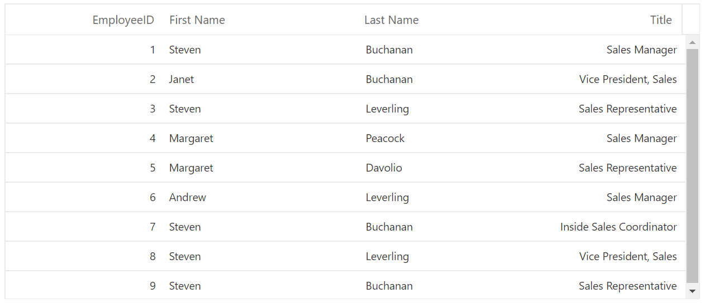
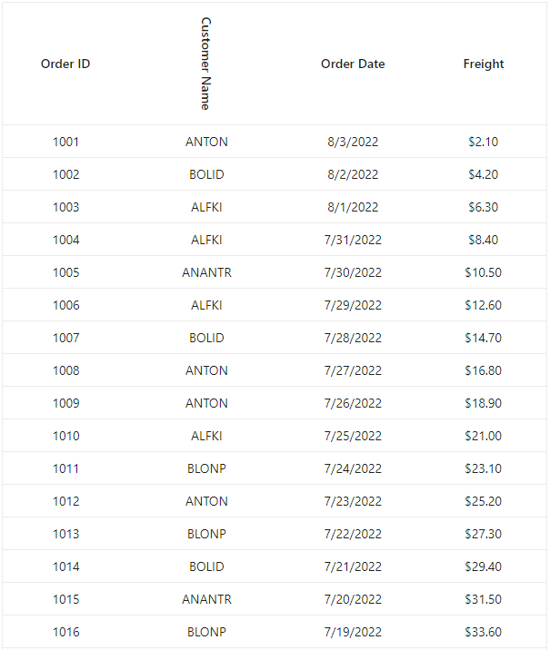
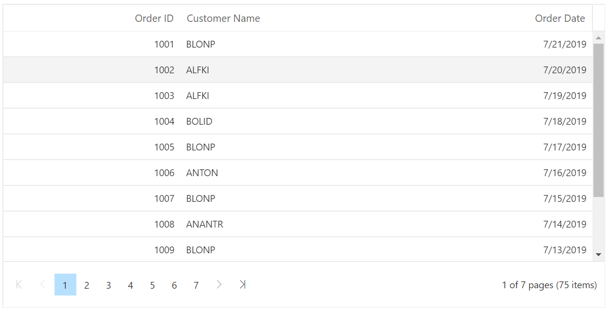
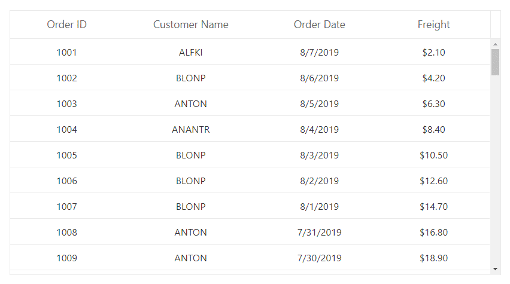
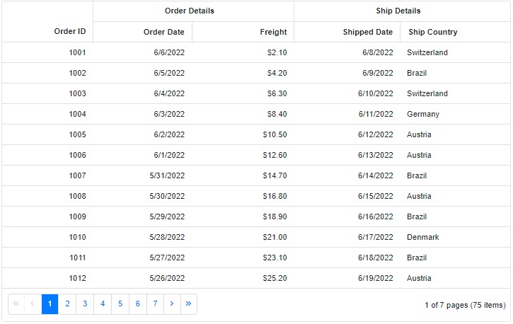

# Columns in Blazor DataGrid Component

The column definitions are used as the **DataSource** schema in the DataGrid. This plays a vital role in rendering column values in the required format. The DataGrid operations such as sorting, filtering and grouping etc. are performed based on column definitions. The [Field](https://help.syncfusion.com/cr/blazor/Syncfusion.Blazor.Grids.GridColumn.html#Syncfusion_Blazor_Grids_GridColumn_Field) property of **GridColumn** is necessary to map the datasource values in DataGrid columns.

> 1. If the column [Field](https://help.syncfusion.com/cr/blazor/Syncfusion.Blazor.Grids.GridColumn.html#Syncfusion_Blazor_Grids_GridColumn_Field) is not specified in the dataSource, the column values will be empty.
> 2. If the [Field](https://help.syncfusion.com/cr/blazor/Syncfusion.Blazor.Grids.GridColumn.html#Syncfusion_Blazor_Grids_GridColumn_Field) name contains “dot” operator, it is considered as complex binding.
> 3. It is must to define the [Field](https://help.syncfusion.com/cr/blazor/Syncfusion.Blazor.Grids.GridColumn.html#Syncfusion_Blazor_Grids_GridColumn_Field) property for a [Template](https://help.syncfusion.com/cr/blazor/Syncfusion.Blazor.Grids.GridColumn.html#Syncfusion_Blazor_Grids_GridColumn_Template) column, to perform CRUD or Data Operations such as filtering, searching etc.

## Auto generation

The [Columns](https://help.syncfusion.com/cr/blazor/Syncfusion.Blazor.Grids.ColumnModel.html#Syncfusion_Blazor_Grids_ColumnModel_Columns) are automatically generated when [Columns](https://help.syncfusion.com/cr/blazor/Syncfusion.Blazor.Grids.ColumnModel.html#Syncfusion_Blazor_Grids_ColumnModel_Columns) declaration is empty or undefined while initializing the datagrid. All the columns in the **DataSource** are bound as datagrid columns.

```cshtml
@using Syncfusion.Blazor.Grids

<SfGrid DataSource="@Orders"></SfGrid>

@code{
    public List<Order> Orders { get; set; }

    protected override void OnInitialized()
    {
        Orders = Enumerable.Range(1, 75).Select(x => new Order()
        {
            OrderID = 1000 + x,
            CustomerID = (new string[] { "ALFKI", "ANANTR", "ANTON", "BLONP", "BOLID" })[new Random().Next(5)],
            Freight = 2.1 * x,
            OrderDate = DateTime.Now.AddDays(-x),
        }).ToList();
    }

    public class Order
    {
        public int? OrderID { get; set; }
        public string CustomerID { get; set; }
        public DateTime? OrderDate { get; set; }
        public double? Freight { get; set; }
    }
}
```

### Set column options to auto generated columns

Column Options like (column type, etc) can be assigned specifically to auto generated columns using the [DataBound](https://help.syncfusion.com/cr/blazor/Syncfusion.Blazor.Grids.GridEvents-1.html#Syncfusion_Blazor_Grids_GridEvents_1_DataBound) event of the grid.

In the following sample, `Type` and `Fomat` is set to the OrderDate column using the `DataBound` event of the Grid.

```cshtml
@using Syncfusion.Blazor.Grids

<SfGrid  @ref="Grid" DataSource="@Orders" Height="315" Toolbar="@(new List<string>() { "Add", "Delete", "Update", "Cancel" })">
    <GridEvents DataBound="DataBoundHandler" TValue="Order"></GridEvents>
    <GridEditSettings AllowAdding="true" AllowEditing="true" AllowDeleting="true"></GridEditSettings>
</SfGrid>

@code{
    public List<Order> Orders { get; set; }
    private SfGrid<Order> Grid;
    protected override void OnInitialized()
    {
        Orders = Enumerable.Range(1, 75).Select(x => new Order()
        {
            OrderID = 1000 + x,
            CustomerID = (new string[] { "ALFKI", "ANANTR", "ANTON", "BLONP", "BOLID" })[new Random().Next(5)],
            Freight = 2.1 * x,
            OrderDate = DateTime.Now.AddDays(-x),
        }).ToList();
    }

    public class Order
    {
        public int? OrderID { get; set; }
        public string CustomerID { get; set; }
        public DateTime? OrderDate { get; set; }
        public double? Freight { get; set; }
    }

    public void DataBoundHandler()
    {
        for (var i = 0; i < Grid.Columns.Count; i++) {
            if(Grid.Columns[i].Field == "OrderDate") {
                Grid.Columns[i].Type= ColumnType.Date;
            }
            if (Grid.Columns[i].Type == ColumnType.Date) {
                Grid.Columns[i].Format = "d";
            }
        }
        Grid.RefreshColumnsAsync();
    }
}
```

## Dynamic column building

It is possible to dynamically build and customize each of the DataGrid column using the type of the model.

You can refer the following code example to achieve this.

```cshtml
@using Syncfusion.Blazor.Grids

<SfGrid DataSource="@OrderData">
    <GridEditSettings AllowEditing="true" AllowAdding="true" AllowDeleting="true"></GridEditSettings>
    <GridColumns>
        @foreach (var prop in typeof(Order).GetProperties())
        {
            <GridColumn Field="@prop.Name" IsPrimaryKey="@(prop.Name == "OrderID")" AllowEditing="@prop.CanWrite"></GridColumn>
        }
    </GridColumns>
</SfGrid>

@code{
    public List<Order> OrderData = new List<Order>
    {
        new Order() { OrderID = 10248, CustomerID = "VINET", EmployeeID = 4 },
        new Order() { OrderID = 10249, CustomerID = "TOMSP", EmployeeID = 5 },
        new Order() { OrderID = 10250, CustomerID = "HANAR", EmployeeID = 6 }
    };

    public class Order
    {
        public int? OrderID { get; set; }
        public string CustomerID { get; set; }
        public int? EmployeeID { get; set; }
    }
}
```

The following image represents DataGrid with dynamically build columns,


## Dynamic column binding using ExpandoObject

It is possible to build a column dynamically without knowing the model type during compile time. This can be achieved by binding data to the grid as a list of `ExpandoObject`.

In the following sample, columns are built dynamically using the `ExpandoObject`.

```cshtml
@using System.Dynamic
@using Syncfusion.Blazor.Grids
@using Syncfusion.Blazor.Buttons

<SfGrid TValue="ExpandoObject" DataSource=@GridData>
    <GridColumns>
        @if (GridData != null && GridData.Any())
        {
            foreach (var item in (IDictionary<string, object>)GridData.First())
            {
                <GridColumn Field="@item.Key"></GridColumn>
            }
        }
    </GridColumns>
</SfGrid>

@code {
    private List<ExpandoObject> GridData = GenerateNewData();

    private static List<ExpandoObject> GenerateNewData()
    {
        var data = new List<ExpandoObject>();
        var random = new Random();
        var ColCount = random.Next(2, 6);
        var ColNames = new string[ColCount];

        // Generate random number of columns.
        for (var col = 0; col < ColCount; col++)
        {
            ColNames[col] = "Col" + random.Next(0, 5000);
        }
        s
        // Generate 25 rows based on the generated columns name.
        for (var row = 0; row < 25; row++)
        {
            dynamic item = new ExpandoObject();
            var dict = (IDictionary<string, object>)item;
            for (var col = 0; col < ColCount; col++)
            {
                dict[ColNames[col]] = random.Next(0, 10000);
            }
            data.Add(item);
        }
        return data;
    }
}

```

## Complex data binding

You can achieve complex data binding in the DataGrid by using the dot(.) operator in the column.field. In the following examples, **Name.FirstName** and **Name.LastName** are complex data.

> You can also use the **nameof** for complex columns instead of assigning static text for the `Field` property.
> ```cshtml
> <GridColumn Field="@(nameof(EmployeeData.EmployeeName) + "." + nameof(EmployeeName.FirstName))" HeaderText="First Name" Width="150"></GridColumn>
> ```

```cshtml
@using Syncfusion.Blazor.Grids

<SfGrid DataSource="@Employees" Height="315">
    <GridColumns>
        <GridColumn Field=@nameof(EmployeeData.EmployeeID) HeaderText="EmployeeID" TextAlign="TextAlign.Right" Width="120"></GridColumn>
        <GridColumn Field="Name.FirstName" HeaderText="First Name" Width="150"></GridColumn>
        <GridColumn Field="Name.LastName" HeaderText="Last Name"Width="130"></GridColumn>
        <GridColumn Field=@nameof(EmployeeData.Title) HeaderText="Title" Format="C2" TextAlign="TextAlign.Right" Width="120"></GridColumn>
    </GridColumns>
</SfGrid>

@code{
    public List<EmployeeData> Employees { get; set; }

    protected override void OnInitialized()
    {
    Employees = Enumerable.Range(1, 9).Select(x => new EmployeeData()
    {
        EmployeeID = x,
        Name = new EmployeeName() {
            FirstName = (new string[] { "Nancy", "Andrew", "Janet", "Margaret", "Steven" })[new Random().Next(5)],
            LastName =(new string[] { "Davolio", "Fuller", "Leverling", "Peacock", "Buchanan" })[new Random().Next(5)]
        },
        Title = (new string[] { "Sales Representative", "Vice President, Sales", "Sales Manager",
                                              "Inside Sales Coordinator" })[new Random().Next(4)],
    }).ToList();
    }

    public class EmployeeData
    {
        public int? EmployeeID { get; set; }
        public EmployeeName Name { get; set; }
        public string Title { get; set; }
    }

    public class EmployeeName
    {
        public string FirstName { get; set; }
        public string LastName { get; set; }
    }
}
```

The following image represents complex data binding


>For OData and ODataV4 adaptors, you need to add expand query to the query property (of DataGrid) to load the complex data.

### ExpandoObject Complex data binding

Before proceeding this, learn about [ExpandoObject Binding](https://blazor.syncfusion.com/documentation/datagrid/data-binding/#expandoobject-binding). You can achieve ExpandoObject complex data binding in the DataGrid by using the dot(.) operator in the column.field. In the following examples, `CustomerID.Name` and `ShipCountry.Country` are complex data.

```cshtml
@using Syncfusion.Blazor.Grids
@using System.Dynamic

<SfGrid DataSource="@Orders" AllowPaging="true" AllowFiltering="true" AllowSorting="true" AllowGrouping="true" Toolbar="@ToolbarItems">
    <GridEditSettings AllowAdding="true" AllowDeleting="true" AllowEditing="true"></GridEditSettings>
    <GridColumns>
        <GridColumn Field="OrderID" HeaderText="Order ID" IsPrimaryKey="true" TextAlign="TextAlign.Right" Width="120"></GridColumn>
        <GridColumn Field="CustomerID.Name" HeaderText="Customer Name" Width="120"></GridColumn>
        <GridColumn Field="Freight" HeaderText="Freight" Format="C2" TextAlign="TextAlign.Right" Width="120"></GridColumn>
        <GridColumn Field="OrderDate" HeaderText=" Order Date" Format="d" TextAlign="TextAlign.Right" Width="130" Type="ColumnType.Date"></GridColumn>
        <GridColumn Field="ShipCountry.Country" HeaderText="Ship Country"  Width="150"></GridColumn>
        <GridColumn Field="Verified" HeaderText="Active" DisplayAsCheckBox="true" Width="150"></GridColumn>
    </GridColumns>
</SfGrid>

@code {
    public List<ExpandoObject> Orders { get; set; } = new List<ExpandoObject>();
    private List<string> ToolbarItems = new List<string>() { "Add", "Edit", "Delete", "Update", "Cancel" };

    protected override void OnInitialized()
    {
        Orders = Enumerable.Range(1, 75).Select((x) =>
        {
            dynamic d = new ExpandoObject();
            dynamic customerName = new ExpandoObject();
            dynamic countryName = new ExpandoObject();
            d.OrderID = 1000 + x;
            customerName.Name = (new string[] { "ALFKI", "ANANTR", "ANTON", "BLONP", "BOLID" })[new Random().Next(5)];
            d.CustomerID = customerName;
            d.Freight = (new double[] { 2, 1, 4, 5, 3 })[new Random().Next(5)] * x;
            d.OrderDate = (new DateTime[] { new DateTime(2010, 11, 5), new DateTime(2018, 10, 3), new DateTime(1995, 9, 9), new DateTime(2012, 8, 2), new DateTime(2015, 4, 11) })[new Random().Next(5)];
            countryName.Country = (new string[] { "USA", "UK" })[new Random().Next(2)];
            d.ShipCountry = countryName;
            d.Verified = (new bool[] { true, false })[new Random().Next(2)];

            return d;
        }).Cast<ExpandoObject>().ToList<ExpandoObject>();

    }
}
```

> * you can perform the Data operations and CRUD operations for Complex ExpandoObject binding fields too.

The following image represents ExpandoObject complex data binding


### DynamicObject Complex data binding

Before proceeding this, learn about [DynamicObject Binding](https://blazor.syncfusion.com/documentation/datagrid/data-binding/#dynamicobject-binding). You can achieve DynamicObject complex data binding in the datagrid by using the dot(.) operator in the column.field. In the following examples, `CustomerID.Name` and `ShipCountry.Country` are complex data.

```cshtml
@using Syncfusion.Blazor.Grids
@using System.Dynamic

<SfGrid DataSource="@Orders" AllowPaging="true" AllowFiltering="true" AllowSorting="true" AllowGrouping="true" Toolbar="@ToolbarItems">
    <GridEditSettings AllowAdding="true" AllowDeleting="true" AllowEditing="true"></GridEditSettings>
    <GridColumns>
        <GridColumn Field="OrderID" HeaderText="Order ID" IsPrimaryKey="true" TextAlign="TextAlign.Right" Width="120"></GridColumn>
        <GridColumn Field="CustomerID.Name" HeaderText="Customer Name" Width="150"></GridColumn>
        <GridColumn Field="OrderDate" HeaderText="Order Date" Format="d" Type="ColumnType.Date" TextAlign="TextAlign.Right" EditType="EditType.DatePickerEdit" Width="130"></GridColumn>
        <GridColumn Field="Freight" HeaderText="Freight" Format="C2" TextAlign="TextAlign.Right" Width="120"></GridColumn>
        <GridColumn Field="ShipCountry.Country" HeaderText="Ship Country" Width="150"></GridColumn>
    </GridColumns>
</SfGrid>

@code {
    private List<string> ToolbarItems = new List<string>() { "Add", "Edit", "Delete", "Update", "Cancel" };
    public List<DynamicDictionary> Orders = new List<DynamicDictionary>() { };
    protected override void OnInitialized()
    {
        Orders = Enumerable.Range(1, 1075).Select((x) =>
        {
            dynamic d = new DynamicDictionary();
            dynamic combo = new DynamicDictionary();
            dynamic countryName = new DynamicDictionary();
            d.OrderID = 1000 + x;
            combo.Name = (new string[] { "ALFKI", "ANANTR", "ANTON", "BLONP", "BOLID" })[new Random().Next(5)];
            d.CustomerID = combo;
            d.Freight = (new double[] { 2, 1, 4, 5, 3 })[new Random().Next(5)] * x;
            d.OrderDate = DateTime.Now.AddDays(-x);
            countryName.Country = (new string[] { "USA", "UK" })[new Random().Next(2)];
            d.ShipCountry = countryName;
            return d;
        }).Cast<DynamicDictionary>().ToList<DynamicDictionary>();
    }
    public class DynamicDictionary : DynamicObject
    {
        Dictionary<string, object> dictionary = new Dictionary<string, object>();

        public override bool TryGetMember(GetMemberBinder binder, out object result)
        {
            string name = binder.Name;
            return dictionary.TryGetValue(name, out result);
        }
        public override bool TrySetMember(SetMemberBinder binder, object value)
        {
            dictionary[binder.Name] = value;
            return true;
        }

        public override System.Collections.Generic.IEnumerable<string> GetDynamicMemberNames()
        {
            return this.dictionary?.Keys;
        }
    }
}
```

> * you can perform the Data operations and CRUD operations for Complex DynamicObject binding fields too.

The following image represents DynamicObject complex data binding


## Foreign key column

Foreign key column can be enabled by using [ForeignDataSource](https://help.syncfusion.com/cr/blazor/Syncfusion.Blazor.Grids.GridColumn.html), [ForeignKeyField](https://help.syncfusion.com/cr/blazor/Syncfusion.Blazor.Grids.GridColumn.html#Syncfusion_Blazor_Grids_GridColumn_ForeignKeyField) and [ForeignKeyValue](https://help.syncfusion.com/cr/blazor/Syncfusion.Blazor.Grids.GridColumn.html#Syncfusion_Blazor_Grids_GridColumn_ForeignKeyValue) properties of **GridForeignColumn** directive.

* [ForeignDataSource](https://help.syncfusion.com/cr/blazor/Syncfusion.Blazor.Grids.GridColumn.html) - Defines the foreign data.
* [ForeignKeyField](https://help.syncfusion.com/cr/blazor/Syncfusion.Blazor.Grids.GridColumn.html#Syncfusion_Blazor_Grids_GridColumn_ForeignKeyField) - Defines the mapping column name to the foreign data.
* [ForeignKeyValue](https://help.syncfusion.com/cr/blazor/Syncfusion.Blazor.Grids.GridColumn.html#Syncfusion_Blazor_Grids_GridColumn_ForeignKeyValue) - Defines the display field from the foreign data.

### Foreign key column - Local Data

In the following example, **Employee Name** is a foreign column which shows **FirstName** column from foreign data.

```cshtml
@using Syncfusion.Blazor.Grids

<SfGrid DataSource="@Orders" Height="315">
    <GridColumns>
        <GridColumn Field=@nameof(Order.OrderID) HeaderText="Order ID" TextAlign="TextAlign.Right" Width="120"></GridColumn>
        <GridForeignColumn Field=@nameof(Order.EmployeeID) HeaderText="Employee Name" ForeignKeyValue="FirstName" ForeignDataSource="@Employees" Width="150"></GridForeignColumn>
        <GridColumn Field=@nameof(Order.OrderDate) HeaderText="Order Date" Format="d" Type="ColumnType.Date" TextAlign="TextAlign.Right" Width="130"></GridColumn>
        <GridColumn Field=@nameof(Order.Freight) HeaderText="Freight" Format="C2" TextAlign="TextAlign.Right" Width="120"></GridColumn>
    </GridColumns>
</SfGrid>

@code{
    public List<Order> Orders { get; set; }
    public List<EmployeeData> Employees { get; set; }

    protected override void OnInitialized()
    {
        Orders = Enumerable.Range(1, 75).Select(x => new Order()
        {
            OrderID = 1000 + x,
            EmployeeID = x,
            Freight = 2.1 * x,
            OrderDate = DateTime.Now.AddDays(-x),
        }).ToList();

        Employees = Enumerable.Range(1, 75).Select(x => new EmployeeData()
        {
            EmployeeID = x,
            FirstName = (new string[] { "Nancy", "Andrew", "Janet", "Margaret", "Steven" })[new Random().Next(5)],
        }).ToList();
    }

    public class Order
    {
        public int? OrderID { get; set; }
        public int? EmployeeID { get; set; }
        public DateTime? OrderDate { get; set; }
        public double? Freight { get; set; }
    }

    public class EmployeeData
    {
        public int? EmployeeID { get; set; }
        public string FirstName { get; set; }
    }
}
```

### ForeignKey Column - Remote Data

In the following example, **Employee Name** is a foreign column which shows **FirstName** column from foreign data.

```cshtml
@using Syncfusion.Blazor
@using Syncfusion.Blazor.Grids
@using Syncfusion.Blazor.Grids.Internal

<SfGrid DataSource="@Orders" Height="250">
    <GridColumns>
        <GridColumn Field=@nameof(Order.OrderID) HeaderText="Order ID" TextAlign="TextAlign.Right" Width="120"></GridColumn>
        <GridForeignColumn TValue="EmployeeData" Field=@nameof(Order.EmployeeID) HeaderText="Employee Name" ForeignKeyValue="FirstName" Width="150">
            <Syncfusion.Blazor.Data.SfDataManager Url="https://js.syncfusion.com/demos/ejServices/Wcf/Northwind.svc/Employees" CrossDomain="true" Adaptor="Adaptors.ODataAdaptor">
            </Syncfusion.Blazor.Data.SfDataManager>
        </GridForeignColumn>
        <GridColumn Field=@nameof(Order.OrderDate) HeaderText="Order Date" Format="d" Type="ColumnType.Date" TextAlign="TextAlign.Right" Width="130"></GridColumn>
        <GridColumn Field=@nameof(Order.Freight) HeaderText="Freight" Format="C2" TextAlign="TextAlign.Right" Width="120"></GridColumn>
    </GridColumns>
</SfGrid>


@code{

    public List<Order> Orders { get; set; }

    protected override void OnInitialized()
    {
        Orders = Enumerable.Range(1, 75).Select(x => new Order()
        {
            OrderID = 1000 + x,
            EmployeeID = x,
            Freight = 2.1 * x,
            OrderDate = DateTime.Now.AddDays(-x),
        }).ToList();
    }

    public class Order
    {
        public int? OrderID { get; set; }
        public int? EmployeeID { get; set; }
        public DateTime? OrderDate { get; set; }
        public double? Freight { get; set; }
    }

    public class EmployeeData
    {
        public int? EmployeeID { get; set; }
        public string FirstName { get; set; }
    }
}
```

The following image represents foreign key column


> * For remote data, the sorting and grouping is done based on [ForeignKeyField](https://help.syncfusion.com/cr/blazor/Syncfusion.Blazor.Grids.GridColumn.html#Syncfusion_Blazor_Grids_GridColumn_ForeignKeyField) instead of [ForeignKeyValue](https://help.syncfusion.com/cr/blazor/Syncfusion.Blazor.Grids.GridColumn.html#Syncfusion_Blazor_Grids_GridColumn_ForeignKeyValue).
> * If [ForeignKeyField](https://help.syncfusion.com/cr/blazor/Syncfusion.Blazor.Grids.GridColumn.html#Syncfusion_Blazor_Grids_GridColumn_ForeignKeyField) is not defined, then the column uses [Field](https://help.syncfusion.com/cr/blazor/Syncfusion.Blazor.Charts.ChartSeries.html#Syncfusion_Blazor_Charts_ChartSeries_StackingGroup) property of **GridColumn** tag helper.

### Prevent filter query generation for foreignkey column

By default, a filter query for the foreignkey column will be generated based on the foreignkey value. You can prevent the default filter query generation for the foreignkey column and add the custom filter query. This can be achieved by setting the [PreventFilterQuery](https://help.syncfusion.com/cr/blazor/Syncfusion.Blazor.Grids.ActionEventArgs-1.html#Syncfusion_Blazor_Grids_ActionEventArgs_1_PreventFilterQuery) argument of the [OnActionBegin](https://help.syncfusion.com/cr/blazor/Syncfusion.Blazor.Grids.GridEvents-1.html#Syncfusion_Blazor_Grids_GridEvents_1_OnActionBegin) event to true.

In the following code sample, you can prevent default filter query generation using the `PreventFilterQuery` property and generate a custom filter query to execute a filter operation.

```cshtml
@using System.ComponentModel.DataAnnotations;
@using Syncfusion.Blazor.Data
@using Syncfusion.Blazor.Grids
@using Syncfusion.Blazor.DropDowns
@using Newtonsoft.Json

<SfGrid ID="Grid" @ref="Grid" Query="@currentQuery" TValue="Book" Toolbar="@ToolbarItems" Height="100%" AllowPaging="true" AllowSorting="true" AllowFiltering="true">
    <GridPageSettings PageSize="10" PageSizes="true"></GridPageSettings>
    <SfDataManager Url="http://localhost:64956/odata/books" Adaptor="Adaptors.ODataV4Adaptor"></SfDataManager>
    <GridEvents TValue="Book" OnActionBegin="OnActionBegin"/>
    <GridEditSettings AllowAdding="true" AllowEditing="true" AllowDeleting="true" Mode="@EditMode.Normal"></GridEditSettings>
    <GridColumns>
        <GridColumn Field=@nameof(Book.Id) IsPrimaryKey="true" Width="150"></GridColumn>
        <GridForeignColumn TValue="Customer" Field=@nameof(Book.CustomerId)  AllowFiltering="true" ForeignKeyValue="Name" ForeignKeyField="Id" HeaderText="Name" Width="100" >
            <SfDataManager Url="http://localhost:64956/odata/customers" Adaptor="Adaptors.ODataV4Adaptor"></SfDataManager>
        </GridForeignColumn>
        <GridColumn Field=@nameof(Book.CreditLimit) Width="200" EditType="EditType.NumericEdit"></GridColumn>
        <GridColumn Field=@nameof(Book.Active) Width="200" EditType="EditType.BooleanEdit"></GridColumn>
    </GridColumns>
</SfGrid>

@code{
    SfGrid<Book> Grid { get; set; }
    private Query currentQuery = new Query();
    public List<string> ToolbarItems = new List<string>() { "Add", "Edit", "Delete", "Update", "Cancel", "Search" };
 
    private void OnActionBegin(Syncfusion.Blazor.Grids.ActionEventArgs<Book> args)
    {  
        if (args.RequestType == Syncfusion.Blazor.Grids.Action.Filtering)
        {
            if (String.Equals(args.CurrentFilteringColumn, nameof(Book.CustomerId), StringComparison.OrdinalIgnoreCase))
            {
                args.PreventFilterQuery = true;
                currentQuery = new Query().Where("Customer/Name", args.CurrentFilterObject.Operator.ToString().ToLower(), args.CurrentFilterObject.Value, true, true);
            }
        }
    }

    public class Book
    {
        [Key]
        public Guid Id { get; set; }
        public Guid CustomerId { get; set; }
        public Guid CustomerId1 { get; set; }
        public virtual Customer Customer { get; set; }
        public int CreditLimit { get; set; }
        public bool Active { get; set; }
        public bool IsDeleted { get; set; }
    }

    public class Customer
    {
        [Key]
        public Guid Id { get; set; }
        public string Name { get; set; }      
        [JsonIgnore]
        public List<Book> CustomerBooks { get; set; }
    }
}

```

> You can find the fully working sample [here](https://github.com/SyncfusionExamples/blazor-datagrid-prevent-query-generation-for-foriegnkey-column).

### Customize filter UI in foreignkey column

The Grid has an option to render the custom component in the filter menu. This can be achieved using the [FilterTemplate](https://help.syncfusion.com/cr/blazor/Syncfusion.Blazor.Grids.GridColumn.html#Syncfusion_Blazor_Grids_GridColumn_FilterTemplate) feature of the Grid.

> For all filter types other than FilterBar, filtering parameters will be sent in the form of `PredicateModel<T>`. Here, T represents the type of `ForeignKeyValue` property when using the foreignkey column.

The following sample demonstrates how to render the custom filter UI in the foreign key column. Here, `SfDropDownList` is rendered in the filter menu of the Employee Name foreign key column.

```cshtml
@using Syncfusion.Blazor.Grids
@using Syncfusion.Blazor.DropDowns

<SfGrid DataSource="@Orders" Height="315" AllowFiltering="true" AllowPaging>
    <GridFilterSettings Type="Syncfusion.Blazor.Grids.FilterType.Menu"></GridFilterSettings>
    <GridColumns>
        <GridColumn Field=@nameof(Order.OrderID) HeaderText="Order ID" TextAlign="TextAlign.Right" Width="120"></GridColumn>
        <GridForeignColumn Field=@nameof(Order.EmployeeID) HeaderText="Employee Name" ForeignKeyValue="FirstName" ForeignDataSource="@Employees" Width="150">
            <FilterTemplate>
                <SfDropDownList Placeholder="FirstName" ID="FirstName" @bind-Value="@((context as PredicateModel<string>).Value)" TItem="EmployeeData" TValue="string" DataSource="@Employees">
                    <DropDownListFieldSettings Value="FirstName" Text="FirstName"></DropDownListFieldSettings>
                </SfDropDownList>                
            </FilterTemplate>
        </GridForeignColumn>
        <GridColumn Field=@nameof(Order.OrderDate) HeaderText="Order Date" Format="d" Type="ColumnType.Date" TextAlign="TextAlign.Right" Width="130"></GridColumn>
        <GridColumn Field=@nameof(Order.Freight) HeaderText="Freight" Format="C2" TextAlign="TextAlign.Right" Width="120"></GridColumn>
    </GridColumns>
</SfGrid>

@code{
    public List<Order> Orders { get; set; }
    public List<EmployeeData> Employees { get; set; }
   
    protected override void OnInitialized()
    {
        Orders = Enumerable.Range(1, 75).Select(x => new Order()
        {
            OrderID = 1000 + x,
            EmployeeID = x,
            Freight = 2.1 * x,
            OrderDate = DateTime.Now.AddDays(-x),
        }).ToList();

        Employees = Enumerable.Range(1, 75).Select(x => new EmployeeData()
        {
            EmployeeID = x,
            FirstName = (new string[] { "Nancy", "Andrew", "Janet", "Margaret", "Steven" })[new Random().Next(5)],
        }).ToList();
    }

    public class Order
    {
        public int? OrderID { get; set; }
        public int? EmployeeID { get; set; }
        public DateTime? OrderDate { get; set; }
        public double? Freight { get; set; }
    }

    public class EmployeeData
    {
        public int? EmployeeID { get; set; }
        public string FirstName { get; set; }
    }    
}
```

> [View Sample in GitHub.](https://github.com/SyncfusionExamples/blazor-datagrid-customize-filter-ui-in-foreignkey-column)

## Header text

By default, column header title is displayed from column [Field](https://help.syncfusion.com/cr/blazor/Syncfusion.Blazor.Grids.GridColumn.html#Syncfusion_Blazor_Grids_GridColumn_Field) value. To override the default header title, you have to define the **HeaderText** value in the [HeaderText](https://help.syncfusion.com/cr/blazor/Syncfusion.Blazor.Grids.GridColumn.html#Syncfusion_Blazor_Grids_GridColumn_HeaderText) property of **GridColumn** directive.

```cshtml
@using Syncfusion.Blazor.Grids

<SfGrid DataSource="@Orders" Height="315">
    <GridColumns>
        <GridColumn Field=@nameof(Order.OrderID) HeaderText="Order ID" TextAlign="TextAlign.Right" Width="120"></GridColumn>
        <GridColumn Field=@nameof(Order.CustomerID) HeaderText="Customer Name" Width="150"></GridColumn>
        <GridColumn Field=@nameof(Order.OrderDate) HeaderText="Order Date" Format="d" Type="ColumnType.Date" TextAlign="TextAlign.Right" Width="130"></GridColumn>
        <GridColumn Field=@nameof(Order.Freight) HeaderText="Freight" Format="C2" TextAlign="TextAlign.Right" Width="120"></GridColumn>
    </GridColumns>
</SfGrid>

@code{
    public List<Order> Orders { get; set; }

    protected override void OnInitialized()
    {
        Orders = Enumerable.Range(1, 75).Select(x => new Order()
        {
            OrderID = 1000 + x,
            CustomerID = (new string[] { "ALFKI", "ANANTR", "ANTON", "BLONP", "BOLID" })[new Random().Next(5)],
            Freight = 2.1 * x,
            OrderDate = DateTime.Now.AddDays(-x),
        }).ToList();
    }

    public class Order {
        public int? OrderID { get; set; }
        public string CustomerID { get; set; }
        public DateTime? OrderDate { get; set; }
        public double? Freight { get; set; }
    }
}
```


> * If both the [Field](https://help.syncfusion.com/cr/blazor/Syncfusion.Blazor.Grids.GridColumn.html#Syncfusion_Blazor_Grids_GridColumn_Field) and [HeaderText](https://help.syncfusion.com/cr/blazor/Syncfusion.Blazor.Grids.GridColumn.html#Syncfusion_Blazor_Grids_GridColumn_HeaderText)
are not defined in the column, the column renders with “empty” header text.

## Header template

> Before adding header template to the datagrid, it is recommended to go through the [template](./templates/#templates) section topic to configure the template.

To know about **Header Template** in Blazor DataGrid Component, you can check this video.



The Header Template has options to display custom element value or content in the header. You can use the [HeaderTemplate](https://help.syncfusion.com/cr/blazor/Syncfusion.Blazor.Grids.GridColumn.html#Syncfusion_Blazor_Grids_GridColumn_HeaderTemplate)  of the [GridColumn](https://help.syncfusion.com/cr/aspnetcore-blazor/Syncfusion.Blazor.Grids.GridColumn.html) component to specify the custom content.

```cshtml
@using Syncfusion.Blazor.Grids

<SfGrid DataSource="@Employees" AllowPaging="true" Height="315">
    <GridColumns>
        <GridColumn Field=@nameof(EmployeeData.EmployeeID) TextAlign="TextAlign.Right" Width="120">
            <HeaderTemplate>
                <div>
                    <span class="e-icon-userlogin e-icons employee"></span> Emp ID
                </div>
            </HeaderTemplate>
        </GridColumn>
        <GridColumn Field=@nameof(EmployeeData.FirstName) HeaderText="First Name" Width="130"></GridColumn>
        <GridColumn Field=@nameof(EmployeeData.OrderDate) HeaderText="Last Name" Format="d" TextAlign="TextAlign.Right" Width="120">
            <HeaderTemplate>
                <div>
                    <span class="e-icon-calender e-icons headericon"></span> Order Date
                </div>
            </HeaderTemplate>
        </GridColumn>
        <GridColumn Field=@nameof(EmployeeData.City) HeaderText="City" Width="150"></GridColumn>
        <GridColumn Field=@nameof(EmployeeData.Country) HeaderText="Country" TextAlign="TextAlign.Right" Width="150"></GridColumn>
    </GridColumns>
</SfGrid>

<style>

    @@font-face {
        font-family: 'ej2-headertemplate';
        src: url(data:application/x-font-ttf;charset=utf-8;base64,AAEAAAAKAIAAAwAgT1MvMj1vTFIAAAEoAAAAVmNtYXDS2c5qAAABjAAAAEBnbHlmQmNFrQAAAdQAAANoaGVhZBRdbkIAAADQAAAANmhoZWEIUQQEAAAArAAAACRobXR4DAAAAAAAAYAAAAAMbG9jYQCOAbQAAAHMAAAACG1heHABHgENAAABCAAAACBuYW1lohGZJQAABTwAAAKpcG9zdA2o3w0AAAfoAAAAQAABAAAEAAAAAFwEAAAAAAAD9AABAAAAAAAAAAAAAAAAAAAAAwABAAAAAQAATBXy9l8PPPUACwQAAAAAANillKkAAAAA2KWUqQAAAAAD9APzAAAACAACAAAAAAAAAAEAAAADAQEAEQAAAAAAAgAAAAoACgAAAP8AAAAAAAAAAQQAAZAABQAAAokCzAAAAI8CiQLMAAAB6wAyAQgAAAIABQMAAAAAAAAAAAAAAAAAAAAAAAAAAAAAUGZFZABA5wLpYAQAAAAAXAQAAAAAAAABAAAAAAAABAAAAAQAAAAEAAAAAAAAAgAAAAMAAAAUAAMAAQAAABQABAAsAAAABgAEAAEAAucC6WD//wAA5wLpYP//AAAAAAABAAYABgAAAAIAAQAAAAAAjgG0ABEAAAAAA8kD8wADAAcACwAPABMAFwAbAB8AIwAnACsALwAzADcAOwBPAGsAACUVIzUjFSM1IxUjNSMVIzUjFSM1JRUjNSMVIzUjFSM1IxUjNSMVIzUlFSM1IxUjNSMVIzUjFSM1IxUjNQMVHwYhPwcRITcjDwghNS8HIzUjFSE1IwN2U1NTU1RTU1NTAuxTU1NTVFNTU1MC7FNTU1NUU1NTU1QCAwUGBggIA0QICAcHBQQBAvxsp30ICAcHAgUDAQEDlAECBAUHBwgIfVP+YFOzU1NTU1NTU1NTU6dUVFRUVFRUVFRUplNTU1NTU1NTU1P+NgQIBwcGBAMCAQIEBQcHAwgCdPoBAgQFAwcHCIF8CQgHBgUEAgFTU1MABAAAAAAD9APeADQAbQCuAQAAAAEfCDc1Lwc1PwIPBy8HHww3HwQPATMVPwc1Lx0jDwMfAgUdAR8GBTUzLxQjDx0BFxUfEDsBPxA1Nyc1LxIPEhUCCg8OGxcVExANCgMBAQMDCQQDAgECAxESEhMTExUUFRQTFBISEhEHCwYHCAkKCw0NDw8SuQQGAwIBAgRxlgsKCQcGBAMBAgMDAwUFBQcGBwgICQkKCgsKDAsMDQwNDQ4NDg45BQUDAQEEA/1eAgUGBwkKCwHjeggKDhEUFxs1FRMSEA4NCwoJBwcJBjwODg0ODQ0MDQwLDAoLCgoJCQgIBwYHBQUFAwMDAgEBAQECAgYICg0ODxISFBUXFwwMDA0MDQwMFxcVFBISDw4MCwgGAgIBAQICAwcJCw0PERITFRUXDAwMDA0NDAwMDAsXFRQTEQ8ODQoIBgICAVQEAwgJCgsMCwwbEBAREREZEA8VDAwKCgoIBwYFAwIBAQIDBQYHCAoUFQwLCwsLCgoJCAcGMwsWFhUVHB3QAQIEBggICgueDg4ODg0NDA0MCwsLCwoKCQgJBwgGBwUFBAQDAwECCw8NDxETCrIlawsKCAgGBAIB0AoLCwoLCQgNCAkLDA0NDg4ODg4ZFAIBAwMEBAUGBgYIBwkICQoKCwsLDAwMDA0ODQ4ODgH7DQwMDBgWFRQTERAODAoIBgICAQECAgYICgwOEBETFBUWGAwMDA0MDQwMCxcWFRMSEA8NDAkHAwIBAQEBAQECAwMICwwOEBETFBUWFwwMDQAAAAASAN4AAQAAAAAAAAABAAAAAQAAAAAAAQASAAEAAQAAAAAAAgAHABMAAQAAAAAAAwASABoAAQAAAAAABAASACwAAQAAAAAABQALAD4AAQAAAAAABgASAEkAAQAAAAAACgAsAFsAAQAAAAAACwASAIcAAwABBAkAAAACAJkAAwABBAkAAQAkAJsAAwABBAkAAgAOAL8AAwABBAkAAwAkAM0AAwABBAkABAAkAPEAAwABBAkABQAWARUAAwABBAkABgAkASsAAwABBAkACgBYAU8AAwABBAkACwAkAacgZWoyLWhlYWRlcnRlbXBsYXRlUmVndWxhcmVqMi1oZWFkZXJ0ZW1wbGF0ZWVqMi1oZWFkZXJ0ZW1wbGF0ZVZlcnNpb24gMS4wZWoyLWhlYWRlcnRlbXBsYXRlRm9udCBnZW5lcmF0ZWQgdXNpbmcgU3luY2Z1c2lvbiBNZXRybyBTdHVkaW93d3cuc3luY2Z1c2lvbi5jb20AIABlAGoAMgAtAGgAZQBhAGQAZQByAHQAZQBtAHAAbABhAHQAZQBSAGUAZwB1AGwAYQByAGUAagAyAC0AaABlAGEAZABlAHIAdABlAG0AcABsAGEAdABlAGUAagAyAC0AaABlAGEAZABlAHIAdABlAG0AcABsAGEAdABlAFYAZQByAHMAaQBvAG4AIAAxAC4AMABlAGoAMgAtAGgAZQBhAGQAZQByAHQAZQBtAHAAbABhAHQAZQBGAG8AbgB0ACAAZwBlAG4AZQByAGEAdABlAGQAIAB1AHMAaQBuAGcAIABTAHkAbgBjAGYAdQBzAGkAbwBuACAATQBlAHQAcgBvACAAUwB0AHUAZABpAG8AdwB3AHcALgBzAHkAbgBjAGYAdQBzAGkAbwBuAC4AYwBvAG0AAAAAAgAAAAAAAAAKAAAAAAAAAAAAAAAAAAAAAAAAAAAAAAADAQIBAwEEAAtCVF9DYWxlbmRhcghlbXBsb3llZQAA) format('truetype');
        font-weight: normal;
        font-style: normal;
    }

    .e-grid .e-icon-userlogin::before {
        font-family: 'ej2-headertemplate';
        width: 15px !important;
        content: '\e702';
    }

    .e-grid .e-icon-calender::before {
        font-family: 'ej2-headertemplate';
        width: 15px !important;
        content: '\e960';
    }
</style>

@code{
    public List<EmployeeData> Employees { get; set; }

    protected override void OnInitialized()
    {
        Employees = Enumerable.Range(1, 9).Select(x => new EmployeeData()
        {
            EmployeeID = x,
            FirstName = (new string[] { "Nancy", "Andrew", "Janet", "Margaret", "Steven" })[new Random().Next(5)],
            OrderDate = DateTime.Now.AddDays(-x),
            City = (new string[] { "Seattle", "Tacoma", "Redmond", "Kirkland", "London" })[new Random().Next(5)],
            Country = (new string[] { "USA", "UK"})[new Random().Next(2)],
        }).ToList();
    }

    public class EmployeeData
    {
        public int? EmployeeID { get; set; }
        public string FirstName { get; set; }
        public DateTime? OrderDate { get; set; }
        public string  City{ get; set; }
        public string Country { get; set; }
    }
}
```

The following screenshot represents the Header Template.


## Change the orientation of header text

You can change the orientation of the header text by using the [CustomAttributes](https://help.syncfusion.com/cr/blazor/Syncfusion.Blazor.Grids.GridColumn.html#Syncfusion_Blazor_Grids_GridColumn_CustomAttributes) property of the [GridColumn](https://help.syncfusion.com/cr/blazor/Syncfusion.Blazor.Grids.GridColumn.html).

Follow the steps below to rotate the header text of a particular column.

**Step1:**

Add the custom CSS class to a particular column by using the `CustomAttributes` property of the `GridColumn`.

```cshtml
    <GridColumn Field=@nameof(Order.CustomerID) HeaderText="Customer Name" TextAlign="TextAlign.Center" CustomAttributes="@(new Dictionary<string, object>(){ { "class", "textorientationclass" }})" Width="150"></GridColumn>
```

**Step2:**

Create a CSS class with orientation style for the grid header cell.

```cshtml
    .e-grid .e-columnheader .e-headercell.textorientationclass .e-headercelldiv { // Rotate a particular headertext
        transform: rotate(90deg);    
    }
```

**Step3:**

Change the header cell height with respect to the orientation of headertext using the following code.

```cshtml
function setHeaderHeight(args) {
    var textWidth = document.querySelector(".textorientationclass > div").scrollWidth; // Obtain the width of the headerText content.
    var header = document.querySelectorAll(".e-columnheader");
    for (var i = 0; i < header.length; i++) {
        (header.item(i)).style.height = textWidth + 'px'; // Assign the obtained textWidth as the height of the column header.
    }
}
```

This is demonstrated in the following sample:

```cshtml
@using Syncfusion.Blazor.Grids
@inject IJSRuntime IJSRuntime

<SfGrid DataSource="@Orders">
    <GridEvents DataBound="DataBound" Created="Created" TValue="Order"></GridEvents>
    <GridColumns>
        <GridColumn Field=@nameof(Order.OrderID) HeaderText="Order ID" TextAlign="TextAlign.Center" Width="120"></GridColumn>
        <GridColumn Field=@nameof(Order.CustomerID) HeaderText="Customer Name" TextAlign="TextAlign.Center" CustomAttributes="@(new Dictionary<string, object>(){ { "class", "textorientationclass" }})" Width="150"></GridColumn>
        <GridColumn Field=@nameof(Order.OrderDate) HeaderText="Order Date" Format="d" Type="ColumnType.Date" TextAlign="TextAlign.Center" Width="130"></GridColumn>
        <GridColumn Field=@nameof(Order.Freight) HeaderText="Freight" Format="C2" TextAlign="TextAlign.Center" Width="120"></GridColumn>
    </GridColumns>
</SfGrid>
<style>
    .e-grid .e-columnheader .e-headercell.textorientationclass .e-headercelldiv { // Rotate a particular headertext
        transform: rotate(90deg);      
    }
</style>
@code{
    public List<Order> Orders { get; set; }
    public bool InitialRender = false;
    public void Created()
    {
        InitialRender = true;
    }
    public void DataBound()
    {
        if (InitialRender) //Call the JS method by checking for initial Grid rendering
        {
            InitialRender = false;
            IJSRuntime.InvokeAsync<object>("setHeaderHeight");
        }
    }
    protected override void OnInitialized()
    {
        Orders = Enumerable.Range(1, 75).Select(x => new Order()
        {
            OrderID = 1000 + x,
            CustomerID = (new string[] { "ALFKI", "ANANTR", "ANTON", "BLONP", "BOLID" })[new Random().Next(5)],
            Freight = 2.1 * x,
            OrderDate = DateTime.Now.AddDays(-x),
        }).ToList();
    }

    public class Order
    {
        public int? OrderID { get; set; }
        public string CustomerID { get; set; }
        public DateTime? OrderDate { get; set; }
        public double? Freight { get; set; }
    }
}
```



> [View Sample in GitHub.](https://github.com/SyncfusionExamples/blazor-datagrid-change-orientation-of-header-text)

## Column type

Column type can be specified using the [Type](https://help.syncfusion.com/cr/blazor/Syncfusion.Blazor.Grids.GridColumn.html#Syncfusion_Blazor_Grids_GridColumn_Type) property. It specifies the type of data the column binds.

If the format is defined for a column, the column uses type to select the appropriate format option (number or date).

DataGrid column supports the following types:

* String
* Number
* Boolean
* Date
* DateTime
* CheckBox

> If the [Type](https://help.syncfusion.com/cr/blazor/Syncfusion.Blazor.Grids.GridColumn.html#Syncfusion_Blazor_Grids_GridColumn_Type) is not defined, it will be determined from the first record of the [DataSource](https://help.syncfusion.com/cr/blazor/Syncfusion.Blazor.Grids.GridColumn.html). In case, if the first record of the [DataSource](https://help.syncfusion.com/cr/blazor/Syncfusion.Blazor.Grids.GridColumn.html) is null/blank value for a column then it is necessary to define the [Type](https://help.syncfusion.com/cr/blazor/Syncfusion.Blazor.Grids.GridColumn.html#Syncfusion_Blazor_Grids_GridColumn_Type) for that column.

### Difference between Boolean type and CheckBox type column

* Use GridColumn [Type](https://help.syncfusion.com/cr/blazor/Syncfusion.Blazor.Grids.GridColumn.html#Syncfusion_Blazor_Grids_GridColumn_Type) as Boolean if you want to bind boolean values from your datasource and/or edit Boolean property value from your Type.
* Use CheckBox as GridColumn [Type](https://help.syncfusion.com/cr/blazor/Syncfusion.Blazor.Grids.GridColumn.html#Syncfusion_Blazor_Grids_GridColumn_Type) for the purpose of selection/deselection of the whole row.
* The selection type of the [GridSelectionSettings](https://help.syncfusion.com/cr/blazor/Syncfusion.Blazor.Grids.GridSelectionSettings.html) will be multiple when the GridColumn [Type](https://help.syncfusion.com/cr/blazor/Syncfusion.Blazor.Grids.GridColumn.html#Syncfusion_Blazor_Grids_GridColumn_Type) is a checkbox. This is the default behavior.
* When more than one column has the column type as a checkbox, the grid will automatically enable the other column's checkbox when selecting one column checkbox.

>See also section [Render boolean values as checkbox](https://blazor.syncfusion.com/documentation/datagrid/columns/#render-boolean-values-as-checkbox) to render boolean values as checkbox in GridColumn.

## Format

To format cell values based on specific culture, use the [Format](https://help.syncfusion.com/cr/blazor/Syncfusion.Blazor.Grids.GridColumn.html#Syncfusion_Blazor_Grids_GridColumn_Format) property of **GridColumn** component . The DataGrid uses **Internalization** library to format **number** and **date**.
values.

```cshtml
@using Syncfusion.Blazor.Grids

<SfGrid DataSource="@Orders" Height="315">
    <GridColumns>
        <GridColumn Field=@nameof(Order.OrderID) HeaderText="Order ID" TextAlign="TextAlign.Right" Width="120"></GridColumn>
        <GridColumn Field=@nameof(Order.CustomerID) HeaderText="Customer Name" Width="150"></GridColumn>
        <GridColumn Field=@nameof(Order.OrderDate) HeaderText="Order Date" Format="d" Type="ColumnType.Date" TextAlign="TextAlign.Right" Width="130"></GridColumn>
        <GridColumn Field=@nameof(Order.Freight) HeaderText="Freight" Format="C2" TextAlign="TextAlign.Right" Width="120"></GridColumn>
    </GridColumns>
</SfGrid>

@code{
    public List<Order> Orders { get; set; }

    protected override void OnInitialized()
    {
        Orders = Enumerable.Range(1, 75).Select(x => new Order()
        {
            OrderID = 1000 + x,
            CustomerID = (new string[] { "ALFKI", "ANANTR", "ANTON", "BLONP", "BOLID" })[new Random().Next(5)],
            Freight = 2.1 * x,
            OrderDate = DateTime.Now.AddDays(-x),
        }).ToList();
    }

    public class Order {
        public int? OrderID { get; set; }
        public string CustomerID { get; set; }
        public DateTime? OrderDate { get; set; }
        public double? Freight { get; set; }
    }
}

```

> By default, the **number** and **date** values are formatted in **en-US** locale.

### Number formatting

The number or integer values can be formatted using the following format strings.

Format |Description |Remarks
-----|-----|-----
N | Denotes numeric type. | The numeric format is followed by integer value as N2, N3. etc which denotes the number of precision to be allowed.
C | Denotes currency type. | The currency format is followed by integer value as C2, C3. etc which denotes the number of precision to be allowed.
P | Denotes percentage type | The percentage format expects the input value to be in the range of 0 to 1. For example the cell value **0.2** is formatted as **20%**. The percentage format is followed by integer value as P2, P3. etc which denotes the number of precision to be allowed.

### Date formatting

You can format date values either using built-in date format string.

For built-in date format, you can specify the [Format](https://help.syncfusion.com/cr/blazor/Syncfusion.Blazor.Grids.GridColumn.html#Syncfusion_Blazor_Grids_GridColumn_Format) property of **GridColumn** as string.

## Visibility

You can hide any particular column in DataGrid before rendering by defining the [Visible](https://help.syncfusion.com/cr/blazor/Syncfusion.Blazor.Grids.GridColumn.html#Syncfusion_Blazor_Grids_GridColumn_Visible) property of **GridColumn** as false. In the following sample, **Freight** column is defined as visible false.

```cshtml
@using Syncfusion.Blazor.Grids

<SfGrid DataSource="@Orders" Height="315">
    <GridColumns>
        <GridColumn Field=@nameof(Order.OrderID) HeaderText="Order ID" TextAlign="TextAlign.Right" Width="120"></GridColumn>
        <GridColumn Field=@nameof(Order.CustomerID) HeaderText="Customer Name" Width="150"></GridColumn>
        <GridColumn Field=@nameof(Order.OrderDate) HeaderText="Order Date" Format="d" Type="ColumnType.Date" TextAlign="TextAlign.Right" Width="130"></GridColumn>
        <GridColumn Field=@nameof(Order.Freight) HeaderText="Freight" Format="C2" TextAlign="TextAlign.Right" Visible="false" Width="120"></GridColumn>
    </GridColumns>
</SfGrid>

@code{
    public List<Order> Orders { get; set; }

    protected override void OnInitialized()
    {
        Orders = Enumerable.Range(1, 75).Select(x => new Order()
        {
            OrderID = 1000 + x,
            CustomerID = (new string[] { "ALFKI", "ANANTR", "ANTON", "BLONP", "BOLID" })[new Random().Next(5)],
            Freight = 2.1 * x,
            OrderDate = DateTime.Now.AddDays(-x),
        }).ToList();
    }

    public class Order {
        public int? OrderID { get; set; }
        public string CustomerID { get; set; }
        public DateTime? OrderDate { get; set; }
        public double? Freight { get; set; }
    }
}
```

The following screenshot represents the DataGrid with Freight column set to visible false.


## Width

The column width can be set using the **Width** property of the **GridColumn**. The unit of the width value can be either in pixel (px) or percentage (%). By default, the grid tables use `table-layout:fixed` to speed up the table rendering.

* Columns will respect the width value irrespective of its cell content width.
* Columns with no width set will share the available space equally.
* When all columns are provided with a width value and the cumulative width of all columns is greater than the grid element width, a horizontal scrollbar will be shown.
* When only some columns are provided with the width value and if the cumulative width of the columns is greater than the grid element width then columns with no width might be invisible as their width is zero.
* When only some columns are provided with the width value and if the cumulative width of the columns is lesser than the grid element width then columns with no width will share the available space evenly.
* When no width is provided in a column and MinWidth property is defined, if the cumulative width of the column is greater than the grid element width then MinWidth would be used as the column width to avoid it from becoming invisible.
* When AllowResizing is enabled in the Data Grid, columns whose width is unspecified will be defined as 200px.

## Autofit columns

You can auto fit a column interactively by double clicking the right border of the header cells.

### Autofit columns at initial rendering

**AutoFit** resizes the column to fit the widest cell’s content without wrapping. To enable AutoFit for specific columns, you need to set the AutoFit property to true.

```cshtml
@using Syncfusion.Blazor.Grids

<SfGrid DataSource="@Orders" Height="315">
    <GridColumns>
        <GridColumn Field=@nameof(Order.OrderID) HeaderText="Order ID" TextAlign="TextAlign.Right" Width="120"></GridColumn>
        <GridColumn Field=@nameof(Order.CustomerID) HeaderText="Customer Name" Width="150" AutoFit="true"></GridColumn>
        <GridColumn Field=@nameof(Order.OrderDate) HeaderText="Order Date" Format="d" AutoFit="true" Type="ColumnType.Date" TextAlign="TextAlign.Right" Width="130"></GridColumn>
        <GridColumn Field=@nameof(Order.Freight) HeaderText="Freight" Format="C2" TextAlign="TextAlign.Right" Width="120"></GridColumn>
    </GridColumns>
</SfGrid>

@code{
    public List<Order> Orders { get; set; }

    protected override void OnInitialized()
    {
        Orders = Enumerable.Range(1, 75).Select(x => new Order()
        {
            OrderID = 1000 + x,
            CustomerID = (new string[] { "ALFKI", "ANANTR", "ANTON", "BLONP", "BOLID" })[new Random().Next(5)],
            Freight = 2.1 * x,
            OrderDate = DateTime.Now.AddDays(-x),
        }).ToList();
    }

    public class Order
    {
        public int? OrderID { get; set; }
        public string CustomerID { get; set; }
        public DateTime? OrderDate { get; set; }
        public double? Freight { get; set; }
    }
}
```

In the following Image, **Autofit** Property is set to true for CustomerName and OrderDate.


### Autofit columns by method

The **AutoFitColumns** method resizes the column to fit the widest cell's content without wrapping. You can autofit a specific column at initial rendering by invoking the **AutoFitColumns** method in the [DataBound](https://help.syncfusion.com/cr/blazor/Syncfusion.Blazor.Grids.SfGrid-1.html) event.

```cshtml
@using Syncfusion.Blazor.Grids

<SfGrid @ref="Grid" DataSource="@Orders" Height="315" Width="540">
    <GridEvents DataBound="DataboundHandler" TValue="Order"></GridEvents>
    <GridColumns>
        <GridColumn Field=@nameof(Order.OrderID) HeaderText="Order ID" TextAlign="TextAlign.Right" Width="120"></GridColumn>
        <GridColumn Field=@nameof(Order.CustomerID) HeaderText="Customer Name" Width="150"></GridColumn>
        <GridColumn Field=@nameof(Order.OrderDate) HeaderText="Order Date" Format="d" Type="ColumnType.Date" TextAlign="TextAlign.Right" Width="130"></GridColumn>
        <GridColumn Field=@nameof(Order.Freight) HeaderText="Freight" Format="C2" TextAlign="TextAlign.Right" Width="120"></GridColumn>
    </GridColumns>
</SfGrid>

@code{
    private SfGrid<Order> Grid;

    public List<Order> Orders { get; set; }

    protected override void OnInitialized()
    {
        Orders = Enumerable.Range(1, 75).Select(x => new Order()
        {
            OrderID = 1000 + x,
            CustomerID = (new string[] { "ALFKI", "ANANTR", "ANTON", "BLONP", "BOLID" })[new Random().Next(5)],
            Freight = 2.1 * x,
            OrderDate = DateTime.Now.AddDays(-x),
        }).ToList();
    }

    public class Order
    {
        public int? OrderID { get; set; }
        public string CustomerID { get; set; }
        public DateTime? OrderDate { get; set; }
        public double? Freight { get; set; }
    }

    public void DataboundHandler(object args)
    {
        this.Grid.AutoFitColumns(new string[] { "OrderDate", "Freight" });
    }
}
```

The following image represents AutoFit column by method


> You can autofit all the columns by invoking the **AutoFitColumns** method without column names.

### Autofit columns when changing column visibility using column chooser

You can auto fit columns when the column visibility is changed using column choose by calling [AutoFitColumnsAsync](https://help.syncfusion.com/cr/blazor/Syncfusion.Blazor.Grids.SfGrid-1.html#Syncfusion_Blazor_Grids_SfGrid_1_AutoFitColumnsAsync) method in the [OnActionComplete](https://help.syncfusion.com/cr/blazor/Syncfusion.Blazor.Grids.SfGrid-1.html) event. Using `RequestType` property in event args, you can differentiate actions and in the below code `AutoFitColumnsAsync` method is called when `RequestType` is `ColumnState`.

```cshtml

@using Syncfusion.Blazor.Grids;

<SfGrid @ref="Grid" DataSource="@Employees" ShowColumnChooser="true" Toolbar=@ToolbarItems>
    <GridEvents OnActionComplete="Complete" TValue="EmployeeData"></GridEvents>
    <GridColumns>
        <GridColumn Field=@nameof(EmployeeData.EmployeeID) TextAlign="TextAlign.Center" HeaderText="Employee ID" Width="120"></GridColumn>
        <GridColumn Field=@nameof(EmployeeData.FirstName) HeaderText="First Name" Width="130"></GridColumn>
        <GridColumn Field=@nameof(EmployeeData.LastName) HeaderText="Last Name" Width="130"></GridColumn>
        <GridColumn Field=@nameof(EmployeeData.Title) HeaderText="Title" Width="120"></GridColumn>
        <GridColumn Field=@nameof(EmployeeData.HireDate) HeaderText="Hire Date" Format="d" TextAlign="TextAlign.Right" Width="150"></GridColumn>
    </GridColumns>
</SfGrid>

@code{
    public string[] ToolbarItems = new string[] { "ColumnChooser" };
    SfGrid<EmployeeData> Grid{ get; set; }
    public List<EmployeeData> Employees { get; set; }

    public async Task Complete(ActionEventArgs<EmployeeData> Args)
    {
        if(Args.RequestType == Syncfusion.Blazor.Grids.Action.ColumnState)
        {
            await Task.Delay(200);
            await Grid.AutoFitColumnsAsync();
        }
    }

    protected override void OnInitialized()
    {
        Employees = Enumerable.Range(1, 9).Select(x => new EmployeeData()
        {
            EmployeeID = x,
            FirstName = (new string[] { "Nancy", "Andrew", "Janet", "Margaret", "Steven" })[new Random().Next(5)],
            LastName = (new string[] { "Davolio", "Fuller", "Leverling", "Peacock", "Buchanan" })[new Random().Next(5)],
            Title = (new string[] { "Sales Representative", "Vice President, Sales", "Sales Manager",
                                    "Inside Sales Coordinator" })[new Random().Next(4)],
            HireDate = DateTime.Now.AddDays(-x),
        }).ToList();
    }

    public class EmployeeData
    {
        public int? EmployeeID { get; set; }
        public string FirstName { get; set; }
        public string LastName { get; set; }
        public string Title { get; set; }
        public DateTime? HireDate { get; set; }
    }
}

```

## Responsive columns

You can toggle column visibility based on media queries. This can be achieved by defining Media Queries in the [HideAtMedia](https://help.syncfusion.com/cr/blazor/Syncfusion.Blazor.Grids.GridColumn.html#Syncfusion_Blazor_Grids_GridColumn_HideAtMedia) Column property. The [HideAtMedia](https://help.syncfusion.com/cr/blazor/Syncfusion.Blazor.Grids.GridColumn.html#Syncfusion_Blazor_Grids_GridColumn_HideAtMedia) accepts valid [Media Queries](http://cssmediaqueries.com/what-are-css-media-queries.html).

In the following sample code, for OrderID column - HideAtMedia property value is set as (min-width: 700px). This hides the OrderID column when the browser screen width is less than 700px.

```cshtml
@using Syncfusion.Blazor.Grids

<SfGrid DataSource="@Orders" Height="315">
    <GridColumns>
        <GridColumn Field=@nameof(Order.OrderID) HeaderText="Order ID" HideAtMedia="(min-width: 700px)" TextAlign="TextAlign.Center" Width="120"></GridColumn> // Column hides when browser screen width is less than 700px
        <GridColumn Field=@nameof(Order.CustomerID) HeaderText="Customer Name" HideAtMedia="(max-width: 500px)" Width="150" TextAlign="TextAlign.Center"></GridColumn> // Column shows when browser screen width is less than or equal to 500px
        <GridColumn Field=@nameof(Order.OrderDate) HeaderText="Order Date" HideAtMedia="(min-width: 500px)" Format="d" Type="ColumnType.Date" TextAlign="TextAlign.Center" Width="130"></GridColumn> // Column hides when browser screen width is less than 500px
        <GridColumn Field=@nameof(Order.Freight) HeaderText="Freight" Format="C2" TextAlign="TextAlign.Center" Width="120"></GridColumn> // Column is always displayed
    </GridColumns>
</SfGrid>

@code{
    public List<Order> Orders { get; set; }

    protected override void OnInitialized()
    {
        Orders = Enumerable.Range(1, 75).Select(x => new Order()
        {
            OrderID = 1000 + x,
            CustomerID = (new string[] { "ALFKI", "ANANTR", "ANTON", "BLONP", "BOLID" })[new Random().Next(5)],
            Freight = 2.1 * x,
            OrderDate = DateTime.Now.AddDays(-x),
        }).ToList();
    }

    public class Order
    {
        public int? OrderID { get; set; }
        public string CustomerID { get; set; }
        public DateTime? OrderDate { get; set; }
        public double? Freight { get; set; }
    }
}
```

The following GIF shows the responsive columns behavior when the window is resized,

## Controlling datagrid actions

You can enable or disable datagrid action for a particular column by using the [AllowFiltering](https://help.syncfusion.com/cr/blazor/Syncfusion.Blazor.Grids.GridColumn.html#Syncfusion_Blazor_Grids_GridColumn_AllowFiltering), [AllowGrouping](https://help.syncfusion.com/cr/blazor/Syncfusion.Blazor.Grids.GridColumn.html#Syncfusion_Blazor_Grids_GridColumn_AllowGrouping), [AllowSorting](https://help.syncfusion.com/cr/blazor/Syncfusion.Blazor.Grids.GridColumn.html#Syncfusion_Blazor_Grids_GridColumn_AllowSorting), [AllowReordering](https://help.syncfusion.com/cr/blazor/Syncfusion.Blazor.Grids.GridColumn.html#Syncfusion_Blazor_Grids_GridColumn_AllowReordering), and [AllowEditing](https://help.syncfusion.com/cr/blazor/Syncfusion.Blazor.Grids.GridColumn.html#Syncfusion_Blazor_Grids_GridColumn_AllowEditing) properties.

The following sample code shows DataGrid actions disabled for particular columns,

```cshtml
@using Syncfusion.Blazor.Grids

<SfGrid DataSource="@Orders" Height="315" AllowFiltering="true" AllowGrouping="true" AllowSorting="true" AllowReordering="true">
    <GridEditSettings AllowAdding="true" AllowDeleting="true" AllowEditing="true" Mode=EditMode.Normal></GridEditSettings>
    <GridColumns>
        <GridColumn Field=@nameof(Order.OrderID) HeaderText="Order ID" TextAlign="TextAlign.Center" IsPrimaryKey="true" Width="120" AllowGrouping="false"></GridColumn>
        <GridColumn Field=@nameof(Order.CustomerID) HeaderText="Customer Name" Width="150" TextAlign="TextAlign.Center"></GridColumn>
        <GridColumn Field=@nameof(Order.OrderDate) HeaderText="Order Date" Format="d" Type="ColumnType.Date" TextAlign="TextAlign.Center" Width="130" AllowEditing="false" AllowFiltering="false" AllowReordering="false"></GridColumn>
        <GridColumn Field=@nameof(Order.Freight) HeaderText="Freight" Format="C2" TextAlign="TextAlign.Center" Width="120" AllowSorting="false"></GridColumn>
    </GridColumns>
</SfGrid>

@code{
    public List<Order> Orders { get; set; }

    protected override void OnInitialized()
    {
        Orders = Enumerable.Range(1, 75).Select(x => new Order()
        {
            OrderID = 1000 + x,
            CustomerID = (new string[] { "ALFKI", "ANANTR", "ANTON", "BLONP", "BOLID" })[new Random().Next(5)],
            Freight = 2.1 * x,
            OrderDate = DateTime.Now.AddDays(-x),
        }).ToList();
    }

    public class Order
    {
        public int? OrderID { get; set; }
        public string CustomerID { get; set; }
        public DateTime? OrderDate { get; set; }
        public double? Freight { get; set; }
    }
}
```

The following GIF shows the DataGrid actions for different columns,


## Show/hide columns by external button

You can show or hide DataGrid columns dynamically using external buttons by invoking the [ShowColumns](https://help.syncfusion.com/cr/blazor/Syncfusion.Blazor.Grids.SfGrid-1.html#Syncfusion_Blazor_Grids_SfGrid_1_ShowColumns_System_Object_System_String_) or [HideColumns](https://help.syncfusion.com/cr/blazor/Syncfusion.Blazor.Grids.SfGrid-1.html#Syncfusion_Blazor_Grids_SfGrid_1_HideColumns_System_Object_System_String_) method.

The following sample code demonstrates showing and hiding of columns using their header texts **("Order Date", "Freight")** on button click,

```cshtml
@using Syncfusion.Blazor.Buttons
@using Syncfusion.Blazor.Grids

<SfButton OnClick="Show" CssClass="e-primary" Content="Show"></SfButton>
<SfButton OnClick="Hide" CssClass="e-primary" Content="Hide"></SfButton>
<SfGrid @ref="DefaultGrid" DataSource="@Orders" Height="315">
    <GridColumns>
        <GridColumn Field=@nameof(Order.OrderID) HeaderText="Order ID" TextAlign="TextAlign.Center" Width="150"></GridColumn>
        <GridColumn Field=@nameof(Order.CustomerID) HeaderText="Customer Name" Width="150" TextAlign="TextAlign.Center"></GridColumn>
        <GridColumn Field=@nameof(Order.OrderDate) HeaderText="Order Date" Format="d" Type="ColumnType.Date" TextAlign="TextAlign.Center" Width="130"></GridColumn>
        <GridColumn Field=@nameof(Order.Freight) HeaderText="Freight" Format="C2" TextAlign="TextAlign.Center" Width="120"></GridColumn>
    </GridColumns>
</SfGrid>

@code{
    private SfGrid<Order> DefaultGrid;

    public List<Order> Orders { get; set; }

    public string[] ColumnItems = new string[] { "Order Date", "Freight" };

    protected override void OnInitialized()
    {
        Orders = Enumerable.Range(1, 75).Select(x => new Order()
        {
            OrderID = 1000 + x,
            CustomerID = (new string[] { "ALFKI", "ANANTR", "ANTON", "BLONP", "BOLID" })[new Random().Next(5)],
            Freight = 2.1 * x,
            OrderDate = DateTime.Now.AddDays(-x),
        }).ToList();
    }

    public class Order
    {
        public int? OrderID { get; set; }
        public string CustomerID { get; set; }
        public DateTime? OrderDate { get; set; }
        public double? Freight { get; set; }
    }

    public void Show()
    {
        // Show columns by its header text
        this.DefaultGrid.ShowColumns(ColumnItems);
    }

    public void Hide()
    {
        // Hide columns by its header text
        this.DefaultGrid.HideColumns(ColumnItems);
    }
}
```

The following GIF represents the showing/hiding DataGrid columns on button click,


<!-- ValueAccessor

The [`ValueAccessor`](https://help.syncfusion.com/cr/blazor/Syncfusion.Blazor.Grids.GridColumn.html) property is used to access/manipulate the value of the displayed data. You can achieve custom value formatting by using the [`ValueAccessor`](https://help.syncfusion.com/cr/blazor/Syncfusion.Blazor.Grids.GridColumn.html) property.

The following sample code demonstrates the displayed data manipulated for two columns using the [`ValueAccessor`](https://help.syncfusion.com/cr/blazor/Syncfusion.Blazor.Grids.GridColumn.html) property,

```cshtml
@using Syncfusion.Blazor.Grids

<SfGrid DataSource="@Orders" Height="315">
    <GridColumns>
        <GridColumn Field=@nameof(Order.OrderID) HeaderText="Order ID" TextAlign="TextAlign.Center" Width="150"></GridColumn>
        <GridColumn Field=@nameof(Order.CustomerID) HeaderText="Customer Name" Width="150" TextAlign="TextAlign.Center"></GridColumn>
        <GridColumn Field=@nameof(Order.OrderDate) HeaderText="Order Date" Format="d" Type="ColumnType.Date" TextAlign="TextAlign.Center" Width="130"></GridColumn>
        <GridColumn Field=@nameof(Order.Freight) HeaderText="Freight" Format="C2" TextAlign="TextAlign.Center" Width="120" ValueAccessor=@CurrencyFormatter></GridColumn>
    </GridColumns>
</SfGrid>

@code{
    public List<Order> Orders { get; set; }

    protected override void OnInitialized()
    {
        Orders = Enumerable.Range(1, 75).Select(x => new Order()
        {
            OrderID = 1000 + x,
            CustomerID = (new string[] { "ALFKI", "ANANTR", "ANTON", "BLONP", "BOLID" })[new Random().Next(5)],
            Freight = 2.1 * x,
            OrderDate = DateTime.Now.AddDays(-x),
        }).ToList();
    }

    public class Order
    {
        public int? OrderID { get; set; }
        public string CustomerID { get; set; }
        public DateTime? OrderDate { get; set; }
        public double? Freight { get; set; }
    }

    public string CurrencyFormatter(String Field, Object Data, Object Column)
    {
        return "€" + new List<string> Data["Freight"];
    }
}
```

The following image represents the Grid with manipulated column data. -->

<!-- Display array type columns

You can bind an array of objects in a column by using the [`ValueAccessor`](https://help.syncfusion.com/cr/blazor/Syncfusion.Blazor.Grids.GridColumn.html) property.

In the following sample code, the name field has an array of two objects, FirstName and LastName are joined and bound to a column using the [`ValueAccessor`](https://help.syncfusion.com/cr/blazor/Syncfusion.Blazor.Grids.GridColumn.html) property.

```cshtml
@using Syncfusion.Blazor.Grids

<SfGrid DataSource="@Employees">
    <GridColumns>
        <GridColumn Field=@nameof(EmployeeData.EmployeeID) HeaderText="Employee ID" TextAlign="TextAlign.Center" Width="120"></GridColumn>
        <GridColumn Field=@nameof(EmployeeData.Name) HeaderText="Full Name" TextAlign="TextAlign.Center" ValueAccessor=@ValueAccess Width="130"></GridColumn>
        <GridColumn Field=@nameof(EmployeeData.Title) HeaderText="Title" TextAlign="TextAlign.Center" Width="120"></GridColumn>
    </GridColumns>
</SfGrid>

@code{
    List<EmployeeData> Employees = new List<EmployeeData>
    {
        new EmployeeData() { EmployeeID = 1, Name = { FirstName = "Nancy", LastName = "Davolio" }, Title = "Vice President, Sales" },
        new EmployeeData() { EmployeeID = 2, Name = { FirstName = "Andrew", LastName = "Fuller" }, Title = "Sales Representative" },
        new EmployeeData() { EmployeeID = 3, Name = { FirstName = "Steven", LastName = "Buchanan" }, Title = "Sales Representative" },
        new EmployeeData() { EmployeeID = 4, Name = { FirstName = "Michael", LastName = "Suyama" }, Title = "Inside Sales Coordinator" },
        new EmployeeData() { EmployeeID = 5, Name = { FirstName = "Laura", LastName = "Callahan" }, Title = "Sales Manager" },
        new EmployeeData() { EmployeeID = 6, Name = { FirstName = "Anne", LastName = "Dodsworth" }, Title = "Sales Representative" },
        new EmployeeData() { EmployeeID = 7, Name = { FirstName = "Robert", LastName = "King" }, Title = "Sales Representative" },
        new EmployeeData() { EmployeeID = 8, Name = { FirstName = "Margaret", LastName = "Peacock" }, Title = "Sales Representative" }
    };

    public class EmployeeData
    {
        public int EmployeeID { get; set; }
        public EmployeeName Name { get; set; }
        public string Title { get; set; }
    }

    public class EmployeeName
    {
        public string FirstName { get; set; }
        public string LastName { get; set; }
    }

    public string ValueAccess(string Field, object Data, object Column)
    {
        return Data[Field].Select(s => s.LastName || s.FirstName).Join("");
    }
}
```

The following image represents the bound column data in Grid using ValueAccessor property -->

<!-- Expression column

You can achieve the expression column by using the [`ValueAccessor`](https://help.syncfusion.com/cr/blazor/Syncfusion.Blazor.Grids.GridColumn.html) property.

The following sample code demonstrates expression column achieved using [`ValueAccessor`](https://help.syncfusion.com/cr/blazor/Syncfusion.Blazor.Grids.GridColumn.html) for **Calories** column,

```cshtml
@using Syncfusion.Blazor.Grids

<SfGrid DataSource="@FoodInformation">
    <GridColumns>
        <GridColumn Field=@nameof(FoodData.FoodName) HeaderText="Food Name" TextAlign="TextAlign.Center" Width="120"></GridColumn>
        <GridColumn Field=@nameof(FoodData.Time) HeaderText="Intake Time" TextAlign="TextAlign.Center" Width="130"></GridColumn>
        <GridColumn Field=@nameof(FoodData.Protein) HeaderText="Protein" TextAlign="TextAlign.Center" Width="130"></GridColumn>
        <GridColumn Field=@nameof(FoodData.Fat) HeaderText="Fat" TextAlign="TextAlign.Center" Width="120"></GridColumn>
        <GridColumn Field=@nameof(FoodData.Carbohydrate) HeaderText="Carbohydrate" TextAlign="TextAlign.Center" Width="120"></GridColumn>
        <GridColumn HeaderText="Calorie" TextAlign="TextAlign.Center" ValueAccessor=@TotalCalories Width="120"></GridColumn>
    </GridColumns>
</SfGrid>

@code{
    List<FoodData> FoodInformation = new List<FoodData>
    {
        new FoodData() { FoodId = 1, Time = "8:40 AM", FoodName = "CHEESE BURGER", Protein = 15, Fat = 15, Carbohydrate = 28 },
        new FoodData() { FoodId = 2, Time = "10:30 AM", FoodName = "PIZZA", Protein = 15, Fat = 9, Carbohydrate = 8 },
        new FoodData() { FoodId = 3, Time = "12:45 PM", FoodName = "CHICKEN NOODLE", Protein = 4, Fat = 2, Carbohydrate = 9 },
        new FoodData() { FoodId = 4, Time = "5:30 PM", FoodName = "YOGURT", Protein = 10, Fat = 2, Carbohydrate = 43 },
        new FoodData() { FoodId = 5, Time = "6:30 PM", FoodName = "BEEF SANDWICH", Protein = 22, Fat = 13, Carbohydrate = 34 },
        new FoodData() { FoodId = 6, Time = "7:00 PM", FoodName = "CHICKEN BURGER", Protein = 15, Fat = 10, Carbohydrate = 25 },
        new FoodData() { FoodId = 7, Time = "8:00 PM", FoodName = "VEG BURGER", Protein = 14, Fat = 5, Carbohydrate = 53 },
        new FoodData() { FoodId = 8, Time = "9:00 PM", FoodName = "VEG SANDWICH", Protein = 20, Fat = 15, Carbohydrate = 24 },
        new FoodData() { FoodId = 9, Time = "11:00 PM", FoodName = "EGG BURGER", Protein = 25, Fat = 16, Carbohydrate = 35 },
    };

    public class FoodData
    {
        public int FoodId { get; set; }
        public string Time { get; set; }
        public string FoodName { get; set; }
        public int Protein { get; set; }
        public int Fat { get; set; }
        public int Carbohydrate { get; set; }
    }

    public int TotalCalories(string Field, FoodData Data, object Column)
    {
        return Data.Protein * 4 + Data.Fat * 9 + Data.Carbohydrate * 4;
    }
}
```

The following image represents expression column achieved in Grid -->

## Render boolean values as checkbox

To render boolean values as checkbox in columns, you need to set [DisplayAsCheckBox](https://help.syncfusion.com/cr/blazor/Syncfusion.Blazor.Grids.GridColumn.html#Syncfusion_Blazor_Grids_GridColumn_DisplayAsCheckBox) property as true.

The following sample code demonstrates [DisplayAsCheckBox](https://help.syncfusion.com/cr/blazor/Syncfusion.Blazor.Grids.GridColumn.html#Syncfusion_Blazor_Grids_GridColumn_DisplayAsCheckBox) property enabled for **Verified** column,

```cshtml
@using Syncfusion.Blazor.Grids

<SfGrid DataSource="@OrderData">
    <GridColumns>
        <GridColumn Field=@nameof(Order.OrderID) HeaderText="Order ID" TextAlign="TextAlign.Center" Width="120"></GridColumn>
        <GridColumn Field=@nameof(Order.CustomerID) HeaderText="Customer ID" TextAlign="TextAlign.Center" Width="130"></GridColumn>
        <GridColumn Field=@nameof(Order.Freight) HeaderText="Freight" TextAlign="TextAlign.Center" Width="130"></GridColumn>
        <GridColumn Field=@nameof(Order.ShipName) HeaderText="Ship Name" TextAlign="TextAlign.Center" Width="120"></GridColumn>
        <GridColumn Field=@nameof(Order.Verified) HeaderText="Verified" TextAlign="TextAlign.Center" DisplayAsCheckBox="true" Width="120"></GridColumn>
    </GridColumns>
</SfGrid>

@code{
    List<Order> OrderData = new List<Order>
    {
        new Order() { OrderID = 10248, CustomerID = "VINET", Freight = 32.38, ShipName = "Vins et alcools Chevalier", Verified = true },
        new Order() { OrderID = 10249, CustomerID = "TOMSP", Freight = 11.61, ShipName = "Toms Spezialitäten", Verified = false },
        new Order() { OrderID = 10250, CustomerID = "HANAR", Freight = 65.83, ShipName = "Hanari Carnes", Verified = true },
        new Order() { OrderID = 10251, CustomerID = "VICTE", Freight = 41.34, ShipName = "Victuailles en stock", Verified = false },
        new Order() { OrderID = 10252, CustomerID = "SUPRD", Freight = 51.3, ShipName = "Suprêmes délices", Verified = false },
        new Order() { OrderID = 10253, CustomerID = "HANAR", Freight = 58.17, ShipName = "Hanari Carnes", Verified = false },
        new Order() { OrderID = 10254, CustomerID = "CHOPS", Freight = 22.98, ShipName = "Chop-suey Chinese", Verified = true },
        new Order() { OrderID = 10255, CustomerID = "RICSU", Freight = 148.33, ShipName = "Richter Supermarket", Verified = true },
        new Order() { OrderID = 10256, CustomerID = "WELLI", Freight = 13.97, ShipName = "Wellington Importadora", Verified = false },
        new Order() { OrderID = 10257, CustomerID = "HILAA", Freight = 81.91, ShipName = "HILARION-Abastos", Verified = true }
    };
    public class Order
    {
        public int? OrderID { get; set; }
        public string CustomerID { get; set; }
        public double? Freight { get; set; }
        public string ShipName { get; set; }
        public bool Verified { get; set; }
    }
}
```

> Need to define [EditType](https://help.syncfusion.com/cr/blazor/Syncfusion.Blazor.Grids.ColumnModel.html#Syncfusion_Blazor_Grids_ColumnModel_EditType) as **EditType.BooleanEdit** to GridColumn to render checkbox while editing a boolean value.

```cshtml
<GridColumn Field=@nameof(Order.Verified) HeaderText="Verified" Type="ColumnType.Boolean" EditType="EditType.BooleanEdit" TextAlign="TextAlign.Center" DisplayAsCheckBox="true" Width="120"></GridColumn>
```

The following image represents the DisplayAsCheckBox enabled for a DataGrid column,


## Stacked column header

The Grid columns can be stacked or grouped in order to show multiple levels of column headers. This can be achieved by nesting the [GridColumn](https://help.syncfusion.com/cr/blazor/Syncfusion.Blazor.Grids.GridColumn.html#Syncfusion_Blazor_Grids_GridColumn) directive within another `GridColumn` directive.

In the following sample, the columns **Order Date**, and **Freight** are grouped under **Order Details** and the columns **Shipped Date**, and **Ship Country** are grouped under **Shipped Details**.

```cshtml
@using Syncfusion.Blazor.Grids

<SfGrid DataSource="@Orders" AllowPaging="true">
    <GridColumns>
        <GridColumn Field=@nameof(Order.OrderID) HeaderText="Order ID" TextAlign="TextAlign.Right" IsPrimaryKey="true" Width="120"></GridColumn>
        <GridColumn HeaderText="Order Details" TextAlign="TextAlign.Center">
            <GridColumns>
                <GridColumn Field="OrderDate" Width="130" HeaderText="Order Date" Format="d" TextAlign="TextAlign.Right" MinWidth="10"></GridColumn>
                <GridColumn Field="Freight" Width="135" Format="C2" TextAlign="TextAlign.Right" MinWidth="10">
                </GridColumn>
            </GridColumns>
        </GridColumn>
        <GridColumn HeaderText="Ship Details" TextAlign="TextAlign.Center">
            <GridColumns>
                <GridColumn Field="ShippedDate" Width="140" HeaderText="Shipped Date" Format="d" TextAlign="TextAlign.Right" MinWidth="10"></GridColumn>
                <GridColumn Field="ShipCountry" Width="145" HeaderText="Ship Country" MinWidth="10"></GridColumn>
            </GridColumns>
        </GridColumn>
    </GridColumns>
</SfGrid>

@code{
    public List<Order> Orders { get; set; }

    protected override void OnInitialized()
    {
        Orders = Enumerable.Range(1, 75).Select(x => new Order()
        {
            OrderID = 1000 + x,
            Freight = 2.1 * x,
            OrderDate = DateTime.Now.AddDays(-x),
            ShipCountry = (new string[] { "Denmark", "Brazil", "Germany", "Austria", "Switzerland" })[new Random().Next(5)],
            ShippedDate = DateTime.Now.AddDays(+x),
        }).ToList();
    }

    public class Order
    {
        public int? OrderID { get; set; }
        public DateTime? OrderDate { get; set; }
        public double? Freight { get; set; }
        public string ShipCountry { get; set; }
        public DateTime? ShippedDate { get; set; }
    }
}

```



## See also

* [How to create a Custom Grid Column component](https://www.syncfusion.com/kb/12703/blazor-grid-how-to-create-a-custom-grid-column-component)

> You can refer to the [Blazor DataGrid](https://www.syncfusion.com/blazor-components/blazor-datagrid) feature tour page for its groundbreaking feature representations. You can also explore [Blazor DataGrid example](https://blazor.syncfusion.com/demos/datagrid/overview?theme=bootstrap4) to understand how to present and manipulate data.
