# Custom Binding in Blazor DataGrid

Custom binding in the Syncfusion<sup style="font-size:70%">&reg;</sup> Blazor DataGrid provides a flexible data‑processing workflow that relies on a [CustomAdaptor](https://blazor.syncfusion.com/documentation/data/adaptors#writing-custom-adaptor) implementation instead of built‑in adaptors. The adaptor defines the logic required to retrieve, shape, and return data from any in‑memory source, service, or backend API. The [DataManager](https://help.syncfusion.com/cr/blazor/Syncfusion.Blazor.DataManager.html) manages the communication between the DataGrid and the adaptor and executes all data‑related operations through the adaptor’s overridden methods. These operations include **searching**, **sorting**, **filtering**, **paging**, **grouping**, **aggregates**, and **CRUD** actions.

The `CustomAdaptor` ensures complete control over the data pipeline before the processed collection is returned to the DataGrid. This section introduces the purpose of custom binding and explains how a `CustomAdaptor` and `DataManager` interact within a Blazor application to deliver a fully customizable data‑handling experience.

To learn more about **custom binding** in the DataGrid, refer to the available instructional video.



## What is CustomAdaptor?

A `CustomAdaptor` extends the data‑handling capabilities of the Syncfusion<sup style="font-size:70%">&reg;</sup> Blazor DataGrid by enabling a fully customizable data‑processing workflow. It is implemented by deriving from the [DataAdaptor](https://help.syncfusion.com/cr/blazor/Syncfusion.Blazor.DataAdaptor.html) or [DataAdaptor&lt;T&gt;](https://help.syncfusion.com/cr/blazor/Syncfusion.Blazor.DataAdaptor-1.html) class and provides complete control over how data is retrieved, transformed, and returned to the DataGrid. This adaptor is used when the data source requires specialized handling, relies on non‑standard endpoints, or incorporates domain‑specific logic that cannot be achieved through built‑in adaptors such as [WebApiAdaptor](https://blazor.syncfusion.com/documentation/data/adaptors#web-api-adaptor), [ODataV4Adaptor](https://blazor.syncfusion.com/documentation/data/adaptors#odatav4-adaptor), or [UrlAdaptor](https://blazor.syncfusion.com/documentation/data/adaptors#urladaptor).

The `CustomAdaptor` executes all data operations and CRUD logic through overridden methods, ensuring that each operation is applied according to application requirements. All requests originating from the `DataManager` pass through the adaptor, and the processed collection is returned in the required structure. This pattern ensures full control over the request pipeline and data‑shaping behavior inside the DataGrid.

**About DataAdaptor**

The `DataAdaptor` base class defines the method signatures for reading data and performing CRUD operations. A `CustomAdaptor` typically overrides these methods to integrate with custom services, domain layers, or in‑memory data sources.

The `DataAdaptor` class exposes both synchronous and asynchronous methods for all core operations:

```csharp
/// <summary>
/// Provides the base abstraction for customizing data operations in Syncfusion<sup style="font-size:70%">&reg;</sup> Blazor components.
/// Extend this class to implement custom logic for reading data, performing CRUD operations,
/// and processing actions such as searching, sorting, filtering, paging, grouping, and aggregating.
/// </summary>
public abstract class DataAdaptor
{
    /// <summary>Reads data synchronously based on the supplied request.</summary>
    public virtual object Read(DataManagerRequest dataManagerRequest, string key = null);

    /// <summary>Reads data asynchronously based on the supplied request.</summary>
    public virtual Task<object> ReadAsync(DataManagerRequest dataManagerRequest, string key = null);

    /// <summary>Inserts a record synchronously.</summary>
    public virtual object Insert(DataManager dataManager, object data, string key);

    /// <summary>Inserts a record asynchronously.</summary>
    public virtual Task<object> InsertAsync(DataManager dataManager, object data, string key);

    /// <summary>Removes a record synchronously.</summary>
    public virtual object Remove(DataManager dataManager, object data, string keyField, string key);

    /// <summary>Removes a record asynchronously.</summary>
    public virtual Task<object> RemoveAsync(DataManager dataManager, object data, string keyField, string key);

    /// <summary>Updates a record synchronously.</summary>
    public virtual object Update(DataManager dataManager, object data, string keyField, string key);

    /// <summary>Updates a record asynchronously.</summary>
    public virtual Task<object> UpdateAsync(DataManager dataManager, object data, string keyField, string key);

    /// <summary>Applies batch changes synchronously.</summary>
    public virtual object BatchUpdate(
        DataManager dataManager,
        object changedRecords,
        object addedRecords,
        object deletedRecords,
        string keyField,
        string key,
        int? dropIndex);

    /// <summary>Applies batch changes asynchronously.</summary>
    public virtual Task<object> BatchUpdateAsync(
        DataManager dataManager,
        object changedRecords,
        object addedRecords,
        object deletedRecords,
        string keyField,
        string key,
        int? dropIndex);
}
```

## Why choose CustomAdaptor for remote data binding?

A `CustomAdaptor` is suitable for remote data‑binding scenarios that require complete control over request handling and response shaping. This adaptor supports payloads, query structures, authentication patterns, and domain rules that cannot be satisfied through built‑in adaptors such as `WebApiAdaptor`, `ODataAdaptor`, `ODataV4Adaptor`, or `UrlAdaptor`.

A `CustomAdaptor` enables specialized logic for processing each DataManager operation before the resulting collection is returned to the DataGrid. This includes server‑side transformations, custom validations, enrichment steps, and integration with legacy or non‑standard data sources. The adaptor ensures that both request processing and result formatting remain completely customizable.

**Key Advantages of CustomAdaptor**

* **Full control over data processing**: Allows customization of how incoming requests are interpreted and how results are shaped.

* **Support for custom data operations**: Enables application‑specific logic for **searching**, **sorting**, **filtering**, **paging**, **grouping**, **aggregates**, and **CRUD** actions.

* **Integration with non‑standard services**: Suitable for legacy APIs, custom endpoints, or backends that do not follow OData or Web API conventions.

* **Server‑side logic and rules**: Allows execution of validation, transformations, and domain‑level rules before sending data to the DataGrid.

* **Flexible data‑access layer**: Integrates cleanly with domain services, microservices, and custom business layers.

* **Custom request handling**: Supports additional parameters, headers, tokens, and payload customization.

* **Optimized for large datasets**: Suitable for scenarios where server‑side operations improve performance and reduce client workload.

## Who should use CustomAdaptor?

A `CustomAdaptor` is suited for applications that require data‑processing workflows beyond the capabilities of built‑in Syncfusion<sup style="font-size:70%">&reg;</sup> adaptors. It is appropriate when the data source applies specialized operational rules, expects custom request parameters, or delivers data in formats that must be aligned with the DataGrid’s requirements.
Typical adoption scenarios include:

* Environments that rely on custom REST endpoints, microservices, or legacy systems with domain‑specific data‑exchange structures.
* Architectures where backend logic performs preprocessing, validation, or transformations before data is consumed by the DataGrid.
* Solutions requiring tenant‑aware filtering, role‑based shaping, or contextual query parameters that must be integrated into each data request.
* Workflows where data must be enriched, normalized, or structured before being returned as a collection for DataGrid rendering.
* Systems that utilize domain‑layer abstractions or service pipelines instead of standardized OData or Web API contracts.

## Setting Up the Backend for CustomAdaptor

Custom binding in the Syncfusion<sup style="font-size:70%">&reg;</sup> Blazor DataGrid depends on a backend structure that provides a stable data source for all `DataManager` operations. The backend uses an in‑memory collection that is created once and reused across requests. The model class defines the data structure and contains a static method that returns the initialized collection. This approach ensures predictable data handling for **searching**, **sorting**, **filtering**, **paging**, **grouping**, **aggregates**, and **CRUD** actions, without requiring external services or HTTP endpoints.

### Expected JSON Response Structure

The data returned through a `CustomAdaptor` must follow the structures expected by the `DataManager` in the Syncfusion<sup style="font-size:70%">&reg;</sup> Blazor DataGrid. The response format depends on the [RequiresCounts](https://help.syncfusion.com/cr/blazor/Syncfusion.Blazor.DataManagerRequest.html#Syncfusion_Blazor_DataManagerRequest_RequiresCounts) flag in the `DataManagerRequest`, which determines whether total record information is required in addition to the processed collection.

When the DataGrid requests count information, the returned structure must match the `DataResult` format. This structure includes the processed collection, the total number of records, and optional aggregate values. When count information is not required, the response must contain only the processed collection. These formats ensure correct DataGrid behavior for paging, grouping, aggregates, and record rendering.

**When RequiresCounts = true:**

A `DataResult` object is required, containing:

* **result** — processed collection
* **count** — total number of records
* **aggregates** — optional summary values when aggregate descriptors are used

Required JSON format:

```json
{
  "result": [
    {
      "OrderID": 1001,
      "CustomerID": "ALFKI",
      "ShipCity": "Berlin",
      "ShipCountry": "Germany",
      "Freight": 45.5,
      "OrderDate": "2025-01-05T00:00:00"
    }
  ],
  "count": 75,
  "aggregates": { }
}
```

This structure is required for constructing a valid `DataResult` object used by the DataGrid.

**When RequiresCounts = false:**

When total record information is not requested, only the processed collection is returned.
Required JSON structure:

```json
[
  {
    "OrderID": 1001,
    "CustomerID": "ALFKI",
    "ShipCity": "Berlin",
    "ShipCountry": "Germany",
    "Freight": 12.5,
    "OrderDate": "2025-01-05T00:00:00"
  }
]
```

This structure is used when no paging, total record count, or aggregate output is required.

**Response Requirements Summary**

* A `DataResult` object is required when `RequiresCounts` is enabled.
* A plain collection is required when count information is not needed.
* No fixed query conventions (such as OData or ASP.NET Web API formats) are required.
* Any backend technology may be used, provided the returned structure matches the required format.

### Step 1: Create a Blazor Web App

A Blazor Web App project is created using **Visual Studio 2026** through the standard [Microsoft Blazor templates](https://learn.microsoft.com/en-us/aspnet/core/blazor/tooling?view=aspnetcore-10.0&pivots=vs#blazor-project-templates-and-template-options) or the [Syncfusion<sup style="font-size:70%">&reg;</sup> Blazor Extension](https://blazor.syncfusion.com/documentation/visual-studio-integration/template-studio). These templates generate the required project structure for hosting the `DataGrid`, `DataManager`, and `CustomAdaptor` components.

For detailed guidance on creating and configuring a Blazor Web App, refer to the [Getting Started with Blazor Web App](https://blazor.syncfusion.com/documentation/datagrid/getting-started-with-web-app) documentation.

### Step 2: Create a model class

Create a **Models** folder and add a model class named **OrderDetails.cs**. This class defines the data structure used for `CustomAdaptor` data binding. The model includes an in‑memory collection that is initialized once and reused across all `DataManager` requests, ensuring consistent behavior for data operations.

```csharp

namespace CustomAdaptor.Models
{
    /// <summary>
    /// Represents an order entity used as the data contract for CustomAdaptor-based binding.
    /// </summary>
    public sealed class OrderDetails
    {
        private static readonly List<OrderDetails> _orders = new();

        /// <summary>
        /// Initializes a new instance of the <see cref="OrderDetails"/> class.
        /// </summary>
        public OrderDetails()
        {
        }

        /// <summary>
        /// Initializes a new instance of the <see cref="OrderDetails"/> class with values.
        /// </summary>
        /// <param name="orderId">Order identifier.</param>
        /// <param name="customerId">Customer identifier.</param>
        /// <param name="shipCity">Destination city.</param>
        /// <param name="shipCountry">Destination country.</param>
        /// <param name="freight">Freight amount.</param>
        /// <param name="orderDate">Order creation date.</param>
        public OrderDetails(
            int orderId,
            string customerId,
            string shipCity,
            string shipCountry,
            double freight,
            DateTime orderDate)
        {
            OrderId = orderId;
            CustomerId = customerId;
            ShipCity = shipCity;
            ShipCountry = shipCountry;
            Freight = freight;
            OrderDate = orderDate;
        }

        /// <summary>
        /// Gets or sets the order identifier.
        /// </summary>
        public int OrderId { get; set; }

        /// <summary>
        /// Gets or sets the customer identifier.
        /// </summary>
        public string CustomerId { get; set; } = string.Empty;

        /// <summary>
        /// Gets or sets the destination city.
        /// </summary>
        public string ShipCity { get; set; } = string.Empty;

        /// <summary>
        /// Gets or sets the destination country.
        /// </summary>
        public string ShipCountry { get; set; } = string.Empty;

        /// <summary>
        /// Gets or sets the freight amount.
        /// </summary>
        public double Freight { get; set; }

        /// <summary>
        /// Gets or sets the order creation date.
        /// </summary>
        public DateTime OrderDate { get; set; }

        /// <summary>
        /// Returns an in-memory collection of orders.
        /// </summary>
        /// <returns>A list of <see cref="OrderDetails"/> instances.</returns>
        /// <remarks>
        /// The collection is initialized once and reused across requests.
        /// </remarks>
        public static List<OrderDetails> GetAll()
        {
            if (_orders.Count == 0)
            {
                Seed(_orders);
            }

            return _orders;
        }

        private static void Seed(List<OrderDetails> target)
        {
            var id = 10000;

            for (var i = 1; i <= 15; i++)
            {
                target.Add(new OrderDetails(id + 1, "ALFKI", "Berlin",  "Germany", 12.5 * i, new DateTime(2025, 01, 05)));
                target.Add(new OrderDetails(id + 2, "ANATR", "Madrid",  "Spain",   14.0 * i, new DateTime(2025, 02, 04)));
                target.Add(new OrderDetails(id + 3, "ANTON", "Rome",    "Italy",   16.0 * i, new DateTime(2025, 03, 06)));
                target.Add(new OrderDetails(id + 4, "BLONP", "Paris",   "France",  18.5 * i, new DateTime(2025, 04, 08)));
                target.Add(new OrderDetails(id + 5, "BOLID", "Lisbon",  "Portugal",21.0 * i, new DateTime(2025, 05, 10)));

                id += 5;
            }
        }
    }
}
```

## Integrating the Syncfusion<sup style="font-size:70%">&reg;</sup> Blazor DataGrid with a CustomAdaptor

The Syncfusion<sup style="font-size:70%">&reg;</sup> Blazor DataGrid can be integrated with a `CustomAdaptor` to enable full control over server‑side data operations. The following steps describe the complete setup process.

### Step 1: Install Syncfusion<sup style="font-size:70%">&reg;</sup> Packages

The Syncfusion<sup style="font-size:70%">&reg;</sup> Blazor packages must be installed in the project to enable the DataGrid and related data‑processing components.

**Method 1: Using Package Manager Console**

1. Navigate to **Tools → NuGet Package Manager → Package Manager Console**.
2. Run the following commands:

```powershell
Install-Package Syncfusion.Blazor.Grid -Version 32.2.3;
Install-Package Syncfusion.Blazor.Themes -Version 32.2.3
```

**Method 2: Using NuGet Package Manager UI**

1. Navigate to **Tools → NuGet Package Manager → Manage NuGet Packages for Solution**.
2. Search for and install the following packages individually:

    - [Syncfusion.Blazor.Grid](https://www.nuget.org/packages/Syncfusion.Blazor.Grid/)
    - [Syncfusion.Blazor.Themes](https://www.nuget.org/packages/Syncfusion.Blazor.Themes/)

For projects using **WebAssembly** or **Auto** interactive render modes, ensure these packages are installed in the **Client** project.

> Syncfusion<sup style="font-size:70%">&reg;</sup> Blazor components are available on [nuget.org](https://www.nuget.org/packages?q=syncfusion.blazor). For a complete list of packages, refer to [NuGet packages](https://blazor.syncfusion.com/documentation/nuget-packages).

### Step 2: Register Syncfusion<sup style="font-size:70%">&reg;</sup> Blazor service
 
The Syncfusion<sup style="font-size:70%">&reg;</sup> Blazor service must be registered to the Blazor application to enable component rendering and configuration.

Add the required namespaces in the **_Imports.razor** file:
 
```cs
@using Syncfusion.Blazor
@using Syncfusion.Blazor.Grids
@using Syncfusion.Blazor.Data
@using CustomAdaptor.Models;
```
 
Register the Syncfusion<sup style="font-size:70%">&reg;</sup> Blazor service in **Program.cs**:
 
```csharp
using Syncfusion.Blazor;
 
builder.Services.AddSyncfusionBlazor();
```
 
> For Blazor Web App configured with **WebAssembly** or **Auto** interactive render modes, the Syncfusion<sup style="font-size:70%">&reg;</sup> Blazor service must be registered in the **Program.cs** files of both the **Server** project and the **Client** project.

### Step 3: Add stylesheet and script resources

The required Syncfusion<sup style="font-size:70%">&reg;</sup> stylesheets and JavaScript resources must be referenced to load themes and component scripts.

Add the required theme stylesheet and script references in **~/Components/App.razor**.
 
```html
<head>
    <!-- Syncfusion Blazor Stylesheet -->
    <link href="_content/Syncfusion.Blazor.Themes/bootstrap5.css" rel="stylesheet" />
</head>

<body>
    <!-- Syncfusion Blazor Scripts -->
    <script src="_content/Syncfusion.Blazor.Core/scripts/syncfusion-blazor.min.js" type="text/javascript"></script>
</body>
```
 
>* For this project, the **bootstrap5** theme is used. A different theme can be selected or the existing theme can be customized based on project requirements. Refer to the [Syncfusion Blazor Components Appearance](https://blazor.syncfusion.com/documentation/appearance/themes) documentation to learn more about theming and customization options.
>* For script reference options, see [Adding Script References](https://blazor.syncfusion.com/documentation/common/adding-script-references) documentation.

### Step 4: Add Blazor DataGrid and Configure with Server

Configure the `DataGrid` to use the custom adaptor by assigning `CustomAdaptor` to the [Adaptor](https://help.syncfusion.com/cr/blazor/Syncfusion.Blazor.DataManager.html#Syncfusion_Blazor_DataManager_Adaptor) property of [DataManager](https://help.syncfusion.com/cr/blazor/Syncfusion.Blazor.DataManager.html) and specifying the [AdaptorInstance](https://help.syncfusion.com/cr/blazor/Syncfusion.Blazor.DataManager.html#Syncfusion_Blazor_DataManager_AdaptorInstance) registered in the application.

To configure the DataGrid with `CustomAdaptor`, open the `Components/Pages/Home.razor` file and include the DataGrid and DataManager definitions as shown:

```csharp

<SfGrid TValue="OrderDetails"
        AllowPaging="true"
        AllowSorting="true"
        AllowFiltering="true"
        Width="100%">
    <SfDataManager Adaptor="Adaptors.CustomAdaptor"
                   AdaptorInstance="@typeof(CustomAdaptor)" />
    <GridColumns>
        <GridColumn Field=@nameof(OrderDetails.OrderId)
                    HeaderText="Order ID"
                    TextAlign="TextAlign.Right"
                    Width="140" />
        <GridColumn Field=@nameof(OrderDetails.CustomerId)
                    HeaderText="Customer ID"
                    Width="160" />
        <GridColumn Field=@nameof(OrderDetails.ShipCity)
                    HeaderText="Ship City"
                    Width="140" />
        <GridColumn Field=@nameof(OrderDetails.ShipCountry)
                    HeaderText="Ship Country"
                    Width="160" />
        <GridColumn Field=@nameof(OrderDetails.Freight)
                    HeaderText="Freight"
                    Format="C2"
                    TextAlign="TextAlign.Right"
                    Width="130" />
        <GridColumn Field=@nameof(OrderDetails.OrderDate)
                    HeaderText="Order Date"
                    Type="ColumnType.Date"
                    Format="d"
                    TextAlign="TextAlign.Right"
                    Width="140" />
    </GridColumns>
</SfGrid>

@code {
    // CustomAdaptor class will be added in the next step
}

```

### Step 5: Implement the CustomAdaptor

Custom data binding is implemented by creating a custom adaptor that derives from the [DataAdaptor](https://help.syncfusion.com/cr/blazor/Syncfusion.Blazor.DataAdaptor.html) class and overriding the [Read](https://help.syncfusion.com/cr/blazor/Syncfusion.Blazor.DataAdaptor.html#Syncfusion_Blazor_DataAdaptor_Read_Syncfusion_Blazor_DataManagerRequest_System_String_) or [ReadAsync](https://help.syncfusion.com/cr/blazor/Syncfusion.Blazor.DataAdaptor.html#Syncfusion_Blazor_DataAdaptor_ReadAsync_Syncfusion_Blazor_DataManagerRequest_System_String_) method. The `ReadAsync` method processes the [DataManagerRequest](https://help.syncfusion.com/cr/blazor/Syncfusion.Blazor.DataManagerRequest.html) from the DataGrid and applies actions such as **searching**, **sorting**, **filtering**, **paging**, **grouping**, and **aggregates**. The method returns either a processed collection or a `DataResult` that includes the result and the total record count when required.

To configure the adaptor, open **Components/Pages/Home.razor** and place the `CustomAdaptor` class inside the existing `@code` block. The adaptor operates on an in‑memory collection returned by the `OrderDetails` model.

```cs
@code {
    /// <summary>
    /// Custom adaptor for the Syncfusion Blazor DataGrid that operates on an
    /// in‑memory collection and supports request‑driven data processing.
    /// </summary>
    public sealed class CustomAdaptor : DataAdaptor
    {
        /// <summary>
        /// Retrieves records and applies the operations described by the <see cref="DataManagerRequest"/>.
        /// Executes during initial grid load and when filtering, searching, sorting,
        /// paging, grouping, and CRUD operations are triggered.
        /// </summary>
        /// <param name="dataManagerRequest">
        /// Describes the requested data operations from the DataGrid.
        /// </param>
        /// <param name="key">
        /// Optional correlation key; not used.
        /// </param>
        /// <returns>
        /// Returns a <see cref="DataResult"/> when counts are required; otherwise returns the collection.
        /// </returns>
        public override async Task<object> ReadAsync(DataManagerRequest dataManagerRequest, string? key = null)
        {
            try
            {
                // Retrieve the in‑memory data collection.
                IEnumerable<OrderDetails> dataSource = OrderDetails.GetAllRecords();

                // Compute the total number of records.
                int totalRecordsCount = dataSource.Count();

                // When RequiresCounts = true, return DataResult; otherwise return the collection.
                return dataManagerRequest.RequiresCounts
                    ? new DataResult
                      {
                          Result = dataSource,
                          Count  = totalRecordsCount
                      }
                    : (object)dataSource;
            }
            catch (Exception ex)
            {
                throw new InvalidOperationException(
                    $"Data retrieval failed in CustomAdaptor: {ex.Message}", ex);
            }
        }
    }
}
```

N> If the `Read` or `ReadAsync` method is not overridden in the `CustomAdaptor`, the `DataManager` uses the adaptor’s default read handling logic.

### Step 6: Run the Application

**Build the Application**

1. Open a terminal or the **Package Manager Console**
2. Navigate to the project directory.
3. Run the following command:

```shell
dotnet build
```

**Run the Application**

Start the Blazor application by executing:

```shell
dotnet run
```

**Access the Application**

1. Open a web browser.
2. Navigate to the application URL, typically `https://localhost:7180` (or the port shown in the terminal).
3. The Blazor application loads and renders the DataGrid configured with the `CustomAdaptor`.


## Perform data operations in CustomAdaptor

The Syncfusion<sup style="font-size:70%">&reg;</sup> Blazor DataGrid supports server‑side operations such as **searching**, **filtering**, **sorting**, **grouping**, **aggregating**, and **paging** when a `CustomAdaptor` is used. These operations are processed inside the [ReadAsync](https://help.syncfusion.com/cr/blazor/Syncfusion.Blazor.DataAdaptor.html#Syncfusion_Blazor_DataAdaptor_ReadAsync_Syncfusion_Blazor_DataManagerRequest_System_String_) method of the adaptor. The DataGrid sends operation descriptors through the[DataManagerRequest](https://help.syncfusion.com/cr/blazor/Syncfusion.Blazor.DataManagerRequest.html) object, which includes all required information for processing actions. These details can be applied to the data source using helper methods provided by the [DataOperations](https://help.syncfusion.com/cr/blazor/Syncfusion.Blazor.DataOperations.html) and [DataUtil](https://help.syncfusion.com/cr/blazor/Syncfusion.Blazor.Data.DataUtil.html) class, enabling consistent server‑side processing for all DataGrid operations.

| Operation  | Helper Method(s)                                                                                                                                                                                                                                                                                                                                                                                         | Description                                                                                              |
|------------|----------------------------------------------------------------------------------------------------------------------------------------------------------------------------------------------------------------------------------------------------------------------------------------------------------------------------------------------------------------------------------------------------------|----------------------------------------------------------------------------------------------------------|
| Searching  | [PerformSearching](https://help.syncfusion.com/cr/blazor/Syncfusion.Blazor.DataOperations.html#Syncfusion_Blazor_DataOperations_PerformSearching__1_System_Linq_IQueryable___0__System_Collections_Generic_List_Syncfusion_Blazor_Data_SearchFilter__)                                                                                                                                    | Applies search predicates from `DataManagerRequest.Search` to the data source.                           |
| Filtering  | [PerformFiltering](https://help.syncfusion.com/cr/blazor/Syncfusion.Blazor.DataOperations.html#Syncfusion_Blazor_DataOperations_PerformFiltering__1_System_Linq_IQueryable___0__System_Collections_Generic_List_Syncfusion_Blazor_Data_WhereFilter__System_String_)                                                                                                                       | Applies conditions from `DataManagerRequest.Where`, supporting single‑column and multi‑column filtering. |
| Sorting    | [PerformSorting](https://help.syncfusion.com/cr/blazor/Syncfusion.Blazor.DataOperations.html#Syncfusion_Blazor_DataOperations_PerformSorting__1_System_Linq_IQueryable___0__System_Collections_Generic_List_Syncfusion_Blazor_Data_Sort__)                                                                                                                                                | Sorts the data source using one or more sort descriptors from `DataManagerRequest.Sorted`.               |
| Paging     | [PerformSkip](https://help.syncfusion.com/cr/blazor/Syncfusion.Blazor.DataOperations.html#Syncfusion_Blazor_DataOperations_PerformSkip__1_System_Linq_IQueryable___0__System_Int32_), [PerformTake](https://help.syncfusion.com/cr/blazor/Syncfusion.Blazor.DataOperations.html#Syncfusion_Blazor_DataOperations_PerformTake__1_System_Linq_IQueryable___0__System_Int32_) | Applies page boundaries using `DataManagerRequest.Skip` and `DataManagerRequest.Take`.                   |
| Grouping   | [Group&lt;T&gt;](https://help.syncfusion.com/cr/blazor/Syncfusion.Blazor.Data.DataUtil.html#Syncfusion_Blazor_Data_DataUtil_Group__1_System_Collections_IEnumerable_System_String_System_Collections_Generic_List_Syncfusion_Blazor_Data_Aggregate__System_Int32_System_Collections_Generic_IDictionary_System_String_System_String__System_Boolean_System_Boolean_)                                  | Groups the data source based on fields defined in `DataManagerRequest.Group`.                            |
| Aggregates | [PerformAggregation](https://help.syncfusion.com/cr/blazor/Syncfusion.Blazor.Data.DataUtil.html#Syncfusion_Blazor_Data_DataUtil_PerformAggregation_System_Collections_IEnumerable_System_Collections_Generic_List_Syncfusion_Blazor_Data_Aggregate__)                                                                                                                                           | Computes aggregate values when `DataManagerRequest.Aggregates` is provided.                                |

These operations ensure that the DataGrid receives data shaped according to the descriptors requested by the `DataManager`.

### Searching

To enable searching operations in the `CustomAdaptor`, apply the search criteria from [DataManagerRequest.Search](https://help.syncfusion.com/cr/blazor/Syncfusion.Blazor.DataManagerRequest.html#Syncfusion_Blazor_DataManagerRequest_Search) to the data source using the [PerformSearching](https://help.syncfusion.com/cr/blazor/Syncfusion.Blazor.DataOperations.html#Syncfusion_Blazor_DataOperations_PerformSearching__1_System_Collections_Generic_IEnumerable___0__System_Collections_Generic_List_Syncfusion_Blazor_Data_SearchFilter__) method.
This method filters the collection based on:

* Fields defined in each search descriptor
* The configured search operator
* Case‑sensitivity rules

Searching can be enabled in the DataGrid by setting the [Toolbar](https://help.syncfusion.com/cr/blazor/Syncfusion.Blazor.Grids.SfGrid-1.html#Syncfusion_Blazor_Grids_SfGrid_1_Toolbar) property and adding the built‑in `Search` toolbar item. Search behavior is further configured using the [GridSearchSettings](https://help.syncfusion.com/cr/blazor/Syncfusion.Blazor.Grids.GridSearchSettings.html) component to define settings such as ignore case and operator behavior.

```csharp

<SfGrid TValue="OrderDetails"
        Toolbar="@(new List<string> { "Search" })"
        Width="100%">
    <SfDataManager Adaptor="Adaptors.CustomAdaptor"
                   AdaptorInstance="@typeof(CustomAdaptor)" />
    <GridColumns>
        <GridColumn Field=@nameof(Order.OrderId)
                    HeaderText="Order ID"
                    TextAlign="TextAlign.Right"
                    Width="140" />
        <GridColumn Field=@nameof(Order.CustomerId)
                    HeaderText="Customer ID"
                    Width="160" />
        <GridColumn Field=@nameof(Order.ShipCity)
                    HeaderText="Ship City"
                    Width="140" />
        <GridColumn Field=@nameof(Order.ShipCountry)
                    HeaderText="Ship Country"
                    Width="160" />
        <GridColumn Field=@nameof(Order.Freight)
                    HeaderText="Freight"
                    Format="C2"
                    TextAlign="TextAlign.Right"
                    Width="130" />
        <GridColumn Field=@nameof(Order.OrderDate)
                    HeaderText="Order Date"
                    Type="ColumnType.Date"
                    Format="d"
                    TextAlign="TextAlign.Right"
                    Width="140" />
    </GridColumns>
</SfGrid>

```

Update the `ReadAsync` method in the `CustomAdaptor` class to handle searching in the `@code` block of the same `Home.razor` file:

```csharp

@code {

    /// <summary>
    /// Custom adaptor for the Syncfusion Blazor DataGrid that operates on an
    /// in-memory collection and supports request-driven data processing.
    /// </summary>
    public sealed class CustomAdaptor : DataAdaptor
    {
        /// <summary>
        /// Reads data according to the <see cref="DataManagerRequest"/> and applies
        /// searching when search descriptors are provided. Returns a
        /// <see cref="DataResult"/> when count information is required; otherwise
        /// returns the processed collection.
        /// </summary>
        /// <param name="dataManagerRequest">
        /// Request containing all DataGrid operation descriptors (search only in this version).
        /// </param>
        /// <param name="key">Optional correlation key; not used.</param>
        /// <returns>
        /// A <see cref="DataResult"/> when <c>RequiresCounts</c> is true;
        /// otherwise the processed collection.
        /// </returns>
        public override async Task<object> ReadAsync(DataManagerRequest dataManagerRequest, string? key = null)
        {
            try
            {
                // Retrieve the in-memory data source
                IEnumerable<OrderDetails> dataSource = OrderDetails.GetAllRecords();

                // -----------------
                // Searching
                // -----------------
                if (dataManagerRequest.Search is { Count: > 0 })
                {
                    dataSource = DataOperations.PerformSearching(
                        dataSource,
                        dataManagerRequest.Search);
                }

                // Compute total record count after search
                int totalRecordsCount = dataSource.Count();

                // Return DataResult or collection based on RequiresCounts
                return dataManagerRequest.RequiresCounts
                    ? new DataResult
                      {
                          Result = dataSource,
                          Count  = totalRecordsCount
                      }
                    : (object)dataSource;
            }
            catch (Exception ex)
            {
                throw new InvalidOperationException(
                    $"Data retrieval failed in CustomAdaptor: {ex.Message}", ex);
            }
        }
    }
}

```

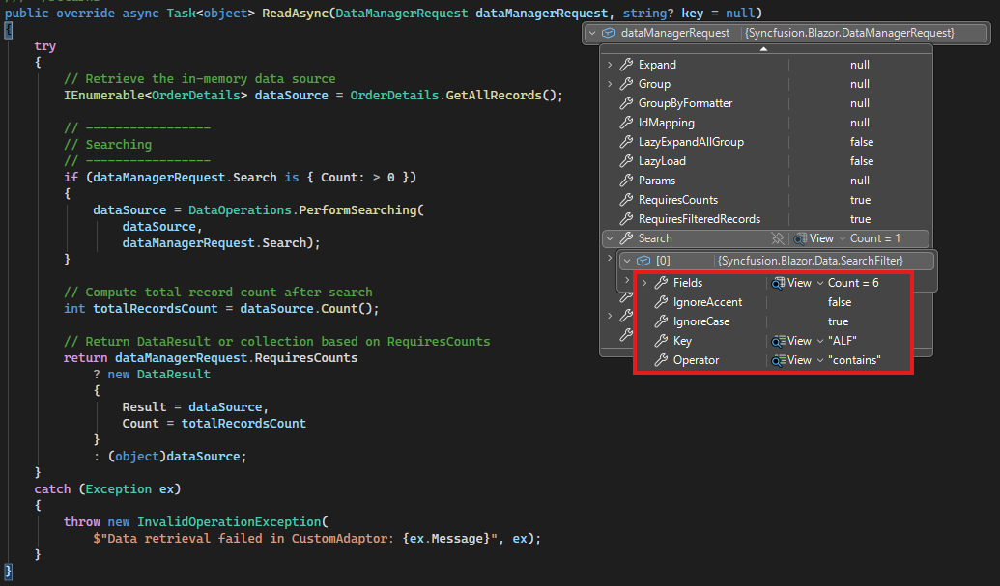

### Filtering

To enable server‑side filtering with the `CustomAdaptor`, apply the filter conditions from the [DataManagerRequest.Where](https://help.syncfusion.com/cr/blazor/Syncfusion.Blazor.DataManagerRequest.html#Syncfusion_Blazor_DataManagerRequest_Where) collection using the [PerformFiltering](https://help.syncfusion.com/cr/blazor/Syncfusion.Blazor.DataOperations.html#Syncfusion_Blazor_DataOperations_PerformFiltering__1_System_Linq_IQueryable___0__System_Collections_Generic_List_Syncfusion_Blazor_Data_WhereFilter__System_String_) method.
This method evaluates each filter predicate and updates the data based on the configured:

* Field
* Operator (Equals, Contains, GreaterThan, etc.)
* Value

Filtering supports both single‑column and multiple‑column filtering.

Filtering can be enabled in the DataGrid by setting the [AllowFiltering](https://help.syncfusion.com/cr/blazor/Syncfusion.Blazor.Grids.SfGrid-1.html#Syncfusion_Blazor_Grids_SfGrid_1_AllowFiltering) property to **true**. Filtering behavior is further configured using the [GridFilterSettings](https://help.syncfusion.com/cr/blazor/Syncfusion.Blazor.Grids.GridFilterSettings.html) component to define settings such as filter type, operators, and modes.

```csharp
<SfGrid TValue="OrderDetails"
        AllowFiltering="true"
        Width="100%">
    <SfDataManager Adaptor="Adaptors.CustomAdaptor"
                   AdaptorInstance="@typeof(CustomAdaptor)" />
    <GridColumns>
        <GridColumn Field=@nameof(OrderDetails.OrderId)
                    HeaderText="Order ID"
                    TextAlign="TextAlign.Right"
                    Width="140" />
        <GridColumn Field=@nameof(OrderDetails.CustomerId)
                    HeaderText="Customer ID"
                    Width="160" />
        <GridColumn Field=@nameof(OrderDetails.ShipCity)
                    HeaderText="Ship City"
                    Width="140" />
        <GridColumn Field=@nameof(OrderDetails.ShipCountry)
                    HeaderText="Ship Country"
                    Width="160" />
        <GridColumn Field=@nameof(OrderDetails.Freight)
                    HeaderText="Freight"
                    Format="C2"
                    TextAlign="TextAlign.Right"
                    Width="130" />
        <GridColumn Field=@nameof(OrderDetails.OrderDate)
                    HeaderText="Order Date"
                    Type="ColumnType.Date"
                    Format="d"
                    TextAlign="TextAlign.Right"
                    Width="140" />
    </GridColumns>
</SfGrid>
```

Update the `ReadAsync` method in the `CustomAdaptor` class to handle filtering in the `@code` block of the same **Home.razor** file:

```csharp
@code {

    /// <summary>
    /// Custom adaptor for the Syncfusion Blazor DataGrid that operates on an
    /// in-memory collection and supports request-driven data processing.
    /// </summary>
    public sealed class CustomAdaptor : DataAdaptor
    {
        /// <summary>
        /// Reads data according to the <see cref="DataManagerRequest"/> and applies
        /// filtering when filter descriptors are provided. Returns a
        /// <see cref="DataResult"/> when count information is required; otherwise
        /// returns the processed collection.
        /// </summary>
        /// <param name="dataManagerRequest">
        /// Request containing DataGrid operation descriptors (filter only in this version).
        /// </param>
        /// <param name="key">Optional correlation key; not used.</param>
        /// <returns>
        /// A <see cref="DataResult"/> when <c>RequiresCounts</c> is true;
        /// otherwise the processed collection.
        /// </returns>
        public override async Task<object> ReadAsync(DataManagerRequest dataManagerRequest, string? key = null)
        {
            try
            {
                // Retrieve the in-memory data source
                IEnumerable<OrderDetails> dataSource = OrderDetails.GetAllRecords();

                // -----------------
                // Filtering
                // -----------------
                if (dataManagerRequest.Where is { Count: > 0 })
                {
                    dataSource = DataOperations.PerformFiltering(
                        dataSource,
                        dataManagerRequest.Where,
                        dataManagerRequest.Where[0].Operator);
                }

                // Compute total record count after filtering
                int totalRecordsCount = dataSource.Count();

                // Return DataResult or collection based on RequiresCounts
                return dataManagerRequest.RequiresCounts
                    ? new DataResult
                      {
                          Result = dataSource,
                          Count  = totalRecordsCount
                      }
                    : (object)dataSource;
            }
            catch (Exception ex)
            {
                throw new InvalidOperationException(
                    $"Data retrieval failed in CustomAdaptor: {ex.Message}", ex);
            }
        }
    }
}

```

**Single column filtering**

Single‑column filtering is performed directly in the column’s FilterBar input.

**Example:**

* Type a value in the **Customer ID** header filter box (for example, **ALF**).
* Press Enter to apply the filter.
* Clear any FilterBar input to remove that filter condition.

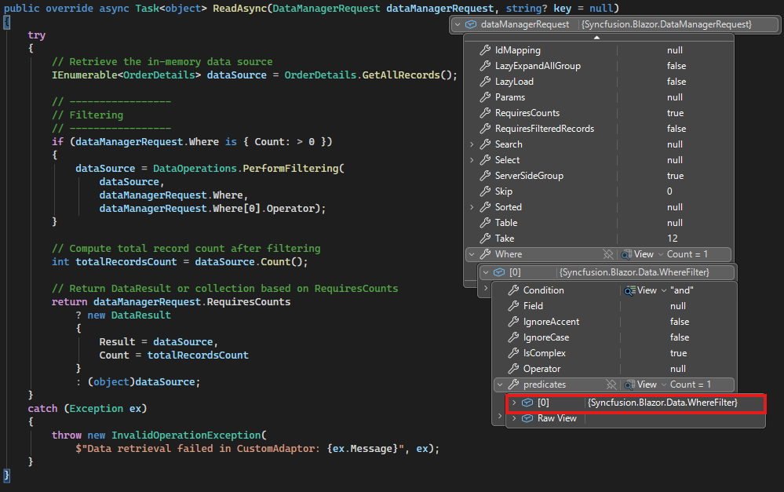

**Multi column filtering**

Multi‑column filtering is performed by entering values in more than one column’s FilterBar input. Each filter is applied together, so only rows that satisfy all active filter conditions are shown.

**Example:**

* In **Ship Country**, type **Germany** and press **Enter**.
* In **Order ID**, type **> 10005** and press **Enter**.
* The grid displays rows where **Ship Country = Germany** AND **Order ID > 10005**.
* Clear any FilterBar input to remove that filter condition.

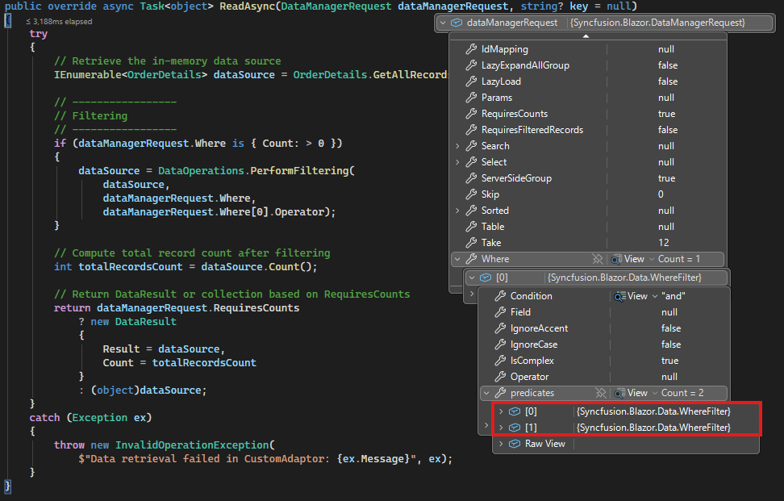

### Sorting

To enable server‑side sorting with the `CustomAdaptor`, apply sort descriptors from [DataManagerRequest.Sorted](https://help.syncfusion.com/cr/blazor/Syncfusion.Blazor.DataManagerRequest.html#Syncfusion_Blazor_DataManagerRequest_Sorted) to the data source using the DataOperations.[PerformSorting](https://help.syncfusion.com/cr/blazor/Syncfusion.Blazor.DataOperations.html#Syncfusion_Blazor_DataOperations_PerformSorting__1_System_Collections_Generic_IEnumerable___0__System_Collections_Generic_List_Syncfusion_Blazor_Data_SortedColumn__) method. This method evaluates each sort instruction and orders the data based on the specified field and direction.

Sorting can be enabled in the DataGrid by setting the [AllowSorting](https://help.syncfusion.com/cr/blazor/Syncfusion.Blazor.Grids.SfGrid-1.html#Syncfusion_Blazor_Grids_SfGrid_1_AllowSorting) property to **true**. Additional sorting behavior, including multi‑column sorting, is configured using the [GridSortSettings](https://help.syncfusion.com/cr/blazor/Syncfusion.Blazor.Grids.GridSortSettings.html) component.

```csharp
<SfGrid TValue="OrderDetails"
        AllowSorting="true"
        Width="100%">
    <SfDataManager Adaptor="Adaptors.CustomAdaptor"
                   AdaptorInstance="@typeof(CustomAdaptor)" />
    <GridColumns>
        <GridColumn Field=@nameof(OrderDetails.OrderId)
                    HeaderText="Order ID"
                    TextAlign="TextAlign.Right"
                    Width="140" />
        <GridColumn Field=@nameof(OrderDetails.CustomerId)
                    HeaderText="Customer ID"
                    Width="160" />
        <GridColumn Field=@nameof(OrderDetails.ShipCity)
                    HeaderText="Ship City"
                    Width="140" />
        <GridColumn Field=@nameof(OrderDetails.ShipCountry)
                    HeaderText="Ship Country"
                    Width="160" />
        <GridColumn Field=@nameof(OrderDetails.Freight)
                    HeaderText="Freight"
                    Format="C2"
                    TextAlign="TextAlign.Right"
                    Width="130" />
        <GridColumn Field=@nameof(OrderDetails.OrderDate)
                    HeaderText="Order Date"
                    Type="ColumnType.Date"
                    Format="d"
                    TextAlign="TextAlign.Right"
                    Width="140" />
    </GridColumns>
</SfGrid>
```

Update the `ReadAsync` method in the `CustomAdaptor` class to handle sorting in the `@code` block of the same **Home.razor** file.

```csharp

@code {

    /// <summary>
    /// Custom adaptor for the Syncfusion Blazor DataGrid that operates on an
    /// in-memory collection and supports request-driven data processing.
    /// </summary>
    public sealed class CustomAdaptor : DataAdaptor
    {
        /// <summary>
        /// Reads data according to the <see cref="DataManagerRequest"/> and applies
        /// sorting when sort descriptors are provided. Returns a
        /// <see cref="DataResult"/> when count information is required; otherwise
        /// returns the processed collection.
        /// </summary>
        /// <param name="dataManagerRequest">
        /// Request containing DataGrid operation descriptors (sorting only in this version).
        /// </param>
        /// <param name="key">Optional correlation key; not used.</param>
        /// <returns>
        /// A <see cref="DataResult"/> when <c>RequiresCounts</c> is true;
        /// otherwise the processed collection.
        /// </returns>
        public override async Task<object> ReadAsync(DataManagerRequest dataManagerRequest, string? key = null)
        {
            try
            {
                // Retrieve the in-memory data source
                IEnumerable<OrderDetails> dataSource = OrderDetails.GetAllRecords();

                // -----------------
                // Sorting
                // -----------------
                if (dataManagerRequest.Sorted is { Count: > 0 })
                {
                    dataSource = DataOperations.PerformSorting(
                        dataSource,
                        dataManagerRequest.Sorted);
                }

                // Compute total record count after sorting
                int totalRecordsCount = dataSource.Count();

                // Return DataResult or collection based on RequiresCounts
                return dataManagerRequest.RequiresCounts
                    ? new DataResult
                      {
                          Result = dataSource,
                          Count  = totalRecordsCount
                      }
                    : (object)dataSource;
            }
            catch (Exception ex)
            {
                throw new InvalidOperationException(
                    $"Data retrieval failed in CustomAdaptor: {ex.Message}", ex);
            }
        }
    }
}
```

**Single‑column sorting**

Single‑column sorting is performed by clicking the header of any sortable column.

**Example:**

* Click the **Customer Name** column header once to sort the records in **ascending** order.
* Click the same column header again to sort the records in **descending** order.

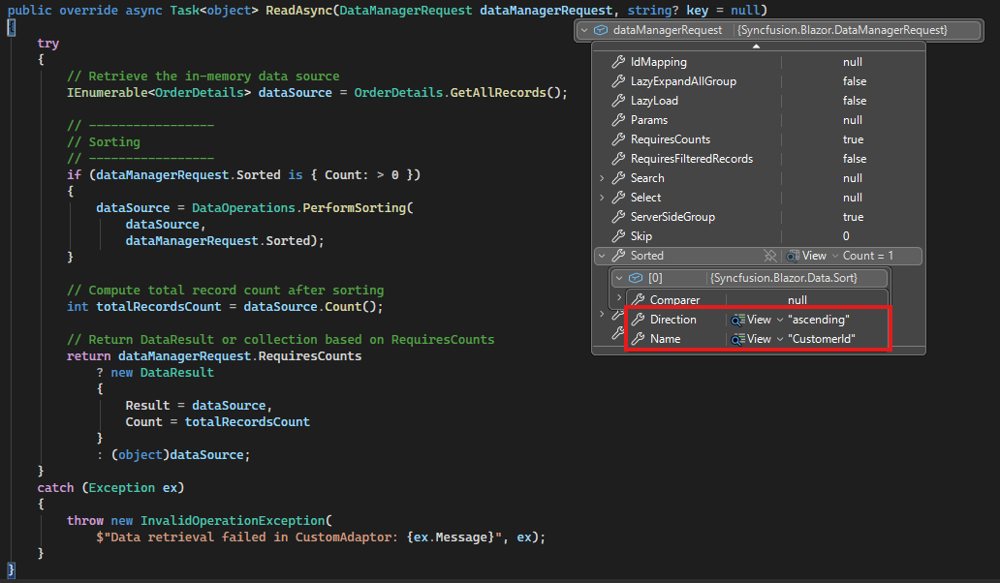

**Multi‑column sorting**

Multi‑column sorting allows ordering by multiple fields in sequence.

**Example:**

* Hold <kbd>Ctrl</kbd> and click **Order ID**, then click **Customer Name**.
* This applies a hierarchical sort where the data is ordered first by **Order ID**, and then by **Customer Name** within each **Order ID** group.

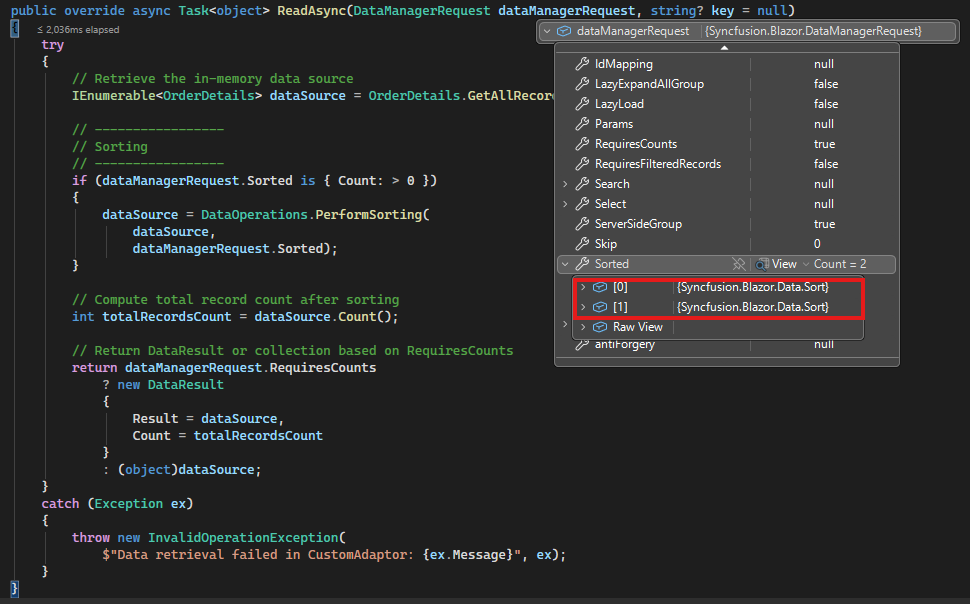


### Paging

To enable server‑side paging with the `CustomAdaptor`, apply the paging parameters from [DataManagerRequest.Skip](https://help.syncfusion.com/cr/blazor/Syncfusion.Blazor.DataManagerRequest.html#Syncfusion_Blazor_DataManagerRequest_Skip) and [DataManagerRequest.Take](https://help.syncfusion.com/cr/blazor/Syncfusion.Blazor.DataManagerRequest.html#Syncfusion_Blazor_DataManagerRequest_Take) to the data source using the [PerformSkip](https://help.syncfusion.com/cr/blazor/Syncfusion.Blazor.DataOperations.html#Syncfusion_Blazor_DataOperations_PerformSkip__1_System_Linq_IQueryable___0__System_Int32_) and [PerformTake](https://help.syncfusion.com/cr/blazor/Syncfusion.Blazor.DataOperations.html#Syncfusion_Blazor_DataOperations_PerformTake__1_System_Linq_IQueryable___0__System_Int32_) methods.

* **Skip** — ignores a specified number of records.
* **Take** — retrieves a subset from the remaining collection.

These methods work together to process the requested page range and return only the records belonging to the selected page.

Paging can be enabled in the DataGrid by setting the [AllowPaging](https://help.syncfusion.com/cr/blazor/Syncfusion.Blazor.Grids.SfGrid-1.html#Syncfusion_Blazor_Grids_SfGrid_1_AllowPaging) property to **true**. Additional paging behavior is configured using the [GridPageSettings](https://help.syncfusion.com/cr/blazor/Syncfusion.Blazor.Grids.GridPageSettings.html) component to define settings such as page size and page count.

```csharp
<SfGrid TValue="OrderDetails"
        AllowPaging="true"
        Width="100%">
    <SfDataManager Adaptor="Adaptors.CustomAdaptor"
                   AdaptorInstance="@typeof(CustomAdaptor)" />

    <GridPageSettings PageSize="10" />
    <GridColumns>
        <GridColumn Field=@nameof(OrderDetails.OrderId)
                    HeaderText="Order ID"
                    TextAlign="TextAlign.Right"
                    Width="140" />
        <GridColumn Field=@nameof(OrderDetails.CustomerId)
                    HeaderText="Customer ID"
                    Width="160" />
        <GridColumn Field=@nameof(OrderDetails.ShipCity)
                    HeaderText="Ship City"
                    Width="140" />
        <GridColumn Field=@nameof(OrderDetails.ShipCountry)
                    HeaderText="Ship Country"
                    Width="160" />
        <GridColumn Field=@nameof(OrderDetails.Freight)
                    HeaderText="Freight"
                    Format="C2"
                    TextAlign="TextAlign.Right"
                    Width="130" />
        <GridColumn Field=@nameof(OrderDetails.OrderDate)
                    HeaderText="Order Date"
                    Type="ColumnType.Date"
                    Format="d"
                    TextAlign="TextAlign.Right"
                    Width="140" />
    </GridColumns>
</SfGrid>
```

Update the `ReadAsync` method in the `CustomAdaptor` class to handle paging in the `@code` block of the same **Home.razor** file.

```csharp
@code {

    /// <summary>
    /// Custom adaptor for the Syncfusion Blazor DataGrid that operates on an
    /// in-memory collection and supports request-driven data processing.
    /// </summary>
    public sealed class CustomAdaptor : DataAdaptor
    {
        /// <summary>
        /// Reads data according to the <see cref="DataManagerRequest"/> and applies
        /// paging when Skip/Take are provided. Returns a <see cref="DataResult"/> when
        /// count information is required; otherwise returns the paged collection.
        /// </summary>
        /// <param name="dataManagerRequest">
        /// Request containing DataGrid operation descriptors (paging only in this version).
        /// </param>
        /// <param name="key">Optional correlation key; not used.</param>
        /// <returns>
        /// A <see cref="DataResult"/> when <c>RequiresCounts</c> is true;
        /// otherwise the processed (paged) collection.
        /// </returns>
        public override async Task<object> ReadAsync(DataManagerRequest dataManagerRequest, string? key = null)
        {
            try
            {
                // Retrieve the in-memory data source
                IEnumerable<OrderDetails> dataSource = OrderDetails.GetAllRecords();

                // ---------------------------------------------------
                // Total records BEFORE paging
                // ---------------------------------------------------
                int totalRecordsCount = dataSource.Count();

                // -----------------
                // Paging (Skip/Take)
                // -----------------
                if (dataManagerRequest.Skip > 0)
                {
                    dataSource = DataOperations.PerformSkip(dataSource, dataManagerRequest.Skip);
                }

                if (dataManagerRequest.Take > 0)
                {
                    dataSource = DataOperations.PerformTake(dataSource, dataManagerRequest.Take);
                }

                // Return DataResult or the paged collection based on RequiresCounts
                return dataManagerRequest.RequiresCounts
                    ? new DataResult
                      {
                          Result = dataSource,
                          Count  = totalRecordsCount
                      }
                    : (object)dataSource;
            }
            catch (Exception ex)
            {
                throw new InvalidOperationException(
                    $"Data retrieval failed in CustomAdaptor: {ex.Message}", ex);
            }
        }
    }
}
```

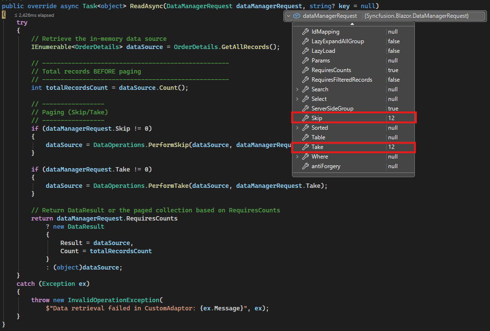

### Grouping

To enable server‑side grouping with the `CustomAdaptor`, apply the group descriptors from [DataManagerRequest.Group](https://help.syncfusion.com/cr/blazor/Syncfusion.Blazor.DataManagerRequest.html#Syncfusion_Blazor_DataManagerRequest_Group) to the data source using [DataUtil.Group<T>](https://help.syncfusion.com/cr/blazor/Syncfusion.Blazor.Data.DataUtil.html#Syncfusion_Blazor_Data_DataUtil_Group__1_System_Collections_IEnumerable_System_String_System_Collections_Generic_List_Syncfusion_Blazor_Data_Aggregate__System_Int32_System_Collections_Generic_IDictionary_System_String_System_String__System_Boolean_System_Boolean_). Grouping produces a hierarchical result that the DataGrid can render, and it can be combined with aggregates when needed.

When grouping is active, the adaptor returns a `DataResult` containing:

* Grouped hierarchy
* Record count
* Optional aggregates

Grouping can be enabled in the DataGrid by setting [AllowGrouping](https://help.syncfusion.com/cr/blazor/Syncfusion.Blazor.Grids.SfGrid-1.html#Syncfusion_Blazor_Grids_SfGrid_1_AllowGrouping) property to **true**. Grouping behavior is further configured using the [GridGroupSettings](https://help.syncfusion.com/cr/blazor/Syncfusion.Blazor.Grids.GridGroupSettings.html) component to control options such as drop area visibility, group expansion, and grouped column display.

```csharp
@using System.Collections
<SfGrid TValue="OrderDetails"
        AllowGrouping="true"
        Width="100%">
    <SfDataManager Adaptor="Adaptors.CustomAdaptor"
                   AdaptorInstance="@typeof(CustomAdaptor)" />
    <GridColumns>
        <GridColumn Field=@nameof(OrderDetails.OrderId)
                    HeaderText="Order ID"
                    TextAlign="TextAlign.Right"
                    Width="140" />
        <GridColumn Field=@nameof(OrderDetails.CustomerId)
                    HeaderText="Customer ID"
                    Width="160" />
        <GridColumn Field=@nameof(OrderDetails.ShipCity)
                    HeaderText="Ship City"
                    Width="140" />
        <GridColumn Field=@nameof(OrderDetails.ShipCountry)
                    HeaderText="Ship Country"
                    Width="160" />
        <GridColumn Field=@nameof(OrderDetails.Freight)
                    HeaderText="Freight"
                    Format="C2"
                    TextAlign="TextAlign.Right"
                    Width="130" />
        <GridColumn Field=@nameof(OrderDetails.OrderDate)
                    HeaderText="Order Date"
                    Type="ColumnType.Date"
                    Format="d"
                    TextAlign="TextAlign.Right"
                    Width="140" />
    </GridColumns>
</SfGrid>
```

Update the `ReadAsync` method in the `CustomAdaptor` class to handle grouping in the `@code` block of the same **Home.razor** file.

```csharp
@code {

    /// <summary>
    /// Custom adaptor for the Syncfusion Blazor DataGrid that operates on an
    /// in-memory collection and supports request-driven data processing.
    /// </summary>
    public sealed class CustomAdaptor : DataAdaptor
    {

        /// <summary>
        /// Applies grouping and optional aggregates when group descriptors are supplied
        /// through <see cref="DataManagerRequest"/>. Returns a hierarchical result when
        /// grouping is active. Returns a <see cref="DataResult"/> when count information
        /// is required; otherwise returns the ungrouped collection.
        /// </summary>
        public override async Task<object> ReadAsync(DataManagerRequest dataManagerRequest, string? key = null)
        {
            try
            {
                // Retrieve the in-memory data source
                IEnumerable<OrderDetails> dataSource = OrderDetails.GetAllRecords();

                // Total count before paging (when grouping is active)
                int totalRecordsCount = dataSource.Count();

                // -----------------------
                // Grouping (+ optional aggregates)
                // -----------------------
                if (dataManagerRequest.Group is { Count: > 0 })
                {
                    // Build the grouped hierarchy from the current data set.
                    IEnumerable grouped = dataSource.ToList();
                    // Build hierarchical structure for each group descriptor in request order.
                    foreach (var group in dataManagerRequest.Group)
                    {
                        grouped = DataUtil.Group<OrderDetails>(
                            grouped,
                            group,
                            dataManagerRequest.Aggregates,   // pass descriptors if present
                            0,
                            dataManagerRequest.GroupByFormatter);
                    }
                   
                    // Return grouped hierarchy with optional aggregates
                    return new DataResult

                    return new DataResult
                    {
                        Result     = grouped,
                        Count      = totalRecordsCount,
                        Aggregates = dataManagerRequest.Aggregates is { Count: > 0 }
                                     ? DataUtil.PerformAggregation(dataSource, dataManagerRequest.Aggregates)
                                     : null
                    };
                }

                // No grouping: return DataResult when counts are required; otherwise the collection.
                return dataManagerRequest.RequiresCounts
                    ? new DataResult
                      {
                          Result = dataSource,
                          Count  = totalRecordsCount
                      }
                    : (object)dataSource;
            }
            catch (Exception ex)
            {
                throw new InvalidOperationException(
                    $"Data retrieval failed in CustomAdaptor: {ex.Message}", ex);
            }
        }
    }
}
```

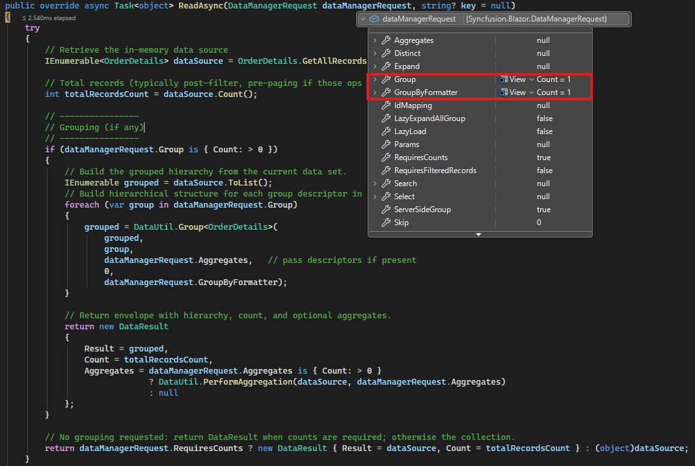

## Aggregates

To enable server‑side aggregates with the `CustomAdaptor`, apply the aggregate descriptors from [DataManagerRequest.Aggregates](https://help.syncfusion.com/cr/blazor/Syncfusion.Blazor.DataManagerRequest.html#Syncfusion_Blazor_DataManagerRequest_Aggregates) to the data source using the [DataUtil.PerformAggregation](https://help.syncfusion.com/cr/blazor/Syncfusion.Blazor.Data.DataUtil.html#Syncfusion_Blazor_Data_DataUtil_PerformAggregation_System_Collections_IEnumerable_System_Collections_Generic_List_Syncfusion_Blazor_Data_Aggregate__) method.
This method evaluates each aggregate descriptor and computes values such as:

* Sum 
* Average
* Min
* Max
* Count

Aggregates can be displayed in the DataGrid through [GridAggregates](https://help.syncfusion.com/cr/blazor/Syncfusion.Blazor.Grids.GridAggregates.html) and [GridAggregateColumn](https://help.syncfusion.com/cr/blazor/Syncfusion.Blazor.Grids.GridAggregateColumn.html). Footer templates can be used to display the computed values.

```csharp
<SfGrid TValue="OrderDetails"
        AllowPaging="true"
        Width="100%">
    <SfDataManager Adaptor="Adaptors.CustomAdaptor"
                   AdaptorInstance="@typeof(CustomAdaptor)" />

    <GridPageSettings PageSize="10" />
    <GridAggregates>
        <GridAggregate>
            <GridAggregateColumns>
                <GridAggregateColumn Field=@nameof(OrderDetails.Freight)
                                     Type="AggregateType.Sum"
                                     Format="C2">
                    <FooterTemplate>
                        @{
                            var aggregate = (context as AggregateTemplateContext);
                            <div>Sum: @aggregate?.Sum</div>
                        }
                    </FooterTemplate>
                </GridAggregateColumn>
            </GridAggregateColumns>
        </GridAggregate>
        <GridAggregate>
            <GridAggregateColumns>
                <GridAggregateColumn Field=@nameof(OrderDetails.Freight)
                                     Type="AggregateType.Average"
                                     Format="C2">
                    <FooterTemplate>
                        @{
                            var aggregate = (context as AggregateTemplateContext);
                            <div>Average: @aggregate?.Average</div>
                        }
                    </FooterTemplate>
                </GridAggregateColumn>
            </GridAggregateColumns>
        </GridAggregate>
    </GridAggregates>
    <GridColumns>
        <GridColumn Field=@nameof(OrderDetails.OrderId)
                    HeaderText="Order ID"
                    TextAlign="TextAlign.Right"
                    Width="140" />

        <GridColumn Field=@nameof(OrderDetails.CustomerId)
                    HeaderText="Customer ID"
                    Width="160" />

        <GridColumn Field=@nameof(OrderDetails.ShipCity)
                    HeaderText="Ship City"
                    Width="140" />

        <GridColumn Field=@nameof(OrderDetails.ShipCountry)
                    HeaderText="Ship Country"
                    Width="160" />

        <GridColumn Field=@nameof(OrderDetails.Freight)
                    HeaderText="Freight"
                    Format="C2"
                    TextAlign="TextAlign.Right"
                    Width="130" />

        <GridColumn Field=@nameof(OrderDetails.OrderDate)
                    HeaderText="Order Date"
                    Type="ColumnType.Date"
                    Format="d"
                    TextAlign="TextAlign.Right"
                    Width="140" />
    </GridColumns>
</SfGrid>
```

Update the `ReadAsync` method in the `CustomAdaptor` class to compute and return aggregate values in the `@code` block of the same **Home.razor** file:

```csharp
@code {

    /// <summary>
    /// Custom adaptor for the Syncfusion Blazor DataGrid that operates on an
    /// in-memory collection and supports request-driven data processing.
    /// </summary>
    public sealed class CustomAdaptor : DataAdaptor
    {

        /// <summary>
        /// Applies aggregate calculations when aggregate descriptors are provided.
        /// Returns a DataResult containing the collection, total count, and aggregates.
        /// </summary>
        /// <param name="dataManagerRequest">Request containing aggregate descriptors.</param>
        /// <param name="key">Optional request key; not used.</param>
        /// <returns>A DataResult with Result, Count, and Aggregates, or the collection when no aggregates exist.</returns>
        public override async Task<object> ReadAsync(DataManagerRequest dataManagerRequest, string? key = null)
        {
            try
            {
                // Retrieve the in-memory data source.
                IEnumerable<OrderDetails> dataSource = OrderDetails.GetAllRecords();

                // Compute total record count
                int totalRecordsCount = dataSource.Count();

                // Aggregates path: return an envelope so the grid can consume summary values.
                if (dataManagerRequest.Aggregates is { Count: > 0 })
                {
                    return new DataResult
                    {
                        Result     = dataSource,
                        Count      = totalRecordsCount,
                        Aggregates = DataUtil.PerformAggregation(dataSource, dataManagerRequest.Aggregates)
                    };
                }

                // No aggregates requested: return DataResult only when counts are required.
                return dataManagerRequest.RequiresCounts
                    ? new DataResult
                      {
                          Result = dataSource,
                          Count  = totalRecordsCount
                      }
                    : (object)dataSource;
            }
            catch (Exception ex)
            {
                throw new InvalidOperationException(
                    $"Data retrieval failed in CustomAdaptor: {ex.Message}", ex);
            }
        }
    }
}
```

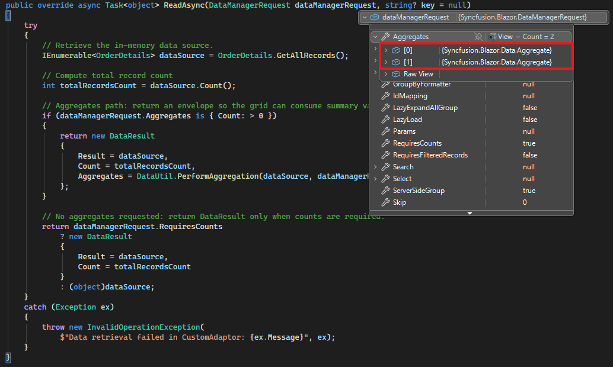

## Perform CRUD operations in CustomAdaptor

The Syncfusion<sup style="font-size:70%">&reg;</sup> Blazor DataGrid supports **Create**, **Read**, **Update**, and **Delete** (**CRUD**) operations through [DataManager](https://help.syncfusion.com/cr/blazor/Syncfusion.Blazor.DataManager.html). When using a `CustomAdaptor`, CRUD actions are handled by overriding the corresponding methods in [DataAdaptor](https://help.syncfusion.com/cr/blazor/Syncfusion.Blazor.DataAdaptor.html).

**CRUD method mapping in CustomAdaptor**

| Grid Action   | Adaptor Method                 | Description                                                                              |
|---------------|--------------------------------|------------------------------------------------------------------------------------------|
| Create        | [Insert](http://help.syncfusion.com/cr/blazor/Syncfusion.Blazor.DataAdaptor.html#Syncfusion_Blazor_DataAdaptor_Insert_Syncfusion_Blazor_DataManager_System_Object_System_String_) / [InsertAsync](https://help.syncfusion.com/cr/blazor/Syncfusion.Blazor.DataAdaptor.html#Syncfusion_Blazor_DataAdaptor_InsertAsync_Syncfusion_Blazor_DataManager_System_Object_System_String_)          | Adds a new record to the in‑memory data source and returns the inserted entity.          |
| Update        | [Update](https://help.syncfusion.com/cr/blazor/Syncfusion.Blazor.DataAdaptor.html#Syncfusion_Blazor_DataAdaptor_Update_Syncfusion_Blazor_DataManager_System_Object_System_String_System_String_) / [UpdateAsync](https://help.syncfusion.com/cr/blazor/Syncfusion.Blazor.DataAdaptor.html#Syncfusion_Blazor_DataAdaptor_UpdateAsync_Syncfusion_Blazor_DataManager_System_Object_System_String_System_String_)           | Updates an existing record in the data source and returns the modified entity.           |
| Delete        | [Remove](https://help.syncfusion.com/cr/blazor/Syncfusion.Blazor.DataAdaptor.html#Syncfusion_Blazor_DataAdaptor_Remove_Syncfusion_Blazor_DataManager_System_Object_System_String_System_String_) / [RemoveAsync](https://help.syncfusion.com/cr/blazor/Syncfusion.Blazor.DataAdaptor.html#Syncfusion_Blazor_DataAdaptor_RemoveAsync_Syncfusion_Blazor_DataManager_System_Object_System_String_System_String_)           | Removes the specified record from the data source and returns the removed entity or key. |
| Batch Editing | [BatchUpdate](https://help.syncfusion.com/cr/blazor/Syncfusion.Blazor.DataAdaptor.html#Syncfusion_Blazor_DataAdaptor_BatchUpdate_Syncfusion_Blazor_DataManager_System_Object_System_Object_System_Object_System_String_System_String_System_Nullable_System_Int32__) / [BatchUpdateAsync](https://help.syncfusion.com/cr/blazor/Syncfusion.Blazor.DataAdaptor.html#Syncfusion_Blazor_DataAdaptor_BatchUpdateAsync_Syncfusion_Blazor_DataManager_System_Object_System_Object_System_Object_System_String_System_String_System_Nullable_System_Int32__) | Applies multiple add, update, and delete operations in a single batch request.           |

The adaptor modifies the underlying data collection and returns the processed entity or collection to the DataGrid.

**Enable editing in the Grid**

To enable editing in the DataGrid, configure the [GridEditSettings](https://help.syncfusion.com/cr/blazor/Syncfusion.Blazor.Grids.GridEditSettings.html) and [Toolbar](https://help.syncfusion.com/cr/blazor/Syncfusion.Blazor.Grids.SfGrid-1.html#Syncfusion_Blazor_Grids_SfGrid_1_Toolbar) properties to allow adding, editing, and deleting records. For configuration details, refer to the DataGrid [editing](https://blazor.syncfusion.com/documentation/datagrid/editing) documentation.

> Normal or Inline editing is the default edit `Mode` for the DataGrid. To enable CRUD operations, ensure the [IsPrimaryKey](https://help.syncfusion.com/cr/blazor/Syncfusion.Blazor.Grids.GridColumn.html#Syncfusion_Blazor_Grids_GridColumn_IsPrimaryKey) property is set to **true** for a unique column.

```csharp
<SfGrid TValue="OrderDetails"
        Toolbar="@(new List<string> { "Add", "Edit", "Delete", "Update", "Cancel" })"
        Width="100%">
    <SfDataManager Adaptor="Adaptors.CustomAdaptor"
                   AdaptorInstance="@typeof(CustomAdaptor)" />
    <GridEditSettings AllowAdding="true"
                      AllowEditing="true"
                      AllowDeleting="true"
                      Mode="EditMode.Normal" />

    <GridColumns>
        <GridColumn Field=@nameof(OrderDetails.OrderId)
                    HeaderText="Order ID"
                    IsPrimaryKey="true"
                    Width="140" />
        <GridColumn Field=@nameof(OrderDetails.CustomerId)
                    HeaderText="Customer ID"
                    Width="160" />
        <GridColumn Field=@nameof(OrderDetails.ShipCity)
                    HeaderText="Ship City"
                    Width="140" />
        <GridColumn Field=@nameof(OrderDetails.ShipCountry)
                    HeaderText="Ship Country"
                    Width="160" />
        <GridColumn Field=@nameof(OrderDetails.Freight)
                    HeaderText="Freight"
                    Format="C2"
                    Width="130" />
        <GridColumn Field=@nameof(OrderDetails.OrderDate)
                    HeaderText="Order Date"
                    Type="ColumnType.Date"
                    Format="d"
                    Width="140" />
    </GridColumns>
</SfGrid>
```
### Insert operation

The insert operation in the `CustomAdaptor` is performed by overriding the [Insert](https://help.syncfusion.com/cr/blazor/Syncfusion.Blazor.DataAdaptor.html#Syncfusion_Blazor_DataAdaptor_Insert_Syncfusion_Blazor_DataManager_System_Object_System_String_) or [InsertAsync](https://help.syncfusion.com/cr/blazor/Syncfusion.Blazor.DataAdaptor.html#Syncfusion_Blazor_DataAdaptor_InsertAsync_Syncfusion_Blazor_DataManager_System_Object_System_String_) method of `DataAdaptor`. The method receives the new record from the DataGrid through `DataManager` and adds it to the in‑memory data collection. The inserted entity is then returned to the Grid to complete the add operation.


```csharp

/// <summary>
/// Custom adaptor for the Syncfusion Blazor DataGrid that performs CRUD operations
/// (create, read, update, delete) and data processing (searching, sorting, filtering,
/// paging, grouping, aggregates) against an in-memory collection of
/// <see cref="OrderDetails"/> entities.
/// </summary>
public sealed class CustomAdaptor : DataAdaptor
{
    /// <summary>
    /// Inserts a record into the in-memory collection and returns the inserted entity.
    /// </summary>
    /// <param name="dataManager">DataManager context.</param>
    /// <param name="value">Entity to insert.</param>
    /// <param name="key">Primary key field name (for example, "OrderId").</param>
    /// <returns>The inserted entity.</returns>
    public override async Task<object> InsertAsync(DataManager dataManager, object value, string key)
    {
        if (value is null)
            throw new ArgumentNullException(nameof(value));

        // Strongly type the inbound payload; fail fast if the cast is invalid
        if (value is not OrderDetails entity)
            throw new ArgumentException("Invalid payload type for OrderDetails insert.", nameof(value));

        // Resolve the in-memory store
        List<OrderDetails> store = OrderDetails.GetAllRecords();

        // Generate a key when not provided (0 is treated as 'unassigned')
        if (entity.OrderId <= 0)
        {
            int nextId = store.Count == 0 ? 1000 : store.Max(o => o.OrderId) + 1;
            entity.OrderId = nextId;
        }

        // Insert at the beginning to surface newly added records
        store.Insert(0, entity);

        // Return the inserted entity.
        return await Task.FromResult<object>(entity);
    }
}

```

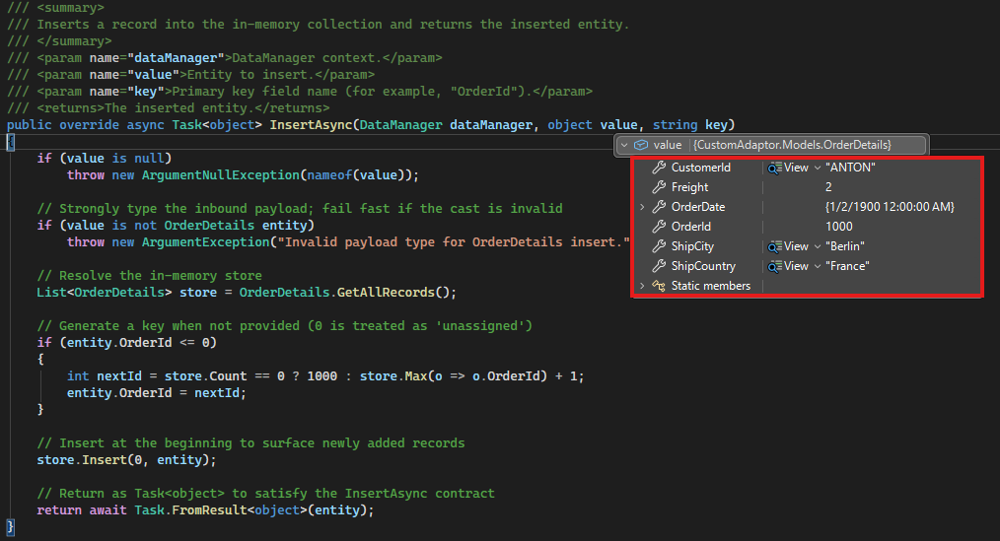

### Update Operation

The update operation in a `CustomAdaptor` is implemented by overriding [Update](https://help.syncfusion.com/cr/blazor/Syncfusion.Blazor.DataAdaptor.html#Syncfusion_Blazor_DataAdaptor_Update_Syncfusion_Blazor_DataManager_System_Object_System_String_System_String_) or [UpdateAsync](https://help.syncfusion.com/cr/blazor/Syncfusion.Blazor.DataAdaptor.html#Syncfusion_Blazor_DataAdaptor_UpdateAsync_Syncfusion_Blazor_DataManager_System_Object_System_String_System_String_) in `DataAdaptor`. The Grid sends the modified record through `DataManager`; the adaptor locates the matching entity by the primary key and applies the changes to the in‑memory collection.

```csharp

/// <summary>
/// Custom adaptor for the Syncfusion Blazor DataGrid that performs CRUD operations
/// (create, read, update, delete) against an in-memory collection of
/// <see cref="OrderDetails"/> entities.
/// </summary>
public sealed class CustomAdaptor : DataAdaptor
{
    /// <summary>
    /// Updates a record in the in-memory collection and returns the updated entity.
    /// </summary>
    /// <param name="dataManager">DataManager context.</param>
    /// <param name="value">Entity with updated values.</param>
    /// <param name="keyField">Primary key field name (for example, "OrderId").</param>
    /// <param name="key">Primary key value (not used when the entity carries the key).</param>
    /// <returns>The updated entity.</returns>
    public override Task<object> UpdateAsync(
        DataManager dataManager,
        object value,
        string keyField,
        string key)
    {
        if (value is null)
            throw new ArgumentNullException(nameof(value));

        if (value is not OrderDetails updated)
            throw new ArgumentException("Invalid payload type for OrderDetails update.", nameof(value));

        // Resolve the in-memory store
        List<OrderDetails> store = OrderDetails.GetAllRecords();

        // Validate key (OrderId must be a positive integer)
        if (updated.OrderId <= 0)
            throw new ArgumentOutOfRangeException(nameof(updated.OrderId), "OrderId must be a positive integer.");

        // Locate existing record
        OrderDetails? existing = store.FirstOrDefault(o => o.OrderId == updated.OrderId);
        if (existing is null)
            throw new InvalidOperationException($"Order with id {updated.OrderId} was not found.");

        // Apply field updates
        existing.CustomerId  = updated.CustomerId;
        existing.ShipCity    = updated.ShipCity;
        existing.ShipCountry = updated.ShipCountry;
        existing.Freight     = updated.Freight;
        existing.OrderDate   = updated.OrderDate;

        // Return the updated entity
        return Task.FromResult<object>(existing);
    }
}
```

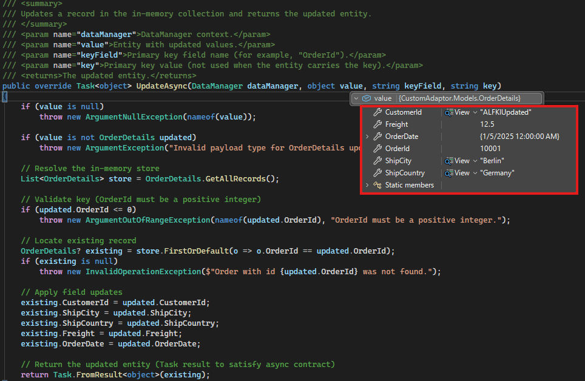

### Delete Operation

The delete operation in a `CustomAdaptor` is handled by overriding [Remove](https://help.syncfusion.com/cr/blazor/Syncfusion.Blazor.DataAdaptor.html#Syncfusion_Blazor_DataAdaptor_Remove_Syncfusion_Blazor_DataManager_System_Object_System_String_System_String_) or [RemoveAsync](https://help.syncfusion.com/cr/blazor/Syncfusion.Blazor.DataAdaptor.html#Syncfusion_Blazor_DataAdaptor_RemoveAsync_Syncfusion_Blazor_DataManager_System_Object_System_String_System_String_) in `DataAdaptor`. The Grid routes delete requests (based on the primary key) through `DataManager`, and the adaptor removes the matching entity from the in‑memory collection and returns a result.

```csharp
/// <summary>
/// Custom adaptor for the Syncfusion Blazor DataGrid that performs CRUD operations
/// (create, read, update, delete) against an in-memory collection of
/// <see cref="OrderDetails"/> entities.
/// </summary>
public sealed class CustomAdaptor : DataAdaptor
{
    /// <summary>
    /// Removes a record from the in-memory collection and returns the removed entity or key.
    /// </summary>
    /// <param name="dataManager">DataManager context.</param>
    /// <param name="data">Primary key value or entity instance.</param>
    /// <param name="keyField">Primary key field name (for example, "OrderId").</param>
    /// <param name="key">Primary key value as string.</param>
    /// <returns>The removed entity when found; otherwise the provided key/value.</returns>
    public override Task<object> RemoveAsync(DataManager dataManager, object data, string keyField, string key)
    {
        List<OrderDetails> store = OrderDetails.GetAllRecords();

        // 1) Prefer explicit 'key' when present (e.g., "1012")
        if (!string.IsNullOrWhiteSpace(key) && int.TryParse(key, out int idFromKey))
        {
            OrderDetails? existing = store.FirstOrDefault(o => o.OrderId == idFromKey);
            if (existing is not null)
            {
                store.Remove(existing);
                return Task.FromResult<object>(existing);
            }
            return Task.FromResult<object>(key);
        }
        // 2) Plain integer payload
        if (data is int idFromInt)
        {
            OrderDetails? existing = store.FirstOrDefault(o => o.OrderId == idFromInt);
            if (existing is not null)
            {
                store.Remove(existing);
                return Task.FromResult<object>(existing);
            }
            return Task.FromResult<object>(data);
        }
        // 3) Entity payload (e.g., OrderDetails with OrderId)
        if (data is OrderDetails entity)
        {
            OrderDetails? existing = store.FirstOrDefault(o => o.OrderId == entity.OrderId);
            if (existing is not null)
            {
                store.Remove(existing);
                return Task.FromResult<object>(existing);
            }
            return Task.FromResult<object>(entity.OrderId);
        }
        // 4) Parsable payload (e.g., "1012")
        if (int.TryParse(data?.ToString(), out int idFromString))
        {
            OrderDetails? existing = store.FirstOrDefault(o => o.OrderId == idFromString);
            if (existing is not null)
            {
                store.Remove(existing);
                return Task.FromResult<object>(existing);
            }
            return Task.FromResult<object>(idFromString);
        }

        // 5) Final fallback (ensure a non-null object is returned)
        return Task.FromResult<object>((object)(key ?? (data ?? string.Empty)));

    }
}
```

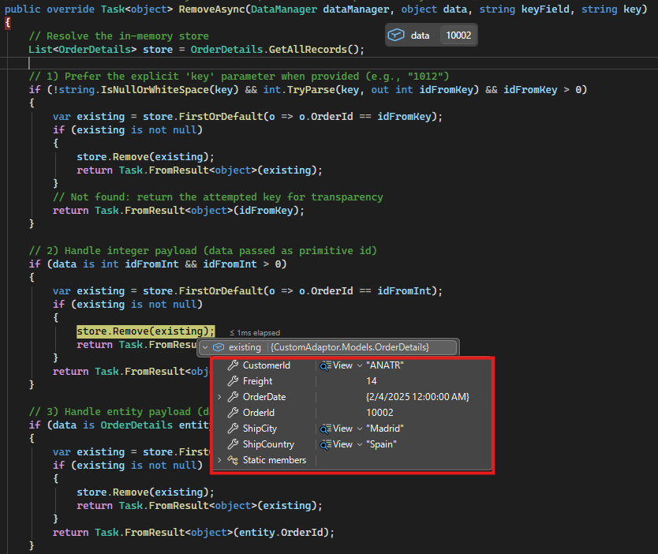

### Batch operation

The Syncfusion<sup style="font-size:70%">&reg;</sup> Blazor DataGrid supports batch editing when using a CustomAdaptor by overriding the [BatchUpdate](https://help.syncfusion.com/cr/blazor/Syncfusion.Blazor.DataAdaptor.html#Syncfusion_Blazor_DataAdaptor_BatchUpdate_Syncfusion_Blazor_DataManager_System_Object_System_Object_System_Object_System_String_System_String_System_Nullable_System_Int32__) or [BatchUpdateAsync](https://help.syncfusion.com/cr/blazor/Syncfusion.Blazor.DataAdaptor.html#Syncfusion_Blazor_DataAdaptor_BatchUpdateAsync_Syncfusion_Blazor_DataManager_System_Object_System_Object_System_Object_System_String_System_String_System_Nullable_System_Int32__) method in `DataAdaptor`. When batch mode is enabled using the edit [Mode](https://help.syncfusion.com/cr/blazor/Syncfusion.Blazor.Grids.GridEditSettings.html#Syncfusion_Blazor_Grids_GridEditSettings_Mode) property set to [EditMode.Batch](https://help.syncfusion.com/cr/blazor/Syncfusion.Blazor.Grids.EditMode.html), all add, update, and delete changes are stored on the client until the user clicks **Update** toolbar button. A single batch request is sent to the `CustomAdaptor` with all add, edit, and delete actions.

```csharp
<SfGrid TValue="OrderDetails"
        Width="100%"
        Toolbar="@(new List<string> { "Add", "Delete", "Update", "Cancel" })">
    <SfDataManager Adaptor="Adaptors.CustomAdaptor"
                   AdaptorInstance="@typeof(CustomAdaptor)" />
    <GridEditSettings AllowAdding="true"
                      AllowEditing="true"
                      AllowDeleting="true"
                      Mode="EditMode.Batch" />

    <GridColumns>
        <GridColumn Field=@nameof(OrderDetails.OrderId)
                    HeaderText="Order ID"
                    IsPrimaryKey="true"
                    Width="140" />
        <GridColumn Field=@nameof(OrderDetails.CustomerId)
                    HeaderText="Customer ID"
                    Width="160" />
        <GridColumn Field=@nameof(OrderDetails.ShipCity)
                    HeaderText="Ship City"
                    Width="140" />
        <GridColumn Field=@nameof(OrderDetails.ShipCountry)
                    HeaderText="Ship Country"
                    Width="160" />
        <GridColumn Field=@nameof(OrderDetails.Freight)
                    HeaderText="Freight"
                    Format="C2"
                    Width="130" />
        <GridColumn Field=@nameof(OrderDetails.OrderDate)
                    HeaderText="Order Date"
                    Type="ColumnType.Date"
                    Format="d"
                    Width="140" />
    </GridColumns>
</SfGrid>
```
Update the `BatchUpdateAsync` method in the `CustomAdaptor` class to handle batch editing in the `@code` block of the same **Home.razor** file:

```csharp
/// <summary>
/// Custom adaptor for the Syncfusion Blazor DataGrid that performs CRUD operations
/// (create, read, update, delete) against an in-memory collection of
/// <see cref="OrderDetails"/> entities.
/// </summary>
public sealed class CustomAdaptor : DataAdaptor
{
    /// <summary>
    /// Applies batch add, update, and delete operations to the in-memory collection
    /// and returns the updated source.
    /// </summary>
    /// <param name="dataManager">DataManager context.</param>
    /// <param name="changedRecords">Modified records.</param>
    /// <param name="addedRecords">Newly added records.</param>
    /// <param name="deletedRecords">Deleted records.</param>
    /// <param name="keyField">Primary key field name (for example, "OrderId").</param>
    /// <param name="key">Primary key value (not used in batch processing).</param>
    /// <param name="dropIndex">Optional index used for drag-and-drop scenarios.</param>
    /// <returns>The updated data source.</returns>
    public override Task<object> BatchUpdateAsync(
        DataManager dataManager,
        object changedRecords,
        object addedRecords,
        object deletedRecords,
        string keyField,
        string key,
        int? dropIndex)
    {
        List<OrderDetails> store = OrderDetails.GetAllRecords();

        // ------- Updates -------
        if (changedRecords is IEnumerable<OrderDetails> changed)
        {
            foreach (var item in changed)
            {
                if (item is null || item.OrderId <= 0) continue;

                var existing = store.FirstOrDefault(o => o.OrderId == item.OrderId);
                if (existing is not null)
                {
                    existing.CustomerId  = item.CustomerId;
                    existing.ShipCity    = item.ShipCity;
                    existing.ShipCountry = item.ShipCountry;
                    existing.Freight     = item.Freight;
                    existing.OrderDate   = item.OrderDate;
                }
            }
        }

        // ------- Inserts -------
        if (addedRecords is IEnumerable<OrderDetails> added)
        {
            foreach (var item in added)
            {
                if (item is null) continue;

                if (item.OrderId <= 0)
                {
                    int nextId = store.Count == 0 ? 1000 : store.Max(o => o.OrderId) + 1;
                    item.OrderId = nextId;
                }

                // Prevent duplicate keys
                if (!store.Any(o => o.OrderId == item.OrderId))
                {
                    store.Add(item);
                }
            }
        }

        // ------- Deletes -------
        if (deletedRecords is IEnumerable<OrderDetails> deleted)
        {
            foreach (var item in deleted)
            {
                if (item is null || item.OrderId <= 0) continue;

                var existing = store.FirstOrDefault(o => o.OrderId == item.OrderId);
                if (existing is not null)
                {
                    store.Remove(existing);
                }
            }
        }

        //Return the updated entity
        return Task.FromResult<object>(store);
    }
}

```

> This method is triggered when the DataGrid is operating in [Batch](https://blazor.syncfusion.com/documentation/datagrid/batch-editing) Edit mode.


## How to pass additional parameters to custom adaptor

The Syncfusion<sup style="font-size:70%">&reg;</sup> Blazor DataGrid allows passing custom parameters with each data request. This is useful when additional information—such as user role, access tokens, region identifiers, or custom filters—needs to be sent to the server for extended processing logic inside the `CustomAdaptor`.

Custom parameters can be added by using the Grid’s [Query](https://help.syncfusion.com/cr/blazor/Syncfusion.Blazor.Grids.SfGrid-1.html#Syncfusion_Blazor_Grids_SfGrid_1_Query) property along with the [AddParams](https://help.syncfusion.com/cr/blazor/Syncfusion.Blazor.Data.Query.html#Syncfusion_Blazor_Data_Query_AddParams_System_String_System_Object_) method of the [Query](https://help.syncfusion.com/cr/blazor/Syncfusion.Blazor.Data.Query.html) class. These parameters are included automatically in every `DataManager` request and are available in [DataManagerRequest.Params](https://help.syncfusion.com/cr/blazor/Syncfusion.Blazor.DataManagerRequest.html#Syncfusion_Blazor_DataManagerRequest_Params) within the adaptor.

**Steps to enable custom parameters**

### Step 1: Bind the Query object to the Grid

The DataGrid assigns a `Query` instance to the `Query` property.

```csharp
<SfGrid TValue="Order"
        AllowSorting="true"
        AllowFiltering="true"
        AllowPaging="true"
        Query="@GridQuery">
```
### Step 2: Initialize the Query and add parameters

A `Query` instance is initialized and extended with custom parameters using `AddParams`.

```csharp

@code {
    // Custom parameter to be included with each DataManager request
    public Query GridQuery = new Query().AddParams("CustomerIDFilter", "ALFKI");
}

```
### Step 3: Access parameters in the CustomAdaptor

The `CustomAdaptor` reads the values from `DataManagerRequest.Params` and applies the parameter to the in‑memory collection before processing search, filter, sort, or paging operations.

```csharp

@code {
    
    /// <summary>
    /// Custom adaptor that processes Syncfusion DataManager requests against an in-memory collection.
    /// Supports read, search, filter, sort, group, aggregate, page, and CRUD operations.
    /// </summary>
    public sealed class CustomAdaptor : DataAdaptor
    {
        /// <summary>
        /// Reads data and consumes custom parameters passed through Query.AddParams.
        /// Returns DataResult when counts are requested; otherwise returns the processed collection.
        /// </summary>
        /// <param name="dataManagerRequest">Request describing Grid operations and custom parameters.</param>
        /// <param name="key">Optional key (unused).</param>
        public override async Task<object> ReadAsync(DataManagerRequest dataManagerRequest, string? key = null)
        {

            // Retrieve the data source
            IEnumerable<OrderDetails> dataSource = OrderDetails.GetAllRecords();

            // Access custom parameter (CustomerIDFilter) and apply an optional pre-filter
            if (dataManagerRequest.Params is not null &&
                dataManagerRequest.Params.TryGetValue("CustomerIDFilter", out var raw) &&
                !string.IsNullOrWhiteSpace(raw?.ToString()))
            {
                string customerId = raw!.ToString()!;
                dataSource = dataSource.Where(o => o.CustomerID == customerId);
            }

            // Count computed prior to paging when paging is applied
            int count = dataSource.Count();

            // Return DataResult or collection based on RequiresCounts
            return dataManagerRequest.RequiresCounts
                ? new DataResult
                    {
                        Result = dataSource,
                        Count  = totalRecordsCount
                    }
                : (object)dataSource;
        }
    }
}

```

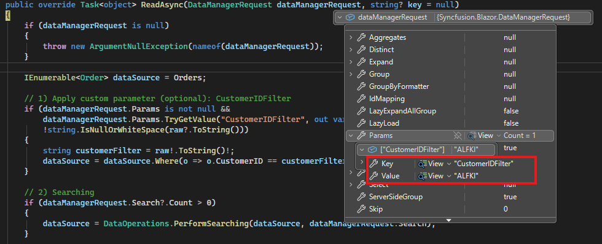

## Inject services into CustomAdaptor

A `CustomAdaptor` can retrieve data through application services by using dependency injection (DI). This enables the adaptor to access structured data sources such as repositories, API clients, or database‑access layers.

Service injection is only required when the adaptor depends on an external or business‑layer service.
When using an in‑memory collection, service injection is not necessary.

The following minimal setup shows only how to register a service and inject it into a CustomAdaptor, then bind the adaptor to the DataGrid.


**Register the Service and CustomAdaptor in Program.cs**

Register both the service and the adaptor to enable constructor injection.

```csharp
// Register data-access service and adaptor (constructor injection)
builder.Services.AddScoped<OrderDataAccessLayer>();
builder.Services.AddScoped<CustomAdaptor>();
```

**Bind the CustomAdaptor to the DataGrid**

Configure the `DataGrid` to use the custom adaptor by assigning `CustomAdaptor` to the [Adaptor](https://help.syncfusion.com/cr/blazor/Syncfusion.Blazor.DataManager.html#Syncfusion_Blazor_DataManager_Adaptor) property of [DataManager](https://help.syncfusion.com/cr/blazor/Syncfusion.Blazor.DataManager.html) and specifying the [AdaptorInstance](https://help.syncfusion.com/cr/blazor/Syncfusion.Blazor.DataManager.html#Syncfusion_Blazor_DataManager_AdaptorInstance) registered in the application.

```csharp

<SfGrid TItem="OrderDetails"
        ID="OrdersGrid"
        Width="100%"
        AllowSorting="true"
        AllowFiltering="true"
        AllowPaging="true">

    <!-- Route all DataGrid requests through the DI-backed CustomAdaptor -->
    <SfDataManager Adaptor="Adaptors.CustomAdaptor"
                   AdaptorInstance="@typeof(CustomAdaptor)" />

    <!-- Grid columns configuration -->
</SfGrid>
```

**Inject the Service into CustomAdaptor**

Inject the service inside the adaptor and use it in the `ReadAsync` method to return the data to the DataGrid.

```csharp
@code {

    /// <summary>
    /// Custom adaptor that retrieves order data through an injected service
    /// and applies DataManager operations before returning the processed result.
    /// </summary>
    public sealed class CustomAdaptor : DataAdaptor
    {
        private readonly OrderService _orderService;

        public CustomAdaptor(OrderService orderService)
        {
            _orderService = orderService ?? throw new ArgumentNullException(nameof(orderService));
        }

        /// <summary>
        /// Reads data and applies DataManager operations (search, sort, filter, page).
        /// Returns a <see cref="DataResult"/> when counts are required; otherwise returns the processed collection.
        /// </summary>
        /// <param name="dataManagerRequest">
        /// Specifies the full set of data operations requested by the DataGrid.
        /// </param>
        /// <param name="key">
        /// Optional correlation key associated with the request; not used.
        /// </param>
        public override Task<object> ReadAsync(DataManagerRequest dataManagerRequest, string? key = null)
        {
            // 1) Base data from the injected service
            IEnumerable<OrderDetails> dataSource = _orderService.GetOrders();

            // 2) Searching
            if (dataManagerRequest.Search?.Count > 0)
            {
                dataSource = DataOperations.PerformSearching(dataSource, dataManagerRequest.Search);
            }

            // 3) Sorting
            if (dataManagerRequest.Sorted?.Count > 0)
            {
                dataSource = DataOperations.PerformSorting(dataSource, dataManagerRequest.Sorted);
            }

            // 4) Filtering
            if (dataManagerRequest.Where?.Count > 0)
            {
                dataSource = DataOperations.PerformFiltering(
                    dataSource,
                    dataManagerRequest.Where,
                    dataManagerRequest.Where[0].Operator);
            }

            // 5) Total count BEFORE paging (for pager when RequiresCounts = true)
            int count = dataSource.Count();

            // 6) Paging (Skip → Take)
            if (dataManagerRequest.Skip != 0)
            {
                dataSource = DataOperations.PerformSkip(dataSource, dataManagerRequest.Skip);
            }
            if (dataManagerRequest.Take != 0)
            {
                dataSource = DataOperations.PerformTake(dataSource, dataManagerRequest.Take);
            }

            // 7) Return DataResult when counts are required; otherwise return the collection
            if (dataManagerRequest.RequiresCounts)
            {
                var result = new DataResult
                {
                    Result = dataSource,
                    Count  = count
                };

                return Task.FromResult<object>(result);
            }

            return Task.FromResult<object>(dataSource);
        }
    }
}
```

**For Detailed and Advanced Scenarios**

This section provides only the minimal required setup for service injection into a `CustomAdaptor`.
For complete workflows, including database integration, ORM providers, and real‑time backends, refer to:

* [Connecting to Database (SQL Server)](https://blazor.syncfusion.com/documentation/datagrid/connecting-to-database/microsoft-sql-server)
* [Connecting to ORM with Dapper](https://blazor.syncfusion.com/documentation/datagrid/connecting-to-orm/dapper)
* [Connecting to backends with SignalR](https://blazor.syncfusion.com/documentation/datagrid/connecting-to-backends/signalr)

These guides include CRUD operations, real data providers, DI lifecycle considerations, Stored Procedures, Dapper mappings, and SignalR‑based updates.

## Custom Adaptor as a component

A Custom Adaptor can be implemented as a reusable component to encapsulate data‑processing logic outside of page files. Creating the adaptor as a component enables clean separation of concerns (UI vs. data operations), reuse across multiple DataGrids, and straightforward integration with dependency injection when services are required.

**Purpose**

* Centralize reading and transformation of data (searching, sorting, filtering, paging, grouping, aggregates).
* Keep pages focused on layout and column configuration.
* Enable service resolution through `OwningComponentBase`/`OwningComponentBase&lt;T&gt;` when needed.

**When to use**

* Multiple pages share the same data‑processing pipeline.
* Additional parameters (for example, tenant, role, or field filters) must be applied consistently.
* A service layer or repository must be consumed from an adaptor without cluttering page code.

### Step 1: Install and Configure Blazor DataGrid Components

Before configuring the `CustomAdaptor`, the setup steps—installing the Syncfusion NuGet package, registering Syncfusion services, adding script and style references, and importing required namespaces—are already covered in **Integrating the Syncfusion<sup style="font-size:70%">&reg;</sup> Blazor DataGrid with a CustomAdaptor**. [🔗](#integrating-the-syncfusion-blazor-datagrid-with-a-customadaptor). Refer to that section first to complete the base configuration.

### Step 2: Create the model class

Create a **Models** folder and add a model class named **OrderDetails.cs**. This class defines the data structure expected from the remote source and processed by the `CustomAdaptor`.

```csharp

namespace CustomAdaptor.Models
{
    /// <summary>
    /// Represents an order entity used by the <c>CustomAdaptor</c> during data operations
    /// such as searching, sorting, filtering, paging, grouping, and aggregates.
    /// </summary>
    public sealed class OrderDetails
    {
        /// <summary>
        /// Backing field for the in-memory dataset.
        /// Populated only once during the first call to <see cref="GetAllRecords"/>.
        /// </summary>
        private static readonly List<OrderDetails> _orders = new();

        /// <summary>
        /// Initializes a new instance of the <see cref="OrderDetails"/> class.
        /// Default constructor required for model binding and serialization.
        /// </summary>
        public OrderDetails()
        {
        }

        /// <summary>
        /// Initializes a new instance of the <see cref="OrderDetails"/> class with all fields.
        /// </summary>
        /// <param name="orderId">Order identifier.</param>
        /// <param name="customerId">Customer identifier.</param>
        /// <param name="shipCity">Destination city.</param>
        /// <param name="shipCountry">Destination country.</param>
        /// <param name="freight">Freight amount associated with the order.</param>
        /// <param name="orderDate">Order creation date.</param>
        public OrderDetails(
            int orderId,
            string customerId,
            string shipCity,
            string shipCountry,
            double freight,
            DateTime orderDate)
        {
            OrderId = orderId;
            CustomerId = customerId;
            ShipCity = shipCity;
            ShipCountry = shipCountry;
            Freight = freight;
            OrderDate = orderDate;
        }

        /// <summary>
        /// Returns the in-memory collection of orders.
        /// Initializes the data source on first access.
        /// </summary>
        /// <returns>A list of <see cref="OrderDetails"/> entities.</returns>
        public static List<OrderDetails> GetAllRecords()
        {
            if (_orders.Count == 0)
            {
                Seed(_orders);
            }

            return _orders;
        }

        /// <summary>
        /// Populates the provided collection with deterministic sample records.
        /// </summary>
        /// <param name="target">The list to populate with sample data.</param>
        private static void Seed(List<OrderDetails> target)
        {
            int baseId = 10000;

            for (int i = 1; i <= 15; i++)
            {
                target.Add(new OrderDetails(baseId + 1, "ALFKI", "Berlin",  "Germany",  12.5 * i, new DateTime(2025, 01, 05)));
                target.Add(new OrderDetails(baseId + 2, "ANATR", "Madrid",  "Spain",    14.0 * i, new DateTime(2025, 02, 04)));
                target.Add(new OrderDetails(baseId + 3, "ANTON", "Rome",    "Italy",    16.0 * i, new DateTime(2025, 03, 06)));
                target.Add(new OrderDetails(baseId + 4, "BLONP", "Paris",   "France",   18.5 * i, new DateTime(2025, 04, 08)));
                target.Add(new OrderDetails(baseId + 5, "BOLID", "Lisbon",  "Portugal", 21.0 * i, new DateTime(2025, 05, 10)));

                baseId += 5;
            }
        }

        /// <summary>
        /// Gets or sets the order identifier.
        /// </summary>
        public int OrderId { get; set; }

        /// <summary>
        /// Gets or sets the customer identifier.
        /// </summary>
        public string CustomerId { get; set; } = string.Empty;

        /// <summary>
        /// Gets or sets the destination city.
        /// </summary>
        public string ShipCity { get; set; } = string.Empty;

        /// <summary>
        /// Gets or sets the destination country.
        /// </summary>
        public string ShipCountry { get; set; } = string.Empty;

        /// <summary>
        /// Gets or sets the freight amount associated with the order.
        /// </summary>
        public double Freight { get; set; }

        /// <summary>
        /// Gets or sets the date on which the order was created.
        /// </summary>
        public DateTime OrderDate { get; set; }
    }
}
```
### Step 3: Register the service in Program.cs

Service registration in **Program.cs** is required only when the `CustomAdaptor` uses dependency injection to obtain the data source. This applies in the following cases:

* When using `DataAdaptor&lt;T&gt;`, because the generic type `T` must be resolved from the dependency injection container.
* When using the non‑generic `DataAdaptor` and retrieving data from scoped services through `ScopedServices`.

If a service‑based model or provider is used, register it as shown:

```csharp
// Register when using DataAdaptor<T> or when resolving data through DI.
builder.Services.AddScoped<OrderDetails>();

```

When the adaptor uses the non‑generic `DataAdaptor` pattern with a static in‑memory collection
(for example, `OrderDetails.GetAllRecords()`), service registration is not required, because no dependency injection lookup occurs.

### Step 4: Create the Custom Adaptor component

Create a file named **CustomAdaptorComponent.razor** under the **Components** folder and implement the adaptor by choosing one of the following approaches based on the data source:

**Option A — Component based on DataAdaptor&lt;T&gt; (single service)**

Use `DataAdaptor&lt;T&gt;` extended from `OwningComponentBase&lt;T&gt;` when the adaptor retrieves data through a single scoped service registered in **Program.cs**.

This approach provides one service instance of type `T`, available through the `Service` property.

```csharp

@inherits DataAdaptor<OrderDetails>

<CascadingValue Value="@this">
    @ChildContent
</CascadingValue>

@code {
    /// <summary>
    /// Projected child content (placeholder inside SfDataManager).
    /// </summary>
    [Parameter]
    public RenderFragment? ChildContent { get; set; }

    /// <summary>
    /// Retrieves records and applies the operations described by the <see cref="DataManagerRequest"/>.
    /// Executes during initial grid load and whenever filtering, searching, sorting,
    /// paging, grouping, or other data operations are triggered.
    /// </summary>
    /// <param name="dataManagerRequest">
    /// Describes the requested data operations from the DataGrid.
    /// </param>
    /// <param name="key">
    /// Optional correlation key; not used.
    /// </param>
    /// <returns>
    /// Returns a <see cref="DataResult"/> when counts are required; otherwise returns the collection.
    /// </returns>
    public override async Task<object> ReadAsync(DataManagerRequest dataManagerRequest, string? key = null)
    {
        try
        {
            // Retrieve the in‑memory data collection.
            IEnumerable<OrderDetails> dataSource = OrderDetails.GetAllRecords();

            // -----------------
            // Searching
            // -----------------
            if (dataManagerRequest.Search is { Count: > 0 })
            {
                dataSource = DataOperations.PerformSearching(
                    dataSource,
                    dataManagerRequest.Search);
            }

            // -----------------
            // Filtering
            // -----------------
            if (dataManagerRequest.Where is { Count: > 0 })
            {
                dataSource = DataOperations.PerformFiltering(
                    dataSource,
                    dataManagerRequest.Where,
                    dataManagerRequest.Where[0].Operator);
            }
            // -----------------
            // Sorting
            // -----------------
            if (dataManagerRequest.Sorted is { Count: > 0 })
            {
                dataSource = DataOperations.PerformSorting(
                    dataSource,
                    dataManagerRequest.Sorted);
            }

            // Compute the total number of records.
            int totalRecordsCount = dataSource.Count();

            // -----------------
            // Paging (Skip/Take)
            // -----------------
            if (dataManagerRequest.Skip > 0)
            {
                dataSource = DataOperations.PerformSkip(dataSource, dataManagerRequest.Skip);
            }

            if (dataManagerRequest.Take > 0)
            {
                dataSource = DataOperations.PerformTake(dataSource, dataManagerRequest.Take);
            }

            // When RequiresCounts = true, return DataResult; otherwise return the collection.
            return dataManagerRequest.RequiresCounts
                ? new DataResult
                {
                    Result = dataSource,
                    Count = totalRecordsCount
                }
                : (object)dataSource;
        }
        catch (Exception ex)
        {
            throw new InvalidOperationException(
                $"Data retrieval failed in CustomAdaptor: {ex.Message}", ex);
        }
    }
}
```

**Option B — Component based on DataAdaptor (multiple services or in‑memory source)**

Use the non‑generic `DataAdaptor` extended from `OwningComponentBase` when the adaptor relies on in‑memory data
(e.g., `OrderDetails.GetAllRecords()`) or when multiple services are resolved manually through `ScopedServices`. This option avoids DI for simple in‑memory scenarios and remains reusable.


```csharp

@inherits DataAdaptor

<CascadingValue Value="@this">
    @ChildContent
</CascadingValue>

@code {
    /// <summary>
    /// Projected child content (placeholder inside SfDataManager).
    /// </summary>
    [Parameter]
    public RenderFragment? ChildContent { get; set; }

    /// <summary>
    /// Retrieves records and applies the operations described by the <see cref="DataManagerRequest"/>.
    /// Executes during initial grid load and whenever filtering, searching, sorting,
    /// paging, grouping, or other data operations are triggered.
    /// </summary>
    /// <param name="dataManagerRequest">
    /// Describes the requested data operations from the DataGrid.
    /// </param>
    /// <param name="key">
    /// Optional correlation key; not used.
    /// </param>
    /// <returns>
    /// Returns a <see cref="DataResult"/> when counts are required; otherwise returns the collection.
    /// </returns>
    public override object Read(DataManagerRequest dataManagerRequest, string? key = null)
    {
        try
        {
            // Retrieve the in‑memory data collection.
            IEnumerable<OrderDetails> dataSource = OrderDetails.GetAllRecords();

            // -----------------
            // Searching
            // -----------------
            if (dataManagerRequest.Search is { Count: > 0 })
            {
                dataSource = DataOperations.PerformSearching(
                    dataSource,
                    dataManagerRequest.Search);
            }

            // -----------------
            // Filtering
            // -----------------
            if (dataManagerRequest.Where is { Count: > 0 })
            {
                dataSource = DataOperations.PerformFiltering(
                    dataSource,
                    dataManagerRequest.Where,
                    dataManagerRequest.Where[0].Operator);
            }
            // -----------------
            // Sorting
            // -----------------
            if (dataManagerRequest.Sorted is { Count: > 0 })
            {
                dataSource = DataOperations.PerformSorting(
                    dataSource,
                    dataManagerRequest.Sorted);
            }

            // Compute the total number of records.
            int totalRecordsCount = dataSource.Count();

            // -----------------
            // Paging (Skip/Take)
            // -----------------
            if (dataManagerRequest.Skip > 0)
            {
                dataSource = DataOperations.PerformSkip(dataSource, dataManagerRequest.Skip);
            }

            if (dataManagerRequest.Take > 0)
            {
                dataSource = DataOperations.PerformTake(dataSource, dataManagerRequest.Take);
            }

            // When RequiresCounts = true, return DataResult; otherwise return the collection.
            return dataManagerRequest.RequiresCounts
                ? new DataResult
                {
                    Result = dataSource,
                    Count = totalRecordsCount
                }
                : (object)dataSource;
        }
        catch (Exception ex)
        {
            throw new InvalidOperationException(
                $"Data retrieval failed in CustomAdaptor: {ex.Message}", ex);
        }
    }
}
```

### Step 5: Bind the Custom Adaptor component to the DataGrid

Configure the DataGrid to use the custom adaptor by assigning `CustomAdaptor` to the [Adaptor](https://help.syncfusion.com/cr/blazor/Syncfusion.Blazor.DataManager.html#Syncfusion_Blazor_DataManager_Adaptor) property of [DataManager](https://help.syncfusion.com/cr/blazor/Syncfusion.Blazor.DataManager.html).

Place the custom adaptor component inside `<SfDataManager>` and include `<CustomAdaptorComponent>` as a child element.

To configure this, open **Components/Pages/Home.razor** and add the DataGrid and DataManager as shown:

```csharp

@using CustomAdaptor.Components

<SfGrid TValue="OrderDetails"
        Width="100%"
        AllowSorting="true"
        AllowFiltering="true"
        AllowPaging="true"
        Toolbar="@(new List<string> { "Search" })">

    <!-- Bind the Custom Adaptor component -->
    <SfDataManager Adaptor="Adaptors.CustomAdaptor">
        <CustomAdaptorComponent></CustomAdaptorComponent>
    </SfDataManager>

    <GridPageSettings PageSize="10" />

    <GridColumns>
        <GridColumn Field=@nameof(OrderDetails.OrderId)
                    HeaderText="Order ID"
                    TextAlign="TextAlign.Right"
                    Width="140" />
        <GridColumn Field=@nameof(OrderDetails.CustomerId)
                    HeaderText="Customer ID"
                    Width="160" />
        <GridColumn Field=@nameof(OrderDetails.ShipCity)
                    HeaderText="Ship City"
                    Width="140" />
        <GridColumn Field=@nameof(OrderDetails.ShipCountry)
                    HeaderText="Ship Country"
                    Width="160" />
        <GridColumn Field=@nameof(OrderDetails.Freight)
                    HeaderText="Freight"
                    Format="C2"
                    TextAlign="TextAlign.Right"
                    Width="130" />
        <GridColumn Field=@nameof(OrderDetails.OrderDate)
                    HeaderText="Order Date"
                    Type="ColumnType.Date"
                    Format="d"
                    TextAlign="TextAlign.Right"
                    Width="140" />
    </GridColumns>
</SfGrid>
```

### Step 6: Run the application

Build and run the project to verify that DataGrid requests are routed through the custom adaptor component.

When the page loads, the DataGrid initializes and triggers the adaptor’s read pipeline; subsequent actions—such as **sorting**, **filtering**, **searching**, and **paging**—are processed by the adaptor and rendered by the Grid.

## Troubleshooting

| # | Symptom / Error Message                                                                 | Most Common Cause(s)                                                                                              | Quick Fix / Check |
|---|------------------------------------------------------------------------------------------|--------------------------------------------------------------------------------------------------------------------|-------------------|
| 1 | Grid renders empty or shows no rows                                                      | Returned value shape is incorrect; `RequiresCounts = true` but adaptor did not return `DataResult`                 | When counts are required, return `new DataResult { Result = data, Count = total }`; otherwise return the collection. |
| 2 | Pager shows wrong total count                                                            | `Count` computed after paging, or computed before search/filter/sort                                               | Compute `totalCount` **after** search/filter/sort and **before** `Skip/Take`. |
| 3 | Grouping fails or renders flat data                                                      | Group hierarchy not built; grouped result not wrapped in `DataResult`                                              | Use `DataUtil.Group<T>` to build hierarchy and return `DataResult { Result = grouped, Count = total, Aggregates = ... }`. |
| 4 | Aggregates missing or always zero                                                        | Aggregates not computed, or computed on paged subset                                                               | Compute aggregates on the processed but **unpaged** collection and include them in `DataResult` when needed. |
| 5 | Search has no effect                                                                     | `DataManagerRequest.Search` not applied, or applied after paging                                                   | Apply `PerformSearching` before computing `totalCount` and before paging; include the `"Search"` toolbar item if needed. |
| 6 | Filtering yields unexpected / no results                                                 | Missing operator argument in `PerformFiltering`; wrong pipeline order                                              | Call `PerformFiltering(data, request.Where, request.Where[0].Operator)` before `totalCount` and paging. |
| 7 | Sorting ignored or unstable order                                                        | Sorting executed after paging or not applied                                                                       | Apply `PerformSorting` prior to `totalCount` and prior to paging. |
| 8 | Custom parameter (e.g., `CustomerIDFilter`) not applied                                  | `Query` not bound; key mismatch between `AddParams` and `Params.TryGetValue`                                       | Bind `Query="@GridQuery"` and ensure matching keys; read parameters early in `Read`/`ReadAsync`. |
| 9 | **Using the generic type `IEnumerable<T>` requires 1 type arguments** during grouping    | Missing namespace for non‑generic `IEnumerable` when building grouped hierarchy                                    | Add `@using System.Collections` so `IEnumerable` (non‑generic) resolves; grouping uses `DataUtil.Group<T>` with hierarchical `IEnumerable`. |
| 10 | Insert does not assign primary key                                                      | New entity key not generated when zero/unassigned                                                                  | If key `<= 0`, set `nextId = Max(OrderId) + 1` (or seed) before inserting into the collection. |
| 11 | Update appears to do nothing                                                            | Primary key column not marked; adaptor cannot locate the record                                                    | Ensure grid column has `IsPrimaryKey="true"` and adaptor looks up by that key before updating fields. |
| 12 | `Read`/`ReadAsync` not invoked as expected                                              | Wrong override for adaptor type (component vs. class)                                                              | Component‑based adaptor: override **`Read`**; class‑based adaptor (`@code`/`.cs`): override **`ReadAsync`**. |


## Complete Sample Repository

A complete, working sample implementation is available in the GitHub repository.

* [Custom Adaptor](https://github.com/SyncfusionExamples/Binding-data-from-remote-service-to-blazor-data-grid/tree/master/CustomAdaptor)
* [Custom Adaptor as Component](https://github.com/SyncfusionExamples/Binding-data-from-remote-service-to-blazor-data-grid/tree/master/CustomAdaptor-as-component)
* [How to pass additional parameters to custom adaptor](https://github.com/SyncfusionExamples/Binding-data-from-remote-service-to-blazor-data-grid/blob/master/CustomAdaptor/Components/Pages/Counter.razor)

## See also

* [Connect to custom APIs](https://blazor.syncfusion.com/documentation/datagrid/connecting-to-adaptors/url-adaptor)
* [Connecting to ODataV4 services](https://blazor.syncfusion.com/documentation/datagrid/connecting-to-adaptors/odatav4-adaptor)
* [Using Web API services](https://blazor.syncfusion.com/documentation/datagrid/connecting-to-adaptors/web-api-adaptor)
* [GraphQL Integration for Syncfusion Blazor DataGrid](https://blazor.syncfusion.com/documentation/datagrid/connecting-to-adaptors/graphql-adaptor)