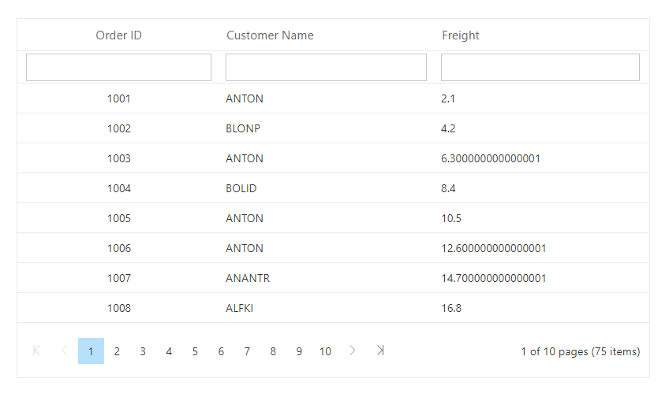
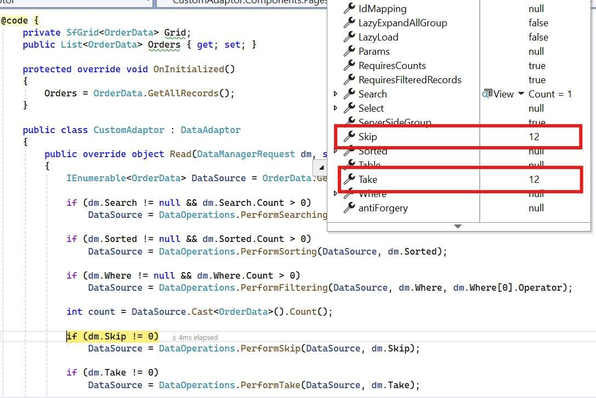
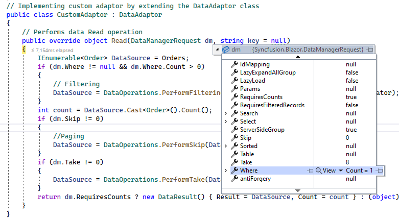
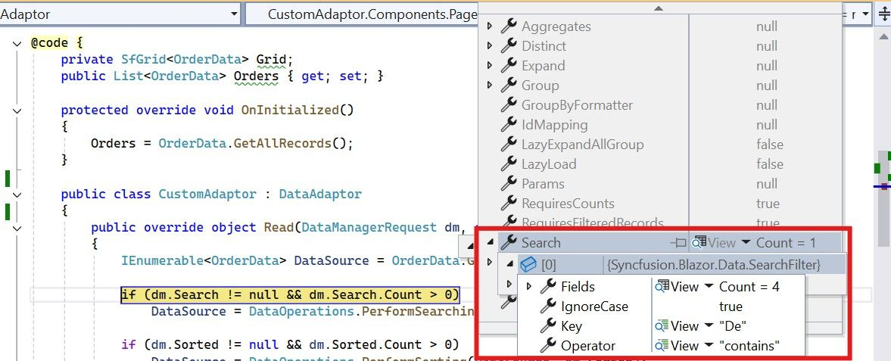
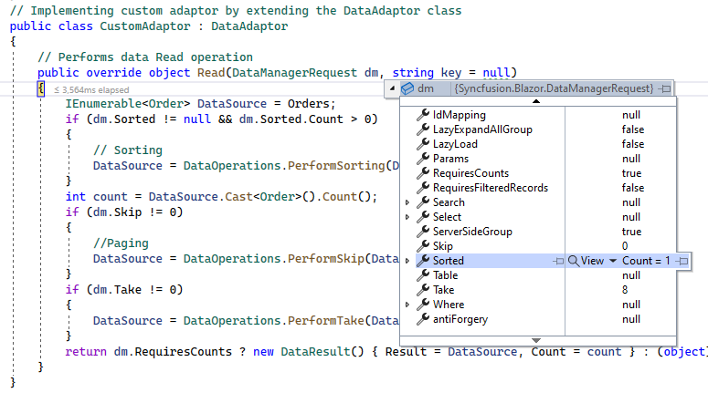
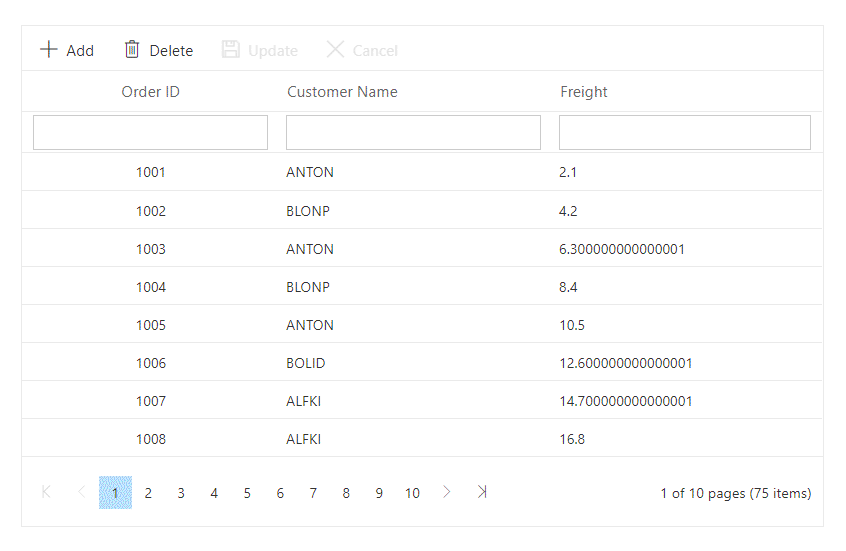
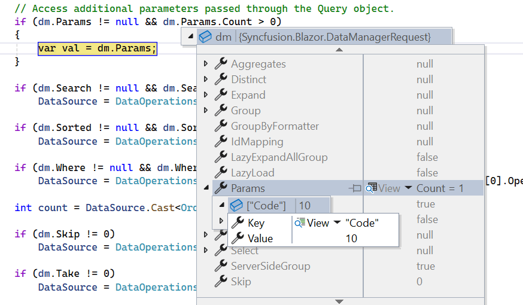

Learn about Custom Data Binding and perform CRUD operations using CustomAdaptor in Syncfusion Blazor DataGrid.

# Custom Binding in Blazor DataGrid

Custom binding in the Syncfusion<sup style="font-size:70%">&reg;</sup> Blazor [SfDataManager](https://help.syncfusion.com/cr/blazor/Syncfusion.Blazor.Data.SfDataManager.htm) provides a mechanism to implement custom logic for data retrieval and manipulation. It allows defining how data operations are executed by creating a [CustomAdaptor](https://help.syncfusion.com/cr/blazor/Syncfusion.Blazor.Adaptors.html#Syncfusion_Blazor_Adaptors_CustomAdaptor) that overrides default behavior. Instead of creating an entirely new adaptor from scratch, Custom Adaptor extends and modifies the behavior of existing adaptors by intercepting and customizing HTTP requests and responses.

The [DataAdaptor](https://help.syncfusion.com/cr/blazor/Syncfusion.Blazor.DataAdaptor.html) class is an abstract base that defines the interaction between the `SfDataManager` and an external data source. A custom adaptor derived from this class can override its virtual members to implement custom **data retrieval** and **CRUD** operations. These members include both synchronous and asynchronous methods such as **Read**, **Insert**, **Update**, **Remove**, and **BatchUpdate**, providing complete flexibility for integrating any data source while maintaining compatibility with Blazor [DataGrid](https://blazor.syncfusion.com/documentation/datagrid/getting-started-with-web-app) and other bound controls.

For more details on configuring the `CustomAdaptor` with Syncfusion Blazor Components, refer to the [Custom Adaptor documentation](https://blazor.syncfusion.com/documentation/data/adaptors).

To learn more about **Custom Binding** in the DataGrid, watch this video:



## Integrating Syncfusion Blazor DataGrid with CustomAdaptor

### Step 1: Install and Configure Blazor DataGrid

Syncfusion is a library that provides pre-built UI components like DataGrid, which is used to display data in a table format.

**Instructions:**

**1. Install Syncfusion<sup style="font-size:70%">&reg;</sup> Blazor DataGrid and Themes NuGet packages**

**Method 1: Using Package Manager Console**

1. Open Visual Studio 2026.
2. Navigate to Tools → NuGet Package Manager → Package Manager Console.
3. Run the following commands:

```powershell
Install-Package Syncfusion.Blazor.Grid -Version {{site.blazorversion}};
Install-Package Syncfusion.Blazor.Themes -Version {{site.blazorversion}};
```

**Method 2: Using NuGet Package Manager UI**

1. Open Visual Studio 2026 → Tools → NuGet Package Manager → Manage NuGet Packages for Solution.
2. Search for and install each package individually:
   - **[Syncfusion.Blazor.Grid](https://www.nuget.org/packages/Syncfusion.Blazor.Grid/)** (version {{site.blazorversion}})
   - **[Syncfusion.Blazor.Themes](https://www.nuget.org/packages/Syncfusion.Blazor.Themes/)** (version {{site.blazorversion}})

All required packages are now installed.

**2. Register Syncfusion<sup style="font-size:70%">&reg;</sup> Blazor service**

Import the required namespaces in the `Components/_Imports.razor` file:

```csharp
@using Syncfusion.Blazor
@using Syncfusion.Blazor.Grids
```
- Register the Syncfusion<sup style="font-size:70%">&reg;</sup> Blazor service in the **~/Program.cs** file.
 
```csharp
using Syncfusion.Blazor;
 
builder.Services.AddSyncfusionBlazor();
```
 For apps using `WebAssembly` or `Auto (Server and WebAssembly)` render modes, register the service in both **~/Program.cs** files.
 
**3. Add stylesheet and script resources**

Add the Syncfusion stylesheet and scripts in the `Components/App.razor` file. Find the `<head>` section and add:

```html
<!-- Syncfusion Blazor Stylesheet -->
<link href="_content/Syncfusion.Blazor.Themes/bootstrap5.css" rel="stylesheet" />

<!-- Syncfusion Blazor Scripts -->
<script src="_content/Syncfusion.Blazor.Core/scripts/syncfusion-blazor.min.js" type="text/javascript"></script>
```

For this project, the **bootstrap5** theme is used. A different theme can be selected or customized based on project requirements. Refer to the [Syncfusion Blazor Components Appearance](https://blazor.syncfusion.com/documentation/appearance/themes) documentation to learn more about theming and customization options.

Syncfusion components are now configured and ready to use. For additional guidance, refer to the DataGrid's [getting‑started](https://blazor.syncfusion.com/documentation/datagrid/getting-started-with-web-app) documentation.

### Step 2: Update the Blazor DataGrid with CustomAdaptor

Custom data binding can be performed in the Syncfusion<sup style="font-size:70%">&reg;</sup> Blazor DataGrid by providing a custom adaptor class and overriding the **Read** or **ReadAsync** method of the **DataAdaptor** abstract class.

* In Blazor DataGrid, assign the custom adaptor type to the [AdaptorInstance](https://help.syncfusion.com/cr/blazor/Syncfusion.Blazor.DataManager.html#Syncfusion_Blazor_DataManager_AdaptorInstance) property of the `SfDataManager`.

The following sample code demonstrates how to implement custom data binding using a `CustomAdaptor`:

```cshtml
@using Syncfusion.Blazor
@using Syncfusion.Blazor.Data
@using Syncfusion.Blazor.Grids

<SfGrid TValue="Order" ID="Grid" AllowSorting="true" AllowFiltering="true" AllowPaging="true">
    <SfDataManager AdaptorInstance="@typeof(CustomAdaptor)" Adaptor="Adaptors.CustomAdaptor"></SfDataManager>
    <GridPageSettings PageSize="8"></GridPageSettings>
    <GridColumns>
        <GridColumn Field=@nameof(Order.OrderID) HeaderText="Order ID" IsPrimaryKey="true" TextAlign="@TextAlign.Right" Width="140"></GridColumn>
        <GridColumn Field=@nameof(Order.CustomerID) HeaderText="Customer Name" Width="150"></GridColumn>
        <GridColumn Field=@nameof(Order.Freight) HeaderText="Freight" Format="C2" Width="150"></GridColumn>
    </GridColumns>
</SfGrid>

@code{

    public static List<Order> Orders { get; set; }

    protected override void OnInitialized()
    {
        Orders = Enumerable.Range(1, 75).Select(x => new Order()
        {
            OrderID = 1000 + x,
            CustomerID = (new string[] { "ALFKI", "ANANTR", "ANTON", "BLONP", "BOLID" })[new Random().Next(5)], // Randomly assigns a CustomerID.
            Freight = 2.1 * x,
        }).ToList();
    }

    public class Order
    {
        public int OrderID { get; set; }
        public string CustomerID { get; set; }
        public double Freight { get; set; }
    }

    // Custom adaptor implementation by extending the DataAdaptor class.
    public class CustomAdaptor : DataAdaptor
    {
        // Performs the data read operation.
        public override object Read(DataManagerRequest dm, string key = null)
        {
            // Retrieves the data source.
            IEnumerable<Order> DataSource = Orders;

            if (dm.Search != null && dm.Search.Count > 0)
            {
                // Performs searching on the data source.
                DataSource = DataOperations.PerformSearching(DataSource, dm.Search);
            }
            if (dm.Sorted != null && dm.Sorted.Count > 0)
            {
                // Performs sorting on the data source.
                DataSource = DataOperations.PerformSorting(DataSource, dm.Sorted);
            }
            if (dm.Where != null && dm.Where.Count > 0)
            {
                // Performs filtering on the data source.
                DataSource = DataOperations.PerformFiltering(DataSource, dm.Where, dm.Where[0].Operator);
            }

            // Counts the total records.
            int count = DataSource.Cast<Order>().Count();

            if (dm.Skip != 0)
            {
                // Skips the specified number of records for paging.
                DataSource = DataOperations.PerformSkip(DataSource, dm.Skip);
            }
            if (dm.Take != 0)
            {
                // Takes the specified number of records for paging.
                DataSource = DataOperations.PerformTake(DataSource, dm.Take);
            }

            DataResult DataObject = new DataResult();

            // Checks if aggregation is required.
            if (dm.Aggregates != null)
            {
                DataObject.Result = DataSource;
                DataObject.Count = count;

                // Performs aggregation.
                DataObject.Aggregates = DataUtil.PerformAggregation(DataSource, dm.Aggregates);

                // Returns the result with or without counts.
                return dm.RequiresCounts ? DataObject : (object)DataSource; 
            }
            // Returns the result.
            return dm.RequiresCounts ? new DataResult() { Result = DataSource, Count = count } : (object)DataSource; 
        }
    }
}
```

> If the **DataManagerRequest.RequiresCounts** value is **true**, the `Read/ReadAsync` return value must be of type **DataResult** with properties **Result** (a collection of records) and **Count** (the total number of records). If the **DataManagerRequest.RequiresCounts** is **false**, simply return the collection of records.

> If the `Read/ReadAsync` method is not overridden in the custom adaptor, it will be handled by the default read handler.

### Step 4: Running the Application

**Build the Application**

1. Open PowerShell or your terminal.
2. Navigate to the project directory.
3. Build the application:

```powershell
dotnet build
```

**Run the Application**

Execute the following command:

```powershell
dotnet run
```

The application will start, and the console will display the local URL (typically `http://localhost:5175` or `https://localhost:5001`).

**Access the Application**

1. Open a web browser.
2. Navigate to the URL displayed in the console.
3. The DataGrid application is now running and ready to use.

The following image shows the custom-bound data displayed in the DataGrid:



## Inject Service into Custom Adaptor

If you want to inject a service into the Custom Adaptor and use it, you can achieve this as shown below.

First, register the required services in the `Program.cs` file. Add the `OrderDataAccessLayer` as a singleton, and the `CustomAdaptor` and `ServiceClass` as scoped services.

```csharp
// Registering services in the Program.cs file.
builder.Services.AddSingleton<OrderDataAccessLayer>();
builder.Services.AddScoped<CustomAdaptor>();
builder.Services.AddScoped<ServiceClass>();
```

The following sample code demonstrates how to inject a service into the Custom Adaptor and use it for data operations:

```cshtml
@using Syncfusion.Blazor.Data
@using Syncfusion.Blazor.Grids
@using Syncfusion.Blazor

<SfGrid TValue="Order" ID="Grid" AllowSorting="true" AllowFiltering="true" AllowPaging="true">
    <SfDataManager AdaptorInstance="@typeof(CustomAdaptor)" Adaptor="Adaptors.CustomAdaptor"></SfDataManager>
    <GridPageSettings PageSize="8"></GridPageSettings>
    <GridColumns>
        <GridColumn Field=@nameof(Order.OrderID) HeaderText="Order ID" IsPrimaryKey="true" TextAlign="@TextAlign.Right" Width="140"></GridColumn>
        <GridColumn Field=@nameof(Order.CustomerID) HeaderText="Customer Name" Width="150"></GridColumn>
        <GridColumn Field=@nameof(Order.Freight) HeaderText="Freight" Width="150"></GridColumn>
    </GridColumns>
</SfGrid>

@code{
    // Custom adaptor class that extends the DataAdaptor class.
    public class CustomAdaptor : DataAdaptor
    {
        // Injected service for data access.
        public OrderDataAccessLayer context { get; set; }

        // Constructor to initialize the injected service.
        public CustomAdaptor(OrderDataAccessLayer _context)
        {
            context = _context;
        }

        // Performs the data read operation.
        public override object Read(DataManagerRequest dm, string key = null)
        {
            // Retrieves the data source from the injected service.
            IEnumerable<Order> DataSource = context.GetAllOrders();

            // Performs searching if search criteria are provided.
            if (dm.Search != null && dm.Search.Count > 0)
            {
                DataSource = DataOperations.PerformSearching(DataSource, dm.Search);
            }

            // Performs sorting if sorting criteria are provided.
            if (dm.Sorted != null && dm.Sorted.Count > 0)
            {
                DataSource = DataOperations.PerformSorting(DataSource, dm.Sorted);
            }

            // Performs filtering if filter criteria are provided.
            if (dm.Where != null && dm.Where.Count > 0)
            {
                DataSource = DataOperations.PerformFiltering(DataSource, dm.Where, dm.Where[0].Operator);
            }

            // Counts the total number of records.
            int count = DataSource.Cast<Order>().Count();

            // Performs paging by skipping the specified number of records.
            if (dm.Skip != 0)
            {
                DataSource = DataOperations.PerformSkip(DataSource, dm.Skip);
            }

            // Takes the specified number of records for paging.
            if (dm.Take != 0)
            {
                DataSource = DataOperations.PerformTake(DataSource, dm.Take);
            }

            // Returns the result with or without counts based on the request.
            return dm.RequiresCounts ? new DataResult() { Result = DataSource, Count = count } : (object)DataSource;
        }
    }
}
```

## Custom Adaptor as a Component

A Custom Adaptor can be created as a component when the `DataAdaptor` class is extended from `OwningComponentBase`. The Custom Adaptor can be implemented using either of the two versions of the class: [DataAdaptor](https://help.syncfusion.com/cr/blazor/Syncfusion.Blazor.DataAdaptor.html) or [DataAdaptor<T>](https://help.syncfusion.com/cr/blazor/Syncfusion.Blazor.DataAdaptor-1.html).

### Step 1: Service Registration

Make sure that the required service is registered in the **Program.cs** file.

```csharp
// Register the order service as scoped in the Program.cs file.
builder.Services.AddScoped<Order>();
```

### Step 2: Create DataGrid with Custom Adaptor Component

Configure an `SfGrid` to use a Custom Adaptor component. Nest `CustomAdaptorComponent` inside `SfDataManager` so the adaptor participates in the component lifecycle and can receive scoped services for data access.

```cs
@using Syncfusion.Blazor
@using Syncfusion.Blazor.Data
@using Syncfusion.Blazor.Grids

<SfGrid TValue="Order" ID="Grid" AllowSorting="true" AllowFiltering="true" AllowPaging="true">
    <SfDataManager Adaptor="Adaptors.CustomAdaptor">
        <CustomAdaptorComponent></CustomAdaptorComponent>
    </SfDataManager>
    <GridPageSettings PageSize="8"></GridPageSettings>
    <GridColumns>
        <GridColumn Field=@nameof(Order.OrderID) HeaderText="Order ID" IsPrimaryKey="true" TextAlign="@TextAlign.Right" Width="140"></GridColumn>
        <GridColumn Field=@nameof(Order.CustomerID) HeaderText="Customer Name" Width="150"></GridColumn>
        <GridColumn Field=@nameof(Order.Freight) HeaderText="Freight" TextAlign="@TextAlign.Right" Width="140"></GridColumn>
    </GridColumns>
</SfGrid>

@code{
    public static List<Order> Orders { get; set; }

    public class Order
    {
        public List<Order> GetAllRecords()
        {
            Orders = Enumerable.Range(1, 75).Select(x => new Order()
            {
                OrderID = 1000 + x,
                CustomerID = (new string[] { "ALFKI", "ANANTR", "ANTON", "BLONP", "BOLID" })[new Random().Next(5)],
                Freight = 2.1 * x,
            }).ToList();
            return Orders;
        }
        public int OrderID { get; set; }
        public string CustomerID { get; set; }
        public double Freight { get; set; }
    }
}
```

### Step 3: Create a Component Adaptor with OwningComponentBase<T>

Use `DataAdaptor<T>` with `OwningComponentBase<T>` to receive a single scoped service via `Service`. Use that service in `Read`/`ReadAsync`, apply `DataOperations` (search/sort/filter/page), and return a collection or a `DataResult`.

```csharp
// CustomAdaptorComponent.razor

@using Syncfusion.Blazor
@using Syncfusion.Blazor.Data
@using Newtonsoft.Json
@using static BlazorApp1.Pages.Index

@inherits DataAdaptor<Order>

<CascadingValue Value="@this">
    @ChildContent
</CascadingValue>

@code {
    // Parameter to hold child content (render fragment).
    [Parameter]
    [JsonIgnore]
    public RenderFragment ChildContent { get; set; }

    // Method to perform data read operation.
    public override object Read(DataManagerRequest dm, string key = null)
    {
        // Retrieve data source from the service.
        IEnumerable<Order> DataSource = (IEnumerable<Order>)Service.GetAllRecords();

        // Perform searching if search criteria are provided.
        if (dm.Search != null && dm.Search.Count > 0)
        {
            DataSource = DataOperations.PerformSearching(DataSource, dm.Search);
        }

        // Perform sorting if sorting criteria are provided.
        if (dm.Sorted != null && dm.Sorted.Count > 0)
        {
            DataSource = DataOperations.PerformSorting(DataSource, dm.Sorted);
        }

        // Perform filtering if filter criteria are provided.
        if (dm.Where != null && dm.Where.Count > 0)
        {
            DataSource = DataOperations.PerformFiltering(DataSource, dm.Where, dm.Where[0].Operator);
        }

        // Count the total number of records.
        int count = DataSource.Cast<Order>().Count();

        // Perform paging by skipping the specified number of records.
        if (dm.Skip != 0)
        {
            DataSource = DataOperations.PerformSkip(DataSource, dm.Skip);
        }

        // Take the specified number of records for paging.
        if (dm.Take != 0)
        {
            DataSource = DataOperations.PerformTake(DataSource, dm.Take);
        }

        // Return the result with or without counts based on the request.
        return dm.RequiresCounts ? new DataResult() { Result = DataSource, Count = count } : (object)DataSource;
    }
}
```
**Key Points:**

- **[OwningComponentBase](https://learn.microsoft.com/en-us/dotnet/api/microsoft.aspnetcore.components.owningcomponentbase?view=aspnetcore-10.0)** is a Blazor base class that provides component-scoped dependency injection and lifecycle management. Extending from `OwningComponentBase` (or using `OwningComponentBase<T>`) lets an adaptor request scoped services and access the component lifecycle safely inside the adaptor component.

-**Newtonsoft.Json** imports the Json.NET namespace (Newtonsoft.Json). It's commonly used for attributes such as `[JsonIgnore]` and for advanced JSON serialization scenarios; in these examples it's used to allow `[JsonIgnore]` on component parameters.

### Step 4: Component Adaptor Accessing Multiple Scoped Services

Extend `DataAdaptor` from `OwningComponentBase` to resolve multiple scoped services via `ScopedServices`. Retrieve services in `Read`, use them to fetch data, then apply `DataOperations` (search/sort/filter/skip/take) and return the results.

```csharp
// CustomAdaptorComponent.razor

@using Syncfusion.Blazor
@using Syncfusion.Blazor.Data
@using static BlazorApp1.Pages.Index
@using Newtonsoft.Json

@inherits DataAdaptor

<CascadingValue Value="@this">
    @ChildContent
</CascadingValue>

@code {
    // Parameter to hold child content.
    [Parameter]
    [JsonIgnore]
    public RenderFragment ChildContent { get; set; }

    // Variable to hold order data.
    Order orderdata;

    // Method to perform data read operation.
    public override object Read(DataManagerRequest dm, string key = null)
    {
        // Retrieve the order service from scoped services.
        orderdata = (Order)ScopedServices.GetService(typeof(Order));

        // Retrieve data source from the service.
        IEnumerable<Order> DataSource = (IEnumerable<Order>)orderdata.GetAllRecords().Take(10);

        // Perform searching if search criteria are provided.
        if (dm.Search != null && dm.Search.Count > 0)
        {
            DataSource = DataOperations.PerformSearching(DataSource, dm.Search);
        }

        // Perform sorting if sorting criteria are provided.
        if (dm.Sorted != null && dm.Sorted.Count > 0)
        {
            DataSource = DataOperations.PerformSorting(DataSource, dm.Sorted);
        }

        // Perform filtering if filter criteria are provided.
        if (dm.Where != null && dm.Where.Count > 0)
        {
            DataSource = DataOperations.PerformFiltering(DataSource, dm.Where, dm.Where[0].Operator);
        }

        // Count the total number of records.
        int count = DataSource.Cast<Order>().Count();

        // Perform paging by skipping the specified number of records.
        if (dm.Skip != 0)
        {
            DataSource = DataOperations.PerformSkip(DataSource, dm.Skip);
        }

        // Take the specified number of records for paging.
        if (dm.Take != 0)
        {
            DataSource = DataOperations.PerformTake(DataSource, dm.Take);
        }

        // Return the result with or without counts based on the request.
        return dm.RequiresCounts ? new DataResult() { Result = DataSource, Count = count } : (object)DataSource;
    }
}
```

For the complete working implementation of this example, refer to the [GitHub](https://github.com/SyncfusionExamples/Binding-data-from-remote-service-to-blazor-data-grid/tree/master/CustomAdaptor-as-component) repository.

## Server-side data operations

Custom binding supports data operations such as **searching**, **sorting**, **filtering**, **paging**, and **aggregation** when using a `CustomAdaptor`. These operations are implemented by overriding the `Read` or `ReadAsync` method of the `DataAdaptor` abstract class.

### Implement Paging Feature

* Ensure the DataGrid has paging enabled with `AllowPaging="true"`.
* The `DataManagerRequest` class provides paging action details, including `skip` and `take` values, paging can be performed on a custom data source by using the built-in [PerformTake](https://help.syncfusion.com/cr/blazor/Syncfusion.Blazor.DataOperations.html#Syncfusion_Blazor_DataOperations_PerformTake__1_System_Linq_IQueryable___0__System_Int32_) and [PerformSkip](https://help.syncfusion.com/cr/blazor/Syncfusion.Blazor.DataOperations.html#Syncfusion_Blazor_DataOperations_PerformSkip__1_System_Linq_IQueryable___0__System_Int32_) methods from the `DataOperations` class. 



The following sample code demonstrates how to implement the paging operation for custom-bound data:

```cshtml
@using Syncfusion.Blazor
@using Syncfusion.Blazor.Data
@using Syncfusion.Blazor.Grids
@using System.Collections

<SfGrid TValue="Order" ID="Grid" AllowPaging="true">
    <SfDataManager AdaptorInstance="@typeof(CustomAdaptor)" Adaptor="Adaptors.CustomAdaptor"></SfDataManager>
    <GridColumns>
        <GridColumn Field=@nameof(Order.OrderID) HeaderText="Order ID" TextAlign="@TextAlign.Right" Width="140"></GridColumn>
        <GridColumn Field=@nameof(Order.CustomerID) HeaderText="Customer Name" Width="150"></GridColumn>
        <GridColumn Field=@nameof(Order.Freight) HeaderText="Freight" Format="C2" Width="150"></GridColumn>
    </GridColumns>
</SfGrid>

@code{
    public static List<Order> Orders { get; set; }

    protected override void OnInitialized()
    {
        Orders = Enumerable.Range(1, 75).Select(x => new Order()
        {
            OrderID = 1000 + x,
            CustomerID = (new string[] { "ALFKI", "ANANTR", "ANTON", "BLONP", "BOLID" })[new Random().Next(5)],
            Freight = 2.1 * x,
        }).ToList();
    }

    public class Order
    {
        public int OrderID { get; set; }
        public string CustomerID { get; set; }
        public double Freight { get; set; }
    }

    // Custom adaptor implementation by extending the DataAdaptor class.
    public class CustomAdaptor : DataAdaptor
    {
        // Performs the data read operation.
        public override object Read(DataManagerRequest dm, string key = null)
        {
            // Retrieve the data source.
            IEnumerable<Order> DataSource = Orders;

            // Apply paging by skipping and taking the specified number of records.
            if (dm.Skip != 0)
            {
                DataSource = DataOperations.PerformSkip(DataSource, dm.Skip);
            }
            if (dm.Take != 0)
            {
                DataSource = DataOperations.PerformTake(DataSource, dm.Take);
            }

            // Count the total number of records.
            int count = DataSource.Cast<Order>().Count();

            // Return the result with or without counts based on the request.
            return dm.RequiresCounts ? new DataResult() { Result = DataSource, Count = count } : (object)DataSource;
        }
    }
}
```

### Implement Filtering Feature

* Add the [AllowFiltering](https://help.syncfusion.com/cr/blazor/Syncfusion.Blazor.Grids.SfGrid-1.html#Syncfusion_Blazor_Grids_SfGrid_1_AllowFiltering) property to the `<SfGrid>`.

* The `DataManagerRequest` class provides filtered action details and custom data source can be filtered using the built-in [PerformFiltering](https://help.syncfusion.com/cr/blazor/Syncfusion.Blazor.DataOperations.html#Syncfusion_Blazor_DataOperations_PerformFiltering__1_System_Linq_IQueryable___0__System_Collections_Generic_List_Syncfusion_Blazor_Data_WhereFilter__System_String_) method available in the `DataOperations` class.



The following sample code demonstrates how to implement the filtering operation for custom-bound data:

```cshtml
@using Syncfusion.Blazor
@using Syncfusion.Blazor.Data
@using Syncfusion.Blazor.Grids
@using System.Collections

<SfGrid TValue="Order" ID="Grid" AllowFiltering="true">
    <SfDataManager AdaptorInstance="@typeof(CustomAdaptor)" Adaptor="Adaptors.CustomAdaptor"></SfDataManager>
    <GridColumns>
        <GridColumn Field=@nameof(Order.OrderID) HeaderText="Order ID" TextAlign="@TextAlign.Right" Width="140"></GridColumn>
        <GridColumn Field=@nameof(Order.CustomerID) HeaderText="Customer Name" Width="150"></GridColumn>
        <GridColumn Field=@nameof(Order.Freight) HeaderText="Freight" Format="C2" Width="150"></GridColumn>
    </GridColumns>
</SfGrid>

@code{
    public static List<Order> Orders { get; set; }

    protected override void OnInitialized()
    {
        Orders = Enumerable.Range(1, 75).Select(x => new Order()
        {
            OrderID = 1000 + x,
            CustomerID = (new string[] { "ALFKI", "ANANTR", "ANTON", "BLONP", "BOLID" })[new Random().Next(5)],
            Freight = 2.1 * x,
        }).ToList();
    }

    public class Order
    {
        public int OrderID { get; set; }
        public string CustomerID { get; set; }
        public double Freight { get; set; }
    }

    // Custom adaptor implementation by extending the DataAdaptor class.
    public class CustomAdaptor : DataAdaptor
    {
        // Performs the data read operation.
        public override object Read(DataManagerRequest dm, string key = null)
        {
            // Retrieve the data source.
            IEnumerable<Order> DataSource = Orders;

            // Apply filtering if filter criteria are provided.
            if (dm.Where != null && dm.Where.Count > 0)
            {
                DataSource = DataOperations.PerformFiltering(DataSource, dm.Where, dm.Where[0].Operator);
            }

            // Count the total number of records.
            int count = DataSource.Cast<Order>().Count();

            // Return the result with or without counts based on the request.
            return dm.RequiresCounts ? new DataResult() { Result = DataSource, Count = count } : (object)DataSource;
        }
    }
}
```

### Implement Searching Feature

* Ensure the toolbar includes the "Search" item.
* The `DataManagerRequest` class provides DataGrid action details, including search criteria. Based on the details, handle searching using[PerformSearching](https://help.syncfusion.com/cr/blazor/Syncfusion.Blazor.DataOperations.html#Syncfusion_Blazor_DataOperations_PerformSearching__1_System_Linq_IQueryable___0__System_Collections_Generic_List_Syncfusion_Blazor_Data_SearchFilter__) method from the [DataOperations](https://help.syncfusion.com/cr/blazor/Syncfusion.Blazor.DataOperations.html) class.



The following sample code demonstrates how to implement the searching operation for custom-bound data:

```cshtml
@using Syncfusion.Blazor
@using Syncfusion.Blazor.Data
@using Syncfusion.Blazor.Grids
@using System.Collections

<SfGrid TValue="Order" ID="Grid" Toolbar="@(new List<string>() { "Search" })">
    <SfDataManager AdaptorInstance="@typeof(CustomAdaptor)" Adaptor="Adaptors.CustomAdaptor"></SfDataManager>
    <GridColumns>
        <GridColumn Field=@nameof(Order.OrderID) HeaderText="Order ID" TextAlign="@TextAlign.Right" Width="140"></GridColumn>
        <GridColumn Field=@nameof(Order.CustomerID) HeaderText="Customer Name" Width="150"></GridColumn>
        <GridColumn Field=@nameof(Order.Freight) HeaderText="Freight" Format="C2" Width="150"></GridColumn>
    </GridColumns>
</SfGrid>

@code{
    public static List<Order> Orders { get; set; }

    protected override void OnInitialized()
    {
        Orders = Enumerable.Range(1, 75).Select(x => new Order()
        {
            OrderID = 1000 + x,
            CustomerID = (new string[] { "ALFKI", "ANANTR", "ANTON", "BLONP", "BOLID" })[new Random().Next(5)],
            Freight = 2.1 * x,
        }).ToList();
    }

    public class Order
    {
        public int OrderID { get; set; }
        public string CustomerID { get; set; }
        public double Freight { get; set; }
    }

    // Custom adaptor implementation by extending the DataAdaptor class.
    public class CustomAdaptor : DataAdaptor
    {
        // Performs the data read operation.
        public override object Read(DataManagerRequest dm, string key = null)
        {
            // Retrieve the data source.
            IEnumerable<Order> DataSource = Orders;

            // Apply searching if search criteria are provided.
            if (dm.Search != null && dm.Search.Count > 0)
            {
                DataSource = DataOperations.PerformSearching(DataSource, dm.Search);
            }

            // Count the total number of records.
            int count = DataSource.Cast<Order>().Count();

            // Return the result with or without counts based on the request.
            return dm.RequiresCounts ? new DataResult() { Result = DataSource, Count = count } : (object)DataSource;
        }
    }
}
```

### Implement Sorting Feature

* Add the [AllowSorting](https://help.syncfusion.com/cr/blazor/Syncfusion.Blazor.Grids.SfGrid-1.html#Syncfusion_Blazor_Grids_SfGrid_1_AllowSorting) property to the `<SfGrid>`.

* The `DataManagerRequest` class provides sorted action details, and custom data source can be sorted based on these details by using the built-in [PerformSorting](https://help.syncfusion.com/cr/blazor/Syncfusion.Blazor.DataOperations.html#Syncfusion_Blazor_DataOperations_PerformSorting_System_Collections_IEnumerable_System_Collections_Generic_List_Syncfusion_Blazor_Data_SortedColumn__) method of the `DataOperations` class.



The following sample code demonstrates how to implement the sorting operation for custom-bound data:

```cshtml
@using Syncfusion.Blazor
@using Syncfusion.Blazor.Data
@using Syncfusion.Blazor.Grids
@using System.Collections

<SfGrid TValue="Order" ID="Grid" AllowSorting="true">
    <SfDataManager AdaptorInstance="@typeof(CustomAdaptor)" Adaptor="Adaptors.CustomAdaptor"></SfDataManager>
    <GridColumns>
        <GridColumn Field=@nameof(Order.OrderID) HeaderText="Order ID" TextAlign="@TextAlign.Right" Width="140"></GridColumn>
        <GridColumn Field=@nameof(Order.CustomerID) HeaderText="Customer Name" Width="150"></GridColumn>
        <GridColumn Field=@nameof(Order.Freight) HeaderText="Freight" Format="C2" Width="150"></GridColumn>
    </GridColumns>
</SfGrid>

@code{
    public static List<Order> Orders { get; set; }

    protected override void OnInitialized()
    {
        Orders = Enumerable.Range(1, 75).Select(x => new Order()
        {
            OrderID = 1000 + x,
            CustomerID = (new string[] { "ALFKI", "ANANTR", "ANTON", "BLONP", "BOLID" })[new Random().Next(5)],
            Freight = 2.1 * x,
        }).ToList();
    }

    public class Order
    {
        public int OrderID { get; set; }
        public string CustomerID { get; set; }
        public double Freight { get; set; }
    }

    // Custom adaptor implementation by extending the DataAdaptor class.
    public class CustomAdaptor : DataAdaptor
    {
        // Performs the data read operation.
        public override object Read(DataManagerRequest dm, string key = null)
        {
            // Retrieve the data source.
            IEnumerable<Order> DataSource = Orders;

            // Apply sorting if sort criteria are provided.
            if (dm.Sorted != null && dm.Sorted.Count > 0)
            {
                DataSource = DataOperations.PerformSorting(DataSource, dm.Sorted);
            }

            // Count the total number of records.
            int count = DataSource.Cast<Order>().Count();

            // Return the result with or without counts based on the request.
            return dm.RequiresCounts ? new DataResult() { Result = DataSource, Count = count } : (object)DataSource;
        }
    }
}
```

### Implement Grouping Feature

* Add the [AllowGrouping](https://help.syncfusion.com/cr/blazor/Syncfusion.Blazor.Grids.SfGrid-1.html#Syncfusion_Blazor_Grids_SfGrid_1_AllowGrouping) property to the `<SfGrid>`.

* The `DataManagerRequest` class provides grouping action details, and custom data source can be grouped using the [Group](https://help.syncfusion.com/cr/blazor/Syncfusion.Blazor.Data.DataUtil.html#Syncfusion_Blazor_Data_DataUtil_Group__1_System_Collections_IEnumerable_System_String_System_Collections_Generic_List_Syncfusion_Blazor_Data_Aggregate__System_Int32_System_Collections_Generic_IDictionary_System_String_System_String__System_Boolean_System_Boolean_) method of the `DataUtil` class.

The following sample code demonstrates how to implement the grouping operation for custom-bound data:

```cshtml
@using Syncfusion.Blazor
@using Syncfusion.Blazor.Data
@using Syncfusion.Blazor.Grids
@using System.Collections

<SfGrid TValue="Order" ID="Grid" AllowGrouping="true">
    <SfDataManager AdaptorInstance="@typeof(CustomAdaptor)" Adaptor="Adaptors.CustomAdaptor"></SfDataManager>
    <GridColumns>
        <GridColumn Field=@nameof(Order.OrderID) HeaderText="Order ID" TextAlign="@TextAlign.Right" Width="140"></GridColumn>
        <GridColumn Field=@nameof(Order.CustomerID) HeaderText="Customer Name" Width="150"></GridColumn>
        <GridColumn Field=@nameof(Order.Freight) HeaderText="Freight" Format="C2" Width="150"></GridColumn>
    </GridColumns>
</SfGrid>

@code{
    public static List<Order> Orders { get; set; }

    protected override void OnInitialized()
    {
        Orders = Enumerable.Range(1, 75).Select(x => new Order()
        {
            OrderID = 1000 + x,
            CustomerID = (new string[] { "ALFKI", "ANANTR", "ANTON", "BLONP", "BOLID" })[new Random().Next(5)],
            Freight = 2.1 * x,
        }).ToList();
    }

    public class Order
    {
        public int OrderID { get; set; }
        public string CustomerID { get; set; }
        public double Freight { get; set; }
    }

    // Custom adaptor implementation by extending the DataAdaptor class.
    public class CustomAdaptor : DataAdaptor
    {
        // Method to perform the data read operation.
        public override object Read(DataManagerRequest dm, string key = null)
        {
            // Retrieving the data source.
            IEnumerable<Order> DataSource = Orders;

            // Counting the total number of records.
            int count = DataSource.Cast<Order>().Count();

            // Creating a DataResult object to hold the result.
            DataResult DataObject = new DataResult();

            // Checking if grouping is required.
            if (dm.Group != null)
            {
                // Performing grouping on the data source.
                IEnumerable ResultData = DataSource.ToList();
                foreach (var group in dm.Group)
                {
                    ResultData = DataUtil.Group<Order>(ResultData, group, dm.Aggregates, 0, dm.GroupByFormatter);
                }

                // Setting the grouped result and count in the DataResult object.
                DataObject.Result = ResultData;
                DataObject.Count = count;

                // Returning the result with or without counts based on the request.
                return dm.RequiresCounts ? DataObject : (object)ResultData;
            }

            // Returning the result with or without counts based on the request.
            return dm.RequiresCounts ? new DataResult() { Result = DataSource, Count = count } : (object)DataSource;
        }
    }
}
```

### Implement Aggregates Feature

* Add the [Aggregates](https://blazor.syncfusion.com/documentation/datagrid/aggregates) feature to the `<SfGrid>`.

* The `DataManagerRequest` class provides aggregate action details, based on these details, a custom data source can be calculated using the built-in [PerformAggregation](https://help.syncfusion.com/cr/blazor/Syncfusion.Blazor.Data.DataUtil.html#Syncfusion_Blazor_Data_DataUtil_PerformAggregation_System_Collections_IEnumerable_System_Collections_Generic_List_Syncfusion_Blazor_Data_Aggregate__) method of the `DataUtil` class.

The following sample code demonstrates how to implement aggregates for custom-bound data:

```cshtml
@using Syncfusion.Blazor.Grids
@using Syncfusion.Blazor.Data
@using Syncfusion.Blazor

<SfGrid TValue="Order" AllowPaging="true">
    <SfDataManager AdaptorInstance="@typeof(CustomAdaptor)" Adaptor="Adaptors.CustomAdaptor"></SfDataManager>
    <GridPageSettings PageSize="8"></GridPageSettings>
    <GridAggregates>
        <GridAggregate>
            <GridAggregateColumns>
                <GridAggregateColumn Field=@nameof(Order.Freight) Type="AggregateType.Sum" Format="C2">
                    <FooterTemplate>
                        @{
                            var aggregate = (context as AggregateTemplateContext);
                            <div>
                                <p>Sum: @aggregate.Sum</p>
                            </div>
                        }
                    </FooterTemplate>
                </GridAggregateColumn>
            </GridAggregateColumns>
        </GridAggregate>
        <GridAggregate>
            <GridAggregateColumns>
                <GridAggregateColumn Field=@nameof(Order.Freight) Type="AggregateType.Average" Format="C2">
                    <FooterTemplate>
                        @{
                            var aggregate = (context as AggregateTemplateContext);
                            <div>
                                <p>Average: @aggregate.Average</p>
                            </div>
                        }
                    </FooterTemplate>
                </GridAggregateColumn>
            </GridAggregateColumns>
        </GridAggregate>
    </GridAggregates>
    <GridColumns>
        <GridColumn Field=@nameof(Order.OrderID) HeaderText="Order ID" TextAlign="TextAlign.Right" Width="120"></GridColumn>
        <GridColumn Field=@nameof(Order.CustomerID) HeaderText="Customer Name" Width="150"></GridColumn>
        <GridColumn Field=@nameof(Order.OrderDate) HeaderText=" Order Date" Format="d" Type="ColumnType.Date" TextAlign="TextAlign.Right" Width="130"></GridColumn>
        <GridColumn Field=@nameof(Order.Freight) HeaderText="Freight" Format="C2" TextAlign="TextAlign.Right" Width="120"></GridColumn>
    </GridColumns>
</SfGrid>

@code{    
    public static List<Order> Orders { get; set; }

    protected override void OnInitialized()
    {
        Orders = Enumerable.Range(1, 75).Select(x => new Order()
        {
            OrderID = 1000 + x,
            CustomerID = (new string[] { "ALFKI", "ANANTR", "ANTON", "BLONP", "BOLID" })[new Random().Next(5)],
            Freight = 2.1 * x,
            OrderDate = DateTime.Now.AddDays(-x),
        }).ToList();
        }

        public class Order
        {
            public int? OrderID { get; set; }
            public string CustomerID { get; set; }
            public DateTime? OrderDate { get; set; }
            public double? Freight { get; set; }
        }

        // Custom adaptor class to handle data operations.
        public class CustomAdaptor : DataAdaptor
        {
            // Performs the data read operation.
            public override object Read(DataManagerRequest dm, string key = null)
            {
                // Retrieves the data source.
                IEnumerable<Order> DataSource = Orders;

                // Counts the total number of records.
                int count = DataSource.Cast<Order>().Count();

                // Skips the specified number of records for paging.
                if (dm.Skip != 0)
                {
                    DataSource = DataOperations.PerformSkip(DataSource, dm.Skip);
                }

                // Takes the specified number of records for paging.
                if (dm.Take != 0)
                {
                    DataSource = DataOperations.PerformTake(DataSource, dm.Take);
                }

                // Creates a DataResult object to hold the result.
                DataResult DataObject = new DataResult();

                // Checks if aggregation is required.
                if (dm.Aggregates != null)
                {
                    DataObject.Result = DataSource;
                    DataObject.Count = count;

                    // Performs aggregation on the data source.
                    DataObject.Aggregates = DataUtil.PerformAggregation(DataSource, dm.Aggregates);

                    // Returns the result with or without counts.
                    return dm.RequiresCounts ? DataObject : (object)DataSource;
                }

                // Returns the result with or without counts based on the request.
                return dm.RequiresCounts ? new DataResult() { Result = DataSource, Count = count } : (object)DataSource;
            }
        }
}
```

You can find the complete code in the [Github](https://github.com/SyncfusionExamples/Binding-data-from-remote-service-to-blazor-data-grid/tree/master/CustomAdaptor).

> Alternatively, a custom method can be used to perform all data operations and the resulting data can be bound to the DataGrid.

## Handling CRUD operations

The CRUD operations for custom-bound data in the Syncfusion<sup style="font-size:70%">&reg;</sup> Blazor DataGrid can be implemented by overriding the following CRUD methods of the **DataAdaptor** abstract class:

* **Insert/InsertAsync**
* **Remove/RemoveAsync**
* **Update/UpdateAsync**
* **BatchUpdate/BatchUpdateAsync**

N> When using batch editing in the DataGrid, use the `BatchUpdate/BatchUpdateAsync` method to handle the corresponding CRUD operation.

The following sample code demonstrates how to implement CRUD operations for custom-bound data:

```cshtml
@using Syncfusion.Blazor
@using Syncfusion.Blazor.Data
@using Syncfusion.Blazor.Grids

<SfGrid TValue="Order" ID="Grid" AllowSorting="true" AllowFiltering="true" AllowPaging="true" Toolbar="@(new List<string>() { "Add", "Delete", "Update", "Cancel" })">
    <SfDataManager AdaptorInstance="@typeof(CustomAdaptor)" Adaptor="Adaptors.CustomAdaptor"></SfDataManager>
    <GridPageSettings PageSize="8"></GridPageSettings>
    <GridEditSettings AllowEditing="true" AllowDeleting="true" AllowAdding="true" Mode="@EditMode.Normal"></GridEditSettings>
    <GridColumns>
        <GridColumn Field=@nameof(Order.OrderID) HeaderText="Order ID" IsPrimaryKey="true" TextAlign="@TextAlign.Right" Width="140"></GridColumn>
        <GridColumn Field=@nameof(Order.CustomerID) HeaderText="Customer Name" Width="150"></GridColumn>
        <GridColumn Field=@nameof(Order.Freight) HeaderText="Freight" Width="150"></GridColumn>
    </GridColumns>
</SfGrid>

@code{
    // Custom adaptor implementation by extending the DataAdaptor class.
    public class CustomAdaptor : DataAdaptor
    {
        // Performs the data read operation.
        public override object Read(DataManagerRequest dm, string key = null)
        {
            // Retrieve the data source.
            IEnumerable<Order> DataSource = Orders;

            // Perform searching on the data source if search criteria are provided.
            if (dm.Search != null && dm.Search.Count > 0)
            {
                DataSource = DataOperations.PerformSearching(DataSource, dm.Search);
            }

            // Perform sorting on the data source if sorting criteria are provided.
            if (dm.Sorted != null && dm.Sorted.Count > 0)
            {
                DataSource = DataOperations.PerformSorting(DataSource, dm.Sorted);
            }

            // Perform filtering on the data source if filter criteria are provided.
            if (dm.Where != null && dm.Where.Count > 0)
            {
                DataSource = DataOperations.PerformFiltering(DataSource, dm.Where, dm.Where[0].Operator);
            }

            // Count the total number of records.
            int count = DataSource.Cast<Order>().Count();

            // Perform paging by skipping the specified number of records.
            if (dm.Skip != 0)
            {
                DataSource = DataOperations.PerformSkip(DataSource, dm.Skip);
            }

            // Take the specified number of records for paging.
            if (dm.Take != 0)
            {
                DataSource = DataOperations.PerformTake(DataSource, dm.Take);
            }

            // Return the result with or without counts based on the request.
            return dm.RequiresCounts ? new DataResult() { Result = DataSource, Count = count } : (object)DataSource;
        }

        // Performs the insert operation.
        public override object Insert(DataManager dm, object value, string key)
        {
            Orders.Insert(0, value as Order);
            return value;
        }

        // Performs the remove operation.
        public override object Remove(DataManager dm, object value, string keyField, string key)
        {
            Orders.Remove(Orders.Where(or => or.OrderID == int.Parse(value.ToString())).FirstOrDefault());
            return value;
        }

        // Performs the update operation.
        public override object Update(DataManager dm, object value, string keyField, string key)
        {
            var data = Orders.Where(or => or.OrderID == (value as Order).OrderID).FirstOrDefault();
            if (data != null)
            {
                data.OrderID = (value as Order).OrderID;
                data.CustomerID = (value as Order).CustomerID;
                data.Freight = (value as Order).Freight;
            }
            return value;
        }

        // Performs the batch update operation.
        public override object BatchUpdate(DataManager dm, object Changed, object Added, object Deleted, string KeyField, string Key, int? dropIndex)
        {
            // Update the changed records in the data source.
            if (Changed != null)
            {
                foreach (var record in (IEnumerable<Order>)Changed)
                {
                    Order val = Orders.Where(or => or.OrderID == record.OrderID).FirstOrDefault();
                    val.OrderID = record.OrderID;
                    val.CustomerID = record.CustomerID;
                    val.Freight = record.Freight;
                }
            }

            // Add the new records to the data source.
            if (Added != null)
            {
                foreach (var record in (IEnumerable<Order>)Added)
                {
                    Orders.Add(record);
                }
            }

            // Remove the deleted records from the data source.
            if (Deleted != null)
            {
                foreach (var record in (IEnumerable<Order>)Deleted)
                {
                    Orders.Remove(Orders.Where(or => or.OrderID == record.OrderID).FirstOrDefault());
                }
            }

            // Return the updated data source.
            return Orders;
        }
    }
}
```

The following GIF demonstrates the CRUD operations on custom-bound data in the DataGrid:



## Complete sample repository

For the complete working implementation of this example, refer to the [GitHub](https://github.com/SyncfusionExamples/Binding-data-from-remote-service-to-blazor-data-grid/tree/master/CustomAdaptor) repository.

> You can refer to the [Syncfusion<sup style="font-size:70%">&reg;</sup> Blazor DataGrid](https://www.syncfusion.com/blazor-components/blazor-datagrid) feature tour page for its groundbreaking feature representations. You can also explore the [Syncfusion<sup style="font-size:70%">&reg;</sup> Blazor DataGrid example](https://blazor.syncfusion.com/demos/datagrid/overview?theme=bootstrap5) to understand how to present and manipulate data.

## How to pass additional parameters to custom adaptor

The Syncfusion<sup style="font-size:70%">&reg;</sup> Blazor DataGrid allows you to send custom parameters with each data request. This is particularly useful when you need to pass additional information (e.g., user role, token, or filters) to the server for enhanced processing logic.

This can be achieved by using [Query](https://help.syncfusion.com/cr/blazor/Syncfusion.Blazor.Grids.SfGrid-1.html#Syncfusion_Blazor_Grids_SfGrid_1_Query) property of the DataGrid along with the `AddParams` method of the `Query` class.

To enable custom parameters in data requests for the DataGrid, follow these steps:

1. **Bind the Query Object to the DataGrid:**  
    Assign the initialized `Query` object to the DataGrid’s `Query` property.
2. **Initialize the Query Object:**  
    Create a new instance of the `Query` class and use the `AddParams` method to add your custom parameters.
3. **Access Parameters in the Custom Adaptor:**  
    In the custom adaptor, access the parameters via `Params` and use them as needed for server-side logic.

The following example demonstrates how to send additional parameters to the server.

```cshtml
@using Syncfusion.Blazor
@using Syncfusion.Blazor.Data
@using Syncfusion.Blazor.Grids

<SfGrid TValue="Order" ID="Grid" AllowSorting="true" AllowFiltering="true" AllowPaging="true" Query="@Query">
    <SfDataManager AdaptorInstance="@typeof(CustomAdaptor)" Adaptor="Adaptors.CustomAdaptor"></SfDataManager>
    <GridPageSettings PageSize="8"></GridPageSettings>
    <GridColumns>
        <GridColumn Field=@nameof(Order.OrderID) HeaderText="Order ID" IsPrimaryKey="true" TextAlign="@TextAlign.Center" Width="140"></GridColumn>
        <GridColumn Field=@nameof(Order.CustomerID) HeaderText="Customer Name" Width="150"></GridColumn>
        <GridColumn Field=@nameof(Order.Freight) HeaderText="Freight" Format="C2" Width="150"></GridColumn>
    </GridColumns>
</SfGrid>

@code{
    public static List<Order> Orders { get; set; }
    public Query Query = new Query().AddParams("Code", 10);

    protected override void OnInitialized()
    {
        Orders = Enumerable.Range(1, 75).Select(x => new Order()
        {
            OrderID = 1000 + x,
            CustomerID = (new string[] { "ALFKI", "ANANTR", "ANTON", "BLONP", "BOLID" })[new Random().Next(5)],
            Freight = 2.1 * x,
        }).ToList();
    }

    public class Order
    {
        public int OrderID { get; set; }
        public string CustomerID { get; set; }
        public double Freight { get; set; }
    }

    // Custom adaptor implementation to handle data operations.
    public class CustomAdaptor : DataAdaptor
    {
        // Handles the data read operation, including filtering, sorting, and paging.
        public override object Read(DataManagerRequest dm, string key = null)
        {
            // Retrieve the data source.
            IEnumerable<Order> DataSource = Orders;

            // Access additional parameters passed through the Query object.
            if (dm.Params != null && dm.Params.Count > 0)
            {
                var val = dm.Params;
            }

            // Perform searching on the data source if search criteria are provided.
            if (dm.Search != null && dm.Search.Count > 0)
            {
                DataSource = DataOperations.PerformSearching(DataSource, dm.Search);
            }

            // Perform sorting on the data source if sorting criteria are provided.
            if (dm.Sorted != null && dm.Sorted.Count > 0)
            {
                DataSource = DataOperations.PerformSorting(DataSource, dm.Sorted);
            }

            // Perform filtering on the data source if filter criteria are provided.
            if (dm.Where != null && dm.Where.Count > 0)
            {
                DataSource = DataOperations.PerformFiltering(DataSource, dm.Where, dm.Where[0].Operator);
            }

            // Count the total number of records.
            int count = DataSource.Cast<Order>().Count();

            // Perform paging by skipping the specified number of records.
            if (dm.Skip != 0)
            {
                DataSource = DataOperations.PerformSkip(DataSource, dm.Skip);
            }

            // Take the specified number of records for paging.
            if (dm.Take != 0)
            {
                DataSource = DataOperations.PerformTake(DataSource, dm.Take);
            }

            // Handle aggregation if required.
            DataResult DataObject = new DataResult();
            if (dm.Aggregates != null)
            {
                DataObject.Result = DataSource;
                DataObject.Count = count;
                DataObject.Aggregates = DataUtil.PerformAggregation(DataSource, dm.Aggregates);
                return dm.RequiresCounts ? DataObject : (object)DataSource;
            }

            // Return the result with or without counts based on the request.
            return dm.RequiresCounts ? new DataResult() { Result = DataSource, Count = count } : (object)DataSource;
        }
    }
}
```

