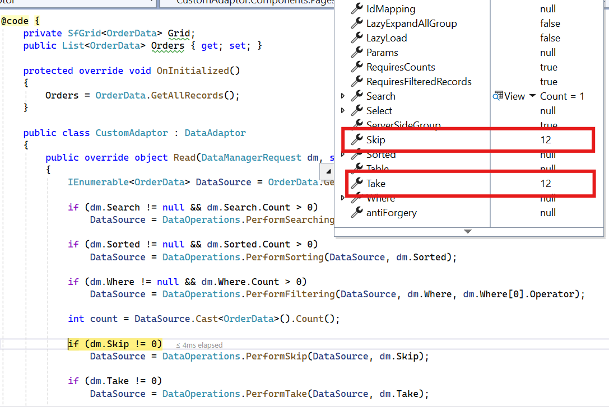

# Custom Binding in Blazor DataGrid

The [SfDataManager](https://help.syncfusion.com/cr/blazor/Syncfusion.Blazor.Data.SfDataManager.html) supports custom adaptors, enabling you to perform manual operations on the data. This feature is useful for implementing custom data binding and editing operations in the Syncfusion<sup style="font-size:70%">&reg;</sup> Blazor DataGrid.

To implement custom data binding in the Grid, the **DataAdaptor** class is used. This abstract class serves as a base class for the custom adaptor.

The **DataAdaptor** abstract class includes both synchronous and asynchronous method signatures, which can be overridden in the custom adaptor. The following are the method signatures available in this class:

```csharp
public abstract class DataAdaptor
{
    /// <summary>
    /// Performs data read operation synchronously.
    /// </summary>
    public virtual object Read(DataManagerRequest dataManagerRequest, string key = null)

    /// <summary>
    /// Performs data read operation asynchronously.
    /// </summary>
    public virtual Task<object> ReadAsync(DataManagerRequest dataManagerRequest, string key = null)

    /// <summary>
    /// Performs insert operation synchronously.
    /// </summary>
    public virtual object Insert(DataManager dataManager, object data, string key)
    /// <summary>
    /// Performs insert operation asynchronously.
    /// </summary>
    public virtual Task<object> InsertAsync(DataManager dataManager, object data, string key)

    /// <summary>
    /// Performs remove operation synchronously.
    /// </summary>
    public virtual object Remove(DataManager dataManager, object data, string keyField, string key)

    /// <summary>
    /// Performs remove operation asynchronously.
    /// </summary>
    public virtual Task<object> RemoveAsync(DataManager dataManager, object data, string keyField, string key)

    /// <summary>
    /// Performs update operation synchronously.
    /// </summary>
    public virtual object Update(DataManager dataManager, object data, string keyField, string key)

    /// <summary>
    /// Performs update operation asynchronously.
    /// </summary>
    public virtual Task<object> UpdateAsync(DataManager dataManager, object data, string keyField, string key)

    /// <summary>
    /// Performs batch CRUD operations synchronously.
    /// </summary>
    public virtual object BatchUpdate(DataManager dataManager, object changedRecords, object addedRecords, object deletedRecords, string keyField, string key, int? dropIndex)

    /// <summary>
    /// Performs batch CRUD operations asynchronously.
    /// </summary>
    public virtual Task<object> BatchUpdateAsync(DataManager dataManager, object changedRecords, object addedRecords, object deletedRecords, string keyField, string key, int? dropIndex)
}
```

To learn more about **Custom Binding** in the Grid, watch this video:



## Data Binding

Custom data binding can be performed in the Syncfusion<sup style="font-size:70%">&reg;</sup> Blazor DataGrid by providing a custom adaptor class and overriding the **Read** or **ReadAsync** method of the **DataAdaptor** abstract class.

The following sample code demonstrates how to implement custom data binding using a custom adaptor:

```cshtml
@using Syncfusion.Blazor
@using Syncfusion.Blazor.Data
@using Syncfusion.Blazor.Grids

<SfGrid TValue="Order" ID="Grid" AllowSorting="true" AllowFiltering="true" AllowPaging="true">
    <SfDataManager AdaptorInstance="@typeof(CustomAdaptor)" Adaptor="Adaptors.CustomAdaptor"></SfDataManager>
    <GridPageSettings PageSize="8"></GridPageSettings>
    <GridColumns>
        <GridColumn Field=@nameof(Order.OrderID) HeaderText="Order ID" IsPrimaryKey="true" TextAlign="@TextAlign.Right" Width="140"></GridColumn>
        <GridColumn Field=@nameof(Order.CustomerID) HeaderText="Customer Name" Width="150"></GridColumn>
        <GridColumn Field=@nameof(Order.Freight) HeaderText="Freight" Format="C2" Width="150"></GridColumn>
    </GridColumns>
</SfGrid>

@code{

    public static List<Order> Orders { get; set; }

    protected override void OnInitialized()
    {
        Orders = Enumerable.Range(1, 75).Select(x => new Order()
        {
            OrderID = 1000 + x,
            CustomerID = (new string[] { "ALFKI", "ANANTR", "ANTON", "BLONP", "BOLID" })[new Random().Next(5)], // Randomly assigns a CustomerID.
            Freight = 2.1 * x,
        }).ToList();
    }

    public class Order
    {
        public int OrderID { get; set; }
        public string CustomerID { get; set; }
        public double Freight { get; set; }
    }

    // Custom adaptor implementation by extending the DataAdaptor class.
    public class CustomAdaptor : DataAdaptor
    {
        // Performs the data read operation.
        public override object Read(DataManagerRequest dm, string key = null)
        {
            // Retrieves the data source.
            IEnumerable<Order> DataSource = Orders;

            if (dm.Search != null && dm.Search.Count > 0)
            {
                // Performs searching on the data source.
                DataSource = DataOperations.PerformSearching(DataSource, dm.Search);
            }
            if (dm.Sorted != null && dm.Sorted.Count > 0)
            {
                // Performs sorting on the data source.
                DataSource = DataOperations.PerformSorting(DataSource, dm.Sorted);
            }
            if (dm.Where != null && dm.Where.Count > 0)
            {
                // Performs filtering on the data source.
                DataSource = DataOperations.PerformFiltering(DataSource, dm.Where, dm.Where[0].Operator);
            }

            // Counts the total records.
            int count = DataSource.Cast<Order>().Count();

            if (dm.Skip != 0)
            {
                // Skips the specified number of records for paging.
                DataSource = DataOperations.PerformSkip(DataSource, dm.Skip);
            }
            if (dm.Take != 0)
            {
                // Takes the specified number of records for paging.
                DataSource = DataOperations.PerformTake(DataSource, dm.Take);
            }

            DataResult DataObject = new DataResult();

            // Checks if aggregation is required.
            if (dm.Aggregates != null)
            {
                DataObject.Result = DataSource;
                DataObject.Count = count;

                // Performs aggregation.
                DataObject.Aggregates = DataUtil.PerformAggregation(DataSource, dm.Aggregates);

                // Returns the result with or without counts.
                return dm.RequiresCounts ? DataObject : (object)DataSource; 
            }
            // Returns the result.
            return dm.RequiresCounts ? new DataResult() { Result = DataSource, Count = count } : (object)DataSource; 
        }
    }
}
```

> If the **DataManagerRequest.RequiresCounts** value is **true**, the `Read/ReadAsync` return value must be of type **DataResult** with properties **Result** (a collection of records) and **Count** (the total number of records). If the **DataManagerRequest.RequiresCounts** is **false**, simply return the collection of records.

The following image shows the custom-bound data displayed in the Grid:


> If the `Read/ReadAsync` method is not overridden in the custom adaptor, it will be handled by the default read handler.

## Inject Service into Custom Adaptor

If you want to inject a service into the Custom Adaptor and use it, you can achieve this as shown below.

First, register the required services in the `Program.cs` file. Add the `OrderDataAccessLayer` as a singleton, and the `CustomAdaptor` and `ServiceClass` as scoped services.

```csharp
// Registering services in the Program.cs file.
builder.Services.AddSingleton<OrderDataAccessLayer>();
builder.Services.AddScoped<CustomAdaptor>();
builder.Services.AddScoped<ServiceClass>();
```

The following sample code demonstrates how to inject a service into the Custom Adaptor and use it for data operations:

```cshtml
@using Syncfusion.Blazor.Data
@using Syncfusion.Blazor.Grids
@using Syncfusion.Blazor

<SfGrid TValue="Order" ID="Grid" AllowSorting="true" AllowFiltering="true" AllowPaging="true">
    <SfDataManager AdaptorInstance="@typeof(CustomAdaptor)" Adaptor="Adaptors.CustomAdaptor"></SfDataManager>
    <GridPageSettings PageSize="8"></GridPageSettings>
    <GridColumns>
        <GridColumn Field=@nameof(Order.OrderID) HeaderText="Order ID" IsPrimaryKey="true" TextAlign="@TextAlign.Right" Width="140"></GridColumn>
        <GridColumn Field=@nameof(Order.CustomerID) HeaderText="Customer Name" Width="150"></GridColumn>
        <GridColumn Field=@nameof(Order.Freight) HeaderText="Freight" Width="150"></GridColumn>
    </GridColumns>
</SfGrid>

@code{

    protected override void OnInitialized()
    {
        Orders = Enumerable.Range(1, 75).Select(x => new Order()
        {
            OrderID = 1000 + x,
            CustomerID = (new string[] { "ALFKI", "ANANTR", "ANTON", "BLONP", "BOLID" })[new Random().Next(5)],
            Freight = 2.1 * x,
            OrderDate = DateTime.Now.AddDays(-x),
        }).ToList();
    }

    public class Order
    {
        public int? OrderID { get; set; }
        public string CustomerID { get; set; }
        public DateTime? OrderDate { get; set; }
        public double? Freight { get; set; }
    }

    // Custom adaptor class that extends the DataAdaptor class.
    public class CustomAdaptor : DataAdaptor
    {
        // Injected service for data access.
        public OrderDataAccessLayer context { get; set; }

        // Constructor to initialize the injected service.
        public CustomAdaptor(OrderDataAccessLayer _context)
        {
            context = _context;
        }

        // Performs the data read operation.
        public override object Read(DataManagerRequest dm, string key = null)
        {
            // Retrieves the data source from the injected service.
            IEnumerable<Order> DataSource = context.GetAllOrders();

            // Performs searching if search criteria are provided.
            if (dm.Search != null && dm.Search.Count > 0)
            {
                DataSource = DataOperations.PerformSearching(DataSource, dm.Search);
            }

            // Performs sorting if sorting criteria are provided.
            if (dm.Sorted != null && dm.Sorted.Count > 0)
            {
                DataSource = DataOperations.PerformSorting(DataSource, dm.Sorted);
            }

            // Performs filtering if filter criteria are provided.
            if (dm.Where != null && dm.Where.Count > 0)
            {
                DataSource = DataOperations.PerformFiltering(DataSource, dm.Where, dm.Where[0].Operator);
            }

            // Counts the total number of records.
            int count = DataSource.Cast<Order>().Count();

            // Performs paging by skipping the specified number of records.
            if (dm.Skip != 0)
            {
                DataSource = DataOperations.PerformSkip(DataSource, dm.Skip);
            }

            // Takes the specified number of records for paging.
            if (dm.Take != 0)
            {
                DataSource = DataOperations.PerformTake(DataSource, dm.Take);
            }

            // Returns the result with or without counts based on the request.
            return dm.RequiresCounts ? new DataResult() { Result = DataSource, Count = count } : (object)DataSource;
        }
    }
}
```

## Custom Adaptor as a Component

A Custom Adaptor can be created as a component when the `DataAdaptor` class is extended from `OwningComponentBase`. You can create a Custom Adaptor using either of the two versions of the class: `DataAdaptor` or `DataAdaptor<T>`.

Ensure that your service is registered in the **Program.cs** file.

```csharp
// Register the order service as scoped in the Program.cs file.
builder.Services.AddScoped<Order>();
```

The following sample code demonstrates how to create a Custom Adaptor as a component:

```cs
@using Syncfusion.Blazor
@using Syncfusion.Blazor.Data
@using Syncfusion.Blazor.Grids

<SfGrid TValue="Order" ID="Grid" AllowSorting="true" AllowFiltering="true" AllowPaging="true">
    <SfDataManager Adaptor="Adaptors.CustomAdaptor">
        <CustomAdaptorComponent></CustomAdaptorComponent>
    </SfDataManager>
    <GridPageSettings PageSize="8"></GridPageSettings>
    <GridColumns>
        <GridColumn Field=@nameof(Order.OrderID) HeaderText="Order ID" IsPrimaryKey="true" TextAlign="@TextAlign.Right" Width="140"></GridColumn>
        <GridColumn Field=@nameof(Order.CustomerID) HeaderText="Customer Name" Width="150"></GridColumn>
        <GridColumn Field=@nameof(Order.Freight) HeaderText="Freight" TextAlign="@TextAlign.Right" Width="140"></GridColumn>
    </GridColumns>
</SfGrid>

@code{
    public static List<Order> Orders { get; set; }

    public class Order
    {
        public List<Order> GetAllRecords()
        {
            Orders = Enumerable.Range(1, 75).Select(x => new Order()
            {
                OrderID = 1000 + x,
                CustomerID = (new string[] { "ALFKI", "ANANTR", "ANTON", "BLONP", "BOLID" })[new Random().Next(5)],
                Freight = 2.1 * x,
            }).ToList();
            return Orders;
        }
        public int OrderID { get; set; }
        public string CustomerID { get; set; }
        public double Freight { get; set; }
    }
}
```

The following sample code demonstrates `DataAdaptor` extended from `OwningComponentBase<T>`. This provides a single service of type `T`, which can be accessed using the `Service` property.

```csharp
// CustomAdaptorComponent.razor

@using Syncfusion.Blazor
@using Syncfusion.Blazor.Data
@using Newtonsoft.Json
@using static BlazorApp1.Pages.Index

@inherits DataAdaptor<Order>

<CascadingValue Value="@this">
    @ChildContent
</CascadingValue>

@code {
    // Parameter to hold child content.
    [Parameter]
    [JsonIgnore]
    public RenderFragment ChildContent { get; set; }

    // Method to perform data read operation.
    public override object Read(DataManagerRequest dm, string key = null)
    {
        // Retrieve data source from the service.
        IEnumerable<Order> DataSource = (IEnumerable<Order>)Service.GetAllRecords();

        // Perform searching if search criteria are provided.
        if (dm.Search != null && dm.Search.Count > 0)
        {
            DataSource = DataOperations.PerformSearching(DataSource, dm.Search);
        }

        // Perform sorting if sorting criteria are provided.
        if (dm.Sorted != null && dm.Sorted.Count > 0)
        {
            DataSource = DataOperations.PerformSorting(DataSource, dm.Sorted);
        }

        // Perform filtering if filter criteria are provided.
        if (dm.Where != null && dm.Where.Count > 0)
        {
            DataSource = DataOperations.PerformFiltering(DataSource, dm.Where, dm.Where[0].Operator);
        }

        // Count the total number of records.
        int count = DataSource.Cast<Order>().Count();

        // Perform paging by skipping the specified number of records.
        if (dm.Skip != 0)
        {
            DataSource = DataOperations.PerformSkip(DataSource, dm.Skip);
        }

        // Take the specified number of records for paging.
        if (dm.Take != 0)
        {
            DataSource = DataOperations.PerformTake(DataSource, dm.Take);
        }

        // Return the result with or without counts based on the request.
        return dm.RequiresCounts ? new DataResult() { Result = DataSource, Count = count } : (object)DataSource;
    }
}
```

The following sample code demonstrates `DataAdaptor` extended from `OwningComponentBase`. This allows you to request multiple services.

```csharp
// CustomAdaptorComponent.razor

@using Syncfusion.Blazor
@using Syncfusion.Blazor.Data
@using static BlazorApp1.Pages.Index
@using Newtonsoft.Json

@inherits DataAdaptor

<CascadingValue Value="@this">
    @ChildContent
</CascadingValue>

@code {
    // Parameter to hold child content.
    [Parameter]
    [JsonIgnore]
    public RenderFragment ChildContent { get; set; }

    // Variable to hold order data.
    Order orderdata;

    // Method to perform data read operation.
    public override object Read(DataManagerRequest dm, string key = null)
    {
        // Retrieve the order service from scoped services.
        orderdata = (Order)ScopedServices.GetService(typeof(Order));

        // Retrieve data source from the service.
        IEnumerable<Order> DataSource = (IEnumerable<Order>)orderdata.GetAllRecords().Take(10);

        // Perform searching if search criteria are provided.
        if (dm.Search != null && dm.Search.Count > 0)
        {
            DataSource = DataOperations.PerformSearching(DataSource, dm.Search);
        }

        // Perform sorting if sorting criteria are provided.
        if (dm.Sorted != null && dm.Sorted.Count > 0)
        {
            DataSource = DataOperations.PerformSorting(DataSource, dm.Sorted);
        }

        // Perform filtering if filter criteria are provided.
        if (dm.Where != null && dm.Where.Count > 0)
        {
            DataSource = DataOperations.PerformFiltering(DataSource, dm.Where, dm.Where[0].Operator);
        }

        // Count the total number of records.
        int count = DataSource.Cast<Order>().Count();

        // Perform paging by skipping the specified number of records.
        if (dm.Skip != 0)
        {
            DataSource = DataOperations.PerformSkip(DataSource, dm.Skip);
        }

        // Take the specified number of records for paging.
        if (dm.Take != 0)
        {
            DataSource = DataOperations.PerformTake(DataSource, dm.Take);
        }

        // Return the result with or without counts based on the request.
        return dm.RequiresCounts ? new DataResult() { Result = DataSource, Count = count } : (object)DataSource;
    }
}
```

You can find the complete code in the [Github](https://github.com/SyncfusionExamples/Binding-data-from-remote-service-to-blazor-data-grid/tree/master/CustomAdaptor-as-component).

## Handling searching operation

When using a custom adaptor, the searching operation must be handled by overriding the `Read` or `ReadAsync` method of the `DataAdaptor` abstract class. The `DataManagerRequest` class provides Grid action details, including search criteria.


The following sample code demonstrates how to implement the searching operation for custom-bound data:

```cshtml
@using Syncfusion.Blazor
@using Syncfusion.Blazor.Data
@using Syncfusion.Blazor.Grids
@using System.Collections

<SfGrid TValue="Order" ID="Grid" Toolbar="@(new List<string>() { "Search" })">
    <SfDataManager AdaptorInstance="@typeof(CustomAdaptor)" Adaptor="Adaptors.CustomAdaptor"></SfDataManager>
    <GridColumns>
        <GridColumn Field=@nameof(Order.OrderID) HeaderText="Order ID" TextAlign="@TextAlign.Right" Width="140"></GridColumn>
        <GridColumn Field=@nameof(Order.CustomerID) HeaderText="Customer Name" Width="150"></GridColumn>
        <GridColumn Field=@nameof(Order.Freight) HeaderText="Freight" Format="C2" Width="150"></GridColumn>
    </GridColumns>
</SfGrid>

@code{
    public static List<Order> Orders { get; set; }

    protected override void OnInitialized()
    {
        Orders = Enumerable.Range(1, 75).Select(x => new Order()
        {
            OrderID = 1000 + x,
            CustomerID = (new string[] { "ALFKI", "ANANTR", "ANTON", "BLONP", "BOLID" })[new Random().Next(5)],
            Freight = 2.1 * x,
        }).ToList();
    }

    public class Order
    {
        public int OrderID { get; set; }
        public string CustomerID { get; set; }
        public double Freight { get; set; }
    }

    // Custom adaptor implementation by extending the DataAdaptor class.
    public class CustomAdaptor : DataAdaptor
    {
        // Performs the data read operation.
        public override object Read(DataManagerRequest dm, string key = null)
        {
            // Retrieve the data source.
            IEnumerable<Order> DataSource = Orders;

            // Apply searching if search criteria are provided.
            if (dm.Search != null && dm.Search.Count > 0)
            {
                DataSource = DataOperations.PerformSearching(DataSource, dm.Search);
            }

            // Count the total number of records.
            int count = DataSource.Cast<Order>().Count();

            // Return the result with or without counts based on the request.
            return dm.RequiresCounts ? new DataResult() { Result = DataSource, Count = count } : (object)DataSource;
        }
    }
}
```

## Handling filtering operation

When using a custom adaptor, the filtering operation must be handled by overriding the `Read` or `ReadAsync` method of the `DataAdaptor` abstract class. The `DataManagerRequest` class provides Grid action details, as shown in the image below:


Based on these Grid action details, a custom data source can be filtered using the built-in `PerformFiltering` method of the `DataOperations` class.

> You can also use your own method to perform the filtering operation and bind the resultant data to the Grid.

The following sample code demonstrates how to implement the filtering operation for custom-bound data:

```cshtml
@using Syncfusion.Blazor
@using Syncfusion.Blazor.Data
@using Syncfusion.Blazor.Grids
@using System.Collections

<SfGrid TValue="Order" ID="Grid" AllowFiltering="true">
    <SfDataManager AdaptorInstance="@typeof(CustomAdaptor)" Adaptor="Adaptors.CustomAdaptor"></SfDataManager>
    <GridColumns>
        <GridColumn Field=@nameof(Order.OrderID) HeaderText="Order ID" TextAlign="@TextAlign.Right" Width="140"></GridColumn>
        <GridColumn Field=@nameof(Order.CustomerID) HeaderText="Customer Name" Width="150"></GridColumn>
        <GridColumn Field=@nameof(Order.Freight) HeaderText="Freight" Format="C2" Width="150"></GridColumn>
    </GridColumns>
</SfGrid>

@code{
    public static List<Order> Orders { get; set; }

    protected override void OnInitialized()
    {
        Orders = Enumerable.Range(1, 75).Select(x => new Order()
        {
            OrderID = 1000 + x,
            CustomerID = (new string[] { "ALFKI", "ANANTR", "ANTON", "BLONP", "BOLID" })[new Random().Next(5)],
            Freight = 2.1 * x,
        }).ToList();
    }

    public class Order
    {
        public int OrderID { get; set; }
        public string CustomerID { get; set; }
        public double Freight { get; set; }
    }

    // Custom adaptor implementation by extending the DataAdaptor class.
    public class CustomAdaptor : DataAdaptor
    {
        // Performs the data read operation.
        public override object Read(DataManagerRequest dm, string key = null)
        {
            // Retrieve the data source.
            IEnumerable<Order> DataSource = Orders;

            // Apply filtering if filter criteria are provided.
            if (dm.Where != null && dm.Where.Count > 0)
            {
                DataSource = DataOperations.PerformFiltering(DataSource, dm.Where, dm.Where[0].Operator);
            }

            // Count the total number of records.
            int count = DataSource.Cast<Order>().Count();

            // Return the result with or without counts based on the request.
            return dm.RequiresCounts ? new DataResult() { Result = DataSource, Count = count } : (object)DataSource;
        }
    }
}
```

## Handling sorting operation

When using a custom adaptor, the sorting operation must be handled by overriding the `Read` or `ReadAsync` method of the `DataAdaptor` abstract class. The `DataManagerRequest` class provides Grid action details, as shown in the image below:


Based on these Grid action details, a custom data source can be sorted using the built-in `PerformSorting` method of the `DataOperations` class.

N> Alternatively, you can use your own method to perform the sorting operation and bind the resultant data to the Grid.

The following sample code demonstrates how to implement the sorting operation for custom-bound data:

```cshtml
@using Syncfusion.Blazor
@using Syncfusion.Blazor.Data
@using Syncfusion.Blazor.Grids
@using System.Collections

<SfGrid TValue="Order" ID="Grid" AllowSorting="true">
    <SfDataManager AdaptorInstance="@typeof(CustomAdaptor)" Adaptor="Adaptors.CustomAdaptor"></SfDataManager>
    <GridColumns>
        <GridColumn Field=@nameof(Order.OrderID) HeaderText="Order ID" TextAlign="@TextAlign.Right" Width="140"></GridColumn>
        <GridColumn Field=@nameof(Order.CustomerID) HeaderText="Customer Name" Width="150"></GridColumn>
        <GridColumn Field=@nameof(Order.Freight) HeaderText="Freight" Format="C2" Width="150"></GridColumn>
    </GridColumns>
</SfGrid>

@code{
    public static List<Order> Orders { get; set; }

    protected override void OnInitialized()
    {
        Orders = Enumerable.Range(1, 75).Select(x => new Order()
        {
            OrderID = 1000 + x,
            CustomerID = (new string[] { "ALFKI", "ANANTR", "ANTON", "BLONP", "BOLID" })[new Random().Next(5)],
            Freight = 2.1 * x,
        }).ToList();
    }

    public class Order
    {
        public int OrderID { get; set; }
        public string CustomerID { get; set; }
        public double Freight { get; set; }
    }

    // Custom adaptor implementation by extending the DataAdaptor class.
    public class CustomAdaptor : DataAdaptor
    {
        // Performs the data read operation.
        public override object Read(DataManagerRequest dm, string key = null)
        {
            // Retrieve the data source.
            IEnumerable<Order> DataSource = Orders;

            // Apply sorting if sort criteria are provided.
            if (dm.Sorted != null && dm.Sorted.Count > 0)
            {
                DataSource = DataOperations.PerformSorting(DataSource, dm.Sorted);
            }

            // Count the total number of records.
            int count = DataSource.Cast<Order>().Count();

            // Return the result with or without counts based on the request.
            return dm.RequiresCounts ? new DataResult() { Result = DataSource, Count = count } : (object)DataSource;
        }
    }
}
```

## Handling paging operation

When using a custom adaptor, the paging operation must be handled by overriding the `Read` or `ReadAsync` method of the `DataAdaptor` abstract class. The `DataManagerRequest` class provides Grid action details, including skip and take values for paging.



The following sample code demonstrates how to implement the paging operation for custom-bound data:

```cshtml
@using Syncfusion.Blazor
@using Syncfusion.Blazor.Data
@using Syncfusion.Blazor.Grids
@using System.Collections

<SfGrid TValue="Order" ID="Grid" AllowPaging="true">
    <SfDataManager AdaptorInstance="@typeof(CustomAdaptor)" Adaptor="Adaptors.CustomAdaptor"></SfDataManager>
    <GridColumns>
        <GridColumn Field=@nameof(Order.OrderID) HeaderText="Order ID" TextAlign="@TextAlign.Right" Width="140"></GridColumn>
        <GridColumn Field=@nameof(Order.CustomerID) HeaderText="Customer Name" Width="150"></GridColumn>
        <GridColumn Field=@nameof(Order.Freight) HeaderText="Freight" Format="C2" Width="150"></GridColumn>
    </GridColumns>
</SfGrid>

@code{
    public static List<Order> Orders { get; set; }

    protected override void OnInitialized()
    {
        Orders = Enumerable.Range(1, 75).Select(x => new Order()
        {
            OrderID = 1000 + x,
            CustomerID = (new string[] { "ALFKI", "ANANTR", "ANTON", "BLONP", "BOLID" })[new Random().Next(5)],
            Freight = 2.1 * x,
        }).ToList();
    }

    public class Order
    {
        public int OrderID { get; set; }
        public string CustomerID { get; set; }
        public double Freight { get; set; }
    }

    // Custom adaptor implementation by extending the DataAdaptor class.
    public class CustomAdaptor : DataAdaptor
    {
        // Performs the data read operation.
        public override object Read(DataManagerRequest dm, string key = null)
        {
            // Retrieve the data source.
            IEnumerable<Order> DataSource = Orders;

            // Apply paging by skipping and taking the specified number of records.
            if (dm.Skip != 0)
            {
                DataSource = DataOperations.PerformSkip(DataSource, dm.Skip);
            }
            if (dm.Take != 0)
            {
                DataSource = DataOperations.PerformTake(DataSource, dm.Take);
            }

            // Count the total number of records.
            int count = DataSource.Cast<Order>().Count();

            // Return the result with or without counts based on the request.
            return dm.RequiresCounts ? new DataResult() { Result = DataSource, Count = count } : (object)DataSource;
        }
    }
}
```

## Handling grouping operation

When using a Custom Adaptor, the grouping operation must be handled in the `Read` or `ReadAsync` method of the Custom Adaptor.

The following sample code demonstrates how to implement the grouping operation for custom-bound data:

```cshtml
@using Syncfusion.Blazor
@using Syncfusion.Blazor.Data
@using Syncfusion.Blazor.Grids
@using System.Collections

<SfGrid TValue="Order" ID="Grid" AllowGrouping="true">
    <SfDataManager AdaptorInstance="@typeof(CustomAdaptor)" Adaptor="Adaptors.CustomAdaptor"></SfDataManager>
    <GridColumns>
        <GridColumn Field=@nameof(Order.OrderID) HeaderText="Order ID" TextAlign="@TextAlign.Right" Width="140"></GridColumn>
        <GridColumn Field=@nameof(Order.CustomerID) HeaderText="Customer Name" Width="150"></GridColumn>
        <GridColumn Field=@nameof(Order.Freight) HeaderText="Freight" Format="C2" Width="150"></GridColumn>
    </GridColumns>
</SfGrid>

@code{
    public static List<Order> Orders { get; set; }

    protected override void OnInitialized()
    {
        Orders = Enumerable.Range(1, 75).Select(x => new Order()
        {
            OrderID = 1000 + x,
            CustomerID = (new string[] { "ALFKI", "ANANTR", "ANTON", "BLONP", "BOLID" })[new Random().Next(5)],
            Freight = 2.1 * x,
        }).ToList();
    }

    public class Order
    {
        public int OrderID { get; set; }
        public string CustomerID { get; set; }
        public double Freight { get; set; }
    }

    // Custom adaptor implementation by extending the DataAdaptor class.
    public class CustomAdaptor : DataAdaptor
    {
        // Method to perform the data read operation.
        public override object Read(DataManagerRequest dm, string key = null)
        {
            // Retrieving the data source.
            IEnumerable<Order> DataSource = Orders;

            // Counting the total number of records.
            int count = DataSource.Cast<Order>().Count();

            // Creating a DataResult object to hold the result.
            DataResult DataObject = new DataResult();

            // Checking if grouping is required.
            if (dm.Group != null)
            {
                // Performing grouping on the data source.
                IEnumerable ResultData = DataSource.ToList();
                foreach (var group in dm.Group)
                {
                    ResultData = DataUtil.Group<Order>(ResultData, group, dm.Aggregates, 0, dm.GroupByFormatter);
                }

                // Setting the grouped result and count in the DataResult object.
                DataObject.Result = ResultData;
                DataObject.Count = count;

                // Returning the result with or without counts based on the request.
                return dm.RequiresCounts ? DataObject : (object)ResultData;
            }

            // Returning the result with or without counts based on the request.
            return dm.RequiresCounts ? new DataResult() { Result = DataSource, Count = count } : (object)DataSource;
        }
    }
}
```

## Handling aggregates operation

When using a Custom Adaptor, aggregates must be handled in the `Read` or `ReadAsync` method of the Custom Adaptor.

The following sample code demonstrates how to implement aggregates for custom-bound data:

```cshtml
@using Syncfusion.Blazor.Grids
@using Syncfusion.Blazor.Data
@using Syncfusion.Blazor

<SfGrid TValue="Order" AllowPaging="true">
    <SfDataManager AdaptorInstance="@typeof(CustomAdaptor)" Adaptor="Adaptors.CustomAdaptor"></SfDataManager>
    <GridPageSettings PageSize="8"></GridPageSettings>
    <GridAggregates>
        <GridAggregate>
            <GridAggregateColumns>
                <GridAggregateColumn Field=@nameof(Order.Freight) Type="AggregateType.Sum" Format="C2">
                    <FooterTemplate>
                        @{
                            var aggregate = (context as AggregateTemplateContext);
                            <div>
                                <p>Sum: @aggregate.Sum</p>
                            </div>
                        }
                    </FooterTemplate>
                </GridAggregateColumn>
            </GridAggregateColumns>
        </GridAggregate>
        <GridAggregate>
            <GridAggregateColumns>
                <GridAggregateColumn Field=@nameof(Order.Freight) Type="AggregateType.Average" Format="C2">
                    <FooterTemplate>
                        @{
                            var aggregate = (context as AggregateTemplateContext);
                            <div>
                                <p>Average: @aggregate.Average</p>
                            </div>
                        }
                    </FooterTemplate>
                </GridAggregateColumn>
            </GridAggregateColumns>
        </GridAggregate>
    </GridAggregates>
    <GridColumns>
        <GridColumn Field=@nameof(Order.OrderID) HeaderText="Order ID" TextAlign="TextAlign.Right" Width="120"></GridColumn>
        <GridColumn Field=@nameof(Order.CustomerID) HeaderText="Customer Name" Width="150"></GridColumn>
        <GridColumn Field=@nameof(Order.OrderDate) HeaderText=" Order Date" Format="d" Type="ColumnType.Date" TextAlign="TextAlign.Right" Width="130"></GridColumn>
        <GridColumn Field=@nameof(Order.Freight) HeaderText="Freight" Format="C2" TextAlign="TextAlign.Right" Width="120"></GridColumn>
    </GridColumns>
</SfGrid>

@code{    
    public static List<Order> Orders { get; set; }

    protected override void OnInitialized()
    {
        Orders = Enumerable.Range(1, 75).Select(x => new Order()
        {
            OrderID = 1000 + x,
            CustomerID = (new string[] { "ALFKI", "ANANTR", "ANTON", "BLONP", "BOLID" })[new Random().Next(5)],
            Freight = 2.1 * x,
            OrderDate = DateTime.Now.AddDays(-x),
        }).ToList();
        }

        public class Order
        {
            public int? OrderID { get; set; }
            public string CustomerID { get; set; }
            public DateTime? OrderDate { get; set; }
            public double? Freight { get; set; }
        }

        // Custom adaptor class to handle data operations.
        public class CustomAdaptor : DataAdaptor
        {
            // Performs the data read operation.
            public override object Read(DataManagerRequest dm, string key = null)
            {
                // Retrieves the data source.
                IEnumerable<Order> DataSource = Orders;

                // Counts the total number of records.
                int count = DataSource.Cast<Order>().Count();

                // Skips the specified number of records for paging.
                if (dm.Skip != 0)
                {
                    DataSource = DataOperations.PerformSkip(DataSource, dm.Skip);
                }

                // Takes the specified number of records for paging.
                if (dm.Take != 0)
                {
                    DataSource = DataOperations.PerformTake(DataSource, dm.Take);
                }

                // Creates a DataResult object to hold the result.
                DataResult DataObject = new DataResult();

                // Checks if aggregation is required.
                if (dm.Aggregates != null)
                {
                    DataObject.Result = DataSource;
                    DataObject.Count = count;

                    // Performs aggregation on the data source.
                    DataObject.Aggregates = DataUtil.PerformAggregation(DataSource, dm.Aggregates);

                    // Returns the result with or without counts.
                    return dm.RequiresCounts ? DataObject : (object)DataSource;
                }

                // Returns the result with or without counts based on the request.
                return dm.RequiresCounts ? new DataResult() { Result = DataSource, Count = count } : (object)DataSource;
            }
        }
}
```

You can find the complete code in the [Github](https://github.com/SyncfusionExamples/Binding-data-from-remote-service-to-blazor-data-grid/tree/master/CustomAdaptor).

## Handling CRUD operations

The CRUD operations for custom-bound data in the Syncfusion<sup style="font-size:70%">&reg;</sup> Blazor DataGrid can be implemented by overriding the following CRUD methods of the **DataAdaptor** abstract class:

* **Insert/InsertAsync**
* **Remove/RemoveAsync**
* **Update/UpdateAsync**
* **BatchUpdate/BatchUpdateAsync**

N> When using batch editing in the Grid, use the BatchUpdate/BatchUpdateAsync method to handle the corresponding CRUD operation.

The following sample code demonstrates how to implement CRUD operations for custom-bound data:

```cshtml
@using Syncfusion.Blazor
@using Syncfusion.Blazor.Data
@using Syncfusion.Blazor.Grids

<SfGrid TValue="Order" ID="Grid" AllowSorting="true" AllowFiltering="true" AllowPaging="true" Toolbar="@(new List<string>() { "Add", "Delete", "Update", "Cancel" })">
    <SfDataManager AdaptorInstance="@typeof(CustomAdaptor)" Adaptor="Adaptors.CustomAdaptor"></SfDataManager>
    <GridPageSettings PageSize="8"></GridPageSettings>
    <GridEditSettings AllowEditing="true" AllowDeleting="true" AllowAdding="true" Mode="@EditMode.Normal"></GridEditSettings>
    <GridColumns>
        <GridColumn Field=@nameof(Order.OrderID) HeaderText="Order ID" IsPrimaryKey="true" TextAlign="@TextAlign.Right" Width="140"></GridColumn>
        <GridColumn Field=@nameof(Order.CustomerID) HeaderText="Customer Name" Width="150"></GridColumn>
        <GridColumn Field=@nameof(Order.Freight) HeaderText="Freight" Width="150"></GridColumn>
    </GridColumns>
</SfGrid>

@code{

    protected override void OnInitialized()
    {
        Orders = Enumerable.Range(1, 75).Select(x => new Order()
        {
            OrderID = 1000 + x,
            CustomerID = (new string[] { "ALFKI", "ANANTR", "ANTON", "BLONP", "BOLID" })[new Random().Next(5)],
            Freight = 2.1 * x,
            OrderDate = DateTime.Now.AddDays(-x),
        }).ToList();
    }

    public class Order
    {
        public int? OrderID { get; set; }
        public string CustomerID { get; set; }
        public DateTime? OrderDate { get; set; }
        public double? Freight { get; set; }
    }

    // Custom adaptor implementation by extending the DataAdaptor class.
    public class CustomAdaptor : DataAdaptor
    {
        // Performs the data read operation.
        public override object Read(DataManagerRequest dm, string key = null)
        {
            // Retrieve the data source.
            IEnumerable<Order> DataSource = Orders;

            // Perform searching on the data source if search criteria are provided.
            if (dm.Search != null && dm.Search.Count > 0)
            {
                DataSource = DataOperations.PerformSearching(DataSource, dm.Search);
            }

            // Perform sorting on the data source if sorting criteria are provided.
            if (dm.Sorted != null && dm.Sorted.Count > 0)
            {
                DataSource = DataOperations.PerformSorting(DataSource, dm.Sorted);
            }

            // Perform filtering on the data source if filter criteria are provided.
            if (dm.Where != null && dm.Where.Count > 0)
            {
                DataSource = DataOperations.PerformFiltering(DataSource, dm.Where, dm.Where[0].Operator);
            }

            // Count the total number of records.
            int count = DataSource.Cast<Order>().Count();

            // Perform paging by skipping the specified number of records.
            if (dm.Skip != 0)
            {
                DataSource = DataOperations.PerformSkip(DataSource, dm.Skip);
            }

            // Take the specified number of records for paging.
            if (dm.Take != 0)
            {
                DataSource = DataOperations.PerformTake(DataSource, dm.Take);
            }

            // Return the result with or without counts based on the request.
            return dm.RequiresCounts ? new DataResult() { Result = DataSource, Count = count } : (object)DataSource;
        }

        // Performs the insert operation.
        public override object Insert(DataManager dm, object value, string key)
        {
            Orders.Insert(0, value as Order);
            return value;
        }

        // Performs the remove operation.
        public override object Remove(DataManager dm, object value, string keyField, string key)
        {
            Orders.Remove(Orders.Where(or => or.OrderID == int.Parse(value.ToString())).FirstOrDefault());
            return value;
        }

        // Performs the update operation.
        public override object Update(DataManager dm, object value, string keyField, string key)
        {
            var data = Orders.Where(or => or.OrderID == (value as Order).OrderID).FirstOrDefault();
            if (data != null)
            {
                data.OrderID = (value as Order).OrderID;
                data.CustomerID = (value as Order).CustomerID;
                data.Freight = (value as Order).Freight;
            }
            return value;
        }

        // Performs the batch update operation.
        public override object BatchUpdate(DataManager dm, object Changed, object Added, object Deleted, string KeyField, string Key, int? dropIndex)
        {
            // Update the changed records in the data source.
            if (Changed != null)
            {
                foreach (var record in (IEnumerable<Order>)Changed)
                {
                    Order val = Orders.Where(or => or.OrderID == record.OrderID).FirstOrDefault();
                    val.OrderID = record.OrderID;
                    val.CustomerID = record.CustomerID;
                    val.Freight = record.Freight;
                }
            }

            // Add the new records to the data source.
            if (Added != null)
            {
                foreach (var record in (IEnumerable<Order>)Added)
                {
                    Orders.Add(record);
                }
            }

            // Remove the deleted records from the data source.
            if (Deleted != null)
            {
                foreach (var record in (IEnumerable<Order>)Deleted)
                {
                    Orders.Remove(Orders.Where(or => or.OrderID == record.OrderID).FirstOrDefault());
                }
            }

            // Return the updated data source.
            return Orders;
        }
    }
}
```

The following GIF demonstrates the CRUD operations on custom-bound data in the Grid:


You can find the complete code in the [Github](https://github.com/SyncfusionExamples/Binding-data-from-remote-service-to-blazor-data-grid/tree/master/CustomAdaptor).

> You can refer to the [Syncfusion<sup style="font-size:70%">&reg;</sup> Blazor DataGrid](https://www.syncfusion.com/blazor-components/blazor-datagrid) feature tour page for its groundbreaking feature representations. You can also explore the [Syncfusion<sup style="font-size:70%">&reg;</sup> Blazor DataGrid example](https://blazor.syncfusion.com/demos/datagrid/overview?theme=bootstrap5) to understand how to present and manipulate data.

## How to pass additional parameters to custom adaptor

The Syncfusion<sup style="font-size:70%">&reg;</sup> Blazor DataGrid allows you to send custom parameters with each data request. This is particularly useful when you need to pass additional information (e.g., user role, token, or filters) to the server for enhanced processing logic.

You can achieve this by using the [Query](https://help.syncfusion.com/cr/blazor/Syncfusion.Blazor.Grids.SfGrid-1.html#Syncfusion_Blazor_Grids_SfGrid_1_Query) property of the grid along with the `AddParams` method of the `Query` class.

To enable custom parameters in data requests for the Grid, follow these steps:

1. **Bind the Query Object to the Grid:**  
    Assign the initialized `Query` object to the DataGrid’s `Query` property.
2. **Initialize the Query Object:**  
    Create a new instance of the `Query` class and use the `AddParams` method to add your custom parameters.
3. **Access Parameters in the Custom Adaptor:**  
    In your custom adaptor, access the parameters via `Params` and use them as needed for server-side logic.

The following example demonstrates how to send additional parameters to the server.

```cshtml
@using Syncfusion.Blazor
@using Syncfusion.Blazor.Data
@using Syncfusion.Blazor.Grids

<SfGrid TValue="Order" ID="Grid" AllowSorting="true" AllowFiltering="true" AllowPaging="true" Query="@Query">
    <SfDataManager AdaptorInstance="@typeof(CustomAdaptor)" Adaptor="Adaptors.CustomAdaptor"></SfDataManager>
    <GridPageSettings PageSize="8"></GridPageSettings>
    <GridColumns>
        <GridColumn Field=@nameof(Order.OrderID) HeaderText="Order ID" IsPrimaryKey="true" TextAlign="@TextAlign.Center" Width="140"></GridColumn>
        <GridColumn Field=@nameof(Order.CustomerID) HeaderText="Customer Name" Width="150"></GridColumn>
        <GridColumn Field=@nameof(Order.Freight) HeaderText="Freight" Format="C2" Width="150"></GridColumn>
    </GridColumns>
</SfGrid>

@code{
    public static List<Order> Orders { get; set; }
    public Query Query = new Query().AddParams("Code", 10);

    protected override void OnInitialized()
    {
        Orders = Enumerable.Range(1, 75).Select(x => new Order()
        {
            OrderID = 1000 + x,
            CustomerID = (new string[] { "ALFKI", "ANANTR", "ANTON", "BLONP", "BOLID" })[new Random().Next(5)],
            Freight = 2.1 * x,
        }).ToList();
    }

    public class Order
    {
        public int OrderID { get; set; }
        public string CustomerID { get; set; }
        public double Freight { get; set; }
    }

    // Custom adaptor implementation to handle data operations.
    public class CustomAdaptor : DataAdaptor
    {
        // Handles the data read operation, including filtering, sorting, and paging.
        public override object Read(DataManagerRequest dm, string key = null)
        {
            // Retrieve the data source.
            IEnumerable<Order> DataSource = Orders;

            // Access additional parameters passed through the Query object.
            if (dm.Params != null && dm.Params.Count > 0)
            {
                var val = dm.Params;
            }

            // Perform searching on the data source if search criteria are provided.
            if (dm.Search != null && dm.Search.Count > 0)
            {
                DataSource = DataOperations.PerformSearching(DataSource, dm.Search);
            }

            // Perform sorting on the data source if sorting criteria are provided.
            if (dm.Sorted != null && dm.Sorted.Count > 0)
            {
                DataSource = DataOperations.PerformSorting(DataSource, dm.Sorted);
            }

            // Perform filtering on the data source if filter criteria are provided.
            if (dm.Where != null && dm.Where.Count > 0)
            {
                DataSource = DataOperations.PerformFiltering(DataSource, dm.Where, dm.Where[0].Operator);
            }

            // Count the total number of records.
            int count = DataSource.Cast<Order>().Count();

            // Perform paging by skipping the specified number of records.
            if (dm.Skip != 0)
            {
                DataSource = DataOperations.PerformSkip(DataSource, dm.Skip);
            }

            // Take the specified number of records for paging.
            if (dm.Take != 0)
            {
                DataSource = DataOperations.PerformTake(DataSource, dm.Take);
            }

            // Handle aggregation if required.
            DataResult DataObject = new DataResult();
            if (dm.Aggregates != null)
            {
                DataObject.Result = DataSource;
                DataObject.Count = count;
                DataObject.Aggregates = DataUtil.PerformAggregation(DataSource, dm.Aggregates);
                return dm.RequiresCounts ? DataObject : (object)DataSource;
            }

            // Return the result with or without counts based on the request.
            return dm.RequiresCounts ? new DataResult() { Result = DataSource, Count = count } : (object)DataSource;
        }
    }
}
```

