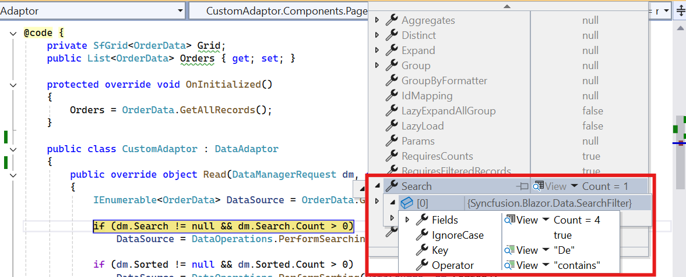

# Custom Binding in Blazor DataGrid

The Syncfusion<sup style="font-size:70%">&reg;</sup> Blazor DataGrid supports custom data operations through the [CustomAdaptor](https://blazor.syncfusion.com/documentation/data/custom-binding) in the [SfDataManager](https://help.syncfusion.com/cr/blazor/Syncfusion.Blazor.Data.SfDataManager.html). This adaptor allows complete control over data handling by overriding methods in the [DataAdaptor](https://help.syncfusion.com/cr/blazor/Syncfusion.Blazor.DataAdaptor.html) class. It is designed for scenarios where data operations such as **read**, **insert**, **update**, and **delete** must be implemented manually or integrated with custom logic.

The `CustomAdaptor` is ideal for applications that require:

* Binding data from non-standard sources such as in-memory collections or custom APIs.
* Implementing advanced business logic for filtering, sorting, paging, or aggregation.
* Injecting services or repositories for data access using dependency injection.
* Handling complex transformations before displaying data in the DataGrid.
* Passing additional parameters (e.g., user roles, tokens) with each request for server-side processing.

```csharp
public abstract class DataAdaptor
{
    /// <summary>
    /// Performs data read operation synchronously.
    /// </summary>
    public virtual object Read(DataManagerRequest dataManagerRequest, string key = null)

    /// <summary>
    /// Performs data read operation asynchronously.
    /// </summary>
    public virtual Task<object> ReadAsync(DataManagerRequest dataManagerRequest, string key = null)

    /// <summary>
    /// Performs insert operation synchronously.
    /// </summary>
    public virtual object Insert(DataManager dataManager, object data, string key)
    /// <summary>
    /// Performs insert operation asynchronously.
    /// </summary>
    public virtual Task<object> InsertAsync(DataManager dataManager, object data, string key)

    /// <summary>
    /// Performs remove operation synchronously.
    /// </summary>
    public virtual object Remove(DataManager dataManager, object data, string keyField, string key)

    /// <summary>
    /// Performs remove operation asynchronously.
    /// </summary>
    public virtual Task<object> RemoveAsync(DataManager dataManager, object data, string keyField, string key)

    /// <summary>
    /// Performs update operation synchronously.
    /// </summary>
    public virtual object Update(DataManager dataManager, object data, string keyField, string key)

    /// <summary>
    /// Performs update operation asynchronously.
    /// </summary>
    public virtual Task<object> UpdateAsync(DataManager dataManager, object data, string keyField, string key)

    /// <summary>
    /// Performs batch CRUD operations synchronously.
    /// </summary>
    public virtual object BatchUpdate(DataManager dataManager, object changedRecords, object addedRecords, object deletedRecords, string keyField, string key, int? dropIndex)

    /// <summary>
    /// Performs batch CRUD operations asynchronously.
    /// </summary>
    public virtual Task<object> BatchUpdateAsync(DataManager dataManager, object changedRecords, object addedRecords, object deletedRecords, string keyField, string key, int? dropIndex)
}
```



## Data Binding

Custom data binding in the Syncfusion<sup style="font-size:70%">&reg;</sup> Blazor DataGrid is achieved by creating a custom adaptor class and overriding the [Read](https://help.syncfusion.com/cr/blazor/Syncfusion.Blazor.DataAdaptor.html#Syncfusion_Blazor_DataAdaptor_Read_Syncfusion_Blazor_DataManagerRequest_System_String_) or [ReadAsync](https://help.syncfusion.com/cr/blazor/Syncfusion.Blazor.DataAdaptor.html#Syncfusion_Blazor_DataAdaptor_ReadAsync_Syncfusion_Blazor_DataManagerRequest_System_String_) method of the [DataAdaptor](https://help.syncfusion.com/cr/blazor/Syncfusion.Blazor.DataAdaptor.html) abstract class. These methods handle data retrieval and apply operations such as **filtering**, **sorting**, **paging**, and **aggregation** before returning results to the grid.

```cshtml
@using Syncfusion.Blazor
@using Syncfusion.Blazor.Data
@using Syncfusion.Blazor.Grids

<SfGrid TValue="Order" ID="Grid" AllowSorting="true" AllowFiltering="true" AllowPaging="true">
    <SfDataManager AdaptorInstance="@typeof(CustomAdaptor)" Adaptor="Adaptors.CustomAdaptor"></SfDataManager>
    <GridPageSettings PageSize="8"></GridPageSettings>
    <GridColumns>
        <GridColumn Field=@nameof(Order.OrderID) HeaderText="Order ID" IsPrimaryKey="true" TextAlign="@TextAlign.Right" Width="140"></GridColumn>
        <GridColumn Field=@nameof(Order.CustomerID) HeaderText="Customer Name" Width="150"></GridColumn>
        <GridColumn Field=@nameof(Order.Freight) HeaderText="Freight" Format="C2" Width="150"></GridColumn>
    </GridColumns>
</SfGrid>

@code{

    public static List<Order> Orders { get; set; }

    protected override void OnInitialized()
    {
        Orders = Enumerable.Range(1, 75).Select(x => new Order()
        {
            OrderID = 1000 + x,
            CustomerID = (new string[] { "ALFKI", "ANANTR", "ANTON", "BLONP", "BOLID" })[new Random().Next(5)], // Randomly assigns a CustomerID.
            Freight = 2.1 * x,
        }).ToList();
    }

    public class Order
    {
        public int OrderID { get; set; }
        public string CustomerID { get; set; }
        public double Freight { get; set; }
    }

    // Custom adaptor implementation by extending the DataAdaptor class.
    public class CustomAdaptor : DataAdaptor
    {
        // Performs the data read operation.
        public override object Read(DataManagerRequest dm, string key = null)
        {
            // Retrieves the data source.
            IEnumerable<Order> DataSource = Orders;

            if (dm.Search != null && dm.Search.Count > 0)
            {
                // Performs searching on the data source.
                DataSource = DataOperations.PerformSearching(DataSource, dm.Search);
            }
            if (dm.Sorted != null && dm.Sorted.Count > 0)
            {
                // Performs sorting on the data source.
                DataSource = DataOperations.PerformSorting(DataSource, dm.Sorted);
            }
            if (dm.Where != null && dm.Where.Count > 0)
            {
                // Performs filtering on the data source.
                DataSource = DataOperations.PerformFiltering(DataSource, dm.Where, dm.Where[0].Operator);
            }

            // Counts the total records.
            int count = DataSource.Cast<Order>().Count();

            if (dm.Skip != 0)
            {
                // Skips the specified number of records for paging.
                DataSource = DataOperations.PerformSkip(DataSource, dm.Skip);
            }
            if (dm.Take != 0)
            {
                // Takes the specified number of records for paging.
                DataSource = DataOperations.PerformTake(DataSource, dm.Take);
            }

            DataResult DataObject = new DataResult();

            // Checks if aggregation is required.
            if (dm.Aggregates != null)
            {
                DataObject.Result = DataSource;
                DataObject.Count = count;

                // Performs aggregation.
                DataObject.Aggregates = DataUtil.PerformAggregation(DataSource, dm.Aggregates);

                // Returns the result with or without counts.
                return dm.RequiresCounts ? DataObject : (object)DataSource; 
            }
            // Returns the result.
            return dm.RequiresCounts ? new DataResult() { Result = DataSource, Count = count } : (object)DataSource; 
        }
    }
}
```

* When [DataManagerRequest.RequiresCounts](https://help.syncfusion.com/cr/blazor/Syncfusion.Blazor.DataManagerRequest.html#Syncfusion_Blazor_DataManagerRequest_RequiresCounts) is **true**, return a [DataResult](https://help.syncfusion.com/cr/blazor/Syncfusion.Blazor.Data.DataResult.html) object with:

    * **Result** → collection of records.
    * **Count** → total record count.

* When **false**, return only the collection.
* If `Read` or `ReadAsync` is not overridden, the default read handler will process the request.


## Inject Service into Custom Adaptor

Custom adaptors can use dependency injection to access services or repositories for data operations. This approach is useful when data must be retrieved from external sources such as APIs or databases.

**Steps to Implement**

**1. Register Services in Program.cs**

```csharp
builder.Services.AddSingleton<OrderDataAccessLayer>();
builder.Services.AddScoped<CustomAdaptor>();
builder.Services.AddScoped<ServiceClass>();
```

**2. Inject Service into the Custom Adaptor**

* Use constructor injection to access the registered service.
* Perform data operations using the injected service.

```cshtml
@using Syncfusion.Blazor.Data
@using Syncfusion.Blazor.Grids
@using Syncfusion.Blazor

<SfGrid TValue="Order" ID="Grid" AllowSorting="true" AllowFiltering="true" AllowPaging="true">
    <SfDataManager AdaptorInstance="@typeof(CustomAdaptor)" Adaptor="Adaptors.CustomAdaptor"></SfDataManager>
    <GridPageSettings PageSize="8"></GridPageSettings>
    <GridColumns>
        <GridColumn Field=@nameof(Order.OrderID) HeaderText="Order ID" IsPrimaryKey="true" TextAlign="@TextAlign.Right" Width="140"></GridColumn>
        <GridColumn Field=@nameof(Order.CustomerID) HeaderText="Customer Name" Width="150"></GridColumn>
        <GridColumn Field=@nameof(Order.Freight) HeaderText="Freight" Width="150"></GridColumn>
    </GridColumns>
</SfGrid>

@code{
    // Custom adaptor class that extends the DataAdaptor class.
    public class CustomAdaptor : DataAdaptor
    {
        // Injected service for data access.
        public OrderDataAccessLayer context { get; set; }

        // Constructor to initialize the injected service.
        public CustomAdaptor(OrderDataAccessLayer _context)
        {
            context = _context;
        }

        // Performs the data read operation.
        public override object Read(DataManagerRequest dm, string key = null)
        {
            // Retrieves the data source from the injected service.
            IEnumerable<Order> DataSource = context.GetAllOrders();

            // Performs searching if search criteria are provided.
            if (dm.Search != null && dm.Search.Count > 0)
            {
                DataSource = DataOperations.PerformSearching(DataSource, dm.Search);
            }

            // Performs sorting if sorting criteria are provided.
            if (dm.Sorted != null && dm.Sorted.Count > 0)
            {
                DataSource = DataOperations.PerformSorting(DataSource, dm.Sorted);
            }

            // Performs filtering if filter criteria are provided.
            if (dm.Where != null && dm.Where.Count > 0)
            {
                DataSource = DataOperations.PerformFiltering(DataSource, dm.Where, dm.Where[0].Operator);
            }

            // Counts the total number of records.
            int count = DataSource.Cast<Order>().Count();

            // Performs paging by skipping the specified number of records.
            if (dm.Skip != 0)
            {
                DataSource = DataOperations.PerformSkip(DataSource, dm.Skip);
            }

            // Takes the specified number of records for paging.
            if (dm.Take != 0)
            {
                DataSource = DataOperations.PerformTake(DataSource, dm.Take);
            }

            // Returns the result with or without counts based on the request.
            return dm.RequiresCounts ? new DataResult() { Result = DataSource, Count = count } : (object)DataSource;
        }
    }
}
```

## Custom Adaptor as a Component

A custom adaptor can be implemented as a Blazor component by extending **OwningComponentBase**. This approach allows the adaptor to leverage cascading values and scoped services, making it suitable for modular and reusable designs.

**Key Benefits**

* Access services directly through dependency injection.
* Encapsulate adaptor logic within a component for better maintainability.
* Support both [DataAdaptor](https://help.syncfusion.com/cr/blazor/Syncfusion.Blazor.DataAdaptor.html) and [DataAdaptor&lt;T&gt;](https://help.syncfusion.com/cr/blazor/Syncfusion.Blazor.DataAdaptor-1.html) versions for flexibility.

**Steps to Implement**

1. Register required services in **Program.cs**:

```csharp
builder.Services.AddScoped<Order>();
```

2. Add the grid and configure [SfDataManager](https://help.syncfusion.com/cr/blazor/Syncfusion.Blazor.Data.SfDataManager.html) to use the custom adaptor component:

```cs
@using Syncfusion.Blazor
@using Syncfusion.Blazor.Data
@using Syncfusion.Blazor.Grids

<SfGrid TValue="Order" ID="Grid" AllowSorting="true" AllowFiltering="true" AllowPaging="true">
    <SfDataManager Adaptor="Adaptors.CustomAdaptor">
        <CustomAdaptorComponent></CustomAdaptorComponent>
    </SfDataManager>
    <GridPageSettings PageSize="8"></GridPageSettings>
    <GridColumns>
        <GridColumn Field=@nameof(Order.OrderID) HeaderText="Order ID" IsPrimaryKey="true" TextAlign="@TextAlign.Right" Width="140"></GridColumn>
        <GridColumn Field=@nameof(Order.CustomerID) HeaderText="Customer Name" Width="150"></GridColumn>
        <GridColumn Field=@nameof(Order.Freight) HeaderText="Freight" TextAlign="@TextAlign.Right" Width="140"></GridColumn>
    </GridColumns>
</SfGrid>

@code{
    public static List<Order> Orders { get; set; }

    public class Order
    {
        public List<Order> GetAllRecords()
        {
            Orders = Enumerable.Range(1, 75).Select(x => new Order()
            {
                OrderID = 1000 + x,
                CustomerID = (new string[] { "ALFKI", "ANANTR", "ANTON", "BLONP", "BOLID" })[new Random().Next(5)],
                Freight = 2.1 * x,
            }).ToList();
            return Orders;
        }
        public int OrderID { get; set; }
        public string CustomerID { get; set; }
        public double Freight { get; set; }
    }
}
```

3. Create a component that inherits from `DataAdaptor<T>` for single-service access:

```csharp
// CustomAdaptorComponent.razor

@using Syncfusion.Blazor
@using Syncfusion.Blazor.Data
@using Newtonsoft.Json
@using static BlazorApp1.Pages.Index

@inherits DataAdaptor<Order>

<CascadingValue Value="@this">
    @ChildContent
</CascadingValue>

@code {
    // Parameter to hold child content.
    [Parameter]
    [JsonIgnore]
    public RenderFragment ChildContent { get; set; }

    // Method to perform data read operation.
    public override object Read(DataManagerRequest dm, string key = null)
    {
        // Retrieve data source from the service.
        IEnumerable<Order> DataSource = (IEnumerable<Order>)Service.GetAllRecords();

        // Perform searching if search criteria are provided.
        if (dm.Search != null && dm.Search.Count > 0)
        {
            DataSource = DataOperations.PerformSearching(DataSource, dm.Search);
        }

        // Perform sorting if sorting criteria are provided.
        if (dm.Sorted != null && dm.Sorted.Count > 0)
        {
            DataSource = DataOperations.PerformSorting(DataSource, dm.Sorted);
        }

        // Perform filtering if filter criteria are provided.
        if (dm.Where != null && dm.Where.Count > 0)
        {
            DataSource = DataOperations.PerformFiltering(DataSource, dm.Where, dm.Where[0].Operator);
        }

        // Count the total number of records.
        int count = DataSource.Cast<Order>().Count();

        // Perform paging by skipping the specified number of records.
        if (dm.Skip != 0)
        {
            DataSource = DataOperations.PerformSkip(DataSource, dm.Skip);
        }

        // Take the specified number of records for paging.
        if (dm.Take != 0)
        {
            DataSource = DataOperations.PerformTake(DataSource, dm.Take);
        }

        // Return the result with or without counts based on the request.
        return dm.RequiresCounts ? new DataResult() { Result = DataSource, Count = count } : (object)DataSource;
    }
}
```

4. Create a component that inherits from `DataAdaptor` for multiple-service access:

```csharp
// CustomAdaptorComponent.razor

@using Syncfusion.Blazor
@using Syncfusion.Blazor.Data
@using static BlazorApp1.Pages.Index
@using Newtonsoft.Json

@inherits DataAdaptor

<CascadingValue Value="@this">
    @ChildContent
</CascadingValue>

@code {
    // Parameter to hold child content.
    [Parameter]
    [JsonIgnore]
    public RenderFragment ChildContent { get; set; }

    // Variable to hold order data.
    Order orderdata;

    // Method to perform data read operation.
    public override object Read(DataManagerRequest dm, string key = null)
    {
        // Retrieve the order service from scoped services.
        orderdata = (Order)ScopedServices.GetService(typeof(Order));

        // Retrieve data source from the service.
        IEnumerable<Order> DataSource = (IEnumerable<Order>)orderdata.GetAllRecords().Take(10);

        // Perform searching if search criteria are provided.
        if (dm.Search != null && dm.Search.Count > 0)
        {
            DataSource = DataOperations.PerformSearching(DataSource, dm.Search);
        }

        // Perform sorting if sorting criteria are provided.
        if (dm.Sorted != null && dm.Sorted.Count > 0)
        {
            DataSource = DataOperations.PerformSorting(DataSource, dm.Sorted);
        }

        // Perform filtering if filter criteria are provided.
        if (dm.Where != null && dm.Where.Count > 0)
        {
            DataSource = DataOperations.PerformFiltering(DataSource, dm.Where, dm.Where[0].Operator);
        }

        // Count the total number of records.
        int count = DataSource.Cast<Order>().Count();

        // Perform paging by skipping the specified number of records.
        if (dm.Skip != 0)
        {
            DataSource = DataOperations.PerformSkip(DataSource, dm.Skip);
        }

        // Take the specified number of records for paging.
        if (dm.Take != 0)
        {
            DataSource = DataOperations.PerformTake(DataSource, dm.Take);
        }

        // Return the result with or without counts based on the request.
        return dm.RequiresCounts ? new DataResult() { Result = DataSource, Count = count } : (object)DataSource;
    }
}
```

> The complete implementation is available on [GitHub repository](https://github.com/SyncfusionExamples/Binding-data-from-remote-service-to-blazor-data-grid/tree/master/CustomAdaptor-as-component).

## Perform data operations in CustomAdaptor

The Syncfusion<sup style="font-size:70%">&reg;</sup> Blazor DataGrid supports client-side operations such as **searching**, **sorting**, **filtering**, **paging**, and **aggregating** when using a [CustomAdaptor](https://help.syncfusion.com/cr/blazor/Syncfusion.Blazor.Adaptors.html#Syncfusion_Blazor_Adaptors_CustomAdaptor). These operations are implemented by overriding the [Read](https://help.syncfusion.com/cr/blazor/Syncfusion.Blazor.DataAdaptor-1.html#Syncfusion_Blazor_DataAdaptor_1_Read_Syncfusion_Blazor_DataManagerRequest_System_String_) or [ReadAsync](https://help.syncfusion.com/cr/blazor/Syncfusion.Blazor.DataAdaptor-1.html#Syncfusion_Blazor_DataAdaptor_1_ReadAsync_Syncfusion_Blazor_DataManagerRequest_System_String_) method of the [DataAdaptor](https://help.syncfusion.com/cr/blazor/Syncfusion.Blazor.DataAdaptor.html) abstract class.

The [DataManagerRequest](https://help.syncfusion.com/cr/blazor/Syncfusion.Blazor.DataManagerRequest.html) object provides the necessary details for each operation, and these can be applied using built-in methods from the [DataOperations](https://help.syncfusion.com/cr/blazor/Syncfusion.Blazor.DataOperations.html) and [DataUtil](https://help.syncfusion.com/cr/blazor/Syncfusion.Blazor.Data.DataUtil.html) classes:

* [PerformSearching](https://help.syncfusion.com/cr/blazor/Syncfusion.Blazor.DataOperations.html#Syncfusion_Blazor_DataOperations_PerformSearching__1_System_Collections_Generic_IEnumerable___0__System_Collections_Generic_List_Syncfusion_Blazor_Data_SearchFilter__) - Applies **search criteria** from `DataManagerRequest` to the data source based on the provided filters.

* [PerformFiltering](https://help.syncfusion.com/cr/blazor/Syncfusion.Blazor.DataOperations.html#Syncfusion_Blazor_DataOperations_PerformFiltering__1_System_Collections_Generic_IEnumerable___0__System_Collections_Generic_List_Syncfusion_Blazor_Data_WhereFilter__System_String_) - Applies **filter** conditions from `DataManagerRequest` to the data source. Supports single and multiple column filtering.

* [PerformSorting](https://help.syncfusion.com/cr/blazor/Syncfusion.Blazor.DataOperations.html#Syncfusion_Blazor_DataOperations_PerformSorting__1_System_Collections_Generic_IEnumerable___0__System_Collections_Generic_List_Syncfusion_Blazor_Data_SortedColumn__) - Applies **sort descriptors** from `DataManagerRequest` to the data source for ascending or descending order.

*  [PerformSkip](https://help.syncfusion.com/cr/blazor/Syncfusion.Blazor.DataOperations.html#Syncfusion_Blazor_DataOperations_PerformSkip__1_System_Collections_Generic_IEnumerable___0__System_Int32_) - Applies **skip** value from `DataManagerRequest` to omit a defined number of records before returning results.

* [PerformTake](https://help.syncfusion.com/cr/blazor/Syncfusion.Blazor.DataOperations.html#Syncfusion_Blazor_DataOperations_PerformTake__1_System_Collections_Generic_IEnumerable___0__System_Int32_) - Applies **take** value from `DataManagerRequest` to retrieve a specified number of records for paging.

* [PerformAggregation](https://help.syncfusion.com/cr/blazor/Syncfusion.Blazor.Data.DataUtil.html#Syncfusion_Blazor_Data_DataUtil_PerformAggregation_System_Collections_IEnumerable_System_Collections_Generic_List_Syncfusion_Blazor_Data_Aggregate__) -  Applies **aggregate** details from `DataManagerRequest` to the data source using the `DataUtil` class to calculate summary values such as **Sum**, **Average**, **Min**, and **Max**.

N> To enable these operations, install the **Syncfusion.Blazor.Data** package using NuGet Package Manager in Visual Studio:

(*Tools → NuGet Package Manager → Manage NuGet Packages for Solution*).

### Handling searching operation

[Searching](https://blazor.syncfusion.com/documentation/datagrid/searching) in a custom adaptor is implemented by overriding the `Read` or `ReadAsync` method of the `DataAdaptor` class. The `DataManagerRequest` object provides **search criteria**, which can be applied using the built-in [PerformSearching](https://help.syncfusion.com/cr/blazor/Syncfusion.Blazor.DataOperations.html#Syncfusion_Blazor_DataOperations_PerformSearching__1_System_Linq_IQueryable___0__System_Collections_Generic_List_Syncfusion_Blazor_Data_SearchFilter__) method of the `DataOperations` class.



```cshtml
@using Syncfusion.Blazor
@using Syncfusion.Blazor.Data
@using Syncfusion.Blazor.Grids
@using System.Collections

<SfGrid TValue="Order" ID="Grid" Toolbar="@(new List<string>() { "Search" })">
    <SfDataManager AdaptorInstance="@typeof(CustomAdaptor)" Adaptor="Adaptors.CustomAdaptor"></SfDataManager>
    <GridColumns>
        <GridColumn Field=@nameof(Order.OrderID) HeaderText="Order ID" TextAlign="@TextAlign.Right" Width="140"></GridColumn>
        <GridColumn Field=@nameof(Order.CustomerID) HeaderText="Customer Name" Width="150"></GridColumn>
        <GridColumn Field=@nameof(Order.Freight) HeaderText="Freight" Format="C2" Width="150"></GridColumn>
    </GridColumns>
</SfGrid>

@code{
    public static List<Order> Orders { get; set; }

    protected override void OnInitialized()
    {
        Orders = Enumerable.Range(1, 75).Select(x => new Order()
        {
            OrderID = 1000 + x,
            CustomerID = (new string[] { "ALFKI", "ANANTR", "ANTON", "BLONP", "BOLID" })[new Random().Next(5)],
            Freight = 2.1 * x,
        }).ToList();
    }

    public class Order
    {
        public int OrderID { get; set; }
        public string CustomerID { get; set; }
        public double Freight { get; set; }
    }

    // Custom adaptor implementation by extending the DataAdaptor class.
    public class CustomAdaptor : DataAdaptor
    {
        // Performs the data read operation.
        public override object Read(DataManagerRequest dm, string key = null)
        {
            // Retrieve the data source.
            IEnumerable<Order> DataSource = Orders;

            // Apply searching if search criteria are provided.
            if (dm.Search != null && dm.Search.Count > 0)
            {
                DataSource = DataOperations.PerformSearching(DataSource, dm.Search);
            }

            // Count the total number of records.
            int count = DataSource.Cast<Order>().Count();

            // Return the result with or without counts based on the request.
            return dm.RequiresCounts ? new DataResult() { Result = DataSource, Count = count } : (object)DataSource;
        }
    }
}
```

## Handling filtering operation

[Filtering](https://blazor.syncfusion.com/documentation/datagrid/filtering) in a custom adaptor is implemented by overriding the `Read` or `ReadAsync` method of the `DataAdaptor` class. The `DataManagerRequest` object provides **filter conditions**, which can be applied using the built-in [PerformFiltering](https://help.syncfusion.com/cr/blazor/Syncfusion.Blazor.DataOperations.html#Syncfusion_Blazor_DataOperations_PerformFiltering__1_System_Collections_Generic_IEnumerable___0__System_Collections_Generic_List_Syncfusion_Blazor_Data_WhereFilter__System_String_) method of the `DataOperations` class.


> A custom method can also be used to perform filtering and bind the resultant data to the grid.

```cshtml
@using Syncfusion.Blazor
@using Syncfusion.Blazor.Data
@using Syncfusion.Blazor.Grids
@using System.Collections

<SfGrid TValue="Order" ID="Grid" AllowFiltering="true">
    <SfDataManager AdaptorInstance="@typeof(CustomAdaptor)" Adaptor="Adaptors.CustomAdaptor"></SfDataManager>
    <GridColumns>
        <GridColumn Field=@nameof(Order.OrderID) HeaderText="Order ID" TextAlign="@TextAlign.Right" Width="140"></GridColumn>
        <GridColumn Field=@nameof(Order.CustomerID) HeaderText="Customer Name" Width="150"></GridColumn>
        <GridColumn Field=@nameof(Order.Freight) HeaderText="Freight" Format="C2" Width="150"></GridColumn>
    </GridColumns>
</SfGrid>

@code{
    public static List<Order> Orders { get; set; }

    protected override void OnInitialized()
    {
        Orders = Enumerable.Range(1, 75).Select(x => new Order()
        {
            OrderID = 1000 + x,
            CustomerID = (new string[] { "ALFKI", "ANANTR", "ANTON", "BLONP", "BOLID" })[new Random().Next(5)],
            Freight = 2.1 * x,
        }).ToList();
    }

    public class Order
    {
        public int OrderID { get; set; }
        public string CustomerID { get; set; }
        public double Freight { get; set; }
    }

    // Custom adaptor implementation by extending the DataAdaptor class.
    public class CustomAdaptor : DataAdaptor
    {
        // Performs the data read operation.
        public override object Read(DataManagerRequest dm, string key = null)
        {
            // Retrieve the data source.
            IEnumerable<Order> DataSource = Orders;

            // Apply filtering if filter criteria are provided.
            if (dm.Where != null && dm.Where.Count > 0)
            {
                DataSource = DataOperations.PerformFiltering(DataSource, dm.Where, dm.Where[0].Operator);
            }

            // Count the total number of records.
            int count = DataSource.Cast<Order>().Count();

            // Return the result with or without counts based on the request.
            return dm.RequiresCounts ? new DataResult() { Result = DataSource, Count = count } : (object)DataSource;
        }
    }
}
```

## Handling sorting operation

[Sorting](https://blazor.syncfusion.com/documentation/datagrid/sorting) in a custom adaptor is implemented by overriding the `Read` or `ReadAsync` method of the `DataAdaptor` class. The `DataManagerRequest` object provides **sort descriptors**, which can be applied using the built-in [PerformSorting](https://help.syncfusion.com/cr/blazor/Syncfusion.Blazor.DataOperations.html#Syncfusion_Blazor_DataOperations_PerformSorting__1_System_Collections_Generic_IEnumerable___0__System_Collections_Generic_List_Syncfusion_Blazor_Data_SortedColumn__) method of the `DataOperations` class.


> A custom method can also be used to perform sorting and bind the resultant data to the grid.

```cshtml
@using Syncfusion.Blazor
@using Syncfusion.Blazor.Data
@using Syncfusion.Blazor.Grids
@using System.Collections

<SfGrid TValue="Order" ID="Grid" AllowSorting="true">
    <SfDataManager AdaptorInstance="@typeof(CustomAdaptor)" Adaptor="Adaptors.CustomAdaptor"></SfDataManager>
    <GridColumns>
        <GridColumn Field=@nameof(Order.OrderID) HeaderText="Order ID" TextAlign="@TextAlign.Right" Width="140"></GridColumn>
        <GridColumn Field=@nameof(Order.CustomerID) HeaderText="Customer Name" Width="150"></GridColumn>
        <GridColumn Field=@nameof(Order.Freight) HeaderText="Freight" Format="C2" Width="150"></GridColumn>
    </GridColumns>
</SfGrid>

@code{
    public static List<Order> Orders { get; set; }

    protected override void OnInitialized()
    {
        Orders = Enumerable.Range(1, 75).Select(x => new Order()
        {
            OrderID = 1000 + x,
            CustomerID = (new string[] { "ALFKI", "ANANTR", "ANTON", "BLONP", "BOLID" })[new Random().Next(5)],
            Freight = 2.1 * x,
        }).ToList();
    }

    public class Order
    {
        public int OrderID { get; set; }
        public string CustomerID { get; set; }
        public double Freight { get; set; }
    }

    // Custom adaptor implementation by extending the DataAdaptor class.
    public class CustomAdaptor : DataAdaptor
    {
        // Performs the data read operation.
        public override object Read(DataManagerRequest dm, string key = null)
        {
            // Retrieve the data source.
            IEnumerable<Order> DataSource = Orders;

            // Apply sorting if sort criteria are provided.
            if (dm.Sorted != null && dm.Sorted.Count > 0)
            {
                DataSource = DataOperations.PerformSorting(DataSource, dm.Sorted);
            }

            // Count the total number of records.
            int count = DataSource.Cast<Order>().Count();

            // Return the result with or without counts based on the request.
            return dm.RequiresCounts ? new DataResult() { Result = DataSource, Count = count } : (object)DataSource;
        }
    }
}
```

## Handling paging operation

[Paging](https://blazor.syncfusion.com/documentation/datagrid/paging) in a custom adaptor is implemented by overriding the `Read` or `ReadAsync` method of the `DataAdaptor` class. The `DataManagerRequest` object provides paging details such as **Skip** and **Take** values, which can be applied using the built-in [PerformSkip](https://help.syncfusion.com/cr/blazor/Syncfusion.Blazor.DataOperations.html#Syncfusion_Blazor_DataOperations_PerformSkip__1_System_Collections_Generic_IEnumerable___0__System_Int32_) and [PerformTake](https://help.syncfusion.com/cr/blazor/Syncfusion.Blazor.DataOperations.html#Syncfusion_Blazor_DataOperations_PerformTake__1_System_Collections_Generic_IEnumerable___0__System_Int32_) methods of the `DataOperations` class.


```cshtml
@using Syncfusion.Blazor
@using Syncfusion.Blazor.Data
@using Syncfusion.Blazor.Grids
@using System.Collections

<SfGrid TValue="Order" ID="Grid" AllowPaging="true">
    <SfDataManager AdaptorInstance="@typeof(CustomAdaptor)" Adaptor="Adaptors.CustomAdaptor"></SfDataManager>
    <GridColumns>
        <GridColumn Field=@nameof(Order.OrderID) HeaderText="Order ID" TextAlign="@TextAlign.Right" Width="140"></GridColumn>
        <GridColumn Field=@nameof(Order.CustomerID) HeaderText="Customer Name" Width="150"></GridColumn>
        <GridColumn Field=@nameof(Order.Freight) HeaderText="Freight" Format="C2" Width="150"></GridColumn>
    </GridColumns>
</SfGrid>

@code{
    public static List<Order> Orders { get; set; }

    protected override void OnInitialized()
    {
        Orders = Enumerable.Range(1, 75).Select(x => new Order()
        {
            OrderID = 1000 + x,
            CustomerID = (new string[] { "ALFKI", "ANANTR", "ANTON", "BLONP", "BOLID" })[new Random().Next(5)],
            Freight = 2.1 * x,
        }).ToList();
    }

    public class Order
    {
        public int OrderID { get; set; }
        public string CustomerID { get; set; }
        public double Freight { get; set; }
    }

    // Custom adaptor implementation by extending the DataAdaptor class.
    public class CustomAdaptor : DataAdaptor
    {
        // Performs the data read operation.
        public override object Read(DataManagerRequest dm, string key = null)
        {
            // Retrieve the data source.
            IEnumerable<Order> DataSource = Orders;

            // Apply paging by skipping and taking the specified number of records.
            if (dm.Skip != 0)
            {
                DataSource = DataOperations.PerformSkip(DataSource, dm.Skip);
            }
            if (dm.Take != 0)
            {
                DataSource = DataOperations.PerformTake(DataSource, dm.Take);
            }

            // Count the total number of records.
            int count = DataSource.Cast<Order>().Count();

            // Return the result with or without counts based on the request.
            return dm.RequiresCounts ? new DataResult() { Result = DataSource, Count = count } : (object)DataSource;
        }
    }
}
```

## Handling grouping operation

[Grouping](https://blazor.syncfusion.com/documentation/datagrid/grouping) in a custom adaptor is implemented by overriding the `Read` or `ReadAsync` method of the `DataAdaptor` class. The `DataManagerRequest` object provides **grouping details**, which can be applied using the built-in [Group](https://help.syncfusion.com/cr/blazor/Syncfusion.Blazor.Data.DataUtil.html#Syncfusion_Blazor_Data_DataUtil_Group__1_System_Collections_IEnumerable_System_String_System_Collections_Generic_List_Syncfusion_Blazor_Data_Aggregate__System_Int32_System_Collections_Generic_IDictionary_System_String_System_String__System_Boolean_System_Boolean_) method of the [DataUtil](https://help.syncfusion.com/cr/blazor/Syncfusion.Blazor.Data.DataUtil.html) class.

```cshtml
@using Syncfusion.Blazor
@using Syncfusion.Blazor.Data
@using Syncfusion.Blazor.Grids
@using System.Collections

<SfGrid TValue="Order" ID="Grid" AllowGrouping="true">
    <SfDataManager AdaptorInstance="@typeof(CustomAdaptor)" Adaptor="Adaptors.CustomAdaptor"></SfDataManager>
    <GridColumns>
        <GridColumn Field=@nameof(Order.OrderID) HeaderText="Order ID" TextAlign="@TextAlign.Right" Width="140"></GridColumn>
        <GridColumn Field=@nameof(Order.CustomerID) HeaderText="Customer Name" Width="150"></GridColumn>
        <GridColumn Field=@nameof(Order.Freight) HeaderText="Freight" Format="C2" Width="150"></GridColumn>
    </GridColumns>
</SfGrid>

@code{
    public static List<Order> Orders { get; set; }

    protected override void OnInitialized()
    {
        Orders = Enumerable.Range(1, 75).Select(x => new Order()
        {
            OrderID = 1000 + x,
            CustomerID = (new string[] { "ALFKI", "ANANTR", "ANTON", "BLONP", "BOLID" })[new Random().Next(5)],
            Freight = 2.1 * x,
        }).ToList();
    }

    public class Order
    {
        public int OrderID { get; set; }
        public string CustomerID { get; set; }
        public double Freight { get; set; }
    }

    // Custom adaptor implementation by extending the DataAdaptor class.
    public class CustomAdaptor : DataAdaptor
    {
        // Method to perform the data read operation.
        public override object Read(DataManagerRequest dm, string key = null)
        {
            // Retrieving the data source.
            IEnumerable<Order> DataSource = Orders;

            // Counting the total number of records.
            int count = DataSource.Cast<Order>().Count();

            // Creating a DataResult object to hold the result.
            DataResult DataObject = new DataResult();

            // Checking if grouping is required.
            if (dm.Group != null)
            {
                // Performing grouping on the data source.
                IEnumerable ResultData = DataSource.ToList();
                foreach (var group in dm.Group)
                {
                    ResultData = DataUtil.Group<Order>(ResultData, group, dm.Aggregates, 0, dm.GroupByFormatter);
                }

                // Setting the grouped result and count in the DataResult object.
                DataObject.Result = ResultData;
                DataObject.Count = count;

                // Returning the result with or without counts based on the request.
                return dm.RequiresCounts ? DataObject : (object)ResultData;
            }

            // Returning the result with or without counts based on the request.
            return dm.RequiresCounts ? new DataResult() { Result = DataSource, Count = count } : (object)DataSource;
        }
    }
}
```

## Handling aggregates operation

[Aggregates](https://blazor.syncfusion.com/documentation/datagrid/aggregates) in a custom adaptor are implemented by overriding the `Read` or `ReadAsync` method of the `DataAdaptor` class. The `DataManagerRequest` object provides **aggregate details**, which can be applied using the built-in [PerformAggregation](https://help.syncfusion.com/cr/blazor/Syncfusion.Blazor.Data.DataUtil.html#Syncfusion_Blazor_Data_DataUtil_PerformAggregation_System_Collections_IEnumerable_System_Collections_Generic_List_Syncfusion_Blazor_Data_Aggregate__) method of the [DataUtil](https://help.syncfusion.com/cr/blazor/Syncfusion.Blazor.Data.DataUtil.html) class.

```cshtml
@using Syncfusion.Blazor.Grids
@using Syncfusion.Blazor.Data
@using Syncfusion.Blazor

<SfGrid TValue="Order" AllowPaging="true">
    <SfDataManager AdaptorInstance="@typeof(CustomAdaptor)" Adaptor="Adaptors.CustomAdaptor"></SfDataManager>
    <GridPageSettings PageSize="8"></GridPageSettings>
    <GridAggregates>
        <GridAggregate>
            <GridAggregateColumns>
                <GridAggregateColumn Field=@nameof(Order.Freight) Type="AggregateType.Sum" Format="C2">
                    <FooterTemplate>
                        @{
                            var aggregate = (context as AggregateTemplateContext);
                            <div>
                                <p>Sum: @aggregate.Sum</p>
                            </div>
                        }
                    </FooterTemplate>
                </GridAggregateColumn>
            </GridAggregateColumns>
        </GridAggregate>
        <GridAggregate>
            <GridAggregateColumns>
                <GridAggregateColumn Field=@nameof(Order.Freight) Type="AggregateType.Average" Format="C2">
                    <FooterTemplate>
                        @{
                            var aggregate = (context as AggregateTemplateContext);
                            <div>
                                <p>Average: @aggregate.Average</p>
                            </div>
                        }
                    </FooterTemplate>
                </GridAggregateColumn>
            </GridAggregateColumns>
        </GridAggregate>
    </GridAggregates>
    <GridColumns>
        <GridColumn Field=@nameof(Order.OrderID) HeaderText="Order ID" TextAlign="TextAlign.Right" Width="120"></GridColumn>
        <GridColumn Field=@nameof(Order.CustomerID) HeaderText="Customer Name" Width="150"></GridColumn>
        <GridColumn Field=@nameof(Order.OrderDate) HeaderText=" Order Date" Format="d" Type="ColumnType.Date" TextAlign="TextAlign.Right" Width="130"></GridColumn>
        <GridColumn Field=@nameof(Order.Freight) HeaderText="Freight" Format="C2" TextAlign="TextAlign.Right" Width="120"></GridColumn>
    </GridColumns>
</SfGrid>

@code{    
    public static List<Order> Orders { get; set; }

    protected override void OnInitialized()
    {
        Orders = Enumerable.Range(1, 75).Select(x => new Order()
        {
            OrderID = 1000 + x,
            CustomerID = (new string[] { "ALFKI", "ANANTR", "ANTON", "BLONP", "BOLID" })[new Random().Next(5)],
            Freight = 2.1 * x,
            OrderDate = DateTime.Now.AddDays(-x),
        }).ToList();
        }

        public class Order
        {
            public int? OrderID { get; set; }
            public string CustomerID { get; set; }
            public DateTime? OrderDate { get; set; }
            public double? Freight { get; set; }
        }

        // Custom adaptor class to handle data operations.
        public class CustomAdaptor : DataAdaptor
        {
            // Performs the data read operation.
            public override object Read(DataManagerRequest dm, string key = null)
            {
                // Retrieves the data source.
                IEnumerable<Order> DataSource = Orders;

                // Counts the total number of records.
                int count = DataSource.Cast<Order>().Count();

                // Skips the specified number of records for paging.
                if (dm.Skip != 0)
                {
                    DataSource = DataOperations.PerformSkip(DataSource, dm.Skip);
                }

                // Takes the specified number of records for paging.
                if (dm.Take != 0)
                {
                    DataSource = DataOperations.PerformTake(DataSource, dm.Take);
                }

                // Creates a DataResult object to hold the result.
                DataResult DataObject = new DataResult();

                // Checks if aggregation is required.
                if (dm.Aggregates != null)
                {
                    DataObject.Result = DataSource;
                    DataObject.Count = count;

                    // Performs aggregation on the data source.
                    DataObject.Aggregates = DataUtil.PerformAggregation(DataSource, dm.Aggregates);

                    // Returns the result with or without counts.
                    return dm.RequiresCounts ? DataObject : (object)DataSource;
                }

                // Returns the result with or without counts based on the request.
                return dm.RequiresCounts ? new DataResult() { Result = DataSource, Count = count } : (object)DataSource;
            }
        }
}
```

> The complete source code is available on [Github](https://github.com/SyncfusionExamples/Binding-data-from-remote-service-to-blazor-data-grid/tree/master/CustomAdaptor).

## Handling CRUD operations

CRUD operations for custom-bound data in the Syncfusion<sup style="font-size:70%">&reg;</sup> Blazor DataGrid are implemented by overriding the following methods of the [DataAdaptor](https://help.syncfusion.com/cr/blazor/Syncfusion.Blazor.DataAdaptor.html) class:

* [Insert](https://help.syncfusion.com/cr/blazor/Syncfusion.Blazor.DataAdaptor.html#Syncfusion_Blazor_DataAdaptor_Insert_Syncfusion_Blazor_DataManager_System_Object_System_String_) / [InsertAsync](https://help.syncfusion.com/cr/blazor/Syncfusion.Blazor.DataAdaptor.html#Syncfusion_Blazor_DataAdaptor_InsertAsync_Syncfusion_Blazor_DataManager_System_Object_System_String_) – Used to add new records to the data source.
* [Remove](https://help.syncfusion.com/cr/blazor/Syncfusion.Blazor.DataAdaptor.html#Syncfusion_Blazor_DataAdaptor_Remove_Syncfusion_Blazor_DataManager_System_Object_System_String_System_String_) / [RemoveAsync](https://help.syncfusion.com/cr/blazor/Syncfusion.Blazor.DataAdaptor.html#Syncfusion_Blazor_DataAdaptor_RemoveAsync_Syncfusion_Blazor_DataManager_System_Object_System_String_System_String_) – Used to delete records from the data source.
* [Update](https://help.syncfusion.com/cr/blazor/Syncfusion.Blazor.DataAdaptor.html#Syncfusion_Blazor_DataAdaptor_Update_Syncfusion_Blazor_DataManager_System_Object_System_String_System_String_) / [UpdateAsync](https://help.syncfusion.com/cr/blazor/Syncfusion.Blazor.DataAdaptor.html#Syncfusion_Blazor_DataAdaptor_UpdateAsync_Syncfusion_Blazor_DataManager_System_Object_System_String_System_String_) – Used to modify existing records in the data source.
* [BatchUpdate](https://help.syncfusion.com/cr/blazor/Syncfusion.Blazor.DataAdaptor.html#Syncfusion_Blazor_DataAdaptor_BatchUpdate_Syncfusion_Blazor_DataManager_System_Object_System_Object_System_Object_System_String_System_String_System_Nullable_System_Int32__) / [BatchUpdateAsync](https://help.syncfusion.com/cr/blazor/Syncfusion.Blazor.DataAdaptor.html#Syncfusion_Blazor_DataAdaptor_BatchUpdateAsync_Syncfusion_Blazor_DataManager_System_Object_System_Object_System_Object_System_String_System_String_System_Nullable_System_Int32__) – Used for batch editing scenarios to handle multiple changes in a single request.

```cshtml
@using Syncfusion.Blazor
@using Syncfusion.Blazor.Data
@using Syncfusion.Blazor.Grids

<SfGrid TValue="Order" ID="Grid" AllowSorting="true" AllowFiltering="true" AllowPaging="true" Toolbar="@(new List<string>() { "Add", "Delete", "Update", "Cancel" })">
    <SfDataManager AdaptorInstance="@typeof(CustomAdaptor)" Adaptor="Adaptors.CustomAdaptor"></SfDataManager>
    <GridPageSettings PageSize="8"></GridPageSettings>
    <GridEditSettings AllowEditing="true" AllowDeleting="true" AllowAdding="true" Mode="@EditMode.Normal"></GridEditSettings>
    <GridColumns>
        <GridColumn Field=@nameof(Order.OrderID) HeaderText="Order ID" IsPrimaryKey="true" TextAlign="@TextAlign.Right" Width="140"></GridColumn>
        <GridColumn Field=@nameof(Order.CustomerID) HeaderText="Customer Name" Width="150"></GridColumn>
        <GridColumn Field=@nameof(Order.Freight) HeaderText="Freight" Width="150"></GridColumn>
    </GridColumns>
</SfGrid>

@code{
    // Custom adaptor implementation by extending the DataAdaptor class.
    public class CustomAdaptor : DataAdaptor
    {
        // Performs the data read operation.
        public override object Read(DataManagerRequest dm, string key = null)
        {
            // Retrieve the data source.
            IEnumerable<Order> DataSource = Orders;

            // Perform searching on the data source if search criteria are provided.
            if (dm.Search != null && dm.Search.Count > 0)
            {
                DataSource = DataOperations.PerformSearching(DataSource, dm.Search);
            }

            // Perform sorting on the data source if sorting criteria are provided.
            if (dm.Sorted != null && dm.Sorted.Count > 0)
            {
                DataSource = DataOperations.PerformSorting(DataSource, dm.Sorted);
            }

            // Perform filtering on the data source if filter criteria are provided.
            if (dm.Where != null && dm.Where.Count > 0)
            {
                DataSource = DataOperations.PerformFiltering(DataSource, dm.Where, dm.Where[0].Operator);
            }

            // Count the total number of records.
            int count = DataSource.Cast<Order>().Count();

            // Perform paging by skipping the specified number of records.
            if (dm.Skip != 0)
            {
                DataSource = DataOperations.PerformSkip(DataSource, dm.Skip);
            }

            // Take the specified number of records for paging.
            if (dm.Take != 0)
            {
                DataSource = DataOperations.PerformTake(DataSource, dm.Take);
            }

            // Return the result with or without counts based on the request.
            return dm.RequiresCounts ? new DataResult() { Result = DataSource, Count = count } : (object)DataSource;
        }

        // Performs the insert operation.
        public override object Insert(DataManager dm, object value, string key)
        {
            Orders.Insert(0, value as Order);
            return value;
        }

        // Performs the remove operation.
        public override object Remove(DataManager dm, object value, string keyField, string key)
        {
            Orders.Remove(Orders.Where(or => or.OrderID == int.Parse(value.ToString())).FirstOrDefault());
            return value;
        }

        // Performs the update operation.
        public override object Update(DataManager dm, object value, string keyField, string key)
        {
            var data = Orders.Where(or => or.OrderID == (value as Order).OrderID).FirstOrDefault();
            if (data != null)
            {
                data.OrderID = (value as Order).OrderID;
                data.CustomerID = (value as Order).CustomerID;
                data.Freight = (value as Order).Freight;
            }
            return value;
        }

        // Performs the batch update operation.
        public override object BatchUpdate(DataManager dm, object Changed, object Added, object Deleted, string KeyField, string Key, int? dropIndex)
        {
            // Update the changed records in the data source.
            if (Changed != null)
            {
                foreach (var record in (IEnumerable<Order>)Changed)
                {
                    Order val = Orders.Where(or => or.OrderID == record.OrderID).FirstOrDefault();
                    val.OrderID = record.OrderID;
                    val.CustomerID = record.CustomerID;
                    val.Freight = record.Freight;
                }
            }

            // Add the new records to the data source.
            if (Added != null)
            {
                foreach (var record in (IEnumerable<Order>)Added)
                {
                    Orders.Add(record);
                }
            }

            // Remove the deleted records from the data source.
            if (Deleted != null)
            {
                foreach (var record in (IEnumerable<Order>)Deleted)
                {
                    Orders.Remove(Orders.Where(or => or.OrderID == record.OrderID).FirstOrDefault());
                }
            }

            // Return the updated data source.
            return Orders;
        }
    }
}
```


> A complete implementation for custom adaptor CRUD operations in the [Github](https://github.com/SyncfusionExamples/Binding-data-from-remote-service-to-blazor-data-grid/tree/master/CustomAdaptor) repository.

## How to pass additional parameters to custom adaptor

The Syncfusion<sup style="font-size:70%">&reg;</sup> Blazor DataGrid allows sending custom parameters with each data request. This is useful for scenarios where additional information such as user role, authentication token, or custom filters must be passed to the server for processing.

Custom parameters can be added using the [Query](https://help.syncfusion.com/cr/blazor/Syncfusion.Blazor.Grids.SfGrid-1.html#Syncfusion_Blazor_Grids_SfGrid_1_Query) property of the [Grid](https://help.syncfusion.com/cr/blazor/Syncfusion.Blazor.Grids.SfGrid-1.html) along with the [AddParams](https://help.syncfusion.com/cr/blazor/Syncfusion.Blazor.Data.Query.html#Syncfusion_Blazor_Data_Query_AddParams_System_String_System_Object_) method of the `Query` class.

To enable custom parameters in data requests for the Grid, follow these steps:

1. **Initialize the Query object**

   Create a new instance of the `Query` class and use the `AddParams` method to add custom parameters.

2. **Bind the Query object to the Grid**

   Assign the initialized Query object to the DataGrid’s `Query` property.

3. **Access parameters in the custom adaptor**

   In the custom adaptor, retrieve the parameters from the `Params` collection in the `DataManagerRequest` object and apply them as needed for server-side logic.

```cshtml
@using Syncfusion.Blazor
@using Syncfusion.Blazor.Data
@using Syncfusion.Blazor.Grids

<SfGrid TValue="Order" ID="Grid" AllowSorting="true" AllowFiltering="true" AllowPaging="true" Query="@Query">
    <SfDataManager AdaptorInstance="@typeof(CustomAdaptor)" Adaptor="Adaptors.CustomAdaptor"></SfDataManager>
    <GridPageSettings PageSize="8"></GridPageSettings>
    <GridColumns>
        <GridColumn Field=@nameof(Order.OrderID) HeaderText="Order ID" IsPrimaryKey="true" TextAlign="@TextAlign.Center" Width="140"></GridColumn>
        <GridColumn Field=@nameof(Order.CustomerID) HeaderText="Customer Name" Width="150"></GridColumn>
        <GridColumn Field=@nameof(Order.Freight) HeaderText="Freight" Format="C2" Width="150"></GridColumn>
    </GridColumns>
</SfGrid>

@code{
    public static List<Order> Orders { get; set; }
    public Query Query = new Query().AddParams("Code", 10);

    protected override void OnInitialized()
    {
        Orders = Enumerable.Range(1, 75).Select(x => new Order()
        {
            OrderID = 1000 + x,
            CustomerID = (new string[] { "ALFKI", "ANANTR", "ANTON", "BLONP", "BOLID" })[new Random().Next(5)],
            Freight = 2.1 * x,
        }).ToList();
    }

    public class Order
    {
        public int OrderID { get; set; }
        public string CustomerID { get; set; }
        public double Freight { get; set; }
    }

    // Custom adaptor implementation to handle data operations.
    public class CustomAdaptor : DataAdaptor
    {
        // Handles the data read operation, including filtering, sorting, and paging.
        public override object Read(DataManagerRequest dm, string key = null)
        {
            // Retrieve the data source.
            IEnumerable<Order> DataSource = Orders;

            // Access additional parameters passed through the Query object.
            if (dm.Params != null && dm.Params.Count > 0)
            {
                var val = dm.Params;
            }

            // Perform searching on the data source if search criteria are provided.
            if (dm.Search != null && dm.Search.Count > 0)
            {
                DataSource = DataOperations.PerformSearching(DataSource, dm.Search);
            }

            // Perform sorting on the data source if sorting criteria are provided.
            if (dm.Sorted != null && dm.Sorted.Count > 0)
            {
                DataSource = DataOperations.PerformSorting(DataSource, dm.Sorted);
            }

            // Perform filtering on the data source if filter criteria are provided.
            if (dm.Where != null && dm.Where.Count > 0)
            {
                DataSource = DataOperations.PerformFiltering(DataSource, dm.Where, dm.Where[0].Operator);
            }

            // Count the total number of records.
            int count = DataSource.Cast<Order>().Count();

            // Perform paging by skipping the specified number of records.
            if (dm.Skip != 0)
            {
                DataSource = DataOperations.PerformSkip(DataSource, dm.Skip);
            }

            // Take the specified number of records for paging.
            if (dm.Take != 0)
            {
                DataSource = DataOperations.PerformTake(DataSource, dm.Take);
            }

            // Handle aggregation if required.
            DataResult DataObject = new DataResult();
            if (dm.Aggregates != null)
            {
                DataObject.Result = DataSource;
                DataObject.Count = count;
                DataObject.Aggregates = DataUtil.PerformAggregation(DataSource, dm.Aggregates);
                return dm.RequiresCounts ? DataObject : (object)DataSource;
            }

            // Return the result with or without counts based on the request.
            return dm.RequiresCounts ? new DataResult() { Result = DataSource, Count = count } : (object)DataSource;
        }
    }
}
```


N> Refer to the [Blazor DataGrid](https://www.syncfusion.com/blazor-components/blazor-datagrid) feature tour for a broad overview. Explore the [Blazor DataGrid example](https://blazor.syncfusion.com/demos/datagrid/overview?theme=bootstrap5) to understand data presentation and manipulation.