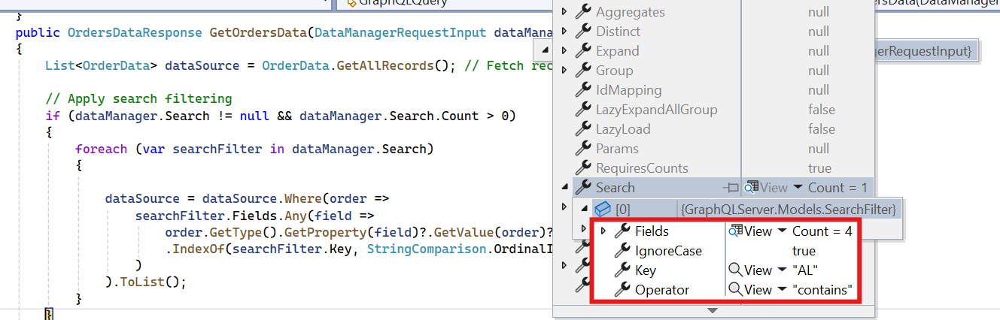
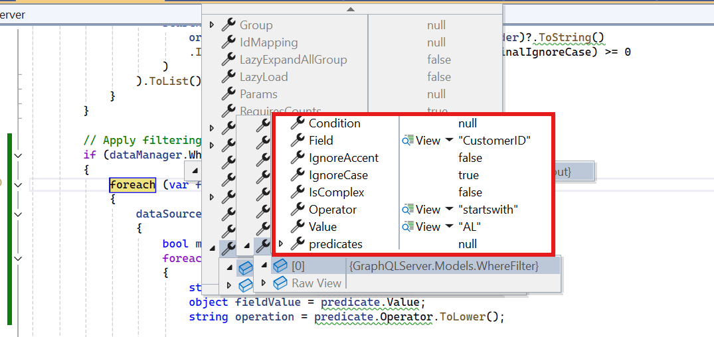
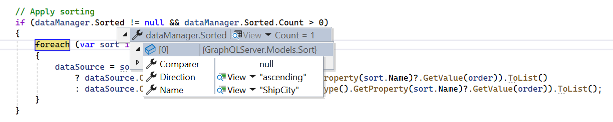
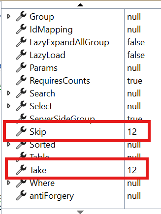
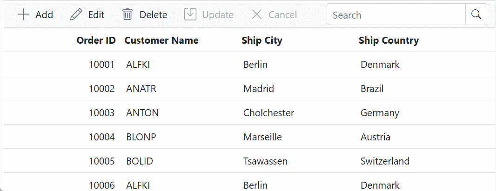

# GraphQL Adaptor in Blazor DataGrid

[GraphQL](https://blazor.syncfusion.com/documentation/data/adaptors#graphql-service-binding) is a query language for APIs that enables precise data retrieval, reducing issues such as over-fetching and under-fetching. It provides a flexible syntax for defining queries, allowing clients to request only the required fields.

The Syncfusion<sup style="font-size:70%">&reg;</sup> Blazor DataGrid integrates with `GraphQL` services through the [GraphQLAdaptor](https://help.syncfusion.com/cr/blazor/Syncfusion.Blazor.Adaptors.html#Syncfusion_Blazor_Adaptors_GraphQLAdaptor) in [SfDataManager](https://help.syncfusion.com/cr/blazor/Syncfusion.Blazor.Data.SfDataManager.html).

The following guide explains how to:

* Configure a `GraphQL` server with [Hot Chocolate](https://chillicream.com/docs/hotchocolate/v14)  
* Connect the Blazor DataGrid to the server  
* Perform data operations, including **paging**, **sorting**, **filtering**, **searching**, and **CRUD** actions.

## Configure a GraphQL server

To set up a `GraphQL` server using **Hot Chocolate** for integration with the Syncfusion<sup style="font-size:70%">&reg;</sup> Blazor DataGrid, follow these steps:

**Step 1: Create an ASP.NET Core application**

- In Visual Studio, select **Create a new project** and choose **ASP.NET Core Web App**.
- Name the project **GraphQLServer**.
- Alternatively, use the .NET CLI:
    ```bash
    dotnet new web -n GraphQLServer
    ```
- Navigate to the project directory:
    ```bash
    cd GraphQLServer
    ```

**Step 2: Install Hot Chocolate NuGet package**

- Install the **HotChocolate.AspNetCore** package using the NuGet Package Manager in Visual Studio (*Tools → NuGet Package Manager → Manage NuGet Packages for Solution*), then search and install.

- Alternatively, use the Package Manager Console:

```powershell
Install-Package HotChocolate.AspNetCore
```

**Step 3: Create a model class**

Add a **Models** folder and create **OrderData.cs** to represent order details:




using System.Text.Json.Serialization;

namespace GraphQLServer.Models
{
    public class OrderData
    {
        public static List<OrderData> Orders = new List<OrderData>();

        public OrderData() { }

        public OrderData(
            int orderID, string customerId, int employeeId, double freight, bool verified,
            DateTime orderDate, string shipCity, string shipName, string shipCountry,
            DateTime shippedDate, string shipAddress)
        {
            OrderID = orderID;
            CustomerID = customerId;
            EmployeeID = employeeId;
            Freight = freight;
            Verified = verified;
            OrderDate = orderDate;
            ShipCity = shipCity;
            ShipName = shipName;
            ShipCountry = shipCountry;
            ShippedDate = shippedDate;
            ShipAddress = shipAddress;
        }

        public static List<OrderData> GetAllRecords()
        {
            if (Orders.Count == 0)
            {
                int code = 10000;
                for (int i = 1; i < 10; i++)
                {
                    Orders.Add(new OrderData(code + 1, "ALFKI", i, 2.3 * i, false, new DateTime(1991, 05, 15), "Berlin", "Simons Bistro", "Denmark", new DateTime(1996, 7, 16), "Kirchgasse 6"));
                    Orders.Add(new OrderData(code + 2, "ANATR", i + 2, 3.3 * i, true, new DateTime(1990, 04, 04), "Madrid", "Queen Cozinha", "Brazil", new DateTime(1996, 9, 11), "Avda. Azteca 123"));
                    Orders.Add(new OrderData(code + 3, "ANTON", i + 1, 4.3 * i, true, new DateTime(1957, 11, 30), "Cholchester", "Frankenversand", "Germany", new DateTime(1996, 10, 7), "Carrera 52 con Ave. Bolívar #65-98 Llano Largo"));
                    Orders.Add(new OrderData(code + 4, "BLONP", i + 3, 5.3 * i, false, new DateTime(1930, 10, 22), "Marseille", "Ernst Handel", "Austria", new DateTime(1996, 12, 30), "Magazinweg 7"));
                    Orders.Add(new OrderData(code + 5, "BOLID", i + 4, 6.3 * i, true, new DateTime(1953, 02, 18), "Tsawassen", "Hanari Carnes", "Switzerland", new DateTime(1997, 12, 3), "1029 - 12th Ave. S."));
                    code += 5;
                }
            }
            return Orders;
        }

        [JsonPropertyName("orderID")]
        public int OrderID { get; set; }

        [JsonPropertyName("customerID")]
        public string? CustomerID { get; set; }

        [JsonPropertyName("employeeID")]
        public int? EmployeeID { get; set; }

        [JsonPropertyName("freight")]
        public double? Freight { get; set; }

        [JsonPropertyName("verified")]
        public bool? Verified { get; set; }

        [JsonPropertyName("orderDate")]
        public DateTime? OrderDate { get; set; }

        [JsonPropertyName("shipCity")]
        public string ShipCity { get; set; }

        [JsonPropertyName("shipName")]
        public string? ShipName { get; set; }

        [JsonPropertyName("shipCountry")]
        public string ShipCountry { get; set; }

        [JsonPropertyName("shippedDate")]
        public DateTime? ShippedDate { get; set; }

        [JsonPropertyName("shipAddress")]
        public string? ShipAddress { get; set; }
    }
}




**Step 4: Define the GraphQL query**

Create a `GraphQLQuery` class to implement the resolver logic for fetching order data from the OrderData model. This resolver processes requests from the Syncfusion<sup style="font-size:70%">&reg;</sup> Blazor DataGrid and returns the required data along with the total record count.

The **resolver** method accepts an instance of [DataManagerRequestInput](https://help.syncfusion.com/cr/blazor/Syncfusion.Blazor.DataManagerRequest.html), which encapsulates query parameters such as paging, sorting, filtering, and search options. These parameters are used to shape the response sent back to the DataGrid.




using GraphQLServer.Models;

/// <summary>
/// Represents the GraphQL query resolver for fetching order data.
/// </summary>
public class GraphQLQuery
{
    /// <summary>
    /// Retrieves all order data and returns it along with the total record count.
    /// </summary>
    /// <param name="dataManager">The data manager request input containing query parameters.</param>
    /// <returns>An instance of <see cref="OrdersDataResponse"/> containing the order data and count.</returns>
    public OrdersDataResponse GetOrdersData(DataManagerRequestInput dataManager)
    {
        // Retrieve all order records from the data source.
        List<OrderData> dataSource = OrderData.GetAllRecords();

        // Calculate the total number of records in the data source.
        int totalRecords = dataSource.Count;

        // Return the response containing the total count and the data records.
        return new OrdersDataResponse
        {
            Count = totalRecords,
            Result = dataSource
        };
    }
}

/// <summary>
/// Represents the response structure for order data queries.
/// </summary>
public class OrdersDataResponse
{
    /// <summary>
    /// Gets or sets the total count of records.
    /// </summary>
    public int Count { get; set; }

    /// <summary>
    /// Gets or sets the list of order data records.
    /// </summary>
    public List<OrderData> Result { get; set; } = new List<OrderData>();
}





namespace GraphQLServer.Models
{
    /// <summary>
    /// Represents the input structure for data manager requests.
    /// </summary>
    public class DataManagerRequestInput
    {
        [GraphQLName("Skip")]
        public int Skip { get; set; }

        [GraphQLName("Take")]
        public int Take { get; set; }

        [GraphQLName("RequiresCounts")]
        public bool RequiresCounts { get; set; } = false;

        [GraphQLName("Params")]
        [GraphQLType(typeof(AnyType))]
        public IDictionary<string, object> Params { get; set; }

        [GraphQLName("Aggregates")]
        [GraphQLType(typeof(AnyType))]
        public List<Aggregate>? Aggregates { get; set; }

        [GraphQLName("Search")]
        public List<SearchFilter>? Search { get; set; }

        [GraphQLName("Sorted")]
        public List<Sort>? Sorted { get; set; }

        [GraphQLName("Where")]
        [GraphQLType(typeof(AnyType))]
        public List<WhereFilter>? Where { get; set; }

        [GraphQLName("Group")]
        public List<string>? Group { get; set; }

        [GraphQLName("antiForgery")]
        public string? antiForgery { get; set; }

        [GraphQLName("Table")]
        public string? Table { get; set; }

        [GraphQLName("IdMapping")]
        public string? IdMapping { get; set; }

        [GraphQLName("Select")]
        public List<string>? Select { get; set; }

        [GraphQLName("Expand")]
        public List<string>? Expand { get; set; }

        [GraphQLName("Distinct")]
        public List<string>? Distinct { get; set; }

        [GraphQLName("ServerSideGroup")]
        public bool? ServerSideGroup { get; set; }

        [GraphQLName("LazyLoad")]
        public bool? LazyLoad { get; set; }

        [GraphQLName("LazyExpandAllGroup")]
        public bool? LazyExpandAllGroup { get; set; }
    }

    /// <summary>
    /// Represents an aggregate operation in the data manager request.
    /// </summary>
    public class Aggregate
    {
        [GraphQLName("Field")]
        public string Field { get; set; }

        [GraphQLName("Type")]
        public string Type { get; set; }
    }

    /// <summary>
    /// Represents a search filter in the data manager request.
    /// </summary>
    public class SearchFilter
    {
        [GraphQLName("Fields")]
        public List<string> Fields { get; set; }

        [GraphQLName("Key")]
        public string Key { get; set; }

        [GraphQLName("Operator")]
        public string Operator { get; set; }

        [GraphQLName("IgnoreCase")]
        public bool IgnoreCase { get; set; }
    }

    /// <summary>
    /// Represents a sorting operation in the data manager request.
    /// </summary>
    public class Sort
    {
        [GraphQLName("Name")]
        public string Name { get; set; }

        [GraphQLName("Direction")]
        public string Direction { get; set; }

        [GraphQLName("Comparer")]
        [GraphQLType(typeof(AnyType))]
        public object Comparer { get; set; }
    }

    /// <summary>
    /// Represents a filter condition in the data manager request.
    /// </summary>
    public class WhereFilter
    {
        [GraphQLName("Field")]
        public string? Field { get; set; }

        [GraphQLName("IgnoreCase")]
        public bool? IgnoreCase { get; set; }

        [GraphQLName("IgnoreAccent")]
        public bool? IgnoreAccent { get; set; }

        [GraphQLName("IsComplex")]
        public bool? IsComplex { get; set; }

        [GraphQLName("Operator")]
        public string? Operator { get; set; }

        [GraphQLName("Condition")]
        public string? Condition { get; set; }

        [GraphQLName("Value")]
        [GraphQLType(typeof(AnyType))]
        public object? Value { get; set; }

        [GraphQLName("predicates")]
        public List<WhereFilter>? predicates { get; set; }
    }
}




**Step 5: Configure the GraphQL server**

Update the **Program.cs** file to register `GraphQL` services and map the `GraphQL` endpoint. This configuration ensures that the server can process `GraphQL` queries efficiently.




var builder = WebApplication.CreateBuilder(args);

// Register GraphQL services.
builder.Services.AddGraphQLServer()
    .AddQueryType<GraphQLQuery>();

var app = builder.Build();

// Use routing middleware.
app.UseRouting();

// Map endpoints.
app.MapGet("/", () => "Hello, World!");
app.MapGraphQL(); // Maps the /graphql endpoint by default.

app.Run();




**Step 6: Test the GraphQL endpoint**

Verify that the `GraphQL` server is running and accessible at **http://localhost:xxxx/graphql**, where **xxxx** represents the port number. Use a GraphQL client or playground to execute the following query:

```
{
    ordersData {
        count
        result {
            orderID
            customerID
            shipCity
            shipCountry
        }
    }
}
```

This query returns the total count of orders and a collection of order details.

> For additional configuration and advanced features, refer to the [Hot Chocolate documentation](https://chillicream.com/docs/hotchocolate/v14).

## Connecting Syncfusion Blazor DataGrid to an GraphQL service
 
To bind the Syncfusion<sup style="font-size:70%">&reg;</sup> Blazor DataGrid to a remote API using the [GraphQLAdaptor](https://help.syncfusion.com/cr/blazor/Syncfusion.Blazor.Adaptors.html#Syncfusion_Blazor_Adaptors_GraphQLAdaptor), configure the [SfDataManager](https://help.syncfusion.com/cr/blazor/Syncfusion.Blazor.Data.SfDataManager.html) component with the API endpoint and adaptor type. The following steps outline the integration process:

**1.Create a Blazor Web App**

1. Open Visual Studio 2022.  
2. Choose **Blazor Web App** and name the project **BlazorGrid**.
3. Use either [Microsoft Templates](https://learn.microsoft.com/en-us/aspnet/core/blazor/tooling?view=aspnetcore-9.0&pivots=vs) or the Syncfusion<sup style="font-size:70%">&reg;</sup> Blazor Extension to create the project.
4. Select the preferred [interactive render mode](https://learn.microsoft.com/en-us/aspnet/core/blazor/components/render-modes?view=aspnetcore-9.0#render-modes) and [interactivity location](https://learn.microsoft.com/en-us/aspnet/core/blazor/tooling?view=aspnetcore-9.0&pivots=vs).

**2. Install Required NuGet Packages**

* Install the following packages using the NuGet Package Manager in Visual Studio (*Tools → NuGet Package Manager → Manage NuGet Packages for Solution*), then search and install:

    - [Syncfusion.Blazor.Grid](https://www.nuget.org/packages/Syncfusion.Blazor.Grid/)
    - [Syncfusion.Blazor.Themes](https://www.nuget.org/packages/Syncfusion.Blazor.Themes/)

> * For projects using **WebAssembly** or **Auto** render modes, install these packages in the client project.

* Alternatively, use the Package Manager Console:

```powershell
Install-Package Syncfusion.Blazor.Grid -Version {{ site.releaseversion }}
Install-Package Syncfusion.Blazor.Themes -Version {{ site.releaseversion }}
```

> Syncfusion<sup style="font-size:70%">&reg;</sup> Blazor components are available on [nuget.org](https://www.nuget.org/packages?q=syncfusion.blazor). Refer to the [NuGet packages](https://blazor.syncfusion.com/documentation/nuget-packages) topic for a complete list of available packages.

**3. Register Syncfusion<sup style="font-size:70%">&reg;</sup> Blazor service**

- Add the required namespaces in **~/_Imports.razor**:

```cs
@using Syncfusion.Blazor
@using Syncfusion.Blazor.Grids
@using Syncfusion.Blazor.Data
```

- Register the Syncfusion<sup style="font-size:70%">&reg;</sup> Blazor service in **Program.cs**:

```csharp
using Syncfusion.Blazor;

builder.Services.AddSyncfusionBlazor();
```

For apps using `WebAssembly` or `Auto (Server and WebAssembly)` render modes, register the service in both **~/Program.cs** files.

**4. Add stylesheet and script references**

Include the theme and script references in **App.razor**:

```html
<head>
    ...
    <link href="_content/Syncfusion.Blazor.Themes/bootstrap5.css" rel="stylesheet" />
</head>
...
<body>
    ...
    <script src="_content/Syncfusion.Blazor.Core/scripts/syncfusion-blazor.min.js" type="text/javascript"></script>
</body>
```

> * Refer to the [Blazor Themes](https://blazor.syncfusion.com/documentation/appearance/themes) topic for available methods to include themes, such as Static Web Assets, CDN, or CRG.
> * Set the render mode to **InteractiveServer** or **InteractiveAuto** in the Blazor Web App configuration.

**5. Configure DataGrid with GraphQLAdaptor**

To bind the DataGrid to the [GraphQLAdaptor](https://help.syncfusion.com/cr/blazor/Syncfusion.Blazor.Adaptors.html#Syncfusion_Blazor_Adaptors_GraphQLAdaptor) using [SfDataManager](https://help.syncfusion.com/cr/blazor/Syncfusion.Blazor.Data.SfDataManager.html) and [GraphQLAdaptorOptions](https://help.syncfusion.com/cr/blazor/Syncfusion.Blazor.DataManager.html#Syncfusion_Blazor_DataManager_GraphQLAdaptorOptions).
Set the [Query](https://help.syncfusion.com/cr/blazor/Syncfusion.Blazor.Data.GraphQLAdaptorOptions.html#Syncfusion_Blazor_Data_GraphQLAdaptorOptions_Query) property to define the GraphQL query and [ResolverName](https://help.syncfusion.com/cr/blazor/Syncfusion.Blazor.Data.GraphQLAdaptorOptions.html#Syncfusion_Blazor_Data_GraphQLAdaptorOptions_ResolverName) to map the response.




@page "/"

@using Syncfusion.Blazor
@using Syncfusion.Blazor.Data
@using Syncfusion.Blazor.Grids
@using System.Text.Json.Serialization;

<SfGrid TValue="OrderData">
    <SfDataManager Url="https://localhost:xxxx/graphql" GraphQLAdaptorOptions="@adaptorOptions" Adaptor="Adaptors.GraphQLAdaptor"></SfDataManager>
    <GridColumns>
        <GridColumn Field="OrderID" HeaderText="Order ID" IsPrimaryKey="true" Width="100" TextAlign="TextAlign.Right"></GridColumn>
        <GridColumn Field="CustomerID" HeaderText="Customer Name" Width="100"></GridColumn>
        <GridColumn Field="ShipCity" HeaderText="Ship City" Width="100"></GridColumn>
        <GridColumn Field="ShipCountry" HeaderText="Ship Country" Width="120"></GridColumn>
    </GridColumns>
</SfGrid>

@code {
    private GraphQLAdaptorOptions adaptorOptions = new GraphQLAdaptorOptions
        {
            Query = @"query ordersData($dataManager: DataManagerRequestInput!) {
                    ordersData(dataManager: $dataManager) {
                        count
                        result {
                            orderID
                            customerID
                            shipCity
                            shipCountry
                        }
                    }
                }",
            ResolverName = "ordersData"
        };

    public class OrderData
    {
        [JsonPropertyName("orderID")]
        public int OrderID { get; set; }

        [JsonPropertyName("customerID")]
        public string? CustomerID { get; set; }

        [JsonPropertyName("shipCity")]
        public string? ShipCity { get; set; }

        [JsonPropertyName("shipCountry")]
        public string? ShipCountry { get; set; }
    }
}




> Replace **https://localhost:xxxx/graphql** with the actual GraphQL endpoint URL.

**6: Enable CORS Policy**

Add a CORS policy in **Program.cs** to allow the Blazor app to access the GraphQL server:

```csharp
// Add CORS policy
builder.Services.AddCors(options =>
{
    options.AddPolicy("AllowSpecificOrigin", policy =>
    {
        // Replace with your Blazor app's URL.
        policy.WithOrigins("https://localhost:xxxx/") 
              .AllowAnyHeader()
              .AllowAnyMethod()
              .AllowCredentials();
    });
});

// Use CORS.
app.UseCors("AllowSpecificOrigin");
```

This configuration ensures that the Blazor application can communicate with the GraphQL server without CORS-related restrictions.

**7: Run the Application**

Start both the Blazor application and the GraphQL server. The DataGrid will fetch and display data from the configured GraphQL API.
 


## Perform data operations in GraphQLAdaptor

The Syncfusion<sup style="font-size:70%">&reg;</sup> Blazor DataGrid supports server-side operations such as **searching**, **filtering**, **sorting**, **paging**, and **CRUD** through the `GraphQLAdaptor`. These operations are executed by passing parameters from the DataGrid to the GraphQL server using the [DataManagerRequestInput](https://help.syncfusion.com/cr/blazor/Syncfusion.Blazor.DataManagerRequest.html) structure.

**Key Operations**

* **Searching**: Uses **Search** property to filter records based on keywords and fields.
* **Filtering**: Uses **Where** property to apply conditional filters on columns.
* **Sorting**: Uses **Sorted** property to define sort fields and directions.
* **Paging**: Uses **Skip** and **Take** properties to retrieve paged data.
* **CRUD**: Uses GraphQL mutations for **Insert**, **Update**, **Delete**, and **Batch** operations.

Each operation is handled on the server by parsing these parameters and applying the logic to the data source before returning the result to the DataGrid.




namespace GraphQLServer.Models
{
    /// <summary>
    /// Represents the input structure for data manager requests.
    /// </summary>
    public class DataManagerRequestInput
    {
        [GraphQLName("Skip")]
        public int Skip { get; set; }

        [GraphQLName("Take")]
        public int Take { get; set; }

        [GraphQLName("RequiresCounts")]
        public bool RequiresCounts { get; set; } = false;

        [GraphQLName("Params")]
        [GraphQLType(typeof(AnyType))]
        public IDictionary<string, object> Params { get; set; }

        [GraphQLName("Aggregates")]
        [GraphQLType(typeof(AnyType))]
        public List<Aggregate>? Aggregates { get; set; }

        [GraphQLName("Search")]
        public List<SearchFilter>? Search { get; set; }

        [GraphQLName("Sorted")]
        public List<Sort>? Sorted { get; set; }

        [GraphQLName("Where")]
        [GraphQLType(typeof(AnyType))]
        public List<WhereFilter>? Where { get; set; }

        [GraphQLName("Group")]
        public List<string>? Group { get; set; }

        [GraphQLName("antiForgery")]
        public string? antiForgery { get; set; }

        [GraphQLName("Table")]
        public string? Table { get; set; }

        [GraphQLName("IdMapping")]
        public string? IdMapping { get; set; }

        [GraphQLName("Select")]
        public List<string>? Select { get; set; }

        [GraphQLName("Expand")]
        public List<string>? Expand { get; set; }

        [GraphQLName("Distinct")]
        public List<string>? Distinct { get; set; }

        [GraphQLName("ServerSideGroup")]
        public bool? ServerSideGroup { get; set; }

        [GraphQLName("LazyLoad")]
        public bool? LazyLoad { get; set; }

        [GraphQLName("LazyExpandAllGroup")]
        public bool? LazyExpandAllGroup { get; set; }
    }

    /// <summary>
    /// Represents an aggregate operation in the data manager request.
    /// </summary>
    public class Aggregate
    {
        [GraphQLName("Field")]
        public string Field { get; set; }

        [GraphQLName("Type")]
        public string Type { get; set; }
    }

    /// <summary>
    /// Represents a search filter in the data manager request.
    /// </summary>
    public class SearchFilter
    {
        [GraphQLName("Fields")]
        public List<string> Fields { get; set; }

        [GraphQLName("Key")]
        public string Key { get; set; }

        [GraphQLName("Operator")]
        public string Operator { get; set; }

        [GraphQLName("IgnoreCase")]
        public bool IgnoreCase { get; set; }
    }

    /// <summary>
    /// Represents a sorting operation in the data manager request.
    /// </summary>
    public class Sort
    {
        [GraphQLName("Name")]
        public string Name { get; set; }

        [GraphQLName("Direction")]
        public string Direction { get; set; }

        [GraphQLName("Comparer")]
        [GraphQLType(typeof(AnyType))]
        public object Comparer { get; set; }
    }

    /// <summary>
    /// Represents a filter condition in the data manager request.
    /// </summary>
    public class WhereFilter
    {
        [GraphQLName("Field")]
        public string? Field { get; set; }

        [GraphQLName("IgnoreCase")]
        public bool? IgnoreCase { get; set; }

        [GraphQLName("IgnoreAccent")]
        public bool? IgnoreAccent { get; set; }

        [GraphQLName("IsComplex")]
        public bool? IsComplex { get; set; }

        [GraphQLName("Operator")]
        public string? Operator { get; set; }

        [GraphQLName("Condition")]
        public string? Condition { get; set; }

        [GraphQLName("Value")]
        [GraphQLType(typeof(AnyType))]
        public object? Value { get; set; }

        [GraphQLName("predicates")]
        public List<WhereFilter>? predicates { get; set; }
    }
}




## Handling searching operation

**Searching** parameters are sent through the **Search** property of `DataManagerRequestInput`. These parameters include:

* **Key**: The search keyword.
* **Fields**: The collection of fields to search against.
* **Operator**: The comparison operator (e.g., contains, startswith).
* **IgnoreCase**: Indicates whether the search should be case-insensitive.

When a search is performed, the DataGrid sends these parameters to the GraphQL server. The server applies the search logic and returns the filtered collection along with the total record count.






@page "/"
@using Syncfusion.Blazor
@using Syncfusion.Blazor.Data
@using Syncfusion.Blazor.Grids
@using System.Text.Json.Serialization;

<SfGrid TValue="OrderData" Toolbar="@(new List<string>() { "Search"})">
<SfDataManager Url="https://localhost:xxxx/graphql" GraphQLAdaptorOptions="@adaptorOptions" Adaptor="Adaptors.GraphQLAdaptor">
    </SfDataManager>
    <GridColumns>
        <GridColumn Field="OrderID" HeaderText="Order ID" Width="100" TextAlign="TextAlign.Right"></GridColumn>
        <GridColumn Field="CustomerID" HeaderText="Customer Name" Width="100"></GridColumn>
        <GridColumn Field="ShipCity" HeaderText="Ship City" Width="100"></GridColumn>
        <GridColumn Field="ShipCountry" HeaderText="Ship Country" Width="120"></GridColumn>
    </GridColumns>
</SfGrid>

@code {
    private GraphQLAdaptorOptions adaptorOptions = new GraphQLAdaptorOptions
        {
            Query = @"query ordersData($dataManager: DataManagerRequestInput!) {
                    ordersData(dataManager: $dataManager) {
                        count
                        result {
                            orderID
                            customerID
                            shipCity
                            shipCountry
                        }
                    }
                }",
            ResolverName = "ordersData"
        };

    public class OrderData
    {
        [JsonPropertyName("orderID")]
        public int OrderID { get; set; }

        [JsonPropertyName("customerID")]
        public string? CustomerID { get; set; }

        [JsonPropertyName("shipCity")]
        public string? ShipCity { get; set; }

        [JsonPropertyName("shipCountry")]
        public string? ShipCountry { get; set; }
    }
}





using GraphQLServer.Models;

// Defines the GraphQL resolver for handling Grid data requests.
public class GraphQLQuery
{
    // Returns order data based on the DataManager request from the Grid.
    public OrdersDataResponse GetOrdersData(DataManagerRequestInput dataManager)
    {
        List<OrderData> dataSource = OrderData.GetAllRecords();

        // Apply search if search filters are provided.
        if (dataManager.Search != null && dataManager.Search.Count > 0)
        {
            foreach (var searchFilter in dataManager.Search)
            {
                // Filter the data based on search key and fields.
                dataSource = dataSource.Where(order =>
                    searchFilter.Fields.Any(field =>
                        order.GetType().GetProperty(field)?.GetValue(order)?.ToString()
                        .IndexOf(searchFilter.Key, StringComparison.OrdinalIgnoreCase) >= 0
                    )
                ).ToList();
            }
        }

        // Get total record count after filtering.
        int totalRecords = dataSource.Count;

        // Return the filtered data and count.
        return new OrdersDataResponse
        {
            Count = totalRecords,
            Result = dataSource
        };
    }
}

// Defines the response structure with data and count.
public class OrdersDataResponse
{
    public int Count { get; set; }
    public List<OrderData> Result { get; set; } = new List<OrderData>();
}




## Handling filtering operation

**Filtering** parameters are sent through the **Where** property of `DataManagerRequestInput`. Each filter condition includes:

* **Field**: The column name to apply the filter.
* **Operator**: The comparison operator (e.g., equal, contains, greaterthan).
* **Value**: The value to compare against.
* **IgnoreCase**: Indicates whether the comparison should be case-insensitive.
* **Predicates**: Nested conditions for complex filtering.

When a filter is applied in the DataGrid, these parameters are passed to the GraphQL server. The server processes the conditions and returns the filtered collection along with the total record count.






@page "/"
@using Syncfusion.Blazor
@using Syncfusion.Blazor.Data
@using Syncfusion.Blazor.Grids
@using System.Text.Json.Serialization;

<SfGrid TValue="OrderData" AllowFiltering=true>
<SfDataManager Url="https://localhost:xxxx/graphql" GraphQLAdaptorOptions="@adaptorOptions" Adaptor="Adaptors.GraphQLAdaptor">
    </SfDataManager>
    <GridColumns>
        <GridColumn Field="OrderID" HeaderText="Order ID" Width="100" TextAlign="TextAlign.Right"></GridColumn>
        <GridColumn Field="CustomerID" HeaderText="Customer Name" Width="100"></GridColumn>
        <GridColumn Field="ShipCity" HeaderText="Ship City" Width="100"></GridColumn>
        <GridColumn Field="ShipCountry" HeaderText="Ship Country" Width="120"></GridColumn>
    </GridColumns>
</SfGrid>

@code {
    private GraphQLAdaptorOptions adaptorOptions = new GraphQLAdaptorOptions
        {
            Query = @"query ordersData($dataManager: DataManagerRequestInput!) {
                    ordersData(dataManager: $dataManager) {
                        count
                        result {
                            orderID
                            customerID
                            shipCity
                            shipCountry
                        }
                    }
                }",
            ResolverName = "ordersData"
        };

    public class OrderData
    {
        [JsonPropertyName("orderID")]
        public int OrderID { get; set; }

        [JsonPropertyName("customerID")]
        public string? CustomerID { get; set; }

        [JsonPropertyName("shipCity")]
        public string? ShipCity { get; set; }

        [JsonPropertyName("shipCountry")]
        public string? ShipCountry { get; set; }
    }
}





using GraphQLServer.Models;

// Defines the GraphQL resolver for handling Grid requests.
public class GraphQLQuery
{
    // Returns order data based on the DataManager request received from the Grid.
    public OrdersDataResponse GetOrdersData(DataManagerRequestInput dataManager)
    {
        List<OrderData> dataSource = OrderData.GetAllRecords();

        // Apply filtering if filter conditions are provided.
        if (dataManager.Where != null && dataManager.Where.Count > 0)
        {
            foreach (var filter in dataManager.Where)
            {
                dataSource = dataSource.Where(order =>
                {
                    bool match = true;
                    foreach (var predicate in filter.predicates)
                    {
                        string fieldName = predicate.Field;
                        object fieldValue = predicate.Value;
                        string operation = predicate.Operator.ToLower();

                        var property = order.GetType().GetProperty(fieldName);
                        if (property == null) return false;

                        var propertyValue = property.GetValue(order);
                        if (propertyValue == null) return false;

                        // Apply filter logic based on the operator type.
                        switch (operation)
                        {
                            case "equal":
                                match &= propertyValue.ToString().Equals(fieldValue.ToString(), StringComparison.OrdinalIgnoreCase);
                                break;
                            case "notequal":
                                match &= !propertyValue.ToString().Equals(fieldValue.ToString(), StringComparison.OrdinalIgnoreCase);
                                break;
                            case "contains":
                                match &= propertyValue.ToString().IndexOf(fieldValue.ToString(), StringComparison.OrdinalIgnoreCase) >= 0;
                                break;
                            case "startswith":
                                match &= propertyValue.ToString().StartsWith(fieldValue.ToString(), StringComparison.OrdinalIgnoreCase);
                                break;
                            case "endswith":
                                match &= propertyValue.ToString().EndsWith(fieldValue.ToString(), StringComparison.OrdinalIgnoreCase);
                                break;
                            case "greaterthan":
                                match &= Convert.ToDouble(propertyValue) > Convert.ToDouble(fieldValue);
                                break;
                            case "lessthan":
                                match &= Convert.ToDouble(propertyValue) < Convert.ToDouble(fieldValue);
                                break;
                            case "greaterthanequal":
                                match &= Convert.ToDouble(propertyValue) >= Convert.ToDouble(fieldValue);
                                break;
                            case "lessthanequal":
                                match &= Convert.ToDouble(propertyValue) <= Convert.ToDouble(fieldValue);
                                break;
                            default:
                                return false;
                        }
                    }
                    return match;
                }).ToList();
            }
        }

        // Get total record count after applying filtering.
        int totalRecords = dataSource.Count;

        // Return the filtered result along with total count.
        return new OrdersDataResponse
        {
            Count = totalRecords,
            Result = dataSource
        };
    }
}

// Defines the structure for returning filtered data and total record count.
public class OrdersDataResponse
{
    public int Count { get; set; }
    public List<OrderData> Result { get; set; } = new List<OrderData>();
}




## Handling sorting operation

**Sorting** parameters are sent through the **Sorted** property of `DataManagerRequestInput`. Each sorting instruction includes:

* **Name**: The column name to sort.
* **Direction**: The sort order (ascending or descending).

When a sort action is triggered in the DataGrid, these parameters are passed to the GraphQL server. The server applies the sorting logic and returns the sorted collection along with the total record count.






@page "/"
@using Syncfusion.Blazor
@using Syncfusion.Blazor.Data
@using Syncfusion.Blazor.Grids
@using System.Text.Json.Serialization;

<SfGrid TValue="OrderData" AllowSorting=true>
<SfDataManager Url="https://localhost:xxxx/graphql" GraphQLAdaptorOptions="@adaptorOptions" Adaptor="Adaptors.GraphQLAdaptor">
    </SfDataManager>
    <GridColumns>
        <GridColumn Field="OrderID" HeaderText="Order ID" Width="100" TextAlign="TextAlign.Right"></GridColumn>
        <GridColumn Field="CustomerID" HeaderText="Customer Name" Width="100"></GridColumn>
        <GridColumn Field="ShipCity" HeaderText="Ship City" Width="100"></GridColumn>
        <GridColumn Field="ShipCountry" HeaderText="Ship Country" Width="120"></GridColumn>
    </GridColumns>
</SfGrid>

@code {
    private GraphQLAdaptorOptions adaptorOptions = new GraphQLAdaptorOptions
        {
            Query = @"query ordersData($dataManager: DataManagerRequestInput!) {
                    ordersData(dataManager: $dataManager) {
                        count
                        result {
                            orderID
                            customerID
                            shipCity
                            shipCountry
                        }
                    }
                }",
            ResolverName = "ordersData"
        };

    public class OrderData
    {
        [JsonPropertyName("orderID")]
        public int OrderID { get; set; }

        [JsonPropertyName("customerID")]
        public string? CustomerID { get; set; }

        [JsonPropertyName("shipCity")]
        public string? ShipCity { get; set; }

        [JsonPropertyName("shipCountry")]
        public string? ShipCountry { get; set; }
    }
}





using GraphQLServer.Models;

// Defines the GraphQL resolver for handling Grid requests.
public class GraphQLQuery
{
    // Returns order data based on the DataManager request received from the Grid.
    public OrdersDataResponse GetOrdersData(DataManagerRequestInput dataManager)
    {
        // Retrieve all records from the data source.
        List<OrderData> dataSource = OrderData.GetAllRecords();

        // Apply sorting if sorting criteria are provided.
        if (dataManager.Sorted != null && dataManager.Sorted.Count > 0)
        {
            foreach (var sort in dataManager.Sorted)
            {
                dataSource = sort.Direction.ToLower() == "ascending"
                    ? dataSource.OrderBy(order => order.GetType().GetProperty(sort.Name)?.GetValue(order)).ToList()
                    : dataSource.OrderByDescending(order => order.GetType().GetProperty(sort.Name)?.GetValue(order)).ToList();
            }
        }

        // Get total record count after applying sorting.
        int totalRecords = dataSource.Count;

        // Return the sorted data along with the total record count.
        return new OrdersDataResponse
        {
            Count = totalRecords,
            Result = dataSource
        };
    }
}

// Defines the structure for returning processed data and its total count.
public class OrdersDataResponse
{
    public int Count { get; set; }
    public List<OrderData> Result { get; set; } = new List<OrderData>();
}




## Handling paging operation

**Paging** parameters are sent through the **Skip** and **Take** properties of `DataManagerRequestInput`:

* **Skip**: The number of records to **skip**.
* **Take**: The number of records to **retrieve** for the current page.

When paging is applied, these parameters are passed to the GraphQL server. The server slices the data accordingly and returns the paged collection along with the total record count.






@page "/"
@using Syncfusion.Blazor
@using Syncfusion.Blazor.Data
@using Syncfusion.Blazor.Grids
@using System.Text.Json.Serialization;

<SfGrid TValue="OrderData" AllowPaging=true>
<SfDataManager Url="https://localhost:xxxx/graphql" GraphQLAdaptorOptions="@adaptorOptions" Adaptor="Adaptors.GraphQLAdaptor">
    </SfDataManager>
    <GridColumns>
        <GridColumn Field="OrderID" HeaderText="Order ID" Width="100" TextAlign="TextAlign.Right"></GridColumn>
        <GridColumn Field="CustomerID" HeaderText="Customer Name" Width="100"></GridColumn>
        <GridColumn Field="ShipCity" HeaderText="Ship City" Width="100"></GridColumn>
        <GridColumn Field="ShipCountry" HeaderText="Ship Country" Width="120"></GridColumn>
    </GridColumns>
</SfGrid>

@code {
    private GraphQLAdaptorOptions adaptorOptions = new GraphQLAdaptorOptions
        {
            Query = @"query ordersData($dataManager: DataManagerRequestInput!) {
                    ordersData(dataManager: $dataManager) {
                        count
                        result {
                            orderID
                            customerID
                            shipCity
                            shipCountry
                        }
                    }
                }",
            ResolverName = "ordersData"
        };

    public class OrderData
    {
        [JsonPropertyName("orderID")]
        public int OrderID { get; set; }

        [JsonPropertyName("customerID")]
        public string? CustomerID { get; set; }

        [JsonPropertyName("shipCity")]
        public string? ShipCity { get; set; }

        [JsonPropertyName("shipCountry")]
        public string? ShipCountry { get; set; }
    }
}





using GraphQLServer.Models;

// Defines the GraphQL resolver for handling Grid requests.
public class GraphQLQuery
{
    // Returns order data based on the DataManager request received from the Grid.
    public OrdersDataResponse GetOrdersData(DataManagerRequestInput dataManager)
    {
        // Retrieve all records from the data source.
        List<OrderData> dataSource = OrderData.GetAllRecords();

        // Store the total number of records before applying pagination.
        int totalRecords = dataSource.Count;

        // Apply paging by skipping the specified number of records and taking the required count.
        dataSource = dataSource.Skip(dataManager.Skip).Take(dataManager.Take).ToList();

        // Return the paged data along with the total record count.
        return new OrdersDataResponse
        {
            Count = totalRecords,
            Result = dataSource
        };
    }
}

// Defines the structure for returning processed data and its total count.
public class OrdersDataResponse
{
    public int Count { get; set; }
    public List<OrderData> Result { get; set; } = new List<OrderData>();
}




## Handling CRUD operation using mutation

The Syncfusion<sup style="font-size:70%">&reg;</sup> Blazor DataGrid integrates with GraphQL APIs using the `GraphQLAdaptor` to support **Create**, **Read**, **Update**, **Delete**, and **Batch** operations. These operations are mapped to GraphQL mutations for real-time data interaction.

**Configure Mutation Queries**

Define mutation queries in the [GraphQLAdaptorOptions.Mutation](https://help.syncfusion.com/cr/blazor/Syncfusion.Blazor.Data.GraphQLAdaptorOptions.html#Syncfusion_Blazor_Data_GraphQLAdaptorOptions_Mutation) property. Each operation requires a specific mutation:

* [Insert](https://help.syncfusion.com/cr/blazor/Syncfusion.Blazor.Data.GraphQLMutation.html#Syncfusion_Blazor_Data_GraphQLMutation_Insert): Adds a new record.
* [Update](https://help.syncfusion.com/cr/blazor/Syncfusion.Blazor.Data.GraphQLMutation.html#Syncfusion_Blazor_Data_GraphQLMutation_Update): Modifies an existing record.
* [Delete](https://help.syncfusion.com/cr/blazor/Syncfusion.Blazor.Data.GraphQLMutation.html#Syncfusion_Blazor_Data_GraphQLMutation_Delete): Removes a record.
* [Batch](https://help.syncfusion.com/cr/blazor/Syncfusion.Blazor.Data.GraphQLMutation.html#Syncfusion_Blazor_Data_GraphQLMutation_Batch): Handles multiple operations(Insert, Update, and Delete) in a single request.

**Configuration in GraphQL server application**

This configuration sets up the GraphQL server to handle queries and mutations and enables **CORS** for cross-origin requests from the Blazor application:

```cshtml

var builder = WebApplication.CreateBuilder(args);

//GraphQL resolver is defined in GraphQLQuery class and mutation methods are defined in GraphQLMutation class
builder.Services.AddGraphQLServer().AddQueryType<GraphQLQuery>().AddMutationType<GraphQLMutation>();

//CORS is enabled to access the GraphQL server from the client application
builder.Services.AddCors(options =>
{
    options.AddPolicy("AllowSpecificOrigin", builder =>
    {
        builder.WithOrigins("https://xxxxxx")
        .AllowAnyHeader()
        .AllowAnyMethod()
        .AllowCredentials().Build();
    });
});

```

This configuration ensures:

* **GraphQLQuery** handles data retrieval.
* **GraphQLMutation** handles insert, update, delete, and batch operations.
* **CORS policy** allows secure communication between the Blazor app and the GraphQL server.

**1. Insert Operation:**

To insert a new record into the GraphQL server, configure the mutation query in the [Insert](https://help.syncfusion.com/cr/blazor/Syncfusion.Blazor.Data.GraphQLMutation.html#Syncfusion_Blazor_Data_GraphQLMutation_Insert) property of the `GraphQLAdaptorOptions.Mutation` object.

This mutation is executed when a new row is added to the Syncfusion<sup style="font-size:70%">&reg;</sup> Blazor DataGrid. The adaptor sends the required parameters to the GraphQL server for processing.

**Mutation query configuration**

```cs
Mutation = new GraphQLMutation
{
    Insert = @"mutation create($record: OrderDataInput!, $index: Int!, $action: String!, $additionalParameters: Any) {
            createOrder(record: $record, index: $index, action: $action, additionalParameters: $additionalParameters) {
                orderID
                customerID
                shipCity
                shipCountry
            }
        }",
},
```

**Parameters Sent to the Server**

These parameters are passed to the mutation method for the `Insert` operation on the server:

| Parameter | Description |
|--------|----------------|
| record | Represents the new record to be inserted. |
| index | Specifies the position at which the record should be inserted.  |
| action | Indicates the type of operation (e.g., Add, Delete, Update).  |
| additionalParameters | Optional parameter for custom logic during the operation.  |

**Server-Side Mutation Implementation**

This example demonstrates how to implement the insert logic on the GraphQL server using C# with the **HotChocolate**:

```cs

using GraphQLServer.Models;

namespace GraphQLServer.GraphQL
{
    public class GraphQLMutation
    {
        public OrderData CreateOrder(OrderData record, int index, string action, [GraphQLType(typeof(AnyType))] IDictionary<string, object> additionalParameters)
        {
            var orders = OrderData.GetAllRecords();
            if (index >= 0 && index <= orders.Count)
            {
                orders.Insert(index, record);
            }
            else
            {
                orders.Add(record);
            }
            return record;
        }
    }
}

```

**2. Update Operation:**

To update an existing record on the GraphQL server, configure the mutation query in the [Update](https://help.syncfusion.com/cr/blazor/Syncfusion.Blazor.Data.GraphQLMutation.html#Syncfusion_Blazor_Data_GraphQLMutation_Update) property of the [GraphQLAdaptorOptions.Mutation](https://help.syncfusion.com/cr/blazor/Syncfusion.Blazor.Data.GraphQLAdaptorOptions.html#Syncfusion_Blazor_Data_GraphQLAdaptorOptions_Mutation) object.

This mutation is triggered when a row in the Syncfusion<sup style="font-size:70%">&reg;</sup> Blazor DataGrid is modified. The adaptor sends the updated record and related parameters to the GraphQL server for processing.

**Mutation query configuration**

```cs
Mutation = new GraphQLMutation
{
    Update = @"mutation update($record: OrderDataInput!, $action: String!, $primaryColumnName: String!, $primaryColumnValue: Int!, $additionalParameters: Any) {
            updateOrder(record: $record, action: $action, primaryColumnName: $primaryColumnName, primaryColumnValue: $primaryColumnValue, additionalParameters: $additionalParameters) {
                orderID
                customerID
                shipCity
                shipCountry
            }
        }",
},
```

**Parameters Sent to the Server**

These parameters are passed to the mutation method for the `Update` operation on the server:

| Parameter | Description |
|--------|----------------|
| record | Represents the updated record. |
| action | Indicates the type of operation (e.g., Add, Delete, Update). |
| primaryColumnName | Specifies the name of the primary key column. |
| primaryColumnValue | Specifies the value of the primary key for the record to update.   |
| additionalParameters | Optional parameter for custom logic during the operation.   |

**Server-Side Mutation Implementation**

This example demonstrates how to implement the update logic on the GraphQL server using C# with the **HotChocolate**:

```cs
using GraphQLServer.Models;

namespace GraphQLServer.GraphQL
{
    public class GraphQLMutation
    {
        public OrderData UpdateOrder(OrderData record, string action, string primaryColumnName, int primaryColumnValue, [GraphQLType(typeof(AnyType))] IDictionary<string, object> additionalParameters)
        {
            var existingOrder = OrderData.GetAllRecords().FirstOrDefault(x => x.OrderID == primaryColumnValue);
            if (existingOrder != null)
            {
                existingOrder.CustomerID = record.CustomerID;
                existingOrder.EmployeeID = record.EmployeeID;
                existingOrder.ShipCity = record.ShipCity;
                existingOrder.ShipCountry = record.ShipCountry;
        }
            return existingOrder;
        }
    }
}

```

**3. Delete Operation:**

To remove an existing record from the GraphQL server, configure the mutation query in the [Delete](https://help.syncfusion.com/cr/blazor/Syncfusion.Blazor.Data.GraphQLMutation.html#Syncfusion_Blazor_Data_GraphQLMutation_Delete) property of the [GraphQLAdaptorOptions.Mutation](https://help.syncfusion.com/cr/blazor/Syncfusion.Blazor.Data.GraphQLAdaptorOptions.html#Syncfusion_Blazor_Data_GraphQLAdaptorOptions_Mutation) object.

This mutation is executed when a row is deleted in the Syncfusion<sup style="font-size:70%">&reg;</sup> Blazor DataGrid. The adaptor sends the primary key and related parameters to the GraphQL server for processing.

**Mutation query configuration**

```cs
Mutation = new GraphQLMutation
{
    Delete = @"mutation delete($primaryColumnValue: Int!, $action: String!, $primaryColumnName: String!, $additionalParameters: Any) {
            deleteOrder(primaryColumnValue: $primaryColumnValue, action: $action, primaryColumnName: $primaryColumnName, additionalParameters: $additionalParameters) {
                orderID
                customerID
                shipCity
                shipCountry
            }
        }",
},
```

**Parameters Sent to the Server**

These parameters are passed to the mutation method for the **Delete** operation on the server:

| Parameter | Description |
|--------|----------------|
| primaryColumnValue | Specifies the primary key value of the record to delete. |
| action | Indicates the type of operation (e.g., Add, Delete, Update).  |
| primaryColumnName | Specifies the name of the primary key column.  |
| additionalParameters | Optional parameter for custom logic during the operation.   |

**Server-Side Mutation Implementation**

This example demonstrates how to implement the delete logic on the GraphQL server using C# with the **HotChocolate**:

```cs
using GraphQLServer.Models;

namespace GraphQLServer.GraphQL
{
    public class GraphQLMutation
    {
        public OrderData DeleteOrder(int primaryColumnValue, string action, string primaryColumnName, [GraphQLType(typeof(AnyType))] IDictionary<string, object> additionalParameters)
        {
            var orders = OrderData.GetAllRecords();
            var orderToDelete = orders.FirstOrDefault(x => x.OrderID == primaryColumnValue);
            if (orderToDelete != null)
            {
                orders.Remove(orderToDelete);
            }
            return orderToDelete;
        }
    }
}

```




@page "/"

@using Syncfusion.Blazor
@using Syncfusion.Blazor.Data
@using Syncfusion.Blazor.Grids
@using System.Text.Json.Serialization;

<SfGrid TValue="OrderData" Toolbar="@(new List<string>() { "Add", "Edit", "Delete", "Update", "Search", "Cancel" })" AllowFiltering="true" AllowSorting="true" AllowPaging="true">
<SfDataManager Url="https://localhost:xxxx/graphql" GraphQLAdaptorOptions="@adaptorOptions" Adaptor="Adaptors.GraphQLAdaptor">
    </SfDataManager>
    <GridEditSettings AllowEditing="true" AllowDeleting="true" AllowAdding="true" Mode="EditMode.Normal"></GridEditSettings>
    <GridColumns>
        <GridColumn Field="OrderID" HeaderText="Order ID" IsPrimaryKey="true" Width="100" TextAlign="TextAlign.Right"></GridColumn>
        <GridColumn Field="CustomerID" HeaderText="Customer Name" Width="100"></GridColumn>
        <GridColumn Field="ShipCity" HeaderText="Ship City" Width="100"></GridColumn>
        <GridColumn Field="ShipCountry" HeaderText="Ship Country" Width="120"></GridColumn>
    </GridColumns>
</SfGrid>

@code {
    private GraphQLAdaptorOptions adaptorOptions = new GraphQLAdaptorOptions
        {
            Query = @"query ordersData($dataManager: DataManagerRequestInput!) {
                    ordersData(dataManager: $dataManager) {
                        count
                        result {
                            orderID
                            customerID
                            shipCity
                            shipCountry
                        }
                    }
                }",
            Mutation = new GraphQLMutation
            {
                Insert = @"mutation create($record: OrderDataInput!, $index: Int!, $action: String!, $additionalParameters: Any) {
                        createOrder(record: $record, index: $index, action: $action, additionalParameters: $additionalParameters) {
                            orderID
                            customerID
                            shipCity
                            shipCountry
                        }
                    }",
                Update = @"mutation update($record: OrderDataInput!, $action: String!, $primaryColumnName: String!, $primaryColumnValue: Int!, $additionalParameters: Any) {
                        updateOrder(record: $record, action: $action, primaryColumnName: $primaryColumnName, primaryColumnValue: $primaryColumnValue, additionalParameters: $additionalParameters) {
                            orderID
                            customerID
                            shipCity
                            shipCountry
                        }
                    }",
                Delete = @"mutation delete($primaryColumnValue: Int!, $action: String!, $primaryColumnName: String!, $additionalParameters: Any) {
                        deleteOrder(primaryColumnValue: $primaryColumnValue, action: $action, primaryColumnName: $primaryColumnName, additionalParameters: $additionalParameters) {
                            orderID
                            customerID
                            shipCity
                            shipCountry
                        }
                    }",
            },
            ResolverName = "ordersData"
        };

    public class OrderData
    {
        [JsonPropertyName("orderID")]
        public int OrderID { get; set; }

        [JsonPropertyName("customerID")]
        public string? CustomerID { get; set; }

        [JsonPropertyName("shipCity")]
        public string? ShipCity { get; set; }

        [JsonPropertyName("shipCountry")]
        public string? ShipCountry { get; set; }
    }
}





using GraphQLServer.Models;

namespace GraphQLServer.GraphQL
{
    public class GraphQLMutation
    {
        public OrderData CreateOrder(OrderData record, int index, string action,
            [GraphQLType(typeof(AnyType))] IDictionary<string, object> additionalParameters)
        {
            var orders = OrderData.GetAllRecords();
            if (index >= 0 && index <= orders.Count)
            {
                orders.Insert(index, record);
            }
            else
            {
                orders.Add(record);
            }
            return record;
        }

        public OrderData UpdateOrder(OrderData record, string action, string primaryColumnName, int primaryColumnValue,
            [GraphQLType(typeof(AnyType))] IDictionary<string, object> additionalParameters)
        {
            var existingOrder = OrderData.GetAllRecords().FirstOrDefault(x => x.OrderID == primaryColumnValue);
            if (existingOrder != null)
            {
                existingOrder.CustomerID = record.CustomerID;
                existingOrder.EmployeeID = record.EmployeeID;
                existingOrder.ShipCity = record.ShipCity;
                existingOrder.ShipCountry = record.ShipCountry;
        }
            return existingOrder;
        }

        public OrderData DeleteOrder(int primaryColumnValue, string action, string primaryColumnName,
            [GraphQLType(typeof(AnyType))] IDictionary<string, object> additionalParameters)
        {
            var orders = OrderData.GetAllRecords();
            var orderToDelete = orders.FirstOrDefault(x => x.OrderID == primaryColumnValue);
            if (orderToDelete != null)
            {
                orders.Remove(orderToDelete);
            }
            return orderToDelete;
        }
    }
}






**Batch operation:**

To enable multiple data operations such as insert, update, and delete in a single request, configure the mutation query in the [Batch](https://help.syncfusion.com/cr/blazor/Syncfusion.Blazor.Data.GraphQLMutation.html#Syncfusion_Blazor_Data_GraphQLMutation_Batch) property of the [GraphQLAdaptorOptions.Mutation](https://help.syncfusion.com/cr/blazor/Syncfusion.Blazor.Data.GraphQLAdaptorOptions.html#Syncfusion_Blazor_Data_GraphQLAdaptorOptions_Mutation) object.

This `Batch` mutation executes when multiple changes such as **add**, **edit**, and **delete** are performed in [Batch Edit Mode](https://help.syncfusion.com/cr/blazor/Syncfusion.Blazor.Grids.EditMode.html#Syncfusion_Blazor_Grids_EditMode_Batch) in the Syncfusion<sup style="font-size:70%">&reg;</sup> Blazor DataGrid and committed using the **Update** toolbar button.

**Mutation query configuration**

```cs

Mutation = new GraphQLMutation
{
    Batch = @"
    mutation batch($changed: [OrderDataInput!], $added: [OrderDataInput!], $deleted: [OrderDataInput!], $action: String!, $primaryColumnName: String!, $additionalParameters: Any, $dropIndex: Int) {
      batchUpdate(changed: $changed, added: $added, deleted: $deleted, action: $action, primaryColumnName :$primaryColumnName, additionalParameters: $additionalParameters, dropIndex: $dropIndex) {
                orderID
                customerID
                shipCity
                shipCountry
      }
    }"
},

```

**Parameters Sent to the Server**

These parameters are passed to the mutation method for the **Batch** operation on the server:

| Parameter | Description |
|--------|----------------|
| changed | Collection of records to update. |
| added | Collection of records to insert.  |
| deleted | Collection of records to remove.   |
| action | Indicates the type of operation being performed. |
| primaryColumnName | Specifies the name of the primary key column.  |
| additionalParameters | Optional parameter for custom logic during the operation.   |
| dropIndex | Position where new records should be inserted during drag-and-drop.   |

**Server-Side Mutation Implementation**

This example demonstrates how to implement the batch logic on the GraphQL server using C# with the **HotChocolate**:

```cs
using GraphQLServer.Models;

namespace GraphQLServer.GraphQL
{
    public class GraphQLMutation
    {
        public List<OrderData> BatchUpdate(List<OrderData>? changed, List<OrderData>? added,
            List<OrderData>? deleted, string action, string primaryColumnName,
            [GraphQLType(typeof(AnyType))] IDictionary<string, object> additionalParameters, int? dropIndex)
        {
            var orders = OrderData.GetAllRecords();

            // Update existing orders.
            if (changed != null)
            {
                foreach (var changedOrder in changed)
                {
                    var order = orders.FirstOrDefault(e => e.OrderID == changedOrder.OrderID);
                    if (order != null)
                    {
                        order.CustomerID = changedOrder.CustomerID;
                        order.OrderDate = changedOrder.OrderDate;
                        order.Freight = changedOrder.Freight;
                    }
                }
            }

            // Add new orders.
            if (added != null)
            {
                if (dropIndex.HasValue && dropIndex >= 0 && dropIndex <= orders.Count)
                {
                    orders.InsertRange(dropIndex.Value, added);
                }
                else
                {
                    orders.AddRange(added);
                }
            }

            // Delete orders.
            if (deleted != null)
            {
                foreach (var deletedOrder in deleted)
                {
                    var orderToRemove = orders.FirstOrDefault(e => e.OrderID == deletedOrder.OrderID);
                    if (orderToRemove != null)
                    {
                        orders.Remove(orderToRemove);
                    }
                }
            }

            return orders;
        }
    }
}

```




@page "/"

@using Syncfusion.Blazor
@using Syncfusion.Blazor.Data
@using Syncfusion.Blazor.Grids
@using System.Text.Json.Serialization;

<SfGrid TValue="OrderData" Toolbar="@(new List<string>() { "Add", "Edit", "Delete", "Update", "Cancel" })">
<SfDataManager Url="https://localhost:xxxx/graphql" GraphQLAdaptorOptions="@adaptorOptions" Adaptor="Adaptors.GraphQLAdaptor">
    </SfDataManager>
    <GridEditSettings AllowEditing="true" AllowDeleting="true" AllowAdding="true" Mode="EditMode.Batch"></GridEditSettings>
    <GridColumns>
        <GridColumn Field="OrderID" HeaderText="Order ID" IsPrimaryKey="true" Width="100" TextAlign="TextAlign.Right"></GridColumn>
        <GridColumn Field="CustomerID" HeaderText="Customer Name" Width="100"></GridColumn>
        <GridColumn Field="ShipCity" HeaderText="Ship City" Width="100"></GridColumn>
        <GridColumn Field="ShipCountry" HeaderText="Ship Country" Width="120"></GridColumn>
    </GridColumns>
</SfGrid>

@code {
    private GraphQLAdaptorOptions adaptorOptions = new GraphQLAdaptorOptions
        {
            Query = @"query ordersData($dataManager: DataManagerRequestInput!) {
                    ordersData(dataManager: $dataManager) {
                        count
                        result {
                            orderID
                            customerID
                            shipCity
                            shipCountry
                        }
                    }
                }",
            Mutation = new GraphQLMutation
            {
                Batch = @"
                mutation batch($changed: [OrderDataInput!], $added: [OrderDataInput!], $deleted: [OrderDataInput!], $action: String!, $primaryColumnName: String!, $additionalParameters: Any, $dropIndex: Int) {
                    batchUpdate(changed: $changed, added: $added, deleted: $deleted, action: $action, primaryColumnName :$primaryColumnName, additionalParameters: $additionalParameters, dropIndex: $dropIndex) {
                            orderID
                            customerID
                            shipCity
                            shipCountry
                    }
                }"
            },
            ResolverName = "ordersData"
        };

    public class OrderData
    {
        [JsonPropertyName("orderID")]
        public int OrderID { get; set; }

        [JsonPropertyName("customerID")]
        public string? CustomerID { get; set; }

        [JsonPropertyName("shipCity")]
        public string? ShipCity { get; set; }

        [JsonPropertyName("shipCountry")]
        public string? ShipCountry { get; set; }
    }
}





using GraphQLServer.Models;

namespace GraphQLServer.GraphQL
{
    public class GraphQLMutation
    {
        public List<OrderData> BatchUpdate(List<OrderData>? changed, List<OrderData>? added,
            List<OrderData>? deleted, string action, string primaryColumnName,
            [GraphQLType(typeof(AnyType))] IDictionary<string, object> additionalParameters, int? dropIndex)
        {
            var orders = OrderData.GetAllRecords();

            // Update existing orders.
            if (changed != null)
            {
                foreach (var changedOrder in changed)
                {
                    var order = orders.FirstOrDefault(e => e.OrderID == changedOrder.OrderID);
                    if (order != null)
                    {
                        order.CustomerID = changedOrder.CustomerID;
                        order.OrderDate = changedOrder.OrderDate;
                        order.Freight = changedOrder.Freight;
                    }
                }
            }

            // Add new orders.
            if (added != null)
            {
                if (dropIndex.HasValue && dropIndex >= 0 && dropIndex <= orders.Count)
                {
                    orders.InsertRange(dropIndex.Value, added);
                }
                else
                {
                    orders.AddRange(added);
                }
            }

            // Delete orders.
            if (deleted != null)
            {
                foreach (var deletedOrder in deleted)
                {
                    var orderToRemove = orders.FirstOrDefault(e => e.OrderID == deletedOrder.OrderID);
                    if (orderToRemove != null)
                    {
                        orders.Remove(orderToRemove);
                    }
                }
            }

            return orders;
        }
    }
}




> The complete implementation is available in the [GitHub](https://github.com/SyncfusionExamples/Binding-data-from-remote-service-to-blazor-data-grid/tree/master/GraphQLAdaptor) sample.
