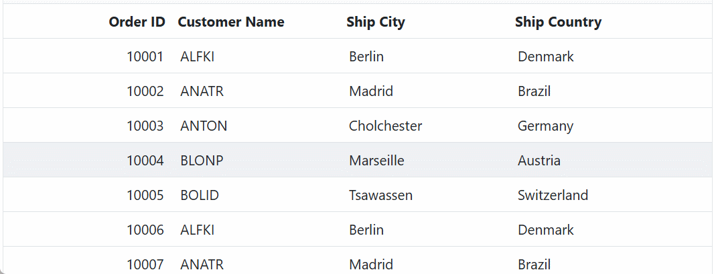

# GraphQL Adaptor in Blazor DataGrid

GraphQL is a powerful query language for APIs, designed to provide a more efficient alternative to traditional REST APIs. It allows you to precisely fetch the data you need, reducing over-fetching and under-fetching of data. GraphQL provides a flexible and expressive syntax for querying, enabling clients to request only the specific data they require.

Syncfusion’s Blazor DataGrid  seamlessly integrates with GraphQL servers using the GraphQLAdaptor in the [SfDataManager](https://blazor.syncfusion.com/documentation/data/getting-started-with-web-app). This specialized adaptor simplifies the interaction between the Grid and GraphQL servers, allowing efficient data retrieval with support for various operations like CRUD (Create, Read, Update and Delete), paging, sorting, and filtering.

This section describes a step-by-step process for retrieving data from a GraphQL service using GraphQLAdaptor, then binding it to the Grid to facilitate data and CRUD operations.

## Configure a GraphQL server

To configure a GraphQL server using Hot Chocolate with the Syncfusion<sup style="font-size:70%">&reg;</sup> Blazor DataGrid, follow these steps:

**Step 1: Create a new ASP.NET Core application**

- Open Visual Studio and select **Create a new project**.
- Choose **ASP.NET Core Web App** and name the project `GraphQLServer`.
- Alternatively, you can use a terminal or command prompt to create the project:
    ```bash
    dotnet new web -n GraphQLServer
    ```
- Navigate to the project directory:
    ```bash
    cd GraphQLServer
    ```

**Step 2: Add the Hot Chocolate NuGet package**

- Open the **NuGet Package Manager** by right-clicking on the project in the **Solution Explorer** and selecting **Manage NuGet Packages**.
- Go to the **Browse** tab, search for `HotChocolate.AspNetCore`, and select the package.
- Click **Install** to add it to your project.

Alternatively, you can use the **Package Manager Console** to install the package by running the following command:

```powershell
Install-Package HotChocolate.AspNetCore
```

**Step 3: Create a model class**

Add a new folder named **Models**. Then, add a model class named **OrderData.cs** in the **Models** folder to represent the order data.




using System.Text.Json.Serialization;

namespace GraphQLServer.Models
{
    public class OrderData
    {
        public static List<OrderData> Orders = new List<OrderData>();

        public OrderData() { }

        public OrderData(
            int orderID, string customerId, int employeeId, double freight, bool verified,
            DateTime orderDate, string shipCity, string shipName, string shipCountry,
            DateTime shippedDate, string shipAddress)
        {
            OrderID = orderID;
            CustomerID = customerId;
            EmployeeID = employeeId;
            Freight = freight;
            Verified = verified;
            OrderDate = orderDate;
            ShipCity = shipCity;
            ShipName = shipName;
            ShipCountry = shipCountry;
            ShippedDate = shippedDate;
            ShipAddress = shipAddress;
        }

        public static List<OrderData> GetAllRecords()
        {
            if (Orders.Count == 0)
            {
                int code = 10000;
                for (int i = 1; i < 10; i++)
                {
                    Orders.Add(new OrderData(code + 1, "ALFKI", i, 2.3 * i, false, new DateTime(1991, 05, 15), "Berlin", "Simons Bistro", "Denmark", new DateTime(1996, 7, 16), "Kirchgasse 6"));
                    Orders.Add(new OrderData(code + 2, "ANATR", i + 2, 3.3 * i, true, new DateTime(1990, 04, 04), "Madrid", "Queen Cozinha", "Brazil", new DateTime(1996, 9, 11), "Avda. Azteca 123"));
                    Orders.Add(new OrderData(code + 3, "ANTON", i + 1, 4.3 * i, true, new DateTime(1957, 11, 30), "Cholchester", "Frankenversand", "Germany", new DateTime(1996, 10, 7), "Carrera 52 con Ave. Bolívar #65-98 Llano Largo"));
                    Orders.Add(new OrderData(code + 4, "BLONP", i + 3, 5.3 * i, false, new DateTime(1930, 10, 22), "Marseille", "Ernst Handel", "Austria", new DateTime(1996, 12, 30), "Magazinweg 7"));
                    Orders.Add(new OrderData(code + 5, "BOLID", i + 4, 6.3 * i, true, new DateTime(1953, 02, 18), "Tsawassen", "Hanari Carnes", "Switzerland", new DateTime(1997, 12, 3), "1029 - 12th Ave. S."));
                    code += 5;
                }
            }
            return Orders;
        }

        [JsonPropertyName("orderID")]
        public int OrderID { get; set; }

        [JsonPropertyName("customerID")]
        public string? CustomerID { get; set; }

        [JsonPropertyName("employeeID")]
        public int? EmployeeID { get; set; }

        [JsonPropertyName("freight")]
        public double? Freight { get; set; }

        [JsonPropertyName("verified")]
        public bool? Verified { get; set; }

        [JsonPropertyName("orderDate")]
        public DateTime? OrderDate { get; set; }

        [JsonPropertyName("shipCity")]
        public string ShipCity { get; set; }

        [JsonPropertyName("shipName")]
        public string? ShipName { get; set; }

        [JsonPropertyName("shipCountry")]
        public string ShipCountry { get; set; }

        [JsonPropertyName("shippedDate")]
        public DateTime? ShippedDate { get; set; }

        [JsonPropertyName("shipAddress")]
        public string? ShipAddress { get; set; }
    }
}




**Step 4: Define the GraphQL query**

Create a `GraphQLQuery` class to define the query resolver for fetching order data. This class will handle the logic for retrieving data from the `OrderData` model. The following code demonstrates the `DataManagerRequestInput` class, which is passed as an argument to the resolver function.




using GraphQLServer.Models;

/// <summary>
/// Represents the GraphQL query resolver for fetching order data.
/// </summary>
public class GraphQLQuery
{
    /// <summary>
    /// Retrieves all order data and returns it along with the total record count.
    /// </summary>
    /// <param name="dataManager">The data manager request input containing query parameters.</param>
    /// <returns>An instance of <see cref="OrdersDataResponse"/> containing the order data and count.</returns>
    public OrdersDataResponse GetOrdersData(DataManagerRequestInput dataManager)
    {
        // Retrieve all order records from the data source.
        List<OrderData> dataSource = OrderData.GetAllRecords();

        // Calculate the total number of records in the data source.
        int totalRecords = dataSource.Count;

        // Return the response containing the total count and the data records.
        return new OrdersDataResponse
        {
            Count = totalRecords,
            Result = dataSource
        };
    }
}

/// <summary>
/// Represents the response structure for order data queries.
/// </summary>
public class OrdersDataResponse
{
    /// <summary>
    /// Gets or sets the total count of records.
    /// </summary>
    public int Count { get; set; }

    /// <summary>
    /// Gets or sets the list of order data records.
    /// </summary>
    public List<OrderData> Result { get; set; } = new List<OrderData>();
}





namespace GraphQLServer.Models
{
    /// <summary>
    /// Represents the input structure for data manager requests.
    /// </summary>
    public class DataManagerRequestInput
    {
        [GraphQLName("Skip")]
        public int Skip { get; set; }

        [GraphQLName("Take")]
        public int Take { get; set; }

        [GraphQLName("RequiresCounts")]
        public bool RequiresCounts { get; set; } = false;

        [GraphQLName("Params")]
        [GraphQLType(typeof(AnyType))]
        public IDictionary<string, object> Params { get; set; }

        [GraphQLName("Aggregates")]
        [GraphQLType(typeof(AnyType))]
        public List<Aggregate>? Aggregates { get; set; }

        [GraphQLName("Search")]
        public List<SearchFilter>? Search { get; set; }

        [GraphQLName("Sorted")]
        public List<Sort>? Sorted { get; set; }

        [GraphQLName("Where")]
        [GraphQLType(typeof(AnyType))]
        public List<WhereFilter>? Where { get; set; }

        [GraphQLName("Group")]
        public List<string>? Group { get; set; }

        [GraphQLName("antiForgery")]
        public string? antiForgery { get; set; }

        [GraphQLName("Table")]
        public string? Table { get; set; }

        [GraphQLName("IdMapping")]
        public string? IdMapping { get; set; }

        [GraphQLName("Select")]
        public List<string>? Select { get; set; }

        [GraphQLName("Expand")]
        public List<string>? Expand { get; set; }

        [GraphQLName("Distinct")]
        public List<string>? Distinct { get; set; }

        [GraphQLName("ServerSideGroup")]
        public bool? ServerSideGroup { get; set; }

        [GraphQLName("LazyLoad")]
        public bool? LazyLoad { get; set; }

        [GraphQLName("LazyExpandAllGroup")]
        public bool? LazyExpandAllGroup { get; set; }
    }

    /// <summary>
    /// Represents an aggregate operation in the data manager request.
    /// </summary>
    public class Aggregate
    {
        [GraphQLName("Field")]
        public string Field { get; set; }

        [GraphQLName("Type")]
        public string Type { get; set; }
    }

    /// <summary>
    /// Represents a search filter in the data manager request.
    /// </summary>
    public class SearchFilter
    {
        [GraphQLName("Fields")]
        public List<string> Fields { get; set; }

        [GraphQLName("Key")]
        public string Key { get; set; }

        [GraphQLName("Operator")]
        public string Operator { get; set; }

        [GraphQLName("IgnoreCase")]
        public bool IgnoreCase { get; set; }
    }

    /// <summary>
    /// Represents a sorting operation in the data manager request.
    /// </summary>
    public class Sort
    {
        [GraphQLName("Name")]
        public string Name { get; set; }

        [GraphQLName("Direction")]
        public string Direction { get; set; }

        [GraphQLName("Comparer")]
        [GraphQLType(typeof(AnyType))]
        public object Comparer { get; set; }
    }

    /// <summary>
    /// Represents a filter condition in the data manager request.
    /// </summary>
    public class WhereFilter
    {
        [GraphQLName("Field")]
        public string? Field { get; set; }

        [GraphQLName("IgnoreCase")]
        public bool? IgnoreCase { get; set; }

        [GraphQLName("IgnoreAccent")]
        public bool? IgnoreAccent { get; set; }

        [GraphQLName("IsComplex")]
        public bool? IsComplex { get; set; }

        [GraphQLName("Operator")]
        public string? Operator { get; set; }

        [GraphQLName("Condition")]
        public string? Condition { get; set; }

        [GraphQLName("Value")]
        [GraphQLType(typeof(AnyType))]
        public object? Value { get; set; }

        [GraphQLName("predicates")]
        public List<WhereFilter>? predicates { get; set; }
    }
}




**Step 5: Configure the GraphQL server**

Update the `Program.cs` file to configure the GraphQL server. This configuration ensures that the server can handle GraphQL requests effectively.




var builder = WebApplication.CreateBuilder(args);

// Register GraphQL services.
builder.Services.AddGraphQLServer()
    .AddQueryType<GraphQLQuery>();

var app = builder.Build();

// Use routing middleware.
app.UseRouting();

// Map endpoints.
app.MapGet("/", () => "Hello, World!");
app.MapGraphQL(); // Maps the /graphql endpoint by default.

app.Run();




**Step 6: Test the GraphQL endpoint**

To verify that the GraphQL server is functioning correctly, use the following example query in a GraphQL client or playground:

```
{
    ordersData {
        count
        result {
            orderID
            customerID
            shipCity
            shipCountry
        }
    }
}
```

This query will return the total count of orders and a list of order details. Ensure the server is running and accessible at `http://localhost:xxxx/graphql` before testing. Here, `xxxx` represents the port number.

For more details, refer to the [Hot Chocolate documentation](https://chillicream.com/docs/hotchocolate).

## Connecting Syncfusion<sup style="font-size:70%">&reg;</sup> Blazor DataGrid to an GraphQL service
 
To integrate the Syncfusion<sup style="font-size:70%">&reg;</sup> Blazor DataGrid into your project using Visual Studio, follow the below steps:

**Step 1: Create a Blazor Web App**

Create a **Blazor Web App** named **BlazorGrid** using Visual Studio 2022. You can use either [Microsoft Templates](https://learn.microsoft.com/en-us/aspnet/core/blazor/tooling?view=aspnetcore-8.0) or the [Syncfusion<sup style="font-size:70%">&reg;</sup> Blazor Extension](https://blazor.syncfusion.com/documentation/visual-studio-integration/template-studio). Ensure you configure the appropriate [interactive render mode](https://learn.microsoft.com/en-us/aspnet/core/blazor/components/render-modes?view=aspnetcore-8.0#render-modes) and [interactivity location](https://learn.microsoft.com/en-us/aspnet/core/blazor/tooling?view=aspnetcore-8.0&pivots=windows).

**Step 2: Install Syncfusion<sup style="font-size:70%">&reg;</sup> Blazor DataGrid and Themes NuGet packages**

To add the Syncfusion<sup style="font-size:70%">&reg;</sup> Blazor DataGrid to your app, open the NuGet Package Manager in Visual Studio (*Tools → NuGet Package Manager → Manage NuGet Packages for Solution*). Search for and install the following packages:

- [Syncfusion.Blazor.Grid](https://www.nuget.org/packages/Syncfusion.Blazor.Grid/)
- [Syncfusion.Blazor.Themes](https://www.nuget.org/packages/Syncfusion.Blazor.Themes/)

If your Blazor Web App uses `WebAssembly` or `Auto` render modes, install these packages in the client project.

Alternatively, use the following Package Manager commands:

```powershell
Install-Package Syncfusion.Blazor.Grid -Version {{ site.releaseversion }}
Install-Package Syncfusion.Blazor.Themes -Version {{ site.releaseversion }}
```

> Syncfusion<sup style="font-size:70%">&reg;</sup> Blazor components are available on [nuget.org](https://www.nuget.org/packages?q=syncfusion.blazor). Refer to the [NuGet packages](https://blazor.syncfusion.com/documentation/nuget-packages) topic for a complete list of available packages.

**Step 3: Register Syncfusion<sup style="font-size:70%">&reg;</sup> Blazor service**

- Open the **~/_Imports.razor** file and import the required namespaces:

```cs
@using Syncfusion.Blazor
@using Syncfusion.Blazor.Grids
@using Syncfusion.Blazor.Data
```

- Register the Syncfusion<sup style="font-size:70%">&reg;</sup> Blazor service in the **~/Program.cs** file:

```csharp
using Syncfusion.Blazor;

builder.Services.AddSyncfusionBlazor();
```

For apps using `WebAssembly` or `Auto (Server and WebAssembly)` render modes, register the service in both **~/Program.cs** files.

**Step 4: Add stylesheet and script resources**

Include the theme stylesheet and script references in the **~/Components/App.razor** file:

```html
<head>
    ...
    <link href="_content/Syncfusion.Blazor.Themes/bootstrap5.css" rel="stylesheet" />
</head>
...
<body>
    ...
    <script src="_content/Syncfusion.Blazor.Core/scripts/syncfusion-blazor.min.js" type="text/javascript"></script>
</body>
```

> - Refer to the [Blazor Themes](https://blazor.syncfusion.com/documentation/appearance/themes) topic for various methods to include themes (e.g., Static Web Assets, CDN, or CRG).
> - Set the `rendermode` to **InteractiveServer** or **InteractiveAuto** in your Blazor Web App configuration.

**Step 5: Add Blazor DataGrid and Configure with server**

To bind GraphQL service data to the Grid, provide the GraphQL query string using the [Query](https://help.syncfusion.com/cr/blazor/Syncfusion.Blazor.Data.GraphQLAdaptorOptions.html#Syncfusion_Blazor_Data_GraphQLAdaptorOptions_Query) property of the [GraphQLAdaptorOptions](https://help.syncfusion.com/cr/blazor/Syncfusion.Blazor.Data.GraphQLAdaptorOptions.html). Additionally, set the [ResolverName](https://help.syncfusion.com/cr/blazor/Syncfusion.Blazor.Data.GraphQLAdaptorOptions.html#Syncfusion_Blazor_Data_GraphQLAdaptorOptions_ResolverName) property to map the response. The GraphQLAdaptor expects the response as a JSON object with properties `Result`, `Count`, and `Aggregates`, which contain the collection of entities, total number of records, and aggregate values, respectively. The GraphQL response should be returned in JSON format like `{ "data": { ... } }` with the query name as the field.




@page "/"

@using Syncfusion.Blazor
@using Syncfusion.Blazor.Data
@using Syncfusion.Blazor.Grids
@using System.Text.Json.Serialization;

<SfGrid TValue="OrderData">
    <SfDataManager Url="https://localhost:xxxx/graphql" GraphQLAdaptorOptions="@adaptorOptions" Adaptor="Adaptors.GraphQLAdaptor"></SfDataManager>
    <GridColumns>
        <GridColumn Field="OrderID" HeaderText="Order ID" IsPrimaryKey="true" Width="100" TextAlign="TextAlign.Right"></GridColumn>
        <GridColumn Field="CustomerID" HeaderText="Customer Name" Width="100"></GridColumn>
        <GridColumn Field="ShipCity" HeaderText="Ship City" Width="100"></GridColumn>
        <GridColumn Field="ShipCountry" HeaderText="Ship Country" Width="120"></GridColumn>
    </GridColumns>
</SfGrid>

@code {
    private GraphQLAdaptorOptions adaptorOptions = new GraphQLAdaptorOptions
        {
            Query = @"query ordersData($dataManager: DataManagerRequestInput!) {
                    ordersData(dataManager: $dataManager) {
                        count
                        result {
                            orderID
                            customerID
                            shipCity
                            shipCountry
                        }
                    }
                }",
            ResolverName = "ordersData"
        };

    public class OrderData
    {
        [JsonPropertyName("orderID")]
        public int OrderID { get; set; }

        [JsonPropertyName("customerID")]
        public string? CustomerID { get; set; }

        [JsonPropertyName("shipCity")]
        public string? ShipCity { get; set; }

        [JsonPropertyName("shipCountry")]
        public string? ShipCountry { get; set; }
    }
}




> Replace `https://localhost:xxxx/graphql` with the actual URL of your API endpoint that provides the data in a consumable format (e.g., JSON).

**Step 6: Enable CORS Policy**

To allow your Blazor application to access the GraphQL server, you need to enable Cross-Origin Resource Sharing (CORS) in your server application. Add the following code to your `Program.cs` file:

```csharp
// Add CORS policy
builder.Services.AddCors(options =>
{
    options.AddPolicy("AllowSpecificOrigin", policy =>
    {
        // Replace with your Blazor app's URL.
        policy.WithOrigins("https://localhost:xxxx/") 
              .AllowAnyHeader()
              .AllowAnyMethod()
              .AllowCredentials();
    });
});

// Use CORS.
app.UseCors("AllowSpecificOrigin");
```

This configuration ensures that your Blazor application can communicate with the GraphQL server without encountering CORS-related issues.

**Step 7: Run the Application**

After completing the setup, run your application. The Grid will fetch and display data from the configured GraphQL API. Ensure that both the Blazor application and the GraphQL server are running and accessible.
 


**Understanding DataManagerRequestInput Class**

Before you dive into specific data operations like search, sorting, or filtering, it's essential to understand the request structure that the Syncfusion<sup style="font-size:70%">&reg;</sup> Blazor DataGrid sends to the GraphQL server.

The following code demonstrates the `DataManagerRequestInput` class, which encapsulates parameters such as pagination (Skip, Take), search filters (Search), sorting (Sorted), and more. These parameters are passed as arguments to the resolver function for processing.




namespace GraphQLServer.Models
{
    /// <summary>
    /// Represents the input structure for data manager requests.
    /// </summary>
    public class DataManagerRequestInput
    {
        [GraphQLName("Skip")]
        public int Skip { get; set; }

        [GraphQLName("Take")]
        public int Take { get; set; }

        [GraphQLName("RequiresCounts")]
        public bool RequiresCounts { get; set; } = false;

        [GraphQLName("Params")]
        [GraphQLType(typeof(AnyType))]
        public IDictionary<string, object> Params { get; set; }

        [GraphQLName("Aggregates")]
        [GraphQLType(typeof(AnyType))]
        public List<Aggregate>? Aggregates { get; set; }

        [GraphQLName("Search")]
        public List<SearchFilter>? Search { get; set; }

        [GraphQLName("Sorted")]
        public List<Sort>? Sorted { get; set; }

        [GraphQLName("Where")]
        [GraphQLType(typeof(AnyType))]
        public List<WhereFilter>? Where { get; set; }

        [GraphQLName("Group")]
        public List<string>? Group { get; set; }

        [GraphQLName("antiForgery")]
        public string? antiForgery { get; set; }

        [GraphQLName("Table")]
        public string? Table { get; set; }

        [GraphQLName("IdMapping")]
        public string? IdMapping { get; set; }

        [GraphQLName("Select")]
        public List<string>? Select { get; set; }

        [GraphQLName("Expand")]
        public List<string>? Expand { get; set; }

        [GraphQLName("Distinct")]
        public List<string>? Distinct { get; set; }

        [GraphQLName("ServerSideGroup")]
        public bool? ServerSideGroup { get; set; }

        [GraphQLName("LazyLoad")]
        public bool? LazyLoad { get; set; }

        [GraphQLName("LazyExpandAllGroup")]
        public bool? LazyExpandAllGroup { get; set; }
    }

    /// <summary>
    /// Represents an aggregate operation in the data manager request.
    /// </summary>
    public class Aggregate
    {
        [GraphQLName("Field")]
        public string Field { get; set; }

        [GraphQLName("Type")]
        public string Type { get; set; }
    }

    /// <summary>
    /// Represents a search filter in the data manager request.
    /// </summary>
    public class SearchFilter
    {
        [GraphQLName("Fields")]
        public List<string> Fields { get; set; }

        [GraphQLName("Key")]
        public string Key { get; set; }

        [GraphQLName("Operator")]
        public string Operator { get; set; }

        [GraphQLName("IgnoreCase")]
        public bool IgnoreCase { get; set; }
    }

    /// <summary>
    /// Represents a sorting operation in the data manager request.
    /// </summary>
    public class Sort
    {
        [GraphQLName("Name")]
        public string Name { get; set; }

        [GraphQLName("Direction")]
        public string Direction { get; set; }

        [GraphQLName("Comparer")]
        [GraphQLType(typeof(AnyType))]
        public object Comparer { get; set; }
    }

    /// <summary>
    /// Represents a filter condition in the data manager request.
    /// </summary>
    public class WhereFilter
    {
        [GraphQLName("Field")]
        public string? Field { get; set; }

        [GraphQLName("IgnoreCase")]
        public bool? IgnoreCase { get; set; }

        [GraphQLName("IgnoreAccent")]
        public bool? IgnoreAccent { get; set; }

        [GraphQLName("IsComplex")]
        public bool? IsComplex { get; set; }

        [GraphQLName("Operator")]
        public string? Operator { get; set; }

        [GraphQLName("Condition")]
        public string? Condition { get; set; }

        [GraphQLName("Value")]
        [GraphQLType(typeof(AnyType))]
        public object? Value { get; set; }

        [GraphQLName("predicates")]
        public List<WhereFilter>? predicates { get; set; }
    }
}




## Handling searching operation

To handle search operations in the Syncfusion<sup style="font-size:70%">&reg;</sup> Blazor DataGrid using the GraphQLAdaptor, you can make use of the `dataManager.Search` parameters and apply the search logic on the server side. This allows users to efficiently filter and retrieve relevant records from the Grid based on the provided search criteria.

When a search is performed in the Grid, the DataManager sends the search parameters to the server, which include the search keyword and the list of fields to search against. The server then processes these parameters and filters the data accordingly.





@page "/"
@using Syncfusion.Blazor
@using Syncfusion.Blazor.Data
@using Syncfusion.Blazor.Grids
@using System.Text.Json.Serialization;

<SfGrid TValue="OrderData" Toolbar="@(new List<string>() { "Search"})">
<SfDataManager Url="https://localhost:xxxx/graphql" GraphQLAdaptorOptions="@adaptorOptions" Adaptor="Adaptors.GraphQLAdaptor">
    </SfDataManager>
    <GridColumns>
        <GridColumn Field="OrderID" HeaderText="Order ID" Width="100" TextAlign="TextAlign.Right"></GridColumn>
        <GridColumn Field="CustomerID" HeaderText="Customer Name" Width="100"></GridColumn>
        <GridColumn Field="ShipCity" HeaderText="Ship City" Width="100"></GridColumn>
        <GridColumn Field="ShipCountry" HeaderText="Ship Country" Width="120"></GridColumn>
    </GridColumns>
</SfGrid>

@code {
    private GraphQLAdaptorOptions adaptorOptions = new GraphQLAdaptorOptions
        {
            Query = @"query ordersData($dataManager: DataManagerRequestInput!) {
                    ordersData(dataManager: $dataManager) {
                        count
                        result {
                            orderID
                            customerID
                            shipCity
                            shipCountry
                        }
                    }
                }",
            ResolverName = "ordersData"
        };

    public class OrderData
    {
        [JsonPropertyName("orderID")]
        public int OrderID { get; set; }

        [JsonPropertyName("customerID")]
        public string? CustomerID { get; set; }

        [JsonPropertyName("shipCity")]
        public string? ShipCity { get; set; }

        [JsonPropertyName("shipCountry")]
        public string? ShipCountry { get; set; }
    }
}





using GraphQLServer.Models;

// Defines the GraphQL resolver for handling Grid data requests.
public class GraphQLQuery
{
    // Returns order data based on the DataManager request from the Grid.
    public OrdersDataResponse GetOrdersData(DataManagerRequestInput dataManager)
    {
        List<OrderData> dataSource = OrderData.GetAllRecords();

        // Apply search if search filters are provided.
        if (dataManager.Search != null && dataManager.Search.Count > 0)
        {
            foreach (var searchFilter in dataManager.Search)
            {
                // Filter the data based on search key and fields.
                dataSource = dataSource.Where(order =>
                    searchFilter.Fields.Any(field =>
                        order.GetType().GetProperty(field)?.GetValue(order)?.ToString()
                        .IndexOf(searchFilter.Key, StringComparison.OrdinalIgnoreCase) >= 0
                    )
                ).ToList();
            }
        }

        // Get total record count after filtering.
        int totalRecords = dataSource.Count;

        // Return the filtered data and count.
        return new OrdersDataResponse
        {
            Count = totalRecords,
            Result = dataSource
        };
    }
}

// Defines the response structure with data and count.
public class OrdersDataResponse
{
    public int Count { get; set; }
    public List<OrderData> Result { get; set; } = new List<OrderData>();
}




## Handling filtering operation

To handle filtering operations in the Syncfusion<sup style="font-size:70%">&reg;</sup> Blazor DataGrid using the GraphQLAdaptor, you can make use of the `dataManager.Where` parameters and apply the filter logic on the server side. This enables users to refine the Grid data by specifying one or more filter conditions based on column values.

When a filter is applied in the Grid, the DataManager sends the filtering criteria to the server through the `Where` property. Each filter condition includes the target field, operator, filter value, and other optional settings such as case sensitivity or nested predicates.

On the server, these parameters are parsed and used to filter the data source accordingly before returning the results to the Grid.





@page "/"
@using Syncfusion.Blazor
@using Syncfusion.Blazor.Data
@using Syncfusion.Blazor.Grids
@using System.Text.Json.Serialization;

<SfGrid TValue="OrderData" AllowFiltering=true>
<SfDataManager Url="https://localhost:xxxx/graphql" GraphQLAdaptorOptions="@adaptorOptions" Adaptor="Adaptors.GraphQLAdaptor">
    </SfDataManager>
    <GridColumns>
        <GridColumn Field="OrderID" HeaderText="Order ID" Width="100" TextAlign="TextAlign.Right"></GridColumn>
        <GridColumn Field="CustomerID" HeaderText="Customer Name" Width="100"></GridColumn>
        <GridColumn Field="ShipCity" HeaderText="Ship City" Width="100"></GridColumn>
        <GridColumn Field="ShipCountry" HeaderText="Ship Country" Width="120"></GridColumn>
    </GridColumns>
</SfGrid>

@code {
    private GraphQLAdaptorOptions adaptorOptions = new GraphQLAdaptorOptions
        {
            Query = @"query ordersData($dataManager: DataManagerRequestInput!) {
                    ordersData(dataManager: $dataManager) {
                        count
                        result {
                            orderID
                            customerID
                            shipCity
                            shipCountry
                        }
                    }
                }",
            ResolverName = "ordersData"
        };

    public class OrderData
    {
        [JsonPropertyName("orderID")]
        public int OrderID { get; set; }

        [JsonPropertyName("customerID")]
        public string? CustomerID { get; set; }

        [JsonPropertyName("shipCity")]
        public string? ShipCity { get; set; }

        [JsonPropertyName("shipCountry")]
        public string? ShipCountry { get; set; }
    }
}





using GraphQLServer.Models;

// Defines the GraphQL resolver for handling Grid requests.
public class GraphQLQuery
{
    // Returns order data based on the DataManager request received from the Grid.
    public OrdersDataResponse GetOrdersData(DataManagerRequestInput dataManager)
    {
        List<OrderData> dataSource = OrderData.GetAllRecords();

        // Apply filtering if filter conditions are provided.
        if (dataManager.Where != null && dataManager.Where.Count > 0)
        {
            foreach (var filter in dataManager.Where)
            {
                dataSource = dataSource.Where(order =>
                {
                    bool match = true;
                    foreach (var predicate in filter.predicates)
                    {
                        string fieldName = predicate.Field;
                        object fieldValue = predicate.Value;
                        string operation = predicate.Operator.ToLower();

                        var property = order.GetType().GetProperty(fieldName);
                        if (property == null) return false;

                        var propertyValue = property.GetValue(order);
                        if (propertyValue == null) return false;

                        // Apply filter logic based on the operator type.
                        switch (operation)
                        {
                            case "equal":
                                match &= propertyValue.ToString().Equals(fieldValue.ToString(), StringComparison.OrdinalIgnoreCase);
                                break;
                            case "notequal":
                                match &= !propertyValue.ToString().Equals(fieldValue.ToString(), StringComparison.OrdinalIgnoreCase);
                                break;
                            case "contains":
                                match &= propertyValue.ToString().IndexOf(fieldValue.ToString(), StringComparison.OrdinalIgnoreCase) >= 0;
                                break;
                            case "startswith":
                                match &= propertyValue.ToString().StartsWith(fieldValue.ToString(), StringComparison.OrdinalIgnoreCase);
                                break;
                            case "endswith":
                                match &= propertyValue.ToString().EndsWith(fieldValue.ToString(), StringComparison.OrdinalIgnoreCase);
                                break;
                            case "greaterthan":
                                match &= Convert.ToDouble(propertyValue) > Convert.ToDouble(fieldValue);
                                break;
                            case "lessthan":
                                match &= Convert.ToDouble(propertyValue) < Convert.ToDouble(fieldValue);
                                break;
                            case "greaterthanequal":
                                match &= Convert.ToDouble(propertyValue) >= Convert.ToDouble(fieldValue);
                                break;
                            case "lessthanequal":
                                match &= Convert.ToDouble(propertyValue) <= Convert.ToDouble(fieldValue);
                                break;
                            default:
                                return false;
                        }
                    }
                    return match;
                }).ToList();
            }
        }

        // Get total record count after applying filtering.
        int totalRecords = dataSource.Count;

        // Return the filtered result along with total count.
        return new OrdersDataResponse
        {
            Count = totalRecords,
            Result = dataSource
        };
    }
}

// Defines the structure for returning filtered data and total record count.
public class OrdersDataResponse
{
    public int Count { get; set; }
    public List<OrderData> Result { get; set; } = new List<OrderData>();
}




## Handling sorting operation

To handle sorting operations in the Syncfusion<sup style="font-size:70%">&reg;</sup> Blazor DataGrid using the GraphQLAdaptor, the sorting logic can be implemented on the server side by utilizing the `dataManager.Sorted` parameter. This enables the Grid to send sorting instructions to the server, specifying the fields and sort directions to apply.

When a sort action is triggered in the Grid, the DataManager sends the sorting configuration in the `Sorted` property. This includes the field name to sort and the direction (Ascending or Descending). The server processes this parameter and sorts the data accordingly before returning it to the Grid.





@page "/"
@using Syncfusion.Blazor
@using Syncfusion.Blazor.Data
@using Syncfusion.Blazor.Grids
@using System.Text.Json.Serialization;

<SfGrid TValue="OrderData" AllowSorting=true>
<SfDataManager Url="https://localhost:xxxx/graphql" GraphQLAdaptorOptions="@adaptorOptions" Adaptor="Adaptors.GraphQLAdaptor">
    </SfDataManager>
    <GridColumns>
        <GridColumn Field="OrderID" HeaderText="Order ID" Width="100" TextAlign="TextAlign.Right"></GridColumn>
        <GridColumn Field="CustomerID" HeaderText="Customer Name" Width="100"></GridColumn>
        <GridColumn Field="ShipCity" HeaderText="Ship City" Width="100"></GridColumn>
        <GridColumn Field="ShipCountry" HeaderText="Ship Country" Width="120"></GridColumn>
    </GridColumns>
</SfGrid>

@code {
    private GraphQLAdaptorOptions adaptorOptions = new GraphQLAdaptorOptions
        {
            Query = @"query ordersData($dataManager: DataManagerRequestInput!) {
                    ordersData(dataManager: $dataManager) {
                        count
                        result {
                            orderID
                            customerID
                            shipCity
                            shipCountry
                        }
                    }
                }",
            ResolverName = "ordersData"
        };

    public class OrderData
    {
        [JsonPropertyName("orderID")]
        public int OrderID { get; set; }

        [JsonPropertyName("customerID")]
        public string? CustomerID { get; set; }

        [JsonPropertyName("shipCity")]
        public string? ShipCity { get; set; }

        [JsonPropertyName("shipCountry")]
        public string? ShipCountry { get; set; }
    }
}





using GraphQLServer.Models;

// Defines the GraphQL resolver for handling Grid requests.
public class GraphQLQuery
{
    // Returns order data based on the DataManager request received from the Grid.
    public OrdersDataResponse GetOrdersData(DataManagerRequestInput dataManager)
    {
        // Retrieve all records from the data source.
        List<OrderData> dataSource = OrderData.GetAllRecords();

        // Apply sorting if sorting criteria are provided.
        if (dataManager.Sorted != null && dataManager.Sorted.Count > 0)
        {
            foreach (var sort in dataManager.Sorted)
            {
                dataSource = sort.Direction.ToLower() == "ascending"
                    ? dataSource.OrderBy(order => order.GetType().GetProperty(sort.Name)?.GetValue(order)).ToList()
                    : dataSource.OrderByDescending(order => order.GetType().GetProperty(sort.Name)?.GetValue(order)).ToList();
            }
        }

        // Get total record count after applying sorting.
        int totalRecords = dataSource.Count;

        // Return the sorted data along with the total record count.
        return new OrdersDataResponse
        {
            Count = totalRecords,
            Result = dataSource
        };
    }
}

// Defines the structure for returning processed data and its total count.
public class OrdersDataResponse
{
    public int Count { get; set; }
    public List<OrderData> Result { get; set; } = new List<OrderData>();
}




## Handling paging operation

To handle paging operations in the Syncfusion<sup style="font-size:70%">&reg;</sup> Blazor DataGrid using the GraphQLAdaptor, you can make use of the `dataManager.Skip` and `dataManager.Take` parameters. These parameters allow you to retrieve data in pages, helping to manage large datasets efficiently by loading only a subset of records at a time.

When paging is applied, the DataManager sends the **Skip** and **Take** values to the server. The **Skip** parameter specifies the number of records to be skipped, while the **Take** parameter defines how many records to retrieve in the current page.

On the server side, the data is sliced based on the **Skip** and **Take** values, and the total record count is returned to enable proper pagination in the Grid.





@page "/"
@using Syncfusion.Blazor
@using Syncfusion.Blazor.Data
@using Syncfusion.Blazor.Grids
@using System.Text.Json.Serialization;

<SfGrid TValue="OrderData" AllowPaging=true>
<SfDataManager Url="https://localhost:xxxx/graphql" GraphQLAdaptorOptions="@adaptorOptions" Adaptor="Adaptors.GraphQLAdaptor">
    </SfDataManager>
    <GridColumns>
        <GridColumn Field="OrderID" HeaderText="Order ID" Width="100" TextAlign="TextAlign.Right"></GridColumn>
        <GridColumn Field="CustomerID" HeaderText="Customer Name" Width="100"></GridColumn>
        <GridColumn Field="ShipCity" HeaderText="Ship City" Width="100"></GridColumn>
        <GridColumn Field="ShipCountry" HeaderText="Ship Country" Width="120"></GridColumn>
    </GridColumns>
</SfGrid>

@code {
    private GraphQLAdaptorOptions adaptorOptions = new GraphQLAdaptorOptions
        {
            Query = @"query ordersData($dataManager: DataManagerRequestInput!) {
                    ordersData(dataManager: $dataManager) {
                        count
                        result {
                            orderID
                            customerID
                            shipCity
                            shipCountry
                        }
                    }
                }",
            ResolverName = "ordersData"
        };

    public class OrderData
    {
        [JsonPropertyName("orderID")]
        public int OrderID { get; set; }

        [JsonPropertyName("customerID")]
        public string? CustomerID { get; set; }

        [JsonPropertyName("shipCity")]
        public string? ShipCity { get; set; }

        [JsonPropertyName("shipCountry")]
        public string? ShipCountry { get; set; }
    }
}





using GraphQLServer.Models;

// Defines the GraphQL resolver for handling Grid requests.
public class GraphQLQuery
{
    // Returns order data based on the DataManager request received from the Grid.
    public OrdersDataResponse GetOrdersData(DataManagerRequestInput dataManager)
    {
        // Retrieve all records from the data source.
        List<OrderData> dataSource = OrderData.GetAllRecords();

        // Store the total number of records before applying pagination.
        int totalRecords = dataSource.Count;

        // Apply paging by skipping the specified number of records and taking the required count.
        dataSource = dataSource.Skip(dataManager.Skip).Take(dataManager.Take).ToList();

        // Return the paged data along with the total record count.
        return new OrdersDataResponse
        {
            Count = totalRecords,
            Result = dataSource
        };
    }
}

// Defines the structure for returning processed data and its total count.
public class OrdersDataResponse
{
    public int Count { get; set; }
    public List<OrderData> Result { get; set; } = new List<OrderData>();
}




## Handling CRUD operation using mutation

The Syncfusion<sup style="font-size:70%">&reg;</sup> Blazor DataGrid integrates seamlessly with GraphQL APIs using the GraphQLAdaptor, enabling support for CRUD (Create, Read, Update, and Delete) and Batch operations. This adaptor maps Grid actions to GraphQL queries and mutations for real-time data interaction.

This section demonstrates how to configure the Grid with actual code to bind data and perform CRUD actions using the GraphQLAdaptor.

**Set Up Mutation Queries**

Define GraphQL mutation queries for Insert, Update, Delete, and Batch operations in the [GraphQLAdaptorOptions.Mutation](https://help.syncfusion.com/cr/blazor/Syncfusion.Blazor.Data.GraphQLAdaptorOptions.html#Syncfusion_Blazor_Data_GraphQLAdaptorOptions_Mutation) property. Below are the required queries for each operation:

* **Insert Mutation:** A GraphQL mutation that allows adding new records.

* **Update Mutation:** A GraphQL mutation for updating existing records.

* **Delete Mutation:** A GraphQL mutation that removes records.

* **Batch Mutation:** Handles multiple operations (Insert, Update, and Delete) in a single request.

**Configuration in GraphQL server application**

The following code is the configuration in GraphQL server application to set GraphQL query and mutation type and to enable CORS.

```cshtml

var builder = WebApplication.CreateBuilder(args);

//GraphQL resolver is defined in GraphQLQuery class and mutation methods are defined in GraphQLMutation class
builder.Services.AddGraphQLServer().AddQueryType<GraphQLQuery>().AddMutationType<GraphQLMutation>();

//CORS is enabled to access the GraphQL server from the client application
builder.Services.AddCors(options =>
{
    options.AddPolicy("AllowSpecificOrigin", builder =>
    {
        builder.WithOrigins("https://xxxxxx")
        .AllowAnyHeader()
        .AllowAnyMethod()
        .AllowCredentials().Build();
    });
});

```

The following steps outline how to set up these operations in the Grid.

**1. Insert Operation:**

To insert a new record into the GraphQL server, define the mutation query in the [Insert](https://help.syncfusion.com/cr/blazor/Syncfusion.Blazor.Data.GraphQLMutation.html#Syncfusion_Blazor_Data_GraphQLMutation_Insert) property of the [Mutation](https://help.syncfusion.com/cr/blazor/Syncfusion.Blazor.Data.GraphQLAdaptorOptions.html#Syncfusion_Blazor_Data_GraphQLAdaptorOptions_Mutation) object within [GraphQLAdaptorOptions](https://help.syncfusion.com/cr/blazor/Syncfusion.Blazor.Data.GraphQLAdaptorOptions.html).

This mutation query is executed when a new row is added to the Syncfusion<sup style="font-size:70%">&reg;</sup> Blazor DataGrid. The adaptor sends the necessary parameters to the GraphQL server to perform the insertion.

**Mutation query configuration**

The `Insert` mutation should be configured as shown below:

```cs
Mutation = new GraphQLMutation
{
    Insert = @"mutation create($record: OrderDataInput!, $index: Int!, $action: String!, $additionalParameters: Any) {
            createOrder(record: $record, index: $index, action: $action, additionalParameters: $additionalParameters) {
                orderID
                customerID
                shipCity
                shipCountry
            }
        }",
},
```

**Parameters Sent to the Server**

The following variables are passed as a parameter to the mutation method written for **Insert** operation in server side.

| Properties | Description |
|--------|----------------|
| record | The new record which is need to be inserted. |
| index | Specifies the index at which the newly added record will be inserted.  |
| action | Indicates the type of operation being performed. When the same method is used for all CRUD actions, this argument serves to distinguish the action, such as **Add, Delete and Update**  |
| additionalParameters | An optional parameter that can be used to perform any operations.   |

**Server-Side Mutation Implementation**

The following example demonstrates how to implement the insert logic on the GraphQL server using C# with HotChocolate:

```cs

using GraphQLServer.Models;

namespace GraphQLServer.GraphQL
{
    public class GraphQLMutation
    {
        public OrderData CreateOrder(OrderData record, int index, string action, [GraphQLType(typeof(AnyType))] IDictionary<string, object> additionalParameters)
        {
            var orders = OrderData.GetAllRecords();
            if (index >= 0 && index <= orders.Count)
            {
                orders.Insert(index, record);
            }
            else
            {
                orders.Add(record);
            }
            return record;
        }
    }
}

```

**2. Update Operation:**

To update an existing record on the GraphQL server, define the mutation query in the [Update](https://help.syncfusion.com/cr/blazor/Syncfusion.Blazor.Data.GraphQLMutation.html#Syncfusion_Blazor_Data_GraphQLMutation_Update) property of the [Mutation](https://help.syncfusion.com/cr/blazor/Syncfusion.Blazor.Data.GraphQLAdaptorOptions.html#Syncfusion_Blazor_Data_GraphQLAdaptorOptions_Mutation) object within [GraphQLAdaptorOptions](https://help.syncfusion.com/cr/blazor/Syncfusion.Blazor.Data.GraphQLAdaptorOptions.html).

This mutation query is triggered when an existing row in the Syncfusion<sup style="font-size:70%">&reg;</sup> Blazor DataGrid is modified. The adaptor sends the updated data and relevant parameters to the GraphQL server for processing.

**Mutation query configuration**

The Update mutation should be configured as shown below:

```cs
Mutation = new GraphQLMutation
{
    Update = @"mutation update($record: OrderDataInput!, $action: String!, $primaryColumnName: String!, $primaryColumnValue: Int!, $additionalParameters: Any) {
            updateOrder(record: $record, action: $action, primaryColumnName: $primaryColumnName, primaryColumnValue: $primaryColumnValue, additionalParameters: $additionalParameters) {
                orderID
                customerID
                shipCity
                shipCountry
            }
        }",
},
```

**Parameters Sent to the Server**

The following variables are passed as a parameter to the mutation method written for **Update** operation in server side.

| Properties | Description |
|--------|----------------|
| record | The new record which is need to be updated. |
| action | Indicates the type of operation being performed. When the same method is used for all CRUD actions, this argument serves to distinguish the action, such as **Add, Delete and Update**  |
| primaryColumnName | Specifies the field name of the primary column. |
| primaryColumnValue | Specifies the primary column value which is needs to be updated in the collection.   |
| additionalParameters | An optional parameter that can be used to perform any operations.   |

**Server-Side Mutation Implementation**

The following example demonstrates how to implement the update logic on the GraphQL server using C# with HotChocolate:

```cs
using GraphQLServer.Models;

namespace GraphQLServer.GraphQL
{
    public class GraphQLMutation
    {
        public OrderData UpdateOrder(OrderData record, string action, string primaryColumnName, int primaryColumnValue, [GraphQLType(typeof(AnyType))] IDictionary<string, object> additionalParameters)
        {
            var existingOrder = OrderData.GetAllRecords().FirstOrDefault(x => x.OrderID == primaryColumnValue);
            if (existingOrder != null)
            {
                existingOrder.CustomerID = record.CustomerID;
                existingOrder.EmployeeID = record.EmployeeID;
                existingOrder.ShipCity = record.ShipCity;
                existingOrder.ShipCountry = record.ShipCountry;
        }
            return existingOrder;
        }
    }
}

```

**3. Delete Operation:**

To delete an existing record from the GraphQL server, define the mutation query in the [Delete](https://help.syncfusion.com/cr/blazor/Syncfusion.Blazor.Data.GraphQLMutation.html#Syncfusion_Blazor_Data_GraphQLMutation_Delete) property of the [Mutation](https://help.syncfusion.com/cr/blazor/Syncfusion.Blazor.Data.GraphQLAdaptorOptions.html#Syncfusion_Blazor_Data_GraphQLAdaptorOptions_Mutation) object within [GraphQLAdaptorOptions](https://help.syncfusion.com/cr/blazor/Syncfusion.Blazor.Data.GraphQLAdaptorOptions.html).

This mutation query is executed when a row is removed from the Syncfusion<sup style="font-size:70%">&reg;</sup> Blazor DataGrid. The adaptor passes the required parameters to the GraphQL server to process the deletion.

**Mutation query configuration**

The Delete mutation should be configured as shown below:

```cs
Mutation = new GraphQLMutation
{
    Delete = @"mutation delete($primaryColumnValue: Int!, $action: String!, $primaryColumnName: String!, $additionalParameters: Any) {
            deleteOrder(primaryColumnValue: $primaryColumnValue, action: $action, primaryColumnName: $primaryColumnName, additionalParameters: $additionalParameters) {
                orderID
                customerID
                shipCity
                shipCountry
            }
        }",
},
```

**Parameters Sent to the Server**

The following variables are passed as a parameter to the mutation method written for **Delete** operation in server side.

| Properties | Description |
|--------|----------------|
| primaryColumnValue | Specifies the primary column value which is needs to be removed from the collection. |
| action | Indicates the type of operation being performed. When the same method is used for all CRUD actions, this argument serves to distinguish the action, such as **Add, Delete and Update**  |
| primaryColumnName | specifies the field name of the primary column.  |
| additionalParameters | An optional parameter that can be used to perform any operations.   |

**Server-Side Mutation Implementation**

The following example demonstrates how to implement the delete logic on the GraphQL server using C# with HotChocolate:

```cs
using GraphQLServer.Models;

namespace GraphQLServer.GraphQL
{
    public class GraphQLMutation
    {
        public OrderData DeleteOrder(int primaryColumnValue, string action, string primaryColumnName, [GraphQLType(typeof(AnyType))] IDictionary<string, object> additionalParameters)
        {
            var orders = OrderData.GetAllRecords();
            var orderToDelete = orders.FirstOrDefault(x => x.OrderID == primaryColumnValue);
            if (orderToDelete != null)
            {
                orders.Remove(orderToDelete);
            }
            return orderToDelete;
        }
    }
}

```

The following code shows how to bind the Grid with a GraphQL service and enable CRUD operations.




@page "/"

@using Syncfusion.Blazor
@using Syncfusion.Blazor.Data
@using Syncfusion.Blazor.Grids
@using System.Text.Json.Serialization;

<SfGrid TValue="OrderData" Toolbar="@(new List<string>() { "Add", "Edit", "Delete", "Update", "Search", "Cancel" })" AllowFiltering="true" AllowSorting="true" AllowPaging="true">
<SfDataManager Url="https://localhost:xxxx/graphql" GraphQLAdaptorOptions="@adaptorOptions" Adaptor="Adaptors.GraphQLAdaptor">
    </SfDataManager>
    <GridEditSettings AllowEditing="true" AllowDeleting="true" AllowAdding="true" Mode="EditMode.Normal"></GridEditSettings>
    <GridColumns>
        <GridColumn Field="OrderID" HeaderText="Order ID" IsPrimaryKey="true" Width="100" TextAlign="TextAlign.Right"></GridColumn>
        <GridColumn Field="CustomerID" HeaderText="Customer Name" Width="100"></GridColumn>
        <GridColumn Field="ShipCity" HeaderText="Ship City" Width="100"></GridColumn>
        <GridColumn Field="ShipCountry" HeaderText="Ship Country" Width="120"></GridColumn>
    </GridColumns>
</SfGrid>

@code {
    private GraphQLAdaptorOptions adaptorOptions = new GraphQLAdaptorOptions
        {
            Query = @"query ordersData($dataManager: DataManagerRequestInput!) {
                    ordersData(dataManager: $dataManager) {
                        count
                        result {
                            orderID
                            customerID
                            shipCity
                            shipCountry
                        }
                    }
                }",
            Mutation = new GraphQLMutation
            {
                Insert = @"mutation create($record: OrderDataInput!, $index: Int!, $action: String!, $additionalParameters: Any) {
                        createOrder(record: $record, index: $index, action: $action, additionalParameters: $additionalParameters) {
                            orderID
                            customerID
                            shipCity
                            shipCountry
                        }
                    }",
                Update = @"mutation update($record: OrderDataInput!, $action: String!, $primaryColumnName: String!, $primaryColumnValue: Int!, $additionalParameters: Any) {
                        updateOrder(record: $record, action: $action, primaryColumnName: $primaryColumnName, primaryColumnValue: $primaryColumnValue, additionalParameters: $additionalParameters) {
                            orderID
                            customerID
                            shipCity
                            shipCountry
                        }
                    }",
                Delete = @"mutation delete($primaryColumnValue: Int!, $action: String!, $primaryColumnName: String!, $additionalParameters: Any) {
                        deleteOrder(primaryColumnValue: $primaryColumnValue, action: $action, primaryColumnName: $primaryColumnName, additionalParameters: $additionalParameters) {
                            orderID
                            customerID
                            shipCity
                            shipCountry
                        }
                    }",
            },
            ResolverName = "ordersData"
        };

    public class OrderData
    {
        [JsonPropertyName("orderID")]
        public int OrderID { get; set; }

        [JsonPropertyName("customerID")]
        public string? CustomerID { get; set; }

        [JsonPropertyName("shipCity")]
        public string? ShipCity { get; set; }

        [JsonPropertyName("shipCountry")]
        public string? ShipCountry { get; set; }
    }
}





using GraphQLServer.Models;

namespace GraphQLServer.GraphQL
{
    public class GraphQLMutation
    {
        public OrderData CreateOrder(OrderData record, int index, string action,
            [GraphQLType(typeof(AnyType))] IDictionary<string, object> additionalParameters)
        {
            var orders = OrderData.GetAllRecords();
            if (index >= 0 && index <= orders.Count)
            {
                orders.Insert(index, record);
            }
            else
            {
                orders.Add(record);
            }
            return record;
        }

        public OrderData UpdateOrder(OrderData record, string action, string primaryColumnName, int primaryColumnValue,
            [GraphQLType(typeof(AnyType))] IDictionary<string, object> additionalParameters)
        {
            var existingOrder = OrderData.GetAllRecords().FirstOrDefault(x => x.OrderID == primaryColumnValue);
            if (existingOrder != null)
            {
                existingOrder.CustomerID = record.CustomerID;
                existingOrder.EmployeeID = record.EmployeeID;
                existingOrder.ShipCity = record.ShipCity;
                existingOrder.ShipCountry = record.ShipCountry;
        }
            return existingOrder;
        }

        public OrderData DeleteOrder(int primaryColumnValue, string action, string primaryColumnName,
            [GraphQLType(typeof(AnyType))] IDictionary<string, object> additionalParameters)
        {
            var orders = OrderData.GetAllRecords();
            var orderToDelete = orders.FirstOrDefault(x => x.OrderID == primaryColumnValue);
            if (orderToDelete != null)
            {
                orders.Remove(orderToDelete);
            }
            return orderToDelete;
        }
    }
}





**Batch operation:**

To perform multiple data operations in a single request to the GraphQL server, define the mutation query in the [Batch](https://help.syncfusion.com/cr/blazor/Syncfusion.Blazor.Data.GraphQLMutation.html#Syncfusion_Blazor_Data_GraphQLMutation_Batch) property of the [Mutation](https://help.syncfusion.com/cr/blazor/Syncfusion.Blazor.Data.GraphQLAdaptorOptions.html#Syncfusion_Blazor_Data_GraphQLAdaptorOptions_Mutation) object within [GraphQLAdaptorOptions](https://help.syncfusion.com/cr/blazor/Syncfusion.Blazor.Data.GraphQLAdaptorOptions.html).

This `Batch` mutation is triggered when multiple changes (add, edit, delete) are made in batch editing mode of the Syncfusion<sup style="font-size:70%">&reg;</sup> Blazor DataGrid and then committed using the Update toolbar button.

**Mutation query configuration**

The Batch mutation should be configured as shown below:

```cs

Mutation = new GraphQLMutation
{
    Batch = @"
    mutation batch($changed: [OrderDataInput!], $added: [OrderDataInput!], $deleted: [OrderDataInput!], $action: String!, $primaryColumnName: String!, $additionalParameters: Any, $dropIndex: Int) {
      batchUpdate(changed: $changed, added: $added, deleted: $deleted, action: $action, primaryColumnName :$primaryColumnName, additionalParameters: $additionalParameters, dropIndex: $dropIndex) {
                orderID
                customerID
                shipCity
                shipCountry
      }
    }"
},

```

**Parameters Sent to the Server**

The following variables are passed as a parameter to the mutation method written for **Batch** operation in server side.

| Properties | Description |
|--------|----------------|
| changed | Specifies the collection of record to be updated. |
| added | Specifies the collection of record to be inserted.  |
| deleted | Specifies the collection of record to be removed.   |
| action | Indicates the type of operation being performed. |
| primaryColumnName | Specifies the field name of the primary column.  |
| additionalParameters | An optional parameter that can be used to perform any operations.   |
| dropIndex | Specifies the record position, from which new records will be added while performing drag and drop.   |

**Server-Side Mutation Implementation**

The following example demonstrates how to implement batch logic on the GraphQL server using C# with HotChocolate:

```cs
using GraphQLServer.Models;

namespace GraphQLServer.GraphQL
{
    public class GraphQLMutation
    {
        public List<OrderData> BatchUpdate(List<OrderData>? changed, List<OrderData>? added,
            List<OrderData>? deleted, string action, string primaryColumnName,
            [GraphQLType(typeof(AnyType))] IDictionary<string, object> additionalParameters, int? dropIndex)
        {
            var orders = OrderData.GetAllRecords();

            // Update existing orders.
            if (changed != null)
            {
                foreach (var changedOrder in changed)
                {
                    var order = orders.FirstOrDefault(e => e.OrderID == changedOrder.OrderID);
                    if (order != null)
                    {
                        order.CustomerID = changedOrder.CustomerID;
                        order.OrderDate = changedOrder.OrderDate;
                        order.Freight = changedOrder.Freight;
                    }
                }
            }

            // Add new orders.
            if (added != null)
            {
                if (dropIndex.HasValue && dropIndex >= 0 && dropIndex <= orders.Count)
                {
                    orders.InsertRange(dropIndex.Value, added);
                }
                else
                {
                    orders.AddRange(added);
                }
            }

            // Delete orders.
            if (deleted != null)
            {
                foreach (var deletedOrder in deleted)
                {
                    var orderToRemove = orders.FirstOrDefault(e => e.OrderID == deletedOrder.OrderID);
                    if (orderToRemove != null)
                    {
                        orders.Remove(orderToRemove);
                    }
                }
            }

            return orders;
        }
    }
}

```

The following sections explain how to configure each CRUD and batch operation in the Grid using GraphQL.




@page "/"

@using Syncfusion.Blazor
@using Syncfusion.Blazor.Data
@using Syncfusion.Blazor.Grids
@using System.Text.Json.Serialization;

<SfGrid TValue="OrderData" Toolbar="@(new List<string>() { "Add", "Edit", "Delete", "Update", "Cancel" })">
<SfDataManager Url="https://localhost:xxxx/graphql" GraphQLAdaptorOptions="@adaptorOptions" Adaptor="Adaptors.GraphQLAdaptor">
    </SfDataManager>
    <GridEditSettings AllowEditing="true" AllowDeleting="true" AllowAdding="true" Mode="EditMode.Batch"></GridEditSettings>
    <GridColumns>
        <GridColumn Field="OrderID" HeaderText="Order ID" IsPrimaryKey="true" Width="100" TextAlign="TextAlign.Right"></GridColumn>
        <GridColumn Field="CustomerID" HeaderText="Customer Name" Width="100"></GridColumn>
        <GridColumn Field="ShipCity" HeaderText="Ship City" Width="100"></GridColumn>
        <GridColumn Field="ShipCountry" HeaderText="Ship Country" Width="120"></GridColumn>
    </GridColumns>
</SfGrid>

@code {
    private GraphQLAdaptorOptions adaptorOptions = new GraphQLAdaptorOptions
        {
            Query = @"query ordersData($dataManager: DataManagerRequestInput!) {
                    ordersData(dataManager: $dataManager) {
                        count
                        result {
                            orderID
                            customerID
                            shipCity
                            shipCountry
                        }
                    }
                }",
            Mutation = new GraphQLMutation
            {
                Batch = @"
                mutation batch($changed: [OrderDataInput!], $added: [OrderDataInput!], $deleted: [OrderDataInput!], $action: String!, $primaryColumnName: String!, $additionalParameters: Any, $dropIndex: Int) {
                    batchUpdate(changed: $changed, added: $added, deleted: $deleted, action: $action, primaryColumnName :$primaryColumnName, additionalParameters: $additionalParameters, dropIndex: $dropIndex) {
                            orderID
                            customerID
                            shipCity
                            shipCountry
                    }
                }"
            },
            ResolverName = "ordersData"
        };

    public class OrderData
    {
        [JsonPropertyName("orderID")]
        public int OrderID { get; set; }

        [JsonPropertyName("customerID")]
        public string? CustomerID { get; set; }

        [JsonPropertyName("shipCity")]
        public string? ShipCity { get; set; }

        [JsonPropertyName("shipCountry")]
        public string? ShipCountry { get; set; }
    }
}





using GraphQLServer.Models;

namespace GraphQLServer.GraphQL
{
    public class GraphQLMutation
    {
        public List<OrderData> BatchUpdate(List<OrderData>? changed, List<OrderData>? added,
            List<OrderData>? deleted, string action, string primaryColumnName,
            [GraphQLType(typeof(AnyType))] IDictionary<string, object> additionalParameters, int? dropIndex)
        {
            var orders = OrderData.GetAllRecords();

            // Update existing orders.
            if (changed != null)
            {
                foreach (var changedOrder in changed)
                {
                    var order = orders.FirstOrDefault(e => e.OrderID == changedOrder.OrderID);
                    if (order != null)
                    {
                        order.CustomerID = changedOrder.CustomerID;
                        order.OrderDate = changedOrder.OrderDate;
                        order.Freight = changedOrder.Freight;
                    }
                }
            }

            // Add new orders.
            if (added != null)
            {
                if (dropIndex.HasValue && dropIndex >= 0 && dropIndex <= orders.Count)
                {
                    orders.InsertRange(dropIndex.Value, added);
                }
                else
                {
                    orders.AddRange(added);
                }
            }

            // Delete orders.
            if (deleted != null)
            {
                foreach (var deletedOrder in deleted)
                {
                    var orderToRemove = orders.FirstOrDefault(e => e.OrderID == deletedOrder.OrderID);
                    if (orderToRemove != null)
                    {
                        orders.Remove(orderToRemove);
                    }
                }
            }

            return orders;
        }
    }
}




You can get the entire code in the [github](https://github.com/SyncfusionExamples/Binding-data-from-remote-service-to-blazor-data-grid/tree/master/GraphQLAdaptor) sample.
