# ODataV4Adaptor in Syncfusion<sup style="font-size:70%">&reg;</sup> Blazor DataGrid

The [ODataV4Adaptor](https://blazor.syncfusion.com/documentation/data/adaptors#odatav4-adaptor) in the Syncfusion<sup style="font-size:70%">&reg;</sup> Blazor DataGrid enables seamless integration of the Grid with OData V4 services, facilitating efficient data fetching and manipulation. This guide provides detailed instructions for binding data and performing CRUD (Create, Read, Update, and Delete) actions using the `ODataV4Adaptor` in your Syncfusion<sup style="font-size:70%">&reg;</sup> Blazor DataGrid.

## Configuring an OData V4 Service

To configure a server with Syncfusion<sup style="font-size:70%">&reg;</sup> Blazor DataGrid, follow these steps:

**1. Create a Blazor web app**

You can create a **Blazor Web App** named **ODataV4Adaptor** using Visual Studio 2022, either via [Microsoft Templates](https://learn.microsoft.com/en-us/aspnet/core/blazor/tooling?view=aspnetcore-8.0) or the [Syncfusion<sup style="font-size:70%">&reg;</sup> Blazor Extension](https://blazor.syncfusion.com/documentation/visual-studio-integration/template-studio). Make sure to configure the appropriate [interactive render mode](https://learn.microsoft.com/en-us/aspnet/core/blazor/components/render-modes?view=aspnetcore-8.0#render-modes) and [interactivity location](https://learn.microsoft.com/en-us/aspnet/core/blazor/tooling?view=aspnetcore-8.0&pivots=windows).

**2. Install NuGet packages**

Using the NuGet package manager in Visual Studio (Tools → NuGet Package Manager → Manage NuGet Packages for Solution), install the `Microsoft.AspNetCore.OData` NuGet package.

**3. Create a model class**
 
Create a new folder named **Models**. Then, add a model class named **OrdersDetails.cs** to the **Models** folder under `ODataV4Adaptor.Client` to represent the order data.
 
```csharp

using System.ComponentModel.DataAnnotations;

namespace ODataV4Adaptor.Client.Models
{
    public class OrdersDetails
    {
        public static List<OrdersDetails> order = new List<OrdersDetails>();

        public OrdersDetails() { }
        
        public OrdersDetails(int OrderID, string CustomerId, int EmployeeId, string ShipCountry)
        {
            this.OrderID = OrderID;
            this.CustomerID = CustomerId;
            this.EmployeeID = EmployeeId;
            this.ShipCountry = ShipCountry;
        }

        public static List<OrdersDetails> GetAllRecords()
        {
            if (order.Count() == 0)
            {
                int code = 10000;
                for (int i = 1; i < 10; i++)
                {
                    order.Add(new OrdersDetails(code + 1, "ALFKI", i + 0, "Denmark"));
                    order.Add(new OrdersDetails(code + 2, "ANATR", i + 2, "Brazil"));
                    order.Add(new OrdersDetails(code + 3, "ANTON", i + 1, "Germany"));
                    order.Add(new OrdersDetails(code + 4, "BLONP", i + 3, "Austria"));
                    order.Add(new OrdersDetails(code + 5, "BOLID", i + 4, "Switzerland"));
                    code += 5;
                }
            }
            return order;
        }

        [Key]
        public int OrderID { get; set; }
        public string? CustomerID { get; set; }
        public int? EmployeeID { get; set; }
        public string? ShipCountry { get; set; }
    }
}

```

**4. Build the Entity Data Model**

To construct the Entity Data Model for your OData service, use the `ODataConventionModelBuilder` to define the model’s structure in the `Program.cs` file of the `ODataV4Adaptor` project. Start by creating an instance of the `ODataConventionModelBuilder`, and then register the entity set **Orders** using the `EntitySet<T>` method, where `OrdersDetails` represents the CLR type containing order details.

```csharp
// Create an ODataConventionModelBuilder to build the OData model.
var modelBuilder = new ODataConventionModelBuilder();

// Register the "Grid" entity set with the OData model builder.
modelBuilder.EntitySet<OrdersDetails>("Grid");
```

**5. Register the OData services**

After building the Entity Data Model, register the OData services in the `Program.cs` file of your application. Follow these steps:

```cs
// Add controllers with OData support to the service collection.
builder.Services.AddControllers().AddOData(
    options => options
    .Count()
    .AddRouteComponents("odata", modelBuilder.GetEdmModel())
);
```
 
**6. Create an API controller**
 
Create an API controller (aka, **GridController.cs**) file under the **Controllers** folder within the `ODataV4Adaptor` project. This controller facilitates data communication with the Blazor DataGrid.
 
```csharp
 
using Microsoft.AspNetCore.Mvc;
using Microsoft.AspNetCore.OData.Query;
using ODataV4Adaptor.Models;

namespace ODataV4Adaptor.Controllers
{
    [ApiController]
    [Route("[controller]")]    
    public class GridController : ControllerBase
    {
        /// <summary>
        /// Retrieves all records available from the data source.
        /// </summary>
        /// <returns>
        /// Returns list of records.
        /// </returns>
        [HttpGet]
        [EnableQuery]
        public IActionResult Get()
        {
            var data = OrdersDetails.GetAllRecords().AsQueryable();
            return Ok(data);
        }
    }
}
 
```

**7. Register controllers in `Program.cs`**
 
Add the following lines in the `Program.cs` file under the `ODataV4Adaptor` project to register controllers:
 
```csharp
// Register controllers in the service container.
builder.Services.AddControllers();
 
// Map controller routes.
app.MapControllers();
```

**8. Run the application:**

Run the application in Visual Studio. It will be hosted at the URL **https://localhost:xxxx**. 

After running the application, you can verify that the server-side API controller successfully returns the order data at the URL **https://localhost:xxxx/odata/grid** (where **xxxx** represents the port number).

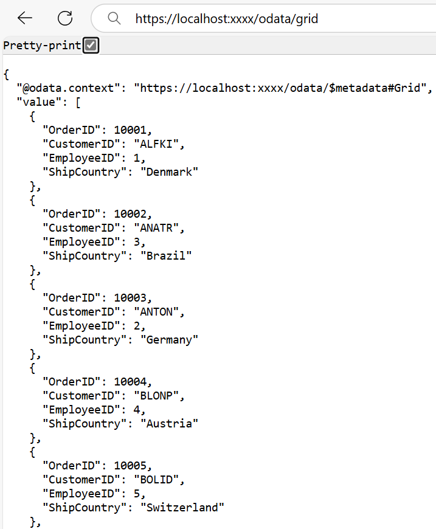

## Connecting Syncfusion<sup style="font-size:70%">&reg;</sup> Blazor DataGrid to an OData V4 Service

To integrate the Syncfusion<sup style="font-size:70%">&reg;</sup> Blazor DataGrid into your project using Visual Studio, follow the below steps:

**1. Install Syncfusion<sup style="font-size:70%">&reg;</sup> Blazor DataGrid and Themes NuGet packages**

To add the Blazor DataGrid to the app, open the NuGet Package Manager in Visual Studio (*Tools → NuGet Package Manager → Manage NuGet Packages for Solution*) for the `ODataV4Adaptor.Client` project, search and install [Syncfusion.Blazor.Grid](https://www.nuget.org/packages/Syncfusion.Blazor.Grid/) and [Syncfusion.Blazor.Themes](https://www.nuget.org/packages/Syncfusion.Blazor.Themes/).

Alternatively, use the following Package Manager commands:

```powershell
Install-Package Syncfusion.Blazor.Grid -Version {{ site.releaseversion }}
Install-Package Syncfusion.Blazor.Themes -Version {{ site.releaseversion }}
```

> Syncfusion<sup style="font-size:70%">&reg;</sup> Blazor components are available on [nuget.org](https://www.nuget.org/packages?q=syncfusion.blazor). Refer to the [NuGet packages](https://blazor.syncfusion.com/documentation/nuget-packages) topic for a complete list of available packages.

**2. Register Syncfusion<sup style="font-size:70%">&reg;</sup> Blazor service**

- Open the **~/_Imports.razor** file and import the required namespaces.

```cs
@using Syncfusion.Blazor
@using Syncfusion.Blazor.Grids
```

- Register the Syncfusion<sup style="font-size:70%">&reg;</sup> Blazor service in the **~/Program.cs** file of `ODataV4Adaptor.Client` project.

```csharp
using Syncfusion.Blazor;

builder.Services.AddSyncfusionBlazor();
```

**3. Add stylesheet and script resources**

Include the theme stylesheet and script references in the **~/Components/App.razor** file.

```html
<head>
    ....
    <link href="_content/Syncfusion.Blazor.Themes/bootstrap5.css" rel="stylesheet" />
</head>
....
<body>
    ....
    <script src="_content/Syncfusion.Blazor.Core/scripts/syncfusion-blazor.min.js" type="text/javascript"></script>
</body>
```

> * Refer to the [Blazor Themes](https://blazor.syncfusion.com/documentation/appearance/themes) topic for various methods to include themes (e.g., Static Web Assets, CDN, or CRG).
> * Set the render mode to **InteractiveServer** or **InteractiveAuto** in your Blazor Web App configuration.

**4. Add Blazor DataGrid and configure with server**

To connect the Blazor DataGrid to an OData V4 service, use the [Url](https://help.syncfusion.com/cr/blazor/Syncfusion.Blazor.DataManager.html#Syncfusion_Blazor_DataManager_Url) property of [SfDataManager](https://help.syncfusion.com/cr/blazor/Syncfusion.Blazor.DataManager.html) and set the [Adaptor](https://help.syncfusion.com/cr/blazor/Syncfusion.Blazor.DataManager.html#Syncfusion_Blazor_DataManager_Adaptor) property to `Adaptors.ODataV4Adaptor`. Update the **Index.razor** file as follows.

The `SfDataManager` offer multiple adaptor options to connect with remote databases based on an API service. Below is an example of the [ODataV4Adaptor](https://blazor.syncfusion.com/documentation/data/adaptors#odatav4-adaptor), which works with an OData V4 API that returns data in the expected `value` and `@odata.context` format.




@using Syncfusion.Blazor.Grids
@using Syncfusion.Blazor.Data
@using ODataV4Adaptor.Client.Models
 
<SfGrid TValue="OrderDetails" Height="348">
    <SfDataManager Url="https://localhost:xxxx/odata/grid" Adaptor="Adaptors.ODataV4Adaptor"></SfDataManager>
    <GridColumns>
        <GridColumn Field="OrderID" HeaderText="Order ID" Width="100" TextAlign="TextAlign.Right"></GridColumn>
        <GridColumn Field="CustomerID" HeaderText="Customer Name" Width="100"></GridColumn>
        <GridColumn Field="EmployeeID" HeaderText="Employee ID" TextAlign="TextAlign.Right" Width="100"></GridColumn>
        <GridColumn Field="ShipCountry" HeaderText="Ship Country" Width="120"></GridColumn>
    </GridColumns>
</SfGrid>
 

 

 
using Microsoft.AspNetCore.Mvc;
using Microsoft.AspNetCore.OData.Query;
using ODataV4Adaptor.Client.Models;

namespace ODataV4Adaptor.Controllers
{
    [ApiController]
    [Route("[controller]")]    
    public class GridController : ControllerBase
    {
        /// <summary>
        /// Retrieves all records available from the data source.
        /// </summary>
        /// <returns>
        /// Returns list of records.
        /// </returns>
        [HttpGet]
        [EnableQuery]
        public IActionResult Get()
        {
            var data = OrdersDetails.GetAllRecords().AsQueryable();
            return Ok(data);
        }
    }
}
 


 
> Replace https://localhost:xxxx/odata/grid with the actual URL of your API endpoint that provides the data in a consumable format (e.g., JSON).
 
**5. Run the application**
 
When you run the application, the Blazor DataGrid will display data fetched from the OData V4 service.

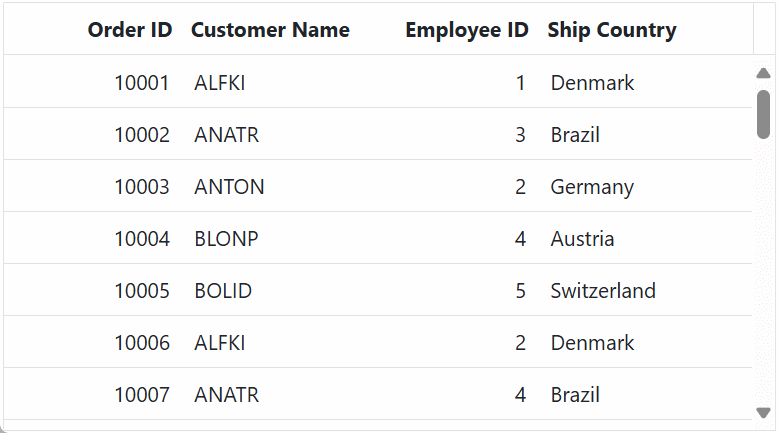

> Replace `https://localhost:xxxx/odata/` with the actual URL of your OData V4 service.

## Handling searching operation

By default, ODataV4 does not support global search, which is the ability to search across all fields simultaneously. To overcome this limitation, Syncfusion<sup style="font-size:70%">&reg;</sup> provides a search fallback mechanism that allows you to implement a global search experience using the `EnableODataSearchFallback` option.

To enable search operations in your web application using OData, you first need to configure OData support in your service collection. This involves adding the `Filter` method within the OData setup, allowing you to filter data based on specified criteria. Once enabled, clients can utilize the **$filter** query option in their requests to search for specific data entries.




// Create a new instance of the web application builder.
var builder = WebApplication.CreateBuilder(args);

// Create an ODataConventionModelBuilder to build the OData model.
var modelBuilder = new ODataConventionModelBuilder();

// Register the "Grid" entity set with the OData model builder.
modelBuilder.EntitySet<OrdersDetails>("Grid");

// Add services to the container.
// Add controllers with OData support to the service collection.
builder.Services.AddControllers().AddOData(
    options => options
    // Enables $count query option to retrieve total record count.
    .Count()
    // Enables $filter query option to allow searching based on field values.
    .Filter()
    .AddRouteComponents("odata", modelBuilder.GetEdmModel()
)
);




@using Syncfusion.Blazor.Grids
@using Syncfusion.Blazor.Data
@using ODataV4Adaptor.Client.Models
 
<SfGrid TValue="OrderDetails" Toolbar="@(new List<string>() { "Search" })" Height="348">
    <SfDataManager @ref="DataManager" Url="https://localhost:xxxx/odata/grid" Adaptor="Adaptors.ODataV4Adaptor"></SfDataManager>
    <GridColumns>
        <GridColumn Field="OrderID" HeaderText="Order ID" Width="100" TextAlign="TextAlign.Right"></GridColumn>
        <GridColumn Field="CustomerID" HeaderText="Customer Name" Width="100"></GridColumn>
        <GridColumn Field="EmployeeID" HeaderText="Employee ID" TextAlign="TextAlign.Right" Width="100"></GridColumn>
        <GridColumn Field="ShipCountry" HeaderText="Ship Country" Width="120"></GridColumn>
    </GridColumns>
</SfGrid>
@code {
    public SfDataManager? DataManager { get; set; }
    protected override void OnAfterRender(bool firstRender)
    {
        base.OnAfterRender(firstRender);
        if (DataManager?.DataAdaptor is ODataV4Adaptor odataAdaptor)
        {
            RemoteOptions options = odataAdaptor.Options;
            options.EnableODataSearchFallback = true;
            odataAdaptor.Options = options;
        }
    }
}




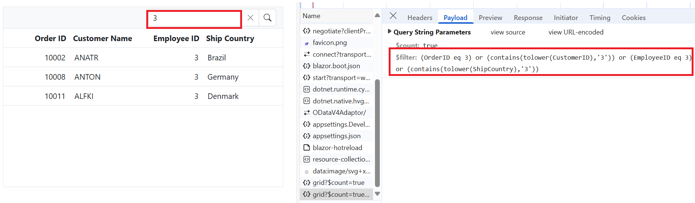

## Handling filtering operation

To enable filtering operations in your web application using OData, you first need to configure OData support in your service collection. This involves adding the `Filter` method within the OData setup, allowing you to filter data based on specified criteria. Once enabled, clients can utilize the **$filter** query option in their requests to retrieve specific data entries.




// Create a new instance of the web application builder.
var builder = WebApplication.CreateBuilder(args);

// Create an ODataConventionModelBuilder to build the OData model.
var modelBuilder = new ODataConventionModelBuilder();

// Register the "Grid" entity set with the OData model builder.
modelBuilder.EntitySet<OrdersDetails>("Grid");

// Add services to the container.
// Add controllers with OData support to the service collection.
builder.Services.AddControllers().AddOData(
    options => options
    // Enables $count query option to retrieve total record count.
    .Count() 
    // Enables $filter query option to allow filtering based on field values.
    .Filter() 
    .AddRouteComponents("odata", modelBuilder.GetEdmModel())
);




@using Syncfusion.Blazor.Grids
@using Syncfusion.Blazor.Data
@using ODataV4Adaptor.Client.Models
 
<SfGrid TValue="OrderDetails" AllowFiltering="true" Height="348">
    <SfDataManager Url="https://localhost:xxxx/odata/grid" Adaptor="Adaptors.ODataV4Adaptor"></SfDataManager>
    <GridColumns>
        <GridColumn Field="OrderID" HeaderText="Order ID" Width="100" TextAlign="TextAlign.Right"></GridColumn>
        <GridColumn Field="CustomerID" HeaderText="Customer Name" Width="100"></GridColumn>
        <GridColumn Field="EmployeeID" HeaderText="Employee ID" TextAlign="TextAlign.Right" Width="100"></GridColumn>
        <GridColumn Field="ShipCountry" HeaderText="Ship Country" Width="120"></GridColumn>
    </GridColumns>
</SfGrid>




**Single column filtering**
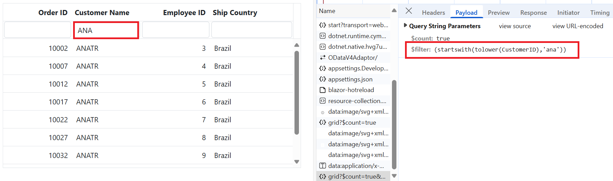

**Multi column filtering**
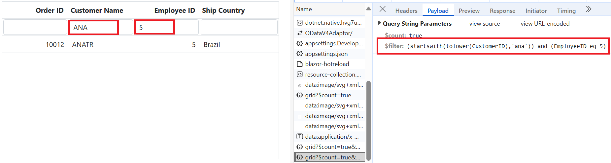

## Handling sorting operation

To enable sorting operations in your web application using OData, you first need to configure OData support in your service collection. This involves adding the `OrderBy` method within the OData setup, allowing you to sort data based on specified criteria. Once enabled, clients can utilize the **$orderby** query option in their requests to sort data entries according to the desired attributes.




// Create a new instance of the web application builder.
var builder = WebApplication.CreateBuilder(args);

// Create an ODataConventionModelBuilder to build the OData model.
var modelBuilder = new ODataConventionModelBuilder();

// Register the "Grid" entity set with the OData model builder.
modelBuilder.EntitySet<OrdersDetails>("Grid");

// Add services to the container.

// Add controllers with OData support to the service collection.
builder.Services.AddControllers().AddOData(
    options => options
    // Enables $count query option to retrieve total record count.
    .Count()
    // Enables $orderby query option to allow sorting based on field values. 
    .OrderBy()
    .AddRouteComponents("odata", modelBuilder.GetEdmModel())
);




@using Syncfusion.Blazor.Grids
@using Syncfusion.Blazor.Data
@using ODataV4Adaptor.Client.Models
 
<SfGrid TValue="OrderDetails" AllowSorting="true" Height="348">
    <SfDataManager Url="https://localhost:xxxx/odata/grid" Adaptor="Adaptors.ODataV4Adaptor"></SfDataManager>
    <GridColumns>
        <GridColumn Field="OrderID" HeaderText="Order ID" Width="100" TextAlign="TextAlign.Right"></GridColumn>
        <GridColumn Field="CustomerID" HeaderText="Customer Name" Width="100"></GridColumn>
        <GridColumn Field="EmployeeID" HeaderText="Employee ID" TextAlign="TextAlign.Right" Width="100"></GridColumn>
        <GridColumn Field="ShipCountry" HeaderText="Ship Country" Width="120"></GridColumn>
    </GridColumns>
</SfGrid>




**Single column sorting**
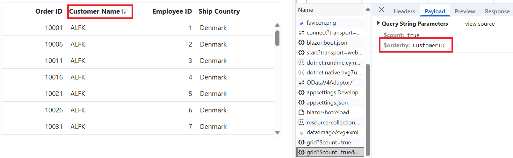

**Multi column sorting**
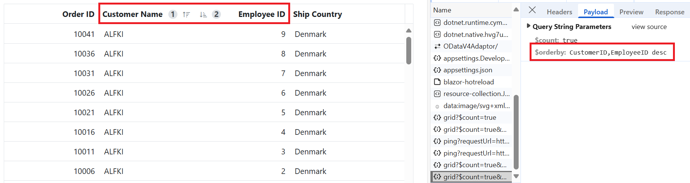

## Handling paging operation

To implement paging operations in your web application using OData, you can utilize the `SetMaxTop` method within your OData setup to limit the maximum number of records that can be returned per request. While you configure the maximum limit, clients can utilize the **$skip** and **$top** query options in their requests to specify the number of records to skip and the number of records to take, respectively.




// Create a new instance of the web application builder.
var builder = WebApplication.CreateBuilder(args);

// Create an ODataConventionModelBuilder to build the OData model.
var modelBuilder = new ODataConventionModelBuilder();

// Register the "Grid" entity set with the OData model builder.
modelBuilder.EntitySet<OrdersDetails>("Grid");

var recordCount= OrdersDetails.GetAllRecords().Count;

// Add services to the container.

// Add controllers with OData support to the service collection.
builder.Services.AddControllers().AddOData(
    options => options
    // Enables $count query option to retrieve total record count.
    .Count()
    // Limits the maximum number of records returned using $top.
    .SetMaxTop(recordCount)
    .AddRouteComponents(
        "odata",
        modelBuilder.GetEdmModel()
    )
);




@using Syncfusion.Blazor.Grids
@using Syncfusion.Blazor.Data
@using ODataV4Adaptor.Client.Models
 
<SfGrid TValue="OrderDetails" AllowPaging="true" Height="348">
    <SfDataManager Url="https://localhost:xxxx/odata/grid" Adaptor="Adaptors.ODataV4Adaptor"></SfDataManager>
    <GridColumns>
        <GridColumn Field="OrderID" HeaderText="Order ID" Width="100" TextAlign="TextAlign.Right"></GridColumn>
        <GridColumn Field="CustomerID" HeaderText="Customer Name" Width="100"></GridColumn>
        <GridColumn Field="EmployeeID" HeaderText="Employee ID" TextAlign="TextAlign.Right" Width="100"></GridColumn>
        <GridColumn Field="ShipCountry" HeaderText="Ship Country" Width="120"></GridColumn>
    </GridColumns>
</SfGrid>




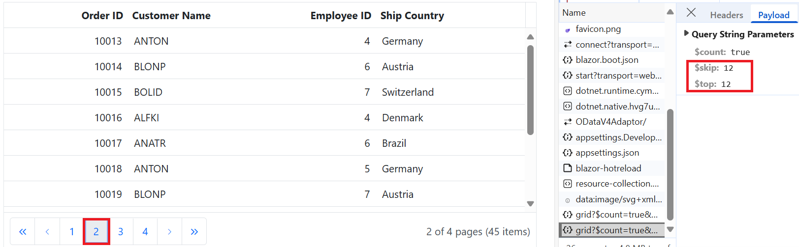

## Handling CRUD operations

To manage CRUD (Create, Read, Update, and Delete) operations using the ODataV4Adaptor, follow the provided guide for configuring the Syncfusion<sup style="font-size:70%">&reg;</sup> DataGrid for [editing](https://blazor.syncfusion.com/documentation/datagrid/editing) and utilize the sample implementation of the `GridController` in your server application. This controller handles HTTP requests for CRUD operations, including GET, POST, PATCH, and DELETE.

To enable CRUD operations in the Grid within your application, follow these steps. In the example below, the inline edit [Mode](https://help.syncfusion.com/cr/blazor/Syncfusion.Blazor.Grids.GridEditSettings.html#Syncfusion_Blazor_Grids_GridEditSettings_Mode) is enabled, and the [Toolbar](https://help.syncfusion.com/cr/blazor/Syncfusion.Blazor.Grids.SfGrid-1.html#Syncfusion_Blazor_Grids_SfGrid_1_Toolbar) property is configured to display toolbar items for editing.




@using Syncfusion.Blazor.Grids
@using Syncfusion.Blazor.Data
@using ODataV4Adaptor.Client.Models

<SfGrid TValue="OrdersDetails" Toolbar="@(new List<string>() { "Add", "Edit", "Delete", "Update", "Cancel" })" Height="348">
    <SfDataManager Url="https://localhost:xxxx/odata/grid" Adaptor="Adaptors.ODataV4Adaptor"></SfDataManager>
    <GridEditSettings AllowEditing="true" AllowDeleting="true" AllowAdding="true" Mode="EditMode.Normal"></GridEditSettings>
    <GridColumns>
        <GridColumn Field="OrderID" HeaderText="Order ID" IsPrimaryKey="true" Width="100" TextAlign="TextAlign.Right"></GridColumn>
        <GridColumn Field="CustomerID" HeaderText="Customer Name" Width="100"></GridColumn>
        <GridColumn Field="ShipCity" HeaderText="Ship City" Width="100"></GridColumn>
        <GridColumn Field="ShipCountry" HeaderText="Ship Country" Width="120"></GridColumn>
    </GridColumns>
</SfGrid>




> Normal/Inline editing is the default edit [Mode](https://help.syncfusion.com/cr/blazor/Syncfusion.Blazor.Grids.GridEditSettings.html#Syncfusion_Blazor_Grids_GridEditSettings_Mode) for the Grid. To enable CRUD operations, ensure that the [IsPrimaryKey](https://help.syncfusion.com/cr/blazor/Syncfusion.Blazor.Grids.GridColumn.html#Syncfusion_Blazor_Grids_GridColumn_IsPrimaryKey) property is set to **true** for a specific Grid column, ensuring that its value is unique.

**Insert Record:**

To insert a new record into your Syncfusion<sup style="font-size:70%">&reg;</sup> DataGrid, you can utilize the `HttpPost` method in your server application. Below is a sample implementation of inserting a record using the **GridController**:




/// <summary>
/// Inserts a new order into the data collection.
/// </summary>
/// <param name="addRecord">The order record to be inserted.</param>
/// <returns>Returns the inserted record if successful; otherwise, a bad request response.</returns>
[HttpPost]
[EnableQuery]
public IActionResult Post([FromBody] OrdersDetails addRecord)
{
    // Validate the input and return a 400 Bad Request if the record is null.
    if (addRecord == null)
    {
      return BadRequest("Null order");
    }

    // Insert the new order record at the beginning of the data collection.
    OrdersDetails.GetAllRecords().Insert(0, addRecord);

    // Return the inserted record as a JSON result.
    return new JsonResult(addRecord);
}




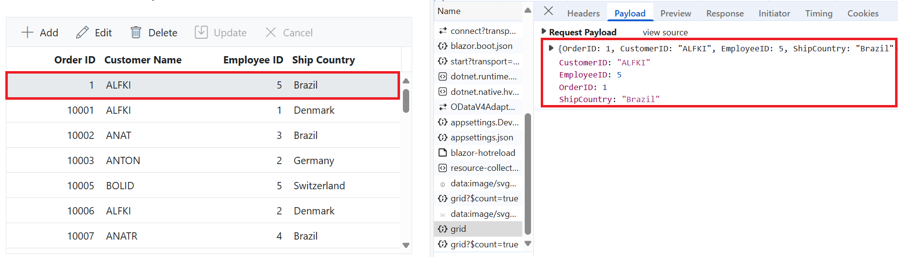

**Update Record:**

Updating a record in the Syncfusion<sup style="font-size:70%">&reg;</sup> DataGrid can be achieved by utilizing the `HttpPatch` method in your controller. Here's a sample implementation of updating a record:




/// <summary>
/// Updates an existing order with the specified key.
/// </summary>
/// <param name="key">The unique identifier of the order to be updated.</param>
/// <param name="updateRecord">The object containing updated order values.</param>
/// <returns>It returns the updated order details.</returns>
[HttpPatch("{key}")]
public IActionResult Patch(int key, [FromBody] OrdersDetails updateRecord)
{
    // Validate the input data. Return a 400 Bad Request if the update record is null.
    if (updateRecord == null)
    {
        return BadRequest("No records");
    }

    // Retrieve the existing order by its key.
    var existingOrder = OrdersDetails.GetAllRecords().FirstOrDefault(order => order.OrderID == key);

    // If the order is found, perform partial update only on non-null fields.
    if (existingOrder != null)
    {
        // Perform the partial update by only replacing fields that are not null in the updateRecord.
        existingOrder.CustomerID = updateRecord.CustomerID ?? existingOrder.CustomerID;
        existingOrder.EmployeeID = updateRecord.EmployeeID ?? existingOrder.EmployeeID;
        existingOrder.ShipCountry = updateRecord.ShipCountry ?? existingOrder.ShipCountry;
    }

    // Return the updated order in JSON format.
    return new JsonResult(updateRecord);
}




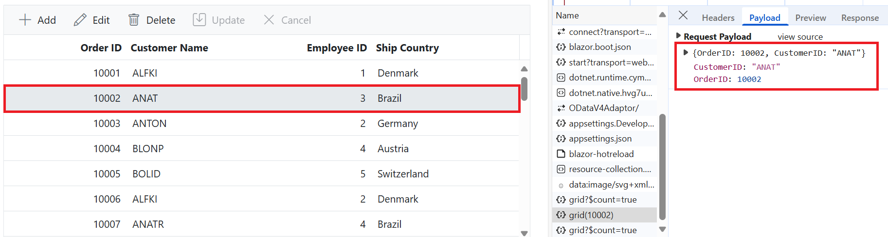

**Delete Record:**

To delete a record from your Syncfusion<sup style="font-size:70%">&reg;</sup> DataGrid, you can utilize the `HttpDelete` method in your controller. Below is a sample implementation:




/// <summary>
/// Deletes an existing order based on the provided key.
/// </summary>
/// <param name="key">The unique identifier of the order to be deleted.</param>
/// <returns>Returns the details of the deleted record.</returns>
[HttpDelete("{key}")]
public IActionResult Delete(int key)
{
    // Retrieve the order to be deleted by its unique identifier.
    var deleteRecord = OrdersDetails.GetAllRecords().FirstOrDefault(order => order.OrderID == key);

    // Validate the input data. Return a 400 Bad Request if the record is not found.
    if (deleteRecord != null)
    {
        // Remove the order from the data source.
        OrdersDetails.GetAllRecords().Remove(deleteRecord);
    }

    // Return the deleted order in JSON format.
    return new JsonResult(deleteRecord);
}




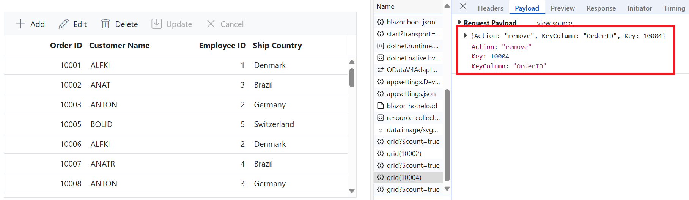

Please find the sample in this [GitHub location](https://github.com/SyncfusionExamples/Binding-data-from-remote-service-to-blazor-data-grid/tree/master/ODataV4Adaptor).