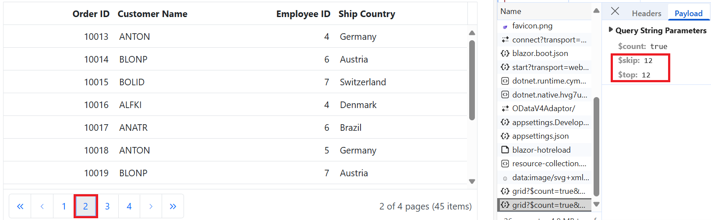
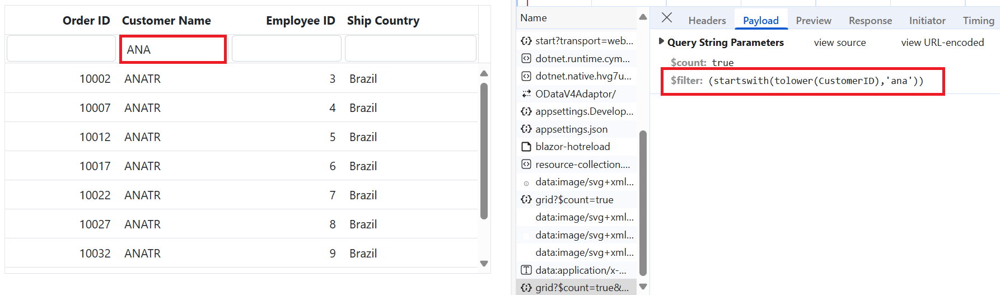
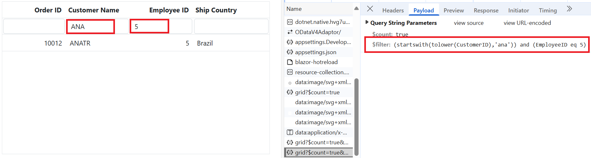
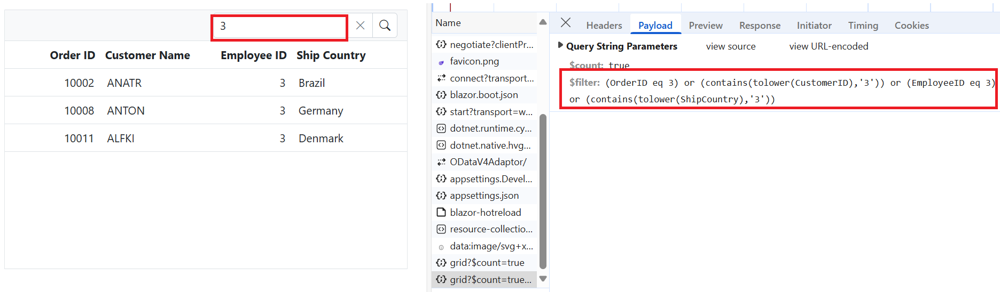
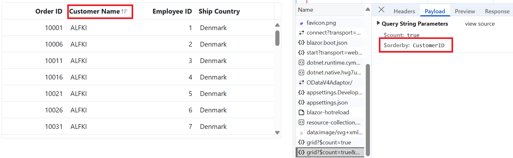
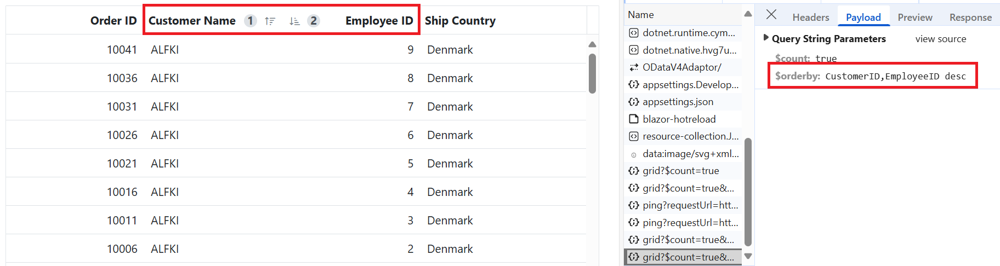
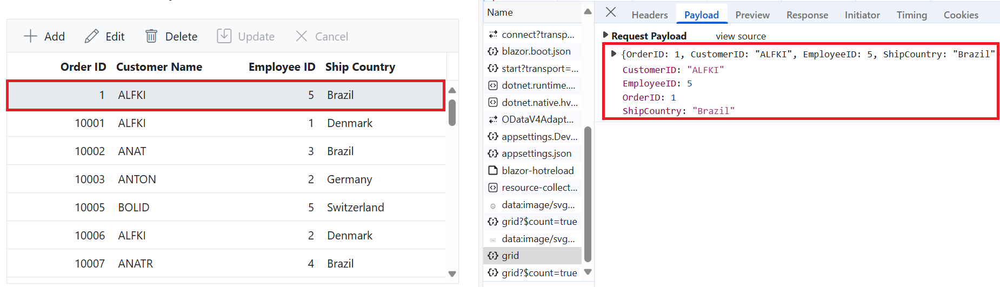
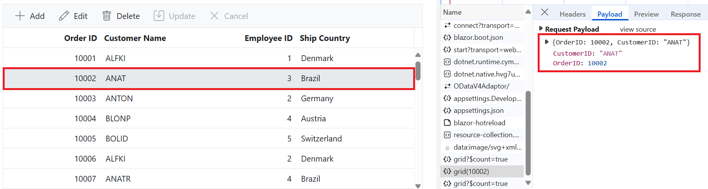
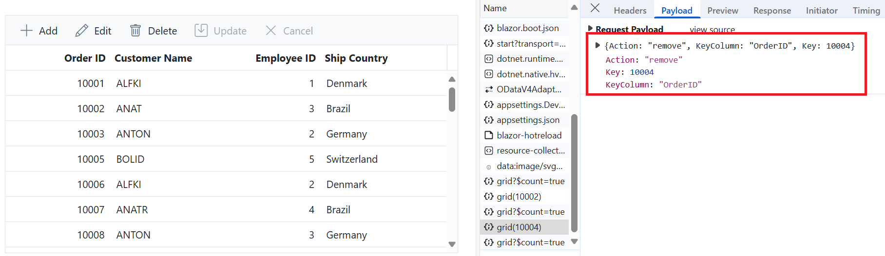

# OData Remote Data Binding in Syncfusion Blazor Components

The [ODataV4Adaptor](https://ej2.syncfusion.com/react/documentation/data/adaptors/odatav4-adaptor) in the Syncfusion<sup style="font-size:70%">&reg;</sup> Blazor DataManager enables seamless integration between the Blazor DataGrid and OData V4 services by handling OData‑formatted request and response processing. It automatically converts DataGrid actions such as filtering, sorting, paging, grouping, and CRUD into OData V4 compliant query options (like `$filter`, `$orderby`, `$top`, `$skip`) and sends them to the server. The adaptor also parses the structured OData V4 JSON response, extracting the result set and count values, ensuring smooth remote data binding without custom query or response logic.

For complete server‑side configuration and additional implementation details, refer to the [DataManager ODataV4Adaptor documentation](https://blazor.syncfusion.com/documentation/data/adaptors), which covers endpoint setup, query processing, and best practices for integrating OData V4 services.

Once the project creation and backend setup are complete, the next step is to integrate the Syncfusion<sup style="font-size:70%">&reg;</sup> Blazor DataGrid with the `ODataV4Adaptor`.

## Integrating Syncfusion<sup style="font-size:70%">&reg;</sup> Blazor DataGrid to an OData V4 Service

To integrate the Syncfusion<sup style="font-size:70%">&reg;</sup> Blazor DataGrid into your project using Visual Studio, follow the below steps:

### Step 1: Install Syncfusion<sup style="font-size:70%">&reg;</sup> Blazor DataGrid and Themes NuGet packages**

**Method 1: Using NuGet Package Manager UI**

To add the Blazor DataGrid to the app, open the NuGet Package Manager in Visual Studio (*Tools → NuGet Package Manager → Manage NuGet Packages for Solution*) for the `ODataV4Adaptor.Client` project, search and install 
 - **[Syncfusion.Blazor.Grid](https://www.nuget.org/packages/Syncfusion.Blazor.Grid/)** (version {{site.blazorversion}})
 - **[Syncfusion.Blazor.Themes](https://www.nuget.org/packages/Syncfusion.Blazor.Themes/)** (version {{site.blazorversion}}).

**Method 2: Using Package Manager Console**

Alternatively, use the following Package Manager commands:

```powershell
Install-Package Syncfusion.Blazor.Grid -Version {{ site.blazorversion}}
Install-Package Syncfusion.Blazor.Themes -Version {{ site.blazorversion}}
```

All required packages are now installed.
 
If your Blazor Web App uses `WebAssembly` or `Auto` render modes, install the Syncfusion<sup style="font-size:70%">&reg;</sup> Blazor NuGet packages in the client project.

> Syncfusion<sup style="font-size:70%">&reg;</sup> Blazor components are available on [nuget.org](https://www.nuget.org/packages?q=syncfusion.blazor). Refer to the [NuGet packages](https://blazor.syncfusion.com/documentation/nuget-packages) topic for a complete list of available packages.

**2. Register Syncfusion<sup style="font-size:70%">&reg;</sup> Blazor service**

- Open the **~/_Imports.razor** file and import the required namespaces.

```cs
@using Syncfusion.Blazor
@using Syncfusion.Blazor.Grids
```

- Register the Syncfusion<sup style="font-size:70%">&reg;</sup> Blazor service in the **~/Program.cs** file of `ODataV4Adaptor.Client` project.

```csharp
using Syncfusion.Blazor;

builder.Services.AddSyncfusionBlazor();
```

**3. Add stylesheet and script resources**

Add the Syncfusion stylesheet and scripts in the **~/Components/App.razor**. Find the `<head>` section and add:

```html
<!-- Syncfusion Blazor Stylesheet -->
<link href="_content/Syncfusion.Blazor.Themes/bootstrap5.css" rel="stylesheet" />

<!-- Syncfusion Blazor Scripts -->
<script src="_content/Syncfusion.Blazor.Core/scripts/syncfusion-blazor.min.js" type="text/javascript"></script>
```

For this project, the **bootstrap5** theme is used. A different theme can be selected or customized based on project requirements. Refer to the [Syncfusion Blazor Components Appearance](https://blazor.syncfusion.com/documentation/appearance/themes) documentation to learn more about theming and customization options.

Syncfusion components are now configured and ready to use. For additional guidance, refer to the Grid component's [getting‑started](https://blazor.syncfusion.com/documentation/datagrid/getting-started-with-web-app) documentation.

### Step 2: Update the Blazor DataGrid with ODataV4Adaptor. 

DSyncfusion<sup style="font-size:70%">&reg;</sup> Blazor DataGrid integration with OData‑based backend services is enabled through the `ODataV4Adaptor`, which connects the Syncfusion `SfDataManager` to OData V4 REST endpoints. It automatically converts DataGrid actions such as paging, sorting, filtering, searching, and grouping into OData‑compliant query parameters that the server can process. This makes it ideal for applications built on OData V4, offering seamless server‑side data operations without the need for custom request or response handling.

To connect the Blazor DataGrid to an OData V4 service, use the [Url](https://help.syncfusion.com/cr/blazor/Syncfusion.Blazor.DataManager.html#Syncfusion_Blazor_DataManager_Url) property of [SfDataManager](https://help.syncfusion.com/cr/blazor/Syncfusion.Blazor.DataManager.html) and set the [Adaptor](https://help.syncfusion.com/cr/blazor/Syncfusion.Blazor.DataManager.html#Syncfusion_Blazor_DataManager_Adaptor) property to `Adaptors.ODataV4Adaptor`. Update the **Index.razor** file as follows.

The `SfDataManager` offer multiple adaptor options to connect with remote databases based on an API service. Below is an example of the [ODataV4Adaptor](https://blazor.syncfusion.com/documentation/data/adaptors#odatav4-adaptor), which works with an OData V4 API that returns data in the expected `value` and `@odata.context` format.

```cshtml

@page "/"

@using Syncfusion.Blazor.Grids
@using Syncfusion.Blazor.Data
@using ODataV4Adaptor.Client.Models
 
<SfGrid TValue="OrderDetails" Height="348">
    <SfDataManager Url="https://localhost:xxxx/odata/Grid" Adaptor="Adaptors.ODataV4Adaptor"></SfDataManager>
    <GridColumns>
        <GridColumn Field="OrderID" HeaderText="Order ID" Width="100" TextAlign="TextAlign.Right"></GridColumn>
        <GridColumn Field="CustomerID" HeaderText="Customer Name" Width="100"></GridColumn>
        <GridColumn Field="EmployeeID" HeaderText="Employee ID" TextAlign="TextAlign.Right" Width="100"></GridColumn>
        <GridColumn Field="ShipCountry" HeaderText="Ship Country" Width="120"></GridColumn>
    </GridColumns>
</SfGrid>


 ```
 
### Step 3: Implement the Endpoints for WebAPIAdaptor

DataGrid integration with OData‑based backend services is enabled through the `ODataV4Adaptor`, which connects the Syncfusion `SfDataManager` to OData V4 REST endpoints. It automatically converts DataGrid actions such as paging, sorting, filtering and searching into OData‑compliant query parameters that the server can process. This makes it ideal for applications built on OData V4, offering seamless server‑side data operations without the need for custom request or response handling.

By delegating these operations to the server rather than executing them in the browser, the DataGrid ensures that only the required data is retrieved for each request. 

Open the file named **Controllers/GridController.cs** and use the following structure:

```csharp
 
using Microsoft.AspNetCore.Mvc;
using Microsoft.AspNetCore.OData.Query;
using ODataV4Adaptor.Client.Models;

namespace ODataV4Adaptor.Controllers
{
    [ApiController]
    [Route("[controller]")]    
    public class GridController : ControllerBase
    {
        /// <summary>
        /// Retrieves all records available from the data source.
        /// </summary>
        /// <returns>
        /// Returns list of records.
        /// </returns>
        [HttpGet]
        [EnableQuery]
        public IActionResult Get()
        {
            var data = OrdersDetails.GetAllRecords().AsQueryable();
            return Ok(data);
        }
    }
}
 
```
 
> The DataGrid sends GET requests with OData V4 query options such as `$filter`, `$orderby`, `$top`, and `$skip`, and the server is expected to return an OData‑compliant JSON response containing the total record count (`@odata.count`) and the data collection (`value`) for proper data binding and paging.

### Step 4: Running the Application

**Build the Application**

1. Open PowerShell or your terminal.
2. Navigate to the project directory.
3. Build the application:

```powershell
dotnet build
```

**Run the Application**

Execute the following command:

```powershell
dotnet run
```

The application will start, and the console will display the local URL (typically `http://localhost:5175` or `https://localhost:5001`).

**Access the Application**

1. Open a web browser.
2. Navigate to the URL displayed in the console.
3. The DataGrid application is now running and ready to use.

## Server-side data operations

The Syncfusion<sup style="font-size:70%">&reg;</sup> Blazor DataGrid optimizes large datasets by relying on server‑side data operations such as filtering, sorting, and paging rather than processing everything in the browser. The `Syncfusion.EJ2.AspNet.Core` package supports this approach by providing built‑in methods that efficiently handle these operations on the server, ensuring smooth performance even with heavy data loads.

DataGrid optimizes large datasets by relying on server‑side data operations such as filtering, sorting, and paging rather than processing everything in the browser. The `Syncfusion.EJ2.AspNet.Core` package supports this approach by providing built‑in methods that efficiently handle these operations on the server, ensuring smooth performance even with heavy data loads.

### Handling Paging operation

* Ensure the DataGrid has paging enabled with `AllowPaging="true"`.
* To implement paging operations in your web application using OData, you can utilize the `SetMaxTop` method within your OData setup to limit the maximum number of records that can be returned per request. While you configure the maximum limit, clients can utilize the **$skip** and **$top** query options in their requests to specify the number of records to skip and the number of records to take, respectively.

Utilize `SetMaxTop()` method in **Program.cs** to establish maximum records per request limit. 




// Create a new instance of the web application builder.
var builder = WebApplication.CreateBuilder(args);

// Create an ODataConventionModelBuilder to build the OData model.
var modelBuilder = new ODataConventionModelBuilder();

// Register the "Grid" entity set with the OData model builder.
modelBuilder.EntitySet<OrdersDetails>("Grid");

var recordCount= OrdersDetails.GetAllRecords().Count;

// Add services to the container.

// Add controllers with OData support to the service collection.
builder.Services.AddControllers().AddOData(
    options => options
    // Enables $count query option to retrieve total record count.
    .Count()
    // Limits the maximum number of records returned using $top.
    .SetMaxTop(recordCount)
    .AddRouteComponents(
        "odata",
        modelBuilder.GetEdmModel()
    )
);




@using Syncfusion.Blazor.Grids
@using Syncfusion.Blazor.Data
@using ODataV4Adaptor.Client.Models
 
<SfGrid TValue="OrderDetails" AllowPaging="true" Height="348">
    <SfDataManager Url="https://localhost:xxxx/odata/Grid" Adaptor="Adaptors.ODataV4Adaptor"></SfDataManager>
    <GridColumns>
        <GridColumn Field="OrderID" HeaderText="Order ID" Width="100" TextAlign="TextAlign.Right"></GridColumn>
        <GridColumn Field="CustomerID" HeaderText="Customer Name" Width="100"></GridColumn>
        <GridColumn Field="EmployeeID" HeaderText="Employee ID" TextAlign="TextAlign.Right" Width="100"></GridColumn>
        <GridColumn Field="ShipCountry" HeaderText="Ship Country" Width="120"></GridColumn>
    </GridColumns>
</SfGrid>






### Handling Filtering operation

* Add the [AllowFiltering](https://help.syncfusion.com/cr/blazor/Syncfusion.Blazor.Grids.SfGrid-1.html#Syncfusion_Blazor_Grids_SfGrid_1_AllowFiltering) property to the `<SfGrid>`.
* To enable filtering operations in your web application using OData, you first need to configure OData support in your service collection. This involves adding the `Filter` method within the OData setup, allowing you to filter data based on specified criteria. Once enabled, clients can utilize the **$filter** query option in their requests to retrieve specific data entries.

Verify **Program.cs** includes `.Filter()` method in OData configuration.




// Create a new instance of the web application builder.
var builder = WebApplication.CreateBuilder(args);

// Create an ODataConventionModelBuilder to build the OData model.
var modelBuilder = new ODataConventionModelBuilder();

// Register the "Grid" entity set with the OData model builder.
modelBuilder.EntitySet<OrdersDetails>("Grid");

// Add services to the container.
// Add controllers with OData support to the service collection.
builder.Services.AddControllers().AddOData(
    options => options
    // Enables $count query option to retrieve total record count.
    .Count() 
    // Enables $filter query option to allow filtering based on field values.
    .Filter() 
    .AddRouteComponents("odata", modelBuilder.GetEdmModel())
);




@using Syncfusion.Blazor.Grids
@using Syncfusion.Blazor.Data
@using ODataV4Adaptor.Client.Models
 
<SfGrid TValue="OrderDetails" AllowFiltering="true" Height="348">
    <SfDataManager Url="https://localhost:xxxx/odata/Grid" Adaptor="Adaptors.ODataV4Adaptor"></SfDataManager>
    <GridColumns>
        <GridColumn Field="OrderID" HeaderText="Order ID" Width="100" TextAlign="TextAlign.Right"></GridColumn>
        <GridColumn Field="CustomerID" HeaderText="Customer Name" Width="100"></GridColumn>
        <GridColumn Field="EmployeeID" HeaderText="Employee ID" TextAlign="TextAlign.Right" Width="100"></GridColumn>
        <GridColumn Field="ShipCountry" HeaderText="Ship Country" Width="120"></GridColumn>
    </GridColumns>
</SfGrid>




**Single column filtering**


**Multi column filtering**


### Handling Searching operation

* Ensure the toolbar includes the "Search" item.
* By default, ODataV4 does not support global search, which is the ability to search across all fields simultaneously. To overcome this limitation, Syncfusion<sup style="font-size:70%">&reg;</sup> provides a search fallback mechanism that allows you to implement a global search experience using the `EnableODataSearchFallback` option.

To enable search operations in your web application using OData, you first need to configure OData support in your service collection. This involves adding the `Filter` method within the OData setup, allowing you to filter data based on specified criteria. Once enabled, clients can utilize the **$filter** query option in their requests to search for specific data entries.

Search functionality requires `Filter()` method support (previously configured in **Program.cs** during OData setup).




// Create a new instance of the web application builder.
var builder = WebApplication.CreateBuilder(args);

// Create an ODataConventionModelBuilder to build the OData model.
var modelBuilder = new ODataConventionModelBuilder();

// Register the "Grid" entity set with the OData model builder.
modelBuilder.EntitySet<OrdersDetails>("Grid");

// Add services to the container.
// Add controllers with OData support to the service collection.
builder.Services.AddControllers().AddOData(
    options => options
    // Enables $count query option to retrieve total record count.
    .Count()
    // Enables $filter query option to allow searching based on field values.
    .Filter()
    .AddRouteComponents("odata", modelBuilder.GetEdmModel()
)
);




@using Syncfusion.Blazor.Grids
@using Syncfusion.Blazor.Data
@using ODataV4Adaptor.Client.Models
 
<SfGrid TValue="OrderDetails" Toolbar="@(new List<string>() { "Search" })" Height="348">
    <SfDataManager @ref="DataManager" Url="https://localhost:xxxx/odata/Grid" Adaptor="Adaptors.ODataV4Adaptor"></SfDataManager>
    <GridColumns>
        <GridColumn Field="OrderID" HeaderText="Order ID" Width="100" TextAlign="TextAlign.Right"></GridColumn>
        <GridColumn Field="CustomerID" HeaderText="Customer Name" Width="100"></GridColumn>
        <GridColumn Field="EmployeeID" HeaderText="Employee ID" TextAlign="TextAlign.Right" Width="100"></GridColumn>
        <GridColumn Field="ShipCountry" HeaderText="Ship Country" Width="120"></GridColumn>
    </GridColumns>
</SfGrid>
@code {
    public SfDataManager? DataManager { get; set; }
    protected override void OnAfterRender(bool firstRender)
    {
        base.OnAfterRender(firstRender);
        if (DataManager?.DataAdaptor is ODataV4Adaptor odataAdaptor)
        {
            RemoteOptions options = odataAdaptor.Options;
            options.EnableODataSearchFallback = true;
            odataAdaptor.Options = options;
        }
    }
}






### Handling Sorting operation

* Add the [AllowSorting](https://help.syncfusion.com/cr/blazor/Syncfusion.Blazor.Grids.SfGrid-1.html#Syncfusion_Blazor_Grids_SfGrid_1_AllowSorting) property to the `<SfGrid>`.
* To enable sorting operations in your web application using OData, you first need to configure OData support in your service collection. This involves adding the `OrderBy` method within the OData setup, allowing you to sort data based on specified criteria. Once enabled, clients can utilize the **$orderby** query option in their requests to sort data entries according to the desired attributes.




// Create a new instance of the web application builder.
var builder = WebApplication.CreateBuilder(args);

// Create an ODataConventionModelBuilder to build the OData model.
var modelBuilder = new ODataConventionModelBuilder();

// Register the "Grid" entity set with the OData model builder.
modelBuilder.EntitySet<OrdersDetails>("Grid");

// Add services to the container.

// Add controllers with OData support to the service collection.
builder.Services.AddControllers().AddOData(
    options => options
    // Enables $count query option to retrieve total record count.
    .Count()
    // Enables $orderby query option to allow sorting based on field values. 
    .OrderBy()
    .AddRouteComponents("odata", modelBuilder.GetEdmModel())
);




@using Syncfusion.Blazor.Grids
@using Syncfusion.Blazor.Data
@using ODataV4Adaptor.Client.Models
 
<SfGrid TValue="OrderDetails" AllowSorting="true" Height="348">
    <SfDataManager Url="https://localhost:xxxx/odata/grid" Adaptor="Adaptors.ODataV4Adaptor"></SfDataManager>
    <GridColumns>
        <GridColumn Field="OrderID" HeaderText="Order ID" Width="100" TextAlign="TextAlign.Right"></GridColumn>
        <GridColumn Field="CustomerID" HeaderText="Customer Name" Width="100"></GridColumn>
        <GridColumn Field="EmployeeID" HeaderText="Employee ID" TextAlign="TextAlign.Right" Width="100"></GridColumn>
        <GridColumn Field="ShipCountry" HeaderText="Ship Country" Width="120"></GridColumn>
    </GridColumns>
</SfGrid>




**Single column sorting**

Click "Customer ID" column header to sort by "CustomerID" field.



**Multi column sorting**

Hold the <kbd>Ctrl</kbd> key and click "Employee ID" followed by "Customer ID" to establish hierarchical sort (primary sort by "Customer ID", secondary sort by "Employee ID" within each "Customer ID" group).



**Sort indicator legend:**
- ↑ (Up arrow): Indicates ascending sort direction
- ↓ (Down arrow): Indicates descending sort direction
- Numeric indicator (1, 2, 3): Displays sort priority in multi-column sorting scenarios.

The DataGrid has now been successfully created with including paging, sorting, filtering. the next step is to enabling CRUD operations.

## Handling CRUD operations

To manage CRUD (Create, Read, Update, and Delete) operations using the ODataV4Adaptor, follow the provided guide for configuring the Syncfusion<sup style="font-size:70%">&reg;</sup> DataGrid for [Editing](https://blazor.syncfusion.com/documentation/datagrid/editing) and utilize the sample implementation of the `GridController` in your server application. 

To enable CRUD operations in the DataGrid within your application, follow these steps. In the example below, the inline edit [Mode](https://help.syncfusion.com/cr/blazor/Syncfusion.Blazor.Grids.GridEditSettings.html#Syncfusion_Blazor_Grids_GridEditSettings_Mode) is enabled, and the [Toolbar](https://help.syncfusion.com/cr/blazor/Syncfusion.Blazor.Grids.SfGrid-1.html#Syncfusion_Blazor_Grids_SfGrid_1_Toolbar) property is configured to display toolbar items for editing.

**CRUD works with OData:**

This controller handles HTTP requests for CRUD operations, including GET, POST, PATCH, and DELETE.

| Operation | HTTP Method | URL Example | Description |
|-----------|-------------|-------------|-------------|
| **Read** | GET | `/odata/Grid` | Get all records. |
| **Create** | POST | `/odata/Grid` | Add a new record. |
| **Update** | PATCH | `/odata/Grid(10001)` | Update record with key "10001". |
| **Delete** | DELETE | `/odata/Grid(10001)` | Delete record with key "10001". |

To enable CRUD operations using the `ODataV4Adaptor` in the DataGrid, follow the steps below:




@using Syncfusion.Blazor.Grids
@using Syncfusion.Blazor.Data
@using ODataV4Adaptor.Client.Models

<SfGrid TValue="OrdersDetails" Toolbar="@(new List<string>() { "Add", "Edit", "Delete", "Update", "Cancel" })" Height="348">
    <SfDataManager Url="https://localhost:xxxx/odata/Grid" Adaptor="Adaptors.ODataV4Adaptor"></SfDataManager>
    <GridEditSettings AllowEditing="true" AllowDeleting="true" AllowAdding="true" Mode="EditMode.Normal"></GridEditSettings>
    <GridColumns>
        <GridColumn Field="OrderID" HeaderText="Order ID" IsPrimaryKey="true" Width="100" TextAlign="TextAlign.Right"></GridColumn>
        <GridColumn Field="CustomerID" HeaderText="Customer Name" Width="100"></GridColumn>
        <GridColumn Field="ShipCity" HeaderText="Ship City" Width="100"></GridColumn>
        <GridColumn Field="ShipCountry" HeaderText="Ship Country" Width="120"></GridColumn>
    </GridColumns>
</SfGrid>




> Normal/Inline editing is the default edit [Mode](https://help.syncfusion.com/cr/blazor/Syncfusion.Blazor.Grids.GridEditSettings.html#Syncfusion_Blazor_Grids_GridEditSettings_Mode) for the DataGrid. To enable CRUD operations, ensure that the [IsPrimaryKey](https://help.syncfusion.com/cr/blazor/Syncfusion.Blazor.Grids.GridColumn.html#Syncfusion_Blazor_Grids_GridColumn_IsPrimaryKey) property is set to **true** for a specific DataGrid column, ensuring that its value is unique.

**Insert Record:**

To insert a new record into your Syncfusion<sup style="font-size:70%">&reg;</sup> DataGrid, you can utilize the `HttpPost` method in your server application. Below is a sample implementation of inserting a record using the **GridController**:




/// <summary>
/// Inserts a new order into the data collection.
/// </summary>
/// <param name="addRecord">The order record to be inserted.</param>
/// <returns>Returns the inserted record if successful; otherwise, a bad request response.</returns>
[HttpPost]
[EnableQuery]
public IActionResult Post([FromBody] OrdersDetails addRecord)
{
    // Validate the input and return a 400 Bad Request if the record is null.
    if (addRecord == null)
    {
      return BadRequest("Null order");
    }

    // Insert the new order record at the beginning of the data collection.
    OrdersDetails.GetAllRecords().Insert(0, addRecord);

    // Return the inserted record as a JSON result.
    return new JsonResult(addRecord);
}






**Update Record:**

Updating a record in the Syncfusion<sup style="font-size:70%">&reg;</sup> DataGrid can be achieved by utilizing the `HttpPatch` method in your controller. Here's a sample implementation of updating a record:




/// <summary>
/// Updates an existing order with the specified key.
/// </summary>
/// <param name="key">The unique identifier of the order to be updated.</param>
/// <param name="updateRecord">The object containing updated order values.</param>
/// <returns>It returns the updated order details.</returns>
[HttpPatch("{key}")]
public IActionResult Patch(int key, [FromBody] OrdersDetails updateRecord)
{
    // Validate the input data. Return a 400 Bad Request if the update record is null.
    if (updateRecord == null)
    {
        return BadRequest("No records");
    }

    // Retrieve the existing order by its key.
    var existingOrder = OrdersDetails.GetAllRecords().FirstOrDefault(order => order.OrderID == key);

    // If the order is found, perform partial update only on non-null fields.
    if (existingOrder != null)
    {
        // Perform the partial update by only replacing fields that are not null in the updateRecord.
        existingOrder.CustomerID = updateRecord.CustomerID ?? existingOrder.CustomerID;
        existingOrder.EmployeeID = updateRecord.EmployeeID ?? existingOrder.EmployeeID;
        existingOrder.ShipCountry = updateRecord.ShipCountry ?? existingOrder.ShipCountry;
    }

    // Return the updated order in JSON format.
    return new JsonResult(updateRecord);
}






**Delete Record:**

To delete a record from your Syncfusion<sup style="font-size:70%">&reg;</sup> DataGrid, you can utilize the `HttpDelete` method in your controller. Below is a sample implementation:




/// <summary>
/// Deletes an existing order based on the provided key.
/// </summary>
/// <param name="key">The unique identifier of the order to be deleted.</param>
/// <returns>Returns the details of the deleted record.</returns>
[HttpDelete("{key}")]
public IActionResult Delete(int key)
{
    // Retrieve the order to be deleted by its unique identifier.
    var deleteRecord = OrdersDetails.GetAllRecords().FirstOrDefault(order => order.OrderID == key);

    // Validate the input data. Return a 400 Bad Request if the record is not found.
    if (deleteRecord != null)
    {
        // Remove the order from the data source.
        OrdersDetails.GetAllRecords().Remove(deleteRecord);
    }

    // Return the deleted order in JSON format.
    return new JsonResult(deleteRecord);
}






**Controller method breakdown:**

- **Get()**: Returns all orders; `[EnableQuery]` allows OData filtering/sorting.
- **Get(int key)**: Returns specific order by ID.
- **Post()**: Creates new order; `Created()` returns 201 status with new record.
- **Patch()**: Updates existing order; only changes specified fields.
- **Delete()**: Removes order; `NoContent()` returns 204 status.

### Custom URLs for CRUD operations

By default, `ODataV4Adaptor` uses standard OData conventions:
- Create: `POST /odata/Orders`.
- Update: `PATCH /odata/Orders(10001)`.
- Delete: `DELETE /odata/Orders(10001)`.

Custom URLs become necessary in these scenarios:
- Existing non-OData endpoints cannot be modified.
- CRUD operations must route to different controllers.
- Custom business logic requires special routing.
- Third-party API integration is required.

**Custom URL implementation:**

Explicitly specify which URL `SfDataManager` uses for each operation instead of relying on OData routing conventions.

**Configuring custom URLs:**

`DataManager` supports these custom URL properties:

| Property | Purpose | Default Behavior |
|----------|---------|------------------|
| `url` | Read (GET) operations. | `/odata/Orders` |
| `insertUrl` | Create (POST) operations. | Uses `url`. |
| `updateUrl` | Update (PATCH/PUT) operations. | Uses `url/{key}`. |
| `removeUrl` | Delete (DELETE) operations. | Uses `url/{key}`. |
| `batchUrl` | Batch operations. | Uses `url/$batch`. |

### Separate URLs for each operation

Use this approach when different API endpoints are assigned to handle specific CRUD or data operations.




@using Syncfusion.Blazor.Grids
@using Syncfusion.Blazor.Data
@using ODataV4Adaptor.Client.Models

<SfGrid TValue="OrdersDetails" Toolbar="@(new List<string>() { "Add", "Edit", "Delete", "Update", "Cancel" })" Height="348">
    <SfDataManager Url="https://localhost:xxxx/odata/Grid" Adaptor="Adaptors.ODataV4Adaptor" InsertUrl="https://localhost:xxxx/odata/Grid/Insert" UpdateUrl="https://localhost:xxxx/odata/Grid/Update" RemoveUrl="https://localhost:xxxx/odata/Grid/Remove"></SfDataManager>
    <GridEditSettings AllowEditing="true" AllowDeleting="true" AllowAdding="true" Mode="EditMode.Normal"></GridEditSettings>
    <GridColumns>
        <GridColumn Field="OrderID" HeaderText="Order ID" IsPrimaryKey="true" Width="100" TextAlign="TextAlign.Right"></GridColumn>
        <GridColumn Field="CustomerID" HeaderText="Customer Name" Width="100"></GridColumn>
        <GridColumn Field="ShipCity" HeaderText="Ship City" Width="100"></GridColumn>
        <GridColumn Field="ShipCountry" HeaderText="Ship Country" Width="120"></GridColumn>
    </GridColumns>
</SfGrid>




> Ensure the backend defines routes that correspond to these custom URLs.

## Troubleshooting

| Issue               | Resolution                                                                                           |
|---------------------|-------------------------------------------------------------------------------------------------------|
| **Empty Grid**      | Ensure the API returns data, verify "GetAllRecords()" provides results, and check the browser console. |
| **CRUD Not Working**| Confirm the primary key is configured and the controller supports `POST`, `PATCH`, and `DELETE` methods.     |
| **Styles Missing**  | Verify that Syncfusion CSS files are correctly referenced and fix any missing file errors in console.  |

## Complete sample repository

For the complete working implementation of this example, refer to the [GitHub location](https://github.com/SyncfusionExamples/Binding-data-from-remote-service-to-blazor-data-grid/tree/master/ODataV4Adaptor).