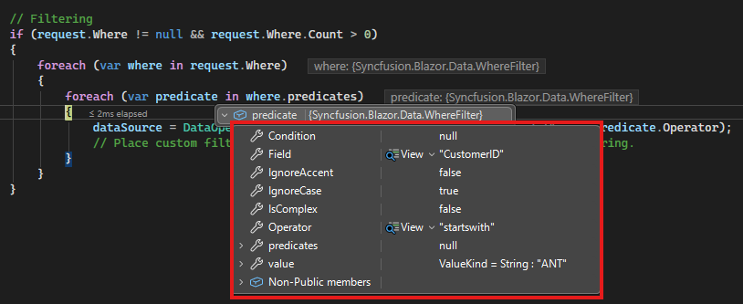
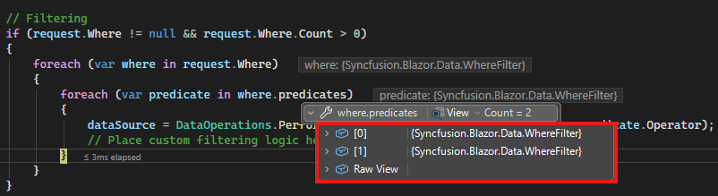
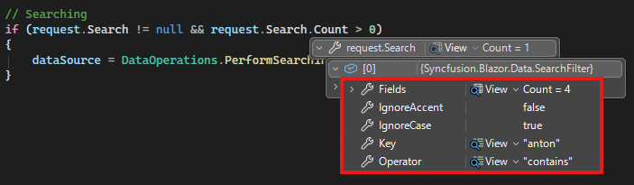
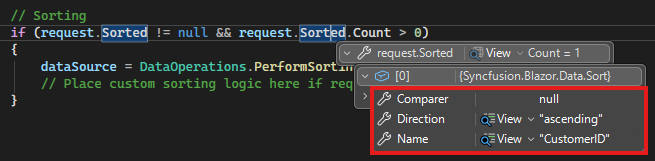
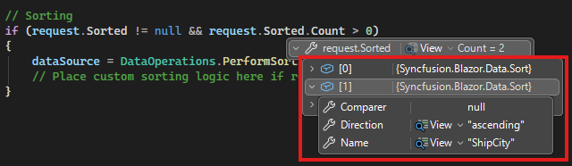
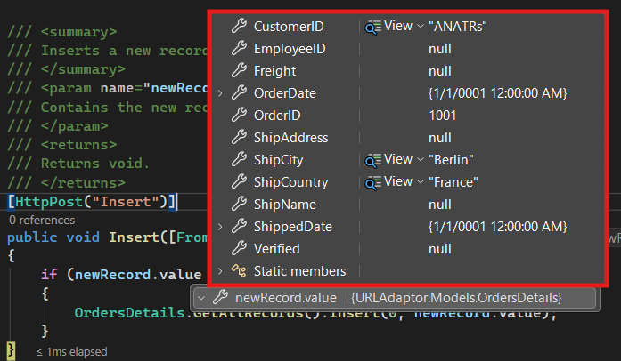
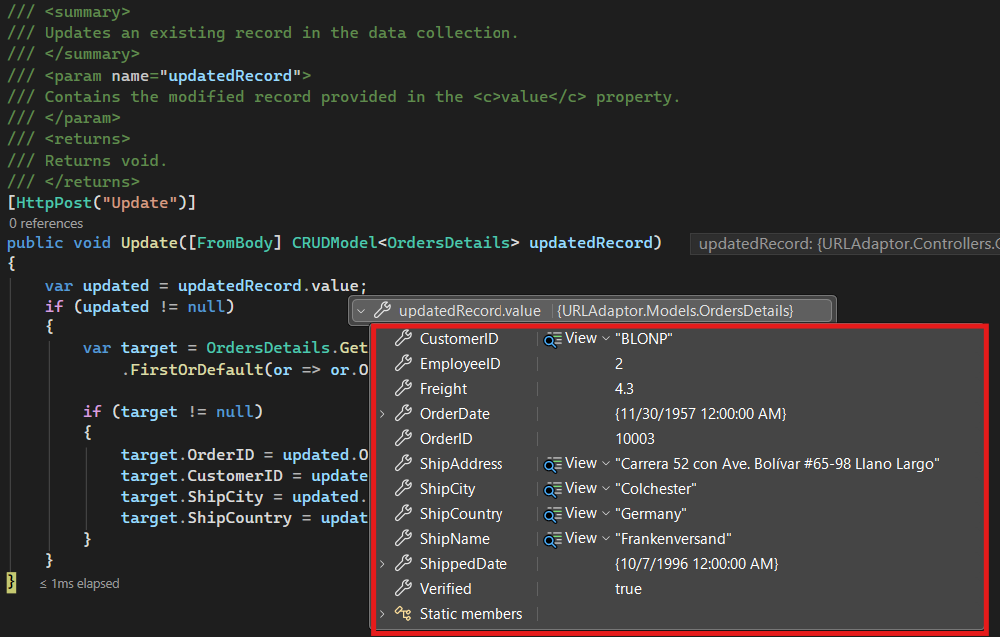
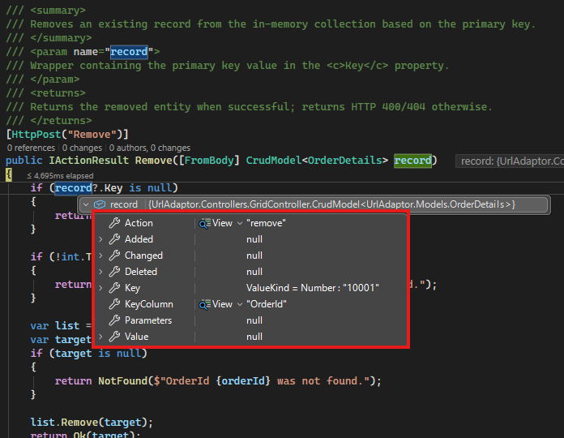
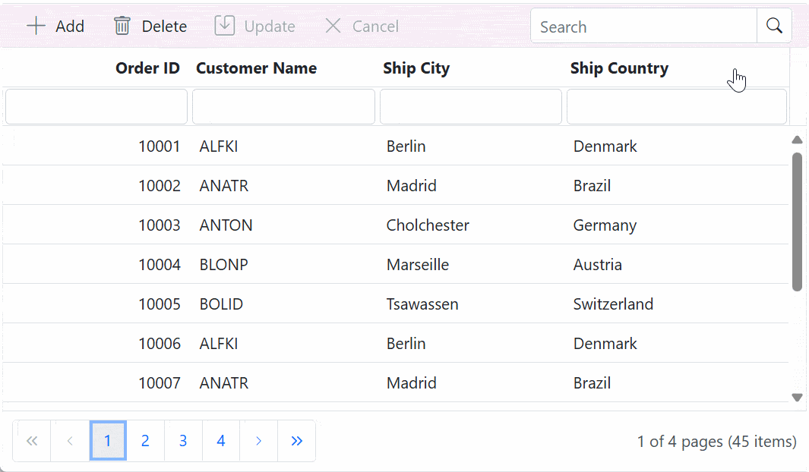

# Custom REST API Remote Data Binding in Syncfusion Blazor Components

The [UrlAdaptor](https://blazor.syncfusion.com/documentation/data/adaptors) in the Syncfusion<sup style="font-size:70%">&reg;</sup> Blazor DataManager streamlines connecting the Blazor DataGrid to REST API endpoints by managing request and response handling for remote data operations. It automatically converts DataGrid actions such as filtering, sorting, paging, and CRUD into HTTP POST requests and processes the server’s JSON response, enabling smooth remote data binding without custom request logic.

For details on configuring the backend (expected request/response format, server‑side processing), refer to the [UrlAdaptor backend setup documentation](https://blazor.syncfusion.com/documentation/data/adaptors).

Once the project creation and backend setup are complete, the next step is to integrate the Syncfusion<sup style="font-size:70%">&reg;</sup> Blazor DataGrid with `UrlAdaptor`.

## Integrating Syncfusion Blazor DataGrid with UrlAdaptor

### Step 1: Install and Configure Blazor DataGrid Components

Syncfusion is a library that provides pre-built UI components like DataGrid, which is used to display data in a table format.

**Instructions:**

**1. Install Syncfusion<sup style="font-size:70%">&reg;</sup> Blazor DataGrid and Themes NuGet packages**

**Method 1: Using Package Manager Console**

1. Open Visual Studio 2026.
2. Navigate to Tools → NuGet Package Manager → Package Manager Console.
3. Run the following commands:

```powershell
Install-Package Syncfusion.Blazor.Grid -Version {{site.blazorversion}};
Install-Package Syncfusion.Blazor.Themes -Version {{site.blazorversion}};
```

**Method 2: Using NuGet Package Manager UI**

1. Open Visual Studio 2026 → Tools → NuGet Package Manager → Manage NuGet Packages for Solution.
2. Search for and install each package individually:
   - **[Syncfusion.Blazor.Grid](https://www.nuget.org/packages/Syncfusion.Blazor.Grid/)** (version {{site.blazorversion}})
   - **[Syncfusion.Blazor.Themes](https://www.nuget.org/packages/Syncfusion.Blazor.Themes/)** (version {{site.blazorversion}})

All required packages are now installed.

**2. Register Syncfusion<sup style="font-size:70%">&reg;</sup> Blazor service**

Import the required namespaces in the `Components/_Imports.razor` file:

```csharp
@using Syncfusion.Blazor
@using Syncfusion.Blazor.Grids
```
- Register the Syncfusion<sup style="font-size:70%">&reg;</sup> Blazor service in the **~/Program.cs** file.
 
```csharp
using Syncfusion.Blazor;
 
builder.Services.AddSyncfusionBlazor();
```
 For apps using `WebAssembly` or `Auto (Server and WebAssembly)` render modes, register the service in both **~/Program.cs** files.
 
**3. Add stylesheet and script resources**

Add the Syncfusion stylesheet and scripts in the `Components/App.razor` file. Find the `<head>` section and add:

```html
<!-- Syncfusion Blazor Stylesheet -->
<link href="_content/Syncfusion.Blazor.Themes/bootstrap5.css" rel="stylesheet" />

<!-- Syncfusion Blazor Scripts -->
<script src="_content/Syncfusion.Blazor.Core/scripts/syncfusion-blazor.min.js" type="text/javascript"></script>
```

For this project, the **bootstrap5** theme is used. A different theme can be selected or customized based on project requirements. Refer to the [Syncfusion Blazor Components Appearance](https://blazor.syncfusion.com/documentation/appearance/themes) documentation to learn more about theming and customization options.

Syncfusion components are now configured and ready to use. For additional guidance, refer to the DataGrid component's [getting‑started](https://blazor.syncfusion.com/documentation/datagrid/getting-started-with-web-app) documentation.
 
### Step 2: Update the Blazor DataGrid with UrlAdaptor

DataGrid integration with backend APIs is enabled through the `UrlAdaptor`, which serves as a connector between the Syncfusion Blazor DataManager and RESTful services. It automatically converts DataGrid actions such as paging, sorting, filtering, searching, and grouping into structured HTTP requests that the server can interpret. This design is particularly effective for large datasets where server‑side processing is essential.

By delegating these operations to the server rather than executing them in the browser, the DataGrid ensures that only the required data is retrieved for each request. 

In the below code example, `Index.razor` will display the order data in a Syncfusion Blazor DataGrid with search, filter, sort, paging, and CRUD capabilities using `UrlAdaptor` to communicate with REST API endpoints.

**Instructions:**

1. Open the file named `Index.razor` in the `Components/Pages` folder.
2. Replace the entire content with the following code:

```cshtml
@page "/"

<SfGrid TValue="Order" AllowPaging="true" AllowFiltering="true"  AllowGrouping="true" AllowSorting="true" 
        Toolbar="@(new List<string>() { "Add", "Edit", "Delete", "Update", "Cancel", "Search" })" Width="100%" Height="600px">
    <SfDataManager Url="http://localhost:5175/api/Grid"
                   InsertUrl="http://localhost:5175/api/Grid/Insert"
                   UpdateUrl="http://localhost:5175/api/Grid/Update"
                   RemoveUrl="http://localhost:5175/api/Grid/Delete"
                   BatchUrl="http://localhost:5175/api/Grid/BatchUpdate"
                   Adaptor="Adaptors.UrlAdaptor">
    </SfDataManager>
    <GridFilterSettings Type="Syncfusion.Blazor.Grids.FilterType.Menu"></GridFilterSettings>
    <GridEditSettings AllowEditing="true" AllowDeleting="true" AllowAdding="true" Mode="EditMode.Normal"></GridEditSettings>
    <GridColumns>
        <GridColumn Field=@nameof(Order.OrderID) HeaderText="Order ID" IsIdentity="true" IsPrimaryKey="true"
                    TextAlign="TextAlign.Right" Width="120"></GridColumn>
        <GridColumn Field=@nameof(Order.CustomerID) HeaderText="Customer Name" Width="150"></GridColumn>
        <GridColumn Field=@nameof(Order.EmployeeID) HeaderText="Employee ID" TextAlign="TextAlign.Right" Width="150"></GridColumn>
        <GridColumn Field=@nameof(Order.Freight) HeaderText="Freight" TextAlign="TextAlign.Right" Format="C2" Width="150"></GridColumn>
        <GridColumn Field=@nameof(Order.ShipCity) HeaderText="Ship City" Width="150"></GridColumn>
    </GridColumns>
    <GridAggregates>
        <GridAggregate>
            <GridAggregateColumns>
                <GridAggregateColumn Field=@nameof(Order.Freight) Type="AggregateType.Sum" Format="C2">
                    <GroupFooterTemplate>
                        @{
                            var aggregate = (context as AggregateTemplateContext);
                            <div>
                                <p>Sum: @aggregate?.Sum</p>
                            </div>
                        }
                    </GroupFooterTemplate>
                    <FooterTemplate>
                        @{
                            var aggregate = (context as AggregateTemplateContext);
                            <div>
                                <p>Sum: @aggregate?.Sum</p>
                            </div>
                        }
                    </FooterTemplate>
                </GridAggregateColumn>
            </GridAggregateColumns>
        </GridAggregate>
    </GridAggregates>
</SfGrid>

```

**Component Explanation:**

- **`<SfGrid>`**: The DataGrid component that displays order data in rows and columns.
- **`<SfDataManager>`**: Manages data communication with REST API endpoints using UrlAdaptor. The `Url` property points to the read endpoint, while `InsertUrl`, `UpdateUrl`, `RemoveUrl`, and `BatchUrl` point to CRUD endpoints.
- **`AllowPaging="true"`**: Enables pagination to display records in pages of 12 records each.
- **`AllowFiltering="true"`**: Enables column filtering.
- **`AllowGrouping="true"`**: Allows grouping by dragging columns to the group area.
- **`AllowSorting="true"`**: Enables column sorting by clicking headers.
- **`<GridColumns>`**: Defines the columns displayed in the DataGrid, mapped to `Order` model properties.
- **`<GridEditSettings>`**: Enables inline editing in `Normal` mode (edit one row at a time).
- **`Toolbar`**: "Add", "Edit", "Delete", "Update", "Cancel", "Search" for CRUD and search operations.
- **`<GridAggregates>`**: Displays summary calculations (Sum, Count, Average, Min, Max) in footer rows. The `<GroupFooterTemplate>` shows aggregates for each group, while `<FooterTemplate>` displays aggregates for the entire DataGrid at the bottom.

> In **URL Adaptor**, the DataGrid handles grouping and aggregation operations automatically.

### Step 3: Implement the Endpoints for UrlAdaptor

The `UrlAdaptor` communicates with REST API endpoints for DataGrid operations rather than executing logic in the component. The DataGrid sends requests to endpoints defined in a controller. Below is the controller structure with the same decorators and signatures as in the project, with placeholder comments to add logic.

Open the file named **Controllers/GridController.cs** and use the following structure:

```csharp
 
using Microsoft.AspNetCore.Mvc;
using Syncfusion.Blazor.Data;
using Syncfusion.Blazor;
using URLAdaptor.Models;
 
namespace URLAdaptor.Controllers
{
    [ApiController]
    public class GridController : ControllerBase
    {
        /// <summary>
        /// Retrieves the list of orders.
        /// </summary>
        /// <returns>Retrieve data from the data source.</returns>
        [HttpGet]
        public List<OrdersDetails> GetOrderData()
        {
            return OrdersDetails.GetAllRecords().ToList();
        }
 
        /// <summary>
        /// Handles server-side data operations such as searching, filtering, sorting, paging, and returns the processed data.
        /// </summary>
        /// <param name="DataManagerRequest">The request object contains data operation parameters such as search, filter, sort, and pagination details.</param>
        /// <returns>Returns the data and total count in result and count format.</returns>
        [HttpPost]
        [Route("api/[controller]")]
        public object Post([FromBody] DataManagerRequest DataManagerRequest)
        {
            // Retrieve data source and convert to queryable.
            IQueryable<OrdersDetails> DataSource = GetOrderData().AsQueryable();
 
            // Get total records count.
            int totalRecordsCount = DataSource.Count();
 
            // Return data and count.
            return new { result = DataSource, count = totalRecordsCount };
        }

        /// <summary>
        /// Inserts a new order record.
        /// </summary>
        [HttpPost("Insert")]
        [Route("api/[controller]/Insert")]
        public void Insert([FromBody] CRUDModel<Order> value)
        {
            // implement logic here.
        }

        /// <summary>
        /// Updates an existing order record.
        /// </summary>
        [HttpPost("Update")]
        [Route("api/[controller]/Update")]
        public void Update([FromBody] CRUDModel<Order> value)
        {
            // implement logic here.
        }

        /// <summary>
        /// Deletes an order record.
        /// </summary>
        [HttpPost("Delete")]
        [Route("api/[controller]/Delete")]
        public void Delete([FromBody] CRUDModel<Order> value)
        {
            // implement logic here.
        }

        /// <summary>
        /// Batch operations for Insert, Update, and Delete.
        /// </summary>
        [HttpPost("Batch")]
        [Route("api/[controller]/BatchUpdate")]
        public void Batch([FromBody] CRUDModel<Order> value)
        {
            // implement logic here.
        }
    }

    /// <summary>
    /// CRUD Model for handling data operations.
    /// </summary>
    public class CRUDModel<T> where T : class
    {
        [JsonPropertyName("action")]
        public string? Action { get; set; }
        [JsonPropertyName("keyColumn")]
        public string? KeyColumn { get; set; }
        [JsonPropertyName("key")]
        public object? Key { get; set; }
        [JsonPropertyName("value")]
        public T? Value { get; set; }
        [JsonPropertyName("added")]
        public List<T>? Added { get; set; }
        [JsonPropertyName("changed")]
        public List<T>? Changed { get; set; }
        [JsonPropertyName("deleted")]
        public List<T>? Deleted { get; set; }
        [JsonPropertyName("params")]
        public IDictionary<string, object>? Params { get; set; }
    }
}
 
```
 
> Replace https://localhost:xxxx/api/Grid with the actual URL of your API endpoint that provides the data in a consumable format (e.g., JSON).

The `CRUDModel<T>` is the payload contract used by `UrlAdaptor` for insert, update, delete, and batch requests.
It carries the primary key, single entity (Value), and collections (Added, Changed, Deleted) for batch operations.

This controller exposes the endpoints used by `<SfDataManager>` in **Home.razor**. Logic will be added in later steps when wiring CRUD and batch operations.

### Step 4: Running the Application

**Build the Application**

1. Open PowerShell or your terminal.
2. Navigate to the project directory.
3. Build the application:

```powershell
dotnet build
```

**Run the Application**

Execute the following command:

```powershell
dotnet run
```

The application will start, and the console will display the local URL (typically `http://localhost:5175` or `https://localhost:5001`).

**Access the Application**

1. Open a web browser.
2. Navigate to the URL displayed in the console.
3. The DataGrid application is now running and ready to use.
 


## Server-side data operations

> * The Syncfusion<sup style="font-size:70%">&reg;</sup> Blazor DataGrid supports server-side operations such as **searching**, **sorting**, **filtering**, **aggregating**, and **paging**. These can be handled using methods like [PerformSearching](https://help.syncfusion.com/cr/blazor/Syncfusion.Blazor.DataOperations.html#Syncfusion_Blazor_DataOperations_PerformSearching__1_System_Linq_IQueryable___0__System_Collections_Generic_List_Syncfusion_Blazor_Data_SearchFilter__), [PerformFiltering](https://help.syncfusion.com/cr/blazor/Syncfusion.Blazor.DataOperations.html#Syncfusion_Blazor_DataOperations_PerformFiltering__1_System_Linq_IQueryable___0__System_Collections_Generic_List_Syncfusion_Blazor_Data_WhereFilter__System_String_), [PerformSorting](https://help.syncfusion.com/cr/blazor/Syncfusion.Blazor.DataOperations.html#Syncfusion_Blazor_DataOperations_PerformSorting__1_System_Linq_IQueryable___0__System_Collections_Generic_List_Syncfusion_Blazor_Data_Sort__), [PerformTake](https://help.syncfusion.com/cr/blazor/Syncfusion.Blazor.DataOperations.html#Syncfusion_Blazor_DataOperations_PerformTake__1_System_Linq_IQueryable___0__System_Int32_), and [PerformSkip](https://help.syncfusion.com/cr/blazor/Syncfusion.Blazor.DataOperations.html#Syncfusion_Blazor_DataOperations_PerformSkip__1_System_Linq_IQueryable___0__System_Int32_) from the **Syncfusion.Blazor.Data** package. Let's explore how to manage these data operations using the `UrlAdaptor`.
> * In an API service project, add **Syncfusion.Blazor.Data** by opening the NuGet package manager in Visual Studio (Tools → NuGet Package Manager → Manage NuGet Packages for Solution), search and install it.

### Implement Paging Feature

Paging divides large datasets into smaller pages to improve performance and usability.

**Instructions:**

* Ensure the DataGrid has paging enabled with `AllowPaging="true"`.
* Implement the `Post` action in **Controllers/GridController.cs** to apply only paging using the [PerformTake](https://help.syncfusion.com/cr/blazor/Syncfusion.Blazor.DataOperations.html#Syncfusion_Blazor_DataOperations_PerformTake__1_System_Linq_IQueryable___0__System_Int32_) and [PerformSkip](https://help.syncfusion.com/cr/blazor/Syncfusion.Blazor.DataOperations.html#Syncfusion_Blazor_DataOperations_PerformSkip__1_System_Linq_IQueryable___0__System_Int32_) methods from the [DataOperations](https://help.syncfusion.com/cr/blazor/Syncfusion.Blazor.DataOperations.html) class. This allows the custom data source to undergo paging based on the criteria specified in the incoming [DataManagerRequest](https://help.syncfusion.com/cr/blazor/Syncfusion.Blazor.DataManagerRequest.html) object.




/// <summary>
/// Handles server-side data operations such as paging and returns the processed data.
/// </summary>
/// <param name="DataManagerRequest">The request object contains pagination details.</param>
/// <returns>Returns a response containing the processed data and the total record count.</returns>
[HttpPost]
[Route("api/[controller]")]
public object Post([FromBody] DataManagerRequest DataManagerRequest)
{
    // Retrieve data from the data source.
    IQueryable<OrdersDetails> DataSource = GetOrderData().AsQueryable();

    // Get the total records count.
    int totalRecordsCount = DataSource.Count();

    // Handling paging operation.
    if (DataManagerRequest.Skip != 0)
    {
        DataSource = DataOperations.PerformSkip(DataSource, DataManagerRequest.Skip);
        // Add custom logic here if needed and remove above method.
    }
    if (DataManagerRequest.Take != 0)
    {
        DataSource = DataOperations.PerformTake(DataSource, DataManagerRequest.Take);
        // Add custom logic here if needed and remove above method.
    }

    // Return data based on the request.
    return new { result = DataSource, count = totalRecordsCount };
}





@using Syncfusion.Blazor.Grids
@using Syncfusion.Blazor.Data
@using URLAdaptor.Models

<SfGrid TValue="OrdersDetails" AllowPaging="true" Height="348">
    <SfDataManager Url="https://localhost:xxxx/api/Grid" Adaptor="Adaptors.UrlAdaptor"></SfDataManager>
    <GridColumns>
        <GridColumn Field="OrderID" HeaderText="Order ID" Width="100" TextAlign="TextAlign.Right"></GridColumn>
        <GridColumn Field="CustomerID" HeaderText="Customer Name" Width="100"></GridColumn>
        <GridColumn Field="ShipCity" HeaderText="Ship City" Width="100"></GridColumn>
        <GridColumn Field="ShipCountry" HeaderText="Ship Country" Width="120"></GridColumn>
    </GridColumns>
</SfGrid>




**How Paging Works:**
- The DataGrid posts `Skip` and `Take` to `http://localhost:5175/api/Grid`.
- The controller returns the paged `result` and total `count` for correct pager UI.

### Implement Filtering Feature

Filtering allows the user to restrict data based on column values.

**Instructions:**

* Open the `Components/Pages/Home.razor` file.
* Add the [AllowFiltering](https://help.syncfusion.com/cr/blazor/Syncfusion.Blazor.Grids.SfGrid-1.html#Syncfusion_Blazor_Grids_SfGrid_1_AllowFiltering) property to the `<SfGrid>`.
* Implement the `Post` action in **Controllers/GridController.cs** to handle filtering using the [PerformFiltering](https://help.syncfusion.com/cr/blazor/Syncfusion.Blazor.DataOperations.html#Syncfusion_Blazor_DataOperations_PerformFiltering__1_System_Linq_IQueryable___0__System_Collections_Generic_List_Syncfusion_Blazor_Data_WhereFilter__System_String_) method from the [DataOperations](https://help.syncfusion.com/cr/blazor/Syncfusion.Blazor.DataOperations.html) class. This allows the custom data source to undergo filtering based on the criteria specified in the incoming [DataManagerRequest](https://help.syncfusion.com/cr/blazor/Syncfusion.Blazor.DataManagerRequest.html) object.

**Single column filtering**


**Multi column filtering**





/// <summary>
/// Handles server-side data operations such as filtering and returns the processed data.
/// </summary>
/// <param name="DataManagerRequest">The request object contains filtered details.</param>
/// <returns>Returns a response containing the processed data and the total record count.</returns>
[HttpPost]
[Route("api/[controller]")]
public object Post([FromBody] DataManagerRequest DataManagerRequest)
{
    // Retrieve data from the data source.
    IQueryable<OrdersDetails> DataSource = GetOrderData().AsQueryable();

    // Handling filtering operation.
    if (DataManagerRequest.Where != null && DataManagerRequest.Where.Count > 0)
    {
        foreach (var condition in DataManagerRequest.Where)
        {
            foreach (var predicate in condition.predicates)
            {
                DataSource = DataOperations.PerformFiltering(DataSource, DataManagerRequest.Where, predicate.Operator);
                // Add custom logic here if needed and remove above method.
            }
        }
    }

    // Get the total records count.
    int totalRecordsCount = DataSource.Count();

    // Return data based on the request.
    return new { result = DataSource, count = totalRecordsCount };
}





@using Syncfusion.Blazor.Grids
@using Syncfusion.Blazor.Data
@using URLAdaptor.Models

<SfGrid TValue="OrdersDetails" AllowFiltering="true" Height="348">
    <SfDataManager Url="https://localhost:xxxx/api/Grid" Adaptor="Adaptors.UrlAdaptor"></SfDataManager>
    <GridColumns>
        <GridColumn Field="OrderID" HeaderText="Order ID" Width="100" TextAlign="TextAlign.Right"></GridColumn>
        <GridColumn Field="CustomerID" HeaderText="Customer Name" Width="100"></GridColumn>
        <GridColumn Field="ShipCity" HeaderText="Ship City" Width="100"></GridColumn>
        <GridColumn Field="ShipCountry" HeaderText="Ship Country" Width="120"></GridColumn>
    </GridColumns>
</SfGrid>




**How Filtering Works:**

- When the user enters text in the filter bar and presses Enter, the DataGrid sends a request to the REST API.
- The `Post` method receives the filter criteria in `dataManagerRequest.Where`.
- The `DataOperations.PerformFiltering()` method applies the filter conditions to the data.
- Results are filtered accordingly and displayed in the DataGrid.

### Implement Searching Feature

Searching allows the user to find records by entering keywords in the search box, which filters data across all columns.

**Instructions:**

* Ensure the toolbar includes the "Search" item.
* Implement the `Post` action in **Controllers/GridController.cs** to handle searching using the [PerformSearching](https://help.syncfusion.com/cr/blazor/Syncfusion.Blazor.DataOperations.html#Syncfusion_Blazor_DataOperations_PerformSearching__1_System_Linq_IQueryable___0__System_Collections_Generic_List_Syncfusion_Blazor_Data_SearchFilter__) method from the [DataOperations](https://help.syncfusion.com/cr/blazor/Syncfusion.Blazor.DataOperations.html) class. This allows the custom data source to undergo searching based on the criteria specified in the incoming [DataManagerRequest](https://help.syncfusion.com/cr/blazor/Syncfusion.Blazor.DataManagerRequest.html) object.






/// <summary>
/// Handles server-side data operations such as searching and returns the processed data.
/// </summary>
/// <param name="DataManagerRequest">The request object contains searched details.</param>
/// <returns>Returns a response containing the processed data and the total record count.</returns>
[HttpPost]
[Route("api/[controller]")]
public object Post([FromBody] DataManagerRequest DataManagerRequest)
{
    // Retrieve data from the data source.
    IQueryable<OrdersDetails> DataSource = GetOrderData().AsQueryable();

    // Handling searching operation.
    if (DataManagerRequest.Search != null && DataManagerRequest.Search.Count > 0)
    {
        DataSource = DataOperations.PerformSearching(DataSource, DataManagerRequest.Search);
        // Add custom logic here if needed and remove above method.
    }

    // Get the total records count.
    int totalRecordsCount = DataSource.Count();

    // Return data based on the request.
    return new { result = DataSource, count = totalRecordsCount };
}





@using Syncfusion.Blazor.Grids
@using Syncfusion.Blazor.Data
@using URLAdaptor.Models

<SfGrid TValue="OrdersDetails" Toolbar="@(new List<string>() { "Search" })" Height="348">
    <SfDataManager Url="https://localhost:xxxx/api/Grid" Adaptor="Adaptors.UrlAdaptor"></SfDataManager>
    <GridColumns>
        <GridColumn Field="OrderID" HeaderText="Order ID" Width="100" TextAlign="TextAlign.Right"></GridColumn>
        <GridColumn Field="CustomerID" HeaderText="Customer Name" Width="100"></GridColumn>
        <GridColumn Field="ShipCity" HeaderText="Ship City" Width="100"></GridColumn>
        <GridColumn Field="ShipCountry" HeaderText="Ship Country" Width="120"></GridColumn>
    </GridColumns>
</SfGrid>




**How Searching Works:**

- When the user enters text in the search box and presses Enter, the DataGrid sends a search request to the REST API.
- The `Post` method receives the search criteria in `dataManagerRequest.Search`.
- The `DataOperations.PerformSearching()` method filters the data based on the search term across all columns.
- Results are returned and displayed in the DataGrid with pagination applied.

### Step 8: Implement Sorting Feature

Sorting enables the user to arrange records in ascending or descending order based on column values.

**Instructions:**

* Open the `Components/Pages/Home.razor` file.
* Add the [AllowSorting](https://help.syncfusion.com/cr/blazor/Syncfusion.Blazor.Grids.SfGrid-1.html#Syncfusion_Blazor_Grids_SfGrid_1_AllowSorting) property to the `<SfGrid>`.
* Update the `Post` action in **Controllers/GridController.cs** to handle sorting using the [PerformSorting](https://help.syncfusion.com/cr/blazor/Syncfusion.Blazor.DataOperations.html#Syncfusion_Blazor_DataOperations_PerformSorting__1_System_Linq_IQueryable___0__System_Collections_Generic_List_Syncfusion_Blazor_Data_Sort__) method from the [DataOperations](https://help.syncfusion.com/cr/blazor/Syncfusion.Blazor.DataOperations.html) class. This allows the custom data source to undergo sorting based on the criteria specified in the incoming [DataManagerRequest](https://help.syncfusion.com/cr/blazor/Syncfusion.Blazor.DataManagerRequest.html) object.

**Single column sorting**


**Multi column sorting**





/// <summary>
/// Handles server-side data operations such as sorting and returns the processed data.
/// </summary>
/// <param name="DataManagerRequest">The request object contains sorted details.</param>
/// <returns>Returns a response containing the processed data and the total record count.</returns>
[HttpPost]
[Route("api/[controller]")]
public object Post([FromBody] DataManagerRequest DataManagerRequest)
{
    // Retrieve data from the data source.
    IQueryable<OrdersDetails> DataSource = GetOrderData().AsQueryable();

    // Handling sorting operation.
    if (DataManagerRequest.Sorted != null && DataManagerRequest.Sorted.Count > 0)
    {
        DataSource = DataOperations.PerformSorting(DataSource, DataManagerRequest.Sorted);
        // Add custom logic here if needed and remove above method.
    }

    // Get the total count of records.
    int totalRecordsCount = DataSource.Count();

    // Return data based on the request.
    return new { result = DataSource, count = totalRecordsCount };
}





@using Syncfusion.Blazor.Grids
@using Syncfusion.Blazor.Data
@using URLAdaptor.Models

<SfGrid TValue="OrdersDetails" AllowSorting="true" Height="348">
    <SfDataManager Url="https://localhost:xxxx/api/Grid" Adaptor="Adaptors.UrlAdaptor"></SfDataManager>
    <GridColumns>
        <GridColumn Field="OrderID" HeaderText="Order ID" Width="100" TextAlign="TextAlign.Right"></GridColumn>
        <GridColumn Field="CustomerID" HeaderText="Customer Name" Width="100"></GridColumn>
        <GridColumn Field="ShipCity" HeaderText="Ship City" Width="100"></GridColumn>
        <GridColumn Field="ShipCountry" HeaderText="Ship Country" Width="120"></GridColumn>
    </GridColumns>
</SfGrid>




**How Sorting Works:**

- Click on the column header to sort in ascending order.
- Click again to sort in descending order.
- The `Post` method receives the sort criteria in `dataManagerRequest.Sorted`.
- The `DataOperations.PerformSorting()` method sorts the data based on the specified column and direction.
- Records are sorted accordingly and displayed in the DataGrid.

### Perform CRUD Operations

The Syncfusion<sup style="font-size:70%">&reg;</sup> Blazor DataGrid seamlessly integrates CRUD (Create, Read, Update, and Delete) operations with server-side controller actions through specific properties: [InsertUrl](https://help.syncfusion.com/cr/blazor/Syncfusion.Blazor.DataManager.html#Syncfusion_Blazor_DataManager_InsertUrl), [RemoveUrl](https://help.syncfusion.com/cr/blazor/Syncfusion.Blazor.DataManager.html#Syncfusion_Blazor_DataManager_RemoveUrl), [UpdateUrl](https://help.syncfusion.com/cr/blazor/Syncfusion.Blazor.DataManager.html#Syncfusion_Blazor_DataManager_UpdateUrl), [CrudUrl](https://help.syncfusion.com/cr/blazor/Syncfusion.Blazor.DataManager.html#Syncfusion_Blazor_DataManager_CrudUrl), and [BatchUrl](https://help.syncfusion.com/cr/blazor/Syncfusion.Blazor.DataManager.html#Syncfusion_Blazor_DataManager_BatchUrl). These properties enable the DataGrid to communicate with the data service for every DataGrid action, facilitating server-side operations. 

**Instructions:**

1. Update the `<SfGrid>` in `Home.razor` to include [GridEditSettings](https://help.syncfusion.com/cr/blazor/Syncfusion.Blazor.Grids.GridEditSettings.html):

2. **CRUD Operations Mapping**

CRUD operations within the DataGrid can be mapped to server-side controller actions using specific properties:

1. **InsertUrl**: Specifies the URL for inserting new data.
2. **RemoveUrl**: Specifies the URL for removing existing data.
3. **UpdateUrl**: Specifies the URL for updating existing data.
4. **CrudUrl**: Specifies a single URL for all CRUD operations(alternative to individual URLs).
5. **BatchUrl**: Specifies the URL for batch editing(multiple changes in one request).

For detailed Editing setup, refer to the [Editing documentation](https://blazor.syncfusion.com/documentation/datagrid/editing).




@using Syncfusion.Blazor.Grids
@using Syncfusion.Blazor.Data
@using URLAdaptor.Models

<SfGrid TValue="OrdersDetails" Toolbar="@(new List<string>() { "Add", "Edit", "Delete", "Update", "Cancel" })" Height="348">
    <SfDataManager Url="https://localhost:xxxx/api/Grid" InsertUrl="https://localhost:xxxx/api/Grid/Insert" UpdateUrl="https://localhost:xxxx/api/Grid/Update" RemoveUrl="https://localhost:xxxx/api/Grid/Remove" Adaptor="Adaptors.UrlAdaptor"></SfDataManager>
    <GridEditSettings AllowEditing="true" AllowDeleting="true" AllowAdding="true" Mode="EditMode.Normal"></GridEditSettings>
    <GridColumns>
        <GridColumn Field="OrderID" HeaderText="Order ID" IsPrimaryKey="true" Width="100" TextAlign="TextAlign.Right"></GridColumn>
         // Add Columns.
    </GridColumns>
</SfGrid>




> Normal/Inline editing is the default edit [Mode](https://help.syncfusion.com/cr/blazor/Syncfusion.Blazor.Grids.GridEditSettings.html#Syncfusion_Blazor_Grids_GridEditSettings_Mode) for the DataGrid. To enable CRUD operations, ensure that the [IsPrimaryKey](https://help.syncfusion.com/cr/blazor/Syncfusion.Blazor.Grids.GridColumn.html#Syncfusion_Blazor_Grids_GridColumn_IsPrimaryKey) property is set to **true** for a specific DataGrid column, ensuring that its value is unique.

The below class is used to structure data sent during CRUD operations.

```cs
public class CRUDModel<T> where T : class
{
  public string? action { get; set; }
  public string? keyColumn { get; set; }
  public object? key { get; set; }
  public T? value { get; set; }
  public List<T>? added { get; set; }
  public List<T>? changed { get; set; }
  public List<T>? deleted { get; set; }
  public IDictionary<string, object>? @params { get; set; }
}
```

**Insert (Create)**

To insert a new record, use the [InsertUrl](https://help.syncfusion.com/cr/blazor/Syncfusion.Blazor.DataManager.html#Syncfusion_Blazor_DataManager_InsertUrl) property to specify the controller action mapping URL for the insert operation. The details of the newly added record are passed to the **newRecord** parameter.






/// <summary>
/// Inserts a new data item into the data collection.
/// </summary>
/// <param name="value">It contains the new record detail which is need to be inserted.</param>
/// <returns>Returns void.</returns>
[HttpPost]
[Route("api/[controller]/Insert")]
public void Insert([FromBody] CRUDModel<OrdersDetails> newRecord)
{
    if (newRecord.value != null)
    {
        // Add the new record to the data collection.
        OrdersDetails.GetAllRecords().Insert(0, newRecord.value);
    }
}




**What happens behind the scenes:**

1. The user clicks the "Add" button and fills in the form.
2. The DataGrid sends a POST request to `http://localhost:5175/api/Grid/Insert`.
3. The `Insert` method receives the new order data in `newRecord.value`and
add the new record to the data collection.
4. The DataGrid automatically refreshes to display the new order.

**Update (Edit)**

For updating existing records, use the [UpdateUrl](https://help.syncfusion.com/cr/blazor/Syncfusion.Blazor.DataManager.html#Syncfusion_Blazor_DataManager_UpdateUrl) property to specify the controller action mapping URL for the update operation. The details of the updated record are passed to the **updatedRecord** parameter.






/// <summary>
/// Update a existing data item from the data collection.
/// </summary>
/// <param name="updatedRecord">It contains the updated record detail which is need to be updated.</param>
/// <returns>Returns void.</returns>
[HttpPost]
[Route("api/[controller]/Update")]
public void Update([FromBody] CRUDModel<OrdersDetails> updatedRecord)
{
    var updatedOrder = updatedRecord.value;
    if (updatedOrder != null)
    {
        var data = OrdersDetails.GetAllRecords().FirstOrDefault(or => or.OrderID == updatedOrder.OrderID);
        if (data != null)
        {
            // Update the existing record.
            data.OrderID = updatedOrder.OrderID;
            data.CustomerID = updatedOrder.CustomerID;
            data.ShipCity = updatedOrder.ShipCity;
            data.ShipCountry = updatedOrder.ShipCountry;
            // Update other properties similarly.
        }
    }
}




**What happens behind the scenes:**

1. The user clicks the "Edit" button and modifies the record.
2. The DataGrid sends a POST request to `http://localhost:5175/api/Grid/Update`.
3. The `Update` method receives the modified order data in `updatedRecord.value`.
4. The existing order is retrieved from the database by its ID. 
5. The DataGrid refreshes to display the updated order.

**Delete (Remove)**

To delete existing records, use the [RemoveUrl](https://help.syncfusion.com/cr/blazor/Syncfusion.Blazor.DataManager.html#Syncfusion_Blazor_DataManager_RemoveUrl) property to specify the controller action mapping URL for the delete operation. The primary key value of the deleted record is passed to the **deletedRecord** parameter.






/// <summary>
/// Remove a specific data item from the data collection.
/// </summary>
/// <param name="deletedRecord">It contains the specific record detail which is need to be removed.</param>
/// <return>Returns void.</return>
[HttpPost]
[Route("api/[controller]/Remove")]
public void Remove([FromBody] CRUDModel<OrdersDetails> deletedRecord)
{
    // Get the key value from the deletedRecord.
    int orderId = int.Parse(deletedRecord.key.ToString()); 
    var data = OrdersDetails.GetAllRecords().FirstOrDefault(orderData => orderData.OrderID == orderId);
    if (data != null)
    {
        // Remove the record from the data collection.
        OrdersDetails.GetAllRecords().Remove(data);
    }
}




**What happens behind the scenes:**

1. The user selects an order and clicks "Delete".
2. A confirmation dialog appears (built into the DataGrid).
3. If confirmed, the DataGrid sends a POST request to `http://localhost:5175/api/Grid/Delete`.
4. The `Delete` method extracts the order ID from `deletedRecord.Key` and remove the record from the data collection.
5. The DataGrid refreshes to remove the deleted order from the UI.


**Single method for performing all CRUD operations:**

Using the [CrudUrl](https://help.syncfusion.com/cr/blazor/Syncfusion.Blazor.DataManager.html#Syncfusion_Blazor_DataManager_CrudUrl) property, the controller action mapping URL can be specified to perform all CRUD operations on the server side using a single method, instead of specifying separate controller action methods for CRUD (Insert, Update, and Delete) operations.

The following code example illustrates this behavior.




/// <summary>
/// Handles CRUD (Create, Read, Update, and Delete) operations for a single request using the specified CRUD URL.
/// </summary>
/// <param name="request">An object containing the details of the record to be processed and the action to be performed (e.g., Create, Read, Update, and Delete).</param>
/// <returns>A response indicating the result of the CRUD operation, including success or failure details.</returns>
[HttpPost]
[Route("api/[controller]/CrudUpdate")]
public void CrudUpdate([FromBody] CRUDModel<OrdersDetails> request)
{
    // Perform the update operation.
    if (request.action == "update")
    {
        var orderValue = request.value;
        OrdersDetails existingRecord = OrdersDetails.GetAllRecords().FirstOrDefault(or => or.OrderID == orderValue.OrderID);
        if (existingRecord != null)
        {
            // Update the properties of the existing record.
            existingRecord.OrderID = orderValue.OrderID;
            existingRecord.CustomerID = orderValue.CustomerID;
            existingRecord.ShipCity = orderValue.ShipCity;
            existingRecord.ShipCountry = orderValue.ShipCountry;
            // Update other properties as needed.
        }
    }
    // Perform the insert operation.
    else if (request.action == "insert")
    {
        // Add the new record to the data collection.
        OrdersDetails.GetAllRecords().Insert(0, request.value);
    }
    // Perform the remove operation.
    else if (request.action == "remove")
    {
        // Remove the record from the data collection.
        OrdersDetails.GetAllRecords().Remove(OrdersDetails.GetAllRecords().FirstOrDefault(or => or.OrderID == int.Parse(request.key.ToString())));
    }
}





@using Syncfusion.Blazor.Grids
@using Syncfusion.Blazor.Data
@using URLAdaptor.Models

<SfGrid TValue="OrdersDetails" Toolbar="@(new List<string>() { "Add", "Edit", "Delete", "Update", "Cancel" })" Height="348">
    <SfDataManager Url="https://localhost:xxxx/api/Grid" CrudUrl="https://localhost:xxxx/api/Grid/CrudUpdate" Adaptor="Adaptors.UrlAdaptor"></SfDataManager>
    <GridEditSettings AllowEditing="true" AllowDeleting="true" AllowAdding="true" Mode="EditMode.Normal"></GridEditSettings>
    <GridColumns>
        <GridColumn Field="OrderID" HeaderText="Order ID" IsPrimaryKey="true" Width="100" TextAlign="TextAlign.Right"></GridColumn>
        <GridColumn Field="CustomerID" HeaderText="Customer Name" Width="100"></GridColumn>
        <GridColumn Field="ShipCity" HeaderText="Ship City" Width="100"></GridColumn>
        <GridColumn Field="ShipCountry" HeaderText="Ship Country" Width="120"></GridColumn>
    </GridColumns>
</SfGrid>




**Batch operation:**

Batch operations combine multiple insert, update, and delete actions into a single request, minimizing network overhead and ensuring transactional consistency.

To perform batch operation, define the edit [Mode](https://help.syncfusion.com/cr/blazor/Syncfusion.Blazor.Grids.GridEditSettings.html#Syncfusion_Blazor_Grids_GridEditSettings_Mode) as **Batch** and specify the [BatchUrl](https://help.syncfusion.com/cr/blazor/Syncfusion.Blazor.DataManager.html#Syncfusion_Blazor_DataManager_BatchUrl) property in the `SfDataManager`. Use the **Add** toolbar button to insert new row in batch editing mode. To edit a cell, double-click the desired cell and update the value as required. To delete a record, simply select the record and press the **Delete** toolbar button. Now, all CRUD operations will be executed in single request. Clicking the **Update** toolbar button will update the newly added, edited, or deleted records from the **OrdersDetails** table using a single API POST request.




/// <summary>
/// Handles CRUD operations when batch editing is enabled in the DataGrid.
/// </summary>
/// <param name="batchModel">The batch model containing the data changes to be processed.</param>
/// <returns>Returns the result of the CRUD operation.</returns>
[HttpPost]
[Route("api/[controller]/BatchUpdate")]
public IActionResult BatchUpdate([FromBody] CRUDModel<OrdersDetails> batchModel)
{
    // Check if there are any added records in the batch model.
    if (batchModel.added != null)
    {
        // Iterate through each added record.
        foreach (var Record in batchModel.added)
        {
            // Insert the added record at the beginning of the existing records.
            OrdersDetails.GetAllRecords().Insert(0, Record);
        }
    }
    // Check if there are any changed records in the batch model.
    if (batchModel.changed != null)
    {
        // Iterate through each changed record.
        foreach (var changedOrder in batchModel.changed)
        {
            // Find the existing record that matches the changed record's "OrderID".
            var existingOrder = OrdersDetails.GetAllRecords().FirstOrDefault(or => or.OrderID == changedOrder.OrderID);
            if (existingOrder != null)
            {
                // Update the properties of the existing record.
                existingOrder.OrderID = changedOrder.OrderID;
                existingOrder.CustomerID = changedOrder.CustomerID;
                existingOrder.ShipCity = changedOrder.ShipCity;
                existingOrder.ShipCountry = changedOrder.ShipCity;
                // Update other properties as needed.
            }
        }
    }
    // Check if there are any deleted records in the batch model.
    if (batchModel.deleted != null)
    {
        // Iterate through each deleted record.
        foreach (var deletedOrder in batchModel.deleted)
        {
            // Find the existing record that matches the deleted record's "OrderID".
            var orderToDelete = OrdersDetails.GetAllRecords().FirstOrDefault(or => or.OrderID == deletedOrder.OrderID);
            if (orderToDelete != null)
            {
                // Remove the matching record from the existing records.
                OrdersDetails.GetAllRecords().Remove(orderToDelete);
            }
        }
    }

    // Return the updated batch model as a JSON result.
    return new JsonResult(batchModel);
}





@using Syncfusion.Blazor.Grids
@using Syncfusion.Blazor.Data
@using URLAdaptor.Models

<SfGrid TValue="OrdersDetails" Toolbar="@(new List<string>() { "Add", "Delete", "Update", "Cancel" })" Height="348">
    <SfDataManager Url="https://localhost:xxxx/api/Grid" BatchUrl="https://localhost:xxxx/api/Grid/BatchUpdate" Adaptor="Adaptors.UrlAdaptor"></SfDataManager>
    <GridEditSettings AllowEditing="true" AllowDeleting="true" AllowAdding="true" Mode="EditMode.Batch"></GridEditSettings>
    <GridColumns>
        <GridColumn Field="OrderID" HeaderText="Order ID" IsPrimaryKey="true" Width="100" TextAlign="TextAlign.Right"></GridColumn>
        <GridColumn Field="CustomerID" HeaderText="Customer Name" Width="100"></GridColumn>
        <GridColumn Field="ShipCity" HeaderText="Ship City" Width="100"></GridColumn>
        <GridColumn Field="ShipCountry" HeaderText="Ship Country" Width="120"></GridColumn>
    </GridColumns>
</SfGrid>






All CRUD operations are now fully implemented, enabling comprehensive data management capabilities within the Blazor DataGrid.

## Complete Sample Repository

A complete, working sample implementation is available in the [GitHub repository](ttps://github.com/SyncfusionExamples/Binding-data-from-remote-service-to-blazor-data-grid/tree/master/UrlAdaptor).