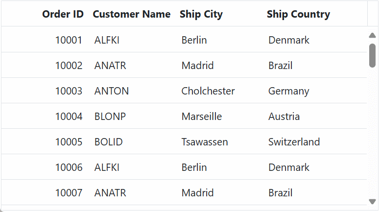
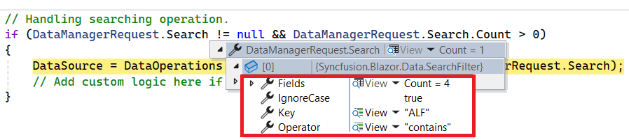
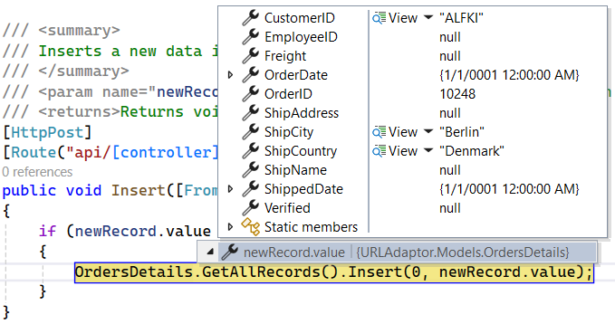

# UrlAdaptor in Syncfusion Blazor DataGrid

The Syncfusion<sup style="font-size:70%">&reg;</sup> Blazor DataGrid supports integration with remote data services through the [UrlAdaptor](https://blazor.syncfusion.com/documentation/data/adaptors#url-adaptor) in the [SfDataManager](https://help.syncfusion.com/cr/blazor/Syncfusion.Blazor.Data.SfDataManager.html) component. This adaptor is especially useful when working with custom APIs that include unique logic for handling data and performing CRUD operations. The API response must return data in the format **{ result, count }** to ensure proper binding and paging within the DataGrid.

The `UrlAdaptor` is ideal for applications that require:

- Custom server-side processing for data operations.
- Seamless interaction between the DataGrid and RESTful services.
- Efficient handling of large datasets with server-side **filtering**, **sorting**, and **paging**.

## Creating an API Service
 
The Syncfusion<sup style="font-size:70%">&reg;</sup> Blazor DataGrid can be configured to interact with a server-side API using the `UrlAdaptor`. The following steps outline how to create an API service for data binding and CRUD operations:
 
**1. Create a Blazor web app**
 
1. Open Visual Studio 2022.  
2. Choose **Blazor Web App** and name the project **URLAdaptor**.
3. Use either [Microsoft Templates](https://learn.microsoft.com/en-us/aspnet/core/blazor/tooling?view=aspnetcore-9.0&pivots=vs) or the Syncfusion<sup style="font-size:70%">&reg;</sup> Blazor Extension to create the project.
4. Select the preferred [interactive render mode](https://learn.microsoft.com/en-us/aspnet/core/blazor/components/render-modes?view=aspnetcore-9.0#render-modes) and [interactivity location](https://learn.microsoft.com/en-us/aspnet/core/blazor/tooling?view=aspnetcore-9.0&pivots=vs).

**2. Create a model class**
 
Add a **Models** folder and create a class named **OrdersDetails.cs** to represent order data.
 
```csharp
namespace URLAdaptor.Models
{
    public class OrdersDetails
    {
        public static List<OrdersDetails> order = new List<OrdersDetails>(); 

        public OrdersDetails() { }
 
        public OrdersDetails(int OrderID, string CustomerId, int EmployeeId, double Freight, bool Verified, DateTime OrderDate, string ShipCity, string ShipName, string ShipCountry, DateTime ShippedDate, string ShipAddress)
        {
            this.OrderID = OrderID;
            this.CustomerID = CustomerId;
            this.EmployeeID = EmployeeId;
            this.Freight = Freight;
            this.ShipCity = ShipCity;
            this.Verified = Verified;
            this.OrderDate = OrderDate;
            this.ShipName = ShipName;
            this.ShipCountry = ShipCountry;
            this.ShippedDate = ShippedDate;
            this.ShipAddress = ShipAddress;
        }

        public static List<OrdersDetails> GetAllRecords()
        {
            if (order.Count() == 0)
            {
                int code = 10000;
                for (int i = 1; i < 10; i++)
                {
                    order.Add(new OrdersDetails(code + 1, "ALFKI", i + 0, 2.3 * i, false, new DateTime(1991, 05, 15), "Berlin", "Simons bistro", "Denmark", new DateTime(1996, 7, 16), "Kirchgasse 6"));
                    order.Add(new OrdersDetails(code + 2, "ANATR", i + 2, 3.3 * i, true, new DateTime(1990, 04, 04), "Madrid", "Queen Cozinha", "Brazil", new DateTime(1996, 9, 11), "Avda. Azteca 123"));
                    order.Add(new OrdersDetails(code + 3, "ANTON", i + 1, 4.3 * i, true, new DateTime(1957, 11, 30), "Cholchester", "Frankenversand", "Germany", new DateTime(1996, 10, 7), "Carrera 52 con Ave. Bolívar #65-98 Llano Largo"));
                    order.Add(new OrdersDetails(code + 4, "BLONP", i + 3, 5.3 * i, false, new DateTime(1930, 10, 22), "Marseille", "Ernst Handel", "Austria", new DateTime(1996, 12, 30), "Magazinweg 7"));
                    order.Add(new OrdersDetails(code + 5, "BOLID", i + 4, 6.3 * i, true, new DateTime(1953, 02, 18), "Tsawassen", "Hanari Carnes", "Switzerland", new DateTime(1997, 12, 3), "1029 - 12th Ave. S."));
                    code += 5;
                }
            }
            return order;
        }
 
        public int? OrderID { get; set; }
        public string? CustomerID { get; set; }
        public int? EmployeeID { get; set; }
        public double? Freight { get; set; }
        public string? ShipCity { get; set; }
        public bool? Verified { get; set; }
        public DateTime OrderDate { get; set; }
        public string? ShipName { get; set; }
        public string? ShipCountry { get; set; }
        public DateTime ShippedDate { get; set; }
        public string? ShipAddress { get; set; }
    }
}
```
 
**3. Create an API controller**
 
Add a **GridController.cs** file under the **Controllers** folder to handle data operations.
 
```csharp
 
using Microsoft.AspNetCore.Mvc;
using Syncfusion.Blazor.Data;
using Syncfusion.Blazor;
using URLAdaptor.Models;
 
namespace URLAdaptor.Controllers
{
    [ApiController]
    public class GridController : ControllerBase
    {
        /// <summary>
        /// Retrieves the list of orders.
        /// </summary>
        /// <returns>Retrieve data from the data source.</returns>
        [HttpGet]
        public List<OrdersDetails> GetOrderData()
        {
            return OrdersDetails.GetAllRecords().ToList();
        }
 
        /// <summary>
        /// Handles server-side data operations such as filtering, sorting, paging, and returns the processed data.
        /// </summary>
        /// <returns>Returns the data and total count in result and count format.</returns>
        [HttpPost]
        [Route("api/[controller]")]
        public object Post()
        {
            // Retrieve data source and convert to queryable.
            IQueryable<OrdersDetails> DataSource = GetOrderData().AsQueryable();
 
            // Get total records count.
            int totalRecordsCount = DataSource.Count();
 
            // Return data and count.
            return new { result = DataSource, count = totalRecordsCount };
        }
    }
}
 
```
 
> Replace the sample logic in **GetOrderData** with database queries or other data sources based on requirements.

**4. Register controllers in `Program.cs`**
 
```csharp
builder.Services.AddControllers();
 
// Map controller routes.
app.MapControllers();
```
 
**5. Run the application**
 
Run the application in Visual Studio. The API will be available at a URL such as **https://localhost:xxxx/api/grid**, where **xxxx** represents the port number.
 


## Connecting Syncfusion Blazor DataGrid to an API service
 
To bind the Syncfusion<sup style="font-size:70%">&reg;</sup> Blazor DataGrid to a remote API using the [UrlAdaptor](https://help.syncfusion.com/cr/blazor/Syncfusion.Blazor.Adaptors.html#Syncfusion_Blazor_Adaptors_UrlAdaptor), configure the [SfDataManager](https://help.syncfusion.com/cr/blazor/Syncfusion.Blazor.Data.SfDataManager.html) component with the API endpoint and adaptor type. The following steps outline the integration process:
 
**1. Install Required NuGet Packages**
 
* To add the Syncfusion<sup style="font-size:70%">&reg;</sup> Blazor DataGrid to the application, open NuGet Package Manager in Visual Studio (*Tools → NuGet Package Manager → Manage NuGet Packages for Solution*), then search and install:

    * [Syncfusion.Blazor.Grid](https://www.nuget.org/packages/Syncfusion.Blazor.Grid/)
    * [Syncfusion.Blazor.Themes](https://www.nuget.org/packages/Syncfusion.Blazor.Themes/)

> * For **Blazor Web Apps** using **WebAssembly** or **Auto** render modes, install these packages in the client project.

* Alternatively, use the following Package Manager commands:

```powershell
Install-Package Syncfusion.Blazor.Grid -Version {{ site.releaseversion }}
Install-Package Syncfusion.Blazor.Themes -Version {{ site.releaseversion }}
```

> Syncfusion<sup style="font-size:70%">&reg;</sup> Blazor components are available on [nuget.org](https://www.nuget.org/packages?q=syncfusion.blazor). Refer to the [NuGet packages](https://blazor.syncfusion.com/documentation/nuget-packages) topic for a complete list of available packages.
 
**2. Register Syncfusion Blazor service**
 
- Add the required namespaces in **~/_Imports.razor**:
 
```cs
@using Syncfusion.Blazor
@using Syncfusion.Blazor.Grids
```
 
- Register the Syncfusion<sup style="font-size:70%">&reg;</sup> Blazor service in **Program.cs**:

```csharp
using Syncfusion.Blazor;

builder.Services.AddSyncfusionBlazor();
```
 
> * For apps using `WebAssembly` or `Auto (Server and WebAssembly)` render modes, register the service in both **~/Program.cs** files.
 
**3. Add stylesheet and script references**
 
Include the theme and script references in **App.razor**:
 
```html
<head>
    ....
    <link href="_content/Syncfusion.Blazor.Themes/bootstrap5.css" rel="stylesheet" />
</head>
....
<body>
    ....
    <script src="_content/Syncfusion.Blazor.Core/scripts/syncfusion-blazor.min.js" type="text/javascript"></script>
</body>
```
 
> * Refer to the [Blazor Themes](https://blazor.syncfusion.com/documentation/appearance/themes) topic for available methods to include themes, such as Static Web Assets, CDN, or CRG.
> * Set the render mode to **InteractiveServer** or **InteractiveAuto** in the Blazor Web App configuration.
 
**4. Configure DataGrid with UrlAdaptor**
 
Use the [SfDataManager](https://help.syncfusion.com/cr/blazor/Syncfusion.Blazor.Data.SfDataManager.html) component to connect the DataGrid to the API endpoint. Set the [Adaptor](https://help.syncfusion.com/cr/blazor/Syncfusion.Blazor.DataManager.html#Syncfusion_Blazor_DataManager_Adaptor) property to [UrlAdaptor](https://help.syncfusion.com/cr/blazor/Syncfusion.Blazor.Adaptors.html#Syncfusion_Blazor_Adaptors_UrlAdaptor).
 



@using Syncfusion.Blazor.Grids
@using Syncfusion.Blazor.Data
@using URLAdaptor.Models
 
<SfGrid TValue="OrderDetails" Height="348">
    <SfDataManager Url="https://localhost:xxxx/api/grid" Adaptor="Adaptors.UrlAdaptor"></SfDataManager>
    <GridColumns>
        <GridColumn Field="OrderID" HeaderText="Order ID" Width="100" TextAlign="TextAlign.Right"></GridColumn>
        <GridColumn Field="CustomerID" HeaderText="Customer Name" Width="100"></GridColumn>
        <GridColumn Field="ShipCity" HeaderText="Ship City" Width="100"></GridColumn>
        <GridColumn Field="ShipCountry" HeaderText="Ship Country" Width="120"></GridColumn>
    </GridColumns>
</SfGrid>
 

 

 
using Microsoft.AspNetCore.Mvc;
using Syncfusion.Blazor.Data;
using Syncfusion.Blazor;
using URLAdaptor.Models;
 
namespace URLAdaptor.Controllers
{
    [ApiController]
    public class GridController : ControllerBase
    {
        /// <summary>
        /// Retrieves the list of orders.
        /// </summary>
        /// <returns>Retrieve data from the data source.</returns>
        [HttpGet]
        public List<OrdersDetails> GetOrderData()
        {
            return OrdersDetails.GetAllRecords().ToList();
        }
 
        /// <summary>
        /// Handles server-side data operations such as searching, filtering, sorting, paging, and returns the processed data.
        /// </summary>
        /// <param name="DataManagerRequest">The request object contains data operation parameters such as search, filter, sort, and pagination details.</param>
        /// <returns>Returns the data and total count in result and count format.</returns>
        [HttpPost]
        [Route("api/[controller]")]
        public object Post()
        {
            // Retrieve data source and convert to queryable.
            IQueryable<OrdersDetails> DataSource = GetOrderData().AsQueryable();
 
            // Get total records count.
            int totalRecordsCount = DataSource.Count();
 
            // Return data and count.
            return new { result = DataSource, count = totalRecordsCount };
        }
    }
}
 


 
> Replace **https://localhost:xxxx/api/grid** with the actual API endpoint that returns data in a consumable format, such as **JSON**.
 
**5. Run the application**
 
Run the application and verify that the DataGrid displays data retrieved from the API.
 

 
## Perform data operations in UrlAdaptor

The Syncfusion<sup style="font-size:70%">&reg;</sup> Blazor DataGrid supports server-side operations such as **searching**, **sorting**, **filtering**, **aggregating**, and **paging**.

The [DataManagerRequest](https://help.syncfusion.com/cr/blazor/Syncfusion.Blazor.DataManagerRequest.html) object provides the necessary details for each operation, and these can be applied using built-in methods from the [DataOperations](https://help.syncfusion.com/cr/blazor/Syncfusion.Blazor.DataOperations.html) class.

* [PerformSearching](https://help.syncfusion.com/cr/blazor/Syncfusion.Blazor.DataOperations.html#Syncfusion_Blazor_DataOperations_PerformSearching__1_System_Linq_IQueryable___0__System_Collections_Generic_List_Syncfusion_Blazor_Data_SearchFilter__) - Applies search criteria to the data source based on the provided search filters. Used for server-side searching.
* [PerformFiltering](https://help.syncfusion.com/cr/blazor/Syncfusion.Blazor.DataOperations.html#Syncfusion_Blazor_DataOperations_PerformFiltering__1_System_Linq_IQueryable___0__System_Collections_Generic_List_Syncfusion_Blazor_Data_WhereFilter__System_String_) - Filters the data source using conditions specified in the request. Supports single and multiple column filtering.
* [PerformSorting](https://help.syncfusion.com/cr/blazor/Syncfusion.Blazor.DataOperations.html#Syncfusion_Blazor_DataOperations_PerformSorting__1_System_Linq_IQueryable___0__System_Collections_Generic_List_Syncfusion_Blazor_Data_Sort__) - Sorts the data source according to one or more sort descriptors. Handles ascending and descending order.
* [PerformTake](https://help.syncfusion.com/cr/blazor/Syncfusion.Blazor.DataOperations.html#Syncfusion_Blazor_DataOperations_PerformTake__1_System_Linq_IQueryable___0__System_Int32_) - Retrieves a specified number of records from the beginning of the data source. Used for implementing paging.
* [PerformSkip](https://help.syncfusion.com/cr/blazor/Syncfusion.Blazor.DataOperations.html#Syncfusion_Blazor_DataOperations_PerformSkip__1_System_Linq_IQueryable___0__System_Int32_) - Skips a defined number of records in the data source before returning results. Used in combination with `PerformTake` for paging.

These methods allow efficient handling of large datasets by performing operations on the server side. The following sections demonstrate how to manage these operations using the UrlAdaptor.

> * To enable these operations, add the **Syncfusion.Blazor.Data** package to the API service project using NuGet Package Manager in Visual Studio (*Tools → NuGet Package Manager → Manage NuGet Packages for Solution*).

### Handling searching operation

To enable server-side searching with the `UrlAdaptor`, implement logic in the API controller using the [PerformSearching](https://help.syncfusion.com/cr/blazor/Syncfusion.Blazor.DataOperations.html#Syncfusion_Blazor_DataOperations_PerformSearching__1_System_Linq_IQueryable___0__System_Collections_Generic_List_Syncfusion_Blazor_Data_SearchFilter__) method from the [DataOperations](https://help.syncfusion.com/cr/blazor/Syncfusion.Blazor.DataOperations.html) class. This method applies search criteria to the data source based on the filters specified in the incoming [DataManagerRequest](https://help.syncfusion.com/cr/blazor/Syncfusion.Blazor.DataManagerRequest.html).






/// <summary>
/// Handles server-side data operations such as searching and returns the processed data.
/// </summary>
/// <param name="DataManagerRequest">The request object contains searched details.</param>
/// <returns>Returns a response containing the processed data and the total record count.</returns>
[HttpPost]
[Route("api/[controller]")]
public object Post([FromBody] DataManagerRequest DataManagerRequest)
{
    // Retrieve data from the data source.
    IQueryable<OrdersDetails> DataSource = GetOrderData().AsQueryable();

    // Handling searching operation.
    if (DataManagerRequest.Search != null && DataManagerRequest.Search.Count > 0)
    {
        DataSource = DataOperations.PerformSearching(DataSource, DataManagerRequest.Search);
        // Add custom logic here if needed and remove above method.
    }

    // Get the total records count.
    int totalRecordsCount = DataSource.Count();

    // Return data based on the request.
    return new { result = DataSource, count = totalRecordsCount };
}





@using Syncfusion.Blazor.Grids
@using Syncfusion.Blazor.Data
@using URLAdaptor.Models

<SfGrid TValue="OrdersDetails" Toolbar="@(new List<string>() { "Search" })" Height="348">
    <SfDataManager Url="https://localhost:xxxx/api/grid" Adaptor="Adaptors.UrlAdaptor"></SfDataManager>
    <GridColumns>
        <GridColumn Field="OrderID" HeaderText="Order ID" Width="100" TextAlign="TextAlign.Right"></GridColumn>
        <GridColumn Field="CustomerID" HeaderText="Customer Name" Width="100"></GridColumn>
        <GridColumn Field="ShipCity" HeaderText="Ship City" Width="100"></GridColumn>
        <GridColumn Field="ShipCountry" HeaderText="Ship Country" Width="120"></GridColumn>
    </GridColumns>
</SfGrid>




### Handling filtering operation

To enable server-side filtering with the `UrlAdaptor`, implement logic in the API controller using the [PerformFiltering](https://help.syncfusion.com/cr/blazor/Syncfusion.Blazor.DataOperations.html#Syncfusion_Blazor_DataOperations_PerformFiltering__1_System_Linq_IQueryable___0__System_Collections_Generic_List_Syncfusion_Blazor_Data_WhereFilter__System_String_) method from the [DataOperations](https://help.syncfusion.com/cr/blazor/Syncfusion.Blazor.DataOperations.html) class. This method applies filter conditions specified in the incoming [DataManagerRequest](https://help.syncfusion.com/cr/blazor/Syncfusion.Blazor.DataManagerRequest.html).

**Single column filtering**


**Multi column filtering**





/// <summary>
/// Handles server-side data operations such as filtering and returns the processed data.
/// </summary>
/// <param name="DataManagerRequest">The request object contains filtered details.</param>
/// <returns>Returns a response containing the processed data and the total record count.</returns>
[HttpPost]
[Route("api/[controller]")]
public object Post([FromBody] DataManagerRequest DataManagerRequest)
{
    // Retrieve data from the data source.
    IQueryable<OrdersDetails> DataSource = GetOrderData().AsQueryable();

    // Handling filtering operation.
    if (DataManagerRequest.Where != null && DataManagerRequest.Where.Count > 0)
    {
        foreach (var condition in DataManagerRequest.Where)
        {
            foreach (var predicate in condition.predicates)
            {
                DataSource = DataOperations.PerformFiltering(DataSource, DataManagerRequest.Where, predicate.Operator);
                // Add custom logic here if needed and remove above method.
            }
        }
    }

    // Get the total records count.
    int totalRecordsCount = DataSource.Count();

    // Return data based on the request.
    return new { result = DataSource, count = totalRecordsCount };
}





@using Syncfusion.Blazor.Grids
@using Syncfusion.Blazor.Data
@using URLAdaptor.Models

<SfGrid TValue="OrdersDetails" AllowFiltering="true" Height="348">
    <SfDataManager Url="https://localhost:xxxx/api/grid" Adaptor="Adaptors.UrlAdaptor"></SfDataManager>
    <GridColumns>
        <GridColumn Field="OrderID" HeaderText="Order ID" Width="100" TextAlign="TextAlign.Right"></GridColumn>
        <GridColumn Field="CustomerID" HeaderText="Customer Name" Width="100"></GridColumn>
        <GridColumn Field="ShipCity" HeaderText="Ship City" Width="100"></GridColumn>
        <GridColumn Field="ShipCountry" HeaderText="Ship Country" Width="120"></GridColumn>
    </GridColumns>
</SfGrid>




### Handling sorting operation

To enable server-side sorting with the `UrlAdaptor`, implement logic in the API controller using the [PerformSorting](https://help.syncfusion.com/cr/blazor/Syncfusion.Blazor.DataOperations.html#Syncfusion_Blazor_DataOperations_PerformSorting__1_System_Linq_IQueryable___0__System_Collections_Generic_List_Syncfusion_Blazor_Data_Sort__) method from the [DataOperations](https://help.syncfusion.com/cr/blazor/Syncfusion.Blazor.DataOperations.html) class. This method applies sort descriptors specified in the incoming [DataManagerRequest](https://help.syncfusion.com/cr/blazor/Syncfusion.Blazor.DataManagerRequest.html).

**Single column sorting**


**Multi column sorting**





/// <summary>
/// Handles server-side data operations such as sorting and returns the processed data.
/// </summary>
/// <param name="DataManagerRequest">The request object contains sorted details.</param>
/// <returns>Returns a response containing the processed data and the total record count.</returns>
[HttpPost]
[Route("api/[controller]")]
public object Post([FromBody] DataManagerRequest DataManagerRequest)
{
    // Retrieve data from the data source.
    IQueryable<OrdersDetails> DataSource = GetOrderData().AsQueryable();

    // Handling sorting operation.
    if (DataManagerRequest.Sorted != null && DataManagerRequest.Sorted.Count > 0)
    {
        DataSource = DataOperations.PerformSorting(DataSource, DataManagerRequest.Sorted);
        // Add custom logic here if needed and remove above method.
    }

    // Get the total count of records.
    int totalRecordsCount = DataSource.Count();

    // Return data based on the request.
    return new { result = DataSource, count = totalRecordsCount };
}





@using Syncfusion.Blazor.Grids
@using Syncfusion.Blazor.Data
@using URLAdaptor.Models

<SfGrid TValue="OrdersDetails" AllowSorting="true" Height="348">
    <SfDataManager Url="https://localhost:xxxx/api/grid" Adaptor="Adaptors.UrlAdaptor"></SfDataManager>
    <GridColumns>
        <GridColumn Field="OrderID" HeaderText="Order ID" Width="100" TextAlign="TextAlign.Right"></GridColumn>
        <GridColumn Field="CustomerID" HeaderText="Customer Name" Width="100"></GridColumn>
        <GridColumn Field="ShipCity" HeaderText="Ship City" Width="100"></GridColumn>
        <GridColumn Field="ShipCountry" HeaderText="Ship Country" Width="120"></GridColumn>
    </GridColumns>
</SfGrid>




### Handling paging operation

To enable server-side paging with the `UrlAdaptor`, implement logic in the API controller using the [PerformSkip](https://help.syncfusion.com/cr/blazor/Syncfusion.Blazor.DataOperations.html#Syncfusion_Blazor_DataOperations_PerformSkip__1_System_Linq_IQueryable___0__System_Int32_) and [PerformTake](https://help.syncfusion.com/cr/blazor/Syncfusion.Blazor.DataOperations.html#Syncfusion_Blazor_DataOperations_PerformTake__1_System_Linq_IQueryable___0__System_Int32_) methods from the [DataOperations](https://help.syncfusion.com/cr/blazor/Syncfusion.Blazor.DataOperations.html) class. These methods apply **skip** and **take** operations based on the paging details in the incoming [DataManagerRequest](https://help.syncfusion.com/cr/blazor/Syncfusion.Blazor.DataManagerRequest.html).





/// <summary>
/// Handles server-side data operations such as paging and returns the processed data.
/// </summary>
/// <param name="DataManagerRequest">The request object contains pagination details.</param>
/// <returns>Returns a response containing the processed data and the total record count.</returns>
[HttpPost]
[Route("api/[controller]")]
public object Post([FromBody] DataManagerRequest DataManagerRequest)
{
    // Retrieve data from the data source.
    IQueryable<OrdersDetails> DataSource = GetOrderData().AsQueryable();

    // Get the total records count.
    int totalRecordsCount = DataSource.Count();

    // Handling paging operation.
    if (DataManagerRequest.Skip != 0)
    {
        DataSource = DataOperations.PerformSkip(DataSource, DataManagerRequest.Skip);
        // Add custom logic here if needed and remove above method.
    }
    if (DataManagerRequest.Take != 0)
    {
        DataSource = DataOperations.PerformTake(DataSource, DataManagerRequest.Take);
        // Add custom logic here if needed and remove above method.
    }

    // Return data based on the request.
    return new { result = DataSource, count = totalRecordsCount };
}





@using Syncfusion.Blazor.Grids
@using Syncfusion.Blazor.Data
@using URLAdaptor.Models

<SfGrid TValue="OrdersDetails" AllowPaging="true" Height="348">
    <SfDataManager Url="https://localhost:xxxx/api/grid" Adaptor="Adaptors.UrlAdaptor"></SfDataManager>
    <GridColumns>
        <GridColumn Field="OrderID" HeaderText="Order ID" Width="100" TextAlign="TextAlign.Right"></GridColumn>
        <GridColumn Field="CustomerID" HeaderText="Customer Name" Width="100"></GridColumn>
        <GridColumn Field="ShipCity" HeaderText="Ship City" Width="100"></GridColumn>
        <GridColumn Field="ShipCountry" HeaderText="Ship Country" Width="120"></GridColumn>
    </GridColumns>
</SfGrid>




### Handling CRUD operations

The Syncfusion<sup style="font-size:70%">&reg;</sup> Blazor DataGrid supports Create, Read, Update, and Delete (CRUD) operations through the [SfDataManager](https://help.syncfusion.com/cr/blazor/Syncfusion.Blazor.Data.SfDataManager.html) component. These operations are mapped to API endpoints using properties such as:

* [InsertUrl](https://help.syncfusion.com/cr/blazor/Syncfusion.Blazor.DataManager.html#Syncfusion_Blazor_DataManager_InsertUrl) – URL for inserting new records.
* [UpdateUrl](https://help.syncfusion.com/cr/blazor/Syncfusion.Blazor.DataManager.html#Syncfusion_Blazor_DataManager_UpdateUrl) – URL for updating existing records.
* [RemoveUrl](https://help.syncfusion.com/cr/blazor/Syncfusion.Blazor.DataManager.html#Syncfusion_Blazor_DataManager_RemoveUrl) – URL for deleting records.
* [CrudUrl](https://help.syncfusion.com/cr/blazor/Syncfusion.Blazor.DataManager.html#Syncfusion_Blazor_DataManager_CrudUrl) – Single URL for all CRUD operations.
* [BatchUrl](https://help.syncfusion.com/cr/blazor/Syncfusion.Blazor.DataManager.html#Syncfusion_Blazor_DataManager_BatchUrl) – URL for batch editing.

To enable editing in grid, configure the [GridEditSettings](https://help.syncfusion.com/cr/blazor/Syncfusion.Blazor.Grids.GridEditSettings.html) and [Toolbar](https://help.syncfusion.com/cr/blazor/Syncfusion.Blazor.Grids.SfGrid-1.html#Syncfusion_Blazor_Grids_SfGrid_1_Toolbar) properties to allow **adding**, **editing**, and **deleting** records.




@using Syncfusion.Blazor.Grids
@using Syncfusion.Blazor.Data
@using URLAdaptor.Models

<SfGrid TValue="OrdersDetails" Toolbar="@(new List<string>() { "Add", "Edit", "Delete", "Update", "Cancel" })" Height="348">
    <SfDataManager Url="https://localhost:xxxx/api/grid" InsertUrl="https://localhost:xxxx/api/grid/Insert" UpdateUrl="https://localhost:xxxx/api/grid/Update" RemoveUrl="https://localhost:xxxx/api/grid/Remove" Adaptor="Adaptors.UrlAdaptor"></SfDataManager>
    <GridEditSettings AllowEditing="true" AllowDeleting="true" AllowAdding="true" Mode="EditMode.Normal"></GridEditSettings>
    <GridColumns>
        <GridColumn Field="OrderID" HeaderText="Order ID" IsPrimaryKey="true" Width="100" TextAlign="TextAlign.Right"></GridColumn>
        <GridColumn Field="CustomerID" HeaderText="Customer Name" Width="100"></GridColumn>
        <GridColumn Field="ShipCity" HeaderText="Ship City" Width="100"></GridColumn>
        <GridColumn Field="ShipCountry" HeaderText="Ship Country" Width="120"></GridColumn>
    </GridColumns>
</SfGrid>




> Normal or Inline editing is the default edit [Mode](https://help.syncfusion.com/cr/blazor/Syncfusion.Blazor.Grids.GridEditSettings.html#Syncfusion_Blazor_Grids_GridEditSettings_Mode) for the DataGrid. To enable CRUD operations, ensure the [IsPrimaryKey](https://help.syncfusion.com/cr/blazor/Syncfusion.Blazor.Grids.GridColumn.html#Syncfusion_Blazor_Grids_GridColumn_IsPrimaryKey) property is set to **true** for a unique column.

This class defines the structure of data sent during CRUD operations.

```cs
public class CRUDModel<T> where T : class
{
  public string? action { get; set; }
  public string? keyColumn { get; set; }
  public object? key { get; set; }
  public T? value { get; set; }
  public List<T>? added { get; set; }
  public List<T>? changed { get; set; }
  public List<T>? deleted { get; set; }
  public IDictionary<string, object>? @params { get; set; }
}
```

**Insert operation:**

To insert a new record, specify the API endpoint using the [InsertUrl](https://help.syncfusion.com/cr/blazor/Syncfusion.Blazor.DataManager.html#Syncfusion_Blazor_DataManager_InsertUrl) property. The details of the newly added record are passed to the **newRecord** parameter.






/// <summary>
/// Inserts a new data item into the data collection.
/// </summary>
/// <param name="value">It contains the new record detail which is need to be inserted.</param>
/// <returns>Returns void.</returns>
[HttpPost]
[Route("api/[controller]/Insert")]
public void Insert([FromBody] CRUDModel<OrdersDetails> newRecord)
{
    if (newRecord.value != null)
    {
        // Add the new record to the data collection.
        OrdersDetails.GetAllRecords().Insert(0, newRecord.value);
    }
}




**Update operation:**

To update an existing record, specify the API endpoint using the [UpdateUrl](https://help.syncfusion.com/cr/blazor/Syncfusion.Blazor.DataManager.html#Syncfusion_Blazor_DataManager_UpdateUrl) property. The updated record details are passed to the **updatedRecord** parameter.





/// <summary>
/// Update a existing data item from the data collection.
/// </summary>
/// <param name="updatedRecord">It contains the updated record detail which is need to be updated.</param>
/// <returns>Returns void.</returns>
[HttpPost]
[Route("api/[controller]/Update")]
public void Update([FromBody] CRUDModel<OrdersDetails> updatedRecord)
{
    var updatedOrder = updatedRecord.value;
    if (updatedOrder != null)
    {
        var data = OrdersDetails.GetAllRecords().FirstOrDefault(or => or.OrderID == updatedOrder.OrderID);
        if (data != null)
        {
            // Update the existing record.
            data.OrderID = updatedOrder.OrderID;
            data.CustomerID = updatedOrder.CustomerID;
            data.ShipCity = updatedOrder.ShipCity;
            data.ShipCountry = updatedOrder.ShipCountry;
            // Update other properties similarly.
        }
    }
}




**Delete operation:**

To delete a record, specify the API endpoint using the [RemoveUrl](https://help.syncfusion.com/cr/blazor/Syncfusion.Blazor.DataManager.html#Syncfusion_Blazor_DataManager_RemoveUrl) property. The primary key value of the record is passed to the **deletedRecord** parameter.





/// <summary>
/// Remove a specific data item from the data collection.
/// </summary>
/// <param name="deletedRecord">It contains the specific record detail which is need to be removed.</param>
/// <return>Returns void.</return>
[HttpPost]
[Route("api/[controller]/Remove")]
public void Remove([FromBody] CRUDModel<OrdersDetails> deletedRecord)
{
    // Get the key value from the deletedRecord.
    int orderId = int.Parse(deletedRecord.key.ToString()); 
    var data = OrdersDetails.GetAllRecords().FirstOrDefault(orderData => orderData.OrderID == orderId);
    if (data != null)
    {
        // Remove the record from the data collection.
        OrdersDetails.GetAllRecords().Remove(data);
    }
}





**Single method for performing all CRUD operations:**

To handle all CRUD operations in a single endpoint, specify the API endpoint using the [CrudUrl](https://help.syncfusion.com/cr/blazor/Syncfusion.Blazor.DataManager.html#Syncfusion_Blazor_DataManager_CrudUrl) property. The request object includes the action type (insert, update, or remove) and the corresponding record details.




/// <summary>
/// Handles CRUD (Create, Read, Update, and Delete) operations for a single request using the specified CRUD URL.
/// </summary>
/// <param name="request">An object containing the details of the record to be processed and the action to be performed (e.g., Create, Read, Update, and Delete).</param>
/// <returns>A response indicating the result of the CRUD operation, including success or failure details.</returns>
[HttpPost]
[Route("api/[controller]/CrudUpdate")]
public void CrudUpdate([FromBody] CRUDModel<OrdersDetails> request)
{
    // Perform the update operation.
    if (request.action == "update")
    {
        var orderValue = request.value;
        OrdersDetails existingRecord = OrdersDetails.GetAllRecords().FirstOrDefault(or => or.OrderID == orderValue.OrderID);
        if (existingRecord != null)
        {
            // Update the properties of the existing record.
            existingRecord.OrderID = orderValue.OrderID;
            existingRecord.CustomerID = orderValue.CustomerID;
            existingRecord.ShipCity = orderValue.ShipCity;
            existingRecord.ShipCountry = orderValue.ShipCountry;
            // Update other properties as needed.
        }
    }
    // Perform the insert operation.
    else if (request.action == "insert")
    {
        // Add the new record to the data collection.
        OrdersDetails.GetAllRecords().Insert(0, request.value);
    }
    // Perform the remove operation.
    else if (request.action == "remove")
    {
        // Remove the record from the data collection.
        OrdersDetails.GetAllRecords().Remove(OrdersDetails.GetAllRecords().FirstOrDefault(or => or.OrderID == int.Parse(request.key.ToString())));
    }
}





@using Syncfusion.Blazor.Grids
@using Syncfusion.Blazor.Data
@using URLAdaptor.Models

<SfGrid TValue="OrdersDetails" Toolbar="@(new List<string>() { "Add", "Edit", "Delete", "Update", "Cancel" })" Height="348">
    <SfDataManager Url="https://localhost:xxxx/api/grid" CrudUrl="https://localhost:xxxx/api/grid/CrudUpdate" Adaptor="Adaptors.UrlAdaptor"></SfDataManager>
    <GridEditSettings AllowEditing="true" AllowDeleting="true" AllowAdding="true" Mode="EditMode.Normal"></GridEditSettings>
    <GridColumns>
        <GridColumn Field="OrderID" HeaderText="Order ID" IsPrimaryKey="true" Width="100" TextAlign="TextAlign.Right"></GridColumn>
        <GridColumn Field="CustomerID" HeaderText="Customer Name" Width="100"></GridColumn>
        <GridColumn Field="ShipCity" HeaderText="Ship City" Width="100"></GridColumn>
        <GridColumn Field="ShipCountry" HeaderText="Ship Country" Width="120"></GridColumn>
    </GridColumns>
</SfGrid>




**Batch operation:**

To perform batch editing, set the edit [Mode](https://help.syncfusion.com/cr/blazor/Syncfusion.Blazor.Grids.GridEditSettings.html#Syncfusion_Blazor_Grids_GridEditSettings_Mode) to **Batch** and specify the [BatchUrl](https://help.syncfusion.com/cr/blazor/Syncfusion.Blazor.DataManager.html#Syncfusion_Blazor_DataManager_BatchUrl) property in the [SfDataManager](https://help.syncfusion.com/cr/blazor/Syncfusion.Blazor.Data.SfDataManager.html).

- Use the **Add** toolbar button to insert a new row.
- Double-click a cell to edit its value.
- Select a record and press the **Delete** toolbar button to remove it.
- All changes (insert, update, delete) are submitted in a single request when the **Update** toolbar button is clicked.




/// <summary>
/// Handles CRUD operations when batch editing is enabled in the DataGrid.
/// </summary>
/// <param name="batchModel">The batch model containing the data changes to be processed.</param>
/// <returns>Returns the result of the CRUD operation.</returns>
[HttpPost]
[Route("api/[controller]/BatchUpdate")]
public IActionResult BatchUpdate([FromBody] CRUDModel<OrdersDetails> batchModel)
{
    // Check if there are any added records in the batch model.
    if (batchModel.added != null)
    {
        // Iterate through each added record.
        foreach (var Record in batchModel.added)
        {
            // Insert the added record at the beginning of the existing records.
            OrdersDetails.GetAllRecords().Insert(0, Record);
        }
    }
    // Check if there are any changed records in the batch model.
    if (batchModel.changed != null)
    {
        // Iterate through each changed record.
        foreach (var changedOrder in batchModel.changed)
        {
            // Find the existing record that matches the changed record's "OrderID".
            var existingOrder = OrdersDetails.GetAllRecords().FirstOrDefault(or => or.OrderID == changedOrder.OrderID);
            if (existingOrder != null)
            {
                // Update the properties of the existing record.
                existingOrder.OrderID = changedOrder.OrderID;
                existingOrder.CustomerID = changedOrder.CustomerID;
                existingOrder.ShipCity = changedOrder.ShipCity;
                existingOrder.ShipCountry = changedOrder.ShipCity;
                // Update other properties as needed.
            }
        }
    }
    // Check if there are any deleted records in the batch model.
    if (batchModel.deleted != null)
    {
        // Iterate through each deleted record.
        foreach (var deletedOrder in batchModel.deleted)
        {
            // Find the existing record that matches the deleted record's "OrderID".
            var orderToDelete = OrdersDetails.GetAllRecords().FirstOrDefault(or => or.OrderID == deletedOrder.OrderID);
            if (orderToDelete != null)
            {
                // Remove the matching record from the existing records.
                OrdersDetails.GetAllRecords().Remove(orderToDelete);
            }
        }
    }

    // Return the updated batch model as a JSON result.
    return new JsonResult(batchModel);
}





@using Syncfusion.Blazor.Grids
@using Syncfusion.Blazor.Data
@using URLAdaptor.Models

<SfGrid TValue="OrdersDetails" Toolbar="@(new List<string>() { "Add", "Delete", "Update", "Cancel" })" Height="348">
    <SfDataManager Url="https://localhost:xxxx/api/grid" BatchUrl="https://localhost:xxxx/api/grid/BatchUpdate" Adaptor="Adaptors.UrlAdaptor"></SfDataManager>
    <GridEditSettings AllowEditing="true" AllowDeleting="true" AllowAdding="true" Mode="EditMode.Batch"></GridEditSettings>
    <GridColumns>
        <GridColumn Field="OrderID" HeaderText="Order ID" IsPrimaryKey="true" Width="100" TextAlign="TextAlign.Right"></GridColumn>
        <GridColumn Field="CustomerID" HeaderText="Customer Name" Width="100"></GridColumn>
        <GridColumn Field="ShipCity" HeaderText="Ship City" Width="100"></GridColumn>
        <GridColumn Field="ShipCountry" HeaderText="Ship Country" Width="120"></GridColumn>
    </GridColumns>
</SfGrid>





> Refer to the complete sample in this [GitHub repository](https://github.com/SyncfusionExamples/Binding-data-from-remote-service-to-blazor-data-grid/tree/master/UrlAdaptor).