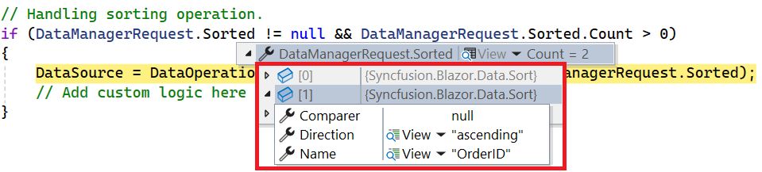
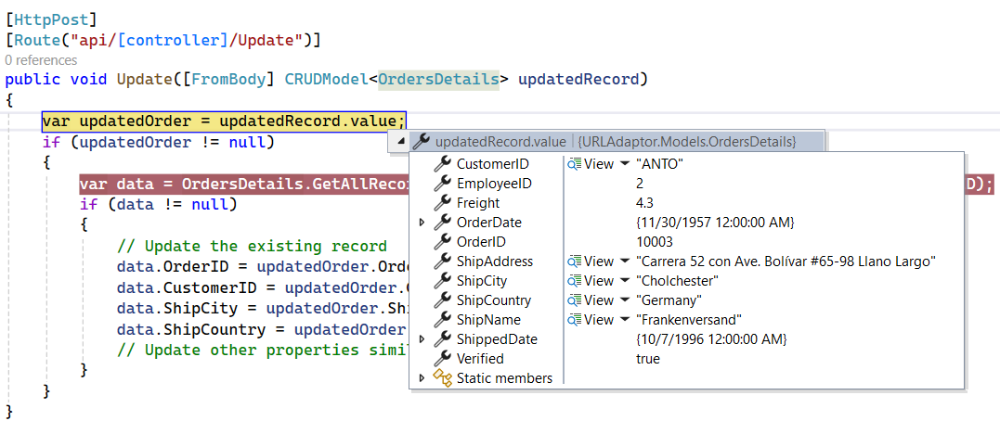
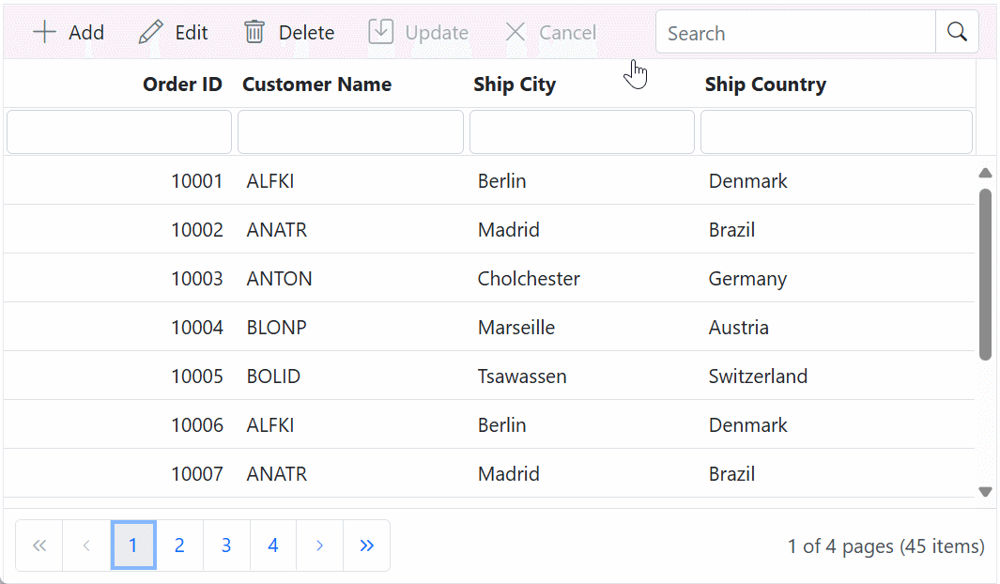

# Remote Data Binding with UrlAdaptor in Syncfusion Blazor DataGrid

The Syncfusion<sup style="font-size:70%">&reg;</sup> Blazor DataGrid uses the [UrlAdaptor](https://blazor.syncfusion.com/documentation/data/adaptors#url-adaptor) to establish communication with REST-based API endpoints for remote data binding.

The `UrlAdaptor` is the base adaptor for enabling communication between remote data services and UI components in Syncfusion<sup style="font-size:70%">&reg;</sup> Blazor DataGrid. This adaptor supports seamless data binding and interaction with custom API services or any remote service through URLs. The `UrlAdaptor` is especially useful when a custom API service is used to handle data and CRUD operations, allowing for custom logic on the server side. The data must be returned in the `result` and `count` format for display in the DataGrid.

The section outlines the configuration workflow for data binding, processing server‑side data operations, and performing CRUD actions using `UrlAdaptor`.

## Why choose UrlAdaptor for remote data binding?

The UrlAdaptor enables the Syncfusion<sup style="font-size:70%">&reg;</sup> Blazor DataGrid to retrieve data from custom API endpoints without relying on OData-specific conventions. It supports flexible interaction with any REST-based service capable of returning data in the expected `result` and `count` structure. The adaptor ensures that every data operation performed in the DataGrid generates a consistent and predictable request payload, allowing the server to determine how data should be processed. This makes the `UrlAdaptor` suitable for applications that require centralized, secure, and scalable server-side logic.

**Key advantages**

* **Performance**: Processes data in smaller segments, such as one page per request, allowing smooth rendering even when working with large collections.

* **Customization**: Serves as the underlying adaptor used by Syncfusion<sup style="font-size:70%">&reg;</sup> data connectors. Custom request headers, authentication mechanisms, or transformation logic can be implemented in the API layer without modifying the adaptor.

* **Scalability**: Well‑suited for enterprise applications that require secure and centralized server‑side execution of operations such as **sorting**, **filtering**, **searching**, and **paging**.

* **Built‑in data operation support**: Automatically generates structured parameters for all DataGrid operations, enabling the server to receive consistent inputs for actions such as **sorting**, **filtering**, **searching**, and **paging**. These parameters are delivered through the [DataManagerRequest](https://help.syncfusion.com/cr/blazor/Syncfusion.Blazor.DataManagerRequest.html) model, removing the need for manual query construction. After the server processes these inputs and returns the required JSON structure, the DataGrid binds directly to the resulting collection.

## Who should use UrlAdaptor?

The `UrlAdaptor` is suitable for applications where data operations must be executed on the server instead of the client. It supports systems designed with centralized business logic, distributed data sources, or large datasets that require efficient server-side computation. Applications relying on **REST-based endpoints** or custom services that expose data through HTTP interfaces benefit from the structured request and response patterns used by the `UrlAdaptor`.

**Intended audience**

* Frontend scenarios that require consistent communication between the Syncfusion<sup style="font-size:70%">&reg;</sup> Blazor DataGrid and REST API endpoints.
* Full-stack solutions where the server processes `DataManagerRequest` parameters to apply filtering, sorting, paging, searching, or grouping.
* Enterprise architectures that prioritize scalability, security, and centralized data processing.
* Applications backed by remote services returning collections in the `result` and `count` structure.

## Supporting Database List

The Syncfusion<sup style="font-size:70%">&reg;</sup> Blazor DataGrid integrates with any database exposed through a REST‑based API when configured with the `UrlAdaptor`. The adaptor is backend‑agnostic and operates with services that return data in a JSON structure containing `result` and `count`. The DataGrid communicates exclusively with the API layer, enabling consistent integration with a wide range of data platforms.

Supported database environments include:

* **Microsoft SQL Server**: A relational database engine designed for enterprise workloads and complex querying requirements.
* **MySQL**: An open‑source relational database suited for scalable and high‑performance applications.
* **PostgreSQL**: An advanced relational database offering extensibility, advanced indexing capabilities, and robust query support.
* **SQLite**: A lightweight, file‑based database appropriate for embedded systems or small‑scale data storage.
* **Dapper with SQL databases**: A .NET micro‑ORM that provides high‑performance data access patterns for relational databases.
* **Any EF Core–supported database**: Includes SQL Server, MySQL, PostgreSQL, Oracle, SQLite, Cosmos DB, or any provider supported by Entity Framework Core, provided the API returns data in the required JSON structure.

A RESTful API endpoint is required to receive `DataManagerRequest` parameters, process server‑side operations, and return a JSON response containing both the processed collection in `result` and the total count in `count`.

## Setting up the API service for UrlAdaptor

The Syncfusion<sup style="font-size:70%">&reg;</sup> Blazor DataGrid can be configured to interact with a server‑side API using the `UrlAdaptor`. The following steps outline how to create an API service for data binding, data processing, and CRUD operations.

### Expected JSON response structure for UrlAdaptor APIs

The API must return JSON data in a specific structure:

* **result** — A collection representing the processed records for the current request.
* **count** — The total number of records in the underlying data source, required for paging calculations.

A valid JSON response is:

```json
{
  "result": [
    { "OrderID": 10001, "CustomerID": "ALFKI" },
    { "OrderID": 10002, "CustomerID": "ANATR" }
  ],
  "count": 45
}
```
> If the API does not return both the `result` and `count` properties, the Syncfusion<sup style="font-size:70%">&reg;</sup> Blazor DataGrid cannot retrieve or render data when operating with the UrlAdaptor. The `result` property must contain the processed collection generated after applying all server‑side operations. The `count` property must contain the total number of available items in the underlying data source prior to paging.

### Step 1: Create a Blazor web app

A **Blazor Web App** is required to host the API service that exposes the OData V4 endpoint for communication with the Syncfusion<sup style="font-size:70%">&reg;</sup> Blazor DataGrid. The application can be created using **Visual Studio 2026** with the [Microsoft Blazor templates](https://learn.microsoft.com/en-us/aspnet/core/blazor/tooling?view=aspnetcore-10.0&pivots=vs) or the [Syncfusion<sup style="font-size:70%">&reg;</sup> Blazor Extension](https://blazor.syncfusion.com/documentation/visual-studio-integration/template-studio).

**Steps to create the Blazor Web App**

1. Open **Visual Studio 2026**.
2. Select **Create a new project**.
3. Choose the **Blazor Web App** template.
4. Enter the project name as **ODataV4Adaptor**.
5. Choose a project location.
6. Select the appropriate .NET runtime version.
7. Configure the [interactive render mode](https://learn.microsoft.com/en-us/aspnet/core/blazor/components/render-modes?view=aspnetcore-10.0#render-modes) based on project requirements.
8. Set the [interactivity location](https://learn.microsoft.com/en-us/aspnet/core/blazor/tooling?view=aspnetcore-10.0&pivots=vs) to **Per page/component** or **Global**.
9. Create the project.

For more guidance, refer to the [Microsoft documentation](https://learn.microsoft.com/en-us/aspnet/core/blazor/tooling?view=aspnetcore-10.0&pivots=vs).

### Step 2: Create a model class

Add a **Models** folder in the server‑side project and create a class named **OrderDetails.cs**.

This class defines the order data structure used by the API service when processing remote data operations through the `UrlAdaptor`.




namespace URLAdaptor.Models
{
    /// <summary>
    /// Represents an order record used by URL adaptor samples.
    /// </summary>
    public sealed class OrderDetails
    {
        /// <summary>
        /// In-memory backing store for demonstration data.
        /// </summary>
        private static readonly List<OrderDetails> Data = new();

        /// <summary>
        /// Initializes a new instance of the <see cref="OrderDetails"/> class.
        /// </summary>
        public OrderDetails()
        {
        }

        /// <summary>
        /// Initializes a new instance of the <see cref="OrderDetails"/> class with values.
        /// </summary>
        /// <param name="orderId">Order identifier.</param>
        /// <param name="customerId">Customer identifier.</param>
        /// <param name="employeeId">Employee identifier.</param>
        /// <param name="freight">Freight charge.</param>
        /// <param name="verified">Verification flag.</param>
        /// <param name="orderDate">Order date.</param>
        /// <param name="shipCity">Ship-to city.</param>
        /// <param name="shipName">Ship-to name.</param>
        /// <param name="shipCountry">Ship-to country.</param>
        /// <param name="shippedDate">Shipped date.</param>
        /// <param name="shipAddress">Ship-to address.</param>
        public OrderDetails(
            int orderId,
            string customerId,
            int employeeId,
            double freight,
            bool verified,
            DateTime orderDate,
            string shipCity,
            string shipName,
            string shipCountry,
            DateTime shippedDate,
            string shipAddress)
        {
            OrderId = orderId;
            CustomerId = customerId;
            EmployeeId = employeeId;
            Freight = freight;
            Verified = verified;
            OrderDate = orderDate;
            ShipCity = shipCity;
            ShipName = shipName;
            ShipCountry = shipCountry;
            ShippedDate = shippedDate;
            ShipAddress = shipAddress;
        }

        /// <summary>
        /// Returns the in-memory collection of orders.
        /// Seeding is performed on first access.
        /// </summary>
        /// <remarks>
        /// Intended for demonstration purposes. Replace with a persistent data source for production scenarios.
        /// </remarks>
        /// <returns>A list of <see cref="OrderDetails"/> instances.</returns>
        public static List<OrderDetails> GetAllRecords()
        {
            if (Data.Count == 0)
            {
                int code = 10000;

                for (int i = 1; i < 10; i++)
                {
                    Data.Add(new OrderDetails(
                        code + 1, "ALFKI", i + 0, 2.3 * i, false,
                        new DateTime(1991, 5, 15), "Berlin", "Simons bistro", "Denmark",
                        new DateTime(1996, 7, 16), "Kirchgasse 6"));

                    Data.Add(new OrderDetails(
                        code + 2, "ANATR", i + 2, 3.3 * i, true,
                        new DateTime(1990, 4, 4), "Madrid", "Queen Cozinha", "Brazil",
                        new DateTime(1996, 9, 11), "Avda. Azteca 123"));

                    Data.Add(new OrderDetails(
                        code + 3, "ANTON", i + 1, 4.3 * i, true,
                        new DateTime(1957, 11, 30), "Colchester", "Frankenversand", "Germany",
                        new DateTime(1996, 10, 7), "Carrera 52 con Ave. Bolívar #65-98 Llano Largo"));

                    Data.Add(new OrderDetails(
                        code + 4, "BLONP", i + 3, 5.3 * i, false,
                        new DateTime(1930, 10, 22), "Marseille", "Ernst Handel", "Austria",
                        new DateTime(1996, 12, 30), "Magazinweg 7"));

                    Data.Add(new OrderDetails(
                        code + 5, "BOLID", i + 4, 6.3 * i, true,
                        new DateTime(1953, 2, 18), "Tsawassen", "Hanari Carnes", "Switzerland",
                        new DateTime(1997, 12, 3), "1029 - 12th Ave. S."));

                    code += 5;
                }
            }

            return Data;
        }

        /// <summary>Gets or sets the order identifier.</summary>
        public int? OrderId { get; set; }

        /// <summary>Gets or sets the customer identifier.</summary>
        public string? CustomerId { get; set; }

        /// <summary>Gets or sets the employee identifier.</summary>
        public int? EmployeeId { get; set; }

        /// <summary>Gets or sets the freight charge.</summary>
        public double? Freight { get; set; }

        /// <summary>Gets or sets a value indicating whether the order is verified.</summary>
        public bool? Verified { get; set; }

        /// <summary>Gets or sets the order date.</summary>
        public DateTime OrderDate { get; set; }

        /// <summary>Gets or sets the ship-to city.</summary>
        public string? ShipCity { get; set; }

        /// <summary>Gets or sets the ship-to name.</summary>
        public string? ShipName { get; set; }

        /// <summary>Gets or sets the ship-to country.</summary>
        public string? ShipCountry { get; set; }

        /// <summary>Gets or sets the shipped date.</summary>
        public DateTime ShippedDate { get; set; }

        /// <summary>Gets or sets the ship-to address.</summary>
        public string? ShipAddress { get; set; }
    }
}

 


### Step 3: Create an API controller

Create a controller named **GridController.cs** in the **Controllers** folder.

The controller must:

* Return the collection through the **GET** endpoint.
* Process `DataManagerRequest` parameters through the **POST** endpoint.
* Apply server‑side **sorting**, **filtering**, **searching**, and **paging** using `DataOperations`.
* Return data in the { `result`, `count` } format.




using Microsoft.AspNetCore.Mvc;
using Syncfusion.Blazor;
using Syncfusion.Blazor.Data;
using System.Linq;
using System.Text.Json.Serialization;
using URLAdaptor.Models;;

namespace URLAdaptor.Controllers
{
    [ApiController]
    [Route("api/[controller]")]
    public class GridController : ControllerBase
    {
        /// <summary>
        /// Retrieves the list of orders.
        /// </summary>
        /// <returns>The complete set of order records.</returns>
        [HttpGet]
        public List<OrderDetails> Get()
        {
            return OrderDetails.GetAllRecords().ToList();
        }

        /// <summary>
        /// Handles server-side data operations such as filtering, sorting, and paging,
        /// and returns the processed data with total count.
        /// </summary>
        /// <returns>An object containing the data set (<c>result</c>) and total record count (<c>count</c>).</returns>
        [HttpPost]
        public IActionResult Post()
        {
            // Retrieve data source and convert to queryable.
            IQueryable<OrderDetails> dataSource = OrderDetails.GetAllRecords().AsQueryable();

            // Get total records count.
            int totalRecordsCount = dataSource.Count();

            // Return data and count. Keys are intentionally lowercase for DataManager compatibility.
            return Ok(new { result = dataSource, count = totalRecordsCount });
        }
    }
}
 


> The **Syncfusion.Blazor.Data** package must be added to the API project to support the `DataOperations` and `DataManagerRequest` processing used by the controller.

### Step 4:. Register controllers in `Program.cs`**

Register controller services and map controller endpoints to enable routing for API actions:

```csharp
// Register controllers in the service container.
builder.Services.AddControllers();

// Map controller routes.
app.MapControllers();
```

This configuration ensures all API endpoints exposed by **GridController** are available for remote data binding with the `UrlAdaptor`.

### Step 5: Run the application**

1. Run the project (<kbd>F5</kbd> or <kbd>Ctrl+F5</kbd>).
2. Navigate to **https://localhost:<port>/api/grid** (replace <port> with the assigned port).

The endpoint must return a JSON response in the required structure:


## Integrating UrlAdaptor with Syncfusion<sup style="font-size:70%">&reg;</sup> Blazor DataGrid

The Syncfusion<sup style="font-size:70%">&reg;</sup> Blazor DataGrid can be integrated with a server‑side API by configuring [DataManager](https://help.syncfusion.com/cr/blazor/Syncfusion.Blazor.DataManager.html) with a remote endpoint and the `UrlAdaptor`. This configuration enables the DataGrid to retrieve data, perform server‑side operations, and process CRUD actions through API responses structured in the { `result`, `count` } format.

### Step 1: Install Syncfusion<sup style="font-size:70%">&reg;</sup> Packages

The Syncfusion<sup style="font-size:70%">&reg;</sup> Blazor DataGrid requires the Syncfusion<sup style="font-size:70%">&reg;</sup> Blazor component packages to be installed in the project.

**Method 1: Using Package Manager Console**

1. Navigate to **Tools → NuGet Package Manager → Package Manager Console**.
2. Run the following commands:

```powershell
Install-Package Syncfusion.Blazor.Grid -Version {{ site.releaseversion }};
Install-Package Syncfusion.Blazor.Themes -Version {{ site.releaseversion }}
```

**Method 2: Using NuGet Package Manager UI**

1. Navigate to **Tools → NuGet Package Manager → Manage NuGet Packages for Solution**.
2. Search for and install the following packages individually:

    - [Syncfusion.Blazor.Grid](https://www.nuget.org/packages/Syncfusion.Blazor.Grid/)
    - [Syncfusion.Blazor.Themes](https://www.nuget.org/packages/Syncfusion.Blazor.Themes/)

For projects using **WebAssembly** or **Auto** interactive render modes, ensure these packages are installed in the **Client** project.

> Syncfusion<sup style="font-size:70%">&reg;</sup> Blazor components are available on [nuget.org](https://www.nuget.org/packages?q=syncfusion.blazor). For a complete list of packages, refer to [NuGet packages](https://blazor.syncfusion.com/documentation/nuget-packages).

### Step 2: Register Syncfusion<sup style="font-size:70%">&reg;</sup> Blazor service

The Syncfusion<sup style="font-size:70%">&reg;</sup> Blazor service must be registered to enable component rendering within the application.

Add the required namespaces in the **_Imports.razor** file:

```cs
@using Syncfusion.Blazor
@using Syncfusion.Blazor.Grids
@using Syncfusion.Blazor.Data
```

Register the Syncfusion<sup style="font-size:70%">&reg;</sup> Blazor service in **Program.cs**:

```csharp
using Syncfusion.Blazor;

builder.Services.AddSyncfusionBlazor();
```

> For Blazor Web Apps configured with **WebAssembly** or **Auto** interactive render modes, the Syncfusion<sup style="font-size:70%">&reg;</sup> Blazor service must be registered in both the **Client** and **Server** projects.

### Step 3: Add stylesheet and script resources

Add the required theme stylesheet and script references in **~/Components/App.razor**.

```html
<head>
    <link href="_content/Syncfusion.Blazor.Themes/bootstrap5.css" rel="stylesheet" />
</head>

<body>

    <script src="_content/Syncfusion.Blazor.Core/scripts/syncfusion-blazor.min.js" type="text/javascript"></script>
</body>
```

>* For this project, the **bootstrap5** theme is used. A different theme can be selected or the existing theme can be customized based on project requirements. Refer to the [Syncfusion Blazor Components Appearance](https://blazor.syncfusion.com/documentation/appearance/themes) documentation to learn more about theming and customization options.
>* For script reference options, see [Adding Script References](https://blazor.syncfusion.com/documentation/common/adding-script-references) documentation.

### Step 4: Add Blazor DataGrid and configure with server

The Syncfusion<sup style="font-size:70%">&reg;</sup> Blazor DataGrid establishes remote data communication through the [DataManager](https://help.syncfusion.com/cr/blazor/Syncfusion.Blazor.DataManager.html) component. The endpoint defined in the [Url](https://help.syncfusion.com/cr/blazor/Syncfusion.Blazor.DataManager.html#Syncfusion_Blazor_DataManager_Url) property serves as the API target, and assigning [UrlAdaptor](https://help.syncfusion.com/cr/blazor/Syncfusion.Blazor.Adaptors.html#Syncfusion_Blazor_Adaptors_UrlAdaptor) to the [Adaptor](https://help.syncfusion.com/cr/blazor/Syncfusion.Blazor.DataManager.html#Syncfusion_Blazor_DataManager_Adaptor) property enables server‑side data operations.




<SfGrid TValue="OrderDetails" Height="348">
    <SfDataManager Url="https://localhost:xxxx/api/grid"
                   Adaptor="Adaptors.UrlAdaptor">
    </SfDataManager>
    <GridColumns>
        <GridColumn Field="OrderId"
                    HeaderText="Order ID"
                    Width="100"
                    TextAlign="TextAlign.Right">
        </GridColumn>
        <GridColumn Field="CustomerId"
                    HeaderText="Customer Name"
                    Width="100">
        </GridColumn>
        <GridColumn Field="ShipCity"
                    HeaderText="Ship City"
                    Width="100">
        </GridColumn>
        <GridColumn Field="ShipCountry"
                    HeaderText="Ship Country"
                    Width="120">
        </GridColumn>
    </GridColumns>
</SfGrid>



### Step 5: Run the application

Run the application and verify that the DataGrid displays data retrieved from the API.


## Perform data operations in UrlAdaptor

The Syncfusion<sup style="font-size:70%">&reg;</sup> Blazor DataGrid supports server‑side operations such as **searching**, **sorting**, **filtering**, **aggregating**, and **paging**. These operations are executed on the server through structured requests sent using the [DataManagerRequest](https://help.syncfusion.com/cr/blazor/Syncfusion.Blazor.DataManagerRequest.html) object. The server applies the requested operations using built‑in methods from the [DataOperations](https://help.syncfusion.com/cr/blazor/Syncfusion.Blazor.DataOperations.html) class in the **Syncfusion.Blazor.Data** package and returns a JSON response containing a processed collection in `result` and the total record count in `count`.


| Operation | Method | Use Case |
|----------|--------|----------|
| Searching | [PerformSearching](https://help.syncfusion.com/cr/blazor/Syncfusion.Blazor.DataOperations.html#Syncfusion_Blazor_DataOperations_PerformSearching__1_System_Linq_IQueryable___0__System_Collections_Generic_List_Syncfusion_Blazor_Data_SearchFilter__) | Applies search criteria from the request to the data source for server‑side searching. |
| Filtering | [PerformFiltering](https://help.syncfusion.com/cr/blazor/Syncfusion.Blazor.DataOperations.html#Syncfusion_Blazor_DataOperations_PerformFiltering__1_System_Linq_IQueryable___0__System_Collections_Generic_List_Syncfusion_Blazor_Data_WhereFilter__System_String_) | Filters the data source using conditions specified in the request, supporting both single‑column and multi‑column filtering. |
| Sorting | [PerformSorting](https://help.syncfusion.com/cr/blazor/Syncfusion.Blazor.DataOperations.html#Syncfusion_Blazor_DataOperations_PerformSorting__1_System_Linq_IQueryable___0__System_Collections_Generic_List_Syncfusion_Blazor_Data_Sort__) | Sorts the data source using one or more sort descriptors in ascending or descending order. |
| Grouping | [PerformGrouping](https://help.syncfusion.com/cr/blazor/Syncfusion.Blazor.DataOperations.html#Syncfusion_Blazor_DataOperations_PerformGrouping__1_System_Linq_IQueryable___0__System_Collections_Generic_List_System_String__) | Groups the data source based on the specified field. |
| Paging | [PerformSkip](https://help.syncfusion.com/cr/blazor/Syncfusion.Blazor.DataOperations.html#Syncfusion_Blazor_DataOperations_PerformSkip__1_System_Linq_IQueryable___0__System_Int32_), [PerformTake](https://help.syncfusion.com/cr/blazor/Syncfusion.Blazor.DataOperations.html#Syncfusion_Blazor_DataOperations_PerformTake__1_System_Linq_IQueryable___0__System_Int32_) | Retrieves a specified number of items and skips items based on the request to return only the required page of data. |

### Searching

To enable server‑side searching with the `UrlAdaptor`, apply search criteria from the [DataManagerRequest.Search ](https://help.syncfusion.com/cr/blazor/Syncfusion.Blazor.DataManagerRequest.html#Syncfusion_Blazor_DataManagerRequest_Search)collection using the [PerformSearching](https://help.syncfusion.com/cr/blazor/Syncfusion.Blazor.DataOperations.html#Syncfusion_Blazor_DataOperations_PerformSearching__1_System_Collections_Generic_IEnumerable___0__System_Collections_Generic_List_Syncfusion_Blazor_Data_SearchFilter__) method. This method processes each search descriptor and updates the data based on the configured search fields and operators.





/// <summary>
/// Handles server-side searching and returns the processed data set with total count.
/// </summary>
/// <param name="request">The DataManager request containing search descriptors.</param>
/// <returns>
/// An HTTP 200 response with a JSON payload containing the processed collection in
/// <c>result</c> and the total count in <c>count</c>.
/// </returns>
[HttpPost]
public IActionResult Post([FromBody] DataManagerRequest request)
{
    IQueryable<OrderDetails> dataSource = OrderDetails.GetAllRecords().AsQueryable();

    // Searching
    if (request?.Search != null && request.Search.Count > 0)
    {
        dataSource = DataOperations.PerformSearching(dataSource, request.Search).AsQueryable();
        // Place custom searching logic here if required, instead of PerformSearching
    }

    // Get total records count.
    int totalRecordsCount = dataSource.Count();

    // Return data and count.
    return Ok(new { result = dataSource, count = totalRecordsCount });
}




@using URLAdaptor.Models
<SfGrid TValue="OrderDetails"
        Toolbar="@(new List<string> { "Search" })"
        Height="348">
    <SfDataManager Url="https://localhost:xxxx/api/grid"
                   Adaptor="Adaptors.UrlAdaptor">
    </SfDataManager>
    <GridColumns>
        <GridColumn Field="OrderId"
                    HeaderText="Order ID"
                    Width="100"
                    TextAlign="TextAlign.Right">
        </GridColumn>
        <GridColumn Field="CustomerId"
                    HeaderText="Customer Name"
                    Width="100">
        </GridColumn>
        <GridColumn Field="ShipCity"
                    HeaderText="Ship City"
                    Width="100">
        </GridColumn>
        <GridColumn Field="ShipCountry"
                    HeaderText="Ship Country"
                    Width="120">
        </GridColumn>
    </GridColumns>
</SfGrid>

 


### Filtering

To enable server‑side filtering with the `UrlAdaptor`, apply filter conditions from the [DataManagerRequest.Where](https://help.syncfusion.com/cr/blazor/Syncfusion.Blazor.DataManagerRequest.html#Syncfusion_Blazor_DataManagerRequest_Where) collection by using the [PerformFiltering](https://help.syncfusion.com/cr/blazor/Syncfusion.Blazor.DataOperations.html#Syncfusion_Blazor_DataOperations_PerformFiltering__1_System_Linq_IQueryable___0__System_Collections_Generic_List_Syncfusion_Blazor_Data_WhereFilter__System_String_) method. This method evaluates each predicate and updates the data based on the requested single‑column or multi‑column filtering.

**Single column filtering**


**Multi column filtering**





/// <summary>
/// Handles server-side filtering and returns the processed data.
/// </summary>
/// <param name="request">Request containing filter predicates.</param>
/// <returns>JSON result with the processed collection in 'result' and the total count in 'count'.</returns>

[HttpPost]
public IActionResult Post([FromBody] DataManagerRequest request)
{
    IQueryable<OrderDetails> dataSource = OrderDetails.GetAllRecords().AsQueryable();

    // Filtering
    if (request.Where != null && request.Where.Count > 0)
    {
        foreach (var where in request.Where)
        {
            foreach (var predicate in where.predicates)
            {
                dataSource = DataOperations.PerformFiltering(dataSource, request.Where, predicate.Operator);
                // Place custom filtering logic here if required, instead of PerformFiltering.
            }
        }
    }
    // Get total records count.
    int totalRecordsCount = dataSource.Count();
            
    // Return data and count.
    return Ok(new { result = dataSource, count = totalRecordsCount });
}



@using Syncfusion.Blazor.Grids
@using Syncfusion.Blazor.Data
@using URLAdaptor.Models

<SfGrid TValue="OrderDetails" AllowFiltering="true" Height="348">
    <SfDataManager Url="https://localhost:xxxx/api/grid"
                   Adaptor="Adaptors.UrlAdaptor">
    </SfDataManager>
    <GridColumns>
        <GridColumn Field="OrderId"
                    HeaderText="Order ID"
                    Width="100"
                    TextAlign="TextAlign.Right">
        </GridColumn>
        <GridColumn Field="CustomerId"
                    HeaderText="Customer Name"
                    Width="100">
        </GridColumn>
        <GridColumn Field="ShipCity"
                    HeaderText="Ship City"
                    Width="100">
        </GridColumn>
        <GridColumn Field="ShipCountry"
                    HeaderText="Ship Country"
                    Width="120">
        </GridColumn>
    </GridColumns>
</SfGrid>
 


### Sorting

To enable server‑side sorting with the `UrlAdaptor`, apply sort descriptors from the [DataManagerRequest.Sorted](https://help.syncfusion.com/cr/blazor/Syncfusion.Blazor.DataManagerRequest.html#Syncfusion_Blazor_DataManagerRequest_Sorted) collection using the [PerformSorting](https://help.syncfusion.com/cr/blazor/Syncfusion.Blazor.DataOperations.html#Syncfusion_Blazor_DataOperations_PerformSorting__1_System_Collections_Generic_IEnumerable___0__System_Collections_Generic_List_Syncfusion_Blazor_Data_SortedColumn__) method. This method processes each sort instruction and updates the data according to the specified field and sort direction.

**Single column sorting**


**Multi column sorting**





/// <summary>
/// Handles server-side sorting and returns the processed data.
/// </summary>
/// <param name="request">Request containing sort descriptors.</param>
/// <returns>JSON result with the processed collection in 'result' and the total count in 'count'.</returns>
[HttpPost]
public IActionResult Post([FromBody] DataManagerRequest request)
{
    IQueryable<OrderDetails> dataSource = OrderDetails.GetAllRecords().AsQueryable();

    // Sorting
    if (request?.Sorted != null && request.Sorted.Count > 0)
    {
        dataSource = DataOperations.PerformSorting(dataSource, request.Sorted);
        // Place custom sorting logic here if required, instead of PerformSorting.
    }

    // Get total records count.
    int totalRecordsCount = dataSource.Count();

    // Return data and count.
    return Ok(new { result = dataSource, count = totalRecordsCount });
}





<SfGrid TValue="OrderDetails" AllowSorting="true" Height="348">
    <SfDataManager Url="https://localhost:xxxx/api/grid"
                   Adaptor="Adaptors.UrlAdaptor">
    </SfDataManager>
    <GridColumns>
        <GridColumn Field="OrderId"
                    HeaderText="Order ID"
                    Width="100"
                    TextAlign="TextAlign.Right">
        </GridColumn>
        <GridColumn Field="CustomerId"
                    HeaderText="Customer Name"
                    Width="150">
        </GridColumn>
        <GridColumn Field="ShipCity"
                    HeaderText="Ship City"
                    Width="120">
        </GridColumn>
        <GridColumn Field="ShipCountry"
                    HeaderText="Ship Country"
                    Width="140">
        </GridColumn>
    </GridColumns>
</SfGrid>

 


### Paging

To enable server‑side paging with the `UrlAdaptor`, apply pagination values from the [DataManagerRequest.Skip](https://help.syncfusion.com/cr/blazor/Syncfusion.Blazor.DataManagerRequest.html#Syncfusion_Blazor_DataManagerRequest_Skip) and [DataManagerRequest.Take](https://help.syncfusion.com/cr/blazor/Syncfusion.Blazor.DataManagerRequest.html#Syncfusion_Blazor_DataManagerRequest_Take) properties using the [PerformSkip](https://help.syncfusion.com/cr/blazor/Syncfusion.Blazor.DataOperations.html#Syncfusion_Blazor_DataOperations_PerformSkip__1_System_Linq_IQueryable___0__System_Int32_) and [PerformTake](https://help.syncfusion.com/cr/blazor/Syncfusion.Blazor.DataOperations.html#Syncfusion_Blazor_DataOperations_PerformTake__1_System_Linq_IQueryable___0__System_Int32_) methods. These methods adjust the data based on the requested page while preserving the total record count for accurate paging.




/// <summary>
/// Handles server-side paging and returns the processed data.
/// </summary>
/// <param name="request">Request containing pagination values.</param>
/// <returns>JSON result with the processed collection in 'result' and the total count in 'count'.</returns>
[HttpPost]
public IActionResult Post([FromBody] DataManagerRequest request)
{
    IQueryable<OrderDetails> dataSource = OrderDetails.GetAllRecords().AsQueryable();

    // Total count before paging
    int totalRecordsCount = dataSource.Count();

    // Paging
    if (request?.Skip > 0)
    {
        dataSource = DataOperations.PerformSkip(dataSource, request.Skip);
        // Custom paging logic can be placed here if required.
    }

    if (request?.Take > 0)
    {
        dataSource = DataOperations.PerformTake(dataSource, request.Take);
        // Custom paging logic can be placed here if required.
    }
    
    // Return data and count.
    return Ok(new { result = dataSource, count = totalRecordsCount });
}





<SfGrid TValue="OrderDetails" AllowPaging="true" Height="348">
    <SfDataManager Url="https://localhost:xxxx/api/grid"
                   Adaptor="Adaptors.UrlAdaptor">
    </SfDataManager>
    <GridColumns>
        <GridColumn Field="OrderId"
                    HeaderText="Order ID"
                    Width="100"
                    TextAlign="TextAlign.Right">
        </GridColumn>
        <GridColumn Field="CustomerId"
                    HeaderText="Customer Name"
                    Width="100">
        </GridColumn>
        <GridColumn Field="ShipCity"
                    HeaderText="Ship City"
                    Width="100">
        </GridColumn>
        <GridColumn Field="ShipCountry"
                    HeaderText="Ship Country"
                    Width="120">
        </GridColumn>
    </GridColumns>
</SfGrid>




N> In URLAdaptor, the DataGrid component handles **grouping** and **aggregation** operations automatically. Customizable operations such as **searching**, **filtering**, **sorting**, and **paging** can be modified within the controller logic, but **grouping** and **aggregation** are managed directly by the DataGrid component.

## Perform CRUD operations in UrlAdaptor

The Syncfusion<sup style="font-size:70%">&reg;</sup> Blazor DataGrid supports **Create**, **Read**, **Update**, and **Delete** (CRUD) operations through the [DataManager](https://help.syncfusion.com/cr/blazor/Syncfusion.Blazor.Data.SfDataManager.html) component. **CRUD** actions are processed on the server using the payload provided through the **CrudModel<T>** structure, and each action modifies the underlying data based on the request details.

**CRUD Mapping Properties**

| Property   | Purpose | Description |
|------------|---------|-------------|
| [InsertUrl](https://help.syncfusion.com/cr/blazor/Syncfusion.Blazor.DataManager.html#Syncfusion_Blazor_DataManager_InsertUrl)  | Insert operation | Defines the endpoint used to add new data. |
| [UpdateUrl](https://help.syncfusion.com/cr/blazor/Syncfusion.Blazor.DataManager.html#Syncfusion_Blazor_DataManager_UpdateUrl)  | Update operation | Defines the endpoint used to update existing data. |
| [RemoveUrl](https://help.syncfusion.com/cr/blazor/Syncfusion.Blazor.DataManager.html#Syncfusion_Blazor_DataManager_RemoveUrl)  | Delete operation | Defines the endpoint used to delete data. |
| [CrudUrl](https://help.syncfusion.com/cr/blazor/Syncfusion.Blazor.DataManager.html#Syncfusion_Blazor_DataManager_CrudUrl)    | Unified CRUD operation | Defines a single endpoint used to process insert, update, and delete operations. |
| [BatchUrl](https://help.syncfusion.com/cr/blazor/Syncfusion.Blazor.DataManager.html#Syncfusion_Blazor_DataManager_BatchUrl)   | Batch editing | Defines the endpoint used to process batch changes in one request. |

To enable editing in the DataGrid, configure the [GridEditSettings](https://help.syncfusion.com/cr/blazor/Syncfusion.Blazor.Grids.GridEditSettings.html) and [Toolbar](https://help.syncfusion.com/cr/blazor/Syncfusion.Blazor.Grids.SfGrid-1.html#Syncfusion_Blazor_Grids_SfGrid_1_Toolbar) properties to allow adding, editing, and deleting records. For configuration details, refer to the DataGrid [editing](https://blazor.syncfusion.com/documentation/datagrid/editing) documentation.

In this configuration, inline editing is enabled by setting the edit [Mode](https://help.syncfusion.com/cr/blazor/Syncfusion.Blazor.Grids.GridEditSettings.html#Syncfusion_Blazor_Grids_GridEditSettings_Mode) to [EditMode.Normal](https://help.syncfusion.com/cr/blazor/Syncfusion.Blazor.Grids.EditMode.html).




@using URLAdaptor.Models

<SfGrid TValue="OrderDetails"
        Toolbar="@(new List<string>() { "Add", "Edit", "Delete", "Update", "Cancel" })"
        Height="348">
    <SfDataManager Url="https://localhost:xxxx/api/grid"
                   InsertUrl="https://localhost:xxxx/api/grid/Insert"
                   UpdateUrl="https://localhost:xxxx/api/grid/Update"
                   RemoveUrl="https://localhost:xxxx/api/grid/Remove"
                   Adaptor="Adaptors.UrlAdaptor">
    </SfDataManager>
    <GridEditSettings AllowAdding="true"
                      AllowEditing="true"
                      AllowDeleting="true"
                      Mode="EditMode.Normal">
    </GridEditSettings>
    <GridColumns>
        <GridColumn Field="OrderId"
                    HeaderText="Order ID"
                    IsPrimaryKey="true"
                    Width="100"
                    TextAlign="TextAlign.Right">
        </GridColumn>
        <GridColumn Field="CustomerId"
                    HeaderText="Customer Name"
                    Width="100">
        </GridColumn>
        <GridColumn Field="ShipCity"
                    HeaderText="Ship City"
                    Width="100">
        </GridColumn>
        <GridColumn Field="ShipCountry"
                    HeaderText="Ship Country"
                    Width="120">
        </GridColumn>
    </GridColumns>
</SfGrid>




> Normal or Inline editing is the default edit `Mode` for the DataGrid. To enable CRUD operations, ensure the [IsPrimaryKey](https://help.syncfusion.com/cr/blazor/Syncfusion.Blazor.Grids.GridColumn.html#Syncfusion_Blazor_Grids_GridColumn_IsPrimaryKey) property is set to **true** for a unique column.

The **CrudModel<T>** class represents the data structure used during **CRUD** operations. It contains information about the requested action, key details, the affected record, and collections that hold newly added, updated, or removed entries.

```csharp
/// <summary>
/// Represents the data structure used during create, read, update, and delete (CRUD) operations.
/// Provides the action name, primary key details, single record data, and optional batch collections.
/// </summary>
/// <typeparam name="T">The entity type associated with the CRUD operation.</typeparam>
public class CrudModel<T> where T : class
{
    /// <summary>
    /// Specifies the CRUD action being performed, such as <c>insert</c>, <c>update</c>, or <c>remove</c>.
    /// </summary>
    [JsonPropertyName("action")]
    public string? Action { get; set; }

    /// <summary>
    /// Specifies the name of the primary key field used to identify the record.
    /// </summary>
    [JsonPropertyName("keyColumn")]
    public string? KeyColumn { get; set; }

    /// <summary>
    /// Holds the value of the primary key used to target a specific record.
    /// </summary>
    [JsonPropertyName("key")]
    public object? Key { get; set; }

    /// <summary>
    /// Contains the main record involved in the CRUD request when not using batch mode.
    /// </summary>
    [JsonPropertyName("value")]
    public T? Value { get; set; }

    /// <summary>
    /// Contains the collection of newly added records when processing batch insert operations.
    /// </summary>
    [JsonPropertyName("added")]
    public List<T>? Added { get; set; }

    /// <summary>
    /// Contains the collection of updated records when processing batch update operations.
    /// </summary>
    [JsonPropertyName("changed")]
    public List<T>? Changed { get; set; }

    /// <summary>
    /// Contains the collection of deleted records when processing batch delete operations.
    /// </summary>
    [JsonPropertyName("deleted")]
    public List<T>? Deleted { get; set; }

    /// <summary>
    /// Contains additional parameters supplied with the request.
    /// Useful for custom metadata or contextual values.
    /// </summary>
    [JsonPropertyName("params")]
    public IDictionary<string, object>? Parameters { get; set; }
}

```

### Insert operation

The Syncfusion<sup style="font-size:70%">&reg;</sup> Blazor DataGrid processes insert requests through the [InsertUrl](https://help.syncfusion.com/cr/blazor/Syncfusion.Blazor.DataManager.html#Syncfusion_Blazor_DataManager_InsertUrl) property in the `DataManager` configuration. The server receives the request payload in a **CrudModel<T>** instance, where the `Value` property contains the newly created record. The API endpoint mapped through `InsertUrl` adds this record to the target data collection.





/// <summary>
/// Inserts a new record into the in-memory collection.
/// </summary>
/// <param name="record">
/// Contains the entity to insert in the <c>Value</c> property.
/// </param>
/// <returns>
/// Returns the inserted entity when successful; returns HTTP 400 when the request payload is invalid.
/// </returns>
[HttpPost("Insert")]
public IActionResult Insert([FromBody] CrudModel<OrderDetails> record)
{
    if (record?.Value is null)
    {
        return BadRequest("A valid payload with a non-null value is required.");
    }

    var store = OrderDetails.GetAllRecords();
    store.Insert(0, record.Value);

    return Ok(record.Value);
}




### Update operation

The Syncfusion<sup style="font-size:70%">&reg;</sup> Blazor DataGrid processes update requests through the [UpdateUrl](https://help.syncfusion.com/cr/blazor/Syncfusion.Blazor.DataManager.html#Syncfusion_Blazor_DataManager_UpdateUrl)  property in the `DataManager` configuration. The server receives the request payload in a **CrudModel<T>** instance, where the `Value` property contains the modified record. The API endpoint mapped through `UpdateUrl` identifies the corresponding entry in the target data collection and applies the updated field values.






/// <summary>
/// Updates an existing record in the in-memory collection.
/// </summary>
/// <param name="record">
/// Wrapper containing the modified entity in the <c>Value</c> property.
/// </param>
/// <returns>
/// An HTTP 200 response with the updated entity when successful; HTTP 400/404 for invalid input or missing record.
/// </returns>
[HttpPost("Update")]
public IActionResult Update([FromBody] CrudModel<OrderDetails> record)
{
    var updated = record?.Value;
    if (updated is null)
    {
        return BadRequest("A valid payload with a non-null value is required.");
    }

    var list = OrderDetails.GetAllRecords();
    var target = list.FirstOrDefault(o => o.OrderId == updated.OrderId);
    if (target is null)
    {
        return NotFound($"OrderId {updated.OrderId} was not found.");
    }

    // Update fields as needed
    target.OrderId     = updated.OrderId;
    target.CustomerId  = updated.CustomerId;
    target.ShipCity    = updated.ShipCity;
    target.ShipCountry = updated.ShipCountry;

    return Ok(target);
}




### Delete operation

The Syncfusion<sup style="font-size:70%">&reg;</sup> Blazor DataGrid handles delete actions through the  [RemoveUrl](https://help.syncfusion.com/cr/blazor/Syncfusion.Blazor.DataManager.html#Syncfusion_Blazor_DataManager_RemoveUrl) property configured in the `DataManager`. The request payload is provided as a **CrudModel<T>** instance, where the `Key` property contains the primary key value of the record targeted for removal. The API endpoint mapped through `RemoveUrl` locates the corresponding entry in the data collection and removes it from the source.





/// <summary>
/// Removes an existing record from the in-memory collection based on the primary key.
/// </summary>
/// <param name="record">
/// Wrapper containing the primary key value in the <c>Key</c> property.
/// </param>
/// <returns>
/// Returns the removed entity when successful; returns HTTP 400/404 otherwise.
/// </returns>
[HttpPost("Remove")]
public IActionResult Remove([FromBody] CrudModel<OrderDetails> record)
{
    if (record?.Key is null)
    {
        return BadRequest("A valid key is required.");
    }

    if (!int.TryParse(record.Key.ToString(), out int orderId))
    {
        return BadRequest("The key must be a valid integer OrderId.");
    }

    var list = OrderDetails.GetAllRecords();
    var target = list.FirstOrDefault(o => o.OrderId == orderId);
    if (target is null)
    {
        return NotFound($"OrderId {orderId} was not found.");
    }

    list.Remove(target);
    return Ok(target);
}




### Single method for all CRUD operations

The Syncfusion<sup style="font-size:70%">&reg;</sup> Blazor DataGrid supports a unified CRUD workflow through the [CrudUrl](https://help.syncfusion.com/cr/blazor/Syncfusion.Blazor.DataManager.html#Syncfusion_Blazor_DataManager_CrudUrl) property. This configuration enables a single API endpoint to process **insert**, **update**, and **delete** actions based on the action field contained in the **CrudModel<T>** instance.

* When action is **insert**, the API adds the record provided in the `Value` property.
* When action is **update**, the API modifies the matching record in the data collection by applying the field values provided in the `Value` property.
* When action is **remove**, the API removes the record identified by the `Key` property.

This approach centralizes server‑side logic and simplifies request routing for **CRUD** operations.






/// <summary>
/// Executes insert, update, or remove operations based on the specified action.
/// </summary>
/// <param name="request">
/// Contains the CRUD action in <c>Action</c>, the record data in <c>Value</c>,
/// and the primary key in <c>Key</c>.
/// </param>
/// <returns>
/// Returns the created/updated entity or removed key when successful; returns HTTP 400/404 otherwise.
/// </returns>
[HttpPost("CrudUpdate")]
public IActionResult CrudUpdate([FromBody] CrudModel<OrderDetails> request)
{
    if (request is null || string.IsNullOrWhiteSpace(request.Action))
    {
        return BadRequest("A valid action and payload are required.");
    }

    // Normalize action for comparison
    var action = request.Action.Trim().ToLowerInvariant();
    var list = OrderDetails.GetAllRecords();

    switch (action)
    {
        case "insert":
            if (request.Value is null)
            {
                return BadRequest("Insert requires a non-null value.");
            }

            list.Insert(0, request.Value);
            return Ok(request.Value);

        case "update":
            if (request.Value is null)
            {
                return BadRequest("Update requires a non-null value.");
            }

            var updated = request.Value;
            var target = list.FirstOrDefault(o => o.OrderId == updated.OrderId);
            if (target is null)
            {
                return NotFound($"OrderId {updated.OrderId} was not found.");
            }

            // Update the fields being managed
            target.OrderId     = updated.OrderId;
            target.CustomerId  = updated.CustomerId;
            target.ShipCity    = updated.ShipCity;
            target.ShipCountry = updated.ShipCountry;

            return Ok(target);

        case "remove":
            if (request.Key is null)
            {
                return BadRequest("Remove requires a valid key.");
            }

            if (!int.TryParse(request.Key.ToString(), out int orderId))
            {
                return BadRequest("The key must be a valid integer OrderId.");
            }

            var toRemove = list.FirstOrDefault(o => o.OrderId == orderId);
            if (toRemove is null)
            {
                return NotFound($"OrderId {orderId} was not found.");
            }

            list.Remove(toRemove);
            return Ok(toRemove);

        default:
            return BadRequest($"Unsupported action '{request.Action}'. Expected 'insert', 'update', or 'remove'.");
    }
}




<SfGrid TValue="OrderDetails"
        Toolbar="@(new List<string>() { "Add", "Edit", "Delete", "Update", "Cancel" })"
        Height="348">
    <SfDataManager Url="https://localhost:xxxx/api/grid"
                   CrudUrl="https://localhost:xxxx/api/grid/CrudUpdate"
                   Adaptor="Adaptors.UrlAdaptor">
    </SfDataManager>
    <GridEditSettings AllowEditing="true"
                      AllowDeleting="true"
                      AllowAdding="true"
                      Mode="EditMode.Normal">
    </GridEditSettings>
    <GridColumns>
        <GridColumn Field="OrderId"
                    HeaderText="Order ID"
                    IsPrimaryKey="true"
                    Width="100"
                    TextAlign="TextAlign.Right">
        </GridColumn>
        <GridColumn Field="CustomerId"
                    HeaderText="Customer Name"
                    Width="100">
        </GridColumn>
        <GridColumn Field="ShipCity"
                    HeaderText="Ship City"
                    Width="100">
        </GridColumn>
        <GridColumn Field="ShipCountry"
                    HeaderText="Ship Country"
                    Width="120">
        </GridColumn>
    </GridColumns>
</SfGrid>



### Batch operation

The Syncfusion<sup style="font-size:70%">&reg;</sup> Blazor DataGrid supports batch editing through the [BatchUrl](https://help.syncfusion.com/cr/blazor/Syncfusion.Blazor.DataManager.html#Syncfusion_Blazor_DataManager_BatchUrl) property, enabling multiple inserts, updates, and deletions to be committed in a single request. When batch mode is enabled using the edit [Mode](https://help.syncfusion.com/cr/blazor/Syncfusion.Blazor.Grids.GridEditSettings.html#Syncfusion_Blazor_Grids_GridEditSettings_Mode) property set to [EditMode.Batch](https://help.syncfusion.com/cr/blazor/Syncfusion.Blazor.Grids.EditMode.html), all changes are stored locally until the update action is triggered.

The server receives a **CrudModel<T>** instance containing three optional collections:

* **Added** — records to be inserted
* **Changed** — records to be updated
* **Deleted** — records to be removed

The API endpoint mapped through `BatchUrl` processes these collections sequentially, updating the underlying data collection to reflect all modifications in a single operation.





/// <summary>
/// Applies batch insert, update, and delete operations in a single request.
/// </summary>
/// <param name="batchModel">
/// Contains the batch payload, including <c>Added</c>, <c>Changed</c>, and <c>Deleted</c> collections.
/// </param>
/// <returns>
/// Returns an HTTP 200 response containing the processed batch payload; returns HTTP 400 for invalid input.
/// </returns>
[HttpPost("BatchUpdate")]
public IActionResult BatchUpdate([FromBody] CrudModel<OrderDetails> batchModel)
{
    if (batchModel is null)
    {
        return BadRequest("A valid batch payload is required.");
    }

    var list = OrderDetails.GetAllRecords();

    // Insert
    if (batchModel.Added is { Count: > 0 })
    {
        foreach (var entity in batchModel.Added)
        {
            if (entity is null)
            {
                continue;
            }
            list.Insert(0, entity);
        }
    }

    // Update
    if (batchModel.Changed is { Count: > 0 })
    {
        foreach (var changed in batchModel.Changed)
        {
            if (changed is null)
            {
                continue;
            }

            var target = list.FirstOrDefault(o => o.OrderId == changed.OrderId);
            if (target is not null)
            {
                target.OrderId     = changed.OrderId;
                target.CustomerId  = changed.CustomerId;
                target.ShipCity    = changed.ShipCity;
                target.ShipCountry = changed.ShipCountry;
            }
            else
            {
                // Missing record entries are ignored.
                // Optional: capture missing identifiers if error reporting is required.
            }
        }
    }

    // Delete
    if (batchModel.Deleted is { Count: > 0 })
    {
        foreach (var deleted in batchModel.Deleted)
        {
            if (deleted is null)
            {
                continue;
            }

            var toRemove = list.FirstOrDefault(o => o.OrderId == deleted.OrderId);
            if (toRemove is not null)
            {
                list.Remove(toRemove);
            }
            else
            {
                // Missing record entries are ignored.
                // Optional: capture missing identifiers if error reporting is required.
            }
        }
    }

    return Ok(new
    {
        added   = batchModel.Added,
        changed = batchModel.Changed,
        deleted = batchModel.Deleted
    });
}




<SfGrid TValue="OrderDetails"
        Toolbar="@(new List<string>() { "Add", "Delete", "Update", "Cancel" })"
        Height="348">
    <SfDataManager Url="https://localhost:xxxx/api/grid"
                   BatchUrl="https://localhost:xxxx/api/grid/BatchUpdate"
                   Adaptor="Adaptors.UrlAdaptor">
    </SfDataManager>
    <GridEditSettings AllowEditing="true"
                      AllowDeleting="true"
                      AllowAdding="true"
                      Mode="EditMode.Batch">
    </GridEditSettings>
    <GridColumns>
        <GridColumn Field="OrderId"
                    HeaderText="Order ID"
                    IsPrimaryKey="true"
                    Width="100"
                    TextAlign="TextAlign.Right">
        </GridColumn>
        <GridColumn Field="CustomerId"
                    HeaderText="Customer Name"
                    Width="100">
        </GridColumn>
        <GridColumn Field="ShipCity"
                    HeaderText="Ship City"
                    Width="100">
        </GridColumn>
        <GridColumn Field="ShipCountry"
                    HeaderText="Ship Country"
                    Width="120">
        </GridColumn>
    </GridColumns>
</SfGrid>




## See also

A complete sample is available at this [GitHub location](https://github.com/SyncfusionExamples/Binding-data-from-remote-service-to-blazor-data-grid/tree/master/UrlAdaptor).