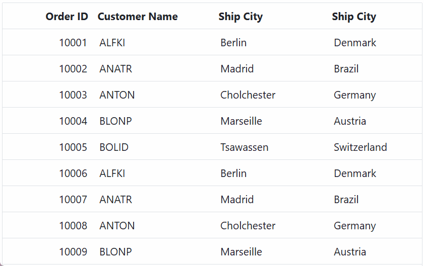
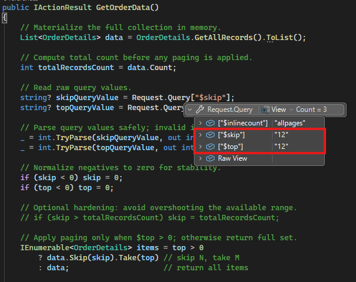
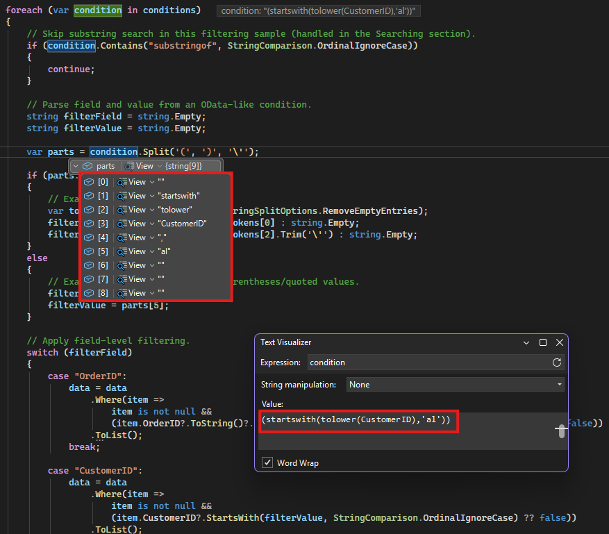
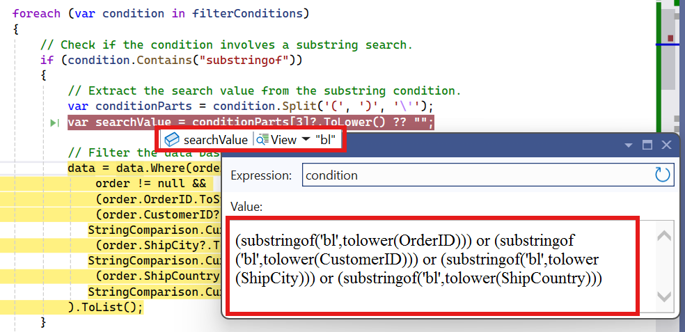
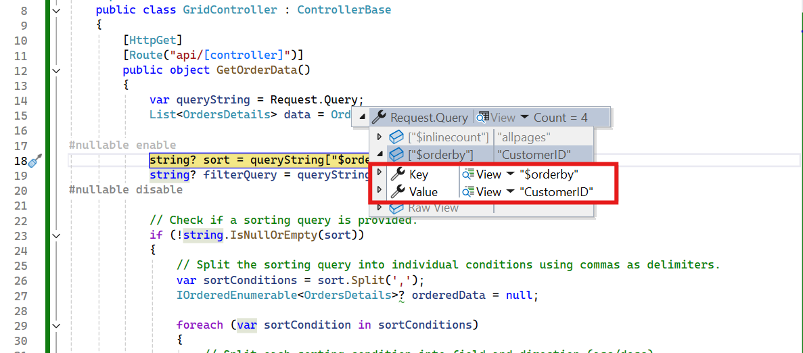
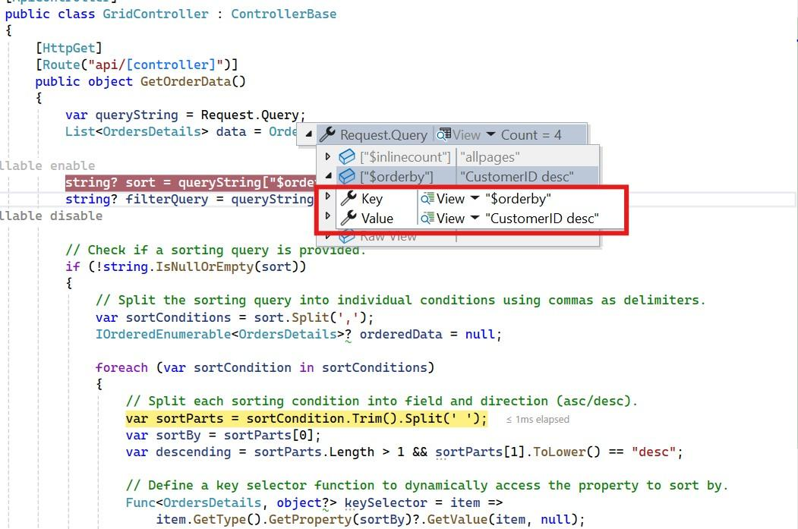
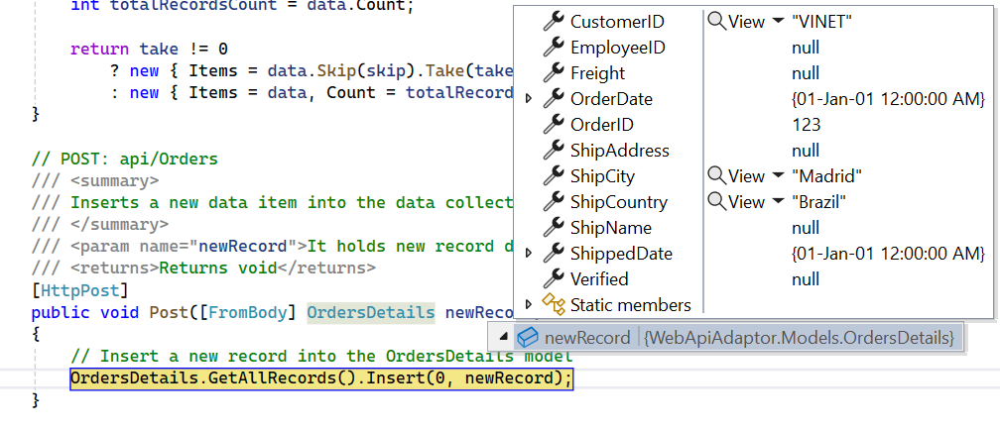
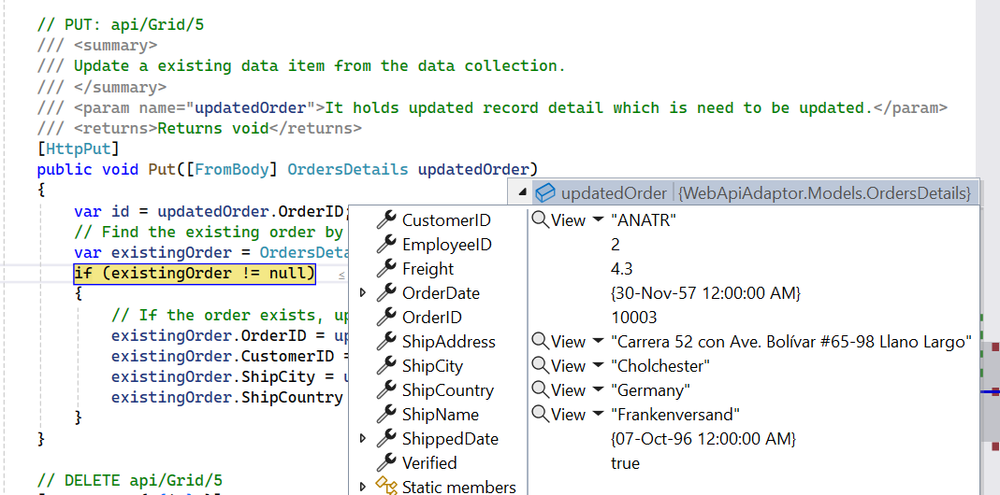
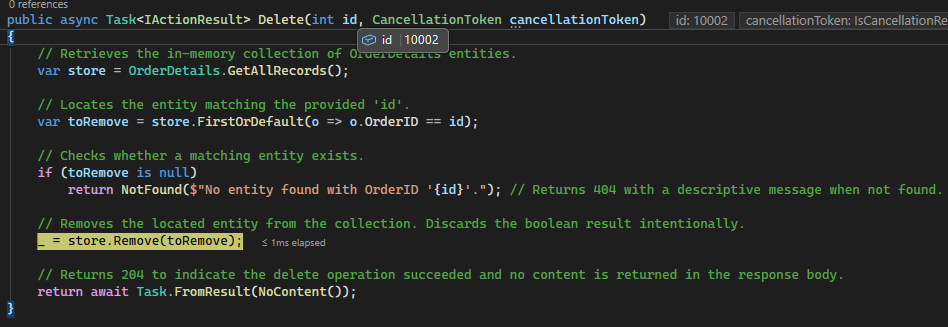
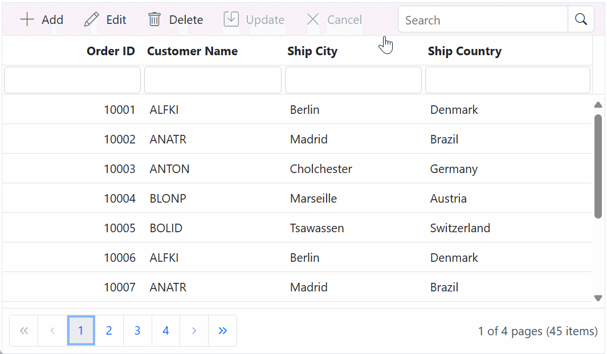

# ASP.NET Web API Remote Data Binding in Syncfusion Blazor Components

The [WebApiAdaptor](https://blazor.syncfusion.com/documentation/data/adaptors#web-api-adaptor) integrates the Blazor DataGrid with Web API endpoints that support OData‑style querying. It is derived from the [ODataAdaptor](https://blazor.syncfusion.com/documentation/data/adaptors#odata-adaptor), meaning the target Web API must accept OData‑formatted query parameters for operations such as filtering, sorting, paging, and searching. When the Syncfusion<sup style="font-size:70%">&reg;</sup> Blazor DataGrid performs any data action, the `WebApiAdaptor` generates OData‑compliant query strings, sends them to the Web API endpoint, and processes the returned JSON to populate the DataGrid. This ensures seamless remote data binding with OData-capable Web API services.

To enable the OData query option for a Web API, please refer to the corresponding [documentation](https://learn.microsoft.com/en-us/aspnet/web-api/overview/odata-support-in-aspnet-web-api/supporting-odata-query-options), which provides detailed instructions on configuring the endpoint to understand OData-formatted queries.

For details on configuring the backend (expected request/response format, server‑side processing), refer to the [WebApiAdaptor backend setup documentation](https://blazor.syncfusion.com/documentation/data/adaptors).

Once the project creation and backend setup are complete, the next step is to integrate the Syncfusion<sup style="font-size:70%">&reg;</sup> Blazor DataGrid with the `WebApiAdaptor`.

## Integrating Syncfusion Blazor DataGrid with WebAPIAdaptor
 
To integrate the Syncfusion<sup style="font-size:70%">&reg;</sup> Blazor DataGrid into your project using Visual Studio, follow the below steps:
 
### Step 1: Install and Configure Blazor DataGrid Components

Syncfusion is a library that provides pre-built UI components like DataGrid, which is used to display data in a table format.

**Instructions:**

**1. Install Syncfusion<sup style="font-size:70%">&reg;</sup> Blazor DataGrid and Themes NuGet packages**

**Method 1: Using Package Manager Console**

1. Open Visual Studio 2026.
2. Navigate to Tools → NuGet Package Manager → Package Manager Console.
3. Run the following commands:

```powershell
Install-Package Syncfusion.Blazor.Grid -Version {{site.blazorversion}};
Install-Package Syncfusion.Blazor.Themes -Version {{site.blazorversion}};
```

**Method 2: Using NuGet Package Manager UI**

1. Open Visual Studio 2026 → Tools → NuGet Package Manager → Manage NuGet Packages for Solution.
2. Search for and install each package individually:
   - **[Syncfusion.Blazor.Grid](https://www.nuget.org/packages/Syncfusion.Blazor.Grid/)** (version {{site.blazorversion}})
   - **[Syncfusion.Blazor.Themes](https://www.nuget.org/packages/Syncfusion.Blazor.Themes/)** (version {{site.blazorversion}})

All required packages are now installed.

**2. Register Syncfusion<sup style="font-size:70%">&reg;</sup> Blazor service**

Import the required namespaces in the `Components/_Imports.razor` file:

```csharp
@using Syncfusion.Blazor
@using Syncfusion.Blazor.Grids
```
- Register the Syncfusion<sup style="font-size:70%">&reg;</sup> Blazor service in the **~/Program.cs** file.
 
```csharp
using Syncfusion.Blazor;
 
builder.Services.AddSyncfusionBlazor();
```
 For apps using `WebAssembly` or `Auto (Server and WebAssembly)` render modes, register the service in both **~/Program.cs** files.
 
**3. Add stylesheet and script resources**

Add the Syncfusion stylesheet and scripts in the `Components/App.razor` file. Find the `<head>` section and add:

```html
<!-- Syncfusion Blazor Stylesheet -->
<link href="_content/Syncfusion.Blazor.Themes/bootstrap5.css" rel="stylesheet" />

<!-- Syncfusion Blazor Scripts -->
<script src="_content/Syncfusion.Blazor.Core/scripts/syncfusion-blazor.min.js" type="text/javascript"></script>
```

For this project, the **bootstrap5** theme is used. A different theme can be selected or customized based on project requirements. Refer to the [Syncfusion Blazor Components Appearance](https://blazor.syncfusion.com/documentation/appearance/themes) documentation to learn more about theming and customization options.

Syncfusion components are now configured and ready to use. For additional guidance, refer to the Grid component's [getting‑started](https://blazor.syncfusion.com/documentation/datagrid/getting-started-with-web-app) documentation.

### Step 2: Update the Blazor DataGrid with WebAPIAdaptor
 
Syncfusion<sup style="font-size:70%">&reg;</sup> Blazor DataGrid integration with backend APIs is enabled through the `WebApiAdaptor`, which acts as a bridge between the Syncfusion `SfDataManager` and RESTful Web API endpoints. It converts DataGrid actions into OData‑compliant query parameters and is well‑suited for APIs that follow OData conventions, providing server‑side paging, filtering, sorting, and searching without the need for custom request logic.

By delegating these operations to the server rather than executing them in the browser, the DataGrid ensures that only the required data is retrieved for each request.

**Instructions:**

1. To connect the Blazor DataGrid to a hosted API, use the [Url]( https://help.syncfusion.com/cr/blazor/Syncfusion.Blazor.DataManager.html#Syncfusion_Blazor_DataManager_Url) property of [SfDataManager]( https://help.syncfusion.com/cr/blazor/Syncfusion.Blazor.Data.SfDataManager.html). The `SfDataManager` offers multiple adaptor options to connect with remote database based on an API service. Below is an example of the [WebApiAdaptor](https://blazor.syncfusion.com/documentation/data/adaptors#web-api-adaptor) configuration where an API service are set up to return the resulting data in the **Items** and **Count** format. 

2.Update the **Index.razor** file in the `Components/Pages` folder as follows.
 
```cshtml

@page "/"

@using Syncfusion.Blazor.Grids
@using Syncfusion.Blazor.Data
@using Syncfusion.Blazor
 
<SfGrid TValue="OrdersDetails" Height="348">
    <SfDataManager Url="https://localhost:xxxx/api/Grid" Adaptor="Adaptors.WebApiAdaptor"></SfDataManager>
    <GridColumns>
        <GridColumn Field="OrderID" HeaderText="Order ID" Width="120" TextAlign="TextAlign.Right"></GridColumn>
        <GridColumn Field="CustomerID" HeaderText="Customer Name" Width="160"></GridColumn>
        <GridColumn Field="ShipCity" HeaderText="Ship City" Width="150"></GridColumn>
        <GridColumn Field="ShipCountry" HeaderText="Ship Country" Width="150"></GridColumn>
    </GridColumns>
</SfGrid>

 ```
> When using the `WebApiAdaptor`, the server must return a JSON response containing both the data collection (`Items`) and the total record count (`Count`) so the Blazor `SfDataManager` can correctly process paging and data binding.

### Step 3: Implement the Endpoints for WebAPIAdaptor

The `WebApiAdaptor` communicates with REST API endpoints for DataGrid operations rather than executing logic in the component. The DataGrid sends requests to endpoints defined in a controller. Below is the controller structure with the same decorators and signatures as in the project, with placeholder comments to add logic.

Open the file named **Controllers/GridController.cs** and use the following structure:

```csharp
 
using Microsoft.AspNetCore.Mvc;
using Syncfusion.Blazor.Data;
using Syncfusion.Blazor;
using WebApiAdaptor.Models;

namespace WebApiAdaptor.Controllers
{
    [ApiController]
    public class GridController : ControllerBase
    {
        /// <summary>
        /// Retrieves order data.
        /// </summary>
        /// <returns>Returns a JSON object with the list of orders and the total count.</returns>
        [HttpGet]
        [Route("api/[controller]")]
        public object GetOrderData()
        {
            // Retrieve all order records.
            List<OrdersDetails> data = OrdersDetails.GetAllRecords().ToList();

            // Return the data and total count.
            return new { Items = data, Count = data.Count() };
        }
    }
}

```
 
> Replace https://localhost:xxxx/api/Grid with the actual URL of your API endpoint that provides the data in a consumable format (e.g., JSON).
 
### Step 4: Running the Application

**Build the Application**

1. Open PowerShell or your terminal.
2. Navigate to the project directory.
3. Build the application:

```powershell
dotnet build
```

**Run the Application**

Execute the following command:

```powershell
dotnet run
```

The application will start, and the console will display the local URL (typically `http://localhost:5175` or `https://localhost:5001`).

**Access the Application**

1. Open a web browser.
2. Navigate to the URL displayed in the console.
3. The DataGrid application is now running and ready to use.
 


## Server-side data operations

When using the `WebApiAdaptor` with the `SfDataManager`, data operations such as filtering, sorting, paging, and searching are executed on the server side. These operations are sent from the client to the server as **QueryString** parameters, which can be accessed in your API controller using `Request.Query`.

**Query parameters for data operations**

The following table lists the query parameters used by the Blazor DataGrid for various data operations:

| Key           | Description                                                                 |
|---------------|-----------------------------------------------------------------------------|
| `$skip`, `$top` | Specifies the query parameters for performing paging operations on the server side.   |
| `$filter`      | Specifies the query parameter for performing filtering and searching operations on the server side. |
| `$orderby`     | Specifies the query parameter for performing sorting operations on the server side.   |

> These parameters are automatically sent when the `WebApiAdaptor` is used. You can access and process them in your Web API Controller to perform the corresponding operations.

### Implement Paging Feature

* Ensure the DataGrid has paging enabled with `AllowPaging="true"`.
* When paging is applied, the `$skip` and `$top` parameters are sent to the server. The `$skip` parameter specifies the number of records to skip, while the `$top` parameter specifies how many records to retrieve for the current page.

The following example demonstrates how to apply paging logic:






/// <summary>
/// Retrieves order data and applies paging logic based on the provided query parameters.
/// </summary>
/// <returns>Returns a JSON object containing the paged list of orders and the total record count.</returns>
[HttpGet]
[Route("api/[controller]")]
public object GetOrderData()
{
    // Retrieve all order records from the data source.
    List<OrdersDetails> data = OrdersDetails.GetAllRecords().ToList();

    // Extract the query string from the incoming request.
    var queryString = Request.Query;

    // Calculate the total count of records before applying paging.
    int totalRecordsCount = data.Count();

    // Extract the number of records to skip from the query string.
    int skip = Convert.ToInt32(queryString["$skip"]);

    // Extract the number of records to take from the query string.
    int take = Convert.ToInt32(queryString["$top"]);

    // Apply paging by skipping the specified number of records and taking the required number of records.
    return take != 0
        ? new { Items = data.Skip(skip).Take(take).ToList(), Count = totalRecordsCount }
        : new { Items = data, Count = totalRecordsCount };
}





@using Syncfusion.Blazor.Grids
@using Syncfusion.Blazor.Data
@using Syncfusion.Blazor

<SfGrid TValue="OrdersDetails" AllowPaging="true" Height="348">
    <SfDataManager Url="https://localhost:xxxx/api/Grid" Adaptor="Adaptors.WebApiAdaptor"></SfDataManager>
    <GridColumns>
        <GridColumn Field="OrderID" HeaderText="Order ID" Width="120" TextAlign="TextAlign.Right"></GridColumn>
        <GridColumn Field="CustomerID" HeaderText="Customer Name" Width="160"></GridColumn>
        <GridColumn Field="ShipCity" HeaderText="Ship City" Width="150"></GridColumn>
        <GridColumn Field="ShipCountry" HeaderText="Ship Country" Width="150"></GridColumn>
    </GridColumns>
</SfGrid>




>  Always calculate the total record count before applying paging. This ensures that the DatGrid can display the correct total number of records for pagination.

### Implement Filtering Feature

* Add the [AllowFiltering](https://help.syncfusion.com/cr/blazor/Syncfusion.Blazor.Grids.SfGrid-1.html#Syncfusion_Blazor_Grids_SfGrid_1_AllowFiltering) property to the `<SfGrid>`.
* When filtering is applied, the `$filter` parameter is sent to the server. The `$filter` parameter specifies the conditions for filtering the data based on the provided criteria.

The following example demonstrates how to extract the `$filter` parameter and apply filtering logic based on custom conditions:






/// <summary>
/// Retrieves order data and processes filtering operations based on the provided query parameters.
/// </summary>
/// <returns>Returns a JSON object containing the filtered list of orders and the total count.</returns>
[HttpGet]
[Route("api/[controller]")]
public object GetOrderData()
{
    // Retrieve all order records from the data source.
    List<OrdersDetails> data = OrdersDetails.GetAllRecords().ToList();

    // Extract the query string from the incoming request.
    var queryString = Request.Query;

    // Enable nullable reference types for handling filter queries.
    #nullable enable
    string? filterQuery = queryString["$filter"];
    #nullable disable

    // Check if a filter query is provided.
    if (!string.IsNullOrEmpty(filterQuery))
    {
        // Split the filter query into individual conditions using "and" as a delimiter.
        var filterConditions = filterQuery.Split(new[] { " and " }, StringSplitOptions.RemoveEmptyEntries);

        foreach (var condition in filterConditions)
        {
            // Check if the condition involves a substring search.
            if (condition.Contains("substringof"))
            {
                // Handle substring search operation here.
            }
            else
            {
                // Initialize variables to hold the filter field and value.
                string filterField = "";
                string filterValue = "";

                // Split the condition into parts to extract the field and value.
                var filterParts = condition.Split('(', ')', '\'');

                // Handle cases where the filter condition has fewer parts.
                if (filterParts.Length < 6)
                {
                    var filterValueParts = filterParts[1].Split();
                    filterField = filterValueParts[0];
                    filterValue = filterValueParts.Length > 2 ? filterValueParts[2].Trim('\'') : "";
                }
                else
                {
                    filterField = filterParts[3];
                    filterValue = filterParts[5];
                }

                // Apply filtering based on the extracted field and value.
                switch (filterField)
                {
                    case "OrderID":
                        data = data.Where(item => item != null && item.OrderID.ToString() == filterValue).ToList();
                        break;
                    case "CustomerID":
                        data = data.Where(item => item != null && item.CustomerID?.ToLower().StartsWith(filterValue.ToLower()) == true).ToList();
                        break;
                    case "ShipCity":
                        data = data.Where(item => item != null && item.ShipCity?.ToLower().StartsWith(filterValue.ToLower()) == true).ToList();
                        break;
                    case "ShipCountry":
                        data = data.Where(item => item != null && item.ShipCountry?.ToLower().StartsWith(filterValue.ToLower()) == true).ToList();
                        break;
                }
            }
        }
    }

    // Calculate the total count of records after filtering.
    int totalRecordsCount = data.Count();

    // Return the filtered data and the total count as a JSON object.
    return new { Items = data, count = totalRecordsCount };
}





@using Syncfusion.Blazor.Grids
@using Syncfusion.Blazor.Data
@using Syncfusion.Blazor

<SfGrid TValue="OrdersDetails" AllowFiltering="true" Height="348">
    <SfDataManager Url="https://localhost:xxxx/api/Grid" Adaptor="Adaptors.WebApiAdaptor"></SfDataManager>
    <GridColumns>
        <GridColumn Field="OrderID" HeaderText="Order ID" Width="120" TextAlign="TextAlign.Right"></GridColumn>
        <GridColumn Field="CustomerID" HeaderText="Customer Name" Width="160"></GridColumn>
        <GridColumn Field="ShipCity" HeaderText="Ship City" Width="150"></GridColumn>
        <GridColumn Field="ShipCountry" HeaderText="Ship Country" Width="150"></GridColumn>
    </GridColumns>
</SfGrid>




> The `$filter` parameter can include various conditions, such as **substringof**, **eq** (equals), **gt** (greater than), and more. You can customize the filtering logic based on your specific data structure and requirements.

### Implement Searching Feature

* Ensure the toolbar includes the "Search" item.
* When a search operation is triggered, the `$filter` parameter is sent to the server. The `$filter` parameter specifies the query conditions that are applied to the data to perform the search.

The following example demonstrates how to extract the `$filter` parameter and apply search logic across multiple fields:






/// <summary>
/// Retrieves order data and handles search operations based on the provided filter query.
/// </summary>
/// <returns>Returns a JSON object containing the searched list of orders and the total count.</returns>
[HttpGet]
[Route("api/[controller]")]
public object GetOrderData()
{
    // Retrieve all order records from the data source.
    List<OrdersDetails> data = OrdersDetails.GetAllRecords().ToList();

    // Extract the query string from the incoming request.
    var queryString = Request.Query;

    // Enable nullable reference types for handling filter queries.
    #nullable enable
    string? filterQuery = queryString["$filter"];
    #nullable disable

    // Check if a filter query is provided.
    if (!string.IsNullOrEmpty(filterQuery))
    {
        // Split the filter query into individual conditions using "and" as a delimiter.
        var filterConditions = filterQuery.Split(new[] { " and " }, StringSplitOptions.RemoveEmptyEntries);

        foreach (var condition in filterConditions)
        {
            // Check if the condition involves a substring search.
            if (condition.Contains("substringof"))
            {
                // Extract the search value from the substring condition.
                var conditionParts = condition.Split('(', ')', '\'');
                var searchValue = conditionParts[3]?.ToLower() ?? "";

                // Filter the data based on the search value across multiple fields.
                data = data.Where(order =>
                    order != null &&
                    (order.OrderID.ToString().Contains(searchValue) ||
                    (order.CustomerID?.ToLower().Contains(searchValue, StringComparison.CurrentCultureIgnoreCase) ?? false) ||
                    (order.ShipCity?.ToLower().Contains(searchValue, StringComparison.CurrentCultureIgnoreCase) ?? false) ||
                    (order.ShipCountry?.ToLower().Contains(searchValue, StringComparison.CurrentCultureIgnoreCase) ?? false))
                ).ToList();
            }
            else
            {
                // Handle other filtering operations here.
            }
        }
    }

    // Calculate the total count of records.
    int totalRecordsCount = data.Count();

    // Return the filtered data and the total count as a JSON object.
    return new { Items = data, count = totalRecordsCount };
}




@using Syncfusion.Blazor.Grids
@using Syncfusion.Blazor.Data
@using Syncfusion.Blazor

<SfGrid TValue="OrdersDetails" Toolbar="@(new List<string>() { "Search" })" Height="348">
    <SfDataManager Url="https://localhost:xxxx/api/Grid" Adaptor="Adaptors.WebApiAdaptor"></SfDataManager>
    <GridColumns>
        <GridColumn Field="OrderID" HeaderText="Order ID" Width="120" TextAlign="TextAlign.Right"></GridColumn>
        <GridColumn Field="CustomerID" HeaderText="Customer Name" Width="160"></GridColumn>
        <GridColumn Field="ShipCity" HeaderText="Ship City" Width="150"></GridColumn>
        <GridColumn Field="ShipCountry" HeaderText="Ship Country" Width="150"></GridColumn>
    </GridColumns>
</SfGrid>




> This example demonstrates a custom way of handling the `$filter` query sent by the DataGrid. You can also handle it using your own logic based on the query string format or use dynamic expression evaluation libraries for a more generic approach.

### Implement Sorting Feature

* Add the [AllowSorting](https://help.syncfusion.com/cr/blazor/Syncfusion.Blazor.Grids.SfGrid-1.html#Syncfusion_Blazor_Grids_SfGrid_1_AllowSorting) property to the `<SfGrid>`.
* When sorting is triggered, the `$orderby` parameter is sent to the server. The `$orderby` parameter specifies the fields to sort by, along with the sort direction (ascending or descending).

The following example demonstrates how to extract the `$orderby` parameter and apply sorting logic:

***Ascending Sorting***



***Descending Sorting***






/// <summary>
/// Retrieves order data and processes sorting operations based on the provided query parameters.
/// </summary>
/// <returns>Returns a JSON object containing the sorted list of orders and the total count.</returns>
[HttpGet]
[Route("api/[controller]")]
public object GetOrderData()
{
    // Retrieve all order records from the data source.
    List<OrdersDetails> data = OrdersDetails.GetAllRecords().ToList();

    // Extract the query string from the incoming request.
    var queryString = Request.Query;

    // Enable nullable reference types for handling sorting queries.
    #nullable enable
    string? sort = queryString["$orderby"];
    #nullable disable

    // Check if a sorting query is provided.
    if (!string.IsNullOrEmpty(sort))
    {
        // Split the sorting query into individual conditions using commas as delimiters.
        var sortConditions = sort.Split(',');
        IOrderedEnumerable<OrdersDetails>? orderedData = null;
        foreach (var sortCondition in sortConditions)
        {
            // Split each sorting condition into field and direction (asc/desc).
            var sortParts = sortCondition.Trim().Split(' ');
            var sortBy = sortParts[0];
            var descending = sortParts.Length > 1 && sortParts[1].ToLower() == "desc";

            // Define a key selector function to dynamically access the property to sort by.
            Func<OrdersDetails, object?> keySelector = item =>
                item.GetType().GetProperty(sortBy)?.GetValue(item, null);

            // Apply sorting based on the field and direction.
            orderedData = orderedData == null
                ? (descending ? data.OrderByDescending(keySelector) : data.OrderBy(keySelector))
                : (descending ? orderedData.ThenByDescending(keySelector) : orderedData.ThenBy(keySelector));
        }

        // Update the data with the sorted result.
        if (orderedData != null)
        {
            data = orderedData.ToList();
        }
    }

    // Calculate the total count of records after sorting.
    int totalRecordsCount = data.Count();

    // Return the sorted data and the total count as a JSON object.
    return new { Items = data, count = totalRecordsCount };
}





@using Syncfusion.Blazor.Grids
@using Syncfusion.Blazor.Data
@using Syncfusion.Blazor

<SfGrid TValue="OrdersDetails" AllowSorting="true" Height="348">
    <SfDataManager Url="https://localhost:xxxx/api/Grid" Adaptor="Adaptors.WebApiAdaptor"></SfDataManager>
    <GridColumns>
        <GridColumn Field="OrderID" HeaderText="Order ID" Width="120" TextAlign="TextAlign.Right"></GridColumn>
        <GridColumn Field="CustomerID" HeaderText="Customer Name" Width="160"></GridColumn>
        <GridColumn Field="ShipCity" HeaderText="Ship City" Width="150"></GridColumn>
        <GridColumn Field="ShipCountry" HeaderText="Ship Country" Width="150"></GridColumn>
    </GridColumns>
</SfGrid>




> You can parse the `$orderby` parameter to dynamically apply sorting on one or more fields in either ascending or descending order.

N> If you want to handle filtering, sorting, and paging operations using Dynamic LINQ Expressions, you can refer to this [GitHub repository](https://github.com/SyncfusionExamples/blazor-datagrid-data-operations-in-wep-api-service) for an example of how to implement it dynamically.

## Implement CRUD operations

To manage CRUD (Create, Read, Update, and Delete) operations using the WebApiAdaptor in Syncfusion<sup style="font-size:70%">&reg;</sup> Blazor DataGrid, follow the provided guide for configuring the DataGrid for [Editing](https://blazor.syncfusion.com/documentation/datagrid/editing) and utilize the sample implementation of the `GridController` in your server application. This controller handles HTTP requests for CRUD operations such as **GET, POST, PUT,** and **DELETE**.

To enable CRUD operations in the DataGrid, follow the steps below:




@using Syncfusion.Blazor.Grids
@using Syncfusion.Blazor.Data
@using Syncfusion.Blazor

<SfGrid TValue="OrdersDetails" Toolbar="@(new List<string>() { "Add", "Edit", "Delete", "Update", "Cancel" })" Height="348">
    <SfDataManager Url="https://localhost:xxxx/api/Grid" Adaptor="Adaptors.WebApiAdaptor"></SfDataManager>
    <GridEditSettings AllowEditing="true" AllowDeleting="true" AllowAdding="true" Mode="EditMode.Normal"></GridEditSettings>
    <GridColumns>
        <GridColumn Field="OrderID" HeaderText="Order ID" Width="120" IsPrimaryKey="true" TextAlign="TextAlign.Right"></GridColumn>
        <GridColumn Field="CustomerID" HeaderText="Customer Name" Width="160"></GridColumn>
        <GridColumn Field="ShipCity" HeaderText="Ship City" Width="150"></GridColumn>
        <GridColumn Field="ShipCountry" HeaderText="Ship Country" Width="150"></GridColumn>
    </GridColumns>
</SfGrid>




> Normal/Inline editing is the default edit [Mode](https://help.syncfusion.com/cr/blazor/Syncfusion.Blazor.Grids.GridEditSettings.html#Syncfusion_Blazor_Grids_GridEditSettings_Mode) for the DataGrid. To enable CRUD operations, ensure that the [IsPrimaryKey](https://help.syncfusion.com/cr/blazor/Syncfusion.Blazor.Grids.GridColumn.html#Syncfusion_Blazor_Grids_GridColumn_IsPrimaryKey) property is set to **true** for a specific DataGrid column, ensuring that its value is unique.

**Insert operation:**

To insert a new record into your Syncfusion<sup style="font-size:70%">&reg;</sup> DataGrid, you can utilize the `HttpPost` method in your server application. The details of the newly added record are passed to the **newRecord** parameter. Below is a sample implementation of inserting a record using the **GridController**: 






/// <summary>
/// Inserts a new data item into the data collection.
/// </summary>
/// <param name="newRecord">Holds the details of the new record to be inserted.</param>
[HttpPost]
public void Post([FromBody] OrdersDetails newRecord)
{
    // Add the new record to the data collection.
    OrdersDetails.GetAllRecords().Insert(0, newRecord);
}




**Update operation:**

Updating a record in the Syncfusion<sup style="font-size:70%">&reg;</sup> DataGrid can be achieved by utilizing the `HttpPut` method in your controller. The details of the updated record are passed to the **updatedRecord** parameter. Here's a sample implementation of updating a record:






/// <summary>
/// Update a existing data item from the data collection.
/// </summary>
/// <param name="updatedRecord">It contains the updated record detail which is need to be updated.</param>
/// <returns>Returns void.</returns>
public void Put([FromBody] OrdersDetails updatedRecord)
{
    var id = updatedRecord.OrderID;
    // Find the existing order by id.
    var existingOrder = OrdersDetails.GetAllRecords().FirstOrDefault(o => o.OrderID == id);
    if (existingOrder != null)
    {
        // If the order exists, update its properties.
        existingOrder.OrderID = updatedRecord.OrderID;
        existingOrder.CustomerID = updatedRecord.CustomerID;
        existingOrder.ShipCity = updatedRecord.ShipCity;
        existingOrder.ShipCountry = updatedRecord.ShipCountry;
    }
}




**Delete operation:**

To delete a record from your Syncfusion<sup style="font-size:70%">&reg;</sup> DataGrid, you can use the `HttpDelete` method in your controller. The primary key value of the deleted record is passed to the **deletedRecord** parameter.Below is a sample implementation:






/// <summary>
/// Deletes a specific order record from the data collection.
/// </summary>
/// <param name="id">The id of the order to delete.</param>
[HttpDelete("{id}")]
public void Delete(int id)
{
    // Find the existing record that matches the deleted record's "OrderID".
    var orderToRemove = OrdersDetails.GetAllRecords().FirstOrDefault(order => order.OrderID == id);
    // If the order exists, remove it.
    if (orderToRemove != null)
    {
        OrdersDetails.GetAllRecords().Remove(orderToRemove);
    }
}






N> ASP.NET Core (Blazor) Web API with batch handling is not yet supported by ASP.NET Core v3+. Therefore, it is currently not feasible to support **Batch** mode CRUD operations until ASP.NET Core provides support for batch handling. For more details, refer to [this GitHub issue](https://github.com/dotnet/aspnetcore/issues/14722).

## Complete sample repository

For the complete working implementation of this example, refer to the [GitHub](https://github.com/SyncfusionExamples/Binding-data-from-remote-service-to-blazor-data-grid/tree/master/WebApiAdaptor) repository.

N> ASP.NET Core (Blazor) Web API with batch handling is not yet supported by ASP.NET Core v3+. Therefore, it is currently not feasible to support **Batch** mode CRUD operations until ASP.NET Core provides support for batch handling. For more details, refer to [this GitHub issue](https://github.com/dotnet/aspnetcore/issues/14722).