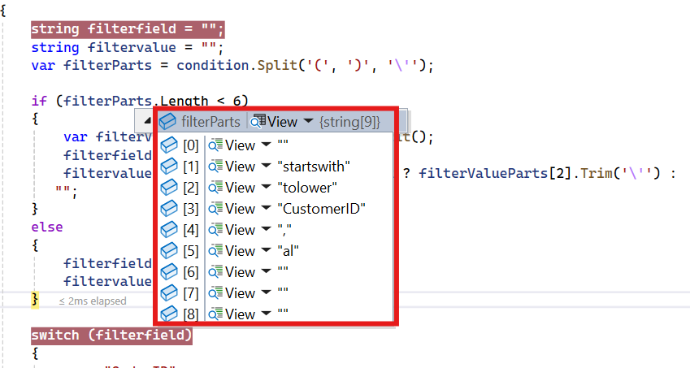
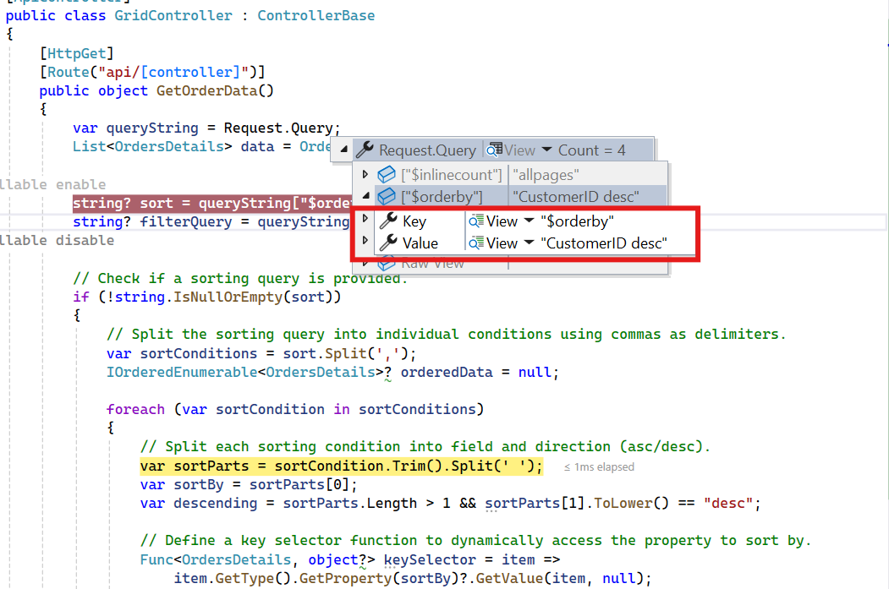

# WebApiAdaptor in Syncfusion Blazor DataGrid

The [WebApiAdaptor](https://blazor.syncfusion.com/documentation/data/adaptors#web-api-adaptor) extends Syncfusion<sup style="font-size:70%">&reg;</sup> Blazor [ODataAdaptor](https://blazor.syncfusion.com/documentation/data/adaptors#odata-adaptor) to enable seamless interaction between the Blazor DataGrid component and Web API endpoints that understand OData-formatted queries. The adaptor manages data transfer, filtering, sorting, and other server-side operations by generating the appropriate OData query strings. A correctly configured API endpoint interprets these queries and returns the requested data in a format compatible with [SfDataManager](https://help.syncfusion.com/cr/blazor/Syncfusion.Blazor.Data.SfDataManager.html).

**Key benefits**:

- Utilizes existing OData conventions for query generation.
- Simplifies server-side CRUD implementation for Blazor DataGrid.
- Supports high-performance data operations by delegating processing to the server.

## Creating an API service
 
To configure a Web API for integration with the Syncfusion<sup style="font-size:70%">&reg;</sup> Blazor DataGrid, follow these steps:
 
**1. Create a Blazor web app**
 
1. Open Visual Studio 2022.  
2. Choose **Blazor Web App** and name the project **WebApiAdaptor**.
3. Use either [Microsoft Templates](https://learn.microsoft.com/en-us/aspnet/core/blazor/tooling?view=aspnetcore-9.0&pivots=vs) or the Syncfusion<sup style="font-size:70%">&reg;</sup> Blazor Extension to create the project.
4. Select the preferred [interactive render mode](https://learn.microsoft.com/en-us/aspnet/core/blazor/components/render-modes?view=aspnetcore-9.0#render-modes) and [interactivity location](https://learn.microsoft.com/en-us/aspnet/core/blazor/tooling?view=aspnetcore-9.0&pivots=vs).

**2. Create a model class**
 
Add a **Models** folder and create a class named **OrdersDetails.cs** to represent order data.

```csharp
namespace WebApiAdaptor.Models
{
    public class OrdersDetails
    {
        public static List<OrdersDetails> order = new List<OrdersDetails>();

        public OrdersDetails() { }
 
        public OrdersDetails(int OrderID, string CustomerId, int EmployeeId, double Freight, bool Verified, DateTime OrderDate, string ShipCity, string ShipName, string ShipCountry, DateTime ShippedDate, string ShipAddress)
        {
            this.OrderID = OrderID;
            this.CustomerID = CustomerId;
            this.EmployeeID = EmployeeId;
            this.Freight = Freight;
            this.ShipCity = ShipCity;
            this.Verified = Verified;
            this.OrderDate = OrderDate;
            this.ShipName = ShipName;
            this.ShipCountry = ShipCountry;
            this.ShippedDate = ShippedDate;
            this.ShipAddress = ShipAddress;
        }

        public static List<OrdersDetails> GetAllRecords()
        {
            if (order.Count() == 0)
            {
                int code = 10000;
                for (int i = 1; i < 10; i++)
                {
                    order.Add(new OrdersDetails(code + 1, "ALFKI", i + 0, 2.3 * i, false, new DateTime(1991, 05, 15), "Berlin", "Simons bistro", "Denmark", new DateTime(1996, 7, 16), "Kirchgasse 6"));
                    order.Add(new OrdersDetails(code + 2, "ANATR", i + 2, 3.3 * i, true, new DateTime(1990, 04, 04), "Madrid", "Queen Cozinha", "Brazil", new DateTime(1996, 9, 11), "Avda. Azteca 123"));
                    order.Add(new OrdersDetails(code + 3, "ANTON", i + 1, 4.3 * i, true, new DateTime(1957, 11, 30), "Cholchester", "Frankenversand", "Germany", new DateTime(1996, 10, 7), "Carrera 52 con Ave. Bolívar #65-98 Llano Largo"));
                    order.Add(new OrdersDetails(code + 4, "BLONP", i + 3, 5.3 * i, false, new DateTime(1930, 10, 22), "Marseille", "Ernst Handel", "Austria", new DateTime(1996, 12, 30), "Magazinweg 7"));
                    order.Add(new OrdersDetails(code + 5, "BOLID", i + 4, 6.3 * i, true, new DateTime(1953, 02, 18), "Tsawassen", "Hanari Carnes", "Switzerland", new DateTime(1997, 12, 3), "1029 - 12th Ave. S."));
                    code += 5;
                }
            }
            return order;
        }

        public int? OrderID { get; set; }
        public string? CustomerID { get; set; }
        public int? EmployeeID { get; set; }
        public double? Freight { get; set; }
        public string? ShipCity { get; set; }
        public bool? Verified { get; set; }
        public DateTime OrderDate { get; set; }
        public string? ShipName { get; set; }
        public string? ShipCountry { get; set; }
        public DateTime ShippedDate { get; set; }
        public string? ShipAddress { get; set; }
    }
}
```
**3. Create an API controller**

Add a **Controllers** folder and create **GridController.cs** to handle data operations:


```
{
    Items: [{..}, {..}, {..}, ...],
    Count: 830
}
```



 
using Microsoft.AspNetCore.Mvc;
using Syncfusion.Blazor.Data;
using Syncfusion.Blazor;
using WebApiAdaptor.Models;

namespace WebApiAdaptor.Controllers
{
    [ApiController]
    public class GridController : ControllerBase
    {
        /// <summary>
        /// Retrieve data from the data source.
        /// </summary>
        /// <returns>Returns a JSON object with the list of orders and the total count.</returns>
        [HttpGet]
        [Route("api/[controller]")]
        public object GetOrderData()
        {
            // Retrieve all order records.
            List<OrdersDetails> data = OrdersDetails.GetAllRecords().ToList();

            // Return the data and total count.
            return new { Items = data, Count = data.Count() };
        }
    }
}




> When using `WebApiAdaptor`, the response must include **Items** and **Count** properties. If the [Offline](https://help.syncfusion.com/cr/blazor/Syncfusion.Blazor.DataManager.html#Syncfusion_Blazor_DataManager_Offline) property of [SfDataManager](https://help.syncfusion.com/cr/blazor/Syncfusion.Blazor.Data.SfDataManager.html) is enabled, the entire collection is returned without **$inlinecount**, and only one request is made to fetch all data.

**4. Register controllers in `Program.cs`**
 
```csharp
// Register controllers in the service container.
builder.Services.AddControllers();
 
// Map controller routes.
app.MapControllers();
```
 
**5. Run the application**
 
Run the application in Visual Studio. Build and run the application in Visual Studio. The API will be available at a URL similar to **https://localhost:xxxx/api/Grid**, where **xxxx** represents the port number. Confirm that the API returns the expected order data in JSON format.
 


## Connecting Syncfusion Blazor DataGrid to an API service
 
To bind the Syncfusion<sup style="font-size:70%">&reg;</sup> Blazor DataGrid to a remote API using the [WebApiAdaptor](https://help.syncfusion.com/cr/blazor/Syncfusion.Blazor.Adaptors.html#Syncfusion_Blazor_Adaptors_WebApiAdaptor), configure the [SfDataManager](https://help.syncfusion.com/cr/blazor/Syncfusion.Blazor.Data.SfDataManager.html) component with the API endpoint and adaptor type. The following steps outline the integration process:

**1. Install Required NuGet Packages**
 
* To add the Syncfusion<sup style="font-size:70%">&reg;</sup> Blazor DataGrid to the application, open NuGet Package Manager in Visual Studio (*Tools → NuGet Package Manager → Manage NuGet Packages for Solution*), then search and install:

    * [Syncfusion.Blazor.Grid](https://www.nuget.org/packages/Syncfusion.Blazor.Grid/)

    * [Syncfusion.Blazor.Themes](https://www.nuget.org/packages/Syncfusion.Blazor.Themes/)

> * For **Blazor Web Apps** using **WebAssembly** or **Auto** render modes, install these packages in the client project.

* Alternatively, use the following Package Manager commands:
 
```powershell
Install-Package Syncfusion.Blazor.Grid -Version {{ site.releaseversion }}
Install-Package Syncfusion.Blazor.Themes -Version {{ site.releaseversion }}
```
 
> Syncfusion<sup style="font-size:70%">&reg;</sup> Blazor components are available on [nuget.org](https://www.nuget.org/packages?q=syncfusion.blazor). Refer to the [NuGet packages](https://blazor.syncfusion.com/documentation/nuget-packages) topic for a complete list of available packages.
 
**2. Register Syncfusion<sup style="font-size:70%">&reg;</sup> Blazor service**
 
- Add the required namespaces in **~/_Imports.razor**:

```cs
@using Syncfusion.Blazor
@using Syncfusion.Blazor.Grids
@using Syncfusion.Blazor.Data
```
 
- Register the Syncfusion<sup style="font-size:70%">&reg;</sup> Blazor service in **Program.cs**:
 
```csharp
using Syncfusion.Blazor;
 
builder.Services.AddSyncfusionBlazor();
```
 
> For apps using `WebAssembly` or `Auto (Server and WebAssembly)` render modes, register the service in both **~/Program.cs** files.
 
**3. Add stylesheet and script references**
 
Include the theme and script references in **App.razor**:
 
```html
<head>
    ....
    <link href="_content/Syncfusion.Blazor.Themes/bootstrap5.css" rel="stylesheet" />
</head>
....
<body>
    ....
    <script src="_content/Syncfusion.Blazor.Core/scripts/syncfusion-blazor.min.js" type="text/javascript"></script>
</body>
```
 
> * Refer to the [Blazor Themes](https://blazor.syncfusion.com/documentation/appearance/themes) topic for available methods to include themes, such as Static Web Assets, CDN, or CRG.
> * Set the render mode to **InteractiveServer** or **InteractiveAuto** in the Blazor Web App configuration.

**4. Configure DataGrid with WebApiAdaptor**
 
Use the [SfDataManager](https://help.syncfusion.com/cr/blazor/Syncfusion.Blazor.Data.SfDataManager.html) component to connect the DataGrid to the API endpoint. Set the [Adaptor](https://help.syncfusion.com/cr/blazor/Syncfusion.Blazor.DataManager.html#Syncfusion_Blazor_DataManager_Adaptor) property to [WebApiAdaptor](https://help.syncfusion.com/cr/blazor/Syncfusion.Blazor.Adaptors.html#Syncfusion_Blazor_Adaptors_WebApiAdaptor).
 



@using Syncfusion.Blazor.Grids
@using Syncfusion.Blazor.Data
@using Syncfusion.Blazor
 
<SfGrid TValue="OrdersDetails" Height="348">
    <SfDataManager Url="https://localhost:xxxx/api/Grid" Adaptor="Adaptors.WebApiAdaptor"></SfDataManager>
    <GridColumns>
        <GridColumn Field="OrderID" HeaderText="Order ID" Width="120" TextAlign="TextAlign.Right"></GridColumn>
        <GridColumn Field="CustomerID" HeaderText="Customer Name" Width="160"></GridColumn>
        <GridColumn Field="ShipCity" HeaderText="Ship City" Width="150"></GridColumn>
        <GridColumn Field="ShipCountry" HeaderText="Ship Country" Width="150"></GridColumn>
    </GridColumns>
</SfGrid>
 

 

 
using Microsoft.AspNetCore.Mvc;
using Syncfusion.Blazor.Data;
using Syncfusion.Blazor;
using WebApiAdaptor.Models;

namespace WebApiAdaptor.Controllers
{
    [ApiController]
    public class GridController : ControllerBase
    {
        /// <summary>
        /// Retrieves order data.
        /// </summary>
        /// <returns>Returns a JSON object with the list of orders and the total count.</returns>
        [HttpGet]
        [Route("api/[controller]")]
        public object GetOrderData()
        {
            // Retrieve all order records.
            List<OrdersDetails> data = OrdersDetails.GetAllRecords().ToList();

            // Return the data and total count.
            return new { Items = data, Count = data.Count() };
        }
    }
}
 


 
> Replace https://localhost:xxxx/api/Grid with the actual URL of your API endpoint that provides the data in a consumable format (e.g., JSON).
 
**5. Run the application**
 
When you run the application, the Blazor Grid  will display data fetched from the API.
 


## Perform data operations in WebApiAdaptor

When the [WebApiAdaptor](https://help.syncfusion.com/cr/blazor/Syncfusion.Blazor.Adaptors.html#Syncfusion_Blazor_Adaptors_WebApiAdaptor) is used with [SfDataManager](https://help.syncfusion.com/cr/blazor/Syncfusion.Blazor.Data.SfDataManager.html), data operations such as **filtering**, **sorting**, **paging**, and **searching** are executed on the server. These operations are sent as query string parameters in the **HTTP** request and can be accessed in the API controller through `Request.Query`.

The following query parameters are automatically included when the `WebApiAdaptor` is configured:

* **$skip, $top** - Applies paging details from [DataManagerRequest](https://help.syncfusion.com/cr/blazor/Syncfusion.Blazor.DataManagerRequest.html) to skip a defined number of records and retrieve a specified number of records.

* **$filter** - Applies filter conditions and search criteria from `DataManagerRequest` to the data source.

* **$orderby** - Applies sort descriptors from `DataManagerRequest` to the data source for ascending or descending order.

> These parameters allow the API controller to process and apply the corresponding operations on the server-side data source.

## Handling search operations

When a search is performed in the Blazor DataGrid, the `WebApiAdaptor` sends the **$filter** query parameter to the API. This parameter contains conditions that define the search criteria. The API controller can parse this parameter and apply the search logic to the data source.





/// <summary>
/// Retrieves order data and handles search operations based on the provided filter query.
/// </summary>
/// <returns>Returns a JSON object containing the searched list of orders and the total count.</returns>
[HttpGet]
[Route("api/[controller]")]
public object GetOrderData()
{
    // Retrieve all order records from the data source.
    List<OrdersDetails> data = OrdersDetails.GetAllRecords().ToList();

    // Extract the query string from the incoming request.
    var queryString = Request.Query;

    // Enable nullable reference types for handling filter queries.
    #nullable enable
    string? filterQuery = queryString["$filter"];
    #nullable disable

    // Check if a filter query is provided.
    if (!string.IsNullOrEmpty(filterQuery))
    {
        // Split the filter query into individual conditions using "and" as a delimiter.
        var filterConditions = filterQuery.Split(new[] { " and " }, StringSplitOptions.RemoveEmptyEntries);

        foreach (var condition in filterConditions)
        {
            // Check if the condition involves a substring search.
            if (condition.Contains("substringof"))
            {
                // Extract the search value from the substring condition.
                var conditionParts = condition.Split('(', ')', '\'');
                var searchValue = conditionParts[3]?.ToLower() ?? "";

                // Filter the data based on the search value across multiple fields.
                data = data.Where(order =>
                    order != null &&
                    (order.OrderID.ToString().Contains(searchValue) ||
                    (order.CustomerID?.ToLower().Contains(searchValue, StringComparison.CurrentCultureIgnoreCase) ?? false) ||
                    (order.ShipCity?.ToLower().Contains(searchValue, StringComparison.CurrentCultureIgnoreCase) ?? false) ||
                    (order.ShipCountry?.ToLower().Contains(searchValue, StringComparison.CurrentCultureIgnoreCase) ?? false))
                ).ToList();
            }
            else
            {
                // Handle other filtering operations here.
            }
        }
    }

    // Calculate the total count of records.
    int totalRecordsCount = data.Count();

    // Return the filtered data and the total count as a JSON object.
    return new { Items = data, count = totalRecordsCount };
}




@using Syncfusion.Blazor.Grids
@using Syncfusion.Blazor.Data
@using Syncfusion.Blazor

<SfGrid TValue="OrdersDetails" Toolbar="@(new List<string>() { "Search" })" Height="348">
    <SfDataManager Url="https://localhost:xxxx/api/Grid" Adaptor="Adaptors.WebApiAdaptor"></SfDataManager>
    <GridColumns>
        <GridColumn Field="OrderID" HeaderText="Order ID" Width="120" TextAlign="TextAlign.Right"></GridColumn>
        <GridColumn Field="CustomerID" HeaderText="Customer Name" Width="160"></GridColumn>
        <GridColumn Field="ShipCity" HeaderText="Ship City" Width="150"></GridColumn>
        <GridColumn Field="ShipCountry" HeaderText="Ship Country" Width="150"></GridColumn>
    </GridColumns>
</SfGrid>




> This example demonstrates a custom approach for handling the **$filter** query sent by the DataGrid. Alternative implementations can use custom logic based on the query string format or leverage dynamic expression evaluation libraries for a more generic solution.

## Handling filtering operation

When filtering is applied in the Blazor DataGrid, the `WebApiAdaptor` sends the **$filter** query parameter to the server. This parameter specifies the conditions used to filter the data.






/// <summary>
/// Retrieves order data and processes filtering operations based on the provided query parameters.
/// </summary>
/// <returns>Returns a JSON object containing the filtered list of orders and the total count.</returns>
[HttpGet]
[Route("api/[controller]")]
public object GetOrderData()
{
    // Retrieve all order records from the data source.
    List<OrdersDetails> data = OrdersDetails.GetAllRecords().ToList();

    // Extract the query string from the incoming request.
    var queryString = Request.Query;

    // Enable nullable reference types for handling filter queries.
    #nullable enable
    string? filterQuery = queryString["$filter"];
    #nullable disable

    // Check if a filter query is provided.
    if (!string.IsNullOrEmpty(filterQuery))
    {
        // Split the filter query into individual conditions using "and" as a delimiter.
        var filterConditions = filterQuery.Split(new[] { " and " }, StringSplitOptions.RemoveEmptyEntries);

        foreach (var condition in filterConditions)
        {
            // Check if the condition involves a substring search.
            if (condition.Contains("substringof"))
            {
                // Handle substring search operation here.
            }
            else
            {
                // Initialize variables to hold the filter field and value.
                string filterField = "";
                string filterValue = "";

                // Split the condition into parts to extract the field and value.
                var filterParts = condition.Split('(', ')', '\'');

                // Handle cases where the filter condition has fewer parts.
                if (filterParts.Length < 6)
                {
                    var filterValueParts = filterParts[1].Split();
                    filterField = filterValueParts[0];
                    filterValue = filterValueParts.Length > 2 ? filterValueParts[2].Trim('\'') : "";
                }
                else
                {
                    filterField = filterParts[3];
                    filterValue = filterParts[5];
                }

                // Apply filtering based on the extracted field and value.
                switch (filterField)
                {
                    case "OrderID":
                        data = data.Where(item => item != null && item.OrderID.ToString() == filterValue).ToList();
                        break;
                    case "CustomerID":
                        data = data.Where(item => item != null && item.CustomerID?.ToLower().StartsWith(filterValue.ToLower()) == true).ToList();
                        break;
                    case "ShipCity":
                        data = data.Where(item => item != null && item.ShipCity?.ToLower().StartsWith(filterValue.ToLower()) == true).ToList();
                        break;
                    case "ShipCountry":
                        data = data.Where(item => item != null && item.ShipCountry?.ToLower().StartsWith(filterValue.ToLower()) == true).ToList();
                        break;
                }
            }
        }
    }

    // Calculate the total count of records after filtering.
    int totalRecordsCount = data.Count();

    // Return the filtered data and the total count as a JSON object.
    return new { Items = data, count = totalRecordsCount };
}





@using Syncfusion.Blazor.Grids
@using Syncfusion.Blazor.Data
@using Syncfusion.Blazor

<SfGrid TValue="OrdersDetails" AllowFiltering="true" Height="348">
    <SfDataManager Url="https://localhost:xxxx/api/Grid" Adaptor="Adaptors.WebApiAdaptor"></SfDataManager>
    <GridColumns>
        <GridColumn Field="OrderID" HeaderText="Order ID" Width="120" TextAlign="TextAlign.Right"></GridColumn>
        <GridColumn Field="CustomerID" HeaderText="Customer Name" Width="160"></GridColumn>
        <GridColumn Field="ShipCity" HeaderText="Ship City" Width="150"></GridColumn>
        <GridColumn Field="ShipCountry" HeaderText="Ship Country" Width="150"></GridColumn>
    </GridColumns>
</SfGrid>




> The **$filter** parameter can include conditions such as **substringof**, **eq** (equals), **gt** (greater than), and others. Filtering logic can be customized based on the data structure and application requirements.

## Handling sorting operation

When sorting is applied in the Blazor DataGrid, the `WebApiAdaptor` sends the **$orderby** query parameter to the server. This parameter specifies the fields to sort by and the sort direction (ascending or descending).

***Ascending Sorting***


***Descending Sorting***






/// <summary>
/// Retrieves order data and processes sorting operations based on the provided query parameters.
/// </summary>
/// <returns>Returns a JSON object containing the sorted list of orders and the total count.</returns>
[HttpGet]
[Route("api/[controller]")]
public object GetOrderData()
{
    // Retrieve all order records from the data source.
    List<OrdersDetails> data = OrdersDetails.GetAllRecords().ToList();

    // Extract the query string from the incoming request.
    var queryString = Request.Query;

    // Enable nullable reference types for handling sorting queries.
    #nullable enable
    string? sort = queryString["$orderby"];
    #nullable disable

    // Check if a sorting query is provided.
    if (!string.IsNullOrEmpty(sort))
    {
        // Split the sorting query into individual conditions using commas as delimiters.
        var sortConditions = sort.Split(',');
        IOrderedEnumerable<OrdersDetails>? orderedData = null;
        foreach (var sortCondition in sortConditions)
        {
            // Split each sorting condition into field and direction (asc/desc).
            var sortParts = sortCondition.Trim().Split(' ');
            var sortBy = sortParts[0];
            var descending = sortParts.Length > 1 && sortParts[1].ToLower() == "desc";

            // Define a key selector function to dynamically access the property to sort by.
            Func<OrdersDetails, object?> keySelector = item =>
                item.GetType().GetProperty(sortBy)?.GetValue(item, null);

            // Apply sorting based on the field and direction.
            orderedData = orderedData == null
                ? (descending ? data.OrderByDescending(keySelector) : data.OrderBy(keySelector))
                : (descending ? orderedData.ThenByDescending(keySelector) : orderedData.ThenBy(keySelector));
        }

        // Update the data with the sorted result.
        if (orderedData != null)
        {
            data = orderedData.ToList();
        }
    }

    // Calculate the total count of records after sorting.
    int totalRecordsCount = data.Count();

    // Return the sorted data and the total count as a JSON object.
    return new { Items = data, count = totalRecordsCount };
}





@using Syncfusion.Blazor.Grids
@using Syncfusion.Blazor.Data
@using Syncfusion.Blazor

<SfGrid TValue="OrdersDetails" AllowSorting="true" Height="348">
    <SfDataManager Url="https://localhost:xxxx/api/Grid" Adaptor="Adaptors.WebApiAdaptor"></SfDataManager>
    <GridColumns>
        <GridColumn Field="OrderID" HeaderText="Order ID" Width="120" TextAlign="TextAlign.Right"></GridColumn>
        <GridColumn Field="CustomerID" HeaderText="Customer Name" Width="160"></GridColumn>
        <GridColumn Field="ShipCity" HeaderText="Ship City" Width="150"></GridColumn>
        <GridColumn Field="ShipCountry" HeaderText="Ship Country" Width="150"></GridColumn>
    </GridColumns>
</SfGrid>




> Parse the **$orderby** query parameter to dynamically apply sorting on one or more fields in **ascending** or **descending** order.

## Handling paging operation

When paging is applied in the Blazor DataGrid, the `WebApiAdaptor` sends the **$skip** and **$top** query parameters to the server.

- **$skip** - Specifies the number of records to skip.
- **$top** - Specifies the number of records to retrieve for the current page.





/// <summary>
/// Retrieves order data and applies paging logic based on the provided query parameters.
/// </summary>
/// <returns>Returns a JSON object containing the paged list of orders and the total record count.</returns>
[HttpGet]
[Route("api/[controller]")]
public object GetOrderData()
{
    // Retrieve all order records from the data source.
    List<OrdersDetails> data = OrdersDetails.GetAllRecords().ToList();

    // Extract the query string from the incoming request.
    var queryString = Request.Query;

    // Calculate the total count of records before applying paging.
    int totalRecordsCount = data.Count();

    // Extract the number of records to skip from the query string.
    int skip = Convert.ToInt32(queryString["$skip"]);

    // Extract the number of records to take from the query string.
    int take = Convert.ToInt32(queryString["$top"]);

    // Apply paging by skipping the specified number of records and taking the required number of records.
    return take != 0
        ? new { Items = data.Skip(skip).Take(take).ToList(), Count = totalRecordsCount }
        : new { Items = data, Count = totalRecordsCount };
}





@using Syncfusion.Blazor.Grids
@using Syncfusion.Blazor.Data
@using Syncfusion.Blazor

<SfGrid TValue="OrdersDetails" AllowPaging="true" Height="348">
    <SfDataManager Url="https://localhost:xxxx/api/Grid" Adaptor="Adaptors.WebApiAdaptor"></SfDataManager>
    <GridColumns>
        <GridColumn Field="OrderID" HeaderText="Order ID" Width="120" TextAlign="TextAlign.Right"></GridColumn>
        <GridColumn Field="CustomerID" HeaderText="Customer Name" Width="160"></GridColumn>
        <GridColumn Field="ShipCity" HeaderText="Ship City" Width="150"></GridColumn>
        <GridColumn Field="ShipCountry" HeaderText="Ship Country" Width="150"></GridColumn>
    </GridColumns>
</SfGrid>




> Always calculate the total record count before applying paging. This ensures that the DataGrid displays the correct total number of records for pagination.

N> To handle filtering, sorting, and paging operations dynamically using LINQ expressions, refer to this [GitHub repository](https://github.com/SyncfusionExamples/blazor-datagrid-data-operations-in-wep-api-service) for an example implementation.

## Handling CRUD operations

The `WebApiAdaptor` enables Create, Read, Update, and Delete (CRUD) operations in the Syncfusion<sup style="font-size:70%">&reg;</sup> Blazor DataGrid through standard Web API endpoints. These operations are performed using **HTTP methods** in the API controller.

To support full CRUD functionality, define the following methods in the GridController class:

* **GET** – Retrieves data from the service
* **POST** – Inserts new records
* **PATCH** – Updates existing records
* **DELETE** – Removes records

To enable [editing](https://blazor.syncfusion.com/documentation/datagrid/editing) in the DataGrid, configure the [GridEditSettings](https://help.syncfusion.com/cr/blazor/Syncfusion.Blazor.Grids.GridEditSettings.html) and [Toolbar](https://help.syncfusion.com/cr/blazor/Syncfusion.Blazor.Grids.SfGrid-1.html#Syncfusion_Blazor_Grids_SfGrid_1_Toolbar) properties to allow adding, editing, and deleting records.

Set the [IsPrimaryKey](https://help.syncfusion.com/cr/blazor/Syncfusion.Blazor.Grids.GridColumn.html#Syncfusion_Blazor_Grids_GridColumn_IsPrimaryKey) property to **true** for a column that uniquely identifies each record.




@using Syncfusion.Blazor.Grids
@using Syncfusion.Blazor.Data
@using Syncfusion.Blazor

<SfGrid TValue="OrdersDetails" Toolbar="@(new List<string>() { "Add", "Edit", "Delete", "Update", "Cancel" })" Height="348">
    <SfDataManager Url="https://localhost:xxxx/api/Grid" Adaptor="Adaptors.WebApiAdaptor"></SfDataManager>
    <GridEditSettings AllowEditing="true" AllowDeleting="true" AllowAdding="true" Mode="EditMode.Normal"></GridEditSettings>
    <GridColumns>
        <GridColumn Field="OrderID" HeaderText="Order ID" Width="120" IsPrimaryKey="true" TextAlign="TextAlign.Right"></GridColumn>
        <GridColumn Field="CustomerID" HeaderText="Customer Name" Width="160"></GridColumn>
        <GridColumn Field="ShipCity" HeaderText="Ship City" Width="150"></GridColumn>
        <GridColumn Field="ShipCountry" HeaderText="Ship Country" Width="150"></GridColumn>
    </GridColumns>
</SfGrid>




> Normal or Inline editing is the default edit [Mode](https://help.syncfusion.com/cr/blazor/Syncfusion.Blazor.Grids.GridEditSettings.html#Syncfusion_Blazor_Grids_GridEditSettings_Mode) for the DataGrid. To enable CRUD operations, ensure the [IsPrimaryKey](https://help.syncfusion.com/cr/blazor/Syncfusion.Blazor.Grids.GridColumn.html#Syncfusion_Blazor_Grids_GridColumn_IsPrimaryKey) property is set to **true** for a unique column.

**Insert operation:**

To insert a new record, implement the **HttpPost** method in the **GridController** class. This method receives the new record from the client and adds it to the data source.





/// <summary>
/// Inserts a new data item into the data collection.
/// </summary>
/// <param name="newRecord">Holds the details of the new record to be inserted.</param>
[HttpPost]
public void Post([FromBody] OrdersDetails newRecord)
{
    // Add the new record to the data collection.
    OrdersDetails.GetAllRecords().Insert(0, newRecord);
}




**Update operation:**

To update an existing record, implement the **HttpPatch** method. This method performs a partial update based on the provided key and non-null fields.





/// <summary>
/// Update a existing data item from the data collection.
/// </summary>
/// <param name="updatedRecord">It contains the updated record detail which is need to be updated.</param>
/// <returns>Returns void.</returns>
public void Put([FromBody] OrdersDetails updatedRecord)
{
    var id = updatedRecord.OrderID;
    // Find the existing order by id.
    var existingOrder = OrdersDetails.GetAllRecords().FirstOrDefault(o => o.OrderID == id);
    if (existingOrder != null)
    {
        // If the order exists, update its properties.
        existingOrder.OrderID = updatedRecord.OrderID;
        existingOrder.CustomerID = updatedRecord.CustomerID;
        existingOrder.ShipCity = updatedRecord.ShipCity;
        existingOrder.ShipCountry = updatedRecord.ShipCountry;
    }
}




**Delete operation:**

To delete a record, implement the **HttpDelete** method. This method removes the record identified by the key from the data source.





/// <summary>
/// Deletes a specific order record from the data collection.
/// </summary>
/// <param name="id">The id of the order to delete.</param>
[HttpDelete("{id}")]
public void Delete(int id)
{
    // Find the existing record that matches the deleted record's "OrderID".
    var orderToRemove = OrdersDetails.GetAllRecords().FirstOrDefault(order => order.OrderID == id);
    // If the order exists, remove it.
    if (orderToRemove != null)
    {
        OrdersDetails.GetAllRecords().Remove(orderToRemove);
    }
}





N> **Batch** mode CRUD operations are not supported in ASP.NET Core Web API because batch handling is unavailable in ASP.NET Core v3+. This feature will remain unsupported until ASP.NET Core provides native batch handling. For more details, refer to [this GitHub issue](https://github.com/dotnet/aspnetcore/issues/14722).