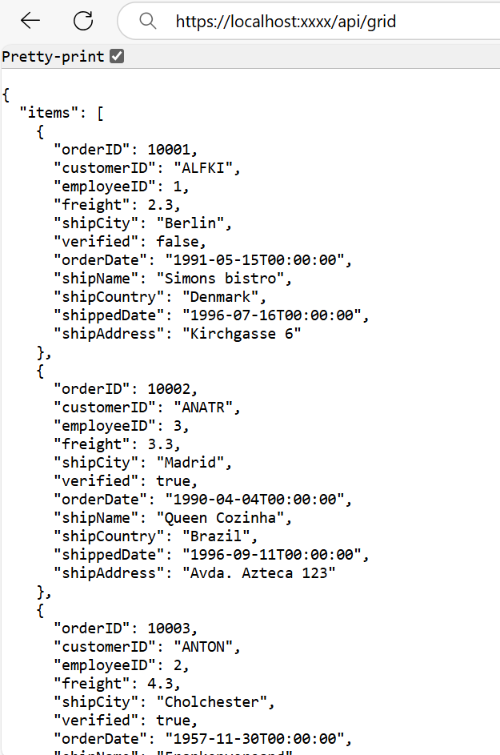

# Remote Data Binding with WebApiAdaptor in Syncfusion Blazor DataGrid

The Syncfusion<sup style="font-size:70%">&reg;</sup> Blazor DataGrid supports remote data binding to load and process large datasets through API‑driven endpoints. The [WebApiAdaptor](https://blazor.syncfusion.com/documentation/data/adaptors#web-api-adaptor) enables this capability by issuing OData‑formatted requests, allowing the server to perform operations such as **searching**, **sorting**, **filtering**, **paging**, and **CRUD** actions. The API returns structured JSON data that the DataGrid binds to for rendering and interaction.

The API service must support OData query options for compatibility with the `WebApiAdaptor`. Configuration guidelines for enabling OData query processing in ASP.NET Web API are available in the official [Microsoft documentation](https://learn.microsoft.com/en-us/aspnet/web-api/overview/odata-support-in-aspnet-web-api/supporting-odata-query-options).

This section outlines the workflow for configuring remote data binding, enabling server‑side data operations, and performing CRUD actions using the `WebApiAdaptor` in the Syncfusion<sup style="font-size:70%">&reg;</sup> Blazor DataGrid.

## What is WebApiAdaptor?

The Syncfusion<sup style="font-size:70%">&reg;</sup> Blazor `WebApiAdaptor` extends the functionality of the [ODataAdaptor](https://blazor.syncfusion.com/documentation/data/adaptors#odata-adaptor) to communicate with Web API endpoints that interpret OData‑style query parameters. The adaptor constructs requests using OData‑compatible parameters and processes JSON responses returned by the server. This design enables server‑side execution of operations such as **sorting**, **filtering**, **searching**, **paging**, and **CRUD** based on OData query conventions.

## Why choose WebApiAdaptor for remote data binding?

The `WebApiAdaptor` is designed for remote data workflows that depend on API‑based services and server‑side execution of data operations. The adaptor integrates the Syncfusion<sup style="font-size:70%">&reg;</sup> Blazor DataGrid with Web API endpoints that interpret OData‑style query parameters, enabling scalable data retrieval without transferring the entire dataset to the client.

WebApiAdaptor is appropriate when:

* Data is retrieved from centralized backend services, external API endpoints, or distributed systems that process requests using OData‑style query parameters.
* Remote data operations rely on OData‑compatible parameters for structured server‑side execution.
* Server environments apply validation, authorization, business rules, or domain‑specific logic before returning processed results.
* Large datasets require incremental retrieval to avoid transferring complete collections to the client.
* API responses follow a structured JSON format containing `Items` (processed data collection) and `Count` (total record count).
* Application architectures adopt modular APIs, microservices, or cloud‑hosted endpoints that scale horizontally.
* Remote data access workflows depend on efficient query processing and minimal payload size.

The `WebApiAdaptor` provides a consistent and efficient integration layer for binding remote data sources to the Syncfusion<sup style="font-size:70%">&reg;</sup> Blazor DataGrid in applications that depend on API‑based data operations.


**Key Advantages of WebApiAdaptor**

* **OData‑style query processing**: Supports parameters such as `$filter`, `$orderby`, `$skip`, and `$top` for structured server‑side operations.
* **Server-executed data operations**: Executes **sorting**, **filtering**, **paging**, **searching**, and **CRUD** logic on the server.
* **Optimized data transfer**: Sends only the required segment of data, reducing payload size.
* **Consistent response structure**: Uses a JSON schema containing `Items` and `Count` for reliable DataGrid rendering.
* **Scalable integration**: Works with modular APIs, microservices, cloud‑hosted backends, and distributed architectures.
* **Flexible backend workflow**: Enables integration of validation, authorization, domain rules, and custom processing logic.
* **High performance for large datasets**: Minimizes client‑side memory usage and improves Grid rendering performance.

## Who should use WebApiAdaptor?

The `WebApiAdaptor` is intended for applications that interact with ASP.NET Core Web API endpoints capable of interpreting OData‑style query parameters.

The WebApiAdaptor is intended for:

* Projects that retrieve data from Web API endpoints implementing OData‑compatible parameters such as `$filter`, `$orderby`, `$skip`, and `$top`.
* Solutions that require server‑executed operations including **filtering**, **sorting**, **paging**, **searching**, and **CRUD** processing.
* Applications that incorporate server‑side logic such as authorization, validation, transformation, or domain‑specific rules during data processing.
* Architectures that handle large datasets where incremental retrieval reduces memory usage on the client.
* REST‑based API implementations that benefit from OData‑style querying without adopting the full OData v4 protocol.
* Systems that require structured JSON responses containing `Items` and `Count` for consistent DataGrid binding.

The adaptor is not intended for services requiring full OData v4 protocol compliance; `ODataV4Adaptor` is recommended for those scenarios. For endpoints that use non‑OData or custom query formats, [UrlAdaptor](https://blazor.syncfusion.com/documentation/data/adaptors#urladaptor) or a [CustomAdaptor](https://blazor.syncfusion.com/documentation/data/adaptors#writing-custom-adaptor) is more appropriate.

## Setting up the API Service for WebApiAdaptor

This section outlines the recommended structure for configuring a Blazor Web App that includes an ASP.NET Core Web API service compatible with the `WebApiAdaptor`. The section describes the expected JSON response format and the configuration required to support OData‑style query parameters within the integrated Web API layer.

### Expected JSON Response Structure for WebApiAdaptor APIs

The API must return JSON data in a structure compatible with the `WebApiAdaptor`. The response should include the following fields:

* **Items** — A collection representing the processed records for the current request.
* **Count** — The total number of records in the data source before paging is applied.

A valid JSON response is:

```json
{
  "Items": [
    { "OrderID": 10001, "CustomerID": "ALFKI" },
    { "OrderID": 10002, "CustomerID": "ANATR" }
  ],
  "Count": 45
}
```

The Syncfusion<sup style="font-size:70%">&reg;</sup> Blazor DataGrid requires both `Items` and `Count` for proper binding when using the `WebApiAdaptor`.

* `Items` must contain the processed dataset returned after server‑side **filtering**, **sorting**, **paging**, or **searching**.
* `Count` must represent the total dataset size prior to **paging**.

### Step 1: Create a Blazor web app
 
A **Blazor Web App** is required to host the integrated ASP.NET Core Web API service used by the `WebApiAdaptor`. The project can be created using **Visual Studio 2026** through the standard [Microsoft Blazor templates](https://learn.microsoft.com/en-us/aspnet/core/blazor/tooling?view=aspnetcore-10.0&pivots=vs#blazor-project-templates-and-template-options) or the [Syncfusion<sup style="font-size:70%">&reg;</sup> Blazor Extension](https://blazor.syncfusion.com/documentation/visual-studio-integration/template-studio).

**Steps to create the Blazor Web App**

1. Open **Visual Studio 2026**.
2. Select **Create a new project**.
3. Choose the **Blazor Web App** template.
4. Enter the project name as **ODataV4Adaptor**.
5. Choose a project location.
6. Select the appropriate .NET runtime version.
7. Configure the [interactive render mode](https://learn.microsoft.com/en-us/aspnet/core/blazor/components/render-modes?view=aspnetcore-10.0#render-modes) and select the **Server** render mode for this configuration.
8. Set the [interactivity location](https://learn.microsoft.com/en-us/aspnet/core/blazor/tooling?view=aspnetcore-10.0&pivots=vs) to **Per page/component** or **Global**.
9. Create the project.

Additional setup guidance is available in the official [Microsoft documentation](https://learn.microsoft.com/en-us/aspnet/core/blazor/tooling?view=aspnetcore-10.0&pivots=vs#blazor-project-templates-and-template-options).

### Step 2: Create a model class
 
Create a **Models** folder and add a model class named **OrderDetails.cs**. This model defines the structure of the data returned in the `Items` collection of the Web API response used by the `WebApiAdaptor`.
 
```csharp

namespace WebApiAdaptor.Models
{
    /// <summary>
    /// Represents an order entity used in Web API samples that integrate with the
    /// Syncfusion® Blazor DataGrid via <c>WebApiAdaptor</c>.
    /// </summary>
    /// <remarks>
    /// This type is intended for demonstration purposes and uses an in-memory
    /// backing store. Replace with a persistent data store for production.
    /// </remarks>
    public sealed class OrderDetails
    {
        // In-memory backing store (shared for the app lifetime).
        private static readonly List<OrderDetails> _orders = new();

        // Static constructor seeds once before the first use of this type.
        static OrderDetails() => Seed(_orders);

        /// <summary>
        /// Initializes a new instance of the <see cref="OrderDetails"/> class.
        /// </summary>
        public OrderDetails()
        {
        }

        /// <summary>
        /// Initializes a new instance of the <see cref="OrderDetails"/> class with all fields.
        /// </summary>
        /// <param name="orderId">Order identifier.</param>
        /// <param name="customerId">Customer identifier.</param>
        /// <param name="employeeId">Employee identifier.</param>
        /// <param name="freight">Freight charge associated with the order.</param>
        /// <param name="verified">Indicates whether the order is verified.</param>
        /// <param name="orderDate">Order creation date.</param>
        /// <param name="shipCity">Destination city.</param>
        /// <param name="shipName">Recipient or shipping name.</param>
        /// <param name="shipCountry">Destination country.</param>
        /// <param name="shippedDate">Shipment date.</param>
        /// <param name="shipAddress">Destination address.</param>
        public OrderDetails(
            int orderId,
            string customerId,
            int employeeId,
            double freight,
            bool verified,
            DateTime orderDate,
            string shipCity,
            string shipName,
            string shipCountry,
            DateTime shippedDate,
            string shipAddress)
        {
            OrderID = orderId;
            CustomerID = customerId;
            EmployeeID = employeeId;
            Freight = freight;
            Verified = verified;
            OrderDate = orderDate;
            ShipCity = shipCity;
            ShipName = shipName;
            ShipCountry = shipCountry;
            ShippedDate = shippedDate;
            ShipAddress = shipAddress;
        }

        /// <summary>
        /// Returns the in-memory collection of orders.
        /// </summary>
        /// <returns>A <see cref="List{T}"/> containing <see cref="OrderDetails"/> entities.</returns>
        public static List<OrderDetails> GetAllRecords() => _orders;

        /// <summary>
        /// Seeds the provided collection with deterministic demo data.
        /// </summary>
        /// <param name="target">A target list to populate.</param>
        private static void Seed(List<OrderDetails> target)
        {
            var code = 10000;

            for (var i = 1; i < 10; i++)
            {
                target.Add(new OrderDetails(
                    code + 1, "ALFKI", i + 0, 2.3 * i, false,
                    new DateTime(1991, 05, 15), "Berlin", "Simons bistro", "Denmark",
                    new DateTime(1996, 07, 16), "Kirchgasse 6"));

                target.Add(new OrderDetails(
                    code + 2, "ANATR", i + 2, 3.3 * i, true,
                    new DateTime(1990, 04, 04), "Madrid", "Queen Cozinha", "Brazil",
                    new DateTime(1996, 09, 11), "Avda. Azteca 123"));

                target.Add(new OrderDetails(
                    code + 3, "ANTON", i + 1, 4.3 * i, true,
                    new DateTime(1957, 11, 30), "Cholchester", "Frankenversand", "Germany",
                    new DateTime(1996, 10, 07), "Carrera 52 con Ave. Bolívar #65-98 Llano Largo"));

                target.Add(new OrderDetails(
                    code + 4, "BLONP", i + 3, 5.3 * i, false,
                    new DateTime(1930, 10, 22), "Marseille", "Ernst Handel", "Austria",
                    new DateTime(1996, 12, 30), "Magazinweg 7"));

                target.Add(new OrderDetails(
                    code + 5, "BOLID", i + 4, 6.3 * i, true,
                    new DateTime(1953, 02, 18), "Tsawassen", "Hanari Carnes", "Switzerland",
                    new DateTime(1997, 12, 03), "1029 - 12th Ave. S."));

                code += 5;
            }
        }

        // =======================
        // Public properties
        // =======================

        /// <summary>Gets or sets the order identifier.</summary>
        public int? OrderID { get; set; }

        /// <summary>Gets or sets the customer identifier.</summary>
        public string? CustomerID { get; set; }

        /// <summary>Gets or sets the employee identifier.</summary>
        public int? EmployeeID { get; set; }

        /// <summary>Gets or sets the freight charge.</summary>
        public double? Freight { get; set; }

        /// <summary>Gets or sets the destination city.</summary>
        public string? ShipCity { get; set; }

        /// <summary>Gets or sets a value indicating whether the order is verified.</summary>
        public bool? Verified { get; set; }

        /// <summary>Gets or sets the order date.</summary>
        public DateTime OrderDate { get; set; }

        /// <summary>Gets or sets the recipient or shipping name.</summary>
        public string? ShipName { get; set; }

        /// <summary>Gets or sets the destination country.</summary>
        public string? ShipCountry { get; set; }

        /// <summary>Gets or sets the shipment date.</summary>
        public DateTime ShippedDate { get; set; }

        /// <summary>Gets or sets the destination address.</summary>
        public string? ShipAddress { get; set; }
    }
}
```
### Step 3: Create an API controller

Add a **Controllers** folder and create **GridController.cs**.

The controller exposes a **GET** endpoint that accepts OData‑style query parameters and returns data in the `Items` and `Count` structure expected by `WebApiAdaptor`.



 
using Microsoft.AspNetCore.Mvc;
using WebApiAdaptor.Models;

namespace WebApiAdaptor.Controllers
{
    /// <summary>
    /// Provides the endpoint that supplies data to the Syncfusion<sup style="font-size:70%">&reg;</sup> Blazor DataGrid
    /// when using <c>WebApiAdaptor</c>.
    /// </summary>
    [ApiController]
    [Route("api/[controller]")]
    public sealed class GridController : ControllerBase
    {
        /// <summary>
        /// Retrieves the collection of orders in the structure required by the WebApiAdaptor.
        /// </summary>
        /// <param name="cancellationToken">
        /// Propagates a notification that the operation should be canceled.
        /// </param>
        /// <returns>
        /// Returns <see cref="OkObjectResult"/> containing <c>Items</c> (the data set)
        /// and <c>Count</c> (the total number of records).
        /// </returns>
        /// <response code="200">Returns the full data collection successfully.</response>
        [HttpGet]
        [ProducesResponseType(StatusCodes.Status200OK)]
        public async Task<IActionResult> Get(CancellationToken cancellationToken)
        {
            // Retrieve the in-memory seeded dataset.
            var data = await Task.FromResult(OrderDetails.GetAllRecords());

            // Total count prior to paging.
            int totalRecordsCount = data.Count;

            // Return the items and total count.
            return Ok(new
            {
                Items = data,
                Count = totalRecordsCount
            });
        }
    }
}




>* When the [Offline](https://help.syncfusion.com/cr/blazor/Syncfusion.Blazor.DataManager.html#Syncfusion_Blazor_DataManager_Offline) property of [DataManager](https://help.syncfusion.com/cr/blazor/Syncfusion.Blazor.DataManager.html) is enabled, the API returns the entire data collection instead of the `Items` and `Count` structure. The `$inlinecount` parameter is not included, and only one request is issued in this mode.

### Step 4: Register controllers in `Program.cs`
 
Register controller services and map controller routes in the **Program.cs** file to enable Web API endpoints used by the `WebApiAdaptor`.
 
```csharp
// Register controller services.
builder.Services.AddControllers();

// Map controller endpoints.
app.MapControllers();
```
 
### Step 5: Run the application
 
1. Run the project (<kbd>F5</kbd> or <kbd>Ctrl+F5</kbd>).
2. Navigate to **https://localhost:<port>/api/grid** (replace <port> with the assigned port).
3. Verify that the endpoint returns order data.

The API response must appears in the required `Items` and `Count` structure used by the `WebApiAdaptor`.



## Integrating WebApiAdaptor with Syncfusion<sup style="font-size:70%">&reg;</sup> Blazor DataGrid
 
The Syncfusion<sup style="font-size:70%">&reg;</sup> Blazor DataGrid can be integrated with a Web API service by configuring the [DataManager](https://help.syncfusion.com/cr/blazor/Syncfusion.Blazor.DataManager.html) with a remote endpoint and the `WebApiAdaptor`. This configuration enables the DataGrid to retrieve data from the API, perform server‑side operations using OData‑style query parameters, and process CRUD actions through the `WebApiAdaptor`. To integrate the Syncfusion<sup style="font-size:70%">&reg;</sup> Blazor DataGrid into a project using Visual Studio, complete the following steps:
 
### Step 1: Install Syncfusion<sup style="font-size:70%">&reg;</sup> Packages

The Syncfusion<sup style="font-size:70%">&reg;</sup> Blazor DataGrid requires the Syncfusion<sup style="font-size:70%">&reg;</sup> Blazor component packages to be installed in the project where the DataGrid is used.

**Method 1: Using Package Manager Console**

1. Navigate to **Tools → NuGet Package Manager → Package Manager Console**.
2. Run the following commands:

```powershell
Install-Package Syncfusion.Blazor.Grid -Version {{ site.releaseversion }};
Install-Package Syncfusion.Blazor.Themes -Version {{ site.releaseversion }}
```

**Method 2: Using NuGet Package Manager UI**

1. Navigate to **Tools → NuGet Package Manager → Manage NuGet Packages for Solution**.
2. Search for and install the following packages individually:

    - [Syncfusion.Blazor.Grid](https://www.nuget.org/packages/Syncfusion.Blazor.Grid/)
    - [Syncfusion.Blazor.Themes](https://www.nuget.org/packages/Syncfusion.Blazor.Themes/)

For projects using **WebAssembly** or **Auto** interactive render modes, ensure these packages are installed in the **Client** project.

> Syncfusion<sup style="font-size:70%">&reg;</sup> Blazor components are available on [nuget.org](https://www.nuget.org/packages?q=syncfusion.blazor). For a complete list of packages, refer to [NuGet packages](https://blazor.syncfusion.com/documentation/nuget-packages).
 
### Step 2: Register Syncfusion<sup style="font-size:70%">&reg;</sup> Blazor service
 
The Syncfusion<sup style="font-size:70%">&reg;</sup> Blazor service must be registered to enable component rendering within the application.

Add the required namespaces in the **_Imports.razor** file:
 
```cs
@using Syncfusion.Blazor
@using Syncfusion.Blazor.Grids
@using Syncfusion.Blazor.Data
```
 
Register the Syncfusion<sup style="font-size:70%">&reg;</sup> Blazor service in **Program.cs**:
 
```csharp
using Syncfusion.Blazor;
 
builder.Services.AddSyncfusionBlazor();
```
 
> For Blazor Web App configured with **WebAssembly** or **Auto** interactive render modes, the Syncfusion<sup style="font-size:70%">&reg;</sup> Blazor service must be registered in the **Program.cs** files of both the **Server** project and the **Client** project.
 
### Step 3: Add stylesheet and script resources
 
Add the required theme stylesheet and script references in **~/Components/App.razor**.
 
```html
<head>
    <link href="_content/Syncfusion.Blazor.Themes/bootstrap5.css" rel="stylesheet" />
</head>

<body>

    <script src="_content/Syncfusion.Blazor.Core/scripts/syncfusion-blazor.min.js" type="text/javascript"></script>
</body>
```
 
>* For this project, the **bootstrap5** theme is used. A different theme can be selected or the existing theme can be customized based on project requirements. Refer to the [Syncfusion Blazor Components Appearance](https://blazor.syncfusion.com/documentation/appearance/themes) documentation to learn more about theming and customization options.
>* For script reference options, see [Adding Script References](https://blazor.syncfusion.com/documentation/common/adding-script-references) documentation.

### Step 4: Add Blazor DataGrid and Configure with Server
 
The Syncfusion<sup style="font-size:70%">&reg;</sup> Blazor DataGrid establishes remote data communication through the [DataManager](https://help.syncfusion.com/cr/blazor/Syncfusion.Blazor.DataManager.html) component. The endpoint defined in the [Url](https://help.syncfusion.com/cr/blazor/Syncfusion.Blazor.DataManager.html#Syncfusion_Blazor_DataManager_Url) property serves as the API target, and assigning [WebApiAdaptor](https://help.syncfusion.com/cr/blazor/Syncfusion.Blazor.Adaptors.html#Syncfusion_Blazor_Adaptors_WebApiAdaptor) to the [Adaptor](https://help.syncfusion.com/cr/blazor/Syncfusion.Blazor.DataManager.html#Syncfusion_Blazor_DataManager_Adaptor) property enables server‑side data operations through OData‑style query parameters. The Web API service processes requests and returns the response in the required `Items` and `Count` structure used by the DataGrid.
 


 
@using WebApiAdaptor.Models

<SfGrid TValue="OrderDetails" Height="348">
    <SfDataManager Url="https://localhost:xxxx/api/Grid" Adaptor="Adaptors.WebApiAdaptor"></SfDataManager>
    <GridColumns>
        <GridColumn Field="OrderID"
                    HeaderText="Order ID"
                    Width="120"
                    TextAlign="TextAlign.Right">
        </GridColumn>
        <GridColumn Field="CustomerID"
                    HeaderText="Customer Name"
                    Width="160">
        </GridColumn>
        <GridColumn Field="ShipCity"
                    HeaderText="Ship City"
                    Width="150">
        </GridColumn>
        <GridColumn Field="ShipCountry"
                    HeaderText="Ship Country"
                    Width="150">
        </GridColumn>
    </GridColumns>
</SfGrid>



 
> Replace the placeholder URL **https://localhost:xxxx/api/Grid** with the actual API endpoint that returns data in JSON format.
 
### Step 5: Run the application
 
Running the application initializes the DataGrid and retrieves data from the configured API endpoint. The DataGrid renders the processed collection returned by the service.
 


## Perform data operations in WebApiAdaptor

The `WebApiAdaptor` enables server‑side execution of DataGrid operations by sending OData‑style query parameters to the API endpoint through the `DataManager` component. Each operation—**searching**, **filtering**, **sorting**, and **paging**—is executed on the server based on the values contained in the query string. The controller processes these parameters and returns a JSON response containing `Items` and `Count`.

**Query parameters for data operations**

The `WebApiAdaptor` sends OData‑style query parameters to the API to perform server‑side data operations. The table lists the parameters used by the Syncfusion<sup style="font-size:70%">&reg;</sup> Blazor DataGrid.

| Operation | Query Parameters | Use Case                                                                   |
|-----------|------------------|----------------------------------------------------------------------------|
| Paging    | `$skip`, `$top`  | Controls the number of records skipped and the number of records returned. |
| Filtering | `$filter`        | Applies field‑level filter conditions to refine the data collection.       |
| Searching | `$filter`        | Performs text‑based search using substring or matching expressions.        |
| Sorting   | `$orderby`       | Specifies the fields and sort direction for ordered data retrieval.        |

> These parameters are automatically included in requests when the `WebApiAdaptor` is used, and can be processed in the Web API controller through the request query collection.

### Searching

When a search operation is triggered, the `$filter` parameter is sent to the server. The `$filter` parameter specifies the query conditions that are applied to the data to perform the search.





using Microsoft.AspNetCore.Mvc;
using WebApiAdaptor.Models;

namespace WebApiAdaptor.Controllers
{
    [ApiController]
    [Route("api/[controller]")]
    public class GridController : ControllerBase
    {
        /// <summary>
        /// Returns order data and applies server-side search when the <c>$filter</c> query parameter contains OData-style substring expressions.
        /// </summary>
        /// <returns>
        /// HTTP 200 with:
        /// <list type="bullet">
        ///   <item><description><c>Items</c> — filtered collection.</description></item>
        ///   <item><description><c>Count</c> — total record count prior to paging.</description></item>
        /// </list>
        /// </returns>
        [HttpGet]
        [ProducesResponseType(StatusCodes.Status200OK)]
        public IActionResult GetOrderData()
        {
            List<OrderDetails> data = OrderDetails.GetAllRecords().ToList();

            string? filterQuery = Request.Query["$filter"];

            if (!string.IsNullOrWhiteSpace(filterQuery))
            {
                string[] conditions = filterQuery.Split(
                    " and ",
                    StringSplitOptions.RemoveEmptyEntries | StringSplitOptions.TrimEntries);

                foreach (string condition in conditions)
                {
                    if (condition.Contains("substringof", StringComparison.OrdinalIgnoreCase))
                    {
                        string searchValue = ExtractSubstringValue(condition);

                        if (!string.IsNullOrEmpty(searchValue))
                        {
                            data = data
                                .Where(order =>
                                    (order.OrderID?.ToString()?.Contains(searchValue, StringComparison.OrdinalIgnoreCase) ?? false) ||
                                    (order.CustomerID?.Contains(searchValue, StringComparison.OrdinalIgnoreCase) ?? false) ||
                                    (order.ShipCity?.Contains(searchValue, StringComparison.OrdinalIgnoreCase) ?? false) ||
                                    (order.ShipCountry?.Contains(searchValue, StringComparison.OrdinalIgnoreCase) ?? false))
                                .ToList();
                        }
                    }
                }
            }

            // Total count prior to paging.
            int totalRecordsCount = data.Count;

            // Return the items and total count.
            return Ok(new
            {
                Items = data,
                Count = totalRecordsCount
            });
        }

        /// <summary>
        /// Extracts the search value from an OData <c>substringof</c> expression.
        /// </summary>
        /// <param name="condition">Expression such as <c>substringof('abc', CustomerID)</c>.</param>
        /// <returns>Extracted search value, or an empty string when the pattern is invalid.</returns>
        private static string ExtractSubstringValue(string condition)
        {
            int firstQuote = condition.IndexOf('\'');
            if (firstQuote < 0)
            {
                return string.Empty;
            }

            int secondQuote = condition.IndexOf('\'', firstQuote + 1);
            if (secondQuote <= firstQuote)
            {
                return string.Empty;
            }

            return condition.Substring(firstQuote + 1, secondQuote - firstQuote - 1);
        }
    }
}





@using WebApiAdaptor.Models

<SfGrid TValue="OrderDetails"
        Toolbar="@(new List<string> { "Search" })"
        Height="348">
    <SfDataManager Url="https://localhost:xxxx/api/Grid"
                   Adaptor="Adaptors.WebApiAdaptor">
    </SfDataManager>
    <GridColumns>
        <GridColumn Field="OrderID"
                    HeaderText="Order ID"
                    Width="120"
                    TextAlign="TextAlign.Right">
        </GridColumn>
        <GridColumn Field="CustomerID"
                    HeaderText="Customer Name"
                    Width="160">
        </GridColumn>
        <GridColumn Field="ShipCity"
                    HeaderText="Ship City"
                    Width="150">
        </GridColumn>
        <GridColumn Field="ShipCountry"
                    HeaderText="Ship Country"
                    Width="150">
        </GridColumn>
    </GridColumns>
</SfGrid>




> This example illustrates a custom approach for processing the `$filter` query parameter submitted by the DataGrid. Additional logic or dynamic expression evaluation libraries can be integrated to support more generic or complex filtering requirements.

### Filtering

Filtering is executed when the DataGrid includes the `$filter` parameter in the request. This parameter represents one or more filter conditions combined with logical operators and is evaluated on the server to refine the result set.





using Microsoft.AspNetCore.Mvc;
using WebApiAdaptor.Models;

namespace WebApiAdaptor.Controllers
{
    [ApiController]
    [Route("api/[controller]")]
    public class GridController : ControllerBase
    {
        /// <summary>
        /// Returns order data and applies server-side filtering using the OData-style <c>$filter</c> query parameter.
        /// Multiple filter conditions joined with <c>and</c> are supported.
        /// Filtering based on <c>substringof</c> is excluded here.
        /// </summary>
        /// <returns>
        /// HTTP 200 (OK) containing:
        /// <list type="bullet">
        ///     <item><description><c>Items</c> — filtered collection.</description></item>
        ///     <item><description><c>Count</c> — total record count before paging.</description></item>
        /// </list>
        /// </returns>
        [HttpGet]
        [ProducesResponseType(StatusCodes.Status200OK)]
        public IActionResult GetOrderData()
        {
            // Retrieve the full collection.
            List<OrderDetails> data = OrderDetails.GetAllRecords().ToList();

            // Read $filter from the query string.
            string? filterQuery = Request.Query["$filter"];

            if (!string.IsNullOrWhiteSpace(filterQuery))
            {
                // Split multiple conditions combined with logical AND.
                string[] conditions = filterQuery.Split(
                    new[] { " and " },
                    StringSplitOptions.RemoveEmptyEntries);

                foreach (string condition in conditions)
                {
                    // Skip substring search in this filtering sample (handled in the Searching section).
                    if (condition.Contains("substringof", StringComparison.OrdinalIgnoreCase))
                    {
                        continue;
                    }
                    // Parse field and value from an OData-like condition.
                    string filterField = string.Empty;
                    string filterValue = string.Empty;

                    string[] parts = condition.Split('(', ')', '\'');

                    if (parts.Length < 6)
                    {
                        // Example: OrderID eq 10248
                        string[] tokens = parts[1].Split(
                            ' ',
                            StringSplitOptions.RemoveEmptyEntries);

                        filterField = tokens.Length > 0 ? tokens[0] : string.Empty;
                        filterValue = tokens.Length > 2 ? tokens[2].Trim('\'') : string.Empty;
                    }
                    else
                    {
                        // Example pattern that includes parentheses/ quoted values.
                        filterField = parts[3];
                        filterValue = parts[5];
                    }

                    // Apply filtering
                    switch (filterField)
                    {
                        case "OrderID":
                            data = data
                                .Where(item =>
                                    item is not null &&
                                    (item.OrderID?.ToString()?.Equals(filterValue, StringComparison.OrdinalIgnoreCase) ?? false))
                                .ToList();
                            break;

                        case "CustomerID":
                            data = data
                                .Where(item =>
                                    item is not null &&
                                    (item.CustomerID?.StartsWith(filterValue, StringComparison.OrdinalIgnoreCase) ?? false))
                                .ToList();
                            break;

                        case "ShipCity":
                            data = data
                                .Where(item =>
                                    item is not null &&
                                    (item.ShipCity?.StartsWith(filterValue, StringComparison.OrdinalIgnoreCase) ?? false))
                                .ToList();
                            break;

                        case "ShipCountry":
                            data = data
                                .Where(item =>
                                    item is not null &&
                                    (item.ShipCountry?.StartsWith(filterValue, StringComparison.OrdinalIgnoreCase) ?? false))
                                .ToList();
                            break;

                            /// Extend with additional fields if require
                    }
                }
            }

            // Total count prior to paging.
            int totalRecordsCount = data.Count;

            // Return data and count.
            return Ok(new
            {
                Items = data,
                Count = totalRecordsCount
            });
        }
    }
}





@using WebApiAdaptor.Models

<SfGrid TValue="OrderDetails"
        AllowFiltering="true"
        Height="348">
    <SfDataManager Url="https://localhost:xxxx/api/Grid"
                   Adaptor="Adaptors.WebApiAdaptor">
    </SfDataManager>
    <GridColumns>
        <GridColumn Field="OrderID"
                    HeaderText="Order ID"
                    Width="120"
                    TextAlign="TextAlign.Right">
        </GridColumn>
        <GridColumn Field="CustomerID"
                    HeaderText="Customer Name"
                    Width="160">
        </GridColumn>
        <GridColumn Field="ShipCity"
                    HeaderText="Ship City"
                    Width="150">
        </GridColumn>
        <GridColumn Field="ShipCountry"
                    HeaderText="Ship Country"
                    Width="150">
        </GridColumn>
    </GridColumns>
</SfGrid>




> The `$filter` parameter can contain conditions such as **substringof**, **eq** (equals), **gt** (greater than), and related comparison operators. Filtering behavior can be extended to support additional expressions or custom evaluation logic based on the data structure.

### Sorting

Sorting is performed when the DataGrid includes the `$orderby` parameter in the request. This parameter identifies one or more fields and the corresponding sort direction in **ascending** or **descending** order. The server interprets the parameter and applies the appropriate ordering to the data collection.

***Ascending Sorting***


***Descending Sorting***





using Microsoft.AspNetCore.Mvc;
using System.Reflection;
using WebApiAdaptor.Models;

namespace WebApiAdaptor.Controllers
{
    /// <summary>
    /// Provides endpoints for retrieving order data for DataGrid operations.
    /// </summary>
    [ApiController]
    [Route("api/[controller]")]
    public class GridController : ControllerBase
    {
        /// <summary>
        /// Retrieves order data and applies server-side sorting using the OData-style <c>$orderby</c> query parameter.
        /// </summary>
        /// <remarks>
        /// Supports multiple sort clauses separated by commas. Each clause can specify direction:
        /// <para><c>ShipCountry desc, ShipCity asc</c></para>
        /// Property names are resolved via reflection on <see cref="OrderDetails"/>. Unknown fields are ignored.
        /// </remarks>
        /// <returns>
        /// An <see cref="IActionResult"/> with HTTP 200 (OK) containing:
        /// <list type="bullet">
        ///   <item><description><c>Items</c> — sorted data collection.</description></item>
        ///   <item><description><c>Count</c> — total record count before paging.</description></item>
        /// </list>
        /// </returns>
        [HttpGet]
        [ProducesResponseType(StatusCodes.Status200OK)]
        public IActionResult GetOrderData()
        {
            // Retrieve the full collection.
            List<OrderDetails> data = OrderDetails.GetAllRecords().ToList();

            // Read $orderby from the query string.
            string? orderByQuery = Request.Query["$orderby"];

            if (!string.IsNullOrWhiteSpace(orderByQuery))
            {
                // Multiple fields example: "ShipCountry desc, ShipCity asc"
                IEnumerable<string> sortClauses = orderByQuery
                    .Split(',', StringSplitOptions.RemoveEmptyEntries)
                    .Select(c => c.Trim());

                IOrderedEnumerable<OrderDetails>? ordered = null;

                foreach (string clause in sortClauses)
                {
                    // Each clause: "FieldName [asc|desc]"
                    string[] parts = clause.Split(' ', StringSplitOptions.RemoveEmptyEntries | StringSplitOptions.TrimEntries);
                    if (parts.Length == 0)
                    {
                        continue;
                    }

                    string fieldName = parts[0];
                    bool isDesc = parts.Length > 1 && parts[1].Equals("desc", StringComparison.OrdinalIgnoreCase);

                    // Resolve property by name (case-sensitive per model; adjust if necessary).
                    PropertyInfo? prop = typeof(OrderDetails).GetProperty(fieldName, BindingFlags.Public | BindingFlags.Instance);
                    if (prop is null)
                    {
                        // Skip unknown fields.
                        continue;
                    }

                    // Key selector with null handling.
                    Func<OrderDetails, object?> keySelector = item => prop.GetValue(item, null);

                    // Apply primary or subsequent orderings.
                    ordered = ordered is null
                        ? (isDesc ? data.OrderByDescending(keySelector) : data.OrderBy(keySelector))
                        : (isDesc ? ordered.ThenByDescending(keySelector) : ordered.ThenBy(keySelector));
                }

                if (ordered is not null)
                {
                    data = ordered.ToList();
                }
            }

            // Total count prior to paging.
            int totalRecordsCount = data.Count;

            // Return data and count.
            return Ok(new
            {
                Items = data,
                Count = totalRecordsCount
            });
        }
    }
}





@using WebApiAdaptor.Models

<SfGrid TValue="OrderDetails"
        AllowSorting="true"
        Height="348">
    <SfDataManager Url="https://localhost:xxxx/api/Grid"
                   Adaptor="Adaptors.WebApiAdaptor">
    </SfDataManager>
    <GridColumns>
        <GridColumn Field="OrderID"
                    HeaderText="Order ID"
                    Width="120"
                    TextAlign="TextAlign.Right">
        </GridColumn>
        <GridColumn Field="CustomerID"
                    HeaderText="Customer Name"
                    Width="160">
        </GridColumn>
        <GridColumn Field="ShipCity"
                    HeaderText="Ship City"
                    Width="150">
        </GridColumn>
        <GridColumn Field="ShipCountry"
                    HeaderText="Ship Country"
                    Width="150">
        </GridColumn>
    </GridColumns>
</SfGrid>




> The `$orderby` parameter enables dynamic sorting by defining one or more fields and their associated sort directions in **ascending** or **descending** order.

### Paging

Paging is executed when the DataGrid includes the `$skip` and `$top` parameters in the request. The `$skip` parameter specifies the number of records to ignore, and `$top` specifies the number of records to return for the current page. The server applies these values to return the requested segment while preserving the total record count.





using Microsoft.AspNetCore.Mvc;
using WebApiAdaptor.Models;

namespace WebApiAdaptor.Controllers
{
    [ApiController]
    [Route("api/[controller]")]
    public class GridController : ControllerBase
    {
        /// <summary>
        /// Retrieves order data and applies server-side paging using the <c>$skip</c> and <c>$top</c> query parameters.
        /// </summary>
        /// <remarks>
        /// The total count is computed before paging. When <c>$top</c> is zero or missing, the entire collection is returned.
        /// Non-numeric or negative values for <c>$skip</c> and <c>$top</c> are treated as zero.
        /// </remarks>
        /// <returns>
        /// HTTP 200 (OK) containing:
        /// <list type="bullet">
        ///   <item><description><c>Items</c> — paged data collection.</description></item>
        ///   <item><description><c>Count</c> — total record count prior to paging.</description></item>
        /// </list>
        /// </returns>
        [HttpGet]
        [ProducesResponseType(StatusCodes.Status200OK)]
        public IActionResult GetOrderData()
        {
            // Materialize the full collection in memory.
            List<OrderDetails> data = OrderDetails.GetAllRecords().ToList();

            // Compute total count before any paging is applied.
            int totalRecordsCount = data.Count;

            // Read raw query values.
            string? skipQueryValue = Request.Query["$skip"];
            string? topQueryValue  = Request.Query["$top"];

            // Parse query values safely; invalid input becomes zero.
            _ = int.TryParse(skipQueryValue, out int skip);
            _ = int.TryParse(topQueryValue, out int top);

            // Normalize negatives to zero for stability.
            if (skip < 0) skip = 0;
            if (top  < 0) top  = 0;

            // Optional hardening: avoid overshooting the available range.
            // if (skip > totalRecordsCount) skip = totalRecordsCount;

            // Apply paging only when $top > 0; otherwise return full set.
            IEnumerable<OrderDetails> items = top > 0
                ? data.Skip(skip).Take(top) // skip N, take M
                : data;                     // return all items

            // Return the paged items and the unpaged total count.
            return Ok(new
            {
                Items = items.ToList(),
                Count = totalRecordsCount
            });
        }
    }
}




@using WebApiAdaptor.Models

<SfGrid TValue="OrderDetails"
        AllowPaging="true"
        Height="348">
    <SfDataManager Url="https://localhost:xxxx/api/Grid"
                   Adaptor="Adaptors.WebApiAdaptor">
    </SfDataManager>
    <GridColumns>
        <GridColumn Field="OrderID"
                    HeaderText="Order ID"
                    Width="120"
                    TextAlign="TextAlign.Right">
        </GridColumn>
        <GridColumn Field="CustomerID"
                    HeaderText="Customer Name"
                    Width="160">
        </GridColumn>
        <GridColumn Field="ShipCity"
                    HeaderText="Ship City"
                    Width="150">
        </GridColumn>
        <GridColumn Field="ShipCountry"
                    HeaderText="Ship Country"
                    Width="150">
        </GridColumn>
    </GridColumns>
</SfGrid>




> Always compute the total record count before applying **paging**. This ensures accurate pagination behavior when the DataGrid processes server-side operations.

N> Dynamic LINQ expressions can be used to perform server-side **filtering**, **sorting**, and **paging**. The implementation approach is demonstrated in this [GitHub repository](https://github.com/SyncfusionExamples/blazor-datagrid-data-operations-in-wep-api-service).

## Perform CRUD operations in WebApiAdaptor

The Syncfusion<sup style="font-size:70%">&reg;</sup> Blazor DataGrid supports server‑side CRUD execution when configured with the `WebApiAdaptor`. The adaptor communicates with Web API endpoints using standard **HTTP methods** for creating, reading, updating, and deleting entities. Each operation is processed on the server, and the updated data collection is returned to the DataGrid through the configured endpoint.

**CRUD mapping overview**

| DataGrid Action | HTTP Method | Use Case                             |
|-----------------|-------------|--------------------------------------|
| Read            | `GET`       | Retrieves the entity collection from the service.       |
| Create          | `POST`      | Inserts a new entity into the collection. |
| Update          | `PUT`     | Updates the entity that matches the specified key. |
| Delete          | `DELETE`    | Removes the entity that matches the specified key. |

To enable editing in the DataGrid, configure the [GridEditSettings](https://help.syncfusion.com/cr/blazor/Syncfusion.Blazor.Grids.GridEditSettings.html) and [Toolbar](https://help.syncfusion.com/cr/blazor/Syncfusion.Blazor.Grids.SfGrid-1.html#Syncfusion_Blazor_Grids_SfGrid_1_Toolbar) properties to allow adding, editing, and deleting records.




@using WebApiAdaptor.Models

<SfGrid TValue="OrderDetails"
        Toolbar="@(new List<string>() { "Add", "Edit", "Delete", "Update", "Cancel" })"
        Height="348">
    <SfDataManager Url="https://localhost:xxxx/api/Grid"
                   Adaptor="Adaptors.WebApiAdaptor">
    </SfDataManager>
    <GridEditSettings AllowEditing="true"
                      AllowDeleting="true"
                      AllowAdding="true"
                      Mode="EditMode.Normal">
    </GridEditSettings>
    <GridColumns>
        <GridColumn Field="OrderID"
                    HeaderText="Order ID"
                    Width="120"
                    IsPrimaryKey="true"
                    ValidationRules="@(new ValidationRules{ Required= true })"
                    TextAlign="TextAlign.Right">
        </GridColumn>
        <GridColumn Field="CustomerID"
                    HeaderText="Customer Name"
                    ValidationRules="@(new ValidationRules{ Required= true, MinLength=3 })"
                    Width="160">
        </GridColumn>
        <GridColumn Field="ShipCity"
                    HeaderText="Ship City"
                    Width="150">
        </GridColumn>
        <GridColumn Field="ShipCountry"
                    HeaderText="Ship Country"
                    Width="150">
        </GridColumn>
    </GridColumns>
</SfGrid>




> Normal or Inline editing is the default edit `Mode` for the DataGrid. To enable CRUD operations, ensure the [IsPrimaryKey](https://help.syncfusion.com/cr/blazor/Syncfusion.Blazor.Grids.GridColumn.html#Syncfusion_Blazor_Grids_GridColumn_IsPrimaryKey) property is set to **true** for a unique column.

### Insert operation

To insert a new record, implement the `HttpPost` request to the configured API endpoint. The server receives the entity through the **newRecord** parameter and inserts it into the data collection.

In this sample, the retrieval endpoint is the `GetById` action, which returns a record based on its primary key. The primary key value of the inserted entity is passed to `GetById` to generate a canonical URL for the newly created item.





/// <summary>
/// Retrieves an entity by its primary key.
/// </summary>
/// <param name="id">
/// The primary key value used to locate the entity.
/// </param>
/// <param name="cancellationToken">
/// A token used to propagate a cancellation request.
/// </param>
/// <returns>
/// An <see cref="OkObjectResult"/> containing the entity when found; 
/// otherwise a <see cref="NotFoundResult"/>.
/// </returns>
/// <response code="200">Returns the matched entity.</response>
/// <response code="404">No entity exists with the specified identifier.</response>
[HttpGet("{id:int}")] // Maps HTTP GET requests to this action with an integer route parameter named 'id'.
[ProducesResponseType(StatusCodes.Status200OK)]        // Declares 200 OK as a possible response.
[ProducesResponseType(StatusCodes.Status404NotFound)]  // Declares 404 Not Found as a possible response.
public async Task<IActionResult> GetById(int id, CancellationToken cancellationToken)
{

    // Retrieves the first entity matching the provided key from the in-memory collection.
    var entity = await Task.FromResult(
        OrderDetails.GetAllRecords().FirstOrDefault(o => o.OrderID == id));

    // Returns 404 when not found; otherwise returns 200 with the entity payload.
    return entity is null ? NotFound() : Ok(entity);
}

/// <summary>
/// Inserts a new entity into the in-memory collection.
/// </summary>
/// <param name="newRecord">
/// The entity instance to insert.
/// </param>
/// <param name="cancellationToken">
/// A token used to propagate a cancellation request.
/// </param>
/// <returns>
/// A <see cref="CreatedAtActionResult"/> containing the created entity on success; 
/// otherwise a <see cref="BadRequestObjectResult"/> when validation fails.
/// </returns>
/// <remarks>
/// The sample uses an in-memory collection for demonstration. Replace with persistent storage as required.
/// </remarks>
/// <response code="201">
/// Entity created successfully; the Location header contains the resource URL.
/// </response>
/// <response code="400">
/// Validation failed or a duplicate key exists.
/// </response>
[HttpPost]
[ProducesResponseType(StatusCodes.Status201Created)]
[ProducesResponseType(StatusCodes.Status400BadRequest)]
public async Task<IActionResult> Post(
    [FromBody] OrderDetails? newRecord,
    CancellationToken cancellationToken)
{
    if (newRecord is null)
        return BadRequest("Request body is required."); // Rejects missing or invalid request payload.

    if (newRecord.OrderID == 0)
        return BadRequest("OrderID must be a non-zero value."); // Ensures a valid key is supplied.

    // Retrieves the in-memory data store.
    var store = OrderDetails.GetAllRecords();

    if (store.Any(o => o.OrderID == newRecord.OrderID))
        return BadRequest($"An entity with OrderID '{newRecord.OrderID}' already exists."); // Prevents duplicate keys.

    // Inserts the entity at index zero of the in-memory collection.
    store.Insert(0, newRecord);

    // Returns 201 Created and provides a canonical URL pointing to the newly created entity.
    return await Task.FromResult(
        CreatedAtAction(nameof(GetById), new { id = newRecord.OrderID }, newRecord));
}




### Update operation

To update a record, implement an `HttpPut` request to the configured API endpoint. The server receives the modified entity through the **updatedRecord** parameter and applies the updated values to the existing item in the data collection.





/// <summary>
/// Updates an existing entity in the in-memory collection.
/// </summary>
/// <param name="updatedRecord">Represents the entity with updated values.</param>
/// <param name="cancellationToken">Propagates a notification that operations should be canceled.</param>
/// <returns>
/// Returns <see cref="NoContentResult"/> when the update succeeds; 
/// <see cref="BadRequestObjectResult"/> when the input is invalid; 
/// <see cref="NotFoundObjectResult"/> when no entity matches the provided key.
/// </returns>
/// <remarks>
/// If editing of the primary key is not intended, omit assignments that modify <c>OrderID</c>.
/// </remarks>
/// <response code="204">Entity updated successfully.</response>
/// <response code="400">Validation failed.</response>
/// <response code="404">No entity exists with the specified identifier.</response>
[HttpPut]
[ProducesResponseType(StatusCodes.Status204NoContent)]
[ProducesResponseType(StatusCodes.Status400BadRequest)]
[ProducesResponseType(StatusCodes.Status404NotFound)]
public async Task<IActionResult> Put(
    [FromBody] OrderDetails? updatedRecord,
    CancellationToken cancellationToken)
{
    if (updatedRecord is null)
        return BadRequest("Request body is required.");

    if (updatedRecord.OrderID == 0)
        return BadRequest("OrderID must be provided for update.");

    var store = OrderDetails.GetAllRecords();

    var existing = store.FirstOrDefault(o => o.OrderID == updatedRecord.OrderID);
    if (existing is null)
        return NotFound($"No entity found with OrderID '{updatedRecord.OrderID}'.");

    // Apply updates to the supported editable fields.
    existing.CustomerID  = updatedRecord.CustomerID;
    existing.ShipCity    = updatedRecord.ShipCity;
    existing.ShipCountry = updatedRecord.ShipCountry;

    // Assign only when primary key modification is intended
    existing.OrderID     = updatedRecord.OrderID;

    return await Task.FromResult(NoContent());
}




### Delete operation

To delete a record, implement an `HttpDelete` endpoint in the API controller. The record is identified using the primary key value supplied in the route parameter, and the matching entity is removed from the data collection.






/// <summary>
/// Removes an entity identified by its primary key from the in-memory collection.
/// </summary>
/// <param name="id">
/// The primary key value used to locate the entity.
/// </param>
/// <param name="cancellationToken">
/// A token used to propagate a cancellation request.
/// </param>
/// <returns>
/// A <see cref="NoContentResult"/> when the entity is successfully removed;
/// otherwise a <see cref="NotFoundObjectResult"/> when the entity cannot be located.
/// </returns>
/// <response code="204">
/// Indicates that the entity was deleted successfully.
/// </response>
/// <response code="404">
/// Indicates that no entity exists with the specified identifier.
/// </response>
[HttpDelete("{id:int}")] // Maps DELETE requests to this action, with an integer route parameter named 'id'.
[ProducesResponseType(StatusCodes.Status204NoContent)] // Declares 204 No Content as a possible response.
[ProducesResponseType(StatusCodes.Status404NotFound)]  // Declares 404 Not Found as a possible response.
public async Task<IActionResult> Delete(int id, CancellationToken cancellationToken)
{
    // Retrieves the in-memory collection of OrderDetails entities.
    var store = OrderDetails.GetAllRecords();

    // Locates the entity matching the provided 'id'.
    var toRemove = store.FirstOrDefault(o => o.OrderID == id);

    // Checks whether a matching entity exists.
    if (toRemove is null) 
        return NotFound($"No entity found with OrderID '{id}'."); // Returns 404 with a descriptive message when not found.

    // Removes the located entity from the collection. Discards the boolean result intentionally.
    _ = store.Remove(toRemove);

    // Returns 204 to indicate the delete operation succeeded and no content is returned in the response body.
    return await Task.FromResult(NoContent());
}





N> Batch mode CRUD operations are not supported when using `WebApiAdaptor` in Syncfusion<sup style="font-size:70%">&reg;</sup> Blazor DataGrid. ASP.NET Core Web API does not provide the OData routing or `$batch` endpoint required for batch handling, and Microsoft’s batch support applies only to full OData services configured with OData routing and an OData batch handler such as `DefaultODataBatchHandler`. Community discussions also show that batch behavior depends on OData routing and does not work with non‑OData endpoints in recent ASP.NET Core versions. For more details, refer to the [GitHub issue](https://github.com/dotnet/aspnetcore/issues/14722).