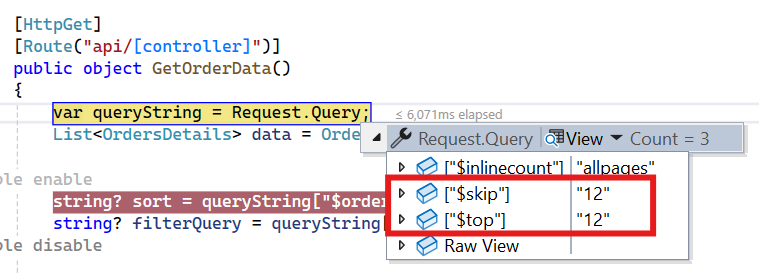
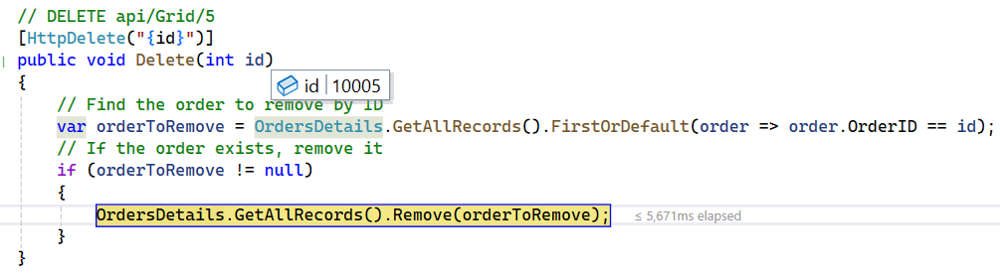

# WebApiAdaptor in Syncfusion<sup style="font-size:70%">&reg;</sup> Blazor DataGrid

The [WebApiAdaptor](https://blazor.syncfusion.com/documentation/data/adaptors#web-api-adaptor) is an extension of the [ODataAdaptor](https://blazor.syncfusion.com/documentation/data/adaptors#odata-adaptor), designed to interact with Web APIs created with OData endpoints. This adaptor ensures seamless communication between the Syncfusion<sup style="font-size:70%">&reg;</sup> Blazor DataGrid and OData-endpoint-based Web APIs, enabling efficient data retrieval and manipulation. For successful integration, the endpoint must be capable of understanding OData-formatted queries sent along with the request.

To enable the OData query option for a Web API, please refer to the corresponding [documentation](https://learn.microsoft.com/en-us/aspnet/web-api/overview/odata-support-in-aspnet-web-api/supporting-odata-query-options), which provides detailed instructions on configuring the endpoint to understand OData-formatted queries.

This section describes a step-by-step process for retrieving data using the `WebApiAdaptor` and binding it to the Blazor Grid to facilitate data and CRUD operations.

## Creating an API service
 
To configure a server with the Syncfusion<sup style="font-size:70%">&reg;</sup> Blazor DataGrid, follow these steps:
 
**1. Create a Blazor web app**
 
You can create a **Blazor Web App** named **WebApiAdaptor** using Visual Studio 2022, either via [Microsoft Templates](https://learn.microsoft.com/en-us/aspnet/core/blazor/tooling?view=aspnetcore-8.0) or the [Syncfusion<sup style="font-size:70%">&reg;</sup> Blazor Extension](https://blazor.syncfusion.com/documentation/visual-studio-integration/template-studio). Make sure to configure the appropriate [interactive render mode](https://learn.microsoft.com/en-us/aspnet/core/blazor/components/render-modes?view=aspnetcore-8.0#render-modes) and [interactivity location](https://learn.microsoft.com/en-us/aspnet/core/blazor/tooling?view=aspnetcore-8.0&pivots=windows).

**2. Create a model class**
 
Create a new folder named **Models**. Then, add a model class named **OrdersDetails.cs** in the **Models** folder to represent the order data.
 
```csharp
namespace WebApiAdaptor.Models
{
    public class OrdersDetails
    {
        public static List<OrdersDetails> order = new List<OrdersDetails>();

        public OrdersDetails() { }
 
        public OrdersDetails(int OrderID, string CustomerId, int EmployeeId, double Freight, bool Verified, DateTime OrderDate, string ShipCity, string ShipName, string ShipCountry, DateTime ShippedDate, string ShipAddress)
        {
            this.OrderID = OrderID;
            this.CustomerID = CustomerId;
            this.EmployeeID = EmployeeId;
            this.Freight = Freight;
            this.ShipCity = ShipCity;
            this.Verified = Verified;
            this.OrderDate = OrderDate;
            this.ShipName = ShipName;
            this.ShipCountry = ShipCountry;
            this.ShippedDate = ShippedDate;
            this.ShipAddress = ShipAddress;
        }

        public static List<OrdersDetails> GetAllRecords()
        {
            if (order.Count() == 0)
            {
                int code = 10000;
                for (int i = 1; i < 10; i++)
                {
                    order.Add(new OrdersDetails(code + 1, "ALFKI", i + 0, 2.3 * i, false, new DateTime(1991, 05, 15), "Berlin", "Simons bistro", "Denmark", new DateTime(1996, 7, 16), "Kirchgasse 6"));
                    order.Add(new OrdersDetails(code + 2, "ANATR", i + 2, 3.3 * i, true, new DateTime(1990, 04, 04), "Madrid", "Queen Cozinha", "Brazil", new DateTime(1996, 9, 11), "Avda. Azteca 123"));
                    order.Add(new OrdersDetails(code + 3, "ANTON", i + 1, 4.3 * i, true, new DateTime(1957, 11, 30), "Cholchester", "Frankenversand", "Germany", new DateTime(1996, 10, 7), "Carrera 52 con Ave. Bolívar #65-98 Llano Largo"));
                    order.Add(new OrdersDetails(code + 4, "BLONP", i + 3, 5.3 * i, false, new DateTime(1930, 10, 22), "Marseille", "Ernst Handel", "Austria", new DateTime(1996, 12, 30), "Magazinweg 7"));
                    order.Add(new OrdersDetails(code + 5, "BOLID", i + 4, 6.3 * i, true, new DateTime(1953, 02, 18), "Tsawassen", "Hanari Carnes", "Switzerland", new DateTime(1997, 12, 3), "1029 - 12th Ave. S."));
                    code += 5;
                }
            }
            return order;
        }

        public int? OrderID { get; set; }
        public string? CustomerID { get; set; }
        public int? EmployeeID { get; set; }
        public double? Freight { get; set; }
        public string? ShipCity { get; set; }
        public bool? Verified { get; set; }
        public DateTime OrderDate { get; set; }
        public string? ShipName { get; set; }
        public string? ShipCountry { get; set; }
        public DateTime ShippedDate { get; set; }
        public string? ShipAddress { get; set; }
    }
}
```
**3. Create an API controller**

Create a new folder named **Controllers**. Then, add a controller named **GridController.cs** in the **Controllers** folder to handle data communication with Blazor DataGrid. Implement the `Get` method in the controller to return data in JSON format, including the `Items` and `Count` properties as required by the `WebApiAdaptor`.

The sample response object should look like this:

```
{
    Items: [{..}, {..}, {..}, ...],
    Count: 830
}
```



 
using Microsoft.AspNetCore.Mvc;
using Syncfusion.Blazor.Data;
using Syncfusion.Blazor;
using WebApiAdaptor.Models;

namespace WebApiAdaptor.Controllers
{
    [ApiController]
    public class GridController : ControllerBase
    {
        /// <summary>
        /// Retrieve data from the data source.
        /// </summary>
        /// <returns>Returns a JSON object with the list of orders and the total count.</returns>
        [HttpGet]
        [Route("api/[controller]")]
        public object GetOrderData()
        {
            // Retrieve all order records.
            List<OrdersDetails> data = OrdersDetails.GetAllRecords().ToList();

            // Return the data and total count.
            return new { Items = data, Count = data.Count() };
        }
    }
}




> When using the WebAPI Adaptor, the data source is returned as a pair of **Items** and **Count**. However, if the `Offline` property of `SfDataManager` is enabled, the entire data source is returned from the server as a collection of objects. In this case, the `$inlinecount` will not be included. Additionally, only a single request is made to fetch all the data from the server, and no further requests are sent.

**4. Register controllers in `Program.cs`**
 
Add the following lines in the `Program.cs` file to register controllers:
 
```csharp
// Register controllers in the service container.
builder.Services.AddControllers();
 
// Map controller routes.
app.MapControllers();
```
 
**5. Run the application**
 
Run the application in Visual Studio. The API will be accessible at a URL like **https://localhost:xxxx/api/Grid** (where **xxxx** represents the port number). Please verify that the API returns the order data.
 


## Connecting Syncfusion<sup style="font-size:70%">&reg;</sup> Blazor DataGrid to an API service
 
To integrate the Syncfusion<sup style="font-size:70%">&reg;</sup> Blazor DataGrid into your project using Visual Studio, follow the below steps:
 
**1. Install Syncfusion<sup style="font-size:70%">&reg;</sup> Blazor DataGrid and Themes NuGet packages**
 
To add the Blazor DataGrid in the app, open the NuGet Package Manager in Visual Studio (*Tools → NuGet Package Manager → Manage NuGet Packages for Solution*), search and install [Syncfusion.Blazor.Grid](https://www.nuget.org/packages/Syncfusion.Blazor.Grid/) and [Syncfusion.Blazor.Themes](https://www.nuget.org/packages/Syncfusion.Blazor.Themes/).
 
If your Blazor Web App uses `WebAssembly` or `Auto` render modes, install the Syncfusion<sup style="font-size:70%">&reg;</sup> Blazor NuGet packages in the client project.
 
Alternatively, use the following Package Manager commands:
 
```powershell
Install-Package Syncfusion.Blazor.Grid -Version {{ site.releaseversion }}
Install-Package Syncfusion.Blazor.Themes -Version {{ site.releaseversion }}
```
 
> Syncfusion<sup style="font-size:70%">&reg;</sup> Blazor components are available on [nuget.org]( https://www.nuget.org/packages?q=syncfusion.blazor). Refer to the [NuGet packages]( https://blazor.syncfusion.com/documentation/nuget-packages) topic for a complete list of available packages.
 
**2. Register Syncfusion<sup style="font-size:70%">&reg;</sup> Blazor service**
 
- Open the **~/_Imports.razor** file and import the required namespaces.
 
```cs
@using Syncfusion.Blazor
@using Syncfusion.Blazor.Grids
@using Syncfusion.Blazor.Data
```
 
- Register the Syncfusion<sup style="font-size:70%">&reg;</sup> Blazor service in the **~/Program.cs** file.
 
```csharp
using Syncfusion.Blazor;
 
builder.Services.AddSyncfusionBlazor();
```
 
For apps using `WebAssembly` or `Auto (Server and WebAssembly)` render modes, register the service in both **~/Program.cs** files.
 
**3. Add stylesheet and script resources**
 
Include the theme stylesheet and script references in the **~/Components/App.razor** file.
 
```html
<head>
    ....
    <link href="_content/Syncfusion.Blazor.Themes/bootstrap5.css" rel="stylesheet" />
</head>
....
<body>
    ....
    <script src="_content/Syncfusion.Blazor.Core/scripts/syncfusion-blazor.min.js" type="text/javascript"></script>
</body>
```
 
> * Refer to the [Blazor Themes](https://blazor.syncfusion.com/documentation/appearance/themes) topic for various methods to include themes (e.g., Static Web Assets, CDN, or CRG).
> * Set the render mode to **InteractiveServer** or **InteractiveAuto** in your Blazor Web App configuration.

**4. Add Blazor DataGrid and configure with server**
 
To connect the Blazor DataGrid to a hosted API, use the [Url]( https://help.syncfusion.com/cr/blazor/Syncfusion.Blazor.DataManager.html#Syncfusion_Blazor_DataManager_Url) property of [SfDataManager]( https://help.syncfusion.com/cr/blazor/Syncfusion.Blazor.Data.SfDataManager.html). The `SfDataManager` offers multiple adaptor options to connect with remote database based on an API service. Below is an example of the [WebApiAdaptor](https://blazor.syncfusion.com/documentation/data/adaptors#web-api-adaptor) configuration where an API service are set up to return the resulting data in the **Items** and **Count** format. Update the **Index.razor** file as follows.
 



@using Syncfusion.Blazor.Grids
@using Syncfusion.Blazor.Data
@using Syncfusion.Blazor
 
<SfGrid TValue="OrdersDetails" Height="348">
    <SfDataManager Url="https://localhost:xxxx/api/Grid" Adaptor="Adaptors.WebApiAdaptor"></SfDataManager>
    <GridColumns>
        <GridColumn Field="OrderID" HeaderText="Order ID" Width="120" TextAlign="TextAlign.Right"></GridColumn>
        <GridColumn Field="CustomerID" HeaderText="Customer Name" Width="160"></GridColumn>
        <GridColumn Field="ShipCity" HeaderText="Ship City" Width="150"></GridColumn>
        <GridColumn Field="ShipCountry" HeaderText="Ship Country" Width="150"></GridColumn>
    </GridColumns>
</SfGrid>
 

 

 
using Microsoft.AspNetCore.Mvc;
using Syncfusion.Blazor.Data;
using Syncfusion.Blazor;
using WebApiAdaptor.Models;

namespace WebApiAdaptor.Controllers
{
    [ApiController]
    public class GridController : ControllerBase
    {
        /// <summary>
        /// Retrieves order data.
        /// </summary>
        /// <returns>Returns a JSON object with the list of orders and the total count.</returns>
        [HttpGet]
        [Route("api/[controller]")]
        public object GetOrderData()
        {
            // Retrieve all order records.
            List<OrdersDetails> data = OrdersDetails.GetAllRecords().ToList();

            // Return the data and total count.
            return new { Items = data, Count = data.Count() };
        }
    }
}
 


 
> Replace https://localhost:xxxx/api/Grid with the actual URL of your API endpoint that provides the data in a consumable format (e.g., JSON).
 
**5. Run the application**
 
When you run the application, the Blazor Grid  will display data fetched from the API.
 


**Perform data operations in a WebAPI service**

When using the `WebApiAdaptor` with the `SfDataManager`, data operations such as filtering, sorting, paging, and searching are executed on the server side. These operations are sent from the client to the server as **QueryString** parameters, which can be accessed in your API controller using `Request.Query`.

**Query parameters for data operations**

The following table lists the query parameters used by the Blazor DataGrid for various data operations:

| Key           | Description                                                                 |
|---------------|-----------------------------------------------------------------------------|
| `$skip`, `$top` | Specifies the query parameters for performing paging operations on the server side.   |
| `$filter`      | Specifies the query parameter for performing filtering and searching operations on the server side. |
| `$orderby`     | Specifies the query parameter for performing sorting operations on the server side.   |

> These parameters are automatically sent when the `WebApiAdaptor` is used. You can access and process them in your Web API Controller to perform the corresponding operations.

## Handling search operations

When a search operation is triggered, the `$filter` parameter is sent to the server. The `$filter` parameter specifies the query conditions that are applied to the data to perform the search.

The following example demonstrates how to extract the `$filter` parameter and apply search logic across multiple fields:





/// <summary>
/// Retrieves order data and handles search operations based on the provided filter query.
/// </summary>
/// <returns>Returns a JSON object containing the searched list of orders and the total count.</returns>
[HttpGet]
[Route("api/[controller]")]
public object GetOrderData()
{
    // Retrieve all order records from the data source.
    List<OrdersDetails> data = OrdersDetails.GetAllRecords().ToList();

    // Extract the query string from the incoming request.
    var queryString = Request.Query;

    // Enable nullable reference types for handling filter queries.
    #nullable enable
    string? filterQuery = queryString["$filter"];
    #nullable disable

    // Check if a filter query is provided.
    if (!string.IsNullOrEmpty(filterQuery))
    {
        // Split the filter query into individual conditions using "and" as a delimiter.
        var filterConditions = filterQuery.Split(new[] { " and " }, StringSplitOptions.RemoveEmptyEntries);

        foreach (var condition in filterConditions)
        {
            // Check if the condition involves a substring search.
            if (condition.Contains("substringof"))
            {
                // Extract the search value from the substring condition.
                var conditionParts = condition.Split('(', ')', '\'');
                var searchValue = conditionParts[3]?.ToLower() ?? "";

                // Filter the data based on the search value across multiple fields.
                data = data.Where(order =>
                    order != null &&
                    (order.OrderID.ToString().Contains(searchValue) ||
                    (order.CustomerID?.ToLower().Contains(searchValue, StringComparison.CurrentCultureIgnoreCase) ?? false) ||
                    (order.ShipCity?.ToLower().Contains(searchValue, StringComparison.CurrentCultureIgnoreCase) ?? false) ||
                    (order.ShipCountry?.ToLower().Contains(searchValue, StringComparison.CurrentCultureIgnoreCase) ?? false))
                ).ToList();
            }
            else
            {
                // Handle other filtering operations here.
            }
        }
    }

    // Calculate the total count of records.
    int totalRecordsCount = data.Count();

    // Return the filtered data and the total count as a JSON object.
    return new { Items = data, count = totalRecordsCount };
}




@using Syncfusion.Blazor.Grids
@using Syncfusion.Blazor.Data
@using Syncfusion.Blazor

<SfGrid TValue="OrdersDetails" Toolbar="@(new List<string>() { "Search" })" Height="348">
    <SfDataManager Url="https://localhost:xxxx/api/Grid" Adaptor="Adaptors.WebApiAdaptor"></SfDataManager>
    <GridColumns>
        <GridColumn Field="OrderID" HeaderText="Order ID" Width="120" TextAlign="TextAlign.Right"></GridColumn>
        <GridColumn Field="CustomerID" HeaderText="Customer Name" Width="160"></GridColumn>
        <GridColumn Field="ShipCity" HeaderText="Ship City" Width="150"></GridColumn>
        <GridColumn Field="ShipCountry" HeaderText="Ship Country" Width="150"></GridColumn>
    </GridColumns>
</SfGrid>




> This example demonstrates a custom way of handling the `$filter` query sent by the Grid. You can also handle it using your own logic based on the query string format or use dynamic expression evaluation libraries for a more generic approach..

## Handling filtering operation

When filtering is applied, the `$filter` parameter is sent to the server. The `$filter` parameter specifies the conditions for filtering the data based on the provided criteria.

The following example demonstrates how to extract the `$filter` parameter and apply filtering logic based on custom conditions:





/// <summary>
/// Retrieves order data and processes filtering operations based on the provided query parameters.
/// </summary>
/// <returns>Returns a JSON object containing the filtered list of orders and the total count.</returns>
[HttpGet]
[Route("api/[controller]")]
public object GetOrderData()
{
    // Retrieve all order records from the data source.
    List<OrdersDetails> data = OrdersDetails.GetAllRecords().ToList();

    // Extract the query string from the incoming request.
    var queryString = Request.Query;

    // Enable nullable reference types for handling filter queries.
    #nullable enable
    string? filterQuery = queryString["$filter"];
    #nullable disable

    // Check if a filter query is provided.
    if (!string.IsNullOrEmpty(filterQuery))
    {
        // Split the filter query into individual conditions using "and" as a delimiter.
        var filterConditions = filterQuery.Split(new[] { " and " }, StringSplitOptions.RemoveEmptyEntries);

        foreach (var condition in filterConditions)
        {
            // Check if the condition involves a substring search.
            if (condition.Contains("substringof"))
            {
                // Handle substring search operation here.
            }
            else
            {
                // Initialize variables to hold the filter field and value.
                string filterField = "";
                string filterValue = "";

                // Split the condition into parts to extract the field and value.
                var filterParts = condition.Split('(', ')', '\'');

                // Handle cases where the filter condition has fewer parts.
                if (filterParts.Length < 6)
                {
                    var filterValueParts = filterParts[1].Split();
                    filterField = filterValueParts[0];
                    filterValue = filterValueParts.Length > 2 ? filterValueParts[2].Trim('\'') : "";
                }
                else
                {
                    filterField = filterParts[3];
                    filterValue = filterParts[5];
                }

                // Apply filtering based on the extracted field and value.
                switch (filterField)
                {
                    case "OrderID":
                        data = data.Where(item => item != null && item.OrderID.ToString() == filterValue).ToList();
                        break;
                    case "CustomerID":
                        data = data.Where(item => item != null && item.CustomerID?.ToLower().StartsWith(filterValue.ToLower()) == true).ToList();
                        break;
                    case "ShipCity":
                        data = data.Where(item => item != null && item.ShipCity?.ToLower().StartsWith(filterValue.ToLower()) == true).ToList();
                        break;
                    case "ShipCountry":
                        data = data.Where(item => item != null && item.ShipCountry?.ToLower().StartsWith(filterValue.ToLower()) == true).ToList();
                        break;
                }
            }
        }
    }

    // Calculate the total count of records after filtering.
    int totalRecordsCount = data.Count();

    // Return the filtered data and the total count as a JSON object.
    return new { Items = data, count = totalRecordsCount };
}





@using Syncfusion.Blazor.Grids
@using Syncfusion.Blazor.Data
@using Syncfusion.Blazor

<SfGrid TValue="OrdersDetails" AllowFiltering="true" Height="348">
    <SfDataManager Url="https://localhost:xxxx/api/Grid" Adaptor="Adaptors.WebApiAdaptor"></SfDataManager>
    <GridColumns>
        <GridColumn Field="OrderID" HeaderText="Order ID" Width="120" TextAlign="TextAlign.Right"></GridColumn>
        <GridColumn Field="CustomerID" HeaderText="Customer Name" Width="160"></GridColumn>
        <GridColumn Field="ShipCity" HeaderText="Ship City" Width="150"></GridColumn>
        <GridColumn Field="ShipCountry" HeaderText="Ship Country" Width="150"></GridColumn>
    </GridColumns>
</SfGrid>




> The `$filter` parameter can include various conditions, such as **substringof**, **eq** (equals), **gt** (greater than), and more. You can customize the filtering logic based on your specific data structure and requirements.

## Handling sorting operation

When sorting is triggered, the `$orderby` parameter is sent to the server. The `$orderby` parameter specifies the fields to sort by, along with the sort direction (ascending or descending).

The following example demonstrates how to extract the `$orderby` parameter and apply sorting logic:

***Ascending Sorting***


***Descending Sorting***





/// <summary>
/// Retrieves order data and processes sorting operations based on the provided query parameters.
/// </summary>
/// <returns>Returns a JSON object containing the sorted list of orders and the total count.</returns>
[HttpGet]
[Route("api/[controller]")]
public object GetOrderData()
{
    // Retrieve all order records from the data source.
    List<OrdersDetails> data = OrdersDetails.GetAllRecords().ToList();

    // Extract the query string from the incoming request.
    var queryString = Request.Query;

    // Enable nullable reference types for handling sorting queries.
    #nullable enable
    string? sort = queryString["$orderby"];
    #nullable disable

    // Check if a sorting query is provided.
    if (!string.IsNullOrEmpty(sort))
    {
        // Split the sorting query into individual conditions using commas as delimiters.
        var sortConditions = sort.Split(',');
        IOrderedEnumerable<OrdersDetails>? orderedData = null;
        foreach (var sortCondition in sortConditions)
        {
            // Split each sorting condition into field and direction (asc/desc).
            var sortParts = sortCondition.Trim().Split(' ');
            var sortBy = sortParts[0];
            var descending = sortParts.Length > 1 && sortParts[1].ToLower() == "desc";

            // Define a key selector function to dynamically access the property to sort by.
            Func<OrdersDetails, object?> keySelector = item =>
                item.GetType().GetProperty(sortBy)?.GetValue(item, null);

            // Apply sorting based on the field and direction.
            orderedData = orderedData == null
                ? (descending ? data.OrderByDescending(keySelector) : data.OrderBy(keySelector))
                : (descending ? orderedData.ThenByDescending(keySelector) : orderedData.ThenBy(keySelector));
        }

        // Update the data with the sorted result.
        if (orderedData != null)
        {
            data = orderedData.ToList();
        }
    }

    // Calculate the total count of records after sorting.
    int totalRecordsCount = data.Count();

    // Return the sorted data and the total count as a JSON object.
    return new { Items = data, count = totalRecordsCount };
}





@using Syncfusion.Blazor.Grids
@using Syncfusion.Blazor.Data
@using Syncfusion.Blazor

<SfGrid TValue="OrdersDetails" AllowSorting="true" Height="348">
    <SfDataManager Url="https://localhost:xxxx/api/Grid" Adaptor="Adaptors.WebApiAdaptor"></SfDataManager>
    <GridColumns>
        <GridColumn Field="OrderID" HeaderText="Order ID" Width="120" TextAlign="TextAlign.Right"></GridColumn>
        <GridColumn Field="CustomerID" HeaderText="Customer Name" Width="160"></GridColumn>
        <GridColumn Field="ShipCity" HeaderText="Ship City" Width="150"></GridColumn>
        <GridColumn Field="ShipCountry" HeaderText="Ship Country" Width="150"></GridColumn>
    </GridColumns>
</SfGrid>




> You can parse the `$orderby` parameter to dynamically apply sorting on one or more fields in either ascending or descending order.

## Handling paging operation

When paging is applied, the `$skip` and `$top` parameters are sent to the server. The `$skip` parameter specifies the number of records to skip, while the `$top` parameter specifies how many records to retrieve for the current page.

The following example demonstrates how to apply paging logic:






/// <summary>
/// Retrieves order data and applies paging logic based on the provided query parameters.
/// </summary>
/// <returns>Returns a JSON object containing the paged list of orders and the total record count.</returns>
[HttpGet]
[Route("api/[controller]")]
public object GetOrderData()
{
    // Retrieve all order records from the data source.
    List<OrdersDetails> data = OrdersDetails.GetAllRecords().ToList();

    // Extract the query string from the incoming request.
    var queryString = Request.Query;

    // Calculate the total count of records before applying paging.
    int totalRecordsCount = data.Count();

    // Extract the number of records to skip from the query string.
    int skip = Convert.ToInt32(queryString["$skip"]);

    // Extract the number of records to take from the query string.
    int take = Convert.ToInt32(queryString["$top"]);

    // Apply paging by skipping the specified number of records and taking the required number of records.
    return take != 0
        ? new { Items = data.Skip(skip).Take(take).ToList(), Count = totalRecordsCount }
        : new { Items = data, Count = totalRecordsCount };
}





@using Syncfusion.Blazor.Grids
@using Syncfusion.Blazor.Data
@using Syncfusion.Blazor

<SfGrid TValue="OrdersDetails" AllowPaging="true" Height="348">
    <SfDataManager Url="https://localhost:xxxx/api/Grid" Adaptor="Adaptors.WebApiAdaptor"></SfDataManager>
    <GridColumns>
        <GridColumn Field="OrderID" HeaderText="Order ID" Width="120" TextAlign="TextAlign.Right"></GridColumn>
        <GridColumn Field="CustomerID" HeaderText="Customer Name" Width="160"></GridColumn>
        <GridColumn Field="ShipCity" HeaderText="Ship City" Width="150"></GridColumn>
        <GridColumn Field="ShipCountry" HeaderText="Ship Country" Width="150"></GridColumn>
    </GridColumns>
</SfGrid>




>  Always calculate the total record count before applying paging. This ensures that the Grid can display the correct total number of records for pagination.

N> If you want to handle filtering, sorting, and paging operations using Dynamic LINQ Expressions, you can refer to this [GitHub repository](https://github.com/SyncfusionExamples/blazor-datagrid-data-operations-in-wep-api-service) for an example of how to implement it dynamically.

## Handling CRUD operations

To manage CRUD (Create, Read, Update, and Delete) operations using the WebApiAdaptor in Syncfusion<sup style="font-size:70%">&reg;</sup> Blazor DataGrid, follow the provided guide for configuring the Grid for [editing](https://blazor.syncfusion.com/documentation/datagrid/editing) and utilize the sample implementation of the `GridController` in your server application. This controller handles HTTP requests for CRUD operations such as **GET, POST, PUT,** and **DELETE**.

To enable CRUD operations in the Grid, follow the steps below:




@using Syncfusion.Blazor.Grids
@using Syncfusion.Blazor.Data
@using Syncfusion.Blazor

<SfGrid TValue="OrdersDetails" Toolbar="@(new List<string>() { "Add", "Edit", "Delete", "Update", "Cancel" })" Height="348">
    <SfDataManager Url="https://localhost:xxxx/api/Grid" Adaptor="Adaptors.WebApiAdaptor"></SfDataManager>
    <GridEditSettings AllowEditing="true" AllowDeleting="true" AllowAdding="true" Mode="EditMode.Normal"></GridEditSettings>
    <GridColumns>
        <GridColumn Field="OrderID" HeaderText="Order ID" Width="120" IsPrimaryKey="true" TextAlign="TextAlign.Right"></GridColumn>
        <GridColumn Field="CustomerID" HeaderText="Customer Name" Width="160"></GridColumn>
        <GridColumn Field="ShipCity" HeaderText="Ship City" Width="150"></GridColumn>
        <GridColumn Field="ShipCountry" HeaderText="Ship Country" Width="150"></GridColumn>
    </GridColumns>
</SfGrid>




> Normal/Inline editing is the default edit [Mode](https://help.syncfusion.com/cr/blazor/Syncfusion.Blazor.Grids.GridEditSettings.html#Syncfusion_Blazor_Grids_GridEditSettings_Mode) for the Grid. To enable CRUD operations, ensure that the [IsPrimaryKey](https://help.syncfusion.com/cr/blazor/Syncfusion.Blazor.Grids.GridColumn.html#Syncfusion_Blazor_Grids_GridColumn_IsPrimaryKey) property is set to **true** for a specific Grid column, ensuring that its value is unique.

**Insert operation:**

To insert a new record into your Syncfusion<sup style="font-size:70%">&reg;</sup> Grid, you can utilize the `HttpPost` method in your server application. The details of the newly added record are passed to the **newRecord** parameter. Below is a sample implementation of inserting a record using the **GridController**: 





/// <summary>
/// Inserts a new data item into the data collection.
/// </summary>
/// <param name="newRecord">Holds the details of the new record to be inserted.</param>
[HttpPost]
public void Post([FromBody] OrdersDetails newRecord)
{
    // Add the new record to the data collection.
    OrdersDetails.GetAllRecords().Insert(0, newRecord);
}




**Update operation:**

Updating a record in the Syncfusion<sup style="font-size:70%">&reg;</sup> Grid can be achieved by utilizing the `HttpPut` method in your controller. The details of the updated record are passed to the **updatedRecord** parameter. Here's a sample implementation of updating a record:





/// <summary>
/// Update a existing data item from the data collection.
/// </summary>
/// <param name="updatedRecord">It contains the updated record detail which is need to be updated.</param>
/// <returns>Returns void.</returns>
public void Put([FromBody] OrdersDetails updatedRecord)
{
    var id = updatedRecord.OrderID;
    // Find the existing order by id.
    var existingOrder = OrdersDetails.GetAllRecords().FirstOrDefault(o => o.OrderID == id);
    if (existingOrder != null)
    {
        // If the order exists, update its properties.
        existingOrder.OrderID = updatedRecord.OrderID;
        existingOrder.CustomerID = updatedRecord.CustomerID;
        existingOrder.ShipCity = updatedRecord.ShipCity;
        existingOrder.ShipCountry = updatedRecord.ShipCountry;
    }
}




**Delete operation:**

To delete a record from your Syncfusion<sup style="font-size:70%">&reg;</sup> Grid, you can use the `HttpDelete` method in your controller. The primary key value of the deleted record is passed to the **deletedRecord** parameter.Below is a sample implementation:






/// <summary>
/// Deletes a specific order record from the data collection.
/// </summary>
/// <param name="id">The id of the order to delete.</param>
[HttpDelete("{id}")]
public void Delete(int id)
{
    // Find the existing record that matches the deleted record's "OrderID".
    var orderToRemove = OrdersDetails.GetAllRecords().FirstOrDefault(order => order.OrderID == id);
    // If the order exists, remove it.
    if (orderToRemove != null)
    {
        OrdersDetails.GetAllRecords().Remove(orderToRemove);
    }
}





N> ASP.NET Core (Blazor) Web API with batch handling is not yet supported by ASP.NET Core v3+. Therefore, it is currently not feasible to support **Batch** mode CRUD operations until ASP.NET Core provides support for batch handling. For more details, refer to [this GitHub issue](https://github.com/dotnet/aspnetcore/issues/14722).