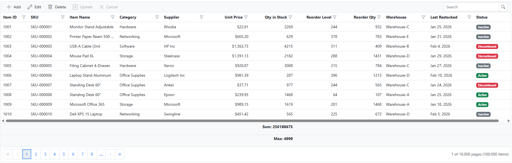

# Connecting Elasticsearch to Blazor Data Grid Using ES library

The [Syncfusion<sup style="font-size:70%">&reg;</sup> Blazor DataGrid](https://www.syncfusion.com/blazor-components/blazor-datagrid) supports binding data from an Elasticsearch index using the Elastic.Clients.Elasticsearch library. This modern approach provides full-text search capabilities, advanced filtering, and high-performance data operations.

**What is Elasticsearch?**

Elasticsearch is a powerful search and analytics engine that stores data in indexes (similar to database tables). Instead of rows and columns, it stores documents as JSON objects, enabling flexible schema design and powerful full-text search capabilities.

**Key Benefits of Elasticsearch**

- **Full-Text Search**: Search across large datasets instantly using text analysis and ranking algorithms.
- **Scalability**: Horizontally scalable architecture handles massive amounts of data.
- **Flexible Querying**: QueryDSL language provides powerful query capabilities beyond simple filtering.
- **Real-Time Indexing**: Data becomes searchable immediately after indexing.
- **Aggregations**: Perform complex calculations and analytics on data without requiring separate calculations.

**Why Elasticsearch Over Traditional DataOperations Approach**

Traditional in-memory filtering (DataOperations) loads entire datasets into memory, then applies operations sequentially. This becomes inefficient with large datasets. In contrast, Elasticsearch applies filtering, sorting, and pagination at the index level, returning only requested data. Performance tests demonstrate Elasticsearch delivers **50-70% faster search and sort operations** on moderately large datasets compared to in-memory approaches. Additionally, memory consumption remains constant regardless of dataset size, as only result pages are transferred. For applications managing thousands of records with frequent searches and complex filtering, Elasticsearch provides superior scalability and responsiveness.

**What is Elastic.Clients.Elasticsearch?**

The **Elastic.Clients.Elasticsearch** package is the official C# client library for Elasticsearch. It acts as a bridge between .NET applications and Elasticsearch, allowing applications to index, search, update, and delete documents in Elasticsearch indexes.

## Prerequisites

Ensure the following software and packages are installed before proceeding:

| Software/Package | Version | Purpose |
|-----------------|---------|---------|
| Visual Studio 2026 | 18.0 or later | Development IDE with Blazor workload |
| .NET SDK | 10.0 or compatible | Runtime and build tools |
| Elasticsearch | 9.3.0 or later | Search and analytics engine |
| Syncfusion.Blazor.Grids | {{site.blazorversion}} | DataGrid and UI components |
| Syncfusion.Blazor.Themes | {{site.blazorversion}} | Styling for DataGrid components |
| Elastic.Clients.Elasticsearch | 9.3.0 or later | Official C# client for Elasticsearch |

## Setting Up Elasticsearch

### Step 1: Download and Extract Elasticsearch

1. Visit the [Elasticsearch Download Page](https://www.elastic.co/downloads/elasticsearch).
2. Download Elasticsearch version 9.3.0 or later (ZIP format recommended for Windows).
3. Extract the downloaded ZIP file to a preferred location (e.g., `C:\elasticsearch-9.3.0`).

### Step 2: Initialize Elasticsearch and Capture Credentials

* Open Command Prompt.
* Navigate to the Elasticsearch bin directory:
   ```cmd
   cd C:\elasticsearch-9.3.0\bin
   ```
* Run the Elasticsearch batch file:
   ```cmd
   elasticsearch.bat
   ```
* The startup process takes approximately 1-2 minutes. Once initialization completes, the console displays:
   - **Elasticsearch password** for the `elastic` user
   - **Enrollment token** for cluster connectivity
   - Additional cluster information

* **Copy and store these credentials** in a secure location (text editor, password manager, etc.) as they are needed to connect from the Blazor application.

Example output:
```
━━━━━━━━━━━━━━━━━━━━━━━━━━━━━━━━━━━━━━━━━━━━━━━━━━━━━━━━━━━━━━━━━━━━━━━━━━━━━━━━━━━━━━━━━━━━━━━━━━━━━━━━━━
│ Password for the elastic user (reset with `elasticsearch-reset-password -u elastic`):                 │
│ M5CeWiO=sgonS24TVtWR                                                                                 │
│                                                                                                       │
│ HTTP CA certificate SHA-256 fingerprint:                                                              │
│ 50:67:9a:e0:97:27:00:66:79:d8:19:fa:44:b5:f6:f4:ec:1e:1c:0f:64:24:55:be:7f:a0:52:c4:c5:39:e8:ec  │
│                                                                                                       │
│ Configure Kibana to use this cluster:                                                                 │
│ • Visit https://localhost:5601                                                                       │
│ • In Kibana go to Stack Management > Data > Lifecycle and copy the enrollment token above             │
│ • Go to Stack Management > Elasticsearch > Nodes and copy the fingerprint above                       │
│                                                                                                       │
━━━━━━━━━━━━━━━━━━━━━━━━━━━━━━━━━━━━━━━━━━━━━━━━━━━━━━━━━━━━━━━━━━━━━━━━━━━━━━━━━━━━━━━━━━━━━━━━━━━━━━━━━━
```

Elasticsearch is now configured. Keep the Command Prompt window running to continue using Elasticsearch.

### Step 3: Verify Elasticsearch Connection

1. Open a web browser (Chrome, Firefox, Edge, etc.).

2. Navigate to `http://localhost:9200/`.

3. A login dialog appears. Enter the credentials:
   - **Username**: `elastic`
   - **Password**: The password copied in Step 2

4. After authentication, the browser displays a JSON response confirming Elasticsearch is running:
   ```json
   {
     "name" : "elasticsearch-node-1",
     "cluster_name" : "elasticsearch",
     "cluster_uuid" : "abc123def456",
     "version" : {
       "number" : "9.3.0",
       "build_flavor" : "default",
       "build_type" : "zip",
       "build_hash" : "17b451d8979a29e31935fe1eb901310350b30e62",
       "build_date" : "2026-01-29T10:05:46.708397977Z",
       "build_snapshot" : false,
       "lucene_version" : "10.3.2",
       "minimum_wire_compatibility_version" : "8.19.0",
       "minimum_index_compatibility_version" : "8.0.0"
     },
     "tagline" : "You Know, for Search"
   }
   ```

Elasticsearch is now successfully installed and running locally.

---

### Step 4: Install Required NuGet Packages

Before installing the necessary NuGet packages, a new Blazor Web Application must be created using the default template.
This template automatically generates essential starter files—such as **Program.cs, appsettings.json, the wwwroot folder, and the Components folder**.

For this guide, a Blazor application named **Grid_ElasticSearch** has been created. Once the project is set up, the next step involves installing the required NuGet packages. NuGet packages are software libraries that add functionality to the application.

**Method 1: Using Package Manager Console**

1. Open Visual Studio 2026.
2. Navigate to **Tools → NuGet Package Manager → Package Manager Console**.
3. Run the following commands:

```powershell
Install-Package Elastic.Clients.Elasticsearch -Version 9.3.0; 
Install-Package Syncfusion.Blazor.Grid -Version {{site.blazorversion}}; 
Install-Package Syncfusion.Blazor.Themes -Version {{site.blazorversion}}
```

**Method 2: Using NuGet Package Manager UI**

1. Open **Visual Studio 2026 → Tools → NuGet Package Manager → Manage NuGet Packages for Solution**.
2. Search for and install each package individually:
   - **[Elastic.Clients.Elasticsearch](https://www.nuget.org/packages/Elastic.Clients.Elasticsearch/)** (version 9.3.0 or later)
   - **[Syncfusion.Blazor.Grid](https://www.nuget.org/packages/Syncfusion.Blazor.Grid/)** (version {{site.blazorversion}})
   - **[Syncfusion.Blazor.Themes](https://www.nuget.org/packages/Syncfusion.Blazor.Themes/)** (version {{site.blazorversion}})

All required packages are now installed.

### Step 5: Create the Data Model

A data model is a C# class that represents the structure of documents stored in Elasticsearch. Each property corresponds to a field in the Elasticsearch index.

**Instructions:**

1. Create a new folder named `Data` in the Blazor application project.
2. Inside the `Data` folder, create a new file named **InventoryStock.cs**.
3. Define the **InventoryStock** class with the following code:

```csharp
using System.Text.Json.Serialization;

namespace Grid_ElasticSearch.Data
{
    /// <summary>
    /// Represents an inventory stock item in the warehouse management system.
    /// Maps to the 'inventory-items' index in Elasticsearch.
    /// </summary>
    public class InventoryStock
    {
        /// <summary>
        /// Gets or sets the unique identifier for the inventory item.
        /// </summary>
        [JsonPropertyName("itemId")]
        public int ItemId { get; set; }

        /// <summary>
        /// Gets or sets the SKU (Stock Keeping Unit) code for the item.
        /// </summary>
        [JsonPropertyName("sku")]
        public string? SKU { get; set; }

        /// <summary>
        /// Gets or sets the name of the inventory item.
        /// </summary>
        [JsonPropertyName("itemName")]
        public string? ItemName { get; set; }

        /// <summary>
        /// Gets or sets the category of the item (e.g., Electronics, Hardware, Software).
        /// </summary>
        [JsonPropertyName("category")]
        public string? Category { get; set; }

        /// <summary>
        /// Gets or sets the supplier name for the item.
        /// </summary>
        [JsonPropertyName("supplier")]
        public string? Supplier { get; set; }

        /// <summary>
        /// Gets or sets the unit price of the item.
        /// </summary>
        [JsonPropertyName("unitPrice")]
        public decimal UnitPrice { get; set; }

        /// <summary>
        /// Gets or sets the current quantity in stock.
        /// </summary>
        [JsonPropertyName("quantityInStock")]
        public int QuantityInStock { get; set; }

        /// <summary>
        /// Gets or sets the minimum quantity threshold for reordering.
        /// </summary>
        [JsonPropertyName("reorderLevel")]
        public int ReorderLevel { get; set; }

        /// <summary>
        /// Gets or sets the standard quantity to order when restocking.
        /// </summary>
        [JsonPropertyName("reorderQuantity")]
        public int ReorderQuantity { get; set; }

        /// <summary>
        /// Gets or sets the warehouse location of the item.
        /// </summary>
        [JsonPropertyName("warehouse")]
        public string? Warehouse { get; set; }

        /// <summary>
        /// Gets or sets the date when the item was last restocked.
        /// </summary>
        [JsonPropertyName("lastRestocked")]
        public DateTime? LastRestocked { get; set; }

        /// <summary>
        /// Gets or sets the current status of the item (e.g., Active, Inactive, Discontinued).
        /// </summary>
        [JsonPropertyName("status")]
        public string? Status { get; set; }
    }
}
```

**Explanation:**

- The `[JsonPropertyName]` attribute maps each property to a specific field name in the Elasticsearch index.
- Each property represents a field that will be indexed in Elasticsearch.
- The `?` symbol indicates that a property is nullable (can be empty).
- The model includes comprehensive XML documentation for each property.

The data model has been successfully created.

### Step 6: Configure Elasticsearch Connection Settings

The connection string for Elasticsearch contains the server URL and authentication credentials needed to connect the application to the Elasticsearch instance.

**Instructions:**

1. Open the `appsettings.json` file in the project root.
2. Add or update the `ElasticSearch` section with the Elasticsearch server details:

```json
{
  "ElasticSearch": {
    "Url": "http://localhost:9200",
    "IndexName": "inventory-items",
    "Password": "M5CeWiO=sgonS24TVtWR"
  },
  "Logging": {
    "LogLevel": {
      "Default": "Information",
      "Microsoft.AspNetCore": "Warning"
    }
  },
  "AllowedHosts": "*",
  "DetailedErrors": "true"
}
```

**Configuration Parameters:**

| Parameter | Description |
|-----------|-------------|
| `Url` | The HTTP endpoint of the Elasticsearch server (default: `http://localhost:9200`) |
| `IndexName` | The name of the Elasticsearch index to store documents (e.g., `inventory-items`) |
| `Password` | The password for the `elastic` user (obtained during Elasticsearch setup) |

The Elasticsearch connection settings have been configured successfully.

### Step 7: Create the Repository Class

A repository class is an intermediary layer that handles all Elasticsearch operations. This class uses the Elastic.Clients.Elasticsearch library to communicate with the Elasticsearch index.

**Instructions:**

1. Inside the `Data` folder, create a new file named **InventoryRepository.cs**.
2. Define the **InventoryRepository** class with the following core methods:

```csharp
using Elastic.Clients.Elasticsearch;
using Syncfusion.Blazor.Data;

namespace Grid_ElasticSearch.Data
{
    public class InventoryRepository
    {
        private readonly ElasticsearchClient _elasticClient;
        private readonly InventoryDataService _inventoryDataService;
        private const string IndexName = "inventory-items";

        public InventoryRepository(ElasticsearchClient elasticClient, InventoryDataService inventoryDataService)
        {
            _elasticClient = elasticClient;
            _inventoryDataService = inventoryDataService;
        }

        /// <summary>
        /// Performs search, filter, sort, and pagination operations using Elasticsearch QueryDSL
        /// </summary>
        public async Task<DataResult> SearchAndFilterAsync(DataManagerRequest dm)
        {
            // Build Elasticsearch query, sorting, and pagination
            var result = await _elasticClient.SearchAsync<InventoryStock>(s => s
                .Indices(IndexName)
                .From(dm.Skip)
                .Size(dm.Take)
            );

            long totalCount = result.Total > 0 ? result.Total : 0L;
            IDictionary<string, object>? aggregates = ExtractAggregatesFromResponse(result.Aggregations);

            return new DataResult { Result = result.Documents, Count = (int)totalCount, Aggregates = aggregates };
        }

        public async Task AddInventoryItemAsync(InventoryStock item)
        {
            // Handle logic to add a new inventory item to the database
        }

        public async Task UpdateInventoryItemAsync(InventoryStock item)
        {
            // Handle logic to update an existing inventory item to the database
        }

        public async Task RemoveInventoryItemAsync(int? itemId)
        {
            // Handle logic to delete an existing inventory item to the database
        }

        // Helper methods for query building, sorting, aggregations, and index refresh
    }
}
```

The repository class has been created.

### Step 8: Create the Elasticsearch Initialization Service

The Elasticsearch initialization service creates the index with proper field mappings on application startup. If the index already exists, it skips creation.

**Instructions:**

1. Inside the `Data` folder, create a new file named **ElasticSearchInitializationService.cs**.
2. Define the **ElasticSearchInitializationService** class with the following code:

```csharp
using Elastic.Clients.Elasticsearch;
using Elastic.Clients.Elasticsearch.IndexManagement;
using Elastic.Clients.Elasticsearch.Mapping;

namespace Grid_ElasticSearch.Data
{
    public class ElasticSearchInitializationService
    {
        private readonly ElasticsearchClient _elasticClient;
        private readonly InventoryDataService _inventoryDataService;
        private const string IndexName = "inventory-items";

        public ElasticSearchInitializationService(ElasticsearchClient elasticClient, InventoryDataService inventoryDataService)
        {
            _elasticClient = elasticClient;
            _inventoryDataService = inventoryDataService;
        }

        /// <summary>
        /// Creates the Elasticsearch index with field mappings and seeds data on application startup
        /// </summary>
        public async Task InitializeAsync()
        {
            var existsResponse = await _elasticClient.Indices.ExistsAsync(IndexName);
            if (existsResponse.Exists) return;

            _inventoryDataService.InitializeSeedData();

            var createRequest = new CreateIndexRequest(IndexName)
            {
                Settings = new IndexSettings
                {
                    NumberOfShards = 1,
                    NumberOfReplicas = 0,
                    MaxResultWindow = 10000000
                },
                Mappings = new TypeMapping
                {
                    Properties = new Properties
                    {
                        { "itemId", new IntegerNumberProperty() },
                        { "sku", new TextProperty { Fields = new Properties { { "keyword", new KeywordProperty() } } } },
                        { "itemName", new TextProperty { Fields = new Properties { { "keyword", new KeywordProperty() } } } },
                        { "category", new TextProperty { Fields = new Properties { { "keyword", new KeywordProperty() } } } },
                        { "supplier", new TextProperty { Fields = new Properties { { "keyword", new KeywordProperty() } } } },
                        { "unitPrice", new DoubleNumberProperty() },
                        { "quantityInStock", new IntegerNumberProperty() },
                        { "reorderLevel", new IntegerNumberProperty() },
                        { "reorderQuantity", new IntegerNumberProperty() },
                        { "warehouse", new TextProperty { Fields = new Properties { { "keyword", new KeywordProperty() } } } },
                        { "lastRestocked", new DateProperty() },
                        { "status", new TextProperty { Fields = new Properties { { "keyword", new KeywordProperty() } } } }
                    }
                }
            };

            var createResponse = await _elasticClient.Indices.CreateAsync(createRequest);
            if (createResponse.IsValidResponse)
            {
                Console.WriteLine($"✓ Elasticsearch index '{IndexName}' created successfully!");
                await SyncSeedDataToElasticSearchAsync();
            }
            else
            {
                throw new Exception($"Failed to create index: {createResponse.ApiCallDetails?.DebugInformation}");
            }
        }

        /// <summary>
        /// Syncs seed data to Elasticsearch using bulk indexing operation
        /// </summary>
        private async Task SyncSeedDataToElasticSearchAsync()
        {
            var inventoryItems = _inventoryDataService.GetAllInventoryItems();
            
            var bulkResponse = await _elasticClient.BulkAsync(b => b
                .IndexMany(inventoryItems, (descriptor, item) => descriptor
                    .Index(IndexName)
                    .Id(item.ItemId.ToString())
                )
            );

            if (bulkResponse.IsValidResponse)
            {
                Console.WriteLine($"✓ Successfully synced {inventoryItems.Count} items to Elasticsearch");
            }
        }
    }
}
```

**Explanation of Elasticsearch Methods:**

- **`ExistsAsync(IndexName)`**: Checks if the specified index already exists in Elasticsearch. Returns `true` if the index exists, `false` otherwise. This prevents recreating an index that is already initialized.

- **`CreateAsync(createRequest)`**: Creates a new index with the specified configuration. The `CreateIndexRequest` object contains:
  - **Settings**: Configures index behavior including number of shards, replicas, and maximum result window size.
  - **Mappings**: Defines the field mappings and data types for documents in the index.

- **Field Mappings**: Define how Elasticsearch should store and index document fields:
  - **IntegerNumberProperty**: Numeric integer field (e.g., `itemId`, `quantityInStock`)
  - **TextProperty**: Full-text searchable text field with optional keyword subfield for exact matching
  - **DoubleNumberProperty**: Numeric decimal field (e.g., `unitPrice`)
  - **DateProperty**: Date field for temporal data (e.g., `lastRestocked`)
  - **KeywordProperty**: Exact-match field used as subfield of text fields for precise filtering and sorting

- **`BulkAsync()`**: Executes multiple index operations in a single request for improved performance. Uses:
  - **`IndexMany()`**: Batches multiple documents for indexing at once
  - **`Index(IndexName)`**: Specifies the target index
  - **`Id(item.ItemId.ToString())`**: Assigns a unique document ID to each item
  - Significantly faster than indexing documents one-by-one, especially for large datasets

The Elasticsearch initialization service creates the index with field mappings and bulk-indexes seed data on application startup.

**Verify Creation of Index**

To view basic index information, navigate to `http://localhost:9200/inventory-items/`:

```json
{
  "aliases" : { },
  "mappings" : {
    "properties" : {
      "itemId" : {
        "type" : "integer"
      },
      "sku" : {
        "type" : "text",
        "fields" : {
          "keyword" : {
            "type" : "keyword"
          }
        }
      },
      "unitPrice" : {
        "type" : "double"
      },
      // Continues to Remaining mapped fields
    }
  },
  "settings" : {
    "index" : {
      "routing" : {
        "allocation" : {
          "include" : {
            "_tier_preference" : "data_content"
          }
        }
      },
      "number_of_shards" : "1",
      "provided_name" : "inventory-items",
      "creation_date" : "1739957234567",
      "number_of_replicas" : "0",
      "uuid" : "AbcDefGhijKlmnOpqrStUvWxYz123456",
      "version" : {
        "created" : "9030099"
      }
    }
  }
}
```

This confirms that:
- The index `inventory-items` exists with correct field mappings
- All fields are properly mapped (integer, text, double, date types)
- Text fields have both `text` and `keyword` subfields for flexible searching and exact filtering
- The index is configured with 1 shard and 0 replicas as specified

**Verify Indexed Data in Elasticsearch**

After the application is running, verify that the data has been successfully indexed in Elasticsearch by checking the index via the REST API.

**Instructions:**

1. Open a web browser and navigate to `http://localhost:9200/inventory-items/_search`.
2. A login dialog appears. Enter the credentials:
   - **Username**: `elastic`
   - **Password**: The password from Elasticsearch setup
3. After authentication, the browser displays a JSON response showing all indexed documents in the `inventory-items` index:

```json
{
  "took" : 2,
  "timed_out" : false,
  "_shards" : {
    "total" : 1,
    "successful" : 1,
    "skipped" : 0,
    "failed" : 0
  },
  "hits" : {
    "total" : {
      "value" : 2,
      "relation" : "eq"
    },
    "max_score" : 1.0,
    "hits" : [
      {
        "_index" : "inventory-items",
        "_id" : "1001",
        "_score" : 1.0,
        "_source" : {
          "itemId" : 1001,
          "sku" : "SKU-001",
          "itemName" : "Dell Monitor 27\"",
          // .. other fields
        }
      },
      {
        "_index" : "inventory-items",
        "_id" : "1002",
        "_score" : 1.0,
        "_source" : {
          "itemId" : 1002,
          "sku" : "SKU-002",
          "itemName" : "Office Chair Pro",
          // .. other fields
        }
      }
    ]
  }
}
```

**Response Explanation:**

- **`took`**: Query execution time in milliseconds (2 ms in this example)
- **`timed_out`**: Whether the query timed out (false = completed successfully)
- **`_shards`**: Shard statistics showing successful shards and failures
- **`hits.total.value`**: Total number of documents matching the query (2 documents indexed)
- **`hits.hits`**: Array of matching documents
  - **`_index`**: Name of the index containing the document
  - **`_id`**: Unique document ID (matches the ItemId from inventory data)
  - **`_score`**: Relevance score for the document
  - **`_source`**: The actual document data containing all inventory fields

---

### Step 9: Create the Inventory Data Service

The inventory data service manages static, in-memory inventory data.

**Instructions:**

1. Inside the `Data` folder, create a new file named **InventoryDataService.cs**.
2. Define the **InventoryDataService** class with the following code:

```csharp
namespace Grid_ElasticSearch.Data
{
    public class InventoryDataService
    {
        private static List<InventoryStock> _inventoryData = new List<InventoryStock>();

        /// <summary>
        /// Returns all static inventory items
        /// </summary>
        public List<InventoryStock> GetAllInventoryItems()
        {
            return new List<InventoryStock>(_inventoryData);
        }

        /// <summary>
        /// Initializes static inventory data collection on application startup
        /// </summary>
        public void InitializeSeedData()
        {
            if (_inventoryData.Count > 0) return;
            _inventoryData = new List<InventoryStock>
            {
                new InventoryStock { ItemId = 1001, SKU = "SKU-001", ItemName = "Dell Monitor 27\"", Category = "Electronics", Supplier = "Tech Supplies Co", UnitPrice = 299.99m, QuantityInStock = 45, ReorderLevel = 10, ReorderQuantity = 20, Warehouse = "Warehouse-A", LastRestocked = DateTime.Today.AddDays(-5), Status = "Active" },
                new InventoryStock { ItemId = 1002, SKU = "SKU-002", ItemName = "Office Chair Pro", Category = "Furniture", Supplier = "Office Pro Imports", UnitPrice = 149.50m, QuantityInStock = 8, ReorderLevel = 5, ReorderQuantity = 15, Warehouse = "Warehouse-B", LastRestocked = DateTime.Today.AddDays(-10), Status = "Active" }
            };
        }
    }
}
```

The inventory data service returns static inventory data to be synced with Elasticsearch on application startup.

### Step 10: Register Services in Program.cs

The `Program.cs` file is where application services are registered and configured. This file must be updated to enable Elasticsearch integration and register the repository pattern.

**Instructions:**

1. Open the `Program.cs` file at the project root.
2. Add the following code after the line `var builder = WebApplication.CreateBuilder(args);`:

```csharp
using Elastic.Clients.Elasticsearch;
using Elastic.Transport;
using Grid_ElasticSearch.Components;
using Grid_ElasticSearch.Data;
using Syncfusion.Blazor;

var builder = WebApplication.CreateBuilder(args);

// Add services to the container
builder.Services.AddRazorComponents()
    .AddInteractiveServerComponents();

// ========== SYNCFUSION BLAZOR CONFIGURATION ==========
builder.Services.AddSyncfusionBlazor();
// =====================================================

// ========== ELASTICSEARCH CONFIGURATION ==========
// Get ElasticSearch configuration from appsettings.json
var elasticSearchUrl = builder.Configuration["ElasticSearch:Url"];
var elasticSearchPwd = builder.Configuration["ElasticSearch:Password"] ?? "";

if (string.IsNullOrEmpty(elasticSearchUrl))
{
    throw new InvalidOperationException("ElasticSearch URL not found in configuration.");
}

// Create and register ElasticSearch client using Elastic.Clients.Elasticsearch
var settings = new ElasticsearchClientSettings(new Uri(elasticSearchUrl))
    .Authentication(new BasicAuthentication("elastic", elasticSearchPwd));

var client = new ElasticsearchClient(settings);

builder.Services.AddSingleton<ElasticsearchClient>(client);

// Register Inventory Data Service (static in-memory data)
builder.Services.AddSingleton<InventoryDataService>();

// Register Repository for dependency injection
builder.Services.AddScoped<InventoryRepository>();

// Register ElasticSearch Initialization Service
builder.Services.AddScoped<ElasticSearchInitializationService>();
// ===================================================

var app = builder.Build();

// ========== INITIALIZE ELASTICSEARCH INDEXES ==========
// Create indexes on application startup if they don't exist
using (var scope = app.Services.CreateScope())
{
    var initializationService = scope.ServiceProvider.GetRequiredService<ElasticSearchInitializationService>();
    await initializationService.InitializeAsync();
}
// ===================================================

// Configure the HTTP request pipeline.
if (!app.Environment.IsDevelopment())
{
    app.UseExceptionHandler("/Error", createScopeForErrors: true);
    app.UseHsts();
}

app.UseHttpsRedirection();

app.UseAntiforgery();

app.MapStaticAssets();
app.MapRazorComponents<App>()
    .AddInteractiveServerRenderMode();

app.Run();
```

**Explanation:**

- **`ElasticsearchClientSettings`**: Configures the Elasticsearch client with the server URL from `appsettings.json`.
- **`BasicAuthentication`**: Sets up username (`elastic`) and password for authentication with Elasticsearch.
- **`AddSingleton<ElasticsearchClient>`**: Registers the Elasticsearch client as a singleton service (single instance for the entire application lifetime).
- **`AddSingleton<InventoryDataService>`**: Registers the data service as a singleton to maintain static data throughout the application.
- **`AddScoped<InventoryRepository>`**: Registers the repository as a scoped service (new instance per HTTP request).
- **`AddScoped<ElasticSearchInitializationService>`**: Registers the initialization service as a scoped service.
- **`InitializeAsync()`**: Called during application startup to create the Elasticsearch index and seed data before the application starts handling requests.
- **`AddSyncfusionBlazor()`**: Registers Syncfusion Blazor components.

The service registration has been completed successfully.

---

## Integrating Syncfusion Blazor DataGrid

### Step 1: Install and Configure Blazor DataGrid Components

Syncfusion is a library that provides pre-built UI components like DataGrid for displaying data in table format.

**Instructions:**

* The Syncfusion.Blazor.Grids package was installed in **Step 2** of the previous section.
* Import the required namespaces in the `Components/_Imports.razor` file:

```csharp
@using Syncfusion.Blazor
@using Syncfusion.Blazor.Grids
@using Syncfusion.Blazor.Data
@using Syncfusion.Blazor.DropDowns
@using Grid_ElasticSearch.Data
```

* Add the Syncfusion stylesheet and scripts in the `Components/App.razor` file. Find the `<head>` section and add:

```html
<!-- Syncfusion Blazor Stylesheet -->
<link href="_content/Syncfusion.Blazor.Themes/tailwind3.css" rel="stylesheet" />

<!-- Syncfusion Blazor Scripts -->
<script src="_content/Syncfusion.Blazor.Core/scripts/syncfusion-blazor.min.js" type="text/javascript"></script>
```

For this project, the tailwind3 theme is used. Different themes can be selected or customized based on project requirements. Refer to the [Syncfusion Blazor Components Appearance](https://blazor.syncfusion.com/documentation/appearance/themes) documentation for theming and customization options.

Syncfusion components are now configured and ready to use.

### Step 2: Update the Blazor DataGrid

The `Home.razor` component displays inventory data in a Syncfusion Blazor DataGrid with search, filter, sort, and pagination capabilities.

**Instructions:**

1. Open the file named `Home.razor` in the `Components/Pages` folder.
2. Add the following code to create a basic DataGrid:

```cshtml
@page "/"
@using System.Collections
@rendermode InteractiveServer
@inject InventoryRepository InventoryService

<PageTitle>Inventory Stock Control System</PageTitle>

<section class="container-fluid py-4">
    <SfGrid TValue="InventoryStock" Width="100%" AllowPaging="true" AllowSorting="true" AllowFiltering="true" AllowSelection="true" Toolbar="@ToolbarItems">
        <SfDataManager AdaptorInstance="@typeof(CustomAdaptor)" Adaptor="Adaptors.CustomAdaptor"></SfDataManager>
        <GridPageSettings PageSize="10"></GridPageSettings>
        <GridColumns>
            <GridColumn Field=@nameof(InventoryStock.ItemId) IsPrimaryKey="true" IsIdentity="true" AllowGrouping="false"></GridColumn>
            <GridColumn Field=@nameof(InventoryStock.SKU)></GridColumn>
            <GridColumn Field=@nameof(InventoryStock.ItemName)></GridColumn>
            <!-- Add other Columns configuration -->
        </GridColumns>
    </SfGrid>
</section>

@code {
    private List<string> ToolbarItems = new List<string> { "Add", "Edit", "Delete", "Update", "Cancel", "Search" };

    // CustomAdaptor class will be added in the next step
}
```

**Component Explanation:**

- **`@rendermode InteractiveServer`**: Enables interactive server-side rendering for the component.
- **`@inject InventoryRepository`**: Injects the repository to access Elasticsearch methods.
- **`<SfGrid>`**: The DataGrid component that displays data in rows and columns.
- **`<SfDataManager>`**: Connects the DataGrid to the CustomAdaptor for data retrieval and CRUD operations.
- **`<GridColumns>`**: Defines individual columns in the DataGrid.
- **`<GridPageSettings>`**: Configures pagination with 10 records per page.
- **`Toolbar`**: Update the `<SfGrid>` component to include the [Toolbar](https://help.syncfusion.com/cr/blazor/Syncfusion.Blazor.Grids.SfGrid-1.html#Syncfusion_Blazor_Grids_SfGrid_1_Toolbar) property with CRUD and search options which provides buttons for adding, editing, deleting records, and searching the data.

The Home component has been updated successfully with a basic DataGrid.

---

### Step 3: Implement the CustomAdaptor

The Syncfusion<sup style="font-size:70%">&reg;</sup> Blazor DataGrid can bind data from **Elasticsearch** using [DataManager](https://help.syncfusion.com/cr/blazor/Syncfusion.Blazor.Data.SfDataManager.html) and set the [Adaptor](https://help.syncfusion.com/cr/blazor/Syncfusion.Blazor.Adaptors.html) property to [CustomAdaptor](https://blazor.syncfusion.com/documentation/datagrid/connecting-to-adaptors/custom-adaptor) for scenarios that require full control over data operations.

The `CustomAdaptor` is a bridge between the DataGrid and Elasticsearch. It handles all data operations including reading, searching, filtering, sorting, paging, and CRUD operations.

**Instructions:**

1. Open the `Components/Pages/Home.razor` file.
2. Add the following `CustomAdaptor` class code inside the `@code` block:

```csharp
@code {
    public class CustomAdaptor : DataAdaptor
    {
        private static InventoryRepository? _inventoryService;

        public InventoryRepository? InventoryService
        {
            get => _inventoryService;
            set => _inventoryService = value;
        }

        /// <summary>
        /// Retrieves records from Elasticsearch with search, filter, sort, and pagination
        /// </summary>
        public override async Task<object> ReadAsync(DataManagerRequest dataManagerRequest, string? key = null)
        {
            var result = await _inventoryService!.SearchAndFilterAsync(dataManagerRequest);
            IEnumerable dataSource = result.Result ?? new List<InventoryStock>();

            return dataManagerRequest.RequiresCounts ? 
                new DataResult() { Result = dataSource, Count = result.Count, Aggregates = result.Aggregates } : 
                (object)dataSource;
        }
    }

    private List<string> ToolbarItems = new List<string> { "Add", "Edit", "Delete", "Update", "Cancel", "Search" };

    protected override void OnInitialized()
    {
        base.OnInitialized();
        if (InventoryService != null)
        {
            var customAdaptor = new CustomAdaptor { InventoryService = InventoryService };
        }
    }
}
```

The `CustomAdaptor` class has been successfully implemented with all data operations.

---

### Step 4: Running the Application

**Prerequisites:**

- Elasticsearch is installed and running (see [**Setting Up Elasticsearch**](#setting-up-elasticsearch) section).
- The `appsettings.json` file contains the correct Elasticsearch URL and password.

**Build the Application**

1. Open the terminal or Package Manager Console.
2. Navigate to the project directory.
3. Run the following command:

```powershell
dotnet build
```

**Run the Application**

Execute the following command:

```powershell
dotnet run
```

**Access the Application**

1. Open a web browser.
2. Navigate to `https://localhost:5001` (or the port shown in the terminal).
3. The Inventory Stock Control System is now running and ready to use.



---

### Step 5: Implement Paging Feature

Paging divides large datasets into smaller pages to improve performance and usability.

**Instructions:**

* The paging feature is already enabled in the `<SfGrid>` component with `AllowPaging="true"`.
* The page size is configured with [GridPageSettings](https://help.syncfusion.com/cr/blazor/Syncfusion.Blazor.Grids.GridPageSettings.html).

```cshtml
<SfGrid TValue="InventoryStock"
        AllowPaging="true">
    <SfDataManager AdaptorInstance="@typeof(CustomAdaptor)" Adaptor="Adaptors.CustomAdaptor"></SfDataManager>
    <GridPageSettings PageSize="10"></GridPageSettings>
    <!-- Grid columns configuration -->
</SfGrid>
```

* Update the `SearchAndFilterAsync` method in the `InventoryRepository` class to handle paging:

```csharp
public async Task<DataResult> SearchAndFilterAsync(DataManagerRequest dm)
{
    var result = await _elasticClient.SearchAsync<InventoryStock>(s => s
        .Indices(IndexName)
        .From(dm.Skip)
        .Size(dm.Take)
    );

    return new DataResult { Result = result.Documents, Count = (int)result.Total };
}
```

**How Paging Works:**

- The DataGrid displays 10 records per page (as set in `GridPageSettings`).
- Navigation buttons allow movement between pages.
- The `ReadAsync` method receives skip and take values in the `DataManagerRequest`.
- The `From(dm.Skip)` method skips the specified number of records.
- The `Size(dm.Take)` method retrieves the specified number of records per page.
- Only the requested page of records is retrieved from Elasticsearch.

Paging feature is now active with 10 records per page.

---

### Step 6: Implement Searching Feature

Searching allows the user to find records by entering keywords in the search box.

**Instructions:**

* Ensure the toolbar includes the "Search" item.

```cshtml
<SfGrid TValue="InventoryStock" AllowPaging="true" Toolbar="@ToolbarItems">
    <SfDataManager AdaptorInstance="@typeof(CustomAdaptor)" Adaptor="Adaptors.CustomAdaptor"></SfDataManager>
    <GridPageSettings PageSize="10"></GridPageSettings>
    <!-- Grid columns configuration -->
</SfGrid>
@code {
    private List<string> ToolbarItems = new List<string> { "Search"};
}
```

* Update the `SearchAndFilterAsync` method in `InventoryRepository` class to call the query builder:

```csharp
public async Task<DataResult> SearchAndFilterAsync(DataManagerRequest dm)
{
    var result = await _elasticClient.SearchAsync<InventoryStock>(s => s
        .Indices(IndexName)
        .Query(q => BuildEsQueryFromDm(q, dm))
        .From(dm.Skip)
        .Size(dm.Take)
    );

    return new DataResult { Result = result.Documents, Count = (int)result.Total };
}
```

* Add the `BuildEsQueryFromDm` method in `InventoryRepository` class to handle searching:

```csharp
private static QueryDescriptor<InventoryStock> BuildEsQueryFromDm(QueryDescriptor<InventoryStock> queryDescriptor, DataManagerRequest dm)
{
    var must = new List<Query>();     // AND
    var should = new List<Query>();   // OR (global search or user ORs)
    var mustNot = new List<Query>();  // NOT

    if (dm.Search != null && dm.Search.Count > 0)
    {
        foreach (var s in dm.Search)
        {
            if (string.IsNullOrWhiteSpace(s.Key) || s.Fields == null || s.Fields.Count == 0)
                continue;

            // For each field, determine type and build appropriate query
            foreach (var field in s.Fields)
            {
                Query? fieldQuery = null;

                if (IsTextField(field))
                {
                    fieldQuery = BuildLeafQuery(field, "contains", s.Key, s.IgnoreCase);
                }
                else if (IsNumericField(field))
                {
                    var parsedValue = TryParseNumeric(s.Key);
                    if (parsedValue != null)
                    {
                        fieldQuery = BuildLeafQuery(field, "equal", parsedValue, s.IgnoreCase);
                    }
                }
                else if (IsDateField(field))
                {
                    var parsedDate = TryParseDate(s.Key);
                    if (parsedDate.HasValue)
                    {
                        fieldQuery = BuildLeafQuery(field, "equal", parsedDate.Value, s.IgnoreCase);
                    }
                }

                if (fieldQuery != null)
                    should.Add(fieldQuery);
            }
        }
    }
    var bq = new BoolQuery
    {
        Must = must,
        Should = should.Count > 0 ? should : null,
        MinimumShouldMatch = should.Count > 0 ? 1 : null
    };
    queryDescriptor.Bool(bq);
    return queryDescriptor;
}
```

**Explanation of `BuildEsQueryFromDm` Searching Logic:**

- **`dm.Search`**: Contains the search term entered by user and the list of fields to search across.
- **`s.Key`**: The actual search term/keyword entered in the search box.
- **`s.Fields`**: List of column fields to search (e.g., ItemName, SKU, Category).
- **Field Type Detection**: The method determines if each field is text, numeric, or date:
  - **Text Fields** (`IsTextField`): Uses wildcard queries for substring matching (e.g., "*search*").
  - **Numeric Fields** (`IsNumericField`): Attempts to parse search value as a number for exact matching.
  - **Date Fields** (`IsDateField`): Attempts to parse search value as a date for exact matching.
- **`BuildLeafQuery`**: Converts the search criteria into appropriate Elasticsearch query type:
  - Text fields generate `WildcardQuery` for flexible searching.
  - Numeric fields generate `TermQuery` for exact value matching after parsing.
  - Date fields generate `TermQuery` for exact date matching after parsing.
- **`should` List**: Accumulates queries for all matched fields. Results matching any of these fields are included (OR logic).
- **Result Matching**: The search returns all documents where the search term matches at least one of the specified fields.

* Add the `BuildLeafQuery` helper method in `InventoryRepository` class to convert search operators to Elasticsearch query types:

```csharp
private static Query BuildLeafQuery(string field, string? op, object? value, bool ignoreCase)
{
    // Map field to correct ES field for exact/equality operations
    var esField = MapToKeywordOrSelf(field); // strings -> .keyword, numbers/dates -> self

    // Handle array values (e.g., "in" operator)
    if (value is IEnumerable<object> list && op?.Equals("in", StringComparison.OrdinalIgnoreCase) == true)
    {
        return new TermsQuery
        {
            Field = esField,
            Terms = new TermsQueryField(list.Select(v => (FieldValue)ToFieldValue(v)).ToList())
        };
    }

    // Normalize scalar value
    var fv = ToFieldValue(value);

    // Branch by operator
    switch ((op ?? "equal").ToLowerInvariant())
    {
        case "equal":
            return new TermQuery { Field = esField, Value = fv };

        case "notequal":
            return new BoolQuery { MustNot = new List<Query> { new TermQuery { Field = esField, Value = fv } } };

        case "contains":
            return new WildcardQuery
            {
                Field = esField,
                Value = $"*{EscapeForWildcard(value?.ToString())}*",
                CaseInsensitive = true
            };

        case "startswith":
            return new PrefixQuery
            {
                Field = esField,
                Value = value?.ToString() ?? string.Empty,
                CaseInsensitive = true
            };

        case "endswith":
            return new WildcardQuery
            {
                Field = esField,
                Value = $"*{EscapeForWildcard(value?.ToString())}",
                CaseInsensitive = true
            };

        case "greaterthan":
            return new UntypedRangeQuery { Field = esField, Gt = fv };

        case "greaterthanorequal":
            return new UntypedRangeQuery { Field = esField, Gte = fv };

        case "lessthan":
            return new UntypedRangeQuery { Field = esField, Lt = fv };

        case "lessthanorequal":
            return new UntypedRangeQuery { Field = esField, Lte = fv };

        default:
            return new TermQuery { Field = esField, Value = fv };
    }
}
```

**Explanation of `BuildLeafQuery` Method:**

**Purpose**: Converts a single search criterion (field, operator, value) into the appropriate Elasticsearch query object that matches the search criteria.

**Parameters**:
- **`field`**: The column name being searched (e.g., "ItemName", "SKU", "UnitPrice")
- **`op`**: The comparison operator (e.g., "contains", "equal", "greaterthan")
- **`value`**: The search value or comparison value (e.g., "Monitor", 100, DateTime)
- **`ignoreCase`**: Boolean flag for case-insensitive searching (currently used with wildcard queries)

**Step-by-Step Process**:

1. **Field Mapping** (`MapToKeywordOrSelf`): Converts the field name:
   - Text fields map to `.keyword` subfield for exact matching (e.g., `itemName.keyword`)
   - Numeric and date fields remain unchanged (e.g., `unitPrice`, `lastRestocked`)

2. **Array Handling**: Checks if the value is a list and the operator is "in":
   - Creates a `TermsQuery` that matches any value in the provided list
   - Used for multi-select filtering scenarios

3. **Value Normalization** (`ToFieldValue`): Converts the search value to Elasticsearch-compatible format:
   - Integers, longs, doubles, decimals remain numeric
   - DateTime values convert to ISO 8601 format
   - Strings remain as text

4. **Operator Conversion**: Switches on the operator type and creates the appropriate Elasticsearch query:
   - **`equal`**: Creates `TermQuery` for exact match
   - **`notequal`**: Creates `BoolQuery` with `MustNot` clause (inverted logic)
   - **`contains`**: Creates `WildcardQuery` with wildcards on both sides (`*value*`)
   - **`startswith`**: Creates `PrefixQuery` for prefix matching (faster than wildcard)
   - **`endswith`**: Creates `WildcardQuery` with wildcard prefix only (`*value`)
   - **`greaterthan`**: Creates `RangeQuery` with `Gt` (greater than)
   - **`greaterthanorequal`**: Creates `RangeQuery` with `Gte` (greater than or equal)
   - **`lessthan`**: Creates `RangeQuery` with `Lt` (less than)
   - **`lessthanorequal`**: Creates `RangeQuery` with `Lte` (less than or equal)
   - **Default**: Falls back to `TermQuery` for exact matching

5. **Return**: Returns a single `Query` object representing the Elasticsearch query for this criterion.

**How Searching Works:**

- When the user enters text in the search box and presses Enter, the DataGrid sends a search request.
- The `ReadAsync` method receives the search criteria in `dataManagerRequest.Search`.
- The repository's `SearchAndFilterAsync` method processes search through `BuildEsQueryFromDm` method.
- `BuildEsQueryFromDm` calls `BuildLeafQuery` for each search field to create specific query objects.
- The search term is converted into Elasticsearch queries appropriate to each field type.
- Results are returned and displayed in the DataGrid.

Searching feature is now active.

---

### Step 7: Implement Filtering Feature

Filtering allows the user to restrict data based on column values using a filter menu interface.

**Instructions:**

* The filtering feature is already enabled in the `<SfGrid>` component with `AllowFiltering="true"`.
* The filter type is set to Menu mode with `<GridFilterSettings Type="Syncfusion.Blazor.Grids.FilterType.Menu">`.

```cshtml
<SfGrid TValue="InventoryStock"
        AllowPaging="true"
        AllowFiltering="true">
    <SfDataManager AdaptorInstance="@typeof(CustomAdaptor)" Adaptor="Adaptors.CustomAdaptor"></SfDataManager>
    <GridPageSettings PageSize="10"></GridPageSettings>
    <GridFilterSettings Type="Syncfusion.Blazor.Grids.FilterType.Menu"></GridFilterSettings>
    <!-- Grid columns configuration -->
</SfGrid>
```

* Update the `SearchAndFilterAsync` method in `InventoryRepository` class to handle filtering:

```csharp
public async Task<DataResult> SearchAndFilterAsync(DataManagerRequest dm)
{
    var result = await _elasticClient.SearchAsync<InventoryStock>(s => s
        .Indices(IndexName)
        .Query(q => BuildEsQueryFromDm(q, dm))
        .From(dm.Skip)
        .Size(dm.Take)
    );

    return new DataResult { Result = result.Documents, Count = (int)result.Total };
}
```

* Add the `BuildEsQueryFromDm` method in `InventoryRepository` class with filtering-only logic:

```csharp
private static QueryDescriptor<InventoryStock> BuildEsQueryFromDm(QueryDescriptor<InventoryStock> queryDescriptor, DataManagerRequest dm)
{
    var must = new List<Query>();
    if (dm.Where != null && dm.Where.Count > 0)
    {
        var whereQuery = BuildWhereQuery(dm.Where);
        if (whereQuery is not null)
            must.Add(whereQuery);
    }
    var bq = new BoolQuery
    {
        Must = must
    };
    queryDescriptor.Bool(bq);
    return queryDescriptor;
}
```

**Explanation of `BuildEsQueryFromDm` Filtering Logic:**

- **`dm.Where`**: Contains all filter criteria specified by the user through the DataGrid filter menu.
- **`BuildWhereQuery`**: Converts the list of `WhereFilter` objects into an Elasticsearch Bool query.
- **`must` List**: Accumulates filters with AND logic. All filters must be satisfied for a document to match.
- **BoolQuery**: Creates an Elasticsearch Bool query with all filters combined using `Must` clause.

* Add the following helper methods in `InventoryRepository` class to handle filtering recursively:

```csharp
private static Query? BuildWhereQuery(List<WhereFilter> nodes)
{
    if (nodes == null || nodes.Count == 0)
        return null;
    var qList = new List<Query>();
    foreach (var n in nodes)
    {
        var q = BuildWhereNode(n);
        if (q is not null) qList.Add(q);
    }
    if (qList.Count == 0) return null;

    return new BoolQuery { Must = qList };
}

private static Query? BuildWhereNode(WhereFilter node)
{
    if (node == null) return null;

    if (node.IsComplex && node.predicates != null && node.predicates.Count > 0)
    {
        var children = node.predicates
            .Select(BuildWhereNode)
            .Where(q => q is not null)
            .Cast<Query>()
            .ToList();

        if (children.Count == 0) return null;

        var isOr = string.Equals(node.Condition, "or", StringComparison.OrdinalIgnoreCase);
        return isOr
            ? new BoolQuery { Should = children, MinimumShouldMatch = 1 }
            : new BoolQuery { Must = children };
    }
    if (string.IsNullOrWhiteSpace(node.Field))
        return null;

    return BuildLeafQuery(node.Field, node.Operator, node.value, node.IgnoreCase);
}
```

**Explanation of `BuildWhereQuery` Method:**

**Purpose**: Converts a list of filter criteria from the DataGrid into an Elasticsearch Bool query with AND logic (all filters must be satisfied).

**Parameters**:
- **`nodes`**: List of `WhereFilter` objects representing individual or grouped filter criteria from the DataGrid filter menu

**Process**:
1. Validates that the nodes list exists and contains filter criteria
2. Iterates through each filter node and calls `BuildWhereNode` for processing
3. Collects all processed queries into a list
4. Returns a `BoolQuery` with `Must` clause (AND logic) combining all filters
5. All filters in the top-level list must be satisfied for a document to match

**Explanation of `BuildWhereNode` Method:**

**Purpose**: Recursively processes individual filter nodes, supporting both simple filters (single column condition) and complex filters (grouped conditions with AND/OR logic).

**Parameters**:
- **`node`**: A single `WhereFilter` object that can be either:
  - **Simple Filter**: A single field/operator/value combination (leaf node)
  - **Complex Filter**: A group containing multiple predicates (branch node)

**Step-by-Step Process**:

1. **Null Check**: Validates the node exists; returns null if it does not

2. **Complex Filter Detection** (`node.IsComplex`): 
   - Checks if the node contains child predicates (grouped filters)
   - If true, processes as a group with AND/OR logic
   - Recursively calls `BuildWhereNode` for each child predicate
   - Evaluates `node.Condition` ("and" or "or") to determine logical operator:
     - **"and" condition**: Creates `BoolQuery` with `Must` clause (all children must match)
     - **"or" condition**: Creates `BoolQuery` with `Should` clause and `MinimumShouldMatch = 1` (at least one child must match)
   - Returns the combined Bool query

3. **Simple Filter (Leaf Node)**:
   - Checks if `node.Field` is specified
   - Calls `BuildLeafQuery` to convert the field/operator/value to an appropriate Elasticsearch query
   - Returns the specific query object (TermQuery, WildcardQuery, RangeQuery, etc.)

**How Filtering works**:

1. User opens filter menu and selects conditions (e.g., Category = "Electronics" AND UnitPrice > 100)
2. DataGrid sends filter criteria via `dataManagerRequest.Where`
3. `SearchAndFilterAsync` calls `BuildEsQueryFromDm` with the DataManagerRequest
4. `BuildEsQueryFromDm` checks `dm.Where` and calls `BuildWhereQuery` to process filters
5. `BuildWhereQuery` iterates through filter list and calls `BuildWhereNode` for each filter
6. `BuildWhereNode` recursively handles:
   - **Complex filters** (groups): Combines child predicates with AND/OR logic based on `node.Condition`
   - **Simple filters** (leaf): Calls `BuildLeafQuery` to convert field/operator/value to Elasticsearch query
7. All filters combine into a single Elasticsearch Bool query with `Must` clause (AND logic)
8. Only documents matching ALL filter conditions are returned

Filtering feature is now active.

---

### Step 8: Implement Sorting Feature

Sorting enables the user to arrange records in ascending or descending order based on column values.

**Instructions:**

* The sorting feature is already enabled in the `<SfGrid>` component with `AllowSorting="true"`.

```cshtml
<SfGrid TValue="InventoryStock" AllowPaging="true" AllowFiltering="true" AllowSorting="true">
    <SfDataManager AdaptorInstance="@typeof(CustomAdaptor)" Adaptor="Adaptors.CustomAdaptor"></SfDataManager>
    <GridPageSettings PageSize="10"></GridPageSettings>
    <GridFilterSettings Type="Syncfusion.Blazor.Grids.FilterType.Menu"></GridFilterSettings>
    <!-- Grid columns configuration -->
</SfGrid>
```

* Update the `SearchAndFilterAsync` method in `InventoryRepository` class to handle sorting:

```csharp
public async Task<DataResult> SearchAndFilterAsync(DataManagerRequest dm)
{
    var result = await _elasticClient.SearchAsync<InventoryStock>(s => s
        .Indices(IndexName)
        .Sort(BuildEsSorts(dm.Sorted))
        .From(dm.Skip)
        .Size(dm.Take)
    );

    return new DataResult { Result = result.Documents, Count = (int)result.Total };
}
```

* Add the `BuildEsSorts` method in `InventoryRepository` class to convert sorting criteria to Elasticsearch sort options:

```csharp
private static List<SortOptions> BuildEsSorts(List<Sort>? sorted)
{
    var sorts = new List<SortOptions>();
    if (sorted == null || sorted.Count == 0)
    {
        sorts.Add(new SortOptions
        {
            Field = new FieldSort
            {
                Field = "itemId",
                Order = SortOrder.Asc,
            }
        });
        return sorts;
    }
    for (int i = sorted.Count() - 1; i >= 0; i--)
    {
        var field = string.IsNullOrWhiteSpace(sorted[i]?.Name) ? "itemId" : sorted[i]!.Name!;
        var esField = MapToKeywordOrSelf(field); // e.g., itemName -> itemName.keyword
        var order = (sorted[i]?.Direction?.Equals("Descending", StringComparison.OrdinalIgnoreCase) ?? false)
            ? SortOrder.Desc : SortOrder.Asc;

        sorts.Add(new SortOptions
        {
            Field = new FieldSort
            {
                Field = esField,
                Order = order,
            }
        });
    }

    return sorts;
}
```

**Explanation of `BuildEsSorts` Method:**

**Purpose**: Converts DataGrid sort criteria into Elasticsearch sort options that specify field names and sort direction (ascending/descending).

**Parameters**:
- **`sorted`**: List of `Sort` objects from DataGrid containing column name and sort direction (e.g., "Ascending" or "Descending")

**Process**:

1. **Initialization**: Creates an empty list of `SortOptions` to accumulate Elasticsearch sort clauses

2. **Default Sorting**: If no sort criteria provided:
   - Returns default sort by `itemId` in ascending order
   - Ensures results are always in a consistent order

3. **Reverse Iteration** (`for (int i = sorted.Count() - 1; i >= 0; i--)`):
   - Iterates through sort list in reverse order
   - Maintains multi-level sort priority (last sort becomes highest priority in Elasticsearch)
   - This matches DataGrid's sort priority convention

4. **Field Mapping** (`MapToKeywordOrSelf`):
   - Text fields map to `.keyword` subfield for exact sorting (e.g., `itemName.keyword`)
   - Numeric and date fields remain unchanged (e.g., `unitPrice`, `lastRestocked`)

5. **Sort Direction Determination**:
   - Checks if `Direction` equals "Descending" (case-insensitive)
   - Sets `SortOrder.Desc` for descending, `SortOrder.Asc` for ascending

6. **SortOptions Creation**:
   - Creates `SortOptions` object with:
     - **`Field`**: FieldSort specifying the Elasticsearch field name
     - **`Order`**: SortOrder enum (Asc or Desc)
   - Adds to the sorts list

7. **Return**: Returns complete list of `SortOptions` for Elasticsearch query

**How Sorting Works:**

- User clicks on a column header to sort by that column
- DataGrid sends sort criteria via `dataManagerRequest.Sorted` containing column name and direction
- `SearchAndFilterAsync` calls `BuildEsSorts(dm.Sorted)` to convert sort criteria
- `BuildEsSorts` processes each sort criterion:
  - Maps field name to appropriate Elasticsearch field (with keyword subfield if needed)
  - Converts direction to Elasticsearch `SortOrder` enum
  - Creates `SortOptions` for each sort criterion
- All sort options are added to the Elasticsearch search query via `Sort`method
- Elasticsearch returns results sorted by the specified fields in the specified order
- Results are displayed in the DataGrid in sorted order

Sorting feature is now active.

---

### Step 9: Implement Aggregations Feature

Aggregations allow the display of calculated values (sum, average, count, etc.) for columns in the DataGrid footer.

**Instructions:**

* Aggregations are configured in the `<GridAggregates>` section of the DataGrid component.

**DataGrid Configuration with Aggregations:**

```cshtml
<SfGrid TValue="InventoryStock" AllowPaging="true" AllowFiltering="true" AllowSorting="true">
    <SfDataManager AdaptorInstance="@typeof(CustomAdaptor)" Adaptor="Adaptors.CustomAdaptor"></SfDataManager>
    <GridPageSettings PageSize="10"></GridPageSettings>
    <GridFilterSettings Type="Syncfusion.Blazor.Grids.FilterType.Menu"></GridFilterSettings>
    <GridAggregates>
        <GridAggregate>
            <GridAggregateColumns>
                <GridAggregateColumn Field=@nameof(InventoryStock.QuantityInStock) Type="AggregateType.Sum" >
                    <FooterTemplate>
                        @{
                            var aggregate = (context as AggregateTemplateContext);
                            <div><p>Sum: @aggregate.Sum</p></div>
                        }
                    </FooterTemplate>
                </GridAggregateColumn>
            </GridAggregateColumns>
        </GridAggregate>
    </GridAggregates>
    <!-- Grid columns configuration -->
</SfGrid>
```

* Update the `SearchAndFilterAsync` method in `InventoryRepository` class to handle aggregations:

```csharp
public async Task<DataResult> SearchAndFilterAsync(DataManagerRequest dm)
{
    var result = await _elasticClient.SearchAsync<InventoryStock>(s => s
        .Indices(IndexName)
        .Aggregations(agg => BuildEsAggregations(agg, dm.Aggregates))
        .From(dm.Skip)
        .Size(dm.Take)
    );

    IDictionary<string, object>? aggregates = ExtractAggregatesFromResponse(result.Aggregations);
    return new DataResult { Result = result.Documents, Count = (int)result.Total, Aggregates = aggregates };
}
```

* Add the `BuildEsAggregations` method in `InventoryRepository` class to build Elasticsearch aggregations:

```csharp
private static FluentDictionaryOfStringAggregation<InventoryStock> BuildEsAggregations(
    FluentDictionaryOfStringAggregation<InventoryStock> aggregations,
    List<Aggregate>? aggregates)
{
    if (aggregates == null || aggregates.Count == 0)
        return aggregations;

    foreach (var aggregate in aggregates)
    {
        if (string.IsNullOrWhiteSpace(aggregate.Field))
            continue;

        string aggName = $"{aggregate.Field} - {aggregate?.Type?.ToLower()}";
        string? field = GetJsonPropertyName(aggregate.Field);

        // Add aggregation based on type using .Add() pattern
        switch ((aggregate.Type ?? "sum").ToLowerInvariant())
        {
            case "sum":
                aggregations.Add(aggName, agg => agg.Sum(s => s.Field(field)));
                break;

            case "average":
            case "avg":
                aggregations.Add(aggName, agg => agg.Avg(s => s.Field(field)));
                break;

            case "count":
                aggregations.Add(aggName, agg => agg.ValueCount(s => s.Field(field)));
                break;

            case "max":
                aggregations.Add(aggName, agg => agg.Max(s => s.Field(field)));
                break;

            case "min":
                aggregations.Add(aggName, agg => agg.Min(s => s.Field(field)));
                break;

            case "distinct":
            case "cardinality":
                aggregations.Add(aggName, agg => agg.Cardinality(s => s.Field(field)));
                break;

            default:
                aggregations.Add(aggName, agg => agg.Sum(s => s.Field(field)));
                break;
        }
    }

    return aggregations;
}
```

* Add the `ExtractAggregatesFromResponse` method in `InventoryRepository` class to extract aggregation results:

```csharp
private static IDictionary<string, object> ExtractAggregatesFromResponse(IReadOnlyDictionary<string, IAggregate> esAggregations)
{
    var aggregates = new Dictionary<string, object>();

    foreach (var aggEntry in esAggregations)
    {
        var aggName = aggEntry.Key; // e.g., "QuantityInStock - sum"
        var aggValue = aggEntry.Value;

        try
        {
            // Extract numeric value from different aggregation types
            double? value = null;

            if (aggValue is SumAggregate sumAgg)
                value = sumAgg.Value;
            else if (aggValue is AverageAggregate avgAgg)
                value = avgAgg.Value;
            else if (aggValue is MaxAggregate maxAgg)
                value = maxAgg.Value;
            else if (aggValue is MinAggregate minAgg)
                value = minAgg.Value;
            else if (aggValue is ValueCountAggregate countAgg)
                value = countAgg.Value;
            else if (aggValue is CardinalityAggregate cardAgg)
                value = cardAgg.Value;

            if (value.HasValue)
            {
                aggregates[aggName] = value.Value;
            }
        }
        catch (Exception ex)
        {
            Console.WriteLine($"Warning: Error extracting aggregation '{aggName}': {ex.Message}");
        }
    }

    return aggregates;
}
```

**Explanation of `BuildEsAggregations` Method:**

**Purpose**: Converts DataGrid aggregation requests into Elasticsearch aggregation queries that calculate statistics (sum, average, count, etc.) on specified fields.

**Parameters**:
- **`aggregations`**: Elasticsearch fluent aggregation builder object to accumulate aggregation clauses
- **`aggregates`**: List of `Aggregate` objects from DataGrid containing field name and aggregation type

**Process**:

1. **Validation**: Checks if aggregates list is null or empty; returns early if no aggregations requested

2. **Iteration**: Loops through each aggregation request:
   - Validates that field name is not empty
   - Creates aggregation name combining field and type (e.g., "QuantityInStock - sum")
   - Gets JSON property name using `GetJsonPropertyName` for field mapping

3. **Type-Based Aggregation Creation**: Switches on aggregation type and creates appropriate Elasticsearch aggregation:
   - **`sum`**: Adds all values in the field using `Sum()`
   - **`average`/`avg`**: Calculates mean value using `Avg()`
   - **`count`**: Counts non-null values using `ValueCount()`
   - **`max`**: Finds maximum value using `Max()`
   - **`min`**: Finds minimum value using `Min()`
   - **`distinct`/`cardinality`**: Counts unique values using `Cardinality()`
   - **Default**: Falls back to `Sum()` for unknown types

4. **Return**: Returns aggregations builder with all added aggregations

**Explanation of `ExtractAggregatesFromResponse` Method:**

**Purpose**: Extracts numeric results from Elasticsearch aggregation responses and converts them to format expected by Syncfusion DataGrid footer display.

**Parameters**:
- **`esAggregations`**: Read-only dictionary of aggregation results from Elasticsearch response containing aggregation names and their computed values

**Process**:

1. **Initialization**: Creates empty dictionary to store extracted aggregation results

2. **Iteration**: Loops through each aggregation in Elasticsearch response:
   - Extracts aggregation name (key) and aggregation value (result)

3. **Type Detection**: Uses `is` pattern matching to identify aggregation result type:
   - **`SumAggregate`**: Extract sum total value
   - **`AverageAggregate`**: Extract average/mean value
   - **`MaxAggregate`**: Extract maximum value
   - **`MinAggregate`**: Extract minimum value
   - **`ValueCountAggregate`**: Extract count of non-null values
   - **`CardinalityAggregate`**: Extract count of unique values

4. **Value Extraction**: Once type is identified:
   - Retrieves the numeric `Value` property from the aggregation object
   - Stores in `aggregates` dictionary with aggregation name as key
   - Only stores if value exists (HasValue check for nullable values)

5. **Error Handling**: Wraps extraction in try-catch to log warnings for problematic aggregations without stopping execution

6. **Return**: Returns dictionary with aggregation names and their computed numeric values

**Supported Aggregation Types**:

- **sum**: Adds all values in the field
- **average/avg**: Calculates the average of all values
- **count**: Counts the number of documents
- **max**: Finds the maximum value
- **min**: Finds the minimum value
- **cardinality/distinct**: Counts unique values

**How Aggregations Work:**

1. User configures aggregations in DataGrid footer via `<GridAggregateColumn>`
2. DataGrid sends aggregation requests via `dataManagerRequest.Aggregates`
3. `SearchAndFilterAsync` calls `BuildEsAggregations` to create Elasticsearch aggregation clauses
4. `BuildEsAggregations` adds appropriate aggregation based on type:
   - Maps field name using `GetJsonPropertyName`
   - Creates Elasticsearch aggregation query (Sum, Avg, Max, Min, Count, Cardinality)
   - Accumulates all aggregations in the builder
5. Elasticsearch executes search with aggregations and returns results plus aggregation values
6. `ExtractAggregatesFromResponse` processes Elasticsearch aggregation results:
   - Identifies each result's aggregation type
   - Extracts numeric value from appropriate property
   - Builds dictionary with aggregation names and values
7. Results returned in `DataResult.Aggregates` property
8. DataGrid displays aggregated values in footer row

Aggregations feature is now active.

---

### Step 10: Perform CRUD Operations

CustomAdaptor methods enable users to create, read, update, and delete records directly from the DataGrid. Each operation calls corresponding methods in **InventoryRepository.cs** to execute Elasticsearch operations.

**Add Toolbar Configuration:**

```cshtml
<SfGrid TValue="InventoryStock" AllowPaging="true" Toolbar="@ToolbarItems">
    <GridEditSettings AllowEditing="true" AllowAdding="true" AllowDeleting="true" Mode="EditMode.Normal"></GridEditSettings>
    <!-- Grid columns configuration -->
</SfGrid>

@code {
    private List<string> ToolbarItems = new List<string> { "Add", "Edit", "Delete", "Update", "Cancel", "Search" };
}
```

**Insert**

Record insertion allows new inventory items to be added directly through the DataGrid.

In **Home.razor**, implement the `InsertAsync` method within the `CustomAdaptor` class:

```csharp
public override async Task<object> InsertAsync(DataManager dataManager, object value, string? key)
{
    if (value is InventoryStock item)
        await _inventoryService!.AddInventoryItemAsync(item);
    return value;
}
```

In **Data/InventoryRepository.cs**, the insert method is implemented as:

```csharp
public async Task AddInventoryItemAsync(InventoryStock item)
{
    if (item.ItemId <= 0)
        item.ItemId = await GetNextItemIdAsync();

    await _elasticClient.IndexAsync(item, i => i.Index(IndexName).Id(item.ItemId.ToString()));
    await RefreshIndexAsync();
}
```

Add the `GetNextItemIdAsync` helper method to generate the next available item ID:

```csharp
private async Task<int> GetNextItemIdAsync()
{
    var response = await _elasticClient.SearchAsync<InventoryStock>(s => s
        .Indices(IndexName)
        .Size(0)
        .Aggregations(aggregations => aggregations
            .Add("max_item_id", aggregation => aggregation
                .Max(m => m.Field("itemId"))
            )
        )
    );

    if (response.IsValidResponse && response.Aggregations != null)
    {
        var maxAggregate = response.Aggregations.GetMax("max_item_id");
        return Convert.ToInt32(maxAggregate?.Value) + 1;
    }
    return 1001; // Starting ID for first item
}
```

**Explanation of `IndexAsync` and `GetNextItemIdAsync` Methods:**

- **`IndexAsync(item, ...)`**: Indexes (inserts) a new document into Elasticsearch with a unique ID
- **`i.Index(IndexName)`**: Specifies the target index where the document will be stored (`inventory-items`)
- **`Id(item.ItemId.ToString())`**: Assigns a unique document ID based on the item's ItemId
- **`GetNextItemIdAsync()`**: Queries Elasticsearch to find the maximum ItemId and returns the next sequential ID
- **Max Aggregation**: Uses Elasticsearch `Max()` aggregation to efficiently find the highest existing ID in the index
- Automatically generates the next ID if not provided, starting from 1001 for the first item
- Uses aggregations instead of fetching all documents for optimal performance even with large datasets

**How Insert Works:**

- User clicks "Add" button in DataGrid toolbar
- New empty row appears for data entry
- User fills in inventory details and clicks "Update"
- `InsertAsync` method is triggered with the new item data
- `AddInventoryItemAsync` generates next ID using `GetNextItemIdAsync`
- Item is indexed in Elasticsearch using `IndexAsync`
- Index is refreshed to make the new item immediately searchable
- New item appears in DataGrid

**Update**

Record modification allows inventory item details to be updated directly within the DataGrid.

In **Home.razor**, implement the `UpdateAsync` method within the `CustomAdaptor` class:

```csharp
public override async Task<object> UpdateAsync(DataManager dataManager, object value, string? keyField, string? key)
{
    if (value is InventoryStock item)
        await _inventoryService!.UpdateInventoryItemAsync(item);
    return value;
}
```

In **Data/InventoryRepository.cs**, the update method is implemented as:

```csharp
public async Task UpdateInventoryItemAsync(InventoryStock item)
{
    await _elasticClient.IndexAsync(item, i => i.Index(IndexName).Id(item.ItemId.ToString()));
    await RefreshIndexAsync();
}
```

**Explanation of `IndexAsync` Method:**

- **`IndexAsync(item, ...)`**: Indexes (inserts or updates) a document in Elasticsearch
- **`i.Index(IndexName)`**: Specifies the target index where the document will be stored (`inventory-items`)
- **`Id(item.ItemId.ToString())`**: Sets the document ID to the item's ID as a string (same ID ensures update instead of insert)
- If a document with the same ID exists, it replaces the old document with the new one

**How Update Works:**

- User selects a record and clicks "Edit" button in DataGrid
- Row enters edit mode allowing data modification
- User updates the inventory details and clicks "Update"
- `UpdateAsync` method is triggered with the modified item data
- `UpdateInventoryItemAsync` re-indexes the item in Elasticsearch using the same ItemId
- Index is refreshed to make updated data immediately searchable
- Updated item reflects changes in DataGrid

**Delete**

Record deletion allows inventory items to be removed directly from the DataGrid and Elasticsearch.

In **Home.razor**, implement the `RemoveAsync` method within the `CustomAdaptor` class:

```csharp
public override async Task<object> RemoveAsync(DataManager dataManager, object value, string? keyField, string? key)
{
    if (value is InventoryStock item)
        await _inventoryService!.RemoveInventoryItemAsync(item.ItemId);
    return value;
}
```

In **Data/InventoryRepository.cs**, the delete method is implemented as:

```csharp
public async Task RemoveInventoryItemAsync(int? itemId)
{
    if (itemId > 0)
    {
        await _elasticClient.DeleteAsync(IndexName, itemId.ToString());
        await RefreshIndexAsync();
    }
}
```

**Explanation of `DeleteAsync` Method:**

- **`DeleteAsync(IndexName, id)`**: Deletes a document from Elasticsearch by its ID
- **`IndexName`**: Specifies the index from which to delete the document (`inventory-items`)
- **`itemId.ToString()`**: The document ID to delete (must match the ID used during insertion)
- Removes the document permanently from the index
- The document is no longer searchable or retrievable after deletion

**How Delete Works:**

- User selects one or more records and clicks "Delete" button in DataGrid
- Confirmation prompt appears to verify deletion
- User confirms the deletion action
- `RemoveAsync` method is triggered with the selected item's ItemId
- `RemoveInventoryItemAsync` deletes the document from Elasticsearch using the ItemId
- Index is refreshed to reflect the deletion immediately
- Deleted item is removed from DataGrid

**Batch Update**

Batch operations combine multiple insert, update, and delete actions into a single request, minimizing network overhead and ensuring consistency by applying all changes to the Elasticsearch index efficiently.

In **Home.razor**, implement the `BatchUpdateAsync` method within the `CustomAdaptor` class:

```csharp
public class CustomAdaptor : DataAdaptor
{
    public override async Task<object> BatchUpdateAsync(DataManager dataManager, object changed, object added, object deleted, string? keyField, string key, int? dropIndex)
    {
        // Process updated records
        if (changed != null)
        {
            foreach (var record in (IEnumerable<InventoryStock>)changed)
            {
                await _inventoryService!.UpdateInventoryItemAsync(record);
            }
        }

        // Process newly added records
        if (added != null)
        {
            foreach (var record in (IEnumerable<InventoryStock>)added)
            {
                await _inventoryService!.AddInventoryItemAsync(record);
            }
        }

        // Process deleted records
        if (deleted != null)
        {
            foreach (var record in (IEnumerable<InventoryStock>)deleted)
            {
                await _inventoryService!.RemoveInventoryItemAsync(record.ItemId);
            }
        }
        return key;
    }
}
```

> This method is triggered when the DataGrid is operating in [Batch](https://blazor.syncfusion.com/documentation/datagrid/batch-editing) Edit mode.

**What happens behind the scenes:**

- The DataGrid collects all added, edited, and deleted records in Batch Edit mode.
- The combined batch request is passed to the CustomAdaptor's `BatchUpdateAsync()` method.
- Each modified record is processed using `InventoryRepository.UpdateInventoryItemAsync()` with `IndexAsync` (re-index with same ID).
- Each newly added record is saved using `InventoryRepository.AddInventoryItemAsync()` with ID generation.
- Each deleted record is removed using `InventoryRepository.RemoveInventoryItemAsync()` with `DeleteAsync`.
- The DataGrid refreshes to display the updated, added, and removed records in a single response.

Now the adaptor supports bulk modifications with efficient Elasticsearch synchronization. All CRUD operations are now fully implemented, enabling comprehensive data management capabilities within the Blazor DataGrid.

---

## Complete Repository Implementation

A complete, working sample implementation is available in the [GitHub repository](https://github.com/SyncfusionExamples/blazor-datagrid-integrations/tree/master/Binding%20Elasticsearch%20using%20CustomAdaptor).

---

## Summary

This guide demonstrates how to:

1. Download and initialize Elasticsearch with proper credentials and cluster configuration. [🔗](#step-1-download-and-extract-elasticsearch)
2. Install required NuGet packages for Elasticsearch and Syncfusion integration. [🔗](#step-4-install-required-nuget-packages)
3. Create data models, DbContext, and repository pattern for Elasticsearch data access. [🔗](#step-5-create-the-data-model)
4. Configure connection strings and register services in the application. [🔗](#step-6-configure-elasticsearch-connection-settings)
5. Create a Blazor DataGrid component with a CustomAdaptor that supports searching, filtering, sorting, paging, and CRUD operations. [🔗](#step-1-install-and-configure-blazor-datagrid-components)
6. Implement aggregations for calculated values such as sum, average, count, min, max, and cardinality. [🔗](#step-9-implement-aggregations-feature)
7. Handle batch operations and bulk updates for efficient data synchronization. [🔗](#step-10-perform-crud-operations)

The application now provides a complete solution for managing inventory stock with a modern, user-friendly interface integrated with Elasticsearch. The CustomAdaptor pattern provides a clean separation between the DataGrid UI and the Elasticsearch data layer, making the application maintainable and scalable.

---