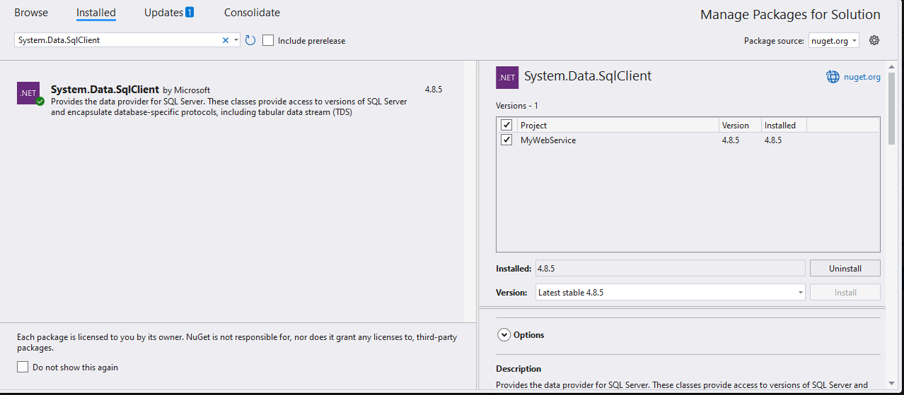
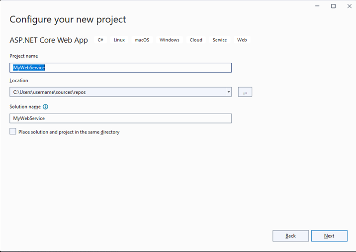

# Microsoft SQL Data Binding

This section describes how to use [System.Data.SqlClient](https://www.nuget.org/packages/System.Data.SqlClient/4.8.6?_src=template) to retrieve data from a Microsoft SQL server database and bind it to the Blazor DataGrid.

## Connecting a Microsoft SQL database to a Syncfusion Blazor DataGrid

**1.** Create a simple Blazor DataGrid by following the **"Getting Started"** documentation [link](https://blazor.syncfusion.com/documentation/datagrid/getting-started-with-web-app).

**2.** To connect a Microsoft SQL using the Microsoft SQL driver in our application, we need to install the [System.Data.SqlClient](https://www.nuget.org/packages/System.Data.SqlClient/4.8.6?_src=template) NuGet package. To do so, open the NuGet package manager of the project solution, search for the package **System.Data.SqlClient** and install it.

**3.** Next, in the **Index.razor** page, get the SQL data from the SQL server and bind it to the DataGrid component as a datasource by using the Custom adaptor feature and configure the report to use the Microsoft SQL data.



@rendermode InteractiveServer

@using Syncfusion.Blazor.Grids
@using Syncfusion.Blazor.Data
@using Syncfusion.Blazor
@using Microsoft.Data.SqlClient;
@using BlazorApp6.Data;

<SfGrid @ref="Grid" TValue="Order" AllowSorting="true" AllowFiltering="true"  AllowGrouping="true" AllowPaging="true" Toolbar="@(new List<string>() { "Add", "Delete", "Update", "Cancel" })">
    <SfDataManager AdaptorInstance="@typeof(CustomAdaptor)" Adaptor="Adaptors.CustomAdaptor"></SfDataManager>
    <GridEditSettings AllowEditing="true" AllowDeleting="true" AllowAdding="true" Mode="@EditMode.Normal"></GridEditSettings>    
    <GridColumns>
        <GridColumn Field=@nameof(Order.OrderID) HeaderText="Order ID" IsIdentity="true" IsPrimaryKey="true" TextAlign="TextAlign.Right" Width="120"></GridColumn>
        <GridColumn Field=@nameof(Order.CustomerID) HeaderText="Customer Name" Width="150"></GridColumn>
        <GridColumn Field=@nameof(Order.EmployeeID) HeaderText="Employee ID" Width="150"></GridColumn>
        <GridColumn Field=@nameof(Order.Freight) HeaderText="Freight" Width="150"></GridColumn>       
        <GridColumn Field=@nameof(Order.ShipCity) HeaderText="Ship City" Width="150"></GridColumn>
    </GridColumns>
</SfGrid>

@code {
    SfGrid<Order> Grid { get; set; }
}


  public class Order
  {
      public int? OrderID { get; set; }
      public string CustomerID { get; set; }
      public int EmployeeID { get; set; }
      public decimal Freight { get; set; }
      public string ShipCity { get; set; }
  }



**4.** In the custom adaptor’s **Read** method, you can get the Grid action details like paging,filtering,sorting information, etc., using **DataManagerRequest**.

* Based on the DataManagerRequest, form a SQL query string (to perform paging) and execute the SQL query. Retrieve the data from the database using SqlDataAdapter.

* The Fill method of the DataAdapter is used to populate a DataSet with the results of the SelectCommand of the DataAdapter, then convert the DataSet into the List.

* Return the response in Result and Count pair object in Read method to bind the data to the DataGrid.



@rendermode InteractiveServer

@using Syncfusion.Blazor.Grids
@using Syncfusion.Blazor.Data
@using Syncfusion.Blazor
@using Microsoft.Data.SqlClient;
@using BlazorApp6.Data;

<SfGrid @ref="Grid" TValue="Order" AllowSorting="true" AllowFiltering="true"  AllowGrouping="true" AllowPaging="true" Toolbar="@(new List<string>() { "Add", "Delete", "Update", "Cancel" })">
    <SfDataManager AdaptorInstance="@typeof(CustomAdaptor)" Adaptor="Adaptors.CustomAdaptor"></SfDataManager>
    <GridEditSettings AllowEditing="true" AllowDeleting="true" AllowAdding="true" Mode="@EditMode.Normal"></GridEditSettings>    
    <GridColumns>
        <GridColumn Field=@nameof(Order.OrderID) HeaderText="Order ID" IsIdentity="true" IsPrimaryKey="true" TextAlign="TextAlign.Right" Width="120"></GridColumn>
        <GridColumn Field=@nameof(Order.CustomerID) HeaderText="Customer Name" Width="150"></GridColumn>
        <GridColumn Field=@nameof(Order.EmployeeID) HeaderText="Employee ID" Width="150"></GridColumn>
        <GridColumn Field=@nameof(Order.Freight) HeaderText="Freight" Width="150"></GridColumn>       
        <GridColumn Field=@nameof(Order.ShipCity) HeaderText="Ship City" Width="150"></GridColumn>
    </GridColumns>
</SfGrid>

@code {
    SfGrid<Order> Grid { get; set; }
    
    public class CustomAdaptor : DataAdaptor
    {
        public OrderData Order = new OrderData();
        // Performs data Read operation
        public override async Task<object> ReadAsync(DataManagerRequest dm, string key = null)
        {
            IEnumerable<Order> DataSource = await Order.GetOrdersAsync(dm.Skip, dm.Take);             
            int count = await Order.GetOrderCountAsync();           
            return dm.RequiresCounts ? new DataResult() { Result = DataSource, Count = count } : (object)DataSource;
        }
    }
}



public class OrderData
{
    public async Task<List<Order>> GetOrdersAsync(int Skip, int Take)
    {
        string connectionString = @"<Enter a valid connection string>";            
        string QueryStr = "SELECT * FROM dbo.Orders ORDER BY OrderID OFFSET " + Skip + " ROWS FETCH NEXT " + Take + " ROWS ONLY;";
        List<Order> Orders = null;
        using (SqlConnection connection = new SqlConnection(connectionString))
        {
            SqlDataAdapter adapter = new SqlDataAdapter(QueryStr, connection);
            DataSet data = new DataSet();

            connection.Open();

            // Using SqlDataAdapter, we process the query string and fill the data into the dataset
            adapter.Fill(data);
            Orders = data.Tables[0].AsEnumerable().Select(r => new Order
            {
                OrderID = r.Field<int>("OrderID"),
                CustomerID = r.Field<string>("CustomerID"),
                EmployeeID = r.Field<int>("EmployeeID"),
                ShipCity = r.Field<string>("ShipCity"),
                Freight = r.Field<decimal>("Freight")
            }).ToList();

            connection.Close();
        }
        return Orders;
    }

    public async Task<int> GetOrderCountAsync()
    {
        string connectionString = @"<Enter a valid connection string>";
        string QueryStr = "select count(*) from orders";
        SqlConnection Con = new SqlConnection(connectionString);
        Con.Open();
        SqlCommand Cmd = new SqlCommand(QueryStr, Con);
        Int32 Count = (Int32)Cmd.ExecuteScalar();
        Con.Close();
        return Count;
    }
}



While running the application, the grid will be displayed as follows.

### Handling CRUD operations with our Syncfusion Blazor DataGrid component

Enable editing in the grid component using the [GridEditSettings](https://help.syncfusion.com/cr/blazor/Syncfusion.Blazor.Grids.GridEditSettings.html) component. Grid provides various modes of editing options such as Inline/Normal, Dialog and Batch editing. Refer the [Grid Editing](https://blazor.syncfusion.com/documentation/datagrid/editing) documentation for reference.

Here, inline edit mode and [Toolbar](https://blazor.syncfusion.com/documentation/datagrid/tool-bar) property are used to show toolbar items for editing.



<SfGrid @ref="Grid" TValue="Order" AllowPaging="true" Toolbar="@(new List<string>() { "Add","Edit","Delete","Update","Cancel"})">
    <GridEditSettings AllowAdding="true" AllowDeleting="true" AllowEditing="true"></GridEditSettings>
</SfGrid>



N> Normal editing is the default edit mode for the DataGrid component. Also, to perform CRUD operations, set IsPrimaryKey property as True for a particular GridColumn, whose value is a unique.

The CRUD operations can be performed and customized on our own by overriding the following CRUD methods of the DataAdaptor abstract class.

* Insert/InsertAsync
* Remove/RemoveAsync
* Update/UpdateAsync
* BatchUpdate/BatchUpdateAsync

Let’s see how to perform CRUD operation using SQL server data with Syncfusion Blazor DataGrid component

#### Insert Operation

To Perform the Insert operation, override the Insert/InsertAsync method of the custom adaptor and add the following code in the CustomAdaptorComponent.razor.




 public override async Task<object> InsertAsync(DataManager DataManager, object Value, string Key)
 {
     await Order.AddOrderAsync(Value as Order);
     return Value;
 }



 public async Task AddOrderAsync(Order Value)
 {
     string connectionString = @"<Enter a valid connection string>";
     string QueryStr = $"Insert into Orders(CustomerID,Freight,ShipCity,EmployeeID) values('{(Value as Order).CustomerID}','{(Value as Order).Freight}','{(Value as Order).ShipCity}','{(Value as Order).EmployeeID}')";
     SqlConnection Con = new SqlConnection(connectionString);
     Con.Open();
     SqlCommand Cmd = new SqlCommand(QueryStr, Con);
     Cmd.ExecuteNonQuery();
     Con.Close();
 }



#### Update Operation

To Perform the Update operation, override the Update/UpdateAsync method of the custom adaptor and add the following code in the CustomAdaptorComponent.razor.




// Performs Update operation
 public override async Task<object> UpdateAsync(DataManager dm, object Value, string keyField, string key)
 {
     await Order.UpdateOrderAsync(Value as Order);
     return Value;
 }



 public async Task UpdateOrderAsync(Order Value)
 {
     string connectionString = @"<Enter a valid connection string>";
     string QueryStr = $"Update Orders set CustomerID='{(Value as Order).CustomerID}', Freight={(Value as Order).Freight},EmployeeID={(Value as Order).EmployeeID},ShipCity={(Value as Order).ShipCity} where OrderID={(Value as Order).OrderID}";

     SqlConnection Con = new SqlConnection(connectionString);

     Con.Open();
     SqlCommand Cmd = new SqlCommand(QueryStr, Con);
     Cmd.ExecuteNonQuery();
     Con.Close();
 }



#### Delete Operation

To Perform the Delete operation, override the Remove/RemoveAsync method of the custom adaptor and add the following code in the CustomAdaptorComponent.razor.




public override async Task<object> RemoveAsync(DataManager dm, object Value, string keyField, string key)
{
    await Order.RemoveOrderAsync(Value as int?);
    return Value;
}



public async Task RemoveOrderAsync(int? Value)
{
    string connectionString = @"<Enter a valid connection string>"; 
    string QueryStr = $"Delete from Orders where OrderID={Value}";
    SqlConnection Con = new SqlConnection(connectionString);

    Con.Open();
    SqlCommand Cmd = new SqlCommand(QueryStr, Con);
    Cmd.ExecuteNonQuery();
    Con.Close();
}



N> You can find the sample in this [GitHub location]()

## Connecting a Microsoft SQL to a Syncfusion Blazor DataGrid via  Web API service

### Create a  Web API service to fetch Microsoft SQL data

**1.** Open Visual Studio and create an ASP.NET Core Web App project type, naming it **MyWebService**. To create an ASP.NET Core Web application, follow the documentation [link](https://learn.microsoft.com/en-us/visualstudio/get-started/csharp/tutorial-aspnet-core?view=vs-2022).

**2.** To connect a Microsoft SQL using the **System.Data.SqlClient** in our application, we need to install the [System.Data.SqlClient](https://www.nuget.org/packages/System.Data.SqlClient/4.8.6?_src=template) NuGet package. To do so, open the NuGet package manager of the project solution, search for the package **System.Data.SqlClient** and install it.

**3.** Create a Web API controller (aka, GridController.cs) file under **Controllers** folder that helps to establish data communication with the DataGrid.

**4.** In the ODataV4 controller (aka, GridController), connect to Microsoft SQL server. **SqlConnection** helps to connect the SQL database (that is, Database1.mdf). Next, using **SqlCommand** and **SqlDataAdapter** you can process the desired SQL query string and retrieve data from the database. The **Fill** method of the DataAdapter is used to populate the SQL data into a **DataTable** as shown in the following code snippet.



using Microsoft.AspNetCore.Mvc;
using System.Data;
using System.Data.SqlClient;
using Microsoft.AspNetCore.OData.Routing.Controllers;
using Microsoft.Extensions.Primitives;
namespace MyWebService.Controllers
{
    [ApiController]
    [Route("[controller]")]
    public class GridController : ODataController
    {

        public static List<Order> Orders { get; set; }

        public class Order
        {
            public int? OrderID { get; set; }
            public string CustomerID { get; set; }
            public int EmployeeID { get; set; }
            public decimal Freight { get; set; }
            public string ShipCity { get; set; }
        }
             
        public List<Order> GetMySQLResult(int skip,int top)
        {
            string conSTR = @"<Enter a valid connection string>"; 
            string QueryStr = "SELECT * FROM dbo.Orders ORDER BY OrderID OFFSET " + skip + " ROWS FETCH NEXT " + top + " ROWS ONLY;";
            SqlConnection sqlConnection = new(conSTR);
            sqlConnection.Open();
            SqlCommand sqlCommand = new(QueryStr, sqlConnection);
            SqlDataAdapter dataAdapter = new(sqlCommand);
            DataTable dataTable = new();
            dataAdapter.Fill(dataTable);
            sqlConnection.Close();
            var dataSource = (from DataRow data in dataTable.Rows
                          select new Order()
                          {
                              OrderID = Convert.ToInt32(data["OrderID"]),
                              CustomerID = data["CustomerID"].ToString(),
                              EmployeeID =  Convert.IsDBNull(data["EmployeeID"]) ? 0 : Convert.ToUInt16(data["EmployeeID"]),
                              ShipCity = data["ShipCity"].ToString(),
                              Freight = Convert.ToDecimal(data["Freight"])
                          }).ToList();

            return dataSource;
        }
    }
}



**5.** In the **Get()** method of the **GridController.cs** file, the **GetMicrosoft SQLResult** method is used to retrieve the Microsoft SQL data as a list.



using Microsoft.AspNetCore.Mvc;
using System.Data;
using System.Data.SqlClient;
using Microsoft.AspNetCore.OData.Routing.Controllers;
using Microsoft.Extensions.Primitives;
namespace MyWebService.Controllers
{
    [ApiController]
    [Route("[controller]")]
    public class GridController : ODataController
    {

        public static List<Order> Orders { get; set; }

        public class Order
        {
            public int? OrderID { get; set; }
            public string CustomerID { get; set; }
            public int EmployeeID { get; set; }
            public decimal Freight { get; set; }
            public string ShipCity { get; set; }
        }
        [HttpGet(Name = "GetMySQLResult")]
        public async Task<object> Get()
        {            
            var queryString = Request.Query; 
            if (queryString.Keys.Contains("$inlinecount"))
            {
                var count = await GetOrderCountAsync();
                StringValues Skip;
                StringValues Take;
                int skip = (queryString.TryGetValue("$skip", out Skip)) ? Convert.ToInt32(Skip[0]) : 0;
                int top = (queryString.TryGetValue("$top", out Take)) ? Convert.ToInt32(Take[0]) : count;
                var data = GetMySQLResult(skip,top).AsQueryable();
                return new { Items = data, Count = count };
            }
            else
            {
                var count = await GetOrderCountAsync();
                var data = GetMySQLResult(0,count).AsQueryable();
                return data;
            }
        }
       
        public List<Order> GetMySQLResult(int skip,int top)
        {
            string conSTR = @"<Enter a valid connection string>"; 
            string QueryStr = "SELECT * FROM dbo.Orders ORDER BY OrderID OFFSET " + skip + " ROWS FETCH NEXT " + top + " ROWS ONLY;";
            SqlConnection sqlConnection = new(conSTR);
            sqlConnection.Open();
            SqlCommand sqlCommand = new(QueryStr, sqlConnection);
            SqlDataAdapter dataAdapter = new(sqlCommand);
            DataTable dataTable = new();
            dataAdapter.Fill(dataTable);
            sqlConnection.Close();
            var dataSource = (from DataRow data in dataTable.Rows
                          select new Order()
                          {
                              OrderID = Convert.ToInt32(data["OrderID"]),
                              CustomerID = data["CustomerID"].ToString(),
                              EmployeeID =  Convert.IsDBNull(data["EmployeeID"]) ? 0 : Convert.ToUInt16(data["EmployeeID"]),
                              ShipCity = data["ShipCity"].ToString(),
                              Freight = Convert.ToDecimal(data["Freight"])
                          }).ToList();

            return dataSource;
        }
        public async Task<int> GetOrderCountAsync()
        {
            string connectionString = @"<Enter a valid connection string>"; 
            string QueryStr = "select count(*) from orders";
            SqlConnection Con = new SqlConnection(connectionString);
            Con.Open();
            SqlCommand Cmd = new SqlCommand(QueryStr, Con);
            Int32 Count = (Int32)Cmd.ExecuteScalar();
            Con.Close();
            return Count;
        }
    }
}



**6.** Run the application and it will be hosted within the URL `https://localhost:7033`.

**7.** Finally, the retrieved data from Microsoft SQL database which is in the form of JSON can be found in the Web API controller available in the URL link `https://localhost:7033/Grid`, as shown in the browser page below.

### Connecting the Grid to a Microsoft SQL using the Web API service

**1.** Create a simple Blazor Pivot Table by following the **"Getting Started"** documentation [link](https://blazor.syncfusion.com/documentation/datagrid/getting-started-with-web-app).

**2.** Map the hosted Web API's URL link `https://localhost:7033/Grid` to the Grid in **Index.razor** by using the [SfDataManager](https://help.syncfusion.com/cr/blazor/Syncfusion.Blazor.Data.SfDataManager.html) to the [DataSource](https://help.syncfusion.com/cr/blazor/Syncfusion.Blazor.Grids.SfGrid-1.html#Syncfusion_Blazor_Grids_SfGrid_1_DataSource) property or by using [SfDataManager](https://help.syncfusion.com/cr/blazor/Syncfusion.Blazor.Data.SfDataManager.html) component. To interact with remote data source, provide the endpoint **Url**.



@using Syncfusion.Blazor.Grids
@using Syncfusion.Blazor.Data
@using Syncfusion.Blazor
@using Microsoft.Data.SqlClient;

<SfGrid @ref="Grid" TValue="Order" AllowPaging="true" Toolbar="@(new List<string>() { "Add", "Delete", "Update", "Cancel" })">
    <SfDataManager Url="https://localhost:7033/Grid" Adaptor="Adaptors.WebApiAdaptor"></SfDataManager>
    <GridEditSettings AllowEditing="true" AllowDeleting="true" AllowAdding="true" Mode="EditMode.Normal"></GridEditSettings>
    <GridColumns>
        <GridColumn Field=@nameof(Order.OrderID) HeaderText="Order ID" IsIdentity="true" IsPrimaryKey="true" TextAlign="TextAlign.Right" Width="120"></GridColumn>
        <GridColumn Field=@nameof(Order.CustomerID) HeaderText="Customer Name" Width="150"></GridColumn>
        <GridColumn Field=@nameof(Order.EmployeeID) HeaderText="Employee ID" Width="150"></GridColumn>
        <GridColumn Field=@nameof(Order.Freight) HeaderText="Freight" Width="150"></GridColumn>
        <GridColumn Field=@nameof(Order.ShipCity) HeaderText="Ship City" Width="150"></GridColumn>
    </GridColumns>
</SfGrid>

@code {
    SfGrid<Order> Grid { get; set; }
    public List<Order> Orders { get; set; }

    public class Order
    {
        public int? OrderID { get; set; }
        public string CustomerID { get; set; }
        public int EmployeeID { get; set; }
        public decimal Freight { get; set; }
        public string ShipCity { get; set; }
    }
}



When you run the application, the resultant pivot table will look like this

### Handling CRUD operations with our Syncfusion Blazor DataGrid component

You can enable editing in the grid component using the [GridEditSettings](https://help.syncfusion.com/cr/blazor/Syncfusion.Blazor.Grids.GridEditSettings.html) component. Grid provides various modes of editing options such as [Inline/Normal](https://blazor.syncfusion.com/documentation/datagrid/in-line-editing), [Dialog](https://blazor.syncfusion.com/documentation/datagrid/dialog-editing), and [Batch](https://blazor.syncfusion.com/documentation/datagrid/batch-editing) editing.

Here, we are using **Inline** edit mode and used Toolbar property to show toolbar items for editing.
We have added the DataGrid Editing and Toolbar code with previous Grid model.




<SfGrid @ref="Grid" TValue="Order" AllowPaging="true" Toolbar="@(new List<string>() { "Add", "Delete", "Update", "Cancel" })">
    <SfDataManager Url="https://localhost:7033/Grid" Adaptor="Adaptors.WebApiAdaptor"></SfDataManager>
    <GridEvents OnActionFailure="Fail" TValue="Order"></GridEvents>
    <GridEditSettings AllowEditing="true" AllowDeleting="true" AllowAdding="true" Mode="EditMode.Normal"></GridEditSettings>

    <GridColumns>
        <GridColumn Field=@nameof(Order.OrderID) HeaderText="Order ID" IsIdentity="true" IsPrimaryKey="true" TextAlign="TextAlign.Right" Width="120"></GridColumn>
        <GridColumn Field=@nameof(Order.CustomerID) HeaderText="Customer Name" Width="150"></GridColumn>
        <GridColumn Field=@nameof(Order.EmployeeID) HeaderText="Employee ID" Width="150"></GridColumn>
        <GridColumn Field=@nameof(Order.Freight) HeaderText="Freight" Width="150"></GridColumn>
        <GridColumn Field=@nameof(Order.ShipCity) HeaderText="Ship City" Width="150"></GridColumn>
    </GridColumns>
</SfGrid>




> Normal editing is the default edit mode for the DataGrid component. Set the [IsPrimaryKey](https://help.syncfusion.com/cr/blazor/Syncfusion.Blazor.Grids.GridColumn.html#Syncfusion_Blazor_Grids_GridColumn_IsPrimaryKey) property of Column as **true** for a particular column, whose value is a unique value for editing purposes.

#### Insert a row

To insert a new row, click the **Add** toolbar button. The new record edit form will look like below.

Clicking the **Update** toolbar button will insert the record in the Orders table by calling the following **POST** method of the Web API.




[HttpPost]
public object Post([FromBody] Order Value)
{
    string connectionString = @"<Enter a valid connection string>"; 
    string QueryStr = $"Insert into Orders(CustomerID,Freight,ShipCity,EmployeeID) values('{(Value as Order).CustomerID}','{(Value as Order).Freight}','{(Value as Order).ShipCity}','{(Value as Order).EmployeeID}')";
    SqlConnection Con = new SqlConnection(connectionString);
    Con.Open();
    SqlCommand Cmd = new SqlCommand(QueryStr, Con);
    Cmd.ExecuteNonQuery();
    Con.Close();
    return Value;
}




#### Update a row

To edit a row, select any row and click the **Edit** toolbar button. The edit form will look like below. Edit the Customer Name column.

Clicking the **Update** toolbar button will update the record in the Orders table by calling the following **PUT** method of the Web API.




  [HttpPut]
  public object Put([FromBody] Order Value)
  {
      string connectionString = @"<Enter a valid connection string>"; 
      string QueryStr = "Update Orders set CustomerID=@CustomerID, Freight=@Freight, EmployeeID=@EmployeeID, ShipCity=@ShipCity where OrderID=@OrderID";

      using (SqlConnection Con = new SqlConnection(connectionString))
      {
          Con.Open();
          using (SqlCommand Cmd = new SqlCommand(QueryStr, Con))
          {
              Cmd.Parameters.AddWithValue("@CustomerID", (Value as Order).CustomerID);
              Cmd.Parameters.AddWithValue("@Freight", (Value as Order).Freight);
              Cmd.Parameters.AddWithValue("@EmployeeID", (Value as Order).EmployeeID);
              Cmd.Parameters.AddWithValue("@ShipCity", (Value as Order).ShipCity);
              Cmd.Parameters.AddWithValue("@OrderID", (Value as Order).OrderID);

              Cmd.ExecuteNonQuery();
          }
      }

      return Value;
  }




#### Delete a row

To delete a row, select any row and click the **Delete** toolbar button. Deleting operation will send a **DELETE** request to the Web API with the selected record`s primary key value to remove the corresponding record from the Orders table.




[HttpDelete("{id}")]
public async void Delete([FromBody] int id)
{
    string connectionString = @"<Enter a valid connection string>"; 
    string QueryStr = $"Delete from Orders where OrderID={id}";
    SqlConnection Con = new SqlConnection(connectionString);

    Con.Open();
    SqlCommand Cmd = new SqlCommand(QueryStr, Con);
    Cmd.ExecuteNonQuery();
    Con.Close();
}



N> Find the sample from this [Github]() location.
