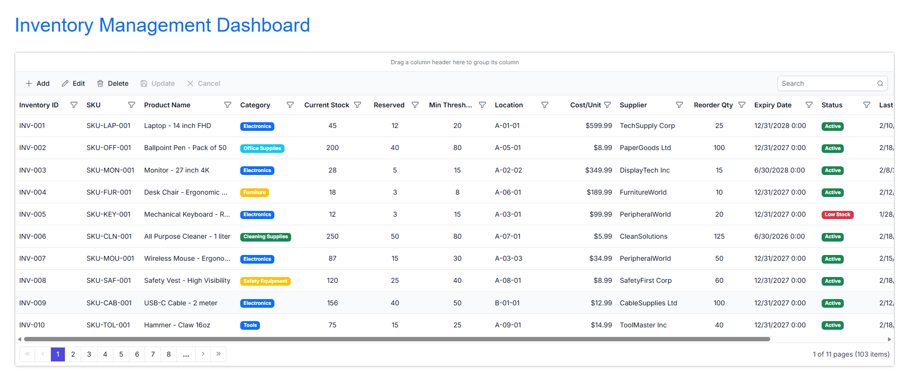

# Connecting DynamoDB to Blazor Data Grid Using AWS SDK

The [Syncfusion® Blazor DataGrid](https://www.syncfusion.com/blazor-components/blazor-datagrid) supports binding data from AWS DynamoDB using the AWS SDK for .NET. This approach provides a flexible, scalable, and serverless solution for working with cloud-based databases without requiring a traditional database server.

**What is DynamoDB?**

Amazon DynamoDB is a fully managed, serverless NoSQL database service provided by AWS. Unlike traditional relational databases that use tables and rows, DynamoDB uses a key-value and document data model, making it ideal for applications that require low-latency, high-throughput operations at any scale.

**Key Characteristics:**
- **Serverless Architecture**: No need to provision or manage database servers
- **Fully Managed**: AWS handles all maintenance, backups, and patches
- **NoSQL Model**: Stores data in flexible documents (similar to JSON)
- **On-Demand or Provisioned Billing**: Choose between flexible pricing models
- **Global Distribution**: Multi-region replication for global applications

**Key Benefits of DynamoDB**

- **Infinite Scalability**: Automatically scales to accommodate any request volume
- **Low Latency**: Single-digit millisecond latency for all requests
- **High Availability**: Data automatically replicated across multiple availability zones
- **Flexible Data Model**: Store complex, nested data structures without predefined schemas
- **Built-in Security**: Encryption at rest and in transit, IAM access control
- **Serverless**: No infrastructure management required
- **DynamoDB Local**: Free local emulator for development and testing

---

**What is DynamoDB Local?**

**DynamoDB Local** is a free downloadable version of DynamoDB that emulates the AWS DynamoDB service on the development machine. It allows  to develop and test applications **without AWS account credentials, internet connectivity, or AWS charges**.

**Key Characteristics:**
- **Free**: No AWS costs during development
- **Standalone Emulator**: Runs locally as a Java application
- **Full Feature Parity**: Supports all DynamoDB operations for testing
- **Offline Development**: Work without internet connectivity
- **Flexible Data**: By default, data is NOT persisted between restarts (optional persistence available)

---

**What is AWS NoSQL Workbench?**

**AWS NoSQL Workbench** is a free visual IDE for designing and managing DynamoDB tables. It provides a graphical interface to create tables, manage data, and build queries **without writing code**.

**Key Features:**
- **Visual Table Designer**: Graphically create tables with partition keys and attributes
- **Data Editor**: Insert, update, and delete items visually
- **Query Builder**: Test DynamoDB queries without code
- **Works with Both**: Seamlessly integrates with both DynamoDB Local and AWS Cloud DynamoDB

---

**When to Use DynamoDB Local?**

Understanding when to use DynamoDB Local vs. AWS Cloud DynamoDB is critical for efficient development. Use this decision matrix to choose the right approach:

| Scenario | Use DynamoDB Local? | Reasoning |
|----------|-------------------|-----------|
| **Local Development** | ✅ **YES** - Recommended | Develop offline without AWS costs; perfect for feature development and testing |
| **Integration Testing** | ✅ **YES** - Recommended | Fast, isolated testing environment; no external dependencies |
| **Team Development** | ✅ **YES** - Recommended | Each developer has their own isolated database; consistent local setup |
| **CI/CD Pipelines** | ✅ **YES** - Recommended | Automated testing without AWS account infrastructure or costs |
| **Learning & Experimentation** | ✅ **YES** - Strongly Recommended | Risk-free environment to learn DynamoDB concepts |
| **Offline Work** | ✅ **YES** - Only Option | Work without internet connectivity |
| **Production Deployment** | ❌ **NO** - Never Use | Must use AWS Cloud DynamoDB for production |
| **Performance Testing** | ⚠️ **MAYBE** | Use Local for quick tests, then validate with Cloud (performance differs) |
| **Real AWS Features** | ❌ **NO** - Use Cloud | Some advanced AWS features not available in Local |
| **Production-like Environment** | ⚠️ **MAYBE** - Then Migrate | Start with Local for development, migrate to Cloud for UAT/Production |

**Quick Decision Guide:**
- **Developing a new feature?** → Use DynamoDB Local
- **Need production-like performance?** → Use AWS Cloud DynamoDB
- **Testing before deployment?** → Use Local for quick tests, then verify on Cloud
- **Multiple team members?** → Use Local (each has their own instance)

---

**Development Options: Local vs. Cloud**

Before proceeding with setup, choose the development approach:

**Option A: Local Development (Recommended for This Guide)**
**Use DynamoDB Local + NoSQL Workbench on the local machine**
- ✅ Develop offline without AWS account
- ✅ Zero AWS costs during development
- ✅ Faster feedback loop
- ✅ No external dependencies
- ⚠️ Data not persisted by default (optional with `-dbPath`)

**Required Components:**
- Java 11+ (to run DynamoDB Local)
- NoSQL Workbench (for visual management)
- DynamoDB Local (the emulator)

**Ideal For:**
- Active feature development
- Learning DynamoDB
- Team development environments
- CI/CD pipelines

**Option B: Cloud Development (Production-like)**
**Use AWS Cloud DynamoDB directly**
- ✅ Real AWS environment
- ✅ Production-like performance testing
- ✅ Data persists permanently
- ❌ Requires AWS account with billing
- ❌ Slower feedback during development
- ❌ Team members need AWS credentials

**Required Components:**
- AWS account with billing enabled
- AWS access credentials
- NoSQL Workbench (for visual management)

**Ideal For:**
- Production deployment verification
- Real performance benchmarking
- UAT and pre-production testing
- Staging environments

---

## Prerequisites

Ensure the following software and packages are installed before proceeding:

| Software/Package | Version | Purpose |
|-----------------|---------|---------|
| Visual Studio 2026 | 18.0 or later | Development IDE with Blazor workload |
| .NET SDK | net10.0 or compatible | Runtime and build tools |
| AWS NoSQL Workbench | Latest | Visual IDE for managing DynamoDB tables |
| Syncfusion.Blazor.Grid | {{site.blazorversion}} | DataGrid and UI components |
| Syncfusion.Blazor.Themes | {{site.blazorversion}} | Styling for DataGrid components |
| AWSSDK.DynamoDBv2 | 3.7.100 or later | AWS SDK for .NET DynamoDB operations |
| AWSSDK.Extensions.NETCore.Setup | 3.7.2 or later | AWS service registration for dependency injection |

**For Local Development (Optional):**
- Java 11+ (required only for DynamoDB Local emulator)
- DynamoDB Local (free local emulator for development)

**Download Links:**
- AWS NoSQL Workbench: https://docs.aws.amazon.com/amazondynamodb/latest/developerguide/workbench.settingup.html
- DynamoDB Local (local development only): https://docs.aws.amazon.com/amazondynamodb/latest/developerguide/DynamoDBLocal.DownloadingAndRunning.html
- Java (local development only): https://www.java.com/en/download/

---

## Setting Up the DynamoDB Environment

### Step 1: Create the table in DynamoDB

Select the development approach and complete the corresponding setup:

**Option A: Using DynamoDB Local (Recommended for Development)**

**For Local Development Only - No AWS Account Needed**

1. **Download and Extract DynamoDB Local**
   - Download from: https://docs.aws.amazon.com/amazondynamodb/latest/developerguide/DynamoDBLocal.DownloadingAndRunning.html
   - Extract to a folder like `C:\DynamoDB Local\` (Windows) or `~/DynamoDB Local/` (macOS/Linux)
   - Verify Java 11+ is installed: `java -version`

2. **Start DynamoDB Local**
   - Open PowerShell/Terminal in the extracted folder
   - Run: `java -Djava.library.path=./DynamoDBLocal_lib -jar DynamoDBLocal.jar -sharedDb`
   - Keep this terminal open. The service runs on `http://localhost:8000`

3. **Open AWS NoSQL Workbench**
   - Launch the application
   - Create a new connection:
     - Select **"DynamoDB Local"**
     - Endpoint: `http://localhost:8000`
     - Region: `us-east-1`
     - Click **"Create connection"**

**Option B: Using AWS Cloud DynamoDB**

**For Production or Cloud Development - AWS Account Required**

1. **Set Up AWS Credentials**
   - Create an AWS account if don't have one
   - Generate Access Key ID and Secret Access Key from AWS IAM console
   - Note: This requires active billing

2. **Open AWS NoSQL Workbench**
   - Launch the application
   - Create a new connection:
     - Select **"DynamoDB in AWS"**
     - Access Key ID: Enter the AWS access key
     - Secret Access Key: Enter the AWS secret key
     - Region: Select the region (e.g., `us-east-1`)
     - Click **"Create connection"**

---

**Create the Inventory Table:**

Using **AWS NoSQL Workbench**, create the DynamoDB table with the following configuration:

1. **In NoSQL Workbench, click "Create table"**

2. **Enter Table Details:**
   - **Table Name:** `Inventory`
   - **Partition Key Name:** `InventoryID`
   - **Partition Key Type:** `String`
   - Leave **Sort Key** empty

3. **Click "Create"**

The `Inventory` table is now ready. DynamoDB supports flexible schemas, so additional attributes (SKUID, ProductName, Category, etc.) will be added when data is inserted.

---

**Load Sample Data:**

Insert sample inventory items into the table. Here's the sample data structure:

```json
[
  {
    "InventoryID": "INV-001",
    "SKUID": "SKU-001",
    "ProductName": "Laptop Dell XPS",
    "Category": "Electronics",
    "CurrentStock": 50,
    "ReservedStock": 5,
    "MinThreshold": 10,
    "LastRestockDate": "2026-02-15T10:00:00Z",
    "Location": "A-01-01",
    "CostPerUnit": 850.00,
    "Supplier": "Dell Inc",
    "ReorderQuantity": 20,
    "ExpiryDate": "2027-12-31T00:00:00Z",
    "Status": "Active",
    "LastAuditDate": "2026-02-17T08:30:00Z"
  },
  {
    "InventoryID": "INV-002",
    "SKUID": "SKU-002",
    "ProductName": "Monitor LG 27-inch",
    "Category": "Electronics",
    "CurrentStock": 30,
    "ReservedStock": 2,
    "MinThreshold": 5,
    "LastRestockDate": "2026-02-10T14:30:00Z",
    "Location": "A-02-01",
    "CostPerUnit": 299.99,
    "Supplier": "LG Electronics",
    "ReorderQuantity": 15,
    "ExpiryDate": "2027-12-31T00:00:00Z",
    "Status": "Active",
    "LastAuditDate": "2026-02-18T09:15:00Z"
  }
]
```

**Insert Data Using NoSQL Workbench:**
1. Select the `Inventory` table
2. Click **"Add Item"**
3. Enter data for each item (INV-001, INV-002, INV-003)
4. Click **"Save Item"** for each entry

After insertion, the items should be visible in the table..

---

### Step 2: Install Required NuGet Packages

Before installing the necessary NuGet packages, a new Blazor Web Application must be created using the default template.
This template automatically generates essential starter files—such as **Program.cs, appsettings.json, the wwwroot folder, and the Components folder**.

For this guide, a Blazor application named **Grid_MongoDB** has been created. Once the project is set up, the next step involves installing the required NuGet packages. NuGet packages are software libraries that add functionality to the application. These packages enable MongoDB integration and Syncfusion DataGrid components.

**Method 1: Using Package Manager Console**

1. Open Visual Studio 2026.
2. Navigate to **Tools → NuGet Package Manager → Package Manager Console**.
3. Run the following commands:

```powershell
Install-Package AWSSDK.DynamoDBv2 -Version 3.7.100
Install-Package AWSSDK.Extensions.NETCore.Setup -Version 3.7.2
Install-Package Syncfusion.Blazor.Grid -Version {{site.blazorversion}}
Install-Package Syncfusion.Blazor.Themes -Version {{site.blazorversion}}
```

**Method 2: Using NuGet Package Manager UI**

1. Open **Visual Studio 2026 → Tools → NuGet Package Manager → Manage NuGet Packages for Solution**.
2. Search for and install each package individually:    
   - **AWSSDK.DynamoDBv2** (version 3.7.100 or later)
   - **AWSSDK.Extensions.NETCore.Setup** (version 3.7.2 or later)
   - **[Syncfusion.Blazor.Grid]((https://www.nuget.org/packages/Syncfusion.Blazor.Grid/))** (version {{site.blazorversion}})
   - **[Syncfusion.Blazor.Themes](https://www.nuget.org/packages/Syncfusion.Blazor.Themes/)** (version {{site.blazorversion}})

All required packages are now installed.

---

### Step 3: Create the Data Model

A data model is a C# class that represents the structure of a DynamoDB item. This model defines the properties that correspond to the attributes in the Inventory table.

**Instructions:**

1. Create a new folder named `Models` in the Blazor application project.
2. Inside the `Models` folder, create a new file named **Inventory.cs**.
3. Define the **Inventory** class with the following code:

```csharp
using Amazon.DynamoDBv2.DataModel;

namespace Grid_DynamoDB.Models
{
    /// <summary>
    /// Represents an Inventory item stored in AWS DynamoDB
    /// Maps to the Inventory table with 15 attributes for warehouse management
    /// </summary>
    [DynamoDBTable("Inventory")]
    public class Inventory
    {
        /// <summary>
        /// Gets or sets the Inventory identifier (Partition key)
        /// Example: "INV-001", "INV-002"
        /// This is the unique identifier for each inventory item
        /// </summary>
        [DynamoDBHashKey]
        public string InventoryID { get; set; } = string.Empty;

        /// <summary>
        /// Gets or sets the product SKU
        /// Example: "SKU-001", "SKU-002"
        /// Used for product identification
        /// </summary>
        [DynamoDBProperty]
        public string SKUID { get; set; } = string.Empty;

        /// <summary>
        /// Gets or sets the product name
        /// Example: "Laptop Dell XPS"
        /// Display name for the inventory item
        /// </summary>
        [DynamoDBProperty]
        public string ProductName { get; set; } = string.Empty;

        /// <summary>
        /// Gets or sets the product category
        /// Example: "Electronics", "Accessories", "Supplies"
        /// Used for categorization and filtering
        /// </summary>
        [DynamoDBProperty]
        public string Category { get; set; } = string.Empty;

        /// <summary>
        /// Gets or sets the current stock level
        /// Number of units currently available in inventory
        /// </summary>
        [DynamoDBProperty]
        public int CurrentStock { get; set; }

        /// <summary>
        /// Gets or sets the reserved stock count
        /// Number of units reserved for pending orders
        /// </summary>
        [DynamoDBProperty]
        public int ReservedStock { get; set; }

        /// <summary>
        /// Gets or sets the minimum threshold for reordering
        /// Alert trigger point when stock falls below this value
        /// </summary>
        [DynamoDBProperty]
        public int MinThreshold { get; set; }

        /// <summary>
        /// Gets or sets the date of last restock (ISO 8601 format)
        /// Example: "2026-02-15T10:00:00Z"
        /// Timestamp of when the inventory was last restocked
        /// </summary>
        [DynamoDBProperty]
        public string LastRestockDate { get; set; } = string.Empty;

        /// <summary>
        /// Gets or sets the warehouse location or bin number
        /// Example: "A-01-01", "B-02-03"
        /// Physical location where item is stored
        /// </summary>
        [DynamoDBProperty]
        public string Location { get; set; } = string.Empty;

        /// <summary>
        /// Gets or sets the cost per unit in decimal format
        /// Used for inventory valuation and costing
        /// </summary>
        [DynamoDBProperty]
        public decimal CostPerUnit { get; set; }

        /// <summary>
        /// Gets or sets the supplier name
        /// Source vendor for this product
        /// </summary>
        [DynamoDBProperty]
        public string Supplier { get; set; } = string.Empty;

        /// <summary>
        /// Gets or sets the standard reorder quantity
        /// Default quantity ordered when restocking
        /// </summary>
        [DynamoDBProperty]
        public int ReorderQuantity { get; set; }

        /// <summary>
        /// Gets or sets the product expiry date (ISO 8601 format)
        /// Example: "2027-12-31T00:00:00Z"
        /// Relevant for perishable items or items with shelf life
        /// </summary>
        [DynamoDBProperty]
        public string ExpiryDate { get; set; } = string.Empty;

        /// <summary>
        /// Gets or sets the item status
        /// Valid values: "Active", "Discontinued", "Damaged", "Maintenance"
        /// Tracks the current state of the inventory item
        /// </summary>
        [DynamoDBProperty]
        public string Status { get; set; } = "Active";

        /// <summary>
        /// Gets or sets the date of last audit or physical count (ISO 8601 format)
        /// Example: "2026-02-17T08:30:00Z"
        /// Timestamp of the last physical inventory count
        /// </summary>
        [DynamoDBProperty]
        public string LastAuditDate { get; set; } = string.Empty;
    }
}
```

**Explanation:**
- The `[DynamoDBTable("Inventory")]` maps this class to the "Inventory" table in DynamoDB.
- The `[DynamoDBHashKey]` marks this property as the partition key and used to distribute items across partitions.
- The `[DynamoDBProperty]` marks this as a regular DynamoDB attribute.

The data model has been successfully created.

---

### Step 4: Create the DynamoDB Service Class

The DynamoDBService is a service class that handles all interactions with DynamoDB. It manages database connections and provides methods for CRUD operations.

**Instructions:**

1. Create a new folder named `Services` in the Blazor application project.
2. Inside the `Services` folder, create a new file named **DynamoDBService.cs**.
3. Define the **DynamoDBService** class with the following code:

```csharp
using Amazon.DynamoDBv2;
using Amazon.DynamoDBv2.DataModel;
using Amazon.DynamoDBv2.Model;
using Grid_DynamoDB.Models;

namespace Grid_DynamoDB.Services
{
    /// <summary>
    /// Service class for interacting with AWS DynamoDB
    /// Handles all CRUD operations, queries, and data transformations for Inventory items
    /// This service uses the high-level DynamoDBContext API for simplified operations
    /// </summary>
    public class DynamoDBService
    {
        private readonly IAmazonDynamoDB _dynamoDBClient;
        private readonly DynamoDBContext _dynamoDBContext;
        private readonly string _tableName;
        private readonly ILogger<DynamoDBService> _logger;
        private const string InventoryIdPrefix = "INV-";
        private const int InventoryIdStartNumber = 1;

        /// <summary>
        /// Initializes a new instance of the DynamoDBService
        /// Sets up DynamoDB client, context, and configuration from application settings
        /// </summary>
        /// <param name="dynamoDBClient">AWS DynamoDB client instance (injected)</param>
        /// <param name="configuration">Application configuration (injected)</param>
        /// <param name="logger">Logger for diagnostic information (injected)</param>
        public DynamoDBService(IAmazonDynamoDB dynamoDBClient, IConfiguration configuration, ILogger<DynamoDBService> logger)
        {
            _dynamoDBClient = dynamoDBClient;
            _dynamoDBContext = new DynamoDBContext(dynamoDBClient);
            _tableName = configuration["AWS:TableName"] ?? "Inventory";
            _logger = logger;
        }

        /// <summary>
        /// Retrieves all inventory items from DynamoDB
        /// Performs a full table scan - returns all items regardless of their key
        /// Note: Scan operations can be expensive on large tables; consider using Query with GSI for production
        /// </summary>
        /// <returns>List of all inventory items sorted by InventoryID</returns>
        public async Task<List<Inventory>> GetAllInventoriesAsync()
        {
            try
            {
                _logger.LogInformation("Fetching all inventory items from DynamoDB");
                
                // ScanAsync with empty conditions retrieves all items
                var items = await _dynamoDBContext.ScanAsync<Inventory>(new List<ScanCondition>()).GetRemainingAsync();

                // Sort by InventoryID to display in arranged format (INV-001, INV-002, etc.)
                var sortedItems = items.OrderBy(x => x.InventoryID).ToList();

                _logger.LogInformation($"Retrieved {items.Count} inventory items");
                return sortedItems;
            }
            catch (Exception ex)
            {
                _logger.LogError($"Error fetching inventory items: {ex.Message}");
                throw new Exception($"Error fetching inventory items: {ex.Message}", ex);
            }
        }

        /// <summary>
        /// Inserts a new inventory item into DynamoDB
        /// Auto-generates InventoryID if not provided
        /// Sets audit timestamps automatically
        /// </summary>
        /// <param name="inventory">The inventory item to insert</param>
        /// <returns>The inserted inventory item with generated ID and timestamps</returns>
        public async Task<Inventory> InsertInventoryAsync(Inventory inventory)
        {
            // Handle logic to add a new item to the database
        }

        /// <summary>
        /// Updates an existing inventory item in DynamoDB
        /// Replaces the entire item with the updated version
        /// Updates the LastAuditDate automatically
        /// </summary>
        /// <param name="inventory">The inventory item with updated values</param>
        /// <returns>True if update was successful</returns>
        public async Task<bool> UpdateInventoryAsync(Inventory inventory)
        {
           // Handle logic to update an existing item to the database
        }

        /// <summary>
        /// Deletes an inventory item from DynamoDB
        /// Uses the partition key (InventoryID) to identify the item to delete
        /// </summary>
        /// <param name="inventoryId">The InventoryID of the item to delete</param>
        /// <returns>True if deletion was successful</returns>
        public async Task<bool> DeleteInventoryAsync(string? inventoryId)
        {
            // Handle logic to delete an existing item from the database
        }
    }
}
```

**Explanation:**

- `IAmazonDynamoDB`: Low-level connection to DynamoDB (local or cloud)
- `DynamoDBContext`: High-level API for CRUD operations, auto-handles serialization
- `IConfiguration`: Reads settings from `appsettings.json`
- `ILogger`: Logs operations for debugging
- `GetAllInventoriesAsync()`: Retrieves all inventory items from the DynamoDB table using a Scan operation. Returns a sorted list of items by InventoryID.
- `InsertInventoryAsync()`: Adds a new inventory item to the table. 
- `UpdateInventoryAsync()`: Updates an existing inventory item by replacing the entire document with updated values.
- `DeleteInventoryAsync()`: Removes an inventory item from the table using the partition key (InventoryID).

---

### Step 5: Configure the Connection String

A connection string contains the information needed to connect the application to the DynamoDB.

**Update appsettings.json (Production Configuration)**

The **appsettings.json** file contains configuration for production environment. This file is checked into source control and should NOT contain sensitive credentials.

**Instructions:**

1. Open the `appsettings.json` file in the project root.
2. Add or update the ConnectionStrings section  with DynamoDB configuration:

```json
{
  "Logging": {
    "LogLevel": {
      "Default": "Information",
      "Microsoft.AspNetCore": "Warning"
    }
  },
  "AllowedHosts": "*",
  "AWS": {
    "Region": "us-east-1",
    "TableName": "Inventory"
  },
  "DetailedErrors": "true"
}
```

**Configuration Explanation:**

| Key | Value | Purpose |
|-----|-------|---------|
| `AWS:Region` | `us-east-1` | AWS region for DynamoDB (change if needed) |
| `AWS:TableName` | `Inventory` | Name of the DynamoDB table |

**For Production (Cloud AWS):**
```json
{
  "AWS": {
    "Region": "us-east-1",
    "TableName": "Inventory"
  }
}
```

The application will use AWS credentials from local machine or environment variables when deployed to production.

---

**Update appsettings.Development.json (Development Configuration)**

The **appsettings.Development.json** file contains configuration for local development environment. This file should be added to `.gitignore` to prevent committing credentials.

**Instructions:**
1. Create a new file named `appsettings.Development.json` in the project root:

```json
{
  "Logging": {
    "LogLevel": {
      "Default": "Debug",
      "Microsoft": "Information",
      "Microsoft.AspNetCore": "Information"
    }
  },
  "AWS": {
    "ServiceURL": "http://localhost:8000",
    "AccessKeyId": "local",
    "SecretAccessKey": "local",
    "Region": "us-east-1",
    "TableName": "Inventory"
  },
  "DetailedErrors": "true"
}
```

**Configuration Explanation for Local Development:**

| Key | Value | Purpose |
|-----|-------|---------|
| `AWS:ServiceURL` | `http://localhost:8000` | DynamoDB Local endpoint |
| `AWS:AccessKeyId` | `local` | Dummy credentials for local dev (not real) |
| `AWS:SecretAccessKey` | `local` | Dummy credentials for local dev (not real) |
| `AWS:Region` | `us-east-1` | AWS region setting |
| `AWS:TableName` | `Inventory` | DynamoDB table name |

**For Cloud Development (Scenario B):**

If using AWS cloud instead of local, update `appsettings.Development.json`:

```json
{
  "AWS": {
    "AccessKeyId": "YOUR_AWS_ACCESS_KEY",
    "SecretAccessKey": "YOUR_AWS_SECRET_KEY",
    "Region": "us-east-1",
    "TableName": "Inventory"
  }
}
```

**Important:** Do NOT commit this file if it contains real AWS credentials. Add to `.gitignore`:

```
# In .gitignore file
appsettings.Development.json
appsettings.*.json
```

---

## Step 6: Register Services in Program.cs

The **Program.cs** file is where application services are registered and configured. This file must be updated to enable MongoDB service and Syncfusion components.

**Instructions:**

1. Open the `Program.cs` file at the project root.
2. Add the following code after the line `var builder = WebApplication.CreateBuilder(args);`:

```csharp
using Amazon;
using Amazon.DynamoDBv2;
using Amazon.Runtime;
using Grid_DynamoDB.Components;
using Grid_DynamoDB.Services;
using Syncfusion.Blazor;

var builder = WebApplication.CreateBuilder(args);

// Add services to the container.
builder.Services.AddRazorComponents()
    .AddInteractiveServerComponents();

// Register Syncfusion Blazor services
builder.Services.AddSyncfusionBlazor();

// Configure AWS DynamoDB
var awsOptions = builder.Configuration.GetAWSOptions();

// For Development environment, use DynamoDB Local with dummy credentials
if (builder.Environment.IsDevelopment())
{
    // Override credentials with dummy values for local development
    awsOptions.Credentials = new BasicAWSCredentials(
        builder.Configuration["AWS:AccessKeyId"] ?? "local",
        builder.Configuration["AWS:SecretAccessKey"] ?? "local"
    );
}

builder.Services.AddDefaultAWSOptions(awsOptions);
builder.Services.AddAWSService<IAmazonDynamoDB>();

// Register DynamoDB Service for dependency injection
builder.Services.AddScoped<DynamoDBService>();

var app = builder.Build();

// Configure the HTTP request pipeline.
if (!app.Environment.IsDevelopment())
{
    app.UseExceptionHandler("/Error", createScopeForErrors: true);
    // The default HSTS value is 30 days. You may want to change this for production scenarios.
    app.UseHsts();
}

app.UseHttpsRedirection();
app.UseAntiforgery();

app.MapStaticAssets();
app.MapRazorComponents<App>()
    .AddInteractiveServerRenderMode();

app.Run();
```
The service registration has been completed successfully.

---

## Integrating Syncfusion Blazor DataGrid

### Step 1: Install and Configure Blazor DataGrid Components

Syncfusion is a library that provides pre-built UI components like DataGrid, which is used to display data in a table format.

**Instructions:**

* The Syncfusion.Blazor.Grid package was installed in **Step 2** of the previous section.
* Import the required namespaces in the `Components/_Imports.razor` file:

```csharp
@using Grid_DynamoDB.Models
@using Grid_DynamoDB.Services
@using Syncfusion.Blazor.Grids
@using Syncfusion.Blazor.Data
@using Syncfusion.Blazor.DropDowns
```

* Add the Syncfusion stylesheet and scripts in the `Components/App.razor` file. Find the `<head>` section and add:

```html

<!-- Syncfusion Blazor Stylesheet -->
<link href="_content/Syncfusion.Blazor.Themes/tailwind3.css" rel="stylesheet" />

<!-- Syncfusion Blazor Scripts -->
<script src="_content/Syncfusion.Blazor.Core/scripts/syncfusion-blazor.min.js" type="text/javascript"></script>
```

For this project, the tailwind3 theme is used. A different theme can be selected or the existing theme can be customized based on project requirements. Refer to the [Syncfusion Blazor Components Appearance](https://blazor.syncfusion.com/documentation/appearance/themes) documentation to learn more about theming and customization options.

Syncfusion components are now configured and ready to use. For additional guidance, refer to the Grid component's [getting‑started](https://blazor.syncfusion.com/documentation/datagrid/getting-started-with-web-app) documentation.

---

### Step 2: Update the Blazor DataGrid

The `Home.razor` component will display the inventory data in a Syncfusion Blazor DataGrid with search, filter, sort, and pagination capabilities.

**Instructions:**

* Open the file named `Home.razor` in the `Components/Pages` folder.
* Add the following code to create a basic DataGrid:

```cshtml
@page "/"
@using System.Collections
@rendermode InteractiveServer
@inject DynamoDBService DynamoDBService

<PageTitle>Inventory Management</PageTitle>

<div class="container-fluid mt-4">
    <div class="row mb-4">
        <div class="col-md-12">
            <h1 class="text-primary">
                <i class="bi bi-box-seam"></i> Inventory Management Dashboard
            </h1>
        </div>
    </div>

    <div class="row">
        <div class="col-md-12">
            <div class="card shadow-sm">
                <div class="card-body p-0">
                    <!-- Syncfusion Blazor DataGrid Component -->
                    <SfGrid TValue="Inventory" AllowPaging="true" AllowSorting="true" AllowFiltering="true" AllowGrouping="true">
                        <SfDataManager AdaptorInstance="@typeof(CustomAdaptor)" Adaptor="Adaptors.CustomAdaptor"></SfDataManager>
                        
                        <GridColumns>
                           //columns configuration
                        </GridColumns>
                        
                        <GridPageSettings PageSize="10"></GridPageSettings>
                    </SfGrid>
                </div>
            </div>
        </div>
    </div>
</div>

@code {
    // CustomAdaptor class will be added in the next step
}
```

**Component Explanation:**

- **`@rendermode InteractiveServer`**: Enables interactive server-side rendering for the component.
- **`@inject DynamoDBService`**: Injects the DynamoDB service to access database methods.
- **`<SfGrid>`**: The DataGrid component that displays data in rows and columns.
- **`<GridColumns>`**: Defines individual columns in the DataGrid.
- **`<GridPageSettings>`**: Configures pagination with 10 records per page.

The Home component has been updated successfully with DataGrid.

---

### Step 3: Implement the CustomAdaptor

The Syncfusion<sup style="font-size:70%">&reg;</sup> Blazor DataGrid can bind data from **AWS DynamoDB** using [DataManager](https://help.syncfusion.com/cr/blazor/Syncfusion.Blazor.Data.SfDataManager.html) and set the [Adaptor](https://help.syncfusion.com/cr/blazor/Syncfusion.Blazor.Adaptors.html) property to `CustomAdaptor` for scenarios that require full control over data operations.

The `CustomAdaptor` is a bridge between the DataGrid and the database. It handles all data operations including reading, searching, filtering, sorting, paging, and CRUD operations. Each operation in the CustomAdaptor's `ReadAsync` method handles specific grid functionality. The Syncfusion<sup style="font-size:70%">&reg;</sup> Blazor DataGrid sends operation details to the API through a [DataManagerRequest](https://help.syncfusion.com/cr/blazor/Syncfusion.Blazor.DataManagerRequest.html) object. These details can be applied to the data source using methods from the [DataOperations](https://help.syncfusion.com/cr/blazor/Syncfusion.Blazor.DataOperations.html) class.

**Instructions:**

* Open the `Components/Pages/Home.razor` file.
* Add the following `CustomAdaptor` class code inside the `@code` block:

```csharp
@code {

    private static DynamoDBService? _dynamoDBService;

    /// <summary>
    /// CustomAdaptor class bridges DataGrid interactions with database operations.
    /// This adaptor handles all data retrieval and manipulation for the DataGrid.
    /// </summary>
    public class CustomAdaptor : DataAdaptor
    {
        public DynamoDBService? DynamoDBService
        {
            get => _dynamoDBService;
            set => _dynamoDBService = value;
        }

        /// <summary>
        /// ReadAsync retrieves records from the database and applies data operations.
        /// This method executes when the grid initializes and when filtering, searching, sorting, or paging occurs.
        /// </summary>
        public override async Task<object> ReadAsync(DataManagerRequest dataManagerRequest, string? key = null)
        {
            try
            {
                // Fetch all inventory items from the DynamoDB database
                IEnumerable dataSource = await _dynamoDBService!.GetAllInventoriesAsync();

                // Apply search operation if search criteria exists
                if (dataManagerRequest.Search != null && dataManagerRequest.Search.Count > 0)
                {
                    dataSource = DataOperations.PerformSearching(dataSource, dataManagerRequest.Search);
                }

                // Apply filter operation if filter criteria exists
                if (dataManagerRequest.Where != null && dataManagerRequest.Where.Count > 0)
                {
                    dataSource = DataOperations.PerformFiltering(dataSource, dataManagerRequest.Where, dataManagerRequest.Where[0].Operator);
                }

                // Apply sort operation if sort criteria exists
                if (dataManagerRequest.Sorted != null && dataManagerRequest.Sorted.Count > 0)
                {
                    dataSource = DataOperations.PerformSorting(dataSource, dataManagerRequest.Sorted);
                }

                // Calculate total record count before paging for accurate pagination
                int totalRecordsCount = dataSource.Cast<Inventory>().Count();

                // Apply paging skip operation
                if (dataManagerRequest.Skip != 0)
                {
                    dataSource = DataOperations.PerformSkip(dataSource, dataManagerRequest.Skip);
                }

                // Apply paging take operation to retrieve only the requested page size
                if (dataManagerRequest.Take != 0)
                {
                    dataSource = DataOperations.PerformTake(dataSource, dataManagerRequest.Take);
                }

                // Handling Group operation in CustomAdaptor.
                if (dataManagerRequest.Group != null)
                {
                    foreach (var group in dataManagerRequest.Group)
                    {
                        dataSource = DataUtil.Group<Inventory>(dataSource, group, dataManagerRequest.Aggregates, 0, dataManagerRequest.GroupByFormatter);
                        //Add custom logic here if needed and remove above method
                    }
                }

                // Return the result with total count for pagination metadata
                return dataManagerRequest.RequiresCounts
                    ? new DataResult() { Result = dataSource, Count = totalRecordsCount }
                    : (object)dataSource;
            }
            catch (Exception ex)
            {
                throw new Exception($"An error occurred while retrieving data: {ex.Message}");
            }
        }
    }
}
```

The `CustomAdaptor` class has been successfully implemented with all data operations.

**Common methods in data operations**

* [ReadAsync(DataManagerRequest)](https://help.syncfusion.com/cr/blazor/Syncfusion.Blazor.DataAdaptor.html#Syncfusion_Blazor_DataAdaptor_ReadAsync_Syncfusion_Blazor_DataManagerRequest_System_String_) - Retrieve and process records (search, filter, sort, page, group)

* [PerformSearching](https://help.syncfusion.com/cr/blazor/Syncfusion.Blazor.DataOperations.html#Syncfusion_Blazor_DataOperations_PerformSearching__1_System_Linq_IQueryable___0__System_Collections_Generic_List_Syncfusion_Blazor_Data_SearchFilter__) - Applies search criteria to the collection.
* [PerformFiltering](https://help.syncfusion.com/cr/blazor/Syncfusion.Blazor.DataOperations.html#Syncfusion_Blazor_DataOperations_PerformFiltering__1_System_Linq_IQueryable___0__System_Collections_Generic_List_Syncfusion_Blazor_Data_WhereFilter__System_String_) - Filters data based on conditions.
* [PerformSorting](https://help.syncfusion.com/cr/blazor/Syncfusion.Blazor.DataOperations.html#Syncfusion_Blazor_DataOperations_PerformSorting__1_System_Linq_IQueryable___0__System_Collections_Generic_List_Syncfusion_Blazor_Data_Sort__) - Sorts data by one or more fields.
* [PerformSkip](https://help.syncfusion.com/cr/blazor/Syncfusion.Blazor.DataOperations.html#Syncfusion_Blazor_DataOperations_PerformSkip__1_System_Linq_IQueryable___0__System_Int32_) - Skips a defined number of records for paging.
* [PerformTake](https://help.syncfusion.com/cr/blazor/Syncfusion.Blazor.DataOperations.html#Syncfusion_Blazor_DataOperations_PerformTake__1_System_Linq_IQueryable___0__System_Int32_) - Retrieves a specified number of records for paging.
* [PerformAggregation](https://help.syncfusion.com/cr/blazor/Syncfusion.Blazor.Data.DataUtil.html#Syncfusion_Blazor_Data_DataUtil_PerformAggregation_System_Collections_IEnumerable_System_Collections_Generic_List_Syncfusion_Blazor_Data_Aggregate__) – Calculates aggregate values such as Sum, Average, Min, and Max.

---

### Step 4: Add Toolbar with CRUD and Search Options

The toolbar provides buttons for adding, editing, deleting records, and searching the data.

**Instructions:**

* Open the `Components/Pages/Home.razor` file.
* Update the `<SfGrid>` component to include the [Toolbar](https://help.syncfusion.com/cr/blazor/Syncfusion.Blazor.Grids.SfGrid-1.html#Syncfusion_Blazor_Grids_SfGrid_1_Toolbar) property with CRUD and search options:

```cshtml
<SfGrid TValue="Inventory" 
        AllowPaging="true" 
        AllowSorting="true" 
        AllowFiltering="true" 
        Toolbar="@ToolbarItems">
    <SfDataManager AdaptorInstance="@typeof(CustomAdaptor)" Adaptor="Adaptors.CustomAdaptor"></SfDataManager>
    
    <!-- Grid columns configuration -->
</SfGrid>
```

* Add the toolbar items list in the `@code` block:

```csharp
@code {
    private List<string> ToolbarItems = new List<string> { "Add", "Edit", "Delete", "Update", "Cancel", "Search"};

    // CustomAdaptor class code...
}
```

**Toolbar Items Explanation:**

| Item | Function |
|------|----------|
| `Add` | Opens a form to add a new inventory record. |
| `Edit` | Enables editing of the selected record. |
| `Delete` | Deletes the selected record from the database. |
| `Update` | Saves changes made to the selected record. |
| `Cancel` | Cancels the current edit or add operation. |
| `Search` | Displays a search box to find records. |

The toolbar has been successfully added.

---

### Step 5: Running the Application

**Build the Application**

1. Open the terminal or Package Manager Console.
2. Navigate to the project directory.
3. Run the following command:

```powershell
dotnet build
```

**Run the Application**

Execute the following command:

```powershell
dotnet run
```

**Access the Application**

1. Open a web browser.
2. Navigate to `https://localhost:5001` (or the port shown in the terminal).
3. The inventory management application is now running and ready to use.



---

### Step 6: Implement Paging Feature

Paging divides large datasets into smaller pages to improve performance and usability.

**Instructions:**

* The paging feature is already partially enabled in the `<SfGrid>` component with [AllowPaging="true"](https://help.syncfusion.com/cr/blazor/Syncfusion.Blazor.Grids.SfGrid-1.html#Syncfusion_Blazor_Grids_SfGrid_1_AllowPaging).
* The page size is configured with [GridPageSettings](https://help.syncfusion.com/cr/blazor/Syncfusion.Blazor.Grids.GridPageSettings.html).
* No additional code changes are required from the previous steps.

```cshtml
<SfGrid TValue="Inventory" 
        AllowPaging="true">
    <SfDataManager AdaptorInstance="@typeof(CustomAdaptor)" Adaptor="Adaptors.CustomAdaptor"></SfDataManager>
    <GridPageSettings PageSize="10"></GridPageSettings>
    
    <!-- Grid columns configuration -->
</SfGrid>
```

* Update the `ReadAsync` method in the `CustomAdaptor` class to handle paging:

```csharp
@code {  
    
    /// <summary>
    /// CustomAdaptor class to handle grid data operations with DynamoDB
    /// </summary>
    public class CustomAdaptor : DataAdaptor
    {
        public static DynamoDBService? _dynamoDBService { get; set; }
        public DynamoDBService? DynamoDBService 
        { 
            get => _dynamoDBService;
            set => _dynamoDBService = value;
        }

        public override async Task<object> ReadAsync(DataManagerRequest dataManagerRequest, string? key = null)
        {
            IEnumerable dataSource = await _dynamoDBService!.GetAllInventoriesAsync();        

            int totalRecordsCount = dataSource.Cast<Inventory>().Count();
            
            // Handling Paging
            if (dataManagerRequest.Skip != 0)
            {
                dataSource = DataOperations.PerformSkip(dataSource, dataManagerRequest.Skip);            
            }

            if (dataManagerRequest.Take != 0)
            {
                dataSource = DataOperations.PerformTake(dataSource, dataManagerRequest.Take);            
            }

            return dataManagerRequest.RequiresCounts 
                ? new DataResult() { Result = dataSource, Count = totalRecordsCount } 
                : (object)dataSource;
        }
    }
}
```

Fetches inventory data by calling the **GetAllInventoriesAsync** method, which is implemented in the **DynamoDBService.cs** file.

```csharp
/// <summary>
/// Retrieves all inventory items from DynamoDB
/// </summary>
/// <returns>List of all inventory items</returns>
public async Task<List<Inventory>> GetAllInventoriesAsync()
{
    try
    {
        _logger.LogInformation("Fetching all inventory items from DynamoDB");
        var items = await _dynamoDBContext.ScanAsync<Inventory>(new List<ScanCondition>()).GetRemainingAsync();

        // Sort by InventoryID to display in arranged format (INV-001, INV-002, etc.)
        var sortedItems = items.OrderBy(x => x.InventoryID).ToList();

        _logger.LogInformation($"Retrieved {items.Count} inventory items");
        return sortedItems;
    }
    catch (Exception ex)
    {
        _logger.LogError($"Error fetching inventory items: {ex.Message}");
        throw new Exception($"Error fetching inventory items: {ex.Message}", ex);
    }
}
```

**How Paging Works:**

- The DataGrid displays 10 records per page (as set in `GridPageSettings`).
- Navigation buttons allow the user to move between pages.
- When a page is requested, the `ReadAsync` method receives skip and take values.
- The `DataOperations.PerformSkip()` and `DataOperations.PerformTake()` methods handle pagination.
- Only the requested page of records is transmitted from the server.

Paging feature is now active with 10 records per page.

---

### Step 7: Implement Searching Feature

Searching allows the user to find records by entering keywords in the search box.

**Instructions:**

* Ensure the toolbar includes the "Search" item.
* No additional code changes are required.

```cshtml
<SfGrid TValue="Inventory"        
        AllowPaging="true"
        Toolbar="@ToolbarItems">
    <SfDataManager AdaptorInstance="@typeof(CustomAdaptor)" Adaptor="Adaptors.CustomAdaptor"></SfDataManager>
    <GridPageSettings PageSize="10"></GridPageSettings>
    <!-- Grid columns configuration -->
</SfGrid>
```

* Update the `ReadAsync` method in the `CustomAdaptor` class to handle searching:

```csharp
@code {
    private List<string> ToolbarItems = new List<string> { "Search"};
    
    /// <summary>
    /// CustomAdaptor class to handle grid data operations with DynamoDB
    /// </summary>
    public class CustomAdaptor : DataAdaptor
    {
        public static DynamoDBService? _dynamoDBService { get; set; }
        public DynamoDBService? DynamoDBService 
        { 
            get => _dynamoDBService;
            set => _dynamoDBService = value;
        }

        public override async Task<object> ReadAsync(DataManagerRequest dataManagerRequest, string? key = null)
        {
            IEnumerable dataSource = await _dynamoDBService!.GetAllInventoriesAsync();

            // Handling Search
            if (dataManagerRequest.Search != null && dataManagerRequest.Search.Count > 0)
            {
                dataSource = DataOperations.PerformSearching(dataSource, dataManagerRequest.Search);
            }

            int totalRecordsCount = dataSource.Cast<Inventory>().Count();
            // Handling Paging
            if (dataManagerRequest.Skip != 0)
            {
                dataSource = DataOperations.PerformSkip(dataSource, dataManagerRequest.Skip);
                //Add custom logic here if needed and remove above method
            }

            if (dataManagerRequest.Take != 0)
            {
                dataSource = DataOperations.PerformTake(dataSource, dataManagerRequest.Take);
                //Add custom logic here if needed and remove above method
            }

            return dataManagerRequest.RequiresCounts 
                ? new DataResult() { Result = dataSource, Count = totalRecordsCount } 
                : (object)dataSource;
        }
    }
}
```

**How Searching Works:**

- When the user enters text in the search box and presses Enter, the DataGrid sends a search request to the CustomAdaptor.
- The `ReadAsync` method receives the search criteria in `dataManagerRequest.Search`.
- The `DataOperations.PerformSearching()` method filters the data based on the search term.
- Results are returned and displayed in the DataGrid.

Searching feature is now active.

---

### Step 8: Implement Filtering Feature

Filtering allows the user to restrict data based on column values using a menu interface.

**Instructions:**

* Open the `Components/Pages/Home.razor` file.
* Add the [AllowFiltering](https://help.syncfusion.com/cr/blazor/Syncfusion.Blazor.Grids.SfGrid-1.html#Syncfusion_Blazor_Grids_SfGrid_1_AllowFiltering) property and [GridFilterSettings](https://help.syncfusion.com/cr/blazor/Syncfusion.Blazor.Grids.GridFilterSettings.html) to the `<SfGrid>` component:

```cshtml
<SfGrid TValue="Inventory" 
        AllowPaging="true"         
        AllowFiltering="true"
        Toolbar="@ToolbarItems">
    <SfDataManager AdaptorInstance="@typeof(CustomAdaptor)" Adaptor="Adaptors.CustomAdaptor"></SfDataManager>
    
    <GridFilterSettings Type="Syncfusion.Blazor.Grids.FilterType.Menu"></GridFilterSettings>
    
    <!-- Grid columns configuration -->
</SfGrid>
```

* Update the `ReadAsync` method in the `CustomAdaptor` class to handle filtering:

```csharp
/// <summary>
/// CustomAdaptor class to handle grid data operations with DynamoDB
/// </summary>
public class CustomAdaptor : DataAdaptor
{
    public static DynamoDBService? _dynamoDBService { get; set; }
    public DynamoDBService? DynamoDBService 
    { 
        get => _dynamoDBService;
        set => _dynamoDBService = value;
    }

    public override async Task<object> ReadAsync(DataManagerRequest dataManagerRequest, string? key = null)
    {
        IEnumerable dataSource = await _dynamoDBService!.GetAllInventoriesAsync();

        // Handling Search
        if (dataManagerRequest.Search != null && dataManagerRequest.Search.Count > 0)
        {
            dataSource = DataOperations.PerformSearching(dataSource, dataManagerRequest.Search);
        }

        // Handling Filtering
        if (dataManagerRequest.Where != null && dataManagerRequest.Where.Count > 0)
        {
            dataSource = DataOperations.PerformFiltering(dataSource, dataManagerRequest.Where, dataManagerRequest.Where[0].Operator);
        }
        
        int totalRecordsCount = dataSource.Cast<Inventory>().Count();
        // Handling Paging
        if (dataManagerRequest.Skip != 0)
        {
            dataSource = DataOperations.PerformSkip(dataSource, dataManagerRequest.Skip);
            //Add custom logic here if needed and remove above method
        }

        if (dataManagerRequest.Take != 0)
        {
            dataSource = DataOperations.PerformTake(dataSource, dataManagerRequest.Take);
            //Add custom logic here if needed and remove above method
        }

        return dataManagerRequest.RequiresCounts 
            ? new DataResult() { Result = dataSource, Count = totalRecordsCount } 
            : (object)dataSource;
    }

}
```

**How Filtering Works:**

- Click on the dropdown arrow in any column header to open the filter menu.
- Select filtering criteria (equals, contains, greater than, less than, etc.).
- Click the "Filter" button to apply the filter.
- The `ReadAsync` method receives the filter criteria in `dataManagerRequest.Where`.
- Results are filtered accordingly and displayed in the DataGrid.

Filtering feature is now active.

---

### Step 9: Implement Sorting Feature

Sorting enables the user to arrange records in ascending or descending order based on column values.

**Instructions:**

* Open the `Components/Pages/Home.razor` file.
* Add the [AllowSorting](https://help.syncfusion.com/cr/blazor/Syncfusion.Blazor.Grids.SfGrid-1.html#Syncfusion_Blazor_Grids_SfGrid_1_AllowSorting) property to the `<SfGrid>` component:

```cshtml
<SfGrid TValue="Inventory" 
        AllowPaging="true" 
        AllowSorting="true" 
        AllowFiltering="true" 
        Toolbar="@ToolbarItems">
    <SfDataManager AdaptorInstance="@typeof(CustomAdaptor)" Adaptor="Adaptors.CustomAdaptor"></SfDataManager>
 
     <GridPageSettings PageSize="10"></GridPageSettings>
     <GridFilterSettings Type="Syncfusion.Blazor.Grids.FilterType.Menu"></GridFilterSettings>
    
    <!-- Grid columns configuration -->
</SfGrid>
```

* Update the `ReadAsync` method in the `CustomAdaptor` class to handle sorting:

```csharp
/// <summary>
/// CustomAdaptor class to handle grid data operations with DynamoDB
/// </summary>
public class CustomAdaptor : DataAdaptor
{
    public static DynamoDBService? _dynamoDBService { get; set; }
    public DynamoDBService? DynamoDBService 
    { 
        get => _dynamoDBService;
        set => _dynamoDBService = value;
    }

    public override async Task<object> ReadAsync(DataManagerRequest dataManagerRequest, string? key = null)
    {
        IEnumerable dataSource = await _dynamoDBService!.GetAllInventoriesAsync();

        // Handling Search
        if (dataManagerRequest.Search != null && dataManagerRequest.Search.Count > 0)
        {
            dataSource = DataOperations.PerformSearching(dataSource, dataManagerRequest.Search);
        }

        // Handling Filtering
        if (dataManagerRequest.Where != null && dataManagerRequest.Where.Count > 0)
        {
            dataSource = DataOperations.PerformFiltering(dataSource, dataManagerRequest.Where, dataManagerRequest.Where[0].Operator);
        }

         // Handling Sorting
        if (dataManagerRequest.Sorted != null && dataManagerRequest.Sorted.Count > 0)
        {
            dataSource = DataOperations.PerformSorting(dataSource, dataManagerRequest.Sorted);
        }
        
        int totalRecordsCount = dataSource.Cast<Inventory>().Count();
        // Handling Paging
        if (dataManagerRequest.Skip != 0)
        {
            dataSource = DataOperations.PerformSkip(dataSource, dataManagerRequest.Skip);
            //Add custom logic here if needed and remove above method
        }

        if (dataManagerRequest.Take != 0)
        {
            dataSource = DataOperations.PerformTake(dataSource, dataManagerRequest.Take);
            //Add custom logic here if needed and remove above method
        }

        return dataManagerRequest.RequiresCounts 
            ? new DataResult() { Result = dataSource, Count = totalRecordsCount } 
            : (object)dataSource;
    }

}
```

**How Sorting Works:**

- Click on the column header to sort in ascending order.
- Click again to sort in descending order.
- The `ReadAsync` method receives the sort criteria in `dataManagerRequest.Sorted`.
- Records are sorted accordingly and displayed in the DataGrid.

Sorting feature is now active.

---

### Step 10: Implement Grouping Feature

Grouping organizes records into hierarchical groups based on column values.

**Instructions:**

* Open the `Components/Pages/Home.razor` file.
* Add the [AllowGrouping](https://help.syncfusion.com/cr/blazor/Syncfusion.Blazor.Grids.SfGrid-1.html#Syncfusion_Blazor_Grids_SfGrid_1_AllowGrouping) property to the `<SfGrid>` component:

```cshtml
<SfGrid TValue="Inventory" 
        AllowPaging="true" 
        AllowSorting="true" 
        AllowFiltering="true" 
        AllowGrouping="true"
        Toolbar="@ToolbarItems">
    <SfDataManager AdaptorInstance="@typeof(CustomAdaptor)" Adaptor="Adaptors.CustomAdaptor"></SfDataManager>
     <GridPageSettings PageSize="10"></GridPageSettings>
     <GridFilterSettings Type="Syncfusion.Blazor.Grids.FilterType.Menu"></GridFilterSettings>
    <!-- Grid columns  -->
</SfGrid>
```

* Update the `ReadAsync` method in the `CustomAdaptor` class to handle grouping:

```csharp
/// <summary>
/// CustomAdaptor class to handle grid data operations with DynamoDB
/// </summary>
public class CustomAdaptor : DataAdaptor
{
    public static DynamoDBService? _dynamoDBService { get; set; }
    public DynamoDBService? DynamoDBService 
    { 
        get => _dynamoDBService;
        set => _dynamoDBService = value;
    }

    public override async Task<object> ReadAsync(DataManagerRequest dataManagerRequest, string? key = null)
    {
        IEnumerable dataSource = await _dynamoDBService!.GetAllInventoriesAsync();

        // Handling Search
        if (dataManagerRequest.Search != null && dataManagerRequest.Search.Count > 0)
        {
            dataSource = DataOperations.PerformSearching(dataSource, dataManagerRequest.Search);
        }

        // Handling Filtering
        if (dataManagerRequest.Where != null && dataManagerRequest.Where.Count > 0)
        {
            dataSource = DataOperations.PerformFiltering(dataSource, dataManagerRequest.Where, dataManagerRequest.Where[0].Operator);
        }

         // Handling Sorting
        if (dataManagerRequest.Sorted != null && dataManagerRequest.Sorted.Count > 0)
        {
            dataSource = DataOperations.PerformSorting(dataSource, dataManagerRequest.Sorted);
        }

        int totalRecordsCount = dataSource.Cast<Inventory>().Count();
        
        // Handling Paging
        if (dataManagerRequest.Skip != 0)
        {
            dataSource = DataOperations.PerformSkip(dataSource, dataManagerRequest.Skip);
            //Add custom logic here if needed and remove above method
        }

        if (dataManagerRequest.Take != 0)
        {
            dataSource = DataOperations.PerformTake(dataSource, dataManagerRequest.Take);
            //Add custom logic here if needed and remove above method
        }

        // Handling Group operation in CustomAdaptor.
        if (dataManagerRequest.Group != null)
        {
            foreach (var group in dataManagerRequest.Group)
            {
                dataSource = DataUtil.Group<Inventory>(dataSource, group, dataManagerRequest.Aggregates, 0, dataManagerRequest.GroupByFormatter);
            }
        }

        return dataManagerRequest.RequiresCounts 
            ? new DataResult() { Result = dataSource, Count = totalRecordsCount } 
            : (object)dataSource;
    }
}
```

**How Grouping Works:**

- Columns can be grouped by dragging the column header into the group drop area.
- Each group can be expanded or collapsed by clicking on the group header.
- The `ReadAsync` method receives the grouping instructions through `dataManagerRequest.Group`.
- The grouping operation is processed using **DataUtil.Group**, which organizes the records into hierarchical groups based on the selected column.
- Grouping is performed after search, filter, and sort operations, ensuring the grouped data reflects all applied conditions.
- The processed grouped result is then returned to the **Grid** and displayed in a structured, hierarchical format.

Grouping feature is now active.

---

### Step 11: Perform CRUD Operations

CustomAdaptor methods enable users to create, read, update, and delete records directly from the DataGrid. Each operation calls corresponding data layer methods in **DynamoDBService.cs** to execute DynamoDB commands.

Add the Grid **EditSettings** and **Toolbar** configuration to enable create, read, update, and delete (CRUD) operations.

```cshtml
<SfGrid TValue="Inventory" 
        AllowPaging="true" 
        AllowSorting="true" 
        AllowFiltering="true" 
        AllowGrouping="true"
        Toolbar="@ToolbarItems">
    <SfDataManager AdaptorInstance="@typeof(CustomAdaptor)" Adaptor="Adaptors.CustomAdaptor"></SfDataManager>
     <GridPageSettings PageSize="10"></GridPageSettings>
     <GridFilterSettings Type="Syncfusion.Blazor.Grids.FilterType.Menu"></GridFilterSettings>
     <GridEditSettings AllowEditing="true" AllowAdding="true" AllowDeleting="true" Mode="EditMode.Normal"></GridEditSettings>
    <!-- Grid columns  -->
</SfGrid>
```

Add the toolbar items list in the `@code` block:

```csharp
@code {
    private List<string> ToolbarItems = new List<string> { "Add", "Edit", "Delete", "Update", "Cancel", "Search"};

    // CustomAdaptor class code...
}
```

**Insert**

Record insertion allows new inventory items to be added directly through the DataGrid component. The adaptor processes the insertion request, performs any required business‑logic validation, and saves the newly created record to the DynamoDB database.

In **Home.razor**, implement the `InsertAsync` method to handle record insertion within the `CustomAdaptor` class:

```csharp
public class CustomAdaptor : DataAdaptor
{
    public override async Task<object?> InsertAsync(DataManager dataManager, object value, string? key = null)
    {
        try
        {
            if (value is Inventory newInventory)
            {
                var result = await _dynamoDBService!.InsertInventoryAsync(newInventory);
                return result;
            }
            return default;
        }
        catch (Exception ex)
        {
            Console.WriteLine($"Error in Insert operation: {ex.Message}");
            throw;
        }
    }
}
```

In **Services/DynamoDBService.cs**, implement the insert method:

```csharp
public async Task<Inventory> InsertInventoryAsync(Inventory inventory)
{
    try
    {
        if (string.IsNullOrWhiteSpace(inventory.SKUID))
        {
            throw new ArgumentException("SKUID is required");
        }

        // Auto-generate InventoryID if not provided
        if (string.IsNullOrWhiteSpace(inventory.InventoryID))
        {
            inventory.InventoryID = await GenerateInventoryIdAsync();
            _logger.LogInformation($"Auto-generated InventoryID: {inventory.InventoryID}");
        }

        // Set audit timestamps
        inventory.LastAuditDate = DateTime.UtcNow.ToString("O");
        if (string.IsNullOrWhiteSpace(inventory.LastRestockDate))
        {
            inventory.LastRestockDate = DateTime.UtcNow.ToString("O");
        }

        _logger.LogInformation($"Inserting inventory item: Inventory={inventory.InventoryID}, SKU={inventory.SKUID}");
        await _dynamoDBContext.SaveAsync(inventory);
        _logger.LogInformation("Inventory item inserted successfully");
        return inventory;
    }
    catch (Exception ex)
    {
        _logger.LogError($"Error inserting inventory item: {ex.Message}");
        throw new Exception($"Error inserting inventory item: {ex.Message}", ex);
    }
}

private async Task<string> GenerateInventoryIdAsync()
{
    var existingInventories = await GetAllInventoriesAsync();
    int maxNumber = existingInventories
        .Where(inventory => !string.IsNullOrEmpty(inventory.InventoryID) && inventory.InventoryID.StartsWith(InventoryIdPrefix))
        .Select(inventory =>
        {
            string numberPart = inventory.InventoryID.Substring(InventoryIdPrefix.Length);
            if (int.TryParse(numberPart, out int number))
                return number;
            return 0;
        })
        .DefaultIfEmpty(InventoryIdStartNumber - 1)
        .Max();

    int nextNumber = maxNumber + 1;
    string newInventoryId = $"{InventoryIdPrefix}{nextNumber:D3}"; 
    return newInventoryId;
}
```

**Helper methods explanation:**
- `GenerateInventoryIdAsync()`: A new InventoryID is generated in the format INV-001, INV-002, etc.

**What happens behind the scenes:**

1. The form data is collected and validated in the CustomAdaptor's `InsertAsync()` method.
2. The `DynamoDBService.InsertInventoryAsync()` method is called.
3. A unique InventoryID is auto-generated if not provided.
4. The LastAuditDate and LastRestockDate are set to the current UTC date if not provided.
5. `SaveAsync()` adds the item to the DynamoDB table.
6. The DataGrid automatically refreshes to display the new record.

Now the new inventory item is persisted to the database and reflected in the grid.

**Update**

Record modification allows inventory details to be updated directly within the DataGrid. The adaptor processes the edited row, validates the updated values, and applies the changes to the **DynamoDB** database while ensuring data integrity is preserved.

In **Home.razor**, implement the `UpdateAsync` method to handle record updates within the `CustomAdaptor` class:

```csharp
public class CustomAdaptor : DataAdaptor
{
    public override async Task<object?> UpdateAsync(DataManager dataManager, object value, string? keyField, string key)
    {
        try
        {
            if (value is Inventory inventory)
            {
                var result = await _dynamoDBService!.UpdateInventoryAsync(inventory);
                return result ? value : default;
            }
            return default;
        }
        catch (Exception ex)
        {
            Console.WriteLine($"Error in Update operation: {ex.Message}");
            throw;
        }
    }
}
```

In **Services/DynamoDBService.cs**, implement the update method:

```csharp
public async Task<bool> UpdateInventoryAsync(Inventory inventory)
{
    try
    {
        if (string.IsNullOrWhiteSpace(inventory.InventoryID) || string.IsNullOrWhiteSpace(inventory.SKUID))
        {
            throw new ArgumentException("InventoryId and SKUID are required");
        }

        // Update audit timestamp
        inventory.LastAuditDate = DateTime.UtcNow.ToString("O");

        _logger.LogInformation($"Updating inventory item: Inventory={inventory.InventoryID}, SKU={inventory.SKUID}");
        await _dynamoDBContext.SaveAsync(inventory);
        _logger.LogInformation("Inventory item updated successfully");
        return true;
    }
    catch (Exception ex)
    {
        _logger.LogError($"Error updating inventory item: {ex.Message}");
        throw new Exception($"Error updating inventory item: {ex.Message}", ex);
    }
}
```

**What happens behind the scenes:**

1. The modified data is collected from the form.
2. The CustomAdaptor's `UpdateAsync()` method is called.
3. The `DynamoDBService.UpdateInventoryAsync()` method is called.
4. The LastAuditDate is updated to the current UTC time.
5. `SaveAsync()` replaces the entire item in the DynamoDB table.
6. The method returns true if the item was updated successfully.
7. The DataGrid refreshes to display the updated record.

Now modifications are synchronized to the database and reflected in the grid UI.

**Delete**

Record deletion allows inventory items to be removed directly from the DataGrid. The adaptor captures the delete request, executes the corresponding **DynamoDB DELETE** operation, and updates both the database and the grid to reflect the removal.

In **Home.razor**, implement the `RemoveAsync` method to handle record deletion within the `CustomAdaptor` class:

```csharp
public class CustomAdaptor : DataAdaptor
{
    public override async Task<object?> RemoveAsync(DataManager dataManager, object value, string? keyField, string key)
    {
        try
        {
            await _dynamoDBService!.DeleteInventoryAsync(value as string);
            return value;
        }
        catch (Exception ex)
        {
            Console.WriteLine($"Error in Delete operation: {ex.Message}");
            throw;
        }
    }
}
```

In **Services/DynamoDBService.cs**, implement the delete method:

```csharp
public async Task<bool> DeleteInventoryAsync(string? inventoryId)
{
    try
    {
        if (string.IsNullOrWhiteSpace(inventoryId))
        {
            throw new ArgumentException("InventoryId is required");
        }

        _logger.LogInformation($"Deleting inventory item: InventoryId={inventoryId}");
        await _dynamoDBContext.DeleteAsync<Inventory>(inventoryId);
        _logger.LogInformation("Inventory item deleted successfully");
        return true;
    }
    catch (Exception ex)
    {
        _logger.LogError($"Error deleting inventory item: {ex.Message}");
        throw new Exception($"Error deleting inventory item: {ex.Message}", ex);
    }
}
```

**What happens behind the scenes:**

1. The user selects a record and clicks "Delete".
2. A confirmation dialog appears (built into the DataGrid).
3. If confirmed, the CustomAdaptor's `RemoveAsync()` method is called.
4. The `DynamoDBService.DeleteInventoryAsync()` method is called.
5. `DeleteAsync()` removes the item from the DynamoDB table using the InventoryID as the key.
6. The method returns true if the item was deleted successfully.
7. The DataGrid refreshes to remove the deleted record from the UI.

Now inventory items are removed from the database and the grid UI reflects the changes immediately.

**Batch Update**

Batch operations combine multiple insert, update, and delete actions into a single request, minimizing network overhead and ensuring transactional consistency by applying all changes atomically to the DynamoDB database.

In **Home.razor**, implement the `BatchUpdateAsync` method to handle multiple record updates in a single request within the `CustomAdaptor` class:

```csharp
public class CustomAdaptor : DataAdaptor
{
    public override async Task<object> BatchUpdateAsync(DataManager dataManager, object changedRecords, object addedRecords, object deletedRecords, string? keyField, string key, int? dropIndex)
    {
        // Process updated records
        if (changedRecords != null)
        {
            foreach (var record in (IEnumerable<Inventory>)changedRecords)
            {
                var inventory = record as Inventory;
                if (inventory != null)
                {
                    await _dynamoDBService!.UpdateInventoryAsync(inventory);
                }
            }
        }

        // Process newly added records
        if (addedRecords != null)
        {
            foreach (var record in (IEnumerable<Inventory>)addedRecords)
            {
                await _dynamoDBService!.InsertInventoryAsync(record as Inventory);
            }
        }

        // Process deleted records
        if (deletedRecords != null)
        {
            foreach (var record in (IEnumerable<Inventory>)deletedRecords)
            {
                await _dynamoDBService!.DeleteInventoryAsync((record as Inventory)?.InventoryID);
            }
        }
        return key;
    }
}
```

> This method is triggered when the DataGrid is operating in [Batch](https://blazor.syncfusion.com/documentation/datagrid/batch-editing) Edit mode.

**What happens behind the scenes:**

- The DataGrid collects all added, edited, and deleted records in Batch Edit mode.
- The combined batch request is passed to the CustomAdaptor's `BatchUpdateAsync()` method.
- Each modified record is processed using `DynamoDBService.UpdateInventoryAsync()`.
- Each newly added record is saved using `DynamoDBService.InsertInventoryAsync()`.
- Each deleted record is removed using `DynamoDBService.DeleteInventoryAsync()`.
- All service operations persist changes to the DynamoDB database.
- The DataGrid refreshes to display the updated, added, and removed records in a single response.

Now the adaptor supports bulk modifications with atomic database synchronization. All CRUD operations are now fully implemented, enabling comprehensive data management capabilities within the Blazor DataGrid.

**Reference links**
- [InsertAsync(DataManager, object)](https://help.syncfusion.com/cr/blazor/Syncfusion.Blazor.DataAdaptor.html#Syncfusion_Blazor_DataAdaptor_InsertAsync_Syncfusion_Blazor_DataManager_System_Object_System_String_) - Create new records in DynamoDB
- [UpdateAsync(DataManager, object, string, string)](https://help.syncfusion.com/cr/blazor/Syncfusion.Blazor.DataAdaptor.html#Syncfusion_Blazor_DataAdaptor_UpdateAsync_Syncfusion_Blazor_DataManager_System_Object_System_String_System_String_) - Edit existing records in DynamoDB
- [RemoveAsync(DataManager, object, string, string)](https://help.syncfusion.com/cr/blazor/Syncfusion.Blazor.DataAdaptor.html#Syncfusion_Blazor_DataAdaptor_RemoveAsync_Syncfusion_Blazor_DataManager_System_Object_System_String_System_String_) - Delete records from DynamoDB
- [BatchUpdateAsync(DataManager, object, object, object, string, string, int?)](https://help.syncfusion.com/cr/blazor/Syncfusion.Blazor.DataAdaptor.html#Syncfusion_Blazor_DataAdaptor_BatchUpdateAsync_Syncfusion_Blazor_DataManager_System_Object_System_Object_System_Object_System_String_System_String_System_Nullable_System_Int32__) - Handle bulk operations

---

### Step 12: Complete Code

Here is the complete and final `Home.razor` component with all features integrated:

```cshtml
@page "/"
@using System.Collections
@rendermode InteractiveServer
@inject DynamoDBService DynamoDBService

<PageTitle>Inventory Management</PageTitle>

<div class="container-fluid mt-4">
    <div class="row mb-4">
        <div class="col-md-12">
            <h1 class="text-primary">
                <i class="bi bi-box-seam"></i> Inventory Management Dashboard
            </h1>
        </div>
    </div>

    <div class="row">
        <div class="col-md-12">
            <div class="card shadow-sm">
                <div class="card-body p-0">
                    <SfGrid TValue="Inventory" AllowSorting="true" AllowFiltering="true" AllowGrouping="true" AllowPaging="true"
                        Height="500px" Width="100%" Toolbar="@(new List<string>() { "Add", "Edit", "Delete", "Update", "Cancel", "Search" })">
                        <SfDataManager AdaptorInstance="@typeof(CustomAdaptor)" Adaptor="Adaptors.CustomAdaptor"></SfDataManager>
                        <GridFilterSettings Type="Syncfusion.Blazor.Grids.FilterType.Menu"></GridFilterSettings>
                        <GridEditSettings AllowEditing="true" AllowAdding="true" AllowDeleting="true" Mode="EditMode.Normal"></GridEditSettings>
                        <GridPageSettings PageSize="10"></GridPageSettings>
                        <GridColumns>
                            <GridColumn Field=@nameof(Inventory.InventoryID) HeaderText="Inventory ID" IsPrimaryKey="true" Width="130" AllowAdding="false" AllowEditing="false"></GridColumn>
                            <GridColumn Field=@nameof(Inventory.SKUID) HeaderText="SKU ID" Width="130"></GridColumn>
                            <GridColumn Field=@nameof(Inventory.ProductName) HeaderText="Product Name" Width="180"></GridColumn>
                            <GridColumn Field=@nameof(Inventory.Category) HeaderText="Category" Width="130" EditType="EditType.DropDownEdit" EditorSettings="@CategoryDropDownParams">
                                <Template>
                                    @{
                                        var item = context as Inventory;
                                        var badgeClass = GetCategoryBadgeClass(item?.Category);
                                    }
                                    <span class="@badgeClass">@item?.Category</span>
                                </Template>
                            </GridColumn>
                            <GridColumn Field=@nameof(Inventory.CurrentStock) HeaderText="Current Stock" Type="ColumnType.Integer" Width="140" TextAlign="TextAlign.Center"></GridColumn>
                            <GridColumn Field=@nameof(Inventory.ReservedStock) HeaderText="Reserved Stock" Type="ColumnType.Integer" Width="140" TextAlign="TextAlign.Center"></GridColumn>
                            <GridColumn Field=@nameof(Inventory.MinThreshold) HeaderText="Min Threshold" Type="ColumnType.Integer" Width="130" TextAlign="TextAlign.Center"></GridColumn>
                            <GridColumn Field=@nameof(Inventory.LastRestockDate) HeaderText="Last Restock Date" Type="ColumnType.DateTime" Format="MM/dd/yyyy" Width="150"></GridColumn>
                            <GridColumn Field=@nameof(Inventory.Location) HeaderText="Location" Width="130"></GridColumn>
                            <GridColumn Field=@nameof(Inventory.CostPerUnit) HeaderText="Cost Per Unit" Type="ColumnType.Decimal" Format="C2" Width="130" TextAlign="TextAlign.Right"></GridColumn>
                            <GridColumn Field=@nameof(Inventory.Supplier) HeaderText="Supplier" Width="150"></GridColumn>
                            <GridColumn Field=@nameof(Inventory.ReorderQuantity) HeaderText="Reorder Qty" Type="ColumnType.Integer" Width="130" TextAlign="TextAlign.Center"></GridColumn>
                            <GridColumn Field=@nameof(Inventory.ExpiryDate) HeaderText="Expiry Date" Type="ColumnType.DateTime" Format="MM/dd/yyyy" Width="130"></GridColumn>
                            <GridColumn Field=@nameof(Inventory.Status) HeaderText="Status" EditType="EditType.DropDownEdit" EditorSettings="@StatusDropDownParams" Width="120">
                            <Template>
                                @{
                                    var item = context as Inventory;
                                    var badgeClass = GetStatusBadgeClass(item?.Status);
                                }
                                <span class="@badgeClass">@item?.Status</span>
                            </Template>
                            </GridColumn>
                            <GridColumn Field=@nameof(Inventory.LastAuditDate) HeaderText="Last Audit Date" Type="ColumnType.DateTime" Format="MM/dd/yyyy" Width="150"></GridColumn>
                        </GridColumns>
                    </SfGrid>
                </div>
            </div>
        </div>
    </div>
</div>
```

> * Set [IsPrimaryKey](https://help.syncfusion.com/cr/blazor/Syncfusion.Blazor.Grids.GridColumn.html#Syncfusion_Blazor_Grids_GridColumn_IsPrimaryKey) to **true** for a column that contains unique values.
> * If the database includes an **auto-generated column**, set [IsIdentity](https://help.syncfusion.com/cr/blazor/Syncfusion.Blazor.Grids.GridColumn.html#Syncfusion_Blazor_Grids_GridColumn_IsIdentity) for that column to disable editing during **add** or **update** operations.
> * The [EditType](https://help.syncfusion.com/cr/blazor/Syncfusion.Blazor.Grids.EditType.html) property can be used to specify the desired editor for each column. [🔗](https://blazor.syncfusion.com/documentation/datagrid/edit-types)
> * The behavior of default editors can be customized using the [EditorSettings](https://help.syncfusion.com/cr/blazor/Syncfusion.Blazor.Grids.GridColumn.html#Syncfusion_Blazor_Grids_GridColumn_EditorSettings) property of the `GridColumn` component. [🔗](https://blazor.syncfusion.com/documentation/datagrid/edit-types#customizing-the-default-editors)
> * [Type](https://help.syncfusion.com/cr/blazor/Syncfusion.Blazor.Grids.GridColumn.html#Syncfusion_Blazor_Grids_GridColumn_Type) property of the `GridColumn` component specifies the data type of a grid column.
> * The [Template](https://help.syncfusion.com/cr/blazor/Syncfusion.Blazor.Grids.GridColumn.html#Syncfusion_Blazor_Grids_GridColumn_Template) property that allows rendering custom elements in a column instead of the default field value. [🔗](https://blazor.syncfusion.com/documentation/datagrid/column-template)

```csharp
@code {
    private CustomAdaptor? _customAdaptor;

    protected override void OnInitialized()
    {
        // Initialize the CustomAdaptor with the injected DynamoDBService
        _customAdaptor = new CustomAdaptor { DynamoDBService = DynamoDBService };
    }

    /// <summary>
    /// CustomAdaptor class to handle grid data operations with DynamoDB
    /// </summary>
    public class CustomAdaptor : DataAdaptor
    {
        public static DynamoDBService? _dynamoDBService { get; set; }
        public DynamoDBService? DynamoDBService 
        { 
            get => _dynamoDBService;
            set => _dynamoDBService = value;
        }

        public override async Task<object> ReadAsync(DataManagerRequest dataManagerRequest, string? key = null)
        {
            IEnumerable dataSource = await _dynamoDBService!.GetAllInventoriesAsync();

            // Handling Search
            if (dataManagerRequest.Search != null && dataManagerRequest.Search.Count > 0)
            {
                dataSource = DataOperations.PerformSearching(dataSource, dataManagerRequest.Search);
            }

            // Handling Filtering
            if (dataManagerRequest.Where != null && dataManagerRequest.Where.Count > 0)
            {
                dataSource = DataOperations.PerformFiltering(dataSource, dataManagerRequest.Where, dataManagerRequest.Where[0].Operator);
            }

            // Handling Sorting
            if (dataManagerRequest.Sorted != null && dataManagerRequest.Sorted.Count > 0)
            {
                dataSource = DataOperations.PerformSorting(dataSource, dataManagerRequest.Sorted);
            }

            int totalRecordsCount = dataSource.Cast<Inventory>().Count();

            // Handling Paging
            if (dataManagerRequest.Skip != 0)
            {
                dataSource = DataOperations.PerformSkip(dataSource, dataManagerRequest.Skip);
                //Add custom logic here if needed and remove above method
            }

            if (dataManagerRequest.Take != 0)
            {
                dataSource = DataOperations.PerformTake(dataSource, dataManagerRequest.Take);
                //Add custom logic here if needed and remove above method
            }

            // Handling Grouping
            if (dataManagerRequest.Group != null)
            {
                foreach (var group in dataManagerRequest.Group)
                {
                    dataSource = DataUtil.Group<Inventory>(dataSource, group, dataManagerRequest.Aggregates, 0, dataManagerRequest.GroupByFormatter);
                    //Add custom logic here if needed and remove above method
                }
            }

            return dataManagerRequest.RequiresCounts 
                ? new DataResult() { Result = dataSource, Count = totalRecordsCount } 
                : (object)dataSource;
        }

        public override async Task<object?> InsertAsync(DataManager dataManager, object value, string? key = null)
        {
            try
            {
                if (value is Inventory newInventory)
                {
                    var result = await _dynamoDBService!.InsertInventoryAsync(newInventory);
                    return result;
                }
                return default;
            }
            catch (Exception ex)
            {
                Console.WriteLine($"Error in Insert operation: {ex.Message}");
                throw;
            }
        }

        public override async Task<object?> UpdateAsync(DataManager dataManager, object value, string? keyField, string key)
        {
            try
            {
                if (value is Inventory inventory)
                {
                    var result = await _dynamoDBService!.UpdateInventoryAsync(inventory);
                    return result ? value : default;
                }
                return default;
            }
            catch (Exception ex)
            {
                Console.WriteLine($"Error in Update operation: {ex.Message}");
                throw;
            }
        }

        public override async Task<object?> RemoveAsync(DataManager dataManager, object value, string? keyField, string key)
        {
            try
            {
                await _dynamoDBService!.DeleteInventoryAsync(value as string);
                return value;
            }
            catch (Exception ex)
            {
                Console.WriteLine($"Error in Delete operation: {ex.Message}");
                throw;
            }
        }

        public override async Task<object> BatchUpdateAsync(DataManager dataManager, object changedRecords, object addedRecords, object deletedRecords, string? keyField, string key, int? dropIndex)
        {
            if (changedRecords != null)
            {
                foreach (var record in (IEnumerable<Inventory>)changedRecords)
                {
                    var inventory = record as Inventory;
                    if (inventory != null)
                    {
                        await _dynamoDBService!.UpdateInventoryAsync(inventory);
                    }
                }
            }
            if (addedRecords != null)
            {
                foreach (var record in (IEnumerable<Inventory>)addedRecords)
                {
                    await _dynamoDBService!.InsertInventoryAsync(record as Inventory);
                }
            }
            if (deletedRecords != null)
            {
                foreach (var record in (IEnumerable<Inventory>)deletedRecords)
                {
                    await _dynamoDBService!.DeleteInventoryAsync((record as Inventory)?.InventoryID);
                }
            }
            return key;
        }
    }

    /// <summary>
    /// Category options for dropdown editor
    /// </summary>
    private static List<Inventory> CategoryOptions = new List<Inventory>
    {
        new Inventory() { Category = "Electronics" },
        new Inventory() { Category = "Office Supplies" },
        new Inventory() { Category = "Furniture" },
        new Inventory() { Category = "Cleaning Supplies" },
        new Inventory() { Category = "Safety Equipment" },
        new Inventory() { Category = "Tools" },
        new Inventory() { Category = "Hardware" },
        new Inventory() { Category = "Stationery" },
        new Inventory() { Category = "Packaging" },
        new Inventory() { Category = "Textiles" },
        new Inventory() { Category = "Beverages" },
        new Inventory() { Category = "Literature" }
    };

    /// <summary>
    /// Provides a list of status options used as a data source for the Status dropdown editor in the grid.
    /// </summary>
    private static List<Inventory> CustomStatus = new List<Inventory> {
        new Inventory() { Status = "Active" },
        new Inventory() { Status = "Discontinued" },
        new Inventory() { Status = "Damaged" },
        new Inventory() { Status = "Maintenance" },
    };

    /// <summary>
    /// Dropdown editor settings for Category column
    /// </summary>
    private IEditorSettings CategoryDropDownParams = new DropDownEditCellParams
    {
        Params = new DropDownListModel<object, object>() { DataSource = CategoryOptions, Query = new Syncfusion.Blazor.Data.Query() }
    };

    /// <summary>
    /// Dropdown editor settings configured with status options for the Status column in grid edit mode.
    /// </summary>
    private IEditorSettings StatusDropDownParams = new DropDownEditCellParams
    {
        Params = new DropDownListModel<object, object>() { DataSource = CustomStatus, Query = new Syncfusion.Blazor.Data.Query() },
    };

    /// <summary>
    /// Gets the CSS badge class for Category column based on value
    /// </summary>
    private string GetCategoryBadgeClass(string? category)
    {
        return category switch
        {
            "Electronics" => "badge bg-primary",
            "Tools" => "badge bg-primary",
            "Office Supplies" => "badge bg-info",
            "Cleaning Supplies" => "badge bg-success",
            "Furniture" => "badge bg-warning",
            "Safety Equipment" => "badge bg-warning",
            "Literature" => "badge bg-warning",
            "Hardware" => "badge bg-danger",
            "Stationery" => "badge bg-secondary",
            "Beverages" => "badge bg-secondary",
            "Packaging" => "badge bg-light text-dark",
            "Textiles" => "badge bg-light text-dark",
            _ => "badge bg-secondary"
        };
    }

    /// <summary>
    /// Gets the CSS badge class for Status column based on value
    /// </summary>
    private string GetStatusBadgeClass(string? status)
    {
        return status switch
        {
            "Active" => "badge bg-success",
            "Low Stock" => "badge bg-danger",
            "Inactive" => "badge bg-warning",
            _ => "badge bg-secondary"
        };
    }
}
```

---

## Complete Sample Repository

A complete, working sample implementation is available in the [GitHub repository](https://github.com/SyncfusionExamples/connecting-databases-to-blazor-datagrid-component/tree/master/Binding%20DynamoDB%20using%20CustomAdaptor).

---

## Summary

This guide demonstrates how to:
1. Set up DynamoDB Local and create database tables using NoSQL Workbench. [🔗](#step-1-create-the-table-in-dynamodb)
2. Install necessary NuGet packages for AWS SDK and Syncfusion. [🔗](#step-2-install-required-nuget-packages)
3. Create data models with DynamoDB attributes for item mapping. [🔗](#step-3-create-the-data-model)
4. Implement the DynamoDB service class for data access. [🔗](#step-4-create-the-dynamodb-service-class)
5. Configure AWS credentials and register services. [🔗](#step-6-register-services-in-programcs)
6. Create a Blazor component with a DataGrid that supports searching, filtering, sorting, paging, grouping, and CRUD operations. [🔗](#step-1-install-and-configure-blazor-datagrid-components)
7. Handle bulk operations and batch updates. [🔗](#step-11-perform-crud-operations)

The application now provides a complete solution for managing inventory data with a modern, user-friendly interface powered by DynamoDB's serverless NoSQL database.
