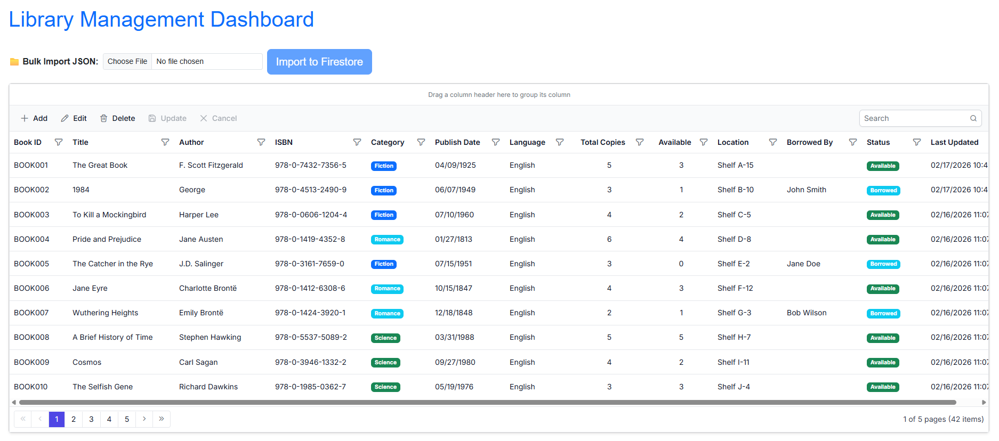

# Connecting Firebase Firestore to Blazor Data Grid

The [Syncfusion<sup style="font-size:70%">&reg;</sup> Blazor DataGrid](https://www.syncfusion.com/blazor-components/blazor-datagrid) supports binding data from a Firebase Firestore database using the Google.Cloud.Firestore library. This approach provides a flexible and scalable solution for working with NoSQL cloud-based databases.

**What is Firebase Firestore?**

Firebase Firestore is a cloud-hosted, NoSQL database that stores data in flexible, JSON-like documents. Unlike traditional relational databases that use tables and rows, Firestore uses collections and documents, making it ideal for applications that require flexible schemas, real-time synchronization, and seamless scalability with minimal infrastructure management.

**Key Benefits of Firebase Firestore**

- **Cloud-Hosted**: No infrastructure management required; automatic scaling and maintenance
- **Real-Time Synchronization**: Automatic updates when data changes across connected clients
- **Flexible Schema**: Store documents with different structures in the same collection without predefined schemas
- **Global Scale**: Distributed architecture with automatic replication and backups
- **Security Rules**: Built-in security with fine-grained access control at the document and field level
- **Rich Query Language**: Supports complex queries, aggregation, and indexing
- **Offline Support**: Client-side caching with automatic sync when connectivity is restored

**What is Google.Cloud.Firestore?**

**Google.Cloud.Firestore** is the official .NET client library for Firebase Firestore. It provides a comprehensive API for interacting with Firestore databases, allowing applications to perform CRUD operations, execute queries, and manage real-time listeners efficiently.

## Prerequisites

Ensure the following software, accounts, and packages are in place before proceeding:

| Software/Package | Version | Purpose |
|-----------------|---------|---------|
| Visual Studio 2026 | 18.0 or later | Development IDE with Blazor workload |
| .NET SDK | net10.0 or compatible | Runtime and build tools |
| Firebase Account | Active account | Cloud project hosting and Firestore database |
| Google Cloud Project | Active project | Required for Firebase services and API credentials |
| Google.Cloud.Firestore | 3.7.0 or later | Official .NET client library for Firestore |
| Syncfusion.Blazor.Grid | {{site.blazorversion}} | DataGrid and UI components |
| Syncfusion.Blazor.Themes | {{site.blazorversion}} | Styling for DataGrid components |

## Setting Up the Firebase Firestore Environment

### Step 1: Create a Firebase Project and Firestore Database

Firebase projects host your Firestore database and manage authentication, storage, and other cloud services.

**Instructions:**

1. **Access Firebase Console**
   - Navigate to [Firebase Console](https://console.firebase.google.com/)
   - Sign in with your Google account

2. **Create a New Firebase Project**
   - Click **"Add Project"** button
   - Enter a project name (e.g., `LibraryManagement`)
   - Accept the default settings or customize as needed
   - Click **"Create Project"** and wait for completion

3. **Create a Firestore Database**
   - In the Firebase Console, navigate to **"Build"** → **"Firestore Database"**
   - Click **"Create Database"** button
   - **Location**: Select the closest region to your users (e.g., `us-east1`)
   - **Security Rules**: Start with **"Start in test mode"** for development (production requires authentication)
   - Click **"Create"** and wait for the database to initialize

4. **Create a Collection and Add Sample Data**
   - In Firestore Console, click **"+ Start collection"** button
   - **Collection ID**: `Books`
   - Click **"Next"**
   - Click **"Auto ID"** to generate a document ID
   - Add the following sample document fields:

**Sample Book Document:**

| Field | Type | Value |
|-------|------|-------|
| bookId | string | BOOK001 |
| title | string | The Great Gatsby |
| author | string | F. Scott Fitzgerald |
| isbn | string | 978-0743273565 |
| category | string | Fiction |
| publishDate | timestamp | 1925-04-10 |
| language | string | English |
| totalCopies | number | 5 |
| availableCopies | number | 3 |
| location | string | Section A-1 |
| status | string | Available |
| lastUpdated | timestamp | (current date) |

5. **Add More Sample Documents (Optional)**
   - Click **"+ Add document"** to add more books
   - Repeat the process for additional test records

The Firestore database is now ready with the `Books` collection and sample data.

---

### Step 2: Generate Service Account Key for Authentication

Service account keys enable server-side applications (like your Blazor backend) to authenticate with Firebase.

**Instructions:**

1. **Access Google Cloud Console**
   - In Firebase Console, click the **Settings gear icon** (⚙️) in the top-left
   - Select **"Project Settings"**
   - Navigate to the **"Service Accounts"** tab

2. **Generate a New Private Key**
   - Click the **"Generate New Private Key"** button
   - A JSON file (`serviceAccountKey.json`) will be automatically downloaded
   - **Important**: Save this file securely—it contains sensitive credentials

3. **Store the Service Account Key**
   - For **development**: Place the JSON file in your project root or a secure location
   - For **production**: Use environment variables or Azure Key Vault to store sensitive credentials
   - **Never commit** this file to version control (add to `.gitignore`)

The service account key is now available for authentication.

---

### Step 3: Enable Required APIs in Google Cloud Console

Firestore requires specific APIs to be enabled in your Google Cloud project.

**Instructions:**

1. **Access Google Cloud Console**
   - Open [Google Cloud Console](https://console.cloud.google.com/)
   - Select your Firebase project

2. **Navigate to APIs**
   - Go to **"APIs & Services"** → **"Library"**
   - Search for **"Firestore API"**
   - Click on the result
   - Click **"Enable"** button

3. **Verify Cloud Firestore API is Active**
   - Go to **"APIs & Services"** → **"Enabled APIs & services"**
   - Confirm **"Cloud Firestore API"** is in the list

The required APIs are now enabled for your application.

---

### Step 4: Install Required NuGet Packages

NuGet packages are software libraries that add functionality to the Blazor application. These packages enable Firebase Firestore integration and Syncfusion DataGrid components.

**Prerequisites for this step:**
- A new Blazor Web Application created using the default template
- The project automatically generates essential files: `Program.cs`, `appsettings.json`, `wwwroot` folder, and `Components` folder
- For this guide, a Blazor application named **Grid_Firebase** has been created

**Method 1: Using Package Manager Console**

1. Open Visual Studio 2026.
2. Navigate to **Tools → NuGet Package Manager → Package Manager Console**.
3. Run the following commands:

```powershell
Install-Package Google.Cloud.Firestore -Version 3.7.0
Install-Package Syncfusion.Blazor.Grid -Version {{site.blazorversion}}
Install-Package Syncfusion.Blazor.Themes -Version {{site.blazorversion}}
```

**Method 2: Using NuGet Package Manager UI**

1. Open **Visual Studio 2026 → Tools → NuGet Package Manager → Manage NuGet Packages for Solution**.
2. Search for and install each package individually:
   - **Google.Cloud.Firestore** (version 3.7.0 or later)
   - **[Syncfusion.Blazor.Grid]((https://www.nuget.org/packages/Syncfusion.Blazor.Grid/))** (version {{site.blazorversion}})
   - **[Syncfusion.Blazor.Themes](https://www.nuget.org/packages/Syncfusion.Blazor.Themes/)** (version {{site.blazorversion}})

All required packages are now installed.

---

### Step 5: Create the Data Model

A data model is a C# class that represents the structure of a Firestore document. This model defines the properties that correspond to the fields in the `Books` collection.

**Instructions:**

1. Create a new folder named `Models` in the Blazor application project.
2. Inside the `Models` folder, create a new file named **Book.cs**.
3. Define the **Book** class with the following code:

```csharp
using System;
using Google.Cloud.Firestore;

namespace Grid_Firebase.Models
{
    /// <summary>
    /// Represents a book record in the library management system.
    /// This model defines the structure of book-related data used throughout the application.
    /// Maps to Cloud Firestore 'books' collection.
    /// </summary>
    [FirestoreData]
    public class Book
    {
        /// <summary>
        /// Gets or sets the unique book identifier (e.g., BOOK001, BOOK002).
        /// This serves as the document ID in Firestore.
        /// </summary>
        [FirestoreProperty]
        public string BookId { get; set; } = string.Empty;

        /// <summary>
        /// Gets or sets the title of the book.
        /// </summary>
        [FirestoreProperty]
        public string Title { get; set; } = string.Empty;

        /// <summary>
        /// Gets or sets the name of the book author.
        /// </summary>
        [FirestoreProperty]
        public string Author { get; set; } = string.Empty;

        /// <summary>
        /// Gets or sets the unique International Standard Book Number (ISBN).
        /// </summary>
        [FirestoreProperty]
        public string ISBN { get; set; } = string.Empty;

        /// <summary>
        /// Gets or sets the category or genre of the book.
        /// Examples: Fiction, Non-Fiction, Science, History, etc.
        /// </summary>
        [FirestoreProperty]
        public string Category { get; set; } = string.Empty;

        /// <summary>
        /// Gets or sets the publication date of the book.
        /// Stored as a Firestore Timestamp for proper date handling.
        /// </summary>
        [FirestoreProperty]
        public DateTime? PublishDate { get; set; }

        /// <summary>
        /// Gets or sets the language in which the book is written.
        /// Examples: English, Spanish, French, etc.
        /// </summary>
        [FirestoreProperty]
        public string? Language { get; set; }

        /// <summary>
        /// Gets or sets the total number of copies available in the library.
        /// </summary>
        [FirestoreProperty]
        public int TotalCopies { get; set; }

        /// <summary>
        /// Gets or sets the number of copies currently available for borrowing.
        /// </summary>
        [FirestoreProperty]
        public int AvailableCopies { get; set; }

        /// <summary>
        /// Gets or sets the physical location or shelf number of the book in the library.
        /// </summary>
        [FirestoreProperty]
        public string? Location { get; set; }

        /// <summary>
        /// Gets or sets the name of the person who has borrowed the book (if any).
        /// Null if the book is not currently borrowed.
        /// </summary>
        [FirestoreProperty]
        public string? BorrowedBy { get; set; }

        /// <summary>
        /// Gets or sets the current status of the book.
        /// Valid values: Available, Borrowed, Reserved, Lost, Damaged, Maintenance
        /// </summary>
        [FirestoreProperty]
        public string Status { get; set; } = "Available";

        /// <summary>
        /// Gets or sets the date and time when the book record was last updated.
        /// Stored as a Firestore Timestamp for proper timestamp handling.
        /// Automatically set to the current UTC time on each update.
        /// </summary>
        [FirestoreProperty]
        public DateTime LastUpdated { get; set; } = DateTime.UtcNow;

        /// <summary>
        /// Normalizes all DateTime fields to UTC to ensure compatibility with Firestore.
        /// This is necessary because JSON deserialization may create DateTime objects
        /// with DateTimeKind.Unspecified, which Firestore cannot convert to Timestamp.
        /// </summary>
        public void NormalizeToUtc()
        {
            // Normalize PublishDate
            if (PublishDate.HasValue)
            {
                PublishDate = PublishDate.Value.Kind == DateTimeKind.Utc 
                    ? PublishDate.Value 
                    : PublishDate.Value.ToUniversalTime();
            }

            // Normalize LastUpdated
            if (LastUpdated.Kind != DateTimeKind.Utc)
            {
                LastUpdated = LastUpdated.Kind == DateTimeKind.Unspecified
                    ? DateTime.SpecifyKind(LastUpdated, DateTimeKind.Utc)
                    : LastUpdated.ToUniversalTime();
            }
        }
    }
}
```

**Explanation:**

- The `Book` class directly maps to Firestore document structure.
- The `[FirestoreData]` maps to documents.
- The `[FirestoreProperty]` explicitly maps C# properties to Firestore fields.
- Each property represents a field in the Firestore document.
- The `?` symbol indicates that a property is nullable (optional in Firestore).
- The `NormalizeToUtc()` method ensures consistent DateTime handling across different timezones.
- Properties use C# conventions (PascalCase) which automatically map to Firestore document fields.

The data model has been successfully created in `Models/Book.cs`.

---

### Step 6: Configure the Firebase Connection String

A Firebase connection requires the path to the service account key file. This configuration is managed in the `appsettings.json` file.

**Instructions:**

1. Open the `appsettings.json` file in the project root.
2. Add a new section for Firebase configuration with the service account key path:

```json
{
  "Firebase": {
    "ServiceAccountPath": "serviceAccountKey.json",
    "ProjectId": "your-project-id"
  },
  "Logging": {
    "LogLevel": {
      "Default": "Information",
      "Microsoft.AspNetCore": "Warning"
    }
  },
  "AllowedHosts": "*"
}
```

**Configuration Details:**

| Setting | Value | Purpose |
|---------|-------|---------|
| `Firebase:ServiceAccountPath` | `serviceAccountKey.json` | Path to the service account JSON file (development) |

**Important Security Notes:**

- **Development**: Place the `serviceAccountKey.json` file in your project root
- **Production**: Use environment variables or secure credential storage (Azure Key Vault, AWS Secrets Manager)
- **Never Commit**: Add `serviceAccountKey.json` to `.gitignore` to prevent accidentally uploading credentials to version control

**Example .gitignore entry:**

```
# Firebase credentials
serviceAccountKey.json
*.json.backup
```

The Firebase connection configuration is now in place in `appsettings.json`.

---

### Step 7: Create the Firebase Service Class

The Firebase service class manages database connections and operations with Firestore. It handles all interactions with the Firestore database without requiring Entity Framework Core.

**Instructions:**

1. Create a new folder named `Services` in the Blazor application project.
2. Inside the `Services` folder, create a new file named **FirebaseService.cs**.
3. Define the **FirebaseService** class with the following code:

```csharp
using Google.Cloud.Firestore;
using Grid_Firebase.Models;

namespace Grid_Firebase.Services
{
    /// <summary>
    /// Service class for Firebase Firestore database operations
    /// Handles all CRUD operations and business logic for books
    /// </summary>
    public class FirebaseService
    {
        private readonly FirestoreDb _firestoreDb;
        private const string BooksCollection = "Books";
        private const string BookIdPrefix = "BOOK";

        public FirebaseService(IConfiguration configuration)
        {
            // Try environment variable first, then fall back to appsettings
            var serviceAccountPath = configuration["Firebase:ServiceAccountPath"]
                ?? Path.Combine(AppContext.BaseDirectory, "serviceAccountKey.json");

            if (!File.Exists(serviceAccountPath))
            {
                throw new FileNotFoundException($"Service account key not found at: {serviceAccountPath}");
            }

            // Set the service account credentials environment variable for Google Cloud authentication
            Environment.SetEnvironmentVariable("GOOGLE_APPLICATION_CREDENTIALS", serviceAccountPath);

            // Get project ID from configuration or service account key
            var projectId = configuration["Firebase:ProjectId"];

            if (string.IsNullOrEmpty(projectId))
            {
                throw new InvalidOperationException("Firebase project ID not found. Please configure 'Firebase:ProjectId' in appsettings.json");
            }

            // Initialize Firestore database
            _firestoreDb = FirestoreDb.Create(projectId);
        }

        /// <summary>
        /// Retrieves all books from the Firestore database
        /// </summary>
        /// <returns>List of all books</returns>
        public async Task<List<Book>> GetBooksAsync()
        {
            try
            {
                var query = _firestoreDb.Collection(BooksCollection);
                var snapshot = await query.GetSnapshotAsync();

                var books = new List<Book>();
                foreach (var doc in snapshot.Documents)
                {
                    var book = doc.ConvertTo<Book>();
                    if (book != null)
                    {
                        book.BookId = doc.Id; // Use Firestore document ID
                        books.Add(book);
                    }
                }

                return books;
            }
            catch (Exception ex)
            {
                throw new Exception($"Error fetching books: {ex.Message}");
            }
        }

        /// <summary>
        /// Inserts a new book into the Firestore database
        /// </summary>
        public async Task<Book> InsertBookAsync(Book book)
        {
            // Handle logic to add a new book to the database
        }

        /// <summary>
        /// Updates an existing book in the Firestore database
        /// </summary>
        public async Task<bool> UpdateBookAsync(string bookId, Book book)
        {
            // Handle logic to update an existing book to the database
        }

        /// <summary>
        /// Deletes a book from the Firestore database
        /// </summary>
        public async Task<bool> DeleteBookAsync(string? bookId)
        {
            // Handle logic to delete an existing book from the database
        }
    }
}
```

**Explanation:**

- The `FirebaseService` class manages all Firestore operations.
- The `FirestoreDb` instance represents the connection to Firestore database.
- Service account authentication is handled through the credentials path.
- `GetBooksAsync()` retrieves all documents from the `Books` collection.

The Firebase service class has been successfully created in `Services/FirebaseService.cs`.

---

### Step 8: Implementing Bulk Data Import (Optional)

Bulk data import is essential for loading large volumes of data into Firebase Firestore efficiently. This section explains how to implement bulk import functionality with data validation, error handling, and progress tracking.

**Overview of Bulk Import:**

Bulk import allows you to:
- **Initial Data Seeding**: Load initial datasets when launching an application
- **Data Migration**: Migrate data from legacy systems to Firestore
- **Batch Processing**: Regular imports of bulk data from JSON files
- **Testing**: Load test data for development environments

**Firestore Limits:**
- **Batch Size**: Maximum 500 documents per batch write
- **Document Size**: Up to 1 MB per document
- **Rate Limits**: 25,000 writes per second per database
- **Atomicity**: All-or-nothing semantics per batch using transactions

**How Bulk Import Works:**

1. **Data Chunking**: Split large datasets into 500-document batches (Firestore limit)
2. **Validation**: Validate each document before import
3. **Atomic Transactions**: Use transactions to ensure consistency (all-or-nothing)
4. **Error Handling**: Continue processing batches even if one fails
5. **Progress Tracking**: Report progress to UI for user feedback

**Sample JSON data format:**

Create or use a JSON file with the following structure (`wwwroot/sample-books-import.json`):

```json
{
  "books": [
    {
      "bookId": "BOOK001",
      "title": "The Great Gatsby",
      "author": "F. Scott Fitzgerald",
      "isbn": "978-0743273565",
      "category": "Fiction",
      "publishDate": "1925-04-10",
      "language": "English",
      "totalCopies": 5,
      "availableCopies": 3,
      "location": "Section A-1",
      "status": "Available"
    },
    {
      "bookId": "BOOK002",
      "title": "To Kill a Mockingbird",
      "author": "Harper Lee",
      "isbn": "978-0061120084",
      "category": "Fiction",
      "publishDate": "1960-07-11",
      "language": "English",
      "totalCopies": 4,
      "availableCopies": 2,
      "location": "Section A-2",
      "status": "Available"
    }
  ]
}
```

**Implement Bulk Import UI in Home.razor**

Update the `Components/Pages/Home.razor` file to include bulk import functionality with file upload:

```cshtml
@page "/"
@using System.Collections
@using System.Text.Json
@rendermode InteractiveServer
@inject FirebaseService FirebaseService
@implements IAsyncDisposable

<PageTitle>Library Management</PageTitle>

<!-- Bulk Import Section - Minimal UI -->
<div class="row mb-3">
    <div class="col-md-12">
        <div class="d-flex gap-2 align-items-center">
            <label for="bulkImportFile" class="form-label mb-0 fw-bold">📁 Bulk Import JSON:</label>
            <InputFile id="bulkImportFile" class="form-control form-control-sm" style="max-width: 300px;" accept=".json" OnChange="@OnFileSelected" disabled="@ImportInProgress" />
            <button class="btn @GetImportButtonClass()" @onclick="ImportBooks" disabled="@(!IsReadyToImport || ImportInProgress)">
                <i class="@GetImportButtonIcon()"></i> @GetImportButtonText()
            </button>
        </div>
    </div>
</div>

<!-- Grid Section -->
```

```csharp
@code {
    private string SelectedFileName = string.Empty;
    private string FileContent = string.Empty;
    private List<Book> PreviewedBooks = new List<Book>();
    private double FileSizeKB = 0;
    private bool IsReadyToImport = false;
    private bool ImportInProgress = false;
    private bool ImportCompleted = false;

    /// <summary>
    /// Handles file selection and validates JSON format
    /// </summary>
    private async Task OnFileSelected(InputFileChangeEventArgs e)
    {
        try
        {
            var file = e.File;
            if (file == null) return;

            // Validate file
            const long maxFileSize = 5 * 1024 * 1024; // 5MB
            if (file.Size > maxFileSize)
            {
                ResetForm();
                return;
            }

            // Read file
            using (var stream = file.OpenReadStream(maxFileSize))
            {
                using (var reader = new StreamReader(stream))
                {
                    FileContent = await reader.ReadToEndAsync();
                }
            }

            SelectedFileName = file.Name;
            FileSizeKB = file.Size / 1024.0;

            // Parse and validate JSON
            ParseJsonAndPreview();
        }
        catch
        {
            ResetForm();
        }
    }

    /// <summary>
    /// Parses JSON content and previews books
    /// </summary>
    private void ParseJsonAndPreview()
    {
        try
        {
            PreviewedBooks.Clear();
            IsReadyToImport = false;

            using (JsonDocument doc = JsonDocument.Parse(FileContent))
            {
                var root = doc.RootElement;

                // Try to find 'books' array
                if (root.TryGetProperty("books", out var booksElement) && booksElement.ValueKind == JsonValueKind.Array)
                {
                    foreach (var bookElement in booksElement.EnumerateArray())
                    {
                        try
                        {
                            var jsonString = bookElement.GetRawText();
                            var book = JsonSerializer.Deserialize<Book>(jsonString, new JsonSerializerOptions { PropertyNameCaseInsensitive = true });
                            if (book != null)
                            {
                                book.NormalizeToUtc();
                                PreviewedBooks.Add(book);
                            }
                        }
                        catch
                        {
                            // Skip invalid book entries
                        }
                    }
                }
            }

            if (PreviewedBooks.Count > 0)
            {
                IsReadyToImport = true;
            }
            else
            {
                ResetForm();
            }
        }
        catch
        {
            ResetForm();
        }
    }

    /// <summary>
    /// Performs the bulk import operation
    /// </summary>
    private async Task ImportBooks()
    {
        if (PreviewedBooks.Count == 0 || ImportInProgress) return;

        ImportInProgress = true;
        ImportCompleted = false;

        try
        {
            bool success = await FirebaseService.BulkImportBooksAsync(PreviewedBooks);
            
            if (success)
            {
                ImportCompleted = true;
                // Refresh the grid
                if (_grid != null)
                {
                    await _grid.Refresh();
                }
                // Reset after a brief delay
                await Task.Delay(2000);
                ResetForm();
            }
            else
            {
                // Failed - reset to allow retry
                ImportInProgress = false;
            }
        }
        catch
        {
            // Failed - reset to allow retry
            ImportInProgress = false;
        }
    }

    /// <summary>
    /// Resets the form for another import
    /// </summary>
    private void ResetForm()
    {
        SelectedFileName = string.Empty;
        FileContent = string.Empty;
        PreviewedBooks.Clear();
        FileSizeKB = 0;
        IsReadyToImport = false;
        ImportInProgress = false;
        ImportCompleted = false;
    }

    /// <summary>
    /// Gets the CSS class for the import button based on state
    /// </summary>
    private string GetImportButtonClass()
    {
        if (ImportCompleted) return "btn btn-success btn-lg";
        if (ImportInProgress) return "btn btn-warning btn-lg";
        return "btn btn-primary btn-lg";
    }

    /// <summary>
    /// Gets the icon class for the import button based on state
    /// </summary>
    private string GetImportButtonIcon()
    {
        if (ImportCompleted) return "bi bi-check-circle";
        if (ImportInProgress) return "bi bi-hourglass-split";
        return "bi bi-cloud-upload";
    }

    /// <summary>
    /// Gets the text for the import button based on state
    /// </summary>
    private string GetImportButtonText()
    {
        if (ImportCompleted) return "Import Successful";
        if (ImportInProgress) return "Importing...";
        return "Import to Firestore";
    }
}
```

**Update FirebaseService with bulk import methods**

Open `Services/FirebaseService.cs` and add the following methods to support bulk import operations:

```csharp
using System.Text.Json;

/// <summary>
/// Performs bulk import of books from JSON data using batch writes.
/// Stops at the first failure to ensure data integrity.
/// </summary>
/// <param name="books">List of books to import</param>
/// <returns>True if all books imported successfully; false otherwise</returns>
public async Task<bool> BulkImportBooksAsync(List<Book> books)
{
    if (books == null || books.Count == 0)
    {
        return false;
    }

    try
    {
        int batchSize = 500; // Firestore batch limit

        // Process books in batches using transactions
        for (int i = 0; i < books.Count; i += batchSize)
        {
            var batchBooks = books.Skip(i).Take(batchSize).ToList();

            // Use a transaction to write multiple documents atomically
            await _firestoreDb.RunTransactionAsync(async transaction =>
            {
                foreach (var book in batchBooks)
                {
                    var docRef = _firestoreDb.Collection(BooksCollection).Document(book.BookId);
                    transaction.Set(docRef, book);
                }
            });
        }

        return true;
    }
    catch
    {
        // Stop at first failure and return false
        return false;
    }
}
```

**Key Features Implemented**

File Upload: Users can select and upload JSON files  
Validation: All books are validated before import  
Batch Processing: Large datasets are split into 500-document batches  
Atomic Transactions: Each batch uses transactions for consistency  
Auto-Refresh: Grid automatically refreshes after successful import  

---

### Step 9: Register Services in Program.cs

The `Program.cs` file is where application services are registered and configured. This file must be updated to enable Firestore service and Syncfusion components.

**Instructions:**

1. Open the `Program.cs` file at the project root.
2. Add the following code after the line `var builder = WebApplication.CreateBuilder(args);`:

```csharp
using Grid_Firebase.Components;
using Grid_Firebase.Services;
using Syncfusion.Blazor;

var builder = WebApplication.CreateBuilder(args);

// Add services to the container.
builder.Services.AddRazorComponents()
    .AddInteractiveServerComponents();

// Register Syncfusion Blazor services
builder.Services.AddSyncfusionBlazor();

// Register Firebase Firestore service for dependency injection
builder.Services.AddScoped<FirebaseService>();

var app = builder.Build();

// Configure the HTTP request pipeline.
if (!app.Environment.IsDevelopment())
{
    app.UseExceptionHandler("/Error", createScopeForErrors: true);
    app.UseHsts();
}

app.UseHttpsRedirection();

app.UseAntiforgery();

app.MapStaticAssets();
app.MapRazorComponents<App>()
    .AddInteractiveServerRenderMode();

app.Run();
```

**Explanation:**

- **`using Grid_Firebase.Services;`**: Imports the namespace to access the `FirebaseService` class
- **`builder.Services.AddSyncfusionBlazor();`**: Registers Syncfusion Blazor services globally
- **`builder.Services.AddScoped<FirebaseService>();`**: Registers `FirebaseService` with scoped lifetime (creates a new instance per HTTP request)

The service registration has been completed successfully in `Program.cs`.

---

## Integrating Syncfusion Blazor DataGrid

### Step 1: Install and Configure Blazor DataGrid Components

Syncfusion is a library that provides pre-built UI components like DataGrid, which is used to display data in a table format.

**Instructions:**

* The Syncfusion.Blazor.Grid package was installed in **Step 4** of the previous section.
* Import the required namespaces in the `Components/_Imports.razor` file:

```csharp
@using Grid_Firebase.Models
@using Grid_Firebase.Services
@using Syncfusion.Blazor.Grids
@using Syncfusion.Blazor.Data
@using Syncfusion.Blazor.DropDowns
```

* Add the Syncfusion stylesheet and scripts in the `Components/App.razor` file. Find the `<head>` section and add:

```html

<!-- Syncfusion Blazor Stylesheet -->
<link href="_content/Syncfusion.Blazor.Themes/tailwind3.css" rel="stylesheet" />

<!-- Syncfusion Blazor Scripts -->
<script src="_content/Syncfusion.Blazor.Core/scripts/syncfusion-blazor.min.js" type="text/javascript"></script>
```

For this project, the tailwind3 theme is used. A different theme can be selected or the existing theme can be customized based on project requirements. Refer to the [Syncfusion Blazor Components Appearance](https://blazor.syncfusion.com/documentation/appearance/themes) documentation to learn more about theming and customization options.

Syncfusion components are now configured and ready to use. For additional guidance, refer to the Grid component's [getting‑started](https://blazor.syncfusion.com/documentation/datagrid/getting-started-with-web-app) documentation.

---

### Step 2: Update the Blazor DataGrid

The `Home.razor` component displays the book data in a Syncfusion Blazor DataGrid with search, filter, sort, and pagination capabilities.

**Instructions:**

1. Open the file named `Home.razor` in the `Components/Pages` folder.
2. Replace the entire file content with the following code to create a DataGrid with bulk import functionality:

```cshtml
@page "/"
@using System.Collections
@using System.Text.Json
@rendermode InteractiveServer
@inject FirebaseService FirebaseService

<PageTitle>Library Management</PageTitle>

<!-- Grid Section -->
<div class="row">
   <div class="col-md-12">
      <div class="card shadow-sm">
            <div class="card-body p-0">
               <SfGrid @ref="_grid" TValue="Book" AllowPaging="true" AllowSorting="true" AllowFiltering="true" AllowGrouping="true" Toolbar="@ToolbarItems">
                  <SfDataManager AdaptorInstance="@typeof(CustomAdaptor)" Adaptor="Adaptors.CustomAdaptor"></SfDataManager>

                  <GridColumns>
                     //columns configuration
                  </GridColumns>
               </SfGrid>
            </div>
      </div>
   </div>
</div>

@code {
   // CustomAdaptor class will be added in the next step
}
```

**Component Explanation:**

- **`@rendermode InteractiveServer`**: Enables interactive server-side rendering for real-time updates
- **`@inject FirebaseService`**: Injects the FirebaseService to access database methods
- **`<SfGrid>`**: The DataGrid component that displays books in rows and columns
- **`<GridColumns>`**: Defines individual columns with field mappings, types, and formatting

The Home component has been successfully updated with the DataGrid and CustomAdaptor.

---

### Step 3: Implement the CustomAdaptor

The Syncfusion<sup style="font-size:70%">&reg;</sup> Blazor DataGrid can bind data from a **Firebase Firestore** database using [DataManager](https://help.syncfusion.com/cr/blazor/Syncfusion.Blazor.Data.SfDataManager.html) and set the [Adaptor](https://help.syncfusion.com/cr/blazor/Syncfusion.Blazor.Adaptors.html) property to `CustomAdaptor` for scenarios that require full control over data operations.

The `CustomAdaptor` is a bridge between the DataGrid and the database. It handles all data operations including reading, searching, filtering, sorting, paging, and CRUD operations. Each operation in the CustomAdaptor's `ReadAsync` method handles specific grid functionality. The Syncfusion<sup style="font-size:70%">&reg;</sup> Blazor DataGrid sends operation details to the API through a [DataManagerRequest](https://help.syncfusion.com/cr/blazor/Syncfusion.Blazor.DataManagerRequest.html) object. These details can be applied to the data source using methods from the [DataOperations](https://help.syncfusion.com/cr/blazor/Syncfusion.Blazor.DataOperations.html) class.

**Instructions:**

* Open the `Components/Pages/Home.razor` file.
* Add the following `CustomAdaptor` class code inside the `@code` block:

```csharp
@code {

   public static FirebaseService? _firebaseService { get; set; }

   /// <summary>
   /// CustomAdaptor class bridges DataGrid interactions with database operations.
   /// This adaptor handles all data retrieval and manipulation for the DataGrid.
   /// </summary>
   public class CustomAdaptor : DataAdaptor
   {
      public FirebaseService? FirebaseService
      {
            get => _firebaseService;
            set => _firebaseService = value;
      }

      public override async Task<object> ReadAsync(DataManagerRequest dataManagerRequest, string? key = null)
      {
         try
         {
            // Fetch all books from the Firebase database
            IEnumerable dataSource = await _firebaseService!.GetBooksAsync();

            // Apply search operation if search criteria exists
            if (dataManagerRequest.Search != null && dataManagerRequest.Search.Count > 0)
            {
               dataSource = DataOperations.PerformSearching(dataSource, dataManagerRequest.Search);
            }

            // Apply filter operation if filter criteria exists
            if (dataManagerRequest.Where != null && dataManagerRequest.Where.Count > 0)
            {
               dataSource = DataOperations.PerformFiltering(dataSource, dataManagerRequest.Where, dataManagerRequest.Where[0].Operator);
            }

            // Apply sort operation if sort criteria exists
            if (dataManagerRequest.Sorted != null && dataManagerRequest.Sorted.Count > 0)
            {
               dataSource = DataOperations.PerformSorting(dataSource, dataManagerRequest.Sorted);
            }

            // Calculate total record count before paging for accurate pagination
            int totalRecordsCount = dataSource.Cast<Book>().Count();

            // Apply paging skip operation
            if (dataManagerRequest.Skip != 0)
            {
               dataSource = DataOperations.PerformSkip(dataSource, dataManagerRequest.Skip);
            }

            // Apply paging take operation to retrieve only the requested page size
            if (dataManagerRequest.Take != 0)
            {
               dataSource = DataOperations.PerformTake(dataSource, dataManagerRequest.Take);
            }

            // Handling Group operation in CustomAdaptor.
            if (dataManagerRequest.Group != null)
            {
               foreach (var group in dataManagerRequest.Group)
               {
                     dataSource = DataUtil.Group<Book>(dataSource, group, dataManagerRequest.Aggregates, 0, dataManagerRequest.GroupByFormatter);
               }
            }

            // Return the result with total count for pagination metadata
            return dataManagerRequest.RequiresCounts
               ? new DataResult() { Result = dataSource, Count = totalRecordsCount }
               : (object)dataSource;
         }
         catch (Exception ex)
         {
            Console.WriteLine($"ReadAsync Error: {ex.Message}");
            throw new Exception($"An error occurred while retrieving data: {ex.Message}");
         }
      }
   }
}
```

The `CustomAdaptor` class has been successfully implemented with all data operations.

**Common methods in data operations**

* [ReadAsync(DataManagerRequest)](https://help.syncfusion.com/cr/blazor/Syncfusion.Blazor.DataAdaptor.html#Syncfusion_Blazor_DataAdaptor_ReadAsync_Syncfusion_Blazor_DataManagerRequest_System_String_) - Retrieve and process records (search, filter, sort, page, group)

* [PerformSearching](https://help.syncfusion.com/cr/blazor/Syncfusion.Blazor.DataOperations.html#Syncfusion_Blazor_DataOperations_PerformSearching__1_System_Linq_IQueryable___0__System_Collections_Generic_List_Syncfusion_Blazor_Data_SearchFilter__) - Applies search criteria to the collection.
* [PerformFiltering](https://help.syncfusion.com/cr/blazor/Syncfusion.Blazor.DataOperations.html#Syncfusion_Blazor_DataOperations_PerformFiltering__1_System_Linq_IQueryable___0__System_Collections_Generic_List_Syncfusion_Blazor_Data_WhereFilter__System_String_) - Filters data based on conditions.
* [PerformSorting](https://help.syncfusion.com/cr/blazor/Syncfusion.Blazor.DataOperations.html#Syncfusion_Blazor_DataOperations_PerformSorting__1_System_Linq_IQueryable___0__System_Collections_Generic_List_Syncfusion_Blazor_Data_Sort__) - Sorts data by one or more fields.
* [PerformSkip](https://help.syncfusion.com/cr/blazor/Syncfusion.Blazor.DataOperations.html#Syncfusion_Blazor_DataOperations_PerformSkip__1_System_Linq_IQueryable___0__System_Int32_) - Skips a defined number of records for paging.
* [PerformTake](https://help.syncfusion.com/cr/blazor/Syncfusion.Blazor.DataOperations.html#Syncfusion_Blazor_DataOperations_PerformTake__1_System_Linq_IQueryable___0__System_Int32_) - Retrieves a specified number of records for paging.
* [PerformAggregation](https://help.syncfusion.com/cr/blazor/Syncfusion.Blazor.Data.DataUtil.html#Syncfusion_Blazor_Data_DataUtil_PerformAggregation_System_Collections_IEnumerable_System_Collections_Generic_List_Syncfusion_Blazor_Data_Aggregate__) – Calculates aggregate values such as Sum, Average, Min, and Max.

---

### Step 4: Add Toolbar with CRUD and Search Options

The toolbar provides buttons for adding, editing, deleting records, and searching the data.

**Instructions:**

* Open the `Components/Pages/Home.razor` file.
* Update the `<SfGrid>` component to include the [Toolbar](https://help.syncfusion.com/cr/blazor/Syncfusion.Blazor.Grids.SfGrid-1.html#Syncfusion_Blazor_Grids_SfGrid_1_Toolbar) property with CRUD and search options:

```cshtml
<SfGrid TValue="Book" 
        AllowPaging="true" 
        AllowSorting="true" 
        AllowFiltering="true" 
        Toolbar="@ToolbarItems">
    <SfDataManager AdaptorInstance="@typeof(CustomAdaptor)" Adaptor="Adaptors.CustomAdaptor"></SfDataManager>
    
    <!-- Grid columns configuration -->
</SfGrid>
```

* Add the toolbar items list in the `@code` block:

```csharp
@code {
    private List<string> ToolbarItems = new List<string> { "Add", "Edit", "Delete", "Update", "Cancel", "Search"};

    // CustomAdaptor class code...
}
```

**Toolbar Items Explanation:**

| Item | Function |
|------|----------|
| `Add` | Opens a form to add a new book record. |
| `Edit` | Enables editing of the selected record. |
| `Delete` | Deletes the selected record from the database. |
| `Update` | Saves changes made to the selected record. |
| `Cancel` | Cancels the current edit or add operation. |
| `Search` | Displays a search box to find records. |

The toolbar has been successfully added.

---

### Step 5: Running the Application

**Build the Application**

1. Open the terminal or Package Manager Console.
2. Navigate to the project directory.
3. Run the following command:

```powershell
dotnet build
```

**Run the Application**

Execute the following command:

```powershell
dotnet run
```

**Access the Application**

1. Open a web browser.
2. Navigate to `https://localhost:5001` (or the port shown in the terminal).
3. The library management application is now running and ready to use.



---

### Step 6: Implement Paging Feature

Paging divides large datasets into smaller pages to improve performance and usability.

**Instructions:**

* The paging feature is already partially enabled in the `<SfGrid>` component with [AllowPaging="true"](https://help.syncfusion.com/cr/blazor/Syncfusion.Blazor.Grids.SfGrid-1.html#Syncfusion_Blazor_Grids_SfGrid_1_AllowPaging).
* The page size is configured with [GridPageSettings](https://help.syncfusion.com/cr/blazor/Syncfusion.Blazor.Grids.GridPageSettings.html).
* No additional code changes are required from the previous steps.

```cshtml
<SfGrid TValue="Book" 
        AllowPaging="true">
    <SfDataManager AdaptorInstance="@typeof(CustomAdaptor)" Adaptor="Adaptors.CustomAdaptor"></SfDataManager>
    <GridPageSettings PageSize="10"></GridPageSettings>
    
    <!-- Grid columns configuration -->
</SfGrid>
```

* Update the `ReadAsync` method in the `CustomAdaptor` class to handle paging:

```csharp
@code {  
    
    /// <summary>
    /// CustomAdaptor class to handle grid data operations with Firebase Firestore
    /// </summary>
    public class CustomAdaptor : DataAdaptor
    {
        public static FirebaseService? _firebaseService { get; set; }
        public FirebaseService? FirebaseService 
        { 
            get => _firebaseService;
            set => _firebaseService = value;
        }

        public override async Task<object> ReadAsync(DataManagerRequest dataManagerRequest, string? key = null)
        {
            IEnumerable dataSource = await _firebaseService!.GetBooksAsync();        

            int totalRecordsCount = dataSource.Cast<Book>().Count();
            
            // Handling Paging
            if (dataManagerRequest.Skip != 0)
            {
                dataSource = DataOperations.PerformSkip(dataSource, dataManagerRequest.Skip);            
            }

            if (dataManagerRequest.Take != 0)
            {
                dataSource = DataOperations.PerformTake(dataSource, dataManagerRequest.Take);            
            }

            return dataManagerRequest.RequiresCounts 
                ? new DataResult() { Result = dataSource, Count = totalRecordsCount } 
                : (object)dataSource;
        }
    }
}
```

Fetches book data by calling the **GetBooksAsync** method, which is implemented in the **FirebaseService.cs** file.

```csharp
/// <summary>
/// Retrieves all books from the Firestore database
/// </summary>
/// <returns>List of all books</returns>
public async Task<List<Book>> GetBooksAsync()
{
    try
    {
        var query = _firestoreDb.Collection(BooksCollection);
        var snapshot = await query.GetSnapshotAsync();

        var books = new List<Book>();
        foreach (var doc in snapshot.Documents)
        {
            var book = doc.ConvertTo<Book>();
            if (book != null)
            {
                book.BookId = doc.Id; // Use Firestore document ID
                books.Add(book);
            }
        }

        return books;
    }
    catch (Exception ex)
    {
        throw new Exception($"Error fetching books: {ex.Message}");
    }
}
```

**How Paging Works:**

- The DataGrid displays 10 records per page (as set in `GridPageSettings`).
- Navigation buttons allow the user to move between pages.
- When a page is requested, the `ReadAsync` method receives skip and take values.
- The `DataOperations.PerformSkip()` and `DataOperations.PerformTake()` methods handle pagination.
- Only the requested page of records is transmitted from the server.

Paging feature is now active with 10 records per page.

---

### Step 7: Implement Searching Feature

Searching allows the user to find records by entering keywords in the search box.

**Instructions:**

* Ensure the toolbar includes the "Search" item.
* No additional code changes are required.

```cshtml
<SfGrid TValue="Book"        
        AllowPaging="true"
        Toolbar="@ToolbarItems">
    <SfDataManager AdaptorInstance="@typeof(CustomAdaptor)" Adaptor="Adaptors.CustomAdaptor"></SfDataManager>
    <GridPageSettings PageSize="10"></GridPageSettings>
    <!-- Grid columns configuration -->
</SfGrid>
```

* Update the `ReadAsync` method in the `CustomAdaptor` class to handle searching:

```csharp
@code {
    private List<string> ToolbarItems = new List<string> { "Search"};
    
    /// <summary>
    /// CustomAdaptor class to handle grid data operations with Firebase Firestore
    /// </summary>
    public class CustomAdaptor : DataAdaptor
    {
        public static FirebaseService? _firebaseService { get; set; }
        public FirebaseService? FirebaseService 
        { 
            get => _firebaseService;
            set => _firebaseService = value;
        }

        public override async Task<object> ReadAsync(DataManagerRequest dataManagerRequest, string? key = null)
        {
            IEnumerable dataSource = await _firebaseService!.GetBooksAsync();

            // Handling Search
            if (dataManagerRequest.Search != null && dataManagerRequest.Search.Count > 0)
            {
                dataSource = DataOperations.PerformSearching(dataSource, dataManagerRequest.Search);
            }

            int totalRecordsCount = dataSource.Cast<Book>().Count();
            // Handling Paging
            if (dataManagerRequest.Skip != 0)
            {
                dataSource = DataOperations.PerformSkip(dataSource, dataManagerRequest.Skip);
                //Add custom logic here if needed and remove above method
            }

            if (dataManagerRequest.Take != 0)
            {
                dataSource = DataOperations.PerformTake(dataSource, dataManagerRequest.Take);
                //Add custom logic here if needed and remove above method
            }

            return dataManagerRequest.RequiresCounts 
                ? new DataResult() { Result = dataSource, Count = totalRecordsCount } 
                : (object)dataSource;
        }
    }
}
```

**How Searching Works:**

- When the user enters text in the search box and presses Enter, the DataGrid sends a search request to the CustomAdaptor.
- The `ReadAsync` method receives the search criteria in `dataManagerRequest.Search`.
- The `DataOperations.PerformSearching()` method filters the data based on the search term.
- Results are returned and displayed in the DataGrid.

Searching feature is now active.

---

### Step 8: Implement Filtering Feature

Filtering allows the user to restrict data based on column values using a menu interface.

**Instructions:**

* Open the `Components/Pages/Home.razor` file.
* Add the [AllowFiltering](https://help.syncfusion.com/cr/blazor/Syncfusion.Blazor.Grids.SfGrid-1.html#Syncfusion_Blazor_Grids_SfGrid_1_AllowFiltering) property and [GridFilterSettings](https://help.syncfusion.com/cr/blazor/Syncfusion.Blazor.Grids.GridFilterSettings.html) to the `<SfGrid>` component:

```cshtml
<SfGrid TValue="Book" 
        AllowPaging="true"         
        AllowFiltering="true"
        Toolbar="@ToolbarItems">
    <SfDataManager AdaptorInstance="@typeof(CustomAdaptor)" Adaptor="Adaptors.CustomAdaptor"></SfDataManager>
    
    <GridFilterSettings Type="Syncfusion.Blazor.Grids.FilterType.Menu"></GridFilterSettings>
    
    <!-- Grid columns configuration -->
</SfGrid>
```

* Update the `ReadAsync` method in the `CustomAdaptor` class to handle filtering:

```csharp
/// <summary>
/// CustomAdaptor class to handle grid data operations with Firebase Firestore
/// </summary>
public class CustomAdaptor : DataAdaptor
{
    public static FirebaseService? _firebaseService { get; set; }
    public FirebaseService? FirebaseService 
    { 
        get => _firebaseService;
        set => _firebaseService = value;
    }

    public override async Task<object> ReadAsync(DataManagerRequest dataManagerRequest, string? key = null)
    {
        IEnumerable dataSource = await _firebaseService!.GetBooksAsync();

        // Handling Search
        if (dataManagerRequest.Search != null && dataManagerRequest.Search.Count > 0)
        {
            dataSource = DataOperations.PerformSearching(dataSource, dataManagerRequest.Search);
        }

        // Handling Filtering
        if (dataManagerRequest.Where != null && dataManagerRequest.Where.Count > 0)
        {
            dataSource = DataOperations.PerformFiltering(dataSource, dataManagerRequest.Where, dataManagerRequest.Where[0].Operator);
        }
        
        int totalRecordsCount = dataSource.Cast<Book>().Count();
        // Handling Paging
        if (dataManagerRequest.Skip != 0)
        {
            dataSource = DataOperations.PerformSkip(dataSource, dataManagerRequest.Skip);
            //Add custom logic here if needed and remove above method
        }

        if (dataManagerRequest.Take != 0)
        {
            dataSource = DataOperations.PerformTake(dataSource, dataManagerRequest.Take);
            //Add custom logic here if needed and remove above method
        }

        return dataManagerRequest.RequiresCounts 
            ? new DataResult() { Result = dataSource, Count = totalRecordsCount } 
            : (object)dataSource;
    }

}
```

**How Filtering Works:**

- Click on the dropdown arrow in any column header to open the filter menu.
- Select filtering criteria (equals, contains, greater than, less than, etc.).
- Click the "Filter" button to apply the filter.
- The `ReadAsync` method receives the filter criteria in `dataManagerRequest.Where`.
- Results are filtered accordingly and displayed in the DataGrid.

Filtering feature is now active.

---

### Step 9: Implement Sorting Feature

Sorting enables the user to arrange records in ascending or descending order based on column values.

**Instructions:**

* Open the `Components/Pages/Home.razor` file.
* Add the [AllowSorting](https://help.syncfusion.com/cr/blazor/Syncfusion.Blazor.Grids.SfGrid-1.html#Syncfusion_Blazor_Grids_SfGrid_1_AllowSorting) property to the `<SfGrid>` component:

```cshtml
<SfGrid TValue="Book" 
        AllowPaging="true" 
        AllowSorting="true" 
        AllowFiltering="true" 
        Toolbar="@ToolbarItems">
    <SfDataManager AdaptorInstance="@typeof(CustomAdaptor)" Adaptor="Adaptors.CustomAdaptor"></SfDataManager>
 
     <GridPageSettings PageSize="10"></GridPageSettings>
     <GridFilterSettings Type="Syncfusion.Blazor.Grids.FilterType.Menu"></GridFilterSettings>
    
    <!-- Grid columns configuration -->
</SfGrid>
```

* Update the `ReadAsync` method in the `CustomAdaptor` class to handle sorting:

```csharp
/// <summary>
/// CustomAdaptor class to handle grid data operations with Firebase Firestore
/// </summary>
public class CustomAdaptor : DataAdaptor
{
    public static FirebaseService? _firebaseService { get; set; }
    public FirebaseService? FirebaseService 
    { 
        get => _firebaseService;
        set => _firebaseService = value;
    }

    public override async Task<object> ReadAsync(DataManagerRequest dataManagerRequest, string? key = null)
    {
        IEnumerable dataSource = await _firebaseService!.GetBooksAsync();

        // Handling Search
        if (dataManagerRequest.Search != null && dataManagerRequest.Search.Count > 0)
        {
            dataSource = DataOperations.PerformSearching(dataSource, dataManagerRequest.Search);
        }

        // Handling Filtering
        if (dataManagerRequest.Where != null && dataManagerRequest.Where.Count > 0)
        {
            dataSource = DataOperations.PerformFiltering(dataSource, dataManagerRequest.Where, dataManagerRequest.Where[0].Operator);
        }

         // Handling Sorting
        if (dataManagerRequest.Sorted != null && dataManagerRequest.Sorted.Count > 0)
        {
            dataSource = DataOperations.PerformSorting(dataSource, dataManagerRequest.Sorted);
        }
        
        int totalRecordsCount = dataSource.Cast<Book>().Count();
        // Handling Paging
        if (dataManagerRequest.Skip != 0)
        {
            dataSource = DataOperations.PerformSkip(dataSource, dataManagerRequest.Skip);
            //Add custom logic here if needed and remove above method
        }

        if (dataManagerRequest.Take != 0)
        {
            dataSource = DataOperations.PerformTake(dataSource, dataManagerRequest.Take);
            //Add custom logic here if needed and remove above method
        }

        return dataManagerRequest.RequiresCounts 
            ? new DataResult() { Result = dataSource, Count = totalRecordsCount } 
            : (object)dataSource;
    }

}
```

**How Sorting Works:**

- Click on the column header to sort in ascending order.
- Click again to sort in descending order.
- The `ReadAsync` method receives the sort criteria in `dataManagerRequest.Sorted`.
- Records are sorted accordingly and displayed in the DataGrid.

Sorting feature is now active.

---

### Step 10: Implement Grouping Feature

Grouping organizes records into hierarchical groups based on column values.

**Instructions:**

* Open the `Components/Pages/Home.razor` file.
* Add the [AllowGrouping](https://help.syncfusion.com/cr/blazor/Syncfusion.Blazor.Grids.SfGrid-1.html#Syncfusion_Blazor_Grids_SfGrid_1_AllowGrouping) property to the `<SfGrid>` component:

```cshtml
<SfGrid TValue="Book" 
        AllowPaging="true" 
        AllowSorting="true" 
        AllowFiltering="true" 
        AllowGrouping="true"
        Toolbar="@ToolbarItems">
    <SfDataManager AdaptorInstance="@typeof(CustomAdaptor)" Adaptor="Adaptors.CustomAdaptor"></SfDataManager>
     <GridPageSettings PageSize="10"></GridPageSettings>
     <GridFilterSettings Type="Syncfusion.Blazor.Grids.FilterType.Menu"></GridFilterSettings>
    <!-- Grid columns  -->
</SfGrid>
```

* Update the `ReadAsync` method in the `CustomAdaptor` class to handle grouping:

```csharp
/// <summary>
/// CustomAdaptor class to handle grid data operations with Firebase Firestore
/// </summary>
public class CustomAdaptor : DataAdaptor
{
    public static FirebaseService? _firebaseService { get; set; }
    public FirebaseService? FirebaseService 
    { 
        get => _firebaseService;
        set => _firebaseService = value;
    }

    public override async Task<object> ReadAsync(DataManagerRequest dataManagerRequest, string? key = null)
    {
        IEnumerable dataSource = await _firebaseService!.GetBooksAsync();

        // Handling Search
        if (dataManagerRequest.Search != null && dataManagerRequest.Search.Count > 0)
        {
            dataSource = DataOperations.PerformSearching(dataSource, dataManagerRequest.Search);
        }

        // Handling Filtering
        if (dataManagerRequest.Where != null && dataManagerRequest.Where.Count > 0)
        {
            dataSource = DataOperations.PerformFiltering(dataSource, dataManagerRequest.Where, dataManagerRequest.Where[0].Operator);
        }

         // Handling Sorting
        if (dataManagerRequest.Sorted != null && dataManagerRequest.Sorted.Count > 0)
        {
            dataSource = DataOperations.PerformSorting(dataSource, dataManagerRequest.Sorted);
        }

        int totalRecordsCount = dataSource.Cast<Book>().Count();
        
        // Handling Paging
        if (dataManagerRequest.Skip != 0)
        {
            dataSource = DataOperations.PerformSkip(dataSource, dataManagerRequest.Skip);
            //Add custom logic here if needed and remove above method
        }

        if (dataManagerRequest.Take != 0)
        {
            dataSource = DataOperations.PerformTake(dataSource, dataManagerRequest.Take);
            //Add custom logic here if needed and remove above method
        }

        // Handling Group operation in CustomAdaptor.
        if (dataManagerRequest.Group != null)
        {
            foreach (var group in dataManagerRequest.Group)
            {
                dataSource = DataUtil.Group<Book>(dataSource, group, dataManagerRequest.Aggregates, 0, dataManagerRequest.GroupByFormatter);
            }
        }

        return dataManagerRequest.RequiresCounts 
            ? new DataResult() { Result = dataSource, Count = totalRecordsCount } 
            : (object)dataSource;
    }
}
```

**How Grouping Works:**

- Columns can be grouped by dragging the column header into the group drop area.
- Each group can be expanded or collapsed by clicking on the group header.
- The `ReadAsync` method receives the grouping instructions through `dataManagerRequest.Group`.
- The grouping operation is processed using **DataUtil.Group**, which organizes the records into hierarchical groups based on the selected column.
- Grouping is performed after search, filter, and sort operations, ensuring the grouped data reflects all applied conditions.
- The processed grouped result is then returned to the **Grid** and displayed in a structured, hierarchical format.

Grouping feature is now active.

---

### Step 11: Perform CRUD Operations

CustomAdaptor methods enable users to create, read, update, and delete records directly from the DataGrid. Each operation calls corresponding data layer methods in **FirebaseService.cs** to execute Firestore commands.

Add the Grid **EditSettings** and **Toolbar** configuration to enable create, read, update, and delete (CRUD) operations.

```cshtml
<SfGrid TValue="Book" 
        AllowPaging="true" 
        AllowSorting="true" 
        AllowFiltering="true" 
        AllowGrouping="true"
        Toolbar="@ToolbarItems">
    <SfDataManager AdaptorInstance="@typeof(CustomAdaptor)" Adaptor="Adaptors.CustomAdaptor"></SfDataManager>
     <GridPageSettings PageSize="10"></GridPageSettings>
     <GridFilterSettings Type="Syncfusion.Blazor.Grids.FilterType.Menu"></GridFilterSettings>
     <GridEditSettings AllowEditing="true" AllowAdding="true" AllowDeleting="true" Mode="EditMode.Normal"></GridEditSettings>
    <!-- Grid columns  -->
</SfGrid>
```

Add the toolbar items list in the `@code` block:

```csharp
@code {
    private List<string> ToolbarItems = new List<string> { "Add", "Edit", "Delete", "Update", "Cancel", "Search"};

    // CustomAdaptor class code...
}
```

**Insert**

Record insertion allows new books to be added directly through the DataGrid component. The adaptor processes the insertion request, performs any required business‑logic validation, and saves the newly created record to the Firebase Firestore database.

In **Home.razor**, implement the `InsertAsync` method to handle record insertion within the `CustomAdaptor` class:

```csharp
public class CustomAdaptor : DataAdaptor
{
    public override async Task<object?> InsertAsync(DataManager dataManager, object value, string? key = null)
    {
        try
        {
            if (value is Book newBook)
            {
                var result = await _firebaseService!.InsertBookAsync(newBook);
                return result;
            }
            return default;
        }
        catch (Exception ex)
        {
            Console.WriteLine($"Error in Insert operation: {ex.Message}");
            throw;
        }
    }
}
```

In **Services/FirebaseService.cs**, implement the insert method:

```csharp
public async Task<Book> InsertBookAsync(Book book)
{
    try
    {
        // Auto-generate BookId if not provided
        if (string.IsNullOrEmpty(book.BookId))
        {
            book.BookId = await GenerateBookIdAsync();
        }

        // Set LastUpdated to current UTC time
        book.LastUpdated = DateTime.UtcNow;

        // Add book to Firestore with custom document ID
        await _firestoreDb.Collection(BooksCollection).Document(book.BookId).SetAsync(book);

        return book;
    }
    catch (Exception ex)
    {
        throw new Exception($"Error inserting book: {ex.Message}");
    }
}

private async Task<string> GenerateBookIdAsync()
{
    try
    {
        var existingBooks = await GetBooksAsync();

        int maxNumber = existingBooks
            .Where(book => !string.IsNullOrEmpty(book.BookId) && book.BookId.StartsWith(BookIdPrefix))
            .Select(book =>
            {
                string numberPart = book.BookId.Substring(BookIdPrefix.Length);
                if (int.TryParse(numberPart, out int number))
                    return number;
                return 0;
            })
            .DefaultIfEmpty(0)
            .Max();

        int nextNumber = maxNumber + 1;
        string newBookId = $"{BookIdPrefix}{nextNumber:D3}";
        return newBookId;
    }
    catch (Exception ex)
    {
        throw new Exception($"Error generating BookId: {ex.Message}");
    }
}
```

**Helper methods explanation:**
- `GenerateBookIdAsync()`: A new BookId is generated in the format BOOK001, BOOK002, etc.

**What happens behind the scenes:**

1. The form data is collected and validated in the CustomAdaptor's `InsertAsync()` method.
2. The `FirebaseService.InsertBookAsync()` method is called.
3. A unique BookId is auto-generated if not provided.
4. The LastUpdated is set to the current UTC time.
5. `SetAsync()` adds the document to the Firestore collection.
6. The DataGrid automatically refreshes to display the new record.

Now the new book is persisted to the database and reflected in the grid.

**Update**

Record modification allows book details to be updated directly within the DataGrid. The adaptor processes the edited row, validates the updated values, and applies the changes to the **Firebase Firestore** database while ensuring data integrity is preserved.

In **Home.razor**, implement the `UpdateAsync` method to handle record updates within the `CustomAdaptor` class:

```csharp
public class CustomAdaptor : DataAdaptor
{
    public override async Task<object?> UpdateAsync(DataManager dataManager, object value, string? keyField, string key)
    {
        try
        {
            if (value is Book book)
            {
                var result = await _firebaseService!.UpdateBookAsync(book.BookId, book);
                return result ? value : default;
            }
            return default;
        }
        catch (Exception ex)
        {
            Console.WriteLine($"Error in Update operation: {ex.Message}");
            throw;
        }
    }
}
```

In **Services/FirebaseService.cs**, implement the update method:

```csharp
public async Task<bool> UpdateBookAsync(string bookId, Book book)
{
    try
    {
        if (string.IsNullOrEmpty(bookId))
        {
            return false;
        }

        // Set LastUpdated to current UTC time
        book.LastUpdated = DateTime.UtcNow;
        book.BookId = bookId;

        // Update book in Firestore
        await _firestoreDb.Collection(BooksCollection).Document(bookId).SetAsync(book, SetOptions.MergeAll);

        return true;
    }
    catch (Exception ex)
    {
        throw new Exception($"Error updating book: {ex.Message}");
    }
}
```

**What happens behind the scenes:**

1. The modified data is collected from the form.
2. The CustomAdaptor's `UpdateAsync()` method is called.
3. The `FirebaseService.UpdateBookAsync()` method is called.
4. The document ID is used to identify the book in Firestore.
5. `SetAsync()` with `MergeAll` option updates only the specified fields.
6. The method returns true if the document was modified successfully.
7. The DataGrid refreshes to display the updated record.

Now modifications are synchronized to the database and reflected in the grid UI.

**Delete**

Record deletion allows books to be removed directly from the DataGrid. The adaptor captures the delete request, executes the corresponding **Firestore DELETE** operation, and updates both the database and the grid to reflect the removal.

In **Home.razor**, implement the `RemoveAsync` method to handle record deletion within the `CustomAdaptor` class:

```csharp
public class CustomAdaptor : DataAdaptor
{
    public override async Task<object?> RemoveAsync(DataManager dataManager, object value, string? keyField, string key)
    {
        try
        {
            await _firebaseService!.DeleteBookAsync(value as string);
            return value;
        }
        catch (Exception ex)
        {
            Console.WriteLine($"Error in Delete operation: {ex.Message}");
            throw;
        }
    }
}
```

In **Services/FirebaseService.cs**, implement the delete method:

```csharp
public async Task<bool> DeleteBookAsync(string? bookId)
{
    try
    {
        if (string.IsNullOrEmpty(bookId))
        {
            return false;
        }

        // Delete book from Firestore
        await _firestoreDb.Collection(BooksCollection).Document(bookId).DeleteAsync();

        return true;
    }
    catch (Exception ex)
    {
        throw new Exception($"Error deleting book: {ex.Message}");
    }
}
```

**What happens behind the scenes:**

1. The user selects a record and clicks "Delete".
2. A confirmation dialog appears (built into the DataGrid).
3. If confirmed, the CustomAdaptor's `RemoveAsync()` method is called.
4. The `FirebaseService.DeleteBookAsync()` method is called.
5. The document ID is used to identify the book in Firestore.
6. `DeleteAsync()` removes the document from the Firestore collection.
7. The method returns true if the document was deleted successfully.
8. The DataGrid refreshes to remove the deleted record from the UI.

Now books are removed from the database and the grid UI reflects the changes immediately.

**Batch Update**

Batch operations combine multiple insert, update, and delete actions into a single request, minimizing network overhead and ensuring transactional consistency by applying all changes atomically to the Firebase Firestore database.

In **Home.razor**, implement the `BatchUpdateAsync` method to handle multiple record updates in a single request within the `CustomAdaptor` class:

```csharp
public class CustomAdaptor : DataAdaptor
{
    public override async Task<object> BatchUpdateAsync(DataManager dataManager, object changedRecords, object addedRecords, object deletedRecords, string? keyField, string key, int? dropIndex)
    {
        // Process updated records
        if (changedRecords != null)
        {
            foreach (var record in (IEnumerable<Book>)changedRecords)
            {
                var book = record as Book;
                if (book != null)
                {
                    await _firebaseService!.UpdateBookAsync(book.BookId, book);
                }
            }
        }

        // Process newly added records
        if (addedRecords != null)
        {
            foreach (var record in (IEnumerable<Book>)addedRecords)
            {
                await _firebaseService!.InsertBookAsync(record as Book);
            }
        }

        // Process deleted records
        if (deletedRecords != null)
        {
            foreach (var record in (IEnumerable<Book>)deletedRecords)
            {
                await _firebaseService!.DeleteBookAsync((record as Book)?.BookId);
            }
        }
        return key;
    }
}
```

> This method is triggered when the DataGrid is operating in [Batch](https://blazor.syncfusion.com/documentation/datagrid/batch-editing) Edit mode.

**What happens behind the scenes:**

- The DataGrid collects all added, edited, and deleted records in Batch Edit mode.
- The combined batch request is passed to the CustomAdaptor's `BatchUpdateAsync()` method.
- Each modified record is processed using `FirebaseService.UpdateBookAsync()`.
- Each newly added record is saved using `FirebaseService.InsertBookAsync()`.
- Each deleted record is removed using `FirebaseService.DeleteBookAsync()`.
- All service operations persist changes to the Firebase Firestore database.
- The DataGrid refreshes to display the updated, added, and removed records in a single response.

Now the adaptor supports bulk modifications with atomic database synchronization. All CRUD operations are now fully implemented, enabling comprehensive data management capabilities within the Blazor DataGrid.

**Reference links**
- [InsertAsync(DataManager, object)](https://help.syncfusion.com/cr/blazor/Syncfusion.Blazor.DataAdaptor.html#Syncfusion_Blazor_DataAdaptor_InsertAsync_Syncfusion_Blazor_DataManager_System_Object_System_String_) - Create new records in Firestore
- [UpdateAsync(DataManager, object, string, string)](https://help.syncfusion.com/cr/blazor/Syncfusion.Blazor.DataAdaptor.html#Syncfusion_Blazor_DataAdaptor_UpdateAsync_Syncfusion_Blazor_DataManager_System_Object_System_String_System_String_) - Edit existing records in Firestore
- [RemoveAsync(DataManager, object, string, string)](https://help.syncfusion.com/cr/blazor/Syncfusion.Blazor.DataAdaptor.html#Syncfusion_Blazor_DataAdaptor_RemoveAsync_Syncfusion_Blazor_DataManager_System_Object_System_String_System_String_) - Delete records from Firestore
- [BatchUpdateAsync(DataManager, object, object, object, string, string, int?)](https://help.syncfusion.com/cr/blazor/Syncfusion.Blazor.DataAdaptor.html#Syncfusion_Blazor_DataAdaptor_BatchUpdateAsync_Syncfusion_Blazor_DataManager_System_Object_System_Object_System_Object_System_String_System_String_System_Nullable_System_Int32__) - Handle bulk operations

---

### Step 12: Complete Code

Here is the complete and final `Home.razor` component with all features integrated:

```cshtml
@page "/"
@using System.Collections
@using System.Text.Json
@rendermode InteractiveServer
@inject FirebaseService FirebaseService

<PageTitle>Library Management</PageTitle>

<div class="container-fluid mt-4">
    <div class="row mb-4">
        <div class="col-md-12">
            <h1 class="text-primary">
                <i class="bi bi-book"></i> Library Management Dashboard
            </h1>
        </div>
    </div>

    <!-- Bulk Import Section - Minimal UI -->
    <div class="row mb-3">
        <div class="col-md-12">
            <div class="d-flex gap-2 align-items-center">
                <label for="bulkImportFile" class="form-label mb-0 fw-bold">📁 Bulk Import JSON:</label>
                <InputFile id="bulkImportFile" class="form-control form-control-sm" style="max-width: 300px;" accept=".json" OnChange="@OnFileSelected" disabled="@ImportInProgress" />
                <button class="btn @GetImportButtonClass()" @onclick="ImportBooks" disabled="@(!IsReadyToImport || ImportInProgress)">
                    <i class="@GetImportButtonIcon()"></i> @GetImportButtonText()
                </button>
            </div>
        </div>
    </div>

    <!-- Grid Section -->
    <div class="row">
        <div class="col-md-12">
            <div class="card shadow-sm">
                <div class="card-body p-0">
                    <SfGrid @ref="_grid" TValue="Book" AllowPaging="true" AllowSorting="true" AllowGrouping="true" AllowFiltering="true" Toolbar="@ToolbarItems">

                        <SfDataManager AdaptorInstance="@typeof(CustomAdaptor)" Adaptor="Adaptors.CustomAdaptor"></SfDataManager>

                        <GridPageSettings PageSize="10"></GridPageSettings>
                        <GridFilterSettings Type="Syncfusion.Blazor.Grids.FilterType.Menu"></GridFilterSettings>
                        <GridEditSettings AllowAdding="true" AllowEditing="true" AllowDeleting="true" Mode="EditMode.Normal"></GridEditSettings>

                        <GridColumns>
                            <GridColumn Field=@nameof(Book.BookId) HeaderText="Book ID" IsPrimaryKey="true" IsIdentity="true" Width="110"></GridColumn>
                            <GridColumn Field=@nameof(Book.Title) HeaderText="Title" Width="200" ValidationRules="@(new ValidationRules { Required = true })"></GridColumn>
                            <GridColumn Field=@nameof(Book.Author) HeaderText="Author" Width="180"></GridColumn>
                            <GridColumn Field=@nameof(Book.ISBN) HeaderText="ISBN" Width="180"></GridColumn>
                            <GridColumn Field=@nameof(Book.Category) HeaderText="Category" Width="120" EditType="EditType.DropDownEdit" EditorSettings="@CategoryDropDownParams">
                                <Template>
                                    @{
                                        var book = context as Book;
                                        var badgeClass = GetCategoryBadgeClass(book?.Category);
                                    }
                                    <span class="@badgeClass">@book?.Category</span>
                                </Template>
                            </GridColumn>
                            <GridColumn Field=@nameof(Book.PublishDate) HeaderText="Publish Date" Type="ColumnType.DateTime" Format="MM/dd/yyyy" Width="140"></GridColumn>
                            <GridColumn Field=@nameof(Book.Language) HeaderText="Language" Width="120"></GridColumn>
                            <GridColumn Field=@nameof(Book.TotalCopies) HeaderText="Total Copies" Type="ColumnType.Integer" Width="150" TextAlign="TextAlign.Center"></GridColumn>
                            <GridColumn Field=@nameof(Book.AvailableCopies) HeaderText="Available" Type="ColumnType.Integer" Width="120" TextAlign="TextAlign.Center"></GridColumn>
                            <GridColumn Field=@nameof(Book.Location) HeaderText="Location" Width="130"></GridColumn>
                            <GridColumn Field=@nameof(Book.BorrowedBy) HeaderText="Borrowed By" Width="150"></GridColumn>
                            <GridColumn Field=@nameof(Book.Status) HeaderText="Status" EditType="EditType.DropDownEdit" EditorSettings="@StatusDropDownParams" Width="120">
                                <Template>
                                    @{
                                        var book = context as Book;
                                        var badgeClass = GetStatusBadgeClass(book?.Status);
                                    }
                                    <span class="@badgeClass">@book?.Status</span>
                                </Template>
                            </GridColumn>
                            <GridColumn Field=@nameof(Book.LastUpdated) HeaderText="Last Updated" Type="ColumnType.DateTime" Format="MM/dd/yyyy HH:mm" Width="160"></GridColumn>
                        </GridColumns>
                    </SfGrid>
                </div>
            </div>
        </div>
    </div>
</div>
```

> * Set [IsPrimaryKey](https://help.syncfusion.com/cr/blazor/Syncfusion.Blazor.Grids.GridColumn.html#Syncfusion_Blazor_Grids_GridColumn_IsPrimaryKey) to **true** for a column that contains unique values.
> * If the database includes an **auto-generated column**, set [IsIdentity](https://help.syncfusion.com/cr/blazor/Syncfusion.Blazor.Grids.GridColumn.html#Syncfusion_Blazor_Grids_GridColumn_IsIdentity) for that column to disable editing during **add** or **update** operations.
> * The [EditType](https://help.syncfusion.com/cr/blazor/Syncfusion.Blazor.Grids.EditType.html) property can be used to specify the desired editor for each column. [🔗](https://blazor.syncfusion.com/documentation/datagrid/edit-types)
> * The behavior of default editors can be customized using the [EditorSettings](https://help.syncfusion.com/cr/blazor/Syncfusion.Blazor.Grids.GridColumn.html#Syncfusion_Blazor_Grids_GridColumn_EditorSettings) property of the `GridColumn` component. [🔗](https://blazor.syncfusion.com/documentation/datagrid/edit-types#customizing-the-default-editors)
> * [Type](https://help.syncfusion.com/cr/blazor/Syncfusion.Blazor.Grids.GridColumn.html#Syncfusion_Blazor_Grids_GridColumn_Type) property of the `GridColumn` component specifies the data type of a grid column.
> * The [Template](https://help.syncfusion.com/cr/blazor/Syncfusion.Blazor.Grids.GridColumn.html#Syncfusion_Blazor_Grids_GridColumn_Template) property that allows rendering custom elements in a column instead of the default field value. [🔗](https://blazor.syncfusion.com/documentation/datagrid/column-template)

```csharp
@code {

    private List<string> ToolbarItems = new List<string> { "Add", "Edit", "Delete", "Update", "Cancel", "Search" };
    private SfGrid<Book>? _grid;
    private string SelectedFileName = string.Empty;
    private string FileContent = string.Empty;
    private List<Book> PreviewedBooks = new List<Book>();
    private double FileSizeKB = 0;
    private bool IsReadyToImport = false;
    private bool ImportInProgress = false;
    private bool ImportCompleted = false;
    
    private CustomAdaptor? _customAdaptor;

    protected override void OnInitialized()
    {
        // Initialize the CustomAdaptor with the injected FirebaseService
        _customAdaptor = new CustomAdaptor { FirebaseService = FirebaseService };
    }

    /// <summary>
    /// CustomAdaptor class to handle grid data operations with Firebase Firestore Database
    /// </summary>
    public class CustomAdaptor : DataAdaptor
    {
        public static FirebaseService? _firebaseService { get; set; }
        public FirebaseService? FirebaseService
        {
            get => _firebaseService;
            set => _firebaseService = value;
        }

        public override async Task<object> ReadAsync(DataManagerRequest dataManagerRequest, string? key = null)
        {
            try
            {
                // Fetch all books from the Firebase database
                IEnumerable dataSource = await _firebaseService!.GetBooksAsync();

                // Apply search operation if search criteria exists
                if (dataManagerRequest.Search != null && dataManagerRequest.Search.Count > 0)
                {
                    dataSource = DataOperations.PerformSearching(dataSource, dataManagerRequest.Search);
                }

                // Apply filter operation if filter criteria exists
                if (dataManagerRequest.Where != null && dataManagerRequest.Where.Count > 0)
                {
                    dataSource = DataOperations.PerformFiltering(dataSource, dataManagerRequest.Where, dataManagerRequest.Where[0].Operator);
                }

                // Apply sort operation if sort criteria exists
                if (dataManagerRequest.Sorted != null && dataManagerRequest.Sorted.Count > 0)
                {
                    dataSource = DataOperations.PerformSorting(dataSource, dataManagerRequest.Sorted);
                }

                // Calculate total record count before paging for accurate pagination
                int totalRecordsCount = dataSource.Cast<Book>().Count();

                // Apply paging skip operation
                if (dataManagerRequest.Skip != 0)
                {
                    dataSource = DataOperations.PerformSkip(dataSource, dataManagerRequest.Skip);
                }

                // Apply paging take operation to retrieve only the requested page size
                if (dataManagerRequest.Take != 0)
                {
                    dataSource = DataOperations.PerformTake(dataSource, dataManagerRequest.Take);
                }

                // Handling Group operation in CustomAdaptor.
                if (dataManagerRequest.Group != null)
                {
                    foreach (var group in dataManagerRequest.Group)
                    {
                        dataSource = DataUtil.Group<Book>(dataSource, group, dataManagerRequest.Aggregates, 0, dataManagerRequest.GroupByFormatter);
                    }
                }

                // Return the result with total count for pagination metadata
                return dataManagerRequest.RequiresCounts
                    ? new DataResult() { Result = dataSource, Count = totalRecordsCount }
                    : (object)dataSource;
            }
            catch (Exception ex)
            {
                Console.WriteLine($"ReadAsync Error: {ex.Message}");
                throw new Exception($"An error occurred while retrieving data: {ex.Message}");
            }
        }

        public override async Task<object?> InsertAsync(DataManager dataManager, object value, string? key = null)
        {
            try
            {
                if (value is Book newBook)
                {
                    var result = await _firebaseService!.InsertBookAsync(newBook);
                    return result;
                }
                return default;
            }
            catch (Exception ex)
            {
                Console.WriteLine($"Error in Insert operation: {ex.Message}");
                throw;
            }
        }

        public override async Task<object?> UpdateAsync(DataManager dataManager, object value, string? keyField, string key)
        {
            try
            {
                if (value is Book book)
                {
                    var result = await _firebaseService!.UpdateBookAsync(book.BookId, book);
                    return result ? value : default;
                }
                return default;
            }
            catch (Exception ex)
            {
                Console.WriteLine($"Error in Update operation: {ex.Message}");
                throw;
            }
        }

        public override async Task<object?> RemoveAsync(DataManager dataManager, object value, string? keyField, string key)
        {
            try
            {
                await _firebaseService!.DeleteBookAsync(value as string);
                return value;
            }
            catch (Exception ex)
            {
                Console.WriteLine($"Error in Delete operation: {ex.Message}");
                throw;
            }
        }

        public override async Task<object> BatchUpdateAsync(DataManager dataManager, object changedRecords, object addedRecords, object deletedRecords, string? keyField, string key, int? dropIndex)
        {
            // Process updated records
            if (changedRecords != null)
            {
                foreach (var record in (IEnumerable<Book>)changedRecords)
                {
                    var book = record as Book;
                    if (book != null)
                    {
                        await _firebaseService!.UpdateBookAsync(book.BookId, book);
                    }
                }
            }

            // Process newly added records
            if (addedRecords != null)
            {
                foreach (var record in (IEnumerable<Book>)addedRecords)
                {
                    await _firebaseService!.InsertBookAsync(record as Book);
                }
            }

            // Process deleted records
            if (deletedRecords != null)
            {
                foreach (var record in (IEnumerable<Book>)deletedRecords)
                {
                    await _firebaseService!.DeleteBookAsync((record as Book)?.BookId);
                }
            }
            return key;
        }
    }

    /// <summary>
    /// Handles file selection and validates JSON format
    /// </summary>
    private async Task OnFileSelected(InputFileChangeEventArgs e)
    {
        try
        {
            var file = e.File;
            if (file == null) return;

            // Validate file
            const long maxFileSize = 5 * 1024 * 1024; // 5MB
            if (file.Size > maxFileSize)
            {
                ResetForm();
                return;
            }

            // Read file
            using (var stream = file.OpenReadStream(maxFileSize))
            {
                using (var reader = new StreamReader(stream))
                {
                    FileContent = await reader.ReadToEndAsync();
                }
            }

            SelectedFileName = file.Name;
            FileSizeKB = file.Size / 1024.0;

            // Parse and validate JSON
            ParseJsonAndPreview();
        }
        catch
        {
            ResetForm();
        }
    }

    /// <summary>
    /// Parses JSON content and previews books
    /// </summary>
    private void ParseJsonAndPreview()
    {
        try
        {
            PreviewedBooks.Clear();
            IsReadyToImport = false;

            using (JsonDocument doc = JsonDocument.Parse(FileContent))
            {
                var root = doc.RootElement;

                // Try to find 'books' array
                if (root.TryGetProperty("books", out var booksElement) && booksElement.ValueKind == JsonValueKind.Array)
                {
                    foreach (var bookElement in booksElement.EnumerateArray())
                    {
                        try
                        {
                            var jsonString = bookElement.GetRawText();
                            var book = JsonSerializer.Deserialize<Book>(jsonString, new JsonSerializerOptions { PropertyNameCaseInsensitive = true });
                            if (book != null)
                            {
                                book.NormalizeToUtc();
                                PreviewedBooks.Add(book);
                            }
                        }
                        catch
                        {
                            // Skip invalid book entries
                        }
                    }
                }
            }

            if (PreviewedBooks.Count > 0)
            {
                IsReadyToImport = true;
            }
            else
            {
                ResetForm();
            }
        }
        catch
        {
            ResetForm();
        }
    }

    /// <summary>
    /// Performs the bulk import operation
    /// </summary>
    private async Task ImportBooks()
    {
        if (PreviewedBooks.Count == 0 || ImportInProgress) return;

        ImportInProgress = true;
        ImportCompleted = false;

        try
        {
            bool success = await FirebaseService.BulkImportBooksAsync(PreviewedBooks);
            
            if (success)
            {
                ImportCompleted = true;
                // Refresh the grid
                if (_grid != null)
                {
                    await _grid.Refresh();
                }
                // Reset after a brief delay
                await Task.Delay(2000);
                ResetForm();
            }
            else
            {
                // Failed - reset to allow retry
                ImportInProgress = false;
            }
        }
        catch
        {
            // Failed - reset to allow retry
            ImportInProgress = false;
        }
    }

    /// <summary>
    /// Resets the form for another import
    /// </summary>
    private void ResetForm()
    {
        SelectedFileName = string.Empty;
        FileContent = string.Empty;
        PreviewedBooks.Clear();
        FileSizeKB = 0;
        IsReadyToImport = false;
        ImportInProgress = false;
        ImportCompleted = false;
    }

    /// <summary>
    /// Gets the CSS class for the import button based on state
    /// </summary>
    private string GetImportButtonClass()
    {
        if (ImportCompleted) return "btn btn-success btn-lg";
        if (ImportInProgress) return "btn btn-warning btn-lg";
        return "btn btn-primary btn-lg";
    }

    /// <summary>
    /// Gets the icon class for the import button based on state
    /// </summary>
    private string GetImportButtonIcon()
    {
        if (ImportCompleted) return "bi bi-check-circle";
        if (ImportInProgress) return "bi bi-hourglass-split";
        return "bi bi-cloud-upload";
    }

    /// <summary>
    /// Gets the text for the import button based on state
    /// </summary>
    private string GetImportButtonText()
    {
        if (ImportCompleted) return "Import Successful";
        if (ImportInProgress) return "Importing...";
        return "Import to Firestore";
    }

    /// <summary>
    /// Provides a list of category options for the Category dropdown editor
    /// </summary>
    private static List<Book> CustomCategories = new List<Book> {
        new Book() { Category = "Fiction" },
        new Book() { Category = "Non-Fiction" },
        new Book() { Category = "Science" },
        new Book() { Category = "Technology" },
        new Book() { Category = "History" },
        new Book() { Category = "Biography" },
        new Book() { Category = "Romance" },
        new Book() { Category = "Mystery" },
        new Book() { Category = "Education" },
    };

    /// <summary>
    /// Provides a list of status options for the Status dropdown editor
    /// </summary>
    private static List<Book> CustomStatus = new List<Book> {
        new Book() { Status = "Available" },
        new Book() { Status = "Borrowed" },
        new Book() { Status = "Reserved" },
        new Book() { Status = "Lost" },
        new Book() { Status = "Damaged" },
        new Book() { Status = "Maintenance" },
    };

    /// <summary>
    /// Dropdown editor settings configured with category options
    /// </summary>
    private IEditorSettings CategoryDropDownParams = new DropDownEditCellParams
    {
        Params = new DropDownListModel<object, object>() { DataSource = CustomCategories, Query = new Syncfusion.Blazor.Data.Query() },
    };

    /// <summary>
    /// Dropdown editor settings configured with status options
    /// </summary>
    private IEditorSettings StatusDropDownParams = new DropDownEditCellParams
    {
        Params = new DropDownListModel<object, object>() { DataSource = CustomStatus, Query = new Syncfusion.Blazor.Data.Query() },
    };

    /// <summary>
    /// Gets badge CSS class for Category column
    /// </summary>
    private string GetCategoryBadgeClass(string? category)
    {
        return category switch
        {
            "Fiction" => "badge bg-primary",
            "Non-Fiction" => "badge bg-info",
            "Science" => "badge bg-success",
            "Technology" => "badge bg-warning",
            "History" => "badge bg-danger",
            "Biography" => "badge bg-secondary",
            "Romance" => "badge bg-info",
            "Mystery" => "badge bg-dark",
            "Education" => "badge bg-info",
            _ => "badge bg-secondary"
        };
    }

    /// <summary>
    /// Gets badge CSS class for Status column
    /// </summary>
    private string GetStatusBadgeClass(string? status)
    {
        return status switch
        {
            "Available" => "badge bg-success",
            "Borrowed" => "badge bg-info",
            "Reserved" => "badge bg-primary",
            "Lost" => "badge bg-danger",
            "Damaged" => "badge bg-warning",
            "Maintenance" => "badge bg-secondary",
            _ => "badge bg-secondary"
        };
    }
}
```

## Complete Sample Repository

A complete, working sample implementation is available in the [GitHub repository](https://github.com/SyncfusionExamples/connecting-databases-to-blazor-datagrid-component/tree/master/Binding%20MongoDB%20using%20CustomAdaptor).

---

## Summary

This guide demonstrates how to:
1. Create a Firebase Firestore project and database with book collections. [🔗](#step-1-create-a-firebase-project-and-firestore-database)
2. Generate service account credentials for server-side authentication. [🔗](#step-2-generate-service-account-key-for-authentication)
3. Enable required Google Cloud APIs for Firestore access. [🔗](#step-3-enable-required-apis-in-google-cloud-console)
4. Install necessary NuGet packages for Google.Cloud.Firestore and Syncfusion. [🔗](#step-4-install-required-nuget-packages)
5. Create data models mapping to Firestore document structure. [🔗](#step-5-create-the-data-model)
6. Configure service account paths. [🔗](#step-6-configure-the-firebase-connection-string)
7. Implement the Firebase service class for Firestore CRUD operations. [🔗](#step-7-create-the-firebase-service-class)
8. Create a Blazor component with a DataGrid that supports searching, filtering, sorting, paging, grouping, and CRUD operations. [🔗](#step-1-install-and-configure-blazor-datagrid-components)
9. Handle bulk operations and batch updates. [🔗](#step-11-perform-crud-operations)

The application now provides a complete solution for managing library book data with a modern, user-friendly interface powered by Firebase Firestore's cloud-hosted NoSQL database and real-time synchronization capabilities.