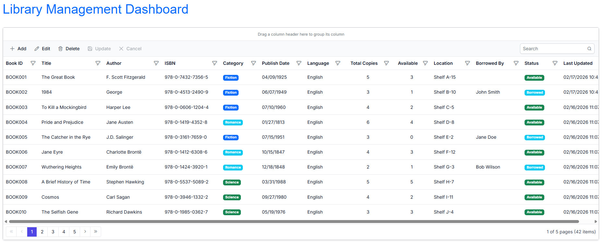

# Connecting Firebase Realtime Database to Blazor Data Grid

The [Syncfusion<sup style="font-size:70%">&reg;</sup> Blazor DataGrid](https://www.syncfusion.com/blazor-components/blazor-datagrid) supports binding data from a Firebase Realtime Database using the REST API. This approach provides a lightweight, language-agnostic solution for working with cloud-hosted JSON databases without requiring external SDKs.

**What is Firebase Realtime Database?**

Firebase Realtime Database is a cloud-hosted, NoSQL database that stores data as JSON. Unlike Firestore which uses collections and documents, the Realtime Database organizes data in a hierarchical JSON structure with nodes and keys, making it ideal for applications requiring simple setup, direct JSON manipulation, and real-time synchronization across multiple clients.

**Key Benefits of Firebase Realtime Database**

- **Simple Setup**: Minimal configuration required; no complex SDKs or dependencies
- **REST API Access**: Language-agnostic HTTP endpoints for CRUD operations
- **Real-Time Synchronization**: Automatic updates via WebSocket connections and polling mechanisms
- **Hierarchical JSON Structure**: Familiar JSON format for organizing and accessing data
- **Low Latency**: Optimized for fast read/write operations with automatic sync
- **Offline Capabilities**: Built-in offline persistence with automatic synchronization when connectivity is restored
- **Flexible Security Rules**: Fine-grained access control at the database path level
- **Lightweight Integration**: No heavy SDK installation; works directly with HttpClient

**What is Firebase Realtime Database REST API?**

**Firebase Realtime Database REST API** is a set of HTTP endpoints that allow applications to interact with the Realtime Database directly via standard REST calls (GET, POST, PUT, DELETE, PATCH). This approach is ideal for .NET applications where you want to avoid SDK dependencies and maintain direct control over network requests.

## Prerequisites

Ensure the following software, accounts, and packages are in place before proceeding:

| Software/Package | Version | Purpose |
|-----------------|---------|---------|
| Visual Studio 2026 | 18.0 or later | Development IDE with Blazor workload |
| .NET SDK | net10.0 or compatible | Runtime and build tools |
| Firebase Account | Active account | Cloud project hosting and Realtime Database |
| Google Cloud Project | Active project | Required for Firebase services and configuration |
| Syncfusion.Blazor.Grid | {{site.blazorversion}} | DataGrid and UI components |
| Syncfusion.Blazor.Themes | {{site.blazorversion}} | Styling for DataGrid components |
| HttpClient | Built-in (.NET) | REST API communication |

## Setting Up the Firebase Realtime Database Environment

### Step 1: Create a Firebase Project and Realtime Database

Firebase projects host your Realtime Database and manage authentication, storage, and other cloud services.

**Instructions:**

1. **Access Firebase Console**
   - Navigate to [Firebase Console](https://console.firebase.google.com/)
   - Sign in with your Google account

2. **Create a New Firebase Project**
   - Click the **"Add Project"** button
   - Enter project name: `librarymanagement` (or your preferred name)
   - Accept the terms and click **"Create Project"** and wait for completion

3. **Create a Realtime Database**
   - In the Firebase Console, navigate to **"Build"** → **"Realtime Database"**
   - Click **"Create Database"** button
   - Choose your database location (select the location closest to your users)
   - Set security rules to **"Start in Test Mode"** for development (update rules for production)
   - Click **"Enable"** and wait for the database to initialize

4. **Note the Database URL**
   - After creation, you will see your database URL displayed at the top: `https://your-project-id-default-rtdb.firebaseio.com/`
   - Save this URL; you'll need it for configuration

5. **Create the Database Structure**
   - In the Realtime Database Console, you'll see an empty root node
   - Click the **"+" (Add)** button to create a new node named **"Books"**
   - This creates the hierarchical structure: `root/Books/`

6. **Add Sample Data (Using Data Import or Manual Entry)**
   - The database structure will be populated with sample data in **Step 3** using the JSON file

The Realtime Database structure is now ready with the `Books` node.

---

### Step 2: Generate Database Secret for Authentication

Database secrets enable secure REST API access to your Realtime Database.

**Instructions:**

1. **Access Project Settings**
   - In Firebase Console, click the **Settings gear icon** (⚙️) in the top-left
   - Select **"Project Settings"**
   - Navigate to the **"Service Accounts"** tab

2. **Generate Database Secret**
   - Scroll down to **"Realtime Database Secrets"** section
   - Click the **"Show"** button next to the database secret
   - Copy the secret key (this is your authentication token)
   - **Important**: Save this secret securely—it grants full access to your database

3. **Store the Database Secret**
   - For **development**: Store in `appsettings.Development.json` or `appsettings.json`
   - For **production**: Use secure credential storage (Azure Key Vault, AWS Secrets Manager)
   - **Never commit** secrets to version control (add to `.gitignore`)

The database secret is now available for REST API authentication.

---

### Step 3: Configure Initial Data Import

Initial data seeding populates your Realtime Database with sample book records for development and testing.

**Instructions:**

1. **Prepare Sample Data File**
   - Create or obtain a JSON file in your project root
   - The file should contain the database structure with sample records:

```json
{
  "Books": {
    "BOOK001": {
      "bookId": "BOOK001",
      "title": "The Great Gatsby",
      "author": "F. Scott Fitzgerald",
      "isbn": "978-0743273565",
      "category": "Fiction",
      "publishDate": "1925-04-10",
      "language": "English",
      "totalCopies": 5,
      "availableCopies": 3,
      "location": "Section A-1",
      "status": "Available",
      "lastUpdated": "2026-02-17T10:00:00Z"
    },
    "BOOK002": {
      "bookId": "BOOK002",
      "title": "To Kill a Mockingbird",
      "author": "Harper Lee",
      "isbn": "978-0061120084",
      "category": "Fiction",
      "publishDate": "1960-07-11",
      "language": "English",
      "totalCopies": 4,
      "availableCopies": 2,
      "location": "Section B-2",
      "status": "Available",
      "lastUpdated": "2026-02-17T10:00:00Z"
    },
    "BOOK003": {
      "bookId": "BOOK003",
      "title": "1984",
      "author": "George Orwell",
      "isbn": "978-0451524935",
      "category": "Dystopian Fiction",
      "publishDate": "1949-06-08",
      "language": "English",
      "totalCopies": 6,
      "availableCopies": 4,
      "location": "Section C-1",
      "status": "Available",
      "lastUpdated": "2026-02-17T10:00:00Z"
    }
  }
}
```

2. **Import Data Using Firebase Console**
   - In Realtime Database Console, click the **three-dot menu** (⋮) at the top
   - Select **"Import JSON"**
   - Upload or paste the contents of JSON file.
   - Click **"Import"** to load the sample data into the database

3. **Verify Data Import**
   - The database should now display the hierarchical structure:
   - `root > Books > BOOK001, BOOK002, BOOK003` (and their respective fields)

The sample data is now loaded into your Realtime Database.

---

### Step 4: Update Database Security Rules

Security rules control read/write access to your Realtime Database paths.

**Instructions:**

1. **Access Security Rules**
   - In Realtime Database Console, click the **"Rules"** tab at the top

2. **Update Rules for Development**
   - For **development testing**, replace the default rules with:

```json
{
  "rules": {
    "Books": {
      ".read": true,
      ".write": true
    }
  }
}
```

   - Click **"Publish"** to apply the rules

3. **Update Rules for Production**
   - For **production**, implement proper authentication:

```json
{
  "rules": {
    "Books": {
      ".read": "root.child('auth').child(auth.uid).exists()",
      ".write": "root.child('auth').child(auth.uid).exists()"
    }
  }
}
```

   - This restricts access to authenticated users only
   - Click **"Publish"** to apply the rules

---

### Step 5: Install Required NuGet Packages

NuGet packages are software libraries that add functionality to the Blazor application. For Realtime Database integration, only Syncfusion components are required (HttpClient is built-in).

**Prerequisites for this step:**
- A new Blazor Web Application created using the default template
- The project automatically generates essential files: `Program.cs`, `appsettings.json`, `wwwroot` folder, and `Components` folder
- For this guide, a Blazor application named **Grid_Firebase_Realtime** has been created

**Method 1: Using Package Manager Console**

1. Open Visual Studio 2026.
2. Navigate to **Tools → NuGet Package Manager → Package Manager Console**.
3. Run the following commands:

```powershell
Install-Package Syncfusion.Blazor.Grid -Version {{site.blazorversion}}
Install-Package Syncfusion.Blazor.Themes -Version {{site.blazorversion}}
```

**Method 2: Using NuGet Package Manager UI**

1. Open **Visual Studio 2026 → Tools → NuGet Package Manager → Manage NuGet Packages for Solution**.
2. Search for and install each package individually:
   - **[Syncfusion.Blazor.Grid]((https://www.nuget.org/packages/Syncfusion.Blazor.Grid/))** (version {{site.blazorversion}})
   - **[Syncfusion.Blazor.Themes](https://www.nuget.org/packages/Syncfusion.Blazor.Themes/)** (version {{site.blazorversion}})

All required packages are now installed. No external Firebase SDK is needed.

---

### Step 6: Create the Data Model

A data model is a C# class that represents the structure of a Realtime Database record. This model defines the properties that correspond to the fields in the `Books` node.

**Instructions:**

1. Create a new folder named `Models` in the Blazor application project.
2. Inside the `Models` folder, create a new file named **Book.cs**.
3. Define the **Book** class with the following code:

```csharp
using System;

namespace Grid_Firebase_Realtime.Models
{
    /// <summary>
    /// Represents a Book record in the Firebase Realtime Database.
    /// Maps to a document in the Books node with flexible field structure.
    /// </summary>
    public class Book
    {
        /// <summary>
        /// Gets or sets the unique identifier for the book.
        /// Example: "BOOK001"
        /// </summary>
        public string BookId { get; set; }

        /// <summary>
        /// Gets or sets the title of the book.
        /// </summary>
        public string Title { get; set; }

        /// <summary>
        /// Gets or sets the author's name.
        /// </summary>
        public string Author { get; set; }

        /// <summary>
        /// Gets or sets the ISBN (International Standard Book Number).
        /// </summary>
        public string ISBN { get; set; }

        /// <summary>
        /// Gets or sets the category or genre of the book.
        /// Example: "Fiction", "Non-Fiction", "Science"
        /// </summary>
        public string Category { get; set; }

        /// <summary>
        /// Gets or sets the publication date of the book.
        /// Stored as ISO 8601 format string in the database.
        /// </summary>
        public string PublishDate { get; set; }

        /// <summary>
        /// Gets or sets the language of the book.
        /// Example: "English", "Spanish", "French"
        /// </summary>
        public string Language { get; set; }

        /// <summary>
        /// Gets or sets the total number of copies available in the library.
        /// </summary>
        public int TotalCopies { get; set; }

        /// <summary>
        /// Gets or sets the number of copies currently available for checkout.
        /// </summary>
        public int AvailableCopies { get; set; }

        /// <summary>
        /// Gets or sets the location or shelf where the book is stored.
        /// Example: "Section A-1"
        /// </summary>
        public string Location { get; set; }

        /// <summary>
        /// Gets or sets the current status of the book.
        /// Possible values: "Available", "CheckedOut", "Reserved", "Damaged"
        /// </summary>
        public string Status { get; set; }

        /// <summary>
        /// Gets or sets the timestamp of the last update to this record.
        /// Stored as ISO 8601 format string in the database.
        /// </summary>
        public string LastUpdated { get; set; }
    }
}
```

**Explanation:**

- The `Book` class directly maps to a record in the Realtime Database's `Books` node.
- Each property represents a field in the JSON object.
- All properties use standard C# conventions (PascalCase) which match the JSON fields after deserialization.
- Nullable strings (`?` suffix) indicate optional fields that may not be present in all records.
- DateTime fields are stored as ISO 8601 format strings in the JSON database for compatibility.
- No special attributes are required for REST API JSON deserialization.

The data model has been successfully created in `Models/Book.cs`.

---

### Step 7: Configure the Firebase Connection String

A Firebase Realtime Database connection requires the database URL and authentication secret. This configuration is managed in the `appsettings.json` file.

**Instructions:**

1. Open the `appsettings.json` file in the project root.
2. Add a new section for Firebase configuration with the database URL and secret:

```json
{
  "Firebase": {
    "RealtimeDatabaseURL": "https://your-project-id-default-rtdb.firebaseio.com/",
    "DatabaseSecret": "your-database-secret-key-here"
  },
  "Logging": {
    "LogLevel": {
      "Default": "Information",
      "Microsoft.AspNetCore": "Warning"
    }
  },
  "AllowedHosts": "*"
}
```

**Configuration Details:**

| Setting | Value | Purpose |
|---------|-------|---------|
| `Firebase:RealtimeDatabaseURL` | `https://your-project-id-default-rtdb.firebaseio.com/` | Base URL of your Realtime Database (with trailing slash) |
| `Firebase:DatabaseSecret` | Your database secret | Authentication token for REST API access |

**Important Security Notes:**

- **Development**: Store secrets in `appsettings.Development.json` (local machine only)
- **Production**: Use secure credential storage:
  - Azure Key Vault
  - AWS Secrets Manager
  - Environment variables
- **Never Commit**: Add `appsettings.*.json` with secrets to `.gitignore`

**Example .gitignore entry:**

```
# Firebase configuration and credentials
appsettings.Development.json
appsettings.Production.json
*.backup
```

The Firebase connection configuration is now in place in `appsettings.json`.

---

### Step 8: Create the Firebase Service Class

The Firebase service class manages REST API calls to the Realtime Database. It handles all interactions via standard HTTP requests without requiring any external SDKs.

**Instructions:**

1. Create a new folder named `Services` in the Blazor application project.
2. Inside the `Services` folder, create a new file named **FirebaseService.cs**.
3. Define the **FirebaseService** class with the following code:

```csharp
using System.Text.Json;
using Grid_Firebase_Realtime.Models;

namespace Grid_Firebase_Realtime.Services
{
    /// <summary>
    /// Service class for interacting with Firebase Realtime Database via REST API.
    /// Handles all CRUD operations and data retrieval without external SDKs.
    /// </summary>
    public class FirebaseService
    {
        private readonly HttpClient _httpClient;
        private readonly string _databaseURL;
        private readonly string _databaseSecret;
        private const string BooksNode = "Books";
        private const string BookIdPrefix = "BOOK";
        private const int BookIdStartNumber = 1;

        /// <summary>
        /// Initializes a new instance of the FirebaseService class.
        /// </summary>
        /// <param name="httpClient">HttpClient instance for making REST API calls</param>
        /// <param name="configuration">Configuration containing Firebase settings</param>
        public FirebaseService(HttpClient httpClient, IConfiguration configuration)
        {
            _httpClient = httpClient;
            _databaseURL = configuration["Firebase:RealtimeDatabaseURL"];
            _databaseSecret = configuration["Firebase:DatabaseSecret"];

            if (string.IsNullOrEmpty(_databaseURL) || string.IsNullOrEmpty(_databaseSecret))
            {
                throw new ArgumentException("Firebase configuration is missing. Ensure 'Firebase:RealtimeDatabaseURL' and 'Firebase:DatabaseSecret' are configured in appsettings.json");
            }
            if (_databaseURL.EndsWith("/"))
            {
                _databaseURL = _databaseURL.TrimEnd('/');
            }
        }

        /// <summary>
        /// Constructs the Firebase REST API URL with authentication parameter
        /// </summary>
        private string BuildUrl(string path, bool includeAuth = true)
        {
            string url = $"{_databaseUrl}/{path}.json";
            if (includeAuth && !string.IsNullOrEmpty(_databaseSecret))
            {
                url += $"?auth={_databaseSecret}";
            }
            return url;
        }

        /// <summary>
        /// Retrieves all books from the Realtime Database.
        /// Makes a REST GET request to the Books node.
        /// </summary>
        /// <returns>List of Book objects</returns>
        public async Task<List<Book>> GetBooksAsync()
        {
            try
            {
                string url = BuildUrl(BooksNode);
                var response = await _httpClient.GetAsync(url);

                if (response.IsSuccessStatusCode)
                {
                    string content = await response.Content.ReadAsStringAsync();
                    
                    if (content == "null")
                    {
                        return new List<Book>();
                    }

                    var options = new JsonSerializerOptions 
                    { 
                        PropertyNameCaseInsensitive = true 
                    };

                    var booksDict = JsonSerializer.Deserialize<Dictionary<string, Book>>(content, options);
                    
                    if (booksDict == null || booksDict.Count == 0)
                    {
                        return new List<Book>();
                    }

                    return booksDict.Select(item => new Book
                    {
                        BookId = item.Key,
                        Title = item.Value.Title,
                        Author = item.Value.Author,
                        ISBN = item.Value.ISBN,
                        Category = item.Value.Category,
                        PublishDate = item.Value.PublishDate,
                        Language = item.Value.Language,
                        TotalCopies = item.Value.TotalCopies,
                        AvailableCopies = item.Value.AvailableCopies,
                        Location = item.Value.Location,
                        BorrowedBy = item.Value.BorrowedBy,
                        Status = item.Value.Status,
                        LastUpdated = item.Value.LastUpdated
                    }).ToList();
                }
                else
                {
                    string errorContent = await response.Content.ReadAsStringAsync();
                    Console.WriteLine($"Firebase API Error: {response.StatusCode} - {errorContent}");
                    return new List<Book>();
                }
            }
            catch (Exception ex)
            {
                Console.WriteLine($"Error fetching books: {ex.Message}");
                throw new Exception($"Error fetching books: {ex.Message}");
            }
        }

        /// <summary>
        /// Inserts a new book into the Firebase database.
        /// </summary>
        /// <param name="book">The book object to insert</param>
        /// <returns>The inserted book with generated BookId</returns>
        public async Task<Book> InsertBookAsync(Book book)
        {
            // Handle logic to add a new book to the database
        }

        /// <summary>
        /// Updates an existing book in the Firebase database.
        /// </summary>
        /// <param name="bookId">The ID of the book to update</param>
        /// <param name="book">The updated book object</param>
        /// <returns>True if the book was updated successfully; otherwise, false</returns>
        public async Task<bool> UpdateBookAsync(string bookId, Book book)
        {
            // Handle logic to update an existing book to the database
        }

        /// <summary>
        /// Deletes a book from the Firebase database.
        /// </summary>
        /// <param name="bookId">The ID of the book to delete</param>
        /// <returns>True if the book was deleted successfully; otherwise, false</returns>
        public async Task<bool> DeleteBookAsync(string bookId)
        {
            // Handle logic to delete an existing book from the database
        }
    }
}
```

**Explanation:**

- The `FirebaseService` class manages all REST API interactions with the Realtime Database.
- The `HttpClient` instance is used to make HTTP requests (GET, POST, PUT, DELETE).

The Firebase service class has been successfully created in `Services/FirebaseService.cs`.

---

### Step 9: Register Services in Program.cs

The `Program.cs` file is where application services are registered and configured. This file must be updated to enable HttpClient, Firebase service, and Syncfusion components.

**Instructions:**

1. Open the `Program.cs` file at the project root.
2. Add the following code to register services and configure the application:

```csharp
using Grid_Firebase_Realtime.Components;
using Grid_Firebase_Realtime.Services;
using Syncfusion.Blazor;

var builder = WebApplication.CreateBuilder(args);

// Add services to the container.
builder.Services.AddRazorComponents()
    .AddInteractiveServerComponents();

// Register Syncfusion Blazor services
builder.Services.AddSyncfusionBlazor();

// Register HttpClient for Firebase REST API calls
builder.Services.AddHttpClient<FirebaseService>();

// Register Firebase Realtime Database service for dependency injection
builder.Services.AddScoped<FirebaseService>();

var app = builder.Build();

// Configure the HTTP request pipeline.
if (!app.Environment.IsDevelopment())
{
    app.UseExceptionHandler("/Error", createScopeForErrors: true);
    app.UseHsts();
}

app.UseHttpsRedirection();

app.UseAntiforgery();

app.MapStaticAssets();
app.MapRazorComponents<App>()
    .AddInteractiveServerRenderMode();

app.Run();
```

**Explanation:**

- **`builder.Services.AddHttpClient<FirebaseService>();`**: Registers `HttpClient` for use in `FirebaseService`
- **`builder.Services.AddScoped<FirebaseService>();`**: Registers `FirebaseService` with scoped lifetime (creates a new instance per HTTP request)

The service registration has been completed successfully in `Program.cs`.

---

## Integrating Syncfusion Blazor DataGrid

### Step 1: Configure Blazor DataGrid Components

Syncfusion is a library that provides pre-built UI components like DataGrid, which is used to display data in a table format.

**Instructions:**

* The Syncfusion.Blazor package was installed in **Step 5** of the previous heading.
* Import the required namespaces in the `Components/_Imports.razor` file:

```csharp
@using Grid_Firebase_Realtime.Models
@using Grid_Firebase_Realtime.Services
@using Syncfusion.Blazor.Grids
@using Syncfusion.Blazor.Data
@using Syncfusion.Blazor.DropDowns
```

* Add the Syncfusion stylesheet and scripts in the `Components/App.razor` file. Find the `<head>` section and add:

```html
<!-- Syncfusion Blazor Stylesheet -->
<link href="_content/Syncfusion.Blazor.Themes/tailwind3.css" rel="stylesheet" />

<!-- Syncfusion Blazor Scripts -->
<script src="_content/Syncfusion.Blazor.Core/scripts/syncfusion-blazor.min.js" type="text/javascript"></script>
```

For this project, the tailwind3 theme is used. A different theme can be selected or the existing theme can be customized based on project requirements. Refer to the [Syncfusion Blazor Components Appearance](https://blazor.syncfusion.com/documentation/appearance/themes) documentation to learn more about theming and customization options.

Syncfusion components are now configured and ready to use. For additional guidance, refer to the Grid component's [getting‑started](https://blazor.syncfusion.com/documentation/datagrid/getting-started-with-web-app) documentation.

---

### Step 2: Update the Blazor DataGrid

The `Home.razor` component displays the book data in a Syncfusion Blazor DataGrid with search, filter, sort, and pagination capabilities.

**Instructions:**

1. Open the file named `Home.razor` in the `Components/Pages` folder.
2. Replace the entire file content with the following code to create a DataGrid with bulk import functionality:

```cshtml
@page "/"
@using System.Collections
@using System.Text.Json
@rendermode InteractiveServer
@inject FirebaseService FirebaseService

<PageTitle>Library Management</PageTitle>

<!-- Grid Section -->
<div class="row">
   <div class="col-md-12">
      <div class="card shadow-sm">
            <div class="card-body p-0">

               <SfGrid @ref="_grid" TValue="Book" AllowPaging="true" AllowSorting="true" AllowFiltering="true" AllowGrouping="true" Toolbar="@ToolbarItems">
                  <SfDataManager AdaptorInstance="@typeof(CustomAdaptor)" Adaptor="Adaptors.CustomAdaptor"></SfDataManager>

                  <GridColumns>
                     //columns configuration
                  </GridColumns>
               </SfGrid>
               
            </div>
      </div>
   </div>
</div>

@code {
   // CustomAdaptor class will be added in the next step
}
```

**Component Explanation:**

- **`@rendermode InteractiveServer`**: Enables interactive server-side rendering for real-time updates
- **`@inject FirebaseService`**: Injects the FirebaseService to access database methods
- **`<SfGrid>`**: The DataGrid component that displays books in rows and columns
- **`<GridColumns>`**: Defines individual columns with field mappings, types, and formatting

The Home component has been successfully updated with the DataGrid and CustomAdaptor.

---

### Step 3: Implement the CustomAdaptor

The Syncfusion<sup style="font-size:70%">&reg;</sup> Blazor DataGrid can bind data from a **Firebase Realtime** database using [DataManager](https://help.syncfusion.com/cr/blazor/Syncfusion.Blazor.Data.SfDataManager.html) and set the [Adaptor](https://help.syncfusion.com/cr/blazor/Syncfusion.Blazor.Adaptors.html) property to `CustomAdaptor` for scenarios that require full control over data operations.

The `CustomAdaptor` is a bridge between the DataGrid and the database. It handles all data operations including reading, searching, filtering, sorting, paging, and CRUD operations. Each operation in the CustomAdaptor's `ReadAsync` method handles specific grid functionality. The Syncfusion<sup style="font-size:70%">&reg;</sup> Blazor DataGrid sends operation details to the API through a [DataManagerRequest](https://help.syncfusion.com/cr/blazor/Syncfusion.Blazor.DataManagerRequest.html) object. These details can be applied to the data source using methods from the [DataOperations](https://help.syncfusion.com/cr/blazor/Syncfusion.Blazor.DataOperations.html) class.

**Instructions:**

* Open the `Components/Pages/Home.razor` file.
* Add the following `CustomAdaptor` class code inside the `@code` block:

```csharp
@code {

   public static FirebaseService? _firebaseService { get; set; }

   /// <summary>
   /// CustomAdaptor class bridges DataGrid interactions with database operations.
   /// This adaptor handles all data retrieval and manipulation for the DataGrid.
   /// </summary>
   public class CustomAdaptor : DataAdaptor
   {
      public FirebaseService? FirebaseService
      {
            get => _firebaseService;
            set => _firebaseService = value;
      }

      public override async Task<object> ReadAsync(DataManagerRequest dataManagerRequest, string? key = null)
      {
         try
         {
            // Fetch all books from the Firebase database
            IEnumerable dataSource = await _firebaseService!.GetBooksAsync();

            // Apply search operation if search criteria exists
            if (dataManagerRequest.Search != null && dataManagerRequest.Search.Count > 0)
            {
               dataSource = DataOperations.PerformSearching(dataSource, dataManagerRequest.Search);
            }

            // Apply filter operation if filter criteria exists
            if (dataManagerRequest.Where != null && dataManagerRequest.Where.Count > 0)
            {
               dataSource = DataOperations.PerformFiltering(dataSource, dataManagerRequest.Where, dataManagerRequest.Where[0].Operator);
            }

            // Apply sort operation if sort criteria exists
            if (dataManagerRequest.Sorted != null && dataManagerRequest.Sorted.Count > 0)
            {
               dataSource = DataOperations.PerformSorting(dataSource, dataManagerRequest.Sorted);
            }

            // Calculate total record count before paging for accurate pagination
            int totalRecordsCount = dataSource.Cast<Book>().Count();

            // Apply paging skip operation
            if (dataManagerRequest.Skip != 0)
            {
               dataSource = DataOperations.PerformSkip(dataSource, dataManagerRequest.Skip);
            }

            // Apply paging take operation to retrieve only the requested page size
            if (dataManagerRequest.Take != 0)
            {
               dataSource = DataOperations.PerformTake(dataSource, dataManagerRequest.Take);
            }

            // Handling Group operation in CustomAdaptor.
            if (dataManagerRequest.Group != null)
            {
               foreach (var group in dataManagerRequest.Group)
               {
                     dataSource = DataUtil.Group<Book>(dataSource, group, dataManagerRequest.Aggregates, 0, dataManagerRequest.GroupByFormatter);
               }
            }

            // Return the result with total count for pagination metadata
            return dataManagerRequest.RequiresCounts
               ? new DataResult() { Result = dataSource, Count = totalRecordsCount }
               : (object)dataSource;
         }
         catch (Exception ex)
         {
            Console.WriteLine($"ReadAsync Error: {ex.Message}");
            throw new Exception($"An error occurred while retrieving data: {ex.Message}");
         }
      }
   }
}
```

The `CustomAdaptor` class has been successfully implemented with all data operations.

**Common methods in data operations**

* [ReadAsync(DataManagerRequest)](https://help.syncfusion.com/cr/blazor/Syncfusion.Blazor.DataAdaptor.html#Syncfusion_Blazor_DataAdaptor_ReadAsync_Syncfusion_Blazor_DataManagerRequest_System_String_) - Retrieve and process records (search, filter, sort, page, group)

* [PerformSearching](https://help.syncfusion.com/cr/blazor/Syncfusion.Blazor.DataOperations.html#Syncfusion_Blazor_DataOperations_PerformSearching__1_System_Linq_IQueryable___0__System_Collections_Generic_List_Syncfusion_Blazor_Data_SearchFilter__) - Applies search criteria to the collection.
* [PerformFiltering](https://help.syncfusion.com/cr/blazor/Syncfusion.Blazor.DataOperations.html#Syncfusion_Blazor_DataOperations_PerformFiltering__1_System_Linq_IQueryable___0__System_Collections_Generic_List_Syncfusion_Blazor_Data_WhereFilter__System_String_) - Filters data based on conditions.
* [PerformSorting](https://help.syncfusion.com/cr/blazor/Syncfusion.Blazor.DataOperations.html#Syncfusion_Blazor_DataOperations_PerformSorting__1_System_Linq_IQueryable___0__System_Collections_Generic_List_Syncfusion_Blazor_Data_Sort__) - Sorts data by one or more fields.
* [PerformSkip](https://help.syncfusion.com/cr/blazor/Syncfusion.Blazor.DataOperations.html#Syncfusion_Blazor_DataOperations_PerformSkip__1_System_Linq_IQueryable___0__System_Int32_) - Skips a defined number of records for paging.
* [PerformTake](https://help.syncfusion.com/cr/blazor/Syncfusion.Blazor.DataOperations.html#Syncfusion_Blazor_DataOperations_PerformTake__1_System_Linq_IQueryable___0__System_Int32_) - Retrieves a specified number of records for paging.
* [PerformAggregation](https://help.syncfusion.com/cr/blazor/Syncfusion.Blazor.Data.DataUtil.html#Syncfusion_Blazor_Data_DataUtil_PerformAggregation_System_Collections_IEnumerable_System_Collections_Generic_List_Syncfusion_Blazor_Data_Aggregate__) – Calculates aggregate values such as Sum, Average, Min, and Max.

---

### Step 4: Add Toolbar with CRUD and Search Options

The toolbar provides buttons for adding, editing, deleting records, and searching the data.

**Instructions:**

* Open the `Components/Pages/Home.razor` file.
* Update the `<SfGrid>` component to include the [Toolbar](https://help.syncfusion.com/cr/blazor/Syncfusion.Blazor.Grids.SfGrid-1.html#Syncfusion_Blazor_Grids_SfGrid_1_Toolbar) property with CRUD and search options:

```cshtml
<SfGrid TValue="Book" 
        AllowPaging="true" 
        AllowSorting="true" 
        AllowFiltering="true" 
        Toolbar="@ToolbarItems">
    <SfDataManager AdaptorInstance="@typeof(CustomAdaptor)" Adaptor="Adaptors.CustomAdaptor"></SfDataManager>
    
    <!-- Grid columns configuration -->
</SfGrid>
```

* Add the toolbar items list in the `@code` block:

```csharp
@code {
    private List<string> ToolbarItems = new List<string> { "Add", "Edit", "Delete", "Update", "Cancel", "Search"};

    // CustomAdaptor class code...
}
```

**Toolbar Items Explanation:**

| Item | Function |
|------|----------|
| `Add` | Opens a form to add a new book record. |
| `Edit` | Enables editing of the selected record. |
| `Delete` | Deletes the selected record from the database. |
| `Update` | Saves changes made to the selected record. |
| `Cancel` | Cancels the current edit or add operation. |
| `Search` | Displays a search box to find records. |

The toolbar has been successfully added.

---

### Step 5: Running the Application

**Build the Application**

1. Open the terminal or Package Manager Console.
2. Navigate to the project directory.
3. Run the following command:

```powershell
dotnet build
```

**Run the Application**

Execute the following command:

```powershell
dotnet run
```

**Access the Application**

1. Open a web browser.
2. Navigate to `https://localhost:5001` (or the port shown in the terminal).
3. The library management application is now running and ready to use.



---

### Step 6: Implement Paging Feature

Paging divides large datasets into smaller pages to improve performance and usability.

**Instructions:**

* The paging feature is already partially enabled in the `<SfGrid>` component with [AllowPaging="true"](https://help.syncfusion.com/cr/blazor/Syncfusion.Blazor.Grids.SfGrid-1.html#Syncfusion_Blazor_Grids_SfGrid_1_AllowPaging).
* The page size is configured with [GridPageSettings](https://help.syncfusion.com/cr/blazor/Syncfusion.Blazor.Grids.GridPageSettings.html).
* No additional code changes are required from the previous steps.

```cshtml
<SfGrid TValue="Book" 
        AllowPaging="true">
    <SfDataManager AdaptorInstance="@typeof(CustomAdaptor)" Adaptor="Adaptors.CustomAdaptor"></SfDataManager>
    <GridPageSettings PageSize="10"></GridPageSettings>
    
    <!-- Grid columns configuration -->
</SfGrid>
```

* Update the `ReadAsync` method in the `CustomAdaptor` class to handle paging:

```csharp
@code {  
    
    /// <summary>
    /// CustomAdaptor class to handle grid data operations with Firebase Realtime
    /// </summary>
    public class CustomAdaptor : DataAdaptor
    {
        public static FirebaseService? _firebaseService { get; set; }
        public FirebaseService? FirebaseService 
        { 
            get => _firebaseService;
            set => _firebaseService = value;
        }

        public override async Task<object> ReadAsync(DataManagerRequest dataManagerRequest, string? key = null)
        {
            IEnumerable dataSource = await _firebaseService!.GetBooksAsync();        

            int totalRecordsCount = dataSource.Cast<Book>().Count();
            
            // Handling Paging
            if (dataManagerRequest.Skip != 0)
            {
                dataSource = DataOperations.PerformSkip(dataSource, dataManagerRequest.Skip);            
            }

            if (dataManagerRequest.Take != 0)
            {
                dataSource = DataOperations.PerformTake(dataSource, dataManagerRequest.Take);            
            }

            return dataManagerRequest.RequiresCounts 
                ? new DataResult() { Result = dataSource, Count = totalRecordsCount } 
                : (object)dataSource;
        }
    }
}
```

Fetches book data by calling the **GetBooksAsync** method, which is implemented in the **FirebaseService.cs** file.

```csharp
/// <summary>
/// Retrieves all books from the Realtime database
/// </summary>
/// <returns>List of all books</returns>
public async Task<List<Book>> GetBooksAsync()
{
    try
    {
        string url = BuildUrl(BooksNode);
        var response = await _httpClient.GetAsync(url);

        if (response.IsSuccessStatusCode)
        {
            string content = await response.Content.ReadAsStringAsync();
            
            if (content == "null")
            {
                return new List<Book>();
            }

            var options = new JsonSerializerOptions 
            { 
                PropertyNameCaseInsensitive = true 
            };

            var booksDict = JsonSerializer.Deserialize<Dictionary<string, Book>>(content, options);
            
            if (booksDict == null || booksDict.Count == 0)
            {
                return new List<Book>();
            }

            return booksDict.Select(item => new Book
            {
                BookId = item.Key,
                Title = item.Value.Title,
                Author = item.Value.Author,
                ISBN = item.Value.ISBN,
                Category = item.Value.Category,
                PublishDate = item.Value.PublishDate,
                Language = item.Value.Language,
                TotalCopies = item.Value.TotalCopies,
                AvailableCopies = item.Value.AvailableCopies,
                Location = item.Value.Location,
                BorrowedBy = item.Value.BorrowedBy,
                Status = item.Value.Status,
                LastUpdated = item.Value.LastUpdated
            }).ToList();
        }
        else
        {
            string errorContent = await response.Content.ReadAsStringAsync();
            Console.WriteLine($"Firebase API Error: {response.StatusCode} - {errorContent}");
            return new List<Book>();
        }
    }
    catch (Exception ex)
    {
        Console.WriteLine($"Error fetching books: {ex.Message}");
        throw new Exception($"Error fetching books: {ex.Message}");
    }
}
```

**How Paging Works:**

- The DataGrid displays 10 records per page (as set in `GridPageSettings`).
- Navigation buttons allow the user to move between pages.
- When a page is requested, the `ReadAsync` method receives skip and take values.
- The `DataOperations.PerformSkip()` and `DataOperations.PerformTake()` methods handle pagination.
- Only the requested page of records is transmitted from the server.

Paging feature is now active with 10 records per page.

---

### Step 7: Implement Searching Feature

Searching allows the user to find records by entering keywords in the search box.

**Instructions:**

* Ensure the toolbar includes the "Search" item.
* No additional code changes are required.

```cshtml
<SfGrid TValue="Book"        
        AllowPaging="true"
        Toolbar="@ToolbarItems">
    <SfDataManager AdaptorInstance="@typeof(CustomAdaptor)" Adaptor="Adaptors.CustomAdaptor"></SfDataManager>
    <GridPageSettings PageSize="10"></GridPageSettings>
    <!-- Grid columns configuration -->
</SfGrid>
```

* Update the `ReadAsync` method in the `CustomAdaptor` class to handle searching:

```csharp
@code {
    private List<string> ToolbarItems = new List<string> { "Search"};
    
    /// <summary>
    /// CustomAdaptor class to handle grid data operations with Firebase Realtime
    /// </summary>
    public class CustomAdaptor : DataAdaptor
    {
        public static FirebaseService? _firebaseService { get; set; }
        public FirebaseService? FirebaseService 
        { 
            get => _firebaseService;
            set => _firebaseService = value;
        }

        public override async Task<object> ReadAsync(DataManagerRequest dataManagerRequest, string? key = null)
        {
            IEnumerable dataSource = await _firebaseService!.GetBooksAsync();

            // Handling Search
            if (dataManagerRequest.Search != null && dataManagerRequest.Search.Count > 0)
            {
                dataSource = DataOperations.PerformSearching(dataSource, dataManagerRequest.Search);
            }

            int totalRecordsCount = dataSource.Cast<Book>().Count();
            // Handling Paging
            if (dataManagerRequest.Skip != 0)
            {
                dataSource = DataOperations.PerformSkip(dataSource, dataManagerRequest.Skip);
                //Add custom logic here if needed and remove above method
            }

            if (dataManagerRequest.Take != 0)
            {
                dataSource = DataOperations.PerformTake(dataSource, dataManagerRequest.Take);
                //Add custom logic here if needed and remove above method
            }

            return dataManagerRequest.RequiresCounts 
                ? new DataResult() { Result = dataSource, Count = totalRecordsCount } 
                : (object)dataSource;
        }
    }
}
```

**How Searching Works:**

- When the user enters text in the search box and presses Enter, the DataGrid sends a search request to the CustomAdaptor.
- The `ReadAsync` method receives the search criteria in `dataManagerRequest.Search`.
- The `DataOperations.PerformSearching()` method filters the data based on the search term.
- Results are returned and displayed in the DataGrid.

Searching feature is now active.

---

### Step 8: Implement Filtering Feature

Filtering allows the user to restrict data based on column values using a menu interface.

**Instructions:**

* Open the `Components/Pages/Home.razor` file.
* Add the [AllowFiltering](https://help.syncfusion.com/cr/blazor/Syncfusion.Blazor.Grids.SfGrid-1.html#Syncfusion_Blazor_Grids_SfGrid_1_AllowFiltering) property and [GridFilterSettings](https://help.syncfusion.com/cr/blazor/Syncfusion.Blazor.Grids.GridFilterSettings.html) to the `<SfGrid>` component:

```cshtml
<SfGrid TValue="Book" 
        AllowPaging="true"         
        AllowFiltering="true"
        Toolbar="@ToolbarItems">
    <SfDataManager AdaptorInstance="@typeof(CustomAdaptor)" Adaptor="Adaptors.CustomAdaptor"></SfDataManager>
    
    <GridFilterSettings Type="Syncfusion.Blazor.Grids.FilterType.Menu"></GridFilterSettings>
    
    <!-- Grid columns configuration -->
</SfGrid>
```

* Update the `ReadAsync` method in the `CustomAdaptor` class to handle filtering:

```csharp
/// <summary>
/// CustomAdaptor class to handle grid data operations with Firebase Realtime
/// </summary>
public class CustomAdaptor : DataAdaptor
{
    public static FirebaseService? _firebaseService { get; set; }
    public FirebaseService? FirebaseService 
    { 
        get => _firebaseService;
        set => _firebaseService = value;
    }

    public override async Task<object> ReadAsync(DataManagerRequest dataManagerRequest, string? key = null)
    {
        IEnumerable dataSource = await _firebaseService!.GetBooksAsync();

        // Handling Search
        if (dataManagerRequest.Search != null && dataManagerRequest.Search.Count > 0)
        {
            dataSource = DataOperations.PerformSearching(dataSource, dataManagerRequest.Search);
        }

        // Handling Filtering
        if (dataManagerRequest.Where != null && dataManagerRequest.Where.Count > 0)
        {
            dataSource = DataOperations.PerformFiltering(dataSource, dataManagerRequest.Where, dataManagerRequest.Where[0].Operator);
        }
        
        int totalRecordsCount = dataSource.Cast<Book>().Count();
        // Handling Paging
        if (dataManagerRequest.Skip != 0)
        {
            dataSource = DataOperations.PerformSkip(dataSource, dataManagerRequest.Skip);
            //Add custom logic here if needed and remove above method
        }

        if (dataManagerRequest.Take != 0)
        {
            dataSource = DataOperations.PerformTake(dataSource, dataManagerRequest.Take);
            //Add custom logic here if needed and remove above method
        }

        return dataManagerRequest.RequiresCounts 
            ? new DataResult() { Result = dataSource, Count = totalRecordsCount } 
            : (object)dataSource;
    }

}
```

**How Filtering Works:**

- Click on the dropdown arrow in any column header to open the filter menu.
- Select filtering criteria (equals, contains, greater than, less than, etc.).
- Click the "Filter" button to apply the filter.
- The `ReadAsync` method receives the filter criteria in `dataManagerRequest.Where`.
- Results are filtered accordingly and displayed in the DataGrid.

Filtering feature is now active.

---

### Step 9: Implement Sorting Feature

Sorting enables the user to arrange records in ascending or descending order based on column values.

**Instructions:**

* Open the `Components/Pages/Home.razor` file.
* Add the [AllowSorting](https://help.syncfusion.com/cr/blazor/Syncfusion.Blazor.Grids.SfGrid-1.html#Syncfusion_Blazor_Grids_SfGrid_1_AllowSorting) property to the `<SfGrid>` component:

```cshtml
<SfGrid TValue="Book" 
        AllowPaging="true" 
        AllowSorting="true" 
        AllowFiltering="true" 
        Toolbar="@ToolbarItems">
    <SfDataManager AdaptorInstance="@typeof(CustomAdaptor)" Adaptor="Adaptors.CustomAdaptor"></SfDataManager>
 
     <GridPageSettings PageSize="10"></GridPageSettings>
     <GridFilterSettings Type="Syncfusion.Blazor.Grids.FilterType.Menu"></GridFilterSettings>
    
    <!-- Grid columns configuration -->
</SfGrid>
```

* Update the `ReadAsync` method in the `CustomAdaptor` class to handle sorting:

```csharp
/// <summary>
/// CustomAdaptor class to handle grid data operations with Firebase Realtime
/// </summary>
public class CustomAdaptor : DataAdaptor
{
    public static FirebaseService? _firebaseService { get; set; }
    public FirebaseService? FirebaseService 
    { 
        get => _firebaseService;
        set => _firebaseService = value;
    }

    public override async Task<object> ReadAsync(DataManagerRequest dataManagerRequest, string? key = null)
    {
        IEnumerable dataSource = await _firebaseService!.GetBooksAsync();

        // Handling Search
        if (dataManagerRequest.Search != null && dataManagerRequest.Search.Count > 0)
        {
            dataSource = DataOperations.PerformSearching(dataSource, dataManagerRequest.Search);
        }

        // Handling Filtering
        if (dataManagerRequest.Where != null && dataManagerRequest.Where.Count > 0)
        {
            dataSource = DataOperations.PerformFiltering(dataSource, dataManagerRequest.Where, dataManagerRequest.Where[0].Operator);
        }

         // Handling Sorting
        if (dataManagerRequest.Sorted != null && dataManagerRequest.Sorted.Count > 0)
        {
            dataSource = DataOperations.PerformSorting(dataSource, dataManagerRequest.Sorted);
        }
        
        int totalRecordsCount = dataSource.Cast<Book>().Count();
        // Handling Paging
        if (dataManagerRequest.Skip != 0)
        {
            dataSource = DataOperations.PerformSkip(dataSource, dataManagerRequest.Skip);
            //Add custom logic here if needed and remove above method
        }

        if (dataManagerRequest.Take != 0)
        {
            dataSource = DataOperations.PerformTake(dataSource, dataManagerRequest.Take);
            //Add custom logic here if needed and remove above method
        }

        return dataManagerRequest.RequiresCounts 
            ? new DataResult() { Result = dataSource, Count = totalRecordsCount } 
            : (object)dataSource;
    }

}
```

**How Sorting Works:**

- Click on the column header to sort in ascending order.
- Click again to sort in descending order.
- The `ReadAsync` method receives the sort criteria in `dataManagerRequest.Sorted`.
- Records are sorted accordingly and displayed in the DataGrid.

Sorting feature is now active.

---

### Step 10: Implement Grouping Feature

Grouping organizes records into hierarchical groups based on column values.

**Instructions:**

* Open the `Components/Pages/Home.razor` file.
* Add the [AllowGrouping](https://help.syncfusion.com/cr/blazor/Syncfusion.Blazor.Grids.SfGrid-1.html#Syncfusion_Blazor_Grids_SfGrid_1_AllowGrouping) property to the `<SfGrid>` component:

```cshtml
<SfGrid TValue="Book" 
        AllowPaging="true" 
        AllowSorting="true" 
        AllowFiltering="true" 
        AllowGrouping="true"
        Toolbar="@ToolbarItems">
    <SfDataManager AdaptorInstance="@typeof(CustomAdaptor)" Adaptor="Adaptors.CustomAdaptor"></SfDataManager>
     <GridPageSettings PageSize="10"></GridPageSettings>
     <GridFilterSettings Type="Syncfusion.Blazor.Grids.FilterType.Menu"></GridFilterSettings>
    <!-- Grid columns  -->
</SfGrid>
```

* Update the `ReadAsync` method in the `CustomAdaptor` class to handle grouping:

```csharp
/// <summary>
/// CustomAdaptor class to handle grid data operations with Firebase Realtime
/// </summary>
public class CustomAdaptor : DataAdaptor
{
    public static FirebaseService? _firebaseService { get; set; }
    public FirebaseService? FirebaseService 
    { 
        get => _firebaseService;
        set => _firebaseService = value;
    }

    public override async Task<object> ReadAsync(DataManagerRequest dataManagerRequest, string? key = null)
    {
        IEnumerable dataSource = await _firebaseService!.GetBooksAsync();

        // Handling Search
        if (dataManagerRequest.Search != null && dataManagerRequest.Search.Count > 0)
        {
            dataSource = DataOperations.PerformSearching(dataSource, dataManagerRequest.Search);
        }

        // Handling Filtering
        if (dataManagerRequest.Where != null && dataManagerRequest.Where.Count > 0)
        {
            dataSource = DataOperations.PerformFiltering(dataSource, dataManagerRequest.Where, dataManagerRequest.Where[0].Operator);
        }

         // Handling Sorting
        if (dataManagerRequest.Sorted != null && dataManagerRequest.Sorted.Count > 0)
        {
            dataSource = DataOperations.PerformSorting(dataSource, dataManagerRequest.Sorted);
        }

        int totalRecordsCount = dataSource.Cast<Book>().Count();
        
        // Handling Paging
        if (dataManagerRequest.Skip != 0)
        {
            dataSource = DataOperations.PerformSkip(dataSource, dataManagerRequest.Skip);
            //Add custom logic here if needed and remove above method
        }

        if (dataManagerRequest.Take != 0)
        {
            dataSource = DataOperations.PerformTake(dataSource, dataManagerRequest.Take);
            //Add custom logic here if needed and remove above method
        }

        // Handling Group operation in CustomAdaptor.
        if (dataManagerRequest.Group != null)
        {
            foreach (var group in dataManagerRequest.Group)
            {
                dataSource = DataUtil.Group<Book>(dataSource, group, dataManagerRequest.Aggregates, 0, dataManagerRequest.GroupByFormatter);
            }
        }

        return dataManagerRequest.RequiresCounts 
            ? new DataResult() { Result = dataSource, Count = totalRecordsCount } 
            : (object)dataSource;
    }
}
```

**How Grouping Works:**

- Columns can be grouped by dragging the column header into the group drop area.
- Each group can be expanded or collapsed by clicking on the group header.
- The `ReadAsync` method receives the grouping instructions through `dataManagerRequest.Group`.
- The grouping operation is processed using **DataUtil.Group**, which organizes the records into hierarchical groups based on the selected column.
- Grouping is performed after search, filter, and sort operations, ensuring the grouped data reflects all applied conditions.
- The processed grouped result is then returned to the **Grid** and displayed in a structured, hierarchical format.

Grouping feature is now active.

---

### Step 11: Perform CRUD Operations

CustomAdaptor methods enable users to create, read, update, and delete records directly from the DataGrid. Each operation calls corresponding data layer methods in **FirebaseService.cs** to execute commands.

Add the Grid **EditSettings** and **Toolbar** configuration to enable create, read, update, and delete (CRUD) operations.

```cshtml
<SfGrid TValue="Book" 
        AllowPaging="true" 
        AllowSorting="true" 
        AllowFiltering="true" 
        AllowGrouping="true"
        Toolbar="@ToolbarItems">
    <SfDataManager AdaptorInstance="@typeof(CustomAdaptor)" Adaptor="Adaptors.CustomAdaptor"></SfDataManager>
     <GridPageSettings PageSize="10"></GridPageSettings>
     <GridFilterSettings Type="Syncfusion.Blazor.Grids.FilterType.Menu"></GridFilterSettings>
     <GridEditSettings AllowEditing="true" AllowAdding="true" AllowDeleting="true" Mode="EditMode.Normal"></GridEditSettings>
    <!-- Grid columns  -->
</SfGrid>
```

Add the toolbar items list in the `@code` block:

```csharp
@code {
    private List<string> ToolbarItems = new List<string> { "Add", "Edit", "Delete", "Update", "Cancel", "Search"};

    // CustomAdaptor class code...
}
```

**Insert**

Record insertion allows new books to be added directly through the DataGrid component. The adaptor processes the insertion request, performs any required business‑logic validation, and saves the newly created record to the Firebase Realtime database.

In **Home.razor**, implement the `InsertAsync` method to handle record insertion within the `CustomAdaptor` class:

```csharp
public class CustomAdaptor : DataAdaptor
{
    public override async Task<object?> InsertAsync(DataManager dataManager, object value, string? key = null)
    {
        try
        {
            if (value is Book newBook)
            {
                var result = await _firebaseService!.InsertBookAsync(newBook);
                return result;
            }
            return default;
        }
        catch (Exception ex)
        {
            Console.WriteLine($"Error in Insert operation: {ex.Message}");
            throw;
        }
    }
}
```

In **Services/FirebaseService.cs**, implement the insert method:

```csharp
public async Task<Book> InsertBookAsync(Book book)
{
    try
    {
        // Auto-generate BookId if not provided
        if (string.IsNullOrEmpty(book.BookId))
        {
            book.BookId = await GenerateBookIdAsync();
        }

        // Set LastUpdated to current UTC time
        book.LastUpdated = DateTime.UtcNow;

        // Serialize book to JSON
        string jsonContent = JsonSerializer.Serialize(book);
        var content = new StringContent(jsonContent, System.Text.Encoding.UTF8, "application/json");

        // Insert book into Firebase
        string url = BuildUrl($"{BooksNode}/{book.BookId}");
        var response = await _httpClient.PutAsync(url, content);

        if (!response.IsSuccessStatusCode)
        {
            throw new Exception($"Failed to insert book: {response.StatusCode}");
        }

        return book;
    }
    catch (Exception ex)
    {
        throw new Exception($"Error inserting book: {ex.Message}");
    }
}

private async Task<string> GenerateBookIdAsync()
{
    try
    {
        var existingBooks = await GetBooksAsync();

        int maxNumber = existingBooks
            .Where(book => !string.IsNullOrEmpty(book.BookId) && book.BookId.StartsWith(BookIdPrefix))
            .Select(book =>
            {
                string numberPart = book.BookId.Substring(BookIdPrefix.Length);
                if (int.TryParse(numberPart, out int number))
                    return number;
                return 0;
            })
            .DefaultIfEmpty(BookIdStartNumber - 1)
            .Max();

        int nextNumber = maxNumber + 1;
        string newBookId = $"{BookIdPrefix}{nextNumber:D3}";
        return newBookId;
    }
    catch (Exception ex)
    {
        throw new Exception($"Error generating BookId: {ex.Message}");
    }
}
```

**Helper methods explanation:**
- `GenerateBookIdAsync()`: A new BookId is generated in the format BOOK001, BOOK002, etc.

**What happens behind the scenes:**

1. The form data is collected and validated in the CustomAdaptor's `InsertAsync()` method.
2. The `FirebaseService.InsertBookAsync()` method is called.
3. A unique BookId is auto-generated if not provided.
4. The LastUpdated is set to the current UTC time.
5. `PutAsync()` adds the document to the Realtime collection.
6. The DataGrid automatically refreshes to display the new record.

Now the new book is persisted to the database and reflected in the grid.

**Update**

Record modification allows book details to be updated directly within the DataGrid. The adaptor processes the edited row, validates the updated values, and applies the changes to the **Firebase Realtime** database while ensuring data integrity is preserved.

In **Home.razor**, implement the `UpdateAsync` method to handle record updates within the `CustomAdaptor` class:

```csharp
public class CustomAdaptor : DataAdaptor
{
    public override async Task<object?> UpdateAsync(DataManager dataManager, object value, string? keyField, string key)
    {
        try
        {
            if (value is Book book)
            {
                var result = await _firebaseService!.UpdateBookAsync(book.BookId, book);
                return result ? value : default;
            }
            return default;
        }
        catch (Exception ex)
        {
            Console.WriteLine($"Error in Update operation: {ex.Message}");
            throw;
        }
    }
}
```

In **Services/FirebaseService.cs**, implement the update method:

```csharp
public async Task<bool> UpdateBookAsync(string bookId, Book book)
{
    try
    {
        // Set LastUpdated to current UTC time
        book.LastUpdated = DateTime.UtcNow;

        // Serialize book to JSON
        string jsonContent = JsonSerializer.Serialize(book);
        var content = new StringContent(jsonContent, System.Text.Encoding.UTF8, "application/json");

        // Update book in Firebase
        string url = BuildUrl($"{BooksNode}/{bookId}");
        var response = await _httpClient.PutAsync(url, content);

        if (!response.IsSuccessStatusCode)
        {
            throw new Exception($"Failed to update book: {response.StatusCode}");
        }

        return true;
    }
    catch (Exception ex)
    {
        throw new Exception($"Error updating book: {ex.Message}");
    }
}
```

**What happens behind the scenes:**

1. The modified data is collected from the form.
2. The CustomAdaptor's `UpdateAsync()` method is called.
3. The `FirebaseService.UpdateBookAsync()` method is called.
4. `PutAsync()` updates only the specified fields.
5. The method returns true if the document was modified successfully.
6. The DataGrid refreshes to display the updated record.

Now modifications are synchronized to the database and reflected in the grid UI.

**Delete**

Record deletion allows books to be removed directly from the DataGrid. The adaptor captures the delete request, executes the corresponding **DELETE** operation, and updates both the database and the grid to reflect the removal.

In **Home.razor**, implement the `RemoveAsync` method to handle record deletion within the `CustomAdaptor` class:

```csharp
public class CustomAdaptor : DataAdaptor
{
    public override async Task<object?> RemoveAsync(DataManager dataManager, object value, string? keyField, string key)
    {
        try
        {
            await _firebaseService!.DeleteBookAsync(value as string);
            return value;
        }
        catch (Exception ex)
        {
            Console.WriteLine($"Error in Delete operation: {ex.Message}");
            throw;
        }
    }
}
```

In **Services/FirebaseService.cs**, implement the delete method:

```csharp
public async Task<bool> DeleteBookAsync(string? bookId)
{
    try
    {
        if (string.IsNullOrEmpty(bookId))
        {
            return false;
        }

        // Delete book from Firebase
        string url = BuildUrl($"{BooksNode}/{bookId}");
        var response = await _httpClient.DeleteAsync(url);

        if (!response.IsSuccessStatusCode)
        {
            throw new Exception($"Failed to delete book: {response.StatusCode}");
        }

        return true;
    }
    catch (Exception ex)
    {
        throw new Exception($"Error deleting book: {ex.Message}");
    }
}
```

**What happens behind the scenes:**

1. The user selects a record and clicks "Delete".
2. A confirmation dialog appears (built into the DataGrid).
3. If confirmed, the CustomAdaptor's `RemoveAsync()` method is called.
4. The `FirebaseService.DeleteBookAsync()` method is called.
5. `DeleteAsync()` removes the document from the Realtime collection.
6. The method returns true if the document was deleted successfully.
7. The DataGrid refreshes to remove the deleted record from the UI.

Now books are removed from the database and the grid UI reflects the changes immediately.

**Batch Update**

Batch operations combine multiple insert, update, and delete actions into a single request, minimizing network overhead and ensuring transactional consistency by applying all changes atomically to the Firebase Realtime database.

In **Home.razor**, implement the `BatchUpdateAsync` method to handle multiple record updates in a single request within the `CustomAdaptor` class:

```csharp
public class CustomAdaptor : DataAdaptor
{
    public override async Task<object> BatchUpdateAsync(DataManager dataManager, object changedRecords, object addedRecords, object deletedRecords, string? keyField, string key, int? dropIndex)
    {
        // Process updated records
        if (changedRecords != null)
        {
            foreach (var record in (IEnumerable<Book>)changedRecords)
            {
                var book = record as Book;
                if (book != null)
                {
                    await _firebaseService!.UpdateBookAsync(book.BookId, book);
                }
            }
        }

        // Process newly added records
        if (addedRecords != null)
        {
            foreach (var record in (IEnumerable<Book>)addedRecords)
            {
                await _firebaseService!.InsertBookAsync(record as Book);
            }
        }

        // Process deleted records
        if (deletedRecords != null)
        {
            foreach (var record in (IEnumerable<Book>)deletedRecords)
            {
                await _firebaseService!.DeleteBookAsync((record as Book)?.BookId);
            }
        }
        return key;
    }
}
```

> This method is triggered when the DataGrid is operating in [Batch](https://blazor.syncfusion.com/documentation/datagrid/batch-editing) Edit mode.

**What happens behind the scenes:**

- The DataGrid collects all added, edited, and deleted records in Batch Edit mode.
- The combined batch request is passed to the CustomAdaptor's `BatchUpdateAsync()` method.
- Each modified record is processed using `FirebaseService.UpdateBookAsync()`.
- Each newly added record is saved using `FirebaseService.InsertBookAsync()`.
- Each deleted record is removed using `FirebaseService.DeleteBookAsync()`.
- All service operations persist changes to the Firebase Realtime database.
- The DataGrid refreshes to display the updated, added, and removed records in a single response.

Now the adaptor supports bulk modifications with atomic database synchronization. All CRUD operations are now fully implemented, enabling comprehensive data management capabilities within the Blazor DataGrid.

**Reference links**
- [InsertAsync(DataManager, object)](https://help.syncfusion.com/cr/blazor/Syncfusion.Blazor.DataAdaptor.html#Syncfusion_Blazor_DataAdaptor_InsertAsync_Syncfusion_Blazor_DataManager_System_Object_System_String_) - Create new records in Realtime database
- [UpdateAsync(DataManager, object, string, string)](https://help.syncfusion.com/cr/blazor/Syncfusion.Blazor.DataAdaptor.html#Syncfusion_Blazor_DataAdaptor_UpdateAsync_Syncfusion_Blazor_DataManager_System_Object_System_String_System_String_) - Edit existing records in Realtime database
- [RemoveAsync(DataManager, object, string, string)](https://help.syncfusion.com/cr/blazor/Syncfusion.Blazor.DataAdaptor.html#Syncfusion_Blazor_DataAdaptor_RemoveAsync_Syncfusion_Blazor_DataManager_System_Object_System_String_System_String_) - Delete records from Realtime database
- [BatchUpdateAsync(DataManager, object, object, object, string, string, int?)](https://help.syncfusion.com/cr/blazor/Syncfusion.Blazor.DataAdaptor.html#Syncfusion_Blazor_DataAdaptor_BatchUpdateAsync_Syncfusion_Blazor_DataManager_System_Object_System_Object_System_Object_System_String_System_String_System_Nullable_System_Int32__) - Handle bulk operations

---

### Step 12: Complete code

Here is the complete and final `Home.razor` component with all features integrated:

```cshtml
@page "/"
@using System.Collections
@rendermode InteractiveServer
@inject FirebaseService FirebaseService

<PageTitle>Library Management</PageTitle>

<div class="container-fluid mt-4">
    <div class="row mb-4">
        <div class="col-md-12">
            <h1 class="text-primary">
                <i class="bi bi-book"></i> Library Management Dashboard
            </h1>
        </div>
    </div>

    <div class="row">
        <div class="col-md-12">
            <div class="card shadow-sm">
                <div class="card-body p-0">
                    <SfGrid TValue="Book" AllowPaging="true" AllowSorting="true" AllowFiltering="true" Toolbar="@ToolbarItems">

                        <SfDataManager AdaptorInstance="@typeof(CustomAdaptor)" Adaptor="Adaptors.CustomAdaptor"></SfDataManager>

                        <GridPageSettings PageSize="10"></GridPageSettings>
                        <GridFilterSettings Type="Syncfusion.Blazor.Grids.FilterType.Menu"></GridFilterSettings>
                        <GridEditSettings AllowAdding="true" AllowEditing="true" AllowDeleting="true" Mode="EditMode.Normal"></GridEditSettings>

                        <GridColumns>
                            <GridColumn Field=@nameof(Book.BookId) HeaderText="Book ID" IsPrimaryKey="true" IsIdentity="true" Width="110"></GridColumn>
                            <GridColumn Field=@nameof(Book.Title) HeaderText="Title" Width="200" ValidationRules="@(new ValidationRules { Required = true })"></GridColumn>
                            <GridColumn Field=@nameof(Book.Author) HeaderText="Author" Width="180"></GridColumn>
                            <GridColumn Field=@nameof(Book.ISBN) HeaderText="ISBN" Width="180"></GridColumn>
                            <GridColumn Field=@nameof(Book.Category) HeaderText="Category" Width="120" EditType="EditType.DropDownEdit" EditorSettings="@CategoryDropDownParams">
                                <Template>
                                    @{
                                        var book = context as Book;
                                        var badgeClass = GetCategoryBadgeClass(book?.Category);
                                    }
                                    <span class="@badgeClass">@book?.Category</span>
                                </Template>
                            </GridColumn>
                            <GridColumn Field=@nameof(Book.PublishDate) HeaderText="Publish Date" Type="ColumnType.DateTime" Format="MM/dd/yyyy" Width="140"></GridColumn>
                            <GridColumn Field=@nameof(Book.Language) HeaderText="Language" Width="120"></GridColumn>
                            <GridColumn Field=@nameof(Book.TotalCopies) HeaderText="Total Copies" Type="ColumnType.Integer" Width="150" TextAlign="TextAlign.Center"></GridColumn>
                            <GridColumn Field=@nameof(Book.AvailableCopies) HeaderText="Available" Type="ColumnType.Integer" Width="120" TextAlign="TextAlign.Center"></GridColumn>
                            <GridColumn Field=@nameof(Book.Location) HeaderText="Location" Width="130"></GridColumn>
                            <GridColumn Field=@nameof(Book.BorrowedBy) HeaderText="Borrowed By" Width="150"></GridColumn>
                            <GridColumn Field=@nameof(Book.Status) HeaderText="Status" EditType="EditType.DropDownEdit" EditorSettings="@StatusDropDownParams" Width="120">
                                <Template>
                                    @{
                                        var book = context as Book;
                                        var badgeClass = GetStatusBadgeClass(book?.Status);
                                    }
                                    <span class="@badgeClass">@book?.Status</span>
                                </Template>
                            </GridColumn>
                            <GridColumn Field=@nameof(Book.LastUpdated) HeaderText="Last Updated" Type="ColumnType.DateTime" Format="MM/dd/yyyy HH:mm" Width="160"></GridColumn>
                        </GridColumns>
                    </SfGrid>
                </div>
            </div>
        </div>
    </div>
</div>
```
> * Set [IsPrimaryKey](https://help.syncfusion.com/cr/blazor/Syncfusion.Blazor.Grids.GridColumn.html#Syncfusion_Blazor_Grids_GridColumn_IsPrimaryKey) to **true** for a column that contains unique values.
> * If the database includes an **auto-generated column**, set [IsIdentity](https://help.syncfusion.com/cr/blazor/Syncfusion.Blazor.Grids.GridColumn.html#Syncfusion_Blazor_Grids_GridColumn_IsIdentity) for that column to disable editing during **add** or **update** operations.
> * The [EditType](https://help.syncfusion.com/cr/blazor/Syncfusion.Blazor.Grids.EditType.html) property can be used to specify the desired editor for each column. [🔗](https://blazor.syncfusion.com/documentation/datagrid/edit-types)
> * The behavior of default editors can be customized using the [EditorSettings](https://help.syncfusion.com/cr/blazor/Syncfusion.Blazor.Grids.GridColumn.html#Syncfusion_Blazor_Grids_GridColumn_EditorSettings) property of the `GridColumn` component. [🔗](https://blazor.syncfusion.com/documentation/datagrid/edit-types#customizing-the-default-editors)
> * [Type](https://help.syncfusion.com/cr/blazor/Syncfusion.Blazor.Grids.GridColumn.html#Syncfusion_Blazor_Grids_GridColumn_Type) property of the `GridColumn` component specifies the data type of a grid column.
> * The [Template](https://help.syncfusion.com/cr/blazor/Syncfusion.Blazor.Grids.GridColumn.html#Syncfusion_Blazor_Grids_GridColumn_Template) property that allows rendering custom elements in a column instead of the default field value. [🔗](https://blazor.syncfusion.com/documentation/datagrid/column-template)

```csharp
@code {
    private List<string> ToolbarItems = new List<string> { "Add", "Edit", "Delete", "Update", "Cancel", "Search" };
    
    private CustomAdaptor? _customAdaptor;

    protected override void OnInitialized()
    {
        // Initialize the CustomAdaptor with the injected FirebaseService
        _customAdaptor = new CustomAdaptor { FirebaseService = FirebaseService };
    }

    /// <summary>
    /// CustomAdaptor class to handle grid data operations with Firebase Realtime Database
    /// </summary>
    public class CustomAdaptor : DataAdaptor
    {
        public static FirebaseService? _firebaseService { get; set; }
        public FirebaseService? FirebaseService 
        { 
            get => _firebaseService;
            set => _firebaseService = value;
        }

        public override async Task<object> ReadAsync(DataManagerRequest dataManagerRequest, string? key = null)
        {
            try
            {
                // Fetch all books from the Firebase database
                IEnumerable dataSource = await _firebaseService!.GetBooksAsync();

                // Apply search operation if search criteria exists
                if (dataManagerRequest.Search != null && dataManagerRequest.Search.Count > 0)
                {
                    dataSource = DataOperations.PerformSearching(dataSource, dataManagerRequest.Search);
                }

                // Apply filter operation if filter criteria exists
                if (dataManagerRequest.Where != null && dataManagerRequest.Where.Count > 0)
                {
                    dataSource = DataOperations.PerformFiltering(dataSource, dataManagerRequest.Where, dataManagerRequest.Where[0].Operator);
                }

                // Apply sort operation if sort criteria exists
                if (dataManagerRequest.Sorted != null && dataManagerRequest.Sorted.Count > 0)
                {
                    dataSource = DataOperations.PerformSorting(dataSource, dataManagerRequest.Sorted);
                }

                // Calculate total record count before paging for accurate pagination
                int totalRecordsCount = dataSource.Cast<Book>().Count();

                // Apply paging skip operation
                if (dataManagerRequest.Skip != 0)
                {
                    dataSource = DataOperations.PerformSkip(dataSource, dataManagerRequest.Skip);
                }

                // Apply paging take operation to retrieve only the requested page size
                if (dataManagerRequest.Take != 0)
                {
                    dataSource = DataOperations.PerformTake(dataSource, dataManagerRequest.Take);
                }

                // Handling Group operation in CustomAdaptor.
                if (dataManagerRequest.Group != null)
                {
                    foreach (var group in dataManagerRequest.Group)
                    {
                        dataSource = DataUtil.Group<Book>(dataSource, group, dataManagerRequest.Aggregates, 0, dataManagerRequest.GroupByFormatter);
                    }
                }

                // Return the result with total count for pagination metadata
                return dataManagerRequest.RequiresCounts
                    ? new DataResult() { Result = dataSource, Count = totalRecordsCount }
                    : (object)dataSource;
            }
            catch (Exception ex)
            {
                Console.WriteLine($"ReadAsync Error: {ex.Message}");
                throw new Exception($"An error occurred while retrieving data: {ex.Message}");
            }
        }

        public override async Task<object?> InsertAsync(DataManager dataManager, object value, string? key = null)
        {
            try
            {
                if (value is Book newBook)
                {
                    var result = await _firebaseService!.InsertBookAsync(newBook);
                    return result;
                }
                return default;
            }
            catch (Exception ex)
            {
                Console.WriteLine($"Error in Insert operation: {ex.Message}");
                throw;
            }
        }

        public override async Task<object?> UpdateAsync(DataManager dataManager, object value, string? keyField, string key)
        {
            try
            {
                if (value is Book book)
                {
                    var result = await _firebaseService!.UpdateBookAsync(book.BookId, book);
                    return result ? value : default;
                }
                return default;
            }
            catch (Exception ex)
            {
                Console.WriteLine($"Error in Update operation: {ex.Message}");
                throw;
            }
        }

        public override async Task<object?> RemoveAsync(DataManager dataManager, object value, string? keyField, string key)
        {
            try
            {
                await _firebaseService!.DeleteBookAsync(value as string);
                return value;
            }
            catch (Exception ex)
            {
                Console.WriteLine($"Error in Delete operation: {ex.Message}");
                throw;
            }
        }

        public override async Task<object> BatchUpdateAsync(DataManager dataManager, object changedRecords, object addedRecords, object deletedRecords, string? keyField, string key, int? dropIndex)
        {
            // Process updated records
            if (changedRecords != null)
            {
                foreach (var record in (IEnumerable<Book>)changedRecords)
                {
                    var book = record as Book;
                    if (book != null)
                    {
                        await _firebaseService!.UpdateBookAsync(book.BookId, book);
                    }
                }
            }

            // Process newly added records
            if (addedRecords != null)
            {
                foreach (var record in (IEnumerable<Book>)addedRecords)
                {
                    await _firebaseService!.InsertBookAsync(record as Book);
                }
            }

            // Process deleted records
            if (deletedRecords != null)
            {
                foreach (var record in (IEnumerable<Book>)deletedRecords)
                {
                    await _firebaseService!.DeleteBookAsync((record as Book)?.BookId);
                }
            }
            return key;
        }
    }

    /// <summary>
    /// Provides a list of category options used as a data source for the Category dropdown editor in the grid.
    /// </summary>
    private static List<Book> CustomCategories = new List<Book> {
        new Book() { Category = "Fiction" },
        new Book() { Category = "Non-Fiction" },
        new Book() { Category = "Science" },
        new Book() { Category = "Technology" },
        new Book() { Category = "History" },
        new Book() { Category = "Biography" },
        new Book() { Category = "Romance" },
        new Book() { Category = "Mystery" },
        new Book() { Category = "Education" },
    };

    /// <summary>
    /// Provides a list of status options used as a data source for the Status dropdown editor in the grid.
    /// </summary>
    private static List<Book> CustomStatus = new List<Book> {
        new Book() { Status = "Available" },
        new Book() { Status = "Borrowed" },
        new Book() { Status = "Reserved" },
        new Book() { Status = "Lost" },
        new Book() { Status = "Damaged" },
        new Book() { Status = "Maintenance" },
    };

    /// <summary>
    /// Dropdown editor settings configured with category options for the Category column in grid edit mode.
    /// </summary>
    private IEditorSettings CategoryDropDownParams = new DropDownEditCellParams
    {
        Params = new DropDownListModel<object, object>() { DataSource = CustomCategories, Query = new Syncfusion.Blazor.Data.Query() },
    };

    /// <summary>
    /// Dropdown editor settings configured with status options for the Status column in grid edit mode.
    /// </summary>
    private IEditorSettings StatusDropDownParams = new DropDownEditCellParams
    {
        Params = new DropDownListModel<object, object>() { DataSource = CustomStatus, Query = new Syncfusion.Blazor.Data.Query() },
    };

    /// <summary>
    /// Gets the appropriate badge CSS class for the Category column based on the category value.
    /// </summary>
    /// <param name="category">The book category</param>
    /// <returns>Bootstrap badge CSS class string</returns>
    private string GetCategoryBadgeClass(string? category)
    {
        return category switch
        {
            "Fiction" => "badge bg-primary",
            "Non-Fiction" => "badge bg-info",
            "Science" => "badge bg-success",
            "Technology" => "badge bg-warning",
            "History" => "badge bg-danger",
            "Biography" => "badge bg-secondary",
            "Romance" => "badge bg-info",
            "Mystery" => "badge bg-dark",
            "Education" => "badge bg-info",
            _ => "badge bg-secondary"
        };
    }

    /// <summary>
    /// Gets the appropriate badge CSS class for the Status column based on the status value.
    /// </summary>
    /// <param name="status">The book status</param>
    /// <returns>Bootstrap badge CSS class string</returns>
    private string GetStatusBadgeClass(string? status)
    {
        return status switch
        {
            "Available" => "badge bg-success",
            "Borrowed" => "badge bg-info",
            "Reserved" => "badge bg-primary",
            "Lost" => "badge bg-danger",
            "Damaged" => "badge bg-warning",
            "Maintenance" => "badge bg-secondary",
            _ => "badge bg-secondary"
        };
    }
}
```

## Complete Sample Repository

A complete, working sample implementation is available in the [GitHub repository](https://github.com/SyncfusionExamples/connecting-databases-to-blazor-datagrid-component/tree/master/Binding%20MongoDB%20using%20CustomAdaptor).

---

## Summary

This guide demonstrates how to:
1. Create a Firebase Project and Realtime Database. [🔗](#step-1-create-a-firebase-project-and-realtime-database)
2. Generate Database Secret for Authentication. [🔗](#step-2-generate-database-secret-for-authentication)
3. Configure Initial Data Import. [🔗](#step-3-configure-initial-data-import)
4. Install necessary NuGet packages. [🔗](#step-5-install-required-nuget-packages)
5. Create data models mapping to Firebase document structure. [🔗](#step-6-create-the-data-model)
6. Configure connection strings. [🔗](#step-7-configure-the-firebase-connection-string)
7. Implement Firebase Service Class for data access. [🔗](#step-8-create-the-firebase-service-class)
8. Register Services in Program.cs [🔗](#step-9-register-services-in-programcs)
9. Create a Blazor component with a DataGrid that supports searching, filtering, sorting, paging, and CRUD operations. [🔗](#step-1-configure-blazor-datagrid-components)
10. Handle bulk operations and batch updates. [🔗](#step-11-perform-crud-operations)


The application now provides a complete, modern solution for managing library book data with Firebase Realtime Database's cloud-hosted JSON storage and Syncfusion Blazor DataGrid's comprehensive data management capabilities.