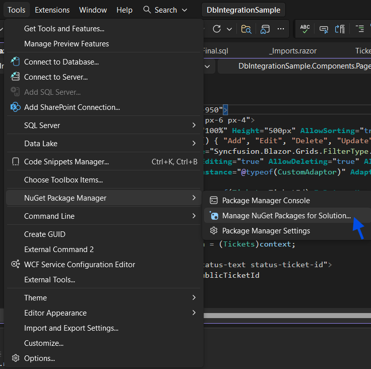
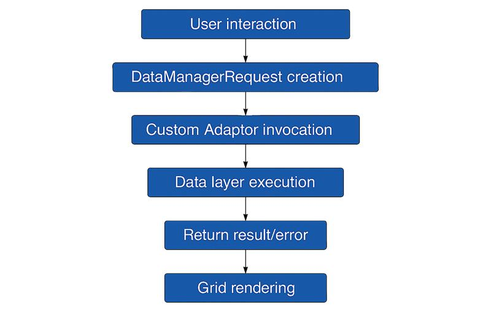

# Connecting Microsoft SQL Server Data to Blazor DataGrid

[Syncfusion<sup style="font-size:70%">&reg;</sup> Blazor DataGrid](https://www.syncfusion.com/blazor-components/blazor-datagrid) seamlessly integrates with Microsoft SQL Server, enabling direct data binding, server-side operations (searching, filtering, sorting, paging, grouping), and full CRUD functionality using raw SQL queries.

Microsoft SQL Server offers enterprise-grade capabilities for building scalable, secure data-driven applications with Blazor. Integrating SQL Server directly with Syncfusion DataGrid provides significant advantages:

- Performance optimization: Process large datasets server-side before transmitting filtered, sorted, and paginated results to the client, reducing bandwidth and improving response times.
- Direct SQL execution: Use raw SQL queries with SqlClient for precise database control without ORM abstraction layers, enabling transparent query debugging and optimization.
- Enterprise security: Leverage SQL Server's built-in encryption, role-based access control, and authentication mechanisms to protect sensitive ticket data.
- Scalability: Handle growing data volumes efficiently through server-side filtering, aggregation, and pagination operations.
- CRUD integration: Enable users to create, read, update, and delete records directly from the DataGrid UI with automatic database synchronization.
- Server-side operations: Implement searching, filtering, sorting, grouping, and aggregation on the database server, reducing client-side processing overhead.

## Prerequisites

Ensure the following software and packages are installed before proceeding:

| Software/Package | Version | Purpose |
|-----------------|---------|---------|
| Visual Studio 2022 | 17.0 or later | Development IDE with Blazor workload |
| .NET SDK | net8.0 or compatible | Runtime and build tools |
| Microsoft SQL Server | 2019 or later (Express supported) | Database server |
| SQL Server Management Studio (SSMS) | Latest | Database administration tool |
| Syncfusion.Blazor | 28.1.33 or later | DataGrid and UI components |
| Microsoft.Data.SqlClient | 5.2.0 or later | SQL Server data provider |

---

## SQL setup environment

### Step 1: Create database and table in SQL Server

The **Network Support Ticket System** scenario demonstrates binding the Syncfusion Blazor DataGrid to a Microsoft SQL Server database using real ticket records and server‑side operations. The "NetworkSupportDB" database and its "Tickets" table store the ticket data required for performing CRUD operations, enabling grid-driven querying, editing, paging, and aggregation.

Open SQL Server Management Studio (SSMS) and execute the following script to create the database and "Tickets" table:

```sql
-- Create Database
CREATE DATABASE NetworkSupportDB;
GO

USE NetworkSupportDB;
GO

-- Create Tickets Table
CREATE TABLE dbo.Tickets (
    TicketId INT IDENTITY(1,1) PRIMARY KEY,
    PublicTicketId NVARCHAR(50) NOT NULL,
    Title NVARCHAR(200) NOT NULL,
    Description NVARCHAR(MAX),
    Category NVARCHAR(100),
    Department NVARCHAR(100),
    Assignee NVARCHAR(100),
    CreatedBy NVARCHAR(100),
    Status NVARCHAR(50) DEFAULT 'Open',
    Priority NVARCHAR(50) DEFAULT 'Medium',
    ResponseDue DATETIME NULL,
    DueDate DATETIME NULL,
    CreatedAt DATETIME DEFAULT GETDATE(),
    UpdatedAt DATETIME DEFAULT GETDATE()
);
GO

-- Insert Sample Data (Optional)
INSERT INTO dbo.Tickets (PublicTicketId, Title, Description, Category, Department, Assignee, CreatedBy, Status, Priority, ResponseDue, DueDate)
VALUES 
('NET-1001', 'Network Connectivity Issue', 'Unable to connect to internal network', 'Network', 'IT Support', 'John Doe', 'Jane Smith', 'Open', 'High', DATEADD(DAY, 1, GETDATE()), DATEADD(DAY, 3, GETDATE())),
('NET-1002', 'Email Configuration', 'Outlook not syncing emails', 'Email', 'IT Support', 'Mike Johnson', 'Bob Wilson', 'In Progress', 'Medium', DATEADD(DAY, 2, GETDATE()), DATEADD(DAY, 5, GETDATE())),
('NET-1003', 'VPN Access Request', 'Need VPN access for remote work', 'Access', 'Security', 'Sarah Davis', 'Tom Brown', 'Resolved', 'Low', DATEADD(DAY, 3, GETDATE()), DATEADD(DAY, 7, GETDATE()));
GO
```

With the database and Tickets table provisioned, continue by installing the NuGet packages required for Syncfusion Blazor components and SQL Server connectivity.
These dependencies will be referenced by the grid adaptor and data access layer in the following steps.

### Step 2: Install NuGet packages

Syncfusion.Blazor provides the DataGrid and related UI services, while Microsoft.Data.SqlClient enables secure, efficient connectivity to SQL Server with raw query support.

Open **Visual Studio**, navigate to the **Package Manager Console**, and install the necessary package:

```powershell
Install-Package Microsoft.Data.SqlClient -Version 5.2.0
```

Alternatively, use NuGet Package Manager UI:
1. Navigate to **Tools** → **NuGet Package Manager** → **Manage NuGet Packages for Solution**
2. Search for and install **Syncfusion.Blazor** (latest stable version)
3. Search for and install **Microsoft.Data.SqlClient** (version 5.2.0 or later)



Package installation has been completed. Continue with defining the data model aligned with the Tickets schema to ensure strong typing and reliable DataGrid binding.

### Step 3: Define the data model

A strongly typed model establishes a clear contract between the database schema and the grid, enabling compile-time validation and predictable serialization. Aligning properties with SQL column data types ensures accurate binding, editing, and server-side processing.

Create a new folder **Data**, inside the folder create a new file **Tickets.cs** to design a model class representing the Tickets table structure:

```csharp
public class Tickets
{
    public int TicketId { get; set; }
    public string PublicTicketId { get; set; }
    public string Title { get; set; }
    public string Description { get; set; }
    public string Category { get; set; }
    public string Department { get; set; }
    public string Assignee { get; set; }
    public string CreatedBy { get; set; }
    public string Status { get; set; }
    public string Priority { get; set; }
    public DateTime? ResponseDue { get; set; }
    public DateTime? DueDate { get; set; }
    public DateTime CreatedAt { get; set; }
    public DateTime UpdatedAt { get; set; }
}
```

Model definition has been completed. Proceed to configure the connection string to enable database connectivity.

### Step 4: Configure data access (TicketData.cs)

Define the SQL Server connection string and implement the data retrieval method by creating a new folder **Data** and inside the folder create a new file **TicketData.cs** to establish reliable connectivity and server-side data access. The implementation uses "SqlConnection", "SqlCommand", and "SqlDataAdapter" to execute a SELECT statement and materialize results into the strongly typed "Tickets" model.

```csharp
using Microsoft.Data.SqlClient;
using System.Data;

public class TicketData
{
    private string connectionString = "Data Source=YOUR_SERVER;Initial Catalog=YOUR_DATABASE;Integrated Security=True;Connect Timeout=30;Encrypt=False;";

    public async Task<List<Tickets>> GetTicketsData()
    {
        string queryString = "SELECT * FROM dbo.Tickets ORDER BY TicketId";

        using (SqlConnection sqlConnection = new SqlConnection(connectionString))
        {
            sqlConnection.Open();

            using (SqlCommand sqlCommand = new SqlCommand(queryString, sqlConnection))
            {
                using (SqlDataAdapter sqlDataAdapter = new SqlDataAdapter(sqlCommand))
                {
                    DataTable dataTable = new DataTable();
                    sqlDataAdapter.Fill(dataTable);

                    var dataSource = (from DataRow row in dataTable.Rows
                                      select new Tickets()
                                      {
                                          TicketId = Convert.ToInt32(row["TicketId"]),
                                          PublicTicketId = row["PublicTicketId"].ToString(),
                                          Title = row["Title"].ToString(),
                                          Description = row["Description"].ToString(),
                                          Category = row["Category"].ToString(),
                                          Department = row["Department"].ToString(),
                                          Assignee = row["Assignee"].ToString(),
                                          CreatedBy = row["CreatedBy"].ToString(),
                                          Status = row["Status"].ToString(),
                                          Priority = row["Priority"].ToString(),
                                          ResponseDue = row["ResponseDue"] == DBNull.Value ? (DateTime?)null : Convert.ToDateTime(row["ResponseDue"]),
                                          DueDate = row["DueDate"] == DBNull.Value ? (DateTime?)null : Convert.ToDateTime(row["DueDate"]),
                                          CreatedAt = Convert.ToDateTime(row["CreatedAt"]),
                                          UpdatedAt = Convert.ToDateTime(row["UpdatedAt"])
                                      }).ToList();

                    return dataSource;
                }
            }
        }
    }
}
```

Connection string parameters:
- Data Source: SQL Server instance name (e.g., localhost\SQLEXPRESS, DESKTOP-ABC123, 192.168.1.100)
- Initial Catalog: Target database name (e.g., NetworkSupportDB)
- Integrated Security: Windows Authentication option
- Connect Timeout: Connection timeout in seconds
- Encrypt: SSL encryption toggle (enable for production)

Key implementation details:
- "SqlConnection" establishes and manages the session to SQL Server so the query can be executed against the target database.
- "SqlCommand" encapsulates the SELECT statement and binds it to the open connection to request the desired result set.
- "SqlDataAdapter" bridges the command execution and in-memory structures, enabling retrieval into a DataTable without manual data readers.
- "SqlDataAdapter.Fill" hydrates a DataTable; LINQ projection maps rows to the "Tickets" model.
- Nullable DateTime fields are handled via "DBNull.Value" checks.
- The method returns "List<Tickets>" for consistent binding in the custom adaptor and DataGrid.

Data access configuration has been completed. Proceed to register Syncfusion Blazor services.

## Integrate Syncfusion Blazor DataGrid

### Step 1: Install NuGet packages and register Syncfusion services

Open **Visual Studio**, navigate to the **Package Manager Console**, and install the necessary package:

```powershell
Install-Package Syncfusion.Blazor -Version 28.1.33 ;
```

Registers the Syncfusion component services required by the DataGrid at runtime and exposes grid APIs via dependency injection.

Configure Syncfusion services in **Program.cs**:

```csharp
using Syncfusion.Blazor;

var builder = WebApplication.CreateBuilder(args);

// Register Syncfusion Blazor services
builder.Services.AddSyncfusionBlazor();

```

**Import Namespaces**

Open the **_Imports.razor** file and add required namespaces.

```csharp
@using Syncfusion.Blazor
@using Syncfusion.Blazor.Grids
@using Syncfusion.Blazor.Data
```

**Add stylesheet and script resources**

Add Syncfusion styles and scripts in **Components/App.razor**. The theme stylesheet and script files are provided through [Static Web Assets](https://blazor.syncfusion.com/documentation/appearance/themes#static-web-asset) in the NuGet packages.

```html
<head>
    ....
    <!-- Syncfusion Blazor CSS -->
    <link href="_content/Syncfusion.Blazor/styles/tailwind3.css" rel="stylesheet" />
    <!-- Syncfusion Blazor Scripts -->
    <script src="_content/Syncfusion.Blazor/scripts/syncfusion-blazor.min.js" type="text/javascript"></script>
</head>
```

**Add Syncfusion Blazor DataGrid component**

Create new **Home.razor** file and add the Syncfusion<sup style="font-size:70%">&reg;</sup> Blazor DataGrid component. The DataGrid automatically generates columns when no explicit column definitions are provided. For greater control over column behavior and appearance, use [GridColumn](https://help.syncfusion.com/cr/blazor/Syncfusion.Blazor.Grids.GridColumn.html) to specify each column and configure properties such as [Field](https://help.syncfusion.com/cr/blazor/Syncfusion.Blazor.Grids.GridColumn.html#Syncfusion_Blazor_Grids_GridColumn_Field), [HeaderText](https://help.syncfusion.com/cr/blazor/Syncfusion.Blazor.Grids.GridColumn.html#Syncfusion_Blazor_Grids_GridColumn_HeaderText) and [Width](https://help.syncfusion.com/cr/blazor/Syncfusion.Blazor.Grids.GridColumn.html#Syncfusion_Blazor_Grids_GridColumn_Width). This approach provides full control over column behavior and appearance.

```html
<SfGrid TValue="Tickets">
    <GridColumns>
        <GridColumn Field=@nameof(Tickets.TicketId) IsPrimaryKey="true" IsIdentity="true"></GridColumn>
        <GridColumn Field=@nameof(Tickets.PublicTicketId) IsIdentity="true" HeaderText="Ticket ID" Width="160" TextAlign="TextAlign.Right"></GridColumn>
        <GridColumn Field=@nameof(Tickets.Title) HeaderText="Subject" Width="280"></GridColumn>
        <!-- Add Required Additional Columns -->
    </GridColumns>
</SfGrid>
```
> * Set [IsPrimaryKey](https://help.syncfusion.com/cr/blazor/Syncfusion.Blazor.Grids.GridColumn.html#Syncfusion_Blazor_Grids_GridColumn_IsPrimaryKey) to "true" for a column that contains unique values.
> * If the database includes an **auto-generated column**, set [IsIdentity](https://help.syncfusion.com/cr/blazor/Syncfusion.Blazor.Grids.GridColumn.html#Syncfusion_Blazor_Grids_GridColumn_IsIdentity) for that column to disable editing during **add** or **update** operations.

Service registration and namespace imports have been completed. Continue with configuring DataGrid–SQL Server integration using the Custom Adaptor.

### Step 2: Bind data from Microsoft SQL Server using Custom Adaptor

The Syncfusion<sup style="font-size:70%">&reg;</sup> Blazor DataGrid can bind data from a **Microsoft SQL Server** database using [DataManager](https://help.syncfusion.com/cr/blazor/Syncfusion.Blazor.Data.SfDataManager.html) and set the [Adaptor](https://help.syncfusion.com/cr/blazor/Syncfusion.Blazor.Adaptors.html) property to [Custom Adaptor](https://blazor.syncfusion.com/documentation/datagrid/connecting-to-adaptors/custom-adaptor) for scenarios that require full control over data operations.
The Custom Adaptor serves as the bridge between DataGrid UI interactions and SQL Server database operations. When users interact with the grid (search, filter, sort, page), the adaptor intercepts these requests and executes corresponding SQL operations.

**Implement custom adaptor**

Create a Custom Adaptor class in **Components/Pages/Home.razor** that bridges DataGrid actions with SQL Server operations:

```csharp
@code {
    public class CustomAdaptor : DataAdaptor
    {
        public TicketData TicketService = new TicketData();

        /// <summary>
        /// ReadAsync - Retrieves records from SQL Server and applies data operations
        /// Executes on grid initialization and when user performs search, filter, sort, page operations
        /// </summary>
        public override async Task<object> ReadAsync(DataManagerRequest dataManagerRequest, string Key = null)
        {
            // Fetch all records from SQL Server via data layer
            IEnumerable<Tickets> dataSource = await TicketService.GetTicketsData();

            // Apply data operations (search, filter, sort, aggregate, paging, grouping) as requested
            // Detailed implementations for each operation follow in subsequent sections
            
            // Calculate total record count for pagination metadata
            int totalRecordsCount = dataSource.Count();
            
            // Return DataResult containing filtered/sorted records and total count
            return dataManagerRequest.RequiresCounts 
                ? new DataResult() { Result = dataSource, Count = totalRecordsCount } 
                : (object)dataSource;
        }
    }
}
```

**Custom Adaptor methods reference**:
- [ReadAsync(DataManagerRequest)](https://help.syncfusion.com/cr/blazor/Syncfusion.Blazor.DataAdaptor.html#Syncfusion_Blazor_DataAdaptor_ReadAsync_Syncfusion_Blazor_DataManagerRequest_System_String_) - Retrieve and process records (search, filter, sort, page, group)
- [InsertAsync(DataManager, object)](https://help.syncfusion.com/cr/blazor/Syncfusion.Blazor.DataAdaptor.html#Syncfusion_Blazor_DataAdaptor_InsertAsync_Syncfusion_Blazor_DataManager_System_Object_System_String_) - Create new records in SQL Server
- [UpdateAsync(DataManager, object, string, string)](https://help.syncfusion.com/cr/blazor/Syncfusion.Blazor.DataAdaptor.html#Syncfusion_Blazor_DataAdaptor_UpdateAsync_Syncfusion_Blazor_DataManager_System_Object_System_String_System_String_) - Edit existing records in SQL Server
- [RemoveAsync(DataManager, object, string, string)](https://help.syncfusion.com/cr/blazor/Syncfusion.Blazor.DataAdaptor.html#Syncfusion_Blazor_DataAdaptor_RemoveAsync_Syncfusion_Blazor_DataManager_System_Object_System_String_System_String_) - Delete records from SQL Server
- [BatchUpdateAsync(DataManager, object, object, object, string, string, int?)](https://help.syncfusion.com/cr/blazor/Syncfusion.Blazor.DataAdaptor.html#Syncfusion_Blazor_DataAdaptor_BatchUpdateAsync_Syncfusion_Blazor_DataManager_System_Object_System_Object_System_Object_System_String_System_String_System_Nullable_System_Int32__) - Handle bulk operations

Bind the created adaptor to the DataGrid markup in **Home.razor**.

```html
<SfGrid TValue="Tickets">
    <SfDataManager AdaptorInstance="@typeof(CustomAdaptor)" Adaptor="Adaptors.CustomAdaptor"></SfDataManager>
</SfGrid>
```

**Data flow architecture**:



The Custom Adaptor implementation centralizes all database logic, enabling consistent SQL execution, error handling, and performance optimization across all grid operations.

### Perform data operations

Server-side data operations optimize performance by processing data before transmission to the client. Each operation in the Custom Adaptor's `ReadAsync` method handles specific grid functionality. The Syncfusion<sup style="font-size:70%">&reg;</sup> Blazor DataGrid sends operation details to the API through a [DataManagerRequest](https://help.syncfusion.com/cr/blazor/Syncfusion.Blazor.DataManagerRequest.html) object. These details can be applied to the data source using methods from the [DataOperations](https://help.syncfusion.com/cr/blazor/Syncfusion.Blazor.DataOperations.html) class.

**Common Methods in DataOperations**

* [PerformSearching](https://help.syncfusion.com/cr/blazor/Syncfusion.Blazor.DataOperations.html#Syncfusion_Blazor_DataOperations_PerformSearching__1_System_Linq_IQueryable___0__System_Collections_Generic_List_Syncfusion_Blazor_Data_SearchFilter__) - Applies search criteria to the collection.
* [PerformFiltering](https://help.syncfusion.com/cr/blazor/Syncfusion.Blazor.DataOperations.html#Syncfusion_Blazor_DataOperations_PerformFiltering__1_System_Linq_IQueryable___0__System_Collections_Generic_List_Syncfusion_Blazor_Data_WhereFilter__System_String_) - Filters data based on conditions.
* [PerformSorting](https://help.syncfusion.com/cr/blazor/Syncfusion.Blazor.DataOperations.html#Syncfusion_Blazor_DataOperations_PerformSorting__1_System_Linq_IQueryable___0__System_Collections_Generic_List_Syncfusion_Blazor_Data_Sort__) - Sorts data by one or more fields.
* [PerformSkip](https://help.syncfusion.com/cr/blazor/Syncfusion.Blazor.DataOperations.html#Syncfusion_Blazor_DataOperations_PerformSkip__1_System_Linq_IQueryable___0__System_Int32_) - Skips a defined number of records for paging.
* [PerformTake](https://help.syncfusion.com/cr/blazor/Syncfusion.Blazor.DataOperations.html#Syncfusion_Blazor_DataOperations_PerformTake__1_System_Linq_IQueryable___0__System_Int32_) - Retrieves a specified number of records for paging.
* [PerformAggregation](https://help.syncfusion.com/cr/blazor/Syncfusion.Blazor.Data.DataUtil.html#Syncfusion_Blazor_Data_DataUtil_PerformAggregation_System_Collections_IEnumerable_System_Collections_Generic_List_Syncfusion_Blazor_Data_Aggregate__) – Calculates aggregate values such as Sum, Average, Min, and Max.

---

**Searching**

Enables keyword-based query across configured fields, allowing the grid to delegate search criteria to the adaptor for efficient server-side filtering. The built-in `PerformSearching` method of the `DataOperations` class applies search criteria from the `DataManagerRequest` to the data source.

```csharp
public class CustomAdaptor : DataAdaptor
{
    public TicketData TicketService = new TicketData();
    public override async Task<object> ReadAsync(DataManagerRequest dataManagerRequest, string Key = null)
    {
        IEnumerable<Tickets> dataSource = await TicketService.GetTicketsData();
        
        // Searching
        if (dataManagerRequest.Search != null && dataManagerRequest.Search.Count > 0)
        {
            dataSource = DataOperations.PerformSearching(dataSource, dataManagerRequest.Search);
        }

        int totalRecordsCount = dataSource.Cast<Tickets>().Count();
        return dataManagerRequest.RequiresCounts 
            ? new DataResult() { Result = dataSource, Count = totalRecordsCount } 
            : (object)dataSource;
    }
}
```

To enable searching add the Search item to the toolbar using the [Toolbar](https://help.syncfusion.com/cr/blazor/Syncfusion.Blazor.Grids.SfGrid-1.html#Syncfusion_Blazor_Grids_SfGrid_1_Toolbar) property in the DataGrid markup.

```html
<SfGrid TValue="Tickets" Toolbar="@(new List<string>() { "Search" })">
    <SfDataManager AdaptorInstance="@typeof(CustomAdaptor)" Adaptor="Adaptors.CustomAdaptor"></SfDataManager>
    <GridColumns>
        <!-- Grid columns -->
    </GridColumns>
</SfGrid>
```

---

**Filtering**

Provides column-level criteria evaluation so the adaptor can restrict datasets at the source for precise, efficient retrieval. The built-in `PerformFiltering` method in the `DataOperations` class applies filter criteria from the `DataManagerRequest` to the data collection.

```csharp
public class CustomAdaptor : DataAdaptor
{
    public TicketData TicketService = new TicketData();
    public override async Task<object> ReadAsync(DataManagerRequest dataManagerRequest, string Key = null)
    {
        IEnumerable<Tickets> dataSource = await TicketService.GetTicketsData();
        
        // Searching
        if (dataManagerRequest.Search != null && dataManagerRequest.Search.Count > 0)
        {
            dataSource = DataOperations.PerformSearching(dataSource, dataManagerRequest.Search);
        }

        // Filtering
        if (dataManagerRequest.Where != null && dataManagerRequest.Where.Count > 0)
        {
            dataSource = DataOperations.PerformFiltering(dataSource, dataManagerRequest.Where, dataManagerRequest.Where[0].Operator);
        }

        int totalRecordsCount = dataSource.Cast<Tickets>().Count();
        return dataManagerRequest.RequiresCounts 
            ? new DataResult() { Result = dataSource, Count = totalRecordsCount } 
            : (object)dataSource;
    }
}
```

To enable filtering in the DataGrid markup, set the [AllowFiltering](https://help.syncfusion.com/cr/blazor/Syncfusion.Blazor.Grids.SfGrid-1.html#Syncfusion_Blazor_Grids_SfGrid_1_AllowFiltering) property to "true". Configure filtering behavior and appearance using the [GridFilterSettings](https://help.syncfusion.com/cr/blazor/Syncfusion.Blazor.Grids.SfGrid-1.html#Syncfusion_Blazor_Grids_SfGrid_1_FilterSettings) property.

```html
<SfGrid TValue="Tickets" AllowFiltering="true" Toolbar="@(new List<string>() { "Search" })">
    <GridFilterSettings Type="FilterType.Menu"></GridFilterSettings>
    <SfDataManager AdaptorInstance="@typeof(CustomAdaptor)" Adaptor="Adaptors.CustomAdaptor"></SfDataManager>
    <GridColumns>
        <!-- Grid columns -->
    </GridColumns>
</SfGrid>
```

---

**Sorting**

Enables deterministic record ordering by delegating sort descriptors to the adaptor for database-optimized sorting. The built-in `PerformSorting` method in the `DataOperations` class applies sort criteria from the `DataManagerRequest` to the data collection.

```csharp
public class CustomAdaptor : DataAdaptor
{
    public TicketData TicketService = new TicketData();
    public override async Task<object> ReadAsync(DataManagerRequest dataManagerRequest, string Key = null)
    {
        IEnumerable<Tickets> dataSource = await TicketService.GetTicketsData();
        
        // Searching
        if (dataManagerRequest.Search != null && dataManagerRequest.Search.Count > 0)
        {
            dataSource = DataOperations.PerformSearching(dataSource, dataManagerRequest.Search);
        }

        // Filtering
        if (dataManagerRequest.Where != null && dataManagerRequest.Where.Count > 0)
        {
            dataSource = DataOperations.PerformFiltering(dataSource, dataManagerRequest.Where, dataManagerRequest.Where[0].Operator);
        }

        // Sorting
        if (dataManagerRequest.Sorted != null && dataManagerRequest.Sorted.Count > 0)
        {
            dataSource = DataOperations.PerformSorting(dataSource, dataManagerRequest.Sorted);
        }

        int totalRecordsCount = dataSource.Cast<Tickets>().Count();
        return dataManagerRequest.RequiresCounts 
            ? new DataResult() { Result = dataSource, Count = totalRecordsCount } 
            : (object)dataSource;
    }
}
```
To enable sorting in the DataGrid markup, set the [AllowSorting](https://help.syncfusion.com/cr/blazor/Syncfusion.Blazor.Grids.SfGrid-1.html#Syncfusion_Blazor_Grids_SfGrid_1_AllowSorting) property to "true". Configure initial sorting by setting the [Field](https://help.syncfusion.com/cr/blazor/Syncfusion.Blazor.Grids.GridSortColumn.html#Syncfusion_Blazor_Grids_GridSortColumn_Field) (the column's data field name) and [Direction](https://help.syncfusion.com/cr/blazor/Syncfusion.Blazor.Grids.GridSortColumn.html#Syncfusion_Blazor_Grids_GridSortColumn_Direction) properties  in the [Columns](https://help.syncfusion.com/cr/blazor/Syncfusion.Blazor.Grids.GridSortSettings.html#Syncfusion_Blazor_Grids_GridSortSettings_Columns) collection of [GridSortSettings](https://help.syncfusion.com/cr/blazor/Syncfusion.Blazor.Grids.GridSortSettings.html).

```html
<SfGrid TValue="Tickets" AllowSorting="true" AllowFiltering="true" Toolbar="@(new List<string>() { "Search" })">
    <GridFilterSettings Type="FilterType.Menu"></GridFilterSettings>
    <GridSortSettings>
        <GridSortColumns>
            <GridSortColumn Field="Priority" Direction="SortDirection.Ascending"></GridSortColumn>
        </GridSortColumns>
    </GridSortSettings>
    <SfDataManager AdaptorInstance="@typeof(CustomAdaptor)" Adaptor="Adaptors.CustomAdaptor"></SfDataManager>
    <GridColumns>
        <!-- Grid columns -->
    </GridColumns>
</SfGrid>
```

---

**Aggregation**

Aggregate functions compute summary statistics across datasets without requiring row-level retrieval, enabling efficient calculation of totals, averages, and counts at the database server level. The built-in `PerformAggregation` method in the [DataUtil](https://help.syncfusion.com/cr/blazor/Syncfusion.Blazor.Data.DataUtil.html) class calculates aggregate values based on the criteria specified in the `DataManagerRequest`.

```csharp
public class CustomAdaptor : DataAdaptor
{
    public TicketData TicketService = new TicketData();
    public override async Task<object> ReadAsync(DataManagerRequest dataManagerRequest, string Key = null)
    {
        IEnumerable<Tickets> dataSource = await TicketService.GetTicketsData();
        
        // Searching
        if (dataManagerRequest.Search != null && dataManagerRequest.Search.Count > 0)
        {
            dataSource = DataOperations.PerformSearching(dataSource, dataManagerRequest.Search);
        }

        // Filtering
        if (dataManagerRequest.Where != null && dataManagerRequest.Where.Count > 0)
        {
            dataSource = DataOperations.PerformFiltering(dataSource, dataManagerRequest.Where, dataManagerRequest.Where[0].Operator);
        }

        // Sorting
        if (dataManagerRequest.Sorted != null && dataManagerRequest.Sorted.Count > 0)
        {
            dataSource = DataOperations.PerformSorting(dataSource, dataManagerRequest.Sorted);
        }

        // Aggregates
        IDictionary<string, object>? aggregates = null;
        if (dataManagerRequest.Aggregates != null && dataManagerRequest.Aggregates.Count > 0)
        {
            aggregates = DataUtil.PerformAggregation(dataSource, dataManagerRequest.Aggregates);
        }

        int totalRecordsCount = dataSource.Cast<Tickets>().Count();
        return dataManagerRequest.RequiresCounts 
            ? new DataResult() { Result = dataSource, Count = totalRecordsCount, Aggregates = aggregates } 
            : (object)dataSource;
    }
}
```

Enable aggregates by including [GridAggregateColumn](https://help.syncfusion.com/cr/blazor/Syncfusion.Blazor.Grids.GridAggregateColumn.html) component in DataGrid markup, for each aggregate column, specify at least the [Field](https://help.syncfusion.com/cr/blazor/Syncfusion.Blazor.Grids.GridAggregateColumn.html#Syncfusion_Blazor_Grids_GridAggregateColumn_Field) and [Type](https://help.syncfusion.com/cr/blazor/Syncfusion.Blazor.Grids.GridAggregateColumn.html#Syncfusion_Blazor_Grids_GridAggregateColumn_Type) properties.

```html
<SfGrid TValue="Tickets" AllowSorting="true" AllowFiltering="true" Toolbar="@(new List<string>() { "Search" })">
    <GridFilterSettings Type="FilterType.Menu"></GridFilterSettings>
    <GridSortSettings>
        <GridSortColumns>
            <GridSortColumn Field="Priority" Direction="SortDirection.Ascending"></GridSortColumn>
        </GridSortColumns>
    </GridSortSettings>
    <SfDataManager AdaptorInstance="@typeof(CustomAdaptor)" Adaptor="Adaptors.CustomAdaptor"></SfDataManager>
    <GridAggregates>
        <GridAggregate>
            <GridAggregateColumns>
                <GridAggregateColumn Field="TicketId" Type="AggregateType.Count"></GridAggregateColumn>
            </GridAggregateColumns>
        </GridAggregate>
    </GridAggregates>
    <GridColumns>
        <!-- Grid columns -->
    </GridColumns>
</SfGrid>
```

---

**Paging**

Paging divides large result sets into fixed-size pages, reducing memory consumption and improving client-side responsiveness by retrieving only the requested page from the server.The built-in `PerformSkip`, `PerformTake` methods in the `DataOperations` class apply paging criteria from the `DataManagerRequest` to the data collection.

```csharp
public class CustomAdaptor : DataAdaptor
{
    public TicketData TicketService = new TicketData();
    public override async Task<object> ReadAsync(DataManagerRequest dataManagerRequest, string Key = null)
    {
        IEnumerable<Tickets> dataSource = await TicketService.GetTicketsData();
        
        // Searching
        if (dataManagerRequest.Search != null && dataManagerRequest.Search.Count > 0)
        {
            dataSource = DataOperations.PerformSearching(dataSource, dataManagerRequest.Search);
        }

        // Filtering
        if (dataManagerRequest.Where != null && dataManagerRequest.Where.Count > 0)
        {
            dataSource = DataOperations.PerformFiltering(dataSource, dataManagerRequest.Where, dataManagerRequest.Where[0].Operator);
        }

        // Sorting
        if (dataManagerRequest.Sorted != null && dataManagerRequest.Sorted.Count > 0)
        {
            dataSource = DataOperations.PerformSorting(dataSource, dataManagerRequest.Sorted);
        }

        // Aggregates
        IDictionary<string, object>? aggregates = null;
        if (dataManagerRequest.Aggregates != null && dataManagerRequest.Aggregates.Count > 0)
        {
            aggregates = DataUtil.PerformAggregation(dataSource, dataManagerRequest.Aggregates);
        }

        int totalRecordsCount = dataSource.Cast<Tickets>().Count();
        
        // Paging
        if (dataManagerRequest.Skip != 0)
        {
            dataSource = DataOperations.PerformSkip(dataSource, dataManagerRequest.Skip);
        }
        if (dataManagerRequest.Take != 0)
        {
            dataSource = DataOperations.PerformTake(dataSource, dataManagerRequest.Take);
        }

        return dataManagerRequest.RequiresCounts 
            ? new DataResult() { Result = dataSource, Count = totalRecordsCount, Aggregates = aggregates } 
            : (object)dataSource;
    }
}
```

To enable paging in the DataGrid markup, set the [AllowPaging](https://help.syncfusion.com/cr/blazor/Syncfusion.Blazor.Grids.SfGrid-1.html#Syncfusion_Blazor_Grids_SfGrid_1_AllowPaging) property to "true". Paging options can be configured through the [GridPageSettings](https://help.syncfusion.com/cr/blazor/Syncfusion.Blazor.Grids.SfGrid-1.html#Syncfusion_Blazor_Grids_SfGrid_1_PageSettings) component. GridPageSettings allows control of page size, current page, and total record count.

```html
<SfGrid TValue="Tickets" AllowPaging="true" AllowSorting="true" AllowFiltering="true" Toolbar="@(new List<string>() { "Search" })">
    <GridFilterSettings Type="FilterType.Menu"></GridFilterSettings>
    <GridSortSettings>
        <GridSortColumns>
            <GridSortColumn Field="Priority" Direction="SortDirection.Ascending"></GridSortColumn>
        </GridSortColumns>
    </GridSortSettings>
    <GridPageSettings PageSize="10"></GridPageSettings>
    <SfDataManager AdaptorInstance="@typeof(CustomAdaptor)" Adaptor="Adaptors.CustomAdaptor"></SfDataManager>
    <GridAggregates>
        <GridAggregate>
            <GridAggregateColumns>
                <GridAggregateColumn Field="TicketId" Type="AggregateType.Count"></GridAggregateColumn>
            </GridAggregateColumns>
        </GridAggregate>
    </GridAggregates>
    <GridColumns>
        <!-- Grid columns -->
    </GridColumns>
</SfGrid>
```

---

**Grouping**

Grouping hierarchically organizes records by specified column values, enabling data summarization and nested record visualization while reducing query complexity through server-side grouping operations.The built-in `Group` method in the `DataUtil` class applies grouping logic based on the configuration in the `DataManagerRequest`.

```csharp
public class CustomAdaptor : DataAdaptor
{
    public TicketData TicketService = new TicketData();
    public override async Task<object> ReadAsync(DataManagerRequest dataManagerRequest, string Key = null)
    {
        IEnumerable<Tickets> dataSource = await TicketService.GetTicketsData();
        
        // Searching
        if (dataManagerRequest.Search != null && dataManagerRequest.Search.Count > 0)
        {
            dataSource = DataOperations.PerformSearching(dataSource, dataManagerRequest.Search);
        }

        // Filtering
        if (dataManagerRequest.Where != null && dataManagerRequest.Where.Count > 0)
        {
            dataSource = DataOperations.PerformFiltering(dataSource, dataManagerRequest.Where, dataManagerRequest.Where[0].Operator);
        }

        // Sorting
        if (dataManagerRequest.Sorted != null && dataManagerRequest.Sorted.Count > 0)
        {
            dataSource = DataOperations.PerformSorting(dataSource, dataManagerRequest.Sorted);
        }

        // Aggregates
        IDictionary<string, object>? aggregates = null;
        if (dataManagerRequest.Aggregates != null && dataManagerRequest.Aggregates.Count > 0)
        {
            aggregates = DataUtil.PerformAggregation(dataSource, dataManagerRequest.Aggregates);
        }

        int totalRecordsCount = dataSource.Cast<Tickets>().Count();
        DataResult dataObject = new DataResult();
        
        // Grouping
        if (dataManagerRequest.Group != null && dataManagerRequest.Group.Count > 0)
        {
            IEnumerable ResultData = dataSource.ToList();
            foreach (var group in dataManagerRequest.Group)
            {
                ResultData = DataUtil.Group<Tickets>(ResultData, group, dataManagerRequest.Aggregates, 0, dataManagerRequest.GroupByFormatter);
            }
            dataObject.Result = ResultData;
            dataObject.Count = totalRecordsCount;
            dataObject.Aggregates = aggregates;
            return dataManagerRequest.RequiresCounts ? dataObject : (object)ResultData;
        }
        
        // Paging
        if (dataManagerRequest.Skip != 0)
        {
            dataSource = DataOperations.PerformSkip(dataSource, dataManagerRequest.Skip);
        }
        if (dataManagerRequest.Take != 0)
        {
            dataSource = DataOperations.PerformTake(dataSource, dataManagerRequest.Take);
        }

        return dataManagerRequest.RequiresCounts 
            ? new DataResult() { Result = dataSource, Count = totalRecordsCount, Aggregates = aggregates } 
            : (object)dataSource;
    }
}
```

To enable grouping in the DataGrid markup, set the [AllowGrouping](https://help.syncfusion.com/cr/blazor/Syncfusion.Blazor.Grids.SfGrid-1.html#Syncfusion_Blazor_Grids_SfGrid_1_AllowGrouping) property to "true". Configure grouping behavior using [GridGroupSettings](https://help.syncfusion.com/cr/blazor/Syncfusion.Blazor.Grids.SfGrid-1.html#Syncfusion_Blazor_Grids_SfGrid_1_GroupSettings).

```html
<SfGrid TValue="Tickets" AllowPaging="true" AllowSorting="true" AllowFiltering="true" AllowGrouping="true" Toolbar="@(new List<string>() { "Search" })">
    <GridFilterSettings Type="FilterType.Menu"></GridFilterSettings>
    <GridSortSettings>
        <GridSortColumns>
            <GridSortColumn Field="Priority" Direction="SortDirection.Ascending"></GridSortColumn>
        </GridSortColumns>
    </GridSortSettings>
    <GridPageSettings PageSize="10"></GridPageSettings>
    <GridGroupSettings Columns="@(new string[] { "Category" })"></GridGroupSettings>
    <SfDataManager AdaptorInstance="@typeof(CustomAdaptor)" Adaptor="Adaptors.CustomAdaptor"></SfDataManager>
    <GridAggregates>
        <GridAggregate>
            <GridAggregateColumns>
                <GridAggregateColumn Field="TicketId" Type="AggregateType.Count"></GridAggregateColumn>
            </GridAggregateColumns>
        </GridAggregate>
    </GridAggregates>
    <GridColumns>
        <!-- Grid columns -->
    </GridColumns>
</SfGrid>
```

---

### Perform CRUD operations

Custom Adaptor methods enable users to create, read, update, and delete records directly from the DataGrid. Each operation calls corresponding data layer methods in TicketData.cs to execute SQL commands.

**Create (Insert) records**

Record insertion enables users to create new tickets directly from the DataGrid interface; the adaptor intercepts the insertion request, applies business logic validation, and persists the new record to the SQL Server database.

In **Home.razor** implement `InsertAsync` to handle new record creation:

```csharp
public class CustomAdaptor : DataAdaptor
{
    public TicketData TicketService = new TicketData();
    public override async Task<object> InsertAsync(DataManager dataManager, object value, string key)
    {
        // Extract new record data from grid
        Tickets newTicket = value as Tickets;
        
        // Call data layer method to insert into SQL Server
        await TicketService.AddTicketAsync(newTicket);
        
        // Return inserted record for grid UI update
        return value;
    }
}
```

In **Data/TicketData.cs**, implement the insert method:

```csharp
public async Task AddTicketAsync(Tickets ticket)
{
    string query = $@"INSERT INTO dbo.Tickets 
        (PublicTicketId, Title, Description, Category, Department, Assignee, CreatedBy, Status, Priority, ResponseDue, DueDate, CreatedAt, UpdatedAt)
        VALUES 
        ('{ticket.PublicTicketId}', '{ticket.Title}', '{ticket.Description}', '{ticket.Category}', 
         '{ticket.Department}', '{ticket.Assignee}', '{ticket.CreatedBy}', '{ticket.Status}', '{ticket.Priority}',
         '{ticket.ResponseDue}', '{ticket.DueDate}', '{DateTime.Now}', '{DateTime.Now}')";

    using (SqlConnection connection = new SqlConnection(connectionString))
    {
        connection.Open();
        using (SqlCommand command = new SqlCommand(query, connection))
        {
            await command.ExecuteNonQueryAsync();
        }
    }
}
```

Now the new ticket is persisted to the database and reflected in the grid.

**Read (Retrieve) records**

Record retrieval executes SQL queries against the database and materializes results into the strongly typed Tickets model; the adaptor processes data operations (search, filter, sort, aggregate, page, group) before returning the result set to the grid for display.

The `ReadAsync` method is implemented in [Step 02](#step-2-bind-data-from-microsoft-sql-server-using-custom-adaptor), retrieving and processing records from SQL Server which returns either the IEnumerable result or a `DataResult` object with `Result` and `Count`.

Now the grid displays SQL Server data with full support for searching, filtering, sorting, paging, grouping, and aggregation.

**Update (Edit) records**

Record modification enables users to edit ticket attributes directly within the DataGrid; the adaptor captures the edited row, validates changes, and synchronizes modifications to the SQL Server database while maintaining data integrity.

Implement `UpdateAsync` to handle record modifications:

```csharp
public class CustomAdaptor : DataAdaptor
{
    public TicketData TicketService = new TicketData();
    public override async Task<object> UpdateAsync(DataManager dataManager, object value, string keyField, string key)
    {
        // Extract modified record data from grid
        Tickets updatedTicket = value as Tickets;
        
        // Call data layer method to update in SQL Server
        await TicketService.UpdateTicketAsync(updatedTicket);
        
        // Return updated record for grid UI update
        return value;
    }
}
```

In **Data/TicketData.cs**, implement the update method:

```csharp
public async Task UpdateTicketAsync(Tickets ticket)
{
    string query = $@"UPDATE dbo.Tickets 
        SET Title='{ticket.Title}', Description='{ticket.Description}', Category='{ticket.Category}',
            Department='{ticket.Department}', Assignee='{ticket.Assignee}', Status='{ticket.Status}',
            Priority='{ticket.Priority}', ResponseDue='{ticket.ResponseDue}', DueDate='{ticket.DueDate}',
            UpdatedAt='{DateTime.Now}'
        WHERE TicketId={ticket.TicketId}";

    using (SqlConnection connection = new SqlConnection(connectionString))
    {
        connection.Open();
        using (SqlCommand command = new SqlCommand(query, connection))
        {
            await command.ExecuteNonQueryAsync();
        }
    }
}
```

Now the modifications are synchronized to the database and reflected in the grid UI.

**Delete (Remove) records**

Record deletion enables users to remove tickets directly from the DataGrid; the adaptor intercepts the deletion request, executes corresponding SQL DELETE statements, and removes the record from both the database and grid display.

In **Home.razor** implement `RemoveAsync` to handle record deletion:

```csharp
public class CustomAdaptor : DataAdaptor
{
    public TicketData TicketService = new TicketData();
    public override async Task<object> RemoveAsync(DataManager dataManager, object value, string keyField, string key)
    {
        // Extract record to delete (or use key parameter for primary key value)
        Tickets ticketToDelete = value as Tickets;
        
        // Call data layer method to delete from SQL Server
        await TicketService.RemoveTicketAsync(ticketToDelete.TicketId);
        
        // Return deleted record
        return value;
    }
}
```

Now the tickets are removed from the database and the grid UI reflects the changes immediately.

In **Data/TicketData.cs**, implement the delete method:

```csharp
public async Task RemoveTicketAsync(int ticketId)
{
    string query = $"DELETE FROM dbo.Tickets WHERE TicketId={ticketId}";

    using (SqlConnection connection = new SqlConnection(connectionString))
    {
        connection.Open();
        using (SqlCommand command = new SqlCommand(query, connection))
        {
            await command.ExecuteNonQueryAsync();
        }
    }
}
```

**Batch operations**

Batch operations aggregate multiple insertions, updates, and deletions into a single request, reducing network overhead and enabling transactional consistency by persisting all changes atomically to the SQL Server database.

In **Home.razor** implement `BatchUpdateAsync` to process multiple record changes in a single request:

```csharp
public class CustomAdaptor : DataAdaptor
{
    public TicketData TicketService = new TicketData();
    public override async Task<object> BatchUpdateAsync(DataManager dataManager, object changed, object added, object deleted, string keyField, string key, int? dropIndex)
    {
        // Process updated records
        if (changed != null)
        {
            foreach (var record in (IEnumerable<Tickets>)changed)
            {
                await TicketService.UpdateTicketAsync(record as Tickets);
            }
        }

        // Process new records
        if (added != null)
        {
            foreach (var record in (IEnumerable<Tickets>)added)
            {
                await TicketService.AddTicketAsync(record as Tickets);
            }
        }

        // Process deleted records
        if (deleted != null)
        {
            foreach (var record in (IEnumerable<Tickets>)deleted)
            {
                await TicketService.RemoveTicketAsync((record as Tickets).TicketId);
            }
        }

        return key;
    }
}
```

Now the adaptor supports bulk modifications with atomic database synchronization. All CRUD operations are now fully implemented, enabling comprehensive data management capabilities within the Blazor DataGrid.

---

### Run the application

Build and launch the Blazor application:

```powershell
dotnet build ; dotnet run
```


> A complete sample implementation is available in the [GitHub](https://github.com/SyncfusionExamples/connecting-databases-to-blazor-datagrid-component/tree/master/Binding%20MS%20SQL%20database%20using%20CustomAdaptor) repository.