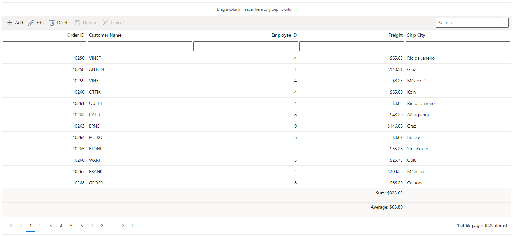
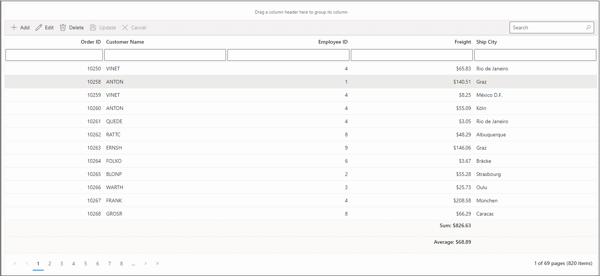

---
layout: post
title: MongoDB Data Binding in Blazor DataGrid Component | Syncfusion
description: Learn about consuming data from MongoDB and binding it to Syncfusion Component, and performing CRUD operations.
platform: Blazor
control: DataGrid
documentation: ug
--- 

# Connecting MongoDB data in to Blazor DataGrid Component

This section describes how to connect and retrieve data from a MongoDB database using [MongoDB.Driver](https://www.nuget.org/packages/MongoDB.Driver) and bind it to the Blazor DataGrid component.

MongoDB database can be bound to the Blazor DataGrid component in different ways (i.e.) using [DataSource](https://help.syncfusion.com/cr/blazor/Syncfusion.Blazor.Grids.SfGrid-1.html#Syncfusion_Blazor_Grids_SfGrid_1_DataSource) property, [CustomAdaptor](https://blazor.syncfusion.com/documentation/datagrid/custom-binding) feature and remote data binding using various adaptors. In this documentation, two approaches will be examined to connect a MongoDB database to a Blazor DataGrid component. Both the approaches have capability to handle data and CRUD operations with built-in methods as well as can be customized as per your own.

* **Using UrlAdaptor**

The [UrlAdaptor](https://blazor.syncfusion.com/documentation/data/adaptors#url-adaptor) serves as the base adaptor for facilitating communication between remote data services and an UI component. It enables the remote binding of data to the Blazor DataGrid component by connecting to an existing pre-configured API service linked to the MongoDB database. While the Blazor DataGrid component supports various adaptors to fulfill this requirement, including [Web API](https://blazor.syncfusion.com/documentation/data/adaptors#web-api-adaptor), [OData](https://blazor.syncfusion.com/documentation/data/adaptors#odata-adaptor), [ODataV4](https://blazor.syncfusion.com/documentation/data/adaptors#odatav4-adaptor), [Url](https://blazor.syncfusion.com/documentation/data/adaptors#url-adaptor), and [GraphQL](https://blazor.syncfusion.com/documentation/data/adaptors#graphql-service-binding), the `UrlAdaptor` is particularly useful for the scenarios where a custom API service with unique logic for handling data and CRUD operations is in place. This approach allows for custom handling of data and CRUD operations, and the resultant data returned in the `result` and `count` format for display in the Blazor DataGrid component.

* **Using CustomAdaptor**

The [CustomAdaptor](https://blazor.syncfusion.com/documentation/datagrid/custom-binding) serves as a mediator between the UI component and the database for data binding. While the data source from the database can be directly bound to the `SfGrid` component locally using the [DataSource](https://help.syncfusion.com/cr/blazor/Syncfusion.Blazor.Grids.SfGrid-1.html#Syncfusion_Blazor_Grids_SfGrid_1_DataSource) property, the `CustomAdaptor` approach is preferred as it allows for customization of both data operations and CRUD operations according to specific requirements. In this approach, for every action in the Blazor DataGrid component, a corresponding request with action details is sent to the `CustomAdaptor`. The Blazor DataGrid component provides predefined methods to perform data operations such as **searching**, **filtering**, **sorting**, **aggregation**, **paging** and **grouping**. Alternatively, your own custom methods can be employed to execute operations and return the data in the `Result` and `Count` format of the `DataResult` class for displaying in the Blazor DataGrid component. Additionally, for CRUD operations, predefined methods can be overridden to provide custom functionality. Further details on this can be found in the latter part of the documentation.

## Binding data from MongoDB using an API service

This section describes step by step process how to retrieve data from a MongoDB using an API service and bind it to the Blazor DataGrid component.

### Creating an API service

**1.** Open Visual Studio and create an ASP.NET Core Web App project type, naming it **MyWebService**. To create an ASP.NET Core Web application, follow the documentation [link](https://learn.microsoft.com/en-us/visualstudio/get-started/csharp/tutorial-aspnet-core?view=vs-2022).

**2.** To connect a MongoDB database using the MongoDB driver in your application, you need to install the [MongoDB.Driver](https://www.nuget.org/packages/MongoDB.Driver) NuGet package. To add **MongoDB.Driver** in the app, open the NuGet package manager in Visual Studio (Tools → NuGet Package Manager → Manage NuGet Packages for Solution), search and install it.

**3.** Create an API controller (aka, GridController.cs) file under **Controllers** folder that helps to establish data communication with the Blazor DataGrid component.

**4.** In an API controller (aka, GridController), connect to MongoDB. In the **Get()** method **MongoClient** and it’s **GetDatabase** method helps to connect the MongoDB database. Next, using **GetCollection** method of the **IMongoDatabase** is used to retrieve data from the database. Then, using a **BsonDocument** instance, populate the data collection from the **IMongoCollection** into a list using the **Find** method as shown in the following code snippet.



using Microsoft.AspNetCore.Mvc;
using Newtonsoft.Json;
using Syncfusion.Blazor.Data;
using Syncfusion.Blazor;
using System.ComponentModel.DataAnnotations;
using System.Data;
using MongoDB.Driver;
using MongoDB.Bson;

namespace MyWebService.Controllers
{
    [ApiController]
    public class GridController : ControllerBase
    {
        public static List<Order> Orders { get; set; }

        public class Order
        {
            // MongoDB ObjectId
            public ObjectId _id { get; set; }
            [Key]
            public int? OrderID { get; set; }
            public string? CustomerName { get; set; }
            public int? EmployeeID { get; set; }
            public decimal? Freight { get; set; }
            public string? ShipCity { get; set; }
        }

        // TODO: Enter the connection string of the database
        private string ConnectionString = $"<Enter a valid connection string>";
        private IMongoCollection<Order> collection;

        private async Task MongoDb()
        {
            // Create MongoDB client
            MongoClient client = new MongoClient(ConnectionString);
            // Get database from MongoDB
            IMongoDatabase database = client.GetDatabase("MyDb");
            // Get orders collection from the database
            collection = database.GetCollection<Order>("orders");
        }

        [Route("api/[controller]")]
        private List<Order> GetOrderData()
        {
            // Initialize MongoDB connection
            MongoDb();
            // Return all orders as a list
            return collection.Find(new BsonDocument()).ToList();
        }
    }
}



**5.** Run the application and it will be hosted within the URL `https://localhost:xxxx`.

**6.** Finally, the retrieved data from MongoDB database which is in the form of list of array can be found in an API controller available in the URL link `https://localhost:xxxx/api/Grid`, as shown in the browser page below.


### Connecting Blazor DataGrid to an API service

**1.** Create a simple Blazor DataGrid component by following steps. This section briefly explains about how to include [Blazor DataGrid](https://www.syncfusion.com/blazor-components/blazor-datagrid) component in your Blazor Web App using [Visual Studio](https://visualstudio.microsoft.com/vs/).

**Prerequisites**

* [System requirements for Blazor components](https://blazor.syncfusion.com/documentation/system-requirements)

**Create a new Blazor Web App**

You can create a **Blazor Web App** using Visual Studio 2022 via [Microsoft Templates](https://learn.microsoft.com/en-us/aspnet/core/blazor/tooling?view=aspnetcore-8.0) or the [Syncfusion Blazor Extension](https://blazor.syncfusion.com/documentation/visual-studio-integration/template-studio).

You need to configure the corresponding [Interactive render mode](https://learn.microsoft.com/en-us/aspnet/core/blazor/components/render-modes?view=aspnetcore-8.0#render-modes) and [Interactivity location](https://learn.microsoft.com/en-us/aspnet/core/blazor/tooling?view=aspnetcore-8.0&pivots=windows) while creating a Blazor Web Application.

**Install Syncfusion Blazor Grid and Themes NuGet in the Blazor Web App**

To add **Blazor DataGrid** component in the app, open the NuGet package manager in Visual Studio (*Tools → NuGet Package Manager → Manage NuGet Packages for Solution*), search and install [Syncfusion.Blazor.Grid](https://www.nuget.org/packages/Syncfusion.Blazor.Grid/) and [Syncfusion.Blazor.Themes](https://www.nuget.org/packages/Syncfusion.Blazor.Themes/).

If you utilize `WebAssembly or Auto` render modes in the Blazor Web App need to be install Syncfusion Blazor components NuGet packages within the client project.

Alternatively, you can utilize the following package manager command to achieve the same.




Install-Package Syncfusion.Blazor.Grid -Version {{ site.releaseversion }}
Install-Package Syncfusion.Blazor.Themes -Version {{ site.releaseversion }}




> Syncfusion Blazor components are available in [nuget.org](https://www.nuget.org/packages?q=syncfusion.blazor). Refer to [NuGet packages](https://blazor.syncfusion.com/documentation/nuget-packages) topic for available NuGet packages list with component details.

**Register Syncfusion Blazor Service**

Open **~/_Imports.razor** file and import the `Syncfusion.Blazor` and `Syncfusion.Blazor.Grids` namespace.

```cshtml

@using Syncfusion.Blazor
@using Syncfusion.Blazor.Grids
```

Now, register the Syncfusion Blazor Service in the **~/Program.cs** file of your Blazor Web App. For a app with `WebAssembly` or `Auto (Server and WebAssembly)` interactive render mode, register the Syncfusion Blazor service in both **~/Program.cs** files of your web app.

```cshtml

....
using Syncfusion.Blazor;
....
builder.Services.AddSyncfusionBlazor();
....

```

**Add stylesheet and script resources**

The theme stylesheet and script can be accessed from NuGet through [Static Web Assets](https://blazor.syncfusion.com/documentation/appearance/themes#static-web-assets). Include the stylesheet reference in the `<head>` section and the script reference at the end of the `<body>` in the **~/Components/App.razor** file as shown below:

```html
<head>
    ....
    <link href="_content/Syncfusion.Blazor.Themes/fluent.css" rel="stylesheet" />
</head>
....
<body>
    ....
    <script src="_content/Syncfusion.Blazor.Core/scripts/syncfusion-blazor.min.js" type="text/javascript"></script>
</body>
```

> * Check out the [Blazor Themes](https://blazor.syncfusion.com/documentation/appearance/themes) topic to discover various methods ([Static Web Assets](https://blazor.syncfusion.com/documentation/appearance/themes#static-web-assets), [CDN](https://blazor.syncfusion.com/documentation/appearance/themes#cdn-reference), and [CRG](https://blazor.syncfusion.com/documentation/common/custom-resource-generator)) for referencing themes in your Blazor application. Also, check out the [Adding Script Reference](https://blazor.syncfusion.com/documentation/common/adding-script-references) topic to learn different approaches for adding script references in your Blazor application.
> * In this Blazor Web app, set the `rendermode` as either **InteractiveServer** or **InteractiveAuto** as per your configuration.

**2.** Map the hosted API's URL link `https://localhost:xxxx/api/Grid` to the Blazor DataGrid component in **Index.razor** by using the [Url](https://help.syncfusion.com/cr/blazor/Syncfusion.Blazor.DataManager.html#Syncfusion_Blazor_DataManager_Url) property of [SfDataManager](https://help.syncfusion.com/cr/blazor/Syncfusion.Blazor.Data.SfDataManager.html). To interact with remote data source, provide the endpoint `Url`.

**3.** The `SfDataManager` offers multiple adaptor options to connect with remote database based on an API service. Below is an example of the [UrlAdaptor](https://blazor.syncfusion.com/documentation/data/adaptors#url-adaptor) configuration where an API service are set up to return the resulting data in the `result` and `count` format.

**4.** The `UrlAdaptor` acts as the base adaptor for interacting with remote data service. Most of the built-in adaptors are derived from the `UrlAdaptor`.



@using Syncfusion.Blazor.Grids
@using Syncfusion.Blazor.Data
@using Syncfusion.Blazor

<SfGrid @ref="Grid" TValue="Order" AllowPaging="true" AllowFiltering="true" AllowSorting="true" AllowGrouping="true" Toolbar="@(new List<string>() { "Add", "Edit", "Delete", "Update", "Cancel", "Search" })">
    <SfDataManager Url="https://localhost:xxxx/api/Grid" BatchUrl="https://localhost:xxxx/api/Grid/Batch" InsertUrl="https://localhost:xxxx/api/Grid/Insert" UpdateUrl="https://localhost:xxxx/api/Grid/Update" RemoveUrl="https://localhost:xxxx/api/Grid/Delete" Adaptor="Adaptors.UrlAdaptor"></SfDataManager>
    <GridEditSettings AllowEditing="true" AllowDeleting="true" AllowAdding="true" Mode="EditMode.Normal"></GridEditSettings>
    <GridAggregates>
        <GridAggregate>
            <GridAggregateColumns>
                <GridAggregateColumn Field=@nameof(Order.Freight) Type="AggregateType.Sum" Format="C2">
                    <FooterTemplate>
                        @{
                            var aggregate = (context as AggregateTemplateContext);
                            <div>
                                <p>Sum: @aggregate.Sum</p>
                            </div>
                        }
                    </FooterTemplate>
                </GridAggregateColumn>
            </GridAggregateColumns>
        </GridAggregate>
        <GridAggregate>
            <GridAggregateColumns>
                <GridAggregateColumn Field=@nameof(Order.Freight) Type="AggregateType.Average" Format="C2">
                    <FooterTemplate>
                        @{
                            var aggregate = (context as AggregateTemplateContext);
                            <div>
                                <p>Average: @aggregate.Average</p>
                            </div>
                        }
                    </FooterTemplate>
                </GridAggregateColumn>
            </GridAggregateColumns>
        </GridAggregate>
    </GridAggregates>
    <GridColumns>
        <GridColumn Field=@nameof(Order.OrderID) HeaderText="Order ID"  ValidationRules="@(new ValidationRules{ Required= true })" IsPrimaryKey="true" TextAlign="TextAlign.Right" Width="120"></GridColumn>
        <GridColumn Field=@nameof(Order.CustomerName) HeaderText="Customer Name" ValidationRules="@(new ValidationRules{ Required= true, MinLength = 3 })" Width="150"></GridColumn>
        <GridColumn Field=@nameof(Order.EmployeeID) HeaderText="Employee ID" TextAlign="TextAlign.Right" Width="150"></GridColumn>
        <GridColumn Field=@nameof(Order.Freight) HeaderText="Freight" TextAlign="TextAlign.Right" Format="C2" Width="150"></GridColumn>
        <GridColumn Field=@nameof(Order.ShipCity) HeaderText="Ship City" Width="150"></GridColumn>
    </GridColumns>
</SfGrid>

@code {
    SfGrid<Order> Grid { get; set; }
    public List<Order> Orders { get; set; }
    public class Order
    {
        public int? OrderID { get; set; }
        public string CustomerName { get; set; }
        public int EmployeeID { get; set; }
        public decimal Freight { get; set; }
        public string ShipCity { get; set; }
    }
}


[ApiController]
public class GridController : ControllerBase
{ 
    /// <summary>
    /// Returns the data collection as result and count after performing data operations based on request from <see cref=”DataManagerRequest”/>
    /// </summary>
    /// <param name="DataManagerRequest">DataManagerRequest contains the information regarding searching, filtering, sorting, aggregates and paging which is handled on the Blazor DataGrid component side</param>
    /// <returns>The data collection's type is determined by how this method has been implemented.</returns>
    [HttpPost]
    [Route("api/[controller]")]
    public object Post([FromBody] DataManagerRequest DataManagerRequest)
    {
        IEnumerable<Order> DataSource = GetOrderData();
        int TotalRecordsCount = DataSource.Cast<Order>().Count();
        return new { result = DataSource, count = TotalRecordsCount};
    }
}



> In the above Blazor DataGrid component, [AllowSearching](https://help.syncfusion.com/cr/blazor/Syncfusion.Blazor.Grids.GridColumn.html#Syncfusion_Blazor_Grids_GridColumn_AllowSearching), [AllowSorting](https://help.syncfusion.com/cr/blazor/Syncfusion.Blazor.Grids.SfGrid-1.html#Syncfusion_Blazor_Grids_SfGrid_1_AllowSorting), [AllowFiltering](https://help.syncfusion.com/cr/blazor/Syncfusion.Blazor.Grids.SfGrid-1.html#Syncfusion_Blazor_Grids_SfGrid_1_AllowFiltering), [AllowPaging](https://help.syncfusion.com/cr/blazor/Syncfusion.Blazor.Grids.SfGrid-1.html#Syncfusion_Blazor_Grids_SfGrid_1_AllowPaging), [AllowGrouping](https://help.syncfusion.com/cr/blazor/Syncfusion.Blazor.Grids.SfGrid-1.html#Syncfusion_Blazor_Grids_SfGrid_1_AllowGrouping) and CRUD-related properties have been enabled. The details on how to handle these actions are explained below.

When you run the application, the resultant Blazor DataGrid component will look like this



> * The Syncfusion Blazor DataGrid component provides built-in support for handling various data operations such as **searching**, **sorting**, **filtering**, **aggregate** and **paging** on the server-side. These operations can be handled using methods such as `PerformSearching`, `PerformFiltering`, `PerformSorting`, `PerformAggregation`, `PerformTake` and `PerformSkip` available in the **Syncfusion.Blazor.Data** package. Let's explore how to manage these data operations using the `UrlAdaptor`.
> * In an API service project, add **Syncfusion.Blazor.Data** by opening the NuGet package manager in Visual Studio (Tools → NuGet Package Manager → Manage NuGet Packages for Solution), search and install it.

### Handling searching operation

To handle searching operation, ensure that your API endpoint supports custom searching criteria. Implement the searching logic on the server-side using the [PerformSearching](https://help.syncfusion.com/cr/blazor/Syncfusion.Blazor.DataOperations.html#Syncfusion_Blazor_DataOperations_PerformSearching__1_System_Collections_Generic_IEnumerable___0__System_Collections_Generic_List_Syncfusion_Blazor_Data_SearchFilter__) method from the [DataOperations](https://help.syncfusion.com/cr/blazor/Syncfusion.Blazor.DataOperations.html) class. This allows the custom data source to undergo searching based on the criteria specified in the incoming [DataManagerRequest](https://help.syncfusion.com/cr/blazor/Syncfusion.Blazor.DataManagerRequest.html) object.



[HttpPost]
[Route("api/[controller]")]
public object Post([FromBody] DataManagerRequest DataManagerRequest)
{
    IEnumerable<Order> DataSource = GetOrderData();
    // Handling Searching in UrlAdaptor.
    if (DataManagerRequest.Search != null && DataManagerRequest.Search.Count > 0)
    {
        // Searching
        DataSource = DataOperations.PerformSearching(DataSource, DataManagerRequest.Search);
        //Add custom logic here if needed and remove above method
    }
    int TotalRecordsCount = DataSource.Cast<Order>().Count();
    return new { result = DataSource, count = TotalRecordsCount };
}


### Handling filtering operation

To handle filtering operation, ensure that your API endpoint supports custom filtering criteria. Implement the filtering logic on the server-side using the [PerformFiltering](https://help.syncfusion.com/cr/blazor/Syncfusion.Blazor.DataOperations.html#Syncfusion_Blazor_DataOperations_PerformFiltering_System_Collections_IEnumerable_System_Collections_Generic_List_Syncfusion_Blazor_Data_WhereFilter__System_String_) method from the [DataOperations](https://help.syncfusion.com/cr/blazor/Syncfusion.Blazor.DataOperations.html) class. This allows the custom data source to undergo filtering based on the criteria specified in the incoming [DataManagerRequest](https://help.syncfusion.com/cr/blazor/Syncfusion.Blazor.DataManagerRequest.html) object.


[HttpPost]
[Route("api/[controller]")]
public object Post([FromBody] DataManagerRequest DataManagerRequest)
{
    IEnumerable<Order> DataSource = GetOrderData();
    // Handling Filtering in UrlAdaptor.
    if (DataManagerRequest.Where != null && DataManagerRequest.Where.Count > 0)
    {
        // Filtering
        DataSource = DataOperations.PerformFiltering(DataSource, DataManagerRequest.Where, DataManagerRequest.Where[0].Operator);
        //Add custom logic here if needed and remove above method
    }
    int TotalRecordsCount = DataSource.Cast<Order>().Count();
    return new { result = DataSource, count = TotalRecordsCount };
}



### Handling sorting operation

To handle sorting operation, ensure that your API endpoint supports custom sorting criteria. Implement the sorting logic on the server-side using the [PerformSorting](https://help.syncfusion.com/cr/blazor/Syncfusion.Blazor.DataOperations.html#Syncfusion_Blazor_DataOperations_PerformSorting__1_System_Collections_Generic_IEnumerable___0__System_Collections_Generic_List_Syncfusion_Blazor_Data_Sort__) method from the [DataOperations](https://help.syncfusion.com/cr/blazor/Syncfusion.Blazor.DataOperations.html) class. This allows the custom data source to undergo sorting based on the criteria specified in the incoming [DataManagerRequest](https://help.syncfusion.com/cr/blazor/Syncfusion.Blazor.DataManagerRequest.html) object.


[HttpPost]
[Route("api/[controller]")]
public object Post([FromBody] DataManagerRequest DataManagerRequest)
{
    IEnumerable<Order> DataSource = GetOrderData();
    // Handling Sorting in UrlAdaptor.
    if (DataManagerRequest.Sorted != null && DataManagerRequest.Sorted.Count > 0)
    {
        // Sorting
        DataSource = DataOperations.PerformSorting(DataSource, DataManagerRequest.Sorted);
        //Add custom logic here if needed and remove above method
    }
    int TotalRecordsCount = DataSource.Cast<Order>().Count();
    return new { result = DataSource, count = TotalRecordsCount };
}


### Handling aggregate operation

To handle aggregate operation, ensure that your API endpoint supports custom aggregate criteria. Implement the aggregate logic on the server-side using the [PerformAggregation](https://help.syncfusion.com/cr/blazor/Syncfusion.Blazor.Data.DataUtil.html#Syncfusion_Blazor_Data_DataUtil_PerformAggregation_System_Collections_IEnumerable_System_Collections_Generic_List_Syncfusion_Blazor_Data_Aggregate__) method from the [DataUtil](https://help.syncfusion.com/cr/blazor/Syncfusion.Blazor.Data.DataUtil.html) class. This allows the custom data source to undergo aggregate based on the criteria specified in the incoming [DataManagerRequest](https://help.syncfusion.com/cr/blazor/Syncfusion.Blazor.DataManagerRequest.html) object.


 [HttpPost]
 [Route("api/[controller]")]
 public object Post([FromBody] DataManagerRequest DataManagerRequest)
 {
    IEnumerable<Order> DataSource = GetOrderData();
    int TotalRecordsCount = DataSource.Cast<Order>().Count();
    // Handling Aggregation in UrlAdaptor.
    IDictionary<string, object> Aggregates = null;
    if (DataManagerRequest.Aggregates != null) 
    {  
        // Aggregation
        Aggregates = DataUtil.PerformAggregation(DataSource, DataManagerRequest.Aggregates);
        //Add custom logic here if needed and remove above method                
    }
    return new { result = DataSource, count = TotalRecordsCount, aggregates = Aggregates };
 }


> The server-side management of the `PerformAggregation` method is necessary only for the [Footer Template](https://blazor.syncfusion.com/documentation/datagrid/footer-aggregate) aggregation. There is no need for explicit handling of the Aggregate operation for the [Group Footer template](https://blazor.syncfusion.com/documentation/datagrid/group-and-caption-aggregate#group-footer-aggregates) and [Group Caption template](https://blazor.syncfusion.com/documentation/datagrid/group-and-caption-aggregate#group-caption-aggregates).

### Handling paging operation

To handle paging operation, ensure that your API endpoint supports custom paging criteria. Implement the paging logic on the server-side using the [PerformTake](https://help.syncfusion.com/cr/blazor/Syncfusion.Blazor.DataOperations.html#Syncfusion_Blazor_DataOperations_PerformTake_System_Collections_IEnumerable_System_Int32_) and [PerformSkip](https://help.syncfusion.com/cr/blazor/Syncfusion.Blazor.DataOperations.html#Syncfusion_Blazor_DataOperations_PerformSkip__1_System_Collections_Generic_IEnumerable___0__System_Int32_) method from the [DataOperations](https://help.syncfusion.com/cr/blazor/Syncfusion.Blazor.DataOperations.html) class. This allows the custom data source to undergo paging based on the criteria specified in the incoming [DataManagerRequest](https://help.syncfusion.com/cr/blazor/Syncfusion.Blazor.DataManagerRequest.html) object.


[HttpPost]
[Route("api/[controller]")]
public object Post([FromBody] DataManagerRequest DataManagerRequest)
{
    IEnumerable<Order> DataSource = GetOrderData();
    int TotalRecordsCount = DataSource.Cast<Order>().Count();
    // Handling Paging in UrlAdaptor.
    if (DataManagerRequest.Skip != 0)
    {
        // Paging
        DataSource = DataOperations.PerformSkip(DataSource, DataManagerRequest.Skip);
        //Add custom logic here if needed and remove above method
    }
    if (DataManagerRequest.Take != 0)
    {
        DataSource = DataOperations.PerformTake(DataSource, DataManagerRequest.Take);
        //Add custom logic here if needed and remove above method
    }
    return new { result = DataSource, count = TotalRecordsCount };
}


> For optimal performance, it is recommended to follow this sequence of operations(Searching, Filtering, Sorting, Aggregate and Paging  ) in the [ReadAsync](https://help.syncfusion.com/cr/blazor/Syncfusion.Blazor.DataAdaptor.html#Syncfusion_Blazor_DataAdaptor_ReadAsync_Syncfusion_Blazor_DataManagerRequest_System_String_) method.

### Handling CRUD operations

To enable editing in this Blazor DataGrid component, utilize the [GridEditSettings](https://help.syncfusion.com/cr/blazor/Syncfusion.Blazor.Grids.GridEditSettings.html) component. The Blazor DataGrid offers multiple edit modes including the [Inline/Normal](https://blazor.syncfusion.com/documentation/datagrid/in-line-editing), [Dialog](https://blazor.syncfusion.com/documentation/datagrid/dialog-editing), and [Batch](https://blazor.syncfusion.com/documentation/datagrid/batch-editing) editing. For more details, refer to the Blazor DataGrid component [editing](https://blazor.syncfusion.com/documentation/datagrid/editing) documentation. 

In this scenario, the inline edit `Mode` and [Toolbar](https://blazor.syncfusion.com/documentation/datagrid/tool-bar) property are configured to display toolbar items for editing purposes.



<SfGrid @ref="Grid" TValue="Order" AllowPaging="true" AllowFiltering="true" AllowSorting="true" AllowGrouping="true" Toolbar="@(new List<string>() { "Add", "Edit", "Delete", "Update", "Cancel", "Search" })">
    <SfDataManager Url="https://localhost:xxxx/api/Grid" InsertUrl="https://localhost:xxxx/api/Grid/Insert" UpdateUrl="https://localhost:xxxx/api/Grid/Update" RemoveUrl="https://localhost:xxxx/api/Grid/Delete" BatchUrl="https://localhost:xxxx/api/Grid/Batch" Adaptor="Adaptors.UrlAdaptor"></SfDataManager>
    <GridEditSettings AllowEditing="true" AllowDeleting="true" AllowAdding="true" Mode="EditMode.Normal"></GridEditSettings>
    <GridColumns>
        <GridColumn Field=@nameof(Order.OrderID) HeaderText="Order ID" IsIdentity="true" ValidationRules="@(new ValidationRules{ Required= true })" IsPrimaryKey="true" TextAlign="TextAlign.Right" Width="120"></GridColumn>
        <GridColumn Field=@nameof(Order.CustomerName) HeaderText="Customer Name" ValidationRules="@(new ValidationRules{ Required= true, MinLength = 3 })" Width="150"></GridColumn>
        <GridColumn Field=@nameof(Order.EmployeeID) HeaderText="Employee ID" TextAlign="TextAlign.Right" Width="150"></GridColumn>
        <GridColumn Field=@nameof(Order.Freight) HeaderText="Freight" TextAlign="TextAlign.Right" Format="C2" Width="150"></GridColumn>
        <GridColumn Field=@nameof(Order.ShipCity) HeaderText="Ship City" Width="150"></GridColumn>
    </GridColumns>
</SfGrid>



> * Normal/Inline editing is the default edit [Mode](https://help.syncfusion.com/cr/blazor/Syncfusion.Blazor.Grids.GridEditSettings.html#Syncfusion_Blazor_Grids_GridEditSettings_Mode) for the Blazor DataGrid component. To enable CRUD operations, ensure that the [IsPrimaryKey](https://help.syncfusion.com/cr/blazor/Syncfusion.Blazor.Grids.GridColumn.html#Syncfusion_Blazor_Grids_GridColumn_IsPrimaryKey) property is set to **true** for a specific `GridColumn`, ensuring that its value is unique.
> * If database has an Autogenerated column, ensure to define [IsIdentity](https://help.syncfusion.com/cr/blazor/Syncfusion.Blazor.Grids.GridColumn.html#Syncfusion_Blazor_Grids_GridColumn_IsIdentity) property of `GridColumn` to disable them during adding or editing operations.

**Insert Operation:**

To insert a new row, simply click the **Add** toolbar button. The new record edit form will be displayed as shown below. Upon clicking the **Update** toolbar button, record will inserted into the Orders table by calling the following **POST** method of an API.



[HttpPost]
[Route("api/Grid/Insert")]
/// <summary>
/// Inserts a new data item into the data collection.
/// </summary>
/// <param name="CRUDModel<T>">The set of information along with new record detail which is need to be inserted.</param>
/// <returns>Returns void</returns>
public async Task Insert([FromBody] CRUDModel<Order> Value)
{
    // Initialize MongoDB connection
    MongoDb();
    // Insert the order into the collection
    await collection.InsertOneAsync(Value.Value);    
}



**Update Operation:**

To edit a row, first select desired row and click the **Edit** toolbar button. The edit form will be displayed and proceed to modify any column value as per your requirement. Clicking the **Update** toolbar button will update the edit record in the Orders table by involving the following **Post** method of an API.



[HttpPost]
[Route("api/Grid/Update")]
/// <summary>
/// Update a existing data item from the data collection.
/// </summary>
/// <param name="CRUDModel<T>">The set of information along with updated record detail which is need to be updated.</param>
/// <returns>Returns void</returns>
public async Task Update([FromBody] CRUDModel<Order> Value)
{
    // Initialize MongoDB connection
    MongoDb();
    var Filter = Builders<Order>.Filter.Eq(x => x.OrderID, Value.Value.OrderID);
    var ExistingOrder = await collection.Find(Filter).FirstOrDefaultAsync();

    ExistingOrder.CustomerID = Value.Value.CustomerID;
    ExistingOrder.EmployeeID = Value.Value.EmployeeID;
    ExistingOrder.Freight = Value.Value.Freight;
    ExistingOrder.ShipCity = Value.Value.ShipCity;
    // Replace the existing order 
    await collection.ReplaceOneAsync(Filter, ExistingOrder);
}



**Delete Operation:**

To delete a row, simply select the desired row and click the **Delete** toolbar button. This action will trigger a **DELETE** request to an API, containing the primary key value of the selected record. As a result corresponding record will be removed from the Orders table.



 [HttpPost]
[Route("api/Grid/Delete")]
/// <summary>
/// Remove a specific data item from the data collection.
/// </summary>
/// <param name="CRUDModel<T>">The set of information along with specific record detail which is need to be removed.</param>
/// <returns>Returns void</returns>
public async Task Delete([FromBody] CRUDModel<Order> Value)
{
    // Initialize MongoDB connection
    MongoDb();
    // Delete order by key value
    await collection.DeleteOneAsync(x => x.OrderID == Convert.ToInt32(Value.Key.ToString()));
}



**Batch Operation:**

To perform batch operation, define the edit [Mode](https://help.syncfusion.com/cr/blazor/Syncfusion.Blazor.Grids.GridEditSettings.html#Syncfusion_Blazor_Grids_GridEditSettings_Mode) as `Batch` and specify the [BatchUrl](https://help.syncfusion.com/cr/blazor/Syncfusion.Blazor.DataManager.html#Syncfusion_Blazor_DataManager_BatchUrl) property in the `SfDataManager`. Use the **Add** toolbar button to insert new row in batch editing mode. To edit a cell, double-click the desired cell and update the value as required. To delete a record, simply select the record and press the **Delete** toolbar button. Now, all CRUD operations will be executed in batch editing mode. Clicking the **Update** toolbar button will update the newly added, edited, or deleted records from the Orders table using a single API **POST** request.


 [HttpPost]
[Route("api/Grid/Batch")]
/// <summary>
/// Batchupdate (Insert, Update, Delete) a collection of data items from the data collection.
/// </summary>
/// <param name="CRUDModel<T>">The set of information along with details about the CRUD actions to be executed from the database.</param>
/// <returns>Returns void</returns>
public async Task Batch([FromBody] CRUDModel<Order> Value)
{
    // Initialize MongoDB connection
    MongoDb();
    if (Value.Changed != null)
    {
        foreach (var Record in (IEnumerable<Order>)Value.Changed)
        {
            var Filter = Builders<Order>.Filter.Eq(x => x.OrderID, Record.OrderID);
            var ExistingOrder = await collection.Find(Filter).FirstOrDefaultAsync();

            ExistingOrder.CustomerID = Record.CustomerID;
            ExistingOrder.EmployeeID = Record.EmployeeID;
            ExistingOrder.Freight = Record.Freight;
            ExistingOrder.ShipCity = Record.ShipCity;
            // Replace existing order
            await collection.ReplaceOneAsync(Filter, ExistingOrder);
        }
    }
    if (Value.Added != null)
    {
        foreach (var Record in (IEnumerable<Order>)Value.Added)
        {
            // Insert the order into the collection
            await collection.InsertOneAsync(Record);   
        }
    }
    if (Value.Deleted != null)
    {
        foreach (var Record in (IEnumerable<Order>)Value.Deleted)
        {
            // Delete order by OrderID key value
           await collection.DeleteOneAsync(x => x.OrderID == Record.OrderID);
        }
    }
}


When you run the application, the resultant Blazor DataGrid component will look like this



> Find the sample from this [GitHub location]().

## Binding data from MongoDB using CustomAdaptor

This section describes step by step process how to retrieve data from a MongoDB using `CustomAdaptor` and bind it to the Blazor DataGrid component.

**1.** To create a simple Blazor DataGrid component, the procedure is explained in the above-mentioned topic on [Connecting Blazor DataGrid to an API service](#connecting-blazor-datagrid-to-an-api-service)

> * In this Blazor Web app, set the `rendermode` as either **InteractiveServer** or **InteractiveAuto** as per your configuration.

**2.** To connect a MongoDB database using the MongoDB driver in your application, you need to install the [MongoDB.Driver](https://www.nuget.org/packages/MongoDB.Driver) NuGet package. To add **MongoDB.Driver** in the app, open the NuGet package manager in Visual Studio (Tools → NuGet Package Manager → Manage NuGet Packages for Solution), search and install it.

**3.** If you intend to inject your own service into the `CustomAdaptor` and utilize it, you can achieve this as follows.



@rendermode InteractiveServer

@using Syncfusion.Blazor.Grids
@using Syncfusion.Blazor.Data
@using Syncfusion.Blazor
@using System.Collections

<SfGrid TValue="Order" AllowSorting="true" AllowFiltering="true" AllowGrouping="true" AllowPaging="true" Toolbar="@(new List<string>() { "Add", "Edit", "Delete", "Update", "Cancel", "Search" })">
    <SfDataManager AdaptorInstance="@typeof(CustomAdaptor)" Adaptor="Adaptors.CustomAdaptor"></SfDataManager>
    <GridEditSettings AllowEditing="true" AllowDeleting="true" AllowAdding="true" Mode="@EditMode.Normal"></GridEditSettings>
    <GridAggregates>
        <GridAggregate>
            <GridAggregateColumns>
                <GridAggregateColumn Field=@nameof(Order.Freight) Type="AggregateType.Sum" Format="C2">
                    <FooterTemplate>
                        @{
                            var aggregate = (context as AggregateTemplateContext);
                            <div>
                                <p>Sum: @aggregate.Sum</p>
                            </div>
                        }
                    </FooterTemplate>
                </GridAggregateColumn>
            </GridAggregateColumns>
        </GridAggregate>
        <GridAggregate>
            <GridAggregateColumns>
                <GridAggregateColumn Field=@nameof(Order.Freight) Type="AggregateType.Average" Format="C2">
                    <FooterTemplate>
                        @{
                            var aggregate = (context as AggregateTemplateContext);
                            <div>
                                <p>Average: @aggregate.Average</p>
                            </div>
                        }
                    </FooterTemplate>
                </GridAggregateColumn>
            </GridAggregateColumns>
        </GridAggregate>
    </GridAggregates>
    <GridColumns>
        <GridColumn Field=@nameof(Order.OrderID) HeaderText="Order ID" ValidationRules="@(new ValidationRules{ Required= true })"  IsPrimaryKey="true" TextAlign="TextAlign.Right" Width="120"></GridColumn>
        <GridColumn Field=@nameof(Order.CustomerName) HeaderText="Customer Name" ValidationRules="@(new ValidationRules{ Required= true, MinLength = 3 })" Width="150"></GridColumn>
        <GridColumn Field=@nameof(Order.EmployeeID) HeaderText="Employee ID" TextAlign="TextAlign.Right" Width="150"></GridColumn>
        <GridColumn Field=@nameof(Order.Freight) HeaderText="Freight" TextAlign="TextAlign.Right" Format="C2" Width="150"></GridColumn>
        <GridColumn Field=@nameof(Order.ShipCity) HeaderText="Ship City" Width="150"></GridColumn>
    </GridColumns>
</SfGrid>

@code {
    SfGrid<Order> Grid { get; set; }
}


 public class Order
 {
    // MongoDB ObjectId
    public ObjectId _id { get; set; }
    public int? OrderID { get; set; }
    public string CustomerID { get; set; }
    public int EmployeeID { get; set; }
    public decimal Freight { get; set; }
    public string ShipCity { get; set; }
 }



**4.** Within the `CustomAdaptor’s` [ReadAsync](https://help.syncfusion.com/cr/blazor/Syncfusion.Blazor.DataAdaptor.html#Syncfusion_Blazor_DataAdaptor_ReadAsync_Syncfusion_Blazor_DataManagerRequest_System_String_) method, fetch the data from the service by calling the `GetOrdersAsync` method.

* In this `GetOrdersAsync` method, the MongoDB database data is fetched using the MongoClient class. 

* Employ the **GetDatabase** method of **MongoClient** to connect to the MongoDB database, followed by the **GetCollection** method to retrieve a collection. Use the **Find** method of the **IMongoCollection** interface with a **BsonDocument** instance to execute a query and populate the results into a List

* Finally, return the response as a `Result` and `Count` pair object in the `ReadAsync` method to bind the data to the Blazor DataGrid component.



@rendermode InteractiveServer

@using Syncfusion.Blazor.Grids
@using Syncfusion.Blazor.Data
@using Syncfusion.Blazor
@using System.Collections

<SfGrid TValue="Order" AllowSorting="true" AllowFiltering="true" AllowGrouping="true" AllowPaging="true" Toolbar="@(new List<string>() { "Add", "Edit", "Delete", "Update", "Cancel", "Search" })">
    <SfDataManager AdaptorInstance="@typeof(CustomAdaptor)" Adaptor="Adaptors.CustomAdaptor"></SfDataManager>
    <GridEditSettings AllowEditing="true" AllowDeleting="true" AllowAdding="true" Mode="@EditMode.Normal"></GridEditSettings>
    <GridAggregates>
        <GridAggregate>
            <GridAggregateColumns>
                <GridAggregateColumn Field=@nameof(Order.Freight) Type="AggregateType.Sum" Format="C2">
                    <FooterTemplate>
                        @{
                            var aggregate = (context as AggregateTemplateContext);
                            <div>
                                <p>Sum: @aggregate.Sum</p>
                            </div>
                        }
                    </FooterTemplate>
                </GridAggregateColumn>
            </GridAggregateColumns>
        </GridAggregate>
        <GridAggregate>
            <GridAggregateColumns>
                <GridAggregateColumn Field=@nameof(Order.Freight) Type="AggregateType.Average" Format="C2">
                    <FooterTemplate>
                        @{
                            var aggregate = (context as AggregateTemplateContext);
                            <div>
                                <p>Average: @aggregate.Average</p>
                            </div>
                        }
                    </FooterTemplate>
                </GridAggregateColumn>
            </GridAggregateColumns>
        </GridAggregate>
    </GridAggregates>
    <GridColumns>
        <GridColumn Field=@nameof(Order.OrderID) HeaderText="Order ID" ValidationRules="@(new ValidationRules{ Required= true })"  IsPrimaryKey="true" TextAlign="TextAlign.Right" Width="120"></GridColumn>
        <GridColumn Field=@nameof(Order.CustomerName) HeaderText="Customer Name" ValidationRules="@(new ValidationRules{ Required= true, MinLength = 3 })" Width="150"></GridColumn>
        <GridColumn Field=@nameof(Order.EmployeeID) HeaderText="Employee ID" TextAlign="TextAlign.Right" Width="150"></GridColumn>
        <GridColumn Field=@nameof(Order.Freight) HeaderText="Freight" TextAlign="TextAlign.Right" Format="C2" Width="150"></GridColumn>
        <GridColumn Field=@nameof(Order.ShipCity) HeaderText="Ship City" Width="150"></GridColumn>
    </GridColumns>
</SfGrid>

@code {
    /// <summary>
    /// Implementing CustomAdaptor by extending the <see cref=“DataAdaptor”/> class.
    /// The Blazor DataGrid component support for custom data binding, which enables the binding and manipulation of data in a personalized way, using user-defined methods.
    /// </summary>
    public class CustomAdaptor : DataAdaptor
    {
        public OrderData OrderService = new OrderData();
        /// <summary>
        /// Returns the data collection after performing data operations based on request from <see cref=”DataManagerRequest”/>
        /// </summary>
        /// <param name="DataManagerRequest">DataManagerRequest contains the information regarding searching, filtering, sorting, aggregates paging and grouping which is handled on the Blazor DataGrid component side</param>
        /// <param name="Key">An optional parameter that can be used to perform additional data operations.</param>
        /// <returns>The data collection's type is determined by how this method has been implemented.</returns>
        public override async Task<object> ReadAsync(DataManagerRequest DataManagerRequest, string Key = null)
        {
            IEnumerable<Order> DataSource = await OrderService.GetOrdersAsync();
            int TotalRecordsCount = DataSource.Cast<Order>().Count();
            return DataManagerRequest.RequiresCounts ? new DataResult() { Result = DataSource, Count = TotalRecordsCount } : (object)DataSource;
        }
    }
}


public class OrderData
{
    // TODO: Enter the connection string of the database
    private string ConnectionString = "<Enter a valid connection string>";
    
    // Collection to store Order data
    private IMongoCollection<Order> collection;

    public async Task<List<Order>> GetOrdersAsync()
    {
        // Create MongoDB client
        MongoClient client = new MongoClient(ConnectionString);
        // Get database from MongoDB
        IMongoDatabase database = client.GetDatabase("MyDb");
        // Get orders collection from the database
        collection = database.GetCollection<Order>("orders");        
        // Return all orders as a list
        return await collection.Find(new BsonDocument()).ToListAsync();
    }
}



> * The `DataManagerRequest` encompasses details about the Blazor DataGrid component actions such as searching, filtering, sorting, aggregate, paging and grouping.
> * In the above Blazor DataGrid, [AllowSearching](https://help.syncfusion.com/cr/blazor/Syncfusion.Blazor.Grids.GridColumn.html#Syncfusion_Blazor_Grids_GridColumn_AllowSearching), [AllowSorting](https://help.syncfusion.com/cr/blazor/Syncfusion.Blazor.Grids.SfGrid-1.html#Syncfusion_Blazor_Grids_SfGrid_1_AllowSorting), [AllowFiltering](https://help.syncfusion.com/cr/blazor/Syncfusion.Blazor.Grids.SfGrid-1.html#Syncfusion_Blazor_Grids_SfGrid_1_AllowFiltering), [AllowPaging](https://help.syncfusion.com/cr/blazor/Syncfusion.Blazor.Grids.SfGrid-1.html#Syncfusion_Blazor_Grids_SfGrid_1_AllowPaging), [AllowGrouping](https://help.syncfusion.com/cr/blazor/Syncfusion.Blazor.Grids.SfGrid-1.html#Syncfusion_Blazor_Grids_SfGrid_1_AllowGrouping) and CRUD-related properties have been enabled. The details on how to handle these actions are explained below.

When the application is executed, the Blazor DataGrid component will appear as depicted below.


### Handling searching operation

When utilizing the `CustomAdaptor`, managing the searching operation involves overriding the [Read](https://help.syncfusion.com/cr/blazor/Syncfusion.Blazor.DataAdaptor.html#Syncfusion_Blazor_DataAdaptor_Read_Syncfusion_Blazor_DataManagerRequest_System_String_) or [ReadAsync](https://help.syncfusion.com/cr/blazor/Syncfusion.Blazor.DataAdaptor.html#Syncfusion_Blazor_DataAdaptor_ReadAsync_Syncfusion_Blazor_DataManagerRequest_System_String_) method of the [DataAdaptor](https://help.syncfusion.com/cr/blazor/Syncfusion.Blazor.DataAdaptor.html) abstract class.

In the code example below, searching a custom data source can be accomplished by employing the built-in [PerformSearching](https://help.syncfusion.com/cr/blazor/Syncfusion.Blazor.DataOperations.html#Syncfusion_Blazor_DataOperations_PerformSearching_System_Collections_IEnumerable_System_Collections_Generic_List_Syncfusion_Blazor_Data_SearchFilter__) method of the [DataOperations](https://help.syncfusion.com/cr/blazor/Syncfusion.Blazor.DataOperations.html) class. Alternatively, you can implement your own method for searching operation and bind the resultant data to the Blazor DataGrid component.


public class CustomAdaptor : DataAdaptor
{
    public OrderData OrderService = new OrderData();
    // Performs data read operation
    public override async Task<object> ReadAsync(DataManagerRequest DataManagerRequest, string Key = null)
    {
        IEnumerable<Order> DataSource = await OrderService.GetOrdersAsync();
        // Handling Searching in CustomAdaptor.
        if (DataManagerRequest.Search != null && DataManagerRequest.Search.Count > 0)
        {
            // Searching
            DataSource = DataOperations.PerformSearching(DataSource, DataManagerRequest.Search);
            //Add custom logic here if needed and remove above method
        }
        int TotalRecordsCount = DataSource.Cast<Order>().Count();
        return DataManagerRequest.RequiresCounts ? new DataResult() { Result = DataSource, Count = TotalRecordsCount } : (object)DataSource;
    }
}


### Handling filtering operation

When employing the `CustomAdaptor`, handling the filtering operation involves overriding the [Read](https://help.syncfusion.com/cr/blazor/Syncfusion.Blazor.DataAdaptor.html#Syncfusion_Blazor_DataAdaptor_Read_Syncfusion_Blazor_DataManagerRequest_System_String_) or [ReadAsync](https://help.syncfusion.com/cr/blazor/Syncfusion.Blazor.DataAdaptor.html#Syncfusion_Blazor_DataAdaptor_ReadAsync_Syncfusion_Blazor_DataManagerRequest_System_String_) method of the [DataAdaptor](https://help.syncfusion.com/cr/blazor/Syncfusion.Blazor.DataAdaptor.html) abstract class.

In the code example below, filtering a custom data source can be achieved by utilizing the built-in [PerformFiltering](https://help.syncfusion.com/cr/blazor/Syncfusion.Blazor.DataOperations.html#Syncfusion_Blazor_DataOperations_PerformFiltering__1_System_Collections_Generic_IEnumerable___0__System_Collections_Generic_List_Syncfusion_Blazor_Data_WhereFilter__System_String_) method of the [DataOperations](https://help.syncfusion.com/cr/blazor/Syncfusion.Blazor.DataOperations.html) class. Alternatively, you can implement your own method for filtering operation and bind the resulting data to the Blazor DataGrid component.


public class CustomAdaptor : DataAdaptor
{
    public OrderData OrderService = new OrderData();
    // Performs data read operation
    public override async Task<object> ReadAsync(DataManagerRequest DataManagerRequest, string Key = null)
    {
        IEnumerable<Order> DataSource = await OrderService.GetOrdersAsync();
        // Handling Filtering in CustomAdaptor.
        if (DataManagerRequest.Where != null && DataManagerRequest.Where.Count > 0)
        {
            // Filtering
            DataSource = DataOperations.PerformFiltering(DataSource, DataManagerRequest.Where, DataManagerRequest.Where[0].Operator);
            //Add custom logic here if needed and remove above method
        }
        int TotalRecordsCount = DataSource.Cast<Order>().Count();
        return DataManagerRequest.RequiresCounts ? new DataResult() { Result = DataSource, Count = TotalRecordsCount } : (object)DataSource;
    }
}


### Handling sorting operation

When utilizing the `CustomAdaptor`, managing the sorting operation involves overriding the [Read](https://help.syncfusion.com/cr/blazor/Syncfusion.Blazor.DataAdaptor.html#Syncfusion_Blazor_DataAdaptor_Read_Syncfusion_Blazor_DataManagerRequest_System_String_) or [ReadAsync](https://help.syncfusion.com/cr/blazor/Syncfusion.Blazor.DataAdaptor.html#Syncfusion_Blazor_DataAdaptor_ReadAsync_Syncfusion_Blazor_DataManagerRequest_System_String_) method of the [DataAdaptor](https://help.syncfusion.com/cr/blazor/Syncfusion.Blazor.DataAdaptor.html) abstract class.

In the code example below, sorting a custom data source can be accomplished by employing the built-in [PerformSorting](https://help.syncfusion.com/cr/blazor/Syncfusion.Blazor.DataOperations.html#Syncfusion_Blazor_DataOperations_PerformSorting__1_System_Collections_Generic_IEnumerable___0__System_Collections_Generic_List_Syncfusion_Blazor_Data_Sort__) method of the [DataOperations](https://help.syncfusion.com/cr/blazor/Syncfusion.Blazor.DataOperations.html) class. Alternatively, you can implement your own method for sorting operation and bind the resulting data to the Blazor DataGrid component.


public class CustomAdaptor : DataAdaptor
{
    public OrderData OrderService = new OrderData();
    // Performs data read operation
    public override async Task<object> ReadAsync(DataManagerRequest DataManagerRequest, string Key = null)
    {
        IEnumerable<Order> DataSource = await OrderService.GetOrdersAsync();
        // Handling Sorting in CustomAdaptor.
        if (DataManagerRequest.Sorted != null && DataManagerRequest.Sorted.Count > 0)
        {
            // Sorting
            DataSource = DataOperations.PerformSorting(DataSource, DataManagerRequest.Sorted);
            //Add custom logic here if needed and remove above method
        }
        int TotalRecordsCount = DataSource.Cast<Order>().Count();
        return DataManagerRequest.RequiresCounts ? new DataResult() { Result = DataSource, Count = TotalRecordsCount } : (object)DataSource;
    }
}


### Handling aggregate operation

When employing `CustomAdaptor`, the aggregate operation must be managed within the [Read](https://help.syncfusion.com/cr/blazor/Syncfusion.Blazor.DataAdaptor.html#Syncfusion_Blazor_DataAdaptor_Read_Syncfusion_Blazor_DataManagerRequest_System_String_) or [ReadAsync](https://help.syncfusion.com/cr/blazor/Syncfusion.Blazor.DataAdaptor.html#Syncfusion_Blazor_DataAdaptor_ReadAsync_Syncfusion_Blazor_DataManagerRequest_System_String_) method of the `CustomAdaptor`.

The provided sample code illustrated how to implement the aggregate operation within `CustomAdaptor`,


public class CustomAdaptor : DataAdaptor
{
    public OrderData OrderService = new OrderData();
    // Performs data read operation
    public override async Task<object> ReadAsync(DataManagerRequest DataManagerRequest, string Key = null)
    {
        IEnumerable<Order> DataSource = await OrderService.GetOrdersAsync();
        int TotalRecordsCount = DataSource.Cast<Order>().Count();
        // Handling Aggregation in CustomAdaptor.
        IDictionary<string, object> Aggregates = null;
        if (DataManagerRequest.Aggregates != null) // Aggregation
        {
            Aggregates = DataUtil.PerformAggregation(DataSource, DataManagerRequest.Aggregates);
            //Add custom logic here if needed and remove above method
        }
        return DataManagerRequest.RequiresCounts ? new DataResult() { Result = DataSource, Count = TotalRecordsCount, Aggregates = Aggregates } : (object)DataSource;
    }
}


> The server-side management of the `PerformAggregation` method is necessary only for the [Footer Template](https://blazor.syncfusion.com/documentation/datagrid/footer-aggregate) aggregation. There is no need for explicit handling of the Aggregate operation for the [Group Footer template](https://blazor.syncfusion.com/documentation/datagrid/group-and-caption-aggregate#group-footer-aggregates) and [Group Caption template](https://blazor.syncfusion.com/documentation/datagrid/group-and-caption-aggregate#group-caption-aggregates).

### Handling paging operation

When employing the `CustomAdaptor`, handling paging operation involves overriding the [Read](https://help.syncfusion.com/cr/blazor/Syncfusion.Blazor.DataAdaptor.html#Syncfusion_Blazor_DataAdaptor_Read_Syncfusion_Blazor_DataManagerRequest_System_String_) or [ReadAsync](https://help.syncfusion.com/cr/blazor/Syncfusion.Blazor.DataAdaptor.html#Syncfusion_Blazor_DataAdaptor_ReadAsync_Syncfusion_Blazor_DataManagerRequest_System_String_) method of the [DataAdaptor](https://help.syncfusion.com/cr/blazor/Syncfusion.Blazor.DataAdaptor.html) abstract class.

In the code example below, paging a custom data source can be achieved by utilizing the built-in [PerformTake](https://help.syncfusion.com/cr/blazor/Syncfusion.Blazor.DataOperations.html#Syncfusion_Blazor_DataOperations_PerformTake_System_Collections_IEnumerable_System_Int32_) and [PerformSkip](https://help.syncfusion.com/cr/blazor/Syncfusion.Blazor.DataOperations.html#Syncfusion_Blazor_DataOperations_PerformSkip__1_System_Collections_Generic_IEnumerable___0__System_Int32_) method of the [DataOperations](https://help.syncfusion.com/cr/blazor/Syncfusion.Blazor.DataOperations.html) class. Alternatively, you can use your own method for paging operation and bind the resulting data to the Blazor DataGrid component.


public class CustomAdaptor : DataAdaptor
{
    public OrderData OrderService = new OrderData();
    // Performs data read operation
    public override async Task<object> ReadAsync(DataManagerRequest DataManagerRequest, string Key = null)
    {
        IEnumerable<Order> DataSource = await OrderService.GetOrdersAsync();
        int TotalRecordsCount = DataSource.Cast<Order>().Count();
        // Handling paging in CustomAdaptor.
        if (DataManagerRequest.Skip != 0)
        {
            // Paging
            DataSource = DataOperations.PerformSkip(DataSource, DataManagerRequest.Skip);
            //Add custom logic here if needed and remove above method
        }
        if (DataManagerRequest.Take != 0)
        {
            // Taking
            DataSource = DataOperations.PerformTake(DataSource, DataManagerRequest.Take);
            //Add custom logic here if needed and remove above method
        }
        return DataManagerRequest.RequiresCounts ? new DataResult() { Result = DataSource, Count = TotalRecordsCount } : (object)DataSource;
    }
}


### Handling grouping operation

When employing `CustomAdaptor`, the grouping operation must be managed within the [Read](https://help.syncfusion.com/cr/blazor/Syncfusion.Blazor.DataAdaptor.html#Syncfusion_Blazor_DataAdaptor_Read_Syncfusion_Blazor_DataManagerRequest_System_String_) or [ReadAsync](https://help.syncfusion.com/cr/blazor/Syncfusion.Blazor.DataAdaptor.html#Syncfusion_Blazor_DataAdaptor_ReadAsync_Syncfusion_Blazor_DataManagerRequest_System_String_) method of the `CustomAdaptor`.

In the code example below, grouping a custom data source can be achieved by utilizing the [Group](https://help.syncfusion.com/cr/blazor/Syncfusion.Blazor.Data.DataUtil.html#Syncfusion_Blazor_Data_DataUtil_Group__1_System_Collections_IEnumerable_System_String_System_Collections_Generic_List_Syncfusion_Blazor_Data_Aggregate__System_Int32_System_Collections_Generic_IDictionary_System_String_System_String__System_Boolean_System_Boolean_) method from the [DataUtil](https://help.syncfusion.com/cr/blazor/Syncfusion.Blazor.Data.DataUtil.html) class. Alternatively, you can use your own method for grouping operation and bind the resulting data to the Blazor DataGrid component.


public class CustomAdaptor : DataAdaptor
{
    public OrderData OrderService = new OrderData();
    // Performs data read operation
    public override async Task<object> ReadAsync(DataManagerRequest DataManagerRequest, string Key = null)
    {
        IEnumerable<Order> DataSource = await OrderService.GetOrdersAsync();
        int TotalRecordsCount = DataSource.Cast<Order>().Count();
        DataResult DataObject = new DataResult();
        // Handling Group operation in CustomAdaptor.
        if (DataManagerRequest.Group != null)
        {
            IEnumerable ResultData = DataSource.ToList();
            // Grouping
            foreach (var group in DataManagerRequest.Group)
            {
                ResultData = DataUtil.Group<Order>(ResultData, group, DataManagerRequest.Aggregates, 0, DataManagerRequest.GroupByFormatter);
                //Add custom logic here if needed and remove above method
            }
            DataObject.Result = ResultData;
            DataObject.Count = TotalRecordsCount;
            return DataManagerRequest.RequiresCounts ? DataObject : (object)ResultData;
        }
        return DataManagerRequest.RequiresCounts ? new DataResult() { Result = DataSource, Count = TotalRecordsCount } : (object)DataSource;
    }
}


> * For optimal performance, it is recommended to follow this sequence of operations(Searching, Filtering, Sorting, Aggregate, Paging and Grouping) in the `ReadAsync` method.
> * If both grouping and aggregate operations are enabled, the code provided below demonstrates how to implement these operations within the `CustomAdaptor`.

```cshtml
public class CustomAdaptor : DataAdaptor
{
    public OrderData OrderService = new OrderData();
    // Performs data Read operation
    public override async Task<object> ReadAsync(DataManagerRequest DataManagerRequest, string Key = null)
    {
        IEnumerable<Order> DataSource = await OrderService.GetOrdersAsync();
        int TotalRecordsCount = DataSource.Cast<Order>().Count();
        DataResult DataObject = new DataResult();
        // Handling both Grouping and Aggregation in CustomAdaptor.
        if (DataManagerRequest.Aggregates != null || DataManagerRequest.Group != null) // Aggregation
        {
            if (DataManagerRequest.Group != null)
            {
                IEnumerable ResultData = DataSource.ToList();
                // Grouping
                foreach (var group in DataManagerRequest.Group)
                {
                    ResultData = DataUtil.Group<Order>(ResultData, group, DataManagerRequest.Aggregates, 0, DataManagerRequest.GroupByFormatter);
                    //Add custom logic here if needed and remove above method
                }
                DataObject.Result = ResultData;
            }
            else
            {
                DataObject.Result = DataSource;
            }
            DataObject.Count = TotalRecordsCount;
            DataObject.Aggregates = DataUtil.PerformAggregation(DataSource, DataManagerRequest.Aggregates);

            return DataManagerRequest.RequiresCounts ? DataObject : (object)DataSource;
        }
        return DataManagerRequest.RequiresCounts ? new DataResult() { Result = DataSource, Count = TotalRecordsCount } : (object)DataSource;
    }
}
```

### Handling CRUD operations

To enable editing in the Blazor DataGrid component, utilize the [GridEditSettings](https://help.syncfusion.com/cr/blazor/Syncfusion.Blazor.Grids.GridEditSettings.html) component. The Blazor DataGrid component offers multiple edit modes including the Inline/Normal, Dialog and Batch editing. For more details, refer to the Blazor DataGrid component [editing](https://blazor.syncfusion.com/documentation/datagrid/editing) documentation.

In this scenario, the inline edit `Mode` and [Toolbar](https://blazor.syncfusion.com/documentation/datagrid/tool-bar) property configured to display toolbar items for editing purpose.


<SfGrid TValue="Order" AllowSorting="true" AllowFiltering="true" AllowGrouping="true" AllowPaging="true" Toolbar="@(new List<string>() { "Add", "Edit", "Delete", "Update", "Cancel", "Search" })">
    <SfDataManager AdaptorInstance="@typeof(CustomAdaptor)" Adaptor="Adaptors.CustomAdaptor"></SfDataManager>
    <GridEditSettings AllowEditing="true" AllowDeleting="true" AllowAdding="true" Mode="@EditMode.Normal"></GridEditSettings>
    <GridColumns>
        <GridColumn Field=@nameof(Order.OrderID) HeaderText="Order ID" IsIdentity="true" ValidationRules="@(new ValidationRules{ Required= true })" IsPrimaryKey="true" TextAlign="TextAlign.Right" Width="120"></GridColumn>
        <GridColumn Field=@nameof(Order.CustomerName) HeaderText="Customer Name" ValidationRules="@(new ValidationRules{ Required= true, MinLength = 3 })" Width="150"></GridColumn>
        <GridColumn Field=@nameof(Order.EmployeeID) HeaderText="Employee ID" TextAlign="TextAlign.Right" Width="150"></GridColumn>
        <GridColumn Field=@nameof(Order.Freight) HeaderText="Freight" TextAlign="TextAlign.Right" Format="C2" Width="150"></GridColumn>
        <GridColumn Field=@nameof(Order.ShipCity) HeaderText="Ship City" Width="150"></GridColumn>
    </GridColumns>
</SfGrid>


> * Inline/Normal editing is the default edit [Mode](https://help.syncfusion.com/cr/blazor/Syncfusion.Blazor.Grids.GridEditSettings.html#Syncfusion_Blazor_Grids_GridEditSettings_Mode) for the Blazor DataGrid component. To enable CRUD operations, ensure that the [IsPrimaryKey](https://help.syncfusion.com/cr/blazor/Syncfusion.Blazor.Grids.GridColumn.html#Syncfusion_Blazor_Grids_GridColumn_IsPrimaryKey) property is set to **true** for a specific `GridColumn`, ensuring that its value is unique.
> * If database has an Autogenerated column, ensure to define [IsIdentity](https://help.syncfusion.com/cr/blazor/Syncfusion.Blazor.Grids.GridColumn.html#Syncfusion_Blazor_Grids_GridColumn_IsIdentity) property of `GridColumn` to disable them during adding or editing operations.

The CRUD operations can be performed and customized on our own by overriding the following CRUD methods of the [DataAdaptor](https://help.syncfusion.com/cr/blazor/Syncfusion.Blazor.DataAdaptor.html) abstract class.

* Insert/InsertAsync
* Remove/RemoveAsync
* Update/UpdateAsync
* BatchUpdate/BatchUpdateAsync

Let’s see how to perform CRUD operation using MongoDB data with Syncfusion Blazor DataGrid component.

**Insert Operation:**

To execute the insert operation, you will need to override the [Insert](https://help.syncfusion.com/cr/blazor/Syncfusion.Blazor.DataAdaptor.html#Syncfusion_Blazor_DataAdaptor_Insert_Syncfusion_Blazor_DataManager_System_Object_System_String_) or [InsertAsync](https://help.syncfusion.com/cr/blazor/Syncfusion.Blazor.DataAdaptor.html#Syncfusion_Blazor_DataAdaptor_InsertAsync_Syncfusion_Blazor_DataManager_System_Object_System_String_) method of the `CustomAdaptor`. Then, integrate the following code snippet into the `CustomAdaptor` class. The below code snippet demonstrated how to handle the insertion of new records within the `InsertAsync` method of `CustomAdaptor` component. Modify the logic within this method according to the requirements of your application.



/// <summary>
/// Inserts a new data item into the data collection.
/// </summary>
/// <param name="DataManager">The DataManager is a data management component used for performing data operations in application.</param>
/// <param name="Value">The new record which is need to be inserted.</param>
/// <param name="Key">An optional parameter that can be used to perform additional data operations.</param>
/// <returns>Returns the newly inserted record details.</returns>
public override async Task<object> InsertAsync(DataManager DataManager, object Value, string Key)
{
    // Add your insert logic here
    // This method will be invoked when inserting new records into the Blazor DataGrid component.
    await OrderService.AddOrderAsync(Value as Order);
    return Value;
}


 public async Task AddOrderAsync(Order Value)
 {
    // Insert the order into the collection
    await collection.InsertOneAsync(Value);
  }



**Update Operation:**

To execute the update operation, override the [Update](https://help.syncfusion.com/cr/blazor/Syncfusion.Blazor.DataAdaptor.html#Syncfusion_Blazor_DataAdaptor_Update_Syncfusion_Blazor_DataManager_System_Object_System_String_System_String_) or [UpdateAsync](https://help.syncfusion.com/cr/blazor/Syncfusion.Blazor.DataAdaptor.html#Syncfusion_Blazor_DataAdaptor_UpdateAsync_Syncfusion_Blazor_DataManager_System_Object_System_String_System_String_) method of the `CustomAdaptor`. Then, integrate the following code snippet into the `CustomAdaptor` class. The below code snippet demonstrated how to handle the updating of existing records within the `UpdateAsync` method of the `CustomAdaptor` component. Modify the logic within this method according to the requirements of your application.



/// <summary>
/// Updates an existing data item in the data collection.
/// </summary>
/// <param name="DataManager">The DataManager is a data management component used for performing data operations in application.</param>
/// <param name="Value">The modified record which is need to be updated.</param>
/// <param name="KeyField">The primary column name specifies the field name of the primary column.</param>
/// <param name="Key">An optional parameter that can be used to perform additional data operations.</param>
/// <returns>Returns the updated data item.</returns>
public override async Task<object> UpdateAsync(DataManager DataManager, object Value, string KeyField, string Key)
{
    // Add your update logic here
    // This method will be invoked when updating existing records in the Blazor DataGrid component.
    await OrderService.UpdateOrderAsync(Value as Order);
    return Value;
}


 public async Task UpdateOrderAsync(Order Value)
 {
    // Replace the existing order with the same OrderID with the new order
    await collection.ReplaceOneAsync(filter: g => g.OrderID == Value.OrderID, replacement: Value);            
 }



**Delete Operation:**

To perform the delete operation, you need to override the [Remove](https://help.syncfusion.com/cr/blazor/Syncfusion.Blazor.DataAdaptor.html#Syncfusion_Blazor_DataAdaptor_Remove_Syncfusion_Blazor_DataManager_System_Object_System_String_System_String_) or [RemoveAsync](https://help.syncfusion.com/cr/blazor/Syncfusion.Blazor.DataAdaptor.html#Syncfusion_Blazor_DataAdaptor_RemoveAsync_Syncfusion_Blazor_DataManager_System_Object_System_String_System_String_) method of the `CustomAdaptor`. Below is the code snippet that you can add to `CustomAdaptor` class. The below code snippet demonstrated how to handle the deletion of existing records within the `RemoveAsync` method of `CustomAdaptor` component. Modify the logic within this method according to the requirements of your application.



/// <summary>
/// Removes a data item from the data collection.
/// </summary>
/// <param name="DataManager">The DataManager is a data management component used for performing data operations in application.</param>
/// <param name="Value">The Value specifies the primary column value which is needs to be removed from the grid record.</param>
/// <param name="KeyField">The KeyField specifies the field name of the primary column.</param>
/// <param name="Key">An optional parameter that can be used to perform additional data operations.</param>
/// <returns>Returns the removed data item.</returns>
public override async Task<object> RemoveAsync(DataManager DataManager, object Value, string KeyField, string Key)
{
    // Add your delete logic here
    // This method will be invoked when deleting existing records from the Blazor DataGrid component.
    await OrderService.RemoveOrderAsync(Value as int?);
    return Value;
}


 public async Task RemoveOrderAsync(int? Key)
 {
    // Delete order by key value
    await collection.DeleteOneAsync(x => x.OrderID == Key);      
 }



**Batch Operation:**

To perform the batch operation, override the [BatchUpdate](https://help.syncfusion.com/cr/blazor/Syncfusion.Blazor.DataAdaptor.html#Syncfusion_Blazor_DataAdaptor_BatchUpdate_Syncfusion_Blazor_DataManager_System_Object_System_Object_System_Object_System_String_System_String_System_Nullable_System_Int32__) or [BatchUpdateAsync](https://help.syncfusion.com/cr/blazor/Syncfusion.Blazor.DataAdaptor.html#Syncfusion_Blazor_DataAdaptor_BatchUpdateAsync_Syncfusion_Blazor_DataManager_System_Object_System_Object_System_Object_System_String_System_String_System_Nullable_System_Int32__) method of the `CustomAdaptor` and add the following code in the `CustomAdaptor`. The below code snippet demonstrated how to handle the batch update request within the `BatchUpdateAsync` method of `CustomAdaptor` component. Modify the logic within this method according to the requirements of your application.


/// <summary>
/// /// Batchupdate (Insert, Update, Delete) a collection of data items from the data collection.
/// </summary>
/// <param name="DataManager">The DataManager is a data management component used for performing data operations in application.</param>
/// <param name="Changed">The Changed specifies the collection of record updated in batch mode which needs to be updated from the grid record.</param>
/// <param name="Added">The Added specifies the collection of record inserted in batch mode which needs to be inserted from the grid record.</param>
/// <param name="Deleted">The Deleted specifies the collection of record deleted in batch mode which needs to be removed from the grid record.</param>
/// <param name="KeyField">The KeyField specifies the field name of the primary column.</param>
/// <param name="Key">An optional parameter that can be used to perform additional data operations.</param>
/// <param name="DropIndex">An optional parameter that can be used to perform row drag and drop operation.</param>
/// <returns>Returns the removed data item.</returns>
public override async Task<object> BatchUpdateAsync(DataManager DataManager, object Changed, object Added, object Deleted, string KeyField, string Key, int? DropIndex)
{
    if (Changed != null)
    {
        foreach (var record in (IEnumerable<Order>)Changed)
        {
            await OrderService.UpdateOrderAsync(record as Order);
        }
    }
    if (Added != null)
    {
        foreach (var record in (IEnumerable<Order>)Added)
        {
            await OrderService.AddOrderAsync(record as Order);
        }
    }
    if (Deleted != null)
    {
        foreach (var record in (IEnumerable<Order>)Deleted)
        {
            await OrderService.RemoveOrderAsync((record as Order).OrderID);
        }
    }
    return Key;
}



> You can find the sample in this [GitHub location]().
