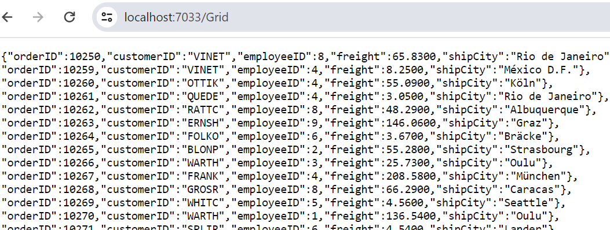
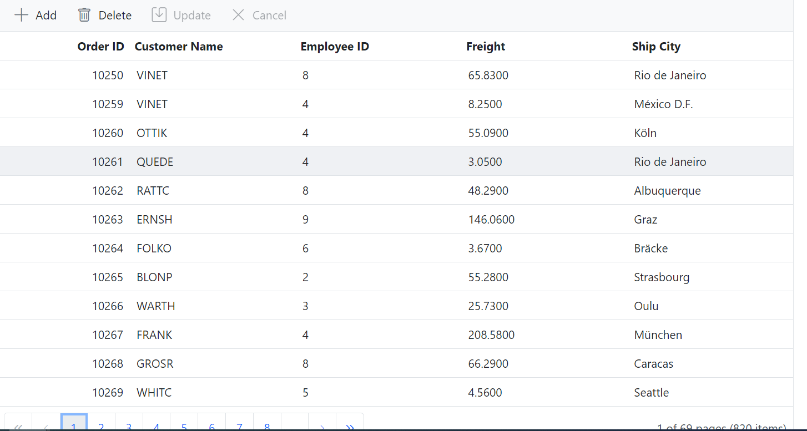

# Connecting SQLite Server data in to Blazor DataGrid Component

The Syncfusion<sup style="font-size:70%">&reg;</sup> Blazor DataGrid supports binding data from a **SQLite** database using the [Microsoft.Data.Sqlite](https://www.nuget.org/packages/Microsoft.Data.Sqlite/) provider. Data can be integrated through multiple approaches:

- Using the [DataSource](https://help.syncfusion.com/cr/blazor/Syncfusion.Blazor.Grids.SfGrid-1.html#Syncfusion_Blazor_Grids_SfGrid_1_DataSource) property for local binding.
- Implementing a [CustomAdaptor](https://blazor.syncfusion.com/documentation/datagrid/connecting-to-adaptors/custom-adaptor) for custom logic.
- Configuring remote data binding through adaptors such as [UrlAdaptor](https://blazor.syncfusion.com/documentation/data/adaptors#url-adaptor).

This guide focuses on two approaches for connecting **SQLite** data to the Blazor DataGrid:

* **Using UrlAdaptor**

The [UrlAdaptor](https://blazor.syncfusion.com/documentation/data/adaptors#url-adaptor) enables communication between the Blazor DataGrid and a remote API service connected to a **SQLite** database. This approach is suitable when the API implements custom logic for data operations and returns results in the **result** and **count** format required by the DataGrid.

* **Using CustomAdaptor**

The [CustomAdaptor](https://blazor.syncfusion.com/documentation/datagrid/connecting-to-adaptors/custom-adaptor) provides full control over data operations and CRUD functionality. It allows implementing custom logic for **searching**, **filtering**, **sorting**, **paging**, and **grouping** directly in the server-side code.

## Binding data from SQLite Server using an API service

This section describes step by step process how to retrieve data from a SQLite Server using an API service and bind it to the Blazor DataGrid component.

### Creating an API service

1. **Create an ASP.NET Core Web API Project**

In Visual Studio, create a new **ASP.NET Core Web API** project named **MyWebService**.

Refer to [Microsoft documentation](https://learn.microsoft.com/en-us/visualstudio/get-started/csharp/tutorial-aspnet-core?view=vs-2022) for detailed steps.

2. **Install SQLite Provider**

Add the [Microsoft.Data.Sqlite](https://www.nuget.org/packages/Microsoft.Data.Sqlite/) NuGet package to enable **SQLite** connectivity. Install it using NuGet Package Manager in Visual Studio:

(*Tools → NuGet Package Manager → Manage NuGet Packages for Solution*)

3. **Add API Controller**

Create a controller named **GridController.cs** under the Controllers folder.

4. **Retrieve Data from SQLite**

Use **SqliteConnection** and **SqliteCommand** to execute queries and populate a collection of model objects.



using Microsoft.AspNetCore.Mvc;
using System.Data;
using System.Data.SqlClient;
using Syncfusion.Blazor;
using Syncfusion.Blazor.Data;
using System.ComponentModel.DataAnnotations;
using Newtonsoft.Json;
namespace MyWebService.Controllers
{
    [ApiController]
    public class GridController : ControllerBase
    {
        public class Order
        {
            [Key]
            public int? OrderID { get; set; }
            public string? CustomerID { get; set; }
            public int? EmployeeID { get; set; }
            public decimal? Freight { get; set; }
            public string? ShipCity { get; set; }
        }

        [Route("api/[controller]")]
        public List<Order> GetOrderData()
        {
            //TODO: Enter the connectionstring of database
            string ConnectionString = @"<Enter a valid connection string>";
            string Query = "SELECT * FROM Orders ORDER BY OrderID;";
            List<Order> DataSource = new List<Order>();
            SqliteConnection Connection = new SqliteConnection(ConnectionString);
            Connection.Open();
            //Using SqliteCommand and Query create connection with database
            SqliteCommand Command = new SqliteCommand(Query, Connection);
            // Execute the SQLite command and retrieve data using SqliteDataReader
            using (SqliteDataReader reader = Command.ExecuteReader())
            {
                while (reader.Read())
                {
                    Order order = new Order
                    {
                        OrderID = reader.GetInt32(reader.GetOrdinal("OrderID")),
                        CustomerID = reader.GetString(reader.GetOrdinal("CustomerID")),
                        EmployeeID = reader.GetInt32(reader.GetOrdinal("EmployeeID")),
                        ShipCity = reader.GetString(reader.GetOrdinal("ShipCity")),
                        Freight = reader.GetDecimal(reader.GetOrdinal("Freight"))
                    };
                    DataSource.Add(order);
                }
            }
            return DataSource;
        }
    }
}



5. **Run and test the application**

Start the API and access **https://localhost:xxxx/api/Grid** to view the data.



### Connecting Blazor DataGrid to an API service

This section explains how to retrieve data from a **SQLite** database using `UrlAdaptor` and bind it to the Syncfusion<sup style="font-size:70%">&reg;</sup> Blazor DataGrid component.

**Prerequisites**

* [System requirements for Blazor components](https://blazor.syncfusion.com/documentation/system-requirements)

1. **Create a Blazor Web App**

Create a **Blazor Web App** using Visual Studio 2022. Use [Microsoft Templates](https://learn.microsoft.com/en-us/aspnet/core/blazor/tooling?view=aspnetcore-9.0&pivots=vs) or the Syncfusion<sup style="font-size:70%">&reg;</sup> Blazor Extension.

> Configure the [Interactive render mode](https://learn.microsoft.com/en-us/aspnet/core/blazor/components/render-modes?view=aspnetcore-9.0#render-modes) and [Interactivity location](https://learn.microsoft.com/en-us/aspnet/core/blazor/tooling?view=aspnetcore-9.0&pivots=vs) during project creation.

2. **Install Syncfusion Packages**

* Open the NuGet Package Manager in Visual Studio (*Tools → NuGet Package Manager → Manage NuGet Packages for Solution*). Search and install the following packages:

    - [Syncfusion.Blazor.Grid](https://www.nuget.org/packages/Syncfusion.Blazor.Grid/)
    - [Syncfusion.Blazor.Themes](https://www.nuget.org/packages/Syncfusion.Blazor.Themes/)

* Alternatively, use the Package Manager Console:

```powershell
Install-Package Syncfusion.Blazor.Grid -Version {{ site.releaseversion }}
Install-Package Syncfusion.Blazor.Themes -Version {{ site.releaseversion }}
```

> When using **WebAssembly** or **Auto** render modes in a Blazor Web App, install Syncfusion<sup style="font-size:70%">&reg;</sup> Blazor component NuGet packages within the client project.

> Syncfusion<sup style="font-size:70%">&reg;</sup> Blazor components are available on [nuget.org](https://www.nuget.org/packages?q=syncfusion.blazor). Refer to the [NuGet packages](https://blazor.syncfusion.com/documentation/nuget-packages) topic for a complete list of available packages.




Install-Package Syncfusion.Blazor.Grid -Version {{ site.releaseversion }}
Install-Package Syncfusion.Blazor.Themes -Version {{ site.releaseversion }}




> Syncfusion<sup style="font-size:70%">&reg;</sup> Blazor components are available in [nuget.org](https://www.nuget.org/packages?q=syncfusion.blazor). Refer to [NuGet packages](https://blazor.syncfusion.com/documentation/nuget-packages) topic for available NuGet packages list with component details.

3. **Register Syncfusion Blazor service**

- Add the required namespaces in **~/_Imports.razor**:

```cshtml
@using Syncfusion.Blazor
@using Syncfusion.Blazor.Grids
```

- For apps using **WebAssembly** or **Auto** (Server and WebAssembly) render modes, register the service in both **~/Program.cs** files.

```cshtml
using Syncfusion.Blazor;

builder.Services.AddSyncfusionBlazor();
```

4. **Add stylesheet and script resources**

Access the theme stylesheet and script from NuGet using [Static Web Assets](https://blazor.syncfusion.com/documentation/appearance/themes#static-web-assets). Include the stylesheet reference in the <head> section and the script reference at the end of the <body> in **~/Components/App.razor**:

```html
<head>
    <link href="_content/Syncfusion.Blazor.Themes/fluent.css" rel="stylesheet" />
</head>

<body>
    <script src="_content/Syncfusion.Blazor.Core/scripts/syncfusion-blazor.min.js" type="text/javascript"></script>
</body>
```

> * Refer to [Blazor Themes](https://blazor.syncfusion.com/documentation/appearance/themes) for additional methods such as [Static Web Assets](https://blazor.syncfusion.com/documentation/appearance/themes#static-web-assets), [CDN](https://blazor.syncfusion.com/documentation/appearance/themes#cdn-reference), and [CRG](https://blazor.syncfusion.com/documentation/common/custom-resource-generator).
> * Set the render mode to **InteractiveServer** or **InteractiveAuto** in the Blazor Web App configuration.

5. **Configure DataGrid with UrlAdaptor**

The [SfDataManager](https://help.syncfusion.com/cr/blazor/Syncfusion.Blazor.Data.SfDataManager.html) component supports multiple adaptors for remote data binding. For API services, set the [Adaptor](https://help.syncfusion.com/cr/blazor/Syncfusion.Blazor.Adaptors.html) property to [Adaptors.UrlAdaptor](https://help.syncfusion.com/cr/blazor/Syncfusion.Blazor.Adaptors.html#Syncfusion_Blazor_Adaptors_UrlAdaptor) and specify the service endpoint in the [Url](https://help.syncfusion.com/cr/blazor/Syncfusion.Blazor.DataManager.html#Syncfusion_Blazor_DataManager_Url) property.



@using Syncfusion.Blazor.Grids
@using Syncfusion.Blazor.Data
@using Syncfusion.Blazor
@using Microsoft.Data.SqlClient;

<SfGrid @ref="Grid" TValue="Order" AllowPaging="true" AllowFiltering="true" AllowSorting="true" AllowGrouping="true" Toolbar="@(new List<string>() { "Add", "Edit", "Delete", "Update", "Cancel", "Search" })">
    <SfDataManager Url="https://localhost:xxxx/api/Grid" InsertUrl="https://localhost:xxxx/api/Grid/Insert" UpdateUrl="https://localhost:xxxx/api/Grid/Update" RemoveUrl="https://localhost:xxxx/api/Grid/Delete" Adaptor="Adaptors.UrlAdaptor"></SfDataManager>
    <GridEditSettings AllowEditing="true" AllowDeleting="true" AllowAdding="true" Mode="EditMode.Normal"></GridEditSettings>
    <GridAggregates>
        <GridAggregate>
            <GridAggregateColumns>
                <GridAggregateColumn Field=@nameof(Order.Freight) Type="AggregateType.Sum" Format="C2">
                    <FooterTemplate>
                        @{
                            var aggregate = (context as AggregateTemplateContext);
                            <div>
                                <p>Sum: @aggregate.Sum</p>
                            </div>
                        }
                    </FooterTemplate>
                </GridAggregateColumn>
            </GridAggregateColumns>
        </GridAggregate>
        <GridAggregate>
            <GridAggregateColumns>
                <GridAggregateColumn Field=@nameof(Order.Freight) Type="AggregateType.Average" Format="C2">
                    <FooterTemplate>
                        @{
                            var aggregate = (context as AggregateTemplateContext);
                            <div>
                                <p>Average: @aggregate.Average</p>
                            </div>
                        }
                    </FooterTemplate>
                </GridAggregateColumn>
            </GridAggregateColumns>
        </GridAggregate>
    </GridAggregates>
    <GridColumns>
        <GridColumn Field=@nameof(Order.OrderID) HeaderText="Order ID" IsIdentity="true" ValidationRules="@(new ValidationRules{ Required= true })" IsPrimaryKey="true" TextAlign="TextAlign.Right" Width="120"></GridColumn>
        <GridColumn Field=@nameof(Order.CustomerID) HeaderText="Customer Name" ValidationRules="@(new ValidationRules{ Required= true, MinLength = 3 })" Width="150"></GridColumn>
        <GridColumn Field=@nameof(Order.EmployeeID) HeaderText="Employee ID" TextAlign="TextAlign.Right" Width="150"></GridColumn>
        <GridColumn Field=@nameof(Order.Freight) HeaderText="Freight" TextAlign="TextAlign.Right" Format="C2" Width="150"></GridColumn>
        <GridColumn Field=@nameof(Order.ShipCity) HeaderText="Ship City" Width="150"></GridColumn>
    </GridColumns>
</SfGrid>

@code {
    SfGrid<Order> Grid { get; set; }
    public List<Order> Orders { get; set; }

    public class Order
    {
        public int? OrderID { get; set; }
        public string CustomerID { get; set; }
        public int EmployeeID { get; set; }
        public decimal Freight { get; set; }
        public string ShipCity { get; set; }
    }
}


    public class GridController : ControllerBase
    {
        /// <summary>
        /// Returns the data collection as result and count after performing data operations based on request from <see cref=DataManagerRequest”/>
        /// </summary>
        /// <param name="DataManagerRequest">DataManagerRequest contains the information regarding searching, filtering, sorting, aggregates and paging which is handled on the Blazor DataGrid component side</param>
        /// <returns>The data collection's type is determined by how this method has been implemented.</returns>
        [HttpPost]
        [Route("api/[controller]")]
        public object Post([FromBody] DataManagerRequest DataManagerRequest)
        {
            IEnumerable<Order> DataSource = GetOrderData();
            int TotalRecordsCount = DataSource.Cast<Order>().Count();
            return new { result = DataSource, count = TotalRecordsCount };
        }
    }





### Handling data operations in UrlAdaptor

The Syncfusion<sup style="font-size:70%">&reg;</sup> Blazor DataGrid supports server-side operations such as **searching**, **sorting**, **filtering**, **aggregating**, and **paging** when using the [UrlAdaptor](https://blazor.syncfusion.com/documentation/data/adaptors#url-adaptor).

The [DataManagerRequest](https://help.syncfusion.com/cr/blazor/Syncfusion.Blazor.DataManagerRequest.html) object provides details for each operation, and these can be applied using built-in methods from the [DataOperations](https://help.syncfusion.com/cr/blazor/Syncfusion.Blazor.DataOperations.html) class:

* [PerformSearching](https://help.syncfusion.com/cr/blazor/Syncfusion.Blazor.DataOperations.html#Syncfusion_Blazor_DataOperations_PerformSearching__1_System_Linq_IQueryable___0__System_Collections_Generic_List_Syncfusion_Blazor_Data_SearchFilter__) -Applies search criteria to the data source based on search filters.
* [PerformFiltering](https://help.syncfusion.com/cr/blazor/Syncfusion.Blazor.DataOperations.html#Syncfusion_Blazor_DataOperations_PerformFiltering__1_System_Linq_IQueryable___0__System_Collections_Generic_List_Syncfusion_Blazor_Data_WhereFilter__System_String_) - Filters the data source using conditions specified in the request.
* [PerformSorting](https://help.syncfusion.com/cr/blazor/Syncfusion.Blazor.DataOperations.html#Syncfusion_Blazor_DataOperations_PerformSorting__1_System_Linq_IQueryable___0__System_Collections_Generic_List_Syncfusion_Blazor_Data_Sort__) - Sorts the data source according to one or more sort descriptors.
* [PerformTake](https://help.syncfusion.com/cr/blazor/Syncfusion.Blazor.DataOperations.html#Syncfusion_Blazor_DataOperations_PerformTake__1_System_Linq_IQueryable___0__System_Int32_) - Retrieves a specified number of records for paging.
* [PerformSkip](https://help.syncfusion.com/cr/blazor/Syncfusion.Blazor.DataOperations.html#Syncfusion_Blazor_DataOperations_PerformSkip__1_System_Linq_IQueryable___0__System_Int32_) - Skips a defined number of records before returning results.

These methods enable efficient handling of large datasets by performing operations on the server side. The following sections demonstrate how to manage these operations using the `UrlAdaptor`.

> * To enable these operations, add the **Syncfusion.Blazor.Data** package to the API service project using NuGet Package Manager in Visual Studio (*Tools → NuGet Package Manager → Manage NuGet Packages for Solution*).

### Handling searching operation

Enable server-side searching by implementing logic in the API controller with the [PerformSearching](https://help.syncfusion.com/cr/blazor/Syncfusion.Blazor.DataOperations.html#Syncfusion_Blazor_DataOperations_PerformSearching__1_System_Collections_Generic_IEnumerable___0__System_Collections_Generic_List_Syncfusion_Blazor_Data_SearchFilter__) method from the [DataOperations](https://help.syncfusion.com/cr/blazor/Syncfusion.Blazor.DataOperations.html) class. This method applies search criteria to the collection based on filters specified in the incoming [DataManagerRequest](https://help.syncfusion.com/cr/blazor/Syncfusion.Blazor.DataManagerRequest.html).



[HttpPost]
[Route("api/[controller]")]
public object Post([FromBody] DataManagerRequest DataManagerRequest)
{
    IEnumerable<Order> DataSource = GetOrderData();
    // Handling Searching in UrlAdaptor.
    if (DataManagerRequest.Search != null && DataManagerRequest.Search.Count > 0)
    {
        // Searching
        DataSource = DataOperations.PerformSearching(DataSource, DataManagerRequest.Search);
        //Add custom logic here if needed and remove above method
    }
    int TotalRecordsCount = DataSource.Cast<Order>().Count();
    return new { result = DataSource, count = TotalRecordsCount };
}


### Handling filtering operation

Enable server-side filtering by implementing logic in the API controller using the [PerformFiltering](https://help.syncfusion.com/cr/blazor/Syncfusion.Blazor.DataOperations.html#Syncfusion_Blazor_DataOperations_PerformFiltering__1_System_Collections_Generic_IEnumerable___0__System_Collections_Generic_List_Syncfusion_Blazor_Data_WhereFilter__System_String_) method from the [DataOperations](https://help.syncfusion.com/cr/blazor/Syncfusion.Blazor.DataOperations.html) class. This method applies filter conditions to the collection based on the criteria specified in the incoming [DataManagerRequest](https://help.syncfusion.com/cr/blazor/Syncfusion.Blazor.DataManagerRequest.html).


[HttpPost]
[Route("api/[controller]")]
public object Post([FromBody] DataManagerRequest DataManagerRequest)
{
    IEnumerable<Order> DataSource = GetOrderData();
    // Handling Filtering in UrlAdaptor.
    if (DataManagerRequest.Where != null && DataManagerRequest.Where.Count > 0)
    {
        // Filtering
        DataSource = DataOperations.PerformFiltering(DataSource, DataManagerRequest.Where, DataManagerRequest.Where[0].Operator);
        //Add custom logic here if needed and remove above method
    }
    int TotalRecordsCount = DataSource.Cast<Order>().Count();
    return new { result = DataSource, count = TotalRecordsCount };
}



### Handling sorting operation

Enable server-side sorting by implementing logic in the API controller using the [PerformSorting](https://help.syncfusion.com/cr/blazor/Syncfusion.Blazor.DataOperations.html#Syncfusion_Blazor_DataOperations_PerformSorting__1_System_Collections_Generic_IEnumerable___0__System_Collections_Generic_List_Syncfusion_Blazor_Data_Sort__) method from the [DataOperations](https://help.syncfusion.com/cr/blazor/Syncfusion.Blazor.DataOperations.html) class. This method sorts the collection based on one or more sort descriptors specified in the incoming [DataManagerRequest](https://help.syncfusion.com/cr/blazor/Syncfusion.Blazor.DataManagerRequest.html).


[HttpPost]
[Route("api/[controller]")]
public object Post([FromBody] DataManagerRequest DataManagerRequest)
{
    IEnumerable<Order> DataSource = GetOrderData();
    // Handling Sorting in UrlAdaptor.
    if (DataManagerRequest.Sorted != null && DataManagerRequest.Sorted.Count > 0)
    {
        // Sorting
        DataSource = DataOperations.PerformSorting(DataSource, DataManagerRequest.Sorted);
        //Add custom logic here if needed and remove above method
    }
    int TotalRecordsCount = DataSource.Cast<Order>().Count();
    return new { result = DataSource, count = TotalRecordsCount };
}


### Handling aggregate operation

Enable server-side aggregation by implementing logic in the API controller using the [PerformAggregation](https://help.syncfusion.com/cr/blazor/Syncfusion.Blazor.Data.DataUtil.html#Syncfusion_Blazor_Data_DataUtil_PerformAggregation_System_Collections_IEnumerable_System_Collections_Generic_List_Syncfusion_Blazor_Data_Aggregate__) method from the [DataUtil](https://help.syncfusion.com/cr/blazor/Syncfusion.Blazor.Data.DataUtil.html) class. This method calculates aggregate values such as **Sum**, **Average**, **Min**, and **Max** for the specified fields based on the incoming [DataManagerRequest](https://help.syncfusion.com/cr/blazor/Syncfusion.Blazor.DataManagerRequest.html).


 [HttpPost]
 [Route("api/[controller]")]
 public object Post([FromBody] DataManagerRequest DataManagerRequest)
 {
    IEnumerable<Order> DataSource = GetOrderData();
    int TotalRecordsCount = DataSource.Cast<Order>().Count();
    // Handling Aggregation in UrlAdaptor.
    IDictionary<string, object> Aggregates = null;
    if (DataManagerRequest.Aggregates != null) 
    {  
        // Aggregation
        Aggregates = DataUtil.PerformAggregation(DataSource, DataManagerRequest.Aggregates);
        //Add custom logic here if needed and remove above method                
    }
    return new { result = DataSource, count = TotalRecordsCount, aggregates = Aggregates };
 }


> The server-side implementation of the `PerformAggregation` method is required only for [Footer aggregates](https://blazor.syncfusion.com/documentation/datagrid/footer-aggregate). Explicit handling is not necessary for[ Group Footer aggregates](https://blazor.syncfusion.com/documentation/datagrid/group-and-caption-aggregate#group-footer-aggregates) or [Group Caption aggregates](https://blazor.syncfusion.com/documentation/datagrid/group-and-caption-aggregate#group-caption-aggregates).

### Handling paging operation

Enable server-side paging by implementing logic in the API controller using the [PerformSkip](https://help.syncfusion.com/cr/blazor/Syncfusion.Blazor.DataOperations.html#Syncfusion_Blazor_DataOperations_PerformSkip__1_System_Collections_Generic_IEnumerable___0__System_Int32_) and [PerformTake](https://help.syncfusion.com/cr/blazor/Syncfusion.Blazor.DataOperations.html#Syncfusion_Blazor_DataOperations_PerformTake__1_System_Collections_Generic_IEnumerable___0__System_Int32_) methods from the [DataOperations](https://help.syncfusion.com/cr/blazor/Syncfusion.Blazor.DataOperations.html) class. These methods apply paging based on the **Skip** and **Take** values provided in the incoming [DataManagerRequest](https://help.syncfusion.com/cr/blazor/Syncfusion.Blazor.DataManagerRequest.html).


[HttpPost]
[Route("api/[controller]")]
public object Post([FromBody] DataManagerRequest DataManagerRequest)
{
    IEnumerable<Order> DataSource = GetOrderData();
    int TotalRecordsCount = DataSource.Cast<Order>().Count();
    // Handling Paging in UrlAdaptor.
    if (DataManagerRequest.Skip != 0)
    {
        // Paging
        DataSource = DataOperations.PerformSkip(DataSource, DataManagerRequest.Skip);
        //Add custom logic here if needed and remove above method
    }
    if (DataManagerRequest.Take != 0)
    {
        DataSource = DataOperations.PerformTake(DataSource, DataManagerRequest.Take);
        //Add custom logic here if needed and remove above method
    }
    return new { result = DataSource, count = TotalRecordsCount };
}


N> For optimal performance, apply operations in the following sequence: **Searching → Filtering → Sorting → Aggregation → Paging → Grouping** in [ReadAsync](https://help.syncfusion.com/cr/blazor/Syncfusion.Blazor.DataAdaptor.html#Syncfusion_Blazor_DataAdaptor_ReadAsync_Syncfusion_Blazor_DataManagerRequest_System_String_) method.

### Handling CRUD operations

The Syncfusion<sup style="font-size:70%">&reg;</sup> Blazor DataGrid supports Create, Read, Update, and Delete (CRUD) operations through the [SfDataManager](https://help.syncfusion.com/cr/blazor/Syncfusion.Blazor.Data.SfDataManager.html) component. These operations are mapped to API endpoints using properties such as:

* [InsertUrl](https://help.syncfusion.com/cr/blazor/Syncfusion.Blazor.DataManager.html#Syncfusion_Blazor_DataManager_InsertUrl) – API endpoint for inserting new records.
* [UpdateUrl](https://help.syncfusion.com/cr/blazor/Syncfusion.Blazor.DataManager.html#Syncfusion_Blazor_DataManager_UpdateUrl) – API endpoint for updating existing records.
* [RemoveUrl](https://help.syncfusion.com/cr/blazor/Syncfusion.Blazor.DataManager.html#Syncfusion_Blazor_DataManager_UpdateUrl) – API endpoint for deleting records.
* [CrudUrl](https://help.syncfusion.com/cr/blazor/Syncfusion.Blazor.DataManager.html#Syncfusion_Blazor_DataManager_CrudUrl) – Single endpoint for all CRUD operations.
* [BatchUrl](https://help.syncfusion.com/cr/blazor/Syncfusion.Blazor.DataManager.html#Syncfusion_Blazor_DataManager_BatchUrl) – API endpoint for batch editing.

To enable editing, configure the [Toolbar](https://help.syncfusion.com/cr/blazor/Syncfusion.Blazor.Grids.SfGrid-1.html#Syncfusion_Blazor_Grids_SfGrid_1_Toolbar) and [GridEditSettings](https://help.syncfusion.com/cr/blazor/Syncfusion.Blazor.Grids.GridEditSettings.html) properties, and set the Mode property to [EditMode.Normal](https://help.syncfusion.com/cr/blazor/Syncfusion.Blazor.Grids.EditMode.html#Syncfusion_Blazor_Grids_EditMode_Normal) to allow adding, editing, and deleting records.



<SfGrid @ref="Grid" TValue="Order" AllowPaging="true" AllowFiltering="true" AllowSorting="true" AllowGrouping="true" Toolbar="@(new List<string>() { "Add", "Edit", "Delete", "Update", "Cancel", "Search" })">
    <SfDataManager Url="https://localhost:xxxx/api/Grid" InsertUrl="https://localhost:xxxx/api/Grid/Insert" UpdateUrl="https://localhost:xxxx/api/Grid/Update" RemoveUrl="https://localhost:xxxx/api/Grid/Delete" BatchUrl="https://localhost:7033/api/Grid/Batch" Adaptor="Adaptors.UrlAdaptor"></SfDataManager>
    <GridEditSettings AllowEditing="true" AllowDeleting="true" AllowAdding="true" Mode="EditMode.Normal"></GridEditSettings>
    <GridColumns>
        <GridColumn Field=@nameof(Order.OrderID) HeaderText="Order ID" IsIdentity="true" ValidationRules="@(new ValidationRules{ Required= true })" IsPrimaryKey="true" TextAlign="TextAlign.Right" Width="120"></GridColumn>
        <GridColumn Field=@nameof(Order.CustomerID) HeaderText="Customer Name" ValidationRules="@(new ValidationRules{ Required= true, MinLength = 3 })" Width="150"></GridColumn>
        <GridColumn Field=@nameof(Order.EmployeeID) HeaderText="Employee ID" TextAlign="TextAlign.Right" Width="150"></GridColumn>
        <GridColumn Field=@nameof(Order.Freight) HeaderText="Freight" TextAlign="TextAlign.Right" Format="C2" Width="150"></GridColumn>
        <GridColumn Field=@nameof(Order.ShipCity) HeaderText="Ship City" Width="150"></GridColumn>
    </GridColumns>
</SfGrid>



> * Normal(Inline) editing is the default [Mode](https://help.syncfusion.com/cr/blazor/Syncfusion.Blazor.Grids.GridEditSettings.html#Syncfusion_Blazor_Grids_GridEditSettings_Mode) for the Blazor DataGrid component.
> * To enable CRUD operations, set the [IsPrimaryKey](https://help.syncfusion.com/cr/blazor/Syncfusion.Blazor.Grids.GridColumn.html#Syncfusion_Blazor_Grids_GridColumn_IsPrimaryKey) property to **true** for a column that contains unique values.
> * If the database includes an auto-generated column, set the [IsIdentity](https://help.syncfusion.com/cr/blazor/Syncfusion.Blazor.Grids.GridColumn.html#Syncfusion_Blazor_Grids_GridColumn_IsIdentity) property for that column to disable editing during **add** or **update** operations.

**Insert Operation:**

To insert a new record, click the **Add** toolbar button. This action displays the edit form for entering the new record details. After providing the required values, click the **Update** toolbar button. The record will be added to the Orders table by invoking the following **POST** API method.



[HttpPost]
[Route("api/Grid/Insert")]
/// <summary>
/// Inserts a new data item into the data collection.
/// </summary>
/// <param name="CRUDModel<T>">The set of information along with new record detail which is need to be inserted.</param>
/// <returns>Returns void</returns>
public void Insert([FromBody] CRUDModel<Order> Value)
{
    //TODO: Enter the connectionstring of database
    string ConnectionString = @"<Enter a valid connection string>";
    //Create query to insert the specific into the database by accessing its properties
    string Query = $"Insert into Orders(OrderID,CustomerID,Freight,ShipCity,EmployeeID) values('{Value.Value.OrderID}','{Value.Value.CustomerID}','{Value.Value.Freight}','{Value.Value.ShipCity}','{Value.Value.EmployeeID}')";
    SqliteConnection Connection = new SqliteConnection(ConnectionString);
    Connection.Open();
    //Execute the SQLite Command
    SqliteCommand Command = new SqliteCommand(Query, Connection);
    //Execute this code to reflect the changes into the database
    Command.ExecuteNonQuery();
    Connection.Close();
    //Add custom logic here if needed and remove above method
}



**Update Operation:**

To edit a row, first select desired row and click the **Edit** toolbar button. The edit form will be displayed and proceed to modify any column value as per your requirement. Clicking the **Update** toolbar button will update the edit record in the Orders table by involving the following **Post** method of an API.



[HttpPost]
[Route("api/Grid/Update")]
/// <summary>
/// Update a existing data item from the data collection.
/// </summary>
/// <param name="CRUDModel<T>">The set of information along with updated record detail which is need to be updated.</param>
/// <returns>Returns void</returns>
public void Update([FromBody] CRUDModel<Order> Value)
{
    //TODO: Enter the connectionstring of database
    string ConnectionString = @"<Enter a valid connection string>";
    //Create query to update the changes into the database by accessing its properties
    string Query = $"Update Orders set CustomerID='{Value.Value.CustomerID}', Freight='{Value.Value.Freight}',EmployeeID='{Value.Value.EmployeeID}',ShipCity='{Value.Value.ShipCity}' where OrderID='{Value.Value.OrderID}'";
    SqliteConnection Connection = new SqliteConnection(ConnectionString);
    Connection.Open();
    //Execute the SQLite Command
    SqliteCommand Command = new SqliteCommand(Query, Connection);
    //Execute this code to reflect the changes into the database
    Command.ExecuteNonQuery();
    Connection.Close();
    //Add custom logic here if needed and remove above method
}



**Delete Operation:**

To remove a record, select the desired row and click the **Delete** toolbar button. This action sends a **DELETE** request to the configured API endpoint, passing the primary key of the selected record. The corresponding entry will be deleted from the Orders table by invoking the following **POST** API method.



 [HttpPost]
[Route("api/Grid/Delete")]
/// <summary>
/// Remove a specific data item from the data collection.
/// </summary>
/// <param name="CRUDModel<T>">The set of information along with specific record detail which is need to be removed.</param>
/// <returns>Returns void</returns>
public void Delete([FromBody] CRUDModel<Order> Value)
{
    //TODO: Enter the connectionstring of database
    string ConnectionString = @"<Enter a valid connection string>";
    //Create query to remove the specific from database by passing the primary key column value.
    string Query = $"Delete from Orders where OrderID={Value.Key}";
    SqliteConnection Connection = new SqliteConnection(ConnectionString);
    Connection.Open();
    //Execute the SQLite Command
    SqliteCommand Command = new SqliteCommand(Query, Connection);
    //Execute this code to reflect the changes into the database
    Command.ExecuteNonQuery();
    Connection.Close();
    //Add custom logic here if needed and remove above method
}



**Batch Operation:**

To perform batch updates, set the edit [Mode](https://help.syncfusion.com/cr/blazor/Syncfusion.Blazor.Grids.GridEditSettings.html#Syncfusion_Blazor_Grids_GridEditSettings_Mode) to **Batch** in the [GridEditSettings](https://help.syncfusion.com/cr/blazor/Syncfusion.Blazor.Grids.GridEditSettings.html) component and configure the [BatchUrl](https://help.syncfusion.com/cr/blazor/Syncfusion.Blazor.DataManager.html#Syncfusion_Blazor_DataManager_BatchUrl) property in the [SfDataManager](https://help.syncfusion.com/cr/blazor/Syncfusion.Blazor.Data.SfDataManager.html).
In batch mode:

- Use the **Add** toolbar button to insert new rows.
- Double-click a cell to edit its value.
- Select a row and click **Delete** to remove it.
- Click **Update** to commit all changes (insert, update, delete) in a single request from the Orders table using a single API **POST** request.


 [HttpPost]
[Route("api/Grid/Batch")]
/// <summary>
/// Batchupdate (Insert, Update, Delete) a collection of data items from the data collection.
/// </summary>
/// <param name="CRUDModel<T>">The set of information along with details about the CRUD actions to be executed from the database.</param>
/// <returns>Returns void</returns>
public void Batch([FromBody] CRUDModel<Order> Value)
{
    //TODO: Enter the connectionstring of database
    string ConnectionString = @"<Enter a valid connection string>";
    if (Value.Changed != null)
    {
        foreach (var Record in (IEnumerable<Order>)Value.Changed)
        {
            //Create query to update the changes into the database by accessing its properties
            string Query = $"Update Orders set CustomerID='{Record.CustomerID}', Freight='{Record.Freight}',EmployeeID='{Record.EmployeeID}',ShipCity='{Record.ShipCity}' where OrderID='{Record.OrderID}'";
            SqliteConnection Connection = new SqliteConnection(ConnectionString);
            Connection.Open();
            //Execute the SQLite Command
            SqliteCommand Command = new SqliteCommand(Query, Connection);
            //Execute this code to reflect the changes into the database
            Command.ExecuteNonQuery();
            Connection.Close();
            //Add custom logic here if needed and remove above method
        }

    }
    if (Value.Added != null)
    {
        foreach (var Record in (IEnumerable<Order>)Value.Added)
        {
            //Create query to insert the specific into the database by accessing its properties 
            string Query = $"Insert into Orders(CustomerID,Freight,ShipCity,EmployeeID) values('{Record.CustomerID}','{Record.Freight}','{Record.ShipCity}','{Record.EmployeeID}')";
            SqliteConnection Connection = new SqliteConnection(ConnectionString);
            Connection.Open();
            //Execute the SQLite Command
            SqliteCommand Command = new SqliteCommand(Query, Connection);
            //Execute this code to reflect the changes into the database
            Command.ExecuteNonQuery();
            Connection.Close();
            //Add custom logic here if needed and remove above method
        }
    }
    if (Value.Deleted != null)
    {
        foreach (var Record in (IEnumerable<Order>)Value.Deleted)
        {
            //Create query to remove the specific from database by passing the primary key column value.
            string Query = $"Delete from Orders where OrderID={Record.OrderID}";
            SqliteConnection Connection = new SqliteConnection(ConnectionString);
            Connection.Open();
            //Execute the SQLite Command
            SqliteCommand Command = new SqliteCommand(Query, Connection);
            //Execute this code to reflect the changes into the database
            Command.ExecuteNonQuery();
            Connection.Close();
            //Add custom logic here if needed and remove above method
        }
    }
}



> Find the complete implementation in this [GitHub](https://github.com/SyncfusionExamples/connecting-databases-to-blazor-datagrid-component/tree/master/Binding%20SQLite%20using%20UrlAdaptor) repository.

## Binding data from SQLite Server using CustomAdaptor

This section explains how to retrieve data from a SQLite database using `CustomAdaptor` and bind it to the Syncfusion<sup style="font-size:70%">&reg;</sup> Blazor DataGrid component. The `CustomAdaptor` approach provides full control over data operations and CRUD functionality, enabling custom logic for **searching**, **filtering**, **sorting**, **paging**, **grouping**, and **aggregates** directly in server-side code.

**Step 1: Create the Blazor DataGrid Component**

Follow the procedure described in [Connecting Blazor DataGrid to an API service](#connecting-blazor-datagrid-to-an-api-service).

> * Set the rendermode to InteractiveServer or InteractiveAuto based on application configuration.

**Step 2: Install SQLite Provider**

Add the [Microsoft.Data.Sqlite](https://www.nuget.org/packages/Microsoft.Data.Sqlite/) NuGet package to enable SQLite connectivity. Install it using NuGet Package Manager in Visual Studio:

*Tools → NuGet Package Manager → Manage NuGet Packages for Solution*

**Step 3: Configure the DataGrid with CustomAdaptor**

Inject a custom service into the `CustomAdaptor` and configure the component as shown below:



@rendermode InteractiveServer

@using Syncfusion.Blazor.Grids
@using Syncfusion.Blazor.Data
@using Syncfusion.Blazor
@using Microsoft.Data.SqlClient;

<SfGrid TValue="Order" AllowSorting="true" AllowFiltering="true" AllowGrouping="true" AllowPaging="true" Toolbar="@(new List<string>() { "Add", "Edit", "Delete", "Update", "Cancel", "Search" })">
    <SfDataManager AdaptorInstance="@typeof(CustomAdaptor)" Adaptor="Adaptors.CustomAdaptor"></SfDataManager>
    <GridEditSettings AllowEditing="true" AllowDeleting="true" AllowAdding="true" Mode="@EditMode.Normal"></GridEditSettings>
    <GridAggregates>
        <GridAggregate>
            <GridAggregateColumns>
                <GridAggregateColumn Field=@nameof(Order.Freight) Type="AggregateType.Sum" Format="C2">
                    <FooterTemplate>
                        @{
                            var aggregate = (context as AggregateTemplateContext);
                            <div>
                                <p>Sum: @aggregate.Sum</p>
                            </div>
                        }
                    </FooterTemplate>
                </GridAggregateColumn>
            </GridAggregateColumns>
        </GridAggregate>
        <GridAggregate>
            <GridAggregateColumns>
                <GridAggregateColumn Field=@nameof(Order.Freight) Type="AggregateType.Average" Format="C2">
                    <FooterTemplate>
                        @{
                            var aggregate = (context as AggregateTemplateContext);
                            <div>
                                <p>Average: @aggregate.Average</p>
                            </div>
                        }
                    </FooterTemplate>
                </GridAggregateColumn>
            </GridAggregateColumns>
        </GridAggregate>
    </GridAggregates>
    <GridColumns>
        <GridColumn Field=@nameof(Order.OrderID) HeaderText="Order ID" IsIdentity="true" ValidationRules="@(new ValidationRules{ Required= true })" IsPrimaryKey="true" TextAlign="TextAlign.Right" Width="120"></GridColumn>
        <GridColumn Field=@nameof(Order.CustomerID) HeaderText="Customer Name" ValidationRules="@(new ValidationRules{ Required= true, MinLength = 3 })" Width="150"></GridColumn>
        <GridColumn Field=@nameof(Order.EmployeeID) HeaderText="Employee ID" TextAlign="TextAlign.Right" Width="150"></GridColumn>
        <GridColumn Field=@nameof(Order.Freight) HeaderText="Freight" TextAlign="TextAlign.Right" Format="C2" Width="150"></GridColumn>
        <GridColumn Field=@nameof(Order.ShipCity) HeaderText="Ship City" Width="150"></GridColumn>
    </GridColumns>
</SfGrid>

@code {
    SfGrid<Order> Grid { get; set; }
}


  public class Order
  {
      public int? OrderID { get; set; }
      public string CustomerID { get; set; }
      public int EmployeeID { get; set; }
      public decimal Freight { get; set; }
      public string ShipCity { get; set; }
  }



**Step 4: Implement Data Retrieval Logic**

Implement the [ReadAsync](https://help.syncfusion.com/cr/blazor/Syncfusion.Blazor.DataAdaptor.html#Syncfusion_Blazor_DataAdaptor_ReadAsync_Syncfusion_Blazor_DataManagerRequest_System_String_) method in `CustomAdaptor` to fetch data from the service by calling **GetOrdersAsync**.

- Use **SqliteConnection** and **SqliteCommand** to connect to the SQLite database and execute the query.
- In `GetOrdersAsync`, employ **SqliteDataReader** with the `ExecuteReaderAsync` method to retrieve data asynchronously.
- Iterate through the result set using `ReadAsync` and populate a List collection.
- Return the response as a **Result** and **Count** pair in the `ReadAsync` method to bind data to the Blazor DataGrid component.



@rendermode InteractiveServer

@using Syncfusion.Blazor.Grids
@using Syncfusion.Blazor.Data
@using Syncfusion.Blazor
@using Microsoft.Data.SqlClient;

<SfGrid TValue="Order" AllowSorting="true" AllowFiltering="true" AllowGrouping="true" AllowPaging="true" Toolbar="@(new List<string>() { "Add","Edit", "Delete", "Update", "Cancel", "Search" })">
    <SfDataManager AdaptorInstance="@typeof(CustomAdaptor)" Adaptor="Adaptors.CustomAdaptor"></SfDataManager>
    <GridEditSettings AllowEditing="true" AllowDeleting="true" AllowAdding="true" Mode="@EditMode.Normal"></GridEditSettings>
    <GridAggregates>
        <GridAggregate>
            <GridAggregateColumns>
                <GridAggregateColumn Field=@nameof(Order.Freight) Type="AggregateType.Sum" Format="C2">
                    <FooterTemplate>
                        @{
                            var aggregate = (context as AggregateTemplateContext);
                            <div>
                                <p>Sum: @aggregate.Sum</p>
                            </div>
                        }
                    </FooterTemplate>
                </GridAggregateColumn>
            </GridAggregateColumns>
        </GridAggregate>
        <GridAggregate>
            <GridAggregateColumns>
                <GridAggregateColumn Field=@nameof(Order.Freight) Type="AggregateType.Average" Format="C2">
                    <FooterTemplate>
                        @{
                            var aggregate = (context as AggregateTemplateContext);
                            <div>
                                <p>Average: @aggregate.Average</p>
                            </div>
                        }
                    </FooterTemplate>
                </GridAggregateColumn>
            </GridAggregateColumns>
        </GridAggregate>
    </GridAggregates>
    <GridColumns>
        <GridColumn Field=@nameof(Order.OrderID) HeaderText="Order ID" IsIdentity="true" ValidationRules="@(new ValidationRules{ Required= true })" IsPrimaryKey="true" TextAlign="TextAlign.Right" Width="120"></GridColumn>
        <GridColumn Field=@nameof(Order.CustomerID) HeaderText="Customer Name" ValidationRules="@(new ValidationRules{ Required= true, MinLength = 3 })" Width="150"></GridColumn>
        <GridColumn Field=@nameof(Order.EmployeeID) HeaderText="Employee ID" TextAlign="TextAlign.Right" Width="150"></GridColumn>
        <GridColumn Field=@nameof(Order.Freight) HeaderText="Freight" TextAlign="TextAlign.Right" Format="C2" Width="150"></GridColumn>
        <GridColumn Field=@nameof(Order.ShipCity) HeaderText="Ship City" Width="150"></GridColumn>
    </GridColumns>
</SfGrid>

@code {
    /// <summary>
    /// Implementing CustomAdaptor by extending the <see cref=“DataAdaptor”/> class.
    /// The Blazor DataGrid component support for custom data binding, which enables the binding and manipulation of data in a personalized way, using user-defined methods.
    /// </summary>
    public class CustomAdaptor : DataAdaptor
    {
        public OrderData OrderService = new OrderData();
        /// <summary>
        /// Returns the data collection after performing data operations based on request from <see cref=”DataManagerRequest”/>
        /// </summary>
        /// <param name="DataManagerRequest">DataManagerRequest contains the information regarding paging, grouping, filtering, searching, sorting which is handled on the Blazor DataGrid component side</param>
        /// <param name="Key">An optional parameter that can be used to perform additional data operations.</param>
        /// <returns>The data collection's type is determined by how this method has been implemented.</returns>
        public override async Task<object> ReadAsync(DataManagerRequest DataManagerRequest, string Key = null)
        {
            IEnumerable<Order> DataSource = await OrderService.GetOrdersAsync();
            int TotalRecordsCount = DataSource.Cast<Order>().Count();
            //Here RequiresCount is passed from the control side itself, where ever the on-demand data fetching is needed then the RequiresCount is set as true in component side itself.
            return DataManagerRequest.RequiresCounts ? new DataResult() { Result = DataSource, Count = TotalRecordsCount } : (object)DataSource;
        }
    }
}


public class OrderData
{
    public async Task<List<Order>> GetOrdersAsync()
    {
        // Create query to fetch data from the database
        string Query = "SELECT * FROM Orders ORDER BY OrderID;";
        List<Order> Orders = new List<Order>();
        // Create sqlite Connection
        SqliteConnection Connection = new SqliteConnection(ConnectionString);
        Connection.Open();
        //Using SqliteCommand and Query create connection with database
        SqliteCommand Command = new SqliteCommand(Query, Connection);
        // Execute the SQLite command and retrieve data using SqliteDataReader
        using (SqliteDataReader reader = await Command.ExecuteReaderAsync())
        {
            while (await reader.ReadAsync())
            {
                Order order = new Order
                {
                    OrderID = reader.GetInt32(reader.GetOrdinal("OrderID")),
                    CustomerID = reader.GetString(reader.GetOrdinal("CustomerID")),
                    EmployeeID = reader.GetInt32(reader.GetOrdinal("EmployeeID")),
                    ShipCity = reader.GetString(reader.GetOrdinal("ShipCity")),
                    Freight = reader.GetDecimal(reader.GetOrdinal("Freight"))
                };
                Orders.Add(order);
            }
        }
        return Orders;
    }
}




### Handling data operations in a Custom Adaptor

The Syncfusion<sup style="font-size:70%">&reg;</sup> Blazor DataGrid supports server-side operations such as **searching**, **filtering**, **sorting**, **paging**, and **aggregating** when using a `CustomAdaptor`. These operations are implemented by overriding the [Read](https://help.syncfusion.com/cr/blazor/Syncfusion.Blazor.DataAdaptor.html#Syncfusion_Blazor_DataAdaptor_Read_Syncfusion_Blazor_DataManagerRequest_System_String_) or [ReadAsync](https://help.syncfusion.com/cr/blazor/Syncfusion.Blazor.DataAdaptor.html#Syncfusion_Blazor_DataAdaptor_ReadAsync_Syncfusion_Blazor_DataManagerRequest_System_String_) method of the [DataAdaptor](https://help.syncfusion.com/cr/blazor/Syncfusion.Blazor.DataAdaptor.html) abstract class.

The [DataManagerRequest](https://help.syncfusion.com/cr/blazor/Syncfusion.Blazor.DataManagerRequest.html) object provides the necessary details for each operation, and these can be applied using built-in methods from the [DataOperations](https://help.syncfusion.com/cr/blazor/Syncfusion.Blazor.DataOperations.html) and [DataUtil](https://help.syncfusion.com/cr/blazor/Syncfusion.Blazor.Data.DataUtil.html) classes:

* [PerformSearching](https://help.syncfusion.com/cr/blazor/Syncfusion.Blazor.DataOperations.html#Syncfusion_Blazor_DataOperations_PerformSearching__1_System_Collections_Generic_IEnumerable___0__System_Collections_Generic_List_Syncfusion_Blazor_Data_SearchFilter__) – Applies search criteria to the data source based on search filters.

* [PerformFiltering](https://help.syncfusion.com/cr/blazor/Syncfusion.Blazor.DataOperations.html#Syncfusion_Blazor_DataOperations_PerformFiltering__1_System_Collections_Generic_IEnumerable___0__System_Collections_Generic_List_Syncfusion_Blazor_Data_WhereFilter__System_String_) – Filters the data source using conditions specified in the request.

* [PerformSorting](https://help.syncfusion.com/cr/blazor/Syncfusion.Blazor.DataOperations.html#Syncfusion_Blazor_DataOperations_PerformSorting__1_System_Collections_Generic_IEnumerable___0__System_Collections_Generic_List_Syncfusion_Blazor_Data_SortedColumn__) – Sorts the data source according to one or more sort descriptors.

* [PerformSkip](https://help.syncfusion.com/cr/blazor/Syncfusion.Blazor.DataOperations.html#Syncfusion_Blazor_DataOperations_PerformSkip__1_System_Collections_Generic_IEnumerable___0__System_Int32_) – Retrieves a specified number of records for paging.

* [PerformTake](https://help.syncfusion.com/cr/blazor/Syncfusion.Blazor.DataOperations.html#Syncfusion_Blazor_DataOperations_PerformTake__1_System_Collections_Generic_IEnumerable___0__System_Int32_) – Skips a defined number of records before returning results.

* [PerformAggregation](https://help.syncfusion.com/cr/blazor/Syncfusion.Blazor.Data.DataUtil.html#Syncfusion_Blazor_Data_DataUtil_PerformAggregation_System_Collections_IEnumerable_System_Collections_Generic_List_Syncfusion_Blazor_Data_Aggregate__) – Applies aggregate details to calculate summary values such as Sum, Average, Min, and Max.

These methods enable efficient server-side data handling in a custom adaptor implementation for **SQLite**.

N> To enable these operations, install the **Syncfusion.Blazor.Data** package using NuGet Package Manager in Visual Studio:

(*Tools → NuGet Package Manager → Manage NuGet Packages for Solution*).

### Handling searching operation

When using `CustomAdaptor`, the searching operation is implemented by overriding the [Read](https://help.syncfusion.com/cr/blazor/Syncfusion.Blazor.DataAdaptor.html#Syncfusion_Blazor_DataAdaptor_Read_Syncfusion_Blazor_DataManagerRequest_System_String_) or [ReadAsync](https://help.syncfusion.com/cr/blazor/Syncfusion.Blazor.DataAdaptor.html#Syncfusion_Blazor_DataAdaptor_ReadAsync_Syncfusion_Blazor_DataManagerRequest_System_String_) method of the [DataAdaptor](https://help.syncfusion.com/cr/blazor/Syncfusion.Blazor.DataAdaptor.html) abstract class.

The built-in [PerformSearching](https://help.syncfusion.com/cr/blazor/Syncfusion.Blazor.DataOperations.html#Syncfusion_Blazor_DataOperations_PerformSearching__1_System_Collections_Generic_IEnumerable___0__System_Collections_Generic_List_Syncfusion_Blazor_Data_SearchFilter__) method of the [DataOperations](https://help.syncfusion.com/cr/blazor/Syncfusion.Blazor.DataOperations.html) class applies search criteria from the [DataManagerRequest](https://help.syncfusion.com/cr/blazor/Syncfusion.Blazor.DataManagerRequest.html) to the data source. Custom logic can also be implemented to handle searching as required.


public class CustomAdaptor : DataAdaptor
{
    public OrderData OrderService = new OrderData();
    // Performs data read operation
    public override async Task<object> ReadAsync(DataManagerRequest DataManagerRequest, string Key = null)
    {
        IEnumerable<Order> DataSource = await OrderService.GetOrdersAsync();
        // Handling Searching in CustomAdaptor.
        if (DataManagerRequest.Search != null && DataManagerRequest.Search.Count > 0)
        {
            // Searching
            DataSource = DataOperations.PerformSearching(DataSource, DataManagerRequest.Search);
            //Add custom logic here if needed and remove above method
        }
        int TotalRecordsCount = DataSource.Cast<Order>().Count();
        //Here RequiresCount is passed from the control side itself, where ever the on-demand data fetching is needed then the RequiresCount is set as true in component side itself.
        return DataManagerRequest.RequiresCounts ? new DataResult() { Result = DataSource, Count = TotalRecordsCount } : (object)DataSource;
    }
}


### Handling filtering operation

When implementing `CustomAdaptor`, the filtering operation is managed by overriding the[Read](https://help.syncfusion.com/cr/blazor/Syncfusion.Blazor.DataAdaptor.html#Syncfusion_Blazor_DataAdaptor_Read_Syncfusion_Blazor_DataManagerRequest_System_String_) or [ReadAsync](https://help.syncfusion.com/cr/blazor/Syncfusion.Blazor.DataAdaptor.html#Syncfusion_Blazor_DataAdaptor_ReadAsync_Syncfusion_Blazor_DataManagerRequest_System_String_) method of the [DataAdaptor](https://help.syncfusion.com/cr/blazor/Syncfusion.Blazor.DataAdaptor.html) abstract class.

The built-in [PerformFiltering](https://help.syncfusion.com/cr/blazor/Syncfusion.Blazor.DataOperations.html#Syncfusion_Blazor_DataOperations_PerformFiltering__1_System_Collections_Generic_IEnumerable___0__System_Collections_Generic_List_Syncfusion_Blazor_Data_WhereFilter__System_String_) method in the [DataOperations](https://help.syncfusion.com/cr/blazor/Syncfusion.Blazor.DataOperations.html) class applies filter criteria from the [DataManagerRequest](https://help.syncfusion.com/cr/blazor/Syncfusion.Blazor.DataManagerRequest.html) to the data collection. Custom filtering logic can also be implemented to meet specific requirements.


public class CustomAdaptor : DataAdaptor
{
    public OrderData OrderService = new OrderData();
    // Performs data read operation
    public override async Task<object> ReadAsync(DataManagerRequest DataManagerRequest, string Key = null)
    {
        IEnumerable<Order> DataSource = await OrderService.GetOrdersAsync();
        // Handling Filtering in CustomAdaptor.
        if (DataManagerRequest.Where != null && DataManagerRequest.Where.Count > 0)
        {
            // Filtering
            DataSource = DataOperations.PerformFiltering(DataSource, DataManagerRequest.Where, DataManagerRequest.Where[0].Operator);
            //Add custom logic here if needed and remove above method
        }
        int TotalRecordsCount = DataSource.Cast<Order>().Count();
        //Here RequiresCount is passed from the control side itself, where ever the on-demand data fetching is needed then the RequiresCount is set as true in component side itself.
        return DataManagerRequest.RequiresCounts ? new DataResult() { Result = DataSource, Count = TotalRecordsCount } : (object)DataSource;
    }
}


### Handling sorting operation

When implementing `CustomAdaptor`, the sorting operation is handled by overriding the [Read](https://help.syncfusion.com/cr/blazor/Syncfusion.Blazor.DataAdaptor.html#Syncfusion_Blazor_DataAdaptor_Read_Syncfusion_Blazor_DataManagerRequest_System_String_) or [ReadAsync](https://help.syncfusion.com/cr/blazor/Syncfusion.Blazor.DataAdaptor.html#Syncfusion_Blazor_DataAdaptor_ReadAsync_Syncfusion_Blazor_DataManagerRequest_System_String_) method of the [DataAdaptor](https://help.syncfusion.com/cr/blazor/Syncfusion.Blazor.DataAdaptor.html) abstract class.

The built-in [PerformSorting](https://help.syncfusion.com/cr/blazor/Syncfusion.Blazor.DataOperations.html#Syncfusion_Blazor_DataOperations_PerformSorting__1_System_Collections_Generic_IEnumerable___0__System_Collections_Generic_List_Syncfusion_Blazor_Data_Sort__) method in the [DataOperations](https://help.syncfusion.com/cr/blazor/Syncfusion.Blazor.DataOperations.html) class applies sort criteria from the [DataManagerRequest](https://help.syncfusion.com/cr/blazor/Syncfusion.Blazor.DataManagerRequest.html) to the data collection. Custom sorting logic can also be implemented to meet specific requirements.


public class CustomAdaptor : DataAdaptor
{
    public OrderData OrderService = new OrderData();
    // Performs data read operation
    public override async Task<object> ReadAsync(DataManagerRequest DataManagerRequest, string Key = null)
    {
        IEnumerable<Order> DataSource = await OrderService.GetOrdersAsync();
        // Handling Sorting in CustomAdaptor.
        if (DataManagerRequest.Sorted != null && DataManagerRequest.Sorted.Count > 0)
        {
            // Sorting
            DataSource = DataOperations.PerformSorting(DataSource, DataManagerRequest.Sorted);
            //Add custom logic here if needed and remove above method
        }
        int TotalRecordsCount = DataSource.Cast<Order>().Count();
        //Here RequiresCount is passed from the control side itself, where ever the on-demand data fetching is needed then the RequiresCount is set as true in component side itself.
        return DataManagerRequest.RequiresCounts ? new DataResult() { Result = DataSource, Count = TotalRecordsCount } : (object)DataSource;
    }
}


### Handling aggregate operation

When implementing `CustomAdaptor`, aggregate operations are managed by overriding the [Read](https://help.syncfusion.com/cr/blazor/Syncfusion.Blazor.DataAdaptor.html#Syncfusion_Blazor_DataAdaptor_Read_Syncfusion_Blazor_DataManagerRequest_System_String_) or [ReadAsync](https://help.syncfusion.com/cr/blazor/Syncfusion.Blazor.DataAdaptor.html#Syncfusion_Blazor_DataAdaptor_ReadAsync_Syncfusion_Blazor_DataManagerRequest_System_String_) method of the [DataAdaptor](https://help.syncfusion.com/cr/blazor/Syncfusion.Blazor.DataAdaptor-1.html) abstract class.

The built-in [PerformAggregation](https://help.syncfusion.com/cr/blazor/Syncfusion.Blazor.Data.DataUtil.html#Syncfusion_Blazor_Data_DataUtil_PerformAggregation_System_Collections_IEnumerable_System_Collections_Generic_List_Syncfusion_Blazor_Data_Aggregate__) method in the [DataUtil](https://help.syncfusion.com/cr/blazor/Syncfusion.Blazor.Data.DataUtil.html) class calculates aggregate values based on the criteria specified in the [DataManagerRequest](https://help.syncfusion.com/cr/blazor/Syncfusion.Blazor.DataManagerRequest.html). Custom aggregation logic can also be implemented when specific requirements exist.


public class CustomAdaptor : DataAdaptor
{
    public OrderData OrderService = new OrderData();
    // Performs data read operation
    public override async Task<object> ReadAsync(DataManagerRequest DataManagerRequest, string Key = null)
    {
        IEnumerable<Order> DataSource = await OrderService.GetOrdersAsync();
        int TotalRecordsCount = DataSource.Cast<Order>().Count();
        // Handling Aggregation in CustomAdaptor.
        IDictionary<string, object> Aggregates = null;
        if (DataManagerRequest.Aggregates != null) // Aggregation
        {
            Aggregates = DataUtil.PerformAggregation(DataSource, DataManagerRequest.Aggregates);
            //Add custom logic here if needed and remove above method
        }
        //Here RequiresCount is passed from the control side itself, where ever the on-demand data fetching is needed then the RequiresCount is set as true in component side itself.
        return DataManagerRequest.RequiresCounts ? new DataResult() { Result = DataSource, Count = TotalRecordsCount, Aggregates = Aggregates } : (object)DataSource;
    }
}


> The server-side implementation of the `PerformAggregation` method is required only for [Footer aggregates](https://blazor.syncfusion.com/documentation/datagrid/footer-aggregate). Explicit handling is not necessary for[ Group Footer aggregates](https://blazor.syncfusion.com/documentation/datagrid/group-and-caption-aggregate#group-footer-aggregates) or [Group Caption aggregates](https://blazor.syncfusion.com/documentation/datagrid/group-and-caption-aggregate#group-caption-aggregates).

### Handling paging operation

When implementing `CustomAdaptor`, paging is managed by overriding the [Read](https://help.syncfusion.com/cr/blazor/Syncfusion.Blazor.DataAdaptor.html#Syncfusion_Blazor_DataAdaptor_Read_Syncfusion_Blazor_DataManagerRequest_System_String_) or [ReadAsync](https://help.syncfusion.com/cr/blazor/Syncfusion.Blazor.DataAdaptor.html#Syncfusion_Blazor_DataAdaptor_ReadAsync_Syncfusion_Blazor_DataManagerRequest_System_String_) method of the [DataAdaptor](https://help.syncfusion.com/cr/blazor/Syncfusion.Blazor.DataAdaptor.html) abstract class.

The built-in [PerformSkip](https://help.syncfusion.com/cr/blazor/Syncfusion.Blazor.DataOperations.html#Syncfusion_Blazor_DataOperations_PerformSkip__1_System_Collections_Generic_IEnumerable___0__System_Int32_) and [PerformTake](https://help.syncfusion.com/cr/blazor/Syncfusion.Blazor.DataOperations.html#Syncfusion_Blazor_DataOperations_PerformTake__1_System_Collections_Generic_IEnumerable___0__System_Int32_) methods in the [DataOperations](https://help.syncfusion.com/cr/blazor/Syncfusion.Blazor.DataOperations.html) class apply paging criteria from the [DataManagerRequest](https://help.syncfusion.com/cr/blazor/Syncfusion.Blazor.DataManagerRequest.html) to the data collection. Custom paging logic can also be implemented when specific requirements exist.


public class CustomAdaptor : DataAdaptor
{
    public OrderData OrderService = new OrderData();
    // Performs data read operation
    public override async Task<object> ReadAsync(DataManagerRequest DataManagerRequest, string Key = null)
    {
        IEnumerable<Order> DataSource = await OrderService.GetOrdersAsync();
        int TotalRecordsCount = DataSource.Cast<Order>().Count();
        // Handling paging in CustomAdaptor.
        if (DataManagerRequest.Skip != 0)
        {
            // Paging
            DataSource = DataOperations.PerformSkip(DataSource, DataManagerRequest.Skip);
            //Add custom logic here if needed and remove above method
        }
        if (DataManagerRequest.Take != 0)
        {
            
            DataSource = DataOperations.PerformTake(DataSource, DataManagerRequest.Take);
            //Add custom logic here if needed and remove above method
        }
        //Here RequiresCount is passed from the control side itself, where ever the on-demand data fetching is needed then the RequiresCount is set as true in component side itself.
        return DataManagerRequest.RequiresCounts ? new DataResult() { Result = DataSource, Count = TotalRecordsCount } : (object)DataSource;
    }
}


### Handling grouping operation

When implementing `CustomAdaptor`, grouping is managed by overriding the [Read](https://help.syncfusion.com/cr/blazor/Syncfusion.Blazor.DataAdaptor.html#Syncfusion_Blazor_DataAdaptor_Read_Syncfusion_Blazor_DataManagerRequest_System_String_) or [ReadAsync](https://help.syncfusion.com/cr/blazor/Syncfusion.Blazor.DataAdaptor.html#Syncfusion_Blazor_DataAdaptor_ReadAsync_Syncfusion_Blazor_DataManagerRequest_System_String_) method of the [DataAdaptor](https://help.syncfusion.com/cr/blazor/Syncfusion.Blazor.DataAdaptor.html) abstract class.

The built-in [Group](https://help.syncfusion.com/cr/blazor/Syncfusion.Blazor.Data.DataUtil.html#Syncfusion_Blazor_Data_DataUtil_Group__1_System_Collections_IEnumerable_System_String_System_Collections_Generic_List_Syncfusion_Blazor_Data_Aggregate__System_Int32_System_Collections_Generic_IDictionary_System_String_System_String__System_Boolean_System_Boolean_) method in the [DataUtil](https://help.syncfusion.com/cr/blazor/Syncfusion.Blazor.Data.DataUtil.html) class applies grouping logic based on the configuration in the [DataManagerRequest](https://help.syncfusion.com/cr/blazor/Syncfusion.Blazor.DataManagerRequest.html). Custom grouping logic can also be implemented when specific requirements exist.


public class CustomAdaptor : DataAdaptor
{
    public OrderData OrderService = new OrderData();
    // Performs data read operation
    public override async Task<object> ReadAsync(DataManagerRequest DataManagerRequest, string Key = null)
    {
        IEnumerable<Order> DataSource = await OrderService.GetOrdersAsync();
        int TotalRecordsCount = DataSource.Cast<Order>().Count();
        DataResult DataObject = new DataResult();
        // Handling Group operation in CustomAdaptor.
        if (DataManagerRequest.Group != null)
        {
            IEnumerable ResultData = DataSource.ToList();
            // Grouping
            foreach (var group in DataManagerRequest.Group)
            {
                ResultData = DataUtil.Group<Order>(ResultData, group, DataManagerRequest.Aggregates, 0, DataManagerRequest.GroupByFormatter);
                //Add custom logic here if needed and remove above method
            }
            DataObject.Result = ResultData;
            DataObject.Count = TotalRecordsCount;
            return DataManagerRequest.RequiresCounts ? DataObject : (object)ResultData;
        }
        //Here RequiresCount is passed from the control side itself, where ever the on-demand data fetching is needed then the RequiresCount is set as true in component side itself.
        return DataManagerRequest.RequiresCounts ? new DataResult() { Result = DataSource, Count = TotalRecordsCount } : (object)DataSource;
    }
}


N> For optimal performance, apply operations in the following sequence: **Searching → Filtering → Sorting → Aggregation → Paging → Grouping** in [ReadAsync](https://help.syncfusion.com/cr/blazor/Syncfusion.Blazor.DataAdaptor.html#Syncfusion_Blazor_DataAdaptor_ReadAsync_Syncfusion_Blazor_DataManagerRequest_System_String_) method.

```cshtml
public class CustomAdaptor : DataAdaptor
{
    public OrderData OrderService = new OrderData();
    // Performs data Read operation
    public override async Task<object> ReadAsync(DataManagerRequest DataManagerRequest, string Key = null)
    {
        IEnumerable<Order> DataSource = await OrderService.GetOrdersAsync();
        int TotalRecordsCount = DataSource.Cast<Order>().Count();
        DataResult DataObject = new DataResult();
        // Handling both Grouping and Aggregation in CustomAdaptor.
        if (DataManagerRequest.Aggregates != null || DataManagerRequest.Group != null) // Aggregation
        {
            if (DataManagerRequest.Group != null)
            {
                IEnumerable ResultData = DataSource.ToList();
                // Grouping
                foreach (var group in DataManagerRequest.Group)
                {
                    ResultData = DataUtil.Group<Order>(ResultData, group, DataManagerRequest.Aggregates, 0, DataManagerRequest.GroupByFormatter);
                    //Add custom logic here if needed and remove above method
                }
                DataObject.Result = ResultData;
            }
            else
            {
                DataObject.Result = DataSource;
            }
            DataObject.Count = TotalRecordsCount;
            DataObject.Aggregates = DataUtil.PerformAggregation(DataSource, DataManagerRequest.Aggregates);

            return DataManagerRequest.RequiresCounts ? DataObject : (object)DataSource;
        }
        //Here RequiresCount is passed from the control side itself, where ever the on-demand data fetching is needed then the RequiresCount is set as true in component side itself.
        return DataManagerRequest.RequiresCounts ? new DataResult() { Result = DataSource, Count = TotalRecordsCount } : (object)DataSource;
    }
}
```

### Handling CRUD operations

The Syncfusion<sup style="font-size:70%">&reg;</sup> Blazor DataGrid component supports Create, Read, Update, and Delete (CRUD) operations through the [GridEditSettings](https://help.syncfusion.com/cr/blazor/Syncfusion.Blazor.Grids.GridEditSettings.html) configuration. Multiple edit modes are available, including **Inline**, **Dialog**, and **Batch** editing. For details, refer to the [Editing](https://blazor.syncfusion.com/documentation/datagrid/editing) documentation.

When using `CustomAdaptor`, CRUD operations are implemented by overriding the following methods of the [DataAdaptor](https://help.syncfusion.com/cr/blazor/Syncfusion.Blazor.DataAdaptor-1.html) class:

* [Insert](https://help.syncfusion.com/cr/blazor/Syncfusion.Blazor.DataAdaptor.html#Syncfusion_Blazor_DataAdaptor_Insert_Syncfusion_Blazor_DataManager_System_Object_System_String_) / [InsertAsync](https://help.syncfusion.com/cr/blazor/Syncfusion.Blazor.DataAdaptor.html#Syncfusion_Blazor_DataAdaptor_InsertAsync_Syncfusion_Blazor_DataManager_System_Object_System_String_) – Handles record insertion.
* [Update](https://help.syncfusion.com/cr/blazor/Syncfusion.Blazor.DataAdaptor.html#Syncfusion_Blazor_DataAdaptor_Update_Syncfusion_Blazor_DataManager_System_Object_System_String_System_String_) / [UpdateAsync](https://help.syncfusion.com/cr/blazor/Syncfusion.Blazor.DataAdaptor.html#Syncfusion_Blazor_DataAdaptor_UpdateAsync_Syncfusion_Blazor_DataManager_System_Object_System_String_System_String_) – Handles record updates.
* [Remove](https://help.syncfusion.com/cr/blazor/Syncfusion.Blazor.DataAdaptor.html#Syncfusion_Blazor_DataAdaptor_Remove_Syncfusion_Blazor_DataManager_System_Object_System_String_System_String_) / [RemoveAsync](https://help.syncfusion.com/cr/blazor/Syncfusion.Blazor.DataAdaptor.html#Syncfusion_Blazor_DataAdaptor_RemoveAsync_Syncfusion_Blazor_DataManager_System_Object_System_String_System_String_) – Handles record deletion.
* [BatchUpdate](https://help.syncfusion.com/cr/blazor/Syncfusion.Blazor.DataAdaptor.html#Syncfusion_Blazor_DataAdaptor_BatchUpdate_Syncfusion_Blazor_DataManager_System_Object_System_Object_System_Object_System_String_System_String_System_Nullable_System_Int32__) / [BatchUpdateAsync](https://help.syncfusion.com/cr/blazor/Syncfusion.Blazor.DataAdaptor.html#Syncfusion_Blazor_DataAdaptor_BatchUpdateAsync_Syncfusion_Blazor_DataManager_System_Object_System_Object_System_Object_System_String_System_String_System_Nullable_System_Int32__) – Handles batch operations (insert, update, delete).

Each method can be customized to execute SQL commands against the **SQLite Server** database.


<SfGrid TValue="Order" AllowSorting="true" AllowFiltering="true" AllowGrouping="true" AllowPaging="true" Toolbar="@(new List<string>() { "Add", "Edit", "Delete", "Update", "Cancel", "Search" })">
    <SfDataManager AdaptorInstance="@typeof(CustomAdaptor)" Adaptor="Adaptors.CustomAdaptor"></SfDataManager>
    <GridEditSettings AllowEditing="true" AllowDeleting="true" AllowAdding="true" Mode="@EditMode.Normal"></GridEditSettings>
    <GridColumns>
        <GridColumn Field=@nameof(Order.OrderID) HeaderText="Order ID" IsIdentity="true" ValidationRules="@(new ValidationRules{ Required= true })" IsPrimaryKey="true" TextAlign="TextAlign.Right" Width="120"></GridColumn>
        <GridColumn Field=@nameof(Order.CustomerID) HeaderText="Customer Name" ValidationRules="@(new ValidationRules{ Required= true, MinLength = 3 })" Width="150"></GridColumn>
        <GridColumn Field=@nameof(Order.EmployeeID) HeaderText="Employee ID" TextAlign="TextAlign.Right" Width="150"></GridColumn>
        <GridColumn Field=@nameof(Order.Freight) HeaderText="Freight" TextAlign="TextAlign.Right" Format="C2" Width="150"></GridColumn>
        <GridColumn Field=@nameof(Order.ShipCity) HeaderText="Ship City" Width="150"></GridColumn>
    </GridColumns>
</SfGrid>


> * Normal(Inline) editing is the default [Mode](https://help.syncfusion.com/cr/blazor/Syncfusion.Blazor.Grids.GridEditSettings.html#Syncfusion_Blazor_Grids_GridEditSettings_Mode) for the Blazor DataGrid component.
> * To enable CRUD operations, set the [IsPrimaryKey](https://help.syncfusion.com/cr/blazor/Syncfusion.Blazor.Grids.GridColumn.html#Syncfusion_Blazor_Grids_GridColumn_IsPrimaryKey) property to **true** for a column that contains unique values.
> * If the database includes an auto-generated column, set the [IsIdentity](https://help.syncfusion.com/cr/blazor/Syncfusion.Blazor.Grids.GridColumn.html#Syncfusion_Blazor_Grids_GridColumn_IsIdentity) property for that column to disable editing during **add** or **update** operations.

**Insert Operation:**

To implement record insertion, override the [Insert](https://help.syncfusion.com/cr/blazor/Syncfusion.Blazor.DataAdaptor.html#Syncfusion_Blazor_DataAdaptor_Insert_Syncfusion_Blazor_DataManager_System_Object_System_String_) or [InsertAsync](https://help.syncfusion.com/cr/blazor/Syncfusion.Blazor.DataAdaptor.html#Syncfusion_Blazor_DataAdaptor_InsertAsync_Syncfusion_Blazor_DataManager_System_Object_System_String_) method in the `CustomAdaptor` class.



/// <summary>
/// Inserts a new data item into the data collection.
/// </summary>
/// <param name="DataManager">The DataManager is a data management component used for performing data operations in application.</param>
/// <param name="Value">The new record which is need to be inserted.</param>
/// <param name="Key">An optional parameter that can be used to perform additional data operations.</param>
/// <returns>Returns the newly inserted record details.</returns>
public override async Task<object> InsertAsync(DataManager DataManager, object Value, string Key)
{
    // Add your insert logic here
    // This method will be invoked when inserting new records into the Blazor DataGrid component.
    await OrderService.AddOrderAsync(Value as Order);
    return Value;
}


public async Task AddOrderAsync(Order Value)
{
    //Create query to insert the specific into the database by accessing its properties 
    string Query = $"Insert into Orders(OrderID,CustomerID,Freight,ShipCity,EmployeeID) values('{(Value as Order).OrderID}','{(Value as Order).CustomerID}','{(Value as Order).Freight}','{(Value as Order).ShipCity}','{(Value as Order).EmployeeID}')";
    SqliteConnection Connection = new SqliteConnection(ConnectionString);
    Connection.Open();
    //Execute the SQLite Command
    SqliteCommand Command = new SqliteCommand(Query, Connection);
    //Execute this code to reflect the changes into the database
    Command.ExecuteNonQuery();
    Connection.Close();
}



**Update Operation:**

To implement record updates, override the [Update](https://help.syncfusion.com/cr/blazor/Syncfusion.Blazor.DataAdaptor.html#Syncfusion_Blazor_DataAdaptor_Update_Syncfusion_Blazor_DataManager_System_Object_System_String_System_String_) or [UpdateAsync](https://help.syncfusion.com/cr/blazor/Syncfusion.Blazor.DataAdaptor.html#Syncfusion_Blazor_DataAdaptor_UpdateAsync_Syncfusion_Blazor_DataManager_System_Object_System_String_System_String_) method in the `CustomAdaptor` class.



/// <summary>
/// Updates an existing data item in the data collection.
/// </summary>
/// <param name="DataManager">The DataManager is a data management component used for performing data operations in application.</param>
/// <param name="Value">The modified record which is need to be updated.</param>
/// <param name="KeyField">The primary column name specifies the field name of the primary column.</param>
/// <param name="Key">An optional parameter that can be used to perform additional data operations.</param>
/// <returns>Returns the updated data item.</returns>
public override async Task<object> UpdateAsync(DataManager DataManager, object Value, string KeyField, string Key)
{
    // Add your update logic here
    // This method will be invoked when updating existing records in the Blazor DataGrid component.
    await OrderService.UpdateOrderAsync(Value as Order);
    return Value;
}


 public async Task UpdateOrderAsync(Order Value)
 {
    //Create query to update the changes into the database by accessing its properties
    string Query = $"Update Orders set CustomerID='{(Value as Order).CustomerID}', Freight='{(Value as Order).Freight}',EmployeeID='{(Value as Order).EmployeeID}',ShipCity='{(Value as Order).ShipCity}' where OrderID='{(Value as Order).OrderID}'";
    SqliteConnection Connection = new SqliteConnection(ConnectionString);
    Connection.Open();
    //Execute the SQLite Command
    SqliteCommand Command = new SqliteCommand(Query, Connection);
    //Execute this code to reflect the changes into the database
    Command.ExecuteNonQuery();
    Connection.Close();
 }



**Delete Operation:**

To perform record deletion, override the [Remove](https://help.syncfusion.com/cr/blazor/Syncfusion.Blazor.DataAdaptor.html#Syncfusion_Blazor_DataAdaptor_Remove_Syncfusion_Blazor_DataManager_System_Object_System_String_System_String_) or [RemoveAsync](https://help.syncfusion.com/cr/blazor/Syncfusion.Blazor.DataAdaptor.html#Syncfusion_Blazor_DataAdaptor_RemoveAsync_Syncfusion_Blazor_DataManager_System_Object_System_String_System_String_) method in the `CustomAdaptor` class.



/// <summary>
/// Removes a data item from the data collection.
/// </summary>
/// <param name="DataManager">The DataManager is a data management component used for performing data operations in application.</param>
/// <param name="Value">The Value specifies the primary column value which is needs to be removed from the grid record.</param>
/// <param name="KeyField">The KeyField specifies the field name of the primary column.</param>
/// <param name="Key">An optional parameter that can be used to perform additional data operations.</param>
/// <returns>Returns the removed data item.</returns>
public override async Task<object> RemoveAsync(DataManager DataManager, object Value, string KeyField, string Key)
{
    // Add your delete logic here
    // This method will be invoked when deleting existing records from the Blazor DataGrid component.
    await OrderService.RemoveOrderAsync(Value as int?);
    return Value;
}


 public async Task RemoveOrderAsync(int? Key)
 {
    //Create query to remove the specific from database by passing the primary key column value.
    string Query = $"Delete from Orders where OrderID={Key}";
    SqliteConnection Connection = new SqliteConnection(ConnectionString);
    Connection.Open();
    //Execute the SQLite Command
    SqliteCommand Command = new SqliteCommand(Query, Connection);
    //Execute this code to reflect the changes into the database
    Command.ExecuteNonQuery();
    Connection.Close();
 }



**Batch Operation:**

To implement batch updates such as insert, update, and delete in a single request, override the [BatchUpdate](https://help.syncfusion.com/cr/blazor/Syncfusion.Blazor.DataAdaptor.html#Syncfusion_Blazor_DataAdaptor_BatchUpdate_Syncfusion_Blazor_DataManager_System_Object_System_Object_System_Object_System_String_System_String_System_Nullable_System_Int32__) or [BatchUpdateAsync](https://help.syncfusion.com/cr/blazor/Syncfusion.Blazor.DataAdaptor.html#Syncfusion_Blazor_DataAdaptor_BatchUpdateAsync_Syncfusion_Blazor_DataManager_System_Object_System_Object_System_Object_System_String_System_String_System_Nullable_System_Int32__) method in the `CustomAdaptor` class.


/// <summary>
/// /// Batchupdate (Insert, Update, Delete) a collection of data items from the data collection.
/// </summary>
/// <param name="DataManager">The DataManager is a data management component used for performing data operations in application.</param>
/// <param name="Changed">The Changed specifies the collection of record updated in batch mode which needs to be updated from the grid record.</param>
/// <param name="Added">The Added specifies the collection of record inserted in batch mode which needs to be inserted from the grid record.</param>
/// <param name="Deleted">The Deleted specifies the collection of record deleted in batch mode which needs to be removed from the grid record.</param>
/// <param name="KeyField">The KeyField specifies the field name of the primary column.</param>
/// <param name="Key">An optional parameter that can be used to perform additional data operations.</param>
/// <param name="DropIndex">An optional parameter that can be used to perform row drag and drop operation.</param>
/// <returns>Returns the removed data item.</returns>
public override async Task<object> BatchUpdateAsync(DataManager DataManager, object Changed, object Added, object Deleted, string KeyField, string Key, int? DropIndex)
{
    if (Changed != null)
    {
        foreach (var record in (IEnumerable<Order>)Changed)
        {
            await OrderService.UpdateOrderAsync(record as Order);
        }
    }
    if (Added != null)
    {
        foreach (var record in (IEnumerable<Order>)Added)
        {
            await OrderService.AddOrderAsync(record as Order);
        }
    }
    if (Deleted != null)
    {
        foreach (var record in (IEnumerable<Order>)Deleted)
        {
            await OrderService.RemoveOrderAsync((record as Order).OrderID);
        }
    }
    return Key;
}



> A complete sample implementation is available in the [GitHub](https://github.com/SyncfusionExamples/connecting-databases-to-blazor-datagrid-component/tree/master/Binding%20SQLite%20using%20CustomAdaptor) repository.