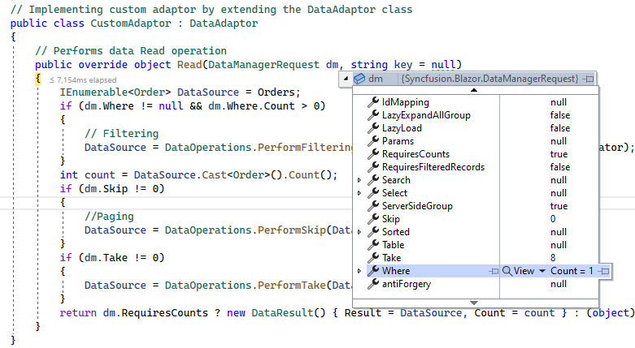
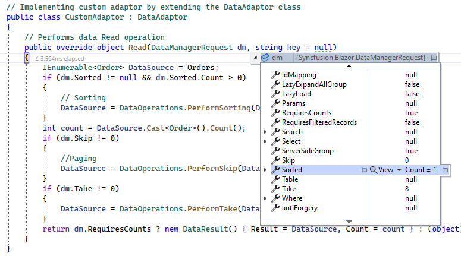

# Custom Binding in Blazor DataGrid Component

The [SfDataManager](https://help.syncfusion.com/cr/blazor/Syncfusion.Blazor.Data.SfDataManager.html) has custom adaptor support which allows you to perform manual operations on the data. This can be utilized for implementing custom data binding and editing operations in the DataGrid component.

For implementing custom data binding in DataGrid, the **DataAdaptor** class is used. This abstract class acts as a base class for the custom adaptor.

The **DataAdaptor** abstract class has both synchronous and asynchronous method signatures which can be overridden in the custom adaptor. Following are the method signatures present in this class,

```csharp
public abstract class DataAdaptor
{
    /// <summary>
    /// Performs data Read operation synchronously.
    /// </summary>
    public virtual object Read(DataManagerRequest dataManagerRequest, string key = null)

    /// <summary>
    /// Performs data Read operation asynchronously.
    /// </summary>
    public virtual Task<object> ReadAsync(DataManagerRequest dataManagerRequest, string key = null)

    /// <summary>
    /// Performs Insert operation synchronously.
    /// </summary>
    public virtual object Insert(DataManager dataManager, object data, string key)
    /// <summary>
    /// Performs Insert operation asynchronously.
    /// </summary>
    public virtual Task<object> InsertAsync(DataManager dataManager, object data, string key)

    /// <summary>
    /// Performs Remove operation synchronously.
    /// </summary>
    public virtual object Remove(DataManager dataManager, object data, string keyField, string key)

    /// <summary>
    /// Performs Remove operation asynchronously.
    /// </summary>
    public virtual Task<object> RemoveAsync(DataManager dataManager, object data, string keyField, string key)

    /// <summary>
    /// Performs Update operation synchronously.
    /// </summary>
    public virtual object Update (DataManager dataManager, object data, string keyField, string key)

    /// <summary>
    /// Performs Update operation asynchronously.
    /// </summary>
    public virtual Task<object> UpdateAsync(DataManager dataManager, object data, string keyField, string key)

    /// <summary>
    /// Performs Batch CRUD operations synchronously.
    /// </summary>
    public virtual object BatchUpdate(DataManager dataManager, object changedRecords, object addedRecords, object deletedRecords, string keyField, string key, int? dropIndex)

    /// <summary>
    /// Performs Batch CRUD operations asynchronously.
    /// </summary>
    public virtual Task<object> BatchUpdateAsync(DataManager dataManager, object changedRecords, object addedRecords, object deletedRecords, string keyField, string key, int? dropIndex)
}
```

## Data binding

The custom data binding can be performed in the DataGrid component by providing the custom adaptor class and overriding the **Read** or **ReadAsync** method of the **DataAdaptor** abstract class.

The following sample code demonstrates implementing custom data binding using custom adaptor,

```cshtml
@using Syncfusion.Blazor
@using Syncfusion.Blazor.Data
@using Syncfusion.Blazor.Grids

<SfGrid TValue="Order" ID="Grid" AllowSorting="true" AllowFiltering="true" AllowPaging="true">
    <SfDataManager AdaptorInstance="@typeof(CustomAdaptor)" Adaptor="Adaptors.CustomAdaptor"></SfDataManager>
    <GridPageSettings PageSize="8"></GridPageSettings>
    <GridColumns>
        <GridColumn Field=@nameof(Order.OrderID) HeaderText="Order ID" IsPrimaryKey="true" TextAlign="@TextAlign.Center" Width="140"></GridColumn>
        <GridColumn Field=@nameof(Order.CustomerID) HeaderText="Customer Name" Width="150"></GridColumn>
        <GridColumn Field=@nameof(Order.Freight) HeaderText="Freight" Format="C2" Width="150"></GridColumn>
    </GridColumns>
</SfGrid>

@code{
    public static List<Order> Orders { get; set; }

    protected override void OnInitialized()
    {
        Orders = Enumerable.Range(1, 75).Select(x => new Order()
        {
            OrderID = 1000 + x,
            CustomerID = (new string[] { "ALFKI", "ANANTR", "ANTON", "BLONP", "BOLID" })[new Random().Next(5)],
            Freight = 2.1 * x,
        }).ToList();
    }

    public class Order
    {
        public int OrderID { get; set; }
        public string CustomerID { get; set; }
        public double Freight { get; set; }
    }

    // Implementing custom adaptor by extending the DataAdaptor class
    public class CustomAdaptor : DataAdaptor
    {
        // Performs data Read operation
        public override object Read(DataManagerRequest dm, string key = null)
        {
            IEnumerable<Order> DataSource = Orders;
            if (dm.Search != null && dm.Search.Count > 0)
            {
                // Searching
                DataSource = DataOperations.PerformSearching(DataSource, dm.Search);
            }
            if (dm.Sorted != null && dm.Sorted.Count > 0)
            {
                // Sorting
                DataSource = DataOperations.PerformSorting(DataSource, dm.Sorted);
            }
            if (dm.Where != null && dm.Where.Count > 0)
            {
                // Filtering
                DataSource = DataOperations.PerformFiltering(DataSource, dm.Where, dm.Where[0].Operator);
            }
            int count = DataSource.Cast<Order>().Count();
            if (dm.Skip != 0)
            {
                //Paging
                DataSource = DataOperations.PerformSkip(DataSource, dm.Skip);
            }
            if (dm.Take != 0)
            {
                DataSource = DataOperations.PerformTake(DataSource, dm.Take);
            }
            DataResult DataObject = new DataResult();
            if (dm.Aggregates != null) // Aggregation
            {
                DataObject.Result = DataSource;
                DataObject.Count = count;
                DataObject.Aggregates = DataUtil.PerformAggregation(DataSource, dm.Aggregates);

                return dm.RequiresCounts ? DataObject : (object)DataSource;
            }
            return dm.RequiresCounts ? new DataResult() { Result = DataSource, Count = count } : (object)DataSource;
        }
    }
}
```

N> If the **DataManagerRequest.RequiresCounts** value is **true**, then the Read/ReadAsync return value must be of **DataResult** with properties **Result** whose value is a collection of records and **Count** whose value is the total number of records. If the **DataManagerRequest.RequiresCounts** is **false**, then simply send the collection of records.

The following image shows the custom bound data displayed in the DataGrid component,


N> If the Read/ReadAsync method is not overridden in the custom adaptor, then it will be handled by the default read handler.

## Inject service into Custom Adaptor

If you want to inject some of your service into Custom Adaptor and use the service, then you can achieve your requirement by using below way.

Initially, you need to add CustomAdaptor class as AddScoped in `Program.cs` file.

```csharp

builder.Services.AddSingleton<OrderDataAccessLayer>();
builder.Services.AddScoped<CustomAdaptor>();
builder.Services.AddScoped<ServiceClass>();

```

The following sample code demonstrates injecting service into Custom Adaptor,

```cshtml
@using Syncfusion.Blazor.Data
@using Syncfusion.Blazor.Grids
@using Syncfusion.Blazor

<SfGrid TValue="Order" ID="Grid" AllowSorting="true" AllowFiltering="true" AllowPaging="true">
    <SfDataManager AdaptorInstance="@typeof(CustomAdaptor)" Adaptor="Adaptors.CustomAdaptor"></SfDataManager>
    <GridPageSettings PageSize="8"></GridPageSettings>
    <GridColumns>
        <GridColumn Field=@nameof(Order.OrderID) HeaderText="Order ID" IsPrimaryKey="true" TextAlign="@TextAlign.Center" Width="140"></GridColumn>
        <GridColumn Field=@nameof(Order.CustomerID) HeaderText="Customer Name" Width="150"></GridColumn>
        <GridColumn Field=@nameof(Order.Freight) HeaderText="Freight" Width="150"></GridColumn>
    </GridColumns>
</SfGrid>

@code{

    public class CustomAdaptor : DataAdaptor
    {
        //Here, you can inject your service
        public OrderDataAccessLayer context { get; set; };
        public CustomAdaptor(OrderDataAccessLayer _context)
        {
            context = _context;
        }
        // Performs data Read operation
        public override object Read(DataManagerRequest dm, string key = null)
        {
            IEnumerable<Order> DataSource = context.GetAllOrders();
            if (dm.Search != null && dm.Search.Count > 0)
            {
                // Searching
                DataSource = DataOperations.PerformSearching(DataSource, dm.Search);
            }
            if (dm.Sorted != null && dm.Sorted.Count > 0)
            {
                // Sorting
                DataSource = DataOperations.PerformSorting(DataSource, dm.Sorted);
            }
            if (dm.Where != null && dm.Where.Count > 0)
            {
                // Filtering
                DataSource = DataOperations.PerformFiltering(DataSource, dm.Where, dm.Where[0].Operator);
            }
            int count = DataSource.Cast<Order>().Count();
            if (dm.Skip != 0)
            {
                //Paging
                DataSource = DataOperations.PerformSkip(DataSource, dm.Skip);
            }
            if (dm.Take != 0)
            {
                DataSource = DataOperations.PerformTake(DataSource, dm.Take);
            }
            return dm.RequiresCounts ? new DataResult() { Result = DataSource, Count = count } : (object)DataSource;
        }
    }
}
```

## Custom adaptor as Component

Custom Adaptor can be created as a component when `DataAdaptor` is extended from `OwningComponentBase`. You can create Custom Adaptor from any of the two versions of the class, `DataAdaptor` and `DataAdaptor<T>`.

Ensure to register your service in **Program.cs** file.

```csharp
builder.Services.AddScoped<Order>();
```

The following sample code demonstrates creating Custom Adaptor as a component,

```cshtml
@using Syncfusion.Blazor
@using Syncfusion.Blazor.Data
@using Syncfusion.Blazor.Grids

<SfGrid TValue="Order" ID="Grid" AllowSorting="true" AllowFiltering="true" AllowPaging="true">
    <SfDataManager Adaptor="Adaptors.CustomAdaptor">
        <CustomAdaptorComponent></CustomAdaptorComponent>
    </SfDataManager>
    <GridPageSettings PageSize="8"></GridPageSettings>
    <GridColumns>
        <GridColumn Field=@nameof(Order.OrderID) HeaderText="Order ID" IsPrimaryKey="true" TextAlign="@TextAlign.Center" Width="140"></GridColumn>
        <GridColumn Field=@nameof(Order.CustomerID) HeaderText="Customer Name" Width="150"></GridColumn>
        <GridColumn Field=@nameof(Order.Freight) HeaderText="Freight" TextAlign="@TextAlign.Center" Width="140"></GridColumn>
    </GridColumns>
</SfGrid>

@code{
    public static List<Order> Orders { get; set; }
    public class Order
    {
        public List<Order> GetAllRecords()
        {
            Orders = Enumerable.Range(1, 75).Select(x => new Order()
            {
                OrderID = 1000 + x,
                CustomerID = (new string[] { "ALFKI", "ANANTR", "ANTON", "BLONP", "BOLID" })[new Random().Next(5)],
                Freight = 2.1 * x,
            }).ToList();
            return Orders;
        }
        public int OrderID { get; set; }
        public string CustomerID { get; set; }
        public double Freight { get; set; }
    }
}
```

The following sample code demonstrates `DataAdaptor` extended from `OwningComponentBase<T>`. This provides a single service of type T. You can access this service by using the `Service` property.

```csharp
[CustomAdaptorComponent.razor]

@using Syncfusion.Blazor;
@using Syncfusion.Blazor.Data;
@using Newtonsoft.Json
@using static BlazorApp1.Pages.Index;

@inherits DataAdaptor<Order>

<CascadingValue Value="@this">
    @ChildContent
</CascadingValue>

@code {
    [Parameter]
    [JsonIgnore]
    public RenderFragment ChildContent { get; set; }

    // Performs data Read operation
    public override object Read(DataManagerRequest dm, string key = null)
    {
        IEnumerable<Order> DataSource = (IEnumerable<Order>)Service.GetAllRecords();
        if (dm.Search != null && dm.Search.Count > 0)
        {
            // Searching
            DataSource = DataOperations.PerformSearching(DataSource, dm.Search);
        }
        if (dm.Sorted != null && dm.Sorted.Count > 0)
        {
            // Sorting
            DataSource = DataOperations.PerformSorting(DataSource, dm.Sorted);
        }
        if (dm.Where != null && dm.Where.Count > 0)
        {
            // Filtering
            DataSource = DataOperations.PerformFiltering(DataSource, dm.Where, dm.Where[0].Operator);
        }
        int count = DataSource.Cast<Order>().Count();
        if (dm.Skip != 0)
        {
            //Paging
            DataSource = DataOperations.PerformSkip(DataSource, dm.Skip);
        }
        if (dm.Take != 0)
        {
            DataSource = DataOperations.PerformTake(DataSource, dm.Take);
        }
        return dm.RequiresCounts ? new DataResult() { Result = DataSource, Count = count } : (object)DataSource;
    }
}
```

The following sample code demonstrates `DataAdaptor` extended from `OwningComponentBase`. This provides the possibility to request multiple services.

```csharp
[CustomAdaptorComponent.razor]

@using Syncfusion.Blazor;
@using Syncfusion.Blazor.Data;
@using static BlazorApp1.Pages.Index
@using Newtonsoft.Json

@inherits DataAdaptor

<CascadingValue Value="@this">
    @ChildContent
</CascadingValue>

@code {
    [Parameter]
    [JsonIgnore]
    public RenderFragment ChildContent { get; set; }
    Order orderdata;
    public override object Read(DataManagerRequest dm, string key = null)
    {
        orderdata = (Order)ScopedServices.GetService(typeof(Order));
        IEnumerable<Order> DataSource = (IEnumerable<Order>)orderdata.GetAllRecords().Take(10);
        if (dm.Search != null && dm.Search.Count > 0)
        {
            // Searching
            DataSource = DataOperations.PerformSearching(DataSource, dm.Search);
        }
        if (dm.Sorted != null && dm.Sorted.Count > 0)
        {
            // Sorting
            DataSource = DataOperations.PerformSorting(DataSource, dm.Sorted);
        }
        if (dm.Where != null && dm.Where.Count > 0)
        {
            // Filtering
            DataSource = DataOperations.PerformFiltering(DataSource, dm.Where, dm.Where[0].Operator);
        }
        int count = DataSource.Cast<Order>().Count();
        if (dm.Skip != 0)
        {
            //Paging
            DataSource = DataOperations.PerformSkip(DataSource, dm.Skip);
        }
        if (dm.Take != 0)
        {
            DataSource = DataOperations.PerformTake(DataSource, dm.Take);
        }
        return dm.RequiresCounts ? new DataResult() { Result = DataSource, Count = count } : (object)DataSource;
    }
}
```

## Handling Editing in Custom Adaptor

The CRUD operations for the custom bound data in the DataGrid component can be implemented by overriding the following CRUD methods of the **DataAdaptor** abstract class,

* **Insert/InsertAsync**
* **Remove/RemoveAsync**
* **Update/UpdateAsync**
* **BatchUpdate/BatchUpdateAsync**

N> While using batch editing in DataGrid, use BatchUpdate/BatchUpdateAsync method to handle the corresponding CRUD operation.

The following sample code demonstrates implementing CRUD operations for the custom bound data,

```cshtml
@using Syncfusion.Blazor
@using Syncfusion.Blazor.Data
@using Syncfusion.Blazor.Grids

<SfGrid TValue="Order" ID="Grid" AllowSorting="true" AllowFiltering="true" AllowPaging="true" Toolbar="@(new List<string>() { "Add", "Delete", "Update", "Cancel" })">
    <SfDataManager AdaptorInstance="@typeof(CustomAdaptor)" Adaptor="Adaptors.CustomAdaptor"></SfDataManager>
    <GridPageSettings PageSize="8"></GridPageSettings>
    <GridEditSettings AllowEditing="true" AllowDeleting="true" AllowAdding="true" Mode="@EditMode.Normal"></GridEditSettings>
    <GridColumns>
        <GridColumn Field=@nameof(Order.OrderID) HeaderText="Order ID" IsPrimaryKey="true" TextAlign="@TextAlign.Center" Width="140"></GridColumn>
        <GridColumn Field=@nameof(Order.CustomerID) HeaderText="Customer Name" Width="150"></GridColumn>
        <GridColumn Field=@nameof(Order.Freight) HeaderText="Freight" Width="150"></GridColumn>
    </GridColumns>
</SfGrid>

@code{
    public static List<Order> Orders { get; set; }

    protected override void OnInitialized()
    {
        Orders = Enumerable.Range(1, 75).Select(x => new Order()
        {
            OrderID = 1000 + x,
            CustomerID = (new string[] { "ALFKI", "ANANTR", "ANTON", "BLONP", "BOLID" })[new Random().Next(5)],
            Freight = 2.1 * x,
        }).ToList();
    }

    public class Order
    {
        public int OrderID { get; set; }
        public string CustomerID { get; set; }
        public double Freight { get; set; }
    }

    // Implementing custom adaptor by extending the DataAdaptor class
    public class CustomAdaptor : DataAdaptor
    {
        // Performs data Read operation
        public override object Read(DataManagerRequest dm, string key = null)
        {
            IEnumerable<Order> DataSource = Orders;
            if (dm.Search != null && dm.Search.Count > 0)
            {
                // Searching
                DataSource = DataOperations.PerformSearching(DataSource, dm.Search);
            }
            if (dm.Sorted != null && dm.Sorted.Count > 0)
            {
                // Sorting
                DataSource = DataOperations.PerformSorting(DataSource, dm.Sorted);
            }
            if (dm.Where != null && dm.Where.Count > 0)
            {
                // Filtering
                DataSource = DataOperations.PerformFiltering(DataSource, dm.Where, dm.Where[0].Operator);
            }
            int count = DataSource.Cast<Order>().Count();
            if (dm.Skip != 0)
            {
                //Paging
                DataSource = DataOperations.PerformSkip(DataSource, dm.Skip);
            }
            if (dm.Take != 0)
            {
                DataSource = DataOperations.PerformTake(DataSource, dm.Take);
            }
            return dm.RequiresCounts ? new DataResult() { Result = DataSource, Count = count } : (object)DataSource;
        }

        // Performs Insert operation
        public override object Insert(DataManager dm, object value, string key)
        {
            Orders.Insert(0, value as Order);
            return value;
        }

        // Performs Remove operation
        public override object Remove(DataManager dm, object value, string keyField, string key)
        {
            Orders.Remove(Orders.Where(or => or.OrderID == int.Parse(value.ToString())).FirstOrDefault());
            return value;
        }

        // Performs Update operation
        public override object Update(DataManager dm, object value, string keyField, string key)
        {
            var data = Orders.Where(or => or.OrderID == (value as Order).OrderID).FirstOrDefault();
            if (data != null)
            {
                data.OrderID = (value as Order).OrderID;
                data.CustomerID = (value as Order).CustomerID;
                data.Freight = (value as Order).Freight;
            }
            return value;
        }

        // Performs BatchUpdate operation
        public override object BatchUpdate(DataManager dm, object Changed, object Added, object Deleted, string KeyField, string Key, int? dropIndex)
        {
            if (Changed != null)
            {
                foreach (var rec in (IEnumerable<Order>)Changed)
                {
                    Order val = Orders.Where(or => or.OrderID == rec.OrderID).FirstOrDefault();
                    val.OrderID = rec.OrderID;
                    val.CustomerID = rec.CustomerID;
                    val.Freight = rec.Freight;
                }

            }
            if (Added != null)
            {
                foreach (var rec in (IEnumerable<Order>)Added)
                {
                    Orders.Add(rec);
                }

            }
            if (Deleted != null)
            {
                foreach (var rec in (IEnumerable<Order>)Deleted)
                {
                    Orders.Remove(Orders.Where(or => or.OrderID == rec.OrderID).FirstOrDefault());
                }

            }
            return Orders;
        }
    }
}
```

The following GIF displays the CRUD operations performed on the custom bound data displayed in the DataGrid component,


N> You can refer to the [Blazor DataGrid](https://www.syncfusion.com/blazor-components/blazor-datagrid) feature tour page for its groundbreaking feature representations. You can also explore [Blazor DataGrid example](https://blazor.syncfusion.com/demos/datagrid/overview?theme=bootstrap5) to understand how to present and manipulate data.

## Handling Aggregates in Custom Adaptor

When using Custom Adaptor, the aggregates must be handled in the Read/ReadAsync method of Custom adaptor.

The following sample code demonstrates implementing the aggregates for the custom bound data,

```cshtml
@using Syncfusion.Blazor.Grids
@using Syncfusion.Blazor.Data
@using Syncfusion.Blazor

<SfGrid TValue="Order" AllowPaging="true">
    <SfDataManager AdaptorInstance="@typeof(CustomAdaptor)" Adaptor="Adaptors.CustomAdaptor"></SfDataManager>
    <GridPageSettings PageSize="8"></GridPageSettings>
    <GridAggregates>
        <GridAggregate>
            <GridAggregateColumns>
                <GridAggregateColumn Field=@nameof(Order.Freight) Type="AggregateType.Sum" Format="C2">
                    <FooterTemplate>
                        @{
                            var aggregate = (context as AggregateTemplateContext);
                            <div>
                                <p>Sum: @aggregate.Sum</p>
                            </div>
                        }
                    </FooterTemplate>
                </GridAggregateColumn>
            </GridAggregateColumns>
        </GridAggregate>
        <GridAggregate>
            <GridAggregateColumns>
                <GridAggregateColumn Field=@nameof(Order.Freight) Type="AggregateType.Average" Format="C2">
                    <FooterTemplate>
                        @{
                            var aggregate = (context as AggregateTemplateContext);
                            <div>
                                <p>Average: @aggregate.Average</p>
                            </div>
                        }
                    </FooterTemplate>
                </GridAggregateColumn>
            </GridAggregateColumns>
        </GridAggregate>
    </GridAggregates>
    <GridColumns>
        <GridColumn Field=@nameof(Order.OrderID) HeaderText="Order ID" TextAlign="TextAlign.Right" Width="120"></GridColumn>
        <GridColumn Field=@nameof(Order.CustomerID) HeaderText="Customer Name" Width="150"></GridColumn>
        <GridColumn Field=@nameof(Order.OrderDate) HeaderText=" Order Date" Format="d" Type="ColumnType.Date" TextAlign="TextAlign.Right" Width="130"></GridColumn>
        <GridColumn Field=@nameof(Order.Freight) HeaderText="Freight" Format="C2" TextAlign="TextAlign.Right" Width="120"></GridColumn>
    </GridColumns>
</SfGrid>

@code{
    public static List<Order> Orders { get; set; }

    protected override void OnInitialized()
    {
        Orders = Enumerable.Range(1, 75).Select(x => new Order()
        {
            OrderID = 1000 + x,
            CustomerID = (new string[] { "ALFKI", "ANANTR", "ANTON", "BLONP", "BOLID" })[new Random().Next(5)],
            Freight = 2.1 * x,
            OrderDate = DateTime.Now.AddDays(-x),
        }).ToList();
    }

    public class Order
    {
        public int? OrderID { get; set; }
        public string CustomerID { get; set; }
        public DateTime? OrderDate { get; set; }
        public double? Freight { get; set; }
    }
    public class CustomAdaptor : DataAdaptor
    {
        // Performs data Read operation
        public override object Read(DataManagerRequest dm, string key = null)
        {
            IEnumerable<Order> DataSource = Orders;
            int count = DataSource.Cast<Order>().Count();
            if (dm.Skip != 0)
            {
                //Paging
                DataSource = DataOperations.PerformSkip(DataSource, dm.Skip);
            }
            if (dm.Take != 0)
            {
                DataSource = DataOperations.PerformTake(DataSource, dm.Take);
            }
            DataResult DataObject = new DataResult();
            if (dm.Aggregates != null) // Aggregation
            {
                DataObject.Result = DataSource;
                DataObject.Count = count;
                DataObject.Aggregates = DataUtil.PerformAggregation(DataSource, dm.Aggregates);

                return dm.RequiresCounts ? DataObject : (object)DataSource;
            }
            return dm.RequiresCounts ? new DataResult() { Result = DataSource, Count = count } : (object)DataSource;
        }
    }
}
```

## Handling Grouping in Custom Adaptor

When using Custom Adaptor, the grouping operation has to be handled in the Read/ReadAsync method of Custom adaptor.

The following sample code demonstrates implementing the grouping operation for the custom bounded data,

```cshtml
@using Syncfusion.Blazor
@using Syncfusion.Blazor.Data
@using Syncfusion.Blazor.Grids
@using System.Collections

<SfGrid TValue="Order" ID="Grid" AllowPaging="true" AllowGrouping="true">
    <SfDataManager AdaptorInstance="@typeof(CustomAdaptor)" Adaptor="Adaptors.CustomAdaptor"></SfDataManager>
    <GridPageSettings PageSize="8"></GridPageSettings>
    <GridColumns>
        <GridColumn Field=@nameof(Order.OrderID) HeaderText="Order ID" IsPrimaryKey="true" TextAlign="@TextAlign.Center" Width="140"></GridColumn>
        <GridColumn Field=@nameof(Order.CustomerID) HeaderText="Customer Name" Width="150"></GridColumn>
        <GridColumn Field=@nameof(Order.Freight) HeaderText="Freight" Format="C2" Width="150"></GridColumn>
    </GridColumns>
</SfGrid>

@code{
    public static List<Order> Orders { get; set; }

    protected override void OnInitialized()
    {
        Orders = Enumerable.Range(1, 75).Select(x => new Order()
        {
            OrderID = 1000 + x,
            CustomerID = (new string[] { "ALFKI", "ANANTR", "ANTON", "BLONP", "BOLID" })[new Random().Next(5)],
            Freight = 2.1 * x,
        }).ToList();
    }

    public class Order
    {
        public int OrderID { get; set; }
        public string CustomerID { get; set; }
        public double Freight { get; set; }
    }

    // Implementing custom adaptor by extending the DataAdaptor class
    public class CustomAdaptor : DataAdaptor
    {
        // Performs data Read operation
        public override object Read(DataManagerRequest dm, string key = null)
        {
            IEnumerable<Order> DataSource = Orders;
            int count = DataSource.Cast<Order>().Count();
            if (dm.Skip != 0)
            {
                //Paging
                DataSource = DataOperations.PerformSkip(DataSource, dm.Skip);
            }
            if (dm.Take != 0)
            {
                DataSource = DataOperations.PerformTake(DataSource, dm.Take);
            }
            DataResult DataObject = new DataResult();
            if (dm.Group != null)
            {
                IEnumerable ResultData = DataSource.ToList();
                // Grouping
                foreach (var group in dm.Group)
                {
                    ResultData = DataUtil.Group<Order>(ResultData, group, dm.Aggregates, 0, dm.GroupByFormatter);
                }
                DataObject.Result = ResultData;
                DataObject.Count = count;
                return dm.RequiresCounts ? DataObject : (object)ResultData;
            }
            return dm.RequiresCounts ? new DataResult() { Result = DataSource, Count = count } : (object)DataSource;
        }
    }
}
```

## Handling Filtering in Custom Adaptor

When using a custom adaptor, the filtering operation has to be handled by overriding the Read/ReadAsync method of the DataAdaptor abstract class. In the DataManagerRequest class, you can get the grid action details as shown in the below image.



Based on these grid action details, a custom data source can be filtered using the built-in `PerformFiltering` method of the `DataOperations` class.

N> Also, you can use your own method to do the filtering operation and bind the resultant data to the grid.

The following sample code demonstrates implementing the filtering operation for the custom bounded data,

```cshtml
@using Syncfusion.Blazor
@using Syncfusion.Blazor.Data
@using Syncfusion.Blazor.Grids
@using System.Collections

<SfGrid TValue="Order" ID="Grid" AllowFiltering="true" AllowPaging="true">
    <SfDataManager AdaptorInstance="@typeof(CustomAdaptor)" Adaptor="Adaptors.CustomAdaptor"></SfDataManager>
    <GridPageSettings PageSize="8"></GridPageSettings>
    <GridColumns>
        <GridColumn Field=@nameof(Order.OrderID) HeaderText="Order ID" IsPrimaryKey="true" TextAlign="@TextAlign.Center" Width="140"></GridColumn>
        <GridColumn Field=@nameof(Order.CustomerID) HeaderText="Customer Name" Width="150"></GridColumn>
        <GridColumn Field=@nameof(Order.Freight) HeaderText="Freight" Format="C2" Width="150"></GridColumn>
    </GridColumns>
</SfGrid>

@code{
    public static List<Order> Orders { get; set; }

    protected override void OnInitialized()
    {
        Orders = Enumerable.Range(1, 75).Select(x => new Order()
        {
            OrderID = 1000 + x,
            CustomerID = (new string[] { "ALFKI", "ANANTR", "ANTON", "BLONP", "BOLID" })[new Random().Next(5)],
            Freight = 2.1 * x,
        }).ToList();
    }

    public class Order
    {
        public int OrderID { get; set; }
        public string CustomerID { get; set; }
        public double Freight { get; set; }
    }

    // Implementing custom adaptor by extending the DataAdaptor class
    public class CustomAdaptor : DataAdaptor
    {
        // Performs data Read operation
        public override object Read(DataManagerRequest dm, string key = null)
        {
            IEnumerable<Order> DataSource = Orders;
            if (dm.Where != null && dm.Where.Count > 0)
            {
                // Filtering
                DataSource = DataOperations.PerformFiltering(DataSource, dm.Where, dm.Where[0].Operator);
            }
            int count = DataSource.Cast<Order>().Count();
            if (dm.Skip != 0)
            {
                //Paging
                DataSource = DataOperations.PerformSkip(DataSource, dm.Skip);
            }
            if (dm.Take != 0)
            {
                DataSource = DataOperations.PerformTake(DataSource, dm.Take);
            }
            return dm.RequiresCounts ? new DataResult() { Result = DataSource, Count = count } : (object)DataSource;
        }
    }
}

```


N> [View Sample in GitHub.](https://github.com/SyncfusionExamples/blazor-datagrid-filtering-with-custom-adaptor)

## Handling Sorting in Custom Adaptor

When using a custom adaptor, the sorting operation has to be handled by overriding the Read/ReadAsync method of the DataAdaptor abstract class. In the DataManagerRequest class, you can get the grid action details as shown in the below image.



Based on these grid action details, a custom data source can be sorted using the built-in `PerformSorting` method of the `DataOperations` class.

N> Also, you can use your own method to do the sorting operation and bind the resultant data to the grid.

The following sample code demonstrates implementing the sorting operation for the custom bounded data,

```cshtml
@using Syncfusion.Blazor
@using Syncfusion.Blazor.Data
@using Syncfusion.Blazor.Grids
@using System.Collections

<SfGrid TValue="Order" ID="Grid" AllowSorting="true" AllowPaging="true">
    <SfDataManager AdaptorInstance="@typeof(CustomAdaptor)" Adaptor="Adaptors.CustomAdaptor"></SfDataManager>
    <GridPageSettings PageSize="8"></GridPageSettings>
    <GridColumns>
        <GridColumn Field=@nameof(Order.OrderID) HeaderText="Order ID" IsPrimaryKey="true" TextAlign="@TextAlign.Center" Width="140"></GridColumn>
        <GridColumn Field=@nameof(Order.CustomerID) HeaderText="Customer Name" Width="150"></GridColumn>
        <GridColumn Field=@nameof(Order.Freight) HeaderText="Freight" Format="C2" Width="150"></GridColumn>
    </GridColumns>
</SfGrid>

@code{
    public static List<Order> Orders { get; set; }

    protected override void OnInitialized()
    {
        Orders = Enumerable.Range(1, 75).Select(x => new Order()
        {
            OrderID = 1000 + x,
            CustomerID = (new string[] { "ALFKI", "ANANTR", "ANTON", "BLONP", "BOLID" })[new Random().Next(5)],
            Freight = 2.1 * x,
        }).ToList();
    }

    public class Order
    {
        public int OrderID { get; set; }
        public string CustomerID { get; set; }
        public double Freight { get; set; }
    }

    // Implementing custom adaptor by extending the DataAdaptor class
    public class CustomAdaptor : DataAdaptor
    {
        // Performs data Read operation
        public override object Read(DataManagerRequest dm, string key = null)
        {
            IEnumerable<Order> DataSource = Orders;
            if (dm.Sorted != null && dm.Sorted.Count > 0)
            {
                // Sorting
                DataSource = DataOperations.PerformSorting(DataSource, dm.Sorted);
            }
            int count = DataSource.Cast<Order>().Count();
            if (dm.Skip != 0)
            {
                //Paging
                DataSource = DataOperations.PerformSkip(DataSource, dm.Skip);
            }
            if (dm.Take != 0)
            {
                DataSource = DataOperations.PerformTake(DataSource, dm.Take);
            }
            return dm.RequiresCounts ? new DataResult() { Result = DataSource, Count = count } : (object)DataSource;
        }
    }
}
```

N> [View Sample in GitHub.](https://github.com/SyncfusionExamples/blazor-datagrid-sorting-with-custom-adaptor)

## How to pass additional parameters to custom adaptor

To send an additional parameter to the data request, use the AddParams method of Query class. Assign the Query object with additional parameters to the DataGrid’s Query property.

The following sample code demonstrates sending additional parameters to the custom adaptor using the [Query](https://help.syncfusion.com/cr/blazor/Syncfusion.Blazor.Grids.SfGrid-1.html#Syncfusion_Blazor_Grids_SfGrid_1_Query) property of Grid.

```cshtml
@using Syncfusion.Blazor
@using Syncfusion.Blazor.Data
@using Syncfusion.Blazor.Grids

<SfGrid TValue="Order" ID="Grid" AllowSorting="true" AllowFiltering="true" AllowPaging="true" Query="@Query">
    <SfDataManager AdaptorInstance="@typeof(CustomAdaptor)" Adaptor="Adaptors.CustomAdaptor"></SfDataManager>
    <GridPageSettings PageSize="8"></GridPageSettings>
    <GridColumns>
        <GridColumn Field=@nameof(Order.OrderID) HeaderText="Order ID" IsPrimaryKey="true" TextAlign="@TextAlign.Center" Width="140"></GridColumn>
        <GridColumn Field=@nameof(Order.CustomerID) HeaderText="Customer Name" Width="150"></GridColumn>
        <GridColumn Field=@nameof(Order.Freight) HeaderText="Freight" Format="C2" Width="150"></GridColumn>
    </GridColumns>
</SfGrid>

@code{
    public static List<Order> Orders { get; set; }
    public Query Query = new Query().AddParams("Code", 10);

    protected override void OnInitialized()
    {
        Orders = Enumerable.Range(1, 75).Select(x => new Order()
        {
            OrderID = 1000 + x,
            CustomerID = (new string[] { "ALFKI", "ANANTR", "ANTON", "BLONP", "BOLID" })[new Random().Next(5)],
            Freight = 2.1 * x,
        }).ToList();
    }

    public class Order
    {
        public int OrderID { get; set; }
        public string CustomerID { get; set; }
        public double Freight { get; set; }
    }

    // Implementing custom adaptor by extending the DataAdaptor class
    public class CustomAdaptor : DataAdaptor
    {
        // Performs data Read operation
        public override object Read(DataManagerRequest dm, string key = null)
        {
            IEnumerable<Order> DataSource = Orders;
            if (dm.Params != null && dm.Params.Count > 0)
            {
                var val = dm.Params;
            }
            if (dm.Search != null && dm.Search.Count > 0)
            {
                // Searching
                DataSource = DataOperations.PerformSearching(DataSource, dm.Search);
            }
            if (dm.Sorted != null && dm.Sorted.Count > 0)
            {
                // Sorting
                DataSource = DataOperations.PerformSorting(DataSource, dm.Sorted);
            }
            if (dm.Where != null && dm.Where.Count > 0)
            {
                // Filtering
                DataSource = DataOperations.PerformFiltering(DataSource, dm.Where, dm.Where[0].Operator);
            }
            int count = DataSource.Cast<Order>().Count();
            if (dm.Skip != 0)
            {
                //Paging
                DataSource = DataOperations.PerformSkip(DataSource, dm.Skip);
            }
            if (dm.Take != 0)
            {
                DataSource = DataOperations.PerformTake(DataSource, dm.Take);
            }
            DataResult DataObject = new DataResult();
            if (dm.Aggregates != null) // Aggregation
            {
                DataObject.Result = DataSource;
                DataObject.Count = count;
                DataObject.Aggregates = DataUtil.PerformAggregation(DataSource, dm.Aggregates);
                return dm.RequiresCounts ? DataObject : (object)DataSource;
            }
            return dm.RequiresCounts ? new DataResult() { Result = DataSource, Count = count } : (object)DataSource;
        }
    }
}

```


## Pass custom parameters between DataGrid and Custom Adaptor using Grid's reference

To pass custom parameters between the Syncfusion DataGrid and a custom data adaptor using the Grid's reference. This feature is useful for sending additional parameters during data requests, enabling more customized and dynamic data operations.

The following sample code demonstrates how to pass custom parameters between the DataGrid and a custom adaptor using the Grid's reference.




@using Syncfusion.Blazor.Grids
@using Syncfusion.Blazor.Data

<SfGrid @ref="Grid" Query=@GridQuery TValue="OrderData" AllowPaging="true" AllowFiltering="true"
        AllowSorting="true" Toolbar="@(new List<string>() { "Add", "Edit", "Delete", "Update", "Cancel" })" Height="315" Width="900">
    <SfDataManager Adaptor="Adaptors.CustomAdaptor"><CustomAdaptor GridRef=@Grid></CustomAdaptor></SfDataManager>
    <GridEditSettings AllowAdding="true" AllowEditing="true" AllowDeleting="true" Mode="EditMode.Dialog"></GridEditSettings>
    <GridEvents RowCreated="RowCreatedHandler" RowUpdated="RowUpdatedHandler" TValue="OrderData"></GridEvents>
    <GridColumns>
        <GridColumn Field=@nameof(OrderData.OrderID) HeaderText="Order ID" IsPrimaryKey="true" TextAlign="TextAlign.Right" Width="120"></GridColumn>
        <GridColumn Field=@nameof(OrderData.CustomerID) HeaderText="Customer Name" ValidationRules="@(new ValidationRules { Required = true })" Width="120"></GridColumn>
        <GridColumn Field=@nameof(OrderData.OrderDate) HeaderText=" Order Date" EditType="EditType.DatePickerEdit" Format="d" TextAlign="TextAlign.Right" Width="130" Type="ColumnType.Date"></GridColumn>
        <GridColumn Field=@nameof(OrderData.Freight) HeaderText="Freight" Format="C2" TextAlign="TextAlign.Right" EditType="EditType.NumericEdit" Width="120"></GridColumn>
        <GridColumn Field=@nameof(OrderData.ShipCountry) HeaderText="Ship Country" EditType="EditType.DropDownEdit" Width="150"></GridColumn>
    </GridColumns>
</SfGrid>

@code {

    public string ParamValue = "";

    public Query GridQuery { get; set; }

    SfGrid<OrderData> Grid;

    public bool IsAdd { get; set; } = false;

    protected override async Task OnInitializedAsync()
    {
        GridQuery = new Query().AddParams("sfgrid", ParamValue);
    }

    public async Task RowCreatedHandler(RowCreatedEventArgs<OrderData> args)
    {
        if (!IsAdd)
        {
            IsAdd = true;
        }
    }

    public async Task RowUpdatedHandler(RowUpdatedEventArgs<OrderData> args)
    {
        if (IsAdd)
        {
            var PKVal = Grid.Query.Queries.Params["PKValue"];
            var RowIndex = await Grid.GetRowIndexByPrimaryKeyAsync(PKVal);
            await Grid.SelectRowAsync(RowIndex);
            IsAdd = false;
        }
    }

}


@using Newtonsoft.Json
@using Syncfusion.Blazor;
@using Syncfusion.Blazor.Data;


@using System.Collections

@inherits DataAdaptor<OrderData>

<CascadingValue Value="@this">
    @ChildContent
</CascadingValue>

@code {
    [Parameter]
    [JsonIgnore]
    public RenderFragment ChildContent { get; set; }

    [Parameter]
    public Syncfusion.Blazor.Grids.SfGrid<OrderData> GridRef { get; set; }

    public List<OrderData> Orders { get; set; }

    protected override void OnInitialized()
    {
        Orders = OrderData.GetAllRecords();
        base.OnInitialized();
    }
    public override async Task<object> ReadAsync(DataManagerRequest dm, string key = null)
    {
        IEnumerable DataSource = Orders;

        if (dm.Search != null && dm.Search.Count > 0)
        {
            DataSource = DataOperations.PerformSearching(DataSource, dm.Search);
        }
        if (dm.Sorted != null && dm.Sorted.Count > 0)
        {
            DataSource = DataOperations.PerformSorting(DataSource, dm.Sorted);
        }
        if (dm.Where != null && dm.Where.Count > 0)
        {
            DataSource = DataOperations.PerformFiltering(DataSource, dm.Where, dm.Where[0].Operator);
        }
        if (dm.Skip != 0)
        {
            DataSource = DataOperations.PerformSkip(DataSource, dm.Skip);
        }
        if (dm.Take != 0)
        {
            DataSource = DataOperations.PerformTake(DataSource, dm.Take);
        }
        if (dm.Group != null && dm.Group.Any()) //Grouping
        {
            foreach (var group in dm.Group)
            {
                DataSource = DataUtil.Group<OrderData>(DataSource, group, dm.Aggregates, 0, dm.GroupByFormatter);
            }
        }

        return dm.RequiresCounts ? new DataResult() { Result = DataSource, Count = Orders.Count() } : (object)DataSource;
    }


    public override async Task<object> InsertAsync(DataManager dataManager, object value, string key)
    {
        Orders.Insert(0, value as OrderData);
        GridRef.Query.Queries.Params["PKValue"] = (value as OrderData).OrderID;//Add the PK value to Grid’s Query Params
        return value;
    }

    public override async Task<object> UpdateAsync(DataManager dataManager, object value, string keyField, string key)
    {
        var data = Orders.Where(or => or.OrderID == (value as OrderData).OrderID).FirstOrDefault();
        if (data != null)
        {
            data.OrderID = (value as OrderData).OrderID;
            data.CustomerID = (value as OrderData).CustomerID;
            data.Freight = (value as OrderData).Freight;
        }
        return value;
    }

    public override async Task<object> RemoveAsync(DataManager dataManager, object value, string keyField, string key)
    {
        Orders.Remove(Orders.Where(or => or.OrderID == int.Parse(value.ToString())).FirstOrDefault());
        return value;

    }
}


public class OrderData
{
    public static List<OrderData> Orders = new List<OrderData>();
    public OrderData()
    {

    }
    public OrderData(int? OrderID, string CustomerID, string ShipCountry, DateTime OrderDate, double Freight)
    {
        this.OrderID = OrderID;
        this.CustomerID = CustomerID;
        this.ShipCountry = ShipCountry;
        this.OrderDate = OrderDate;
        this.Freight = Freight;

    }

    public static List<OrderData> GetAllRecords()
    {
        if (Orders.Count() == 0)
        {
            int code = 10;
            for (int i = 1; i < 2; i++)
            {
                Orders.Add(new OrderData(10248, "ERNSH", "Austria", new DateTime(1996, 07, 17), 140.51));
                Orders.Add(new OrderData(10249, "SUPRD", "Belgium", new DateTime(1996, 09, 07), 51.30));
                Orders.Add(new OrderData(10250, "WELLI", "Brazil", new DateTime(1996, 07, 08), 65.83));
                Orders.Add(new OrderData(10251, "HANAR", "France", new DateTime(1996, 07, 10), 58.17));
                Orders.Add(new OrderData(10252, "WELLI", "Germany", new DateTime(1996, 10, 17), 13.97));
                Orders.Add(new OrderData(10253, "HANAR", "Mexico", new DateTime(1996, 07, 19), 3.05));
                Orders.Add(new OrderData(10254, "QUEDE", "Switzerland", new DateTime(1996, 07, 04), 32.38));
                Orders.Add(new OrderData(10255, "RICSU", "Austria", new DateTime(1996, 07, 08), 41.34));
                Orders.Add(new OrderData(10256, "WELLI", "Belgium", new DateTime(1996, 07, 05), 11.61));
                code += 5;
            }
        }
        return Orders;
    }

    public int? OrderID { get; set; }
    public string CustomerID { get; set; }
    public string ShipCountry { get; set; }
    public DateTime OrderDate { get; set; }
    public double? Freight { get; set; }
}





N> Ensure that the [Query](https://help.syncfusion.com/cr/blazor/Syncfusion.Blazor.Grids.SfGrid-1.html#Syncfusion_Blazor_Grids_SfGrid_1_Query) object is initialized with the necessary parameters during the grid initialization phase.

