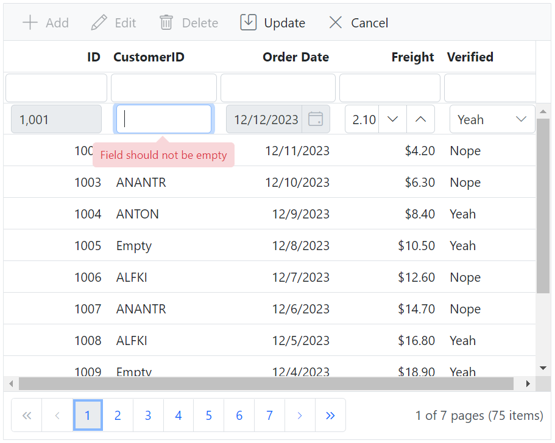

# Data Annotation in Blazor DataGrid Component

Data Annotations helps us to define rules to the model classes or properties to perform data validation and display suitable messages to end users.

The Data Annotation can be enabled by referencing the **System.ComponentModel.DataAnnotations** namespace which maps the data annotations to the corresponding DataGrid Column property.

The list of data annotation attributes that are supported in DataGrid component are provided below,

| Attribute Name | Properties | Functionality |
|-------|---------|---------|
| Display | Name	| Sets the header text for the grid column
| Display |	ShortName |	Sets a shorter version of the header text for the grid column
| Display |	AutoGenerateField | Prevents the column from being auto-generated in the grid.
| Display |	AutoGenerateFilter | Sets whether filtering should be disabled for a particular column.
| Display |	Description | Sets the tooltip text displayed when hovering over the ellipsis of the column.
| Display |	Order |	Sets the priority order of the Grid Column
| DisplayFormat | FormatString | Sets the format for displaying data in the column.
| DisplayFormat	| ApplyFormatInEditMode | Determines whether the column format should be applied in edit mode
| DisplayFormat	| NullDisplayText | Sets the text to be displayed when the value of the property is null
| DisplayFormat	| ConvertEmptyStringToNull | Determines whether empty string values should be converted to null in the user interface
| DisplayFormat | NeedsHtmlEncode | Sets whether HTML encoding should be disabled for a particular column.
| ScaffoldColumnAttribute | Scaffold | Sets whether the column is visible in the user interface
| EditableAttribute | ReadOnly | Sets whether the column allows editing |
| Key | Key | This attribute is used to mark a column as the primary key in the data grid |
| Validations are,<br><br>1. RequiredAttribute<br>2. StringLengthAttribute<br>3. RangeAttribute<br>4. RegularExpressionAttribute<br>5. MinLengthAttribute<br>6. MaxLengthAttribute<br>7. EmailAddressAttribute<br>8. CompareAttribute<br>| | The data annotation validation attributes are used as `validation rules` in the DataGrid CRUD operations|

N> The DataGrid Property takes precedence over Data Annotation. For example, when both the DisplayName Attribute and HeaderText are assigned to a Field in the DataGrid Model class for a specific column, the value of the HeaderText property will be prioritized and displayed in the DataGrid header.

The following sample code demonstrates data annotations implemented in the DataGrid component,

```cshtml
@using Syncfusion.Blazor.Grids
@using System.ComponentModel.DataAnnotations;

<SfGrid TValue="Order" DataSource="@Orders" Height="315" Width="500" AllowPaging="true" AllowFiltering="true" Toolbar="@(new List<string>() { "Add", "Edit", "Delete", "Update", "Cancel" })">
    <GridEditSettings AllowAdding="true" AllowEditing="true" AllowDeleting="true"></GridEditSettings>
    <GridColumns>
        <GridColumn Field=@nameof(Order.OrderID) TextAlign="TextAlign.Right" Width="120"></GridColumn>
        <GridColumn Field=@nameof(Order.CustomerID) Width="80"></GridColumn>
        <GridColumn Field=@nameof(Order.OrderDate) EditType="EditType.DatePickerEdit" Format="d" TextAlign="TextAlign.Right" Width="130" Type="ColumnType.Date"></GridColumn>
        <GridColumn Field=@nameof(Order.Freight) HeaderText="Freight" TextAlign="TextAlign.Right" Format="C2" Width="120"></GridColumn>
        <GridColumn Field=@nameof(Order.ShipCity) Width="120"></GridColumn>
    </GridColumns>
</SfGrid>

@code {
    public List<Order> Orders { get; set; }

    protected override void OnInitialized()
    {
        Orders = Enumerable.Range(1, 75).Select(x => new Order()
            {
                OrderID = 1000 + x,
                CustomerID = (new string[] { "ALFKI", "ANANTR", "ANTON", string.Empty, null })[new Random().Next(5)],
                Freight = 2.1 * x,
                OrderDate = DateTime.Now.AddDays(-x),
                ShipCity = (new string[] { "Berlin", "Madrid", "Cholchester", "Marseille", "Tsawassen" })[new Random().Next(5)],
            }).ToList();
    }

    public class Order
    {
        // Sets column as primary key
        [Key]
        // Sets column as required and error message to be displayed when empty
        [Required(ErrorMessage = "Order ID  should not be empty")]
        // Sets header text to the column
        [Display(ShortName = "ID")]
        public int? OrderID { get; set; }
        [Display(Name = "CustomerID", Description ="List of Customers")]
        // Sets column as required and error message to be displayed when empty
        [Required(ErrorMessage = "Field should not be empty")]
        [DisplayFormat(NullDisplayText = "Empty", ConvertEmptyStringToNull = true)]
        public string? CustomerID { get; set; }
        // Sets data type of column as Date
        [DataType(DataType.Date)]
        [Display(Name = "Order Date")]
        // Sets column as read only
        [Editable(false)]
        public DateTime? OrderDate { get; set; }
        [Display(Name = "Freight", AutoGenerateFilter = false)]
        public double? Freight { get; set; }
        [ScaffoldColumn(scaffold:false)]
        public string ShipCity { get; set; }
    }
}
```

The following image represents data annotations enabled in the DataGrid columns,


N> You can refer to our [Blazor DataGrid](https://www.syncfusion.com/blazor-components/blazor-datagrid) feature tour page for its groundbreaking feature representations. You can also explore our [Blazor DataGrid example](https://blazor.syncfusion.com/demos/datagrid/overview?theme=bootstrap5) to understand how to present and manipulate data.