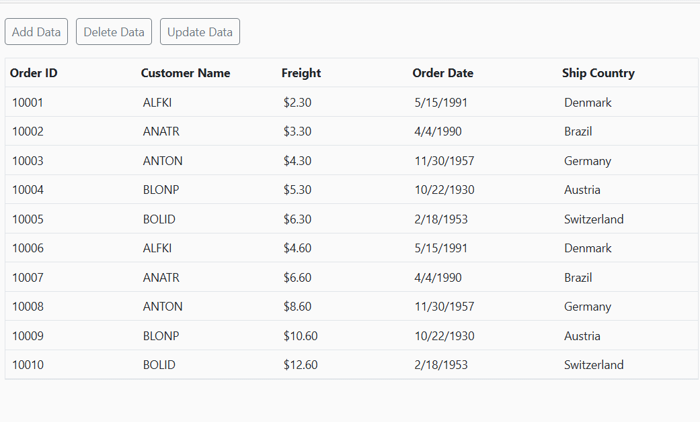

# Local data in Blazor DataGrid

The Syncfusion<sup style="font-size:70%">&reg;</sup> Blazor DataGrid provides straightforward methods to bind and display data that is available within your Blazor application's memory. This is particularly useful for scenarios involving static datasets, pre-loaded information, or data that does not require server-side operations for common Grid features.

Local data can be bound by assigning an **IEnumerable collection**—such as `List<T>,` `ObservableCollection<T>`, or collections of `ExpandoObject`, `DynamicObject`, or `DataTable`—directly to the [DataSource](https://help.syncfusion.com/cr/blazor/Syncfusion.Blazor.Grids.SfGrid-1.html#Syncfusion_Blazor_Grids_SfGrid_1_DataSource) property of the Grid. 



@using Syncfusion.Blazor.Grids

<SfGrid DataSource="@orderData">
    <GridColumns>
        <GridColumn Field="@nameof(OrderDetails.OrderID)" HeaderText="Order ID" TextAlign="TextAlign.Right" Width="100"></GridColumn>
        <GridColumn Field="@nameof(OrderDetails.CustomerID)" HeaderText="Customer ID" Width="100"></GridColumn>
        <GridColumn Field="@nameof(OrderDetails.ShipCity)" HeaderText="Ship City" Width="100"></GridColumn>
        <GridColumn Field="@nameof(OrderDetails.ShipName)" HeaderText="Ship Name" Width="120"></GridColumn>
    </GridColumns>
</SfGrid>

@code {
    private List<OrderDetails> orderData = new();

    protected override void OnInitialized()
    {
        orderData = OrderDetails.GetAllRecords();
    }
}





public class OrderDetails
{
    public int OrderID { get; set; }
    public string CustomerID { get; set; }
    public string ShipCity { get; set; }
    public string ShipName { get; set; }

    public OrderDetails(int orderID, string customerID, string shipCity, string shipName)
    {
        OrderID = orderID;
        CustomerID = customerID;
        ShipCity = shipCity;
        ShipName = shipName;
    }

    public static List<OrderDetails> GetAllRecords()
    {
        return new List<OrderDetails>
        {
            new OrderDetails(10248, "VINET", "Reims", "Vins et alcools Chevalier"),
            new OrderDetails(10249, "TOMSP", "Münster", "Toms Spezialitäten"),
            new OrderDetails(10250, "HANAR", "Rio de Janeiro", "Hanari Carnes"),
            new OrderDetails(10251, "VICTE", "Lyon", "Victuailles en stock"),
            new OrderDetails(10252, "SUPRD", "Charleroi", "Suprêmes délices"),
            new OrderDetails(10253, "HANAR", "Rio de Janeiro", "Hanari Carnes"),
            new OrderDetails(10254, "CHOPS", "Bern", "Chop-suey Chinese"),
            new OrderDetails(10255, "RICSU", "Genève", "Richter Supermarkt"),
            new OrderDetails(10256, "WELLI", "Resende", "Wellington Importadora"),
            new OrderDetails(10257, "HILAA", "San Cristóbal", "HILARION-Abastos"),
            new OrderDetails(10258, "ERNSH", "Graz", "Ernst Handel"),
            new OrderDetails(10259, "CENTC", "México D.F.", "Centro comercial Moctezuma"),
            new OrderDetails(10260, "OTTIK", "Köln", "Ottilies Käseladen"),
            new OrderDetails(10261, "QUEDE", "Rio de Janeiro", "Que Delícia"),
            new OrderDetails(10262, "RATTC", "Albuquerque", "Rattlesnake Canyon Grocery")
        };
    }
}







## List binding

The Syncfusion<sup style="font-size:70%">&reg;</sup> Blazor DataGrid supports binding to in-memory data sources such as List<T> or IEnumerable<T>. This approach is commonly used when working with data that is already available in the application, without requiring external data services or APIs.

**List binding is suitable for scenarios such as**:

- Small and large datasets
- Preloaded or static data
- Local Create, Read, Update, and Delete (CRUD) operations

**How List binding works**

When a list of objects is assigned to the Grid’s `DataSource` property, the component automatically renders the data in a tabular format. Each object in the list becomes a row, and its properties are displayed as columns.

**Steps to bind a List to the Grid**

- Define a model class.
- Create and populate a list of model objects.
- Bind the list to the [DataSource](https://help.syncfusion.com/cr/blazor/Syncfusion.Blazor.Grids.SfGrid-1.html#Syncfusion_Blazor_Grids_SfGrid_1_DataSource) property of the Grid.




@using Syncfusion.Blazor.Grids

<SfGrid DataSource="@OrderData" AllowPaging="true">
    <GridPageSettings PageSize="5" PageCount="3"></GridPageSettings>
    <GridColumns>
        <GridColumn Field="@nameof(OrderDetails.OrderID)" HeaderText="Order ID" TextAlign="TextAlign.Right" Width="100"></GridColumn>
        <GridColumn Field="@nameof(OrderDetails.CustomerID)" HeaderText="Customer ID" Width="120"></GridColumn>
        <GridColumn Field="@nameof(OrderDetails.OrderDate)" HeaderText="Order Date" Format="d" Type="ColumnType.DateOnly" TextAlign="TextAlign.Right" Width="130"></GridColumn>
        <GridColumn Field="@nameof(OrderDetails.OrderTime)" HeaderText="Order Time" Type="ColumnType.TimeOnly" TextAlign="TextAlign.Right" Width="130"></GridColumn>
        <GridColumn Field="@nameof(OrderDetails.Freight)" HeaderText="Freight" Format="C2" TextAlign="TextAlign.Right" Width="100"></GridColumn>
    </GridColumns>
</SfGrid>

@code {
    private List<OrderDetails> OrderData = new();

    protected override void OnInitialized()
    {
        OrderData = OrderDetails.GetAllRecords();
    }
}





public class OrderDetails
{
    public int OrderID { get; set; }
    public string CustomerID { get; set; }
    public DateOnly OrderDate { get; set; }
    public TimeOnly OrderTime { get; set; }
    public double Freight { get; set; }

    public OrderDetails(int orderID, string customerID, DateTime orderDateTime, double freight)
    {
        OrderID = orderID;
        CustomerID = customerID;
        OrderDate = DateOnly.FromDateTime(orderDateTime);
        OrderTime = TimeOnly.FromDateTime(orderDateTime);
        Freight = freight;
    }

    public static List<OrderDetails> GetAllRecords()
    {
        return new List<OrderDetails>
        {
            new OrderDetails(10248, "VINET", new DateTime(1996, 7, 4, 9, 30, 0), 32.38),
            new OrderDetails(10249, "TOMSP", new DateTime(1996, 7, 5, 11, 45, 0), 11.61),
            new OrderDetails(10250, "HANAR", new DateTime(1996, 7, 8, 14, 15, 0), 65.83),
            new OrderDetails(10251, "VICTE", new DateTime(1996, 7, 8, 16, 0, 0), 41.34),
            new OrderDetails(10252, "SUPRD", new DateTime(1996, 7, 9, 10, 20, 0), 51.30),
            new OrderDetails(10253, "HANAR", new DateTime(1996, 7, 10, 13, 5, 0), 58.17),
            new OrderDetails(10254, "CHOPS", new DateTime(1996, 7, 11, 17, 45, 0), 22.98),
            new OrderDetails(10255, "RICSU", new DateTime(1996, 7, 12, 8, 50, 0), 148.33),
            new OrderDetails(10256, "WELLI", new DateTime(1996, 7, 15, 12, 10, 0), 13.97),
            new OrderDetails(10257, "HILAA", new DateTime(1996, 7, 16, 15, 30, 0), 81.91),
            new OrderDetails(10258, "ERNSH", new DateTime(1996, 7, 17, 10, 45, 0), 140.51),
            new OrderDetails(10259, "CENTC", new DateTime(1996, 7, 18, 9, 0, 0), 3.25),
            new OrderDetails(10260, "OTTIK", new DateTime(1996, 7, 19, 16, 20, 0), 55.09),
            new OrderDetails(10261, "QUEDE", new DateTime(1996, 7, 19, 13, 25, 0), 3.05),
            new OrderDetails(10262, "RATTC", new DateTime(1996, 7, 22, 11, 40, 0), 48.29)
        };
    }
}






### ExpandoObject binding

The Syncfusion<sup style="font-size:70%">&reg;</sup> Blazor DataGrid is a strongly-typed generic component that typically binds to a predefined data model. However, in scenarios where the structure of the data is not known at compile time—such as metadata-driven applications or dynamic user-generated content—the Grid can be bound to a collection of [ExpandoObject](https://learn.microsoft.com/en-us/dotnet/api/system.dynamic.expandoobject?view=net-9.0) instances.

This approach allows dynamic rendering of both data and columns, making it possible to work with flexible or evolving data structures.

**When to use ExpandoObject binding**

ExpandoObject binding is recommended in the following cases:
- When data models are generated at runtime.
- When columns and data need to be created dynamically based on metadata or user input.
- When integrating with external systems that provide data with non-static or unpredictable schemas.

**Key Features Supported**

Despite its dynamic nature, ExpandoObject binding supports essential DataGrid features, including:

- **Paging** – Efficiently handles large datasets by displaying data page by page.
- **Sorting** – Allows sorting of columns dynamically.
- **Filtering** – Enables filtering of data based on column values.
- **Editing** – Supports inline editing of dynamically generated fields.






@using Syncfusion.Blazor.Grids
@using System.Dynamic

<SfGrid DataSource="@orders" AllowPaging="true" Toolbar="@toolbarItems">
    <GridEditSettings AllowAdding="true" AllowDeleting="true" AllowEditing="true"></GridEditSettings>
    <GridColumns>
        <GridColumn Field="OrderID" HeaderText="Order ID" IsPrimaryKey="true" TextAlign="TextAlign.Right" Width="120"></GridColumn>
        <GridColumn Field="CustomerID" HeaderText="Customer Name" Width="120"></GridColumn>
        <GridColumn Field="Freight" HeaderText="Freight" Format="C2" TextAlign="TextAlign.Right" Width="120"></GridColumn>
        <GridColumn Field="OrderDate" HeaderText="Order Date" Format="d" TextAlign="TextAlign.Right" Width="130" Type="ColumnType.Date"></GridColumn>
        <GridColumn Field="ShipCountry" HeaderText="Ship Country" EditType="EditType.DropDownEdit" Width="150"></GridColumn>
        <GridColumn Field="Verified" HeaderText="Active" DisplayAsCheckBox="true" Width="150"></GridColumn>
    </GridColumns>
</SfGrid>

@code {
    private List<ExpandoObject> orders = new();
    private readonly List<string> toolbarItems = new() { "Add", "Edit", "Delete", "Update", "Cancel" };

    protected override void OnInitialized()
    {
        orders = Enumerable.Range(1, 75).Select(index =>
        {
            dynamic order = new ExpandoObject();
            order.OrderID = 1000 + index;
            order.CustomerID = new[] { "ALFKI", "ANANTR", "ANTON", "BLONP", "BOLID" }[Random.Shared.Next(5)];
            order.Freight = new[] { 2.0, 1.0, 4.0, 5.0, 3.0 }[Random.Shared.Next(5)] * index;
            order.OrderDate = new[]
            {
                new DateTime(1996, 11, 5),
                new DateTime(1996, 10, 3),
                new DateTime(1996, 9, 9),
                new DateTime(1996, 8, 2),
                new DateTime(1996, 4, 11)
            }[Random.Shared.Next(5)];
            order.ShipCountry = new[] { "USA", "UK" }[Random.Shared.Next(2)];
            order.Verified = new[] { true, false }[Random.Shared.Next(2)];
            return order;
        }).Cast<ExpandoObject>().ToList();
    }
}




Please find the sample in this [GitHub location](https://github.com/SyncfusionExamples/databinding-in-blazor-datagrid/blob/master/ListBinding/ListBinding/Components/Pages/ExpandoObjectBinding.razor).

### ExpandoObject complex data binding

When working with complex or nested data structures using [ExpandoObject](https://learn.microsoft.com/en-us/dotnet/api/system.dynamic.expandoobject?view=net-9.0), the Syncfusion<sup style="font-size:70%">&reg;</sup> Blazor DataGrid allows binding of nested fields using dot (.) notation. This is helpful when **ExpandoObject** contains sub-objects or hierarchical data, and specific properties of those nested objects need display in individual Grid columns.

In this sample, **CustomerID.Name** and **ShipCountry.Country** represent nested fields from the underlying dynamic object, and they are individually bound to display in their respective columns:




@using Syncfusion.Blazor.Grids
@using System.Dynamic

<SfGrid DataSource="@orders" AllowPaging="true" AllowFiltering="true" AllowSorting="true" AllowGrouping="true" Toolbar="@toolbarItems">
    <GridEditSettings AllowAdding="true" AllowDeleting="true" AllowEditing="true"></GridEditSettings>
    <GridColumns>
        <GridColumn Field="OrderID" HeaderText="Order ID" IsPrimaryKey="true" TextAlign="TextAlign.Right" Width="120"></GridColumn>
        <GridColumn Field="CustomerID.Name" HeaderText="Customer Name" Width="120"></GridColumn>
        <GridColumn Field="Freight" HeaderText="Freight" Format="C2" TextAlign="TextAlign.Right" Width="120"></GridColumn>
        <GridColumn Field="OrderDate" HeaderText="Order Date" Format="d" TextAlign="TextAlign.Right" Width="130" Type="ColumnType.Date"></GridColumn>
        <GridColumn Field="ShipCountry.Country" HeaderText="Ship Country" Width="150"></GridColumn>
        <GridColumn Field="Verified" HeaderText="Active" DisplayAsCheckBox="true" Width="150"></GridColumn>
    </GridColumns>
</SfGrid>

@code {

    private List<ExpandoObject> orders = new();
    private readonly List<string> toolbarItems = new() { "Add", "Edit", "Delete", "Update", "Cancel" };

    protected override void OnInitialized()
    {
        orders = Enumerable.Range(1, 75).Select(Index =>
        {
            dynamic Order = new ExpandoObject();
            dynamic CustomerName = new ExpandoObject();
            dynamic CountryName = new ExpandoObject();

            Order.OrderID = 1000 + Index;
            CustomerName.Name = new[] { "ALFKI", "ANANTR", "ANTON", "BLONP", "BOLID" }[Random.Shared.Next(5)];
            Order.CustomerID = CustomerName;
            Order.Freight = new[] { 2.0, 1.0, 4.0, 5.0, 3.0 }[Random.Shared.Next(5)] * Index;
            Order.OrderDate = new[]
            {
                new DateTime(1996, 11, 5),
                new DateTime(1996, 10, 3),
                new DateTime(1996, 9, 9),
                new DateTime(1996, 8, 2),
                new DateTime(1996, 4, 11)
            }[Random.Shared.Next(5)];
            CountryName.Country = new[] { "USA", "UK" }[Random.Shared.Next(2)];
            Order.ShipCountry = CountryName;
            Order.Verified = new[] { true, false }[Random.Shared.Next(2)];

            return Order;
        }).Cast<ExpandoObject>().ToList();
    }
}



> The DataGrid supports data operations and full CRUD functionality even when working with complex fields in `ExpandoObject` bindings.


Please find the sample in this [GitHub location](https://github.com/SyncfusionExamples/databinding-in-blazor-datagrid/blob/master/ListBinding/ListBinding/Components/Pages/ExpandoObjectComplexBinding.razor).

### DynamicObject binding

The Syncfusion<sup style="font-size:70%">&reg;</sup> Blazor DataGrid is primarily designed to work with strongly-typed models. However, in advanced scenarios where the structure of the data is determined at runtime—such as metadata-driven layouts or integration with dynamic data sources—the Grid can be bound to a collection of objects derived from [.NET's DynamicObject](https://learn.microsoft.com/en-us/dotnet/api/system.dynamic.dynamicobject).

This binding approach provides flexibility for rendering data and columns dynamically, without requiring predefined class structures.

**When to use DynamicObject binding**

DynamicObject binding is suitable for use cases such as:

- Applications where data models are generated or modified at runtime.
- Metadata-driven Grid layouts that adapt based on configuration or external input.
- Integration with external systems or APIs that return data with unpredictable or evolving schemas.

**When to use ExpandoObject binding**

ExpandoObject binding is recommended in the following cases:

- hen data models are generated at runtime.
- When columns and data need to be created dynamically based on metadata or user input.
- When integrating with external systems that provide data with non-static or unpredictable schemas.



To bind a **DynamicObject**, assign a list of dynamic instances to the [DataSource](https://help.syncfusion.com/cr/blazor/Syncfusion.Blazor.Grids.SfGrid-1.html#Syncfusion_Blazor_Grids_SfGrid_1_DataSource) property.

> Override the [GetDynamicMemberNames](https://learn.microsoft.com/en-us/dotnet/api/system.dynamic.dynamicobject.getdynamicmembernames?view=net-9.0) method in the **DynamicObject** implementation. This allows the Grid to detect property names during rendering and perform **editing**, **sorting**, **filtering**, and **paging** operations.




@using Syncfusion.Blazor.Grids
@using System.Dynamic

<SfGrid DataSource="@orders" AllowPaging="true" Toolbar="@toolbarItems">
    <GridEditSettings AllowAdding="true" AllowDeleting="true" AllowEditing="true"></GridEditSettings>
    <GridColumns>
        <GridColumn Field="OrderID" HeaderText="Order ID" IsPrimaryKey="true" TextAlign="TextAlign.Right" Width="120"></GridColumn>
        <GridColumn Field="CustomerID" HeaderText="Customer Name" Width="150"></GridColumn>
        <GridColumn Field="OrderDate" HeaderText="Order Date" Format="d" Type="ColumnType.Date" TextAlign="TextAlign.Right" EditType="EditType.DatePickerEdit" Width="130"></GridColumn>
        <GridColumn Field="Freight" HeaderText="Freight" Format="C2" TextAlign="TextAlign.Right" Width="120"></GridColumn>
    </GridColumns>
</SfGrid>

@code {
    private List<string> toolbarItems = new List<string>(){ "Add", "Edit", "Delete", "Update", "Cancel"};
    private List<DynamicDictionary> orders = new();

    protected override void OnInitialized()
    {
        orders = Enumerable.Range(1, 15).Select(Index =>
        {
            dynamic Order = new DynamicDictionary();
            Order.OrderID = 1000 + Index;
            Order.CustomerID = new[] { "ALFKI", "ANANTR", "ANTON", "BLONP", "BOLID" }[Random.Shared.Next(5)];
            Order.Freight = new[] { 2.0, 1.0, 4.0, 5.0, 3.0 }[Random.Shared.Next(5)] * Index;
            Order.OrderDate = new[]
            {
                new DateTime(1996, 11, 5),
                new DateTime(1996, 10, 3),
                new DateTime(1996, 9, 9),
                new DateTime(1996, 8, 2),
                new DateTime(1996, 4, 11)
            }[Random.Shared.Next(5)];
            return Order;
        }).Cast<DynamicDictionary>().ToList();
    }

    public class DynamicDictionary : DynamicObject
    {
        private readonly Dictionary<string, object> Dictionary = new();

        public override bool TryGetMember(GetMemberBinder Binder, out object Result)
        {
            return Dictionary.TryGetValue(Binder.Name, out Result);
        }

        public override bool TrySetMember(SetMemberBinder Binder, object Value)
        {
            Dictionary[Binder.Name] = Value;
            return true;
        }

        public override IEnumerable<string> GetDynamicMemberNames()
        {
            return Dictionary.Keys;
        }
    }
}




Please find the sample in this [GitHub location](https://github.com/SyncfusionExamples/databinding-in-blazor-datagrid/blob/master/ListBinding/ListBinding/Components/Pages/DynamicObjectBinding.razor).

### DynamicObject complex data binding

When working with complex or nested data structures using [DynamicObject](https://learn.microsoft.com/en-us/dotnet/api/system.dynamic.dynamicobject), the Syncfusion<sup style="font-size:70%">&reg;</sup> Blazor DataGrid allows binding of nested fields using dot (.) notation. This is helpful when **DynamicObject** contains sub-objects or hierarchical data, and specific properties of those nested objects need display in individual Grid columns.

In this sample, **CustomerID.Name** and **ShipCountry.Country** represent nested fields from the underlying dynamic object, and they are individually bound to display in their respective columns:




@using Syncfusion.Blazor.Grids
@using System.Dynamic

<SfGrid DataSource="@orders" AllowPaging="true" AllowFiltering="true" AllowSorting="true" AllowGrouping="true" Toolbar="@toolbarItems">
    <GridEditSettings AllowAdding="true" AllowDeleting="true" AllowEditing="true"></GridEditSettings>
    <GridColumns>
        <GridColumn Field="OrderID" HeaderText="Order ID" IsPrimaryKey="true" TextAlign="TextAlign.Right" Width="120"></GridColumn>
        <GridColumn Field="CustomerID.Name" HeaderText="Customer Name" Width="150"></GridColumn>
        <GridColumn Field="OrderDate" HeaderText="Order Date" Format="d" Type="ColumnType.Date" TextAlign="TextAlign.Right" EditType="EditType.DatePickerEdit" Width="130"></GridColumn>
        <GridColumn Field="Freight" HeaderText="Freight" Format="C2" TextAlign="TextAlign.Right" Width="120"></GridColumn>
        <GridColumn Field="ShipCountry.Country" HeaderText="Ship Country" Width="150"></GridColumn>
    </GridColumns>
</SfGrid>

@code {
    private readonly List<string> toolbarItems = new() { "Add", "Edit", "Delete", "Update", "Cancel" };
    private List<DynamicDictionary> orders = new();

    protected override void OnInitialized()
    {
        orders = Enumerable.Range(1, 15).Select(Index =>
        {
            dynamic Order = new DynamicDictionary();
            dynamic CustomerName = new DynamicDictionary();
            dynamic CountryName = new DynamicDictionary();

            Order.OrderID = 1000 + Index;
            CustomerName.Name = new[] { "ALFKI", "ANANTR", "ANTON", "BLONP", "BOLID" }[Random.Shared.Next(5)];
            Order.CustomerID = CustomerName;
            Order.Freight = new[] { 2.0, 1.0, 4.0, 5.0, 3.0 }[Random.Shared.Next(5)] * Index;
            Order.OrderDate = new[]
            {
                new DateTime(1996, 11, 5),
                new DateTime(1996, 10, 3),
                new DateTime(1996, 9, 9),
                new DateTime(1996, 8, 2),
                new DateTime(1996, 4, 11)
            }[Random.Shared.Next(5)];
            CountryName.Country = new[] { "USA", "UK" }[Random.Shared.Next(2)];
            Order.ShipCountry = CountryName;

            return Order;
        }).Cast<DynamicDictionary>().ToList();
    }

    private class DynamicDictionary : DynamicObject
    {
        private readonly Dictionary<string, object> _dictionary = new();

        public override bool TryGetMember(GetMemberBinder binder, out object result)
        {
            return _dictionary.TryGetValue(binder.Name, out result);
        }

        public override bool TrySetMember(SetMemberBinder binder, object value)
        {
            _dictionary[binder.Name] = value;
            return true;
        }

        public override IEnumerable<string> GetDynamicMemberNames()
        {
            return _dictionary.Keys;
        }
    }
}




> The DataGrid supports data operations and full CRUD functionality even when working with complex fields in `DynamicObject` bindings.


Please find the sample in this [GitHub location](https://github.com/SyncfusionExamples/databinding-in-blazor-datagrid/blob/master/ListBinding/ListBinding/Components/Pages/DynamicObjectComplexBinding.razor).

> When binding the Grid DataSource dynamically as a list of IEnumerable collections, call the [Refresh](https://help.syncfusion.com/cr/blazor/Syncfusion.Blazor.Grids.SfGrid-1.html#Syncfusion_Blazor_Grids_SfGrid_1_Refresh_System_Boolean_) method of the Grid to reflect changes externally. This avoids tracking changes made externally to IEnumerable items for performance considerations.

### DataTable binding

The Syncfusion<sup style="font-size:70%">&reg;</sup> Blazor DataGrid supports binding data from a `System.Data.DataTable` using a custom adaptor, enabling dynamic generation of rows and columns based on backend data. This approach is useful for scenarios where data is retrieved or processed in a DataTable format, and it provides full support for built-in data operations like paging, filtering, sorting, and searching. 

To bind a **DataTable** to Grid, set `TValue` to **ExpandoObject**, convert it into an **IQueryable&lt;ExpandoObject&gt;** collection, and supply it through a custom adaptor that extends DataAdaptor.

**Steps to bind DataTable to Grid:**

* Create a **DataTable** and populate it with data.

* Convert it to a list of **ExpandoObject** using a helper method.

* Use a custom adaptor by extending the [DataAdaptor](https://help.syncfusion.com/cr/blazor/Syncfusion.Blazor.DataAdaptor.html) class.

* Override the [Read](https://help.syncfusion.com/cr/blazor/Syncfusion.Blazor.DataAdaptor.html#Syncfusion_Blazor_DataAdaptor_Read_Syncfusion_Blazor_DataManagerRequest_System_String_) method to handle data fetching and operations.

In the example, the **DataTable** is passed to the **ToQueryableCollection** method, which converts the **DataTable** data source into an **IQueryable** collection data source.

Perform data operations like searching, sorting, and filtering using the **PerformDataOperation** method. This method takes a **DataTable** and a [DataManagerRequest](https://help.syncfusion.com/cr/blazor/Syncfusion.Blazor.DataManagerRequest.html) object as parameters, processes the data operations, and returns an **IQueryable** data source.




@using Syncfusion.Blazor
@using Syncfusion.Blazor.Data
@using Syncfusion.Blazor.Grids
@using System.Dynamic
@using System.Data

<SfGrid TValue="ExpandoObject" ID="Grid" AllowSorting="true" AllowPaging="true" AllowFiltering="true" Toolbar="@(new List<string>() { "Search" })">
    <SfDataManager AdaptorInstance="@typeof(CustomAdaptor)" Adaptor="Adaptors.CustomAdaptor"></SfDataManager>
    <GridPageSettings PageSize="8"></GridPageSettings>
    <GridColumns>
        <GridColumn Field="OrderID" HeaderText="Order ID" IsPrimaryKey="true" ValidationRules="@(new ValidationRules { Required = true, Number = true })" Width="100"></GridColumn>
        <GridColumn Field="CustomerID" HeaderText="Customer Name" ValidationRules="@(new ValidationRules { Required = true })" Width="100"></GridColumn>
        <GridColumn Field="OrderDate" HeaderText="Order Date" Format="d" Type="ColumnType.Date" Width="110"></GridColumn>
        <GridColumn Field="EmployeeID" HeaderText="Employee ID" Width="100"></GridColumn>
    </GridColumns>
</SfGrid>

@code {

    private static DataTable? ordersTable;
    private static IQueryable? dataSource;

    protected override void OnInitialized()
    {
        ordersTable = GetData();
        dataSource = ToQueryableCollection(ordersTable);
    }

    private static DataTable GetData()
    {
        var table = new DataTable();
        table.Columns.AddRange(new DataColumn[]
        {
            new DataColumn("OrderID", typeof(long)),
            new DataColumn("CustomerID", typeof(string)),
            new DataColumn("EmployeeID", typeof(int)),
            new DataColumn("OrderDate", typeof(DateTime))
        });

        int code = 1000;
        int id = 0;

        for (int i = 1; i <= 15; i++)
        {
            table.Rows.Add(code + 1, "ALFKI", id + 1, new DateTime(1991, 05, 15));
            table.Rows.Add(code + 2, "CHOPS", id + 2, new DateTime(1990, 04, 04));
            table.Rows.Add(code + 3, "ANTON", id + 3, new DateTime(1957, 11, 30));
            table.Rows.Add(code + 4, "DRACH", id + 4, new DateTime(1930, 10, 22));
            table.Rows.Add(code + 5, "BOLID", id + 5, new DateTime(1953, 02, 18));
            code += 5;
            id += 5;
        }

        return table;
    }

    private static IQueryable ToQueryableCollection(DataTable table)
    {
        var expandoList = new List<ExpandoObject>();

        foreach (DataRow row in table.Rows)
        {
            var expandoDict = new ExpandoObject() as IDictionary<string, object?>;
            foreach (DataColumn col in table.Columns)
            {
                var colValue = row[col.ColumnName];
                colValue = (colValue == DBNull.Value) ? null : colValue;
                expandoDict.Add(col.ColumnName, colValue);
            }
            expandoList.Add((ExpandoObject)expandoDict);
        }

        return expandoList.AsQueryable();
    }

    private static IQueryable PerformDataOperation(DataTable table, DataManagerRequest request)
    {
        dataSource = ToQueryableCollection(table);

        if (request.Search?.Count > 0)
        {
            dataSource = DynamicObjectOperation.PerformSearching(dataSource, request.Search);
        }
        if (request.Where?.Count > 0)
        {
            dataSource = DynamicObjectOperation.PerformFiltering(dataSource, request.Where, request.Where[0].Operator);
        }
        if (request.Sorted?.Count > 0)
        {
            dataSource = DynamicObjectOperation.PerformSorting(dataSource, request.Sorted);
        }

        return dataSource!;
    }

    private class CustomAdaptor : DataAdaptor
    {
        public override object Read(DataManagerRequest request, string? key = null)
        {
            dataSource = PerformDataOperation(ordersTable!, request);

            int count = dataSource.Cast<ExpandoObject>().Count();

            if (request.Skip != 0)
            {
                dataSource = QueryableOperation.PerformSkip<object>((IQueryable<object>)dataSource, request.Skip);
            }
            if (request.Take != 0)
            {
                dataSource = QueryableOperation.PerformTake<object>((IQueryable<object>)dataSource, request.Take);
            }

            return request.RequiresCounts
                ? new DataResult() { Result = dataSource, Count = count }
                : (object)dataSource;
        }
    }
}




**Grouping and Aggregates with DataTable:**

The Syncfusion<sup style="font-size:70%">&reg;</sup> Blazor DataGrid supports dynamic **grouping** and **aggregates** even when bound to a `DataTable` via a custom adaptor. This allows grouping of rows by one or more columns and application of aggregate functions (such as **Sum**, **Average**, **Count**, etc.) on those groups or entire datasets.




@using Syncfusion.Blazor
@using Syncfusion.Blazor.Grids
@using Syncfusion.Blazor.Data
@using System.Data
@using System.Dynamic
@using System.Collections

<SfGrid TValue="ExpandoObject" AllowPaging="true" AllowGrouping="true">
    <SfDataManager AdaptorInstance="@typeof(CustomAdaptor)" Adaptor="Adaptors.CustomAdaptor"></SfDataManager>
    <GridGroupSettings ShowGroupedColumn="true"></GridGroupSettings>
    <GridPageSettings PageSize="8"></GridPageSettings>
    <GridAggregates>
        <GridAggregate>
            <GridAggregateColumns>
                <GridAggregateColumn Field="Freight" Type="AggregateType.Sum" Format="C2">
                    <FooterTemplate>
                        @{
                            var aggregate = (context as AggregateTemplateContext);
                        }
                        <div>
                            <p>Sum: @aggregate.Sum</p>
                        </div>
                    </FooterTemplate>
                </GridAggregateColumn>
            </GridAggregateColumns>
        </GridAggregate>
    </GridAggregates>
    <GridColumns>
        <GridColumn Field="OrderID" HeaderText="Order ID" Width="100" TextAlign="TextAlign.Right"></GridColumn>
        <GridColumn Field="CustomerID" HeaderText="Customer Name" Width="100"></GridColumn>
        <GridColumn Field="EmployeeID" HeaderText="Employee ID" Width="100"></GridColumn>
        <GridColumn Field="OrderDate" HeaderText="Order Date" Width="110" Format="d" Type="ColumnType.Date"></GridColumn>
        <GridColumn Field="Freight" TextAlign="TextAlign.Right" AllowGrouping="false" Format="C2" Width="100"></GridColumn>
    </GridColumns>
</SfGrid>

@code {
    private static DataTable? ordersTable;
    private static IQueryable? dataSource;

    protected override void OnInitialized()
    {
        ordersTable = GetData();
        dataSource = ToQueryableCollection(ordersTable);
    }

    private static DataTable GetData()
    {
        var table = new DataTable();
        table.Columns.AddRange(new DataColumn[]
        {
            new DataColumn("OrderID", typeof(long)),
            new DataColumn("CustomerID", typeof(string)),
            new DataColumn("EmployeeID", typeof(int)),
            new DataColumn("OrderDate", typeof(DateTime)),
            new DataColumn("Freight", typeof(double))
        });

        int code = 1000;
        int id = 0;

        for (int i = 1; i <= 15; i++)
        {
            table.Rows.Add(code + 1, "ALFKI", id + 1, new DateTime(1991, 05, 15), 2.32 * i);
            table.Rows.Add(code + 2, "CHOPS", id + 2, new DateTime(1990, 04, 04), 1.28 * i);
            table.Rows.Add(code + 3, "ANTON", id + 3, new DateTime(1957, 11, 30), 4.31 * i);
            table.Rows.Add(code + 4, "DRACH", id + 4, new DateTime(1930, 10, 22), 2.56 * i);
            table.Rows.Add(code + 5, "BOLID", id + 5, new DateTime(1953, 02, 18), 5.54 * i);
            code += 5;
            id += 5;
        }

        return table;
    }

    private static IQueryable ToQueryableCollection(DataTable table)
    {
        var expandoList = new List<ExpandoObject>();

        foreach (DataRow row in table.Rows)
        {
            var expandoDict = new ExpandoObject() as IDictionary<string, object?>;
            foreach (DataColumn col in table.Columns)
            {
                var colValue = row[col.ColumnName];
                colValue = (colValue == DBNull.Value) ? null : colValue;
                expandoDict.Add(col.ColumnName, colValue);
            }
            expandoList.Add((ExpandoObject)expandoDict);
        }

        return expandoList.AsQueryable();
    }

    private class CustomAdaptor : DataAdaptor
    {
        public override object Read(DataManagerRequest request, string? key = null)
        {
            dataSource = ToQueryableCollection(ordersTable!);

            int count = dataSource.Cast<ExpandoObject>().Count();

            if (request.Skip != 0)
            {
                dataSource = QueryableOperation.PerformSkip<object>((IQueryable<object>)dataSource, request.Skip);
            }
            if (request.Take != 0)
            {
                dataSource = QueryableOperation.PerformTake<object>((IQueryable<object>)dataSource, request.Take);
            }

            IDictionary<string, object> aggregates = new Dictionary<string, object>();
            if (request.Aggregates != null)
            {
                aggregates = DataUtil.PerformAggregation(dataSource, request.Aggregates);
            }

            if (request.Group != null)
            {
                IEnumerable result = (IEnumerable)dataSource;
                foreach (var group in request.Group)
                {
                    result = DataUtil.Group<ExpandoObject>(result, group, request.Aggregates, 0, request.GroupByFormatter);
                }

                return request.RequiresCounts
                    ? new DataResult() { Result = result, Count = count, Aggregates = aggregates }
                    : (object)dataSource;
            }

            return request.RequiresCounts
                ? new DataResult() { Result = dataSource, Count = count, Aggregates = aggregates }
                : (object)dataSource;
        }
    }
}




**DataTable with CRUD operations**

The Syncfusion<sup style="font-size:70%">&reg;</sup> Blazor DataGrid supports CRUD (Create, Read, Update, and Delete) operations with a DataTable using a custom adaptor. Enable editing in the Grid and override specific methods of the [DataAdaptor](https://help.syncfusion.com/cr/blazor/Syncfusion.Blazor.DataAdaptor.html) base class to update **DataTable** in memory.

**The supported methods are:**

* [Insert](https://help.syncfusion.com/cr/blazor/Syncfusion.Blazor.DataAdaptor.html#Syncfusion_Blazor_DataAdaptor_Insert_Syncfusion_Blazor_DataManager_System_Object_System_String_) / [InsertAsync](https://help.syncfusion.com/cr/blazor/Syncfusion.Blazor.DataAdaptor.html#Syncfusion_Blazor_DataAdaptor_InsertAsync_Syncfusion_Blazor_DataManager_System_Object_System_String_) – Adds a new record to the **DataTable**.

* [Update](https://help.syncfusion.com/cr/blazor/Syncfusion.Blazor.DataAdaptor.html#Syncfusion_Blazor_DataAdaptor_Update_Syncfusion_Blazor_DataManager_System_Object_System_String_System_String_) / [UpdateAsync](https://help.syncfusion.com/cr/blazor/Syncfusion.Blazor.DataAdaptor.html#Syncfusion_Blazor_DataAdaptor_UpdateAsync_Syncfusion_Blazor_DataManager_System_Object_System_String_System_String_) – Updates an existing record.

* [Remove](https://help.syncfusion.com/cr/blazor/Syncfusion.Blazor.DataAdaptor.html#Syncfusion_Blazor_DataAdaptor_Remove_Syncfusion_Blazor_DataManager_System_Object_System_String_System_String_) / [RemoveAsync](https://help.syncfusion.com/cr/blazor/Syncfusion.Blazor.DataAdaptor.html#Syncfusion_Blazor_DataAdaptor_RemoveAsync_Syncfusion_Blazor_DataManager_System_Object_System_String_System_String_) – Removes a record from the **DataTable**.

* [BatchUpdate](https://help.syncfusion.com/cr/blazor/Syncfusion.Blazor.DataAdaptor.html#Syncfusion_Blazor_DataAdaptor_BatchUpdate_Syncfusion_Blazor_DataManager_System_Object_System_Object_System_Object_System_String_System_String_System_Nullable_System_Int32__) / [BatchUpdateAsync](https://help.syncfusion.com/cr/blazor/Syncfusion.Blazor.DataAdaptor.html#Syncfusion_Blazor_DataAdaptor_BatchUpdateAsync_Syncfusion_Blazor_DataManager_System_Object_System_Object_System_Object_System_String_System_String_System_Nullable_System_Int32__) – Handles batch operations like add, update, and delete in a single transaction (used for Batch Editing).

When using batch editing in the Grid, use the `BatchUpdate`/`BatchUpdateAsync` method to handle corresponding CRUD operations.




@using Syncfusion.Blazor
@using Syncfusion.Blazor.Data
@using Syncfusion.Blazor.Grids
@using System.Dynamic
@using System.Data

<SfGrid TValue="ExpandoObject" ID="Grid" AllowPaging="true"
        Toolbar="@(new List<string>() { "Add", "Edit", "Delete", "Update", "Cancel" })">
    <SfDataManager AdaptorInstance="@typeof(CustomAdaptor)" Adaptor="Adaptors.CustomAdaptor"></SfDataManager>
    <GridEditSettings AllowEditing="true" AllowDeleting="true" AllowAdding="true" Mode="@EditMode.Normal"></GridEditSettings>
    <GridPageSettings PageSize="8"></GridPageSettings>
    <GridColumns>
        <GridColumn Field="OrderID" HeaderText="Order ID" IsPrimaryKey="true"
                    ValidationRules="@(new ValidationRules { Required = true, Number = true })" Width="100"></GridColumn>
        <GridColumn Field="CustomerID" HeaderText="Customer Name"
                    ValidationRules="@(new ValidationRules { Required = true })" Width="100"></GridColumn>
        <GridColumn Field="OrderDate" HeaderText="Order Date" Format="d"
                    Type="ColumnType.Date" Width="110"></GridColumn>
        <GridColumn Field="EmployeeID" HeaderText="Employee ID" Width="100"></GridColumn>
    </GridColumns>
</SfGrid>

@code {
    private static DataTable? ordersTable;
    private static IQueryable? dataSource;

    protected override void OnInitialized()
    {
        ordersTable = GetData();
        dataSource = ToQueryableCollection(ordersTable);
    }

    private static IQueryable ToQueryableCollection(DataTable table)
    {
        var expandoList = new List<ExpandoObject>();

        foreach (DataRow row in table.Rows)
        {
            var expandoDict = new ExpandoObject() as IDictionary<string, object?>;
            foreach (DataColumn col in table.Columns)
            {
                var colValue = row[col.ColumnName];
                colValue = (colValue == DBNull.Value) ? null : colValue;
                expandoDict.Add(col.ColumnName, colValue);
            }
            expandoList.Add((ExpandoObject)expandoDict);
        }

        return expandoList.AsQueryable();
    }

    private static DataTable GetData()
    {
        var table = new DataTable();
        table.Columns.AddRange(new DataColumn[]
        {
            new DataColumn("OrderID", typeof(long)),
            new DataColumn("CustomerID", typeof(string)),
            new DataColumn("EmployeeID", typeof(int)),
            new DataColumn("OrderDate", typeof(DateTime))
        });

        int code = 1000;
        int id = 0;

        for (int i = 1; i <= 15; i++)
        {
            table.Rows.Add(code + 1, "ALFKI", id + 1, new DateTime(1991, 05, 15));
            table.Rows.Add(code + 2, "ANATR", id + 2, new DateTime(1990, 04, 04));
            table.Rows.Add(code + 3, "ANTON", id + 3, new DateTime(1957, 11, 30));
            table.Rows.Add(code + 4, "BLONP", id + 4, new DateTime(1930, 10, 22));
            table.Rows.Add(code + 5, "BOLID", id + 5, new DateTime(1953, 02, 18));
            code += 5;
            id += 5;
        }

        return table;
    }

    private class CustomAdaptor : DataAdaptor
    {
        public override object Read(DataManagerRequest request, string? key = null)
        {
            dataSource = ToQueryableCollection(ordersTable!);

            int count = dataSource.Cast<ExpandoObject>().Count();

            if (request.Skip != 0)
            {
                dataSource = QueryableOperation.PerformSkip<object>((IQueryable<object>)dataSource, request.Skip);
            }
            if (request.Take != 0)
            {
                dataSource = QueryableOperation.PerformTake<object>((IQueryable<object>)dataSource, request.Take);
            }

            return request.RequiresCounts
                ? new DataResult() { Result = dataSource, Count = count }
                : (object)dataSource;
        }

        public override object Insert(DataManager request, object value, string key)
        {
            var newRow = ordersTable!.NewRow();
            var data = (ExpandoObject)value;

            foreach (var item in data)
            {
                newRow[item.Key] = item.Value ?? DBNull.Value;
            }

            ordersTable.Rows.InsertAt(newRow, 0);
            return value;
        }

        public override object Remove(DataManager request, object value, string keyField, string key)
        {
            var rowToRemove = ordersTable!.Rows
                .Cast<DataRow>()
                .FirstOrDefault(row => row[keyField].Equals(value));

            if (rowToRemove != null)
            {
                ordersTable.Rows.Remove(rowToRemove);
            }

            return value;
        }

        public override object Update(DataManager request, object value, string keyField, string key)
        {
            var data = (IDictionary<string, object>)value;

            var rowToUpdate = ordersTable!.Rows
                .Cast<DataRow>()
                .FirstOrDefault(row => row[keyField].Equals(data[keyField]));

            if (rowToUpdate != null)
            {
                foreach (DataColumn column in ordersTable.Columns)
                {
                    rowToUpdate[column.ColumnName] = data[column.ColumnName] ?? column.DefaultValue;
                }
            }

            return value;
        }

        public override object BatchUpdate(DataManager request, object changed, object added, object deleted, string keyField, string key, int? dropIndex)
        {
            if (changed != null)
            {
                foreach (var record in (IEnumerable<IDictionary<string, object>>)changed)
                {
                    foreach (DataRow row in ordersTable!.Rows)
                    {
                        if (row[keyField].Equals(record[keyField]))
                        {
                            foreach (DataColumn column in ordersTable.Columns)
                            {
                                row[column.ColumnName] = record[column.ColumnName] ?? column.DefaultValue;
                            }
                        }
                    }
                }
            }

            if (added != null)
            {
                foreach (var record in (IEnumerable<IDictionary<string, object>>)added)
                {
                    var newRow = ordersTable!.NewRow();
                    foreach (var item in record)
                    {
                        newRow[item.Key] = item.Value ?? DBNull.Value;
                    }
                    ordersTable.Rows.Add(newRow);
                }
            }

            if (deleted != null)
            {
                var rowsToRemove = new List<DataRow>();
                foreach (var record in (IEnumerable<IDictionary<string, object>>)deleted)
                {
                    foreach (DataRow row in ordersTable!.Rows)
                    {
                        if (row[keyField].Equals(record[keyField]))
                        {
                            rowsToRemove.Add(row);
                        }
                    }
                }

                foreach (var row in rowsToRemove)
                {
                    ordersTable.Rows.Remove(row);
                }
            }

            return ordersTable!;
        }
    }
}




Please find the sample in this [GitHub location](https://github.com/SyncfusionExamples/databinding-in-blazor-datagrid/tree/master/DataTable).

## Managing spinner visibility during data loading

Showing a spinner during data loading in the Syncfusion<sup style="font-size:70%">&reg;</sup> Blazor DataGrid enhances the UX by providing a visual indication of the loading progress. This feature helps to understand that data is being fetched or processed.

To show or hide a spinner during data loading in the Grid, utilize the [ShowSpinnerAsync](https://help.syncfusion.com/cr/blazor/Syncfusion.Blazor.Grids.SfGrid-1.html#Syncfusion_Blazor_Grids_SfGrid_1_ShowSpinnerAsync) and [HideSpinnerAsync](https://help.syncfusion.com/cr/blazor/Syncfusion.Blazor.Grids.SfGrid-1.html#Syncfusion_Blazor_Grids_SfGrid_1_HideSpinnerAsync) methods provided by the Grid.




@using Syncfusion.Blazor.Grids
@using Syncfusion.Blazor.Buttons

<div style="margin-bottom:15px">
    <SfButton CssClass="e-outline" OnClick="@OnLoadData" Content="Load Data"></SfButton>
    <SfButton CssClass="e-outline" style="margin-left:5px" OnClick="@(() => ShowHideSpinner("showButton"))" Content="Show Spinner"></SfButton>
    <SfButton CssClass="e-outline" style="margin-left:5px" OnClick="@(() => ShowHideSpinner("hideButton"))" Content="Hide Spinner"></SfButton>
</div>

<SfGrid @ref="grid" TValue="OrderData" AllowPaging="true" DataSource="@orders">
    <GridColumns>
        <GridColumn Field="@nameof(OrderData.OrderID)" HeaderText="Order ID" TextAlign="Syncfusion.Blazor.Grids.TextAlign.Right" Width="90"></GridColumn>
        <GridColumn Field="@nameof(OrderData.CustomerID)" HeaderText="Customer ID" Width="100"></GridColumn>
        <GridColumn Field="@nameof(OrderData.ProductName)" HeaderText="Product Name" Width="110"></GridColumn>
        <GridColumn Field="@nameof(OrderData.Quantity)" HeaderText="Quantity" Width="100"></GridColumn>
    </GridColumns>
</SfGrid>

@code {
    private SfGrid<OrderData>? grid;
    private List<OrderData> orders { get; set; } = new List<OrderData>();

    protected override void OnInitialized()
    {
        orders = OrderData.GetAllRecords();
    }

    private async Task OnLoadData()
    {
        await grid!.ShowSpinnerAsync();
        grid.DataSource = orders;
        await grid!.HideSpinnerAsync();
    }

    private async Task ShowHideSpinner(string buttonId)
    {
        if (buttonId == "showButton")
        {
            await grid!.ShowSpinnerAsync();
        }
        else if (buttonId == "hideButton")
        {
            await grid!.HideSpinnerAsync();
        }
    }
}




public class OrderData
{
    public int OrderID { get; set; }
    public string? CustomerID { get; set; }
    public string? ProductName { get; set; }
    public int Quantity { get; set; }

    public static List<OrderData> GetAllRecords()
    {
        var random = new Random();
        var customerIds = new[] { "VINET", "TOMSP", "HANAR", "VICTE", "SUPRD", "CHOPS", "RICSU", "WELLI", "HILAA", "ERNSH", "CENTC", "OTTIK", "QUEDE", "RATTC" };
        var productNames = new[] { "Apple", "Orange", "Banana", "Grapes", "Pineapple", "Peach", "Mango", "Strawberry", "Blueberry", "Watermelon" };

        var records = new List<OrderData>();
        for (int i = 1; i <= 100; i++)
        {
            records.Add(new OrderData
            {
                OrderID = i,
                CustomerID = customerIds[random.Next(customerIds.Length)],
                ProductName = productNames[random.Next(productNames.Length)],
                Quantity = random.Next(1, 100)
            });
        }

        return records;
    }
}






## Change datasource dynamically

The Syncfusion<sup style="font-size:70%">&reg;</sup> Blazor DataGrid allows changing the [DataSource](https://help.syncfusion.com/cr/blazor/Syncfusion.Blazor.Charts.ChartSeries.html#Syncfusion_Blazor_Charts_ChartSeries_DataSource) of the Grid dynamically through an external button. This feature is useful to display different sets of data based on specific actions.

To implement this:

* Bind the Grid's `DataSource` property to a public list (e.g., Orders).

* Create a method that replaces this list with a new set of data.

* Trigger this method through a button or any other user interaction.

* The Grid automatically detects the data change and re-renders with the new content.




@using Syncfusion.Blazor.Grids
@using Syncfusion.Blazor.Buttons

<SfButton OnClick="@ChangeDataSource">Change Data Source</SfButton>

<SfGrid @ref="grid" DataSource="@orders" AllowPaging="true">
    <GridColumns>
        <GridColumn Field="@nameof(OrderData.OrderID)" HeaderText="Order ID" TextAlign="Syncfusion.Blazor.Grids.TextAlign.Right" Width="120"></GridColumn>
        <GridColumn Field="@nameof(OrderData.CustomerID)" HeaderText="Customer Name" Width="150"></GridColumn>
        <GridColumn Field="@nameof(OrderData.OrderDate)" HeaderText="Order Date" Format="d" Type="Syncfusion.Blazor.Grids.ColumnType.Date" TextAlign="Syncfusion.Blazor.Grids.TextAlign.Right" Width="130"></GridColumn>
        <GridColumn Field="@nameof(OrderData.Freight)" HeaderText="Freight" Format="C2" TextAlign="Syncfusion.Blazor.Grids.TextAlign.Right" Width="120"></GridColumn>
    </GridColumns>
</SfGrid>

@code {
    private SfGrid<OrderData> grid;
    private List<OrderData> orders { get; set; } = new List<OrderData>();

    protected override void OnInitialized()
    {
        orders = OrderData.GetAllRecords();
    }

    private void ChangeDataSource()
    {
        orders = OrderData.GetNewRecords();
    }
}




public class OrderData
{
    public int OrderID { get; set; }
    public string CustomerID { get; set; }
    public double Freight { get; set; }
    public DateTime? OrderDate { get; set; }

    public OrderData(int orderID, string customerID, double freight, DateTime? orderDate)
    {
        OrderID = orderID;
        CustomerID = customerID;
        Freight = freight;
        OrderDate = orderDate;
    }

    public static List<OrderData> GetAllRecords()
    {
        return new List<OrderData>
        {
            new OrderData(10248, "VINET", 32.38, new DateTime(1996, 7, 4)),
            new OrderData(10249, "TOMSP", 11.61, new DateTime(1996, 7, 5)),
            new OrderData(10250, "HANAR", 65.83, new DateTime(1996, 7, 6)),
            new OrderData(10251, "VINET", 41.34, new DateTime(1996, 7, 7)),
            new OrderData(10252, "SUPRD", 151.30, new DateTime(1996, 7, 8)),
            new OrderData(10253, "HANAR", 58.17, new DateTime(1996, 7, 9)),
            new OrderData(10254, "CHOPS", 22.98, new DateTime(1996, 7, 10))
        };
    }

    public static List<OrderData> GetNewRecords()
    {
        return new List<OrderData>
        {
            new OrderData(20001, "ALFKI", 21.50, DateTime.Now.AddDays(-1)),
            new OrderData(20002, "ANATR", 42.75, DateTime.Now.AddDays(-2)),
            new OrderData(20003, "ANTON", 17.00, DateTime.Now.AddDays(-3)),
            new OrderData(20004, "BERGS", 65.20, DateTime.Now.AddDays(-4))
        };
    }
}







## Data binding with SignalR 

The Syncfusion<sup style="font-size:70%">&reg;</sup> Blazor DataGrid provides support for real-time data binding using SignalR, allowing update of the Grid automatically as data changes on the server-side. This feature is particularly useful for applications requiring live updates and synchronization across multiple clients.

To achieve real-time data binding with SignalR in the Syncfusion<sup style="font-size:70%">&reg;</sup> Blazor DataGrid, follow the steps:

**Step 1:** Install the SignalR server package:

To add the SignalR server package to the app, open the NuGet Package Manager in Visual Studio (*Tools → NuGet Package Manager → Manage NuGet Packages for Solution*), search for, and install the [Microsoft.AspNetCore.SignalR.Client](https://www.nuget.org/packages/Microsoft.AspNetCore.SignalR.Client) package.

**Step 2:** Create a **Hubs** folder and add the following **ChatHub** class (**Hubs/ChatHub.cs**):

```cs

using Microsoft.AspNetCore.SignalR;

namespace SignalRDataGrid.Hubs;

public class ChatHub : Hub
{
    public async Task SendMessage()
    {
        await Clients.All.SendAsync("ReceiveMessage");
    }
}

```

**Step 3:** Configure the SignalR server to route requests to the SignalR hub. In the **Program.cs** file, include the following code:

```cs

using SignalRDataGrid.Hubs;

var app = builder.Build();

app.UseRouting();
app.UseAntiforgery();
app.UseEndpoints(endpoints =>
{
    endpoints.MapHub<ChatHub>("/chathub");
    endpoints.MapFallbackToFile("/_Host");
});
app.Run();

```

**Step 4:** Create a simple Syncfusion<sup style="font-size:70%">&reg;</sup> Blazor DataGrid by following the [Getting Started](https://blazor.syncfusion.com/documentation/datagrid/getting-started-with-web-app) documentation link.

**Step 5:** Create a **Data** folder and add Data Controller (**OrderDetails.cs**) in your project to handle CRUD operations for the Grid: 




namespace SignalRDataGrid.Data
{
    public class OrderDetails
    {
        public int OrderID { get; set; }
        public string CustomerID { get; set; }
        public string ShipName { get; set; }

        private static readonly string[] CustomerIDs = new[]
        {
            "VINET", "TOMSP", "HANAR", "VICTE", "SUPRD", "CHOPS", "RICSU", "WELLI", "HILAA", "ERNSH", "CENTC", "OTTIK", "QUEDE", "RATTC"
        };

        private static readonly string[] ShipNames = new[]
        {
            "Vins et alcools Chevalier", "Toms Spezialitäten", "Hanari Carnes", "Victuailles en stock", "Suprêmes délices",
            "Chop-suey Chinese", "Richter Supermarkt", "Wellington Importadora", "HILARION-Abastos", "Ernst Handel",
            "Centro comercial Moctezuma", "Ottilies Käseladen", "Que Delicia", "Rattlesnake Canyon Grocery"
        };

        public static List<OrderDetails> OrderList { get; private set; } = new();

        public Task<List<OrderDetails>> GetOrdersAsync()
        {
            var random = new Random();

            if (OrderList.Count == 0)
            {
                OrderList = Enumerable.Range(10248, 75).Select(index => new OrderDetails
                {
                    OrderID = index,
                    CustomerID = CustomerIDs[random.Next(CustomerIDs.Length)],
                    ShipName = ShipNames[random.Next(ShipNames.Length)]
                }).ToList();
            }

            return Task.FromResult(OrderList);
        }

        public Task<OrderDetails> UpdateAsync(OrderDetails model)
        {
            var order = OrderList.FirstOrDefault(x => x.OrderID == model.OrderID);
            if (order != null)
            {
                order.CustomerID = model.CustomerID;
                order.ShipName = model.ShipName;
            }

            return Task.FromResult(model);
        }

        public List<OrderDetails> DeleteAsync(OrderDetails model)
        {
            OrderList.RemoveAll(x => x.OrderID == model.OrderID);
            return OrderList;
        }
    }
}




**Step 5:** In your **Home.razor** file, establish a connection to the SignalR hub and configure the Grid data.




@using Syncfusion.Blazor.Grids
@using Microsoft.AspNetCore.SignalR.Client
@inject NavigationManager NavigationManager
@using SignalRDataGrid.Data
@inject OrderDetails OrderService
@implements IAsyncDisposable

<SfGrid @ref="grid" DataSource="@orderData" AllowSorting="true" AllowFiltering="true" ID="GridDemo" AllowPaging="true"
        Toolbar="@(new List<string> { "Add", "Edit", "Delete", "Update", "Cancel", "Search" })">
    <GridEvents OnActionComplete="ActionComplete" TValue="OrderDetails"></GridEvents>
    <GridEditSettings AllowAdding="true" AllowEditing="true" AllowDeleting="true"></GridEditSettings>
    <GridColumns>
        <GridColumn Field="@nameof(OrderDetails.OrderID)" HeaderText="Order ID" IsPrimaryKey="true" TextAlign="TextAlign.Right" Width="120"></GridColumn>
        <GridColumn Field="@nameof(OrderDetails.CustomerID)" HeaderText="Customer Name" Width="120"></GridColumn>
        <GridColumn Field="@nameof(OrderDetails.ShipName)" HeaderText="Ship Name" Width="130"></GridColumn>
    </GridColumns>
</SfGrid>

@code {
    private SfGrid<OrderDetails>? grid;
    private HubConnection? hubConnection;
    private List<OrderDetails> orderData = new List<OrderDetails>();

    protected override async Task OnInitializedAsync()
    {
        hubConnection = new HubConnectionBuilder()
            .WithUrl(NavigationManager.ToAbsoluteUri("/chathub"))
            .Build();

        hubConnection.On("ReceiveMessage", () =>
        {
            RefreshGrid();
        });

        await hubConnection.StartAsync();
        await LoadDataAsync();
    }

    private async Task LoadDataAsync()
    {
        orderData = await OrderService.GetOrdersAsync();
    }

    private async Task RefreshGrid()
    {
        await grid!.Refresh();
    }

    private async Task ActionComplete(ActionEventArgs<OrderDetails> args)
    {
        if (args.RequestType == Syncfusion.Blazor.Grids.Action.Save)
        {
            await OrderService.UpdateAsync(args.Data);
            if (IsConnected) await SendMessageAsync();
        }

        if (args.RequestType == Syncfusion.Blazor.Grids.Action.Delete)
        {
            orderData = OrderService.DeleteAsync(args.Data);
            if (IsConnected) await SendMessageAsync();
        }
    }

    private async Task SendMessageAsync()
    {
        await hubConnection!.SendAsync("SendMessage");
    }

    private bool IsConnected => hubConnection!.State == HubConnectionState.Connected;

    public async ValueTask DisposeAsync()
    {
        if (hubConnection is not null)
        {
            await hubConnection!.DisposeAsync();
        }
    }
}




The above code demonstrates establishment of a connection to a SignalR hub and refresh of the Grid data in real time when updates are received.

**Step 6:** Adding the **OrderService** reference:

To include the **OrderService** reference, update the following line in your **Program.cs** file:

```csharp
builder.Services.AddSingleton<OrderDetails>();
```


Please find the sample in this [GitHub location](https://github.com/SyncfusionExamples/databinding-in-blazor-datagrid/tree/master/SignalRDataGrid).

## Binding data from Excel document

The Syncfusion<sup style="font-size:70%">&reg;</sup> Blazor DataGrid allows import of data from Excel documents into your web application for display and manipulation within the Grid. This feature streamlines the process of transferring Excel data to a web-based environment. Achieve this by using the [ValueChange](https://help.syncfusion.com/cr/blazor/Syncfusion.Blazor.Inputs.UploaderEvents.html#Syncfusion_Blazor_Inputs_UploaderEvents_ValueChange) event of the [SfFileUploader](https://blazor.syncfusion.com/documentation/file-upload/getting-started-with-web-app).

To import Excel data into Grid:

1. Use the `SfFileUploader` to upload the Excel document.

2. Parse the file using the [Syncfusion.XlsIO](https://www.nuget.org/packages/Syncfusion.XlsIO.Net.Core/) library.

3. Convert the parsed data into a list of `ExpandoObject`.

4. Bind the list to the Grid.




@using Syncfusion.XlsIO
@using System.IO
@using Syncfusion.Blazor.Grids
@using Syncfusion.Blazor.Inputs
@using System.Data
@using System.Dynamic
@using Microsoft.AspNetCore.Hosting
@using Syncfusion.Blazor.Popups

<label style="padding:20px 0px 20px 0px;font-weight: bold">Browse Excel file to load and return Grid</label>

<div id="target">
    <SfUploader>
        <UploaderEvents OnRemove="OnRemove" ValueChange="OnChange"></UploaderEvents>
    </SfUploader>
</div>

@if (customerList?.Count > 0)
{
    <SfGrid @ref="grid" DataSource="@customerList" AllowPaging="true" Height="340px"></SfGrid>
}

<SfDialog @ref="dialog" ID="dialog" Target="#target" Visible="false" ShowCloseIcon="true" Header="Alert">
    @dialogContent
</SfDialog>

<style>
    #target {
        position: relative;
    }

    .dialog {
        max-height: 107px;
    }
</style>

@code {
    private SfGrid<ExpandoObject>? grid;
    private SfDialog? dialog;
    private string[]? columns;
    private List<ExpandoObject> customerList = new();
    private string dialogContent = string.Empty;
    private DataTable table = new();

    [Inject] private IWebHostEnvironment? HostEnvironment { get; set; }

    private async Task OnChange(UploadChangeEventArgs args)
    {
        if (args.Files[0].FileInfo.Type == "xlsx")
        {
            foreach (var file in args.Files)
            {
                var path = GetPath(file.FileInfo.Name);

                using var openFileStream = new FileStream(path, FileMode.OpenOrCreate, FileAccess.Write);
                await file.File.OpenReadStream(long.MaxValue).CopyToAsync(openFileStream);

                using var fileStream = new FileStream(path, FileMode.Open, FileAccess.Read, FileShare.ReadWrite);
                using var excelEngine = new ExcelEngine();
                var application = excelEngine.Excel;
                application.DefaultVersion = ExcelVersion.Excel2016;

                var workbook = application.Workbooks.Open(fileStream);
                var worksheet = workbook.Worksheets[0];
                table = worksheet.ExportDataTable(worksheet.UsedRange, ExcelExportDataTableOptions.ColumnNames);

                await GenerateListFromTable(table);
            }
        }
        else
        {
            dialogContent = "Please upload only .xlsx format";
            await dialog!.ShowAsync();
        }
    }

    private async Task OnRemove(RemovingEventArgs args)
    {
        customerList.Clear();
        columns = null;
        await Task.CompletedTask;
    }

    private string GetPath(string filename)
    {
        return Path.Combine(HostEnvironment!.WebRootPath, filename);
    }

    private async Task GenerateListFromTable(DataTable input)
    {
        bool hasData = input.Rows.Cast<DataRow>()
            .Any(row => row.ItemArray.Any(cell => cell != null && !string.IsNullOrWhiteSpace(cell.ToString())));

        if (!hasData)
        {
            dialogContent = "The uploaded Excel file contains only blank rows or invalid data.";
            await dialog!.ShowAsync();
            return;
        }

        var list = new List<ExpandoObject>();
        columns = input.Columns.Cast<DataColumn>().Select(x => x.ColumnName).ToArray();

        foreach (DataRow row in input.Rows)
        {
            var expando = new ExpandoObject() as IDictionary<string, object?>;
            foreach (DataColumn col in input.Columns)
            {
                expando![col.ColumnName] = row[col];
            }
            list.Add((ExpandoObject)expando!);
        }

        customerList = list;
        StateHasChanged();
        await Task.CompletedTask;
    }
}




> Find the complete sample on [GitHub](https://github.com/SyncfusionExamples/databinding-in-blazor-datagrid/tree/master/Binding_data_from_excel/Excel_Export).

## Observable collection

An **Observable collection** is a specialized collection type in .NET that automatically notifies subscribers—such as UI components—when items are added, removed, or updated. This behavior is especially useful in data-binding scenarios where the interface needs to reflect changes in the underlying data without requiring manual refreshes.

**Key Benefits**

- **Automatic UI Updates:** Changes to the collection (e.g., adding or removing items) are instantly reflected in the DataGrid.
- **Simplified Data Management:** Reduces the need for manual calls to StateHasChanged() or other update mechanisms.
- **Ideal for Dynamic Data:** Suitable for applications where data changes frequently, such as dashboards, real-time feeds, or user-driven interactions.

To achieve this, use the [ObservableCollection](https://learn.microsoft.com/en-us/dotnet/api/system.collections.objectmodel.observablecollection-1?view=netframework-4.8), a dynamic data collection that:

   * Provides notifications when items are added, removed, or moved.

   * Implements the [INotifyCollectionChanged](https://learn.microsoft.com/en-us/dotnet/api/system.collections.specialized.inotifycollectionchanged?view=netframework-4.8) interface to notify subscribers about changes such as adding, removing, moving, or clearing items in the collection.

   * Implements the [INotifyPropertyChanged](https://learn.microsoft.com/en-us/dotnet/api/system.componentmodel.inotifypropertychanged?view=netframework-4.8) interface to notify when a property value changes on the client side.




@using Syncfusion.Blazor.Grids
@using Syncfusion.Blazor.Buttons
@using System.Collections.ObjectModel
@using BlazorApp3.Data

<div style="margin-bottom:15px">
    <SfButton CssClass="e-outline" OnClick="@AddRecords" Content="Add Data"></SfButton>
    <SfButton CssClass="e-outline" style="margin-left:5px" OnClick="@DelRecords" Content="Delete Data"></SfButton>
    <SfButton CssClass="e-outline" style="margin-left:5px" OnClick="@UpdateRecords" Content="Update Data"></SfButton>
</div>

<SfGrid DataSource="@gridData" AllowReordering="true">
    <GridColumns>
        <GridColumn Field="@nameof(OrdersDetailsObserveData.OrderID)" HeaderText="Order ID" IsPrimaryKey="true"
                    TextAlign="TextAlign.Center" HeaderTextAlign="TextAlign.Center" Width="140"></GridColumn>
        <GridColumn Field="@nameof(OrdersDetailsObserveData.CustomerID)" HeaderText="Customer Name" Width="150"></GridColumn>
        <GridColumn Field="@nameof(OrdersDetailsObserveData.Freight)" HeaderText="Freight" EditType="EditType.NumericEdit"
                    Format="C2" Width="140" TextAlign="TextAlign.Right" HeaderTextAlign="TextAlign.Right"></GridColumn>
        <GridColumn Field="@nameof(OrdersDetailsObserveData.OrderDate)" HeaderText="Order Date" EditType="EditType.DatePickerEdit"
                    Format="d" Type="ColumnType.Date" Width="160"></GridColumn>
        <GridColumn Field="@nameof(OrdersDetailsObserveData.ShipCountry)" HeaderText="Ship Country"
                    EditType="EditType.DropDownEdit" Width="150"></GridColumn>
    </GridColumns>
</SfGrid>

@code {
    private ObservableCollection<OrdersDetailsObserveData>? gridData;
    private int count = 32341;

    protected override void OnInitialized()
    {
        gridData = OrdersDetailsObserveData.GetRecords();
    }

    private void AddRecords()
    {
        gridData!.Add(new OrdersDetailsObserveData(
            count++, "ALFKI", 4343, 2.3 * 43, false,
            new DateTime(1991, 5, 15), "Berlin", "Simons bistro",
            "Denmark", new DateTime(1996, 7, 16), "Kirchgasse 6"));
    }

    private void DelRecords()
    {
        if (gridData!.Any())
        {
            gridData!.Remove(gridData.First());
        }
    }

    private void UpdateRecords()
    {
        var record = gridData!.FirstOrDefault();
        if (record != null)
        {
            record.CustomerID = "Updated";
        }
    }
}





using System.Collections.ObjectModel;
using System.ComponentModel;

namespace Observable_Collection.Components.Data
{
    public class OrdersDetailsObserveData : INotifyPropertyChanged
{

    public OrdersDetailsObserveData(
        int orderID, string customerID, int employeeID, double freight, bool verified,
        DateTime orderDate, string shipCity, string shipName, string shipCountry,
        DateTime shippedDate, string shipAddress)
    {
        OrderID = orderID;
        CustomerID = customerID;
        EmployeeID = employeeID;
        Freight = freight;
        Verified = verified;
        OrderDate = orderDate;
        ShipCity = shipCity;
        ShipName = shipName;
        ShipCountry = shipCountry;
        ShippedDate = shippedDate;
        ShipAddress = shipAddress;
    }

    public static ObservableCollection<OrdersDetailsObserveData> GetRecords()
    {
        var orders = new ObservableCollection<OrdersDetailsObserveData>();
        int code = 10000;

        for (int i = 1; i < 2; i++)
        {
            orders.Add(new OrdersDetailsObserveData(code + 1, "ALFKI", i + 0, 2.3 * i, false,
                new DateTime(1991, 5, 15), "Berlin", "Simons bistro", "Denmark",
                new DateTime(1996, 7, 16), "Kirchgasse 6"));

            orders.Add(new OrdersDetailsObserveData(code + 2, "ANATR", i + 2, 3.3 * i, true,
                new DateTime(1990, 4, 4), "Madrid", "Queen Cozinha", "Brazil",
                new DateTime(1996, 9, 11), "Avda. Azteca 123"));

            orders.Add(new OrdersDetailsObserveData(code + 3, "ANTON", i + 1, 4.3 * i, true,
                new DateTime(1957, 11, 30), "Cholchester", "Frankenversand", "Germany",
                new DateTime(1996, 10, 7), "Carrera 52 con Ave. Bolívar #65-98 Llano Largo"));

            orders.Add(new OrdersDetailsObserveData(code + 4, "BLONP", i + 3, 5.3 * i, false,
                new DateTime(1930, 10, 22), "Marseille", "Ernst Handel", "Austria",
                new DateTime(1996, 12, 30), "Magazinweg 7"));

            orders.Add(new OrdersDetailsObserveData(code + 5, "BOLID", i + 4, 6.3 * i, true,
                new DateTime(1953, 2, 18), "Tsawassen", "Hanari Carnes", "Switzerland",
                new DateTime(1997, 12, 3), "1029 - 12th Ave. S."));

            code += 5;
        }

        return orders;
    }

    public int OrderID { get; set; }

    private string customerID;
    public string CustomerID
    {
        get => customerID;
        set
        {
            customerID = value;
            NotifyPropertyChanged(nameof(CustomerID));
        }
    }
    int? EmployeeID { get; set; }
    public double? Freight { get; set; }
    public string ShipCity { get; set; }
    public bool Verified { get; set; }
    public DateTime? OrderDate { get; set; }
    public string ShipName { get; set; }
    public string ShipCountry { get; set; }
    public DateTime ShippedDate { get; set; }
    public string ShipAddress { get; set; }

    public event PropertyChangedEventHandler PropertyChanged;

    private void NotifyPropertyChanged(string propertyName)
    {
        PropertyChanged?.Invoke(this, new PropertyChangedEventArgs(propertyName));
    }
}
}






N> * The Grid automatically reflects changes when records are added, removed, or updated.
* When updating the collection using external triggers (e.g., timers, events), call **StateHasChanged()** to refresh the UI.

> Find the complete sample on [GitHub](https://github.com/SyncfusionExamples/databinding-in-blazor-datagrid/tree/master/observable_collection/Observable_Collection).

### Add a range of items into ObservableCollection in Blazor DataGrid

The Syncfusion<sup style="font-size:70%">&reg;</sup> Blazor DataGrid supports binding to an ObservableCollection, which allows the Grid to automatically reflect changes made to the data source. This approach is particularly useful when you need to add a large batch of records to the Grid at once, such as:

  * Loading or importing a large dataset dynamically.

  * Appending multiple items retrieved from an API or database.

  * Performing bulk updates or data synchronization operations.

  * Avoiding UI lag and flickering caused by multiple individual item additions.

  * Ensuring smoother and more efficient data rendering in scenarios with high-frequency data changes.


By default, the **Add** method is used to insert a single item into the **ObservableCollection**. When multiple items are added one by one using a **foreach** loop, the Grid refreshes after each addition. This can lead to performance issues and UI flickering, especially when adding a large number of items.

To optimize performance when adding multiple items at once, extend the **ObservableCollection<T>** class by implementing an **AddRange** method. By using this method, add a range of items and ensure that the **OnCollectionChanged** event is triggered only once, updating the Grid a single time for the entire batch operation.

To implement this functionality, follow these steps:

1. **Create a Custom Collection Class**

    Define a new class **SmartObservableCollection<T>** that inherits from **ObservableCollection<T>**. This allows customization of the behavior of the collection.

2. **Add a flag to control notifications**

    Introduce a private boolean **_preventNotification** to temporarily disable collection change notifications while adding multiple items.

3. **Override the OnCollectionChanged method**

    Override this method to check the **_preventNotification** flag. When the flag is set to **true**, skip raising the notification to avoid multiple UI refreshes.

4. **Implement the AddRange method**

    This method enables adding multiple items efficiently by:

      * Setting **_preventNotification** to **true** to suppress notifications.
      * Adding each item from the input list to the collection using the `Add` method within a `foreach` loop.
      * Resetting **_preventNotification** to **false**.
      * Raising a single **NotifyCollectionChangedAction.Reset** notification to inform the Grid that the entire collection has changed.




@using Syncfusion.Blazor.Grids
@using Syncfusion.Blazor.Buttons
@using System.Collections.ObjectModel
@using System.Collections.Specialized
@using ObservableCollection.Components.Data

<div style="padding-bottom:20px">
    <SfButton OnClick="@AddRangeItems">Add Range of Items</SfButton>
</div>

<SfGrid @ref="grid" DataSource="@gridData" AllowPaging="true">
    <GridColumns>
        <GridColumn Field="@nameof(OrdersDetailsObserveData.OrderID)" HeaderText="Order ID" TextAlign="TextAlign.Right" Width="120"></GridColumn>
        <GridColumn Field="@nameof(OrdersDetailsObserveData.CustomerID)" HeaderText="Customer Name" Width="150"></GridColumn>
        <GridColumn Field="@nameof(OrdersDetailsObserveData.OrderDate)" HeaderText="Order Date" Format="d" Type="ColumnType.Date" TextAlign="TextAlign.Right" Width="130"></GridColumn>
        <GridColumn Field="@nameof(OrdersDetailsObserveData.Freight)" HeaderText="Freight" Format="C2" TextAlign="TextAlign.Right" Width="120"></GridColumn>
    </GridColumns>
</SfGrid>

@code {
    private SfGrid<OrdersDetailsObserveData>? grid;
    private SmartObservableCollection<OrdersDetailsObserveData> gridData = new();

    private void AddRangeItems()
    {
        gridData.AddRange(OrdersDetailsObserveData.GetAllRecords());
    }

    public class SmartObservableCollection<T> : ObservableCollection<T>
    {
        private bool preventNotification;

        protected override void OnCollectionChanged(NotifyCollectionChangedEventArgs e)
        {
            if (!preventNotification)
            {
                base.OnCollectionChanged(e);
            }
        }

        public void AddRange(IEnumerable<T> list)
        {
            preventNotification = true;
            foreach (var item in list)
            {
                Add(item);
            }
            preventNotification = false;
            OnCollectionChanged(new NotifyCollectionChangedEventArgs(NotifyCollectionChangedAction.Reset));
        }
    }
}





namespace ObservableCollection.Components.Data
{
    public class OrdersDetailsObserveData
    {
        public int? OrderID { get; set; }
        public string CustomerID { get; set; } = string.Empty;
        public DateTime? OrderDate { get; set; }
        public double? Freight { get; set; }

        public static IEnumerable<OrdersDetailsObserveData> GetAllRecords()
        {
            var random = new Random();
            var customers = new[] { "ALFKI", "ANANTR", "ANTON", "BLONP", "BOLID" };

            return Enumerable.Range(1, 10).Select(x => new OrdersDetailsObserveData
            {
                OrderID = 1000 + x,
                CustomerID = customers[random.Next(customers.Length)],
                Freight = Math.Round(2.1 * x, 2),
                OrderDate = DateTime.Now.AddDays(-x)
            }).ToList();
        }
    }
}




> Find the complete sample on [GitHub](https://github.com/SyncfusionExamples/databinding-in-blazor-datagrid/tree/master/add_range_items_observableCollection/ObservableCollection).

## See also

* [How to import data from Excel sheet and bind to Blazor Grid](https://support.syncfusion.com/kb/article/11560/how-to-import-data-from-excel-sheet-and-bind-to-blazor-grid)
* [How to clear all Data from Grid](https://www.syncfusion.com/forums/150965/how-to-clear-all-data-from-grid)