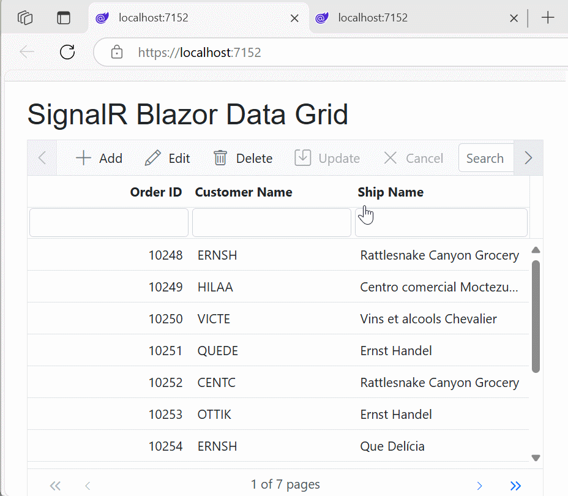

# Local Data Binding in Blazor DataGrid

The Syncfusion<sup style="font-size:70%">&reg;</sup> Blazor DataGrid provides straightforward methods to bind and display data that is available within your Blazor application's memory. This is particularly useful for scenarios involving static datasets, pre-loaded information, or data that does not require server-side operations for common Grid features.

You can bind local data by assigning an `IEnumerable` collection (such as `List<T>`, `ObservableCollection<T>`, or collections of `ExpandoObject`/`DynamicObject`/`DataTable`) directly to the [DataSource](https://help.syncfusion.com/cr/blazor/Syncfusion.Blazor.Grids.SfGrid-1.html#Syncfusion_Blazor_Grids_SfGrid_1_DataSource) property of the `SfGrid`.

> By default, the `SfDataManager` uses the `BlazorAdaptor` for list data binding, handling basic client-side operations transparently.

## List Binding

The most common approach for local data binding is to provide a list of strongly typed objects (for example, `List<T>` or `IEnumerable<T>`). This allows the DataGrid to directly render and manage the in-memory data. Grid features like paging, sorting, filtering, and CRUD operations are handled on the client side.

### Example: Binding a List of Objects

The following example demonstrates how to bind a `List<OrderDetails>` to the `SfGrid` DataSource. The `OrderDetails` class contains a static list named `order` to simulate an in-memory data store.



@using Syncfusion.Blazor.Grids
@using System.Collections.Generic
@using LocalDataExamples.Models // Ensure this namespace matches your project

<SfGrid DataSource="@OrderData" TValue="OrderDetails" AllowPaging="true" AllowSorting="true" AllowFiltering="true">
    <GridPageSettings PageSize="5"></GridPageSettings>
    <GridColumns>
        <GridColumn Field=@nameof(OrderDetails.OrderID) HeaderText="Order ID" TextAlign="TextAlign.Right" Width="100"></GridColumn>
        <GridColumn Field=@nameof(OrderDetails.CustomerID) HeaderText="Customer ID" Width="100"></GridColumn>
        <GridColumn Field=@nameof(OrderDetails.ShipCity) HeaderText="Ship City" Width="100"></GridColumn>
        <GridColumn Field=@nameof(OrderDetails.ShipName) HeaderText="Ship Name" Width="120"></GridColumn>
    </GridColumns>
</SfGrid>

@code {
    private List<OrderDetails> OrderData { get; set; }

    protected override void OnInitialized()
    {
        OrderData = OrderDetails.GetAllRecords();
    }
}


using System.Collections.Generic;

namespace LocalDataExamples.Models
{
    public class OrderDetails
    {
        // Use a static list named 'order' to simulate an in-memory data store for demonstration.
        // In a real application, consider an instance-based service for data management.
        public static List<OrderDetails> order = new List<OrderDetails>();

        public OrderDetails() { }

        public OrderDetails(int OrderID, string CustomerId, string ShipCity, string ShipName)
        {
            this.OrderID = OrderID;
            this.CustomerID = CustomerId;
            this.ShipCity = ShipCity;
            this.ShipName = ShipName;
        }

        public static List<OrderDetails> GetAllRecords()
        {
            if (order.Count == 0)
            {
                order.Add(new OrderDetails(10248, "VINET", "Reims", "Vins et alcools Chevalier"));
                order.Add(new OrderDetails(10249, "TOMSP", "Münster", "Toms Spezialitäten"));
                order.Add(new OrderDetails(10250, "HANAR", "Rio de Janeiro", "Hanari Carnes"));
                order.Add(new OrderDetails(10251, "VICTE", "Lyon", "Victuailles en stock"));
                order.Add(new OrderDetails(10252, "SUPRD", "Charleroi", "Suprêmes délices"));
                order.Add(new OrderDetails(10253, "HANAR", "Rio de Janeiro", "Hanari Carnes"));
                order.Add(new OrderDetails(10254, "CHOPS", "Bern", "Chop-suey Chinese"));
                order.Add(new OrderDetails(10255, "RICSU", "Genève", "Richter Supermarkt"));
                order.Add(new OrderDetails(10256, "WELLI", "Resende", "Wellington Importadora"));
                order.Add(new OrderDetails(10257, "HILAA", "San Cristóbal", "HILARION-Abastos"));
                order.Add(new OrderDetails(10258, "ERNSH", "Graz", "Ernst Handel"));
                order.Add(new OrderDetails(10259, "CENTC", "México D.F.", "Centro comercial Moctezuma"));
                order.Add(new OrderDetails(10260, "OTTIK", "Köln", "Ottilies Käseladen"));
                order.Add(new OrderDetails(10261, "QUEDE", "Rio de Janeiro", "Que Delícia"));
                order.Add(new OrderDetails(10262, "RATTC", "Albuquerque", "Rattlesnake Canyon Grocery"));
            }
            return order;
        }

        public int OrderID { get; set; }
        public string CustomerID { get; set; }
        public string ShipCity { get; set; }
        public string ShipName { get; set; }
    }
}





## Dynamic Data Binding (ExpandoObject and DynamicObject)

When the structure of your data is not known until runtime (for example, metadata-driven UIs or dynamic reporting), the DataGrid supports binding to collections of `ExpandoObject` or custom `DynamicObject` implementations. This provides maximum flexibility for handling schema-less data while retaining support for Grid features such as paging, sorting, filtering, and editing.

### ExpandoObject Binding

`ExpandoObject` (from `System.Dynamic`) allows defining object members at runtime. This is useful for dynamic or runtime-generated data models and for dynamically constructing Grid columns and data.

The following example demonstrates how to bind `ExpandoObject` in the Grid:




@using Syncfusion.Blazor.Grids
@using System.Dynamic
@using System.Collections.Generic // For List<ExpandoObject>
@using System.Linq

<SfGrid TValue="ExpandoObject" DataSource="@Orders" AllowPaging="true" Toolbar="@ToolbarItems">
    <GridEditSettings AllowAdding="true" AllowDeleting="true" AllowEditing="true"></GridEditSettings>
    <GridColumns>
        <GridColumn Field="OrderID" HeaderText="Order ID" IsPrimaryKey="true" TextAlign="TextAlign.Right" Width="120"></GridColumn>
        <GridColumn Field="CustomerID" HeaderText="Customer Name" Width="120"></GridColumn>
        <GridColumn Field="Freight" HeaderText="Freight" Format="C2" TextAlign="TextAlign.Right" Width="120"></GridColumn>
        <GridColumn Field="OrderDate" HeaderText="Order Date" Format="d" TextAlign="TextAlign.Right" Width="130" Type="ColumnType.Date"></GridColumn>
        <GridColumn Field="ShipCountry" HeaderText="Ship Country" EditType="EditType.DropDownEdit" Width="150"></GridColumn>
        <GridColumn Field="Verified" HeaderText="Active" DisplayAsCheckBox="true" Width="150"></GridColumn>
    </GridColumns>
</SfGrid>

@code {
    public List<ExpandoObject> Orders { get; set; } = new List<ExpandoObject>();
    private List<string> ToolbarItems { get; set; } = new List<string>() { "Add", "Edit", "Delete", "Update", "Cancel" };
    private static Random random = new Random(); // Initialize Random once

    protected override void OnInitialized()
    {
        Orders = Enumerable.Range(1, 75).Select((x) =>
        {
            dynamic order = new ExpandoObject();
            order.OrderID = 1000 + x;
            order.CustomerID = (new string[] { "ALFKI", "ANANTR", "ANTON", "BLONP", "BOLID" })[random.Next(5)];
            order.Freight = (new double[] { 2, 1, 4, 5, 3 })[random.Next(5)] * x;
            order.OrderDate = (new DateTime[] { new DateTime(1996, 11, 5), new DateTime(1996, 10, 3), new DateTime(1996, 9, 9), new DateTime(1996, 8, 2), new DateTime(1996, 4, 11) })[random.Next(5)];
            order.ShipCountry = (new string[] { "USA", "UK" })[random.Next(2)];
            order.Verified = (new bool[] { true, false })[random.Next(2)];
            return order;
        }).Cast<ExpandoObject>().ToList(); // Cast ensures correct type for the list
    }
}



Please find the sample in this [GitHub location](https://github.com/SyncfusionExamples/databinding-in-blazor-datagrid/blob/master/ListBinding/ListBinding/Components/Pages/ExpandoObjectBinding.razor).

### ExpandoObject with Complex Data Binding

When `ExpandoObject` contains nested objects, bind to their properties using dot notation (`Parent.ChildProperty`) in the `GridColumn.Field` property.



@using Syncfusion.Blazor.Grids
@using System.Dynamic
@using System.Collections.Generic
@using System.Linq

<SfGrid TValue="ExpandoObject" DataSource="@Orders" AllowPaging="true" AllowFiltering="true" AllowSorting="true" AllowGrouping="true" Toolbar="@ToolbarItems">
    <GridEditSettings AllowAdding="true" AllowDeleting="true" AllowEditing="true"></GridEditSettings>
    <GridColumns>
        <GridColumn Field="OrderID" HeaderText="Order ID" IsPrimaryKey="true" TextAlign="TextAlign.Right" Width="120"></GridColumn>
        <GridColumn Field="CustomerID.Name" HeaderText="Customer Name" Width="120"></GridColumn>
        <GridColumn Field="Freight" HeaderText="Freight" Format="C2" TextAlign="TextAlign.Right" Width="120"></GridColumn>
        <GridColumn Field="OrderDate" HeaderText="Order Date" Format="d" TextAlign="TextAlign.Right" Width="130" Type="ColumnType.Date"></GridColumn>
        <GridColumn Field="ShipCountry.Country" HeaderText="Ship Country" Width="150"></GridColumn>
        <GridColumn Field="Verified" HeaderText="Active" DisplayAsCheckBox="true" Width="150"></GridColumn>
    </GridColumns>
</SfGrid>

@code {
    public List<ExpandoObject> Orders { get; set; } = new List<ExpandoObject>();
    private List<string> ToolbarItems { get; set; } = new List<string>() { "Add", "Edit", "Delete", "Update", "Cancel" };
    private static Random random = new Random(); // Initialize Random once

    protected override void OnInitialized()
    {
        Orders = Enumerable.Range(1, 75).Select((x) =>
        {
            dynamic order = new ExpandoObject();
            dynamic customerName = new ExpandoObject();
            dynamic countryName = new ExpandoObject(); // Nested ExpandoObject

            order.OrderID = 1000 + x;
            customerName.Name = (new string[] { "ALFKI", "ANANTR", "ANTON", "BLONP", "BOLID" })[random.Next(5)];
            order.CustomerID = customerName; // Assign nested object
            order.Freight = (new double[] { 2, 1, 4, 5, 3 })[random.Next(5)] * x;
            order.OrderDate = (new DateTime[] { new DateTime(1996, 11, 5), new DateTime(1996, 10, 3), new DateTime(1996, 9, 9), new DateTime(1996, 8, 2), new DateTime(1996, 4, 11) })[random.Next(5)];
            countryName.Country = (new string[] { "USA", "UK" })[random.Next(2)];
            order.ShipCountry = countryName; // Assign nested object
            order.Verified = (new bool[] { true, false })[random.Next(2)];

            return order;
        }).Cast<ExpandoObject>().ToList();
    }
}



> Data operations and CRUD operations are fully supported for complex `ExpandoObject` fields.

The following image represents `ExpandoObject` complex data binding:


Refer to the sample on GitHub: [ExpandoObjectComplexBinding.razor](https://github.com/SyncfusionExamples/databinding-in-blazor-datagrid/blob/master/ListBinding/ListBinding/Components/Pages/ExpandoObjectComplexBinding.razor).

### DynamicObject Binding

`DynamicObject` provides dynamic behavior through a custom class inheriting from `System.Dynamic.DynamicObject`. This approach is suitable when you need control over how dynamic properties are accessed and modified for schema-less models.

Override `GetDynamicMemberNames` in your `DynamicObject` implementation so the Grid can detect property names for rendering and for operations like editing, sorting, filtering, and paging.

The following example demonstrates how to bind `DynamicObject` in the Grid:




@using Syncfusion.Blazor.Grids
@using System.Dynamic
@using System.Collections.Generic // For List<DynamicDictionary>
@using System.Linq

<SfGrid TValue="DynamicDictionary" DataSource="@Orders" AllowPaging="true" Toolbar="@ToolbarItems">
    <GridEditSettings AllowAdding="true" AllowDeleting="true" AllowEditing="true"></GridEditSettings>
    <GridColumns>
        <GridColumn Field="OrderID" HeaderText="Order ID" IsPrimaryKey="true" TextAlign="TextAlign.Right" Width="120"></GridColumn>
        <GridColumn Field="CustomerID" HeaderText="Customer Name" Width="150"></GridColumn>
        <GridColumn Field="OrderDate" HeaderText="Order Date" Format="d" Type="ColumnType.Date" TextAlign="TextAlign.Right" EditType="EditType.DatePickerEdit" Width="130"></GridColumn>
        <GridColumn Field="Freight" HeaderText="Freight" Format="C2" TextAlign="TextAlign.Right" Width="120"></GridColumn>
    </GridColumns>
</SfGrid>

@code {
    private List<string> ToolbarItems { get; set; } = new List<string>(){ "Add", "Edit", "Delete", "Update", "Cancel"};
    public List<DynamicDictionary> Orders { get; set; } = new List<DynamicDictionary>();
    private static Random random = new Random(); // Initialize Random once

    protected override void OnInitialized()
    {
        Orders = Enumerable.Range(1, 15).Select((x) =>
        {
            dynamic order = new DynamicDictionary();
            order.OrderID = 1000 + x;
            order.CustomerID = (new string[] { "ALFKI", "ANANTR", "ANTON", "BLONP", "BOLID" })[random.Next(5)];
            order.Freight = (new double[] { 2, 1, 4, 5, 3 })[random.Next(5)] * x;
            order.OrderDate = (new DateTime[] { new DateTime(1996, 11, 5), new DateTime(1996, 10, 3), new DateTime(1996, 9, 9), new DateTime(1996, 8, 2), new DateTime(1996, 4, 11) })[random.Next(5)];
            return order;
        }).Cast<DynamicDictionary>().ToList(); // Ensure correct cast for the list
    }

    public class DynamicDictionary : DynamicObject
    {
        private Dictionary<string, object> dictionary = new Dictionary<string, object>();

        public override bool TryGetMember(GetMemberBinder binder, out object result)
        {
            return dictionary.TryGetValue(binder.Name, out result);
        }

        public override bool TrySetMember(SetMemberBinder binder, object value)
        {
            dictionary[binder.Name] = value;
            return true;
        }

        public override System.Collections.Generic.IEnumerable<string> GetDynamicMemberNames()
        {
            return this.dictionary?.Keys ?? Enumerable.Empty<string>();
        }
    }
}



Please find the sample in this [GitHub location](https://github.com/SyncfusionExamples/databinding-in-blazor-datagrid/blob/master/ListBinding/ListBinding/Components/Pages/DynamicObjectBinding.razor).

### DynamicObject with Complex Data Binding

Similar to `ExpandoObject`, use dot notation to bind properties of nested `DynamicObject` instances within the Grid.



@using Syncfusion.Blazor.Grids
@using System.Dynamic
@using System.Collections.Generic
@using System.Linq

<SfGrid TValue="DynamicDictionary" DataSource="@Orders" AllowPaging="true" AllowFiltering="true" AllowSorting="true" AllowGrouping="true" Toolbar="@ToolbarItems">
    <GridEditSettings AllowAdding="true" AllowDeleting="true" AllowEditing="true"></GridEditSettings>
    <GridColumns>
        <GridColumn Field="OrderID" HeaderText="Order ID" IsPrimaryKey="true" TextAlign="TextAlign.Right" Width="120"></GridColumn>
        <GridColumn Field="CustomerID.Name" HeaderText="Customer Name" Width="150"></GridColumn>
        <GridColumn Field="OrderDate" HeaderText="Order Date" Format="d" Type="ColumnType.Date" TextAlign="TextAlign.Right" EditType="EditType.DatePickerEdit" Width="130"></GridColumn>
        <GridColumn Field="Freight" HeaderText="Freight" Format="C2" TextAlign="TextAlign.Right" Width="120"></GridColumn>
        <GridColumn Field="ShipCountry.Country" HeaderText="Ship Country" Width="150"></GridColumn>
    </GridColumns>
</SfGrid>

@code {
    private List<string> ToolbarItems { get; set; } = new List<string>() { "Add", "Edit", "Delete", "Update", "Cancel" };
    public List<DynamicDictionary> Orders { get; set; } = new List<DynamicDictionary>();
    private static Random random = new Random(); // Initialize Random once

    protected override void OnInitialized()
    {
        Orders = Enumerable.Range(1, 15).Select((x) =>
        {
            dynamic order = new DynamicDictionary();
            dynamic customerName = new DynamicDictionary();
            dynamic countryName = new DynamicDictionary();

            order.OrderID = 1000 + x;
            customerName.Name = (new string[] { "ALFKI", "ANANTR", "ANTON", "BLONP", "BOLID" })[random.Next(5)];
            order.CustomerID = customerName;
            order.Freight = (new double[] { 2, 1, 4, 5, 3 })[random.Next(5)] * x;
            order.OrderDate = (new DateTime[] { new DateTime(1996, 11, 5), new DateTime(1996, 10, 3), new DateTime(1996, 9, 9), new DateTime(1996, 8, 2), new DateTime(1996, 4, 11) })[random.Next(5)];
            countryName.Country = (new string[] { "USA", "UK" })[random.Next(2)];
            order.ShipCountry = countryName;
            return order;
        }).Cast<DynamicDictionary>().ToList();
    }

    public class DynamicDictionary : DynamicObject
    {
        private Dictionary<string, object> dictionary = new Dictionary<string, object>();

        public override bool TryGetMember(GetMemberBinder binder, out object result)
        {
            return dictionary.TryGetValue(binder.Name, out result);
        }

        public override bool TrySetMember(SetMemberBinder binder, object value)
        {
            dictionary[binder.Name] = value;
            return true;
        }

        public override System.Collections.Generic.IEnumerable<string> GetDynamicMemberNames()
        {
            return this.dictionary?.Keys ?? Enumerable.Empty<string>();
        }
    }
}



> Data operations and CRUD operations are fully supported for complex `DynamicObject` fields.

The following image represents `DynamicObject` complex data binding:


Refer to the sample on GitHub: [DynamicObjectComplexBinding.razor](https://github.com/SyncfusionExamples/databinding-in-blazor-datagrid/blob/master/ListBinding/ListBinding/Components/Pages/DynamicObjectComplexBinding.razor).

> When binding the Grid DataSource dynamically as a list of `IEnumerable` items, call the [Refresh](https://help.syncfusion.com/cr/blazor/Syncfusion.Blazor.Grids.SfGrid-1.html#Syncfusion_Blazor_Grids_SfGrid_1_Refresh_System_Boolean_) method of the Grid to reflect external changes. Change tracking for external updates to `IEnumerable` items is avoided for performance reasons.

## DataTable Binding

The Syncfusion Blazor DataGrid can bind data from a `System.Data.DataTable` using a custom adaptor. This approach allows for dynamic generation of rows and columns, making it useful when data is retrieved or processed in a `DataTable` format. It supports built-in data operations such as paging, filtering, sorting, and searching.

The process involves:
1. Creating and populating a `DataTable`.
2. Converting the `DataTable` into an `IQueryable<ExpandoObject>` collection using a helper method.
3. Implementing a custom adaptor that extends [DataAdaptor](https://help.syncfusion.com/cr/blazor/Syncfusion.Blazor.DataAdaptor.html).
4. Overriding the [Read](https://help.syncfusion.com/cr/blazor/Syncfusion.Blazor.DataAdaptor.html#Syncfusion_Blazor_DataAdaptor_Read_Syncfusion_Blazor_DataManagerRequest_System_String_) method in the custom adaptor to handle data fetching and operations.

### Example: DataTable Binding with Custom Adaptor

The example below demonstrates how to bind a `DataTable` to the Grid using a `CustomAdaptor`. The `DataTable` is converted to an `IQueryable<ExpandoObject>` collection for the Grid to consume.



@using Syncfusion.Blazor;
@using Syncfusion.Blazor.Data
@using Syncfusion.Blazor.Grids
@using System.Dynamic;
@using System.Data; // Required for DataTable
@using System.Linq; // Required for AsQueryable

<SfGrid TValue="ExpandoObject" ID="Grid" AllowSorting="true" AllowPaging="true" AllowFiltering="true" Toolbar="@(new List<string>() { "Search" })">
    <SfDataManager AdaptorInstance="@typeof(CustomDataTableAdaptor)" Adaptor="Adaptors.CustomAdaptor"></SfDataManager>
    <GridPageSettings PageSize="8"></GridPageSettings>
    <GridColumns>
        <GridColumn Field="OrderID" HeaderText="Order ID" IsPrimaryKey="true" ValidationRules="@(new ValidationRules { Required=true, Number=true })" Width="100"></GridColumn>
        <GridColumn Field="CustomerID" HeaderText="Customer Name" ValidationRules="@(new ValidationRules { Required=true })" Width="100"></GridColumn>
        <GridColumn Field="OrderDate" HeaderText="Order Date" Format="d" Type="ColumnType.Date" Width="110"></GridColumn>
        <GridColumn Field="EmployeeID" HeaderText="Employee ID" Width="100"></GridColumn>
    </GridColumns>
</SfGrid>

@code {
    // Simulate an in-memory DataTable. In a real app, this might come from a repository/service.
    private static DataTable _inMemoryDataTable;

    protected override void OnInitialized()
    {
        _inMemoryDataTable = CustomDataTableAdaptor.GetData();
    }

    public class CustomDataTableAdaptor : DataAdaptor
    {
        private static IQueryable<ExpandoObject> ToQueryableCollection(DataTable dataTable)
        {
            List<ExpandoObject> expandoList = new List<ExpandoObject>();
            foreach (DataRow row in dataTable.Rows)
            {
                var expandoDict = new ExpandoObject() as IDictionary<String, Object>;
                foreach (DataColumn col in dataTable.Columns)
                {
                    var colValue = row[col.ColumnName];
                    colValue = (colValue == DBNull.Value) ? null : colValue;
                    // Add using ColumnName for consistency and easier access via Field="ColumnName"
                    expandoDict.Add(col.ColumnName, colValue);
                }
                expandoList.Add((ExpandoObject)expandoDict);
            }
            return expandoList.AsQueryable();
        }

        private static IQueryable<ExpandoObject> PerformDataOperation(IQueryable<ExpandoObject> dataSource, DataManagerRequest dataManagerRequest)
        {
            IQueryable<ExpandoObject> processedSource = dataSource;

            if (dataManagerRequest.Search != null && dataManagerRequest.Search.Count > 0)
            {
                processedSource = DynamicObjectOperation.PerformSearching(processedSource, dataManagerRequest.Search).Cast<ExpandoObject>();
            }
            if (dataManagerRequest.Where != null && dataManagerRequest.Where.Count > 0)
            {
                 processedSource = DynamicObjectOperation.PerformFiltering(processedSource, dataManagerRequest.Where, dataManagerRequest.Where[0].Operator).Cast<ExpandoObject>();
            }
            if (dataManagerRequest.Sorted != null && dataManagerRequest.Sorted.Count > 0)
            {
                // Ensure sorting works with dynamic objects by providing a custom comparer or conversion if needed
                processedSource = DynamicObjectOperation.PerformSorting(processedSource, dataManagerRequest.Sorted).Cast<ExpandoObject>();
            }
            return processedSource;
        }

        // Perform the Read operation to fetch data from the source.
        public override object Read(DataManagerRequest dataManagerRequest, string key = null)
        {
            // Always work with the current state of the static DataTable
            IQueryable<ExpandoObject> currentDataSource = ToQueryableCollection(_inMemoryDataTable);

            // Apply searching, sorting, and filtering on the current data.
            currentDataSource = PerformDataOperation(currentDataSource, dataManagerRequest);

            // Get the total record count AFTER filtering/searching/sorting
            int count = currentDataSource.Count();

            // Perform paging operation using skip and take.
            if (dataManagerRequest.Skip != 0)
            {
                currentDataSource = QueryableOperation.PerformSkip(currentDataSource, dataManagerRequest.Skip).Cast<ExpandoObject>();
            }
            if (dataManagerRequest.Take != 0)
            {
                currentDataSource = QueryableOperation.PerformTake(currentDataSource, dataManagerRequest.Take).Cast<ExpandoObject>();
            }

            // Return the result with count if required.
            return dataManagerRequest.RequiresCounts
                ? new DataResult() { Result = currentDataSource, Count = count }
                : (object)currentDataSource;
        }
        
        // Helper to generate sample DataTable data
        public static DataTable GetData()
        {
            DataTable dataTable = new DataTable();
            dataTable.Columns.AddRange(new DataColumn[4] {
                new DataColumn("OrderID", typeof(long)),
                new DataColumn("CustomerID", typeof(string)),
                new DataColumn("EmployeeID",typeof(int)),
                new DataColumn("OrderDate",typeof(DateTime))
            });
            int code = 1000;
            int id = 0;
            for (int i = 1; i <= 15; i++)
            {
                dataTable.Rows.Add(code + 1, "ALFKI", id + 1, new DateTime(1991, 05, 15));
                dataTable.Rows.Add(code + 2, "CHOPS", id + 2, new DateTime(1990, 04, 04));
                dataTable.Rows.Add(code + 3, "ANTON", id + 3, new DateTime(1957, 11, 30));
                dataTable.Rows.Add(code + 4, "DRACH", id + 4, new DateTime(1930, 10, 22));
                dataTable.Rows.Add(code + 5, "BOLID", id + 5, new DateTime(1953, 02, 18));
                code += 5;
                id += 5;
            }
            return dataTable;
        }
    }
}

<details>
<summary><code>_Imports.razor</code> for utility classes (e.g., DynamicObjectOperation, QueryableOperation)</summary>

If `DynamicObjectOperation` and `QueryableOperation` are custom utility classes or part of a Syncfusion namespace that needs explicit import, ensure they are imported in `_Imports.razor` or directly within the component. For example:

```csharp
@using Syncfusion.Blazor.Data.Extensions // Potentially for QueryableOperation/DynamicObjectOperation
```
</details>



### Grouping and Aggregates with DataTable

The DataGrid supports dynamic grouping and aggregates even when bound to a `DataTable` via a custom adaptor. This enables grouping rows by one or more columns and applying aggregate functions (such as Sum, Average, Count) on groups or the entire dataset.

> The following example applies operations in this order: Skip → Take → Aggregates → Group.



@using Syncfusion.Blazor;
@using Syncfusion.Blazor.Data
@using Syncfusion.Blazor.Grids
@using System.Data;
@using System.Dynamic;
@using System.Collections; // Required for IEnumerable
@using System.Linq; // Required for AsQueryable

<SfGrid TValue="ExpandoObject" AllowPaging="true" AllowGrouping="true">
    <SfDataManager AdaptorInstance="@typeof(CustomDataTableAdaptorWithGroups)" Adaptor="Adaptors.CustomAdaptor"></SfDataManager>
    <GridGroupSettings ShowGroupedColumn="true"></GridGroupSettings>
    <GridPageSettings PageSize="8"></GridPageSettings>
    <GridAggregates>
        <GridAggregate>
            <GridAggregateColumns>
                <GridAggregateColumn Field="Freight" Type="AggregateType.Sum" Format="C2">
                    <FooterTemplate>
                        @{
                            var aggregate = (context as AggregateTemplateContext);
                            <div>
                                <p>Sum: @aggregate.Sum</p>
                            </div>
                        }
                    </FooterTemplate>
                </GridAggregateColumn>
            </GridAggregateColumns>
        </GridAggregate>
    </GridAggregates>
    <GridColumns>
        <GridColumn Field="OrderID" HeaderText="Order ID" Width="100" TextAlign="TextAlign.Right" />
        <GridColumn Field="CustomerID" HeaderText="Customer Name" Width="100" />
        <GridColumn Field="EmployeeID" HeaderText="Employee ID" Width="100" />
        <GridColumn Field="OrderDate" HeaderText="Order Date" Width="110" Format="d" Type="ColumnType.Date" />
        <GridColumn Field="Freight" TextAlign="TextAlign.Right" AllowGrouping="false" Format="C2" Width="100"></GridColumn>
    </GridColumns>
</SfGrid>

@code {
    private static DataTable _inMemoryDataTableForGroups;

    protected override void OnInitialized()
    {
        _inMemoryDataTableForGroups = CustomDataTableAdaptorWithGroups.GetDataForGroups();
    }

    public class CustomDataTableAdaptorWithGroups : DataAdaptor
    {
        private static IQueryable<ExpandoObject> ToQueryableCollection(DataTable dataTable)
        {
            List<ExpandoObject> expandoList = new List<ExpandoObject>();
            foreach (DataRow row in dataTable.Rows)
            {
                var expandoDict = new ExpandoObject() as IDictionary<String, Object>;
                foreach (DataColumn col in dataTable.Columns)
                {
                    var colValue = row[col.ColumnName];
                    colValue = (colValue == DBNull.Value) ? null : colValue;
                    expandoDict.Add(col.ColumnName, colValue);
                }
                expandoList.Add((ExpandoObject)expandoDict);
            }
            return expandoList.AsQueryable();
        }

        private static IQueryable<ExpandoObject> PerformDataOperation(IQueryable<ExpandoObject> dataSource, DataManagerRequest dataManagerRequest)
        {
            IQueryable<ExpandoObject> processedSource = dataSource;

            if (dataManagerRequest.Search != null && dataManagerRequest.Search.Count > 0)
            {
                processedSource = DynamicObjectOperation.PerformSearching(processedSource, dataManagerRequest.Search).Cast<ExpandoObject>();
            }
            if (dataManagerRequest.Where != null && dataManagerRequest.Where.Count > 0)
            {
                processedSource = DynamicObjectOperation.PerformFiltering(processedSource, dataManagerRequest.Where, dataManagerRequest.Where[0].Operator).Cast<ExpandoObject>();
            }
            if (dataManagerRequest.Sorted != null && dataManagerRequest.Sorted.Count > 0)
            {
                processedSource = DynamicObjectOperation.PerformSorting(processedSource, dataManagerRequest.Sorted).Cast<ExpandoObject>();
            }
            return processedSource;
        }

        public override object Read(DataManagerRequest dataManagerRequest, string key = null)
        {
            IQueryable<ExpandoObject> currentDataSource = ToQueryableCollection(_inMemoryDataTableForGroups);

            // 1) Apply searching, filtering, and sorting first
            currentDataSource = PerformDataOperation(currentDataSource, dataManagerRequest);

            // Compute total count AFTER filtering/searching/sorting but BEFORE paging/grouping
            int count = currentDataSource.Count();
            IEnumerable result = currentDataSource;

            // 2) Apply paging (Skip then Take)
            if (dataManagerRequest.Skip != 0)
            {
                result = QueryableOperation.PerformSkip<object>(result.Cast<object>().AsQueryable(), dataManagerRequest.Skip).Cast<ExpandoObject>();
            }
            if (dataManagerRequest.Take != 0)
            {
                result = QueryableOperation.PerformTake<object>(result.Cast<object>().AsQueryable(), dataManagerRequest.Take).Cast<ExpandoObject>();
            }

            // 3) Perform aggregation on the current (paged) result if required
            IDictionary<string, object> aggregates = new Dictionary<string, object>();
            if (dataManagerRequest.Aggregates != null)
            {
                // Use the same sequence for aggregation; aggregate on the current dataset
                aggregates = DataUtil.PerformAggregation(result, dataManagerRequest.Aggregates);
            }

            // 4) Perform grouping operation (if requested)
            if (dataManagerRequest.Group != null && dataManagerRequest.Group.Any())
            {
                // Grouping is typically applied to the full data set or filtered set.
                // DataUtil.Group can also calculate aggregates during grouping.
                foreach (var group in dataManagerRequest.Group)
                {
                    result = DataUtil.Group<ExpandoObject>(result, group, dataManagerRequest?.Aggregates, 0, dataManagerRequest.GroupByFormatter);
                }
            }

            // Return grouped data with count and aggregates if required.
            return dataManagerRequest.RequiresCounts
                ? new DataResult() { Result = result, Count = count, Aggregates = aggregates }
                : (object)result;
        }

        public static DataTable GetDataForGroups() // Separate data generation for clarity
        {
            DataTable dataTable = new DataTable();
            dataTable.Columns.AddRange(new DataColumn[5] {
                new DataColumn("OrderID", typeof(long)),
                new DataColumn("CustomerID", typeof(string)),
                new DataColumn("EmployeeID",typeof(int)),
                new DataColumn("OrderDate",typeof(DateTime)),
                new DataColumn("Freight", typeof(double))
            });
            int code = 1000;
            int id = 0;
            for (int i = 1; i <= 15; i++)
            {
                dataTable.Rows.Add(code + 1, "ALFKI", id + 1, new DateTime(1991, 05, 15), 2.32 * i);
                dataTable.Rows.Add(code + 2, "CHOPS", id + 2, new DateTime(1990, 04, 04), 1.28 * i);
                dataTable.Rows.Add(code + 3, "ANTON", id + 3, new DateTime(1957, 11, 30), 4.31 * i);
                dataTable.Rows.Add(code + 4, "DRACH", id + 4, new DateTime(1930, 10, 22), 2.56 * i);
                dataTable.Rows.Add(code + 5, "BOLID", id + 5, new DateTime(1953, 02, 18), 5.54 * i);
                code += 5;
                id += 5;
            }
            return dataTable;
        }
    }
}

<details>
<summary><code>_Imports.razor</code> for utility classes</summary>

If `DynamicObjectOperation` and `QueryableOperation` are custom utility classes or part of a Syncfusion namespace that needs explicit import, ensure they are imported in `_Imports.razor` or directly within the component. For example:

```csharp
@using Syncfusion.Blazor.Data.Extensions // Potentially for QueryableOperation/DynamicObjectOperation
```
</details>



### DataTable with CRUD Operations

The DataGrid supports CRUD (Create, Read, Update, and Delete) operations with a `DataTable` using a custom adaptor. Enable editing features in the Grid and override methods of the [DataAdaptor](https://help.syncfusion.com/cr/blazor/Syncfusion.Blazor.DataAdaptor.html) base class to update your in-memory `DataTable`.

Relevant methods to override in your custom adaptor include:

*   `[Insert](https://help.syncfusion.com/cr/blazor/Syncfusion.Blazor.DataAdaptor.html#Syncfusion_Blazor_DataAdaptor_Insert_Syncfusion_Blazor_DataManager_System_Object_System_String_)` / `[InsertAsync](https://help.syncfusion.com/cr/blazor/Syncfusion.Blazor.DataAdaptor.html#Syncfusion_Blazor_DataAdaptor_InsertAsync_Syncfusion_Blazor_DataManager_System_Object_System_String_)`: To add new records.
*   `[Update](https://help.syncfusion.com/cr/blazor/Syncfusion.Blazor.DataAdaptor.html#Syncfusion_Blazor_DataAdaptor_Update_Syncfusion_Blazor_DataManager_System_Object_System_String_System_String_)` / `[UpdateAsync](https://help.syncfusion.com/cr/blazor/Syncfusion.Blazor.DataAdaptor.html#Syncfusion_Blazor_DataAdaptor_UpdateAsync_Syncfusion_Blazor_DataManager_System_Object_System_String_System_String_)`: To modify existing records.
*   `[Remove](https://help.syncfusion.com/cr/blazor/Syncfusion.Blazor.DataAdaptor.html#Syncfusion_Blazor_DataAdaptor_Remove_Syncfusion_Blazor_DataManager_System_Object_System_String_System_String_)` / `[RemoveAsync](https://help.syncfusion.com/cr/blazor/Syncfusion.Blazor.DataAdaptor.html#Syncfusion_Blazor_DataAdaptor_RemoveAsync_Syncfusion_Blazor_DataAdaptor_RemoveAsync_Syncfusion_Blazor_DataManager_System_Object_System_Object_System_String_System_String_)`: To delete records.
*   `[BatchUpdate](https://help.syncfusion.com/cr/blazor/Syncfusion.Blazor.DataAdaptor.html#Syncfusion_Blazor_DataAdaptor_BatchUpdate_Syncfusion_Blazor_DataManager_System_Object_System_Object_System_Object_System_String_System_String_System_Nullable_System_Int32__)` / `[BatchUpdateAsync](https://help.syncfusion.com/cr/blazor/Syncfusion.Blazor.DataAdaptor.html#Syncfusion_Blazor_DataAdaptor_BatchUpdateAsync_Syncfusion_Blazor_DataManager_System_Object_System_Object_System_Object_System_String_System_String_System_Nullable_System_Int32__)`: To handle batch operations (add, update, delete) in a single transaction, especially for `EditMode.Batch`.



@using Syncfusion.Blazor;
@using Syncfusion.Blazor.Data
@using Syncfusion.Blazor.Grids
@using System.Dynamic;
@using System.Data;
@using System.Linq; // Required for AsEnumerable

<SfGrid TValue="ExpandoObject" ID="Grid" AllowPaging="true" Toolbar="@(new List<string>() { "Add", "Edit", "Delete", "Update", "Cancel" })">
    <SfDataManager AdaptorInstance="@typeof(CustomDataTableCrudAdaptor)" Adaptor="Adaptors.CustomAdaptor"></SfDataManager>
    <GridEditSettings AllowEditing="true" AllowDeleting="true" AllowAdding="true" Mode="@EditMode.Normal"></GridEditSettings>
    <GridPageSettings PageSize="8"></GridPageSettings>
    <GridColumns>
        <GridColumn Field="OrderID" HeaderText="Order ID" IsPrimaryKey="true" ValidationRules="@(new ValidationRules { Required=true, Number=true })" Width="100"></GridColumn>
        <GridColumn Field="CustomerID" HeaderText="Customer Name" ValidationRules="@(new ValidationRules { Required=true })" Width="100"></GridColumn>
        <GridColumn Field="OrderDate" HeaderText="Order Date" Format="d" Type="ColumnType.Date" Width="110"></GridColumn>
        <GridColumn Field="EmployeeID" HeaderText="Employee ID" Width="100"></GridColumn>
    </GridColumns>
</SfGrid>

@code {
    private static DataTable _inMemoryDataTableForCrud;

    protected override void OnInitialized()
    {
        _inMemoryDataTableForCrud = CustomDataTableCrudAdaptor.GetDataForCrud();
    }

    public class CustomDataTableCrudAdaptor : DataAdaptor
    {
        private static IQueryable<ExpandoObject> ToQueryableCollection(DataTable dataTable)
        {
            List<ExpandoObject> expandoList = new List<ExpandoObject>();
            foreach (DataRow row in dataTable.Rows)
            {
                var expandoDict = new ExpandoObject() as IDictionary<String, Object>;
                foreach (DataColumn col in dataTable.Columns)
                {
                    var colValue = row[col.ColumnName];
                    colValue = (colValue == DBNull.Value) ? null : colValue;
                    expandoDict.Add(col.ColumnName, colValue);
                }
                expandoList.Add((ExpandoObject)expandoDict);
            }
            return expandoList.AsQueryable();
        }

        // Perform the Read operation.
        public override object Read(DataManagerRequest dataManagerRequest, string key = null)
        {
            IQueryable<ExpandoObject> currentDataSource = ToQueryableCollection(_inMemoryDataTableForCrud);

            // Apply searching, sorting, and filtering
            currentDataSource = PerformDataOperation(currentDataSource, dataManagerRequest); // Re-use helper logic

            int count = currentDataSource.Count();

            // Perform paging
            if (dataManagerRequest.Skip != 0)
            {
                currentDataSource = QueryableOperation.PerformSkip(currentDataSource, dataManagerRequest.Skip).Cast<ExpandoObject>();
            }
            if (dataManagerRequest.Take != 0)
            {
                currentDataSource = QueryableOperation.PerformTake(currentDataSource, dataManagerRequest.Take).Cast<ExpandoObject>();
            }

            return dataManagerRequest.RequiresCounts ? new DataResult() { Result = currentDataSource, Count = count } : (object)currentDataSource;
        }

        private IQueryable<ExpandoObject> PerformDataOperation(IQueryable<ExpandoObject> dataSource, DataManagerRequest dataManagerRequest)
        {
            IQueryable<ExpandoObject> processedSource = dataSource;

            if (dataManagerRequest.Search != null && dataManagerRequest.Search.Count > 0)
            {
                processedSource = DynamicObjectOperation.PerformSearching(processedSource, dataManagerRequest.Search).Cast<ExpandoObject>();
            }
            if (dataManagerRequest.Where != null && dataManagerRequest.Where.Count > 0)
            {
                processedSource = DynamicObjectOperation.PerformFiltering(processedSource, dataManagerRequest.Where, dataManagerRequest.Where[0].Operator).Cast<ExpandoObject>();
            }
            if (dataManagerRequest.Sorted != null && dataManagerRequest.Sorted.Count > 0)
            {
                processedSource = DynamicObjectOperation.PerformSorting(processedSource, dataManagerRequest.Sorted).Cast<ExpandoObject>();
            }
            return processedSource;
        }

        // Perform insert operation.
        public override object Insert(DataManager dataManager, object value, string key)
        {
            DataRow newRow = _inMemoryDataTableForCrud.NewRow();
            var data = (ExpandoObject)value;
            foreach (var item in (IDictionary<string, object>)data)
            {
                if (_inMemoryDataTableForCrud.Columns.Contains(item.Key))
                {
                    newRow[item.Key] = item.Value ?? DBNull.Value;
                }
            }
            _inMemoryDataTableForCrud.Rows.InsertAt(newRow, 0); // Insert at the beginning
            return value;
        }

        // Perform remove operation.
        public override object Remove(DataManager dataManager, object value, string keyField, string key)
        {
            DataRow? rowToRemove = _inMemoryDataTableForCrud.AsEnumerable()
                                      .FirstOrDefault(row => row[keyField]?.ToString() == value?.ToString());

            if (rowToRemove != null)
            {
                _inMemoryDataTableForCrud.Rows.Remove(rowToRemove);
            }
            return value;
        }

        // Perform update operation.
        public override object Update(DataManager dataManager, object value, string keyField, string key)
        {
            var data = (IDictionary<string, object>)value;

            DataRow? rowToUpdate = _inMemoryDataTableForCrud.AsEnumerable()
                                        .FirstOrDefault(row => row[keyField]?.ToString() == data[keyField]?.ToString());

            if (rowToUpdate != null)
            {
                foreach (DataColumn column in _inMemoryDataTableForCrud.Columns)
                {
                    if (data.ContainsKey(column.ColumnName))
                    {
                        var newValue = data[column.ColumnName];
                        rowToUpdate[column.ColumnName] = newValue ?? DBNull.Value;
                    }
                }
            }
            return value;
        }

        // Perform batch update operation for changed, added, and deleted records.
        public override object BatchUpdate(DataManager dataManager, object Changed, object Added, object Deleted, string KeyField, string Key, int? dropIndex)
        {
            if (Changed is IEnumerable<ExpandoObject> changedRecords)
            {
                foreach (var recordExpando in changedRecords)
                {
                    var recordDict = (IDictionary<string, object>)recordExpando;
                    DataRow? rowToUpdate = _inMemoryDataTableForCrud.AsEnumerable()
                                                .FirstOrDefault(row => row[KeyField]?.ToString() == recordDict[KeyField]?.ToString());
                    if (rowToUpdate != null)
                    {
                        foreach (DataColumn column in _inMemoryDataTableForCrud.Columns)
                        {
                            if (recordDict.ContainsKey(column.ColumnName))
                            {
                                rowToUpdate[column.ColumnName] = recordDict[column.ColumnName] ?? DBNull.Value;
                            }
                        }
                    }
                }
            }

            if (Added is IEnumerable<ExpandoObject> addedRecords)
            {
                foreach (var recordExpando in addedRecords)
                {
                    var recordDict = (IDictionary<string, object>)recordExpando;
                    DataRow newRow = _inMemoryDataTableForCrud.NewRow();
                    foreach (var item in recordDict)
                    {
                        if (_inMemoryDataTableForCrud.Columns.Contains(item.Key))
                        {
                            newRow[item.Key] = item.Value ?? DBNull.Value;
                        }
                    }
                    _inMemoryDataTableForCrud.Rows.Add(newRow);
                }
            }

            if (Deleted is IEnumerable<ExpandoObject> deletedRecords)
            {
                List<DataRow> rowsToRemove = new List<DataRow>();
                foreach (var recordExpando in deletedRecords)
                {
                    var recordDict = (IDictionary<string, object>)recordExpando;
                    DataRow? rowToRemove = _inMemoryDataTableForCrud.AsEnumerable()
                                                .FirstOrDefault(row => row[KeyField]?.ToString() == recordDict[KeyField]?.ToString());
                    if (rowToRemove != null)
                    {
                        rowsToRemove.Add(rowToRemove);
                    }
                }
                foreach (DataRow row in rowsToRemove)
                {
                    _inMemoryDataTableForCrud.Rows.Remove(row);
                }
            }
            return _inMemoryDataTableForCrud; // Return the updated DataTable
        }

        public static DataTable GetDataForCrud() // Separate data generation for CRUD
        {
            DataTable dataTable = new DataTable();
            dataTable.Columns.AddRange(new DataColumn[4] {
                new DataColumn("OrderID", typeof(long)),
                new DataColumn("CustomerID", typeof(string)),
                new DataColumn("EmployeeID",typeof(int)),
                new DataColumn("OrderDate",typeof(DateTime))
            });
            int code = 1000;
            int id = 0;
            for (int i = 1; i <= 15; i++)
            {
                dataTable.Rows.Add(code + 1, "ALFKI", id + 1, new DateTime(1991, 05, 15));
                dataTable.Rows.Add(code + 2, "ANATR", id + 2, new DateTime(1990, 04, 04));
                dataTable.Rows.Add(code + 3, "ANTON", id + 3, new DateTime(1957, 11, 30));
                dataTable.Rows.Add(code + 4, "BLONP", id + 4, new DateTime(1930, 10, 22));
                dataTable.Rows.Add(code + 5, "BOLID", id + 5, new DateTime(1953, 02, 18));
                code += 5;
                id += 5;
            }
            return dataTable;
        }
    }
}



Refer to the sample on GitHub: [DataTable Binding](https://github.com/SyncfusionExamples/databinding-in-blazor-datagrid/tree/master/DataTable).

## Managing spinner visibility during data loading

Showing a spinner during data loading in the Syncfusion Blazor DataGrid enhances the user experience by providing a visual indication of progress. Use the [ShowSpinnerAsync](https://help.syncfusion.com/cr/blazor/Syncfusion.Blazor.Grids.SfGrid-1.html#Syncfusion_Blazor_Grids_SfGrid_1_ShowSpinnerAsync) and [HideSpinnerAsync](https://help.syncfusion.com/cr/blazor/Syncfusion.Blazor.Grids.SfGrid-1.html#Syncfusion_Blazor_Grids_SfGrid_1_HideSpinnerAsync) methods to control spinner visibility.

The following example demonstrates how to show and hide the spinner during data loading using external buttons:



@using Syncfusion.Blazor.Grids
@using Syncfusion.Blazor.Buttons

<div Style="margin-bottom:15px">
    <SfButton CssClass="e-outline" OnClick="@(() => OnLoadData())" Content="Load Data"></SfButton>
    <SfButton CssClass="e-outline" Style="margin-left:5px" OnClick="@(() => ShowHideSpinner("showButton"))" Content="Show Spinner"></SfButton>
    <SfButton CssClass="e-outline" Style="margin-left:5px" OnClick="@(() => ShowHideSpinner("hideButton"))" Content="Hide Spinner"></SfButton>
</div>
<SfGrid @ref="Grid" TValue="OrderData" AllowPaging="true">
    <GridColumns>
        <GridColumn Field="@nameof(OrderData.OrderID)" HeaderText="Order ID" TextAlign="TextAlign.Right" Width="90"></GridColumn>
        <GridColumn Field="@nameof(OrderData.CustomerID)" HeaderText="Customer ID" Width="100"></GridColumn>
        <GridColumn Field="@nameof(OrderData.ProductName)" HeaderText="Product Name" Width="110"></GridColumn>
        <GridColumn Field="@nameof(OrderData.Quantity)" HeaderText="Quantity" Width="100"></GridColumn>
    </GridColumns>
</SfGrid>

@code {
    private SfGrid<OrderData> Grid;
    public List<OrderData> Orders { get; set; }

    protected override void OnInitialized()
    {
        Orders = OrderData.GetAllRecords();
    }

    private async Task OnLoadData()
    {
        await Grid.ShowSpinnerAsync();
        Grid.DataSource = Orders;
        await Grid.HideSpinnerAsync();
    }

    // Method to show/hide the spinner based on button click.
    private async Task ShowHideSpinner(string buttonId)
    {
        if (buttonId == "showButton")
        {
            await Grid.ShowSpinnerAsync();
        }
        else if (buttonId == "hideButton")
        {
            await Grid.HideSpinnerAsync();
        }
    }
}





public class OrderData
{
    public static List<OrderData> Orders = new List<OrderData>();

    public OrderData(int orderID, string customerID, string productName, int quantity)
    {
        this.OrderID = orderID;
        this.CustomerID = customerID;
        this.ProductName = productName;
        this.Quantity = quantity;
    }

    public static List<OrderData> GetAllRecords()
    {
        if (Orders.Count == 0)
        {
            Random random = new Random();
            var customerIDs = new[] { "VINET", "TOMSP", "HANAR", "VICTE", "SUPRD", "CHOPS", "RICSU", "WELLI", "HILAA", "ERNSH", "CENTC", "OTTIK", "QUEDE", "RATTC" };
            var productNames = new[] { "Apple", "Orange", "Banana", "Grapes", "Pineapple", "Peach", "Mango", "Strawberry", "Blueberry", "Watermelon" };

            for (int i = 1; i <= 20000; i++)
            {
                var orderID = i;
                var customerID = customerIDs[random.Next(customerIDs.Length)];
                var productName = productNames[random.Next(productNames.Length)];
                var quantity = random.Next(1, 100); // Random quantity between 1 and 100

                Orders.Add(new OrderData(orderID, customerID, productName, quantity));
            }
        }

        return Orders;
    }

    public int OrderID { get; set; }
    public string CustomerID { get; set; }
    public string ProductName { get; set; }
    public int Quantity { get; set; }
}






## Change datasource dynamically

The Syncfusion Blazor DataGrid allows changing the [DataSource](https://help.syncfusion.com/cr/blazor/Syncfusion.Blazor.Grids.SfGrid-1.html#Syncfusion_Blazor_Grids_SfGrid_1_DataSource) of the Grid dynamically through an external button. This is useful for displaying different datasets based on user actions.

To implement this:

* Bind the Grid’s DataSource property to a public list (for example, `Orders`).
* Create a method that replaces this list with a new set of data.
* Trigger this method through a button or other user interaction.
* The Grid detects the data change and re-renders with the new content.

The following example demonstrates how to change the Grid DataSource dynamically:




@using Syncfusion.Blazor.Grids
@using Syncfusion.Blazor.Buttons

<SfButton OnClick="ChangeDataSource">Change Data Source</SfButton>

<SfGrid @ref="grid" DataSource="@Orders" AllowPaging="true">
    <GridColumns>
        <GridColumn Field=@nameof(OrderData.OrderID) HeaderText="Order ID" TextAlign="Syncfusion.Blazor.Grids.TextAlign.Right" Width="120"></GridColumn>
        <GridColumn Field=@nameof(OrderData.CustomerID) HeaderText="Customer Name" Width="150"></GridColumn>
        <GridColumn Field=@nameof(OrderData.OrderDate) HeaderText="Order Date" Format="d" Type="Syncfusion.Blazor.Grids.ColumnType.Date" TextAlign="Syncfusion.Blazor.Grids.TextAlign.Right" Width="130"></GridColumn>
        <GridColumn Field=@nameof(OrderData.Freight) HeaderText="Freight" Format="C2" TextAlign="Syncfusion.Blazor.Grids.TextAlign.Right" Width="120"></GridColumn>
  </GridColumns>
</SfGrid>

@code {
    private SfGrid<OrderData> grid;
    public List<OrderData> Orders { get; set; }

    protected override void OnInitialized()
    {
        Orders = OrderData.GetAllRecords();
    }

    private void ChangeDataSource()
    {
        // Replace the DataSource with a new list of records.
        Orders = OrderData.GetNewRecords();
    }
}




public class OrderData
{
    public static List<OrderData> Orders = new List<OrderData>();

    public OrderData() { }

    public OrderData(int orderID, string customerID, double freight, DateTime? orderDate)
    {
        this.OrderID = orderID;
        this.CustomerID = customerID;
        this.Freight = freight;
        this.OrderDate = orderDate;
    }

    public static List<OrderData> GetAllRecords()
    {
        if (Orders.Count == 0)
        {
            Orders.Add(new OrderData(10248, "VINET", 32.38, new DateTime(1996, 7, 4)));
            Orders.Add(new OrderData(10249, "TOMSP", 11.61, new DateTime(1996, 7, 5)));
            Orders.Add(new OrderData(10250, "HANAR", 65.83, new DateTime(1996, 7, 6)));
            Orders.Add(new OrderData(10251, "VINET", 41.34, new DateTime(1996, 7, 7)));
            Orders.Add(new OrderData(10252, "SUPRD", 151.30, new DateTime(1996, 7, 8)));
            Orders.Add(new OrderData(10253, "HANAR", 58.17, new DateTime(1996, 7, 9)));
            Orders.Add(new OrderData(10254, "CHOPS", 22.98, new DateTime(1996, 7, 10))); 
        }
        return Orders;
    }

    public static List<OrderData> GetNewRecords()
    {
        return new List<OrderData>
        {
            new OrderData(20001, "ALFKI", 21.50, DateTime.Now.AddDays(-1)),
            new OrderData(20002, "ANATR", 42.75, DateTime.Now.AddDays(-2)),
            new OrderData(20003, "ANTON", 17.00, DateTime.Now.AddDays(-3)),
            new OrderData(20004, "BERGS", 65.20, DateTime.Now.AddDays(-4))
        };
    }

    public int OrderID { get; set; }
    public string CustomerID { get; set; }
    public double Freight { get; set; }
    public DateTime? OrderDate { get; set; }
}






## Data binding with SignalR 

The Syncfusion Blazor DataGrid supports real-time data binding using SignalR, allowing the Grid to update automatically as data changes on the server. This is useful for applications that require live updates and synchronization across multiple clients.

Follow these steps to achieve real-time data binding with SignalR in the DataGrid:

**Step 1:** Install the SignalR server package:

Open the NuGet Package Manager in Visual Studio (Tools → NuGet Package Manager → Manage NuGet Packages for Solution), search for, and install the [Microsoft.AspNetCore.SignalR.Client](https://www.nuget.org/packages/Microsoft.AspNetCore.SignalR.Client) package.

**Step 2:** Create a Hubs folder and add the following ChatHub class (Hubs/ChatHub.cs):

```cs
using Microsoft.AspNetCore.SignalR;

namespace SignalRDataGrid.Hubs;

public class ChatHub : Hub
{
    public async Task SendMessage()
    {
        await Clients.All.SendAsync("ReceiveMessage");
    }
}
```

**Step 3:** Configure the SignalR server to route requests to the SignalR hub. In Program.cs include the following code:

```cs
using SignalRDataGrid.Hubs;

var app = builder.Build();

app.UseRouting();
app.UseAntiforgery();
app.UseEndpoints(endpoints =>
{
    endpoints.MapHub<ChatHub>("/chathub");
    endpoints.MapFallbackToFile("/_Host");
});
app.Run();
```

**Step 4:** Create a simple Syncfusion Blazor DataGrid by following the [Getting Started](https://blazor.syncfusion.com/documentation/datagrid/getting-started-with-web-app) documentation.

**Step 5:** Create a Data folder and add Data Controller (OrderDetails.cs) in your project to handle CRUD operations for the Grid: 



namespace SignalRDataGrid.Data
{
    public class OrderDetails
    {
        public int OrderID { get; set; }
        public string CustomerID { get; set; }
        public string ShipName { get; set; }

        public static List<OrderDetails> OrderList = new List<OrderDetails>();

        private static readonly string[] CustomerIDs = new[]
        {
        "VINET", "TOMSP", "HANAR", "VICTE", "SUPRD", "CHOPS", "RICSU", "WELLI", "HILAA", "ERNSH", "CENTC", "OTTIK", "QUEDE", "RATTC"
        };

        private static readonly string[] ShipNames = new[]
        {
        "Vins et alcools Chevalier", "Toms Spezialitäten", "Hanari Carnes", "Victuailles en stock", "Suprêmes délices",
        "Chop-suey Chinese", "Richter Supermarkt", "Wellington Importadora", "HILARION-Abastos", "Ernst Handel",
        "Centro comercial Moctezuma", "Ottilies Käseladen", "Que Delícia", "Rattlesnake Canyon Grocery"
        };

        public static Task<List<OrderDetails>> GetOrdersAsync()
        {
            var rng = new Random();
            if (OrderList.Count == 0)
            {
                OrderList = Enumerable.Range(10248, 75).Select(index => new OrderDetails
                {
                    OrderID = index,
                    CustomerID = CustomerIDs[rng.Next(CustomerIDs.Length)],
                    ShipName = ShipNames[rng.Next(ShipNames.Length)]
                }).ToList();
            }

            return Task.FromResult(OrderList);
        }        
        public Task<OrderDetails> UpdateAsync(OrderDetails model)
        {
            var ord = OrderList.Where(x => x.OrderID == model.OrderID).FirstOrDefault();
            ord.CustomerID = model.CustomerID;
            ord.ShipName = model.ShipName;
            return Task.FromResult(model);
        }
        public List<OrderDetails> DeleteAsync(OrderDetails model)
        {
            var ord = OrderList.Remove(model);

            return OrderList;
        }
    }
}



**Step 6:** In Home.razor, establish a connection to the SignalR hub and configure the Grid data.



@using Syncfusion.Blazor.Grids
@using Microsoft.AspNetCore.SignalR.Client
@inject NavigationManager NavigationManager
@using SignalRDataGrid.Data
@inject OrderDetails OrderService
@implements IAsyncDisposable

<SfGrid @ref="Grid" DataSource="@OrderData" AllowSorting="true" AllowFiltering="true" ID="GridDemo" AllowPaging="true" Toolbar="@(new List<string>() { "Add", "Edit", "Delete", "Update", "Cancel", "Search" })">
    <GridEvents OnActionComplete="ActionComplete" TValue="OrderDetails"></GridEvents>
    <GridEditSettings AllowAdding="true" AllowEditing="true" AllowDeleting="true"></GridEditSettings>
    <GridColumns>
        <GridColumn Field=@nameof(OrderDetails.OrderID) HeaderText="Order ID" IsPrimaryKey="true" TextAlign="TextAlign.Right" Width="120"></GridColumn>
        <GridColumn Field=@nameof(OrderDetails.CustomerID) HeaderText="Customer Name" Width="120"></GridColumn>
        <GridColumn Field=@nameof(OrderDetails.ShipName) HeaderText=" Ship Name" Width="130"></GridColumn>
    </GridColumns>
</SfGrid>

@code {
    SfGrid<OrderDetails> Grid { get; set; }
    private HubConnection hubConnection;
    public List<OrderDetails> OrderData = new List<OrderDetails>();
    protected override async Task OnInitializedAsync()
    {
        // Initialize SignalR connection.
        hubConnection = new HubConnectionBuilder()
        .WithUrl(NavigationManager.ToAbsoluteUri("/chathub"))
        .Build();

        // Set up a handler for receiving messages from the hub.
        hubConnection.On("ReceiveMessage", () =>
        {
            // Refresh grid on receiving a message.
            CallLoadData();
        });

        // Start SignalR connection.
        await hubConnection.StartAsync();
        await LoadData();
    }

    // Handles CRUD (Create, Read, Update, and Delete) operations.
    public async Task ActionComplete(ActionEventArgs<OrderDetails> Args)
    {
        if (Args.RequestType == Syncfusion.Blazor.Grids.Action.Save)
        {
            await OrderService.UpdateAsync(Args.Data);
            if (IsConnected) await Send();
        }
        if (Args.RequestType == Syncfusion.Blazor.Grids.Action.Delete)
        {
            OrderData = OrderService.DeleteAsync(Args.Data);
            if (IsConnected) await Send();
        }
    }
    private void CallLoadData()
    {
        Grid.Refresh();
    }
    protected async Task LoadData()
    {
        OrderData = await OrderDetails.GetOrdersAsync();
    }

    // Send a message to SignalR hub to notify other clients.
    async Task Send() =>
        await hubConnection.SendAsync("SendMessage");

        // Property to check SignalR connection state.
        public bool IsConnected => hubConnection.State == HubConnectionState.Connected;

        // Dispose the SignalR connection properly when component is disposed.
        public async ValueTask DisposeAsync()
        {
            if (hubConnection is not null)
            {
                await hubConnection.DisposeAsync();
            }
        }
}



The above code demonstrates how to connect to a SignalR hub and refresh the Grid data in real time when updates are received.

**Step 7:** Adding the `OrderService` reference:

To include the `OrderService` reference, update the following line in Program.cs:

```csharp
builder.Services.AddSingleton<OrderDetails>();
```

The following screenshot illustrates the addition, editing, and deletion operations performed, with changes reflected across all client sides.



Please find the sample in this [GitHub location](https://github.com/SyncfusionExamples/databinding-in-blazor-datagrid/tree/master/SignalRDataGrid).

## Binding data from Excel document

The Syncfusion Blazor DataGrid allows importing data from Excel documents for display and manipulation within the Grid. This streamlines the process of transferring Excel data to a web-based environment. The [ValueChange](https://help.syncfusion.com/cr/blazor/Syncfusion.Blazor.Inputs.UploaderEvents.html#Syncfusion_Blazor_Inputs_UploaderEvents_ValueChange) event of the `SfFileUploader` can be used to process uploaded files.

To import Excel data into the Grid:

1. Use the [SfFileUploader](https://blazor.syncfusion.com/documentation/file-upload/getting-started-with-web-app) to upload the Excel document.
2. Parse the file using the [Syncfusion.XlsIO](https://www.nuget.org/packages/Syncfusion.XlsIO.Net.Core/) library.
3. Convert the parsed data into a list of `ExpandoObject`.
4. Bind the list to the Grid.

The following example demonstrates how an Excel document is uploaded, parsed, converted into a list of `ExpandoObject`, and then bound to the Grid:




@using Syncfusion.XlsIO;
@using System.IO;
@using Syncfusion.Blazor.Grids;
@using Syncfusion.Blazor.Inputs;
@using System.Data;
@using System.Dynamic;
@using Microsoft.AspNetCore.Hosting;
@using Syncfusion.Blazor.Popups

<label style="padding:20px 0px 20px 0px;font-weight: bold">Browse excel file to load and return Grid</label>
<div id="target">
    <SfUploader>
        <UploaderEvents OnRemove="OnRemove" ValueChange="OnChange"></UploaderEvents>
    </SfUploader>
</div>
@if (CustomerList != null && CustomerList.Count > 0)
{
    <SfGrid @ref="Grid" DataSource="@CustomerList" AllowPaging="true" Height="340px">
    </SfGrid>
}
<SfDialog @ref="dialog" ID="dialog" Target="#target" Visible="false" ShowCloseIcon="true" Header="Alert">
</SfDialog>

<style>
    #target {
        position: relative;
    }
    .dialog {
        max-height: 107px;
    }
</style>

@code {
    SfGrid<ExpandoObject> Grid;
    SfDialog dialog;
    public DataTable table = new DataTable();
    [Inject] private IWebHostEnvironment HostEnvironment { get; set; }

    private async void OnChange(UploadChangeEventArgs args)
    {
        if (args.Files[0].FileInfo.Type == "xlsx")
        {
            foreach (var file in args.Files)
            {
                var path = GetPath(file.FileInfo.Name);
                ExcelEngine excelEngine = new ExcelEngine();
                IApplication application = excelEngine.Excel;
                application.DefaultVersion = ExcelVersion.Excel2016;

                // Create new file stream at the generated path.
                FileStream openFileStream = new FileStream(path, FileMode.OpenOrCreate, FileAccess.Write);
                await file.File.OpenReadStream(long.MaxValue).CopyToAsync(openFileStream);
                openFileStream.Close();

                // Open file stream from saved path.
                FileStream fileStream = new FileStream(path, FileMode.Open, FileAccess.Read, FileShare.ReadWrite);
                IWorkbook workbook = application.Workbooks.Open(fileStream);
                IWorksheet worksheet = workbook.Worksheets[0];
                table = worksheet.ExportDataTable(worksheet.UsedRange, ExcelExportDataTableOptions.ColumnNames);
                GenerateListFromTable(table);
            }

        }
        else
        {
            dialog.Content = "Please upload only .xlsx format";
            dialog.ShowAsync(true);
        }
    }

    private async Task OnRemove(RemovingEventArgs args)
    {
        CustomerList = new List<ExpandoObject>();  // Clear data.
        Columns = null;
    }

    private string GetPath(string filename)
    {
        return Path.Combine(HostEnvironment.WebRootPath, filename);
    }

    string[] Columns;
    public List<ExpandoObject> CustomerList = new List<ExpandoObject>();

    public void GenerateListFromTable(DataTable input)
    {
        // Check if at least one cell has meaningful data.
        bool hasData = input.Rows.Cast<DataRow>()
            .Any(row => row.ItemArray.Any(cell => cell != null && !string.IsNullOrWhiteSpace(cell.ToString())));

        if (!hasData)
        {
            dialog.Content = "The uploaded Excel file contains only blank rows or invalid data.";
            dialog.ShowAsync();
            return; // Exit if the data is invalid.
        }

        var list = new List<ExpandoObject>();
        Columns = input.Columns.Cast<DataColumn>()
                             .Select(x => x.ColumnName)
                             .ToArray();
        foreach (DataRow row in input.Rows)
        {
            System.Dynamic.ExpandoObject e = new System.Dynamic.ExpandoObject();
            foreach (DataColumn col in input.Columns)
                e.TryAdd(col.ColumnName, row.ItemArray[col.Ordinal]);
            list.Add(e);
        }
        CustomerList = list;
        StateHasChanged();
    }
}




> You can find the complete sample on [GitHub](https://github.com/SyncfusionExamples/databinding-in-blazor-datagrid/tree/master/Binding_data_from_excel/Excel_Export).

## ObservableCollection Binding

An `[ObservableCollection<T>](https://learn.microsoft.com/en-us/dotnet/api/system.collections.objectmodel.observablecollection-1?view=netframework-4.8)` automatically notifies subscribers (like the DataGrid) when items are added, removed, or moved within the collection. This is ideal for real-time UI updates when the underlying data changes. It implements `INotifyCollectionChanged` and `INotifyPropertyChanged` (the latter typically on the item type `T`).

### Example: Basic ObservableCollection Binding

This example demonstrates how to bind an `ObservableCollection<OrdersDetailsObserveData>` to the Grid, and then add, delete, and update items programmatically, with the UI automatically reflecting these changes.



@using Syncfusion.Blazor.Grids
@using Syncfusion.Blazor.Buttons
@using System.Collections.ObjectModel // Required for ObservableCollection
@using Observable_Collection.Components.Data; // Replace with your actual namespace
@using System.Linq // Required for FirstOrDefault, Any

<div Style="margin-bottom:15px">
    <SfButton CssClass="e-outline" OnClick="@(() => AddRecords())" Content="Add Data"></SfButton>
    <SfButton CssClass="e-outline" Style="margin-left:5px" OnClick="@(() => DelRecords())" Content="Delete Data"></SfButton>
    <SfButton CssClass="e-outline" Style="margin-left:5px" OnClick="@(() => UpdateRecords())" Content="Update Data"></SfButton>
</div>

<SfGrid DataSource="@GridData" TValue="OrdersDetailsObserveData" AllowReordering="true">
    <GridColumns>
        <GridColumn Field="@nameof(OrdersDetailsObserveData.OrderID)" HeaderText="Order ID" IsPrimaryKey="true" TextAlign="@TextAlign.Center" HeaderTextAlign="@TextAlign.Center" Width="140"></GridColumn>
        <GridColumn Field="@nameof(OrdersDetailsObserveData.CustomerID)" HeaderText="Customer Name" Width="150"></GridColumn>
        <GridColumn Field="@nameof(OrdersDetailsObserveData.Freight)" HeaderText="Freight" EditType="EditType.NumericEdit" Format="C2" Width="140" TextAlign="@TextAlign.Right" HeaderTextAlign="@TextAlign.Right"></GridColumn>
        <GridColumn Field="@nameof(OrdersDetailsObserveData.OrderDate)" HeaderText="Order Date" EditType="EditType.DatePickerEdit" Format="d" Type="ColumnType.Date" Width="160"></GridColumn>
        <GridColumn Field="@nameof(OrdersDetailsObserveData.ShipCountry)" HeaderText="Ship Country" EditType="EditType.DropDownEdit" Width="150"></GridColumn>
    </GridColumns>
</SfGrid>


@code {
    public ObservableCollection<OrdersDetailsObserveData> GridData { get; set; }
    private int nextOrderId = 32341; // Start OrderID for new records
    private static Random random = new Random(); // Initialize Random once

    protected override void OnInitialized()
    {
        GridData = OrdersDetailsObserveData.GetRecords();
    }

    public void AddRecords()
    {
        GridData.Add(new OrdersDetailsObserveData(nextOrderId++,
            (new string[] { "ALFKI", "ANATR", "ANTON", "BLONP", "BOLID" })[random.Next(5)],
            random.Next(1, 100), 2.3 * random.NextDouble(), false,
            DateTime.Now.AddDays(random.Next(-365, 0)), "Berlin", "Simons bistro",
            (new string[] { "Denmark", "Germany", "Austria", "Switzerland" })[random.Next(4)],
            DateTime.Now.AddDays(random.Next(-365, 0)), "Kirchgasse 6"));
        // No StateHasChanged needed because ObservableCollection handles notifications
    }

    public void DelRecords()
    {
        if (GridData.Any())
        {
            GridData.Remove(GridData.First());
        }
    }

    public void UpdateRecords()
    {
        var firstRecord = GridData.FirstOrDefault();
        if (firstRecord != null)
        {
            // Changes to properties of an item in ObservableCollection will trigger UI update
            // because OrdersDetailsObserveData implements INotifyPropertyChanged.
            firstRecord.CustomerID = "UPDATED_CUSTOMERID";
            // No explicit StateHasChanged needed here.
        }
    }
}



using System.Collections.ObjectModel;
using System.ComponentModel; // Required for INotifyPropertyChanged
using System.Linq; // Required for First

namespace Observable_Collection.Components.Data // Replace with your actual namespace
{
    public class OrdersDetailsObserveData : INotifyPropertyChanged
    {
        public OrdersDetailsObserveData() { }

        public OrdersDetailsObserveData(int OrderID, string CustomerId, int EmployeeId, double Freight, bool Verified, DateTime OrderDate, string ShipCity, string ShipName, string ShipCountry, DateTime ShippedDate, string ShipAddress)
        {
            this.OrderID = OrderID;
            this.CustomerID = CustomerId;
            this.EmployeeID = EmployeeId;
            this.Freight = Freight;
            this.ShipCity = ShipCity;
            this.Verified = Verified;
            this.OrderDate = OrderDate;
            this.ShipName = ShipName;
            this.ShipCountry = ShipCountry;
            this.ShippedDate = ShippedDate;
            this.ShipAddress = ShipAddress;
        }

        private static ObservableCollection<OrdersDetailsObserveData> order = new ObservableCollection<OrdersDetailsObserveData>();
        private static Random _random = new Random(); // Initialize Random once for this class

        public static ObservableCollection<OrdersDetailsObserveData> GetRecords()
        {
            if (order.Count == 0)
            {
                int code = 10000;
                for (int i = 1; i <= 5; i++)
                {
                    order.Add(new OrdersDetailsObserveData(code + 1, "ALFKI", i, 2.3 * i, false, new DateTime(1991, 05, 15), "Berlin", "Simons bistro", "Denmark", new DateTime(1996, 7, 16), "Kirchgasse 6"));
                    order.Add(new OrdersDetailsObserveData(code + 2, "ANATR", i + 1, 3.3 * i, true, new DateTime(1990, 04, 04), "Madrid", "Queen Cozinha", "Brazil", new DateTime(1996, 9, 11), "Avda. Azteca 123"));
                    order.Add(new OrdersDetailsObserveData(code + 3, "ANTON", i + 2, 4.3 * i, true, new DateTime(1957, 11, 30), "Cholchester", "Frankenversand", "Germany", new DateTime(1996, 10, 7), "Carrera 52 con Ave. Bolivar #65-98 Llano Largo"));
                    order.Add(new OrdersDetailsObserveData(code + 4, "BLONP", i + 3, 5.3 * i, false, new DateTime(1930, 10, 22), "Marseille", "Ernst Handel", "Austria", new DateTime(1996, 12, 30), "Magazinweg 7"));
                    order.Add(new OrdersDetailsObserveData(code + 5, "BOLID", i + 4, 6.3 * i, true, new DateTime(1953, 02, 18), "Tsawassen", "Hanari Carnes", "Switzerland", new DateTime(1997, 12, 3), "1029 - 12th Ave. S."));
                    code += 5;
                }
            }
            return order;
        }


        // Properties implementing INotifyPropertyChanged
        public int OrderID { get; set; }

        private string _customerID;
        public string CustomerID
        {
            get { return _customerID; }
            set
            {
                if (_customerID != value)
                {
                    _customerID = value;
                    NotifyPropertyChanged(nameof(CustomerID));
                }
            }
        }

        public int? EmployeeID { get; set; }

        private double? _freight;
        public double? Freight
        {
            get { return _freight; }
            set
            {
                if (_freight != value)
                {
                    _freight = value;
                    NotifyPropertyChanged(nameof(Freight));
                }
            }
        }
        public string ShipCity { get; set; }
        public bool Verified { get; set; }
        public DateTime? OrderDate { get; set; }
        public string ShipName { get; set; }
        public string ShipCountry { get; set; }
        public DateTime ShippedDate { get; set; }
        public string ShipAddress { get; set; }

        // INotifyPropertyChanged implementation
        public event PropertyChangedEventHandler? PropertyChanged;

        private void NotifyPropertyChanged(string propertyName)
        {
            PropertyChanged?.Invoke(this, new PropertyChangedEventArgs(propertyName));
        }
    }
}



The following screenshot represents the Grid with `ObservableCollection`:


Refer to the sample on GitHub: [Observable Collection](https://github.com/SyncfusionExamples/databinding-in-blazor-datagrid/tree/master/observable_collection/Observable_Collection).

> When updating an `ObservableCollection` using external actions (like timers or direct manipulation), you might need to call `StateHasChanged()` in your Blazor component to ensure the UI fully reflects updates, especially if `INotifyPropertyChanged` is not fully implemented on complex nested objects.

### Adding a Range of Items into ObservableCollection

By default, adding multiple items to an `ObservableCollection` one by one (e.g., in a `foreach` loop) triggers a UI refresh after each addition. This can lead to performance issues and UI flickering with large numbers of items. To optimize this, you can implement a custom `ObservableCollection` with an `AddRange` method that triggers a single notification for the entire batch.

#### Steps to implement `AddRange`:
1.  **Create a Custom Collection Class**: Define `SmartObservableCollection<T>` inheriting from `ObservableCollection<T>`.
2.  **Add a Notification Control Flag**: Introduce a private boolean flag (`_preventNotifications`) to temporarily disable change notifications.
3.  **Override `OnCollectionChanged`**: Check `_preventNotifications` to suppress base class notifications during batch operations.
4.  **Implement `AddRange` Method**:
    *   Set `_preventNotifications` to `true`.
    *   Add each item from the input list using the base `Add` method.
    *   Reset `_preventNotifications` to `false`.
    *   Raise a single `NotifyCollectionChangedEventArgs(NotifyCollectionChangedAction.Reset)` notification to inform the Grid that the entire collection has changed.

#### Example: Add a Range of Items

The following example demonstrates how to use `SmartObservableCollection<T>` to add multiple items efficiently.



@using Syncfusion.Blazor.Grids
@using Syncfusion.Blazor.Buttons
@using System.Collections.ObjectModel
@using System.Collections.Specialized // Required for NotifyCollectionChangedEventArgs
@using ObservableCollectionRange.Models // Replace with your actual namespace
@using System.Linq // Required for First

<div style="padding-bottom:20px">
    <SfButton OnClick="AddRangeItems">Add Range of Items</SfButton>
</div>
<SfGrid @ref="Grid" TValue="OrdersDetailsObserveData" DataSource="@GridData" AllowPaging="true">
    <GridColumns>
        <GridColumn Field=@nameof(OrdersDetailsObserveData.OrderID) HeaderText="Order ID" TextAlign="TextAlign.Right" Width="120"></GridColumn>
        <GridColumn Field=@nameof(OrdersDetailsObserveData.CustomerID) HeaderText="Customer Name" Width="150"></GridColumn>
        <GridColumn Field=@nameof(OrdersDetailsObserveData.OrderDate) HeaderText="Order Date" Format="d" Type="ColumnType.Date" TextAlign="TextAlign.Right" Width="130"></GridColumn>
        <GridColumn Field=@nameof(OrdersDetailsObserveData.Freight) HeaderText="Freight" Format="C2" TextAlign="TextAlign.Right" Width="120"></GridColumn>
    </GridColumns>
</SfGrid>
@code {
    private SfGrid<OrdersDetailsObserveData>? Grid;
    public SmartObservableCollection<OrdersDetailsObserveData> GridData = new SmartObservableCollection<OrdersDetailsObserveData>();
    public void AddRangeItems()
    {
        GridData.AddRange(OrdersDetailsObserveData.GetAllRecords());
    }

    public class SmartObservableCollection<T> : ObservableCollection<T>
    {
        private bool _preventNotifications = false;

        protected override void OnCollectionChanged(NotifyCollectionChangedEventArgs e)
        {
            if (!_preventNotifications)
            {
                base.OnCollectionChanged(e);
            }
        }

        public void AddRange(IEnumerable<T> list)
        {
            if (list == null) return;

            _preventNotifications = true; // Suppress notifications
            foreach (T item in list)
            {
                Add(item); // Use base Add method
            }
            _preventNotifications = false; // Re-enable notifications

            // Raise a single Reset notification after all items are added
            OnCollectionChanged(new NotifyCollectionChangedEventArgs(NotifyCollectionChangedAction.Reset));
        }
    }
}



using System.Collections.Generic;
using System.Linq;
using System;

namespace ObservableCollectionRange.Models // Replace with your actual namespace
{
    public class OrdersDetailsObserveData
    {
        public int? OrderID { get; set; }
        public string CustomerID { get; set; } = string.Empty;
        public DateTime? OrderDate { get; set; }
        public double? Freight { get; set; }

        private static Random _random = new Random();

        public static IEnumerable<OrdersDetailsObserveData> GetAllRecords()
        {
            return Enumerable.Range(1, 10).Select(x => new OrdersDetailsObserveData
            {
                OrderID = 1000 + x,
                CustomerID = (new[] { "ALFKI", "ANANTR", "ANTON", "BLONP", "BOLID" })[_random.Next(5)],
                Freight = Math.Round(2.1 * x, 2),
                OrderDate = DateTime.Now.AddDays(-x)
            }).ToList();
        }
    }
}



The following screenshot represents the Grid with `ObservableCollection` after adding a range of items:


Refer to the sample on GitHub: [Add Range Items ObservableCollection](https://github.com/SyncfusionExamples/databinding-in-blazor-datagrid/tree/master/add_range_items_observableCollection/ObservableCollection).

## See also

*   [How to import data from Excel sheet and bind to Blazor Grid](https://support.syncfusion.com/kb/article/11560/how-to-import-data-from-excel-sheet-and-bind-to-blazor-grid)
*   [How to clear all Data from Grid](https://www.syncfusion.com/forums/150965/how-to-clear-all-data-from-grid)
```