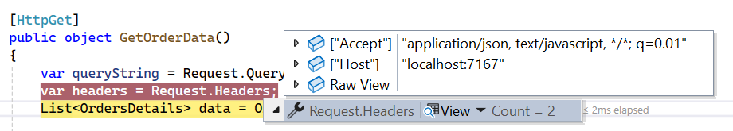
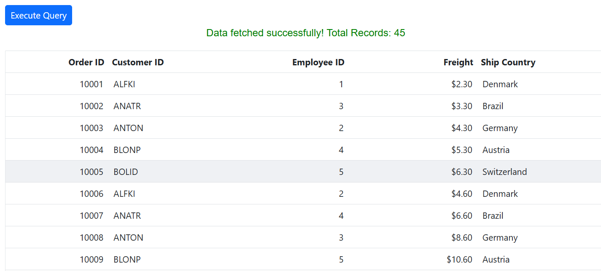

# Remote Data in Blazor DataGrid

The Syncfusion<sup style="font-size:70%">&reg;</sup> Blazor DataGrid supports remote data binding for seamless interaction with external services such as **OData**, **Web API**, **RESTful endpoints**, or **GraphQL**. Remote data binding is configured using [SfDataManager](https://help.syncfusion.com/cr/blazor/Syncfusion.Blazor.Data.SfDataManager.html) by specifying the service endpoint and adaptor type.

To configure remote data binding:

1. Configure `SfDataManager` with the service endpoint using the [Url](https://help.syncfusion.com/cr/blazor/Syncfusion.Blazor.DataManager.html#Syncfusion_Blazor_DataManager_Url) property.
2. Select an adaptor through the [Adaptor](https://help.syncfusion.com/cr/blazor/Syncfusion.Blazor.DataManager.html#Syncfusion_Blazor_DataManager_Adaptor)  property (e.g., **ODataV4Adaptor**, **ODataAdaptor**, **WebApiAdaptor**, **UrlAdaptor**).
3. Define the grid’s `TValue` type to match the data model.
4. Place `SfDataManager` inside the grid markup.

```cs

@using Syncfusion.Blazor.Grids
@using Syncfusion.Blazor.Data

<SfGrid TValue="Order" AllowPaging="true">
    <SfDataManager Url="https://services.odata.org/V4/Northwind/Northwind.svc/Orders" Adaptor="Adaptors.ODataV4Adaptor">
    </SfDataManager>

    <GridColumns>
        <GridColumn Field="@nameof(Order.OrderID)" HeaderText="Order ID" IsPrimaryKey="true" Width="120" TextAlign="TextAlign.Right" />
        <GridColumn Field="@nameof(Order.CustomerID)" HeaderText="Customer Name" Width="150" />
        <GridColumn Field="@nameof(Order.Freight)" HeaderText="Freight" Format="C2" Width="120" TextAlign="TextAlign.Right" />
        <GridColumn Field="@nameof(Order.ShipCountry)" HeaderText="Ship Country" Width="150" />
    </GridColumns>
</SfGrid>

@code {
    public class Order
    {
        public int? OrderID { get; set; }
        public string CustomerID { get; set; }
        public double? Freight { get; set; }
        public string ShipCountry { get; set; }
    }
}

```

> If no `adaptor` is specified, `SfDataManager` uses [ODataAdaptor](https://blazor.syncfusion.com/documentation/data/adaptors#odata-adaptor) by default. Ensure that the `TValue` type matches the data model for proper binding.

## Binding with OData services

[OData](https://www.odata.org/documentation/) (Open Data Protocol) is a standardized protocol that simplifies data sharing across different systems by enabling querying and updating data through RESTful APIs. The Syncfusion<sup style="font-size:70%">&reg;</sup> Blazor DataGrid provides built-in support for **OData v3** and **v4** services using [DataManager](https://help.syncfusion.com/cr/blazor/Syncfusion.Blazor.Data.SfDataManager.html).

The `DataManager` communicates with the remote OData service using either [ODataAdaptor](https://blazor.syncfusion.com/documentation/data/adaptors#odata-adaptor) or [ODataV4Adaptor](https://blazor.syncfusion.com/documentation/datagrid/connecting-to-adaptors/odatav4-adaptor), depending on the protocol version.

* Use `ODataAdaptor` for **OData v3** services.
* Use `ODataV4Adaptor` for **OData v4** services.
* Ensure the response format of the OData service matches the grid’s data model.




@using Syncfusion.Blazor
@using Syncfusion.Blazor.Data
@using Syncfusion.Blazor.Grids

<SfGrid TValue="Order" AllowPaging="true">
        <SfDataManager Url="https://services.odata.org/Northwind/Northwind.svc/Orders" Adaptor="Adaptors.ODataAdaptor"></SfDataManager>
        <GridColumns>
                <GridColumn Field=@nameof(Order.OrderID) HeaderText="Order ID" IsPrimaryKey="true" TextAlign="TextAlign.Right" Width="120"></GridColumn>
                <GridColumn Field=@nameof(Order.CustomerID) HeaderText="Customer Name" Width="150"></GridColumn>
                <GridColumn Field=@nameof(Order.OrderDate) HeaderText="Order Date" Format="d" Type="ColumnType.Date" TextAlign="TextAlign.Right" Width="130"></GridColumn>
                <GridColumn Field=@nameof(Order.Freight) HeaderText="Freight" Format="C2" TextAlign="TextAlign.Right" Width="120"></GridColumn>
                <GridColumn Field=@nameof(Order.ShipCountry) HeaderText="Ship Country" Width="150"></GridColumn>
        </GridColumns>
</SfGrid>

@code{
        public class Order {
                public int? OrderID { get; set; }
                public string CustomerID { get; set; }
                public DateTime? OrderDate { get; set; }
                public double? Freight { get; set; }
                public string ShipCountry { get; set; }
        }
}




## Enable SfDataManager after initial rendering

The Syncfusion<sup style="font-size:70%">&reg;</sup> Blazor DataGrid can defer remote loading by rendering the grid with an empty data source initially and adding [SfDataManager](https://help.syncfusion.com/cr/blazor/Syncfusion.Blazor.Data.SfDataManager.html) only after a condition is met. When `SfDataManager` is rendered, the grid automatically requests data from the configured remote endpoint using the specified adaptor.

To implement this behavior:

1. Render the grid with an empty data source during initial load.
2. Use a flag to control whether `SfDataManager` is rendered.
3. Adding `SfDataManager` after the initial render triggers remote data retrieval.




@using Syncfusion.Blazor
@using Syncfusion.Blazor.Buttons
@using Syncfusion.Blazor.Data
@using Syncfusion.Blazor.Grids

<SfButton OnClick="Enable" CssClass="e-primary" IsPrimary="true" Content="Enable data manager"></SfButton>
<SfGrid TValue="Order" AllowPaging="true">
        <GridPageSettings PageSize="10"></GridPageSettings>
        @if (IsDataManagerEnabled)
        {
                <SfDataManager Url="https://blazor.syncfusion.com/services/production/api/Orders/" Adaptor="Adaptors.WebApiAdaptor"></SfDataManager>
        }
        <GridColumns>
                <GridColumn Field=@nameof(Order.OrderID) HeaderText="Order ID" IsPrimaryKey="true" TextAlign="TextAlign.Right" Width="120"></GridColumn>
                <GridColumn Field=@nameof(Order.CustomerID) HeaderText="Customer Name" Width="150"></GridColumn>
                <GridColumn Field=@nameof(Order.OrderDate) HeaderText="Order Date" Format="d" Type="ColumnType.Date" TextAlign="TextAlign.Right" Width="130"></GridColumn>
                <GridColumn Field=@nameof(Order.Freight) HeaderText="Freight" Format="C2" TextAlign="TextAlign.Right" Width="120"></GridColumn>
        </GridColumns>
</SfGrid>

@code{
        public bool IsDataManagerEnabled = false;

        public class Order
        {
                public int? OrderID { get; set; }
                public string CustomerID { get; set; }
                public DateTime? OrderDate { get; set; }
                public double? Freight { get; set; }
        }

        public void Enable()
        {
                // Enabling condition to render the data manager.
                this.IsDataManagerEnabled = true;
        }
}





## Configuring HttpClient

The [SfDataManager](https://help.syncfusion.com/cr/blazor/Syncfusion.Blazor.DataManager.html) uses an [HttpClient](https://learn.microsoft.com/en-us/dotnet/api/system.net.http.httpclient?view=net-10.0) instance to perform HTTP requests to remote services. During initialization, `SfDataManager` checks for a registered `HttpClient` in the dependency injection container. If available, it uses the registered instance; otherwise, it creates and registers its own.

**Key Configuration Steps**

1. Register a custom `HttpClient` before calling `AddSyncfusionBlazor()` in **Program.cs**. This ensures `SfDataManager` uses the preconfigured instance with **base address**, **authentication**, and **default headers**.
2. Pass a specific `HttpClient` instance directly to `SfDataManager` using the [HttpClientInstance](https://help.syncfusion.com/cr/blazor/Syncfusion.Blazor.DataManager.html#Syncfusion_Blazor_DataManager_HttpClientInstance) property when multiple named or preconfigured clients are required.
3. Use a custom [HTTP message handler](https://learn.microsoft.com/en-us/aspnet/web-api/overview/advanced/httpclient-message-handlers) for advanced scenarios such as logging or request modification.
For details on registering a custom handler, see the [Microsoft ASP.NET Core documentation](https://learn.microsoft.com/en-us/aspnet/core/fundamentals/http-requests?view=aspnetcore-10.0).

> [Typed clients](https://learn.microsoft.com/en-us/aspnet/core/fundamentals/http-requests?view=aspnetcore-10.0#typed-clients) are not supported with `SfDataManager`. For similar functionality, use [custom binding](https://blazor.syncfusion.com/documentation/datagrid/connecting-to-adaptors/custom-adaptor).

## Authorization and Authentication

* **Authentication** is the process of verifying the identity of a client or application.

* **Authorization** determines what actions or resources the authenticated entity is allowed to access.

This section describes how to configure [SfDataManager](https://help.syncfusion.com/cr/blazor/Syncfusion.Blazor.Data.SfDataManager.html) to authenticate requests and authorize access to protected remote services. **Authentication** is typically achieved by including a **bearer (access) token** in HTTP requests.

**Ways to Configure Authentication**

* **Using a pre-configured HttpClient:** 

    Register an `HttpClient` instance with the access token or an authentication message handler before calling `AddSyncfusionBlazor()` in **Program.cs**. This ensures that `SfDataManager` uses the configured HttpClient instead of creating its own, enabling secure access to protected services.

* **Setting the access token in the default headers:** 

    Inject the configured `HttpClient` and set the access token in the default request headers:

    ```csharp
    @inject HttpClient _httpClient

    @code {
            protected override async Task OnInitializedAsync()
            {
                    _httpClient.DefaultRequestHeaders.Add("Authorization", $"Bearer {tokenValue}");
                    await base.OnInitializedAsync();
            }
    }
        ```

- **Using the Headers property of SfDataManager:** 

    Set the access token directly in the [Headers](https://help.syncfusion.com/cr/blazor/Syncfusion.Blazor.DataManager.html#Syncfusion_Blazor_DataManager_Headers) property of `SfDataManager`. For more details, see [Setting Custom Headers](#setting-custom-headers).

> For more information about configuring authentication in Blazor, see [Microsoft ASP.NET Core](https://learn.microsoft.com/en-us/aspnet/core/blazor/security/webassembly/additional-scenarios?view=aspnetcore-9.0) documentation.

## Setting custom headers

Custom HTTP headers can be added to requests made by [SfDataManager](https://help.syncfusion.com/cr/blazor/Syncfusion.Blazor.Data.SfDataManager.html) when interacting with remote services. This is useful for scenarios requiring **authentication tokens**, **API keys**, or **additional metadata** for secure communication

To achieve this, configure the [Headers](https://help.syncfusion.com/cr/blazor/Syncfusion.Blazor.DataManager.html#Syncfusion_Blazor_DataManager_Headers) property of `SfDataManager`. The `Headers` property accepts a dictionary of key-value pairs, where each key represents the **header name** and the value represents the **header value**.




@using Syncfusion.Blazor
@using Syncfusion.Blazor.Data
@using Syncfusion.Blazor.Grids

<SfGrid TValue="Order" AllowPaging="true">
        <GridPageSettings PageSize="10"></GridPageSettings>
        @* Replace xxxx with your actual port number *@
        <SfDataManager Headers=@HeaderData Url="https://localhost:xxxx/api/Grid" Adaptor="Adaptors.WebApiAdaptor"></SfDataManager>
        <GridColumns>
                <GridColumn Field=@nameof(Order.OrderID) HeaderText="Order ID" IsPrimaryKey="true" TextAlign="TextAlign.Right" Width="120"></GridColumn>
                <GridColumn Field=@nameof(Order.CustomerID) HeaderText="Customer Name" Width="150"></GridColumn>
                <GridColumn Field=@nameof(Order.OrderDate) HeaderText="Order Date" Format="d" Type="ColumnType.Date" TextAlign="TextAlign.Right" Width="130"></GridColumn>
                <GridColumn Field=@nameof(Order.Freight) HeaderText="Freight" Format="C2" TextAlign="TextAlign.Right" Width="120"></GridColumn>
        </GridColumns>
</SfGrid>

@code{
        private IDictionary<string, string> HeaderData = new Dictionary<string, string>();

        public class Order
        {
                public int? OrderID { get; set; }
                public string CustomerID { get; set; }
                public DateTime? OrderDate { get; set; }
                public double? Freight { get; set; }
        }
}






## Dynamically change query parameter values

The [Query](https://help.syncfusion.com/cr/blazor/Syncfusion.Blazor.Data.Query.html) property of the Syncfusion<sup style="font-size:70%">&reg;</sup> Blazor DataGrid allows dynamic modification of data requests sent to remote services. This property can be updated at runtime to filter, sort, or customize the data retrieved from the server. Changing the query dynamically is useful for scenarios where data needs to be refreshed based on application events.

The example demonstrates modifying the query parameter dynamically. Initially, the grid displays orders where **CustomerID** equals **VINET**. When the **Modify Query Data** button is clicked, the grid updates to show orders where **CustomerID** equals **HANAR**.

```cs
@using Syncfusion.Blazor
@using Syncfusion.Blazor.Buttons
@using Syncfusion.Blazor.Data
@using Syncfusion.Blazor.Grids

<SfButton Content="Modify Query Data" OnClick="BtnClick"></SfButton>
<SfGrid TValue="Order" @ref="GridObj" AllowPaging="true" Query="@QueryData">
    <GridPageSettings PageSize="10"></GridPageSettings>
    <SfDataManager Url="https://services.odata.org/V4/Northwind/Northwind.svc/Orders" Adaptor="Adaptors.ODataV4Adaptor"></SfDataManager>
    <GridColumns>
        <GridColumn Field=@nameof(Order.OrderID) HeaderText="Order ID" IsPrimaryKey="true" TextAlign="TextAlign.Right" Width="120"></GridColumn>
        <GridColumn Field=@nameof(Order.CustomerID) HeaderText="Customer Name" Width="150"></GridColumn>
        <GridColumn Field=@nameof(Order.Freight) HeaderText="Freight" Format="C2" TextAlign="TextAlign.Right" Width="120"></GridColumn>
    </GridColumns>
</SfGrid>

@code {
    public SfGrid<Order> GridObj;
    private Query QueryData = new Query().Where("CustomerID", "equal", "VINET");
    private Query UpdatedQueryData = new Query().Where("CustomerID", "equal", "HANAR");

    public class Order
    {
        public int? OrderID { get; set; }
        public string CustomerID { get; set; }
        public double? Freight { get; set; }
    }

    public void BtnClick()
    {
        QueryData = UpdatedQueryData;
    }
}
```


## Offline mode

When remote data binding is enabled, all grid actions such as **paging**, **sorting**, **editing**, **grouping**, and **filtering** are processed on the server. To avoid a network request for every action, the grid can load all data during initialization and perform subsequent operations on the client side. 

This behavior is enabled by setting the [Offline](https://help.syncfusion.com/cr/blazor/Syncfusion.Blazor.DataManager.html#Syncfusion_Blazor_DataManager_Offline) property of [DataManager](https://help.syncfusion.com/cr/blazor/Syncfusion.Blazor.Data.SfDataManager.html) to **true**.




@using Syncfusion.Blazor.Grids
@using Syncfusion.Blazor.Data
@using Syncfusion.Blazor
 
<SfGrid TValue="OrdersDetails" Height="348">
    <SfDataManager Url="https://localhost:xxxx/api/Grid" Adaptor="Adaptors.WebApiAdaptor" Offline="true"></SfDataManager>
    <GridColumns>
        <GridColumn Field="OrderID" HeaderText="Order ID" Width="120" TextAlign="TextAlign.Right"></GridColumn>
        <GridColumn Field="CustomerID" HeaderText="Customer Name" Width="160"></GridColumn>
        <GridColumn Field="ShipCity" HeaderText="Ship City" Width="150"></GridColumn>
        <GridColumn Field="ShipCountry" HeaderText="Ship Country" Width="150"></GridColumn>
    </GridColumns>
</SfGrid>
 

 

 
using Microsoft.AspNetCore.Mvc;
using Syncfusion.Blazor.Data;
using Syncfusion.Blazor;
using WebApiAdaptor.Models;

namespace WebApiAdaptor.Controllers
{
    [ApiController]
    public class GridController : ControllerBase
    {
        /// <summary>
        /// Retrieves order data.
        /// </summary>
        /// <returns>Returns a JSON object with the list of orders and the total count.</returns>
        [HttpGet]
        [Route("api/[controller]")]
        public object GetOrderData()
        {
            // Retrieve all order records.
            List<OrdersDetails> data = OrdersDetails.GetAllRecords().ToList();

            // Return the data and total count.
            return new { Items = data, Count = data.Count() };
        }
    }
}
 



> Replace **https://localhost:xxxx/api/Grid** with the actual URL of the API endpoint that provides data in a consumable format (such as JSON).

A complete sample is available on [Github](https://github.com/SyncfusionExamples/databinding-in-blazor-datagrid/tree/master/Offline-Mode).

## Fetch result from the DataManager query using external button

The Syncfusion<sup style="font-size:70%">&reg;</sup> Blazor DataGrid can be populated with data fetched on demand from a remote endpoint. An external button can trigger an HTTP request and assign the returned collection to the grid’s [DataSource](https://help.syncfusion.com/cr/blazor/Syncfusion.Blazor.Grids.SfGrid-1.html#Syncfusion_Blazor_Grids_SfGrid_1_DataSource) property. This approach provides control over when data is loaded and is suitable for scenarios where data retrieval should be deferred until a specific event occurs.




@page "/"
@using Syncfusion.Blazor.Grids
@using Syncfusion.Blazor.Buttons
@using Syncfusion.Blazor
@using WebApiAdaptor.Models
@using System.Net.Http.Json
@inject HttpClient Http

<SfButton OnClick="ExecuteQuery" CssClass="e-primary">Execute Query</SfButton>

<p style="@StatusStyle">@StatusMessage</p>

<SfGrid TValue="OrdersDetails" DataSource="@Orders" AllowPaging="true">
    <GridColumns>
        <GridColumn Field="OrderID" HeaderText="Order ID" Width="120" TextAlign="TextAlign.Right" />
        <GridColumn Field="CustomerID" HeaderText="Customer ID" Width="160" />
        <GridColumn Field="EmployeeID" HeaderText="Employee ID" Width="120" TextAlign="TextAlign.Right" />
        <GridColumn Field="Freight" HeaderText="Freight" Width="150" Format="C2" TextAlign="TextAlign.Right" />
        <GridColumn Field="ShipCountry" HeaderText="Ship Country" Width="150" />
    </GridColumns>
</SfGrid>

@code {
    public string StatusMessage { get; set; } = "";
    public string StatusStyle { get; set; } = "color:black;";
    public List<OrdersDetails> Orders { get; set; } = new();

    private async Task ExecuteQuery()
    {
        try
        {
            StatusMessage = "Fetching data...";
            StatusStyle = "color:blue;";

            var response = await Http.GetFromJsonAsync<GridResponse<OrdersDetails>>("https://localhost:7167/api/Grid");

            if (response != null)
            {
                Orders = response.Items;
                StatusMessage = $"Data fetched successfully! Total Records: {response.Count}";
                StatusStyle = "color:green; text-align:center;";
            }
            else
            {
                StatusMessage = "No data returned from server.";
                StatusStyle = "color:orange;text-align:center;";
            }
        }
        catch (Exception ex)
        {
            StatusMessage = $"Error fetching data: {ex.Message}";
            StatusStyle = "color:red;text-align:center;";
        }
    }

    public class GridResponse<T>
    {
        public List<T> Items { get; set; }
        public int Count { get; set; }
    }
}






A complete sample is available on [GitHub](https://github.com/SyncfusionExamples/databinding-in-blazor-datagrid/tree/master/Fetch-result-from-the-DataManager-query).
