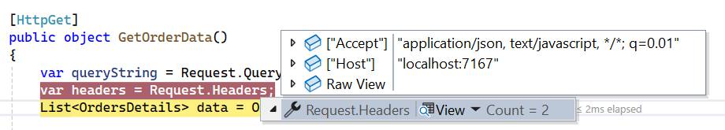

# Remote Data in Blazor DataGrid

Remote data binding in the Blazor DataGrid enables you to connect to external services such as OData, Web APIs, or RESTful endpoints to efficiently retrieve and manage data. This approach is especially useful when working with large datasets or when your data resides on a server.

To enable remote data binding, configure the [DataSource](https://help.syncfusion.com/cr/blazor/Syncfusion.Blazor.Grids.SfGrid-1.html#Syncfusion_Blazor_Grids_SfGrid_1_DataSource) property of the `SfGrid` using the [SfDataManager](https://help.syncfusion.com/cr/blazor/Syncfusion.Blazor.Data.SfDataManager.html), which manages communication between the DataGrid and the remote data service.

You can configure `SfDataManager` in either of the following ways:

- Declare `SfDataManager` as a separate component inside the DataGrid.
- Assign an instance of `SfDataManager` directly to the `DataSource` property.

**Basic configuration**

The following properties must be configured for remote data binding:

- **Url**: The endpoint of your remote data source.
- **Adaptor**: Specifies the type of data service. Supported adaptors include:
    - ODataAdaptor
    - ODataV4Adaptor
    - WebApiAdaptor
    - UrlAdaptor
    - GraphQLAdaptor

> When using `SfDataManager` for remote data binding, you must explicitly define the `TValue` type for the SfGrid component.
> If no adaptor is specified, `SfDataManager` defaults to using the `ODataAdaptor`.

## Binding with OData services

[OData](https://www.odata.org/documentation/odata-version-3-0/) (Open Data Protocol) is a standardized protocol designed to simplify data sharing across disparate systems. It enables querying and updating data via RESTful APIs. The Syncfusion Blazor [SfDataManager](https://help.syncfusion.com/cr/blazor/Syncfusion.Blazor.Data.SfDataManager.html) provides built-in support for consuming OData v3 and v4 services, making it easy to bind remote OData service data to the SfGrid component.

The SfDataManager communicates with the remote OData service using the `ODataAdaptor` or `ODataV4Adaptor`, depending on the OData protocol version.

> Use `ODataAdaptor` for OData v3 services and `ODataV4Adaptor` for OData v4 services.
> Ensure that the response format of the OData service aligns with the expected Grid data model.

The following example demonstrates how to bind an OData service to the DataGrid using `SfDataManager`:




@using Syncfusion.Blazor
@using Syncfusion.Blazor.Data
@using Syncfusion.Blazor.Grids

<SfGrid TValue="Order" AllowPaging="true">
        <SfDataManager Url="https://services.odata.org/Northwind/Northwind.svc/Orders" Adaptor="Adaptors.ODataAdaptor"></SfDataManager>
        <GridColumns>
                <GridColumn Field=@nameof(Order.OrderID) HeaderText="Order ID" IsPrimaryKey="true" TextAlign="TextAlign.Right" Width="120"></GridColumn>
                <GridColumn Field=@nameof(Order.CustomerID) HeaderText="Customer Name" Width="150"></GridColumn>
                <GridColumn Field=@nameof(Order.OrderDate) HeaderText="Order Date" Format="d" Type="ColumnType.Date" TextAlign="TextAlign.Right" Width="130"></GridColumn>
                <GridColumn Field=@nameof(Order.Freight) HeaderText="Freight" Format="C2" TextAlign="TextAlign.Right" Width="120"></GridColumn>
                <GridColumn Field=@nameof(Order.ShipCountry) HeaderText="Ship Country" Width="150"></GridColumn>
        </GridColumns>
</SfGrid>

@code{
        public class Order {
                public int? OrderID { get; set; }
                public string CustomerID { get; set; }
                public DateTime? OrderDate { get; set; }
                public double? Freight { get; set; }
                public string ShipCountry { get; set; }
        }
}




## Enable SfDataManager after initial rendering

You can render the data source in the DataGrid after the initial rendering. This can be achieved by conditionally enabling the [SfDataManager](https://help.syncfusion.com/cr/blazor/Syncfusion.Blazor.Data.SfDataManager.html) component after the DataGrid has been rendered.

The following example demonstrates how to enable the data manager in the DataGrid on a button click:




@using Syncfusion.Blazor
@using Syncfusion.Blazor.Buttons
@using Syncfusion.Blazor.Data
@using Syncfusion.Blazor.Grids

<SfButton OnClick="Enable" CssClass="e-primary" IsPrimary="true" Content="Enable data manager"></SfButton>
<SfGrid TValue="Order" AllowPaging="true">
        <GridPageSettings PageSize="10"></GridPageSettings>
        @if (IsDataManagerEnabled)
        {
                <SfDataManager Url="https://blazor.syncfusion.com/services/production/api/Orders/" Adaptor="Adaptors.WebApiAdaptor"></SfDataManager>
        }
        <GridColumns>
                <GridColumn Field=@nameof(Order.OrderID) HeaderText="Order ID" IsPrimaryKey="true" TextAlign="TextAlign.Right" Width="120"></GridColumn>
                <GridColumn Field=@nameof(Order.CustomerID) HeaderText="Customer Name" Width="150"></GridColumn>
                <GridColumn Field=@nameof(Order.OrderDate) HeaderText="Order Date" Format="d" Type="ColumnType.Date" TextAlign="TextAlign.Right" Width="130"></GridColumn>
                <GridColumn Field=@nameof(Order.Freight) HeaderText="Freight" Format="C2" TextAlign="TextAlign.Right" Width="120"></GridColumn>
        </GridColumns>
</SfGrid>

@code{
        public bool IsDataManagerEnabled = false;

        public class Order
        {
                public int? OrderID { get; set; }
                public string CustomerID { get; set; }
                public DateTime? OrderDate { get; set; }
                public double? Freight { get; set; }
        }

        public void Enable()
        {
                // Enable the data manager rendering.
                this.IsDataManagerEnabled = true;
        }
}




The following GIF demonstrates dynamically rendering the data manager in the DataGrid:


## Sending additional parameters to the server

To add custom parameters to the data request, use the `AddParams` method of the Query class. Assign the Query object with additional parameters to the DataGrid's [Query](https://help.syncfusion.com/cr/blazor/Syncfusion.Blazor.Data.Query.html) property.

The following example demonstrates sending additional parameters using the Query property:




@using Syncfusion.Blazor
@using Syncfusion.Blazor.Data
@using Syncfusion.Blazor.Grids

<SfGrid TValue="Order" AllowPaging="true" Query=@GridQuery>
        <GridPageSettings PageSize="10"></GridPageSettings>
        <SfDataManager Url="https://blazor.syncfusion.com/services/production/api/Orders/" Adaptor="Adaptors.WebApiAdaptor"></SfDataManager>
        <GridColumns>
                <GridColumn Field=@nameof(Order.OrderID) HeaderText="Order ID" IsPrimaryKey="true" TextAlign="TextAlign.Right" Width="120"></GridColumn>
                <GridColumn Field=@nameof(Order.CustomerID) HeaderText="Customer Name" Width="150"></GridColumn>
                <GridColumn Field=@nameof(Order.OrderDate) HeaderText="Order Date" Format="d" Type="ColumnType.Date" TextAlign="TextAlign.Right" Width="130"></GridColumn>
                <GridColumn Field=@nameof(Order.Freight) HeaderText="Freight" Format="C2" TextAlign="TextAlign.Right" Width="120"></GridColumn>
        </GridColumns>
</SfGrid>

@code{
        public string ParamValue = "true";
        public Query GridQuery { get; set; }

        protected override void OnInitialized() {
                GridQuery = new Query().AddParams("ej2grid", ParamValue);
        }

        public class Order
        {
                public int? OrderID { get; set; }
                public string CustomerID { get; set; }
                public DateTime? OrderDate { get; set; }
                public double? Freight { get; set; }
        }
}




## Authorization and Authentication

When accessing remote data services, it is common for the server to require authorization to prevent anonymous access. The **SfDataManager** can consume data from protected remote services by providing the appropriate bearer (access) token. You can provide the access token to **SfDataManager** in the following ways:

- **Using a pre-configured HttpClient:**  
    Register an `HttpClient` instance with the access token or an authentication message handler before calling `AddSyncfusionBlazor()` in your `Program.cs`. This ensures that **SfDataManager** uses the configured `HttpClient` instead of creating its own, allowing it to access protected services.

- **Setting the access token in the default headers:**  
    Inject the configured `HttpClient` into your page and set the access token in the default request headers. For example:

        ```csharp
        @inject HttpClient _httpClient

        @code {
                protected override async Task OnInitializedAsync()
                {
                        _httpClient.DefaultRequestHeaders.Add("Authorization", $"Bearer {tokenValue}");
                        await base.OnInitializedAsync();
                }
        }
        ```

- **Using the Headers property of SfDataManager:**  
    Set the access token directly in the `Headers` property of **SfDataManager**. For more details, see [Setting custom headers](#setting-custom-headers).

The method for obtaining the bearer token depends on your authentication provider. For more information on configuring `HttpClient` with authentication in Blazor, refer to the official documentation [here](https://learn.microsoft.com/aspnet/core/blazor/security/webassembly/additional-scenarios?view=aspnetcore-8.0).

## Setting custom headers

To add custom headers to the data request, use the [Headers](https://help.syncfusion.com/cr/blazor/Syncfusion.Blazor.DataManager.html#Syncfusion_Blazor_DataManager_Headers) property of the [SfDataManager](https://help.syncfusion.com/cr/blazor/Syncfusion.Blazor.Data.SfDataManager.html).

The following example demonstrates adding custom headers to the `SfDataManager` request:




@using Syncfusion.Blazor
@using Syncfusion.Blazor.Data
@using Syncfusion.Blazor.Grids

<SfGrid TValue="Order" AllowPaging="true">
        <GridPageSettings PageSize="10"></GridPageSettings>
        @* Replace xxxx with your actual port number *@
        <SfDataManager Headers=@HeaderData Url="https://localhost:xxxx/api/Grid" Adaptor="Adaptors.WebApiAdaptor"></SfDataManager>
        <GridColumns>
                <GridColumn Field=@nameof(Order.OrderID) HeaderText="Order ID" IsPrimaryKey="true" TextAlign="TextAlign.Right" Width="120"></GridColumn>
                <GridColumn Field=@nameof(Order.CustomerID) HeaderText="Customer Name" Width="150"></GridColumn>
                <GridColumn Field=@nameof(Order.OrderDate) HeaderText="Order Date" Format="d" Type="ColumnType.Date" TextAlign="TextAlign.Right" Width="130"></GridColumn>
                <GridColumn Field=@nameof(Order.Freight) HeaderText="Freight" Format="C2" TextAlign="TextAlign.Right" Width="120"></GridColumn>
        </GridColumns>
</SfGrid>

@code{
        private IDictionary<string, string> HeaderData = new Dictionary<string, string>();

        public class Order
        {
                public int? OrderID { get; set; }
                public string CustomerID { get; set; }
                public DateTime? OrderDate { get; set; }
                public double? Freight { get; set; }
        }
}






## Dynamically change query parameter values

You can dynamically update the DataGrid's [Query](https://help.syncfusion.com/cr/blazor/Syncfusion.Blazor.Data.Query.html) property at runtime to modify the data retrieved from a remote source.

The following example demonstrates how to change the query parameter value in response to a button click:

```razor
@using Syncfusion.Blazor
@using Syncfusion.Blazor.Buttons
@using Syncfusion.Blazor.Data
@using Syncfusion.Blazor.Grids

<SfButton Content="Modify Query Data" OnClick="BtnClick"></SfButton>
<SfGrid TValue="Order" @ref="GridObj" AllowPaging="true" Query="@QueryData">
    <GridPageSettings PageSize="10"></GridPageSettings>
    <SfDataManager Url="https://services.odata.org/V4/Northwind/Northwind.svc/Orders" Adaptor="Adaptors.ODataV4Adaptor"></SfDataManager>
    <GridColumns>
        <GridColumn Field=@nameof(Order.OrderID) HeaderText="Order ID" IsPrimaryKey="true" TextAlign="TextAlign.Right" Width="120"></GridColumn>
        <GridColumn Field=@nameof(Order.CustomerID) HeaderText="Customer Name" Width="150"></GridColumn>
        <GridColumn Field=@nameof(Order.Freight) HeaderText="Freight" Format="C2" TextAlign="TextAlign.Right" Width="120"></GridColumn>
    </GridColumns>
</SfGrid>

@code {
    public SfGrid<Order> GridObj;
    private Query QueryData = new Query().Where("CustomerID", "equal", "VINET");
    private Query UpdatedQueryData = new Query().Where("CustomerID", "equal", "HANAR");

    public class Order
    {
        public int? OrderID { get; set; }
        public string CustomerID { get; set; }
        public double? Freight { get; set; }
    }

    public void BtnClick()
    {
        QueryData = UpdatedQueryData;
    }
}
```

The following GIF illustrates how the DataGrid updates its data when the query parameter is changed dynamically:


## Offline mode

On remote data binding, all Grid actions such as paging, sorting, editing, grouping, filtering, etc, will be processed on server-side. To avoid post back for every action, set the grid to load all data on initialization and make the actions process in client-side. To enable this behavior, use the `Offline` property of DataManager.




@using Syncfusion.Blazor.Grids
@using Syncfusion.Blazor.Data
@using Syncfusion.Blazor
 
<SfGrid TValue="OrdersDetails" Height="348">
    <SfDataManager Url="https://localhost:xxxx/api/Grid" Adaptor="Adaptors.WebApiAdaptor" Offline="true"></SfDataManager>
    <GridColumns>
        <GridColumn Field="OrderID" HeaderText="Order ID" Width="120" TextAlign="TextAlign.Right"></GridColumn>
        <GridColumn Field="CustomerID" HeaderText="Customer Name" Width="160"></GridColumn>
        <GridColumn Field="ShipCity" HeaderText="Ship City" Width="150"></GridColumn>
        <GridColumn Field="ShipCountry" HeaderText="Ship Country" Width="150"></GridColumn>
    </GridColumns>
</SfGrid>
 

 

 
using Microsoft.AspNetCore.Mvc;
using Syncfusion.Blazor.Data;
using Syncfusion.Blazor;
using WebApiAdaptor.Models;

namespace WebApiAdaptor.Controllers
{
    [ApiController]
    public class GridController : ControllerBase
    {
        /// <summary>
        /// Retrieves order data.
        /// </summary>
        /// <returns>Returns a JSON object with the list of orders and the total count.</returns>
        [HttpGet]
        [Route("api/[controller]")]
        public object GetOrderData()
        {
            // Retrieve all order records.
            List<OrdersDetails> data = OrdersDetails.GetAllRecords().ToList();

            // Return the data and total count.
            return new { Items = data, Count = data.Count() };
        }
    }
}
 


 
> Replace https://localhost:xxxx/api/Grid with the actual URL of your API endpoint that provides the data in a consumable format (e.g., JSON).

## Fetch result from the DataManager query using external button

By default, Syncfusion Blazor DataGrid binds to a remote data source using the DataManager. However, you may want to fetch data dynamically from the server in response to an external button click, giving you more control over when and how data is loaded into the Grid.

To achieve this, you can use an external button to trigger an HTTP request, fetch the data, and then assign it to the DataGrid's `DataSource` property.

The following example demonstrates how to fetch data from the server when a button is clicked and display a status message indicating the fetch status:




@page "/"
@using Syncfusion.Blazor.Grids
@using Syncfusion.Blazor.Buttons
@using Syncfusion.Blazor
@using WebApiAdaptor.Models
@using System.Net.Http.Json
@inject HttpClient Http

<SfButton OnClick="ExecuteQuery" CssClass="e-primary">Execute Query</SfButton>

<p style="@StatusStyle">@StatusMessage</p>

<SfGrid TValue="OrdersDetails" DataSource="@Orders" AllowPaging="true">
    <GridColumns>
        <GridColumn Field="OrderID" HeaderText="Order ID" Width="120" TextAlign="TextAlign.Right" />
        <GridColumn Field="CustomerID" HeaderText="Customer ID" Width="160" />
        <GridColumn Field="EmployeeID" HeaderText="Employee ID" Width="120" TextAlign="TextAlign.Right" />
        <GridColumn Field="Freight" HeaderText="Freight" Width="150" Format="C2" TextAlign="TextAlign.Right" />
        <GridColumn Field="ShipCountry" HeaderText="Ship Country" Width="150" />
    </GridColumns>
</SfGrid>

@code {
    public string StatusMessage { get; set; } = "";
    public string StatusStyle { get; set; } = "color:black;";
    public List<OrdersDetails> Orders { get; set; } = new();

    private async Task ExecuteQuery()
    {
        try
        {
            StatusMessage = "Fetching data...";
            StatusStyle = "color:blue;";

            var response = await Http.GetFromJsonAsync<GridResponse<OrdersDetails>>("https://localhost:7167/api/Grid");

            if (response != null)
            {
                Orders = response.Items;
                StatusMessage = $"Data fetched successfully! Total Records: {response.Count}";
                StatusStyle = "color:green; text-align:center;";
            }
            else
            {
                StatusMessage = "No data returned from server.";
                StatusStyle = "color:orange;text-align:center;";
            }
        }
        catch (Exception ex)
        {
            StatusMessage = $"Error fetching data: {ex.Message}";
            StatusStyle = "color:red;text-align:center;";
        }
    }

    public class GridResponse<T>
    {
        public List<T> Items { get; set; }
        public int Count { get; set; }
    }
}




