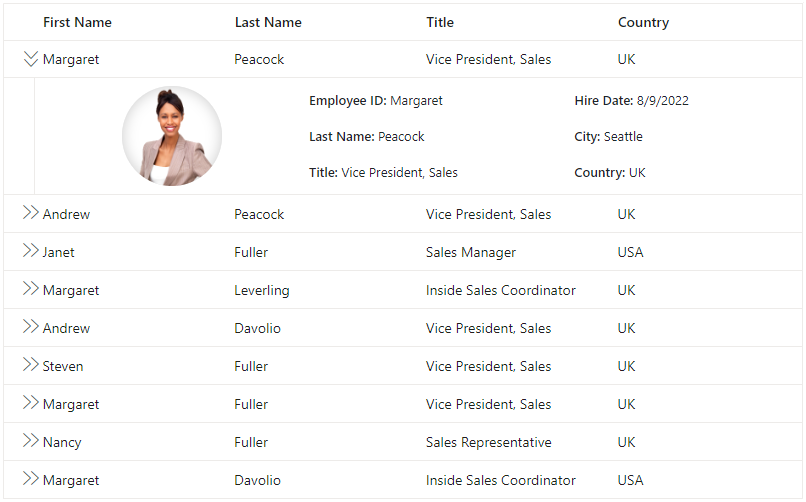

# Detail Template in Blazor DataGrid Component

The Detail Template feature in the Syncfusion Blazor DataGrid component allows you to display expanded or collapsible sections for each row to show additional, context-specific information. This is particularly useful for scenarios where rows contain nested or supplementary data that would otherwise clutter the main grid view. You can use the DetailTemplate property to define an HTML template for the detail row, which can include any HTML element, Syncfusion component, or custom Blazor component.

To integrate the Detail Template in the Blazor DataGrid component:

1. Add the <DetailTemplate> element within the <GridTemplates> component to specify the content of the detail row.
2. Use any HTML structure or additional Blazor components within the DetailTemplate to define custom content for each expanded row.
3. Optionally, bind data to the template to display information that corresponds to the specific row being expanded.

N> Before adding detail template to the datagrid, it is recommended to go through the [template](./templates/#templates) section topic to configure the template.

To know about **Detail Template** in Blazor DataGrid Component, you can check this video.



Here's an example to demonstrate use of DetailTemplate to display extra details for each row:



@page "/"

@using Syncfusion.Blazor.Grids
@using BlazorApp1.Data

<SfGrid @ref="Grid" DataSource="@Employees">
<GridTemplates>
<DetailTemplate>
@{
var employee = (context as EmployeeData);

<table class="detailtable" width="100%">
<colgroup>
<col width="35%">
<col width="35%">
<col width="30%">
</colgroup>
<tbody>
<tr>
<td rowspan="4" style="text-align: center;">

</td>
<td>
<span style="font-weight: 500;">Employee ID: </span> @employee.FirstName
</td>
<td>
<span style="font-weight: 500;">Hire Date: </span> @employee.HireDate.ToShortDateString()
</td>
</tr>
<tr>
<td>
<span style="font-weight: 500;">Last Name: </span> @employee.LastName
</td>
<td>
<span style="font-weight: 500;">City: </span> @employee.City
</td>
</tr>
<tr>
<td>
<span style="font-weight: 500;">Title: </span> @employee.Title
</td>
<td>
<span style="font-weight: 500;">Country: </span> @employee.Country
</td>
</tr>
</tbody>
</table>
}
</DetailTemplate>
</GridTemplates>
<GridColumns>
<GridColumn Field=@nameof(EmployeeData.FirstName) HeaderText="First Name" Width="110"> </GridColumn>
<GridColumn Field=@nameof(EmployeeData.LastName) HeaderText="Last Name" Width="110"></GridColumn>
<GridColumn Field=@nameof(EmployeeData.Title) HeaderText="Title" Width="110"></GridColumn>
<GridColumn Field=@nameof(EmployeeData.Country) HeaderText="Country" Width="110"></GridColumn>
</GridColumns>
</SfGrid>

<style type="text/css" class="cssStyles">
    .detailtable td {
        font-size: 13px;
        padding: 4px;
        max-width: 0;
        overflow: hidden;
        text-overflow: ellipsis;
        white-space: nowrap;
    }

    .photo {
        width: 100px;
        height: 100px;
        border-radius: 50px;
        box-shadow: inset 0 0 1px #e0e0e0, inset 0 0 14px rgba(0,0,0,0.2);
    }
</style>

@code {
private SfGrid<EmployeeData> Grid;
public List<EmployeeData> Employees { get; set; }

    protected override void OnInitialized()
    {
        Employees = EmployeeData.GetAllRecords();
    }

}


namespace BlazorApp1.Data
{
public class EmployeeData
{
public static List<EmployeeData> Employees = new List<EmployeeData>();

        public EmployeeData() { }

        public EmployeeData(int EmployeeID, string FirstName, string LastName, string Title, string Country, string City, DateTime HireDate)
        {
            this.EmployeeID = EmployeeID;
            this.FirstName = FirstName;
            this.LastName = LastName;
            this.Title = Title;
            this.Country = Country;
            this.City = City;
            this.HireDate = HireDate;
        }

        public static List<EmployeeData> GetAllRecords()
        {
            if (Employees.Count == 0)
            {
                var firstNames = new string[] { "Nancy", "Andrew", "Janet", "Margaret", "Steven" };
                var lastNames = new string[] { "Davolio", "Fuller", "Leverling", "Peacock", "Buchanan" };
                var titles = new string[] { "Sales Representative", "Vice President, Sales", "Sales Manager", "Inside Sales Coordinator" };
                var countries = new string[] { "USA", "UK", "UAE", "NED", "BER" };
                var cities = new string[] { "New York", "London", "Dubai", "Amsterdam", "Berlin" };

                Random random = new Random();
                for (int i = 1; i <= 5; i++)
                {
                    Employees.Add(new EmployeeData(
                        i,
                        firstNames[random.Next(firstNames.Length)],
                        lastNames[random.Next(lastNames.Length)],
                        titles[random.Next(titles.Length)],
                        countries[random.Next(countries.Length)],
                        cities[random.Next(cities.Length)],
                        DateTime.Now.AddDays(-random.Next(1000, 5000)) // Random hire date between 3-14 years ago
                    ));
                }
            }
            return Employees;
        }

        public int EmployeeID { get; set; }
        public string? FirstName { get; set; }
        public string? LastName { get; set; }
        public string? Title { get; set; }
        public string? Country { get; set; }
        public string? City { get; set; } // New City property
        public DateTime HireDate { get; set; }
    }

}





## Rendering custom component

The Grid component provides a powerful feature that allows you to render custom components inside the detail row. This feature is helpful when you need to add additional information or functionality for a specific row in the grid.

To render the custom component inside the detail row, define the template in the [DetailTemplate](./templates/#detailtemplates-component) and render the custom component in any of the detail row element.

In the following sample, a datagrid component is rendered as custom component using detailed row details.



@page "/"

@using Syncfusion.Blazor.Grids
@using Syncfusion.Blazor.Data
@using BlazorApp1.Data

<SfGrid @ref="Grid" DataSource="@Employees">
<GridTemplates>
<DetailTemplate>
@{
var order = (context as OrderData);
var employee = (context as EmployeeData);

                <SfGrid DataSource="@Orders" Query="@(new Query().Where("EmployeeID", "equal", employee.EmployeeID))">
                    <GridColumns>
                        <GridColumn Field=@nameof(OrderData.OrderID) HeaderText="OrderID" Width="110"> </GridColumn>
                        <GridColumn Field=@nameof(OrderData.CustomerID) HeaderText="Customer Name" Width="110"></GridColumn>
                        <GridColumn Field=@nameof(OrderData.ShipCountry) HeaderText="ShipCountry" Width="110"></GridColumn>
                    </GridColumns>
                </SfGrid>
            }
        </DetailTemplate>
    </GridTemplates>
    <GridColumns>
        <GridColumn Field=@nameof(EmployeeData.FirstName) HeaderText="First Name" Width="110"> </GridColumn>
        <GridColumn Field=@nameof(EmployeeData.LastName) HeaderText="Last Name" Width="110"></GridColumn>
        <GridColumn Field=@nameof(EmployeeData.Title) HeaderText="Title" Width="110"></GridColumn>
        <GridColumn Field=@nameof(EmployeeData.Country) HeaderText="Country" Width="110"></GridColumn>
    </GridColumns>

</SfGrid>

<style type="text/css" class="cssStyles">
    .detailtable td {
        font-size: 13px;
        padding: 4px;
        max-width: 0;
        overflow: hidden;
        text-overflow: ellipsis;
        white-space: nowrap;
    }

    .photo {
        width: 100px;
        height: 100px;
        border-radius: 50px;
        box-shadow: inset 0 0 1px #e0e0e0, inset 0 0 14px rgba(0,0,0,0.2);
    }
</style>

@code {
private SfGrid<EmployeeData> Grid;
public List<EmployeeData> Employees { get; set; }
public List<OrderData> Orders { get; set; }

    protected override void OnInitialized()
    {
        Employees = EmployeeData.GetAllRecords();
        Orders = OrderData.GetAllRecords();

    }

}



namespace BlazorApp1.Data
{
public class OrderData
{
public static List<OrderData> Orders = new List<OrderData>();

        public OrderData() { }

        public OrderData(int? OrderID, string CustomerID, string ShipName, double Freight, DateTime? OrderDate, DateTime? ShippedDate, bool? IsVerified, string ShipCity, string ShipCountry, int employeeID)
        {
            this.OrderID = OrderID;
            this.CustomerID = CustomerID;
            this.ShipName = ShipName;
            this.Freight = Freight;
            this.OrderDate = OrderDate;
            this.ShippedDate = ShippedDate;
            this.IsVerified = IsVerified;
            this.ShipCity = ShipCity;
            this.ShipCountry = ShipCountry;
            this.EmployeeID = employeeID;
        }

        public static List<OrderData> GetAllRecords()
        {
            if (Orders.Count == 0)
            {
                Orders.Add(new OrderData(10248, "VINET", "Vins et alcools Chevalier", 32.38, new DateTime(1996, 7, 4), new DateTime(1996, 08, 07), true, "Reims", "France", 1));
                Orders.Add(new OrderData(10249, "TOMSP", "Toms Spezialitäten", 11.61, new DateTime(1996, 7, 5), new DateTime(1996, 08, 07), false, "Münster", "Germany", 2));
                Orders.Add(new OrderData(10250, "HANAR", "Hanari Carnes", 65.83, new DateTime(1996, 7, 6), new DateTime(1996, 08, 07), true, "Rio de Janeiro", "Brazil", 3));
                Orders.Add(new OrderData(10251, "VINET", "Vins et alcools Chevalier", 41.34, new DateTime(1996, 7, 7), new DateTime(1996, 08, 07), false, "Lyon", "France", 1));
                Orders.Add(new OrderData(10252, "SUPRD", "Suprêmes délices", 151.30, new DateTime(1996, 7, 8), new DateTime(1996, 08, 07), true, "Charleroi", "Belgium", 2));
                Orders.Add(new OrderData(10253, "HANAR", "Hanari Carnes", 58.17, new DateTime(1996, 7, 9), new DateTime(1996, 08, 07), false, "Bern", "Switzerland", 3));
                Orders.Add(new OrderData(10254, "CHOPS", "Chop-suey Chinese", 22.98, new DateTime(1996, 7, 10), new DateTime(1996, 08, 07), true, "Genève", "Switzerland", 2));
                Orders.Add(new OrderData(10255, "VINET", "Vins et alcools Chevalier", 148.33, new DateTime(1996, 7, 11), new DateTime(1996, 08, 07), false, "Resende", "Brazil", 1));
                Orders.Add(new OrderData(10256, "HANAR", "Hanari Carnes", 13.97, new DateTime(1996, 7, 12), new DateTime(1996, 08, 07), true, "Paris", "France", 3));
            }
            return Orders;
        }

        public int? OrderID { get; set; }
        public string CustomerID { get; set; }
        public string ShipName { get; set; }
        public double? Freight { get; set; }
        public DateTime? OrderDate { get; set; }
        public DateTime? ShippedDate { get; set; }
        public bool? IsVerified { get; set; }
        public string ShipCity { get; set; }
        public string ShipCountry { get; set; }
        public int EmployeeID { get; set; }
    }

}



namespace BlazorApp1.Data
{
public class EmployeeData
{
public static List<EmployeeData> Employees = new List<EmployeeData>();

        public EmployeeData() { }

        public EmployeeData(int EmployeeID, string FirstName, string LastName, string Title, string Country, string City, DateTime HireDate)
        {
            this.EmployeeID = EmployeeID;
            this.FirstName = FirstName;
            this.LastName = LastName;
            this.Title = Title;
            this.Country = Country;
            this.City = City;
            this.HireDate = HireDate;
        }

        public static List<EmployeeData> GetAllRecords()
        {
            if (Employees.Count == 0)
            {
                var firstNames = new string[] { "Nancy", "Andrew", "Janet", "Margaret", "Steven" };
                var lastNames = new string[] { "Davolio", "Fuller", "Leverling", "Peacock", "Buchanan" };
                var titles = new string[] { "Sales Representative", "Vice President, Sales", "Sales Manager", "Inside Sales Coordinator" };
                var countries = new string[] { "USA", "UK", "UAE", "NED", "BER" };
                var cities = new string[] { "New York", "London", "Dubai", "Amsterdam", "Berlin" };

                Random random = new Random();
                for (int i = 1; i <= 5; i++)
                {
                    Employees.Add(new EmployeeData(
                        i,
                        firstNames[random.Next(firstNames.Length)],
                        lastNames[random.Next(lastNames.Length)],
                        titles[random.Next(titles.Length)],
                        countries[random.Next(countries.Length)],
                        cities[random.Next(cities.Length)],
                        DateTime.Now.AddDays(-random.Next(1000, 5000))
                    ));
                }
            }
            return Employees;
        }

        public int EmployeeID { get; set; }
        public string? FirstName { get; set; }
        public string? LastName { get; set; }
        public string? Title { get; set; }
        public string? Country { get; set; }
        public string? City { get; set; }
        public DateTime HireDate { get; set; }
    }

}





## Expand by external button

By default, detail rows render in collapsed state. You can expand a detail rows by invoking the `ExpandAllDetailRowAsync` method using the external button.



@page "/"

@using Syncfusion.Blazor.Grids
@using BlazorApp1.Data
@using Syncfusion.Blazor.Buttons

<SfButton style="margin:5px" Content="Expand" OnClick="BtnClick"></SfButton>
<SfGrid @ref="Grid" DataSource="@Employees">
    <GridTemplates>
        <DetailTemplate>
            @{
                var employee = (context as EmployeeData);

                <table class="detailtable" width="100%">
                    <colgroup>
                        <col width="35%">
                        <col width="35%">
                        <col width="30%">
                    </colgroup>
                    <tbody>
                        <tr>
                            <td rowspan="4" style="text-align: center;">
                                
                            </td>
                            <td>
                                <span style="font-weight: 500;">Employee ID: </span> @employee.FirstName
                            </td>
                            <td>
                                <span style="font-weight: 500;">Hire Date: </span> @employee.HireDate.ToShortDateString()
                            </td>
                        </tr>
                        <tr>
                            <td>
                                <span style="font-weight: 500;">Last Name: </span> @employee.LastName
                            </td>
                            <td>
                                <span style="font-weight: 500;">City: </span> @employee.City
                            </td>
                        </tr>
                        <tr>
                            <td>
                                <span style="font-weight: 500;">Title: </span> @employee.Title
                            </td>
                            <td>
                                <span style="font-weight: 500;">Country: </span> @employee.Country
                            </td>
                        </tr>
                    </tbody>
                </table>
            }
        </DetailTemplate>
    </GridTemplates>
    <GridColumns>
        <GridColumn Field=@nameof(EmployeeData.FirstName) HeaderText="First Name" Width="110"> </GridColumn>
        <GridColumn Field=@nameof(EmployeeData.LastName) HeaderText="Last Name" Width="110"></GridColumn>
        <GridColumn Field=@nameof(EmployeeData.Title) HeaderText="Title" Width="110"></GridColumn>
        <GridColumn Field=@nameof(EmployeeData.Country) HeaderText="Country" Width="110"></GridColumn>
    </GridColumns>
</SfGrid>

<style type="text/css" class="cssStyles">
    .detailtable td {
        font-size: 13px;
        padding: 4px;
        max-width: 0;
        overflow: hidden;
        text-overflow: ellipsis;
        white-space: nowrap;
    }

    .photo {
        width: 100px;
        height: 100px;
        border-radius: 50px;
        box-shadow: inset 0 0 1px #e0e0e0, inset 0 0 14px rgba(0,0,0,0.2);
    }
</style>

@code {
    private SfGrid<EmployeeData> Grid;
    private int TextBox;

    public List<EmployeeData> Employees { get; set; }

    public void BtnClick()
    {
        this.Grid.ExpandAllDetailRowAsync();
    }
    protected override void OnInitialized()
    {
        Employees = EmployeeData.GetAllRecords();
    }

}


namespace BlazorApp1.Data
{
public class OrderData
{
public static List<OrderData> Orders = new List<OrderData>();

        public OrderData() { }

        public OrderData(int? OrderID, string CustomerID, string ShipName, double Freight, DateTime? OrderDate, DateTime? ShippedDate, bool? IsVerified, string ShipCity, string ShipCountry, int employeeID)
        {
            this.OrderID = OrderID;
            this.CustomerID = CustomerID;
            this.ShipName = ShipName;
            this.Freight = Freight;
            this.OrderDate = OrderDate;
            this.ShippedDate = ShippedDate;
            this.IsVerified = IsVerified;
            this.ShipCity = ShipCity;
            this.ShipCountry = ShipCountry;
            this.EmployeeID = employeeID;
        }

        public static List<OrderData> GetAllRecords()
        {
            if (Orders.Count == 0)
            {
                Orders.Add(new OrderData(10248, "VINET", "Vins et alcools Chevalier", 32.38, new DateTime(1996, 7, 4), new DateTime(1996, 08, 07), true, "Reims", "France", 1));
                Orders.Add(new OrderData(10249, "TOMSP", "Toms Spezialitäten", 11.61, new DateTime(1996, 7, 5), new DateTime(1996, 08, 07), false, "Münster", "Germany", 2));
                Orders.Add(new OrderData(10250, "HANAR", "Hanari Carnes", 65.83, new DateTime(1996, 7, 6), new DateTime(1996, 08, 07), true, "Rio de Janeiro", "Brazil", 3));
                Orders.Add(new OrderData(10251, "VINET", "Vins et alcools Chevalier", 41.34, new DateTime(1996, 7, 7), new DateTime(1996, 08, 07), false, "Lyon", "France", 1));
                Orders.Add(new OrderData(10252, "SUPRD", "Suprêmes délices", 151.30, new DateTime(1996, 7, 8), new DateTime(1996, 08, 07), true, "Charleroi", "Belgium", 2));
                Orders.Add(new OrderData(10253, "HANAR", "Hanari Carnes", 58.17, new DateTime(1996, 7, 9), new DateTime(1996, 08, 07), false, "Bern", "Switzerland", 3));
                Orders.Add(new OrderData(10254, "CHOPS", "Chop-suey Chinese", 22.98, new DateTime(1996, 7, 10), new DateTime(1996, 08, 07), true, "Genève", "Switzerland", 2));
                Orders.Add(new OrderData(10255, "VINET", "Vins et alcools Chevalier", 148.33, new DateTime(1996, 7, 11), new DateTime(1996, 08, 07), false, "Resende", "Brazil", 1));
                Orders.Add(new OrderData(10256, "HANAR", "Hanari Carnes", 13.97, new DateTime(1996, 7, 12), new DateTime(1996, 08, 07), true, "Paris", "France", 3));
            }
            return Orders;
        }

        public int? OrderID { get; set; }
        public string CustomerID { get; set; }
        public string ShipName { get; set; }
        public double? Freight { get; set; }
        public DateTime? OrderDate { get; set; }
        public DateTime? ShippedDate { get; set; }
        public bool? IsVerified { get; set; }
        public string ShipCity { get; set; }
        public string ShipCountry { get; set; }
        public int EmployeeID { get; set; }
    }

}



namespace BlazorApp1.Data
{
public class EmployeeData
{
public static List<EmployeeData> Employees = new List<EmployeeData>();

        public EmployeeData() { }

        public EmployeeData(int EmployeeID, string FirstName, string LastName, string Title, string Country, string City, DateTime HireDate)
        {
            this.EmployeeID = EmployeeID;
            this.FirstName = FirstName;
            this.LastName = LastName;
            this.Title = Title;
            this.Country = Country;
            this.City = City;
            this.HireDate = HireDate;
        }

        public static List<EmployeeData> GetAllRecords()
        {
            if (Employees.Count == 0)
            {
                var firstNames = new string[] { "Nancy", "Andrew", "Janet", "Margaret", "Steven" };
                var lastNames = new string[] { "Davolio", "Fuller", "Leverling", "Peacock", "Buchanan" };
                var titles = new string[] { "Sales Representative", "Vice President, Sales", "Sales Manager", "Inside Sales Coordinator" };
                var countries = new string[] { "USA", "UK", "UAE", "NED", "BER" };
                var cities = new string[] { "New York", "London", "Dubai", "Amsterdam", "Berlin" };

                Random random = new Random();
                for (int i = 1; i <= 5; i++)
                {
                    Employees.Add(new EmployeeData(
                        i,
                        firstNames[random.Next(firstNames.Length)],
                        lastNames[random.Next(lastNames.Length)],
                        titles[random.Next(titles.Length)],
                        countries[random.Next(countries.Length)],
                        cities[random.Next(cities.Length)],
                        DateTime.Now.AddDays(-random.Next(1000, 5000))
                    ));
                }
            }
            return Employees;
        }

        public int EmployeeID { get; set; }
        public string? FirstName { get; set; }
        public string? LastName { get; set; }
        public string? Title { get; set; }
        public string? Country { get; set; }
        public string? City { get; set; }
        public DateTime HireDate { get; set; }
    }

}





N> _ You can expand all the rows by using `ExpandAll` method.
<br/> _ If you want to expand all the rows at initial DataGrid rendering, then use `ExpandAll` method in [dataBound](https://help.syncfusion.com/cr/blazor/Syncfusion.Blazor.Grids.SfGrid-1.html) event of the DataGrid.

## Expand or collapse specific detail template row

To expand or collapse a specific row of a detail template in the Syncfusion Grid, you can use the [ExpandCollapseDetailRowAsync](https://help.syncfusion.com/cr/blazor/Syncfusion.Blazor.Grids.SfGrid-1.html#Syncfusion_Blazor_Grids_SfGrid_1_ExpandCollapseDetailRowAsync__0_) method. This method allows you to programmatically expand or collapse the detail template for a specific row of data by passing the data object representing that row.

The following code demonstrates how to expand the first row using `ExpandCollapseDetailRowAsync` method of the DataGrid component when a button is clicked, using the DataGrid reference.



@page "/"

@using Syncfusion.Blazor.Grids
@using Syncfusion.Blazor.Data
@using BlazorApp1.Data
@using Syncfusion.Blazor.Buttons
@using Syncfusion.Blazor.Inputs

<div style="display: inline-block; padding: 0px 30px 0px 0px; margin:5px">
   <p style="color: red">@message</p>
    <SfTextBox Placeholder="Enter the row index" Width="250px" @bind-Value="rowIndex"></SfTextBox>
<SfButton Content="Expand/Collapse" OnClick="Expand"></SfButton>
</div>
<SfGrid @ref="Grid" DataSource="@Employees" TValue="EmployeeData" Height="315px">
    <GridTemplates>
        <DetailTemplate>
            @{
                var employee = (context as EmployeeData);
                var Order = (context as OrderData);

                <SfGrid DataSource="@Orders" Query="@(new Query().Where("EmployeeID", "equal", employee.EmployeeID))">
                    <GridColumns>
                        <GridColumn Field=@nameof(Order.OrderID) HeaderText="First Name" Width="110"> </GridColumn>
                        <GridColumn Field=@nameof(Order.CustomerID) HeaderText="Last Name" Width="110"></GridColumn>
                        <GridColumn Field=@nameof(Order.ShipCountry) HeaderText="Title" Width="110"></GridColumn>
                    </GridColumns>
                </SfGrid>
            }
        </DetailTemplate>
    </GridTemplates>
    <GridColumns>
        <GridColumn Field=@nameof(EmployeeData.FirstName) HeaderText="First Name" Width="110"> </GridColumn>
        <GridColumn Field=@nameof(EmployeeData.LastName) HeaderText="Last Name" Width="110"></GridColumn>
        <GridColumn Field=@nameof(EmployeeData.Title) HeaderText="Title" Width="110"></GridColumn>
        <GridColumn Field=@nameof(EmployeeData.Country) HeaderText="Country" Width="110"></GridColumn>
    </GridColumns>
</SfGrid>


<style type="text/css" class="cssStyles">
    .detailtable td {
        font-size: 13px;
        padding: 4px;
        max-width: 0;
        overflow: hidden;
        text-overflow: ellipsis;
        white-space: nowrap;
    }

    .photo {
        width: 100px;
        height: 100px;
        border-radius: 50px;
        box-shadow: inset 0 0 1px #e0e0e0, inset 0 0 14px rgba(0,0,0,0.2);
    }
</style>

@code {
    private SfGrid<EmployeeData> Grid;
    private string rowIndex;
    private string message;

    public List<EmployeeData> Employees { get; set; }
    public List<OrderData> Orders { get; set; }

    public async Task Expand()
    {
        if (int.TryParse(rowIndex, out int index) && index >= 0 && index < Employees.Count)
        {
            message= "";
            await this.Grid.ExpandCollapseDetailRowAsync(Employees[index]);
        }
        else
        {
           message = "Invalid index";
        }
    }

    protected override void OnInitialized()
    {
        Employees = EmployeeData.GetAllRecords();
        Orders = OrderData.GetAllRecords();
    }

}


namespace BlazorApp1.Data
{
public class OrderData
{
public static List<OrderData> Orders = new List<OrderData>();

        public OrderData() { }

        public OrderData(int? OrderID, string CustomerID, string ShipName, double Freight, DateTime? OrderDate, DateTime? ShippedDate, bool? IsVerified, string ShipCity, string ShipCountry, int employeeID)
        {
            this.OrderID = OrderID;
            this.CustomerID = CustomerID;
            this.ShipName = ShipName;
            this.Freight = Freight;
            this.OrderDate = OrderDate;
            this.ShippedDate = ShippedDate;
            this.IsVerified = IsVerified;
            this.ShipCity = ShipCity;
            this.ShipCountry = ShipCountry;
            this.EmployeeID = employeeID;
        }

        public static List<OrderData> GetAllRecords()
        {
            if (Orders.Count == 0)
            {
                Orders.Add(new OrderData(10248, "VINET", "Vins et alcools Chevalier", 32.38, new DateTime(1996, 7, 4), new DateTime(1996, 08, 07), true, "Reims", "France", 1));
                Orders.Add(new OrderData(10249, "TOMSP", "Toms Spezialitäten", 11.61, new DateTime(1996, 7, 5), new DateTime(1996, 08, 07), false, "Münster", "Germany", 2));
                Orders.Add(new OrderData(10250, "HANAR", "Hanari Carnes", 65.83, new DateTime(1996, 7, 6), new DateTime(1996, 08, 07), true, "Rio de Janeiro", "Brazil", 3));
                Orders.Add(new OrderData(10251, "VINET", "Vins et alcools Chevalier", 41.34, new DateTime(1996, 7, 7), new DateTime(1996, 08, 07), false, "Lyon", "France", 1));
                Orders.Add(new OrderData(10252, "SUPRD", "Suprêmes délices", 151.30, new DateTime(1996, 7, 8), new DateTime(1996, 08, 07), true, "Charleroi", "Belgium", 2));
                Orders.Add(new OrderData(10253, "HANAR", "Hanari Carnes", 58.17, new DateTime(1996, 7, 9), new DateTime(1996, 08, 07), false, "Bern", "Switzerland", 3));
                Orders.Add(new OrderData(10254, "CHOPS", "Chop-suey Chinese", 22.98, new DateTime(1996, 7, 10), new DateTime(1996, 08, 07), true, "Genève", "Switzerland", 2));
                Orders.Add(new OrderData(10255, "VINET", "Vins et alcools Chevalier", 148.33, new DateTime(1996, 7, 11), new DateTime(1996, 08, 07), false, "Resende", "Brazil", 1));
                Orders.Add(new OrderData(10256, "HANAR", "Hanari Carnes", 13.97, new DateTime(1996, 7, 12), new DateTime(1996, 08, 07), true, "Paris", "France", 3));
            }
            return Orders;
        }

        public int? OrderID { get; set; }
        public string CustomerID { get; set; }
        public string ShipName { get; set; }
        public double? Freight { get; set; }
        public DateTime? OrderDate { get; set; }
        public DateTime? ShippedDate { get; set; }
        public bool? IsVerified { get; set; }
        public string ShipCity { get; set; }
        public string ShipCountry { get; set; }
        public int EmployeeID { get; set; }
    }

}



namespace BlazorApp1.Data
{
public class EmployeeData
{
public static List<EmployeeData> Employees = new List<EmployeeData>();

        public EmployeeData() { }

        public EmployeeData(int EmployeeID, string FirstName, string LastName, string Title, string Country, string City, DateTime HireDate)
        {
            this.EmployeeID = EmployeeID;
            this.FirstName = FirstName;
            this.LastName = LastName;
            this.Title = Title;
            this.Country = Country;
            this.City = City;
            this.HireDate = HireDate;
        }

        public static List<EmployeeData> GetAllRecords()
        {
            if (Employees.Count == 0)
            {
                var firstNames = new string[] { "Nancy", "Andrew", "Janet", "Margaret", "Steven" };
                var lastNames = new string[] { "Davolio", "Fuller", "Leverling", "Peacock", "Buchanan" };
                var titles = new string[] { "Sales Representative", "Vice President, Sales", "Sales Manager", "Inside Sales Coordinator" };
                var countries = new string[] { "USA", "UK", "UAE", "NED", "BER" };
                var cities = new string[] { "New York", "London", "Dubai", "Amsterdam", "Berlin" };

                Random random = new Random();
                for (int i = 1; i <= 5; i++)
                {
                    Employees.Add(new EmployeeData(
                        i,
                        firstNames[random.Next(firstNames.Length)],
                        lastNames[random.Next(lastNames.Length)],
                        titles[random.Next(titles.Length)],
                        countries[random.Next(countries.Length)],
                        cities[random.Next(cities.Length)],
                        DateTime.Now.AddDays(-random.Next(1000, 5000))
                    ));
                }
            }
            return Employees;
        }

        public int EmployeeID { get; set; }
        public string? FirstName { get; set; }
        public string? LastName { get; set; }
        public string? Title { get; set; }
        public string? Country { get; set; }
        public string? City { get; set; }
        public DateTime HireDate { get; set; }
    }

}




N> For both collapsing and expanding, same method is used. If a record is in an expanded state, calling this method will collapse it, and vice versa.

In the above code, the **Expand** method is defined to expand or collapse the detail row of a specific employee when the "Expand/Collapse" button is clicked.



## Customize detail template icon

The detail template icon in the Syncfusion Grid is used to expand or collapse the detail content of a row. By default, the icon represents a right arrow for the collapsed state and a down arrow for the expanded state. If you want to customize this icon, you can achieve it by overriding the following CSS styles:

```css
    .e-grid .e-icon-grightarrow::before {
        content: "\e7a9";
    }

    .e-grid .e-icon-gdownarrow::before {
        content: "\e7fe";
    }
```

Here is an example of how to customize the detail template icon:



@page "/"

@using Syncfusion.Blazor.Grids
@using BlazorApp1.Data

<SfGrid @ref="Grid" DataSource="@Employees">
<GridTemplates>
<DetailTemplate>
@{
var employee = (context as EmployeeData);

<table class="detailtable" width="100%">
<colgroup>
<col width="35%">
<col width="35%">
<col width="30%">
</colgroup>
<tbody>
<tr>
<td rowspan="4" style="text-align: center;">

</td>
<td>
<span style="font-weight: 500;">Employee ID: </span> @employee.FirstName
</td>
<td>
<span style="font-weight: 500;">Hire Date: </span> @employee.HireDate.ToShortDateString()
</td>
</tr>
<tr>
<td>
<span style="font-weight: 500;">Last Name: </span> @employee.LastName
</td>
<td>
<span style="font-weight: 500;">City: </span> @employee.City
</td>
</tr>
<tr>
<td>
<span style="font-weight: 500;">Title: </span> @employee.Title
</td>
<td>
<span style="font-weight: 500;">Country: </span> @employee.Country
</td>
</tr>
</tbody>
</table>
}
</DetailTemplate>
</GridTemplates>
<GridColumns>
<GridColumn Field=@nameof(EmployeeData.FirstName) HeaderText="First Name" Width="110"> </GridColumn>
<GridColumn Field=@nameof(EmployeeData.LastName) HeaderText="Last Name" Width="110"></GridColumn>
<GridColumn Field=@nameof(EmployeeData.Title) HeaderText="Title" Width="110"></GridColumn>
<GridColumn Field=@nameof(EmployeeData.Country) HeaderText="Country" Width="110"></GridColumn>
</GridColumns>
</SfGrid>

<style type="text/css" class="cssStyles">
    .detailtable td {
        font-size: 13px;
        padding: 4px;
        max-width: 0;
        overflow: hidden;
        text-overflow: ellipsis;
        white-space: nowrap;
    }

    .photo {
        width: 100px;
        height: 100px;
        border-radius: 50px;
        box-shadow: inset 0 0 1px #e0e0e0, inset 0 0 14px rgba(0,0,0,0.2);
    }
</style>

@code {
private SfGrid<EmployeeData> Grid;
public List<EmployeeData> Employees { get; set; }

    protected override void OnInitialized()
    {
        Employees = EmployeeData.GetAllRecords();
    }

}


namespace BlazorApp1.Data
{
public class EmployeeData
{
public static List<EmployeeData> Employees = new List<EmployeeData>();

        public EmployeeData() { }

        public EmployeeData(int EmployeeID, string FirstName, string LastName, string Title, string Country, string City, DateTime HireDate)
        {
            this.EmployeeID = EmployeeID;
            this.FirstName = FirstName;
            this.LastName = LastName;
            this.Title = Title;
            this.Country = Country;
            this.City = City;
            this.HireDate = HireDate;
        }

        public static List<EmployeeData> GetAllRecords()
        {
            if (Employees.Count == 0)
            {
                var firstNames = new string[] { "Nancy", "Andrew", "Janet", "Margaret", "Steven" };
                var lastNames = new string[] { "Davolio", "Fuller", "Leverling", "Peacock", "Buchanan" };
                var titles = new string[] { "Sales Representative", "Vice President, Sales", "Sales Manager", "Inside Sales Coordinator" };
                var countries = new string[] { "USA", "UK", "UAE", "NED", "BER" };
                var cities = new string[] { "New York", "London", "Dubai", "Amsterdam", "Berlin" };

                Random random = new Random();
                for (int i = 1; i <= 5; i++)
                {
                    Employees.Add(new EmployeeData(
                        i,
                        firstNames[random.Next(firstNames.Length)],
                        lastNames[random.Next(lastNames.Length)],
                        titles[random.Next(titles.Length)],
                        countries[random.Next(countries.Length)],
                        cities[random.Next(cities.Length)],
                        DateTime.Now.AddDays(-random.Next(1000, 5000)) // Random hire date between 3-14 years ago
                    ));
                }
            }
            return Employees;
        }

        public int EmployeeID { get; set; }
        public string? FirstName { get; set; }
        public string? LastName { get; set; }
        public string? Title { get; set; }
        public string? Country { get; set; }
        public string? City { get; set; } // New City property
        public DateTime HireDate { get; set; }
    }

}





## How to access the child component in the detail template

Using the detail template feature of the DataGrid component, a grid-like structure with hierarchical binding can be achieved by rendering a SfGrid component inside the DetailTemplate. By default, the @ref property of the Grid component will be of SfGrid<T>, which will carry a particular grid instance. But for the hierarchy grid, this scenario will be different and an instance for each child grid cannot be found directly. To access each child grid instance, the @ref property is defined using a dictionary object with a key and value pair. Where the values are of the SfGrid<T> type and the keys are unique within the dictionary object.

In the following sample, you can get the instance of that particular child grid using the unique key value sent as an additional argument in the [OnToolbarClick](https://help.syncfusion.com/cr/blazor/Syncfusion.Blazor.Grids.GridEvents-1.html#Syncfusion_Blazor_Grids_GridEvents_1_OnToolbarClick) event and fetch the selected record details from each child grid using the [GetSelectedRecordsAsync](https://help.syncfusion.com/cr/blazor/Syncfusion.Blazor.Grids.SfGrid-1.html#Syncfusion_Blazor_Grids_SfGrid_1_GetSelectedRecordsAsync) method of each child grid.

```cshtml
@using Syncfusion.Blazor.Grids
@using Syncfusion.Blazor.Navigations
@using Syncfusion.Blazor.Data

<SfGrid DataSource="@Employees">
    <GridTemplates>
        <DetailTemplate>
            @{
                var employee = (context as EmployeeData);
            }
            <SfGrid @ref=Grid[(int)employee.EmployeeID] DataSource="@Orders" Toolbar="@Toolbaritems" AllowPaging="true" Query="@(new Query().Where("EmployeeID", "equal", employee.EmployeeID))">
                <GridEvents TValue="Order" OnToolbarClick="@((e)=>ToolbarClickHandler(e, employee.EmployeeID))"></GridEvents>
                    <GridPageSettings PageSize="6"></GridPageSettings>
                    <GridColumns>
                        <GridColumn Field=@nameof(Order.OrderID) HeaderText="Order ID" TextAlign="TextAlign.Right" Width="110"> </GridColumn>
                        <GridColumn Field=@nameof(Order.CustomerID) HeaderText="Customer ID" Width="110"></GridColumn>
                        <GridColumn Field=@nameof(Order.Freight) HeaderText="Freight" TextAlign="TextAlign.Right" Width="90" Format="C2"></GridColumn>
                        <GridColumn Field=@nameof(Order.ShipCity) HeaderText="Ship City" Width="110"></GridColumn>
                    </GridColumns>
            </SfGrid>
        </DetailTemplate>
    </GridTemplates>
    <GridColumns>
        <GridColumn Field=@nameof(EmployeeData.EmployeeID) HeaderText="EmployeeID" Width="110"> </GridColumn>
        <GridColumn Field=@nameof(EmployeeData.FirstName) HeaderText="First Name" Width="110"> </GridColumn>
        <GridColumn Field=@nameof(EmployeeData.Title) HeaderText="Title" Width="110"></GridColumn>
        <GridColumn Field=@nameof(EmployeeData.Country) HeaderText="Country" Width="110"></GridColumn>
        </GridColumns>
</SfGrid>

@code{
    Dictionary<int?, SfGrid<Order>> Grid = new Dictionary<int?, SfGrid<Order>>();
    public List<EmployeeData> Employees { get; set; }
    public static List<Order> Orders { get; set; }
    private List<Object> Toolbaritems = new List<Object>() {new ItemModel() { Text = "Click", TooltipText = "Click", PrefixIcon = "e-click", Id = "Click" } };

    public async Task ToolbarClickHandler(Syncfusion.Blazor.Navigations.ClickEventArgs args, int? EmployeeID)
    {
        if (args.Item.Id == "Click")
        {
            var SelectedRecords = await Grid[(int)EmployeeID].GetSelectedRecordsAsync();
        }
    }
    protected override void OnInitialized()
    {
        Orders = Enumerable.Range(1, 9).Select(x => new Order()
        {
            OrderID = 1000 + x,
            EmployeeID = x,
            CustomerID = (new string[] { "ALFKI", "ANANTR", "ANTON", "BLONP", "BOLID" })[new Random().Next(5)],
            Freight = 2.1 * x,
            ShipCity =  (new string[] { "ALFKI", "ANANTR", "ANTON", "BLONP", "BOLID" })[new Random().Next(5)],
        }).ToList();

        Employees = new List<EmployeeData>
        {
            new EmployeeData() {EmployeeID = 1, FirstName="Nancy",  Title="Sales Representative",City="Texas", Country="USA"},
            new EmployeeData() {EmployeeID = 2, FirstName="Andrew",  Title="Vice President",City="London", Country="UK"},
            new EmployeeData() {EmployeeID = 3, FirstName="Janet",  Title="Sales",City="London", Country="UK"},
            new EmployeeData() {EmployeeID = 4, FirstName="Margaret",  Title="Sales Manager",City="London", Country="UK"},
            new EmployeeData() {EmployeeID = 5, FirstName="Steven",  Title="Inside Sales Coordinator",City="Vegas", Country="USA"},
            new EmployeeData() {EmployeeID = 6, FirstName="Smith",  Title="HR Manager",City="Dubai", Country="UAE"},
            new EmployeeData() {EmployeeID = 7, FirstName="Steven",  Title="Inside Sales Coordinator",City="Paris", Country="France"},
            new EmployeeData() {EmployeeID = 8, FirstName="Smith",  Title="HR Manager",City="Mumbai", Country="India"},
            new EmployeeData() {EmployeeID = 9, FirstName="Smith",  Title="HR Manager",City="Chennai", Country="India"},
        };
    }
    public class EmployeeData
    {
        public int? EmployeeID { get; set; }
        public string FirstName { get; set; }
        public string Title { get; set; }
        public string City { get; set; }
        public string Country { get; set; }
    }
    public class Order
    {
        public int? OrderID { get; set; }
        public int? EmployeeID { get; set; }
        public string CustomerID { get; set; }
        public double Freight { get; set; }
        public string ShipCity { get; set; }
    }
}

```

N> [View Sample in GitHub.](https://github.com/SyncfusionExamples/blazor-datagrid-set-instance-for-child-component)

## Customize detail template icon

The Detail template icon is used to expand or collapse the detail content. You can customize this icon through CSS itself. This can be achieved by overriding the two CSS styles listed below.

```cshtml
.e-grid .e-icon-grightarrow::before {
    content: "\e7a9";
}

.e-grid .e-icon-gdownarrow::before {
    content: "\e7fe";
}
```

This is demonstrated in the following sample:

```cshtml
@using Syncfusion.Blazor.Grids

<SfGrid DataSource="@Employees">
    <GridTemplates>
        <DetailTemplate>
            @{
                var employee = (context as EmployeeData);
                <table class="detailtable" width="100%">
                    <colgroup>
                        <col width="35%">
                        <col width="35%">
                        <col width="30%">
                    </colgroup>
                    <tbody>
                        <tr>
                            <td rowspan="4" style="text-align: center;">
                                
                            </td>
                            <td>
                                <span style="font-weight: 500;">Employee ID: </span> @employee.FirstName
                            </td>
                            <td>
                                <span style="font-weight: 500;">Hire Date: </span> @employee.HireDate.Value.ToShortDateString()
                            </td>
                        </tr>
                        <tr>
                            <td>
                                <span style="font-weight: 500;">Last Name: </span> @employee.LastName
                            </td>
                            <td>
                                <span style="font-weight: 500;">City: </span> @employee.City
                            </td>
                        </tr>
                        <tr>
                            <td>
                                <span style="font-weight: 500;">Title: </span> @employee.Title
                            </td>
                            <td>
                                <span style="font-weight: 500;">Country: </span> @employee.Country
                            </td>
                        </tr>
                    </tbody>
                </table>
            }
        </DetailTemplate>
    </GridTemplates>
    <GridColumns>
        <GridColumn Field=@nameof(EmployeeData.FirstName) HeaderText="First Name" Width="110"> </GridColumn>
        <GridColumn Field=@nameof(EmployeeData.LastName) HeaderText="Last Name" Width="110"></GridColumn>
        <GridColumn Field=@nameof(EmployeeData.Title) HeaderText="Title" Width="110"></GridColumn>
        <GridColumn Field=@nameof(EmployeeData.Country) HeaderText="Country" Width="110"></GridColumn>
    </GridColumns>
</SfGrid>

<style type="text/css" class="cssStyles">
    .detailtable td {
        font-size: 13px;
        padding: 4px;
        max-width: 0;
        overflow: hidden;
        text-overflow: ellipsis;
        white-space: nowrap;
    }
    .photo {
        width: 100px;
        height: 100px;
        border-radius: 50px;
        box-shadow: inset 0 0 1px #e0e0e0, inset 0 0 14px rgba(0,0,0,0.2);
    }
    .e-grid .e-icon-grightarrow::before {
        content: "\e7a9";
    }
    .e-grid .e-icon-gdownarrow::before {
        content: "\e7fe";
    }
</style>

@code{
    public List<EmployeeData> Employees { get; set; }

    protected override void OnInitialized()
    {
        Employees = Enumerable.Range(1, 9).Select(x => new EmployeeData()
        {
            EmployeeID = x,
            FirstName = (new string[] { "Nancy", "Andrew", "Janet", "Margaret", "Steven" })[new Random().Next(5)],
            LastName = (new string[] { "Davolio", "Fuller", "Leverling", "Peacock", "Buchanan" })[new Random().Next(5)],
            Title = (new string[] { "Sales Representative", "Vice President, Sales", "Sales Manager",
                                    "Inside Sales Coordinator" })[new Random().Next(4)],
            HireDate = DateTime.Now.AddDays(-x),
            City = (new string[] { "Seattle", "Tacoma", "Redmond", "Kirkland", "London" })[new Random().Next(5)],
            Country = (new string[] { "USA", "UK" })[new Random().Next(2)],
        }).ToList();
    }

    public class EmployeeData
    {
        public int? EmployeeID { get; set; }
        public string FirstName { get; set; }
        public string LastName { get; set; }
        public string Title { get; set; }
        public DateTime? HireDate { get; set; }
        public string City { get; set; }
        public string Country { get; set; }
    }
}
```


