# Detail Template in Blazor DataGrid

The detail template in the Syncfusion<sup style="font-size:70%">&reg;</sup> Blazor DataGrid displays expandable sections for each row to show additional, context-specific information. This is useful when rows contain nested or supplementary data that would otherwise clutter the main grid view. Define the template using the [DetailTemplate](https://help.syncfusion.com/cr/blazor/Syncfusion.Blazor.Grids.GridTemplates.html#Syncfusion_Blazor_Grids_GridTemplates_DetailTemplate) property, which supports any HTML content, Syncfusion<sup style="font-size:70%">&reg;</sup> components, or custom Blazor components.

> Review the [templates](https://blazor.syncfusion.com/documentation/datagrid/templates) topic before adding a detail template to configure required settings.

For an overview of the `detail template` in the grid, watch the following video.



To integrate the detail template in the grid:

1. Add the <DetailTemplate> element within the <GridTemplates> component to define the detail row content.
2. Use any HTML structure or Blazor components inside the DetailTemplate to render custom content for each expanded row.
3. Optionally, bind data to the template to display information corresponding to the expanded row.

The following example demonstrates using `DetailTemplate` to display additional details for each row:



@page "/"
@using Syncfusion.Blazor.Grids
@using BlazorApp1.Data

<SfGrid @ref="Grid" DataSource="@Employees">
    <GridTemplates>
        <DetailTemplate>
            @{
                var employee = (context as EmployeeData);
                <table class="detailtable" width="100%">
                    <colgroup>
                        <col width="35%">
                        <col width="35%">
                        <col width="30%">
                    </colgroup>
                    <tbody>
                        <tr>
                            <td rowspan="4" style="text-align: center;">
                                
                            </td>
                            <td>
                                <span style="font-weight: 500;">Employee ID: </span> @employee.FirstName
                            </td>
                            <td>
                                <span style="font-weight: 500;">Hire Date: </span> @employee.HireDate.ToShortDateString()
                            </td>
                        </tr>
                        <tr>
                            <td>
                                <span style="font-weight: 500;">Last Name: </span> @employee.LastName
                            </td>
                            <td>
                                <span style="font-weight: 500;">City: </span> @employee.City
                            </td>
                        </tr>
                        <tr>
                            <td>
                                <span style="font-weight: 500;">Title: </span> @employee.Title
                            </td>
                            <td>
                                <span style="font-weight: 500;">Country: </span> @employee.Country
                            </td>
                        </tr>
                    </tbody>
                </table>
            }
        </DetailTemplate>
    </GridTemplates>
    <GridColumns>
        <GridColumn Field=@nameof(EmployeeData.FirstName) HeaderText="First Name" Width="110"> </GridColumn>
        <GridColumn Field=@nameof(EmployeeData.LastName) HeaderText="Last Name" Width="110"></GridColumn>
        <GridColumn Field=@nameof(EmployeeData.Title) HeaderText="Title" Width="110"></GridColumn>
        <GridColumn Field=@nameof(EmployeeData.Country) HeaderText="Country" Width="110"></GridColumn>
    </GridColumns>
</SfGrid>

<style type="text/css" class="cssStyles">
    .detailtable td {
        font-size: 13px;
        padding: 4px;
        max-width: 0;
        overflow: hidden;
        text-overflow: ellipsis;
        white-space: nowrap;
    }
    .photo {
        width: 100px;
        height: 100px;
        border-radius: 50px;
        box-shadow: inset 0 0 1px #e0e0e0, inset 0 0 14px rgba(0,0,0,0.2);
    }
</style>

@code {
    private SfGrid<EmployeeData> Grid;
    public List<EmployeeData> Employees { get; set; }

    protected override void OnInitialized()
    {
        Employees = EmployeeData.GetAllRecords();
    }

}


namespace BlazorApp1.Data
{
public class EmployeeData
{
public static List<EmployeeData> Employees = new List<EmployeeData>();

        public EmployeeData() { }

        public EmployeeData(int EmployeeID, string FirstName, string LastName, string Title, string Country, string City, DateTime HireDate)
        {
            this.EmployeeID = EmployeeID;
            this.FirstName = FirstName;
            this.LastName = LastName;
            this.Title = Title;
            this.Country = Country;
            this.City = City;
            this.HireDate = HireDate;
        }

        public static List<EmployeeData> GetAllRecords()
        {
            if (Employees.Count == 0)
            {
                var firstNames = new string[] { "Nancy", "Andrew", "Janet", "Margaret", "Steven" };
                var lastNames = new string[] { "Davolio", "Fuller", "Leverling", "Peacock", "Buchanan" };
                var titles = new string[] { "Sales Representative", "Vice President, Sales", "Sales Manager", "Inside Sales Coordinator" };
                var countries = new string[] { "USA", "UK", "UAE", "NED", "BER" };
                var cities = new string[] { "New York", "London", "Dubai", "Amsterdam", "Berlin" };

                Random random = new Random();
                for (int i = 1; i <= 5; i++)
                {
                    Employees.Add(new EmployeeData(
                        i,
                        firstNames[random.Next(firstNames.Length)],
                        lastNames[random.Next(lastNames.Length)],
                        titles[random.Next(titles.Length)],
                        countries[random.Next(countries.Length)],
                        cities[random.Next(cities.Length)],
                        DateTime.Now.AddDays(-random.Next(1000, 5000)) // Random hire date between 3-14 years ago
                    ));
                }
            }
            return Employees;
        }

        public int EmployeeID { get; set; }
        public string? FirstName { get; set; }
        public string? LastName { get; set; }
        public string? Title { get; set; }
        public string? Country { get; set; }
        public string? City { get; set; } // New City property
        public DateTime HireDate { get; set; }
    }
}




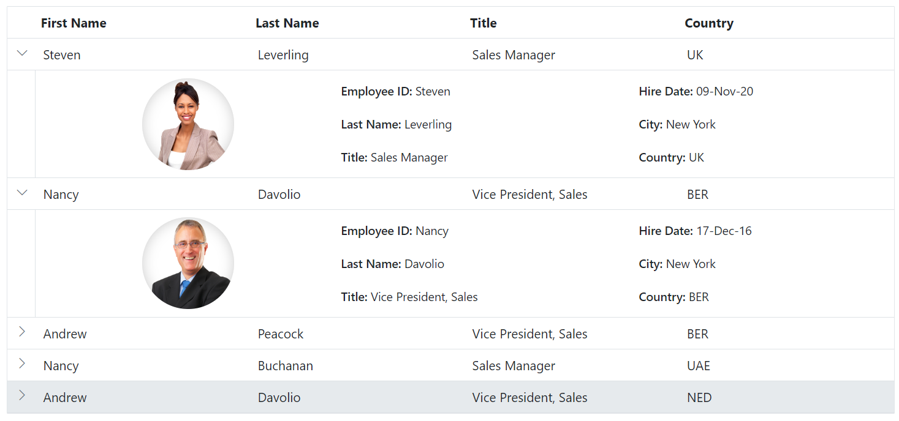

## Expand detail DataGrid initially

Expanding detail rows by default in the Syncfusion<sup style="font-size:70%">&reg;</sup> Blazor DataGrid is useful when immediate visibility into related data is required on initial load.

Use the [ExpandCollapseDetailRowAsync](https://help.syncfusion.com/cr/blazor/Syncfusion.Blazor.Grids.SfGrid-1.html#Syncfusion_Blazor_Grids_SfGrid_1_ExpandCollapseDetailRowAsync_System_String_System_Object_) method during the [DataBound](https://help.syncfusion.com/cr/blazor/Syncfusion.Blazor.Grids.GridEvents-1.html#Syncfusion_Blazor_Grids_GridEvents_1_DataBound) event to expand a specific row by field and value.

> Alternatively, call `ExpandCollapseDetailRowAsync` with the row data object in the `DataBound` event.

The following example expands the record with `EmployeeID` equal to 1 by invoking `ExpandCollapseDetailRowAsync` in the `DataBound` event:




@using Syncfusion.Blazor.Grids
@using Syncfusion.Blazor.Data

<SfGrid @ref="grid" DataSource="@Employees" Height="265px">
    <GridEvents DataBound="DataBoundHandler" TValue="EmployeeData"></GridEvents>
    <GridTemplates>
        <DetailTemplate>
            @{
                var employee = (context as EmployeeData);
            }
            <SfGrid DataSource="@Orders" Query="@(new Query().Where("EmployeeID", "equal", employee.EmployeeID))">
                <GridColumns>
                    <GridColumn Field="@nameof(OrderData.OrderID)" HeaderText="Order ID" TextAlign="TextAlign.Right" Width="110" />
                    <GridColumn Field="@nameof(OrderData.CustomerID)" HeaderText="Customer ID" Width="110" />
                    <GridColumn Field="@nameof(OrderData.ShipCity)" HeaderText="Ship City" Width="110" />
                    <GridColumn Field="@nameof(OrderData.ShipName)" HeaderText="Ship Name" Width="110" />
                </GridColumns>
            </SfGrid>
        </DetailTemplate>
    </GridTemplates>
    <GridColumns>
        <GridColumn Field="@nameof(EmployeeData.EmployeeID)" HeaderText="Employee ID" TextAlign="TextAlign.Right" Width="110" />
        <GridColumn Field="@nameof(EmployeeData.FirstName)" HeaderText="First Name" Width="110" />
        <GridColumn Field="@nameof(EmployeeData.LastName)" HeaderText="Last Name" Width="110" />
        <GridColumn Field="@nameof(EmployeeData.Country)" HeaderText="Country" Width="110" />
    </GridColumns>
</SfGrid>

@code {
    private SfGrid<EmployeeData> grid;
    public List<OrderData> Orders { get; set; }
    public List<EmployeeData> Employees { get; set; }

    protected override void OnInitialized()
    {
        Employees = EmployeeData.GetAllRecords();
        Orders = OrderData.GetAllRecords();
    }

    public async Task DataBoundHandler()
    {
        await grid.ExpandCollapseDetailRowAsync("EmployeeID", 1);

    }
}





public class EmployeeData
{
    public int EmployeeID { get; set; }
    public string FirstName { get; set; }
    public string LastName { get; set; }
    public string Country { get; set; }

    public static List<EmployeeData> GetAllRecords()
    {
        return new List<EmployeeData>
        {
            new EmployeeData { EmployeeID = 1, FirstName = "Nancy", LastName = "Davolio", Country = "USA" },
            new EmployeeData { EmployeeID = 2, FirstName = "Andrew", LastName = "Fuller", Country = "UK" },
            new EmployeeData { EmployeeID = 3, FirstName = "Janet", LastName = "Leverling", Country = "USA" },
            new EmployeeData { EmployeeID = 4, FirstName = "Margaret", LastName = "Peacock", Country = "Canada" },
            new EmployeeData { EmployeeID = 5, FirstName = "Steven", LastName = "Buchanan", Country = "USA" },
            new EmployeeData { EmployeeID = 6, FirstName = "Michael", LastName = "Suyama", Country = "Japan" },
            new EmployeeData { EmployeeID = 7, FirstName = "Robert", LastName = "King", Country = "UK" },
            new EmployeeData { EmployeeID = 8, FirstName = "Laura", LastName = "Callahan", Country = "USA" },
            new EmployeeData { EmployeeID = 9, FirstName = "Anne", LastName = "Dodsworth", Country = "Germany" },
            new EmployeeData { EmployeeID = 10, FirstName = "Paul", LastName = "Henriot", Country = "France" },
            new EmployeeData { EmployeeID = 11, FirstName = "Thomas", LastName = "Hardy", Country = "UK" },
            new EmployeeData { EmployeeID = 12, FirstName = "Maria", LastName = "Anders", Country = "Germany" }
        };
    }
}





public class OrderData
{
    public int OrderID { get; set; }
    public string CustomerID { get; set; }
    public string ShipCity { get; set; }
    public string ShipName { get; set; }
    public int EmployeeID { get; set; }
    public static List<OrderData> GetAllRecords()
    {
        return new List<OrderData>
        {
            new OrderData { OrderID = 10248, CustomerID = "VINET", ShipCity = "Reims", ShipName = "Vins et alcools Chevalier", EmployeeID = 5 },
            new OrderData { OrderID = 10249, CustomerID = "TOMSP", ShipCity = "Münster", ShipName = "Toms Spezialitäten", EmployeeID = 6 },
            new OrderData { OrderID = 10250, CustomerID = "HANAR", ShipCity = "Rio de Janeiro", ShipName = "Hanari Carnes", EmployeeID = 4 },
            new OrderData { OrderID = 10251, CustomerID = "VICTE", ShipCity = "Lyon", ShipName = "Victuailles en stock", EmployeeID = 3 },
            new OrderData { OrderID = 10252, CustomerID = "SUPRD", ShipCity = "Charleroi", ShipName = "Suprêmes délices", EmployeeID = 2 },
            new OrderData { OrderID = 10253, CustomerID = "HANAR", ShipCity = "Rio de Janeiro", ShipName = "Hanari Carnes", EmployeeID = 7 },
            new OrderData { OrderID = 10254, CustomerID = "CHOPS", ShipCity = "Bern", ShipName = "Chop-suey Chinese", EmployeeID = 5 },
            new OrderData { OrderID = 10255, CustomerID = "RICSU", ShipCity = "Genève", ShipName = "Richter Supermarkt", EmployeeID = 9 },
            new OrderData { OrderID = 10256, CustomerID = "WELLI", ShipCity = "Resende", ShipName = "Wellington Importadora", EmployeeID = 3 },
            new OrderData { OrderID = 10257, CustomerID = "HILAA", ShipCity = "San Cristóbal", ShipName = "HILARION-Abastos", EmployeeID = 4 },
            new OrderData { OrderID = 10258, CustomerID = "ERNSH", ShipCity = "Graz", ShipName = "Ernst Handel", EmployeeID = 1 },
            new OrderData { OrderID = 10259, CustomerID = "CENTC", ShipCity = "México D.F.", ShipName = "Centro comercial Moctezuma", EmployeeID = 4 },
            new OrderData { OrderID = 10260, CustomerID = "OTTIK", ShipCity = "Köln", ShipName = "Ottilies Käseladen", EmployeeID = 4 },
            new OrderData { OrderID = 10261, CustomerID = "QUEDE", ShipCity = "Rio de Janeiro", ShipName = "Que Delícia", EmployeeID = 4 },
            new OrderData { OrderID = 10262, CustomerID = "RATTC", ShipCity = "Albuquerque", ShipName = "Rattlesnake Canyon Grocery", EmployeeID = 8 }
        };
    }
}






## Creating custom component/Hierarchical DataGrid 

The Syncfusion<sup style="font-size:70%">&reg;</sup> Blazor DataGrid can render custom components inside the detail row. This enables adding additional information or functionality for a specific row. A hierarchical structure can be created by nesting grids inside the detail row of the parent grid.

To render a custom component or build a hierarchical grid inside the detail row, define the template in the [DetailTemplate](https://help.syncfusion.com/cr/blazor/Syncfusion.Blazor.Grids.GridTemplates.html#Syncfusion_Blazor_Grids_GridTemplates_DetailTemplate) within the `GridTemplates` section. The hierarchical DataGrid displays data in expandable or collapsible levels using the expand or collapse button, or custom content such as HTML elements.

The following example uses the detail template to display parent–child data in a hierarchical structure with multiple levels (Employee → Orders → Customers):




@using Syncfusion.Blazor.Grids
@using Syncfusion.Blazor.Data

<SfGrid DataSource="@Employees" Height="315px" TValue="EmployeeData">
    <GridTemplates>
        <DetailTemplate Context="employeeContext">
            @{
                var employee = (EmployeeData)employeeContext;
            }
            <SfGrid DataSource="@Orders" Query="@(new Query().Where(nameof(OrderData.EmployeeID), "equal", employee.EmployeeID))" TValue="OrderData">
                <GridTemplates>
                    <DetailTemplate Context="orderContext">
                        @{
                            var order = (OrderData)orderContext;
                        }
                        <SfGrid DataSource="@Customers" Query="@(new Query().Where(nameof(CustomerDetails.CustomerID), "equal", order.CustomerID))" TValue="CustomerDetails">
                            <GridColumns>
                                <GridColumn Field=@nameof(CustomerDetails.CustomerID) HeaderText="Customer ID" Width="120"></GridColumn>
                                <GridColumn Field=@nameof(CustomerDetails.ContactTitle) HeaderText="Title" Width="120"></GridColumn>
                                <GridColumn Field=@nameof(CustomerDetails.Address) HeaderText="Address" Width="150"></GridColumn>
                                <GridColumn Field=@nameof(CustomerDetails.Country) HeaderText="Country" Width="100"></GridColumn>
                            </GridColumns>
                        </SfGrid>
                    </DetailTemplate>
                </GridTemplates>
                <GridColumns>
                    <GridColumn Field=@nameof(OrderData.OrderID) HeaderText="Order ID" Width="100" TextAlign="Syncfusion.Blazor.Grids.TextAlign.Right"></GridColumn>
                    <GridColumn Field=@nameof(OrderData.CustomerID) HeaderText="Customer ID" Width="120"></GridColumn>
                    <GridColumn Field=@nameof(OrderData.ShipCity) HeaderText="Ship City" Width="120"></GridColumn>
                    <GridColumn Field=@nameof(OrderData.ShipName) HeaderText="Ship Name" Width="150"></GridColumn>
                </GridColumns>
            </SfGrid>
        </DetailTemplate>
    </GridTemplates>
    <GridColumns>
        <GridColumn Field=@nameof(EmployeeData.EmployeeID) HeaderText="Employee ID" Width="120" TextAlign="Syncfusion.Blazor.Grids.TextAlign.Right"></GridColumn>
        <GridColumn Field=@nameof(EmployeeData.FirstName) HeaderText="First Name" Width="120"></GridColumn>
        <GridColumn Field=@nameof(EmployeeData.LastName) HeaderText="Last Name" Width="120"></GridColumn>
        <GridColumn Field=@nameof(EmployeeData.Country) HeaderText="Country" Width="120"></GridColumn>
    </GridColumns>
</SfGrid>

@code {
    public List<EmployeeData> Employees { get; set; }
    public List<OrderData> Orders { get; set; }
    public List<CustomerDetails> Customers { get; set; }

    protected override void OnInitialized()
    {
        Employees = EmployeeData.GetAllRecords();
        Orders = OrderData.GetAllRecords();
        Customers = CustomerDetails.GetAllRecords();
    }
}





public class OrderData
{
    public int OrderID { get; set; }
    public string CustomerID { get; set; }
    public string ShipCity { get; set; }
    public string ShipName { get; set; }
    public int EmployeeID { get; set; }
    public static List<OrderData> GetAllRecords()
    {
        return new List<OrderData>
        {
            new OrderData { OrderID = 10248, CustomerID = "VINET", ShipCity = "Reims", ShipName = "Vins et alcools Chevalier", EmployeeID = 5 },
            new OrderData { OrderID = 10249, CustomerID = "TOMSP", ShipCity = "Münster", ShipName = "Toms Spezialitäten", EmployeeID = 6 },
            new OrderData { OrderID = 10250, CustomerID = "HANAR", ShipCity = "Rio de Janeiro", ShipName = "Hanari Carnes", EmployeeID = 4 },
            new OrderData { OrderID = 10251, CustomerID = "VICTE", ShipCity = "Lyon", ShipName = "Victuailles en stock", EmployeeID = 3 },
            new OrderData { OrderID = 10252, CustomerID = "SUPRD", ShipCity = "Charleroi", ShipName = "Suprêmes délices", EmployeeID = 2 },
            new OrderData { OrderID = 10253, CustomerID = "HANAR", ShipCity = "Rio de Janeiro", ShipName = "Hanari Carnes", EmployeeID = 7 },
            new OrderData { OrderID = 10254, CustomerID = "CHOPS", ShipCity = "Bern", ShipName = "Chop-suey Chinese", EmployeeID = 5 },
            new OrderData { OrderID = 10255, CustomerID = "RICSU", ShipCity = "Genève", ShipName = "Richter Supermarkt", EmployeeID = 9 },
            new OrderData { OrderID = 10256, CustomerID = "WELLI", ShipCity = "Resende", ShipName = "Wellington Importadora", EmployeeID = 3 },
            new OrderData { OrderID = 10257, CustomerID = "HILAA", ShipCity = "San Cristóbal", ShipName = "HILARION-Abastos", EmployeeID = 4 },
            new OrderData { OrderID = 10258, CustomerID = "ERNSH", ShipCity = "Graz", ShipName = "Ernst Handel", EmployeeID = 1 },
            new OrderData { OrderID = 10259, CustomerID = "CENTC", ShipCity = "México D.F.", ShipName = "Centro comercial Moctezuma", EmployeeID = 4 },
            new OrderData { OrderID = 10260, CustomerID = "OTTIK", ShipCity = "Köln", ShipName = "Ottilies Käseladen", EmployeeID = 4 },
            new OrderData { OrderID = 10261, CustomerID = "QUEDE", ShipCity = "Rio de Janeiro", ShipName = "Que Delícia", EmployeeID = 4 },
            new OrderData { OrderID = 10262, CustomerID = "RATTC", ShipCity = "Albuquerque", ShipName = "Rattlesnake Canyon Grocery", EmployeeID = 8 }
        };
    }
}





public class EmployeeData
{
    public int EmployeeID { get; set; }
    public string FirstName { get; set; }
    public string LastName { get; set; }
    public string Country { get; set; }

    public static List<EmployeeData> GetAllRecords()
    {
        return new List<EmployeeData>
        {
            new EmployeeData { EmployeeID = 1, FirstName = "Nancy", LastName = "Davolio", Country = "USA" },
            new EmployeeData { EmployeeID = 2, FirstName = "Andrew", LastName = "Fuller", Country = "UK" },
            new EmployeeData { EmployeeID = 3, FirstName = "Janet", LastName = "Leverling", Country = "USA" },
            new EmployeeData { EmployeeID = 4, FirstName = "Margaret", LastName = "Peacock", Country = "Canada" },
            new EmployeeData { EmployeeID = 5, FirstName = "Steven", LastName = "Buchanan", Country = "USA" },
            new EmployeeData { EmployeeID = 6, FirstName = "Michael", LastName = "Suyama", Country = "Japan" },
            new EmployeeData { EmployeeID = 7, FirstName = "Robert", LastName = "King", Country = "UK" },
            new EmployeeData { EmployeeID = 8, FirstName = "Laura", LastName = "Callahan", Country = "USA" },
            new EmployeeData { EmployeeID = 9, FirstName = "Anne", LastName = "Dodsworth", Country = "Germany" },
            new EmployeeData { EmployeeID = 10, FirstName = "Paul", LastName = "Henriot", Country = "France" },
            new EmployeeData { EmployeeID = 11, FirstName = "Thomas", LastName = "Hardy", Country = "UK" },
            new EmployeeData { EmployeeID = 12, FirstName = "Maria", LastName = "Anders", Country = "Germany" }
        };
    }
}





public class CustomerDetails
{
    public string CustomerID { get; set; }
    public string ContactTitle { get; set; }
    public string Country { get; set; }
    public string Address { get; set; }

    public static List<CustomerDetails> GetAllRecords()
    {
        return new List<CustomerDetails>
        {
            new CustomerDetails { CustomerID = "VINET", ContactTitle = "Vins et alcools Chevalier", Country = "France", Address = "59 rue de l'Abbaye" },
            new CustomerDetails { CustomerID = "TOMSP", ContactTitle = "Toms Spezialitäten", Country = "Germany", Address = "Luisenstr. 48" },
            new CustomerDetails { CustomerID = "HANAR", ContactTitle = "Hanari Carnes", Country = "Brazil", Address = "Rua do Paço, 67" },
            new CustomerDetails { CustomerID = "VICTE", ContactTitle = "Victuailles en stock", Country = "France", Address = "1 rue de la Paix" },
            new CustomerDetails { CustomerID = "SUPRD", ContactTitle = "Suprêmes délices", Country = "Belgium", Address = "Boulevard de l'Indépendance" },
            new CustomerDetails { CustomerID = "CHOPS", ContactTitle = "Chop-suey Chinese", Country = "Switzerland", Address = "Münsterstr. 16" },
            new CustomerDetails { CustomerID = "RICSU", ContactTitle = "Richter Supermarkt", Country = "Switzerland", Address = "Hauptstr. 45" },
            new CustomerDetails { CustomerID = "WELLI", ContactTitle = "Wellington Importadora", Country = "Brazil", Address = "Rua dos Três Irmãos" },
            new CustomerDetails { CustomerID = "HILAA", ContactTitle = "HILARION-Abastos", Country = "Venezuela", Address = "Av. de la Independencia" },
            new CustomerDetails { CustomerID = "ERNSH", ContactTitle = "Ernst Handel", Country = "Austria", Address = "Kirchgasse 6" },
            new CustomerDetails { CustomerID = "CENTC", ContactTitle = "Centro comercial Moctezuma", Country = "Mexico", Address = "Av. Moctezuma 56" },
            new CustomerDetails { CustomerID = "OTTIK", ContactTitle = "Ottilies Käseladen", Country = "Germany", Address = "Waldstr. 15" },
            new CustomerDetails { CustomerID = "QUEDE", ContactTitle = "Que Delícia", Country = "Brazil", Address = "Av. Rio Branco 20" },
            new CustomerDetails { CustomerID = "RATTC", ContactTitle = "Rattlesnake Canyon Grocery", Country = "USA", Address = "17th St. W" }
        };
    }
}






> The Syncfusion<sup style="font-size:70%">&reg;</sup> Blazor DataGrid does not include built-in hierarchical support. Use the detail template to create multi-level hierarchical layouts, as shown in the example.

## Template column in detail DataGrid

A template column in a detail grid within the Syncfusion<sup style="font-size:70%">&reg;</sup> Blazor DataGrid is useful for customizing the appearance and behavior of specific columns. It enables the inclusion of interactive elements, custom formatting, or complex data representations within the detail grid.

Use the `Template` property of a column to display custom content instead of the field value.

The following example shows a custom image in the `Employee Image` column of the detail grid using the column `Template`:




@using Syncfusion.Blazor.Grids
@using Syncfusion.Blazor.Data

<SfGrid DataSource="@Employees" Height="300px">
    <GridTemplates>
        <DetailTemplate>
            @{
                var employee = (context as EmployeeData);
            }
            <SfGrid DataSource="@Orders" Query="@(new Query().Where("EmployeeID", "equal", employee.EmployeeID))">
                <GridColumns>
                    <GridColumn HeaderText="Employee Image" TextAlign="TextAlign.Center" Width="120">
                        <Template Context="orderContext">
                            @{
                                var order = orderContext as OrderData;
                            }
                            <div class="image">
                                
                            </div>
                        </Template>
                    </GridColumn>
                    <GridColumn Field="@nameof(OrderData.OrderID)" HeaderText="Order ID" TextAlign="TextAlign.Right" Width="110" />
                    <GridColumn Field="@nameof(OrderData.CustomerID)" HeaderText="Customer ID" Width="110" />
                    <GridColumn Field="@nameof(OrderData.ShipCity)" HeaderText="Ship City" Width="110" />
                    <GridColumn Field="@nameof(OrderData.ShipName)" HeaderText="Ship Name" Width="110" />
                </GridColumns>
            </SfGrid>
        </DetailTemplate>
    </GridTemplates>
    <GridColumns>
        <GridColumn Field="@nameof(EmployeeData.EmployeeID)" HeaderText="Employee ID" TextAlign="TextAlign.Right" Width="110" />
        <GridColumn Field="@nameof(EmployeeData.FirstName)" HeaderText="First Name" Width="110" />
        <GridColumn Field="@nameof(EmployeeData.LastName)" HeaderText="Last Name" Width="110" />
        <GridColumn Field="@nameof(EmployeeData.Country)" HeaderText="Country" Width="110" />
    </GridColumns>
</SfGrid>
<style>
.image img {
    height: 55px;
    width: 55px;
    border-radius: 50px;
    box-shadow: inset 0 0 1px #e0e0e0, inset 0 0 14px rgba(0,0,0,0.2);
}
</style>
@code {
    public List<EmployeeData> Employees { get; set; }
    public List<OrderData> Orders { get; set; }

    protected override void OnInitialized()
    {
        Employees = EmployeeData.GetAllRecords();
        Orders = OrderData.GetAllRecords();
    }
}





public class EmployeeData
{
    public int EmployeeID { get; set; }
    public string FirstName { get; set; }
    public string LastName { get; set; }
    public string Country { get; set; }

    public static List<EmployeeData> GetAllRecords()
    {
        return new List<EmployeeData>
        {
            new EmployeeData { EmployeeID = 1, FirstName = "Nancy", LastName = "Davolio", Country = "USA" },
            new EmployeeData { EmployeeID = 2, FirstName = "Andrew", LastName = "Fuller", Country = "UK" },
            new EmployeeData { EmployeeID = 3, FirstName = "Janet", LastName = "Leverling", Country = "USA" },
            new EmployeeData { EmployeeID = 4, FirstName = "Margaret", LastName = "Peacock", Country = "Canada" },
            new EmployeeData { EmployeeID = 5, FirstName = "Steven", LastName = "Buchanan", Country = "USA" },
            new EmployeeData { EmployeeID = 6, FirstName = "Michael", LastName = "Suyama", Country = "Japan" },
            new EmployeeData { EmployeeID = 7, FirstName = "Robert", LastName = "King", Country = "UK" },
            new EmployeeData { EmployeeID = 8, FirstName = "Laura", LastName = "Callahan", Country = "USA" },
            new EmployeeData { EmployeeID = 9, FirstName = "Anne", LastName = "Dodsworth", Country = "Germany" },
            new EmployeeData { EmployeeID = 10, FirstName = "Paul", LastName = "Henriot", Country = "France" },
            new EmployeeData { EmployeeID = 11, FirstName = "Thomas", LastName = "Hardy", Country = "UK" },
            new EmployeeData { EmployeeID = 12, FirstName = "Maria", LastName = "Anders", Country = "Germany" }
        };
    }
}





public class OrderData
{
    public int OrderID { get; set; }
    public string CustomerID { get; set; }
    public string ShipCity { get; set; }
    public string ShipName { get; set; }
    public int EmployeeID { get; set; }
    public double Freight { get; set; } 

    public static List<OrderData> GetAllRecords()
    {
        return new List<OrderData>
        {
            new OrderData { OrderID = 10248, CustomerID = "VINET", ShipCity = "Reims", ShipName = "Vins et alcools Chevalier", EmployeeID = 5, Freight = 32.38 },
            new OrderData { OrderID = 10249, CustomerID = "TOMSP", ShipCity = "Münster", ShipName = "Toms Spezialitäten", EmployeeID = 6, Freight = 11.61 },
            new OrderData { OrderID = 10250, CustomerID = "HANAR", ShipCity = "Rio de Janeiro", ShipName = "Hanari Carnes", EmployeeID = 4, Freight = 65.83 },
            new OrderData { OrderID = 10251, CustomerID = "VICTE", ShipCity = "Lyon", ShipName = "Victuailles en stock", EmployeeID = 3, Freight = 41.34 },
            new OrderData { OrderID = 10252, CustomerID = "SUPRD", ShipCity = "Charleroi", ShipName = "Suprêmes délices", EmployeeID = 2, Freight = 51.30 },
            new OrderData { OrderID = 10253, CustomerID = "HANAR", ShipCity = "Rio de Janeiro", ShipName = "Hanari Carnes", EmployeeID = 7, Freight = 58.17 },
            new OrderData { OrderID = 10254, CustomerID = "CHOPS", ShipCity = "Bern", ShipName = "Chop-suey Chinese", EmployeeID = 5, Freight = 22.98 },
            new OrderData { OrderID = 10255, CustomerID = "RICSU", ShipCity = "Genève", ShipName = "Richter Supermarkt", EmployeeID = 9, Freight = 148.33 },
            new OrderData { OrderID = 10256, CustomerID = "WELLI", ShipCity = "Resende", ShipName = "Wellington Importadora", EmployeeID = 3, Freight = 13.97 },
            new OrderData { OrderID = 10257, CustomerID = "HILAA", ShipCity = "San Cristóbal", ShipName = "HILARION-Abastos", EmployeeID = 4, Freight = 81.91 },
            new OrderData { OrderID = 10258, CustomerID = "ERNSH", ShipCity = "Graz", ShipName = "Ernst Handel", EmployeeID = 1, Freight = 140.51 },
            new OrderData { OrderID = 10259, CustomerID = "CENTC", ShipCity = "México D.F.", ShipName = "Centro comercial Moctezuma", EmployeeID = 4, Freight = 3.25 },
            new OrderData { OrderID = 10260, CustomerID = "OTTIK", ShipCity = "Köln", ShipName = "Ottilies Käseladen", EmployeeID = 1, Freight = 55.09 },
            new OrderData { OrderID = 10261, CustomerID = "QUEDE", ShipCity = "Rio de Janeiro", ShipName = "Que Delícia", EmployeeID = 4, Freight = 3.05 },
            new OrderData { OrderID = 10262, CustomerID = "RATTC", ShipCity = "Albuquerque", ShipName = "Rattlesnake Canyon Grocery", EmployeeID = 8, Freight = 48.29 },
            new OrderData { OrderID = 10263, CustomerID = "ERNSH", ShipCity = "Graz", ShipName = "Ernst Handel", EmployeeID = 9, Freight = 76.13 },
            new OrderData { OrderID = 10264, CustomerID = "FOLKO", ShipCity = "Bräcke", ShipName = "Folk och fä HB", EmployeeID = 6, Freight = 3.67 },
            new OrderData { OrderID = 10265, CustomerID = "BLONP", ShipCity = "Strasbourg", ShipName = "Blondel père et fils", EmployeeID = 2, Freight = 55.28 },
            new OrderData { OrderID = 10266, CustomerID = "WARTH", ShipCity = "Stavern", ShipName = "Wartian Herkku", EmployeeID = 3, Freight = 25.73 },
            new OrderData { OrderID = 10267, CustomerID = "FRANK", ShipCity = "München", ShipName = "Frankenversand", EmployeeID = 4, Freight = 208.58 }
        };
    }
}




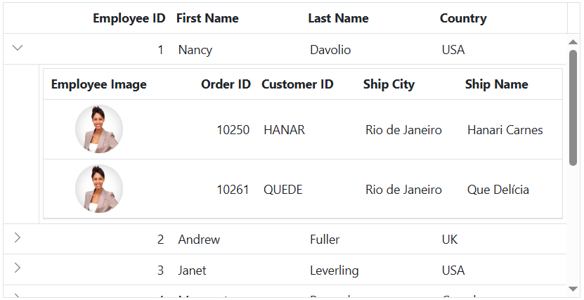

## Expand by external button

By default, detail rows are collapsed. Expand all detail rows programmatically by invoking [ExpandAllDetailRowAsync](https://help.syncfusion.com/cr/blazor/Syncfusion.Blazor.Grids.SfGrid-1.html#Syncfusion_Blazor_Grids_SfGrid_1_ExpandAllDetailRowAsync) from an external button.



@page "/"

@using Syncfusion.Blazor.Grids
@using Syncfusion.Blazor.Buttons
@using BlazorApp1.Data

<SfButton style="margin:5px" Content="Expand" OnClick="BtnClick"></SfButton>
<SfGrid @ref="Grid" DataSource="@Employees">
    <GridTemplates>
        <DetailTemplate>
            @{
                var employee = (context as EmployeeData);
                <table class="detailtable" width="100%">
                    <colgroup>
                        <col width="35%">
                        <col width="35%">
                        <col width="30%">
                    </colgroup>
                    <tbody>
                        <tr>
                            <td rowspan="4" style="text-align: center;">
                                
                            </td>
                            <td>
                                <span style="font-weight: 500;">Employee ID: </span> @employee.FirstName
                            </td>
                            <td>
                                <span style="font-weight: 500;">Hire Date: </span> @employee.HireDate.ToShortDateString()
                            </td>
                        </tr>
                        <tr>
                            <td>
                                <span style="font-weight: 500;">Last Name: </span> @employee.LastName
                            </td>
                            <td>
                                <span style="font-weight: 500;">City: </span> @employee.City
                            </td>
                        </tr>
                        <tr>
                            <td>
                                <span style="font-weight: 500;">Title: </span> @employee.Title
                            </td>
                            <td>
                                <span style="font-weight: 500;">Country: </span> @employee.Country
                            </td>
                        </tr>
                    </tbody>
                </table>
            }
        </DetailTemplate>
    </GridTemplates>
    <GridColumns>
        <GridColumn Field=@nameof(EmployeeData.FirstName) HeaderText="First Name" Width="110"> </GridColumn>
        <GridColumn Field=@nameof(EmployeeData.LastName) HeaderText="Last Name" Width="110"></GridColumn>
        <GridColumn Field=@nameof(EmployeeData.Title) HeaderText="Title" Width="110"></GridColumn>
        <GridColumn Field=@nameof(EmployeeData.Country) HeaderText="Country" Width="110"></GridColumn>
    </GridColumns>
</SfGrid>

<style type="text/css" class="cssStyles">
    .detailtable td {
        font-size: 13px;
        padding: 4px;
        max-width: 0;
        overflow: hidden;
        text-overflow: ellipsis;
        white-space: nowrap;
    }
    .photo {
        width: 100px;
        height: 100px;
        border-radius: 50px;
        box-shadow: inset 0 0 1px #e0e0e0, inset 0 0 14px rgba(0,0,0,0.2);
    }
</style>

@code {
    private SfGrid<EmployeeData> Grid;
    private int TextBox;

    public List<EmployeeData> Employees { get; set; }

    public void BtnClick()
    {
        this.Grid.ExpandAllDetailRowAsync();
    }
    protected override void OnInitialized()
    {
        Employees = EmployeeData.GetAllRecords();
    }

}


namespace BlazorApp1.Data
{
public class OrderData
{
public static List<OrderData> Orders = new List<OrderData>();

        public OrderData() { }

        public OrderData(int? OrderID, string CustomerID, string ShipName, double Freight, DateTime? OrderDate, DateTime? ShippedDate, bool? IsVerified, string ShipCity, string ShipCountry, int employeeID)
        {
            this.OrderID = OrderID;
            this.CustomerID = CustomerID;
            this.ShipName = ShipName;
            this.Freight = Freight;
            this.OrderDate = OrderDate;
            this.ShippedDate = ShippedDate;
            this.IsVerified = IsVerified;
            this.ShipCity = ShipCity;
            this.ShipCountry = ShipCountry;
            this.EmployeeID = employeeID;
        }

        public static List<OrderData> GetAllRecords()
        {
            if (Orders.Count == 0)
            {
                Orders.Add(new OrderData(10248, "VINET", "Vins et alcools Chevalier", 32.38, new DateTime(1996, 7, 4), new DateTime(1996, 08, 07), true, "Reims", "France", 1));
                Orders.Add(new OrderData(10249, "TOMSP", "Toms Spezialitäten", 11.61, new DateTime(1996, 7, 5), new DateTime(1996, 08, 07), false, "Münster", "Germany", 2));
                Orders.Add(new OrderData(10250, "HANAR", "Hanari Carnes", 65.83, new DateTime(1996, 7, 6), new DateTime(1996, 08, 07), true, "Rio de Janeiro", "Brazil", 3));
                Orders.Add(new OrderData(10251, "VINET", "Vins et alcools Chevalier", 41.34, new DateTime(1996, 7, 7), new DateTime(1996, 08, 07), false, "Lyon", "France", 1));
                Orders.Add(new OrderData(10252, "SUPRD", "Suprêmes délices", 151.30, new DateTime(1996, 7, 8), new DateTime(1996, 08, 07), true, "Charleroi", "Belgium", 2));
                Orders.Add(new OrderData(10253, "HANAR", "Hanari Carnes", 58.17, new DateTime(1996, 7, 9), new DateTime(1996, 08, 07), false, "Bern", "Switzerland", 3));
                Orders.Add(new OrderData(10254, "CHOPS", "Chop-suey Chinese", 22.98, new DateTime(1996, 7, 10), new DateTime(1996, 08, 07), true, "Genève", "Switzerland", 2));
                Orders.Add(new OrderData(10255, "VINET", "Vins et alcools Chevalier", 148.33, new DateTime(1996, 7, 11), new DateTime(1996, 08, 07), false, "Resende", "Brazil", 1));
                Orders.Add(new OrderData(10256, "HANAR", "Hanari Carnes", 13.97, new DateTime(1996, 7, 12), new DateTime(1996, 08, 07), true, "Paris", "France", 3));
            }
            return Orders;
        }

        public int? OrderID { get; set; }
        public string CustomerID { get; set; }
        public string ShipName { get; set; }
        public double? Freight { get; set; }
        public DateTime? OrderDate { get; set; }
        public DateTime? ShippedDate { get; set; }
        public bool? IsVerified { get; set; }
        public string ShipCity { get; set; }
        public string ShipCountry { get; set; }
        public int EmployeeID { get; set; }
    }

}



namespace BlazorApp1.Data
{
public class EmployeeData
{
public static List<EmployeeData> Employees = new List<EmployeeData>();

        public EmployeeData() { }

        public EmployeeData(int EmployeeID, string FirstName, string LastName, string Title, string Country, string City, DateTime HireDate)
        {
            this.EmployeeID = EmployeeID;
            this.FirstName = FirstName;
            this.LastName = LastName;
            this.Title = Title;
            this.Country = Country;
            this.City = City;
            this.HireDate = HireDate;
        }

        public static List<EmployeeData> GetAllRecords()
        {
            if (Employees.Count == 0)
            {
                var firstNames = new string[] { "Nancy", "Andrew", "Janet", "Margaret", "Steven" };
                var lastNames = new string[] { "Davolio", "Fuller", "Leverling", "Peacock", "Buchanan" };
                var titles = new string[] { "Sales Representative", "Vice President, Sales", "Sales Manager", "Inside Sales Coordinator" };
                var countries = new string[] { "USA", "UK", "UAE", "NED", "BER" };
                var cities = new string[] { "New York", "London", "Dubai", "Amsterdam", "Berlin" };

                Random random = new Random();
                for (int i = 1; i <= 5; i++)
                {
                    Employees.Add(new EmployeeData(
                        i,
                        firstNames[random.Next(firstNames.Length)],
                        lastNames[random.Next(lastNames.Length)],
                        titles[random.Next(titles.Length)],
                        countries[random.Next(countries.Length)],
                        cities[random.Next(cities.Length)],
                        DateTime.Now.AddDays(-random.Next(1000, 5000))
                    ));
                }
            }
            return Employees;
        }

        public int EmployeeID { get; set; }
        public string? FirstName { get; set; }
        public string? LastName { get; set; }
        public string? Title { get; set; }
        public string? Country { get; set; }
        public string? City { get; set; }
        public DateTime HireDate { get; set; }
    }

}




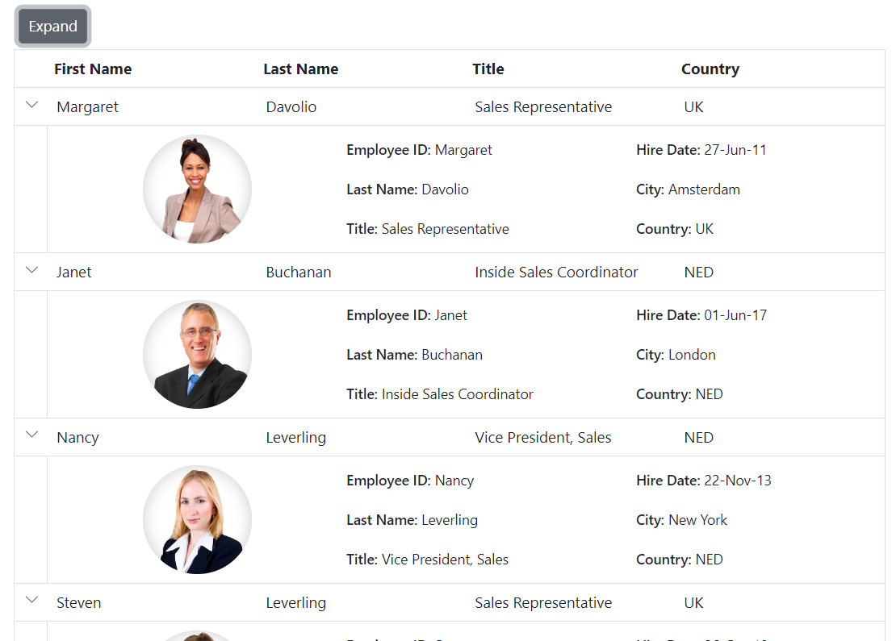

> - Expand all rows using `ExpandAllDetailRowAsync`.
> - To expand all rows at initial rendering, invoke `ExpandAllDetailRowAsync` in the grid’s [DataBound](https://help.syncfusion.com/cr/blazor/Syncfusion.Blazor.Grids.GridEvents-1.html#Syncfusion_Blazor_Grids_GridEvents_1_DataBound) event.

## Expand or collapse specific detail template row

To expand or collapse a specific detail row programmatically, use [ExpandCollapseDetailRowAsync](https://help.syncfusion.com/cr/blazor/Syncfusion.Blazor.Grids.SfGrid-1.html#Syncfusion_Blazor_Grids_SfGrid_1_ExpandCollapseDetailRowAsync__0_) and pass the corresponding row data object.

The following example expands or collapses a specific employee’s detail row when the button is clicked.

In the example, the `Expand` method validates the row index and then invokes `ExpandCollapseDetailRowAsync` with the selected row’s data:



@page "/"
@using Syncfusion.Blazor.Grids
@using Syncfusion.Blazor.Data
@using Syncfusion.Blazor.Buttons
@using Syncfusion.Blazor.Inputs
@using BlazorApp1.Data

<div style="display: inline-block; padding: 0px 30px 0px 0px; margin:5px">
   <p style="color: red">@message</p>
    <SfTextBox Placeholder="Enter the row index" Width="250px" @bind-Value="rowIndex"></SfTextBox>
<SfButton Content="Expand/Collapse" OnClick="Expand"></SfButton>
</div>
<SfGrid @ref="Grid" DataSource="@Employees" TValue="EmployeeData" Height="315px">
    <GridTemplates>
        <DetailTemplate>
            @{
                var employee = (context as EmployeeData);
                var Order = (context as OrderData);
                <SfGrid DataSource="@Orders" Query="@(new Query().Where("EmployeeID", "equal", employee.EmployeeID))">
                    <GridColumns>
                        <GridColumn Field=@nameof(Order.OrderID) HeaderText="First Name" Width="110"> </GridColumn>
                        <GridColumn Field=@nameof(Order.CustomerID) HeaderText="Last Name" Width="110"></GridColumn>
                        <GridColumn Field=@nameof(Order.ShipCountry) HeaderText="Title" Width="110"></GridColumn>
                    </GridColumns>
                </SfGrid>
            }
        </DetailTemplate>
    </GridTemplates>
    <GridColumns>
        <GridColumn Field=@nameof(EmployeeData.FirstName) HeaderText="First Name" Width="110"> </GridColumn>
        <GridColumn Field=@nameof(EmployeeData.LastName) HeaderText="Last Name" Width="110"></GridColumn>
        <GridColumn Field=@nameof(EmployeeData.Title) HeaderText="Title" Width="110"></GridColumn>
        <GridColumn Field=@nameof(EmployeeData.Country) HeaderText="Country" Width="110"></GridColumn>
    </GridColumns>
</SfGrid>

<style type="text/css" class="cssStyles">
    .detailtable td {
        font-size: 13px;
        padding: 4px;
        max-width: 0;
        overflow: hidden;
        text-overflow: ellipsis;
        white-space: nowrap;
    }

    .photo {
        width: 100px;
        height: 100px;
        border-radius: 50px;
        box-shadow: inset 0 0 1px #e0e0e0, inset 0 0 14px rgba(0,0,0,0.2);
    }
</style>

@code {
    private SfGrid<EmployeeData> Grid;
    private string rowIndex;
    private string message;

    public List<EmployeeData> Employees { get; set; }
    public List<OrderData> Orders { get; set; }

    public async Task Expand()
    {
        if (int.TryParse(rowIndex, out int index) && index >= 0 && index < Employees.Count)
        {
            message= "";
            await this.Grid.ExpandCollapseDetailRowAsync(Employees[index]);
        }
        else
        {
           message = "Invalid index";
        }
    }

    protected override void OnInitialized()
    {
        Employees = EmployeeData.GetAllRecords();
        Orders = OrderData.GetAllRecords();
    }

}


public class OrderData
{
    public static List<OrderData> Orders = new List<OrderData>();

        public OrderData() { }

        public OrderData(int? OrderID, string CustomerID, string ShipName, double Freight, DateTime? OrderDate, DateTime? ShippedDate, bool? IsVerified, string ShipCity, string ShipCountry, int employeeID)
        {
            this.OrderID = OrderID;
            this.CustomerID = CustomerID;
            this.ShipName = ShipName;
            this.Freight = Freight;
            this.OrderDate = OrderDate;
            this.ShippedDate = ShippedDate;
            this.IsVerified = IsVerified;
            this.ShipCity = ShipCity;
            this.ShipCountry = ShipCountry;
            this.EmployeeID = employeeID;
        }

        public static List<OrderData> GetAllRecords()
        {
            if (Orders.Count == 0)
            {
                Orders.Add(new OrderData(10248, "VINET", "Vins et alcools Chevalier", 32.38, new DateTime(1996, 7, 4), new DateTime(1996, 08, 07), true, "Reims", "France", 1));
                Orders.Add(new OrderData(10249, "TOMSP", "Toms Spezialitäten", 11.61, new DateTime(1996, 7, 5), new DateTime(1996, 08, 07), false, "Münster", "Germany", 2));
                Orders.Add(new OrderData(10250, "HANAR", "Hanari Carnes", 65.83, new DateTime(1996, 7, 6), new DateTime(1996, 08, 07), true, "Rio de Janeiro", "Brazil", 3));
                Orders.Add(new OrderData(10251, "VINET", "Vins et alcools Chevalier", 41.34, new DateTime(1996, 7, 7), new DateTime(1996, 08, 07), false, "Lyon", "France", 1));
                Orders.Add(new OrderData(10252, "SUPRD", "Suprêmes délices", 151.30, new DateTime(1996, 7, 8), new DateTime(1996, 08, 07), true, "Charleroi", "Belgium", 2));
                Orders.Add(new OrderData(10253, "HANAR", "Hanari Carnes", 58.17, new DateTime(1996, 7, 9), new DateTime(1996, 08, 07), false, "Bern", "Switzerland", 3));
                Orders.Add(new OrderData(10254, "CHOPS", "Chop-suey Chinese", 22.98, new DateTime(1996, 7, 10), new DateTime(1996, 08, 07), true, "Genève", "Switzerland", 2));
                Orders.Add(new OrderData(10255, "VINET", "Vins et alcools Chevalier", 148.33, new DateTime(1996, 7, 11), new DateTime(1996, 08, 07), false, "Resende", "Brazil", 1));
                Orders.Add(new OrderData(10256, "HANAR", "Hanari Carnes", 13.97, new DateTime(1996, 7, 12), new DateTime(1996, 08, 07), true, "Paris", "France", 3));
            }
            return Orders;
        }

        public int? OrderID { get; set; }
        public string CustomerID { get; set; }
        public string ShipName { get; set; }
        public double? Freight { get; set; }
        public DateTime? OrderDate { get; set; }
        public DateTime? ShippedDate { get; set; }
        public bool? IsVerified { get; set; }
        public string ShipCity { get; set; }
        public string ShipCountry { get; set; }
        public int EmployeeID { get; set; }
    }




public class EmployeeData
{
public static List<EmployeeData> Employees = new List<EmployeeData>();

        public EmployeeData() { }

        public EmployeeData(int EmployeeID, string FirstName, string LastName, string Title, string Country, string City, DateTime HireDate)
        {
            this.EmployeeID = EmployeeID;
            this.FirstName = FirstName;
            this.LastName = LastName;
            this.Title = Title;
            this.Country = Country;
            this.City = City;
            this.HireDate = HireDate;
        }

        public static List<EmployeeData> GetAllRecords()
        {
            if (Employees.Count == 0)
            {
                var firstNames = new string[] { "Nancy", "Andrew", "Janet", "Margaret", "Steven" };
                var lastNames = new string[] { "Davolio", "Fuller", "Leverling", "Peacock", "Buchanan" };
                var titles = new string[] { "Sales Representative", "Vice President, Sales", "Sales Manager", "Inside Sales Coordinator" };
                var countries = new string[] { "USA", "UK", "UAE", "NED", "BER" };
                var cities = new string[] { "New York", "London", "Dubai", "Amsterdam", "Berlin" };

                Random random = new Random();
                for (int i = 1; i <= 5; i++)
                {
                    Employees.Add(new EmployeeData(
                        i,
                        firstNames[random.Next(firstNames.Length)],
                        lastNames[random.Next(lastNames.Length)],
                        titles[random.Next(titles.Length)],
                        countries[random.Next(countries.Length)],
                        cities[random.Next(cities.Length)],
                        DateTime.Now.AddDays(-random.Next(1000, 5000))
                    ));
                }
            }
            return Employees;
        }

        public int EmployeeID { get; set; }
        public string? FirstName { get; set; }
        public string? LastName { get; set; }
        public string? Title { get; set; }
        public string? Country { get; set; }
        public string? City { get; set; }
        public DateTime HireDate { get; set; }
    }






## Customize detail template icon

The detail template icon expands or collapses the detail content of a row. By default, a right arrow indicates the collapsed state and a down arrow indicates the expanded state. Customize the icon by overriding the following CSS:

```css
    .e-grid .e-icon-grightarrow::before {
        content: "\e7a9";
    }

    .e-grid .e-icon-gdownarrow::before {
        content: "\e7fe";
    }
```

Here is an example that customizes the expand/collapse icons:



@page "/"

@using Syncfusion.Blazor.Grids
@using BlazorApp1.Data

<SfGrid @ref="Grid" DataSource="@Employees">
    <GridTemplates>
        <DetailTemplate>
            @{
                var employee = (context as EmployeeData);

                <table class="detailtable" width="100%">
                    <colgroup>
                        <col width="35%">
                        <col width="35%">
                        <col width="30%">
                    </colgroup>
                    <tbody>
                        <tr>
                            <td rowspan="4" style="text-align: center;">
                                
                            </td>
                            <td>
                                <span style="font-weight: 500;">Employee ID: </span> @employee.FirstName
                            </td>
                            <td>
                                <span style="font-weight: 500;">Hire Date: </span> @employee.HireDate.ToShortDateString()
                            </td>
                        </tr>
                        <tr>
                            <td>
                                <span style="font-weight: 500;">Last Name: </span> @employee.LastName
                            </td>
                            <td>
                                <span style="font-weight: 500;">City: </span> @employee.City
                            </td>
                        </tr>
                        <tr>
                            <td>
                                <span style="font-weight: 500;">Title: </span> @employee.Title
                            </td>
                            <td>
                                <span style="font-weight: 500;">Country: </span> @employee.Country
                            </td>
                        </tr>
                    </tbody>
                </table>
            }
        </DetailTemplate>
    </GridTemplates>
    <GridColumns>
        <GridColumn Field=@nameof(EmployeeData.FirstName) HeaderText="First Name" Width="110"> </GridColumn>
        <GridColumn Field=@nameof(EmployeeData.LastName) HeaderText="Last Name" Width="110"></GridColumn>
        <GridColumn Field=@nameof(EmployeeData.Title) HeaderText="Title" Width="110"></GridColumn>
        <GridColumn Field=@nameof(EmployeeData.Country) HeaderText="Country" Width="110"></GridColumn>
    </GridColumns>
</SfGrid>

<style type="text/css" class="cssStyles">
    .detailtable td {
        font-size: 13px;
        padding: 4px;
        max-width: 0;
        overflow: hidden;
        text-overflow: ellipsis;
        white-space: nowrap;
    }

    .photo {
        width: 100px;
        height: 100px;
        border-radius: 50px;
        box-shadow: inset 0 0 1px #e0e0e0, inset 0 0 14px rgba(0,0,0,0.2);
    }

    .e-grid .e-icon-grightarrow::before {
        content: "\e7a9";
    }

    .e-grid .e-icon-gdownarrow::before {
        content: "\e7fe";
    }
</style>

@code {
    private SfGrid<EmployeeData> Grid;
    public List<EmployeeData> Employees { get; set; }

    protected override void OnInitialized()
    {
        Employees = EmployeeData.GetAllRecords();
    }

}


namespace BlazorApp1.Data
{
public class EmployeeData
{
public static List<EmployeeData> Employees = new List<EmployeeData>();

        public EmployeeData() { }

        public EmployeeData(int EmployeeID, string FirstName, string LastName, string Title, string Country, string City, DateTime HireDate)
        {
            this.EmployeeID = EmployeeID;
            this.FirstName = FirstName;
            this.LastName = LastName;
            this.Title = Title;
            this.Country = Country;
            this.City = City;
            this.HireDate = HireDate;
        }

        public static List<EmployeeData> GetAllRecords()
        {
            if (Employees.Count == 0)
            {
                var firstNames = new string[] { "Nancy", "Andrew", "Janet", "Margaret", "Steven" };
                var lastNames = new string[] { "Davolio", "Fuller", "Leverling", "Peacock", "Buchanan" };
                var titles = new string[] { "Sales Representative", "Vice President, Sales", "Sales Manager", "Inside Sales Coordinator" };
                var countries = new string[] { "USA", "UK", "UAE", "NED", "BER" };
                var cities = new string[] { "New York", "London", "Dubai", "Amsterdam", "Berlin" };

                Random random = new Random();
                for (int i = 1; i <= 5; i++)
                {
                    Employees.Add(new EmployeeData(
                        i,
                        firstNames[random.Next(firstNames.Length)],
                        lastNames[random.Next(lastNames.Length)],
                        titles[random.Next(titles.Length)],
                        countries[random.Next(countries.Length)],
                        cities[random.Next(cities.Length)],
                        DateTime.Now.AddDays(-random.Next(1000, 5000)) // Random hire date between 3-14 years ago
                    ));
                }
            }
            return Employees;
        }

        public int EmployeeID { get; set; }
        public string? FirstName { get; set; }
        public string? LastName { get; set; }
        public string? Title { get; set; }
        public string? Country { get; set; }
        public string? City { get; set; } // New City property
        public DateTime HireDate { get; set; }
    }
}




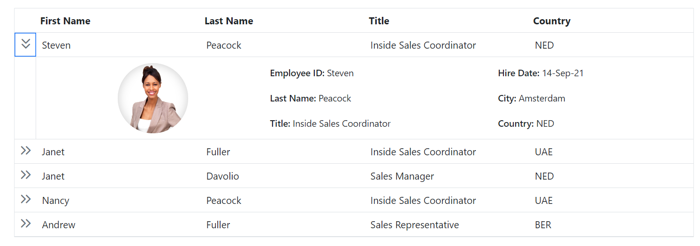

## How to access the child component in the detail template

Using the detail template feature of the Syncfusion<sup style="font-size:70%">&reg;</sup> Blazor DataGrid, a grid-like structure with hierarchical binding can be achieved by rendering a grid inside the DetailTemplate. By default, the @ref property of the grid is of type SfGrid<T>, which carries a single grid instance. For a hierarchy, each child grid requires a separate reference. Define the @ref using a dictionary of key–value pairs, where values are SfGrid<T> instances and keys are unique.

In the following sample, the instance of a specific child grid is retrieved using the unique key value passed to the [OnToolbarClick](https://help.syncfusion.com/cr/blazor/Syncfusion.Blazor.Grids.GridEvents-1.html#Syncfusion_Blazor_Grids_GridEvents_1_OnToolbarClick) event. The selected record details are then obtained using [GetSelectedRecordsAsync](https://help.syncfusion.com/cr/blazor/Syncfusion.Blazor.Grids.SfGrid-1.html#Syncfusion_Blazor_Grids_SfGrid_1_GetSelectedRecordsAsync) on that child grid:



@page "/"

@using Syncfusion.Blazor.Grids
@using Syncfusion.Blazor.Navigations
@using Syncfusion.Blazor.Data

<h5 style="text-align:center;color:green">@SelectedRecordsMessage</h5> 

<SfGrid DataSource="@Employees">
    <GridTemplates>
        <DetailTemplate>
            @{
                var order = (context as OrderData);
                var employee = (context as EmployeeData);

                <SfGrid @ref=Grid[(int)employee.EmployeeID] DataSource="@Orders" Toolbar="@Toolbaritems" Query="@(new Query().Where("EmployeeID", "equal", employee.EmployeeID))">
                    <GridEvents TValue="OrderData" OnToolbarClick="@((e)=>ToolbarClickHandler(e, employee.EmployeeID))"></GridEvents>
                    <GridSelectionSettings Type="SelectionType.Multiple"></GridSelectionSettings>
                    <GridColumns>
                        <GridColumn Field=@nameof(OrderData.OrderID) HeaderText="OrderID" Width="110"> </GridColumn>
                        <GridColumn Field=@nameof(OrderData.CustomerID) HeaderText="Customer Name" Width="110"></GridColumn>
                        <GridColumn Field=@nameof(OrderData.ShipCountry) HeaderText="ShipCountry" Width="110"></GridColumn>
                    </GridColumns>
                </SfGrid>
            }
        </DetailTemplate>
    </GridTemplates>
    <GridColumns>
        <GridColumn Field=@nameof(EmployeeData.FirstName) HeaderText="First Name" Width="110"> </GridColumn>
        <GridColumn Field=@nameof(EmployeeData.LastName) HeaderText="Last Name" Width="110"></GridColumn>
        <GridColumn Field=@nameof(EmployeeData.Title) HeaderText="Title" Width="110"></GridColumn>
        <GridColumn Field=@nameof(EmployeeData.Country) HeaderText="Country" Width="110"></GridColumn>
    </GridColumns>

</SfGrid>

<style type="text/css" class="cssStyles">
    .detailtable td {
        font-size: 13px;
        padding: 4px;
        max-width: 0;
        overflow: hidden;
        text-overflow: ellipsis;
        white-space: nowrap;
    }

    .photo {
        width: 100px;
        height: 100px;
        border-radius: 50px;
        box-shadow: inset 0 0 1px #e0e0e0, inset 0 0 14px rgba(0,0,0,0.2);
    }
</style>

@code {

    public List<EmployeeData> Employees { get; set; }
    public List<OrderData> Orders { get; set; }

    Dictionary<int?, SfGrid<OrderData>> Grid = new Dictionary<int?, SfGrid<OrderData>>();
    private List<Object> Toolbaritems = new List<Object>() { new ItemModel() { Text = "Click", TooltipText = "Click", PrefixIcon = "e-click", Id = "Click" } };
    private string SelectedRecordsMessage { get; set; } = "Select records to view details";

    protected override void OnInitialized()
    {
        Employees = EmployeeData.GetAllRecords();
        Orders = OrderData.GetAllRecords();
    }

    public async Task ToolbarClickHandler(ClickEventArgs args, int? employeeID)
    {
        if (args.Item.Id == "Click" && employeeID.HasValue && Grid.ContainsKey(employeeID))
        {
            var selectedRecords = await Grid[employeeID].GetSelectedRecordsAsync();
            SelectedRecordsMessage = selectedRecords.Count > 0
                ? $"Selected records for Employee ID {employeeID}: {string.Join(", ", selectedRecords.Select(r => r.OrderID))}"
                : $"No records selected for Employee ID {employeeID}";
        }
    }
}



public class OrderData
{
public static List<OrderData> Orders = new List<OrderData>();

        public OrderData() { }

        public OrderData(int? OrderID, string CustomerID, string ShipName, double Freight, DateTime? OrderDate, DateTime? ShippedDate, bool? IsVerified, string ShipCity, string ShipCountry, int employeeID)
        {
            this.OrderID = OrderID;
            this.CustomerID = CustomerID;
            this.ShipName = ShipName;
            this.Freight = Freight;
            this.OrderDate = OrderDate;
            this.ShippedDate = ShippedDate;
            this.IsVerified = IsVerified;
            this.ShipCity = ShipCity;
            this.ShipCountry = ShipCountry;
            this.EmployeeID = employeeID;
        }

        public static List<OrderData> GetAllRecords()
        {
            if (Orders.Count == 0)
            {
                Orders.Add(new OrderData(10248, "VINET", "Vins et alcools Chevalier", 32.38, new DateTime(1996, 7, 4), new DateTime(1996, 08, 07), true, "Reims", "France", 1));
                Orders.Add(new OrderData(10249, "TOMSP", "Toms Spezialitäten", 11.61, new DateTime(1996, 7, 5), new DateTime(1996, 08, 07), false, "Münster", "Germany", 2));
                Orders.Add(new OrderData(10250, "HANAR", "Hanari Carnes", 65.83, new DateTime(1996, 7, 6), new DateTime(1996, 08, 07), true, "Rio de Janeiro", "Brazil", 3));
                Orders.Add(new OrderData(10251, "VINET", "Vins et alcools Chevalier", 41.34, new DateTime(1996, 7, 7), new DateTime(1996, 08, 07), false, "Lyon", "France", 1));
                Orders.Add(new OrderData(10252, "SUPRD", "Suprêmes délices", 151.30, new DateTime(1996, 7, 8), new DateTime(1996, 08, 07), true, "Charleroi", "Belgium", 2));
                Orders.Add(new OrderData(10253, "HANAR", "Hanari Carnes", 58.17, new DateTime(1996, 7, 9), new DateTime(1996, 08, 07), false, "Bern", "Switzerland", 3));
                Orders.Add(new OrderData(10254, "CHOPS", "Chop-suey Chinese", 22.98, new DateTime(1996, 7, 10), new DateTime(1996, 08, 07), true, "Genève", "Switzerland", 2));
                Orders.Add(new OrderData(10255, "VINET", "Vins et alcools Chevalier", 148.33, new DateTime(1996, 7, 11), new DateTime(1996, 08, 07), false, "Resende", "Brazil", 1));
                Orders.Add(new OrderData(10256, "HANAR", "Hanari Carnes", 13.97, new DateTime(1996, 7, 12), new DateTime(1996, 08, 07), true, "Paris", "France", 3));
            }
            return Orders;
        }

        public int? OrderID { get; set; }
        public string CustomerID { get; set; }
        public string ShipName { get; set; }
        public double? Freight { get; set; }
        public DateTime? OrderDate { get; set; }
        public DateTime? ShippedDate { get; set; }
        public bool? IsVerified { get; set; }
        public string ShipCity { get; set; }
        public string ShipCountry { get; set; }
        public int EmployeeID { get; set; }
    }

}




public class EmployeeData
{
public static List<EmployeeData> Employees = new List<EmployeeData>();

        public EmployeeData() { }

        public EmployeeData(int EmployeeID, string FirstName, string LastName, string Title, string Country, string City, DateTime HireDate)
        {
            this.EmployeeID = EmployeeID;
            this.FirstName = FirstName;
            this.LastName = LastName;
            this.Title = Title;
            this.Country = Country;
            this.City = City;
            this.HireDate = HireDate;
        }

        public static List<EmployeeData> GetAllRecords()
        {
            if (Employees.Count == 0)
            {
                var firstNames = new string[] { "Nancy", "Andrew", "Janet", "Margaret", "Steven" };
                var lastNames = new string[] { "Davolio", "Fuller", "Leverling", "Peacock", "Buchanan" };
                var titles = new string[] { "Sales Representative", "Vice President, Sales", "Sales Manager", "Inside Sales Coordinator" };
                var countries = new string[] { "USA", "UK", "UAE", "NED", "BER" };
                var cities = new string[] { "New York", "London", "Dubai", "Amsterdam", "Berlin" };

                Random random = new Random();
                for (int i = 1; i <= 5; i++)
                {
                    Employees.Add(new EmployeeData(
                        i,
                        firstNames[random.Next(firstNames.Length)],
                        lastNames[random.Next(lastNames.Length)],
                        titles[random.Next(titles.Length)],
                        countries[random.Next(countries.Length)],
                        cities[random.Next(cities.Length)],
                        DateTime.Now.AddDays(-random.Next(1000, 5000)) // Random hire date between 3-14 years ago
                    ));
                }
            }
            return Employees;
        }

        public int EmployeeID { get; set; }
        public string? FirstName { get; set; }
        public string? LastName { get; set; }
        public string? Title { get; set; }
        public string? Country { get; set; }
        public string? City { get; set; } // New City property
        public DateTime HireDate { get; set; }
    }






> View a complete sample on GitHub: [Set instance for child component in detail template](https://github.com/SyncfusionExamples/blazor-datagrid-set-instance-for-child-component).

## Hide the expand/collapse icon in parent row when no record in detail DataGrid

The Syncfusion<sup style="font-size:70%">&reg;</sup> Blazor DataGrid supports hiding the expand/collapse icon in parent rows when no records exist in the detail grid. This creates a cleaner and more intuitive interface by removing unnecessary icons from empty parent rows.

Use the [RowDataBound](https://help.syncfusion.com/cr/blazor/Syncfusion.Blazor.Grids.GridEvents-1.html#Syncfusion_Blazor_Grids_GridEvents_1_RowDataBound) event to check whether the detail grid has records for the current row and add a custom class to disable and hide the icon. Apply the following CSS to prevent interaction and hide the icon:

```css

    .e-detail-disable .e-detailrowcollapse {
       pointer-events: none;
    }
    .e-detail-disable .e-detailrowcollapse .e-icon-grightarrow {
        visibility: hidden;
    }

```

The following example hides the expand/collapse icon for the row with `EmployeeID` equal to `1` when no child records exist:




@using Syncfusion.Blazor.Grids
@using Syncfusion.Blazor.Data

<SfGrid DataSource="@Employees" Height="300px">
    <GridEvents RowDataBound="RowDataBound" TValue="EmployeeData"></GridEvents>
    <GridTemplates>
        <DetailTemplate>
            @{
                var employee = (context as EmployeeData);
            }
            <SfGrid DataSource="@Orders" Query="@(new Query().Where("EmployeeID", "equal", employee.EmployeeID))">
                <GridColumns>
                    <GridColumn Field="@nameof(OrderData.OrderID)" HeaderText="Order ID" TextAlign="TextAlign.Right" Width="110" />
                    <GridColumn Field="@nameof(OrderData.CustomerID)" HeaderText="Customer ID" Width="110"/>
                    <GridColumn Field="@nameof(OrderData.ShipCity)" HeaderText="Ship City" Width="110" />
                    <GridColumn Field="@nameof(OrderData.ShipName)" HeaderText="Ship Name" Width="110" />
                </GridColumns>
            </SfGrid>
        </DetailTemplate>
    </GridTemplates>
    <GridColumns>
        <GridColumn Field="@nameof(EmployeeData.EmployeeID)" HeaderText="Employee ID" TextAlign="TextAlign.Right" Width="110" />
        <GridColumn Field="@nameof(EmployeeData.FirstName)" HeaderText="First Name" Width="110" />
        <GridColumn Field="@nameof(EmployeeData.LastName)" HeaderText="Last Name" Width="110" />
        <GridColumn Field="@nameof(EmployeeData.Country)" HeaderText="Country" Width="110" />
    </GridColumns>
</SfGrid>
<style>
    .e-detail-disable .e-detailrowcollapse {
       pointer-events: none;
    }
    .e-detail-disable .e-detailrowcollapse .e-icon-grightarrow {
        visibility: hidden;
    }
</style>
@code {
    public List<EmployeeData> Employees { get; set; }
    public List<OrderData> Orders { get; set; }

    protected override void OnInitialized()
    {
        Employees = EmployeeData.GetAllRecords();
        Orders = OrderData.GetAllRecords();
    }
    public void RowDataBound(RowDataBoundEventArgs<EmployeeData> Args) 
    {
        if (Orders.Where(x => x.EmployeeID == Args.Data.EmployeeID).ToList().Count == 0) 
        {
            Args.Row.AddClass(new string[] { "e-detail-disable" });
        }
    }
}





public class EmployeeData
{
    public int EmployeeID { get; set; }
    public string FirstName { get; set; }
    public string LastName { get; set; }
    public string Country { get; set; }

    public static List<EmployeeData> GetAllRecords()
    {
        return new List<EmployeeData>
        {
            new EmployeeData { EmployeeID = 1, FirstName = "Nancy", LastName = "Davolio", Country = "USA" },
            new EmployeeData { EmployeeID = 2, FirstName = "Andrew", LastName = "Fuller", Country = "UK" },
            new EmployeeData { EmployeeID = 3, FirstName = "Janet", LastName = "Leverling", Country = "USA" },
            new EmployeeData { EmployeeID = 4, FirstName = "Margaret", LastName = "Peacock", Country = "Canada" },
            new EmployeeData { EmployeeID = 5, FirstName = "Steven", LastName = "Buchanan", Country = "USA" },
            new EmployeeData { EmployeeID = 6, FirstName = "Michael", LastName = "Suyama", Country = "Japan" },
            new EmployeeData { EmployeeID = 7, FirstName = "Robert", LastName = "King", Country = "UK" },
            new EmployeeData { EmployeeID = 8, FirstName = "Laura", LastName = "Callahan", Country = "USA" },
            new EmployeeData { EmployeeID = 9, FirstName = "Anne", LastName = "Dodsworth", Country = "Germany" },
            new EmployeeData { EmployeeID = 10, FirstName = "Paul", LastName = "Henriot", Country = "France" },
            new EmployeeData { EmployeeID = 11, FirstName = "Thomas", LastName = "Hardy", Country = "UK" },
            new EmployeeData { EmployeeID = 12, FirstName = "Maria", LastName = "Anders", Country = "Germany" }
        };
    }
}





public class OrderData
{
    public int OrderID { get; set; }
    public string CustomerID { get; set; }
    public string ShipCity { get; set; }
    public string ShipName { get; set; }
    public int EmployeeID { get; set; }
    public double Freight { get; set; } 

    public static List<OrderData> GetAllRecords()
    {
        return new List<OrderData>
        {
            new OrderData { OrderID = 10248, CustomerID = "VINET", ShipCity = "Reims", ShipName = "Vins et alcools Chevalier", EmployeeID = 5, Freight = 32.38 },
            new OrderData { OrderID = 10249, CustomerID = "TOMSP", ShipCity = "Münster", ShipName = "Toms Spezialitäten", EmployeeID = 6, Freight = 11.61 },
            new OrderData { OrderID = 10250, CustomerID = "HANAR", ShipCity = "Rio de Janeiro", ShipName = "Hanari Carnes", EmployeeID = 4, Freight = 65.83 },
            new OrderData { OrderID = 10251, CustomerID = "VICTE", ShipCity = "Lyon", ShipName = "Victuailles en stock", EmployeeID = 3, Freight = 41.34 },
            new OrderData { OrderID = 10252, CustomerID = "SUPRD", ShipCity = "Charleroi", ShipName = "Suprêmes délices", EmployeeID = 2, Freight = 51.30 },
            new OrderData { OrderID = 10253, CustomerID = "HANAR", ShipCity = "Rio de Janeiro", ShipName = "Hanari Carnes", EmployeeID = 7, Freight = 58.17 },
            new OrderData { OrderID = 10254, CustomerID = "CHOPS", ShipCity = "Bern", ShipName = "Chop-suey Chinese", EmployeeID = 5, Freight = 22.98 },
            new OrderData { OrderID = 10255, CustomerID = "RICSU", ShipCity = "Genève", ShipName = "Richter Supermarkt", EmployeeID = 9, Freight = 148.33 },
            new OrderData { OrderID = 10256, CustomerID = "WELLI", ShipCity = "Resende", ShipName = "Wellington Importadora", EmployeeID = 3, Freight = 13.97 },
            new OrderData { OrderID = 10257, CustomerID = "HILAA", ShipCity = "San Cristóbal", ShipName = "HILARION-Abastos", EmployeeID = 4, Freight = 81.91 },
            new OrderData { OrderID = 10258, CustomerID = "ERNSH", ShipCity = "Graz", ShipName = "Ernst Handel", EmployeeID = 4, Freight = 140.51 },
            new OrderData { OrderID = 10259, CustomerID = "CENTC", ShipCity = "México D.F.", ShipName = "Centro comercial Moctezuma", EmployeeID = 4, Freight = 3.25 },
            new OrderData { OrderID = 10260, CustomerID = "OTTIK", ShipCity = "Köln", ShipName = "Ottilies Käseladen", EmployeeID = 3, Freight = 55.09 },
            new OrderData { OrderID = 10261, CustomerID = "QUEDE", ShipCity = "Rio de Janeiro", ShipName = "Que Delícia", EmployeeID = 4, Freight = 3.05 },
            new OrderData { OrderID = 10262, CustomerID = "RATTC", ShipCity = "Albuquerque", ShipName = "Rattlesnake Canyon Grocery", EmployeeID = 8, Freight = 48.29 },
            new OrderData { OrderID = 10263, CustomerID = "ERNSH", ShipCity = "Graz", ShipName = "Ernst Handel", EmployeeID = 9, Freight = 76.13 },
            new OrderData { OrderID = 10264, CustomerID = "FOLKO", ShipCity = "Bräcke", ShipName = "Folk och fä HB", EmployeeID = 6, Freight = 3.67 },
            new OrderData { OrderID = 10265, CustomerID = "BLONP", ShipCity = "Strasbourg", ShipName = "Blondel père et fils", EmployeeID = 2, Freight = 55.28 },
            new OrderData { OrderID = 10266, CustomerID = "WARTH", ShipCity = "Stavern", ShipName = "Wartian Herkku", EmployeeID = 3, Freight = 25.73 },
            new OrderData { OrderID = 10267, CustomerID = "FRANK", ShipCity = "München", ShipName = "Frankenversand", EmployeeID = 4, Freight = 208.58 }
        };
    }
}






## Render aggregates in detail DataGrid

Aggregates display summary values in the footer, group footer, or group caption of the detail grid. Use this feature to calculate and show summary information.

The following example renders aggregates in a detail grid to display the sum and maximum values of the `Freight` column:




@using Syncfusion.Blazor.Grids
@using Syncfusion.Blazor.Data

<SfGrid @ref="parentGrid" DataSource="@Employees" Height="300px">
    <GridTemplates>
        <DetailTemplate>
          @{
                var employee = (context as EmployeeData);
            }
            <SfGrid DataSource="@Orders" Query="@(new Query().Where("EmployeeID", "equal", employee.EmployeeID))">
                <GridAggregates>
                    <GridAggregate>
                        <GridAggregateColumns>
                            <GridAggregateColumn Field="@nameof(OrderData.Freight)" Format='C2' Type="AggregateType.Sum">
                                <FooterTemplate Context="footerContext">
                                    @{
                                        var aggregate = (footerContext as AggregateTemplateContext);
                                    }
                                    <div>
                                        Sum: @aggregate.Sum
                                    </div>
                                </FooterTemplate>
                            </GridAggregateColumn>
                        </GridAggregateColumns>
                    </GridAggregate>
                    <GridAggregate>
                        <GridAggregateColumns>
                            <GridAggregateColumn Field="@nameof(OrderData.Freight)" Format='C2' Type="AggregateType.Max">
                                <FooterTemplate Context="footerContext">
                                    @{
                                        var aggregate = (footerContext as AggregateTemplateContext);
                                    }
                                    <div>
                                        Max: @aggregate.Max
                                    </div>
                                </FooterTemplate>
                            </GridAggregateColumn>
                        </GridAggregateColumns>
                    </GridAggregate>
                </GridAggregates>
                <GridColumns>
                    <GridColumn Field="@nameof(OrderData.OrderID)" HeaderText="Order ID" TextAlign="Syncfusion.Blazor.Grids.TextAlign.Right" Width="100" />
                    <GridColumn Field="@nameof(OrderData.CustomerID)" HeaderText="Customer ID" Width="120" />
                    <GridColumn Field="@nameof(OrderData.Freight)" HeaderText="Freight" TextAlign="Syncfusion.Blazor.Grids.TextAlign.Right" Format="C2" Width="100" />
                    <GridColumn Field="@nameof(OrderData.ShipCity)" HeaderText="Ship City" Width="120" />
                    <GridColumn Field="@nameof(OrderData.ShipName)" HeaderText="Ship Name" Width="150" />
                </GridColumns>
            </SfGrid>
        </DetailTemplate>
    </GridTemplates>
    <GridColumns>
        <GridColumn Field="@nameof(EmployeeData.EmployeeID)" HeaderText="Employee ID" IsPrimaryKey="true" TextAlign="Syncfusion.Blazor.Grids.TextAlign.Right" Width="120" />
        <GridColumn Field="@nameof(EmployeeData.FirstName)" HeaderText="First Name" Width="150" />
        <GridColumn Field="@nameof(EmployeeData.LastName)" HeaderText="Last Name" Width="150" />
        <GridColumn Field="@nameof(EmployeeData.Country)" HeaderText="Country" Width="120" />
    </GridColumns>
</SfGrid>

@code {
    private SfGrid<EmployeeData> parentGrid;
    public List<EmployeeData> Employees { get; set; }
    public List<OrderData> Orders { get; set; }

    protected override void OnInitialized()
    {
        Employees = EmployeeData.GetAllRecords();
        Orders = OrderData.GetAllRecords();
    }
}





public class EmployeeData
{
    public int EmployeeID { get; set; }
    public string FirstName { get; set; }
    public string LastName { get; set; }
    public string Country { get; set; }

    public static List<EmployeeData> GetAllRecords()
    {
        return new List<EmployeeData>
        {
            new EmployeeData { EmployeeID = 1, FirstName = "Nancy", LastName = "Davolio", Country = "USA" },
            new EmployeeData { EmployeeID = 2, FirstName = "Andrew", LastName = "Fuller", Country = "UK" },
            new EmployeeData { EmployeeID = 3, FirstName = "Janet", LastName = "Leverling", Country = "USA" },
            new EmployeeData { EmployeeID = 4, FirstName = "Margaret", LastName = "Peacock", Country = "Canada" },
            new EmployeeData { EmployeeID = 5, FirstName = "Steven", LastName = "Buchanan", Country = "USA" },
            new EmployeeData { EmployeeID = 6, FirstName = "Michael", LastName = "Suyama", Country = "Japan" },
            new EmployeeData { EmployeeID = 7, FirstName = "Robert", LastName = "King", Country = "UK" },
            new EmployeeData { EmployeeID = 8, FirstName = "Laura", LastName = "Callahan", Country = "USA" },
            new EmployeeData { EmployeeID = 9, FirstName = "Anne", LastName = "Dodsworth", Country = "Germany" },
            new EmployeeData { EmployeeID = 10, FirstName = "Paul", LastName = "Henriot", Country = "France" },
            new EmployeeData { EmployeeID = 11, FirstName = "Thomas", LastName = "Hardy", Country = "UK" },
            new EmployeeData { EmployeeID = 12, FirstName = "Maria", LastName = "Anders", Country = "Germany" }
        };
    }
}





public class OrderData
{
    public int OrderID { get; set; }
    public string CustomerID { get; set; }
    public string ShipCity { get; set; }
    public string ShipName { get; set; }
    public int EmployeeID { get; set; }
    public double Freight { get; set; } 

    public static List<OrderData> GetAllRecords()
    {
        return new List<OrderData>
        {
            new OrderData { OrderID = 10248, CustomerID = "VINET", ShipCity = "Reims", ShipName = "Vins et alcools Chevalier", EmployeeID = 5, Freight = 32.38 },
            new OrderData { OrderID = 10249, CustomerID = "TOMSP", ShipCity = "Münster", ShipName = "Toms Spezialitäten", EmployeeID = 6, Freight = 11.61 },
            new OrderData { OrderID = 10250, CustomerID = "HANAR", ShipCity = "Rio de Janeiro", ShipName = "Hanari Carnes", EmployeeID = 4, Freight = 65.83 },
            new OrderData { OrderID = 10251, CustomerID = "VICTE", ShipCity = "Lyon", ShipName = "Victuailles en stock", EmployeeID = 3, Freight = 41.34 },
            new OrderData { OrderID = 10252, CustomerID = "SUPRD", ShipCity = "Charleroi", ShipName = "Suprêmes délices", EmployeeID = 2, Freight = 51.30 },
            new OrderData { OrderID = 10253, CustomerID = "HANAR", ShipCity = "Rio de Janeiro", ShipName = "Hanari Carnes", EmployeeID = 7, Freight = 58.17 },
            new OrderData { OrderID = 10254, CustomerID = "CHOPS", ShipCity = "Bern", ShipName = "Chop-suey Chinese", EmployeeID = 5, Freight = 22.98 },
            new OrderData { OrderID = 10255, CustomerID = "RICSU", ShipCity = "Genève", ShipName = "Richter Supermarkt", EmployeeID = 9, Freight = 148.33 },
            new OrderData { OrderID = 10256, CustomerID = "WELLI", ShipCity = "Resende", ShipName = "Wellington Importadora", EmployeeID = 3, Freight = 13.97 },
            new OrderData { OrderID = 10257, CustomerID = "HILAA", ShipCity = "San Cristóbal", ShipName = "HILARION-Abastos", EmployeeID = 4, Freight = 81.91 },
            new OrderData { OrderID = 10258, CustomerID = "ERNSH", ShipCity = "Graz", ShipName = "Ernst Handel", EmployeeID = 1, Freight = 140.51 },
            new OrderData { OrderID = 10259, CustomerID = "CENTC", ShipCity = "México D.F.", ShipName = "Centro comercial Moctezuma", EmployeeID = 4, Freight = 3.25 },
            new OrderData { OrderID = 10260, CustomerID = "OTTIK", ShipCity = "Köln", ShipName = "Ottilies Käseladen", EmployeeID = 1, Freight = 55.09 },
            new OrderData { OrderID = 10261, CustomerID = "QUEDE", ShipCity = "Rio de Janeiro", ShipName = "Que Delícia", EmployeeID = 4, Freight = 3.05 },
            new OrderData { OrderID = 10262, CustomerID = "RATTC", ShipCity = "Albuquerque", ShipName = "Rattlesnake Canyon Grocery", EmployeeID = 8, Freight = 48.29 },
            new OrderData { OrderID = 10263, CustomerID = "ERNSH", ShipCity = "Graz", ShipName = "Ernst Handel", EmployeeID = 9, Freight = 76.13 },
            new OrderData { OrderID = 10264, CustomerID = "FOLKO", ShipCity = "Bräcke", ShipName = "Folk och fä HB", EmployeeID = 6, Freight = 3.67 },
            new OrderData { OrderID = 10265, CustomerID = "BLONP", ShipCity = "Strasbourg", ShipName = "Blondel père et fils", EmployeeID = 2, Freight = 55.28 },
            new OrderData { OrderID = 10266, CustomerID = "WARTH", ShipCity = "Stavern", ShipName = "Wartian Herkku", EmployeeID = 3, Freight = 25.73 },
            new OrderData { OrderID = 10267, CustomerID = "FRANK", ShipCity = "München", ShipName = "Frankenversand", EmployeeID = 4, Freight = 208.58 }
        };
    }
}






## Customize the detail Blazor DataGrid

The Syncfusion<sup style="font-size:70%">&reg;</sup> Blazor DataGrid offers multiple ways to customize the detail grid appearance using CSS or themes. Target detail grid elements with the `.e-detailcell` class selector.

### Header

Customize header elements in the detail grid using CSS. The following examples style the header, header cells, and header cell content.

**Customizing the Detail Grid Header**

To customize the appearance of the detail grid header root element, use the following CSS:

```css
.e-detailcell .e-grid .e-headercontent{
    border: 2px solid green;
}
```
In this example, the `.e-detailcell` class targets the detail grid, and `.e-headercontent` targets its header root element. The border property can be modified to change the style of the header border, allowing customization of the dividing line between the header and content areas.

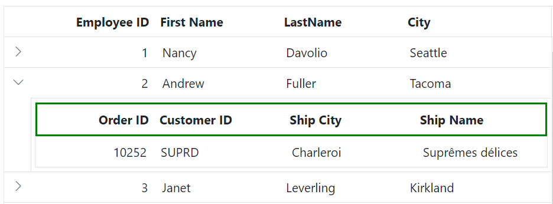

**Customizing the Detail Grid Header Cell**

To customize the appearance of header cell elements in the detail grid, use the following CSS:

```css
.e-detailcell .e-grid .e-headercontent .e-headercell{
    color: #ffffff;
    background-color: #1ea8bd;
}
```
In this example, the `.e-headercell` class targets the header cells within the detail grid. Adjust the `color` and `background-color` properties to match the application's design requirements.

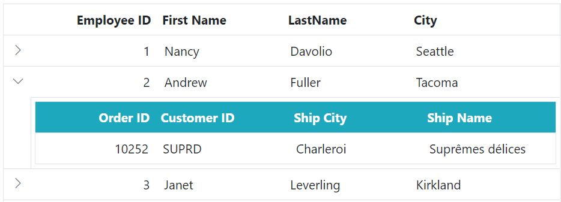

**Customizing the Detail Grid Header Cell Div Element**

To customize the appearance of the header cell div element in the detail grid, use the following CSS:

```css
.e-detailcell .e-grid .e-headercelldiv {
    font-size: 15px;
    font-weight: bold;
    color: darkblue;
}
```
In this example, the `.e-headercelldiv` class targets the div element within the header cell of the detail grid. The `font-size`, `font-weight`, and `color` properties control the styling of the header text content.

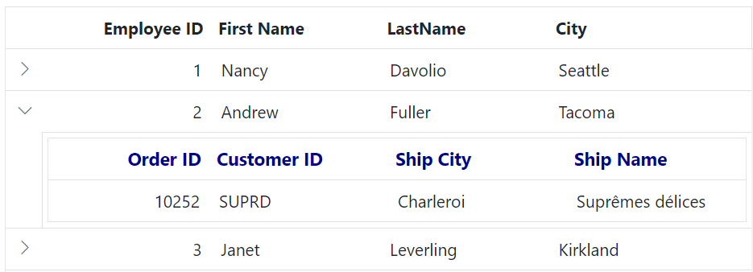

### Paging

Customize paging elements in the detail grid using CSS. The following examples style the pager root, container, navigation elements, numeric links, and current page indicator.

**Customizing the Detail Grid Pager Root Element**

To customize the appearance of the pager root element in the detail grid, use the following CSS:

```css
.e-detailcell .e-grid  .e-gridpager {
    font-family: cursive;
    background-color: #deecf9;
}
```
In this example, the `.e-detailcell` class targets the detail grid, and `.e-gridpager` targets the pager root element. The `font-family` and `background-color` properties control the font style and background color of the pager section.

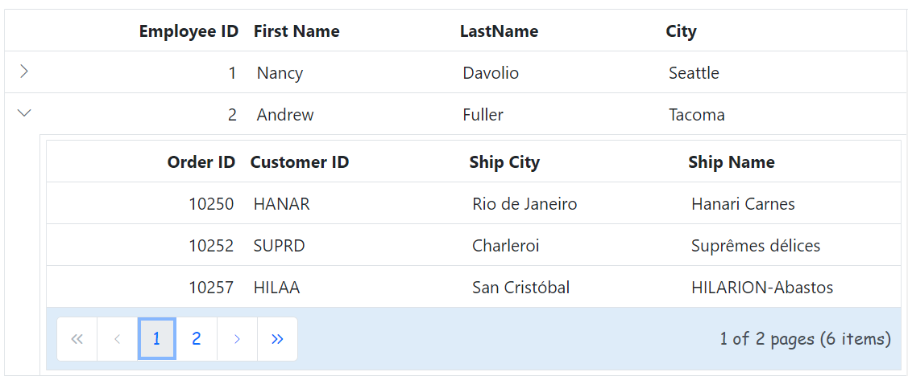

**Customizing the Detail Grid Pager Container Element**

To customize the appearance of the pager container element in the detail grid, use the following CSS:

```css
.e-detailcell .e-grid .e-pagercontainer {
    border: 2px solid #00b5ff;
    font-family: cursive;
}
```
In this example, the `.e-pagercontainer` class targets the pager container element within the detail grid. The `border` and `font-family` properties control the border styling and font appearance of the pager container.

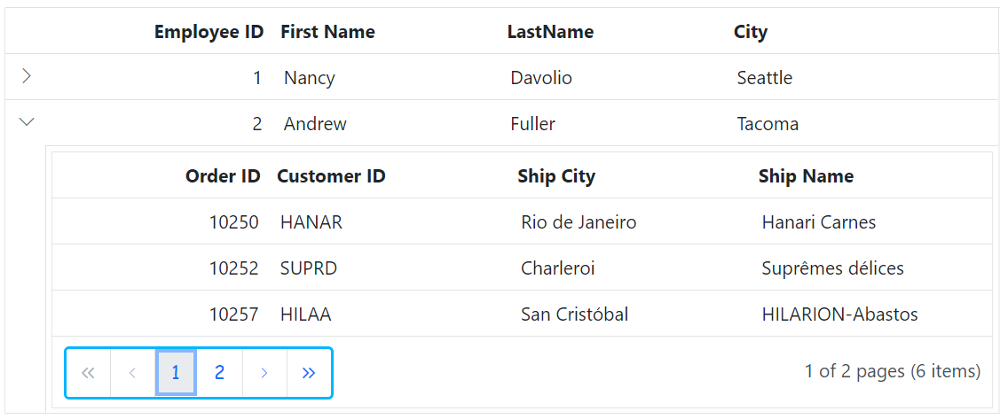

**Customizing the Detail Grid Pager Navigation Elements**

To customize the appearance of the detail Grid pager navigation elements, use the following CSS code:

```css
.e-detailcell .e-grid .e-gridpager .e-prevpagedisabled,
.e-detailcell .e-grid .e-gridpager .e-prevpage,
.e-detailcell .e-grid .e-gridpager .e-nextpage,
.e-detailcell .e-grid .e-gridpager .e-nextpagedisabled,
.e-detailcell .e-grid .e-gridpager .e-lastpagedisabled,
.e-detailcell .e-grid .e-gridpager .e-lastpage,
.e-detailcell .e-grid .e-gridpager .e-firstpage,
.e-detailcell .e-grid .e-gridpager .e-firstpagedisabled {
    background-color: #deecf9;
}
```

In this example, the classes `.e-prevpagedisabled`, `.e-prevpage`, `.e-nextpage`, `.e-nextpagedisabled`, `.e-lastpagedisabled`, `.e-lastpage`, `.e-firstpage`, and `.e-firstpagedisabled` target the various pager navigation elements of the detail Grid. Modify the `background-color` property to change the background color of these elements.

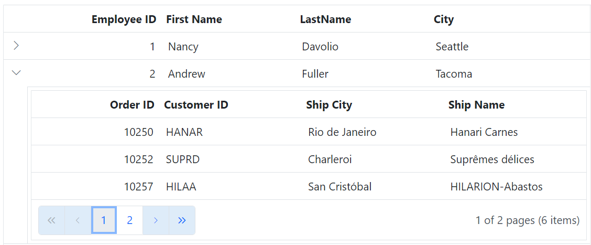

**Customizing the Detail Grid Pager Page Numeric Link Elements**

To customize the appearance of the detail Grid pager current page numeric link elements, use the following CSS code:

```css
.e-detailcell .e-grid .e-gridpager .e-numericitem {
    background-color: #5290cb;
    color: #ffffff;
    cursor: pointer;
}

.e-detailcell .e-grid .e-gridpager .e-numericitem:hover {
    background-color: white;
    color: #007bff;
}
```

In this example, the `.e-numericitem` class targets the page numeric link elements. Modify the `background-color` and `color` properties to change the background and text color of these elements.

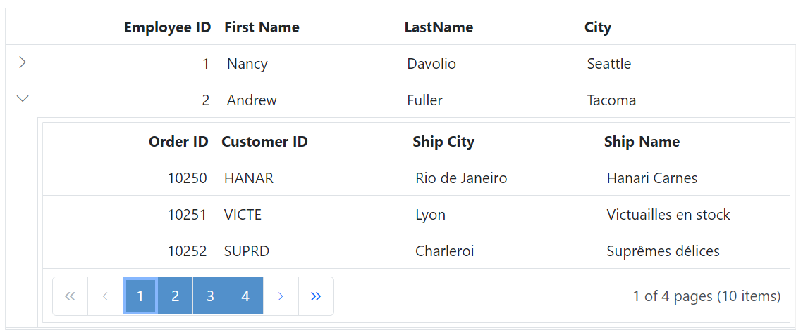

**Customizing the Detail Grid Pager Current Page Numeric Element**

To customize the appearance of the detail Grid pager current page numeric element, use the following CSS code:

```css
.e-detailcell .e-grid .e-gridpager .e-currentitem {
    background-color: #0078d7;
    color: #fff;
}
```

In this example, the `.e-currentitem` class targets the current page numeric item. Modify the `background-color` property to change the background color of this element and the `color` property to change the text color.

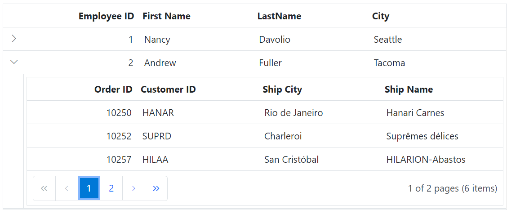

### Sorting

Customize sorting icons and multi-sorting indicators in the detail grid using CSS. Icon glyphs can vary by theme; refer to the Syncfusion<sup style="font-size:70%">&reg;</sup> [icons](https://blazor.syncfusion.com/documentation/appearance/icons#bootstrap-5) for theme-specific codes.

**Customizing the Detail Grid Sorting Icon**

To customize the sorting icon that appears in the detail Grid header when sorting is applied, use the following CSS code:

```css
.e-detailcell .e-grid .e-icon-ascending::before {
    content: '\e7a3';
    /* Icon code for ascending order */
}

.e-detailcell .e-grid .e-icon-descending::before {
    content: '\e7b6';
    /* Icon code for descending order */
}
```

In this example, the `.e-detailcell` class targets the detail Grid. The `.e-icon-ascending::before` class targets the sorting icon for ascending order, and the `.e-icon-descending::before` class targets the sorting icon for descending order.

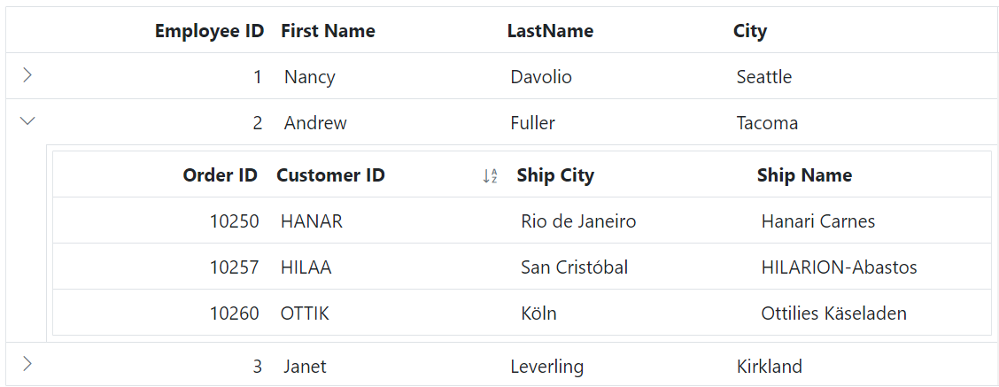

**Customizing the Detail Grid Multi Sorting Icon**

To customize the multi sorting icon that appears in the detail Grid header when multiple columns are sorted, use the following CSS code:

```css
.e-detailcell .e-grid .e-sortnumber {
    background-color: #deecf9;
    font-family: cursive;
}
```

In this example, the `.e-sortnumber` class targets the background color and font family of the multi sorting icon. Modify the `background-color` and `font-family` properties to customize the appearance of the multi sorting icon.

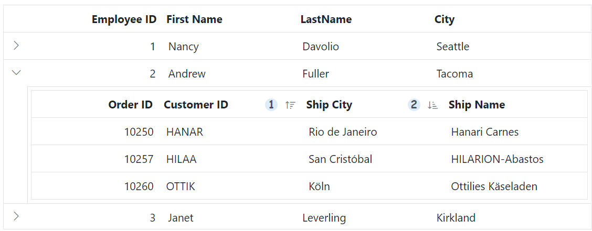

### Filtering

Customize filtering elements in the detail grid using CSS. The following examples apply to the filter bar and Excel/menu filter UI depending on the configured filter mode.

**Customizing the Detail Grid Filter Bar Cell Element**

To customize the appearance of the filter bar cell element in the detail Grid header, use the following CSS code:

```css
.e-detailcell .e-grid .e-filterbar .e-filterbarcell {
  background-color: #045fb4;
}
```

In this example, the `.e-detailcell` class targets the detail Grid, and the `.e-filterbarcell` class targets the filter bar cell element in the header. Modify the `background-color` property to change the color of the filter bar cell element.

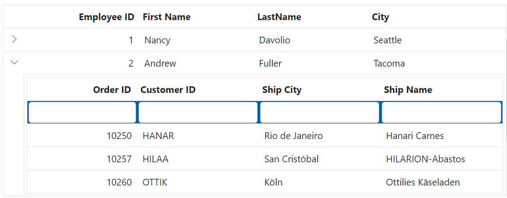

**Customizing the Detail Grid Filter Bar Input Element**

To customize the appearance of the filter bar input element in the detail Grid header, use the following CSS code:

```css
.e-detailcell .e-grid .e-filterbarcell .e-input-group input.e-input{
    font-family: cursive;
}
```

In this example, the `.e-filterbarcell` class targets the filter bar cell element, and the `.e-input` class targets the input element within the cell. Modify the `font-family` property to change the font of the filter bar input element.

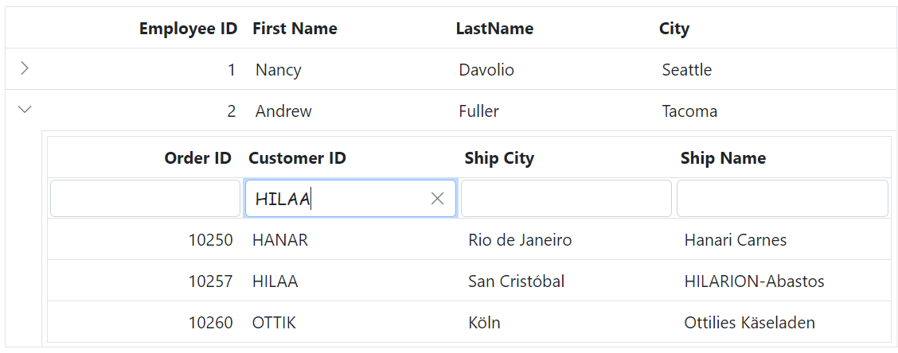

**Customizing the Detail Grid Filter Bar Input Focus**

To customize the appearance of the detail Grid's filter bar input element focus highlight, use the following CSS code:

```css
.e-detailcell .e-grid .e-filterbarcell .e-input-group.e-input-focus{
    background-color: #deecf9;
}
```

In this example, the `.e-filterbarcell` class targets the filter bar cell element, and the .e-input-group.`e-input-focus` class targets the focused input element. Modify the `background-color` property to change the color of the focus highlight.

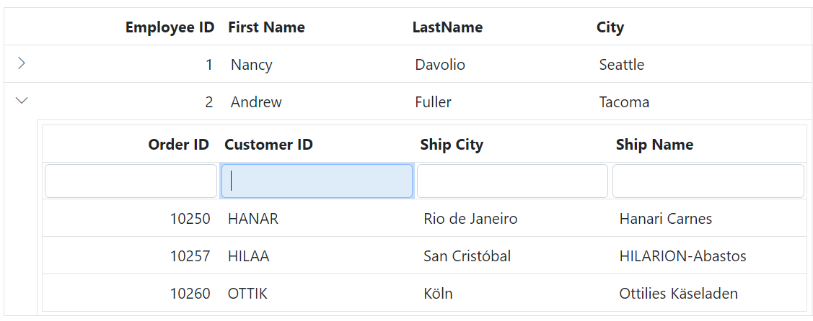

**Customizing the Detail Grid Filter Bar Input Clear Icon**

To customize the appearance of the detail Grid's filter bar input element clear icon, use the following CSS code:

```css
.e-detailcell .e-grid .e-filterbarcell .e-input-group .e-clear-icon::before {
    content: '\e72c';
}
```

In this example, the `.e-clear-icon` class targets the clear icon element within the input group. Modify the `content` property to change the icon displayed.

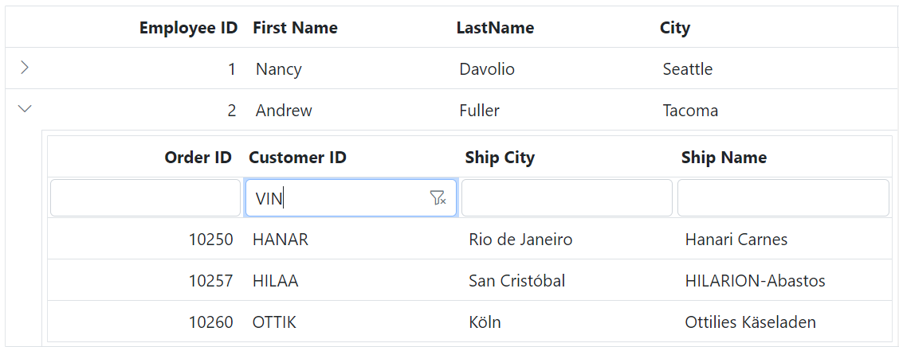

**Customizing the Detail Grid Filtering Icon**

To customize the appearance of the filtering icon in the detail Grid header, use the following CSS code:

```css
.e-detailcell .e-grid .e-icon-filter::before{
    content: '\e81e';
}
```

In this example, the `.e-icon-filter` class targets the filtering icon element. Modify the `content` property to change the icon displayed.

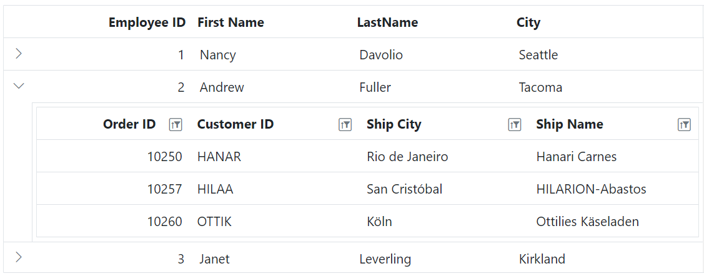

**Customizing the Detail Grid Filter Dialog Content**

To customize the appearance of the detail Grid's filter dialog content element, use the following CSS code:

```css
.e-detailcell .e-grid .e-filter-popup .e-dlg-content {
    background-color: #deecf9;
}
```

In this example, the `.e-filter-popup .e-dlg-content` classes target the content element within the filter dialog. Modify the `background-color` property to change the color of the dialog's content.

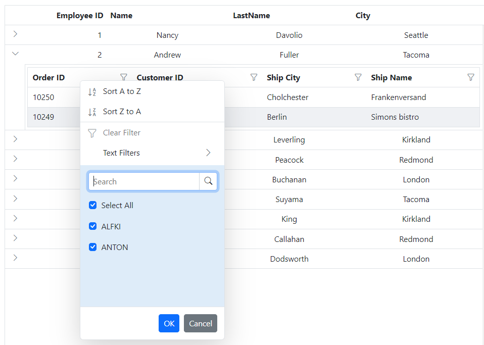

**Customizing the Detail Grid Filter Dialog Footer**

To customize the appearance of the detail Grid's filter dialog footer element, use the following CSS code:

```css
.e-detailcell .e-grid .e-filter-popup .e-footer-content {
    background-color: #deecf9;
}
```

In this example, the `.e-filter-popup .e-footer-content `classes target the footer element within the filter dialog. Modify the `background-color` property to change the color of the dialog's footer.

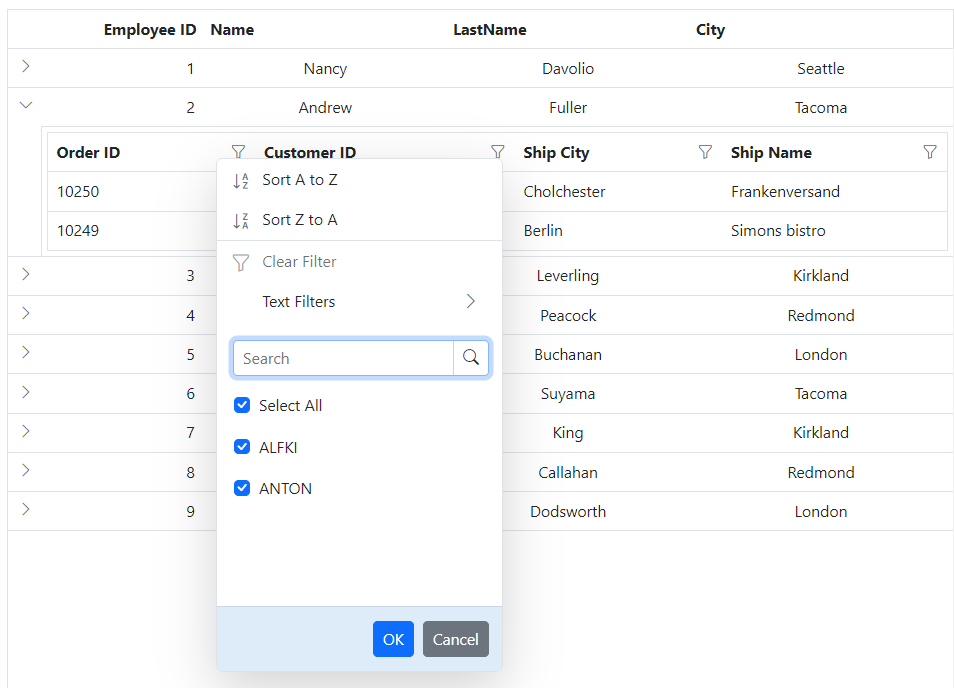

**Customizing the Detail Grid Filter Dialog Input Element**

To customize the appearance of the detail Grid's filter dialog input elements, use the following CSS code:

```css
.e-detailcell .e-grid .e-filter-popup .e-input-group input.e-input{
    font-family: cursive;
}
```

In this example, the **.e-filter-popup** class targets the filter dialog, and the **.e-input** class targets the input elements within the dialog. Modify the `font-family` property to change the font of the input elements.


**Customizing the Detail Grid Filter Dialog Button Element**

To customize the appearance of the detail Grid's filter dialog button elements, use the following CSS code:

```css
.e-detailcell .e-grid .e-filter-popup .e-btn{
    font-family: cursive;
}
```

In this example, the `.e-filter-popup` class targets the filter dialog, and the `.e-btn` class targets the button elements within the dialog. Modify the `font-family` property to change the font of the button elements.

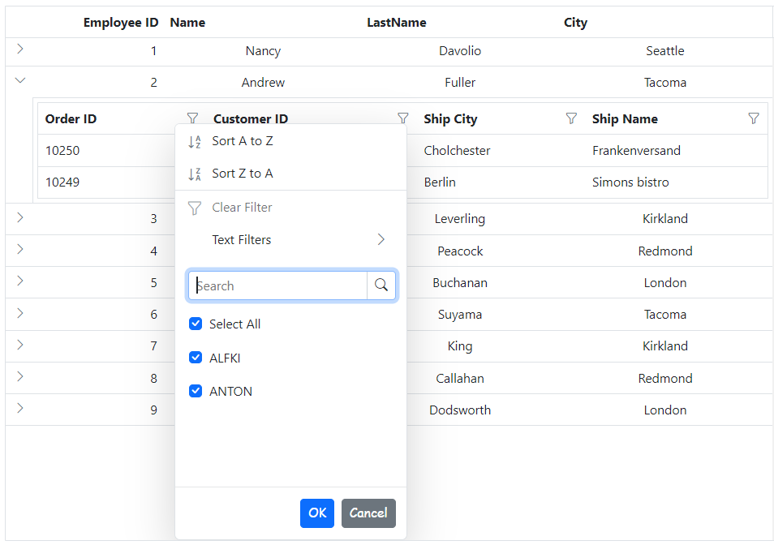

**Customizing the Detail Grid Excel Filter Dialog Number Filters Element**

To customize the appearance of the Excel filter dialog's number filters in the detail Grid, use the following CSS code:

```css
.e-detailcell .e-grid .e-filter-popup .e-contextmenu {
    background-color: #deecf9;
}
```

In this example, the `.e-filter-popup .e-contextmenu` classes target the number filter elements within the Excel filter dialog. Modify the `background-color` property to change the color of these elements.

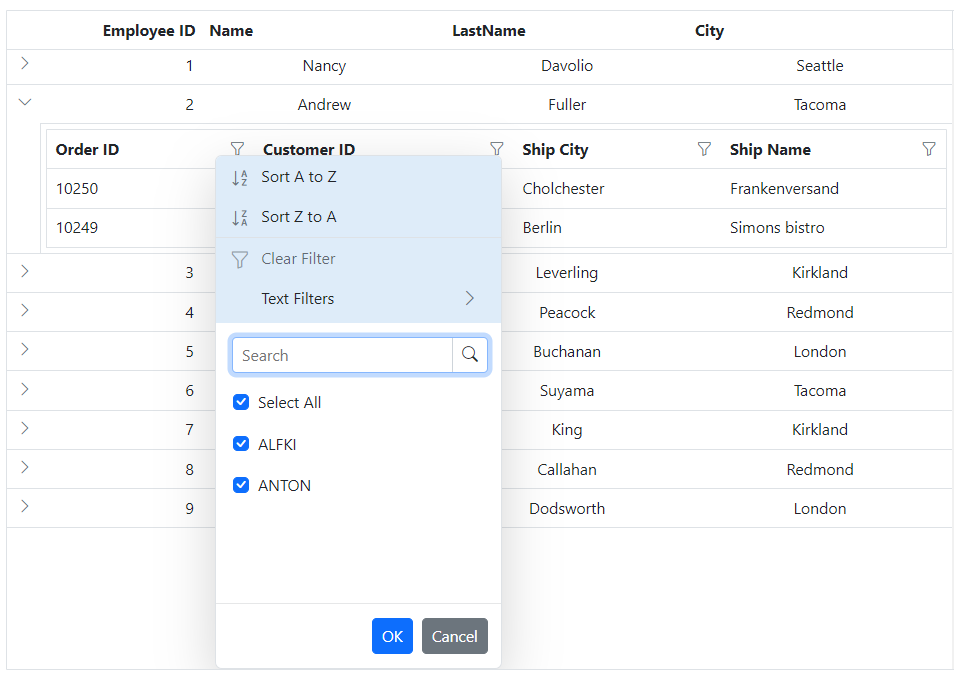

### Grouping

Customize grouping elements in the detail grid using CSS. The following examples style the group header, expand/collapse icons, caption row, and indent cell.

**Customizing the Detail Grid Group Header**

To customize the appearance of the detail Grid's group header element, use the following CSS code:

```css
.e-detailcell .e-grid .e-groupdroparea {
    background-color: #132f49;
}
```

In this example, the `.e-detailcell` class targets the detail Grid and the `.e-groupdroparea` class targets the group header element. Modify the `background-color` property to change the color of the group header.

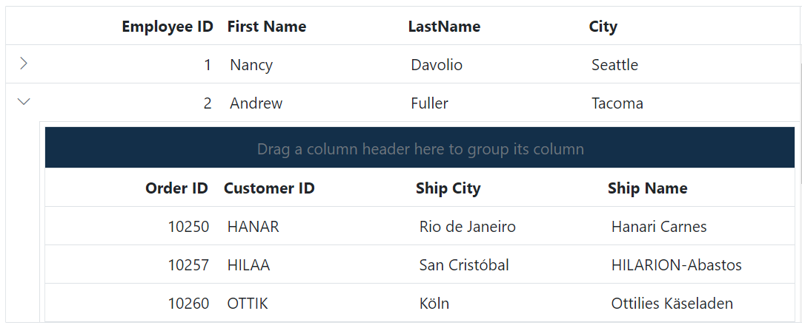

**Customizing the Detail Grid Group Expand or Collapse Icons**

To customize the appearance of the group expand/collapse icons in the detail Grid, use the following CSS code:

```css
.e-detailcell .e-grid .e-icon-gdownarrow::before{
    content:'\e7c9'
}
.e-detailcell .e-grid .e-icon-grightarrow::before{
    content:'\e80f'
}
```

In this example, the `.e-icon-gdownarrow` and `.e-icon-grightarrow` classes target the expand and collapse icons, respectively. Modify the `content` property to change the icon displayed. You can use the available [Syncfusion<sup style="font-size:70%">&reg;</sup> icons](https://blazor.syncfusion.com/documentation/appearance/icons) based on your theme.

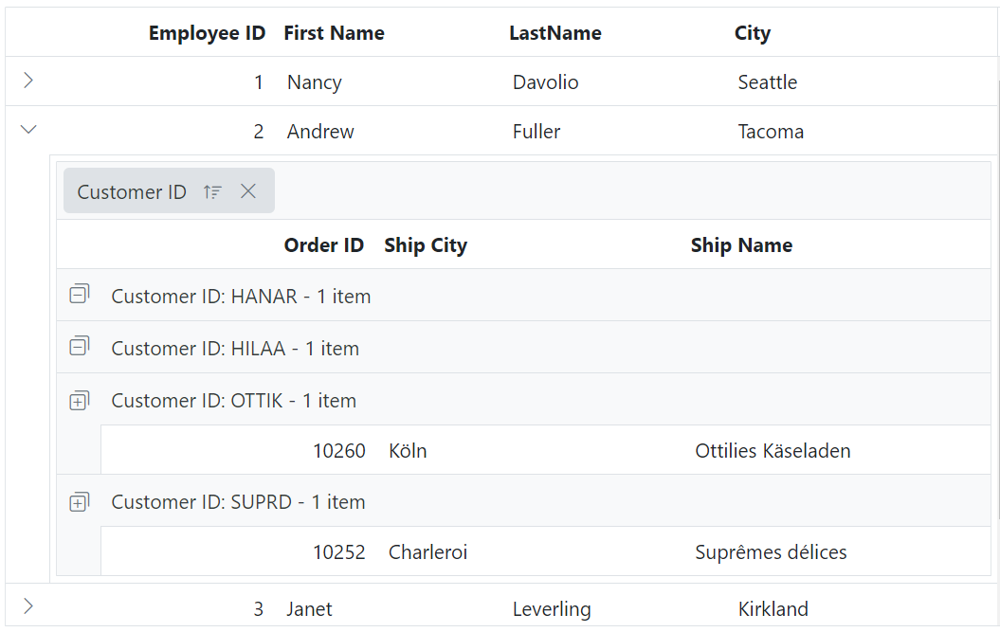

**Customizing the Detail Grid Group Caption Row**

To customize the appearance of the detail Grid's group caption row and the icons indicating record expansion or collapse, use the following CSS code:

```css
.e-detailcell .e-grid .e-groupcaption {
    background-color: #deecf9;
}

.e-detailcell .e-grid .e-recordplusexpand,
.e-detailcell .e-grid .e-recordpluscollapse {
    background-color: #deecf9;
}
```

In this example, the `.e-groupcaption` class targets the group caption row element, and the `.e-recordplusexpand` and `.e-recordpluscollapse` classes target the icons indicating record expansion or collapse. Modify the `background-color` property to change the color of these elements.

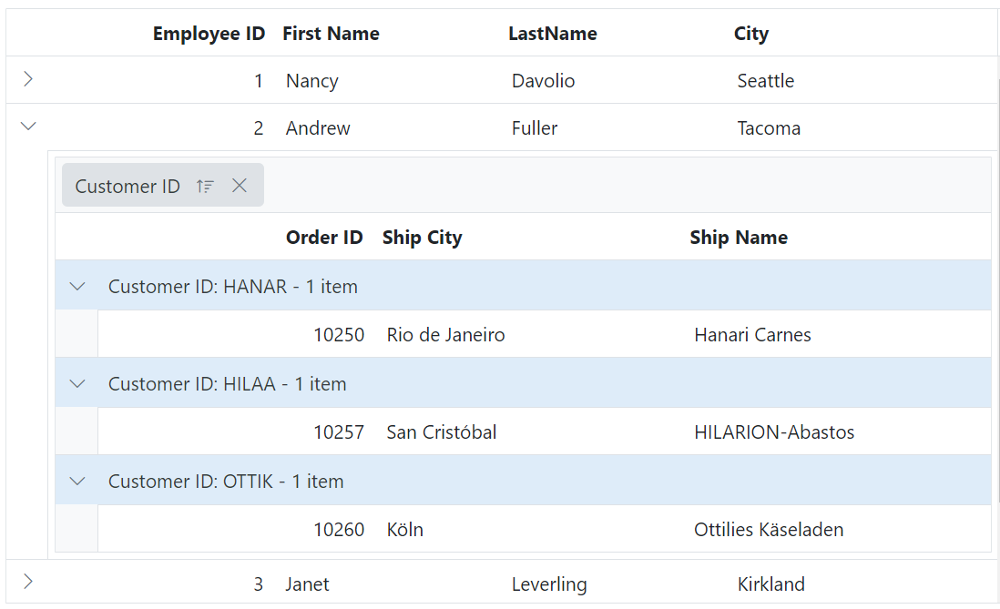

**Customizing the Detail Grid Grouping Indent Cell**

To customize the appearance of the detail Grid's grouping indent cell element, use the following CSS code:

```css
.e-detailcell .e-grid .e-indentcell {
    background-color: #deecf9;
}
```

In this example, the **.e-indentcell** class targets the grouping indent cell element. Modify the `background-color` property to change the color of the indent cell.

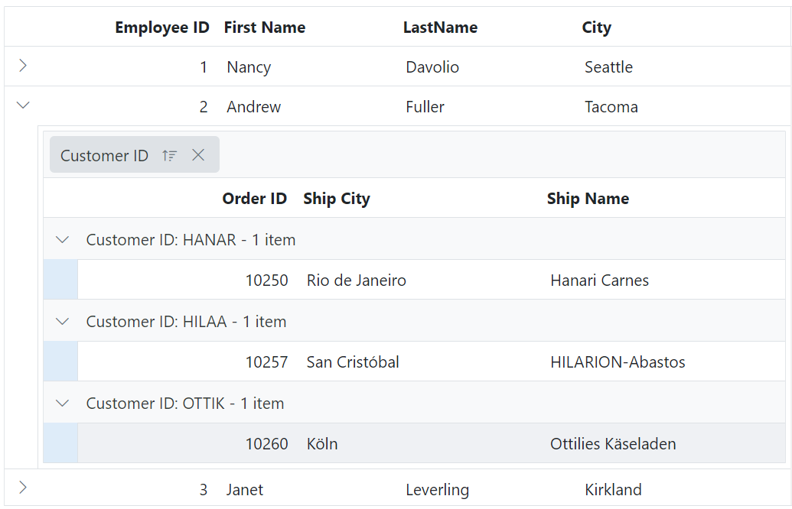

### Toolbar

Customize the toolbar appearance in the detail grid using CSS. The following examples style the toolbar root and button elements.

**Customizing the Detail Grid toolbar Root Rlement**

To customize the appearance of the detail Grid's toolbar root element, use the following CSS code:

```css
.e-detailcell .e-grid .e-toolbar-items {
    background-color: #deecf9;
}
```

In this example, the `.e-detailcell` class targets the detail Grid and the `.e-toolbar-items` class targets the background color of the toolbar root element. Modify the `background-color` property to change the background color of the toolbar.

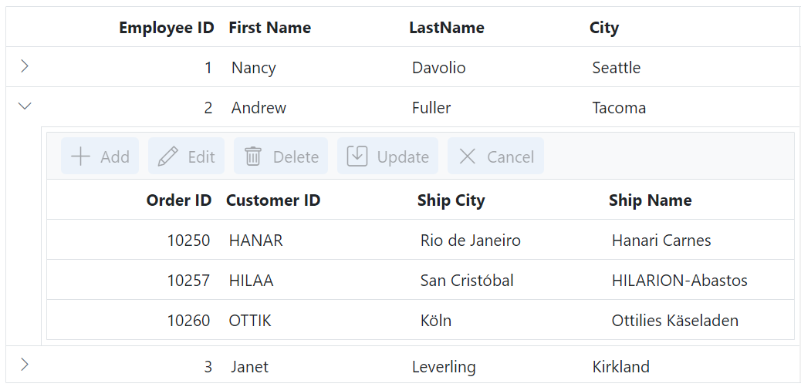

**Customizing the Detail Grid Toolbar Button Element**

To customize the appearance of the detail Grid's toolbar buttons, use the following CSS code:

```css
.e-detailcell .e-grid .e-toolbar .e-btn {
    background-color: #deecf9;
}
```

In this example, the `.e-toolbar .e-btn` selector targets the background color of the toolbar button elements. Modify the `background-color` property to change the background color of the toolbar buttons.

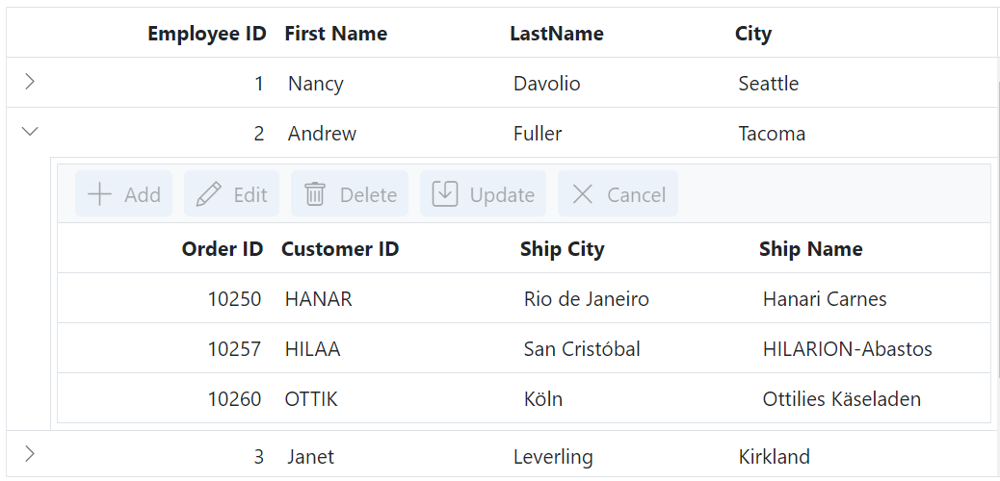

### Editing

Customize editing-related elements in the detail grid using CSS. The following examples style edited/added rows, inputs, edit dialog, and command buttons.

**Customizing the Detail Grid Edited and Added Row Element**

To customize the appearance of edited and added row table elements in the detail Grid, use the following CSS code:

```css
.e-detailcell .e-grid .e-editedrow table, 
.e-detailcell .e-grid .e-addedrow table {
	background-color: #62b2eb;
}
```
In this example, the `.e-editedrow` class represents the edited row element, and the `.e-addedrow` class represents the added row element. Modify the `background-color` property to change the color of these row table elements.

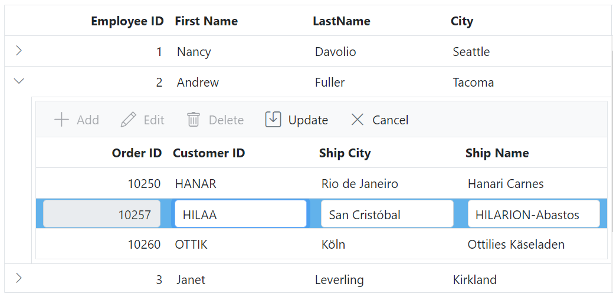
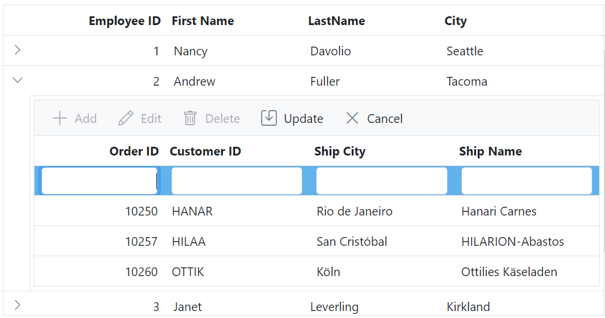

**Customizing the Detail Grid Edited Row Input Element**

To customize the appearance of edited row input elements in the detail Grid, use the following CSS code:

```css
.e-detailcell .e-grid .e-editedrow .e-input-group input.e-input{
  font-family: cursive;
  color:rgb(214, 33, 123)
}
```
In this example, the `.e-editedrow` class represents the edited row element, and the `.e-input` class targets the input elements within the form. Modify the `font-family` property to change the font and the `color` property to change the text color of the input elements.

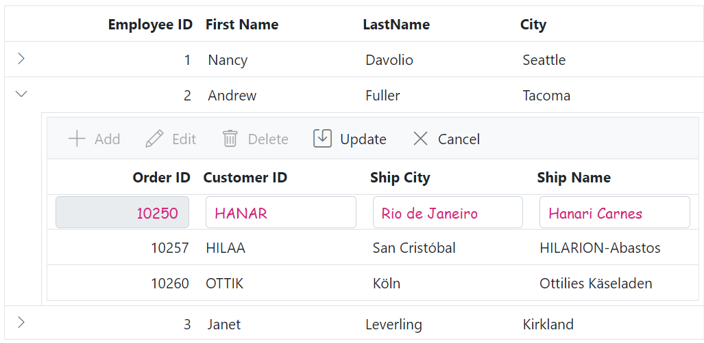

**Customizing the Detail Grid Edit Dialog Header Element**

To customize the appearance of the edit dialog header element in the detail Grid, use the following CSS code:

```css
.e-edit-dialog .e-dlg-header-content {
    background-color: #deecf9;
}
```
In this example, the `.e-edit-dialog` class represents the edit dialog, and the `.e-dlg-header-content` class targets the header content within the dialog. Modify the `background-color` property to change the color of the header element.

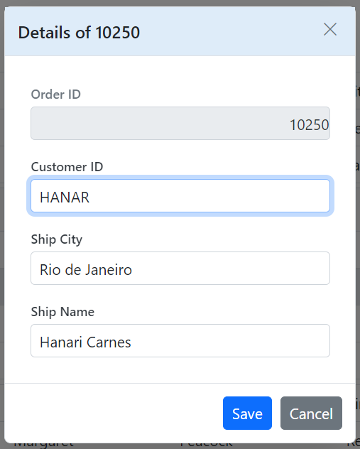

**Customizing the Detail Grid Command Column Buttons**

To customize the appearance of the detail Grid's command column buttons such as `Edit`, `Delete`, `Update`, and `Cancel`, use the following CSS code:

```css
.e-detailcell .e-grid .e-delete::before ,.e-grid .e-cancel-icon::before{
    color: #f51717;
}
.e-detailcell .e-grid .e-edit::before, .e-grid .e-update::before {
    color: #077005;
}
```
In this example, the `.e-edit`, `.e-delete`, `.e-update`, and `.e-cancel-icon` classes represent the respective command column buttons. Modify the `color` property to change the color of these buttons.

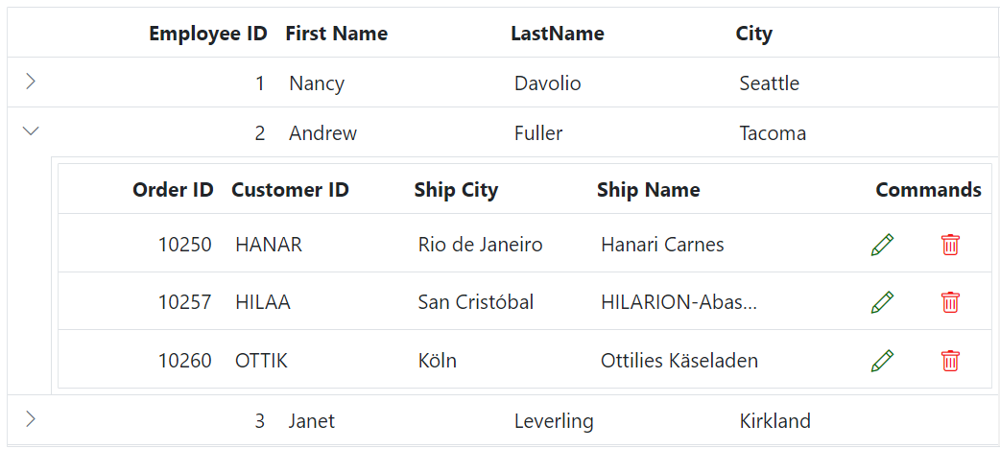
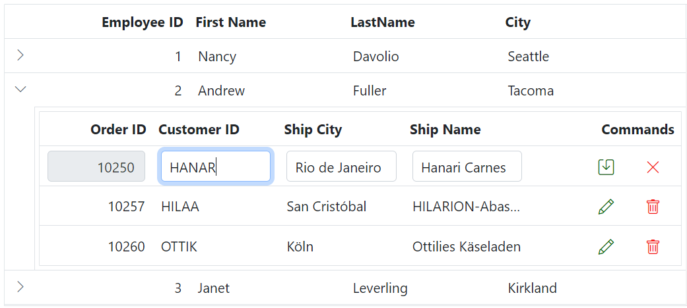

### Aggregate

Customize aggregate elements in the detail grid using CSS. The following examples style the aggregate root and aggregate cells.

**Customizing the Detail Grid Aggregate Root Element**

To customize the appearance of the detail Grid's aggregate root elements, use the following CSS code:


```css
.e-detailcell .e-grid .e-gridfooter {
    font-family: cursive;
}
```

In this example, the `.e-gridfooter` class represents the root element of the aggregate row in the grid footer. Modify the `font-family` property to change the font of the aggregate root element.

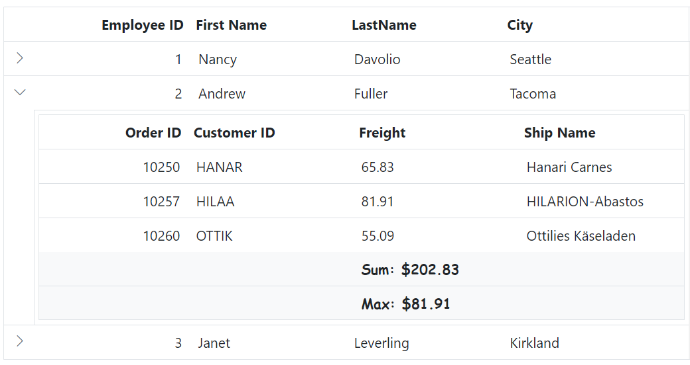

**Customizing the Detail Grid Aggregate Cell Elements**

To customize the appearance of the detail Grid's aggregate cell elements (summary row cell elements), use the following CSS code:

```css
.e-detailcell .e-grid .e-summaryrow .e-summarycell {
    background-color: #deecf9;
}
```

In this example, the `.e-summaryrow` class represents the summary row containing aggregate cells, and the `.e-summarycell` class targets individual aggregate cells within the summary row. Modify the `background-color` property to change the color of the aggregate cell elements.

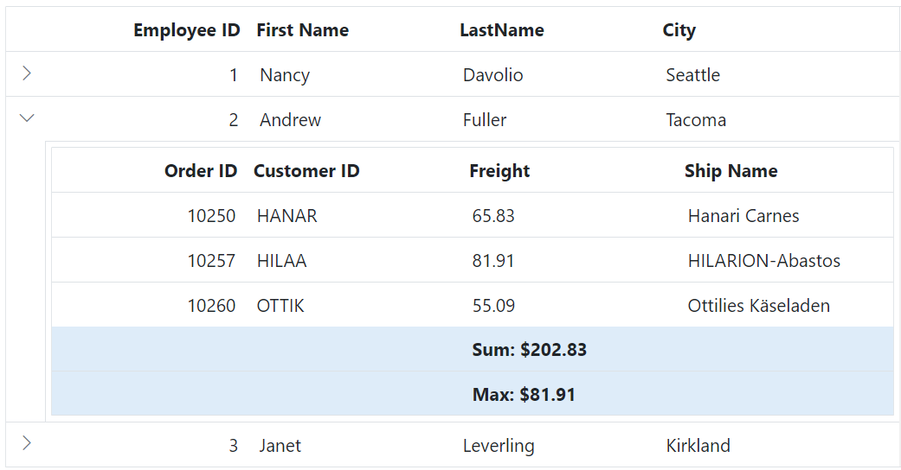

### Selection

Customize selection styles in the detail grid using CSS. The following examples style row selection, cell selection, and column selection backgrounds.

**Customizing the Detail Grid Row Selection Background**

To customize the appearance of the detail Grid's row selection, use the following CSS code:

```css
.e-detailcell .e-grid td.e-selectionbackground {
    background-color: #00b7ea;
}
```
In this example, the `.e-selectionbackground` class targets the background color of the selected rows in the detail Grid. Modify the `background-color` property to change the appearance of the selected row background.

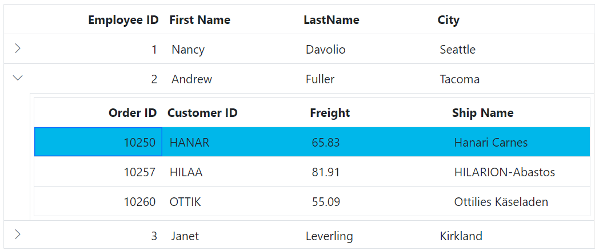

**Customizing the Detail Grid Cell Selection Background**

To customize the appearance of the detail Grid's cell selection, use the following CSS code:

```css
.e-detailcell .e-grid td.e-cellselectionbackground {
    background-color: #00b7ea;
}
```

In this example, the `.e-cellselectionbackground` class targets the background color of the selected cells. Modify the `background-color` property to change the appearance of the selected cell background.

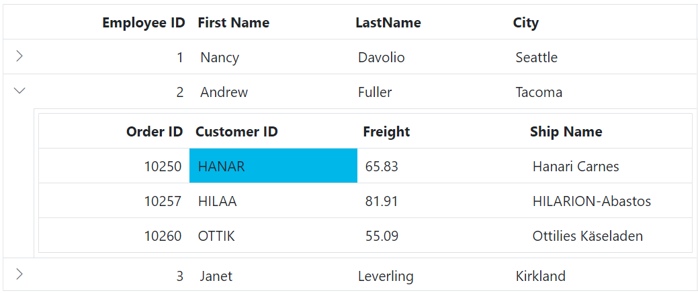

## Limitations

Detail template is not supported with the following features:

* Frozen rows and columns
* Immutable mode
* Infinite scrolling
* Virtual scrolling
* Print
* Row template
* Row spanning
* Column spanning
* Lazy load grouping
* State persistence