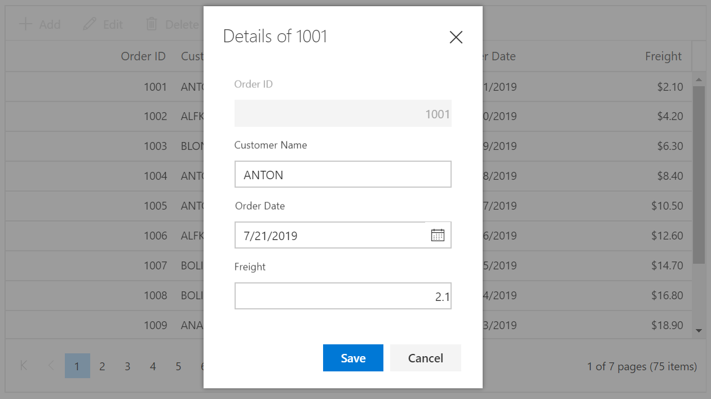
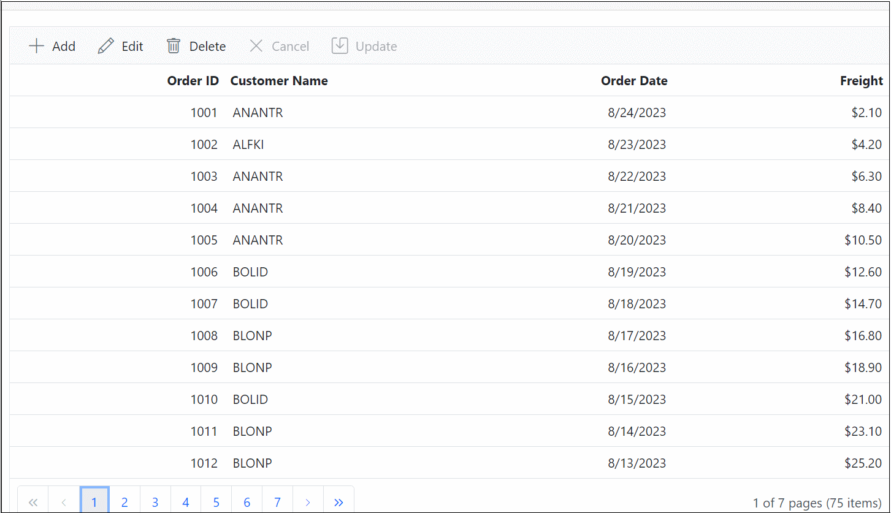

# Dialog Editing in Blazor DataGrid Component

In dialog edit mode, when you start editing the currently selected row data will be shown on a dialog. You can change the cell values and save edited data to the data source. To enable Dialog edit, set the [EditSettings.Mode](https://help.syncfusion.com/cr/blazor/Syncfusion.Blazor.Grids.GridEditSettings.html#Syncfusion_Blazor_Grids_GridEditSettings_Mode) as **Dialog**.

```cshtml
@using Syncfusion.Blazor.Grids

<SfGrid DataSource="@Orders" AllowPaging="true" Toolbar="@(new List<string>() { "Add", "Edit", "Delete", "Update", "Cancel" })" Height="315">
    <GridEditSettings AllowAdding="true" AllowEditing="true" AllowDeleting="true" Mode="EditMode.Dialog"></GridEditSettings>
    <GridColumns>
        <GridColumn Field=@nameof(Order.OrderID) HeaderText="Order ID" IsPrimaryKey="true" ValidationRules="@(new ValidationRules{ Required=true})" TextAlign="TextAlign.Right" Width="120"></GridColumn>
        <GridColumn Field=@nameof(Order.CustomerID) HeaderText="Customer Name" ValidationRules="@(new ValidationRules{ Required=true})" Width="120"></GridColumn>
        <GridColumn Field=@nameof(Order.OrderDate) HeaderText=" Order Date" EditType="EditType.DatePickerEdit" Format="d" TextAlign="TextAlign.Right" Width="130" Type="ColumnType.Date"></GridColumn>
        <GridColumn Field=@nameof(Order.Freight) HeaderText="Freight" Format="C2" TextAlign="TextAlign.Right" EditType="EditType.NumericEdit" Width="120"></GridColumn>
        <GridColumn Field=@nameof(Order.ShipCountry) HeaderText="Ship Country" EditType="EditType.DropDownEdit" Width="150"></GridColumn>
    </GridColumns>
</SfGrid>

@code{
    public List<Order> Orders { get; set; }

    protected override void OnInitialized()
    {
        Orders = Enumerable.Range(1, 75).Select(x => new Order()
        {
            OrderID = 1000 + x,
            CustomerID = (new string[] { "ALFKI", "ANANTR", "ANTON", "BLONP", "BOLID" })[new Random().Next(5)],
            Freight = 2.1 * x,
            OrderDate = DateTime.Now.AddDays(-x),
            ShipCountry = (new string[] { "USA", "UK", "CHINA", "RUSSIA", "INDIA" })[new Random().Next(5)]
        }).ToList();
    }

    public class Order
    {
        public int? OrderID { get; set; }
        public string CustomerID { get; set; }
        public DateTime? OrderDate { get; set; }
        public double? Freight { get; set; }
        public string ShipCountry { get; set; }
    }
}

```

The following screenshot represents Editing in Dialog Mode.



## Customize the edit dialog

You can use [HeaderTemplate](https://help.syncfusion.com/cr/blazor/Syncfusion.Blazor.Grids.GridEditSettings.html#Syncfusion_Blazor_Grids_GridEditSettings_HeaderTemplate) and [FooterTemplate](https://help.syncfusion.com/cr/blazor/Syncfusion.Blazor.Grids.GridEditSettings.html#Syncfusion_Blazor_Grids_GridEditSettings_FooterTemplate) of the [GridEditSettings](https://help.syncfusion.com/cr/blazor/Syncfusion.Blazor.Grids.GridEditSettings.html) component to customize the appearance of edit dialog.

In the below example we have changed the dialog's header text and footer button content for editing and adding records.

```cshtml
@using Syncfusion.Blazor.Buttons
@using Syncfusion.Blazor.Grids

<SfGrid @ref="Grid" DataSource="@Orders" AllowPaging="true" Toolbar="@(new List<string>() { "Add", "Edit", "Delete", "Update", "Cancel" })" Height="315">
    <GridEditSettings AllowAdding="true" AllowEditing="true" AllowDeleting="true" Mode="EditMode.Dialog">
        <HeaderTemplate>
            @{
                var text = GetHeader((context as Order));
                <span>@text</span>
            }
        </HeaderTemplate>
        <FooterTemplate>
            <SfButton OnClick="@Save" IsPrimary="true">@ButtonText</SfButton>
            <SfButton OnClick="@Cancel">Cancel</SfButton>
        </FooterTemplate>
    </GridEditSettings>
    <GridColumns>
        <GridColumn Field=@nameof(Order.OrderID) HeaderText="Order ID" IsPrimaryKey="true" ValidationRules="@(new ValidationRules { Required = true })" TextAlign="TextAlign.Right" Width="120"></GridColumn>
        <GridColumn Field=@nameof(Order.CustomerID) HeaderText="Customer Name" ValidationRules="@(new ValidationRules { Required = true })" Width="120"></GridColumn>
        <GridColumn Field=@nameof(Order.OrderDate) HeaderText=" Order Date" EditType="EditType.DatePickerEdit" Format="d" TextAlign="TextAlign.Right" Width="130" Type="ColumnType.Date"></GridColumn>
        <GridColumn Field=@nameof(Order.Freight) HeaderText="Freight" Format="C2" TextAlign="TextAlign.Right" EditType="EditType.NumericEdit" Width="120"></GridColumn>
        <GridColumn Field=@nameof(Order.ShipCountry) HeaderText="Ship Country" EditType="EditType.DropDownEdit" Width="150"></GridColumn>
    </GridColumns>
</SfGrid>

@code{
    SfGrid<Order> Grid { get; set; }
    public List<Order> Orders { get; set; }
    public string Header { get; set; }
    public string ButtonText { get; set; }
    public string GetHeader(Order Value)
    {
        if (Value.OrderID == null)
        {
            ButtonText = "Insert";
            return "Insert New Order";
        }
        else
        {
            ButtonText = "Save Changes";
            return "Edit Record Details of " + Value.OrderID.ToString();
        }
    }
    public async Task Cancel()
    {
        await Grid.CloseEdit();     //Cancel editing action
    }
    public async Task Save()
    {
        await Grid.EndEdit();       //Save the edited/added data to Grid
    }
    protected override void OnInitialized()
    {
        Orders = Enumerable.Range(1, 75).Select(x => new Order()
        {
            OrderID = 1000 + x,
            CustomerID = (new string[] { "ALFKI", "ANANTR", "ANTON", "BLONP", "BOLID" })[new Random().Next(5)],
            Freight = 2.1 * x,
            OrderDate = DateTime.Now.AddDays(-x),
            ShipCountry = (new string[] { "USA", "UK", "CHINA", "RUSSIA", "INDIA" })[new Random().Next(5)]
        }).ToList();
    }

    public class Order
    {
        public int? OrderID { get; set; }
        public string CustomerID { get; set; }
        public DateTime? OrderDate { get; set; }
        public double? Freight { get; set; }
        public string ShipCountry { get; set; }
    }
}
```

N> You can refer to our [Blazor DataGrid](https://www.syncfusion.com/blazor-components/blazor-datagrid) feature tour page for its groundbreaking feature representations. You can also explore our [Blazor DataGrid example](https://blazor.syncfusion.com/demos/datagrid/overview?theme=bootstrap4) to understand how to present and manipulate data.

## Implement calculated column inside grid dialog editing

You can perform calculations based on the field values available in the grid's dialog edit form and display the results in another field.

In the following sample, the `SfNumericTextBox` component is rendered inside the dialog edit form. We have updated the **Total** column value based on the **Price** and **Quantity** columns using the [ValueChange](https://help.syncfusion.com/cr/blazor/Syncfusion.Blazor.Inputs.NumericTextBoxEvents-1.html#Syncfusion_Blazor_Inputs_NumericTextBoxEvents_1_ValueChange) event of the `SfNumericTextBox` and the [OnActionBegin](https://help.syncfusion.com/cr/blazor/Syncfusion.Blazor.Grids.GridEvents-1.html#Syncfusion_Blazor_Grids_GridEvents_1_OnActionBegin) event of the Grid.

```cshtml
@using Syncfusion.Blazor.Grids
@using Action = Syncfusion.Blazor.Grids.Action
@using Syncfusion.Blazor.Inputs

<SfGrid DataSource="@Orders" AllowPaging="true" Toolbar="@(new List<string>() { "Add", "Edit", "Delete", "Update", "Cancel" })" Height="315" Width="900">
    <GridEvents OnActionComplete="OnActionComplete" OnActionBegin="OnActionBegin" TValue="Order"></GridEvents>
    <GridEditSettings AllowAdding="true" AllowEditing="true" AllowDeleting="true" Mode="EditMode.Dialog">
        <Template>
            @{
                var Order = (context as Order);
                <div>
                    <div class="form-row">
                        <div class="form-group col-md-6">
                            <SfNumericTextBox ID="Price" @ref="PriceRef" @bind-Value="@(Order.Price)" TValue="double" Placeholder="Price" FloatLabelType="FloatLabelType.Always">
                                <NumericTextBoxEvents ValueChange="ValueChange" TValue="double"></NumericTextBoxEvents>
                            </SfNumericTextBox>
                        </div>
                        <div class="form-group col-md-6">
                            <SfNumericTextBox ID="Quantity" @ref="QuantityRef" @bind-Value="@(Order.Quantity)" TValue="int?" Placeholder="Quantity" FloatLabelType="FloatLabelType.Always">
                                <NumericTextBoxEvents ValueChange="ValueChange" TValue="int?"></NumericTextBoxEvents>
                            </SfNumericTextBox>
                        </div>
                    </div>
                    <div class="form-row">
                        <div class="form-group col-md-6">
                            <SfNumericTextBox ID="Total" Value="@TotalValue" Enabled="false" TValue="double" Placeholder="Total" FloatLabelType="FloatLabelType.Always"></SfNumericTextBox>
                        </div>
                    </div>
                </div>
            }
        </Template>
    </GridEditSettings>
    <GridColumns>
        <GridColumn Field=@nameof(Order.CustomerID) HeaderText="Product Name" IsPrimaryKey="true" ValidationRules="@(new ValidationRules{ Required=true})" Width="100"></GridColumn>
        <GridColumn Field=@nameof(Order.Price) HeaderText="Price" Format="C2" ValidationRules="@(new ValidationRules{ Required=true})" Width="90" TextAlign="TextAlign.Right"></GridColumn>
        <GridColumn Field=@nameof(Order.Quantity) HeaderText="Quantity" ValidationRules="@(new ValidationRules{ Required=true})" Width="90" TextAlign="TextAlign.Right"></GridColumn>
        <GridColumn Field=@nameof(Order.Total) HeaderText="Total" Format="C2" TextAlign="TextAlign.Right" EditType="EditType.NumericEdit" Width="90"></GridColumn>
    </GridColumns>
</SfGrid>

@code{
    public List<Order> Orders { get; set; }
    SfNumericTextBox<double> PriceRef;
    SfNumericTextBox<int?> QuantityRef;
    protected override void OnInitialized()
    {
        Orders = Enumerable.Range(1, 8).Select(x => new Order()
        {
            CustomerID = (new string[] { "Chai", "Chang", "Aniseed Syrup", "Chef Anton's Cajun Seasoning", "Chef Anton's Gumbo Mix", "Coca-Cola", "Pepsi", "Nescafe" })[new Random().Next(8)],
            Price = 2.1 * x,
            Quantity = x,
            Total = (2.1 * x) * x
        }).ToList();
    }
    public double TotalValue { get; set; }
    public void OnActionComplete(ActionEventArgs<Order> args)
    {
        if (args.RequestType.Equals(Action.Add) || args.RequestType.Equals(Action.BeginEdit))
        {
            // Based on Add or Edit action disable the PreventRender.
            args.PreventRender = false;
        }
    }
    public void OnActionBegin(ActionEventArgs<Order> args)
    {
        if (args.RequestType.Equals(Action.Add) || args.RequestType.Equals(Action.BeginEdit))
        {
            TotalValue = args.Data.Total;
        }
        if (args.RequestType.Equals(Action.Save))
        {
            args.Data.Total = TotalValue;
        }
    }
    public void ValueChange()
    {
        TotalValue = Convert.ToDouble(PriceRef.Value * QuantityRef.Value);
    }

    public class Order
    {
        public string? CustomerID { get; set; }
        public double Price { get; set; }
        public int? Quantity { get; set; }
        public double Total { get; set; }
    }
}

```

N> You can find the fully working sample [here](https://github.com/SyncfusionExamples/blazor-datagrid-calculated-columns-inside-dialog-editing).

## Hiding Columns During Dialog Editing in Blazor Grid

To hide specific columns during the editing process in a Blazor Grid component.

In the provided sample, this demonstrates how to hide specific columns while editing a record in a Blazor Grid. During editing, the OnToolbarClick event and OnActionBegin event are triggered. Within these events, the default action is prevented, the index of the selected record is stored, and the hiding of columns for editing is initiated using the HideAndEdit function. Inside the HideAndEdit function, the code utilizes the Grid's HideColumnsAsync method to hide those columns. Subsequently, the Grid is refreshed to display the changes. Afterward, the OnActionComplete event is triggered. If the request type is "Refresh" and the StartEdit flag is set to "true," the code chooses the same row once again by employing the SelectRowAsync method, which was stored during the initial edit. This is followed by initiating editing using the StartEditAsync method. In case the request type is "Save" or "Cancel," the columns are displayed again after editing, facilitated by the ShowColumnsAsync method.

```csharp

@using Syncfusion.Blazor.Grids

<SfGrid @ref="Grid" DataSource="@Orders" AllowPaging="true" Toolbar="@(new List<string>() { "Add", "Edit", "Delete", "Cancel", "Update" })">
    <GridEditSettings AllowAdding="true" AllowEditing="true" AllowDeleting="true"  Mode="EditMode.Dialog"></GridEditSettings>
    <GridEvents OnToolbarClick="ToolbarClickHandler" OnActionBegin="ActionBeginHandler" OnActionComplete="ActionCompletedHandler" TValue="Order"></GridEvents>
    <GridColumns>
        <GridColumn Field=@nameof(Order.OrderID) HeaderText="Order ID" IsPrimaryKey="true" TextAlign="TextAlign.Right" Width="120"></GridColumn>
        <GridColumn Field=@nameof(Order.CustomerID) HeaderText="Customer Name" Width="120"></GridColumn>
        <GridColumn Field=@nameof(Order.OrderDate) HeaderText="Order Date" EditType="EditType.DatePickerEdit" Format="d" TextAlign="TextAlign.Right" Width="130" Type="ColumnType.Date"></GridColumn>
        <GridColumn Field=@nameof(Order.Freight) HeaderText="Freight" Format="C2" TextAlign="TextAlign.Right" Width="120"></GridColumn>
    </GridColumns>
</SfGrid>

@code {
    public SfGrid<Order> Grid { get; set; }
    public List<Order> Orders { get; set; }

    public string[] cols = new string[] { "Order ID", "Order Date" };
    public bool StartEdit = false;
    public int SelectedRowIndex { get; set; }

    public async Task ToolbarClickHandler(Syncfusion.Blazor.Navigations.ClickEventArgs Args)
    {
        if(Args.Item.Text == "Edit")
        {
            //Cancel the default action
            Args.Cancel = true;
            var val = await Grid.GetSelectedRowIndexesAsync();
            //Store the selected record index
            SelectedRowIndex = val[0];       
            //Hide the columns and refresh the Grid
            await HideAndEdit();
        }
    }
    public async Task HideAndEdit()
    {
        //Boolean to indicate that hiding is initiate for editing operation.
        StartEdit = true;
        //Hide the columns
        await Grid.HideColumnsAsync(cols, "HeaderText");
        //Refreshing the Grid after hiding the column
        await Grid.Refresh();
       
    }
    public async Task ActionBeginHandler(ActionEventArgs<Order> Args)
    {
        if (Args.RequestType == Syncfusion.Blazor.Grids.Action.BeginEdit)
        {
            if (!StartEdit)
            {
                //Preventing the default edit operation. 
                Args.Cancel = true;
                //Storing the selecting record index
                SelectedRowIndex = Args.RowIndex;
                //Hiding the column
                await HideAndEdit();
            }
        }
    }
    public async Task ActionCompletedHandler(ActionEventArgs<Order> Args)
    {      
        if(Args.RequestType == Syncfusion.Blazor.Grids.Action.Refresh && StartEdit)
        {
            //While refreshing this RequestType will trigger and based on boolean StartEdit, we select the record
            await Grid.SelectRowAsync(SelectedRowIndex);
            //Editing the selected record
            await Grid.StartEditAsync();
        }
        if(Args.RequestType == Syncfusion.Blazor.Grids.Action.Save || Args.RequestType == Syncfusion.Blazor.Grids.Action.Cancel)
        {
            //Updating the boolean variable
            StartEdit = false;
            //Displaying the columns again after editing
            await Grid.ShowColumnsAsync(cols, "HeaderText");
        }
    }

    protected override void OnInitialized()
    {
        Orders = Enumerable.Range(1, 75).Select(x => new Order()
            {
                OrderID = 1000 + x,
                CustomerID = (new string[] { "ALFKI", "ANANTR", "ANTON", "BLONP", "BOLID" })[new Random().Next(5)],
                Freight = 2.1 * x,
                OrderDate = DateTime.Now.AddDays(-x),
            }).ToList();
    }

    public class Order
    {
        public int? OrderID { get; set; }
        public string CustomerID { get; set; }
        public DateTime? OrderDate { get; set; }
        public double? Freight { get; set; }
    }
}
```

The following screenshot shows Hiding Columns During Dialog Editing,


