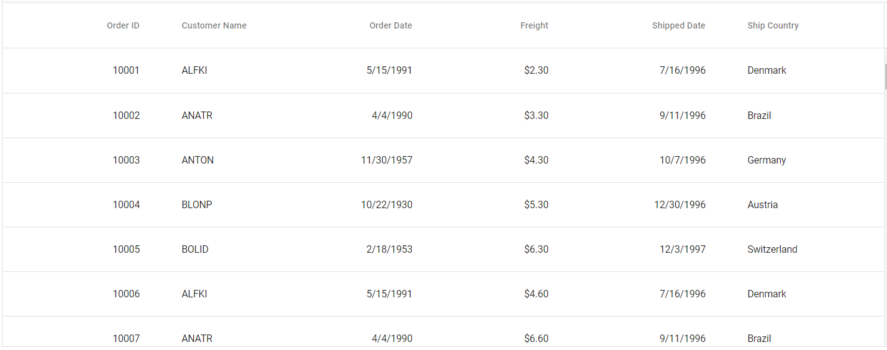
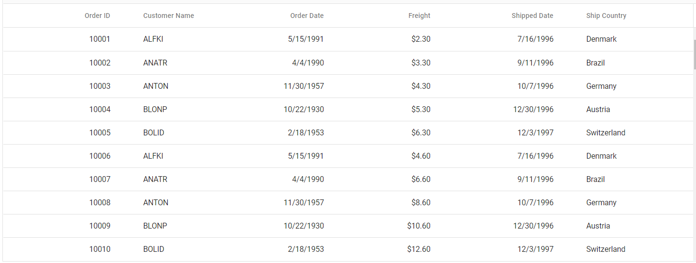
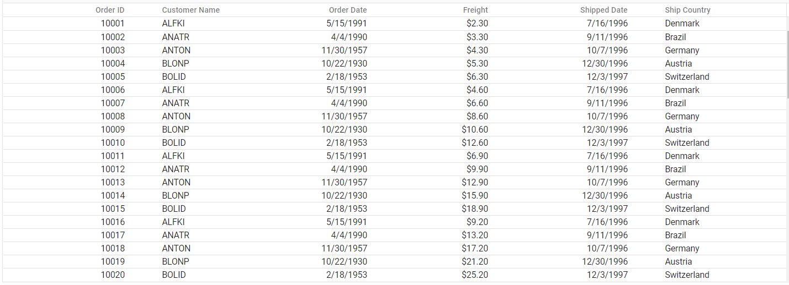

# Display Density

You can customize the display density of Grid into three different variants of supported densities([`comfortable`](#grid-density---comfortable), [`cosy`](#grid-density---cosy), and [`compact`](#grid-density---compact)). The first one is the airiest layout and the last one is the densest one. This can be achieved by setting the [`RowHeight`](https://help.syncfusion.com/cr/blazor/Syncfusion.Blazor.Grids.SfGrid-1.html#Syncfusion_Blazor_Grids_SfGrid_1_RowHeight) property.

## Grid Density - Comfortable

## Grid Density - Cosy

## Grid Density - Compact

## See Also

* [Grid display density online demo](https://blazor.syncfusion.com/demos/datagrid/row-height?theme=material)