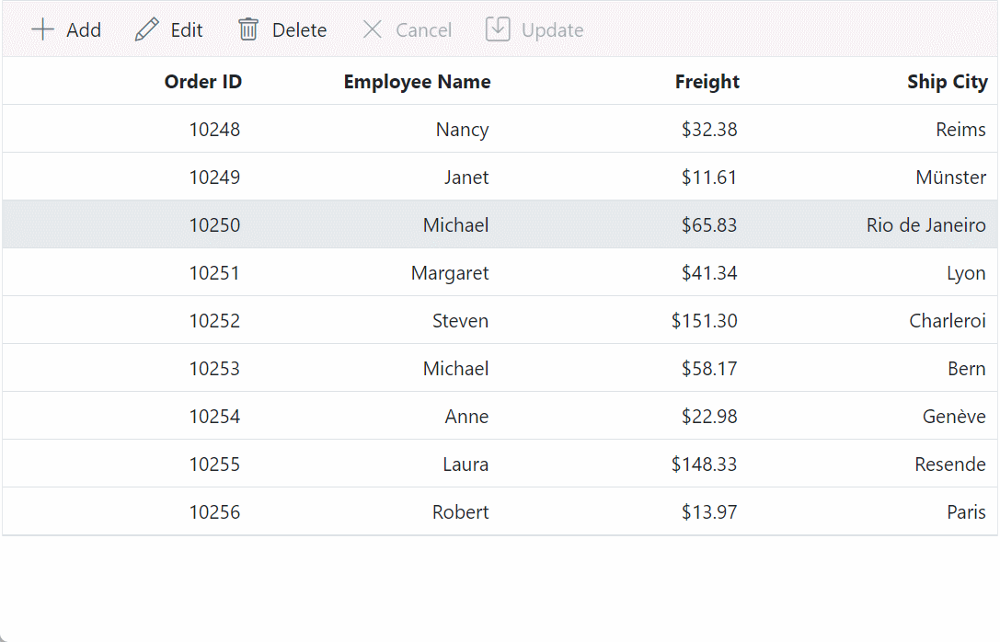
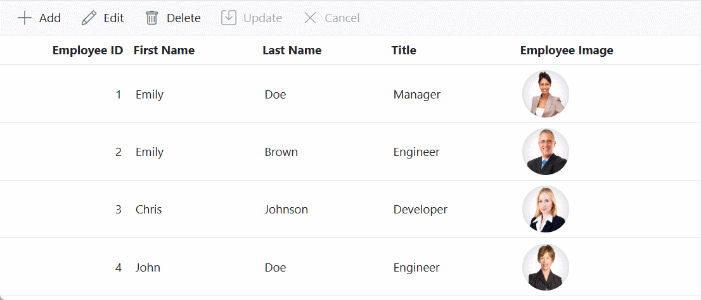

# Edit Types in Blazor DataGrid

The Syncfusion<sup style="font-size:70%">&reg;</sup> Blazor DataGrid supports multiple edit types that allow customization of the editing behavior for individual columns. These edit types improve data entry efficiency and provide flexibility for handling various data types.

## Default cell edit type editor

The Syncfusion<sup style="font-size:70%">&reg;</sup> Blazor DataGrid provides built-in editors to streamline data editing and input handling within the grid. These editors automatically apply based on the column's data type, reducing the need for manual configuration. The [EditType](https://help.syncfusion.com/cr/blazor/Syncfusion.Blazor.Grids.EditType.html) property can be used to specify the desired editor for each column.
The available default edit types include:

| Component                                                                                      | Edit Type Value      | Description                                                                                                   |
|------------------------------------------------------------------------------------------------|----------------------|---------------------------------------------------------------------------------------------------------------|
| [SfTextBox](https://blazor.syncfusion.com/documentation/textbox/getting-started-webapp)          | DefaultEdit          | Renders a `SfTextBox` for columns with string data types.                             |
| [SfNumericTextBox](https://blazor.syncfusion.com/documentation/numeric-textbox/getting-started)  | NumericEdit          | Renders a `SfNumericTextBox` for numeric data types such as int, double, and float.|
| [`SfDropDownList`](https://blazor.syncfusion.com/documentation/dropdown-list/getting-started-with-web-app) | DropDownEdit         | Renders a `SfDropDownList` for string data types with predefined options.                        |
| [SfCheckBox](https://blazor.syncfusion.com/documentation/check-box/getting-started-with-web-app) | BooleanEdit          | Renders a `SfCheckBox` for boolean data types.                           |
| [SfDatePicker](https://blazor.syncfusion.com/documentation/datepicker/getting-started-with-web-app) | DatePickerEdit       | Renders a `SfDatePicker` for date data types.                          |
| [SfDateTimePicker](https://blazor.syncfusion.com/documentation/datetime-picker/getting-started-with-web-app) | DateTimePickerEdit   | TRenders a `SfDateTimePicker` for date-time data types.             |

The following example demonstrates how to define the `EditType` for DataGrid columns:

```cs
<GridColumns>
    <GridColumn Field=@nameof(OrderData.CustomerID) HeaderText="Customer Name" EditType="EditType.DefaultEdit" Width="120"></GridColumn>
    <GridColumn Field=@nameof(OrderData.ShipCountry) HeaderText="Ship Country" EditType="EditType.DropDownEdit" Width="130"></GridColumn>
    <GridColumn Field=@nameof(OrderData.OrderDate) HeaderText="Order Time" EditType="EditType.DateTimePickerEdit" Format="dd/MM/yyyy hh:mm a" Width="130" Type="ColumnType.Date"></GridColumn>
    <GridColumn Field=@nameof(OrderData.Freight) HeaderText="Freight" Format="C2" EditType="EditType.NumericEdit" Width="120"></GridColumn>
    <GridColumn Field=@nameof(OrderData.OrderDate) HeaderText="Order Date" EditType="EditType.DatePickerEdit" Format="dd/MM/yyyy" Width="130" Type="ColumnType.Date"></GridColumn>
    <GridColumn Field=@nameof(OrderData.IsVerified) HeaderText="Verified" DisplayAsCheckBox="true" EditType="EditType.BooleanEdit" Width="120"></GridColumn>
</GridColumns>
```

> If `EditType` is not defined in the column, it will default to the `DefaultEdit` type (SfTextBox).

## Customizing the default editors

The behavior of default editors in the Syncfusion<sup style="font-size:70%">&reg;</sup> Blazor DataGrid can be customized using the [EditorSettings](https://help.syncfusion.com/cr/blazor/Syncfusion.Blazor.Grids.GridColumn.html) property of the [GridColumn](https://help.syncfusion.com/cr/aspnetcore-blazor/Syncfusion.Blazor.Grids.GridColumn.html)component.

> * The properties that can be customized through `EditorSettings` in default Grid editors are limited. Refer to the related topics below for a list of supported properties.
> * To apply additional customizations beyond the supported properties, refer to the [Template Editing](https://blazor.syncfusion.com/documentation/datagrid/template-editing) documentation for rendering custom components within the edit form.

## Customize TextBox of StringEdit type

The default [SfTextBox](https://blazor.syncfusion.com/documentation/textbox/getting-started-webapp) rendered for string data type columns in the Grid edit form can be customized using the [EditorSettings](https://help.syncfusion.com/cr/blazor/Syncfusion.Blazor.Grids.GridColumn.html#Syncfusion_Blazor_Grids_GridColumn_EditorSettings) property of the GridColumn component. This customization enables configuration of various properties of the `SfTextBox` to match specific editing requirements.

The [StringEditCellParams](https://help.syncfusion.com/cr/blazor/Syncfusion.Blazor.Grids.StringEditCellParams.html) class is used to define the `EditorSettings` for the column.

The table below outlines key aspects of customizing a `SfTextBox` using the `EditorSettings` property:

| Component                                                                                      | Edit Type   | Description                                                                                                   | Example Customized Edit Params       |
|------------------------------------------------------------------------------------------------|-------------|---------------------------------------------------------------------------------------------------------------|---------------------------------------|
| [SfTextBox](https://blazor.syncfusion.com/documentation/textbox/getting-started-webapp)          | DefaultEdit | Renders a `SfTextBox` for string data type columns. For available customization options, refer to the [SfTextBox API documentation](https://help.syncfusion.com/cr/blazor/Syncfusion.Blazor.Inputs.SfTextBox.html). | Params: { ShowClearButton: true } |

The following sample code demonstrates the customization applied to the `SfTextBox` of the **CustomerID** column in a Grid:




@page "/"
@using Syncfusion.Blazor.Grids
@using Syncfusion.Blazor.Inputs

<SfGrid DataSource="@Orders" Toolbar="@(new List<string>() { "Add", "Edit", "Delete", "Cancel", "Update" })" Height="265px">
    <GridEditSettings AllowAdding="true" AllowEditing="true" AllowDeleting="true"></GridEditSettings>
    <GridColumns>
        <GridColumn Field=@nameof(OrderData.OrderID) HeaderText="Order ID" IsPrimaryKey="true" Width="120"></GridColumn>
        <GridColumn Field=@nameof(OrderData.CustomerID) HeaderText="Customer ID" EditType="EditType.DefaultEdit" EditorSettings="@CustomerEditParams" Width="120"></GridColumn>
        <GridColumn Field=@nameof(OrderData.Freight) HeaderText="Freight" Format="C2" EditType="EditType.NumericEdit" Width="120"></GridColumn>
        <GridColumn Field=@nameof(OrderData.ShipCountry) HeaderText="Ship Country" EditType="EditType.DropDownEdit" Width="130"></GridColumn>
    </GridColumns>
</SfGrid>
@code {
    public List<OrderData> Orders { get; set; }
    public IEditorSettings CustomerEditParams = new StringEditCellParams
        {
            Params = new TextBoxModel() { EnableRtl = true, ShowClearButton = false, Multiline = true }
        };
    protected override void OnInitialized()
    {
        Orders = OrderData.GetAllRecords();
    }
}





public class OrderData
{
    public static List<OrderData> Orders = new List<OrderData>();

    public OrderData() { }

    public OrderData(int OrderID, string CustomerID, string ShipName, double Freight, DateTime? OrderDate, DateTime? ShippedDate, bool? IsVerified, string ShipCity, string ShipCountry, int employeeID)
    {
        this.OrderID = OrderID;
        this.CustomerID = CustomerID;
        this.ShipName = ShipName;
        this.Freight = Freight;
        this.OrderDate = OrderDate;
        this.ShippedDate = ShippedDate;
        this.IsVerified = IsVerified;
        this.ShipCity = ShipCity;
        this.ShipCountry = ShipCountry;
        this.EmployeeID = employeeID; 
    }

    public static List<OrderData> GetAllRecords()
    {
        if (Orders.Count == 0)
        {
            Orders.Add(new OrderData(10248, "VINET", "Vins et alcools Chevalier", 32.38, new DateTime(1996, 7, 4), new DateTime(1996, 08, 07), true, "Reims", "France", 1));
            Orders.Add(new OrderData(10249, "TOMSP", "Toms Spezialitäten", 11.61, new DateTime(1996, 7, 5), new DateTime(1996, 08, 07), false, "Münster", "Germany", 2));
            Orders.Add(new OrderData(10250, "HANAR", "Hanari Carnes", 65.83, new DateTime(1996, 7, 6), new DateTime(1996, 08, 07), true, "Rio de Janeiro", "Brazil", 3));
            Orders.Add(new OrderData(10251, "VINET", "Vins et alcools Chevalier", 41.34, new DateTime(1996, 7, 7), new DateTime(1996, 08, 07), false, "Lyon", "France", 1));
            Orders.Add(new OrderData(10252, "SUPRD", "Suprêmes délices", 151.30, new DateTime(1996, 7, 8), new DateTime(1996, 08, 07), true, "Charleroi", "Belgium", 2));
            Orders.Add(new OrderData(10253, "HANAR", "Hanari Carnes", 58.17, new DateTime(1996, 7, 9), new DateTime(1996, 08, 07), false, "Bern", "Switzerland", 3));
            Orders.Add(new OrderData(10254, "CHOPS", "Chop-suey Chinese", 22.98, new DateTime(1996, 7, 10), new DateTime(1996, 08, 07), true, "Genève", "Switzerland", 2));
            Orders.Add(new OrderData(10255, "VINET", "Vins et alcools Chevalier", 148.33, new DateTime(1996, 7, 11), new DateTime(1996, 08, 07), false, "Resende", "Brazil", 1));
            Orders.Add(new OrderData(10256, "HANAR", "Hanari Carnes", 13.97, new DateTime(1996, 7, 12), new DateTime(1996, 08, 07), true, "Paris", "France", 3));
        }
        return Orders;
    }

    public int OrderID { get; set; }
    public string CustomerID { get; set; }
    public string ShipName { get; set; }
    public double? Freight { get; set; }
    public DateTime? OrderDate { get; set; }
    public DateTime? ShippedDate { get; set; }
    public bool? IsVerified { get; set; }
    public string ShipCity { get; set; }
    public string ShipCountry { get; set; }
    public int EmployeeID { get; set; } 
}






## Customize NumericTextBox of NumericEdit type 

The [SfNumericTextBox](https://blazor.syncfusion.com/documentation/numeric-textbox/getting-started) rendered in the Grid edit form for numeric data type columns can be customized using the [EditorSettings](https://help.syncfusion.com/cr/blazor/Syncfusion.Blazor.Grids.GridColumn.html#Syncfusion_Blazor_Grids_GridColumn_EditorSettings) property of the [GridColumn](https://help.syncfusion.com/cr/blazor/Syncfusion.Blazor.Grids.GridColumn.html) component. This customization enables configuration of various properties of the `SfNumericTextBox` to align with specific editing requirements.

The [NumericEditCellParams](https://help.syncfusion.com/cr/blazor/Syncfusion.Blazor.Grids.NumericEditCellParams.html) class is used to define the `EditorSettings` for numeric columns.

The table below outlines key aspects of customizing a `SfNumericTextBox` using the `EditorSettings` property:

| Component                                                                                      | Edit Type   | Description                                                                                                   | Example Customized Edit Params       |
|------------------------------------------------------------------------------------------------|-------------|---------------------------------------------------------------------------------------------------------------|---------------------------------------|
| [SfNumericTextBox](https://blazor.syncfusion.com/documentation/numeric-textbox/getting-started)  | NumericEdit | Renders a `SfNumericTextBox` for numeric data types such as int, double, float, short, byte, long, and decimal. For additional configuration options, refer to the [SfNumericTextBox API documentation](https://help.syncfusion.com/cr/blazor/Syncfusion.Blazor.Inputs.SfNumericTextBox-1.html). | Params: { decimals: 2, value: 5 }    |

The following example demonstrates how to customize the `SfNumericTextBox` editor for the **Freight** column in the Grid:




@page "/"
@using Syncfusion.Blazor.Grids
@using Syncfusion.Blazor.Inputs

<SfGrid DataSource="@Orders" Toolbar="@(new List<string>() { "Add", "Edit", "Delete", "Cancel", "Update" })">
    <GridEditSettings AllowAdding="true" AllowEditing="true" AllowDeleting="true"></GridEditSettings>
    <GridColumns>
        <GridColumn Field=@nameof(OrderData.OrderID) HeaderText="Order ID" IsPrimaryKey="true" ValidationRules="@(new ValidationRules{ Required=true})" TextAlign="TextAlign.Right" Width="120"></GridColumn>
        <GridColumn Field=@nameof(OrderData.CustomerID) HeaderText="Customer Name" ValidationRules="@(new ValidationRules{ Required=true})" Width="120"></GridColumn>
        <GridColumn Field=@nameof(OrderData.Freight) HeaderText="Freight" TextAlign="TextAlign.Right" ValidationRules="@(new ValidationRules{ Required=true, Min=1, Max=1000})" EditType="EditType.NumericEdit" EditorSettings="@NumericEditParams" Width="120"></GridColumn>
        <GridColumn Field=@nameof(OrderData.ShipCity) HeaderText="Ship City" ValidationRules="@(new ValidationRules{ Required=true})" EditType="EditType.DropDownEdit" Width="150">
        </GridColumn>
    </GridColumns>
</SfGrid>
@code {
    public List<OrderData> Orders { get; set; }
    public IEditorSettings NumericEditParams = new NumericEditCellParams
    {
        Params = new NumericTextBoxModel<object>() { ShowClearButton = true, ShowSpinButton = false, Decimals=0, Format="N" }
    };
    protected override void OnInitialized()
    {
        Orders = OrderData.GetAllRecords();
    }
}





public class OrderData
{
    public static List<OrderData> Orders = new List<OrderData>();

    public OrderData() { }

    public OrderData(int OrderID, string CustomerID, string ShipName, double Freight, DateTime? OrderDate, DateTime? ShippedDate, bool? IsVerified, string ShipCity, string ShipCountry, int employeeID)
    {
        this.OrderID = OrderID;
        this.CustomerID = CustomerID;
        this.ShipName = ShipName;
        this.Freight = Freight;
        this.OrderDate = OrderDate;
        this.ShippedDate = ShippedDate;
        this.IsVerified = IsVerified;
        this.ShipCity = ShipCity;
        this.ShipCountry = ShipCountry;
        this.EmployeeID = employeeID; 
    }

    public static List<OrderData> GetAllRecords()
    {
        if (Orders.Count == 0)
        {
            Orders.Add(new OrderData(10248, "VINET", "Vins et alcools Chevalier", 32.38, new DateTime(1996, 7, 4), new DateTime(1996, 08, 07), true, "Reims", "France", 1));
            Orders.Add(new OrderData(10249, "TOMSP", "Toms Spezialitäten", 11.61, new DateTime(1996, 7, 5), new DateTime(1996, 08, 07), false, "Münster", "Germany", 2));
            Orders.Add(new OrderData(10250, "HANAR", "Hanari Carnes", 65.83, new DateTime(1996, 7, 6), new DateTime(1996, 08, 07), true, "Rio de Janeiro", "Brazil", 3));
            Orders.Add(new OrderData(10251, "VINET", "Vins et alcools Chevalier", 41.34, new DateTime(1996, 7, 7), new DateTime(1996, 08, 07), false, "Lyon", "France", 1));
            Orders.Add(new OrderData(10252, "SUPRD", "Suprêmes délices", 151.30, new DateTime(1996, 7, 8), new DateTime(1996, 08, 07), true, "Charleroi", "Belgium", 2));
            Orders.Add(new OrderData(10253, "HANAR", "Hanari Carnes", 58.17, new DateTime(1996, 7, 9), new DateTime(1996, 08, 07), false, "Bern", "Switzerland", 3));
            Orders.Add(new OrderData(10254, "CHOPS", "Chop-suey Chinese", 22.98, new DateTime(1996, 7, 10), new DateTime(1996, 08, 07), true, "Genève", "Switzerland", 2));
            Orders.Add(new OrderData(10255, "VINET", "Vins et alcools Chevalier", 148.33, new DateTime(1996, 7, 11), new DateTime(1996, 08, 07), false, "Resende", "Brazil", 1));
            Orders.Add(new OrderData(10256, "HANAR", "Hanari Carnes", 13.97, new DateTime(1996, 7, 12), new DateTime(1996, 08, 07), true, "Paris", "France", 3));
        }
        return Orders;
    }

    public int OrderID { get; set; }
    public string CustomerID { get; set; }
    public string ShipName { get; set; }
    public double? Freight { get; set; }
    public DateTime? OrderDate { get; set; }
    public DateTime? ShippedDate { get; set; }
    public bool? IsVerified { get; set; }
    public string ShipCity { get; set; }
    public string ShipCountry { get; set; }
    public int EmployeeID { get; set; } 
}






### Restrict decimal points in a NumericTextBox while editing a numeric column

By default, the [SfNumericTextBox](https://blazor.syncfusion.com/documentation/numeric-textbox/getting-started) allows input of decimal values with up to two decimal places when editing numeric columns. In scenarios where only whole numbers are required, decimal input can be restricted using the [ValidateDecimalOnType](https://help.syncfusion.com/cr/blazor/Syncfusion.Blazor.Inputs.SfNumericTextBox-1.html#Syncfusion_Blazor_Inputs_SfNumericTextBox_1_ValidateDecimalOnType) and [Decimals](https://help.syncfusion.com/cr/blazor/Syncfusion.Blazor.Inputs.SfNumericTextBox-1.html#Syncfusion_Blazor_Inputs_SfNumericTextBox_1_Decimals) properties of `SfNumericTextBox`.

The `ValidateDecimalOnType` property determines whether decimal points are permitted during input. By default, this property is set to **false**, allowing decimal values to be entered. When set to **true**, decimal input is restricted, and only whole numbers are accepted.

The `Decimals` property defines the number of decimal places displayed in the `SfNumericTextBox`. The default value is **2**, which displays two decimal places. This value can be modified to control the number of visible decimal digits.

The following example demonstrates how to restrict decimal input in the `SfNumericTextBox` editor for the **Freight** column by disabling decimal points:




@page "/"
@using Syncfusion.Blazor.Grids
@using Syncfusion.Blazor.Inputs

<SfGrid DataSource="@Orders" Toolbar="@(new List<string>() { "Add", "Edit", "Delete", "Cancel", "Update" })" Height="265px">
    <GridEditSettings AllowAdding="true" AllowEditing="true" AllowDeleting="true"></GridEditSettings>
    <GridColumns>
        <GridColumn Field=@nameof(OrderData.OrderID) HeaderText="Order ID" IsPrimaryKey="true" ValidationRules="@(new ValidationRules{ Required=true})" TextAlign="TextAlign.Right" Width="120"></GridColumn>
        <GridColumn Field=@nameof(OrderData.CustomerID) HeaderText="Customer Name" ValidationRules="@(new ValidationRules{ Required=true})" Width="120"></GridColumn>
        <GridColumn Field=@nameof(OrderData.Freight) HeaderText="Freight" Format="C2" TextAlign="TextAlign.Right" ValidationRules="@(new ValidationRules{ Required=true, Min=1,Max=1000})" EditType="EditType.NumericEdit" EditorSettings="@FreightEditParams" Width="120"></GridColumn>
        <GridColumn Field=@nameof(OrderData.ShipCity) HeaderText="Ship City" ValidationRules="@(new ValidationRules{ Required=true})" EditType="EditType.DropDownEdit" Width="150">
        </GridColumn>
    </GridColumns>
</SfGrid>
@code {
    public List<OrderData> Orders { get; set; }
    public IEditorSettings FreightEditParams = new NumericEditCellParams
    {
            Params = new NumericTextBoxModel<object>() { 
                ValidateDecimalOnType= true,
                Decimals= 0,
                Format= "N" ,
                ShowSpinButton=true
            }
    };
    protected override void OnInitialized()
    {
        Orders = OrderData.GetAllRecords();
    }
}





public class OrderData
{
    public static List<OrderData> Orders = new List<OrderData>();

    public OrderData() { }

    public OrderData(int OrderID, string CustomerID, string ShipName, double Freight, DateTime? OrderDate, DateTime? ShippedDate, bool? IsVerified, string ShipCity, string ShipCountry, int employeeID)
    {
        this.OrderID = OrderID;
        this.CustomerID = CustomerID;
        this.ShipName = ShipName;
        this.Freight = Freight;
        this.OrderDate = OrderDate;
        this.ShippedDate = ShippedDate;
        this.IsVerified = IsVerified;
        this.ShipCity = ShipCity;
        this.ShipCountry = ShipCountry;
        this.EmployeeID = employeeID; 
    }

    public static List<OrderData> GetAllRecords()
    {
        if (Orders.Count == 0)
        {
            Orders.Add(new OrderData(10248, "VINET", "Vins et alcools Chevalier", 32.38, new DateTime(1996, 7, 4), new DateTime(1996, 08, 07), true, "Reims", "France", 1));
            Orders.Add(new OrderData(10249, "TOMSP", "Toms Spezialitäten", 11.61, new DateTime(1996, 7, 5), new DateTime(1996, 08, 07), false, "Münster", "Germany", 2));
            Orders.Add(new OrderData(10250, "HANAR", "Hanari Carnes", 65.83, new DateTime(1996, 7, 6), new DateTime(1996, 08, 07), true, "Rio de Janeiro", "Brazil", 3));
            Orders.Add(new OrderData(10251, "VINET", "Vins et alcools Chevalier", 41.34, new DateTime(1996, 7, 7), new DateTime(1996, 08, 07), false, "Lyon", "France", 1));
            Orders.Add(new OrderData(10252, "SUPRD", "Suprêmes délices", 151.30, new DateTime(1996, 7, 8), new DateTime(1996, 08, 07), true, "Charleroi", "Belgium", 2));
            Orders.Add(new OrderData(10253, "HANAR", "Hanari Carnes", 58.17, new DateTime(1996, 7, 9), new DateTime(1996, 08, 07), false, "Bern", "Switzerland", 3));
            Orders.Add(new OrderData(10254, "CHOPS", "Chop-suey Chinese", 22.98, new DateTime(1996, 7, 10), new DateTime(1996, 08, 07), true, "Genève", "Switzerland", 2));
            Orders.Add(new OrderData(10255, "VINET", "Vins et alcools Chevalier", 148.33, new DateTime(1996, 7, 11), new DateTime(1996, 08, 07), false, "Resende", "Brazil", 1));
            Orders.Add(new OrderData(10256, "HANAR", "Hanari Carnes", 13.97, new DateTime(1996, 7, 12), new DateTime(1996, 08, 07), true, "Paris", "France", 3));
        }
        return Orders;
    }

    public int OrderID { get; set; }
    public string CustomerID { get; set; }
    public string ShipName { get; set; }
    public double? Freight { get; set; }
    public DateTime? OrderDate { get; set; }
    public DateTime? ShippedDate { get; set; }
    public bool? IsVerified { get; set; }
    public string ShipCity { get; set; }
    public string ShipCountry { get; set; }
    public int EmployeeID { get; set; } 
}






## Customize DropDownList of DropDownEdit type

The [SfDropDownList](https://blazor.syncfusion.com/documentation/dropdown-list/getting-started-with-web-app) rendered in the Grid edit form for string data type columns can be customized using the [EditorSettings](https://help.syncfusion.com/cr/blazor/Syncfusion.Blazor.Grids.GridColumn.html#Syncfusion_Blazor_Grids_GridColumn_EditorSettings) property of the GridColumn component. This customization enables configuration of various properties of the `SfDropDownList` to align with specific editing requirements.

The [DropDownEditCellParams](https://help.syncfusion.com/cr/blazor/Syncfusion.Blazor.Grids.DropDownEditCellParams.html) class is used to define the `EditorSettings` for string columns.

The table below outlines key aspects of customizing a `SfDropDownList` using the `EditorSettings` property:

| Component                                                                                      | Edit Type     | Description                                                                                                                                              | Example Customized Edit Params     |
|------------------------------------------------------------------------------------------------|---------------|----------------------------------------------------------------------------------------------------------------------------------------------------------|-------------------------------------|
| [SfDropDownList](https://blazor.syncfusion.com/documentation/dropdown-list/getting-started-with-web-app) | DropDownEdit | Renders a `SfDropDownList` for string data type columns. For additional configuration options, refer to the [SfDropDownList API documentation](https://help.syncfusion.com/cr/blazor/Syncfusion.Blazor.DropDowns.SfDropDownList-2.html). | Params = { Value: 'Germany' }       |

> The [DataSource](https://help.syncfusion.com/cr/blazor/Syncfusion.Blazor.Grids.SfGrid-1.html#Syncfusion_Blazor_Grids_SfGrid_1_DataSource) property in `DropDownListModel` must be of type **IEnumerable<TItem>**. Avoid binding **string[]** or **List<string>** directly to the `DataSource` property.

The following example demonstrates how to customize the `SfDropDownList` editor for the **ShipCity** column in the Grid:




@page "/"
@using Syncfusion.Blazor.Grids
@using Syncfusion.Blazor.DropDowns

<SfGrid DataSource="@Orders" Height="265px" Toolbar="@(new List<string>() { "Add", "Edit", "Delete", "Cancel", "Update" })">
    <GridEditSettings AllowAdding="true" AllowEditing="true" AllowDeleting="true"></GridEditSettings>
    <GridColumns>
        <GridColumn Field=@nameof(OrderData.OrderID) HeaderText="Order ID" IsPrimaryKey="true" ValidationRules="@(new ValidationRules{ Required=true})" TextAlign="TextAlign.Right" Width="120"></GridColumn>
        <GridColumn Field=@nameof(OrderData.CustomerID) HeaderText="Customer Name" ValidationRules="@(new ValidationRules{ Required=true})" Width="120"></GridColumn>
        <GridColumn Field=@nameof(OrderData.Freight) HeaderText="Freight" Format="C2" TextAlign="TextAlign.Right" ValidationRules="@(new ValidationRules{ Required=true, Min=1,Max=1000})" EditType="EditType.NumericEdit" Width="120"></GridColumn>
        <GridColumn Field=@nameof(OrderData.ShipCity) HeaderText="Ship City" ValidationRules="@(new ValidationRules{ Required=true})" EditType="EditType.DropDownEdit" EditorSettings="@DropDownParams" Width="150">
        </GridColumn>
    </GridColumns>
</SfGrid>
@code {
    public List<OrderData> Orders { get; set; }
    public IEditorSettings DropDownParams = new DropDownEditCellParams
        {
            Params = new DropDownListModel<object,object>() { ShowClearButton = true, PopupHeight="120", AllowFiltering = true, }
        };

    protected override void OnInitialized()
    {
        Orders = OrderData.GetAllRecords();
    }
}





public class OrderData
{
    public static List<OrderData> Orders = new List<OrderData>();

    public OrderData() { }

    public OrderData(int OrderID, string CustomerID, string ShipName, double Freight, DateTime? OrderDate, DateTime? ShippedDate, bool? IsVerified, string ShipCity, string ShipCountry, int employeeID)
    {
        this.OrderID = OrderID;
        this.CustomerID = CustomerID;
        this.ShipName = ShipName;
        this.Freight = Freight;
        this.OrderDate = OrderDate;
        this.ShippedDate = ShippedDate;
        this.IsVerified = IsVerified;
        this.ShipCity = ShipCity;
        this.ShipCountry = ShipCountry;
        this.EmployeeID = employeeID; 
    }

    public static List<OrderData> GetAllRecords()
    {
        if (Orders.Count == 0)
        {
            Orders.Add(new OrderData(10248, "VINET", "Vins et alcools Chevalier", 32.38, new DateTime(1996, 7, 4), new DateTime(1996, 08, 07), true, "Reims", "France", 1));
            Orders.Add(new OrderData(10249, "TOMSP", "Toms Spezialitäten", 11.61, new DateTime(1996, 7, 5), new DateTime(1996, 08, 07), false, "Münster", "Germany", 2));
            Orders.Add(new OrderData(10250, "HANAR", "Hanari Carnes", 65.83, new DateTime(1996, 7, 6), new DateTime(1996, 08, 07), true, "Rio de Janeiro", "Brazil", 3));
            Orders.Add(new OrderData(10251, "VINET", "Vins et alcools Chevalier", 41.34, new DateTime(1996, 7, 7), new DateTime(1996, 08, 07), false, "Lyon", "France", 1));
            Orders.Add(new OrderData(10252, "SUPRD", "Suprêmes délices", 151.30, new DateTime(1996, 7, 8), new DateTime(1996, 08, 07), true, "Charleroi", "Belgium", 2));
            Orders.Add(new OrderData(10253, "HANAR", "Hanari Carnes", 58.17, new DateTime(1996, 7, 9), new DateTime(1996, 08, 07), false, "Bern", "Switzerland", 3));
            Orders.Add(new OrderData(10254, "CHOPS", "Chop-suey Chinese", 22.98, new DateTime(1996, 7, 10), new DateTime(1996, 08, 07), true, "Genève", "Switzerland", 2));
            Orders.Add(new OrderData(10255, "VINET", "Vins et alcools Chevalier", 148.33, new DateTime(1996, 7, 11), new DateTime(1996, 08, 07), false, "Resende", "Brazil", 1));
            Orders.Add(new OrderData(10256, "HANAR", "Hanari Carnes", 13.97, new DateTime(1996, 7, 12), new DateTime(1996, 08, 07), true, "Paris", "France", 3));
        }
        return Orders;
    }

    public int OrderID { get; set; }
    public string CustomerID { get; set; }
    public string ShipName { get; set; }
    public double? Freight { get; set; }
    public DateTime? OrderDate { get; set; }
    public DateTime? ShippedDate { get; set; }
    public bool? IsVerified { get; set; }
    public string ShipCity { get; set; }
    public string ShipCountry { get; set; }
    public int EmployeeID { get; set; } 
}






### Provide custom data source for DropDownList

In the Syncfusion<sup style="font-size:70%">&reg;</sup> Blazor DataGrid, a custom data source can be assigned to the [SfDropDownList](https://blazor.syncfusion.com/documentation/dropdown-list/getting-started-with-web-app) used in the edit form. This approach enables the definition of a specific set of values for the `SfDropDownList`, allowing precise control over the available options.

To configure a custom data source, use the [EditorSettings](https://help.syncfusion.com/cr/blazor/Syncfusion.Blazor.Grids.GridColumn.html#Syncfusion_Blazor_Grids_GridColumn_EditorSettings) property of the [GridColumn](https://help.syncfusion.com/cr/blazor/Syncfusion.Blazor.Grids.GridColumn.html). Additional configurations, such as filtering or querying the data, can be applied using the [Query](https://help.syncfusion.com/cr/blazor/Syncfusion.Blazor.DropDowns.DropDownListModel-2.html#Syncfusion_Blazor_DropDowns_DropDownListModel_2_Query) property.

The following example demonstrates how to provide a custom data source for the **ShipCountry** column in the Grid:




@page "/"
@using Syncfusion.Blazor.Grids
@using Syncfusion.Blazor.DropDowns
<SfGrid DataSource="@Orders" Toolbar="@(new List<string>() { "Add", "Edit", "Delete", "Cancel", "Update" })" Height="273px">
    <GridEditSettings AllowAdding="true" AllowEditing="true" AllowDeleting="true"></GridEditSettings>
    <GridColumns>
        <GridColumn Field=@nameof(OrderData.OrderID) HeaderText="Order ID" IsPrimaryKey="true" ValidationRules="@(new ValidationRules{ Required=true})" TextAlign="TextAlign.Right" Width="120"></GridColumn>
        <GridColumn Field=@nameof(OrderData.CustomerID) HeaderText="Customer Name" ValidationRules="@(new ValidationRules{ Required=true})" Width="120"></GridColumn>
        <GridColumn Field=@nameof(OrderData.Freight) HeaderText="Freight" Format="C2" TextAlign="TextAlign.Right" ValidationRules="@(new ValidationRules{ Required=true, Min=1,Max=1000})" EditType="EditType.NumericEdit" Width="120"></GridColumn>
        <GridColumn Field=@nameof(OrderData.ShipCountry) HeaderText="Ship Country" ValidationRules="@(new ValidationRules{ Required=true})" EditType="EditType.DropDownEdit" EditorSettings="@DropDownParams" Width="150">
        </GridColumn>
    </GridColumns>
</SfGrid>
@code {
    public List<OrderData> Orders { get; set; }
    public static List<OrderData> CustomData = new List<OrderData> {
        new OrderData() { ShipCountry= "France" },
        new OrderData() { ShipCountry= "Germany" },
        new OrderData() { ShipCountry= "India" }
    };
    public IEditorSettings DropDownParams = new DropDownEditCellParams
    {
        Params = new DropDownListModel<object, object>() { DataSource = CustomData, Query = new Syncfusion.Blazor.Data.Query() }
    };
    protected override void OnInitialized()
    {
        Orders = OrderData.GetAllRecords();
    }
}





public class OrderData
{
    public static List<OrderData> Orders = new List<OrderData>();

    public OrderData() { }

    public OrderData(int OrderID, string CustomerID, string ShipName, double Freight, DateTime? OrderDate, DateTime? ShippedDate, bool? IsVerified, string ShipCity, string ShipCountry, int employeeID, TimeOnly? OrderTime)
    {
        this.OrderID = OrderID;
        this.CustomerID = CustomerID;
        this.ShipName = ShipName;
        this.Freight = Freight;
        this.OrderDate = OrderDate;
        this.ShippedDate = ShippedDate;
        this.IsVerified = IsVerified;
        this.ShipCity = ShipCity;
        this.ShipCountry = ShipCountry;
        this.EmployeeID = employeeID;
        this.OrderTime = OrderTime;
    }

    public static List<OrderData> GetAllRecords()
    {
        if (Orders.Count == 0)
        {
            Orders.Add(new OrderData(10248, "VINET", "Vins et alcools Chevalier", 32.38, new DateTime(1996, 7, 4), new DateTime(1996, 08, 07), true, "Reims", "France", 1, new TimeOnly(9, 30, 0)));
            Orders.Add(new OrderData(10249, "TOMSP", "Toms Spezialitäten", 11.61, new DateTime(1996, 7, 5), new DateTime(1996, 08, 07), false, "Münster", "Germany", 2, new TimeOnly(10, 0, 0)));
            Orders.Add(new OrderData(10250, "HANAR", "Hanari Carnes", 65.83, new DateTime(1996, 7, 6), new DateTime(1996, 08, 07), true, "Rio de Janeiro", "India", 3, new TimeOnly(14, 15, 0)));
            Orders.Add(new OrderData(10251, "VINET", "Vins et alcools Chevalier", 41.34, new DateTime(1996, 7, 7), new DateTime(1996, 08, 07), false, "Lyon", "France", 1, new TimeOnly(11, 45, 0)));
            Orders.Add(new OrderData(10252, "SUPRD", "Suprêmes délices", 151.30, new DateTime(1996, 7, 8), new DateTime(1996, 08, 07), true, "Charleroi", "Belgium", 2, new TimeOnly(13, 0, 0)));
            Orders.Add(new OrderData(10253, "HANAR", "Hanari Carnes", 58.17, new DateTime(1996, 7, 9), new DateTime(1996, 08, 07), false, "Bern", "Switzerland", 3, new TimeOnly(16, 30, 0)));
            Orders.Add(new OrderData(10254, "CHOPS", "Chop-suey Chinese", 22.98, new DateTime(1996, 7, 10), new DateTime(1996, 08, 07), true, "Genève", "Switzerland", 2, new TimeOnly(8, 0, 0)));
            Orders.Add(new OrderData(10255, "VINET", "Vins et alcools Chevalier", 148.33, new DateTime(1996, 7, 11), new DateTime(1996, 08, 07), false, "Resende", "India", 1, new TimeOnly(10, 30, 0)));
            Orders.Add(new OrderData(10256, "HANAR", "Hanari Carnes", 13.97, new DateTime(1996, 7, 12), new DateTime(1996, 08, 07), true, "Paris", "France", 3, new TimeOnly(9, 45, 0)));
        }
        return Orders;
    }

    public int OrderID { get; set; }
    public string? CustomerID { get; set; }
    public string? ShipName { get; set; }
    public double? Freight { get; set; }
    public DateTime? OrderDate { get; set; }
    public DateTime? ShippedDate { get; set; }
    public bool? IsVerified { get; set; }
    public string? ShipCity { get; set; }
    public string? ShipCountry { get; set; }
    public int EmployeeID { get; set; }
    public TimeOnly? OrderTime { get; set; }
}






### Apply filtering for DropDownList

The Syncfusion<sup style="font-size:70%">&reg;</sup> Blazor DataGrid supports filtering in the [SfDropDownList](https://blazor.syncfusion.com/documentation/dropdown-list/getting-started-with-web-app) used within the edit form. This feature enables selection from a predefined list with the ability to search for specific items using built-in filtering functionality.

To enable filtering, set the [AllowFiltering](https://help.syncfusion.com/cr/blazor/Syncfusion.Blazor.Grids.GridColumn.html#Syncfusion_Blazor_Grids_GridColumn_AllowFiltering) property to **true** within the [DropDownEditCellParams](https://help.syncfusion.com/cr/blazor/Syncfusion.Blazor.Grids.DropDownEditCellParams.html). This activates the filtering capability in the `SfDropDownList`.

The following example demonstrates how to enable filtering in the `SfDropDownList` editor for the **ShipCountry** column in the Grid:




@page "/"
@using Syncfusion.Blazor.Grids
@using Syncfusion.Blazor.DropDowns
<SfGrid DataSource="@Orders" Toolbar="@(new List<string>() { "Add", "Edit", "Delete", "Cancel", "Update" })" Height="273px">
    <GridEditSettings AllowAdding="true" AllowEditing="true" AllowDeleting="true"></GridEditSettings>
    <GridColumns>
        <GridColumn Field=@nameof(OrderData.OrderID) HeaderText="Order ID" IsPrimaryKey="true" ValidationRules="@(new ValidationRules{ Required=true})" TextAlign="TextAlign.Right" Width="120"></GridColumn>
        <GridColumn Field=@nameof(OrderData.CustomerID) HeaderText="Customer Name" ValidationRules="@(new ValidationRules{ Required=true})" Width="120"></GridColumn>
        <GridColumn Field=@nameof(OrderData.Freight) HeaderText="Freight" Format="C2" TextAlign="TextAlign.Right" ValidationRules="@(new ValidationRules{ Required=true, Min=1,Max=1000})" EditType="EditType.NumericEdit" Width="120"></GridColumn>
        <GridColumn Field=@nameof(OrderData.ShipCity) HeaderText="Ship City" ValidationRules="@(new ValidationRules{ Required=true})" EditType="EditType.DropDownEdit" EditorSettings="@DropDownParams" Width="150">
        </GridColumn>
    </GridColumns>
</SfGrid>
@code {
    public List<OrderData> Orders { get; set; }

    public IEditorSettings DropDownParams = new DropDownEditCellParams
        {
            Params = new DropDownListModel<object,object>() { AllowFiltering=true }
        };

    protected override void OnInitialized()
    {
        Orders = OrderData.GetAllRecords();
    }
}





public class OrderData
{
    public static List<OrderData> Orders = new List<OrderData>();

    public OrderData() { }

    public OrderData(int OrderID, string CustomerID, string ShipName, double Freight, DateTime? OrderDate, DateTime? ShippedDate, bool? IsVerified, string ShipCity, string ShipCountry, int employeeID)
    {
        this.OrderID = OrderID;
        this.CustomerID = CustomerID;
        this.ShipName = ShipName;
        this.Freight = Freight;
        this.OrderDate = OrderDate;
        this.ShippedDate = ShippedDate;
        this.IsVerified = IsVerified;
        this.ShipCity = ShipCity;
        this.ShipCountry = ShipCountry;
        this.EmployeeID = employeeID; 
    }

    public static List<OrderData> GetAllRecords()
    {
        if (Orders.Count == 0)
        {
            Orders.Add(new OrderData(10248, "VINET", "Vins et alcools Chevalier", 32.38, new DateTime(1996, 7, 4), new DateTime(1996, 08, 07), true, "Reims", "France", 1));
            Orders.Add(new OrderData(10249, "TOMSP", "Toms Spezialitäten", 11.61, new DateTime(1996, 7, 5), new DateTime(1996, 08, 07), false, "Münster", "Germany", 2));
            Orders.Add(new OrderData(10250, "HANAR", "Hanari Carnes", 65.83, new DateTime(1996, 7, 6), new DateTime(1996, 08, 07), true, "Rio de Janeiro", "Brazil", 3));
            Orders.Add(new OrderData(10251, "VINET", "Vins et alcools Chevalier", 41.34, new DateTime(1996, 7, 7), new DateTime(1996, 08, 07), false, "Lyon", "France", 1));
            Orders.Add(new OrderData(10252, "SUPRD", "Suprêmes délices", 151.30, new DateTime(1996, 7, 8), new DateTime(1996, 08, 07), true, "Charleroi", "Belgium", 2));
            Orders.Add(new OrderData(10253, "HANAR", "Hanari Carnes", 58.17, new DateTime(1996, 7, 9), new DateTime(1996, 08, 07), false, "Bern", "Switzerland", 3));
            Orders.Add(new OrderData(10254, "CHOPS", "Chop-suey Chinese", 22.98, new DateTime(1996, 7, 10), new DateTime(1996, 08, 07), true, "Genève", "Switzerland", 2));
            Orders.Add(new OrderData(10255, "VINET", "Vins et alcools Chevalier", 148.33, new DateTime(1996, 7, 11), new DateTime(1996, 08, 07), false, "Resende", "Brazil", 1));
            Orders.Add(new OrderData(10256, "HANAR", "Hanari Carnes", 13.97, new DateTime(1996, 7, 12), new DateTime(1996, 08, 07), true, "Paris", "France", 3));
        }
        return Orders;
    }

    public int OrderID { get; set; }
    public string CustomerID { get; set; }
    public string ShipName { get; set; }
    public double? Freight { get; set; }
    public DateTime? OrderDate { get; set; }
    public DateTime? ShippedDate { get; set; }
    public bool? IsVerified { get; set; }
    public string ShipCity { get; set; }
    public string ShipCountry { get; set; }
    public int EmployeeID { get; set; } 
}






## Customize CheckBox of BooleanEdit Type

The [SfCheckBox](https://blazor.syncfusion.com/documentation/check-box/getting-started-with-web-app) rendered in the Grid edit form for boolean data type columns can be customized using the [EditorSettings](https://help.syncfusion.com/cr/blazor/Syncfusion.Blazor.Grids.GridColumn.html#Syncfusion_Blazor_Grids_GridColumn_EditorSettings) property of the [GridColumn](https://help.syncfusion.com/cr/blazor/Syncfusion.Blazor.Grids.GridColumn.html) component. This customization allows configuration of various properties of the `SfCheckBox` to match specific editing requirements.

The [BooleanEditCellParams](https://help.syncfusion.com/cr/blazor/Syncfusion.Blazor.Grids.BooleanEditCellParams.html) class is used to define the `EditorSettings` for boolean columns.

The table below outlines key aspects of customizing a `SfCheckBox` using the `EditorSettings` property:

| Component  | Edit Type    | Description                                                                                              | Example Customized Edit Params |
|------------|--------------|----------------------------------------------------------------------------------------------------------|---------------------------------|
| [SfCheckBox](https://blazor.syncfusion.com/documentation/check-box/getting-started-with-web-app) | BooleanEdit  | Renders a `SfCheckBox` for boolean data type columns. For additional configuration options, refer to the [SfCheckBox API documentation](https://help.syncfusion.com/cr/blazor/Syncfusion.Blazor.Buttons.SfCheckBox.html). | Params: { Checked: true }      |

The following example demonstrates how to customize the `SfCheckBox` editor for the **Verified** column in the Grid:




@page "/"
@using Syncfusion.Blazor.Grids
@using Syncfusion.Blazor.Buttons
@using Syncfusion.Blazor.Calendars

<SfGrid DataSource="@Orders" Toolbar="@(new List<string>() { "Add", "Edit", "Delete", "Cancel", "Update" })" Height="265px">
    <GridEditSettings AllowAdding="true" AllowEditing="true" AllowDeleting="true"></GridEditSettings>
    <GridColumns>
        <GridColumn Field=@nameof(OrderData.OrderID) HeaderText="Order ID" IsPrimaryKey="true" TextAlign="TextAlign.Center" Width="120"></GridColumn>
        <GridColumn Field=@nameof(OrderData.CustomerID) HeaderText="Customer ID" TextAlign="TextAlign.Center" Width="130"></GridColumn>
        <GridColumn Field=@nameof(OrderData.Freight) HeaderText="Freight" Format="C2" EditType="EditType.NumericEdit" TextAlign="TextAlign.Center" Width="130"></GridColumn>
        <GridColumn Field=@nameof(OrderData.OrderDate) HeaderText="Order Date" EditType="EditType.DatePickerEdit" Format="yyyy-MM-dd" Type="ColumnType.DateOnly" Width="120"></GridColumn>
        <GridColumn Field=@nameof(OrderData.IsVerified) HeaderText="Verified" EditType="EditType.BooleanEdit" TextAlign="TextAlign.Center" DisplayAsCheckBox="true" Width="120" EditorSettings="@VerifiedEditParams"></GridColumn>
    </GridColumns>
</SfGrid>
@code {
    public List<OrderData> Orders { get; set; }
    public IEditorSettings VerifiedEditParams = new BooleanEditCellParams
    {
        Params = new CheckBoxModel<bool>() { Label = "Checked", Disabled = true, LabelPosition = LabelPosition.Before }
    };
    protected override void OnInitialized()
    {
        Orders = OrderData.GetAllRecords();
    }
}





public class OrderData
{
    public static List<OrderData> Orders = new List<OrderData>();

    public OrderData() { }

    public OrderData(int OrderID, string CustomerID, string ShipName, double Freight, DateTime? OrderDate, DateTime? ShippedDate, bool? IsVerified, string ShipCity, string ShipCountry, int employeeID)
    {
        this.OrderID = OrderID;
        this.CustomerID = CustomerID;
        this.ShipName = ShipName;
        this.Freight = Freight;
        this.OrderDate = OrderDate;
        this.ShippedDate = ShippedDate;
        this.IsVerified = IsVerified;
        this.ShipCity = ShipCity;
        this.ShipCountry = ShipCountry;
        this.EmployeeID = employeeID; 
    }

    public static List<OrderData> GetAllRecords()
    {
        if (Orders.Count == 0)
        {
            Orders.Add(new OrderData(10248, "VINET", "Vins et alcools Chevalier", 32.38, new DateTime(1996, 7, 4), new DateTime(1996, 08, 07), true, "Reims", "France", 1));
            Orders.Add(new OrderData(10249, "TOMSP", "Toms Spezialitäten", 11.61, new DateTime(1996, 7, 5), new DateTime(1996, 08, 07), false, "Münster", "Germany", 2));
            Orders.Add(new OrderData(10250, "HANAR", "Hanari Carnes", 65.83, new DateTime(1996, 7, 6), new DateTime(1996, 08, 07), true, "Rio de Janeiro", "Brazil", 3));
            Orders.Add(new OrderData(10251, "VINET", "Vins et alcools Chevalier", 41.34, new DateTime(1996, 7, 7), new DateTime(1996, 08, 07), false, "Lyon", "France", 1));
            Orders.Add(new OrderData(10252, "SUPRD", "Suprêmes délices", 151.30, new DateTime(1996, 7, 8), new DateTime(1996, 08, 07), true, "Charleroi", "Belgium", 2));
            Orders.Add(new OrderData(10253, "HANAR", "Hanari Carnes", 58.17, new DateTime(1996, 7, 9), new DateTime(1996, 08, 07), false, "Bern", "Switzerland", 3));
            Orders.Add(new OrderData(10254, "CHOPS", "Chop-suey Chinese", 22.98, new DateTime(1996, 7, 10), new DateTime(1996, 08, 07), true, "Genève", "Switzerland", 2));
            Orders.Add(new OrderData(10255, "VINET", "Vins et alcools Chevalier", 148.33, new DateTime(1996, 7, 11), new DateTime(1996, 08, 07), false, "Resende", "Brazil", 1));
            Orders.Add(new OrderData(10256, "HANAR", "Hanari Carnes", 13.97, new DateTime(1996, 7, 12), new DateTime(1996, 08, 07), true, "Paris", "France", 3));
        }
        return Orders;
    }

    public int OrderID { get; set; }
    public string CustomerID { get; set; }
    public string ShipName { get; set; }
    public double? Freight { get; set; }
    public DateTime? OrderDate { get; set; }
    public DateTime? ShippedDate { get; set; }
    public bool? IsVerified { get; set; }
    public string ShipCity { get; set; }
    public string ShipCountry { get; set; }
    public int EmployeeID { get; set; } 
}






## Customize DatePicker of DatePickerEdit Type

The [SfDatePicker](https://blazor.syncfusion.com/documentation/datepicker/getting-started-with-web-app) rendered in the Grid edit form for date data type columns can be customized using the [EditorSettings](https://help.syncfusion.com/cr/blazor/Syncfusion.Blazor.Grids.GridColumn.html#Syncfusion_Blazor_Grids_GridColumn_EditorSettings)  property of the [GridColumn](https://help.syncfusion.com/cr/blazor/Syncfusion.Blazor.Grids.GridColumn.html) component. This customization enables configuration of various properties of the `SfDatePicker` to align with specific editing requirements.

The [DateEditCellParams](https://help.syncfusion.com/cr/blazor/Syncfusion.Blazor.Grids.DateEditCellParams.html) class is used to define the `EditorSettings` for date columns.

The table below outlines key aspects of customizing a `SfDatePicker` using the `EditorSettings` property:

| Component  | Edit Type    | Description                                                                                              | Example Customized Edit Params |
|------------|--------------|----------------------------------------------------------------------------------------------------------|---------------------------------|
| [SfDatePicker](https://blazor.syncfusion.com/documentation/datepicker/getting-started-with-web-app) | DatePickerEdit  | Renders a `SfDatePicker` for date data type columns. For additional configuration options, refer to the [SfDatePicker API documentation](https://help.syncfusion.com/cr/blazor/Syncfusion.Blazor.Calendars.SfDatePicker-1.html). | Params: { Format:’dd.MM.yyyy’ }      |

The following example demonstrates how to customize the `SfDatePicker` editor for the **OrderDate** column in the Grid:




@page "/"
@using Syncfusion.Blazor.Grids
@using Syncfusion.Blazor.Calendars


<SfGrid DataSource="@Orders" Toolbar="@(new List<string>() { "Add", "Edit", "Delete", "Cancel", "Update" })" Height="265px">
    <GridEditSettings AllowAdding="true" AllowEditing="true" AllowDeleting="true"></GridEditSettings>
    <GridColumns>
        <GridColumn Field=@nameof(OrderData.OrderID) HeaderText="Order ID" IsPrimaryKey="true" TextAlign="TextAlign.Center" Width="120"></GridColumn>
        <GridColumn Field=@nameof(OrderData.CustomerID) HeaderText="Customer ID" TextAlign="TextAlign.Center" Width="130"></GridColumn>
        <GridColumn Field=@nameof(OrderData.Freight) HeaderText="Freight" Format="C2" EditType="EditType.NumericEdit" TextAlign="TextAlign.Center" Width="130"></GridColumn>
        <GridColumn Field=@nameof(OrderData.OrderDate) HeaderText="Order Date" EditType="EditType.DatePickerEdit" Format="dd-MM-yyyy" Type="ColumnType.Date" EditorSettings="@DateEditParams" Width="120"></GridColumn>
        <GridColumn Field=@nameof(OrderData.IsVerified) HeaderText="Verified" EditType="EditType.BooleanEdit" TextAlign="TextAlign.Center" DisplayAsCheckBox="true" Width="120"></GridColumn>
    </GridColumns>
</SfGrid>

@code {
    public List<OrderData> Orders { get; set; }
    public IEditorSettings DateEditParams { get; set; } = new DateEditCellParams
    {
        Params = new DatePickerModel
        {
            ShowClearButton = false,
            EnableRtl = true,
        }
    };
    protected override void OnInitialized()
    {
        Orders = OrderData.GetAllRecords();
    }
}





public class OrderData
{
    public static List<OrderData> Orders = new List<OrderData>();

    public OrderData() { }

    public OrderData(int OrderID, string CustomerID, string ShipName, double Freight, DateTime? OrderDate, DateTime? ShippedDate, bool? IsVerified, string ShipCity, string ShipCountry, int employeeID, TimeOnly? OrderTime)
    {
        this.OrderID = OrderID;
        this.CustomerID = CustomerID;
        this.ShipName = ShipName;
        this.Freight = Freight;
        this.OrderDate = OrderDate;
        this.ShippedDate = ShippedDate;
        this.IsVerified = IsVerified;
        this.ShipCity = ShipCity;
        this.ShipCountry = ShipCountry;
        this.EmployeeID = employeeID;
        this.OrderTime = OrderTime;
    }

    public static List<OrderData> GetAllRecords()
    {
        if (Orders.Count == 0)
        {
            Orders.Add(new OrderData(10248, "VINET", "Vins et alcools Chevalier", 32.38, new DateTime(1996, 7, 4), new DateTime(1996, 08, 07), true, "Reims", "France", 1, new TimeOnly(9, 30, 0)));
            Orders.Add(new OrderData(10249, "TOMSP", "Toms Spezialitäten", 11.61, new DateTime(1996, 7, 5), new DateTime(1996, 08, 07), false, "Münster", "Germany", 2, new TimeOnly(10, 0, 0)));
            Orders.Add(new OrderData(10250, "HANAR", "Hanari Carnes", 65.83, new DateTime(1996, 7, 6), new DateTime(1996, 08, 07), true, "Rio de Janeiro", "India", 3, new TimeOnly(14, 15, 0)));
            Orders.Add(new OrderData(10251, "VINET", "Vins et alcools Chevalier", 41.34, new DateTime(1996, 7, 7), new DateTime(1996, 08, 07), false, "Lyon", "France", 1, new TimeOnly(11, 45, 0)));
            Orders.Add(new OrderData(10252, "SUPRD", "Suprêmes délices", 151.30, new DateTime(1996, 7, 8), new DateTime(1996, 08, 07), true, "Charleroi", "Belgium", 2, new TimeOnly(13, 0, 0)));
            Orders.Add(new OrderData(10253, "HANAR", "Hanari Carnes", 58.17, new DateTime(1996, 7, 9), new DateTime(1996, 08, 07), false, "Bern", "Switzerland", 3, new TimeOnly(16, 30, 0)));
            Orders.Add(new OrderData(10254, "CHOPS", "Chop-suey Chinese", 22.98, new DateTime(1996, 7, 10), new DateTime(1996, 08, 07), true, "Genève", "Switzerland", 2, new TimeOnly(8, 0, 0)));
            Orders.Add(new OrderData(10255, "VINET", "Vins et alcools Chevalier", 148.33, new DateTime(1996, 7, 11), new DateTime(1996, 08, 07), false, "Resende", "India", 1, new TimeOnly(10, 30, 0)));
            Orders.Add(new OrderData(10256, "HANAR", "Hanari Carnes", 13.97, new DateTime(1996, 7, 12), new DateTime(1996, 08, 07), true, "Paris", "France", 3, new TimeOnly(9, 45, 0)));
        }
        return Orders;
    }

    public int OrderID { get; set; }
    public string? CustomerID { get; set; }
    public string? ShipName { get; set; }
    public double? Freight { get; set; }
    public DateTime? OrderDate { get; set; }
    public DateTime? ShippedDate { get; set; }
    public bool? IsVerified { get; set; }
    public string? ShipCity { get; set; }
    public string? ShipCountry { get; set; }
    public int EmployeeID { get; set; }
    public TimeOnly? OrderTime { get; set; }
}






## Customize TimePicker of TimePickerEdit Type

The [SfTimePicker](https://blazor.syncfusion.com/documentation/timepicker/getting-started-webapp) rendered in the Grid edit form for time data type columns can be customized using the [EditorSettings](https://help.syncfusion.com/cr/blazor/Syncfusion.Blazor.Grids.GridColumn.html#Syncfusion_Blazor_Grids_GridColumn_EditorSettings)  property of the Grid[GridColumn](https://help.syncfusion.com/cr/blazor/Syncfusion.Blazor.Grids.GridColumn.html)Column component. This customization enables configuration of various properties of the `SfTimePicker` to align with specific editing requirements.

The [TimeEditCellParams](https://help.syncfusion.com/cr/blazor/Syncfusion.Blazor.Grids.TimeEditCellParams.html) class is used to define the `EditorSettings` for time columns.

The table below outlines key aspects of customizing a `SfTimePicker` using the `EditorSettings` property:

| Component  | Edit Type    | Description                                                                                              | Example Customized Edit Params |
|------------|--------------|----------------------------------------------------------------------------------------------------------|---------------------------------|
| [SfTimePicker](https://blazor.syncfusion.com/documentation/timepicker/getting-started-webapp) | TimePickerEdit  | Renders a `SfTimePicker` for time data type columns. For additional configuration options, refer to the [SfTimePicker API documentation](https://help.syncfusion.com/cr/blazor/Syncfusion.Blazor.Calendars.SfTimePicker-1.html). | Params: { Value: new Date() }    |

The following example demonstrates how to customize the `SfTimePicker` editor for the **OrderTime** column in the Grid:




@page "/"
@using Syncfusion.Blazor.Grids
@using Syncfusion.Blazor.Calendars


<SfGrid DataSource="@Orders" Toolbar="@(new List<string>() { "Add", "Edit", "Delete", "Cancel", "Update" })">
    <GridEditSettings AllowAdding="true" AllowEditing="true" AllowDeleting="true"></GridEditSettings>
    <GridColumns>
        <GridColumn Field=@nameof(OrderData.OrderID) HeaderText="Order ID" IsPrimaryKey="true" TextAlign="TextAlign.Center" Width="120"></GridColumn>
        <GridColumn Field=@nameof(OrderData.CustomerID) HeaderText="Customer ID" Width="130"></GridColumn>
        <GridColumn Field=@nameof(OrderData.Freight) HeaderText="Freight" Format="C2" EditType="EditType.NumericEdit" TextAlign="TextAlign.Center" Width="130"></GridColumn>
        <GridColumn Field=@nameof(OrderData.ShipCity) HeaderText="Ship City" Width="130"></GridColumn>
        <GridColumn Field=@nameof(OrderData.OrderTime) EditorSettings="@TimeEditParams" EditType="EditType.TimePickerEdit" TextAlign="TextAlign.Right" Type="ColumnType.TimeOnly" Width="130"></GridColumn>
    </GridColumns>
</SfGrid>

@code {
    public List<OrderData> Orders { get; set; }
    public IEditorSettings TimeEditParams = new TimeEditCellParams
        {
            Params = new TimePickerModel<object>() { ShowClearButton= false }
        };
    protected override void OnInitialized()
    {
        Orders = OrderData.GetAllRecords();
    }
}





    public class OrderData
    {
        public static List<OrderData> Orders = new List<OrderData>();

        public OrderData() { }

        public OrderData(int OrderID, string CustomerID, string ShipName, double Freight, DateTime? OrderDate, DateTime? ShippedDate, bool? IsVerified, string ShipCity, string ShipCountry, int employeeID, TimeOnly? OrderTime)
        {
            this.OrderID = OrderID;
            this.CustomerID = CustomerID;
            this.ShipName = ShipName;
            this.Freight = Freight;
            this.OrderDate = OrderDate;
            this.ShippedDate = ShippedDate;
            this.IsVerified = IsVerified;
            this.ShipCity = ShipCity;
            this.ShipCountry = ShipCountry;
            this.EmployeeID = employeeID;
            this.OrderTime = OrderTime;
        }

        public static List<OrderData> GetAllRecords()
        {
            if (Orders.Count == 0)
            {
                Orders.Add(new OrderData(10248, "VINET", "Vins et alcools Chevalier", 32.38, new DateTime(1996, 7, 4), new DateTime(1996, 08, 07), true, "Reims", "France", 1, new TimeOnly(9, 30, 0)));
                Orders.Add(new OrderData(10249, "TOMSP", "Toms Spezialitäten", 11.61, new DateTime(1996, 7, 5), new DateTime(1996, 08, 07), false, "Münster", "Germany", 2, new TimeOnly(10, 0, 0)));
                Orders.Add(new OrderData(10250, "HANAR", "Hanari Carnes", 65.83, new DateTime(1996, 7, 6), new DateTime(1996, 08, 07), true, "Rio de Janeiro", "India", 3, new TimeOnly(14, 15, 0)));
                Orders.Add(new OrderData(10251, "VINET", "Vins et alcools Chevalier", 41.34, new DateTime(1996, 7, 7), new DateTime(1996, 08, 07), false, "Lyon", "France", 1, new TimeOnly(11, 45, 0)));
                Orders.Add(new OrderData(10252, "SUPRD", "Suprêmes délices", 151.30, new DateTime(1996, 7, 8), new DateTime(1996, 08, 07), true, "Charleroi", "Belgium", 2, new TimeOnly(13, 0, 0)));
                Orders.Add(new OrderData(10253, "HANAR", "Hanari Carnes", 58.17, new DateTime(1996, 7, 9), new DateTime(1996, 08, 07), false, "Bern", "Switzerland", 3, new TimeOnly(16, 30, 0)));
                Orders.Add(new OrderData(10254, "CHOPS", "Chop-suey Chinese", 22.98, new DateTime(1996, 7, 10), new DateTime(1996, 08, 07), true, "Genève", "Switzerland", 2, new TimeOnly(8, 0, 0)));
                Orders.Add(new OrderData(10255, "VINET", "Vins et alcools Chevalier", 148.33, new DateTime(1996, 7, 11), new DateTime(1996, 08, 07), false, "Resende", "India", 1, new TimeOnly(10, 30, 0)));
                Orders.Add(new OrderData(10256, "HANAR", "Hanari Carnes", 13.97, new DateTime(1996, 7, 12), new DateTime(1996, 08, 07), true, "Paris", "France", 3, new TimeOnly(9, 45, 0)));
            }
            return Orders;
        }

        public int OrderID { get; set; }
        public string? CustomerID { get; set; }
        public string? ShipName { get; set; }
        public double? Freight { get; set; }
        public DateTime? OrderDate { get; set; }
        public DateTime? ShippedDate { get; set; }
        public bool? IsVerified { get; set; }
        public string? ShipCity { get; set; }
        public string? ShipCountry { get; set; }
        public int EmployeeID { get; set; }
        public TimeOnly? OrderTime { get; set; }
    }






## Customize DateTimePicker of DateTimePickerEdit Type

The [SfDateTimePicker](https://blazor.syncfusion.com/documentation/datetime-picker/getting-started-with-web-app) rendered in the Grid edit form for date-time data type columns can be customized using the [EditorSettings](https://help.syncfusion.com/cr/blazor/Syncfusion.Blazor.Grids.GridColumn.html#Syncfusion_Blazor_Grids_GridColumn_EditorSettings) property of the [GridColumn](https://help.syncfusion.com/cr/blazor/Syncfusion.Blazor.Grids.GridColumn.html) component. This customization enables configuration of various properties of the `SfDateTimePicker` to align with specific editing requirements.

The [DateTimeEditCellParams](https://help.syncfusion.com/cr/blazor/Syncfusion.Blazor.Grids.DateTimeEditCellParams-1.html) class is used to define the `EditorSettings` for date-time columns.

The table below outlines key aspects of customizing a `SfDateTimePicker` using the `EditorSettings` property:

| Component                                                                                      | Edit Type          | Description                                                                                                   | Example Customized Edit Params       |
|------------------------------------------------------------------------------------------------|--------------------|---------------------------------------------------------------------------------------------------------------|---------------------------------------|
| [SfDateTimePicker](https://blazor.syncfusion.com/documentation/datetime-picker/getting-started-with-web-app) | DateTimePickerEdit | Renders a `SfDateTimePicker` for date-time data type columns. For additional configuration options, refer to the [SfDateTimePicker API documentation](https://help.syncfusion.com/cr/blazor/Syncfusion.Blazor.Calendars.SfDateTimePicker-1.html). | Params: { Value: new Date() }         |

The following example demonstrates how to customize the `SfDateTimePicker` editor for the **OrderDate** column in the Grid:




@page "/"
@using Syncfusion.Blazor.Grids
@using Syncfusion.Blazor.Calendars


<SfGrid DataSource="@Orders"
        Toolbar="@(new List<string>() { "Add", "Edit", "Delete", "Cancel", "Update" })"
        Height="265px">
    <GridEditSettings AllowAdding="true" AllowEditing="true" AllowDeleting="true"></GridEditSettings>
    <GridColumns>
        <GridColumn Field=@nameof(OrderData.OrderID) HeaderText="Order ID" IsPrimaryKey="true" TextAlign="TextAlign.Right" Width="120" ValidationRules="@(new ValidationRules{ Required=true})" ></GridColumn>
        <GridColumn Field=@nameof(OrderData.CustomerID) HeaderText="Customer ID" Width="130" ValidationRules="@(new ValidationRules{ Required=true})" ></GridColumn>
        <GridColumn Field=@nameof(OrderData.Freight) HeaderText="Freight" Format="C2" EditType="EditType.NumericEdit" TextAlign="TextAlign.Right" Width="130" ValidationRules="@(new ValidationRules{ Required=true, Min=1,Max=1000})"></GridColumn>
        <GridColumn Field=@nameof(OrderData.ShipCity) HeaderText="Ship City" Width="130" ValidationRules="@(new ValidationRules{ Required=true})" ></GridColumn>
        <GridColumn Field=@nameof(OrderData.OrderDate) HeaderText="Order Date" ValidationRules="@(new ValidationRules{ Required=true})" Width="180" EditType="EditType.DateTimePickerEdit" Format="MM-dd-yyyy hh:mm tt" Type="ColumnType.DateTime" EditorSettings="@DateTimeEditCellParams" TextAlign="TextAlign.Right">
        </GridColumn>
    </GridColumns>
</SfGrid>

@code {
    public List<OrderData> Orders { get; set; }

    public IEditorSettings DateTimeEditCellParams = new DateTimeEditCellParams<object>
        {
            Params = new DateTimePickerModel<object>
            {
                ShowClearButton = false,
                Format = "MM-dd-yyyy hh:mm tt",
                Start = Syncfusion.Blazor.Calendars.CalendarView.Year
            }
        };

    protected override void OnInitialized()
    {
        Orders = OrderData.GetAllRecords();
    }
}





    public class OrderData
    {
        public static List<OrderData> Orders = new List<OrderData>();

        public OrderData() { }

        public OrderData(int OrderID, string CustomerID, string ShipName, double Freight, DateTime? OrderDate, DateTime? ShippedDate, bool? IsVerified, string ShipCity, string ShipCountry, int employeeID, TimeOnly? OrderTime)
        {
            this.OrderID = OrderID;
            this.CustomerID = CustomerID;
            this.ShipName = ShipName;
            this.Freight = Freight;
            this.OrderDate = OrderDate;
            this.ShippedDate = ShippedDate;
            this.IsVerified = IsVerified;
            this.ShipCity = ShipCity;
            this.ShipCountry = ShipCountry;
            this.EmployeeID = employeeID;
            this.OrderTime = OrderTime;
        }

        public static List<OrderData> GetAllRecords()
        {
            if (Orders.Count == 0)
            {
                Orders.Add(new OrderData(10248, "VINET", "Vins et alcools Chevalier", 32.38, new DateTime(1996, 7, 4), new DateTime(1996, 08, 07), true, "Reims", "France", 1, new TimeOnly(9, 30, 0)));
                Orders.Add(new OrderData(10249, "TOMSP", "Toms Spezialitäten", 11.61, new DateTime(1996, 7, 5), new DateTime(1996, 08, 07), false, "Münster", "Germany", 2, new TimeOnly(10, 0, 0)));
                Orders.Add(new OrderData(10250, "HANAR", "Hanari Carnes", 65.83, new DateTime(1996, 7, 6), new DateTime(1996, 08, 07), true, "Rio de Janeiro", "India", 3, new TimeOnly(14, 15, 0)));
                Orders.Add(new OrderData(10251, "VINET", "Vins et alcools Chevalier", 41.34, new DateTime(1996, 7, 7), new DateTime(1996, 08, 07), false, "Lyon", "France", 1, new TimeOnly(11, 45, 0)));
                Orders.Add(new OrderData(10252, "SUPRD", "Suprêmes délices", 151.30, new DateTime(1996, 7, 8), new DateTime(1996, 08, 07), true, "Charleroi", "Belgium", 2, new TimeOnly(13, 0, 0)));
                Orders.Add(new OrderData(10253, "HANAR", "Hanari Carnes", 58.17, new DateTime(1996, 7, 9), new DateTime(1996, 08, 07), false, "Bern", "Switzerland", 3, new TimeOnly(16, 30, 0)));
                Orders.Add(new OrderData(10254, "CHOPS", "Chop-suey Chinese", 22.98, new DateTime(1996, 7, 10), new DateTime(1996, 08, 07), true, "Genève", "Switzerland", 2, new TimeOnly(8, 0, 0)));
                Orders.Add(new OrderData(10255, "VINET", "Vins et alcools Chevalier", 148.33, new DateTime(1996, 7, 11), new DateTime(1996, 08, 07), false, "Resende", "India", 1, new TimeOnly(10, 30, 0)));
                Orders.Add(new OrderData(10256, "HANAR", "Hanari Carnes", 13.97, new DateTime(1996, 7, 12), new DateTime(1996, 08, 07), true, "Paris", "France", 3, new TimeOnly(9, 45, 0)));
            }
            return Orders;
        }

        public int OrderID { get; set; }
        public string? CustomerID { get; set; }
        public string? ShipName { get; set; }
        public double? Freight { get; set; }
        public DateTime? OrderDate { get; set; }
        public DateTime? ShippedDate { get; set; }
        public bool? IsVerified { get; set; }
        public string? ShipCity { get; set; }
        public string? ShipCountry { get; set; }
        public int EmployeeID { get; set; }
        public TimeOnly? OrderTime { get; set; }
    }





 
## Render custom cell editors

The Syncfusion<sup style="font-size:70%">&reg;</sup> Blazor DataGrid supports rendering custom cell editors for specific columns. This feature is useful when custom components are required to handle data editing within a Grid column. To implement this functionality, use the [EditTemplate](https://help.syncfusion.com/cr/blazor/Syncfusion.Blazor.Grids.GridColumn.html#Syncfusion_Blazor_Grids_GridColumn_EditTemplate) of the [GridColumn](https://help.syncfusion.com/cr/blazor/Syncfusion.Blazor.Grids.GridColumn.html) component.

> Custom components used within the `EditTemplate` must implement two-way binding using (**@bind-Value**) to ensure that changes are reflected in the Grid.

### Render TextArea in EditTemplate 

The Syncfusion<sup style="font-size:70%">&reg;</sup> Blazor DataGrid supports rendering a [SfTextArea](https://blazor.syncfusion.com/documentation/textarea/getting-started-webapp) within the Grid's edit form for specific columns. This functionality is useful for editing and displaying multi-line text content, providing an efficient way to manage extensive text data within Grid cells.

To render a `SfTextArea` in the edit form, define an [EditTemplate](https://help.syncfusion.com/cr/blazor/Syncfusion.Blazor.Grids.GridColumn.html#Syncfusion_Blazor_Grids_GridColumn_EditTemplate) in the [GridColumn](https://help.syncfusion.com/cr/blazor/Syncfusion.Blazor.Grids.GridColumn.html). The `EditTemplate` property specifies the cell edit template used as an editor for the column and accepts either a template string or an HTML element ID.

> When using a `SfTextArea`, press **Shift+Enter** to insert a new line. By default, pressing **Enter** triggers a record update while in edit mode.

The following example demonstrates how to render a `SfTextArea` in the **ShipAddress** column of the Grid:




@page "/"
@using Syncfusion.Blazor.Grids
@using Syncfusion.Blazor.Inputs

<SfGrid DataSource="@Orders" Toolbar="@(new List<string>() { "Add", "Edit", "Delete", "Cancel", "Update" })" Height="273px">
    <GridEditSettings AllowAdding="true" AllowEditing="true" AllowDeleting="true"></GridEditSettings>
    <GridColumns>
        <GridColumn Field=@nameof(OrderData.OrderID) HeaderText="Order ID" IsPrimaryKey="true" ValidationRules="@(new ValidationRules{ Required=true})" TextAlign="TextAlign.Right" Width="120"></GridColumn>
        <GridColumn Field=@nameof(OrderData.CustomerID) HeaderText="Customer Name" ValidationRules="@(new ValidationRules{ Required=true})" Width="120"></GridColumn>
        <GridColumn Field=@nameof(OrderData.Freight) HeaderText="Freight" Format="C2" TextAlign="TextAlign.Right" ValidationRules="@(new ValidationRules{ Required=true, Min=1,Max=1000})" EditType="EditType.NumericEdit" Width="120"></GridColumn>
        <GridColumn Field=@nameof(OrderData.OrderDate) HeaderText="OrderDate" Format="dd-MM-yyyy" TextAlign="TextAlign.Right" ValidationRules="@(new ValidationRules{ Required=true})" EditType="EditType.DatePickerEdit" Width="120"></GridColumn>
        <GridColumn Field=@nameof(OrderData.ShipAddress) HeaderText="Ship Address" Width="150">
            <EditTemplate>
                <SfTextArea @bind-Value="@((context as OrderData).ShipAddress)" FloatLabelType="@FloatLabelType.Auto" Placeholder="Enter your address"></SfTextArea>
            </EditTemplate>
            <Template>
                <div style="white-space: pre-wrap;">@((context as OrderData).ShipAddress)</div>
            </Template>
        </GridColumn>
    </GridColumns>
</SfGrid>
@code {
    public List<OrderData> Orders { get; set; }
    protected override void OnInitialized()
    {
        Orders = OrderData.GetAllRecords();
    }
}





public class OrderData
{
    public static List<OrderData> Orders = new List<OrderData>();

    public OrderData() { }

    public OrderData(int OrderID, string CustomerID, string ShipName, double Freight, DateTime? OrderDate, DateTime? ShippedDate, bool? IsVerified, string ShipCity, string ShipCountry, string ShipAddress, int employeeID, TimeOnly? OrderTime)
    {
        this.OrderID = OrderID;
        this.CustomerID = CustomerID;
        this.ShipName = ShipName;
        this.Freight = Freight;
        this.OrderDate = OrderDate;
        this.ShippedDate = ShippedDate;
        this.IsVerified = IsVerified;
        this.ShipCity = ShipCity;
        this.ShipCountry = ShipCountry;
        this.ShipAddress = ShipAddress;
        this.EmployeeID = employeeID;
        this.OrderTime = OrderTime;
    }

    public static List<OrderData> GetAllRecords()
    {
        if (Orders.Count == 0)
        {
            Orders.Add(new OrderData(10248, "VINET", "Vins et alcools Chevalier", 32.38, new DateTime(1996, 7, 4), new DateTime(1996, 08, 07), true, "Reims", "France", "12 Rue des Fleurs", 1, new TimeOnly(9, 30, 0)));
            Orders.Add(new OrderData(10249, "TOMSP", "Toms Spezialitäten", 11.61, new DateTime(1996, 7, 5), new DateTime(1996, 08, 07), false, "Münster", "Germany", "45 Straße der Nationen", 2, new TimeOnly(10, 0, 0)));
            Orders.Add(new OrderData(10250, "HANAR", "Hanari Carnes", 65.83, new DateTime(1996, 7, 6), new DateTime(1996, 08, 07), true, "Rio de Janeiro", "India", "89 MG Road", 3, new TimeOnly(14, 15, 0)));
            Orders.Add(new OrderData(10251, "VINET", "Vins et alcools Chevalier", 41.34, new DateTime(1996, 7, 7), new DateTime(1996, 08, 07), false, "Lyon", "France", "23 Rue Victor Hugo", 1, new TimeOnly(11, 45, 0)));
            Orders.Add(new OrderData(10252, "SUPRD", "Suprêmes délices", 151.30, new DateTime(1996, 7, 8), new DateTime(1996, 08, 07), true, "Charleroi", "Belgium", "78 Rue de l'Industrie", 2, new TimeOnly(13, 0, 0)));
            Orders.Add(new OrderData(10253, "HANAR", "Hanari Carnes", 58.17, new DateTime(1996, 7, 9), new DateTime(1996, 08, 07), false, "Bern", "Switzerland", "5 Bahnhofstrasse", 3, new TimeOnly(16, 30, 0)));
            Orders.Add(new OrderData(10254, "CHOPS", "Chop-suey Chinese", 22.98, new DateTime(1996, 7, 10), new DateTime(1996, 08, 07), true, "Genève", "Switzerland", "12 Rue de Mont Blanc", 2, new TimeOnly(8, 0, 0)));
            Orders.Add(new OrderData(10255, "VINET", "Vins et alcools Chevalier", 148.33, new DateTime(1996, 7, 11), new DateTime(1996, 08, 07), false, "Resende", "India", "7 Residency Road", 1, new TimeOnly(10, 30, 0)));
            Orders.Add(new OrderData(10256, "HANAR", "Hanari Carnes", 13.97, new DateTime(1996, 7, 12), new DateTime(1996, 08, 07), true, "Paris", "France", "15 Rue de Rivoli", 3, new TimeOnly(9, 45, 0)));
        }
        return Orders;
    }

    public int OrderID { get; set; }
    public string CustomerID { get; set; }
    public string ShipName { get; set; }
    public double? Freight { get; set; }
    public DateTime? OrderDate { get; set; }
    public DateTime? ShippedDate { get; set; }
    public bool? IsVerified { get; set; }
    public string? ShipCity { get; set; }
    public string ShipCountry { get; set; }
    public string ShipAddress { get; set; }
    public int EmployeeID { get; set; }
    public TimeOnly? OrderTime { get; set; }
}






### Prevent the enter key functionality in multiline textbox while editing

While editing a row in **Normal** or **Dialog** edit mode, pressing the **Enter** key triggers a save action for the current cell or the entire edit form. When using a multiline textbox, this behavior may interfere with the expected input experience, where pressing **Enter** should insert a new line instead of saving the record.

To override this behavior, use the OnFocus event of the SfTextBox to attach a custom JavaScript handler. This handler can prevent the default save action by calling the `stopPropagation()` method when the **Enter** key is pressed.

The following example demonstrates how to prevent the **Enter** key from triggering a save action in the **CustomerID** column by **using Microsoft.JSInterop** and a custom JavaScript function:

```cshtml
function editKeyDown(id) {    
    document.getElementById(id).addEventListener("keydown", function (e) {        
        if (e.key == "Enter") {            
            e.stopPropagation();
        }
    });
}
```

```cshtml
@using Syncfusion.Blazor.Inputs
@using Syncfusion.Blazor.Grids
@inject IJSRuntime Runtime

<SfGrid DataSource="@OrderData" Toolbar=@ToolbarItems>
    <GridEditSettings AllowEditing="true" AllowAdding="true" AllowDeleting="true"></GridEditSettings>
    <GridColumns>
        <GridColumn Field=@nameof(Order.OrderID) HeaderText="Order ID" IsPrimaryKey="true" TextAlign="TextAlign.Center" Width="120"></GridColumn>
        <GridColumn Field=@nameof(Order.CustomerID) HeaderText="Customer ID" EditType="EditType.DefaultEdit" TextAlign="TextAlign.Center" Width="130">
            <EditTemplate>
                <SfTextBox ID="CustomerID" OnFocus="Focus" ShowClearButton="false" Multiline="true" @bind-Value="((context as Order).CustomerID)">
                </SfTextBox>
            </EditTemplate>
        </GridColumn>
        <GridColumn Field=@nameof(Order.Freight) HeaderText="Freight" Format="C2" EditType="EditType.NumericEdit" TextAlign="TextAlign.Center" Width="130"></GridColumn>
        <GridColumn Field=@nameof(Order.ShipName) HeaderText="Ship Name" TextAlign="TextAlign.Center" EditType="EditType.DropDownEdit" Width="120"></GridColumn>
    </GridColumns>
</SfGrid>

@code {
    public string[] ToolbarItems = new string[] { "Add", "Edit", "Delete", "Update", "Cancel" };
    public void Focus()
    {
        Runtime.InvokeVoidAsync("editKeyDown", "CustomerID");
    }
    List<Order> OrderData = new List<Order>
    {
        new Order() { OrderID = 10248, CustomerID = "VINET", Freight = 32.38, ShipName = "Vins et alcools Chevalier", Verified = true },
        new Order() { OrderID = 10249, CustomerID = "TOMSP", Freight = 11.61, ShipName = "Toms Spezialitäten", Verified = false },
        new Order() { OrderID = 10250, CustomerID = "HANAR", Freight = 65.83, ShipName = "Hanari Carnes", Verified = true },
        new Order() { OrderID = 10251, CustomerID = "VICTE", Freight = 41.34, ShipName = "Victuailles en stock", Verified = false },
        new Order() { OrderID = 10252, CustomerID = "SUPRD", Freight = 51.3, ShipName = "Suprêmes délices", Verified = false },
        new Order() { OrderID = 10253, CustomerID = "HANAR", Freight = 58.17, ShipName = "Hanari Carnes", Verified = false },
        new Order() { OrderID = 10254, CustomerID = "CHOPS", Freight = 22.98, ShipName = "Chop-suey Chinese", Verified = true },
        new Order() { OrderID = 10255, CustomerID = "RICSU", Freight = 148.33, ShipName = "Richter Supermarket", Verified = true },
        new Order() { OrderID = 10256, CustomerID = "WELLI", Freight = 13.97, ShipName = "Wellington Importadora", Verified = false },
        new Order() { OrderID = 10257, CustomerID = "HILAA", Freight = 81.91, ShipName = "HILARION-Abastos", Verified = true }
    };
    public class Order
    {
        public int? OrderID { get; set; }
        public string CustomerID { get; set; }
        public double Freight { get; set; }
        public string ShipName { get; set; }
        public Boolean Verified { get; set; }
    }
}
```

> [View Sample in GitHub.](https://github.com/SyncfusionExamples/blazor-datagrid-prevent-enter-key-functionality-in-multiline-textbox)

### Render AutoComplete in EditTemplate

The Syncfusion<sup style="font-size:70%">&reg;</sup> Blazor DataGrid supports rendering an [SfAutoComplete](https://blazor.syncfusion.com/documentation/autocomplete/getting-started-with-web-app) component within the Grid's edit form for specific columns. This feature is useful for providing dropdown-style auto-suggestions and input assistance during data entry.

To render an `SfAutoComplete` in the edit form, define an [EditTemplate](https://help.syncfusion.com/cr/blazor/Syncfusion.Blazor.Grids.GridColumn.html#Syncfusion_Blazor_Grids_GridColumn_EditTemplate) in the [GridColumn](https://help.syncfusion.com/cr/blazor/Syncfusion.Blazor.Grids.GridColumn.html). The `EditTemplate` property specifies the cell edit template used as an editor for the column and accepts either a template string or an HTML element ID.

The following example demonstrates how to render an `SfAutoComplete` in the **CustomerID** column of the Grid:




@page "/"
@using Syncfusion.Blazor.Grids
@using Syncfusion.Blazor.DropDowns 


<SfGrid DataSource="@Orders" Toolbar="@(new List<string>() { "Add", "Edit", "Delete", "Cancel", "Update" })" Height="273px">
    <GridEditSettings AllowAdding="true" AllowEditing="true" AllowDeleting="true"></GridEditSettings>
    <GridColumns>
        <GridColumn Field=@nameof(OrderData.OrderID) HeaderText="Order ID" IsPrimaryKey="true" ValidationRules="@(new ValidationRules{ Required=true})" TextAlign="TextAlign.Right" Width="120"></GridColumn>
        <GridColumn Field=@nameof(OrderData.CustomerID) HeaderText="Customer Name" Width="150">
            <EditTemplate>
                <SfAutoComplete ID="CustomerID" TItem="OrderData" TValue="string" @bind-Value="@((context as OrderData).CustomerID)" DataSource="@Orders">
                    <AutoCompleteFieldSettings Value="CustomerID"></AutoCompleteFieldSettings>
                </SfAutoComplete>
            </EditTemplate>
        </GridColumn>
        <GridColumn Field=@nameof(OrderData.Freight) HeaderText="Freight" Format="C2" TextAlign="TextAlign.Right" ValidationRules="@(new ValidationRules{ Required=true, Min=1,Max=1000})" EditType="EditType.NumericEdit" Width="120"></GridColumn>
        <GridColumn Field=@nameof(OrderData.OrderDate) HeaderText="OrderDate" Format="dd-MM-yyyy" TextAlign="TextAlign.Right" ValidationRules="@(new ValidationRules{ Required=true})" EditType="EditType.DatePickerEdit" Width="120"></GridColumn>
    </GridColumns>
</SfGrid>
@code {
    public List<OrderData> Orders { get; set; }

    protected override void OnInitialized()
    {
        Orders = OrderData.GetAllRecords();
    }
}





public class OrderData
{
    public static List<OrderData> Orders = new List<OrderData>();

    public OrderData() { }

    public OrderData(int OrderID, string CustomerID, string ShipName, double Freight, DateTime? OrderDate, DateTime? ShippedDate, bool? IsVerified, string ShipCity, string ShipCountry, string ShipAddress, int employeeID, TimeOnly? OrderTime)
    {
        this.OrderID = OrderID;
        this.CustomerID = CustomerID;
        this.ShipName = ShipName;
        this.Freight = Freight;
        this.OrderDate = OrderDate;
        this.ShippedDate = ShippedDate;
        this.IsVerified = IsVerified;
        this.ShipCity = ShipCity;
        this.ShipCountry = ShipCountry;
        this.ShipAddress = ShipAddress;
        this.EmployeeID = employeeID;
        this.OrderTime = OrderTime;
    }

    public static List<OrderData> GetAllRecords()
    {
        if (Orders.Count == 0)
        {
            Orders.Add(new OrderData(10248, "VINET", "Vins et alcools Chevalier", 32.38, new DateTime(1996, 7, 4), new DateTime(1996, 08, 07), true, "Reims", "France", "12 Rue des Fleurs", 1, new TimeOnly(9, 30, 0)));
            Orders.Add(new OrderData(10249, "TOMSP", "Toms Spezialitäten", 11.61, new DateTime(1996, 7, 5), new DateTime(1996, 08, 07), false, "Münster", "Germany", "45 Straße der Nationen", 2, new TimeOnly(10, 0, 0)));
            Orders.Add(new OrderData(10250, "HANAR", "Hanari Carnes", 65.83, new DateTime(1996, 7, 6), new DateTime(1996, 08, 07), true, "Rio de Janeiro", "India", "89 MG Road", 3, new TimeOnly(14, 15, 0)));
            Orders.Add(new OrderData(10251, "VINET", "Vins et alcools Chevalier", 41.34, new DateTime(1996, 7, 7), new DateTime(1996, 08, 07), false, "Lyon", "France", "23 Rue Victor Hugo", 1, new TimeOnly(11, 45, 0)));
            Orders.Add(new OrderData(10252, "SUPRD", "Suprêmes délices", 151.30, new DateTime(1996, 7, 8), new DateTime(1996, 08, 07), true, "Charleroi", "Belgium", "78 Rue de l'Industrie", 2, new TimeOnly(13, 0, 0)));
            Orders.Add(new OrderData(10253, "HANAR", "Hanari Carnes", 58.17, new DateTime(1996, 7, 9), new DateTime(1996, 08, 07), false, "Bern", "Switzerland", "5 Bahnhofstrasse", 3, new TimeOnly(16, 30, 0)));
            Orders.Add(new OrderData(10254, "CHOPS", "Chop-suey Chinese", 22.98, new DateTime(1996, 7, 10), new DateTime(1996, 08, 07), true, "Genève", "Switzerland", "12 Rue de Mont Blanc", 2, new TimeOnly(8, 0, 0)));
            Orders.Add(new OrderData(10255, "VINET", "Vins et alcools Chevalier", 148.33, new DateTime(1996, 7, 11), new DateTime(1996, 08, 07), false, "Resende", "India", "7 Residency Road", 1, new TimeOnly(10, 30, 0)));
            Orders.Add(new OrderData(10256, "HANAR", "Hanari Carnes", 13.97, new DateTime(1996, 7, 12), new DateTime(1996, 08, 07), true, "Paris", "France", "15 Rue de Rivoli", 3, new TimeOnly(9, 45, 0)));
        }
        return Orders;
    }

    public int OrderID { get; set; }
    public string CustomerID { get; set; }
    public string ShipName { get; set; }
    public double? Freight { get; set; }
    public DateTime? OrderDate { get; set; }
    public DateTime? ShippedDate { get; set; }
    public bool? IsVerified { get; set; }
    public string? ShipCity { get; set; }
    public string ShipCountry { get; set; }
    public string ShipAddress { get; set; }
    public int EmployeeID { get; set; }
    public TimeOnly? OrderTime { get; set; }
}






### Render MaskedTextBox in EditTemplate

The Syncfusion<sup style="font-size:70%">&reg;</sup> Blazor DataGrid supports rendering a [SfMaskedTextBox](https://blazor.syncfusion.com/documentation/input-mask/getting-started-with-web-app) within the Grid's edit form for specific columns. This feature is useful for enforcing input formats such as phone numbers, postal codes, or other structured data.

To render a `SfMaskedTextBox` in the edit form, define an [EditTemplate](https://help.syncfusion.com/cr/blazor/Syncfusion.Blazor.Grids.GridColumn.html#Syncfusion_Blazor_Grids_GridColumn_EditTemplate) in the [GridColumn](https://help.syncfusion.com/cr/blazor/Syncfusion.Blazor.Grids.GridColumn.html). The `EditTemplate` property specifies the cell edit template used as an editor for the column and accepts either a template string or an HTML element ID.

The following example demonstrates how to render a `SfMaskedTextBox` in the **CustomerNumber** column of the Grid:




@page "/"
@using Syncfusion.Blazor.Grids
@using Syncfusion.Blazor.Inputs


<SfGrid DataSource="@Orders" Toolbar="@(new List<string>() { "Add", "Edit", "Delete", "Cancel", "Update" })">
    <GridEditSettings AllowAdding="true" AllowEditing="true" AllowDeleting="true"></GridEditSettings>
    <GridColumns>
        <GridColumn Field=@nameof(OrderData.OrderID) HeaderText="Order ID" IsPrimaryKey="true" TextAlign="TextAlign.Right" Width="120"></GridColumn>
        <GridColumn Field=@nameof(OrderData.CustomerID) HeaderText="Customer Name" Width="120"></GridColumn>
        <GridColumn Field=@nameof(OrderData.ShipCountry) HeaderText="Ship Country" Width="100"></GridColumn>
        <GridColumn Field=@nameof(OrderData.CustomerNumber) HeaderText="Customer Number" Width="140">
            <EditTemplate>
                <SfMaskedTextBox Mask='000-000-0000' @bind-Value="@((context as OrderData).CustomerNumber)"></SfMaskedTextBox>
            </EditTemplate>
        </GridColumn>
         </GridColumns>
</SfGrid>
@code {
    public List<OrderData> Orders { get; set; }

    protected override void OnInitialized()
    {
        Orders = OrderData.GetAllRecords();
    }
}





 public class OrderData
 {
     public static List<OrderData> Orders = new List<OrderData>();

     public OrderData() { }

     public OrderData(int OrderID, string CustomerID, string ShipName, double Freight, DateTime? OrderDate, DateTime? ShippedDate, bool? IsVerified, string ShipCity, string ShipCountry, string ShipAddress, int employeeID, TimeOnly? OrderTime, string CustomerNumber)
     {
         this.OrderID = OrderID;
         this.CustomerID = CustomerID;
         this.ShipName = ShipName;
         this.Freight = Freight;
         this.OrderDate = OrderDate;
         this.ShippedDate = ShippedDate;
         this.IsVerified = IsVerified;
         this.ShipCity = ShipCity;
         this.ShipCountry = ShipCountry;
         this.ShipAddress = ShipAddress;
         this.EmployeeID = employeeID;
         this.OrderTime = OrderTime;
         this.CustomerNumber = CustomerNumber;
     }

     public static List<OrderData> GetAllRecords()
     {
         if (Orders.Count == 0)
         {
             Orders.Add(new OrderData(10248, "VINET", "Vins et alcools Chevalier", 32.38, new DateTime(1996, 7, 4), new DateTime(1996, 08, 07), true, "Reims", "France", "12 Rue des Fleurs", 1, new TimeOnly(9, 30, 0), "9755378589"));
             Orders.Add(new OrderData(10249, "TOMSP", "Toms Spezialitäten", 11.61, new DateTime(1996, 7, 5), new DateTime(1996, 08, 07), false, "Münster", "Germany", "45 Straße der Nationen", 2, new TimeOnly(10, 0, 0), "9876543210"));
             Orders.Add(new OrderData(10250, "HANAR", "Hanari Carnes", 65.83, new DateTime(1996, 7, 6), new DateTime(1996, 08, 07), true, "Rio de Janeiro", "India", "89 MG Road", 3, new TimeOnly(14, 15, 0), "9123456789"));
             Orders.Add(new OrderData(10251, "VINET", "Vins et alcools Chevalier", 41.34, new DateTime(1996, 7, 7), new DateTime(1996, 08, 07), false, "Lyon", "France", "23 Rue Victor Hugo", 1, new TimeOnly(11, 45, 0), "9012345678"));
             Orders.Add(new OrderData(10252, "SUPRD", "Suprêmes délices", 151.30, new DateTime(1996, 7, 8), new DateTime(1996, 08, 07), true, "Charleroi", "Belgium", "78 Rue de l'Industrie", 2, new TimeOnly(13, 0, 0), "8888888888"));
             Orders.Add(new OrderData(10253, "HANAR", "Hanari Carnes", 58.17, new DateTime(1996, 7, 9), new DateTime(1996, 08, 07), false, "Bern", "Switzerland", "5 Bahnhofstrasse", 3, new TimeOnly(16, 30, 0), "7777777777"));
             Orders.Add(new OrderData(10254, "CHOPS", "Chop-suey Chinese", 22.98, new DateTime(1996, 7, 10), new DateTime(1996, 08, 07), true, "Genève", "Switzerland", "12 Rue de Mont Blanc", 2, new TimeOnly(8, 0, 0), "6666666666"));
             Orders.Add(new OrderData(10255, "VINET", "Vins et alcools Chevalier", 148.33, new DateTime(1996, 7, 11), new DateTime(1996, 08, 07), false, "Resende", "India", "7 Residency Road", 1, new TimeOnly(10, 30, 0), "9999999999"));
             Orders.Add(new OrderData(10256, "HANAR", "Hanari Carnes", 13.97, new DateTime(1996, 7, 12), new DateTime(1996, 08, 07), true, "Paris", "France", "15 Rue de Rivoli", 3, new TimeOnly(9, 45, 0), "5555555555"));
         }
         return Orders;
     }

     public int OrderID { get; set; }
     public string CustomerID { get; set; }
     public string ShipName { get; set; }
     public double? Freight { get; set; }
     public DateTime? OrderDate { get; set; }
     public DateTime? ShippedDate { get; set; }
     public bool? IsVerified { get; set; }
     public string ShipCity { get; set; }
     public string ShipCountry { get; set; }
     public string ShipAddress { get; set; }
     public int EmployeeID { get; set; }
     public TimeOnly? OrderTime { get; set; }
     public string CustomerNumber { get; set; } 
 }






### Render DropDownList in EditTemplate

The Syncfusion<sup style="font-size:70%">&reg;</sup> Blazor DataGrid supports rendering a [SfDropDownList](https://blazor.syncfusion.com/documentation/dropdown-list/getting-started-with-web-app) within the Grid’s edit form for specific columns. This feature provides a convenient way to select values from a predefined list during data entry.

To render a `SfDropDownList` in the edit form, define an [EditTemplate](https://help.syncfusion.com/cr/blazor/Syncfusion.Blazor.Grids.GridColumn.html#Syncfusion_Blazor_Grids_GridColumn_EditTemplate) in the [GridColumn](https://help.syncfusion.com/cr/blazor/Syncfusion.Blazor.Grids.GridColumn.html). The `EditTemplate` property specifies the cell edit template used as an editor for the column and accepts either a template string or an HTML element ID.

The following example demonstrates how to render a `SfDropDownList` in the **ShipCountry** column of the Grid:




@page "/"
@using Syncfusion.Blazor.Grids
@using Syncfusion.Blazor.DropDowns 


<SfGrid DataSource="@Orders" Toolbar="@(new List<string>() { "Add", "Edit", "Delete", "Cancel", "Update" })" Height="273px">
    <GridEditSettings AllowAdding="true" AllowEditing="true" AllowDeleting="true"></GridEditSettings>
    <GridColumns>
        <GridColumn Field=@nameof(OrderData.OrderID) HeaderText="Order ID" IsPrimaryKey="true" TextAlign="TextAlign.Right" Width="120"></GridColumn>
        <GridColumn Field=@nameof(OrderData.CustomerID) HeaderText="Customer Name" Width="120"></GridColumn>
        <GridColumn Field=@nameof(OrderData.Freight) HeaderText="Freight" Format="C2" EditType="EditType.NumericEdit" TextAlign="TextAlign.Center" Width="130"></GridColumn>
        <GridColumn Field=@nameof(OrderData.OrderDate) HeaderText="Order Date" EditType="EditType.DatePickerEdit" Format="dd-MM-yyyy" Type="ColumnType.Date" Width="120"></GridColumn>
        <GridColumn Field=@nameof(OrderData.ShipCountry) HeaderText="Ship Country" EditType="EditType.DropDownEdit" Width="150">
            <EditTemplate>
                <SfDropDownList ID="ShipCountry" TItem="Country" TValue="string" @bind-Value="@((context as OrderData).ShipCountry)" DataSource="@Countries">
                    <DropDownListFieldSettings Value="CountryName" Text="CountryName"></DropDownListFieldSettings>
                </SfDropDownList>
            </EditTemplate>
        </GridColumn>
         </GridColumns>
</SfGrid>
@code {
    public List<OrderData> Orders { get; set; }
    public List<Country> Countries { get; set; } = new List<Country>()
    {
        new Country(){ CountryName="France", ID=1},
        new Country(){ CountryName="Germany", ID=2},
        new Country(){ CountryName="India", ID=3},
        new Country(){ CountryName="Switzerland", ID=4},
        new Country(){ CountryName="Belgium", ID=5},
    };
    public class Country
    {
        public string CountryName { get; set; }
        public int ID { get; set; }
    }
    protected override void OnInitialized()
    {
        Orders = OrderData.GetAllRecords();
    }
}





public class OrderData
{
    public static List<OrderData> Orders = new List<OrderData>();

    public OrderData() { }

    public OrderData(int OrderID, string CustomerID, string ShipName, double Freight, DateTime? OrderDate, DateTime? ShippedDate, bool? IsVerified, string ShipCity, string ShipCountry, string ShipAddress, int employeeID, TimeOnly? OrderTime)
    {
        this.OrderID = OrderID;
        this.CustomerID = CustomerID;
        this.ShipName = ShipName;
        this.Freight = Freight;
        this.OrderDate = OrderDate;
        this.ShippedDate = ShippedDate;
        this.IsVerified = IsVerified;
        this.ShipCity = ShipCity;
        this.ShipCountry = ShipCountry;
        this.ShipAddress = ShipAddress;
        this.EmployeeID = employeeID;
        this.OrderTime = OrderTime;
    }

    public static List<OrderData> GetAllRecords()
    {
        if (Orders.Count == 0)
        {
            Orders.Add(new OrderData(10248, "VINET", "Vins et alcools Chevalier", 32.38, new DateTime(1996, 7, 4), new DateTime(1996, 08, 07), true, "Reims", "France", "12 Rue des Fleurs", 1, new TimeOnly(9, 30, 0)));
            Orders.Add(new OrderData(10249, "TOMSP", "Toms Spezialitäten", 11.61, new DateTime(1996, 7, 5), new DateTime(1996, 08, 07), false, "Münster", "Germany", "45 Straße der Nationen", 2, new TimeOnly(10, 0, 0)));
            Orders.Add(new OrderData(10250, "HANAR", "Hanari Carnes", 65.83, new DateTime(1996, 7, 6), new DateTime(1996, 08, 07), true, "Rio de Janeiro", "India", "89 MG Road", 3, new TimeOnly(14, 15, 0)));
            Orders.Add(new OrderData(10251, "VINET", "Vins et alcools Chevalier", 41.34, new DateTime(1996, 7, 7), new DateTime(1996, 08, 07), false, "Lyon", "France", "23 Rue Victor Hugo", 1, new TimeOnly(11, 45, 0)));
            Orders.Add(new OrderData(10252, "SUPRD", "Suprêmes délices", 151.30, new DateTime(1996, 7, 8), new DateTime(1996, 08, 07), true, "Charleroi", "Belgium", "78 Rue de l'Industrie", 2, new TimeOnly(13, 0, 0)));
            Orders.Add(new OrderData(10253, "HANAR", "Hanari Carnes", 58.17, new DateTime(1996, 7, 9), new DateTime(1996, 08, 07), false, "Bern", "Switzerland", "5 Bahnhofstrasse", 3, new TimeOnly(16, 30, 0)));
            Orders.Add(new OrderData(10254, "CHOPS", "Chop-suey Chinese", 22.98, new DateTime(1996, 7, 10), new DateTime(1996, 08, 07), true, "Genève", "Switzerland", "12 Rue de Mont Blanc", 2, new TimeOnly(8, 0, 0)));
            Orders.Add(new OrderData(10255, "VINET", "Vins et alcools Chevalier", 148.33, new DateTime(1996, 7, 11), new DateTime(1996, 08, 07), false, "Resende", "India", "7 Residency Road", 1, new TimeOnly(10, 30, 0)));
            Orders.Add(new OrderData(10256, "HANAR", "Hanari Carnes", 13.97, new DateTime(1996, 7, 12), new DateTime(1996, 08, 07), true, "Paris", "France", "15 Rue de Rivoli", 3, new TimeOnly(9, 45, 0)));
        }
        return Orders;
    }

    public int OrderID { get; set; }
    public string CustomerID { get; set; }
    public string ShipName { get; set; }
    public double? Freight { get; set; }
    public DateTime? OrderDate { get; set; }
    public DateTime? ShippedDate { get; set; }
    public bool? IsVerified { get; set; }
    public string? ShipCity { get; set; }
    public string ShipCountry { get; set; }
    public string ShipAddress { get; set; }
    public int EmployeeID { get; set; }
    public TimeOnly? OrderTime { get; set; }
}






### Render images in the DropDownList editor using the ItemTemplate

The Syncfusion<sup style="font-size:70%">&reg;</sup> Blazor DataGrid supports rendering images within the [SfDropDownList](https://blazor.syncfusion.com/documentation/dropdown-list/getting-started-with-web-app) editor. This feature enhances the visual representation of dropdown items by displaying images alongside text values.

To render a `SfDropDownList` in the edit form, define an [EditTemplate](https://help.syncfusion.com/cr/blazor/Syncfusion.Blazor.Grids.GridColumn.html#Syncfusion_Blazor_Grids_GridColumn_EditTemplate) in the [GridColumn](https://help.syncfusion.com/cr/blazor/Syncfusion.Blazor.Grids.GridColumn.html). The `EditTemplate` property specifies the cell edit template used as an editor for the column and accepts either a template string or an HTML element ID.

To display images within the dropdown items, use the [ItemTemplate](https://help.syncfusion.com/cr/blazor/Syncfusion.Blazor.DropDowns.SfDropDownBase-1.html#Syncfusion_Blazor_DropDowns_SfDropDownBase_1_ItemTemplate) property of the `SfDropDownList`. This property allows customization of the content for each item in the dropdown list.

The following example demonstrates how to render images inside the dropdown of the **EmployeeName** column. The column uses a [GridForeignColumn](https://help.syncfusion.com/cr/blazor/Syncfusion.Blazor.Grids.GridForeignColumn-1.html) to bind the **EmployeeID** field to the foreign data source **Employees**, displaying the employee's first name and photo.




@page "/"
@using Syncfusion.Blazor.Grids
@using Syncfusion.Blazor.DropDowns 


<SfGrid DataSource="@Orders" Toolbar="@(new List<string>() { "Add", "Edit", "Delete", "Cancel", "Update" })">
    <GridEditSettings AllowAdding="true" AllowDeleting="true" AllowEditing="true"></GridEditSettings>
    <GridColumns>
        <GridColumn Field=@nameof(OrderData.OrderID) HeaderText="Order ID" IsPrimaryKey="true" TextAlign="TextAlign.Right" Width="120"></GridColumn>
        <GridForeignColumn Field=@nameof(OrderData.EmployeeID) HeaderText="Employee Name" ForeignKeyValue="FirstName" ForeignDataSource="@Employees" Width="120">
            <EditTemplate>
                @if (context is OrderData order)
                {
                    <SfDropDownList TValue="int" TItem="EmployeeData" @bind-Value="order.EmployeeID" DataSource="@Employees" Placeholder="Select Employee">
                        <DropDownListFieldSettings Value="EmployeeID" Text="FirstName"></DropDownListFieldSettings>
                        <DropDownListTemplates TItem="EmployeeData">
                            <ItemTemplate Context="employee">
                                <div style="display: flex; align-items: center;">
                                    
                                    <span>@employee.FirstName</span>
                                </div>
                            </ItemTemplate>
                        </DropDownListTemplates>
                    </SfDropDownList>
                }
            </EditTemplate>
        </GridForeignColumn>
        <GridColumn Field=@nameof(OrderData.Freight) HeaderText="Freight" Format="C2" TextAlign="TextAlign.Right" Width="120"></GridColumn>
        <GridColumn Field=@nameof(OrderData.ShipCity) HeaderText="Ship City" TextAlign="TextAlign.Right" Width="120"></GridColumn>
    </GridColumns>
</SfGrid>

@code {
    public List<OrderData> Orders { get; set; }
    public List<EmployeeData> Employees { get; set; }

    protected override void OnInitialized()
    {
        Orders = OrderData.GetAllRecords();
        Employees = EmployeeData.GetAllRecords();
    }
}





public class OrderData
{
    public static List<OrderData> Orders = new List<OrderData>();

    public OrderData() { }

    public OrderData(int OrderID, string CustomerID, string ShipName, double Freight, DateTime? OrderDate, DateTime? ShippedDate, bool? IsVerified, string ShipCity, string ShipCountry, string ShipAddress, int employeeID, TimeOnly? OrderTime, string CustomerNumber)
    {
        this.OrderID = OrderID;
        this.CustomerID = CustomerID;
        this.ShipName = ShipName;
        this.Freight = Freight;
        this.OrderDate = OrderDate;
        this.ShippedDate = ShippedDate;
        this.IsVerified = IsVerified;
        this.ShipCity = ShipCity;
        this.ShipCountry = ShipCountry;
        this.ShipAddress = ShipAddress;
        this.EmployeeID = employeeID;
        this.OrderTime = OrderTime;
        this.CustomerNumber = CustomerNumber;
    }

    public static List<OrderData> GetAllRecords()
    {
        if (Orders.Count == 0)
        {
            Orders.Add(new OrderData(10248, "VINET", "Vins et alcools Chevalier", 32.38, new DateTime(1996, 7, 4), new DateTime(1996, 08, 07), true, "Reims", "France", "12 Rue des Fleurs", 1, new TimeOnly(9, 30, 0), "9755378589"));
            Orders.Add(new OrderData(10249, "TOMSP", "Toms Spezialitäten", 11.61, new DateTime(1996, 7, 5), new DateTime(1996, 08, 07), false, "Münster", "Germany", "45 Straße der Nationen", 2, new TimeOnly(10, 0, 0), "9876543210"));
            Orders.Add(new OrderData(10250, "HANAR", "Hanari Carnes", 65.83, new DateTime(1996, 7, 6), new DateTime(1996, 08, 07), true, "Rio de Janeiro", "India", "89 MG Road", 3, new TimeOnly(14, 15, 0), "9123456789"));
            Orders.Add(new OrderData(10251, "VINET", "Vins et alcools Chevalier", 41.34, new DateTime(1996, 7, 7), new DateTime(1996, 08, 07), false, "Lyon", "France", "23 Rue Victor Hugo", 4, new TimeOnly(11, 45, 0), "9012345678"));
            Orders.Add(new OrderData(10252, "SUPRD", "Suprêmes délices", 151.30, new DateTime(1996, 7, 8), new DateTime(1996, 08, 07), true, "Charleroi", "Belgium", "78 Rue de l'Industrie", 5, new TimeOnly(13, 0, 0), "8888888888"));
            Orders.Add(new OrderData(10253, "HANAR", "Hanari Carnes", 58.17, new DateTime(1996, 7, 9), new DateTime(1996, 08, 07), false, "Bern", "Switzerland", "5 Bahnhofstrasse", 6, new TimeOnly(16, 30, 0), "7777777777"));
            Orders.Add(new OrderData(10254, "CHOPS", "Chop-suey Chinese", 22.98, new DateTime(1996, 7, 10), new DateTime(1996, 08, 07), true, "Genève", "Switzerland", "12 Rue de Mont Blanc", 7, new TimeOnly(8, 0, 0), "6666666666"));
            Orders.Add(new OrderData(10255, "VINET", "Vins et alcools Chevalier", 148.33, new DateTime(1996, 7, 11), new DateTime(1996, 08, 07), false, "Resende", "India", "7 Residency Road", 8, new TimeOnly(10, 30, 0), "9999999999"));
            Orders.Add(new OrderData(10256, "HANAR", "Hanari Carnes", 13.97, new DateTime(1996, 7, 12), new DateTime(1996, 08, 07), true, "Paris", "France", "15 Rue de Rivoli", 9, new TimeOnly(9, 45, 0), "5555555555"));
        }
        return Orders;
    }

    public int OrderID { get; set; }
    public string CustomerID { get; set; }
    public string ShipName { get; set; }
    public double? Freight { get; set; }
    public DateTime? OrderDate { get; set; }
    public DateTime? ShippedDate { get; set; }
    public bool? IsVerified { get; set; }
    public string ShipCity { get; set; }
    public string ShipCountry { get; set; }
    public string ShipAddress { get; set; }
    public int EmployeeID { get; set; }
    public TimeOnly? OrderTime { get; set; }
    public string CustomerNumber { get; set; } 
}


public class EmployeeData
{
    public static List<EmployeeData> Employees = new List<EmployeeData>();

    public EmployeeData() { }

    public EmployeeData(
        int EmployeeID, string FirstName, string LastName,
        string Title, string Country, string City,
        DateTime HireDate)
    {
        this.EmployeeID = EmployeeID;
        this.FirstName = FirstName;
        this.LastName = LastName;
        this.Title = Title;
        this.Country = Country;
        this.City = City;
        this.HireDate = HireDate;
        this.ImageURL = ImageURL;
    }
    public static List<EmployeeData> GetAllRecords()
    {
        if (Employees.Count == 0)
        {
            Employees = new List<EmployeeData>
            {
                new EmployeeData(1, "Nancy", "Davolio", "Sales Representative", "USA", "New York", DateTime.Parse("2012-01-01")),
                new EmployeeData(2, "Andrew", "Fuller", "Vice President, Sales", "UK", "London", DateTime.Parse("2010-03-15")),
                new EmployeeData(3, "Janet", "Leverling", "Sales Manager", "USA", "Seattle", DateTime.Parse("2015-06-23")),
                new EmployeeData(4, "Margaret", "Peacock", "Inside Sales Coordinator", "UAE", "Dubai", DateTime.Parse("2018-09-10")),
                new EmployeeData(5, "Steven", "Buchanan", "Sales Representative", "NED", "Amsterdam", DateTime.Parse("2017-04-17")),
                new EmployeeData(6, "Michael", "Suyama", "Sales Manager", "BER", "Berlin", DateTime.Parse("2013-02-12")),
                new EmployeeData(7, "Anne", "Dodsworth", "Sales Representative", "USA", "Boston", DateTime.Parse("2016-11-05")),
                new EmployeeData(8, "Laura", "Callahan", "Sales Coordinator", "UK", "Manchester", DateTime.Parse("2019-08-19")),
                new EmployeeData(9, "Robert", "King", "Sales Representative", "USA", "Los Angeles", DateTime.Parse("2020-07-21")),
                new EmployeeData(10, "John", "Doe", "Regional Manager", "Canada", "Toronto", DateTime.Parse("2014-05-20"))
            };
        }
        return Employees;
    }

    public int EmployeeID { get; set; }
    public string FirstName { get; set; }
    public string LastName { get; set; }
    public string Title { get; set; }
    public string Country { get; set; }
    public string City { get; set; }
    public DateTime HireDate { get; set; }
}






> A working sample is available in the following [Github](https://github.com/SyncfusionExamples/databinding-in-blazor-datagrid/tree/master/Render-image-in-dropdownlist) repository.

### Render multiple columns in DropDownList

The Syncfusion<sup style="font-size:70%">&reg;</sup> Blazor DataGrid supports rendering a [SfDropDownList](https://blazor.syncfusion.com/documentation/dropdown-list/getting-started-with-web-app) within the Grid's edit form for specific columns. This feature is useful for displaying detailed information for each item in the dropdown, such as multiple fields from a data source.

To render a `SfDropDownList` in the edit form, define an [EditTemplate](https://help.syncfusion.com/cr/blazor/Syncfusion.Blazor.Grids.GridColumn.html#Syncfusion_Blazor_Grids_GridColumn_EditTemplate) for the [GridColumn](https://help.syncfusion.com/cr/blazor/Syncfusion.Blazor.Grids.GridColumn.html). The `EditTemplate` property specifies the cell edit template used as an editor for the column and accepts either a template string or an HTML element ID.

The `SfDropDownList` provides several customization options for list items, including support for multiple columns using the [HeaderTemplate](https://help.syncfusion.com/cr/blazor/Syncfusion.Blazor.DropDowns.SfDropDownList-2.html#Syncfusion_Blazor_DropDowns_SfDropDownList_2_HeaderTemplate) and [ItemTemplate](https://help.syncfusion.com/cr/blazor/Syncfusion.Blazor.DropDowns.SfDropDownBase-1.html#Syncfusion_Blazor_DropDowns_SfDropDownBase_1_ItemTemplate) properties. These templates allow customization of the list item layout, including headers and multiple data fields.

The following example demonstrates how to render a `SfDropDownList` with multiple columns in the **ShipCountry** column of the Grid:




@page "/"
@using Syncfusion.Blazor.Grids
@using Syncfusion.Blazor.DropDowns 


<SfGrid DataSource="@Orders" Toolbar="@(new List<string>() { "Add", "Edit", "Delete", "Cancel", "Update" })" Height="273px">
    <GridEditSettings AllowAdding="true" AllowDeleting="true" AllowEditing="true"></GridEditSettings>
    <GridColumns>
        <GridColumn Field=@nameof(OrderData.OrderID) HeaderText="Order ID" IsPrimaryKey="true" ValidationRules="@(new ValidationRules{ Required=true})" TextAlign="TextAlign.Right" Width="120"></GridColumn>
        <GridColumn Field=@nameof(OrderData.CustomerID) HeaderText="Customer Name" ValidationRules="@(new ValidationRules{ Required=true})" Width="120"></GridColumn>
        <GridColumn Field=@nameof(OrderData.OrderDate) HeaderText="Order Date" EditType="EditType.DatePickerEdit" Format="d" TextAlign="TextAlign.Right" Width="130" Type="ColumnType.Date"></GridColumn>
        <GridColumn Field=@nameof(OrderData.Freight) HeaderText="Freight" Format="C2" TextAlign="TextAlign.Right" EditType="EditType.NumericEdit" Width="120"></GridColumn>
        <GridColumn Field=@nameof(OrderData.ShipCountry) HeaderText="Ship Country" EditType="EditType.DropDownEdit" Width="150">
            <EditTemplate>
                @if (context is OrderData order)
                {
                    <SfDropDownList TValue="string" TItem="Country"
                                    @bind-Value="order.ShipCountry" DataSource="@Countries"
                                    Placeholder="Select Country" CssClass="e-multi-column">
                        <DropDownListFieldSettings Value="CountryName" Text="CountryName" />
                        <DropDownListTemplates TItem="Country">
                            <HeaderTemplate>
                                <div>
                                    <span>ID</span>
                                    <span>Country</span>
                                </div>
                            </HeaderTemplate>
                            <ItemTemplate Context="country">
                                <div>
                                    <span>@country.ID</span>
                                    <span>@country.CountryName</span>
                                </div>
                            </ItemTemplate>
                        </DropDownListTemplates>
                    </SfDropDownList>
                }
            </EditTemplate>
        </GridColumn>
    </GridColumns>
</SfGrid>
@code {
    public List<OrderData> Orders { get; set; }
    public List<Country> Countries { get; set; } = new List<Country>()
    {
        new Country(){ CountryName="France", ID=1},
        new Country(){ CountryName="Germany", ID=2},
        new Country(){ CountryName="India", ID=3},
        new Country(){ CountryName="Switzerland", ID=4},
        new Country(){ CountryName="Belgium", ID=5},
    };

    public class Country
    {
        public string CountryName { get; set; }
        public int ID { get; set; }
    }
    protected override void OnInitialized()
    {
        Orders = OrderData.GetAllRecords();
    }
}






public class OrderData
{
    public static List<OrderData> Orders = new List<OrderData>();

    public OrderData() { }

    public OrderData(int OrderID, string CustomerID, string ShipName, double Freight, DateTime? OrderDate, DateTime? ShippedDate, bool? IsVerified, string ShipCity, string ShipCountry, string ShipAddress, int employeeID, TimeOnly? OrderTime)
    {
        this.OrderID = OrderID;
        this.CustomerID = CustomerID;
        this.ShipName = ShipName;
        this.Freight = Freight;
        this.OrderDate = OrderDate;
        this.ShippedDate = ShippedDate;
        this.IsVerified = IsVerified;
        this.ShipCity = ShipCity;
        this.ShipCountry = ShipCountry;
        this.ShipAddress = ShipAddress;
        this.EmployeeID = employeeID;
        this.OrderTime = OrderTime;
    }

    public static List<OrderData> GetAllRecords()
    {
        if (Orders.Count == 0)
        {
            Orders.Add(new OrderData(10248, "VINET", "Vins et alcools Chevalier", 32.38, new DateTime(1996, 7, 4), new DateTime(1996, 08, 07), true, "Reims", "France", "12 Rue des Fleurs", 1, new TimeOnly(9, 30, 0)));
            Orders.Add(new OrderData(10249, "TOMSP", "Toms Spezialitäten", 11.61, new DateTime(1996, 7, 5), new DateTime(1996, 08, 07), false, "Münster", "Germany", "45 Straße der Nationen", 2, new TimeOnly(10, 0, 0)));
            Orders.Add(new OrderData(10250, "HANAR", "Hanari Carnes", 65.83, new DateTime(1996, 7, 6), new DateTime(1996, 08, 07), true, "Rio de Janeiro", "India", "89 MG Road", 3, new TimeOnly(14, 15, 0)));
            Orders.Add(new OrderData(10251, "VINET", "Vins et alcools Chevalier", 41.34, new DateTime(1996, 7, 7), new DateTime(1996, 08, 07), false, "Lyon", "France", "23 Rue Victor Hugo", 1, new TimeOnly(11, 45, 0)));
            Orders.Add(new OrderData(10252, "SUPRD", "Suprêmes délices", 151.30, new DateTime(1996, 7, 8), new DateTime(1996, 08, 07), true, "Charleroi", "Belgium", "78 Rue de l'Industrie", 2, new TimeOnly(13, 0, 0)));
            Orders.Add(new OrderData(10253, "HANAR", "Hanari Carnes", 58.17, new DateTime(1996, 7, 9), new DateTime(1996, 08, 07), false, "Bern", "Switzerland", "5 Bahnhofstrasse", 3, new TimeOnly(16, 30, 0)));
            Orders.Add(new OrderData(10254, "CHOPS", "Chop-suey Chinese", 22.98, new DateTime(1996, 7, 10), new DateTime(1996, 08, 07), true, "Genève", "Switzerland", "12 Rue de Mont Blanc", 2, new TimeOnly(8, 0, 0)));
            Orders.Add(new OrderData(10255, "VINET", "Vins et alcools Chevalier", 148.33, new DateTime(1996, 7, 11), new DateTime(1996, 08, 07), false, "Resende", "India", "7 Residency Road", 1, new TimeOnly(10, 30, 0)));
            Orders.Add(new OrderData(10256, "HANAR", "Hanari Carnes", 13.97, new DateTime(1996, 7, 12), new DateTime(1996, 08, 07), true, "Paris", "France", "15 Rue de Rivoli", 3, new TimeOnly(9, 45, 0)));
        }
        return Orders;
    }

    public int OrderID { get; set; }
    public string CustomerID { get; set; }
    public string ShipName { get; set; }
    public double? Freight { get; set; }
    public DateTime? OrderDate { get; set; }
    public DateTime? ShippedDate { get; set; }
    public bool? IsVerified { get; set; }
    public string? ShipCity { get; set; }
    public string ShipCountry { get; set; }
    public string ShipAddress { get; set; }
    public int EmployeeID { get; set; }
    public TimeOnly? OrderTime { get; set; }
}






> For more information about available templates in the `SfDropDownList`, refer to the [DropDownList Templates](https://blazor.syncfusion.com/documentation/dropdown-list/templates) documentation.

### Render ComboBox in EditTemplate 

The Syncfusion<sup style="font-size:70%">&reg;</sup> Blazor DataGrid supports rendering a [SfComboBox](https://blazor.syncfusion.com/documentation/combobox/getting-started-with-web-app) inside the edit form of a specific column. This functionality is useful when a drop-down selection with auto-complete suggestions is required for efficient data entry.

To use a `SfComboBox` in the edit form, configure the [EditTemplate](https://help.syncfusion.com/cr/blazor/Syncfusion.Blazor.Grids.GridColumn.html#Syncfusion_Blazor_Grids_GridColumn_EditTemplate) property of the [GridColumn](https://help.syncfusion.com/cr/blazor/Syncfusion.Blazor.Grids.GridColumn.html). The `EditTemplate` allows customization of the cell editor for a column and accepts a Razor template.

The following example demonstrates how to render a Sf`ComboBox in the **ShipCountry** column of the DataGrid.




@page "/"
@using Syncfusion.Blazor.Grids
@using Syncfusion.Blazor.DropDowns 


<SfGrid DataSource="@Orders" Toolbar="@(new List<string>() { "Add", "Edit", "Delete", "Cancel", "Update" })" Height="273px">
    <GridEditSettings AllowAdding="true" AllowDeleting="true" AllowEditing="true"></GridEditSettings>
<GridColumns>
        <GridColumn Field=@nameof(OrderData.OrderID) HeaderText="Order ID" IsPrimaryKey="true" ValidationRules="@(new ValidationRules{ Required=true})" TextAlign="TextAlign.Right" Width="120"></GridColumn>
        <GridColumn Field=@nameof(OrderData.CustomerID) HeaderText="Customer Name" ValidationRules="@(new ValidationRules{ Required=true})" Width="120"></GridColumn>
        <GridColumn Field=@nameof(OrderData.Freight) HeaderText="Freight" Format="C2" TextAlign="TextAlign.Right" ValidationRules="@(new ValidationRules{ Required=true, Min=1,Max=1000})" EditType="EditType.NumericEdit" Width="120"></GridColumn>
        <GridColumn Field=@nameof(OrderData.OrderDate) HeaderText="OrderDate" Format="dd-MM-yyyy" TextAlign="TextAlign.Right" ValidationRules="@(new ValidationRules{ Required=true})" EditType="EditType.DatePickerEdit" Width="120"></GridColumn>
        <GridColumn Field=@nameof(OrderData.ShipCountry) HeaderText="Ship Country" Width="150">
            <EditTemplate>
                <SfComboBox ID="ShipCountry" TItem="Country" TValue="string" @bind-Value="@((context as OrderData).ShipCountry)" DataSource="@Countries">
                    <ComboBoxFieldSettings Value="CountryName" Text="CountryName"></ComboBoxFieldSettings>
                </SfComboBox>
            </EditTemplate>
        </GridColumn>
    </GridColumns>
</SfGrid>

@code {
    public List<OrderData> Orders { get; set; }
    public List<Country> Countries { get; set; } = new List<Country>()
    {
        new Country(){ CountryName="France", ID=1},
        new Country(){ CountryName="Germany", ID=2},
        new Country(){ CountryName="India", ID=3},
        new Country(){ CountryName="Switzerland", ID=4},
        new Country(){ CountryName="Belgium", ID=5},
    };
    public class Country
    {
        public string CountryName { get; set; }
        public int ID { get; set; }
    }
    protected override void OnInitialized()
    {
        Orders = OrderData.GetAllRecords();
    }
}





public class OrderData
{
    public static List<OrderData> Orders = new List<OrderData>();

    public OrderData() { }

    public OrderData(int OrderID, string CustomerID, string ShipName, double Freight, DateTime? OrderDate, DateTime? ShippedDate, bool? IsVerified, string ShipCity, string ShipCountry, string ShipAddress, int employeeID, TimeOnly? OrderTime)
    {
        this.OrderID = OrderID;
        this.CustomerID = CustomerID;
        this.ShipName = ShipName;
        this.Freight = Freight;
        this.OrderDate = OrderDate;
        this.ShippedDate = ShippedDate;
        this.IsVerified = IsVerified;
        this.ShipCity = ShipCity;
        this.ShipCountry = ShipCountry;
        this.ShipAddress = ShipAddress;
        this.EmployeeID = employeeID;
        this.OrderTime = OrderTime;
    }

    public static List<OrderData> GetAllRecords()
    {
        if (Orders.Count == 0)
        {
            Orders.Add(new OrderData(10248, "VINET", "Vins et alcools Chevalier", 32.38, new DateTime(1996, 7, 4), new DateTime(1996, 08, 07), true, "Reims", "France", "12 Rue des Fleurs", 1, new TimeOnly(9, 30, 0)));
            Orders.Add(new OrderData(10249, "TOMSP", "Toms Spezialitäten", 11.61, new DateTime(1996, 7, 5), new DateTime(1996, 08, 07), false, "Münster", "Germany", "45 Straße der Nationen", 2, new TimeOnly(10, 0, 0)));
            Orders.Add(new OrderData(10250, "HANAR", "Hanari Carnes", 65.83, new DateTime(1996, 7, 6), new DateTime(1996, 08, 07), true, "Rio de Janeiro", "India", "89 MG Road", 3, new TimeOnly(14, 15, 0)));
            Orders.Add(new OrderData(10251, "VINET", "Vins et alcools Chevalier", 41.34, new DateTime(1996, 7, 7), new DateTime(1996, 08, 07), false, "Lyon", "France", "23 Rue Victor Hugo", 1, new TimeOnly(11, 45, 0)));
            Orders.Add(new OrderData(10252, "SUPRD", "Suprêmes délices", 151.30, new DateTime(1996, 7, 8), new DateTime(1996, 08, 07), true, "Charleroi", "Belgium", "78 Rue de l'Industrie", 2, new TimeOnly(13, 0, 0)));
            Orders.Add(new OrderData(10253, "HANAR", "Hanari Carnes", 58.17, new DateTime(1996, 7, 9), new DateTime(1996, 08, 07), false, "Bern", "Switzerland", "5 Bahnhofstrasse", 3, new TimeOnly(16, 30, 0)));
            Orders.Add(new OrderData(10254, "CHOPS", "Chop-suey Chinese", 22.98, new DateTime(1996, 7, 10), new DateTime(1996, 08, 07), true, "Genève", "Switzerland", "12 Rue de Mont Blanc", 2, new TimeOnly(8, 0, 0)));
            Orders.Add(new OrderData(10255, "VINET", "Vins et alcools Chevalier", 148.33, new DateTime(1996, 7, 11), new DateTime(1996, 08, 07), false, "Resende", "India", "7 Residency Road", 1, new TimeOnly(10, 30, 0)));
            Orders.Add(new OrderData(10256, "HANAR", "Hanari Carnes", 13.97, new DateTime(1996, 7, 12), new DateTime(1996, 08, 07), true, "Paris", "France", "15 Rue de Rivoli", 3, new TimeOnly(9, 45, 0)));
        }
        return Orders;
    }

    public int OrderID { get; set; }
    public string CustomerID { get; set; }
    public string ShipName { get; set; }
    public double? Freight { get; set; }
    public DateTime? OrderDate { get; set; }
    public DateTime? ShippedDate { get; set; }
    public bool? IsVerified { get; set; }
    public string? ShipCity { get; set; }
    public string ShipCountry { get; set; }
    public string ShipAddress { get; set; }
    public int EmployeeID { get; set; }
    public TimeOnly? OrderTime { get; set; }
}






### Render NumericTextBox in EditTemplate 

The Syncfusion<sup style="font-size:70%">&reg;</sup> Blazor DataGrid supports rendering a [SfNumericTextBox](https://blazor.syncfusion.com/documentation/numeric-textbox/getting-started-webapp) inside the edit form of a specific column. This feature is useful when numeric input is required, with support for formatting, increment/decrement controls, and validation.

To use a `SfNumericTextBox` in the edit form, configure the [EditTemplate](https://help.syncfusion.com/cr/blazor/Syncfusion.Blazor.Grids.GridColumn.html#Syncfusion_Blazor_Grids_GridColumn_EditTemplate) property of the [GridColumn](https://help.syncfusion.com/cr/blazor/Syncfusion.Blazor.Grids.GridColumn.html). The `EditTemplate` allows customization of the cell editor for a column and accepts a Razor template.

The following example demonstrates how to render a `SfNumericTextBox` in the **Freight** column of the DataGrid.




@page "/"
@using Syncfusion.Blazor.Grids
@using Syncfusion.Blazor.DropDowns 


<SfGrid DataSource="@Orders" AllowPaging="true" Toolbar="@(new List<string>() { "Add", "Edit", "Delete", "Cancel", "Update" })" Height="315">
    <GridEditSettings AllowAdding="true" AllowEditing="true" AllowDeleting="true" Mode="EditMode.Normal"></GridEditSettings>
    <GridColumns>
        <GridColumn Field=@nameof(OrderData.OrderID) HeaderText="Order ID" IsPrimaryKey="true" ValidationRules="@(new ValidationRules{ Required=true})" TextAlign="TextAlign.Right" Width="120"></GridColumn>
        <GridColumn Field=@nameof(OrderData.CustomerID) HeaderText="Customer Name" ValidationRules="@(new ValidationRules{ Required=true})" Width="120"></GridColumn>
        <GridColumn Field=@nameof(OrderData.OrderDate) HeaderText=" Order Date" EditType="EditType.DatePickerEdit" Format="d" TextAlign="TextAlign.Right" Width="130" Type="ColumnType.Date"></GridColumn>
        <GridColumn Field=@nameof(OrderData.Freight) HeaderText="Freight" Format="C2" TextAlign="TextAlign.Right" EditType="EditType.NumericEdit" Width="120">
            <EditTemplate>
                <SfNumericTextBox TValue="double?" ID="Freight" @bind-Value="@((context as OrderData).Freight)" ShowClearButton="true">
                </SfNumericTextBox>
            </EditTemplate>
        </GridColumn>
        <GridColumn Field=@nameof(OrderData.ShipCountry) HeaderText="Ship Country" EditType="EditType.DropDownEdit" Width="150"></GridColumn>
    </GridColumns>
</SfGrid>

@code {
    public List<OrderData> Orders { get; set; }
    protected override void OnInitialized()
    {
        Orders = OrderData.GetAllRecords();
    }
}





public class OrderData
{
    public static List<OrderData> Orders = new List<OrderData>();

    public OrderData() { }

    public OrderData(int OrderID, string CustomerID, string ShipName, double Freight, DateTime? OrderDate, DateTime? ShippedDate, bool? IsVerified, string ShipCity, string ShipCountry, string ShipAddress, int employeeID, TimeOnly? OrderTime)
    {
        this.OrderID = OrderID;
        this.CustomerID = CustomerID;
        this.ShipName = ShipName;
        this.Freight = Freight;
        this.OrderDate = OrderDate;
        this.ShippedDate = ShippedDate;
        this.IsVerified = IsVerified;
        this.ShipCity = ShipCity;
        this.ShipCountry = ShipCountry;
        this.ShipAddress = ShipAddress;
        this.EmployeeID = employeeID;
        this.OrderTime = OrderTime;
    }

    public static List<OrderData> GetAllRecords()
    {
        if (Orders.Count == 0)
        {
            Orders.Add(new OrderData(10248, "VINET", "Vins et alcools Chevalier", 32.38, new DateTime(1996, 7, 4), new DateTime(1996, 08, 07), true, "Reims", "France", "12 Rue des Fleurs", 1, new TimeOnly(9, 30, 0)));
            Orders.Add(new OrderData(10249, "TOMSP", "Toms Spezialitäten", 11.61, new DateTime(1996, 7, 5), new DateTime(1996, 08, 07), false, "Münster", "Germany", "45 Straße der Nationen", 2, new TimeOnly(10, 0, 0)));
            Orders.Add(new OrderData(10250, "HANAR", "Hanari Carnes", 65.83, new DateTime(1996, 7, 6), new DateTime(1996, 08, 07), true, "Rio de Janeiro", "India", "89 MG Road", 3, new TimeOnly(14, 15, 0)));
            Orders.Add(new OrderData(10251, "VINET", "Vins et alcools Chevalier", 41.34, new DateTime(1996, 7, 7), new DateTime(1996, 08, 07), false, "Lyon", "France", "23 Rue Victor Hugo", 1, new TimeOnly(11, 45, 0)));
            Orders.Add(new OrderData(10252, "SUPRD", "Suprêmes délices", 151.30, new DateTime(1996, 7, 8), new DateTime(1996, 08, 07), true, "Charleroi", "Belgium", "78 Rue de l'Industrie", 2, new TimeOnly(13, 0, 0)));
            Orders.Add(new OrderData(10253, "HANAR", "Hanari Carnes", 58.17, new DateTime(1996, 7, 9), new DateTime(1996, 08, 07), false, "Bern", "Switzerland", "5 Bahnhofstrasse", 3, new TimeOnly(16, 30, 0)));
            Orders.Add(new OrderData(10254, "CHOPS", "Chop-suey Chinese", 22.98, new DateTime(1996, 7, 10), new DateTime(1996, 08, 07), true, "Genève", "Switzerland", "12 Rue de Mont Blanc", 2, new TimeOnly(8, 0, 0)));
            Orders.Add(new OrderData(10255, "VINET", "Vins et alcools Chevalier", 148.33, new DateTime(1996, 7, 11), new DateTime(1996, 08, 07), false, "Resende", "India", "7 Residency Road", 1, new TimeOnly(10, 30, 0)));
            Orders.Add(new OrderData(10256, "HANAR", "Hanari Carnes", 13.97, new DateTime(1996, 7, 12), new DateTime(1996, 08, 07), true, "Paris", "France", "15 Rue de Rivoli", 3, new TimeOnly(9, 45, 0)));
        }
        return Orders;
    }

    public int OrderID { get; set; }
    public string CustomerID { get; set; }
    public string ShipName { get; set; }
    public double? Freight { get; set; }
    public DateTime? OrderDate { get; set; }
    public DateTime? ShippedDate { get; set; }
    public bool? IsVerified { get; set; }
    public string? ShipCity { get; set; }
    public string ShipCountry { get; set; }
    public string ShipAddress { get; set; }
    public int EmployeeID { get; set; }
    public TimeOnly? OrderTime { get; set; }
}






### Render TimePicker in EditTemplate

The Syncfusion<sup style="font-size:70%">&reg;</sup> Blazor DataGrid allows you to render a [SfTimePicker](https://blazor.syncfusion.com/documentation/timepicker/getting-started-webapp) within the Grid’s edit form for a specific column. This feature is especially valuable when you need to provide a time input, such as appointment times, event schedules, or any other time-related data for editing in the Grid.

To render a `SfTimePicker` in the edit form, you need to define an [EditTemplate](https://help.syncfusion.com/cr/blazor/Syncfusion.Blazor.Grids.GridColumn.html#Syncfusion_Blazor_Grids_GridColumn_EditTemplate) in the [GridColumn](https://help.syncfusion.com/cr/blazor/Syncfusion.Blazor.Grids.GridColumn.html). The `EditTemplate` property specifies the cell edit template that is used as an editor for a particular column. It can accept either a template string or an HTML element ID.

The following example demonstrates how to render a `SfTimePicker` in the **OrderDate** column of the Grid.




@page "/"
@using Syncfusion.Blazor.Grids
@using Syncfusion.Blazor.Calendars


<SfGrid DataSource="@Orders" Toolbar="@(new List<string>() { "Add", "Edit", "Delete", "Cancel", "Update" })" Height="273px">
    <GridEditSettings AllowAdding="true" AllowDeleting="true" AllowEditing="true"></GridEditSettings>
    <GridColumns>
        <GridColumn Field=@nameof(OrderData.OrderID) HeaderText="Order ID" IsPrimaryKey="true" ValidationRules="@(new ValidationRules{ Required=true})" TextAlign="TextAlign.Right" Width="120"></GridColumn>
        <GridColumn Field=@nameof(OrderData.CustomerID) HeaderText="Customer Name" ValidationRules="@(new ValidationRules{ Required=true})" Width="120"></GridColumn>
        <GridColumn Field=@nameof(OrderData.Freight) HeaderText="Freight" Format="C2" TextAlign="TextAlign.Right" EditType="EditType.NumericEdit" Width="120"></GridColumn>
        <GridColumn Field=@nameof(OrderData.ShipCountry) HeaderText="Ship Country" EditType="EditType.DropDownEdit" Width="150"></GridColumn>
        <GridColumn Field=@nameof(OrderData.OrderDate) HeaderText="Order Date" Format="hh:mm tt" DefaultValue="DateTime.Now" TextAlign="TextAlign.Right" Width="130" Type="ColumnType.DateTime">
            <EditTemplate>
                <SfTimePicker TValue="DateTime?" @bind-Value="@((context as OrderData).OrderDate)"></SfTimePicker>
            </EditTemplate>
        </GridColumn>
    </GridColumns>
</SfGrid>
@code {
    public List<OrderData> Orders { get; set; }

    protected override void OnInitialized()
    {
        Orders = OrderData.GetAllRecords();
    }
}





public class OrderData
{
    public static List<OrderData> Orders = new List<OrderData>();

    public OrderData() { }

    public OrderData(int OrderID, string CustomerID, string ShipName, double Freight, DateTime? OrderDate, DateTime? ShippedDate, bool? IsVerified, string ShipCity, string ShipCountry, string ShipAddress, int employeeID, TimeOnly? OrderTime, string CustomerNumber)
    {
        this.OrderID = OrderID;
        this.CustomerID = CustomerID;
        this.ShipName = ShipName;
        this.Freight = Freight;
        this.OrderDate = OrderDate;
        this.ShippedDate = ShippedDate;
        this.IsVerified = IsVerified;
        this.ShipCity = ShipCity;
        this.ShipCountry = ShipCountry;
        this.ShipAddress = ShipAddress;
        this.EmployeeID = employeeID;
        this.OrderTime = OrderTime;
        this.CustomerNumber = CustomerNumber;
    }

    public static List<OrderData> GetAllRecords()
    {
        if (Orders.Count == 0)
        {
            Orders.Add(new OrderData(10248, "VINET", "Vins et alcools Chevalier", 32.38, new DateTime(1996, 7, 4, 9, 30, 0), new DateTime(1996, 08, 07), true, "Reims", "France", "12 Rue des Fleurs", 1, new TimeOnly(9, 30, 0), "9755378589"));
            Orders.Add(new OrderData(10249, "TOMSP", "Toms Spezialitäten", 11.61, new DateTime(1996, 7, 5, 10, 0, 0), new DateTime(1996, 08, 07), false, "Münster", "Germany", "45 Straße der Nationen", 2, new TimeOnly(10, 0, 0), "9876543210"));
            Orders.Add(new OrderData(10250, "HANAR", "Hanari Carnes", 65.83, new DateTime(1996, 7, 6, 14, 15, 0), new DateTime(1996, 08, 07), true, "Rio de Janeiro", "India", "89 MG Road", 3, new TimeOnly(14, 15, 0), "9123456789"));
            Orders.Add(new OrderData(10251, "VINET", "Vins et alcools Chevalier", 41.34, new DateTime(1996, 7, 7, 11, 45, 0), new DateTime(1996, 08, 07), false, "Lyon", "France", "23 Rue Victor Hugo", 4, new TimeOnly(11, 45, 0), "9012345678"));
            Orders.Add(new OrderData(10252, "SUPRD", "Suprêmes délices", 151.30, new DateTime(1996, 7, 8, 13, 0, 0), new DateTime(1996, 08, 07), true, "Charleroi", "Belgium", "78 Rue de l'Industrie", 5, new TimeOnly(13, 0, 0), "8888888888"));
            Orders.Add(new OrderData(10253, "HANAR", "Hanari Carnes", 58.17, new DateTime(1996, 7, 9, 16, 30, 0), new DateTime(1996, 08, 07), false, "Bern", "Switzerland", "5 Bahnhofstrasse", 6, new TimeOnly(16, 30, 0), "7777777777"));
            Orders.Add(new OrderData(10254, "CHOPS", "Chop-suey Chinese", 22.98, new DateTime(1996, 7, 10, 8, 0, 0), new DateTime(1996, 08, 07), true, "Genève", "Switzerland", "12 Rue de Mont Blanc", 7, new TimeOnly(8, 0, 0), "6666666666"));
            Orders.Add(new OrderData(10255, "VINET", "Vins et alcools Chevalier", 148.33, new DateTime(1996, 7, 11, 10, 30, 0), new DateTime(1996, 08, 07), false, "Resende", "India", "7 Residency Road", 8, new TimeOnly(10, 30, 0), "9999999999"));
            Orders.Add(new OrderData(10256, "HANAR", "Hanari Carnes", 13.97, new DateTime(1996, 7, 12, 9, 45, 0), new DateTime(1996, 08, 07), true, "Paris", "France", "15 Rue de Rivoli", 9, new TimeOnly(9, 45, 0), "5555555555"));
        }
        return Orders;
    }

    public int OrderID { get; set; }
    public string CustomerID { get; set; }
    public string ShipName { get; set; }
    public double? Freight { get; set; }
    public DateTime? OrderDate { get; set; }
    public DateTime? ShippedDate { get; set; }
    public bool? IsVerified { get; set; }
    public string ShipCity { get; set; }
    public string ShipCountry { get; set; }
    public string ShipAddress { get; set; }
    public int EmployeeID { get; set; }
    public TimeOnly? OrderTime { get; set; }
    public string CustomerNumber { get; set; } 
}






### Render MultiSelect DropDown in EditTemplate

The Syncfusion<sup style="font-size:70%">&reg;</sup> Blazor DataGrid supports rendering a [SfMultiSelect](https://blazor.syncfusion.com/documentation/multiselect-dropdown/getting-started-webapp) inside the edit form of a specific column. This feature is useful when multiple selections are required, such as assigning multiple tags, categories, or cities.

To use a `SfMultiSelect` in the edit form, configure the [EditTemplate](https://help.syncfusion.com/cr/blazor/Syncfusion.Blazor.Grids.GridColumn.html#Syncfusion_Blazor_Grids_GridColumn_EditTemplate) property of the [GridColumn](https://help.syncfusion.com/cr/blazor/Syncfusion.Blazor.Grids.GridColumn.html). The `EditTemplate` allows customization of the cell editor for a column and accepts a Razor template.

The following example demonstrates how to render a `SfMultiSelect` in the **ShipCity** column of the DataGrid.




@page "/"
@using Syncfusion.Blazor.Grids
@using Syncfusion.Blazor.DropDowns

<SfGrid DataSource="@Orders" Toolbar="@(new List<string> { "Add", "Edit", "Delete", "Cancel", "Update" })" Height="273px">
    <GridEditSettings AllowEditing="true" AllowDeleting="true" AllowAdding="true" Mode="EditMode.Normal" />
    <GridColumns>
        <GridColumn Field=@nameof(OrderData.OrderID) HeaderText="Order ID" IsPrimaryKey="true" ValidationRules="@(new ValidationRules { Required = true })" TextAlign="TextAlign.Right" Width="120" />
        <GridColumn Field=@nameof(OrderData.CustomerID) HeaderText="Customer ID" Width="100" />
        <GridColumn Field=@nameof(OrderData.Freight) HeaderText="Freight" Format="C2" TextAlign="TextAlign.Right" EditType="EditType.NumericEdit" Width="100" />
        <GridColumn Field=@nameof(OrderData.OrderDate) HeaderText="Order Date" EditType="EditType.DatePickerEdit" Format="d" TextAlign="TextAlign.Right" Width="100" Type="ColumnType.Date" />
        <GridColumn HeaderText="Ship City" Width="150">
            <Template>
                @{
                    var order = context as OrderData;
                    var cities = order.ShipCity != null ? string.Join(", ", order.ShipCity) : "";
                }
                @cities
            </Template>
            <EditTemplate>
                @{
                    var order = context as OrderData;
                }
                <SfMultiSelect TItem="MultiSelectDataSource" TValue="List<string>" @bind-Value="order.ShipCity" Placeholder="Select cities" DataSource="@CityList" Width="300px">
                    <MultiSelectFieldSettings Text="Text" Value="Value" />
                </SfMultiSelect>
            </EditTemplate>
        </GridColumn>
    </GridColumns>
</SfGrid>

@code {
    public List<OrderData> Orders { get; set; }

    public class MultiSelectDataSource
    {
        public string Value { get; set; }
        public string Text { get; set; }
    }

    public List<MultiSelectDataSource> CityList = new List<MultiSelectDataSource>
    {
        new MultiSelectDataSource { Value = "Reims", Text = "Reims" },
        new MultiSelectDataSource { Value = "Münster", Text = "Münster" },
        new MultiSelectDataSource { Value = "Rio de Janeiro", Text = "Rio de Janeiro" },
        new MultiSelectDataSource { Value = "Lyon", Text = "Lyon" },
        new MultiSelectDataSource { Value = "Charleroi", Text = "Charleroi" }
    };

    protected override void OnInitialized()
    {
        Orders = OrderData.GetAllRecords();
    }
}





public class OrderData
    {
        public static List<OrderData> Orders = new List<OrderData>();

        public OrderData() { }

        public OrderData(int OrderID, string CustomerID, string ShipName, double Freight, DateTime? OrderDate, DateTime? ShippedDate, bool? IsVerified, List<string> ShipCity, string ShipCountry, string ShipAddress, int employeeID, TimeOnly? OrderTime)
        {
            this.OrderID = OrderID;
            this.CustomerID = CustomerID;
            this.ShipName = ShipName;
            this.Freight = Freight;
            this.OrderDate = OrderDate;
            this.ShippedDate = ShippedDate;
            this.IsVerified = IsVerified;
            this.ShipCity = ShipCity;
            this.ShipCountry = ShipCountry;
            this.ShipAddress = ShipAddress;
            this.EmployeeID = employeeID;
            this.OrderTime = OrderTime;
        }

        public static List<OrderData> GetAllRecords()
        {
            if (Orders.Count == 0)
            {
                Orders.Add(new OrderData(10248, "VINET", "Vins et alcools Chevalier", 32.38, new DateTime(1996, 7, 4), new DateTime(1996, 08, 07), true, new List<string> { "Reims" }, "France", "12 Rue des Fleurs", 1, new TimeOnly(9, 30, 0)));
                Orders.Add(new OrderData(10249, "TOMSP", "Toms Spezialitäten", 11.61, new DateTime(1996, 7, 5), new DateTime(1996, 08, 07), false, new List<string> { "Münster" }, "Germany", "45 Straße der Nationen", 2, new TimeOnly(10, 0, 0)));
                Orders.Add(new OrderData(10250, "HANAR", "Hanari Carnes", 65.83, new DateTime(1996, 7, 6), new DateTime(1996, 08, 07), true, new List<string> { "Rio de Janeiro" }, "India", "89 MG Road", 3, new TimeOnly(14, 15, 0)));
                Orders.Add(new OrderData(10251, "VINET", "Vins et alcools Chevalier", 41.34, new DateTime(1996, 7, 7), new DateTime(1996, 08, 07), false, new List<string> { "Lyon" }, "France", "23 Rue Victor Hugo", 1, new TimeOnly(11, 45, 0)));
                Orders.Add(new OrderData(10252, "SUPRD", "Suprêmes délices", 151.30, new DateTime(1996, 7, 8), new DateTime(1996, 08, 07), true, new List<string> { "Charleroi" }, "Belgium", "78 Rue de l'Industrie", 2, new TimeOnly(13, 0, 0)));
                Orders.Add(new OrderData(10253, "HANAR", "Hanari Carnes", 58.17, new DateTime(1996, 7, 9), new DateTime(1996, 08, 07), false, new List<string> { "Bern" }, "Switzerland", "5 Bahnhofstrasse", 3, new TimeOnly(16, 30, 0)));
                Orders.Add(new OrderData(10254, "CHOPS", "Chop-suey Chinese", 22.98, new DateTime(1996, 7, 10), new DateTime(1996, 08, 07), true, new List<string> { "Genève" }, "Switzerland", "12 Rue de Mont Blanc", 2, new TimeOnly(8, 0, 0)));
                Orders.Add(new OrderData(10255, "VINET", "Vins et alcools Chevalier", 148.33, new DateTime(1996, 7, 11), new DateTime(1996, 08, 07), false, new List<string> { "Resende" }, "India", "7 Residency Road", 1, new TimeOnly(10, 30, 0)));
                Orders.Add(new OrderData(10256, "HANAR", "Hanari Carnes", 13.97, new DateTime(1996, 7, 12), new DateTime(1996, 08, 07), true, new List<string> { "Paris" }, "France", "15 Rue de Rivoli", 3, new TimeOnly(9, 45, 0)));
            }
            return Orders;
        }

        public int OrderID { get; set; }
        public string CustomerID { get; set; }
        public string ShipName { get; set; }
        public double? Freight { get; set; }
        public DateTime? OrderDate { get; set; }
        public DateTime? ShippedDate { get; set; }
        public bool? IsVerified { get; set; }
        public List<string> ShipCity { get; set; }
        public string ShipCountry { get; set; }
        public string ShipAddress { get; set; }
        public int EmployeeID { get; set; }
        public TimeOnly? OrderTime { get; set; }
    }






### Render RichTextEditor in EditTemplate

The Syncfusion<sup style="font-size:70%">&reg;</sup> Blazor DataGrid supports rendering a [SfRichTextEditor](https://blazor.syncfusion.com/documentation/rich-text-editor/getting-started-webapp) inside the edit form of a specific column. This feature is useful when formatted text input is required, such as for addresses, comments, or descriptions.

To use a `SfRichTextEditor` in the edit form, configure the [EditTemplate](https://help.syncfusion.com/cr/blazor/Syncfusion.Blazor.Grids.GridColumn.html#Syncfusion_Blazor_Grids_GridColumn_EditTemplate) property of the [GridColumn](https://help.syncfusion.com/cr/blazor/Syncfusion.Blazor.Grids.GridColumn.html). The EditTemplate allows customization of the cell editor for a column and accepts a Razor template.

Additionally, set the [AllowTextWrap](https://help.syncfusion.com/cr/blazor/Syncfusion.Blazor.Grids.SfGrid-1.html#Syncfusion_Blazor_Grids_SfGrid_1_AllowTextWrap) property of the corresponding Grid column to **true**. This ensures that the `SfRichTextEditor` adjusts its width and wraps text content within the column boundaries. To display formatted content correctly in the Grid, disable the [DisableHtmlEncode](https://help.syncfusion.com/cr/blazor/Syncfusion.Blazor.Grids.GridColumn.html#Syncfusion_Blazor_Grids_GridColumn_DisableHtmlEncode) property of the `GridColumn`.

The following example demonstrates how to render a `SfRichTextEditor` in the **ShipAddress** column of the DataGrid.




@page "/"
@using Syncfusion.Blazor.Grids
@using Syncfusion.Blazor.RichTextEditor

<SfGrid DataSource="@Orders" Toolbar="@(new List<string>() { "Add", "Edit", "Delete", "Cancel", "Update" })">
    <GridEditSettings AllowEditing="true" AllowDeleting="true" AllowAdding="true" Mode="@Syncfusion.Blazor.Grids.EditMode.Normal"></GridEditSettings>
    <GridColumns>
    <GridColumn Field=@nameof(OrderData.OrderID) HeaderText="Order ID" IsPrimaryKey="true" ValidationRules="@(new ValidationRules{ Required=true})" TextAlign="TextAlign.Right" Width="120"></GridColumn>
        <GridColumn Field=@nameof(OrderData.CustomerID) HeaderText="Customer ID"   Width="100"></GridColumn>
        <GridColumn Field=@nameof(OrderData.Freight) HeaderText="Freight" Format="C2" TextAlign="TextAlign.Right" EditType="EditType.NumericEdit" Width="100"></GridColumn>
        <GridColumn Field=@nameof(OrderData.OrderDate) HeaderText=" Order Date" EditType="EditType.DatePickerEdit" Format="d" TextAlign="TextAlign.Right" Width="100" Type="ColumnType.Date"></GridColumn>
        <GridColumn Field=@nameof(OrderData.ShipAddress) HeaderText="Ship Address" Width="150" DisableHtmlEncode=false>
            <EditTemplate>
                <SfRichTextEditor ID="ShipAddress" @bind-value="@((context as OrderData).ShipAddress)" />
            </EditTemplate>
        </GridColumn> 
    </GridColumns>
</SfGrid>

@code {
    public List<OrderData> Orders { get; set; }

    protected override void OnInitialized()
    {
        Orders = OrderData.GetAllRecords();
    }
}





public class OrderData
{
    public static List<OrderData> Orders = new List<OrderData>();

    public OrderData() { }

    public OrderData(int OrderID, string CustomerID, string ShipName, double Freight, DateTime? OrderDate, DateTime? ShippedDate, bool? IsVerified, string ShipCity, string ShipCountry, string ShipAddress, int employeeID, TimeOnly? OrderTime)
    {
        this.OrderID = OrderID;
        this.CustomerID = CustomerID;
        this.ShipName = ShipName;
        this.Freight = Freight;
        this.OrderDate = OrderDate;
        this.ShippedDate = ShippedDate;
        this.IsVerified = IsVerified;
        this.ShipCity = ShipCity;
        this.ShipCountry = ShipCountry;
        this.ShipAddress = ShipAddress;
        this.EmployeeID = employeeID;
        this.OrderTime = OrderTime;
    }

    public static List<OrderData> GetAllRecords()
    {
        if (Orders.Count == 0)
        {
            Orders.Add(new OrderData(10248, "VINET", "Vins et alcools Chevalier", 32.38, new DateTime(1996, 7, 4), new DateTime(1996, 08, 07), true, "Reims", "France", "12 Rue des Fleurs", 1, new TimeOnly(9, 30, 0)));
            Orders.Add(new OrderData(10249, "TOMSP", "Toms Spezialitäten", 11.61, new DateTime(1996, 7, 5), new DateTime(1996, 08, 07), false, "Münster", "Germany", "45 Straße der Nationen", 2, new TimeOnly(10, 0, 0)));
            Orders.Add(new OrderData(10250, "HANAR", "Hanari Carnes", 65.83, new DateTime(1996, 7, 6), new DateTime(1996, 08, 07), true, "Rio de Janeiro", "India", "89 MG Road", 3, new TimeOnly(14, 15, 0)));
            Orders.Add(new OrderData(10251, "VINET", "Vins et alcools Chevalier", 41.34, new DateTime(1996, 7, 7), new DateTime(1996, 08, 07), false, "Lyon", "France", "23 Rue Victor Hugo", 1, new TimeOnly(11, 45, 0)));
            Orders.Add(new OrderData(10252, "SUPRD", "Suprêmes délices", 151.30, new DateTime(1996, 7, 8), new DateTime(1996, 08, 07), true, "Charleroi", "Belgium", "78 Rue de l'Industrie", 2, new TimeOnly(13, 0, 0)));
            Orders.Add(new OrderData(10253, "HANAR", "Hanari Carnes", 58.17, new DateTime(1996, 7, 9), new DateTime(1996, 08, 07), false, "Bern", "Switzerland", "5 Bahnhofstrasse", 3, new TimeOnly(16, 30, 0)));
            Orders.Add(new OrderData(10254, "CHOPS", "Chop-suey Chinese", 22.98, new DateTime(1996, 7, 10), new DateTime(1996, 08, 07), true, "Genève", "Switzerland", "12 Rue de Mont Blanc", 2, new TimeOnly(8, 0, 0)));
            Orders.Add(new OrderData(10255, "VINET", "Vins et alcools Chevalier", 148.33, new DateTime(1996, 7, 11), new DateTime(1996, 08, 07), false, "Resende", "India", "7 Residency Road", 1, new TimeOnly(10, 30, 0)));
            Orders.Add(new OrderData(10256, "HANAR", "Hanari Carnes", 13.97, new DateTime(1996, 7, 12), new DateTime(1996, 08, 07), true, "Paris", "France", "15 Rue de Rivoli", 3, new TimeOnly(9, 45, 0)));
        }
        return Orders;
    }

    public int OrderID { get; set; }
    public string CustomerID { get; set; }
    public string ShipName { get; set; }
    public double? Freight { get; set; }
    public DateTime? OrderDate { get; set; }
    public DateTime? ShippedDate { get; set; }
    public bool? IsVerified { get; set; }
    public string? ShipCity { get; set; }
    public string ShipCountry { get; set; }
    public string ShipAddress { get; set; }
    public int EmployeeID { get; set; }
    public TimeOnly? OrderTime { get; set; }
}






### Render Uploader in EditTemplate

The Syncfusion<sup style="font-size:70%">&reg;</sup> Blazor DataGrid supports rendering an [SfUpload](https://blazor.syncfusion.com/documentation/file-upload/getting-started-with-web-app) component inside the edit form of a specific column. This feature is useful when file or image uploads are required during data editing.

To use an `SfUpload` in the edit form, configure the [EditTemplate](https://help.syncfusion.com/cr/blazor/Syncfusion.Blazor.Grids.GridColumn.html#Syncfusion_Blazor_Grids_GridColumn_EditTemplate) property of the [GridColumn](https://help.syncfusion.com/cr/blazor/Syncfusion.Blazor.Grids.GridColumn.html). The `EditTemplate` allows customization of the cell editor for a column and accepts a Razor template.

The following example demonstrates how to render an `SfUpload` in the **Employee Image** column of the DataGrid.




@page "/"
@using Syncfusion.Blazor.Grids
@using Syncfusion.Blazor.Inputs
@using System.IO

<SfGrid AllowPaging="true" @ref="Grid" DataSource="@EmployeeData" Toolbar="@(new List<string>() { "Add", "Edit", "Delete", "Update", "Cancel" })">
    <GridEvents TValue="EmployeeDetails" RowUpdating="RowUpdatingHandler"></GridEvents>
    <GridEditSettings AllowEditing="true" AllowDeleting="true" AllowAdding="true" Mode="EditMode.Normal">
    </GridEditSettings>
    <GridColumns>
        <GridColumn Field="@nameof(EmployeeDetails.EmployeeID)" HeaderText="Employee ID" IsPrimaryKey="true" TextAlign="TextAlign.Right" Width="140"></GridColumn>
        <GridColumn Field="@nameof(EmployeeDetails.FirstName)" HeaderText="First Name" Width="140"></GridColumn>
        <GridColumn Field="@nameof(EmployeeDetails.LastName)" HeaderText="Last Name" Width="140"></GridColumn>
        <GridColumn Field="@nameof(EmployeeDetails.Title)" HeaderText="Title" Width="140"></GridColumn>
        <GridColumn Field="ImageUrl" HeaderText="Employee Image" Width="200">
            <Template>
                @* Display the Image in a div with styling. *@
                @{
                    var imageUrl = (context as EmployeeDetails).ImageUrl;
                }
                <div class="image">
                    
                </div>
            </Template>
            <EditTemplate>
                @* Display an uploader in the edit form. *@
                <SfUploader AutoUpload="true">
                    <UploaderEvents ValueChange="@OnChange" FileSelected="Selected"></UploaderEvents>
                </SfUploader>
            </EditTemplate>
        </GridColumn>
    </GridColumns>
</SfGrid>

<style>
    .image img {
        height: 55px;
        width: 55px;
        border-radius: 50px;
        box-shadow: inset 0 0 1px #e0e0e0, inset 0 0 14px rgba(0, 0, 0, 0.2);
    }
</style>

@code {
    public List<fileInfo> files = new List<fileInfo>();
    public SfGrid<EmployeeDetails> Grid { get; set; }
    public string UploadedFile { get; set; }
    public List<EmployeeDetails> EmployeeData { get; set; }

    private async Task OnChange(UploadChangeEventArgs args)
    {
        try
        {
            foreach (var file in args.Files)
            {
                var path = @"" + file.FileInfo.Name;
                FileStream filestream = new FileStream(path, FileMode.Create, FileAccess.Write);
                await file.File.OpenReadStream(long.MaxValue).CopyToAsync(filestream);
                filestream.Close();
            }
        }
        catch (Exception ex)
        {
            Console.WriteLine(ex.Message);
        }
    }

    public void RowUpdatingHandler(RowUpdatingEventArgs<EmployeeDetails> args)
    {
        if (!string.IsNullOrEmpty(UploadedFile))
        {
            args.Data.ImageUrl = "scripts/Images/Employees/" + UploadedFile;
        }
    }

    public void OnUploadSuccess(SuccessEventArgs args)
    {
        if (args.Operation == "upload")
        {
            // File uploaded successfully.
            var uploadedFile = files.FirstOrDefault(f => f.Name == args.File.Name);
            if (uploadedFile != null)
            {
                uploadedFile.Path = "scripts/Images/Employees/" + args.File.Name;
            }
        }
    }

    public void Selected(SelectedEventArgs args)
    {
        UploadedFile = args.FilesData[0].Name;
    }

    protected override void OnInitialized()
    {
        EmployeeData = Enumerable.Range(1, 9).Select(x => new EmployeeDetails()
            {
                EmployeeID = x,
                FirstName = (new string[] { "John", "Jane", "Alex", "Emily", "Chris" })[new Random().Next(5)],
                LastName = (new string[] { "Doe", "Smith", "Johnson", "Williams", "Brown" })[new Random().Next(5)],
                Title = (new string[] { "Developer", "Engineer", "CEO", "Manager", "Analyst" })[new Random().Next(5)],
                ImageUrl = "scripts/Images/Employees/" + x + ".png",
            }).ToList();
    }

    public class EmployeeDetails
    {
        public int EmployeeID { get; set; }
        public string FirstName { get; set; }
        public string LastName { get; set; }
        public string Title { get; set; }
        public string ImageUrl { get; set; }
    }

    public class fileInfo
    {
        public string Path { get; set; }
        public string Name { get; set; }
        public double Size { get; set; }
    }
}






> Complete code for this sample is available on [GitHub](https://github.com/SyncfusionExamples/Render-Upload-component-in-edit-template-in-Blazor-DataGrid).

### Render cascading DropDownList in EditTemplate

The Syncfusion<sup style="font-size:70%">&reg;</sup> Blazor DataGrid supports rendering cascading DropDownLists inside the edit form of specific columns. This functionality is useful for hierarchical selections, such as choosing a country followed by a state based on the selected country.

To implement cascading DropDownLists in Grid editing, configure the [EditTemplate](https://help.syncfusion.com/cr/blazor/Syncfusion.Blazor.Grids.GridColumn.html#Syncfusion_Blazor_Grids_GridColumn_EditTemplate) property of the [GridColumn](https://help.syncfusion.com/cr/blazor/Syncfusion.Blazor.Grids.GridColumn.html). The `EditTemplate` allows customization of the cell editor for a column and accepts a Razor template.

The following example demonstrates how to render cascading DropDownLists for the **ShipCountry** and **ShipState** columns during Grid editing:




@using Syncfusion.Blazor.Grids
@using Syncfusion.Blazor.DropDowns

<SfGrid @ref="GridRef" AllowPaging="true" DataSource="@GridData" ShowColumnChooser="true" Toolbar="@(new List<string>() { "Add","Edit","Delete","Update","Cancel" })">
    <GridEvents OnBeginEdit="OnBeginEdit" TValue="Orders"></GridEvents>
    <GridEditSettings AllowEditing="true" AllowDeleting="true" AllowAdding="true" Mode="@EditMode.Normal"></GridEditSettings>
    <GridColumns>
        <GridColumn Field=@nameof(Orders.OrderID) HeaderText="Order ID" IsPrimaryKey="true" TextAlign="@TextAlign.Center" Width="140"></GridColumn>
        <GridColumn Field=@nameof(Orders.Freight) HeaderText="Freight" EditType="EditType.NumericEdit" Format="C2" Width="140" TextAlign="@TextAlign.Right"></GridColumn>
        <GridColumn Field=@nameof(Orders.OrderDate) HeaderText="Order Date" EditType="EditType.DatePickerEdit" Format="d" Type="ColumnType.Date" Width="160"></GridColumn>
        <GridColumn Field=@nameof(Orders.ShipCountry) HeaderText="Ship Country" EditType="EditType.DropDownEdit" Width="150">
            <EditTemplate>
                <SfDropDownList ID="ShipCountry" Placeholder="Select a Country" TItem="string" TValue="string" @bind-Value="@((context as Orders).ShipCountry)" DataSource="@Countries">
                    <DropDownListEvents TValue="string" TItem="string" ValueChange="ValueChange"></DropDownListEvents>
                    <DropDownListFieldSettings Text="ShipCountry" Value="ShipCountry"></DropDownListFieldSettings>
                </SfDropDownList>
            </EditTemplate>
        </GridColumn>
        <GridColumn Field=@nameof(Orders.ShipState) HeaderText=" Ship State" EditType="EditType.DropDownEdit" Width="150">
            <EditTemplate>
                <SfDropDownList ID="ShipState" Placeholder="Select a State" TItem="string" Enabled="@Enabled" TValue="string" @bind-Value="@((context as Orders).ShipState)" DataSource="@States">
                    <DropDownListFieldSettings Text="ShipState" Value="ShipState"></DropDownListFieldSettings>
                </SfDropDownList>
            </EditTemplate>
        </GridColumn>
    </GridColumns>
</SfGrid>

@code{
    SfGrid<Orders> GridRef;
    public List<Orders> GridData { get; set; } = new List<Orders>();
    public List<string> Countries = new List<string>() { "United States", "Australia" };
    public List<string> States = new List<string>() { "New York", "Virginia", "Washington", "Queensland", "Tasmania", "Victoria" };
    public bool Enabled = false;
    protected override void OnInitialized()
    {
        if (GridData.Count() == 0)
        {
            int code = 10000;
            for (int i = 1; i < 10; i++)
            {
                GridData.Add(new Orders(code + 1, "ALFKI", i + 0, 2.3 * i, new DateTime(1991, 05, 15), "United States", "New York"));
                GridData.Add(new Orders(code + 2, "ANATR", i + 2, 3.3 * i, new DateTime(1990, 04, 04), "Australia", "Queensland"));
                GridData.Add(new Orders(code + 3, "ANTON", i + 1, 4.3 * i, new DateTime(1957, 11, 30), "United States", "Virginia"));
                GridData.Add(new Orders(code + 4, "BLONP", i + 3, 5.3 * i, new DateTime(1930, 10, 22), "United States", "Washington"));
                GridData.Add(new Orders(code + 5, "BOLID", i + 4, 6.3 * i, new DateTime(1953, 02, 18), "Australia", "Victoria"));
                code += 5;
            }
        }
    }

    public class Orders
    {
        public Orders()
        {

        }
        public Orders(long OrderId, string CustomerId, int EmployeeId, double Freight, DateTime OrderDate, string ShipCountry, string ShipState)
        {
            this.OrderID = OrderId;
            this.CustomerID = CustomerId;
            this.EmployeeID = EmployeeId;
            this.Freight = Freight;
            this.OrderDate = OrderDate;
            this.ShipCountry = ShipCountry;
            this.ShipState = ShipState;
        }
        public long OrderID { get; set; }
        public string CustomerID { get; set; }
        public int EmployeeID { get; set; }
        public double Freight { get; set; }
        public DateTime OrderDate { get; set; }
        public string ShipCountry { get; set; }
        public string ShipState { get; set; }
    }
    public void ValueChange(@Syncfusion.Blazor.DropDowns.ChangeEventArgs<string,string> args)
    {
        if (args.Value == "United States")
        {
            States = new List<string>() { "New York", "Virginia", "Washington" };
        }
        else if (args.Value == "Australia")
        {
            States = new List<string>() { "Queensland", "Tasmania", "Victoria" };
        }
        Enabled = true;
        GridRef.PreventRender(false);
    }
    public void OnBeginEdit(BeginEditArgs<Orders> args)
    {
            Enabled = false;
    }
}






### DynamicObject data binding with EditTemplate

By configuring the [EditTemplate](https://help.syncfusion.com/cr/blazor/Syncfusion.Blazor.Grids.GridColumn.html#Syncfusion_Blazor_Grids_GridColumn_EditTemplate) property of a [GridColumn](https://help.syncfusion.com/cr/blazor/Syncfusion.Blazor.Grids.GridColumn.html), a custom editor can be rendered inside the Blazor DataGrid's edit form. However, when the Grid is bound to a `DynamicObject`, direct two-way (**@bind-Value**) binding is not supported due to the absence of compile-time property types.

In such scenarios, an event-driven approach can be used to perform CRUD operations. For example, a [SfComboBox](https://blazor.syncfusion.com/documentation/combobox/getting-started-with-web-app) can be placed inside the `EditTemplate`, and changes can be captured using the [ValueChange](https://help.syncfusion.com/cr/blazor/Syncfusion.Blazor.DropDowns.ComboBoxEvents-2.html#Syncfusion_Blazor_DropDowns_ComboBoxEvents_2_ValueChange) event of the `SfComboBox`. The updated value can then be manually applied to the dynamic data using the Grid’s [RowUpdating](https://help.syncfusion.com/cr/blazor/Syncfusion.Blazor.Grids.GridEvents-1.html#Syncfusion_Blazor_Grids_GridEvents_1_RowUpdating) event.

This event-driven method ensures smooth editing functionality even when working with dynamic data structures.




@page "/"
@using System.Dynamic;
@using Syncfusion.Blazor.Grids
@using Syncfusion.Blazor.Data
@using Syncfusion.Blazor.DropDowns

<SfGrid DataSource="@Orders" AllowGrouping="true" AllowFiltering="true" AllowSorting="true" Toolbar="@(new List<string>() { "Add", "Edit", "Delete", "Update", "Cancel" })">
    <GridEditSettings AllowAdding="true" AllowEditing="true" AllowDeleting="true" Mode="EditMode.Normal"></GridEditSettings>
    <GridEvents RowUpdating="RowUpdating" TValue="OrdersDetails"></GridEvents>
    <GridColumns>
    <GridColumn IsPrimaryKey="true" Field="OrderID" HeaderText="Order ID" TextAlign="TextAlign.Right" Width="120" />
    <GridColumn Field="CustomerID" HeaderText="Customer Name" Width="150" />
    <GridColumn Field="OrderDate" HeaderText="Order Date" EditType="EditType.DatePickerEdit" TextAlign="TextAlign.Right" Format="d" Type="ColumnType.Date" Width="130" />
    <GridColumn Field="Freight" HeaderText="Freight" Format="C2" TextAlign="TextAlign.Right" Width="120" />
    <GridColumn Field="Account" HeaderText="Account" EditType="EditType.DropDownEdit" TextAlign="TextAlign.Right" Width="120">
        <EditTemplate>
                @{
                    var ord = context as OrdersDetails;
                    ComboBoxValue = (string)DataUtil.GetDynamicValue(ord as DynamicObject, "Account");
                    <SfComboBox ID="Account" Placeholder="Select an Account" Value="@ComboBoxValue" TItem="string" TValue="string" DataSource="@accounts">
                        <ComboBoxEvents TValue="string" TItem="string" ValueChange="ValueChangeHandler"></ComboBoxEvents>
                    </SfComboBox>
                }
        </EditTemplate>
    </GridColumn>
    </GridColumns>
</SfGrid>

@code{
    public List<OrdersDetails> Orders { get; set; } = new List<OrdersDetails>();
    public List<string> accounts { get; set; } = (new List<string> { "John", "Jane", "Joe", "Jack", "Smith", "Elena" });
    public string ComboBoxValue { get; set; }

    public void ValueChangeHandler(Syncfusion.Blazor.DropDowns.ChangeEventArgs<string, string> args) {
        ComboBoxValue = args.Value;
    }

    protected override void OnInitialized()
    {
        Orders = Enumerable.Range(1, 12).Select((x) =>
        {
            dynamic dynamicObj = new OrdersDetails();
            dynamicObj.OrderID = 1000 + x;
            dynamicObj.CustomerID = (new string[] { "ALFKI", "ANANTR", "ANTON", "BLONP", "BOLID" })
            [new Random().Next(5)];
            dynamicObj.Freight = 2.1 * x;
            dynamicObj.Account = "";
            dynamicObj.OrderDate = DateTime.Now.AddDays(-x);
            return dynamicObj;
        }).Cast<OrdersDetails>().ToList<OrdersDetails>();
    }

    public async void RowUpdating(RowUpdatingEventArgs<OrdersDetails> Args)
    {
        ((OrdersDetails)Args.Data).TrySetMember(new DataSetMemberBinderClone("Account", false), ComboBoxValue);
        await Task.CompletedTask;
    }

    public class OrdersDetails : DynamicObject
    {
        Dictionary<string, object> OrdersDictionary = new Dictionary<string, object>();

        public override bool TryGetMember(GetMemberBinder binder, out object result)
        {
            string name = binder.Name;
            return OrdersDictionary.TryGetValue(name, out result);
        }

        public override bool TrySetMember(SetMemberBinder binder, object value)
        {
            OrdersDictionary[binder.Name] = value;
            return true;
        }

        public override IEnumerable<string> GetDynamicMemberNames()
        {
            return this.OrdersDictionary?.Keys;
        }
    }
    public class DataSetMemberBinderClone : SetMemberBinder
    {
        public DataSetMemberBinderClone(string name, bool ignoreCase)
            : base(name, ignoreCase)
        {
        }

        public override DynamicMetaObject FallbackSetMember(DynamicMetaObject target, DynamicMetaObject value, DynamicMetaObject errorSuggestion)
        {
            throw new NotImplementedException();
        }
    }
}




> Complete code for this sample is available on [GitHub](https://github.com/SyncfusionExamples/DynamicObject-data-binding-with-EditTemplate-in-Blazor-DataGrid).

### ExpandoObject data binding with Edit template

The [EditTemplate](https://help.syncfusion.com/cr/blazor/Syncfusion.Blazor.Grids.GridColumn.html#Syncfusion_Blazor_Grids_GridColumn_EditTemplate) feature of a [GridColumn](https://help.syncfusion.com/cr/blazor/Syncfusion.Blazor.Grids.GridColumn.html) enables rendering a custom editor inside the Blazor DataGrid's edit form. Two-way (**@bind-Value**) binding cannot be applied to the editor within the `EditTemplate` when the Grid is bound to an `ExpandoObject`, due to the absence of compile-time property types.

An alternative approach can be used to perform CRUD operations. For example, an [SfTextBox](http://blazor.syncfusion.com/documentation/textbox/getting-started-webapp) can be placed inside the EditTemplate, and changes can be captured using the [ValueChange](https://help.syncfusion.com/cr/blazor/Syncfusion.Blazor.DropDowns.ComboBoxEvents-2.html#Syncfusion_Blazor_DropDowns_ComboBoxEvents_2_ValueChange) event of the `SfTextBox`. The updated value can then be manually applied to the dynamic data using the Grid’s [RowUpdating](https://help.syncfusion.com/cr/blazor/Syncfusion.Blazor.Grids.GridEvents-1.html#Syncfusion_Blazor_Grids_GridEvents_1_RowUpdating) event.

This alternative enables manual updates to the underlying `ExpandoObject` data, ensuring editing functionality without relying on direct binding.




@page "/"
@using Syncfusion.Blazor.Grids
@using System.Dynamic
@using Syncfusion.Blazor.Inputs
@using Action = Syncfusion.Blazor.Grids.Action;

<SfGrid DataSource="@Orders" AllowPaging="true" Toolbar="@ToolbarItems">
    <GridEvents RowUpdating="RowUpdating" TValue="ExpandoObject"></GridEvents>
    <GridEditSettings AllowAdding="true" AllowDeleting="true" AllowEditing="true"></GridEditSettings>
    <GridColumns>
        <GridColumn Field="OrderID" HeaderText="Order ID" IsPrimaryKey="true" TextAlign="TextAlign.Right" Width="120"></GridColumn>
        <GridColumn Field="CustomerID" HeaderText="Customer Name" Width="120">
            <EditTemplate>
                @{
                    var employee = (context as IDictionary<string, object>);
                    var edit = (string)employee["CustomerID"];
                    <SfTextBox Value="@edit" ValueChange="ValueChange"></SfTextBox>
                }
            </EditTemplate>
        </GridColumn>
        <GridColumn Field="Freight" HeaderText="Freight" Format="C2" TextAlign="TextAlign.Right" Width="120"></GridColumn>
        <GridColumn Field="OrderDate" HeaderText=" Order Date" Format="d" TextAlign="TextAlign.Right" Width="130" Type="ColumnType.Date"></GridColumn>
        <GridColumn Field="ShipCountry" HeaderText="Ship Country" Width="150"></GridColumn>
        <GridColumn Field="Verified" HeaderText="Active" DisplayAsCheckBox="true" Width="150"></GridColumn>
    </GridColumns>
</SfGrid>

@code {
    public List<ExpandoObject> Orders { get; set; } = new List<ExpandoObject>();
    private List<string> ToolbarItems = new List<string>() { "Add", "Edit", "Delete", "Update", "Cancel" };
    public object TextBoxValue { get; set; } = "";

    public void ValueChange(ChangedEventArgs args)
    {
        TextBoxValue = args.Value;
    }

    public void RowUpdating(RowUpdatingEventArgs<ExpandoObject> args)
    {
        var data = args.Data as IDictionary<string, object>;
        if (string.IsNullOrEmpty(TextBoxValue?.ToString()))
        {
            TextBoxValue = data["CustomerID"];
        }
        data["CustomerID"] = TextBoxValue;
    }

    protected override void OnInitialized()
    {
        Orders = Enumerable.Range(1, 75).Select((x) =>
        {
            dynamic expandObject = new ExpandoObject();
            expandObject.OrderID = 1000 + x;
            expandObject.CustomerID = (new string[] { "ALFKI", "ANANTR", "ANTON", "BLONP", "BOLID" })[new Random().Next(5)];
            expandObject.Freight = (new double[] { 2, 1, 4, 5, 3 })[new Random().Next(5)] * x;
            expandObject.OrderDate = (new DateTime[] { new DateTime(2010, 11, 5), new DateTime(2018, 10, 3), new DateTime(1995, 9, 9), new DateTime(2012, 8, 2), new DateTime(2015, 4, 11) })[new Random().Next(5)];
            expandObject.ShipCountry = (new string[] { "USA", "UK" })[new Random().Next(2)]; ;
            expandObject.Verified = (new bool[] { true, false })[new Random().Next(2)];
            return expandObject;
        }).Cast<ExpandoObject>().ToList<ExpandoObject>();
    }
}




> Complete code for this sample is available on [GitHub](https://github.com/SyncfusionExamples/ExpandoObject-data-binding-with-EditTemplate-in-Blazor-DataGrid).

## See also

* [Edit one column update the value in another column](https://www.syncfusion.com/forums/151238/edit-one-column-update-the-value-in-another-column)
