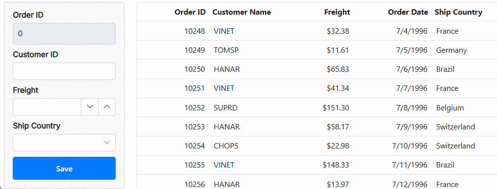

# Editing in Blazor DataGrid

The Syncfusion<sup style="font-size:70%">&reg;</sup> Blazor DataGrid provides powerful options for dynamically inserting, deleting, and updating records, enabling to modify data directly within the Grid. This feature is useful for performing CRUD (Create, Read, Update and Delete) operations seamlessly.

To enable editing functionality directly within the Grid, editing requires configure the [AllowEditing](https://help.syncfusion.com/cr/blazor/Syncfusion.Blazor.Grids.GridEditSettings.html#Syncfusion_Blazor_Grids_GridEditSettings_AllowEditing), [AllowAdding](https://help.syncfusion.com/cr/blazor/Syncfusion.Blazor.Grids.GridEditSettings.html#Syncfusion_Blazor_Grids_GridEditSettings_AllowAdding), and [AllowDeleting](https://help.syncfusion.com/cr/blazor/Syncfusion.Blazor.Grids.GridEditSettings.html#Syncfusion_Blazor_Grids_GridEditSettings_AllowDeleting) properties within the [GridEditSettings](https://help.syncfusion.com/cr/blazor/Syncfusion.Blazor.Grids.GridEditSettings.html) to **true**.

The editing feature requires a primary key column for CRUD operations. To define the primary key, set [Columns.IsPrimaryKey](https://help.syncfusion.com/cr/blazor/Syncfusion.Blazor.Grids.GridColumn.html#Syncfusion_Blazor_Grids_GridColumn_IsPrimaryKey) to **true** in the relevant column.

Edit actions can be initiated by double-clicking a row or by selecting a row and clicking the **Edit** button in the toolbar. New records can be added by clicking the **Add** button in the toolbar or by invoking the [AddRecord](https://help.syncfusion.com/cr/blazor/Syncfusion.Blazor.Grids.SfGrid-1.html#Syncfusion_Blazor_Grids_SfGrid_1_AddRecord) method externally. **Save** and **Cancel** actions during edit mode are available through the respective toolbar icons. Records can be deleted by selecting a row and clicking the **Delete** button in the toolbar.

To learn about the available edit modes and edit types in the Grid, editing can be configured to check out this video.






@page "/"
@using Syncfusion.Blazor.Grids

<SfGrid DataSource="@Orders" height="273px">
    <GridEditSettings AllowAdding="true" AllowEditing="true" AllowDeleting="true"></GridEditSettings>
    <GridColumns>
        <GridColumn Field=@nameof(OrderData.OrderID) HeaderText="Order ID" IsPrimaryKey="true" TextAlign="TextAlign.Right" Width="100" ValidationRules="@(new ValidationRules{ Required=true})"></GridColumn>
        <GridColumn Field=@nameof(OrderData.CustomerID) HeaderText="Customer Name" Width="120" ValidationRules="@(new ValidationRules{ Required=true})"></GridColumn>
        <GridColumn Field=@nameof(OrderData.Freight) HeaderText="Freight" Format="C2" TextAlign="TextAlign.Right" Width="120" EditType="EditType.NumericEdit" ValidationRules="@(new ValidationRules{ Required=true,Min=1,Max=1000})"></GridColumn>
        <GridColumn Field=@nameof(OrderData.ShipCountry) HeaderText="ShipCountry" EditType="EditType.DropDownEdit" TextAlign="TextAlign.Right" Width="150"></GridColumn>
    </GridColumns>
</SfGrid>

@code {
    public List<OrderData> Orders { get; set; }
    protected override void OnInitialized()
    {
        Orders = OrderData.GetAllRecords();
    }
}





public class OrderData
{
    public static List<OrderData> Orders = new List<OrderData>();

    public OrderData() { }

    public OrderData(int OrderID, string CustomerID, string ShipName, double Freight, DateTime? OrderDate, DateTime? ShippedDate, bool? IsVerified, string ShipCity, string ShipCountry, int employeeID)
    {
        this.OrderID = OrderID;
        this.CustomerID = CustomerID;
        this.ShipName = ShipName;
        this.Freight = Freight;
        this.OrderDate = OrderDate;
        this.ShippedDate = ShippedDate;
        this.IsVerified = IsVerified;
        this.ShipCity = ShipCity;
        this.ShipCountry = ShipCountry;
        this.EmployeeID = employeeID; 
    }

    public static List<OrderData> GetAllRecords()
    {
        if (Orders.Count == 0)
        {
            Orders.Add(new OrderData(10248, "VINET", "Vins et alcools Chevalier", 32.38, new DateTime(1996, 7, 4), new DateTime(1996, 08, 07), true, "Reims", "France", 1));
            Orders.Add(new OrderData(10249, "TOMSP", "Toms Spezialitäten", 11.61, new DateTime(1996, 7, 5), new DateTime(1996, 08, 07), false, "Münster", "Germany", 2));
            Orders.Add(new OrderData(10250, "HANAR", "Hanari Carnes", 65.83, new DateTime(1996, 7, 6), new DateTime(1996, 08, 07), true, "Rio de Janeiro", "Brazil", 3));
            Orders.Add(new OrderData(10251, "VINET", "Vins et alcools Chevalier", 41.34, new DateTime(1996, 7, 7), new DateTime(1996, 08, 07), false, "Lyon", "France", 1));
            Orders.Add(new OrderData(10252, "SUPRD", "Suprêmes délices", 151.30, new DateTime(1996, 7, 8), new DateTime(1996, 08, 07), true, "Charleroi", "Belgium", 2));
            Orders.Add(new OrderData(10253, "HANAR", "Hanari Carnes", 58.17, new DateTime(1996, 7, 9), new DateTime(1996, 08, 07), false, "Bern", "Switzerland", 3));
            Orders.Add(new OrderData(10254, "CHOPS", "Chop-suey Chinese", 22.98, new DateTime(1996, 7, 10), new DateTime(1996, 08, 07), true, "Genève", "Switzerland", 2));
            Orders.Add(new OrderData(10255, "VINET", "Vins et alcools Chevalier", 148.33, new DateTime(1996, 7, 11), new DateTime(1996, 08, 07), false, "Resende", "Brazil", 1));
            Orders.Add(new OrderData(10256, "HANAR", "Hanari Carnes", 13.97, new DateTime(1996, 7, 12), new DateTime(1996, 08, 07), true, "Paris", "France", 3));
        }
        return Orders;
    }

    public int OrderID { get; set; }
    public string CustomerID { get; set; }
    public string ShipName { get; set; }
    public double? Freight { get; set; }
    public DateTime? OrderDate { get; set; }
    public DateTime? ShippedDate { get; set; }
    public bool? IsVerified { get; set; }
    public string ShipCity { get; set; }
    public string ShipCountry { get; set; }
    public int EmployeeID { get; set; } 
}


      



> * The Grid uses `Activator.CreateInstance<TValue>()` to generate a new record when an insert operation is invoked, so the model class and any referenced complex type classes must have parameterless constructors defined. To provide custom logic for object creation during editing, refer to [this section](#provide-new-item-or-edited-item-using-events).
> * If [IsIdentity](https://help.syncfusion.com/cr/blazor/Syncfusion.Blazor.Grids.GridColumn.html#Syncfusion_Blazor_Grids_GridColumn_IsIdentity) is enabled, the column will be treated as read-only when editing or adding a record.
> * It is possible to disable editing for a specific column by setting [Columns.AllowEditing](https://help.syncfusion.com/cr/blazor/Syncfusion.Blazor.Grids.GridColumn.html#Syncfusion_Blazor_Grids_GridColumn_AllowEditing) to **false**.
> * It is possible to disable adding for a particular column by setting [AllowAdding](https://help.syncfusion.com/cr/blazor/Syncfusion.Blazor.Grids.GridColumn.html#Syncfusion_Blazor_Grids_GridColumn_AllowAdding) to **false**.
> * It is possible to disable editing of a record on double-click by setting [EditSettings.AllowEditOnDblClick](https://help.syncfusion.com/cr/blazor/Syncfusion.Blazor.Grids.GridEditSettings.html#Syncfusion_Blazor_Grids_GridEditSettings_AllowEditOnDblClick) to **false**.
> * It is possible to use the **Insert** key to add a new row to the Grid and the **Delete** key to remove the selected row from the Grid.

## Toolbar with edit option

The toolbar editing feature in the Syncfusion<sup style="font-size:70%">&reg;</sup> Blazor DataGrid provides a [built-in toolbar](https://blazor.syncfusion.com/documentation/datagrid/toolbar-items#built-in-toolbar-item) that includes predefined items for executing editing actions. This functionality enables efficient modification of Grid data, including updating cell values, saving changes, and canceling edits.
To activate this feature, configure the [Toolbar](https://help.syncfusion.com/cr/blazor/Syncfusion.Blazor.Grids.SfGrid-1.html#Syncfusion_Blazor_Grids_SfGrid_1_Toolbar) property of the Grid. This property defines the items displayed in the Grid toolbar. Including items such as **Edit**, **Add**, **Delete**, **Update**, and **Cancel** within the `Toolbar` property enables the corresponding editing actions.




@page "/"
@using Syncfusion.Blazor.Grids

<SfGrid DataSource="@Orders" Toolbar="@(new List<string>() { "Add", "Edit", "Delete", "Cancel", "Update" })" height="273px">
    <GridEditSettings AllowAdding="true" AllowEditing="true" AllowDeleting="true"></GridEditSettings>
    <GridColumns>
        <GridColumn Field=@nameof(OrderData.OrderID) HeaderText="Order ID" IsPrimaryKey="true" TextAlign="TextAlign.Right" Width="120" ValidationRules="@(new ValidationRules{ Required=true,Number=true})"></GridColumn>
        <GridColumn Field=@nameof(OrderData.CustomerID) HeaderText="Customer Name" Width="120" ValidationRules="@(new ValidationRules{ Required=true})"></GridColumn>
        <GridColumn Field=@nameof(OrderData.Freight) HeaderText="Freight" Format="C2" TextAlign="TextAlign.Right" Width="120" ValidationRules="@(new ValidationRules{ Required=true,Number=true})"></GridColumn>
        <GridColumn Field=@nameof(OrderData.ShipCountry) HeaderText="ShipCountry" TextAlign="TextAlign.Right" Width="150" ValidationRules="@(new ValidationRules{ Required=true})"></GridColumn>
    </GridColumns>
</SfGrid>

@code {
    public List<OrderData> Orders { get; set; }

    protected override void OnInitialized()
    {
        Orders = OrderData.GetAllRecords();
    }
}





    public class OrderData
    {
        public static List<OrderData> Orders = new List<OrderData>();

        public OrderData() { }

        public OrderData(int OrderID, string CustomerID, string ShipName, double Freight, DateTime? OrderDate, DateTime? ShippedDate, bool? IsVerified, string ShipCity, string ShipCountry, int employeeID)
        {
            this.OrderID = OrderID;
            this.CustomerID = CustomerID;
            this.ShipName = ShipName;
            this.Freight = Freight;
            this.OrderDate = OrderDate;
            this.ShippedDate = ShippedDate;
            this.IsVerified = IsVerified;
            this.ShipCity = ShipCity;
            this.ShipCountry = ShipCountry;
            this.EmployeeID = employeeID; 
        }

        public static List<OrderData> GetAllRecords()
        {
            if (Orders.Count == 0)
            {
                Orders.Add(new OrderData(10248, "VINET", "Vins et alcools Chevalier", 32.38, new DateTime(1996, 7, 4), new DateTime(1996, 08, 07), true, "Reims", "France", 1));
                Orders.Add(new OrderData(10249, "TOMSP", "Toms Spezialitäten", 11.61, new DateTime(1996, 7, 5), new DateTime(1996, 08, 07), false, "Münster", "Germany", 2));
                Orders.Add(new OrderData(10250, "HANAR", "Hanari Carnes", 65.83, new DateTime(1996, 7, 6), new DateTime(1996, 08, 07), true, "Rio de Janeiro", "Brazil", 3));
                Orders.Add(new OrderData(10251, "VINET", "Vins et alcools Chevalier", 41.34, new DateTime(1996, 7, 7), new DateTime(1996, 08, 07), false, "Lyon", "France", 1));
                Orders.Add(new OrderData(10252, "SUPRD", "Suprêmes délices", 151.30, new DateTime(1996, 7, 8), new DateTime(1996, 08, 07), true, "Charleroi", "Belgium", 2));
                Orders.Add(new OrderData(10253, "HANAR", "Hanari Carnes", 58.17, new DateTime(1996, 7, 9), new DateTime(1996, 08, 07), false, "Bern", "Switzerland", 3));
                Orders.Add(new OrderData(10254, "CHOPS", "Chop-suey Chinese", 22.98, new DateTime(1996, 7, 10), new DateTime(1996, 08, 07), true, "Genève", "Switzerland", 2));
                Orders.Add(new OrderData(10255, "VINET", "Vins et alcools Chevalier", 148.33, new DateTime(1996, 7, 11), new DateTime(1996, 08, 07), false, "Resende", "Brazil", 1));
                Orders.Add(new OrderData(10256, "HANAR", "Hanari Carnes", 13.97, new DateTime(1996, 7, 12), new DateTime(1996, 08, 07), true, "Paris", "France", 3));
            }
            return Orders;
        }

        public int OrderID { get; set; }
        public string CustomerID { get; set; }
        public string ShipName { get; set; }
        public double? Freight { get; set; }
        public DateTime? OrderDate { get; set; }
        public DateTime? ShippedDate { get; set; }
        public bool? IsVerified { get; set; }
        public string ShipCity { get; set; }
        public string ShipCountry { get; set; }
        public int EmployeeID { get; set; } 
    }






## Disable editing for particular column

In the Syncfusion<sup style="font-size:70%">&reg;</sup> Blazor DataGrid, editing can be selectively disabled for individual columns. This capability is particularly useful for columns that contain calculated values or read-only data.
To disable editing for a specific column, configure the [AllowEditing](https://help.syncfusion.com/cr/blazor/Syncfusion.Blazor.Grids.GridColumn.html#Syncfusion_Blazor_Grids_GridColumn_AllowEditing) property of the [GridColumns](https://help.syncfusion.com/cr/blazor/Syncfusion.Blazor.Grids.GridColumn.html) object. Setting this property to **false** prevents editing for the targeted column.

> When the [AllowAdding](https://help.syncfusion.com/cr/blazor/Syncfusion.Blazor.Grids.GridColumn.html#Syncfusion_Blazor_Grids_GridColumn_AllowAdding)  property is configured at the column level, it prevents value insertion into that specific column.




@page "/"
@using Syncfusion.Blazor.Grids
@using Syncfusion.Blazor.DropDowns

<div style="display:flex; margin:3px">
    <label style="padding:  10px 10px 12px 0">Select column to disable editing</label>
    <SfDropDownList style='margin-top:5px; height:30px' Width="130px" DataSource="@ColumnsList" Value="@SelectedColumn">
        <DropDownListFieldSettings Value="Field" Text="HeaderText"></DropDownListFieldSettings>
        <DropDownListEvents TValue="string" TItem="ColumnOption" ValueChange="OnColumnSelectionChange"></DropDownListEvents>
    </SfDropDownList>
</div>
<SfGrid @ref="Grid" DataSource="@Orders" Toolbar="@(new List<string>() { "Add", "Edit", "Delete", "Cancel", "Update" })" AllowPaging="true">
    <GridEditSettings AllowAdding="true" AllowEditing="true" AllowDeleting="true"></GridEditSettings>
    <GridColumns>
        <GridColumn Field=@nameof(OrderData.OrderID) HeaderText="Order ID" IsPrimaryKey="true" TextAlign="TextAlign.Right" Width="120" ValidationRules="@(new ValidationRules{ Required=true})" AllowEditing="@(SelectedColumn != nameof(OrderData.OrderID))"></GridColumn>
        <GridColumn Field=@nameof(OrderData.CustomerID) HeaderText="Customer ID" Width="120" ValidationRules="@(new ValidationRules{ Required=true})" AllowEditing="@(SelectedColumn != nameof(OrderData.CustomerID))"></GridColumn>
        <GridColumn Field=@nameof(OrderData.Freight) HeaderText="Freight" Format="C2" TextAlign="TextAlign.Right" Width="120" EditType="EditType.NumericEdit" ValidationRules="@(new ValidationRules{ Required=true, Min=1, Max=1000})" AllowEditing="@(SelectedColumn != nameof(OrderData.Freight))"></GridColumn>
        <GridColumn Field=@nameof(OrderData.OrderDate) HeaderText="Order Date" EditType="EditType.DatePickerEdit" Format="d" TextAlign="TextAlign.Right" Width="130" AllowEditing="@(SelectedColumn != nameof(OrderData.OrderDate))"></GridColumn>
        <GridColumn Field=@nameof(OrderData.ShipCountry) HeaderText="Ship Country" EditType="EditType.DropDownEdit" TextAlign="TextAlign.Right" Width="150" AllowEditing="@(SelectedColumn != nameof(OrderData.ShipCountry))"></GridColumn>
    </GridColumns>
</SfGrid>

@code {
    public List<OrderData> Orders { get; set; }
    public SfGrid<OrderData> Grid;
    public string SelectedColumn { get; set; } = "OrderID";
    public bool option { get; set; } = true;

    public class ColumnOption
    {
        public string Field { get; set; }
        public string HeaderText { get; set; }
    }

    List<ColumnOption> ColumnsList = new List<ColumnOption>
    {
        new ColumnOption { Field = "OrderID", HeaderText = "Order ID" },
        new ColumnOption { Field = "CustomerID", HeaderText = "Customer ID" },
        new ColumnOption { Field = "Freight", HeaderText = "Freight" },
        new ColumnOption { Field = "OrderDate", HeaderText = "Order Date" },
        new ColumnOption { Field = "ShipCountry", HeaderText = "Ship Country" }
    };

    protected override void OnInitialized()
    {
        Orders = OrderData.GetAllRecords();
    }
    private void OnColumnSelectionChange(ChangeEventArgs<string, ColumnOption> args)
    {
        SelectedColumn = args.Value;
    }
}





public class OrderData
{
    public static List<OrderData> Orders = new List<OrderData>();

    public OrderData() { }

    public OrderData(int OrderID, string CustomerID, string ShipName, double Freight, DateTime? OrderDate, DateTime? ShippedDate, bool? IsVerified, string ShipCity, string ShipCountry, int employeeID)
    {
        this.OrderID = OrderID;
        this.CustomerID = CustomerID;
        this.ShipName = ShipName;
        this.Freight = Freight;
        this.OrderDate = OrderDate;
        this.ShippedDate = ShippedDate;
        this.IsVerified = IsVerified;
        this.ShipCity = ShipCity;
        this.ShipCountry = ShipCountry;
        this.EmployeeID = employeeID; 
    }

    public static List<OrderData> GetAllRecords()
    {
        if (Orders.Count == 0)
        {
            Orders.Add(new OrderData(10248, "VINET", "Vins et alcools Chevalier", 32.38, new DateTime(1996, 7, 4), new DateTime(1996, 08, 07), true, "Reims", "France", 1));
            Orders.Add(new OrderData(10249, "TOMSP", "Toms Spezialitäten", 11.61, new DateTime(1996, 7, 5), new DateTime(1996, 08, 07), false, "Münster", "Germany", 2));
            Orders.Add(new OrderData(10250, "HANAR", "Hanari Carnes", 65.83, new DateTime(1996, 7, 6), new DateTime(1996, 08, 07), true, "Rio de Janeiro", "Brazil", 3));
            Orders.Add(new OrderData(10251, "VINET", "Vins et alcools Chevalier", 41.34, new DateTime(1996, 7, 7), new DateTime(1996, 08, 07), false, "Lyon", "France", 1));
            Orders.Add(new OrderData(10252, "SUPRD", "Suprêmes délices", 151.30, new DateTime(1996, 7, 8), new DateTime(1996, 08, 07), true, "Charleroi", "Belgium", 2));
            Orders.Add(new OrderData(10253, "HANAR", "Hanari Carnes", 58.17, new DateTime(1996, 7, 9), new DateTime(1996, 08, 07), false, "Bern", "Switzerland", 3));
            Orders.Add(new OrderData(10254, "CHOPS", "Chop-suey Chinese", 22.98, new DateTime(1996, 7, 10), new DateTime(1996, 08, 07), true, "Genève", "Switzerland", 2));
            Orders.Add(new OrderData(10255, "VINET", "Vins et alcools Chevalier", 148.33, new DateTime(1996, 7, 11), new DateTime(1996, 08, 07), false, "Resende", "Brazil", 1));
            Orders.Add(new OrderData(10256, "HANAR", "Hanari Carnes", 13.97, new DateTime(1996, 7, 12), new DateTime(1996, 08, 07), true, "Paris", "France", 3));
        }
        return Orders;
    }

    public int OrderID { get; set; }
    public string CustomerID { get; set; }
    public string ShipName { get; set; }
    public double? Freight { get; set; }
    public DateTime? OrderDate { get; set; }
    public DateTime? ShippedDate { get; set; }
    public bool? IsVerified { get; set; }
    public string ShipCity { get; set; }
    public string ShipCountry { get; set; }
    public int EmployeeID { get; set; } 
}






> * When the [IsPrimaryKey](https://help.syncfusion.com/cr/blazor/Syncfusion.Blazor.Grids.GridColumn.html#Syncfusion_Blazor_Grids_GridColumn_IsPrimaryKey) property is set to **true** for a column, editing is automatically disabled for that column.
> * To disable editing for a specific row, use the [RowEditing](https://blazor.syncfusion.com/documentation/datagrid/events#rowediting) event.
> * To disable editing for a specific cell, use the [OnCellEdit](https://help.syncfusion.com/cr/blazor/Syncfusion.Blazor.Grids.GridEvents-1.html#Syncfusion_Blazor_Grids_GridEvents_1_OnCellEdit) event. The event triggers when a cell enters edit mode during batch editing, allowing cancellation of editing for that cell based on custom conditions.

## Editing template column

The editing template column feature in the Syncfusion<sup style="font-size:70%">&reg;</sup> Blazor DataGrid enables the creation of custom editing templates for specific columns. This functionality is particularly beneficial for customizing the editing experience, such as integrating custom input controls or displaying additional contextual information during editing.

To enable this functionality, set the [Field](https://help.syncfusion.com/cr/blazor/Syncfusion.Blazor.Grids.GridColumn.html#Syncfusion_Blazor_Grids_GridColumn_Field) property for the target column in the Grid configuration. The `Field` property associates the column with the corresponding field in the data source, allowing value editing for that field.




@page "/"
@using Syncfusion.Blazor.Grids
@using Syncfusion.Blazor.DropDowns
@using Syncfusion.Blazor.Inputs

<SfGrid DataSource="@Orders" Toolbar="@(new string[] {"Add", "Edit" ,"Delete","Update","Cancel" })">
    <GridEditSettings AllowAdding="true" AllowEditing="true" AllowDeleting="true">
    </GridEditSettings>
    <GridColumns>
        <GridColumn Field=@nameof(OrderData.OrderID) HeaderText="Order ID" IsPrimaryKey="true" TextAlign="TextAlign.Right" Width="100" ValidationRules="@(new ValidationRules{ Required=true})"></GridColumn>
        <GridColumn Field=@nameof(OrderData.CustomerID) HeaderText="Customer Name" Width="120" ValidationRules="@(new ValidationRules{ Required=true})"></GridColumn>
        <GridColumn Field=@nameof(OrderData.Freight) HeaderText="Freight" Format="C2" TextAlign="TextAlign.Right" Width="120" EditType="EditType.NumericEdit" ValidationRules="@(new ValidationRules{ Required=true,Min=1,Max=1000})"></GridColumn>
        <GridColumn Field=@nameof(OrderData.ShipCountry) HeaderText="ShipCountry" EditType="EditType.DropDownEdit" TextAlign="TextAlign.Right" Width="150">
            <Template>
                @{
                    var Order = (context as OrderData);
                    <div>
                        <a href="#">@(Order.ShipCountry)</a>
                    </div>
                }
            </Template>
        </GridColumn>
    </GridColumns>
</SfGrid>

@code {
    public List<OrderData> Orders { get; set; }
    protected override void OnInitialized()
    {
        Orders = OrderData.GetAllRecords();
    }
}





public class OrderData
{
    public static List<OrderData> Orders = new List<OrderData>();

    public OrderData() { }

    public OrderData(int OrderID, string CustomerID, string ShipName, double Freight, DateTime? OrderDate, DateTime? ShippedDate, bool? IsVerified, string ShipCity, string ShipCountry, int employeeID)
    {
        this.OrderID = OrderID;
        this.CustomerID = CustomerID;
        this.ShipName = ShipName;
        this.Freight = Freight;
        this.OrderDate = OrderDate;
        this.ShippedDate = ShippedDate;
        this.IsVerified = IsVerified;
        this.ShipCity = ShipCity;
        this.ShipCountry = ShipCountry;
        this.EmployeeID = employeeID; 
    }

    public static List<OrderData> GetAllRecords()
    {
        if (Orders.Count == 0)
        {
            Orders.Add(new OrderData(10248, "VINET", "Vins et alcools Chevalier", 32.38, new DateTime(1996, 7, 4), new DateTime(1996, 08, 07), true, "Reims", "France", 1));
            Orders.Add(new OrderData(10249, "TOMSP", "Toms Spezialitäten", 11.61, new DateTime(1996, 7, 5), new DateTime(1996, 08, 07), false, "Münster", "Germany", 2));
            Orders.Add(new OrderData(10250, "HANAR", "Hanari Carnes", 65.83, new DateTime(1996, 7, 6), new DateTime(1996, 08, 07), true, "Rio de Janeiro", "Brazil", 3));
            Orders.Add(new OrderData(10251, "VINET", "Vins et alcools Chevalier", 41.34, new DateTime(1996, 7, 7), new DateTime(1996, 08, 07), false, "Lyon", "France", 1));
            Orders.Add(new OrderData(10252, "SUPRD", "Suprêmes délices", 151.30, new DateTime(1996, 7, 8), new DateTime(1996, 08, 07), true, "Charleroi", "Belgium", 2));
            Orders.Add(new OrderData(10253, "HANAR", "Hanari Carnes", 58.17, new DateTime(1996, 7, 9), new DateTime(1996, 08, 07), false, "Bern", "Switzerland", 3));
            Orders.Add(new OrderData(10254, "CHOPS", "Chop-suey Chinese", 22.98, new DateTime(1996, 7, 10), new DateTime(1996, 08, 07), true, "Genève", "Switzerland", 2));
            Orders.Add(new OrderData(10255, "VINET", "Vins et alcools Chevalier", 148.33, new DateTime(1996, 7, 11), new DateTime(1996, 08, 07), false, "Resende", "Brazil", 1));
            Orders.Add(new OrderData(10256, "HANAR", "Hanari Carnes", 13.97, new DateTime(1996, 7, 12), new DateTime(1996, 08, 07), true, "Paris", "France", 3));
        }
        return Orders;
    }

    public int OrderID { get; set; }
    public string CustomerID { get; set; }
    public string ShipName { get; set; }
    public double? Freight { get; set; }
    public DateTime? OrderDate { get; set; }
    public DateTime? ShippedDate { get; set; }
    public bool? IsVerified { get; set; }
    public string ShipCity { get; set; }
    public string ShipCountry { get; set; }
    public int EmployeeID { get; set; } 
}






## Customize delete confirmation dialog

The Syncfusion<sup style="font-size:70%">&reg;</sup> Blazor DataGrid includes a built-in delete confirmation dialog that prompts before removing a record. This confirmation step helps prevent accidental deletions by requiring explicit acknowledgment before the action is completed.

To enable the default confirmation dialog, set the [ShowDeleteConfirmDialog](https://help.syncfusion.com/cr/blazor/Syncfusion.Blazor.Grids.GridEditSettings.html#Syncfusion_Blazor_Grids_GridEditSettings_ShowDeleteConfirmDialog) property to **true** in the `GridEditSettings`. This displays a standard dialog when a delete action is triggered.

The delete confirmation dialog can be customized to modify its appearance, content, and behavior. Properties such as `Header`, `ShowCloseIcon`, and `Height` can be adjusted as needed.

To fully customize the confirmation dialog, use the [RowDeleting](https://help.syncfusion.com/cr/blazor/Syncfusion.Blazor.Grids.RowDeletingEventArgs-1.html) event of the Grid. This event enables cancellation of the default delete action and rendering of a custom dialog using the [SfDialog](https://blazor.syncfusion.com/documentation/dialog/getting-started-with-web-app) component.
To implement a custom delete confirmation dialog:

- Enable delete functionality by setting [AllowDeleting](https://help.syncfusion.com/cr/blazor/Syncfusion.Blazor.Grids.GridEditSettings.html#Syncfusion_Blazor_Grids_GridEditSettings_AllowDeleting) to **true** in `GridEditSettings`.
- Use an `SfDialog` to define the custom confirmation dialog.
- Handle the [RowDeleting](https://help.syncfusion.com/cr/blazor/Syncfusion.Blazor.Grids.GridEvents-1.html#Syncfusion_Blazor_Grids_GridEvents_1_RowDeleting) event to cancel the default behavior and display the custom dialog.
- In the dialog’s **OK** button click event, invoke the [DeleteRecordAsync](https://help.syncfusion.com/cr/blazor/Syncfusion.Blazor.Grids.SfGrid-1.html#Syncfusion_Blazor_Grids_SfGrid_1_DeleteRecordAsync) method to manually delete the selected record.
- In the **Discard** button click event, cancel the delete action by hiding the dialog using a Boolean flag.




@page "/"
@using Syncfusion.Blazor.Grids
@using Syncfusion.Blazor.Popups

<SfDialog @ref="Dialog" Width="350px" Visible="isDialogVisible" ShowCloseIcon="true" IsModal="true">
    <DialogEvents Closed="Closed"></DialogEvents>
    <DialogTemplates>
        <Header>Delete Confirmation Dialog</Header>
        <Content>
            Are you sure you want to delete the selected Record?
        </Content>
    </DialogTemplates>
    <DialogButtons>
        <DialogButton OnClick="@okClick" Content="YES" IsPrimary="true"></DialogButton>
        <DialogButton OnClick="@cancelClick" Content="Discard"></DialogButton>
    </DialogButtons>
</SfDialog>

<SfGrid @ref="Grid" DataSource="@Orders" Toolbar="@(new List<string>() { "Delete" })">
    <GridEvents TValue="OrderData" RowDeleting="RowDeleting"></GridEvents>
    <GridEditSettings AllowDeleting="true" Mode="Syncfusion.Blazor.Grids.EditMode.Normal"></GridEditSettings>
    <GridColumns>
        <GridColumn Field=@nameof(OrderData.OrderID) HeaderText="Order ID" IsPrimaryKey="true"  Width="120"></GridColumn>
        <GridColumn Field=@nameof(OrderData.CustomerID) HeaderText="Customer Name" Width="120"></GridColumn>
        <GridColumn Field=@nameof(OrderData.ShipCity) HeaderText="Ship City" Width="150"></GridColumn>
        <GridColumn Field=@nameof(OrderData.ShipCountry) HeaderText="Ship Country" Width="150"></GridColumn>
    </GridColumns>
</SfGrid>

@code {
    SfGrid<OrderData> Grid;
    SfDialog Dialog;
    public List<OrderData> Orders { get; set; }
    public object SelectedData;

    // Boolean to control the visibility of the dialog.
    public bool isDialogVisible { get; set; } = false;

    // Flag to prevent multiple dialog triggers.
    public bool flag = true;

    // Reset the flag when the dialog is closed.
    public void Closed()
    {
        flag = true;
    }

    // Trigger the dialog visibility during the delete action.
    public void RowDeleting(Syncfusion.Blazor.Grids.RowDeletingEventArgs<OrderData> Args)
    {
        if (flag)
        {
            Args.Cancel = true; // Cancel the default delete action.
            flag = false;
            isDialogVisible = true; // Show the dialog.
        }
    }

    // Confirm the delete action and delete the record programmatically.
    private async Task okClick()
    {
        await Grid.DeleteRecordAsync(); // Delete the record.
        isDialogVisible = false; // Hide the dialog.
    }

    // Cancel the delete action and hide the dialog.
    private void cancelClick()
    {
        isDialogVisible = false; // Hide the dialog.
    }

    protected override void OnInitialized()
    {
        Orders = OrderData.GetAllRecords();
    }
}





public class OrderData
{
    public static List<OrderData> Orders = new List<OrderData>();

    public OrderData() { }

    public OrderData(int OrderID, string CustomerID, string ShipName, double Freight, DateTime? OrderDate, DateTime? ShippedDate, bool? IsVerified, string ShipCity, string ShipCountry, int employeeID)
    {
        this.OrderID = OrderID;
        this.CustomerID = CustomerID;
        this.ShipName = ShipName;
        this.Freight = Freight;
        this.OrderDate = OrderDate;
        this.ShippedDate = ShippedDate;
        this.IsVerified = IsVerified;
        this.ShipCity = ShipCity;
        this.ShipCountry = ShipCountry;
        this.EmployeeID = employeeID; 
    }

    public static List<OrderData> GetAllRecords()
    {
        if (Orders.Count == 0)
        {
            Orders.Add(new OrderData(10248, "VINET", "Vins et alcools Chevalier", 32.38, new DateTime(1996, 7, 4), new DateTime(1996, 08, 07), true, "Reims", "France", 1));
            Orders.Add(new OrderData(10249, "TOMSP", "Toms Spezialitäten", 11.61, new DateTime(1996, 7, 5), new DateTime(1996, 08, 07), false, "Münster", "Germany", 2));
            Orders.Add(new OrderData(10250, "HANAR", "Hanari Carnes", 65.83, new DateTime(1996, 7, 6), new DateTime(1996, 08, 07), true, "Rio de Janeiro", "Brazil", 3));
            Orders.Add(new OrderData(10251, "VINET", "Vins et alcools Chevalier", 41.34, new DateTime(1996, 7, 7), new DateTime(1996, 08, 07), false, "Lyon", "France", 1));
            Orders.Add(new OrderData(10252, "SUPRD", "Suprêmes délices", 151.30, new DateTime(1996, 7, 8), new DateTime(1996, 08, 07), true, "Charleroi", "Belgium", 2));
            Orders.Add(new OrderData(10253, "HANAR", "Hanari Carnes", 58.17, new DateTime(1996, 7, 9), new DateTime(1996, 08, 07), false, "Bern", "Switzerland", 3));
            Orders.Add(new OrderData(10254, "CHOPS", "Chop-suey Chinese", 22.98, new DateTime(1996, 7, 10), new DateTime(1996, 08, 07), true, "Genève", "Switzerland", 2));
            Orders.Add(new OrderData(10255, "VINET", "Vins et alcools Chevalier", 148.33, new DateTime(1996, 7, 11), new DateTime(1996, 08, 07), false, "Resende", "Brazil", 1));
            Orders.Add(new OrderData(10256, "HANAR", "Hanari Carnes", 13.97, new DateTime(1996, 7, 12), new DateTime(1996, 08, 07), true, "Paris", "France", 3));
        }
        return Orders;
    }

    public int OrderID { get; set; }
    public string CustomerID { get; set; }
    public string ShipName { get; set; }
    public double? Freight { get; set; }
    public DateTime? OrderDate { get; set; }
    public DateTime? ShippedDate { get; set; }
    public bool? IsVerified { get; set; }
    public string ShipCity { get; set; }
    public string ShipCountry { get; set; }
    public int EmployeeID { get; set; } 
}






## Update boolean column value with a single click

The Syncfusion<sup style="font-size:70%">&reg;</sup> Blazor DataGrid supports updating boolean column values with a single click in normal editing mode. This feature streamlines the process of toggling boolean values directly within the Grid, improving interaction efficiency.

This behavior can be achieved using the [column template](https://blazor.syncfusion.com/documentation/datagrid/column-template) feature. The column template allows custom UI elements, such as checkboxes, to be rendered for specific columns. By configuring the [Template](https://help.syncfusion.com/cr/blazor/Syncfusion.Blazor.Grids.GridColumn.html#Syncfusion_Blazor_Grids_GridColumn_Template) property, a checkbox can be rendered in the desired column, and its change event can be handled to update the value with a single click.




@page "/"
@using Syncfusion.Blazor.Grids
@using Syncfusion.Blazor.Buttons
@using Syncfusion.Blazor.Inputs

<SfGrid DataSource="@Orders" Height="315px" Toolbar="@(new string[] {"Add", "Edit" ,"Delete","Update","Cancel" })">
    <GridEditSettings AllowAdding="true" AllowEditing="true" AllowDeleting="true">
    </GridEditSettings>
    <GridColumns>
        <GridColumn Field=@nameof(OrderData.OrderID) HeaderText="Order ID" IsPrimaryKey="true" TextAlign="TextAlign.Right" Width="100" ValidationRules="@(new ValidationRules{ Required=true})"></GridColumn>
        <GridColumn Field=@nameof(OrderData.CustomerID) HeaderText="Customer Name" Width="120" ValidationRules="@(new ValidationRules{ Required=true})"></GridColumn>
        <GridColumn Field=@nameof(OrderData.OrderDate) HeaderText="OrderDate" Format="d" TextAlign="TextAlign.Right" Width="120" EditType="EditType.DatePickerEdit" ValidationRules="@(new ValidationRules{ Required=true})"></GridColumn>
        <GridColumn Field=@nameof(OrderData.Freight) HeaderText="Freight" Format="C2" TextAlign="TextAlign.Right" Width="120" EditType="EditType.NumericEdit" ValidationRules="@(new ValidationRules{ Required=true,Min=1,Max=1000})"></GridColumn>
        <GridColumn Field=@nameof(OrderData.IsVerified) HeaderText="Verified" TextAlign="TextAlign.Right" Width="150" ValidationRules="@(new ValidationRules{ Required=true})">
            <Template>
                @{
                    var Order = (context as OrderData);
                    <SfCheckBox Checked="@(Order.IsVerified)"></SfCheckBox>
                }
            </Template>
        </GridColumn>
    </GridColumns>
</SfGrid>

@code {
    public List<OrderData> Orders { get; set; }

    protected override void OnInitialized()
    {
        Orders = OrderData.GetAllRecords();
    }
}





public class OrderData
{
    public static List<OrderData> Orders = new List<OrderData>();

    public OrderData() { }

    public OrderData(int OrderID, string CustomerID, string ShipName, double Freight, DateTime? OrderDate, DateTime? ShippedDate, bool? IsVerified, string ShipCity, string ShipCountry, int employeeID)
    {
        this.OrderID = OrderID;
        this.CustomerID = CustomerID;
        this.ShipName = ShipName;
        this.Freight = Freight;
        this.OrderDate = OrderDate;
        this.ShippedDate = ShippedDate;
        this.IsVerified = IsVerified;
        this.ShipCity = ShipCity;
        this.ShipCountry = ShipCountry;
        this.EmployeeID = employeeID; 
    }

    public static List<OrderData> GetAllRecords()
    {
        if (Orders.Count == 0)
        {
            Orders.Add(new OrderData(10248, "VINET", "Vins et alcools Chevalier", 32.38, new DateTime(1996, 7, 4), new DateTime(1996, 08, 07), true, "Reims", "France", 1));
            Orders.Add(new OrderData(10249, "TOMSP", "Toms Spezialitäten", 11.61, new DateTime(1996, 7, 5), new DateTime(1996, 08, 07), false, "Münster", "Germany", 2));
            Orders.Add(new OrderData(10250, "HANAR", "Hanari Carnes", 65.83, new DateTime(1996, 7, 6), new DateTime(1996, 08, 07), true, "Rio de Janeiro", "Brazil", 3));
            Orders.Add(new OrderData(10251, "VINET", "Vins et alcools Chevalier", 41.34, new DateTime(1996, 7, 7), new DateTime(1996, 08, 07), false, "Lyon", "France", 1));
            Orders.Add(new OrderData(10252, "SUPRD", "Suprêmes délices", 151.30, new DateTime(1996, 7, 8), new DateTime(1996, 08, 07), true, "Charleroi", "Belgium", 2));
            Orders.Add(new OrderData(10253, "HANAR", "Hanari Carnes", 58.17, new DateTime(1996, 7, 9), new DateTime(1996, 08, 07), false, "Bern", "Switzerland", 3));
            Orders.Add(new OrderData(10254, "CHOPS", "Chop-suey Chinese", 22.98, new DateTime(1996, 7, 10), new DateTime(1996, 08, 07), true, "Genève", "Switzerland", 2));
            Orders.Add(new OrderData(10255, "VINET", "Vins et alcools Chevalier", 148.33, new DateTime(1996, 7, 11), new DateTime(1996, 08, 07), false, "Resende", "Brazil", 1));
            Orders.Add(new OrderData(10256, "HANAR", "Hanari Carnes", 13.97, new DateTime(1996, 7, 12), new DateTime(1996, 08, 07), true, "Paris", "France", 3));
        }
        return Orders;
    }

    public int OrderID { get; set; }
    public string CustomerID { get; set; }
    public string ShipName { get; set; }
    public double? Freight { get; set; }
    public DateTime? OrderDate { get; set; }
    public DateTime? ShippedDate { get; set; }
    public bool? IsVerified { get; set; }
    public string ShipCity { get; set; }
    public string ShipCountry { get; set; }
    public int EmployeeID { get; set; } 
}






## Edit enum column

The Syncfusion<sup style="font-size:70%">&reg;</sup> Blazor DataGrid provides a feature for editing enum-type data within a Grid column, making it particularly useful for efficiently managing enumerated list data.

In the example below, the [DropDownList](https://blazor.syncfusion.com/documentation/dropdown-list/getting-started-with-web-app) is used within the [EditTemplate](https://help.syncfusion.com/cr/blazor/Syncfusion.Blazor.Grids.GridColumn.html#Syncfusion_Blazor_Grids_GridColumn_EditTemplate) for the **Employee Feedback** column. The enumerated list data is bound to the **Employee Feedback** column using two-way binding (@bind-Value).




@using Syncfusion.Blazor.Grids
@using Syncfusion.Blazor.Inputs
@using Syncfusion.Blazor.DropDowns

<SfGrid DataSource="@Details" Toolbar="@(new List<string>() { "Add", "Edit", "Delete", "Cancel", "Update" })" >
    <GridEditSettings AllowAdding="true" AllowEditing="true" AllowDeleting="true" Mode="EditMode.Normal">
    </GridEditSettings>
    <GridColumns>
        <GridColumn Field="@nameof(EmployeeDetails.Id)" HeaderText="Employee ID" IsPrimaryKey="true" TextAlign="TextAlign.Center" Width="90"></GridColumn>
        <GridColumn Field="@nameof(EmployeeDetails.CustomerID)" HeaderText="Employee Name" TextAlign="TextAlign.Center" Width="100"></GridColumn>
        <GridColumn Field="@nameof(EmployeeDetails.FeedbackDetails)" HeaderText="Employee Feedback" Type="ColumnType.Number" Width="120">
            <EditTemplate>
                @{
                    var Order = (context as EmployeeDetails);
                    <SfDropDownList @ref="DropDownList" ID="Edge" DataSource="@DropDownEnumValue" @bind-Value="@((context as EmployeeDetails).FeedbackDetails)" TValue="Feedback" TItem="string" Placeholder="Feedback Detail" FloatLabelType="FloatLabelType.Always">
                    </SfDropDownList>
                }
            </EditTemplate>
        </GridColumn>
    </GridColumns>
</SfGrid>

@code{
    SfDropDownList<Feedback, string> DropDownList;
    public List<string> DropDownEnumValue = new List<string>();
    public enum Feedback
    {
        Positive = 0,
        Negative = 1
    }

    public class EmployeeDetails
    {

        public int Id { get; set; }
        public string CustomerID { get; set; }
        public Feedback FeedbackDetails { get; set; }

    }
    protected override void OnInitialized()
    {
        foreach (string item in Enum.GetNames(typeof(Feedback)))
        {
            DropDownEnumValue.Add(item);
        }
    }
    public List<EmployeeDetails> Details = Enumerable.Range(1, 8).Select(x => new EmployeeDetails()
    {
        Id = x,
        CustomerID = (new string[] { "ALFKI", "ANANTR", "ANTON", "BLONP", "BOLID", "PETER", "BLOP", "CHRISTN" })[new Random().Next(8)],
        FeedbackDetails = Feedback.Positive,
    }).ToList();
}






## Edit complex column

The [EditTemplate](https://help.syncfusion.com/cr/blazor/Syncfusion.Blazor.Grids.GridColumn.html#Syncfusion_Blazor_Grids_GridColumn_EditTemplate) feature for complex columns in the Syncfusion<sup style="font-size:70%">&reg;</sup> Blazor DataGrid enables customization of the editing experience when working with nested data structures. Before performing CRUD operations involving complex objects, refer to the [Complex Data Binding](https://blazor.syncfusion.com/documentation/datagrid/column-rendering#complex-data-generation) documentation.
To customize the default EditForm input component, define an `EditTemplate` within the GridColumn for the complex field. Two-way binding (**@bind-Value**) can be used inside the `EditTemplate` to reflect changes in the DataGrid.
For proper focus management and validation, the `ID` attribute of input elements inside the `EditTemplate` must match the [Field](https://help.syncfusion.com/cr/blazor/Syncfusion.Blazor.Grids.GridColumn.html#Syncfusion_Blazor_Grids_GridColumn_Field) value of the corresponding GridColumn. When referencing complex fields, use a double underscore **(__)** instead of the dot **(.)** operator. For example, if the field is **Name.FirstName**, the `ID` should be defined as **Name__FirstName**.

Ensure that both `ID` and `Name` attributes inside the `EditTemplate` follow the double underscore **(__)** format to avoid issues with validation and focus handling.

In the following example, input elements are rendered in the edit templates of the **FirstName** and **LastName** columns. The edited changes are saved using the `Name` property of the input element. Since the complex data is bound to these columns, the `Name` property should be defined as **Name__FirstName** and **Name__LastName**, respectively, instead of using dot notation (**Name.FirstName** and **Name.LastName**).




@page "/"
@using Syncfusion.Blazor.Grids
@using Syncfusion.Blazor.Inputs

<SfGrid DataSource="@Employees" Height="" Toolbar="@(new List<string>() { "Add", "Edit", "Delete", "Update", "Cancel" })">
    <GridEditSettings AllowAdding="true" AllowEditing="true" AllowDeleting="true" Mode="Syncfusion.Blazor.Grids.EditMode.Normal"></GridEditSettings>
    <GridColumns>
        <GridColumn Field="@nameof(EmployeeDetails.EmployeeID)" HeaderText="Employee ID" TextAlign="Syncfusion.Blazor.Grids.TextAlign.Right" IsPrimaryKey="true" Width="120">
        </GridColumn>
        <GridColumn Field="Name.FirstName" HeaderText="First Name" Width="200">
            <EditTemplate>
                <SfTextBox ID="Name___FirstName" Name="Name___FirstName" @bind-Value="@((context as EmployeeDetails).Name.FirstName)"></SfTextBox>
            </EditTemplate>
        </GridColumn>
        <GridColumn Field="Name.LastName" HeaderText="Last Name" Width="200">
            <EditTemplate>
                <SfTextBox ID="Name___LastName" Name="Name___LastName" @bind-Value="@((context as EmployeeDetails).Name.LastName)"></SfTextBox>
            </EditTemplate>
        </GridColumn>
        <GridColumn Field="@nameof(EmployeeDetails.Title)" HeaderText="Title" Width="150">
        </GridColumn>
    </GridColumns>
</SfGrid>

@code {
    public List<EmployeeDetails> Employees { get; set; }

    protected override void OnInitialized()
    {
        Employees = EmployeeDetails.GetAllRecords();
    }
}




    public class EmployeeDetails
    {
        public EmployeeDetails() { }

        public EmployeeDetails(int employeeID, string firstName, string lastName, string title)
        {
            EmployeeID = employeeID;
            Name = new Name { FirstName = firstName, LastName = lastName };
            Title = title;
        }

        public static List<EmployeeDetails> GetAllRecords()
        {
            return new List<EmployeeDetails>
            {
                new EmployeeDetails(1, "Nancy", "Davolio", "Sales Representative"),
                new EmployeeDetails(2, "Andrew", "Fuller", "Vice President, Sales"),
                new EmployeeDetails(3, "Janet", "Leverling", "Sales Manager"),
                new EmployeeDetails(4, "Margaret", "Peacock", "Inside Sales Coordinator"),
                new EmployeeDetails(5, "Steven", "Buchanan", "Sales Representative"),
                new EmployeeDetails(6, "Michael", "Suyama", "Marketing Coordinator"),
                new EmployeeDetails(7, "Robert", "King", "Sales Representative"),
                new EmployeeDetails(8, "Laura", "Callahan", "Marketing Specialist"),
                new EmployeeDetails(9, "Anne", "Dodsworth", "Sales Manager"),
                new EmployeeDetails(10, "Andrew", "Davies", "Vice President, Operations")
            };
        }

        public int EmployeeID { get; set; }
        public Name Name { get; set; }
        public string Title { get; set; }
    }

    public class Name
    {
        public string FirstName { get; set; }
        public string LastName { get; set; }
    }






## Edit foreign key column

The Syncfusion<sup style="font-size:70%">&reg;</sup> Blazor DataGrid provides advanced editing support for foreign key columns, enhancing the default rendering of the [DropDownList](https://blazor.syncfusion.com/documentation/dropdown-list/getting-started-with-web-app) during edit operations. This flexibility is particularly beneficial when customizing the editor for foreign key fields.
By default, the Grid renders a `DropDownList` as the editor for foreign key columns. To override this behavior, configure the [EditTemplate](https://help.syncfusion.com/cr/blazor/Syncfusion.Blazor.Grids.GridColumn.html#Syncfusion_Blazor_Grids_GridColumn_EditTemplate) property of the GridColumn. The `EditTemplate` allows specification of a cell edit template, which can be defined using either a template string or an HTML element ID.




@page "/"
@using Syncfusion.Blazor.Grids
@using Syncfusion.Blazor.DropDowns

<SfGrid DataSource="@Orders" Height="315" Toolbar="@(new List<string>() { "Add", "Edit", "Delete", "Cancel", "Update" })">
    <GridEditSettings AllowAdding="true" AllowDeleting="true" AllowEditing="true"></GridEditSettings>
    <GridColumns>
        <GridColumn Field=@nameof(OrderData.OrderID) HeaderText="Order ID" TextAlign="TextAlign.Right" IsPrimaryKey="true" Width="120"></GridColumn>
        <GridForeignColumn Field=@nameof(OrderData.EmployeeID) HeaderText="Employee Name" ForeignKeyValue="FirstName" ForeignDataSource="@Employees" Width="150">
            <EditTemplate>
                <SfComboBox TValue="int" TItem="EmployeeData" @bind-Value="@((context as OrderData).EmployeeID)" DataSource="Employees">
                    <ComboBoxFieldSettings Value="EmployeeID" Text="FirstName"></ComboBoxFieldSettings>
                </SfComboBox>
            </EditTemplate>
        </GridForeignColumn>
        <GridColumn Field=@nameof(OrderData.OrderDate) HeaderText="Order Date" Format="d" Type="ColumnType.Date" TextAlign="TextAlign.Right" Width="130"></GridColumn>
        <GridColumn Field=@nameof(OrderData.Freight) HeaderText="Freight" Format="C2" TextAlign="TextAlign.Right" Width="120"></GridColumn>
    </GridColumns>
</SfGrid>

@code {
    public List<OrderData> Orders { get; set; }
    public List<EmployeeData> Employees { get; set; }

    protected override void OnInitialized()
    {
        Employees = EmployeeData.GetAllRecords();
        Orders = OrderData.GetAllRecords();
    }
}





    public class OrderData
    {
        public static List<OrderData> Orders = new List<OrderData>();

        public OrderData() { }

        public OrderData(int OrderID, string CustomerID, string ShipName, double Freight, DateTime? OrderDate, DateTime? ShippedDate, bool? IsVerified, string ShipCity, string ShipCountry, int employeeID)
        {
            this.OrderID = OrderID;
            this.CustomerID = CustomerID;
            this.ShipName = ShipName;
            this.Freight = Freight;
            this.OrderDate = OrderDate;
            this.ShippedDate = ShippedDate;
            this.IsVerified = IsVerified;
            this.ShipCity = ShipCity;
            this.ShipCountry = ShipCountry;
            this.EmployeeID = employeeID; 
        }

        public static List<OrderData> GetAllRecords()
        {
            if (Orders.Count == 0)
            {
                Orders.Add(new OrderData(10248, "VINET", "Vins et alcools Chevalier", 32.38, new DateTime(1996, 7, 4), new DateTime(1996, 08, 07), true, "Reims", "France", 1));
                Orders.Add(new OrderData(10249, "TOMSP", "Toms Spezialitäten", 11.61, new DateTime(1996, 7, 5), new DateTime(1996, 08, 07), false, "Münster", "Germany", 2));
                Orders.Add(new OrderData(10250, "HANAR", "Hanari Carnes", 65.83, new DateTime(1996, 7, 6), new DateTime(1996, 08, 07), true, "Rio de Janeiro", "India", 3));
                Orders.Add(new OrderData(10251, "VINET", "Vins et alcools Chevalier", 41.34, new DateTime(1996, 7, 7), new DateTime(1996, 08, 07), false, "Lyon", "France", 1));
                Orders.Add(new OrderData(10252, "SUPRD", "Suprêmes délices", 151.30, new DateTime(1996, 7, 8), new DateTime(1996, 08, 07), true, "Charleroi", "Belgium", 2));
                Orders.Add(new OrderData(10253, "HANAR", "Hanari Carnes", 58.17, new DateTime(1996, 7, 9), new DateTime(1996, 08, 07), false, "Bern", "Switzerland", 3));
                Orders.Add(new OrderData(10254, "CHOPS", "Chop-suey Chinese", 22.98, new DateTime(1996, 7, 10), new DateTime(1996, 08, 07), true, "Genève", "Switzerland", 2));
                Orders.Add(new OrderData(10255, "VINET", "Vins et alcools Chevalier", 148.33, new DateTime(1996, 7, 11), new DateTime(1996, 08, 07), false, "Resende", "India", 1));
                Orders.Add(new OrderData(10256, "HANAR", "Hanari Carnes", 13.97, new DateTime(1996, 7, 12), new DateTime(1996, 08, 07), true, "Paris", "France", 3));
            }
            return Orders;
        }

        public int OrderID { get; set; }
        public string CustomerID { get; set; }
        public string ShipName { get; set; }
        public double? Freight { get; set; }
        public DateTime? OrderDate { get; set; }
        public DateTime? ShippedDate { get; set; }
        public bool? IsVerified { get; set; }
        public string ShipCity { get; set; }
        public string ShipCountry { get; set; }
        public int EmployeeID { get; set; } 
    }






    public class EmployeeData
    {
        public static List<EmployeeData> Employees = new List<EmployeeData>();

        public EmployeeData() { }

        public EmployeeData(int EmployeeID, string FirstName, string LastName, string Title, string Country, string City, DateTime HireDate )
        {
            this.EmployeeID = EmployeeID;
            this.FirstName = FirstName;
            this.LastName = LastName;
            this.Title = Title;
            this.Country = Country;
            this.City = City;
            this.HireDate = HireDate;
        }

        public static List<EmployeeData> GetAllRecords()
        {
            if (Employees.Count == 0)
            {
                var firstNames = new string[] { "Nancy", "Andrew", "Janet", "Margaret", "Steven" };
                var lastNames = new string[] { "Davolio", "Fuller", "Leverling", "Peacock", "Buchanan" };
                var titles = new string[] { "Sales Representative", "Vice President, Sales", "Sales Manager", "Inside Sales Coordinator" };
                var countries = new string[] { "USA", "UK", "UAE", "NED", "BER" };
                var cities = new string[] { "New York", "London", "Dubai", "Amsterdam", "Berlin" };
                var customerNames = new string[] { "Amazon", "Google", "Microsoft", "Tesla", "Apple" };

                Random random = new Random();
                for (int i = 1; i <= 5; i++)
                {
                    Employees.Add(new EmployeeData(
                        i,
                        firstNames[random.Next(firstNames.Length)],
                        lastNames[random.Next(lastNames.Length)],
                        titles[random.Next(titles.Length)],
                        countries[random.Next(countries.Length)],
                        cities[random.Next(cities.Length)],
                        DateTime.Now.AddDays(-random.Next(1000, 5000)),
                    ));
                }
            }
            return Employees;
        }

        public int EmployeeID { get; set; }
        public string FirstName { get; set; }
        public string LastName { get; set; }
        public string Title { get; set; }
        public string Country { get; set; }
        public string City { get; set; }
        public DateTime HireDate { get; set; }
    }






## How to perform CRUD action externally

The Syncfusion<sup style="font-size:70%">&reg;</sup> Blazor DataGrid supports external execution of CRUD (Create, Read, Update, and Delete) operations, allowing manipulation of Grid data outside the Grid interface. This approach is particularly beneficial in scenarios that require programmatic control over data operations.

### Using separate toolbar

The Syncfusion<sup style="font-size:70%">&reg;</sup> Blazor DataGrid supports external CRUD operations, enabling efficient data manipulation through a separate toolbar. This capability is particularly beneficial when data operations are managed programmatically outside the Grid's built-in UI.

* [AddRecordAsync](https://help.syncfusion.com/cr/blazor/Syncfusion.Blazor.Grids.SfGrid-1.html#Syncfusion_Blazor_Grids_SfGrid_1_AddRecordAsync) - Adds a new record. If no data is passed, the add form is displayed.
* [StartEditAsync](https://help.syncfusion.com/cr/blazor/Syncfusion.Blazor.Grids.SfGrid-1.html#Syncfusion_Blazor_Grids_SfGrid_1_StartEditAsync) - Initiates editing for the selected row.
* [DeleteRecordAsync](https://help.syncfusion.com/cr/blazor/Syncfusion.Blazor.Grids.SfGrid-1.html#Syncfusion_Blazor_Grids_SfGrid_1_DeleteRecordAsync) -  Deletes the selected row.
* [EndEditAsync](https://help.syncfusion.com/cr/blazor/Syncfusion.Blazor.Grids.SfGrid-1.html#Syncfusion_Blazor_Grids_SfGrid_1_EndEditAsync) - Saves the record if the Grid is in an editable state.
* [CloseEditAsync](https://help.syncfusion.com/cr/blazor/Syncfusion.Blazor.Grids.SfGrid-1.html#Syncfusion_Blazor_Grids_SfGrid_1_CloseEditAsync) - Cancels the editing state.

The following example demonstrates how the Grid integrates with a separate toolbar to perform external CRUD operations. The toolbar includes buttons for Add, Edit, Delete, Update, and Cancel.




@page "/"
@using Syncfusion.Blazor.Grids
@using Syncfusion.Blazor.DropDowns
@using Syncfusion.Blazor.Navigations

<SfToolbar>
    <ToolbarEvents Clicked="OnClicked"></ToolbarEvents>
    <ToolbarItems>
        <ToolbarItem Text="Add"></ToolbarItem>
        <ToolbarItem Text="Edit"></ToolbarItem>
        <ToolbarItem Text="Delete"></ToolbarItem>
        <ToolbarItem Text="Update"></ToolbarItem>
        <ToolbarItem Text="Cancel"></ToolbarItem>
    </ToolbarItems>
</SfToolbar>

<SfGrid @ref="Grid" DataSource="@Orders" AllowPaging="true">
    <GridEditSettings AllowAdding="true" AllowDeleting="true" AllowEditing="true"></GridEditSettings>
    <GridColumns>
        <GridColumn Field=@nameof(OrderData.OrderID) HeaderText="Order ID" IsPrimaryKey="true" TextAlign="TextAlign.Right" Width="120"></GridColumn>
        <GridColumn Field=@nameof(OrderData.CustomerID) HeaderText="Customer Name" Width="120"></GridColumn>
        <GridColumn Field=@nameof(OrderData.Freight) HeaderText="Freight" Format="C2" TextAlign="TextAlign.Right" Width="120"></GridColumn>
        <GridColumn Field=@nameof(OrderData.OrderDate) HeaderText=" Order Date" EditType="EditType.DatePickerEdit" Format="d" TextAlign="TextAlign.Right" Width="130" Type="ColumnType.Date"></GridColumn>
        <GridColumn Field=@nameof(OrderData.ShipCountry) HeaderText="Ship Country" Width="150"></GridColumn>
    </GridColumns>
</SfGrid>

@code {

    public List<OrderData> Orders { get; set; }
    SfGrid<OrderData> Grid { get; set; }
    protected override void OnInitialized()
    {
        Orders = OrderData.GetAllRecords();
    }
    public async Task OnClicked(ClickEventArgs Args)
    {
        if (Args.Item.Text == "Add")
        {
            await Grid.AddRecordAsync();
        }
        if (Args.Item.Text == "Edit")
        {
            await Grid.StartEditAsync();
        }
        if (Args.Item.Text == "Delete")
        {
            await Grid.DeleteRecordAsync();
        }
        if (Args.Item.Text == "Update")
        {
            await Grid.EndEditAsync();
        }
        if (Args.Item.Text == "Cancel")
        {
            await Grid.CloseEditAsync();
        }
    }
}





public class OrderData
{
    public static List<OrderData> Orders = new List<OrderData>();

    public OrderData() { }

    public OrderData(int OrderID, string CustomerID, string ShipName, double Freight, DateTime? OrderDate, DateTime? ShippedDate, bool? IsVerified, string ShipCity, string ShipCountry, int employeeID)
    {
        this.OrderID = OrderID;
        this.CustomerID = CustomerID;
        this.ShipName = ShipName;
        this.Freight = Freight;
        this.OrderDate = OrderDate;
        this.ShippedDate = ShippedDate;
        this.IsVerified = IsVerified;
        this.ShipCity = ShipCity;
        this.ShipCountry = ShipCountry;
        this.EmployeeID = employeeID; 
    }

    public static List<OrderData> GetAllRecords()
    {
        if (Orders.Count == 0)
        {
            Orders.Add(new OrderData(10248, "VINET", "Vins et alcools Chevalier", 32.38, new DateTime(1996, 7, 4), new DateTime(1996, 08, 07), true, "Reims", "France", 1));
            Orders.Add(new OrderData(10249, "TOMSP", "Toms Spezialitäten", 11.61, new DateTime(1996, 7, 5), new DateTime(1996, 08, 07), false, "Münster", "Germany", 2));
            Orders.Add(new OrderData(10250, "HANAR", "Hanari Carnes", 65.83, new DateTime(1996, 7, 6), new DateTime(1996, 08, 07), true, "Rio de Janeiro", "Brazil", 3));
            Orders.Add(new OrderData(10251, "VINET", "Vins et alcools Chevalier", 41.34, new DateTime(1996, 7, 7), new DateTime(1996, 08, 07), false, "Lyon", "France", 1));
            Orders.Add(new OrderData(10252, "SUPRD", "Suprêmes délices", 151.30, new DateTime(1996, 7, 8), new DateTime(1996, 08, 07), true, "Charleroi", "Belgium", 2));
            Orders.Add(new OrderData(10253, "HANAR", "Hanari Carnes", 58.17, new DateTime(1996, 7, 9), new DateTime(1996, 08, 07), false, "Bern", "Switzerland", 3));
            Orders.Add(new OrderData(10254, "CHOPS", "Chop-suey Chinese", 22.98, new DateTime(1996, 7, 10), new DateTime(1996, 08, 07), true, "Genève", "Switzerland", 2));
            Orders.Add(new OrderData(10255, "VINET", "Vins et alcools Chevalier", 148.33, new DateTime(1996, 7, 11), new DateTime(1996, 08, 07), false, "Resende", "Brazil", 1));
            Orders.Add(new OrderData(10256, "HANAR", "Hanari Carnes", 13.97, new DateTime(1996, 7, 12), new DateTime(1996, 08, 07), true, "Paris", "France", 3));
        }
        return Orders;
    }

    public int OrderID { get; set; }
    public string CustomerID { get; set; }
    public string ShipName { get; set; }
    public double? Freight { get; set; }
    public DateTime? OrderDate { get; set; }
    public DateTime? ShippedDate { get; set; }
    public bool? IsVerified { get; set; }
    public string ShipCity { get; set; }
    public string ShipCountry { get; set; }
    public int EmployeeID { get; set; } 
}






### Using external form

The Syncfusion<sup style="font-size:70%">&reg;</sup> Blazor DataGrid supports editing operations through a custom external form, allowing customization of the editing experience outside the default in-Grid editing interface.

To enable external form editing, configure the [RowSelected](https://help.syncfusion.com/cr/blazor/Syncfusion.Blazor.Grids.GridEvents-1.html#Syncfusion_Blazor_Grids_GridEvents_1_RowSelected) event. This event triggers the edit operation when a row is selected, enabling integration with a separate form component.




@page "/"
@using Syncfusion.Blazor.Grids
@using Syncfusion.Blazor.DropDowns
@using Syncfusion.Blazor.Navigations
@using Syncfusion.Blazor.Inputs
@using Syncfusion.Blazor.Buttons

<div class="row">
    <div class="col-md-3">
        <div class="form-container">
            <div class="form-row">
                <div class="form-group col-md-12">
                    <label for="orderedit">Order ID</label>
                    <input class="form-control" @bind="@(SelectedProduct.OrderID)" type="number" disabled />
                </div>
            </div>
            <div class="form-row">
                <div class="form-group col-md-12">
                    <label for="customeredit">Customer ID</label>
                    <SfTextBox ID="CustomerID" @bind-Value="@(SelectedProduct.CustomerID)"></SfTextBox>
                </div>
            </div>
            <div class="form-row">
                <div class="form-group col-md-12">
                    <label for="freightedit">Freight</label>
                    <SfNumericTextBox ID="Freight" TValue="double?" @bind-Value="@SelectedProduct.Freight"></SfNumericTextBox>
                </div>
            </div>
            <div class="form-row">
                <div class="form-group col-md-12">
                    <label for="countryedit">Ship Country</label>
                    <SfDropDownList ID="ShipCountry" @bind-Value="@SelectedProduct.ShipCountry" TItem="Country" TValue="string" DataSource="@Dropdown">
                        <DropDownListFieldSettings Value="ShipCountry" Text="ShipCountry"></DropDownListFieldSettings>
                    </SfDropDownList>
                </div>
            </div>
            <SfButton class="e-btn" @onclick="Save">Save</SfButton>
        </div>
    </div>
    <div class="col-md-9">
<SfGrid @ref="Grid" DataSource="@Orders" >
    <GridEditSettings AllowAdding="true" AllowDeleting="true" AllowEditing="true"></GridEditSettings>
    <GridEvents RowSelected="RowSelectHandler" TValue="OrderData"></GridEvents>
    <GridColumns>
        <GridColumn Field=@nameof(OrderData.OrderID) HeaderText="Order ID" IsPrimaryKey="true" TextAlign="TextAlign.Right" Width="120"></GridColumn>
        <GridColumn Field=@nameof(OrderData.CustomerID) HeaderText="Customer Name" Width="120"></GridColumn>
        <GridColumn Field=@nameof(OrderData.Freight) HeaderText="Freight" Format="C2" TextAlign="TextAlign.Right" Width="120"></GridColumn>
        <GridColumn Field=@nameof(OrderData.OrderDate) HeaderText=" Order Date" EditType="EditType.DatePickerEdit" Format="d" TextAlign="TextAlign.Right" Width="130" Type="ColumnType.Date"></GridColumn>
        <GridColumn Field=@nameof(OrderData.ShipCountry) HeaderText="Ship Country" Width="150"></GridColumn>
    </GridColumns>
</SfGrid>
    </div>
</div>

<style>
    .form-container {
        padding: 15px;
        border: 1px solid #ccc;
        border-radius: 4px;
        background-color: #f8f8f8;
    }
    .form-container label {
        font-weight: 600;
        display: block;
        margin-bottom: 5px;
        font-size: 14px;
    }
    .form-container .form-group {
        margin-bottom: 10px;
    }
    .form-container input,
    .form-container .e-control {
        width: 100%;
        padding: 8px;
        font-size: 14px;
        border: 1px solid #ccc;
        border-radius: 4px;
        box-sizing: border-box;
    }
    .form-container .e-btn {
        width: 100%;
        padding: 10px;
        font-size: 14px;
        font-weight: 600;
        background-color: #007bff;
        color: #fff;
        border: none;
        border-radius: 4px;
        cursor: pointer;
    }
    .form-container .e-btn:hover {
        background-color: #0056b3;
    }
</style>

@code {
    public List<OrderData> Orders { get; set; }
    SfGrid<OrderData> Grid { get; set; }
    public class Country
    {
        public string ShipCountry { get; set; }
    }
    public OrderData SelectedProduct = new OrderData();
    List<Country> Dropdown = new List<Country>
    {
        new Country() { ShipCountry= "France" },
        new Country() { ShipCountry= "Germany" },
        new Country() { ShipCountry= "India" },
        new Country() { ShipCountry= "Switzerland" },
        new Country() { ShipCountry= "Belgium" },
    };

    async Task Save()
    {
        await this.Grid.UpdateRowAsync(1, SelectedProduct);
    }
    public void RowSelectHandler(RowSelectEventArgs<OrderData> args)
    {
        SelectedProduct = args.Data;
    }

    protected override void OnInitialized()
    {
        Orders = OrderData.GetAllRecords();
    }
}





public class OrderData
{
    public static List<OrderData> Orders = new List<OrderData>();

    public OrderData() { }

    public OrderData(int OrderID, string CustomerID, string ShipName, double Freight, DateTime? OrderDate, DateTime? ShippedDate, bool? IsVerified, string ShipCity, string ShipCountry, int employeeID)
    {
        this.OrderID = OrderID;
        this.CustomerID = CustomerID;
        this.ShipName = ShipName;
        this.Freight = Freight;
        this.OrderDate = OrderDate;
        this.ShippedDate = ShippedDate;
        this.IsVerified = IsVerified;
        this.ShipCity = ShipCity;
        this.ShipCountry = ShipCountry;
        this.EmployeeID = employeeID; 
    }

    public static List<OrderData> GetAllRecords()
    {
        if (Orders.Count == 0)
        {
            Orders.Add(new OrderData(10248, "VINET", "Vins et alcools Chevalier", 32.38, new DateTime(1996, 7, 4), new DateTime(1996, 08, 07), true, "Reims", "France", 1));
            Orders.Add(new OrderData(10249, "TOMSP", "Toms Spezialitäten", 11.61, new DateTime(1996, 7, 5), new DateTime(1996, 08, 07), false, "Münster", "Germany", 2));
            Orders.Add(new OrderData(10250, "HANAR", "Hanari Carnes", 65.83, new DateTime(1996, 7, 6), new DateTime(1996, 08, 07), true, "Rio de Janeiro", "Brazil", 3));
            Orders.Add(new OrderData(10251, "VINET", "Vins et alcools Chevalier", 41.34, new DateTime(1996, 7, 7), new DateTime(1996, 08, 07), false, "Lyon", "France", 1));
            Orders.Add(new OrderData(10252, "SUPRD", "Suprêmes délices", 151.30, new DateTime(1996, 7, 8), new DateTime(1996, 08, 07), true, "Charleroi", "Belgium", 2));
            Orders.Add(new OrderData(10253, "HANAR", "Hanari Carnes", 58.17, new DateTime(1996, 7, 9), new DateTime(1996, 08, 07), false, "Bern", "Switzerland", 3));
            Orders.Add(new OrderData(10254, "CHOPS", "Chop-suey Chinese", 22.98, new DateTime(1996, 7, 10), new DateTime(1996, 08, 07), true, "Genève", "Switzerland", 2));
            Orders.Add(new OrderData(10255, "VINET", "Vins et alcools Chevalier", 148.33, new DateTime(1996, 7, 11), new DateTime(1996, 08, 07), false, "Resende", "Brazil", 1));
            Orders.Add(new OrderData(10256, "HANAR", "Hanari Carnes", 13.97, new DateTime(1996, 7, 12), new DateTime(1996, 08, 07), true, "Paris", "France", 3));
        }
        return Orders;
    }

    public int OrderID { get; set; }
    public string CustomerID { get; set; }
    public string ShipName { get; set; }
    public double? Freight { get; set; }
    public DateTime? OrderDate { get; set; }
    public DateTime? ShippedDate { get; set; }
    public bool? IsVerified { get; set; }
    public string ShipCity { get; set; }
    public string ShipCountry { get; set; }
    public int EmployeeID { get; set; } 
}








## Troubleshoot editing works only for first row

Editing operations in the Syncfusion<sup style="font-size:70%">&reg;</sup> Blazor DataGrid rely on the primary key value of the selected row. If the [IsPrimaryKey](https://help.syncfusion.com/cr/blazor/Syncfusion.Blazor.Grids.GridColumn.html#Syncfusion_Blazor_Grids_GridColumn_IsPrimaryKey) property is not defined, edit or delete actions will consistently target the first row. To resolve this issue, ensure that the `IsPrimaryKey` property is set to **true** for the column that uniquely identifies each row.
 
## How to make a Blazor DataGrid column always editable

To configure a Syncfusion<sup style="font-size:70%">&reg;</sup> Blazor DataGrid column for continuous editing, use the column template feature. This approach is particularly effective for enabling direct editing of specific column values within the Grid.
In the following example, the [SfTextBox](https://blazor.syncfusion.com/documentation/textbox/getting-started-webapp) component is rendered in the **Freight** column using a column template. Edited changes are saved to the data source using two-way binding (**@bind-Value**) of the `SfTextBox`.




@page "/"
@using Syncfusion.Blazor.Grids
@using Syncfusion.Blazor.Inputs

<SfGrid DataSource="@Orders">
    <GridColumns>
        <GridColumn Field=@nameof(OrderData.OrderID) HeaderText="Order ID" IsPrimaryKey="true" TextAlign="@TextAlign.Center" Width="140"></GridColumn>
        <GridColumn Field=@nameof(OrderData.OrderDate) HeaderText=" Order Date" Format="d" Width="130" Type="ColumnType.Date"></GridColumn>
        <GridColumn Field=@nameof(OrderData.ShipCountry) HeaderText="ShipCountry" Width="140"></GridColumn>
        <GridColumn Field=@nameof(OrderData.Freight) HeaderText="Reciept Amount" Format="C2" Width="150">
            <Template>
                <div @onkeydown:stopPropagation="true">
                    <SfNumericTextBox @bind-Value="(context as OrderData).Freight" ShowSpinButton=false></SfNumericTextBox>
                </div>
            </Template>
        </GridColumn>
    </GridColumns>
</SfGrid>

@code {
    public List<OrderData> Orders { get; set; }
    protected override void OnInitialized()
    {
        Orders = OrderData.GetAllRecords();
    }

}





public class OrderData
{
    public static List<OrderData> Orders = new List<OrderData>();

    public OrderData() { }

    public OrderData(int OrderID, string CustomerID, string ShipName, double Freight, DateTime? OrderDate, DateTime? ShippedDate, bool? IsVerified, string ShipCity, string ShipCountry, int employeeID)
    {
        this.OrderID = OrderID;
        this.CustomerID = CustomerID;
        this.ShipName = ShipName;
        this.Freight = Freight;
        this.OrderDate = OrderDate;
        this.ShippedDate = ShippedDate;
        this.IsVerified = IsVerified;
        this.ShipCity = ShipCity;
        this.ShipCountry = ShipCountry;
        this.EmployeeID = employeeID; 
    }

    public static List<OrderData> GetAllRecords()
    {
        if (Orders.Count == 0)
        {
            Orders.Add(new OrderData(10248, "VINET", "Vins et alcools Chevalier", 32.38, new DateTime(1996, 7, 4), new DateTime(1996, 08, 07), true, "Reims", "France", 1));
            Orders.Add(new OrderData(10249, "TOMSP", "Toms Spezialitäten", 11.61, new DateTime(1996, 7, 5), new DateTime(1996, 08, 07), false, "Münster", "Germany", 2));
            Orders.Add(new OrderData(10250, "HANAR", "Hanari Carnes", 65.83, new DateTime(1996, 7, 6), new DateTime(1996, 08, 07), true, "Rio de Janeiro", "Brazil", 3));
            Orders.Add(new OrderData(10251, "VINET", "Vins et alcools Chevalier", 41.34, new DateTime(1996, 7, 7), new DateTime(1996, 08, 07), false, "Lyon", "France", 1));
            Orders.Add(new OrderData(10252, "SUPRD", "Suprêmes délices", 151.30, new DateTime(1996, 7, 8), new DateTime(1996, 08, 07), true, "Charleroi", "Belgium", 2));
            Orders.Add(new OrderData(10253, "HANAR", "Hanari Carnes", 58.17, new DateTime(1996, 7, 9), new DateTime(1996, 08, 07), false, "Bern", "Switzerland", 3));
            Orders.Add(new OrderData(10254, "CHOPS", "Chop-suey Chinese", 22.98, new DateTime(1996, 7, 10), new DateTime(1996, 08, 07), true, "Genève", "Switzerland", 2));
            Orders.Add(new OrderData(10255, "VINET", "Vins et alcools Chevalier", 148.33, new DateTime(1996, 7, 11), new DateTime(1996, 08, 07), false, "Resende", "Brazil", 1));
            Orders.Add(new OrderData(10256, "HANAR", "Hanari Carnes", 13.97, new DateTime(1996, 7, 12), new DateTime(1996, 08, 07), true, "Paris", "France", 3));
        }
        return Orders;
    }

    public int OrderID { get; set; }
    public string CustomerID { get; set; }
    public string ShipName { get; set; }
    public double? Freight { get; set; }
    public DateTime? OrderDate { get; set; }
    public DateTime? ShippedDate { get; set; }
    public bool? IsVerified { get; set; }
    public string ShipCity { get; set; }
    public string ShipCountry { get; set; }
    public int EmployeeID { get; set; } 
}






> If a template column has a corresponding [Field](https://help.syncfusion.com/cr/blazor/Syncfusion.Blazor.Grids.GridColumn.html#Syncfusion_Blazor_Grids_GridColumn_Field) property defined, the value entered in the template column’s input field will be stored in the associated edit column of the row’s data object.

## Event trace while editing

The Syncfusion<sup style="font-size:70%">&reg;</sup> Blazor DataGrid provides granular control over editing workflows through dedicated events. These events enable monitoring and customization of actions such as editing, adding, deleting, and updating rows.

Each editing operation in the Grid triggers specific events. The following table outlines the available events and their descriptions:

| **Event Name**       | **Description**                                                                 |
|----------------------|---------------------------------------------------------------------------------|
| [OnBeginEdit](https://help.syncfusion.com/cr/blazor/Syncfusion.Blazor.Grids.GridEvents-1.html#Syncfusion_Blazor_Grids_GridEvents_1_OnBeginEdit)        | Triggered when the edit operation begins.                                       |
| [EditCanceling](https://help.syncfusion.com/cr/blazor/Syncfusion.Blazor.Grids.GridEvents-1.html#Syncfusion_Blazor_Grids_GridEvents_1_EditCanceling)      | Triggered when an edit operation is being canceled but not yet finalized.      |
| [EditCanceled](https://help.syncfusion.com/cr/blazor/Syncfusion.Blazor.Grids.GridEvents-1.html#Syncfusion_Blazor_Grids_GridEvents_1_EditCanceled)       | Triggered after an edit operation has been canceled.                            |
| [RowCreating](https://help.syncfusion.com/cr/blazor/Syncfusion.Blazor.Grids.GridEvents-1.html#Syncfusion_Blazor_Grids_GridEvents_1_RowCreating)        | Triggered before a new row is added to the data source.                         |
| [RowCreated](https://help.syncfusion.com/cr/blazor/Syncfusion.Blazor.Grids.GridEvents-1.html#Syncfusion_Blazor_Grids_GridEvents_1_RowCreated)         | Triggered after a new row has been added to the data source.                    |
| [RowUpdating](https://help.syncfusion.com/cr/blazor/Syncfusion.Blazor.Grids.GridEvents-1.html#Syncfusion_Blazor_Grids_GridEvents_1_RowUpdating)        | Triggered when an existing row is being updated but before changes are applied. |
| [RowUpdated](https://help.syncfusion.com/cr/blazor/Syncfusion.Blazor.Grids.GridEvents-1.html#Syncfusion_Blazor_Grids_GridEvents_1_RowUpdated)         | Triggered after an existing row has been successfully updated.                  |
| [RowDeleting](https://help.syncfusion.com/cr/blazor/Syncfusion.Blazor.Grids.GridEvents-1.html#Syncfusion_Blazor_Grids_GridEvents_1_RowDeleting)        | Triggered before a row is removed from the data source.                         |
| [RowDeleted](https://help.syncfusion.com/cr/blazor/Syncfusion.Blazor.Grids.GridEvents-1.html#Syncfusion_Blazor_Grids_GridEvents_1_RowDeleted)         | Triggered after a row has been removed from the data source.                    |



@page "/"
@using Syncfusion.Blazor.Grids
@using Syncfusion.Blazor.Inputs

<p><b>Current Event:</b> @currentEventMessage</p>
<p><b>Previous Event:</b> @previousEventMessage</p>

<SfGrid DataSource="@Orders" Toolbar="@(new List<string>() { "Add", "Edit", "Delete", "Cancel", "Update" })">
    <GridEditSettings AllowAdding="true" AllowEditing="true" AllowDeleting="true"></GridEditSettings>
    <GridEvents TValue="OrderData"
                OnBeginEdit="HandleBeginEdit"
                EditCanceled="HandleEditCanceled"
                EditCanceling="HandleEditCanceling"
                RowCreating="HandleRowCreating"
                RowCreated="HandleRowCreated"
                RowUpdated="HandleRowUpdated"
                RowDeleted="HandleRowDeleted"
                RowDeleting="HandleRowDeleting"
                RowUpdating="HandleRowUpdating">
    </GridEvents>
    <GridColumns>
        <GridColumn Field=@nameof(OrderData.OrderID) HeaderText="Order ID" IsPrimaryKey="true" Width="120"></GridColumn>
        <GridColumn Field=@nameof(OrderData.CustomerID) HeaderText="Customer Name" Width="120"></GridColumn>
        <GridColumn Field=@nameof(OrderData.OrderDate) HeaderText="Order Date" EditType="Syncfusion.Blazor.Grids.EditType.DatePickerEdit" Format="d" TextAlign="Syncfusion.Blazor.Grids.TextAlign.Right" Width="130" Type="Syncfusion.Blazor.Grids.ColumnType.Date"></GridColumn>
        <GridColumn Field=@nameof(OrderData.Freight) HeaderText="Freight" Format="C2" TextAlign="Syncfusion.Blazor.Grids.TextAlign.Right" Width="120"></GridColumn>
    </GridColumns>
</SfGrid>

<style>
    p {
        color: green;
    }
</style>

@code {
    public List<OrderData> Orders { get; set; }
    private string currentEventMessage = "No events triggered yet.";
    private string previousEventMessage = "None";

    protected override void OnInitialized()
    {
        Orders = OrderData.GetAllRecords();
    }

    private void UpdateEventMessages(string message)
    {
        previousEventMessage = currentEventMessage;
        currentEventMessage = message;
    }

    public void HandleBeginEdit(BeginEditArgs<OrderData> args)
    {
        UpdateEventMessages($"BeginEdit Event: Editing row with OrderID = {args.RowData.OrderID}");
    }

    public void HandleEditCanceling(EditCancelingEventArgs<OrderData> args)
    {
        UpdateEventMessages($"EditCanceling Event: Canceling edit for row with OrderID = {args.Data.OrderID}");
    }

    public void HandleEditCanceled(EditCanceledEventArgs<OrderData> args)
    {
        UpdateEventMessages($"EditCanceled Event: Edit canceled for row with OrderID = {args.Data.OrderID}");
    }

    public void HandleRowCreating(RowCreatingEventArgs<OrderData> args)
    {
        UpdateEventMessages("RowCreating Event: A new row is being created.");
    }

    public void HandleRowCreated(RowCreatedEventArgs<OrderData> args)
    {
        UpdateEventMessages("RowCreated Event: A new row has been created.");
    }

    public void HandleRowUpdating(RowUpdatingEventArgs<OrderData> args)
    {
        UpdateEventMessages($"RowUpdating Event: Updating row with OrderID = {args.Data.OrderID}");
    }

    public void HandleRowUpdated(RowUpdatedEventArgs<OrderData> args)
    {
        UpdateEventMessages($"RowUpdated Event: Row updated with OrderID = {args.Data.OrderID}");
    }

    public void HandleRowDeleting(RowDeletingEventArgs<OrderData> args)
    {
        UpdateEventMessages($"RowDeleting Event: Deleting row");
    }

    public void HandleRowDeleted(RowDeletedEventArgs<OrderData> args)
    {
        UpdateEventMessages($"RowDeleted Event: Row deleted");
    }
}


public class OrderData
{
    public static List<OrderData> Orders = new List<OrderData>();

    public OrderData() { }

    public OrderData(int OrderID, string CustomerID, string ShipName, double Freight, DateTime? OrderDate, DateTime? ShippedDate, bool? IsVerified, string ShipCity, string ShipCountry, int employeeID)
    {
        this.OrderID = OrderID;
        this.CustomerID = CustomerID;
        this.ShipName = ShipName;
        this.Freight = Freight;
        this.OrderDate = OrderDate;
        this.ShippedDate = ShippedDate;
        this.IsVerified = IsVerified;
        this.ShipCity = ShipCity;
        this.ShipCountry = ShipCountry;
        this.EmployeeID = employeeID; 
    }

    public static List<OrderData> GetAllRecords()
    {
        if (Orders.Count == 0)
        {
            Orders.Add(new OrderData(10248, "VINET", "Vins et alcools Chevalier", 32.38, new DateTime(1996, 7, 4), new DateTime(1996, 08, 07), true, "Reims", "France", 1));
            Orders.Add(new OrderData(10249, "TOMSP", "Toms Spezialitäten", 11.61, new DateTime(1996, 7, 5), new DateTime(1996, 08, 07), false, "Münster", "Germany", 2));
            Orders.Add(new OrderData(10250, "HANAR", "Hanari Carnes", 65.83, new DateTime(1996, 7, 6), new DateTime(1996, 08, 07), true, "Rio de Janeiro", "Brazil", 3));
            Orders.Add(new OrderData(10251, "VINET", "Vins et alcools Chevalier", 41.34, new DateTime(1996, 7, 7), new DateTime(1996, 08, 07), false, "Lyon", "France", 1));
            Orders.Add(new OrderData(10252, "SUPRD", "Suprêmes délices", 151.30, new DateTime(1996, 7, 8), new DateTime(1996, 08, 07), true, "Charleroi", "Belgium", 2));
            Orders.Add(new OrderData(10253, "HANAR", "Hanari Carnes", 58.17, new DateTime(1996, 7, 9), new DateTime(1996, 08, 07), false, "Bern", "Switzerland", 3));
            Orders.Add(new OrderData(10254, "CHOPS", "Chop-suey Chinese", 22.98, new DateTime(1996, 7, 10), new DateTime(1996, 08, 07), true, "Genève", "Switzerland", 2));
            Orders.Add(new OrderData(10255, "VINET", "Vins et alcools Chevalier", 148.33, new DateTime(1996, 7, 11), new DateTime(1996, 08, 07), false, "Resende", "Brazil", 1));
            Orders.Add(new OrderData(10256, "HANAR", "Hanari Carnes", 13.97, new DateTime(1996, 7, 12), new DateTime(1996, 08, 07), true, "Paris", "France", 3));
        }
        return Orders;
    }

    public int OrderID { get; set; }
    public string CustomerID { get; set; }
    public string ShipName { get; set; }
    public double? Freight { get; set; }
    public DateTime? OrderDate { get; set; }
    public DateTime? ShippedDate { get; set; }
    public bool? IsVerified { get; set; }
    public string ShipCity { get; set; }
    public string ShipCountry { get; set; }
    public int EmployeeID { get; set; } 
}





## Perform CRUD operation using Blazor DataGrid events

The Syncfusion<sup style="font-size:70%">&reg;</sup> Blazor DataGrid enables seamless CRUD (Create, Read, Update and Delete) operations directly with `IQueryable` data from a database without requiring additional data adaptors. This functionality can be implemented using the [DataSource](https://help.syncfusion.com/cr/blazor/Syncfusion.Blazor.Grids.SfGrid-1.html#Syncfusion_Blazor_Grids_SfGrid_1_DataSource) property of the Grid and handling the necessary CRUD actions through Grid events such as [RowUpdated](https://help.syncfusion.com/cr/blazor/Syncfusion.Blazor.Grids.GridEvents-1.html#Syncfusion_Blazor_Grids_GridEvents_1_RowUpdated)and [RowDeleting](https://help.syncfusion.com/cr/blazor/Syncfusion.Blazor.Grids.GridEvents-1.html#Syncfusion_Blazor_Grids_GridEvents_1_RowDeleting).

### Create an interface layer to the database

Define the `Book` model class along with the `ILibraryService` interface. The Book model will represent the data structure for the books, and the `ILibraryService` interface will define the CRUD methods to interact with the database.

**Book Model**

The Book model represents the structure of a book in a library system. It includes essential properties such as Id, Name, Author, Quantity, Price, and Available.

```cs
public class Book
{
    public long Id { get; set; }
    public string Name { get; set; } = null!;
    public string Author { get; set; } = null!;
    public int? Quantity { get; set; }
    public int Price { get; set; }
    public bool? Available { get; set; }
}
```

**ILibraryService Interface**

The `ILibraryService` interface declares the CRUD operations that interact with the database for managing `Book` data.

```csharp
using System.Collections.Generic;
using System.Linq;

namespace LibraryManagement.Models
{
    interface ILibraryService
    {
        IQueryable<Book> GetBooks();
        void InsertBook(Book employee);
        void UpdateBook(long id, Book employee);
        Book SingleBook(long id);
        void DeleteBook(long id);
    }
}
```

### Create an intermediate service using the interface

Now, implement the `ILibraryService` interface in a service class. This service interacts with the database using Entity Framework and performs CRUD operations.

```csharp
using Microsoft.EntityFrameworkCore;
using System.Linq;

namespace LibraryManagement.Models
{
    public class LibraryService : ILibraryService
    {
        private LibraryContext _context;
        public LibraryService(LibraryContext context)
        {
            _context = context;
        }

        public void DeleteBook(long id)
        {
            try
            {
                Book ord = _context.Books.Find(id);
                _context.Books.Remove(ord);
                _context.SaveChanges();
            }
            catch
            {
                throw;
            }
        }

        public IQueryable<Book> GetBooks()
        {
            try
            {
                return _context.Books.AsQueryable();
            }
            catch
            {
                throw;
            }
        }

        public void InsertBook(Book book)
        {
            try
            {
                _context.Books.Add(book);
                _context.SaveChanges();
            }
            catch
            {
                throw;
            }
        }
        public void UpdateBook(long id, Book book)
        {
            try
            {
                var local = _context.Set<Book>().Local.FirstOrDefault(entry => entry.Id.Equals(book.Id));
                // check if local is not null
                if (local != null)
                {
                    // detach
                    _context.Entry(local).State = EntityState.Detached;
                }
                _context.Entry(book).State = EntityState.Modified;
                _context.SaveChanges();
            }
            catch
            {
                throw;
            }
        }
    }
}
```

### Configure the DataGrid to perform CRUD actions using Blazor DataGrid events

To synchronize CRUD (Create, Read, Update, and Delete) operations between the Syncfusion<sup style="font-size:70%">&reg;</sup> Blazor DataGrid and a backend data source, handle the relevant Grid events explicitly. Since data is bound to the Grid using the [DataSource](https://help.syncfusion.com/cr/blazor/Syncfusion.Blazor.Grids.SfGrid-1.html#Syncfusion_Blazor_Grids_SfGrid_1_DataSource) property, backend updates must be performed manually in response to user interactions.

* [RowUpdated](https://help.syncfusion.com/cr/blazor/Syncfusion.Blazor.Grids.GridEvents-1.html#Syncfusion_Blazor_Grids_GridEvents_1_RowUpdated): Triggered when a record is added or edited. This event can be used to insert or update the corresponding record in the database.
* [RowDeleting](https://help.syncfusion.com/cr/blazor/Syncfusion.Blazor.Grids.GridEvents-1.html#Syncfusion_Blazor_Grids_GridEvents_1_RowDeleting): Triggered when a record is deleted. This event can be used to remove the corresponding record from the database.

```cs
@page "/counter"
@rendermode InteractiveAuto

@using Syncfusion.Blazor.Data
@using BlazorWebApp.Shared.Models
@using BlazorWebApp.Shared.Services

@inject ClientServices clientlibrary

<SfGrid DataSource="@LibraryBooks"
    Toolbar="@(new List<string> { "Add", "Edit", "Delete", "Cancel", "Update" })"
    TValue="Book">
    <GridEditSettings AllowAdding="true"
              AllowDeleting="true"
              AllowEditing="true"
              Mode="EditMode.Normal"></GridEditSettings>
    <GridEvents RowDeleting="RowDeleting"
        RowUpdated="RowUpdated"
        TValue="Book"></GridEvents>
    <GridColumns>
    <GridColumn Field="@nameof(Book.Id)" IsPrimaryKey="true" IsIdentity="true" Visible="false"></GridColumn>
    <GridColumn Field="@nameof(Book.Name)" Width="150"></GridColumn>
    <GridColumn Field="@nameof(Book.Author)" Width="150"></GridColumn>
    <GridColumn Field="@nameof(Book.Quantity)" Width="90" TextAlign="TextAlign.Right"></GridColumn>
    <GridColumn Field="@nameof(Book.Price)" Width="90" Format="C2" TextAlign="TextAlign.Right"></GridColumn>
    <GridColumn Field="@nameof(Book.Available)" DisplayAsCheckBox="true" Width="70"></GridColumn>
    </GridColumns>
</SfGrid>

@code {
    public List<Book> LibraryBooks { get; set; } = new();

    protected override async Task OnInitializedAsync()
    {
    LibraryBooks = await clientlibrary.GetBooks();
    }
    public async Task RowDeleting(RowDeletingEventArgs<Book> args)
    {
    await clientlibrary.RemoveBook(args.Datas[0].Id);
    }
    public async Task RowUpdated(RowUpdatedEventArgs<Book> args)
    {
    if (args.Action == SaveActionType.Added)
    {
        await clientlibrary.InsertBook(args.Data); // Handle insert.
    }
    else if (args.Action == SaveActionType.Edited)
    {
        await clientlibrary.UpdateBook(args.Data.Id, args.Data); // Handle update.
    }
    }
}
```

This approach ensures that all CRUD actions performed in the Grid are synchronized with the backend data source.

> A working sample is available in the following [Github](https://github.com/SyncfusionExamples/blazor-server-datagrid-efcore-crud/) repository.

## See also

* [Edit one column update the value in another column](https://www.syncfusion.com/forums/151238/edit-one-column-update-the-value-in-another-column)
