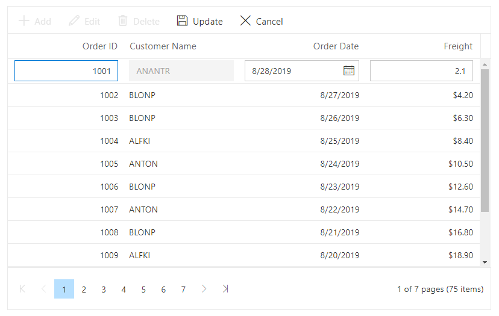
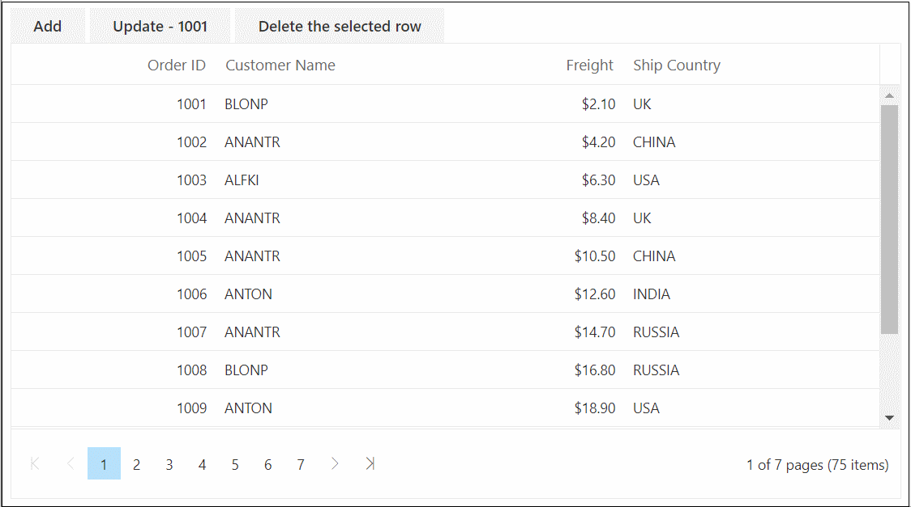
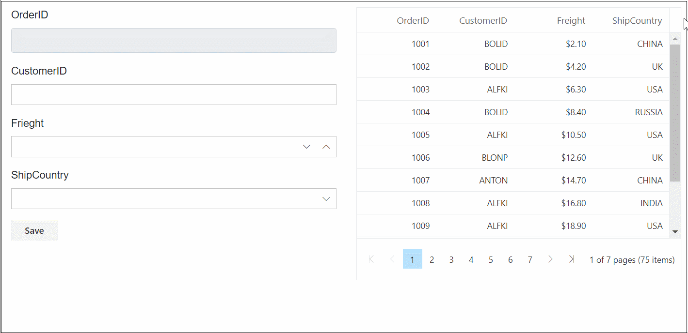

# Editing in Blazor DataGrid Component

The DataGrid component has options to dynamically insert, delete, and update records.

N> [Editing](https://blazor.syncfusion.com/documentation/datagrid/editing) feature requires a primary key column for CRUD operations.

To know about editing feature in Blazor DataGrid component, you can check on this video.



To define the primary key, set [IsPrimaryKey](https://help.syncfusion.com/cr/blazor/Syncfusion.Blazor.Grids.GridColumn.html#Syncfusion_Blazor_Grids_GridColumn_IsPrimaryKey) to **true** in a particular column whose value is unique.

You can start the edit action either by double-clicking the particular row or by selecting the required row and click on the **Edit** button in the toolbar. Similarly, you can add a new record to DataGrid either by clicking on **Add** button in the toolbar or on an external button which is bound to invoke the [AddRecord](https://help.syncfusion.com/cr/blazor/Syncfusion.Blazor.Grids.SfGrid-1.html#Syncfusion_Blazor_Grids_SfGrid_1_AddRecord) method of the DataGrid, **Save** and **Cancel** while in edit mode is possible using the respective toolbar icon in DataGrid.

Deletion of the record is possible by selecting the required row and click on **Delete** button in the toolbar.

```cshtml
@using Syncfusion.Blazor.Grids

<SfGrid DataSource="@Orders" AllowPaging="true" Toolbar="@(new List<string>() { "Add", "Edit", "Delete", "Cancel", "Update" })" Height ="315">
   <GridEditSettings AllowAdding="true" AllowEditing="true" AllowDeleting="true"></GridEditSettings>
    <GridColumns>
        <GridColumn Field=@nameof(Order.OrderID) HeaderText="Order ID" IsPrimaryKey="true" TextAlign="TextAlign.Right" Width="120"></GridColumn>
        <GridColumn Field=@nameof(Order.CustomerID) HeaderText="Customer Name" Width="120"></GridColumn>
        <GridColumn Field=@nameof(Order.OrderDate) HeaderText=" Order Date" EditType="EditType.DatePickerEdit" Format="d" TextAlign="TextAlign.Right" Width="130" Type="ColumnType.Date"></GridColumn>
        <GridColumn Field=@nameof(Order.Freight) HeaderText="Freight" Format="C2" TextAlign="TextAlign.Right" Width="120"></GridColumn>
    </GridColumns>
</SfGrid>

@code{
    public List<Order> Orders { get; set; }

    protected override void OnInitialized()
    {
        Orders = Enumerable.Range(1, 75).Select(x => new Order()
        {
            OrderID = 1000 + x,
            CustomerID = (new string[] { "ALFKI", "ANANTR", "ANTON", "BLONP", "BOLID" })[new Random().Next(5)],
            Freight = 2.1 * x,
            OrderDate = DateTime.Now.AddDays(-x),
        }).ToList();
    }

    public class Order {
        public int? OrderID { get; set; }
        public string CustomerID { get; set; }
        public DateTime? OrderDate { get; set; }
        public double? Freight { get; set; }
    }
}

```

The following screenshot represents Editing with Default Mode.


N> * Grid uses `Activator.CreateInstance<TValue>()` to generate a new record when an insert operation is invoked, so it must have a parameterless constructors defined for the model class and any referenced complex type classes. To provide custom logic for object creation during editing, you can refer [here](#provide-new-item-or-edited-item-using-events).
<br/> * If [IsIdentity](https://help.syncfusion.com/cr/blazor/Syncfusion.Blazor.Grids.GridColumn.html#Syncfusion_Blazor_Grids_GridColumn_IsIdentity) is enabled, then it will be considered as a read-only column when editing and adding a record.
<br/> * You can disable editing for a particular column by specifying
[AllowEditing](https://help.syncfusion.com/cr/blazor/Syncfusion.Blazor.Grids.GridColumn.html#Syncfusion_Blazor_Grids_GridColumn_AllowEditing) to **false**.
<br/>* You can disable adding for a particular column by specifying
[AllowAdding](https://help.syncfusion.com/cr/blazor/Syncfusion.Blazor.Grids.GridColumn.html#Syncfusion_Blazor_Grids_GridColumn_AllowAdding) to **false**.
<br/>* You can disable editing of a record on double click by specifying
[EditSettings.AllowEditOnDblClick](https://help.syncfusion.com/cr/blazor/Syncfusion.Blazor.Grids.GridEditSettings.html#Syncfusion_Blazor_Grids_GridEditSettings_AllowEditOnDblClick) to **false**.

## Toolbar with edit option

The datagrid toolbar has the following built-in items to execute editing actions.

* Add - Adds a new record.
* Edit - Edits the selected record.
* Update - Updates the edited record.
* Delete - Deletes the selected record.
* Cancel - Cancels the edit state.

You can define this by using the [Toolbar](https://help.syncfusion.com/cr/blazor/Syncfusion.Blazor.Grids.SfGrid-1.html#Syncfusion_Blazor_Grids_SfGrid_1_Toolbar) property.

```cshtml
@using Syncfusion.Blazor.Grids

<SfGrid DataSource="@Orders" AllowPaging="true" Toolbar="@(new List<string>() { "Add", "Edit", "Delete", "Cancel", "Update" })">
   <GridEditSettings AllowAdding="true" AllowEditing="true" AllowDeleting="true"></GridEditSettings>
    <GridColumns>
        <GridColumn Field=@nameof(Order.OrderID) HeaderText="Order ID" IsPrimaryKey="true" TextAlign="TextAlign.Right" Width="120"></GridColumn>
        <GridColumn Field=@nameof(Order.CustomerID) HeaderText="Customer Name" Width="120" ></GridColumn>
        <GridColumn Field=@nameof(Order.OrderDate) HeaderText=" Order Date" EditType="EditType.DatePickerEdit" Format="d" TextAlign="TextAlign.Right" Width="130" Type="ColumnType.Date"></GridColumn>
        <GridColumn Field=@nameof(Order.Freight) HeaderText="Freight" Format="C2" TextAlign="TextAlign.Right" Width="120" ></GridColumn>
    </GridColumns>
</SfGrid>

@code{
    public List<Order> Orders { get; set; }

    protected override void OnInitialized()
    {
        Orders = Enumerable.Range(1, 75).Select(x => new Order()
        {
            OrderID = 1000 + x,
            CustomerID = (new string[] { "ALFKI", "ANANTR", "ANTON", "BLONP", "BOLID" })[new Random().Next(5)],
            Freight = 2.1 * x,
            OrderDate = DateTime.Now.AddDays(-x),
        }).ToList();
    }

    public class Order {
        public int? OrderID { get; set; }
        public string CustomerID { get; set; }
        public DateTime? OrderDate { get; set; }
        public double? Freight { get; set; }
    }
}
```

The following screenshot represents Toolbar with Edit option.


## Default column values on adding new record

The datagrid provides an option to set the default value for the columns when adding a new record in it. To set a default value for a particular column you need to define it in the [DefaultValue](https://help.syncfusion.com/cr/blazor/Syncfusion.Blazor.Grids.GridColumn.html#Syncfusion_Blazor_Grids_GridColumn_DefaultValue) property of the [GridColumn](https://help.syncfusion.com/cr/blazor/Syncfusion.Blazor.Grids.GridColumn.html) component.

The following sample code demonstrates setting default value as **ANTON** to the **CustomerID** column,

```cshtml
@using Syncfusion.Blazor.Grids

<SfGrid DataSource="@Orders" Height="315" AllowPaging="true" Toolbar="@(new List<string>() { "Add", "Edit", "Delete", "Update", "Cancel" })">
    <GridEditSettings AllowAdding="true" AllowEditing="true" AllowDeleting="true"></GridEditSettings>
    <GridColumns>
        <GridColumn Field=@nameof(Order.OrderID) HeaderText="Order ID" IsPrimaryKey="true" Width="120"></GridColumn>
        <GridColumn Field=@nameof(Order.CustomerID) HeaderText="Customer Name" Width="120" DefaultValue="@("ANTON")"></GridColumn>
        <GridColumn Field=@nameof(Order.OrderDate) HeaderText=" Order Date" EditType="EditType.DatePickerEdit" Format="d" TextAlign="TextAlign.Right" Width="130" Type="ColumnType.Date"></GridColumn>
        <GridColumn Field=@nameof(Order.Freight) HeaderText="Freight" Format="C2" TextAlign="TextAlign.Right" Width="120"></GridColumn>
    </GridColumns>
</SfGrid>

@code{
    public List<Order> Orders { get; set; }

    protected override void OnInitialized()
    {
        Orders = Enumerable.Range(1, 75).Select(x => new Order()
        {
            OrderID = 1000 + x,
            CustomerID = (new string[] { "ALFKI", "ANANTR", "ANTON", "BLONP", "BOLID" })[new Random().Next(5)],
            Freight = 2.1 * x,
            OrderDate = DateTime.Now.AddDays(-x),
        }).ToList();
    }

    public class Order
    {
        public int? OrderID { get; set; }
        public string CustomerID { get; set; }
        public DateTime? OrderDate { get; set; }
        public double? Freight { get; set; }
    }
}
```

The following image represents the default value displayed in the **CustomerID** column while adding a new record in DataGrid,


## Disable editing for particular column

You can disable editing for particular columns by setting value as **false** to the [AllowEditing](https://help.syncfusion.com/cr/blazor/Syncfusion.Blazor.Grids.GridColumn.html#Syncfusion_Blazor_Grids_GridColumn_AllowEditing) property of the [GridColumn](https://help.syncfusion.com/cr/blazor/Syncfusion.Blazor.Grids.GridColumn.html) component.

The following sample code demonstrates editing disabled for the **CustomerID** column,

```cshtml
@using Syncfusion.Blazor.Grids

<SfGrid DataSource="@Orders" Height="315" AllowPaging="true" Toolbar="@(new List<string>() { "Add", "Edit", "Delete", "Update", "Cancel" })">
    <GridEditSettings AllowAdding="true" AllowEditing="true" AllowDeleting="true"></GridEditSettings>
    <GridColumns>
        <GridColumn Field=@nameof(Order.OrderID) HeaderText="Order ID" IsPrimaryKey="true" Width="120"></GridColumn>
        <GridColumn Field=@nameof(Order.CustomerID) HeaderText="Customer Name" Width="120" AllowEditing="false"></GridColumn>
        <GridColumn Field=@nameof(Order.OrderDate) HeaderText=" Order Date" EditType="EditType.DatePickerEdit" Format="d" TextAlign="TextAlign.Right" Width="130" Type="ColumnType.Date"></GridColumn>
        <GridColumn Field=@nameof(Order.Freight) HeaderText="Freight" Format="C2" TextAlign="TextAlign.Right" Width="120"></GridColumn>
    </GridColumns>
</SfGrid>

@code{
    public List<Order> Orders { get; set; }

    protected override void OnInitialized()
    {
        Orders = Enumerable.Range(1, 75).Select(x => new Order()
        {
            OrderID = 1000 + x,
            CustomerID = (new string[] { "ALFKI", "ANANTR", "ANTON", "BLONP", "BOLID" })[new Random().Next(5)],
            Freight = 2.1 * x,
            OrderDate = DateTime.Now.AddDays(-x),
        }).ToList();
    }

    public class Order
    {
        public int? OrderID { get; set; }
        public string CustomerID { get; set; }
        public DateTime? OrderDate { get; set; }
        public double? Freight { get; set; }
    }
}
```

N> Similarly [AllowAdding](https://help.syncfusion.com/cr/blazor/Syncfusion.Blazor.Grids.GridColumn.html#Syncfusion_Blazor_Grids_GridColumn_AllowAdding) property at the column level helps us to disable the particular column from inserting value to it.

The following screenshot represents the editing disabled for the **CustomerID** column in DataGrid,



## Disable editing for a particular row or cell

Specific rows can be disabled from editing using the [OnActionBegin](https://help.syncfusion.com/cr/blazor/Syncfusion.Blazor.Grids.GridEvents-1.html#Syncfusion_Blazor_Grids_GridEvents_1_OnActionBegin) event of the Grid based on the `RequestType` as `BeginEdit`.

In the following sample, the rows that have the value for the ShipCountry column as "RUSSIA" are prevented from being edited by updating the `Cancel` argument of the `OnActionBegin` event to true.

```cshtml
@using Syncfusion.Blazor.Grids

<SfGrid DataSource="@Orders" AllowPaging="true" Height="315" Toolbar="@(new List<string>() { "Edit", "Cancel", "Update" })">
    <GridEvents OnActionBegin="OnActionBegin" TValue="Order"></GridEvents>
    <GridEditSettings AllowEditing="true"></GridEditSettings>
    <GridColumns>
        <GridColumn Field=@nameof(Order.OrderID) HeaderText="Order ID" IsPrimaryKey="true"  TextAlign="TextAlign.Right" Width="120"></GridColumn>
        <GridColumn Field=@nameof(Order.CustomerID) HeaderText="Customer Name"  Width="120"></GridColumn>
        <GridColumn Field=@nameof(Order.Freight) HeaderText="Freight" Format="C2" TextAlign="TextAlign.Right" EditType="EditType.NumericEdit" Width="120"></GridColumn>
        <GridColumn Field=@nameof(Order.ShipCountry) HeaderText="Ship Country" EditType="EditType.DropDownEdit" Width="150"></GridColumn>
    </GridColumns>
</SfGrid>

@code{
    public List<Order> Orders { get; set; }

    private void OnActionBegin(Syncfusion.Blazor.Grids.ActionEventArgs<Order> args)
    {  
        if (args.RequestType == Syncfusion.Blazor.Grids.Action.BeginEdit)
        {
            if (args.RowData.ShipCountry == "RUSSIA")
            {
                args.Cancel = true;
            }
        }
    }

    protected override void OnInitialized()
    {
        Orders = Enumerable.Range(1, 75).Select(x => new Order()
        {
            OrderID = 1000 + x,
            CustomerID = (new string[] { "ALFKI", "ANANTR", "ANTON", "BLONP", "BOLID" })[new Random().Next(5)],
            Freight = 2.1 * x,
            OrderDate = DateTime.Now.AddDays(-x),
            ShipCountry = (new string[] { "USA", "UK", "CHINA", "RUSSIA", "INDIA" })[new Random().Next(5)]
        }).ToList();
    }

    public class Order
    {
        public int? OrderID { get; set; }
        public string CustomerID { get; set; }
        public DateTime? OrderDate { get; set; }
        public double? Freight { get; set; }
        public string ShipCountry { get; set; }
    }
}
```

N> [View Sample in GitHub.](https://github.com/SyncfusionExamples/blazor-datagrid-disable-editing-for-particular-row)

Use the Grid's [OnCellEdit](https://help.syncfusion.com/cr/blazor/Syncfusion.Blazor.Gantt.GanttEvents-1.html#Syncfusion_Blazor_Gantt_GanttEvents_1_OnCellEdit) event to disable a specific cell when editing in batch mode. 

In the following sample, the cells that have the value for the ShipCountry column as "INDIA" are prevented from being edited by updating the `Cancel` argument of the `OnCellEdit` event to true.

```cshtml
@using Syncfusion.Blazor.Grids

<SfGrid DataSource="@Orders" AllowPaging="true" Height="315" Toolbar="@(new List<string>() { "Edit", "Cancel", "Update" })">
    <GridEvents OnCellEdit="OnCellEdit" TValue="Order"></GridEvents>
    <GridEditSettings AllowEditing="true" Mode="EditMode.Batch"></GridEditSettings>
    <GridColumns>
        <GridColumn Field=@nameof(Order.OrderID) HeaderText="Order ID" IsPrimaryKey="true"  TextAlign="TextAlign.Right" Width="120"></GridColumn>
        <GridColumn Field=@nameof(Order.CustomerID) HeaderText="Customer Name"  Width="120"></GridColumn>
        <GridColumn Field=@nameof(Order.Freight) HeaderText="Freight" Format="C2" TextAlign="TextAlign.Right" EditType="EditType.NumericEdit" Width="120"></GridColumn>
        <GridColumn Field=@nameof(Order.ShipCountry) HeaderText="Ship Country" EditType="EditType.DropDownEdit" Width="150"></GridColumn>
    </GridColumns>
</SfGrid>
@code{
    public List<Order> Orders { get; set; }
    public void OnCellEdit(CellEditArgs<Order> args)
    {
        if (args.RowData.ShipCountry == "INDIA" && args.ColumnName == "ShipCountry") {
            args.Cancel = true;
        }
    }
    protected override void OnInitialized()
    {
        Orders = Enumerable.Range(1, 75).Select(x => new Order()
        {
            OrderID = 1000 + x,
            CustomerID = (new string[] { "ALFKI", "ANANTR", "ANTON", "BLONP", "BOLID" })[new Random().Next(5)],
            Freight = 2.1 * x,
            OrderDate = DateTime.Now.AddDays(-x),
            ShipCountry = (new string[] { "USA", "UK", "CHINA", "RUSSIA", "INDIA" })[new Random().Next(5)]
        }).ToList();
    }
    public class Order
    {
        public int? OrderID { get; set; }
        public string CustomerID { get; set; }
        public DateTime? OrderDate { get; set; }
        public double? Freight { get; set; }
        public string ShipCountry { get; set; }
    }
}
```

N> [View Sample in GitHub.](https://github.com/SyncfusionExamples/blazor-datagrid-disable-editing-for-particular-cell)

## Adding a new row at the bottom of the datagrid

By default, a new row will be added at the top of the datagrid. You can change it by setting [NewRowPosition](https://help.syncfusion.com/cr/blazor/Syncfusion.Blazor.Grids.GridEditSettings.html#Syncfusion_Blazor_Grids_GridEditSettings_NewRowPosition) property of the [GridEditSettings](https://help.syncfusion.com/cr/blazor/Syncfusion.Blazor.Grids.GridEditSettings.html) component as **Bottom**.

The following sample code demonstrates changing the position of the new row that gets added in the DataGrid component,

```cshtml
@using Syncfusion.Blazor.Grids

<SfGrid DataSource="@Orders" Height="315" AllowPaging="true" Toolbar="@(new List<string>() { "Add", "Edit", "Delete", "Update", "Cancel" })">
    <GridEditSettings AllowAdding="true" AllowEditing="true" AllowDeleting="true" NewRowPosition="NewRowPosition.Bottom"></GridEditSettings>
    <GridColumns>
        <GridColumn Field=@nameof(Order.OrderID) HeaderText="Order ID" IsPrimaryKey="true" TextAlign="TextAlign.Right" Width="120"></GridColumn>
        <GridColumn Field=@nameof(Order.CustomerID) HeaderText="Customer Name" Width="120"></GridColumn>
        <GridColumn Field=@nameof(Order.OrderDate) HeaderText=" Order Date" EditType="EditType.DatePickerEdit" Format="d" TextAlign="TextAlign.Right" Width="130" Type="ColumnType.Date"></GridColumn>
        <GridColumn Field=@nameof(Order.Freight) HeaderText="Freight" Format="C2" TextAlign="TextAlign.Right" Width="120"></GridColumn>
    </GridColumns>
</SfGrid>

@code{
    public List<Order> Orders { get; set; }

    protected override void OnInitialized()
    {
        Orders = Enumerable.Range(1, 75).Select(x => new Order()
        {
            OrderID = 1000 + x,
            CustomerID = (new string[] { "ALFKI", "ANANTR", "ANTON", "BLONP", "BOLID" })[new Random().Next(5)],
            Freight = 2.1 * x,
            OrderDate = DateTime.Now.AddDays(-x),
        }).ToList();
    }

    public class Order {
        public int? OrderID { get; set; }
        public string CustomerID { get; set; }
        public DateTime? OrderDate { get; set; }
        public double? Freight { get; set; }
    }
}
```

The following image represents the new row added at the bottom of the DataGrid,


## Troubleshoot: Editing works only for first row

The Editing functionalities can be performed based on the primary key value of the selected row. If **PrimaryKey** is not defined in the datagrid, the edit or delete action is performed in the first row.

## Event trace while editing

While editing operation is getting executed the following events will be notified,

* OnActionBegin
* OnActionComplete

In both of these events, the type of editing operation is returned in the **RequestType** parameter of the event arguments. In addition, the event arguments return the edited row data.

The **RequestType** values for the editing operations are listed in the below table,

| RequestType | OnActionBegin | OnActionComplete |
|----------|---------------|---------------|
| BeginEdit | Before editing operation begins | After editing operation is completed |
| Add | Before add operation begins | After add operation is completed |
| Delete | Before delete operation begins | After delete operation is completed |
| Save | Before save operation begins | After save operation is completed |
| Cancel | Before cancel operation begins | After cancel operation is completed |

The following sample code demonstrates the different **RequestType** parameters returned while performing editing operations in the OnActionBegin and OnActionComplete events,

```cshtml
@using Syncfusion.Blazor.Grids

<SfGrid DataSource="@Orders" AllowPaging="true" Toolbar="@(new List<string>() { "Add", "Edit", "Delete", "Cancel", "Update" })" Height="315">
    <GridEditSettings AllowAdding="true" AllowEditing="true" AllowDeleting="true"></GridEditSettings>
    <GridEvents OnActionBegin="ActionBegin" OnActionComplete="ActionComplete" TValue="Order"></GridEvents>
    <GridColumns>
        <GridColumn Field=@nameof(Order.OrderID) HeaderText="Order ID" IsPrimaryKey="true" Width="120"></GridColumn>
        <GridColumn Field=@nameof(Order.CustomerID) HeaderText="Customer Name" Width="120"></GridColumn>
        <GridColumn Field=@nameof(Order.OrderDate) HeaderText=" Order Date" EditType="EditType.DatePickerEdit" Format="d" TextAlign="TextAlign.Right" Width="130" Type="ColumnType.Date"></GridColumn>
        <GridColumn Field=@nameof(Order.Freight) HeaderText="Freight" Format="C2" TextAlign="TextAlign.Right" Width="120"></GridColumn>
    </GridColumns>
</SfGrid>

@code{
    public List<Order> Orders { get; set; }

    protected override void OnInitialized()
    {
        Orders = Enumerable.Range(1, 75).Select(x => new Order()
        {
            OrderID = 1000 + x,
            CustomerID = (new string[] { "ALFKI", "ANANTR", "ANTON", "BLONP", "BOLID" })[new Random().Next(5)],
            Freight = 2.1 * x,
            OrderDate = DateTime.Now.AddDays(-x),
        }).ToList();
    }

    public class Order
    {
        public int? OrderID { get; set; }
        public string CustomerID { get; set; }
        public DateTime? OrderDate { get; set; }
        public double? Freight { get; set; }
    }

    public void ActionBegin(ActionEventArgs<Order> args)
    {
        if (args.RequestType == Syncfusion.Blazor.Grids.Action.BeginEdit)
        {
            // Triggers before editing operation starts
        }
        else if (args.RequestType == Syncfusion.Blazor.Grids.Action.Add)
        {
            // Triggers before add operation starts
        }
        else if (args.RequestType == Syncfusion.Blazor.Grids.Action.Cancel)
        {
            // Triggers before cancel operation starts
        }
        else if (args.RequestType == Syncfusion.Blazor.Grids.Action.Save)
        {
            // Triggers before save operation starts
        }
        else if (args.RequestType == Syncfusion.Blazor.Grids.Action.Delete)
        {
            // Triggers before delete operation starts
        }
    }

    public void ActionComplete(ActionEventArgs<Order> args)
    {
        if (args.RequestType == Syncfusion.Blazor.Grids.Action.BeginEdit)
        {
            // Triggers once editing operation completes
        }
        else if (args.RequestType == Syncfusion.Blazor.Grids.Action.Add)
        {
            // Triggers once add operation completes
        }
        else if (args.RequestType == Syncfusion.Blazor.Grids.Action.Cancel)
        {
            // Triggers once cancel operation completes
        }
        else if (args.RequestType == Syncfusion.Blazor.Grids.Action.Save)
        {
            // Triggers once save operation completes
        }
        else if (args.RequestType == Syncfusion.Blazor.Grids.Action.Delete)
        {
            // Triggers once delete operation completes
        }
    }
}
```

## Perform CRUD operation for complex object using EditTemplate

Before performing CRUD operations with complex Objects, it is recommended to go through the [Complex DataBinding](https://blazor.syncfusion.com/documentation/datagrid/columns#complex-data-binding) documentation.

To customize the default Grid EditForm TextBox component, we will use [EditTemplate](https://blazor.syncfusion.com/documentation/datagrid/editing#cell-edit-template) to customize the Grid EditForm.

You can edit the complex objects using EditTemplate inside the GridColumn component by defining two-way (**@bind-Value**) binding to reflect the changes in DataGrid.

For focus and Column Validation to work properly, you have to define the **ID** property EditTemplate components with a value similar to GridColumn Field property value.

N> Also, ensure to define **ID** property for the complex column as (`___`) replacing the (`.`) operator in the Field value.

The following sample code demonstrates the CRUD operation for complex objects with EditTemplate.

```cshtml
@using Syncfusion.Blazor.Grids
@using Syncfusion.Blazor.DropDowns
@using Syncfusion.Blazor.Inputs

<SfGrid DataSource="@Employees" Height="315" Toolbar="@(new List<string>() { "Add", "Edit" ,"Delete","Update","Cancel" })">
    <GridEditSettings AllowAdding="true" AllowEditing="true" AllowDeleting="true" Mode="EditMode.Normal"></GridEditSettings>
    <GridColumns>
        <GridColumn Field=@nameof(EmployeeData.CustomerID) HeaderText="CustomerID" IsPrimaryKey="true" TextAlign="TextAlign.Right" Width="120"></GridColumn>
        <GridColumn Field="Data.EmployeeID" HeaderText="EmployeeID" ValidationRules="@(new ValidationRules{ Required=true, Number=true, Range = new double[]{1, 2000}})" Width="130">
            <EditTemplate>
                @{
                    <SfNumericTextBox ID="Data___EmployeeID" @bind-Value="@((context as EmployeeData).Data.EmployeeID)"></SfNumericTextBox>

                }
            </EditTemplate>
        </GridColumn>
        <GridColumn Field="Data.FirstName" HeaderText="First Name" ValidationRules="@(new ValidationRules{ Required=true})" Width="150">
            <EditTemplate>
                @{
                    <SfDropDownList ID="Data___FirstName" @bind-Value="@((context as EmployeeData).Data.FirstName)" TItem="EmployeeData" TValue="string" DataSource="@Employees">
                        <DropDownListFieldSettings Value="Data.FirstName" Text="Data.FirstName"></DropDownListFieldSettings>
                        </SfDropDownList>
                        }
                </EditTemplate>
        </GridColumn>
        <GridColumn Field=@nameof(EmployeeData.Title) HeaderText="Title" Format="C2" TextAlign="TextAlign.Right" Width="120"></GridColumn>
    </GridColumns>
</SfGrid>

@code{
    public List<EmployeeData> Employees { get; set; }

    protected override void OnInitialized()
    {
        Employees = Enumerable.Range(1, 9).Select(x => new EmployeeData()
        {
            CustomerID = x,
            Data = new EmployeeName()
            {
                FirstName = (new string[] { "Nancy", "Andrew", "Janet", "Margaret", "Steven" })[new Random().Next(5)],
                EmployeeID = 1000 + x
            },
            Title = (new string[] { "Sales Representative", "Vice President, Sales", "Sales Manager",
                                      "Inside Sales Coordinator" })[new Random().Next(4)],
        }).ToList();
    }

    public class EmployeeData
    {
        public int? CustomerID { get; set; }
        public EmployeeName Data { get; set; }
        public string Title { get; set; }
    }

    public class EmployeeName
    {
        public int? EmployeeID { get; set; }
        public string FirstName { get; set; }
    }
}
```

## Performing CRUD operations programmatically

You can perform CRUD operations like **Add**, **Update**, **Delete** by using the [AddRecord](https://help.syncfusion.com/cr/blazor/Syncfusion.Blazor.Grids.SfGrid-1.html#Syncfusion_Blazor_Grids_SfGrid_1_AddRecord), [UpdateRow](https://help.syncfusion.com/cr/blazor/Syncfusion.Blazor.Grids.SfGrid-1.html#Syncfusion_Blazor_Grids_SfGrid_1_UpdateRow_System_Double__0_), [DeleteRow](https://help.syncfusion.com/cr/blazor/Syncfusion.Blazor.Grids.SfGrid-1.html#Syncfusion_Blazor_Grids_SfGrid_1_DeleteRow_System_Object_)  methods.

* **AddRecord** - Add a new record into the datagrid.
* **UpdateRow** - Update an existing record in a datagrid.
* **DeleteRow** - Delete a selected row from the datagrid.

```cshtml
@using Syncfusion.Blazor.Grids
@using Syncfusion.Blazor.Buttons

<SfButton @onclick="Add"> Add </SfButton>
<SfButton @onclick="Update"> Update - 1001 </SfButton>
<SfButton @onclick="Delete"> Delete the selected row </SfButton>

<SfGrid DataSource="@Orders" AllowPaging="true" @ref="Grid" Height="315">
    <GridEditSettings AllowAdding="true" AllowEditing="true" AllowDeleting="true"></GridEditSettings>
    <GridColumns>
        <GridColumn Field=@nameof(Order.OrderID) HeaderText="Order ID" IsPrimaryKey="true" ValidationRules="@(new ValidationRules{ Required = true })" TextAlign="TextAlign.Right" Width="120"></GridColumn>
        <GridColumn Field=@nameof(Order.CustomerID) HeaderText="Customer Name" ValidationRules="@(new ValidationRules{ Required = true })" Width="120"></GridColumn>
        <GridColumn Field=@nameof(Order.Freight) HeaderText="Freight" Format="C2" TextAlign="TextAlign.Right" EditType="EditType.NumericEdit" Width="120"></GridColumn>
        <GridColumn Field=@nameof(Order.ShipCountry) HeaderText="Ship Country" EditType="EditType.DropDownEdit" Width="150"></GridColumn>
    </GridColumns>
</SfGrid>

@code{
    public List<Order> Orders { get; set; }
    SfGrid<Order> Grid;

    public async Task Add()
    {
        Order adddata = new Order()
        {
            OrderID = 1000,
            CustomerID = "MJDGX",
            ShipCountry = "LONDON",
            Freight = 3.01
        };
        await this.Grid.AddRecord(adddata);
    }

    public async Task Update()
    {
        Order data = new Order() { OrderID = 1001, CustomerID = "ABCDE", ShipCountry = "LONDON", Freight = 2.91 };
        await this.Grid.UpdateRow(1, data);
    }

    public async Task Delete()
    {
        await this.Grid.DeleteRecord();
    }

    protected override void OnInitialized()
    {
        Orders = Enumerable.Range(1, 75).Select(x => new Order()
        {
            OrderID = 1000 + x,
            CustomerID = (new string[] { "ALFKI", "ANANTR", "ANTON", "BLONP", "BOLID" })[new Random().Next(5)],
            Freight = 2.1 * x,
            OrderDate = DateTime.Now.AddDays(-x),
            ShipCountry = (new string[] { "USA", "UK", "CHINA", "RUSSIA", "INDIA" })[new Random().Next(5)]
        }).ToList();
    }

    public class Order
    {
        public int? OrderID { get; set; }
        public string CustomerID { get; set; }
        public DateTime? OrderDate { get; set; }
        public double? Freight { get; set; }
        public string ShipCountry { get; set; }
    }
}
```

The following GIF represents the datagrid with Add, Update, Delete items,



## Perform CRUD operation using Grid events

IQueryable data can be bound directly to Grid component from database without using Data Adaptors. IQueryable data bound to Grid component using DataSource property of SfGrid. While binding the Data to Grid component using **DataSource** property, CRUD actions need to be handled using Grid Action Events (i.e., using **OnActionBegin** and **OnActionComplete** events of Grid).

### Create an interface layer to the database

Create an interface with CRUD methods like below based on your model class.

```csharp
using System.Collections.Generic;
using System.Linq;

namespace LibraryManagement.Models
{
    interface ILibraryService
    {
        IQueryable<Book> GetBooks();
        void InsertBook(Book employee);
        void UpdateBook(long id, Book employee);
        Book SingleBook(long id);
        void DeleteBook(long id);
    }
}
```

### Create an intermediate service using the interface

By inheriting the interface, create a new service to retrieve the data from database and perform CRUD operation. Refer the below demonstration.

```csharp
using Microsoft.EntityFrameworkCore;
using System.Linq;

namespace LibraryManagement.Models
{
    public class LibraryService : ILibraryService
    {
        private LibraryContext _context;
        public LibraryService(LibraryContext context)
        {
            _context = context;
        }

        public void DeleteBook(long id)
        {
            try
            {
                Book ord = _context.Books.Find(id);
                _context.Books.Remove(ord);
                _context.SaveChanges();
            }
            catch
            {
                throw;
            }
        }

        public IQueryable<Book> GetBooks()
        {
            try
            {
                return _context.Books.AsQueryable();
            }
            catch
            {
                throw;
            }
        }

        public void InsertBook(Book book)
        {
            try
            {
                _context.Books.Add(book);
                _context.SaveChanges();
            }
            catch
            {
                throw;
            }
        }
        public void UpdateBook(long id, Book book)
        {
            try
            {
                var local = _context.Set<Book>().Local.FirstOrDefault(entry => entry.Id.Equals(book.Id));
                // check if local is not null
                if (local != null)
                {
                    // detach
                    _context.Entry(local).State = EntityState.Detached;
                }
                _context.Entry(book).State = EntityState.Modified;
                _context.SaveChanges();
            }
            catch
            {
                throw;
            }
        }
    }
}
```

### Configure the DataGrid component to perform CRUD actions using Grid events

Since data is bound to Grid using DataSource property, CRUD actions will be reflected at Grid component level only. To reflect the changes in database, you need to handle the changes in Grid action events.

**OnActionBegin** – This event will be triggered when the action gets initiated. So, while inserting/updating a record, **RequestType Save** will be sent in the event arguments to save the changes in the database. Similarly, while deleting a record, RequestType as Delete will be initiated to perform actions externally.  Since for both Update and Insert action, RequestType will be Save, you can differentiate them by using the **Args.Action** property, which will indicate the current action.
**OnActionComplete** – It will be triggered when certain actions are completed. Here, you can refresh the Grid component with an updated datasource to reflect the changes.

```cshtml
@using LibraryManagement.Models
@inject ILibraryService LibraryService

<SfGrid DataSource="@LibraryBooks" Toolbar="@(new List<string>() { "Add", "Edit", "Delete", "Cancel", "Update" })" TValue="Book">
    <GridEditSettings AllowAdding="true" AllowDeleting="true" AllowEditing="true" Mode="EditMode.Normal"></GridEditSettings>
    <GridEvents OnActionBegin="ActionBeginHandler" OnActionComplete="ActionCompleteHandler" TValue="Book"></GridEvents>
    <GridColumns>
        <GridColumn Field="@nameof(Book.Id)" IsPrimaryKey="true" IsIdentity="true" Visible="false"></GridColumn>
        <GridColumn Field="@nameof(Book.Name)" Width="150"></GridColumn>
        <GridColumn Field="@nameof(Book.Author)" Width="150"></GridColumn>
        <GridColumn Field="@nameof(Book.Quantity)" Width="90" TextAlign="TextAlign.Right"></GridColumn>
        <GridColumn Field="@nameof(Book.Price)" Width="90" Format="C2" TextAlign="TextAlign.Right"></GridColumn>
        <GridColumn Field="@nameof(Book.Available)" DisplayAsCheckBox="true" Width="70"></GridColumn>
    </GridColumns>
</SfGrid>

@code
{
    public IQueryable<Book> LibraryBooks { get; set; }
    protected override void OnInitialized()
    {
        LibraryBooks = LibraryService.GetBooks();
    }
    public void ActionBeginHandler(ActionEventArgs<Book> Args)
    {
        if (Args.RequestType.Equals(Syncfusion.Blazor.Grids.Action.Save))
        {
            if (Args.Action == "Add")
            {
                LibraryService.InsertBook(Args.Data);
            }
            else
            {
                LibraryService.UpdateBook(Args.Data.Id, Args.Data);
            }
        }
        if (Args.RequestType.Equals(Syncfusion.Blazor.Grids.Action.Delete))
        {
            LibraryService.DeleteBook(Args.Data.Id);
        }
    }
    public void ActionCompleteHandler(ActionEventArgs<Book> Args)
    {
        if (Args.RequestType.Equals(Syncfusion.Blazor.Grids.Action.Save))
        {
            LibraryBooks = LibraryService.GetBooks(); //to fetch the updated data from db to Grid
        }
    }
}
```

N> Find the sample from this [Github](https://github.com/SyncfusionExamples/blazor-server-datagrid-efcore-crud/) location.

## Cancel CRUD operation by using condition

You can cancel the default CRUD operation by specifying Args.Cancel as true based on the corresponding Args.RequestType values.

### Cancel CRUD operation for Normal/Dialog edit mode

For Normal/Dialog edit mode, you have to specify Args.Cancel as true in the [OnActionBegin](https://help.syncfusion.com/cr/blazor/Syncfusion.Blazor.Grids.GridEvents-1.html#Syncfusion_Blazor_Grids_GridEvents_1_OnActionBegin) event.

```csharp

@using Syncfusion.Blazor.Grids

<SfGrid DataSource="@Orders" AllowPaging="true" Toolbar="@(new List<string>() { "Add", "Edit", "Delete", "Cancel", "Update" })" Height="315">
    <GridEvents OnActionBegin="ActionBeginHandler" TValue="Order"></GridEvents>
    <GridEditSettings AllowAdding="true" AllowEditing="true" AllowDeleting="true" Mode="EditMode.Normal"></GridEditSettings>
    <GridColumns>
        <GridColumn Field=@nameof(Order.OrderID) HeaderText="Order ID" IsPrimaryKey="true" ValidationRules="@(new ValidationRules{ Required=true})" TextAlign="TextAlign.Right" Width="120"></GridColumn>
        <GridColumn Field=@nameof(Order.CustomerID) HeaderText="Customer Name" ValidationRules="@(new ValidationRules{ Required=true})" Width="120"></GridColumn>
        <GridColumn Field=@nameof(Order.OrderDate) HeaderText=" Order Date" EditType="EditType.DatePickerEdit" Format="d" TextAlign="TextAlign.Right" Width="130" Type="ColumnType.Date"></GridColumn>
        <GridColumn Field=@nameof(Order.Freight) HeaderText="Freight" Format="C2" TextAlign="TextAlign.Right" EditType="EditType.NumericEdit" Width="120"></GridColumn>
        <GridColumn Field=@nameof(Order.ShipCountry) HeaderText="Ship Country" EditType="EditType.DropDownEdit" Width="150"></GridColumn>
    </GridColumns>
</SfGrid>

@code{
    public List<Order> Orders { get; set; }
    public void ActionBeginHandler(ActionEventArgs<Order> Args)
    {
        if (Args.RequestType.Equals(Syncfusion.Blazor.Grids.Action.BeginEdit) && Args.Data.OrderID > 1050)
        {
            Args.Cancel = true;
        }
        if (Args.RequestType.Equals(Syncfusion.Blazor.Grids.Action.Save) && Args.Action == "Edit" && Args.Data.OrderID > 1010)
        {
            Args.Cancel = true;
        }
        if (Args.RequestType.Equals(Syncfusion.Blazor.Grids.Action.Save) && Args.Action == "Add" && Args.Data.OrderID > 1100)
        {
            Args.Cancel = true;
        }
        if (Args.RequestType.Equals(Syncfusion.Blazor.Grids.Action.Delete))
        {
            Args.Cancel = true;
        }
    }
    protected override void OnInitialized()
    {
        Orders = Enumerable.Range(1, 75).Select(x => new Order()
        {
            OrderID = 1000 + x,
            CustomerID = (new string[] { "ALFKI", "ANANTR", "ANTON", "BLONP", "BOLID" })[new Random().Next(5)],
            Freight = 2.1 * x,
            OrderDate = DateTime.Now.AddDays(-x),
            ShipCountry = (new string[] { "USA", "UK", "CHINA", "RUSSIA", "INDIA" })[new Random().Next(5)]
        }).ToList();
    }
    public class Order
    {
        public int? OrderID { get; set; }
        public string CustomerID { get; set; }
        public DateTime? OrderDate { get; set; }
        public double? Freight { get; set; }
        public string ShipCountry { get; set; }
    }
}
```

### Cancel CRUD operation for Batch edit mode

For Batch edit mode, you have to specify Args.Cancel as true in the [OnCellEdit](https://help.syncfusion.com/cr/blazor/Syncfusion.Blazor.Grids.GridEvents-1.html#Syncfusion_Blazor_Grids_GridEvents_1_OnCellEdit)/[OnBatchDelete](https://help.syncfusion.com/cr/blazor/Syncfusion.Blazor.Grids.GridEvents-1.html#Syncfusion_Blazor_Grids_GridEvents_1_OnBatchDelete)/[OnCellSave](https://help.syncfusion.com/cr/blazor/Syncfusion.Blazor.Grids.GridEvents-1.html#Syncfusion_Blazor_Grids_GridEvents_1_OnCellSave) events based on the corresponding CRUD operation.

```csharp

@using Syncfusion.Blazor.Grids

<SfGrid DataSource="@Orders" AllowPaging="true" Toolbar="@(new List<string>() { "Add", "Edit", "Delete", "Cancel", "Update" })" Height="315">
    <GridEvents OnBatchDelete="BatchDeleteHandler" OnCellEdit="OnCellEdit" OnCellSave="OnCellSave" TValue="Order"></GridEvents>
    <GridEditSettings AllowAdding="true" AllowEditing="true" AllowDeleting="true" Mode="EditMode.Batch"></GridEditSettings>
    <GridColumns>
        <GridColumn Field=@nameof(Order.OrderID) HeaderText="Order ID" IsPrimaryKey="true" ValidationRules="@(new ValidationRules{ Required=true})" TextAlign="TextAlign.Right" Width="120"></GridColumn>
        <GridColumn Field=@nameof(Order.CustomerID) HeaderText="Customer Name" ValidationRules="@(new ValidationRules{ Required=true})" Width="120"></GridColumn>
        <GridColumn Field=@nameof(Order.OrderDate) HeaderText=" Order Date" EditType="EditType.DatePickerEdit" Format="d" TextAlign="TextAlign.Right" Width="130" Type="ColumnType.Date"></GridColumn>
        <GridColumn Field=@nameof(Order.Freight) HeaderText="Freight" Format="C2" TextAlign="TextAlign.Right" EditType="EditType.NumericEdit" Width="120"></GridColumn>
        <GridColumn Field=@nameof(Order.ShipCountry) HeaderText="Ship Country" EditType="EditType.DropDownEdit" Width="150"></GridColumn>
    </GridColumns>
</SfGrid>

@code{
    public List<Order> Orders { get; set; }
    public void OnCellEdit(CellEditArgs<Order> Args)
    {
        if (Args.ColumnName == "CustomerID" && Args.Data.OrderID > 1010)
        {
            //Cancel the Edit Operation.
            Args.Cancel = true;
        }
    }
    public void BatchDeleteHandler(BeforeBatchDeleteArgs<Order> Args)
    {
        if (Args.RowData.OrderID > 1010)
        {
            //Cancel the Delete Operation.
            Args.Cancel = true;
        }
    }
    public void OnCellSave(CellSaveArgs<Order> Args)
    {
        if (Args.ColumnName == "ShipCountry" && Args.Data.OrderID > 1005)
        {
            //Cancel the Update Operation.
            Args.Cancel = true;
        }
    }
    protected override void OnInitialized()
    {
        Orders = Enumerable.Range(1, 75).Select(x => new Order()
        {
            OrderID = 1000 + x,
            CustomerID = (new string[] { "ALFKI", "ANANTR", "ANTON", "BLONP", "BOLID" })[new Random().Next(5)],
            Freight = 2.1 * x,
            OrderDate = DateTime.Now.AddDays(-x),
            ShipCountry = (new string[] { "USA", "UK", "CHINA", "RUSSIA", "INDIA" })[new Random().Next(5)]
        }).ToList();
    }
    public class Order
    {
        public int? OrderID { get; set; }
        public string CustomerID { get; set; }
        public DateTime? OrderDate { get; set; }
        public double? Freight { get; set; }
        public string ShipCountry { get; set; }
    }
}
```

## Performing CRUD operation by using separate toolbar

You can perform the CRUD operation externally by using the [AddRecordAsync](https://help.syncfusion.com/cr/blazor/Syncfusion.Blazor.Grids.SfGrid-1.html#Syncfusion_Blazor_Grids_SfGrid_1_AddRecordAsync), [StartEditAsync](https://help.syncfusion.com/cr/blazor/Syncfusion.Blazor.Grids.SfGrid-1.html#Syncfusion_Blazor_Grids_SfGrid_1_StartEditAsync), [DeleteRecordAsync](https://help.syncfusion.com/cr/blazor/Syncfusion.Blazor.Grids.SfGrid-1.html#Syncfusion_Blazor_Grids_SfGrid_1_DeleteRecordAsync), [EndEditAsync](https://help.syncfusion.com/cr/blazor/Syncfusion.Blazor.Grids.SfGrid-1.html#Syncfusion_Blazor_Grids_SfGrid_1_EndEditAsync), and [CloseEditAsync](https://help.syncfusion.com/cr/blazor/Syncfusion.Blazor.Grids.SfGrid-1.html#Syncfusion_Blazor_Grids_SfGrid_1_CloseEditAsync) methods.

* `AddRecordAsync` - To add a new record. If no data is passed then add form will be shown.
* `StartEditAsync` - To edit the selected row.
* `DeleteRecordAsync` - To delete a selected row.
* `EndEditAsync` - If the grid is in editable state, then you can save a record by invoking this method.
* `CloseEditAsync` - To cancel the edited state.

```csharp

@using Syncfusion.Blazor.Navigations
@using Syncfusion.Blazor.Grids

<SfToolbar>
    <ToolbarEvents Clicked="OnClicked"></ToolbarEvents>
    <ToolbarItems>
        <ToolbarItem Text="Add"></ToolbarItem>
        <ToolbarItem Text="Edit"></ToolbarItem>
        <ToolbarItem Text="Delete"></ToolbarItem>
        <ToolbarItem Text="Update"></ToolbarItem>
        <ToolbarItem Text="Cancel"></ToolbarItem>
    </ToolbarItems>
</SfToolbar>
<SfGrid @ref="Grid" DataSource="@Orders" AllowPaging="true">
    <GridEditSettings AllowAdding="true" AllowEditing="true" AllowDeleting="true"></GridEditSettings>
    <GridColumns>
        <GridColumn Field=@nameof(Order.OrderID) HeaderText="Order ID" IsPrimaryKey="true" TextAlign="TextAlign.Right" Width="120"></GridColumn>
        <GridColumn Field=@nameof(Order.CustomerID) HeaderText="Customer Name" Width="120"></GridColumn>
        <GridColumn Field=@nameof(Order.OrderDate) HeaderText=" Order Date" EditType="EditType.DatePickerEdit" Format="d" TextAlign="TextAlign.Right" Width="130" Type="ColumnType.Date"></GridColumn>
        <GridColumn Field=@nameof(Order.Freight) HeaderText="Freight" Format="C2" TextAlign="TextAlign.Right" Width="120"></GridColumn>
    </GridColumns>
</SfGrid>

@code{
    SfGrid<Order> Grid { get; set; }
    public List<Order> Orders { get; set; }
    public async Task OnClicked(ClickEventArgs Args)
    {
        if (Args.Item.Text == "Add")
        {
            await Grid.AddRecordAsync();
        }
        if (Args.Item.Text == "Edit")
        {
            await Grid.StartEditAsync();
        }
        if (Args.Item.Text == "Delete")
        {
            await Grid.DeleteRecordAsync();
        }
        if (Args.Item.Text == "Update")
        {
            await Grid.EndEditAsync();
        }
        if (Args.Item.Text == "Cancel")
        {
            await Grid.CloseEditAsync();
        }
    }
    protected override void OnInitialized()
    {
        Orders = Enumerable.Range(1, 75).Select(x => new Order()
        {
            OrderID = 1000 + x,
            CustomerID = (new string[] { "ALFKI", "ANANTR", "ANTON", "BLONP", "BOLID" })[new Random().Next(5)],
            Freight = 2.1 * x,
            OrderDate = DateTime.Now.AddDays(-x),
        }).ToList();
    }
    public class Order
    {
        public int? OrderID { get; set; }
        public string CustomerID { get; set; }
        public DateTime? OrderDate { get; set; }
        public double? Freight { get; set; }
    }
}
```

## Custom external form editing

You can perform the edit operation of Datagrid in a Custom external form. The edit operation can be done by [RowSelected](https://help.syncfusion.com/cr/blazor/Syncfusion.Blazor.Grids.GridEvents-1.html#Syncfusion_Blazor_Grids_GridEvents_1_RowSelected) property.

```csharp

@using Syncfusion.Blazor.Grids
@using Syncfusion.Blazor.Buttons
@using Syncfusion.Blazor.DropDowns
@using Syncfusion.Blazor.Inputs

<div class="row">
    <div class="col-md-6">
        <div>
            <div class="form-row">
                <div class="form-group col-md-12">
                    <label for="orderedit">OrderID</label>
                    <input class="form-control" @bind="@(SelectedProduct.OrderID)" type="number" disabled />
                </div>
            </div>
            <div class="form-row">
                <div class="form-group col-md-12">
                    <label for="customeredit">CustomerID</label>
                    <SfTextBox ID="CustomerID" @bind-Value="@(SelectedProduct.CustomerID)"></SfTextBox>
                </div>
            </div>
            <div class="form-row">
                <div class="form-group col-md-12">
                    <label for="freightedit">Frieght</label>
                    <SfNumericTextBox ID="Freight" TValue="double?" @bind-Value="@SelectedProduct.Freight"></SfNumericTextBox>
                </div>
            </div>
            <div class="form-row">
                <div class="form-group col-md-12">
                    <label for="countryedit">ShipCountry</label>
                    <SfDropDownList ID="ShipCountry" @bind-Value="@SelectedProduct.ShipCountry" TItem="Country" TValue="string" DataSource="@Dropdown">
                        <DropDownListFieldSettings Value="ShipCountry" Text="ShipCountry"></DropDownListFieldSettings>
                    </SfDropDownList>
                </div>
            </div>
        </div>
        <SfButton @onclick="Save">Save</SfButton>
    </div>
    <div class="col-md-6">
        <SfGrid DataSource="@Orders" AllowPaging="true" @ref="Grid" Height=315>
            <GridEditSettings AllowEditing="true"></GridEditSettings>
            <GridEvents RowSelected="RowSelectHandler" TValue="Order"></GridEvents>
            <GridColumns>
                <GridColumn Field=@nameof(Order.OrderID) HeaderText="OrderID" IsPrimaryKey="true" TextAlign="TextAlign.Right" Width="120"></GridColumn>
                <GridColumn Field=@nameof(Order.CustomerID) HeaderText="CustomerID" TextAlign="TextAlign.Right" Width="120"></GridColumn>
                <GridColumn Field=@nameof(Order.Freight) HeaderText="Freight" TextAlign="TextAlign.Right" Format="C2" Width="120"></GridColumn>
                <GridColumn Field=@nameof(Order.ShipCountry) HeaderText="ShipCountry" TextAlign="TextAlign.Right" Width="120"></GridColumn>
            </GridColumns>
        </SfGrid>
    </div>
</div>

@code{
    public List<Order> Orders { get; set; }
    SfGrid<Order> Grid;
    public Order SelectedProduct = new Order();
    public class Country
    {
        public string ShipCountry { get; set; }
    }
    List<Country> Dropdown = new List<Country>
{
          new Country() { ShipCountry= "USA" },
          new Country() { ShipCountry= "UK" },
          new Country() { ShipCountry= "RUSSIA" },
          new Country() { ShipCountry= "INDIA" },
          new Country() { ShipCountry= "CHINA" },
    };

    async Task Save()
    {
        await this.Grid.UpdateRow(1, SelectedProduct);
    }

    protected override void OnInitialized()
    {
        Orders = Enumerable.Range(1, 75).Select(x => new Order()
        {
            OrderID = 1000 + x,
            CustomerID = (new string[] { "ALFKI", "ANANTR", "ANTON", "BLONP", "BOLID" })[new Random().Next(5)],
            Freight = 2.1 * x,
            ShipCountry = (new string[] { "USA", "UK", "CHINA", "RUSSIA", "INDIA" })[new Random().Next(5)]
        }).ToList();
    }
    public class Order
    {
        public int? OrderID { get; set; }
        public string CustomerID { get; set; }
        public double? Freight { get; set; }
        public string ShipCountry { get; set; }
    }

    public void RowSelectHandler(RowSelectEventArgs<Order> args)
    {
        SelectedProduct = args.Data;
    }

}

```

The following GIF represent the datagrid with Custom External form editing,



## Use edit template in foreign key column

By default, the foreign key column renders the DropDownList component as an editor component while editing. Other editable components can be rendered using the EditTemplate feature of Grid. The following example demonstrates the way of using edit template with ComboBox component in the foreign column.

In the following code example, the Employee Name is a foreign key column. When editing, the ComboBox component is rendered instead of DropDownList.

```cshtml
@using Syncfusion.Blazor.Grids
@using Syncfusion.Blazor.DropDowns 

<SfGrid DataSource="@Orders" Height="315" Toolbar="@(new List<string>() { "Add", "Edit", "Delete", "Cancel", "Update" })" >
    <GridEditSettings AllowAdding="true" AllowDeleting="true" AllowEditing="true"></GridEditSettings>
    <GridColumns>
        <GridColumn Field=@nameof(Order.OrderID) HeaderText="Order ID" TextAlign="TextAlign.Right" IsPrimaryKey="true" Width="120"></GridColumn>
        <GridForeignColumn Field=@nameof(Order.EmployeeID) HeaderText="Employee Name" ForeignKeyValue="FirstName" ForeignDataSource="@Employees" Width="150">
            <EditTemplate>
                <SfComboBox TValue="int?" TItem="EmployeeData"  @bind-Value="@((context as Order).EmployeeID)" DataSource="Employees">
                    <ComboBoxFieldSettings Value="EmployeeID" Text="FirstName"></ComboBoxFieldSettings>
                </SfComboBox>
            </EditTemplate>
        </GridForeignColumn>
        <GridColumn Field=@nameof(Order.OrderDate) HeaderText="Order Date" Format="d" Type="ColumnType.Date" TextAlign="TextAlign.Right" Width="130"></GridColumn>
        <GridColumn Field=@nameof(Order.Freight) HeaderText="Freight" Format="C2" TextAlign="TextAlign.Right" Width="120"></GridColumn>
    </GridColumns>
</SfGrid>

@code{
    public List<Order> Orders { get; set; }
    public List<EmployeeData> Employees { get; set; }

    protected override void OnInitialized()
    {
        Orders = Enumerable.Range(1, 75).Select(x => new Order()
        {
            OrderID = 1000 + x,
            EmployeeID = x,
            Freight = 2.1 * x,
            OrderDate = DateTime.Now.AddDays(-x),
        }).ToList();

        Employees = Enumerable.Range(1, 75).Select(x => new EmployeeData()
        {
            EmployeeID = x,
            FirstName = (new string[] { "Nancy", "Andrew", "Janet", "Margaret", "Steven" })[new Random().Next(5)],
        }).ToList();
    }

    public class Order
    {
        public int? OrderID { get; set; }
        public int? EmployeeID { get; set; }
        public DateTime? OrderDate { get; set; }
        public double? Freight { get; set; }
    }

    public class EmployeeData
    {
        public int? EmployeeID { get; set; }
        public string FirstName { get; set; }
    }
}
```

## Edit enum column

You can edit the enum type data in the grid column using the Edit Template feature of the Grid.

In the following sample, the `SfDropDownList` component is rendered in the [EditTemplate](https://help.syncfusion.com/cr/blazor/Syncfusion.Blazor.Grids.GridColumn.html#Syncfusion_Blazor_Grids_GridColumn_EditTemplate) for the Employee Feedback column. The enumerated list data can be bound to the Employee Feedback column using the two-way binding (**@bind-Value**).

```cshtml
@using Syncfusion.Blazor.Grids
@using Syncfusion.Blazor.Inputs
@using Syncfusion.Blazor.DropDowns

<SfGrid DataSource="@Details" Toolbar="@(new List<string>() { "Add", "Edit", "Delete", "Cancel", "Update" })" >
    <GridEditSettings AllowAdding="true" AllowEditing="true" AllowDeleting="true" Mode="EditMode.Normal">
    </GridEditSettings>
    <GridColumns>
        <GridColumn Field="@nameof(EmployeeDetails.Id)" HeaderText="Employee ID" IsPrimaryKey="true" TextAlign="TextAlign.Center" Width="90"></GridColumn>
        <GridColumn Field="@nameof(EmployeeDetails.CustomerID)" HeaderText="Employee Name" TextAlign="TextAlign.Center" Width="100"></GridColumn>
        <GridColumn Field="@nameof(EmployeeDetails.FeedbackDetails)" HeaderText="Employee Feedback" Type="ColumnType.Number" Width="120">
            <EditTemplate>
                @{
                    var Order = (context as EmployeeDetails);
                    <SfDropDownList @ref="DropDownList" ID="Edge" DataSource="@DropDownEnumValue" @bind-Value="@((context as EmployeeDetails).FeedbackDetails)" TValue="Feedback" TItem="string" Placeholder="Feedback Detail" FloatLabelType="FloatLabelType.Always">
                    </SfDropDownList>
                }
            </EditTemplate>
        </GridColumn>
    </GridColumns>
</SfGrid>

@code{
    SfDropDownList<Feedback, string> DropDownList;
    public List<string> DropDownEnumValue = new List<string>();
    public enum Feedback
    {
        Positive = 0,
        Negative = 1
    }

    public class EmployeeDetails
    {

        public int Id { get; set; }
        public string CustomerID { get; set; }
        public Feedback FeedbackDetails { get; set; }

    }
    protected override void OnInitialized()
    {
        foreach (string item in Enum.GetNames(typeof(Feedback)))
        {
            DropDownEnumValue.Add(item);
        }
    }
    public List<EmployeeDetails> Details = Enumerable.Range(1, 8).Select(x => new EmployeeDetails()
    {
        Id = x,
        CustomerID = (new string[] { "ALFKI", "ANANTR", "ANTON", "BLONP", "BOLID", "PETER", "BLOP", "CHRISTN" })[new Random().Next(8)],
        FeedbackDetails = Feedback.Positive,
    }).ToList();
}

```

## Use different EditMode for Add/Edit action

Customize the EditMode for add and edit actions as `Dialog` or `Normal` based on the RequestType value in the [OnActionBegin](https://help.syncfusion.com/cr/blazor/Syncfusion.Blazor.Grids.GridEvents-1.html#Syncfusion_Blazor_Grids_GridEvents_1_OnActionBegin) event.

This is demonstrated in the following sample code:

```cshtml
@using Syncfusion.Blazor.Grids

<SfGrid @ref="Grid" DataSource="@Orders" AllowPaging="true" Toolbar="@(new List<string>() { "Add", "Edit", "Delete", "Cancel", "Update" })" Height="315">
    <GridEvents OnActionBegin="OnActionBegin" OnActionComplete="OnActionComplete" TValue="Order"></GridEvents>
    @if (EditModeSelection)
        {
            <GridEditSettings AllowAdding="true" AllowEditing="true" AllowDeleting="true" Mode="EditMode.Dialog"></GridEditSettings>
        }
        else
        {
            <GridEditSettings AllowAdding="true" AllowEditing="true" AllowDeleting="true" Mode="EditMode.Normal"></GridEditSettings>
        }
    <GridColumns>
        <GridColumn Field=@nameof(Order.OrderID) HeaderText="Order ID" IsPrimaryKey="true" ValidationRules="@(new ValidationRules{ Required=true})" TextAlign="TextAlign.Right" Width="120"></GridColumn>
        <GridColumn Field=@nameof(Order.CustomerID) HeaderText="Customer Name" ValidationRules="@(new ValidationRules{ Required=true})" Width="120"></GridColumn>
        <GridColumn Field=@nameof(Order.OrderDate) HeaderText=" Order Date" EditType="EditType.DatePickerEdit" Format="d" TextAlign="TextAlign.Right" Width="130" Type="ColumnType.Date"></GridColumn>
        <GridColumn Field=@nameof(Order.Freight) HeaderText="Freight" Format="C2" TextAlign="TextAlign.Right" EditType="EditType.NumericEdit" Width="120"></GridColumn>
        <GridColumn Field=@nameof(Order.ShipCountry) HeaderText="Ship Country" EditType="EditType.DropDownEdit" Width="150"></GridColumn>
    </GridColumns>
</SfGrid>

@code{
    SfGrid<Order> Grid;
    public bool EditModeSelection { get; set; }
    public List<Order> Orders { get; set; }

    public void OnActionBegin(ActionEventArgs<Order> args)
    {
        if (args.RequestType.ToString() == "BeginEdit")
        {
            EditModeSelection = false;
        }
        else if (args.RequestType.ToString() == "Add")
        {
            EditModeSelection = true;
        }
    }
    public void OnActionComplete(ActionEventArgs<Order> args)
    {
        if (args.RequestType.ToString() == "Add" || args.RequestType.ToString() == "BeginEdit")
        {
            args.PreventRender = false;
        }
    }
    protected override void OnInitialized()
    {
        Orders = Enumerable.Range(1, 75).Select(x => new Order()
        {
            OrderID = 1000 + x,
            CustomerID = (new string[] { "ALFKI", "ANANTR", "ANTON", "BLONP", "BOLID" })[new Random().Next(5)],
            Freight = 2.1 * x,
            OrderDate = DateTime.Now.AddDays(-x),
            ShipCountry = (new string[] { "USA", "UK", "CHINA", "RUSSIA", "INDIA" })[new Random().Next(5)]
        }).ToList();
    }

    public class Order
    {
        public int? OrderID { get; set; }
        public string CustomerID { get; set; }
        public DateTime? OrderDate { get; set; }
        public double? Freight { get; set; }
        public string ShipCountry { get; set; }
    }
}

```

N> You can find the fully working sample [here](https://github.com/SyncfusionExamples/blazor-datagrid-different-editmode-for-add-edit-action).

## Update boolean column value with a single click

You can make the boolean column editable with a single click in the normal mode of editing by using the column template feature of the Grid.

In the following sample, the `SfCheckbox` component is rendered as a template in the Verified column to make it editable with a single click.

```cshtml
@using Syncfusion.Blazor.Grids
@using Syncfusion.Blazor.Buttons

<SfGrid DataSource="@Orders" AllowPaging="true" Toolbar="@(new List<string>() { "Add", "Edit", "Delete", "Cancel", "Update" })" Height ="315">
   <GridEditSettings AllowAdding="true" AllowEditing="true" AllowDeleting="true"></GridEditSettings>
    <GridColumns>
        <GridColumn Field=@nameof(Order.OrderID) HeaderText="Order ID" IsPrimaryKey="true" TextAlign="TextAlign.Right" Width="120"></GridColumn>
        <GridColumn Field=@nameof(Order.CustomerID) HeaderText="Customer Name" Width="120"></GridColumn>
        <GridColumn Field=@nameof(Order.OrderDate) HeaderText=" Order Date" EditType="EditType.DatePickerEdit" Format="d" TextAlign="TextAlign.Right" Width="130" Type="ColumnType.Date"></GridColumn>
        <GridColumn Field=@nameof(Order.Freight) HeaderText="Freight" Format="C2" TextAlign="TextAlign.Right" Width="90"></GridColumn>
        <GridColumn Field=@nameof(Order.Verified) HeaderText="Verified" TextAlign="TextAlign.Right" Width="90">
               <Template>
                @{
                    <SfCheckBox @bind-Checked=@((context as Order).Verified)></SfCheckBox>
                }
            </Template>
        </GridColumn>
    </GridColumns>
</SfGrid>

@code{
    public List<Order> Orders { get; set; }

    protected override void OnInitialized()
    {
        Orders = Enumerable.Range(1, 75).Select(x => new Order()
        {
            OrderID = 1000 + x,
            CustomerID = (new string[] { "ALFKI", "ANANTR", "ANTON", "BLONP", "BOLID" })[new Random().Next(5)],
            Freight = 2.1 * x,
            OrderDate = DateTime.Now.AddDays(-x),
            Verified  = (new bool[] { true, false })[new Random().Next(2)],
        }).ToList();
    }

    public class Order {
        public int? OrderID { get; set; }
        public string CustomerID { get; set; }
        public DateTime? OrderDate { get; set; }
        public double? Freight { get; set; }
        public bool Verified  { get; set; }
    }
}
```

N> [View Sample in GitHub.](https://github.com/SyncfusionExamples/blazor-datagrid-single-click-editing-with-boolean-column)

## How to make a Grid column always editable

You can make the Grid column always editable using the [column template](https://blazor.syncfusion.com/documentation/datagrid/column-template) feature of the Grid.

In the following example, the `SfTextBox` is rendered in the ShipCountry column using a column template. The edited changes are saved in the data source using the two-way binding(@bind-Value) of the `SfTextBox` component.

```cshtml
@using Syncfusion.Blazor.Grids
@using Syncfusion.Blazor.Inputs

<SfGrid AllowPaging="true" DataSource="@Orders">
    <GridColumns>
        <GridColumn Field=@nameof(Order.OrderID) HeaderText="Order ID" IsPrimaryKey="true" TextAlign="@TextAlign.Center" Width="140"></GridColumn>
        <GridColumn Field=@nameof(Order.CustomerID) HeaderText="Customer Name" Width="120"></GridColumn>
        <GridColumn Field="OrderDate" HeaderText=" Order Date" Format="d"  Width="130" Type="ColumnType.Date"></GridColumn>
        <GridColumn Field=@nameof(Order.ShipCountry) HeaderText="Ship Country" Width="150">
            <Template>
                <div @onkeydown:stopPropagation="true">
                    <SfTextBox @bind-Value="(context as Order).ShipCountry"></SfTextBox>
                </div>
            </Template>
        </GridColumn>
    </GridColumns>
</SfGrid>

@code{
    public List<Order> Orders { get; set; }
    protected override void OnInitialized()
    {
        Orders = Enumerable.Range(1, 75).Select(x => new Order()
        {
            OrderID = 1000 + x,
            CustomerID = (new string[] { "ALFKI", "ANANTR", "ANTON", "BLONP", "BOLID" })[new Random().Next(5)],
            OrderDate = DateTime.Now.AddDays(-x),
            ShipCountry = (new string[] { "USA", "UK", "JAPAN" })[new Random().Next(3)]
        }).ToList();
    }
    public class Order
    {
        public int? OrderID { get; set; }
        public string CustomerID { get; set; }
        public DateTime? OrderDate { get; set; }
        public string ShipCountry { get; set; }
    }
}
```

N> [View Sample in GitHub.](https://github.com/SyncfusionExamples/blazor-datagrid--always-editable-grid-column)

## See also

* [Edit one column update the value in another column](https://www.syncfusion.com/forums/151238/edit-one-column-update-the-value-in-another-column)