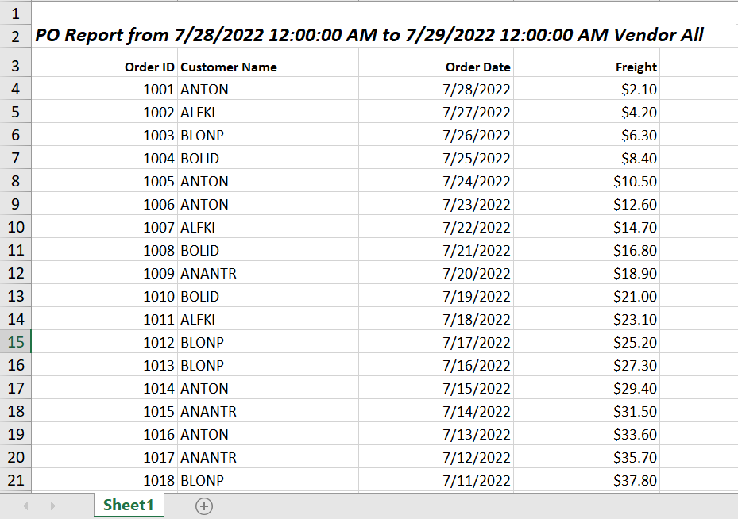

<!-- markdownlint-disable MD033 -->

# Excel Export in Blazor DataGrid Component

The excel export allows exporting DataGrid data to Excel document. You need to use the
 **ExcelExport** method for exporting. To enable Excel export in the datagrid, set the [AllowExcelExport](https://help.syncfusion.com/cr/blazor/Syncfusion.Blazor.Grids.SfGrid-1.html#Syncfusion_Blazor_Grids_SfGrid_1_AllowExcelExport) property as true.

```cshtml
@using Syncfusion.Blazor.Grids

<SfGrid ID="Grid" @ref="DefaultGrid" DataSource="@Orders" AllowSorting="true" Toolbar="@(new List<string>() { "ExcelExport" })" AllowExcelExport="true" AllowPaging="true">
    <GridEvents OnToolbarClick="ToolbarClickHandler" TValue="Order"></GridEvents>
    <GridColumns>
        <GridColumn Field=@nameof(Order.OrderID) HeaderText="Order ID" TextAlign="TextAlign.Right" Width="120"></GridColumn>
        <GridColumn Field=@nameof(Order.CustomerID) HeaderText="Customer Name" Width="150"></GridColumn>
        <GridColumn Field=@nameof(Order.OrderDate) HeaderText=" Order Date" Format="d" Type="ColumnType.Date" TextAlign="TextAlign.Right" Width="130"></GridColumn>
        <GridColumn Field=@nameof(Order.Freight) HeaderText="Freight" Format="C2" TextAlign="TextAlign.Right" Width="120"></GridColumn>
    </GridColumns>
</SfGrid>

@code{
    private SfGrid<Order> DefaultGrid;

    public List<Order> Orders { get; set; }

    public async Task ToolbarClickHandler(Syncfusion.Blazor.Navigations.ClickEventArgs args)
    {
       if (args.Item.Id == "Grid_excelexport") //Id is combination of Grid's ID and itemname
        {
            await this.DefaultGrid.ExcelExport();
        }
    }

    protected override void OnInitialized()
    {
        Orders = Enumerable.Range(1, 75).Select(x => new Order()
        {
            OrderID = 1000 + x,
            CustomerID = (new string[] { "ALFKI", "ANANTR", "ANTON", "BLONP", "BOLID" })[new Random().Next(5)],
            Freight = 2.1 * x,
            OrderDate = DateTime.Now.AddDays(-x),
        }).ToList();
    }

    public class Order
    {
        public int? OrderID { get; set; }
        public string CustomerID { get; set; }
        public DateTime? OrderDate { get; set; }
        public double? Freight { get; set; }
    }
}
```

## To customize excel export

The excel export provides an option to customize mapping of the datagrid to excel document.

### Export current page

The excel export provides an option to export the current page into excel. To export current page, define **exportType** to **CurrentPage**.

```cshtml
@using Syncfusion.Blazor.Grids

<SfGrid ID="Grid" @ref="DefaultGrid" DataSource="@Orders" AllowSorting="true" Toolbar="@(new List<string>() { "ExcelExport" })" AllowExcelExport="true" AllowPaging="true">
    <GridEvents OnToolbarClick="ToolbarClickHandler" TValue="Order"></GridEvents>
    <GridColumns>
        <GridColumn Field=@nameof(Order.OrderID) HeaderText="Order ID" TextAlign="TextAlign.Right" Width="120"></GridColumn>
        <GridColumn Field=@nameof(Order.CustomerID) HeaderText="Customer Name" Width="150"></GridColumn>
        <GridColumn Field=@nameof(Order.OrderDate) HeaderText=" Order Date" Format="d" Type="ColumnType.Date" TextAlign="TextAlign.Right" Width="130"></GridColumn>
        <GridColumn Field=@nameof(Order.Freight) HeaderText="Freight" Format="C2" TextAlign="TextAlign.Right" Width="120"></GridColumn>
    </GridColumns>
</SfGrid>

@code{
    private SfGrid<Order> DefaultGrid;

    public List<Order> Orders { get; set; }

    public async Task ToolbarClickHandler(Syncfusion.Blazor.Navigations.ClickEventArgs args)
    {
       if (args.Item.Id == "Grid_excelexport") //Id is combination of Grid's ID and itemname
        {
            ExcelExportProperties ExportProperties = new ExcelExportProperties();
            ExportProperties.ExportType = ExportType.CurrentPage;
            await this.DefaultGrid.ExcelExport(ExportProperties);
        }
    }

    protected override void OnInitialized()
    {
        Orders = Enumerable.Range(1, 75).Select(x => new Order()
        {
            OrderID = 1000 + x,
            CustomerID = (new string[] { "ALFKI", "ANANTR", "ANTON", "BLONP", "BOLID" })[new Random().Next(5)],
            Freight = 2.1 * x,
            OrderDate = DateTime.Now.AddDays(-x),
        }).ToList();
    }

    public class Order
    {
        public int? OrderID { get; set; }
        public string CustomerID { get; set; }
        public DateTime? OrderDate { get; set; }
        public double? Freight { get; set; }
    }
}
```

### Export hidden columns

The excel export provides an option to export hidden columns of DataGrid by defining [IncludeHiddenColumn](https://help.syncfusion.com/cr/blazor/Syncfusion.Blazor.Grids.ExcelExportProperties.html#Syncfusion_Blazor_Grids_ExcelExportProperties_IncludeHiddenColumn) as **true**.

```cshtml
@using Syncfusion.Blazor.Grids

<SfGrid ID="Grid" @ref="DefaultGrid" DataSource="@Orders" AllowSorting="true" Toolbar="@(new List<string>() { "ExcelExport" })" AllowExcelExport="true" AllowPaging="true">
    <GridEvents OnToolbarClick="ToolbarClickHandler" TValue="Order"></GridEvents>
    <GridColumns>
        <GridColumn Field=@nameof(Order.OrderID) HeaderText="Order ID" TextAlign="TextAlign.Right" Width="120"></GridColumn>
        <GridColumn Field=@nameof(Order.CustomerID) HeaderText="Customer Name" Width="150"></GridColumn>
        <GridColumn Field=@nameof(Order.OrderDate) HeaderText=" Order Date" Format="d" Type="ColumnType.Date" TextAlign="TextAlign.Right" Width="130"></GridColumn>
        <GridColumn Field=@nameof(Order.Freight) HeaderText="Freight" Visible="false" Format="C2" TextAlign="TextAlign.Right" Width="120"></GridColumn>
    </GridColumns>
</SfGrid>

@code{
    private SfGrid<Order> DefaultGrid;

    public List<Order> Orders { get; set; }

    public async Task ToolbarClickHandler(Syncfusion.Blazor.Navigations.ClickEventArgs args)
    {
       if (args.Item.Id == "Grid_excelexport") //Id is combination of Grid's ID and itemname
        {
            ExcelExportProperties ExportProperties = new ExcelExportProperties();
            ExportProperties.IncludeHiddenColumn = true;
            await this.DefaultGrid.ExcelExport(ExportProperties);
        }
    }

    protected override void OnInitialized()
    {
        Orders = Enumerable.Range(1, 75).Select(x => new Order()
        {
            OrderID = 1000 + x,
            CustomerID = (new string[] { "ALFKI", "ANANTR", "ANTON", "BLONP", "BOLID" })[new Random().Next(5)],
            Freight = 2.1 * x,
            OrderDate = DateTime.Now.AddDays(-x),
        }).ToList();
    }

    public class Order
    {
        public int? OrderID { get; set; }
        public string CustomerID { get; set; }
        public DateTime? OrderDate { get; set; }
        public double? Freight { get; set; }
    }
}
```

### Export the selected records only

The Grid has an option to export the selected records in an excel exported document. This can be achieved by using the [DataSource](https://help.syncfusion.com/cr/blazor/Syncfusion.Blazor.Grids.ExcelExportProperties.html#Syncfusion_Blazor_Grids_ExcelExportProperties_DataSource) property of the [ExcelExportProperties](https://help.syncfusion.com/cr/blazor/Syncfusion.Blazor.Grids.ExcelExportProperties.html) class and the [GetSelectedRecordsAsync](https://help.syncfusion.com/cr/blazor/Syncfusion.Blazor.Grids.SfGrid-1.html#Syncfusion_Blazor_Grids_SfGrid_1_GetSelectedRecordsAsync) method of the Grid.

In the following sample, selected records will be gotten from the `GetSelectedRecordsAsync` method and provided to the `DataSource` property of `ExcelExportProperties`. Then pass this ExcelExportProperties class to the [ExportToExcelAsync](https://help.syncfusion.com/cr/blazor/Syncfusion.Blazor.Grids.SfGrid-1.html#Syncfusion_Blazor_Grids_SfGrid_1_ExportToExcelAsync_Syncfusion_Blazor_Grids_ExcelExportProperties_System_Nullable_System_Boolean__System_Object_System_Nullable_System_Boolean__) method to get the selected records in the exported document.

```cshtml
@using Syncfusion.Blazor.Grids

<SfGrid ID="Grid" @ref="DefaultGrid" DataSource="@Orders" AllowExcelExport="true" AllowPaging="true"
        Toolbar="@(new List<string>() { "ExcelExport" })" AllowSelection="true">
    <GridEvents OnToolbarClick="OnToolbarClick" TValue="Order"></GridEvents>
    <GridSelectionSettings Type="SelectionType.Multiple"></GridSelectionSettings>
    <GridColumns>
        <GridColumn Field=@nameof(Order.OrderID) HeaderText="Order ID" TextAlign="TextAlign.Right" Width="120"></GridColumn>
        <GridColumn Field=@nameof(Order.CustomerID) HeaderText="Customer Name" Width="150"></GridColumn>
        <GridColumn Field=@nameof(Order.OrderDate) HeaderText=" Order Date" Format="d" Type="ColumnType.Date" TextAlign="TextAlign.Right" Width="130"></GridColumn>
        <GridColumn Field=@nameof(Order.Freight) HeaderText="Freight" Format="C2" TextAlign="TextAlign.Right" Width="120"></GridColumn>
    </GridColumns>
</SfGrid>

@code{
    private SfGrid<Order> DefaultGrid;
    public List<Order> Orders { get; set; }
    public async Task OnToolbarClick(Syncfusion.Blazor.Navigations.ClickEventArgs args)
    {
        if (args.Item.Id == "Grid_excelexport") // Id is combination of Grid's ID and itemname.
        {
            ExcelExportProperties ExcelProperties = new ExcelExportProperties();
            var selectedRecord = await DefaultGrid.GetSelectedRecordsAsync();
            if(selectedRecord.Count() > 0)
            {
                ExcelProperties.DataSource = selectedRecord;
            }
            else
            {
                ExcelProperties.DataSource = Orders;
            }
            await this.DefaultGrid.ExportToExcelAsync(ExcelProperties);
        }
    }
    protected override void OnInitialized()
    {
        Orders = Enumerable.Range(1, 15).Select(x => new Order()
        {
            OrderID = 1000 + x,
            CustomerID = (new string[] { "ALFKI", "ANANTR", "ANTON", "BLONP", "BOLID" })[new Random().Next(5)],
            ShipCountry = (new string[] { "Germany", "UK", "USA", "Italy", "France" })[new Random().Next(5)],
            Freight = 2.1 * x,
            OrderDate = DateTime.Now.AddDays(-x),
        }).ToList();
    }
    public class Order
    {
        public int? OrderID { get; set; }
        public string CustomerID { get; set; }
        public string ShipCountry { get; set; }
        public DateTime? OrderDate { get; set; }
        public double? Freight { get; set; }
    }
}
```

### Add custom text in header/footer

You can add text and customize its styles either in the header or footer of an exported excel document by using the [Header](https://help.syncfusion.com/cr/blazor/Syncfusion.Blazor.Grids.ExcelExportProperties.html#Syncfusion_Blazor_Grids_ExcelExportProperties_Header) and [Footer](https://help.syncfusion.com/cr/blazor/Syncfusion.Blazor.Grids.ExcelExportProperties.html#Syncfusion_Blazor_Grids_ExcelExportProperties_Footer) properties of the [ExcelExportProperties](https://help.syncfusion.com/cr/blazor/Syncfusion.Blazor.Grids.ExcelExportProperties.html) class.

The following sample code demonstrates adding custom text and customizing its styles in the header section of the exported document,

```cshtml
@using Syncfusion.Blazor.Grids
@using Syncfusion.Blazor.Calendars

<SfDateRangePicker @ref="DateRange" TValue="DateTime?" StartDate="@StartValue" EndDate="@EndValue"></SfDateRangePicker>

<SfGrid ID="Grid" @ref="DefaultGrid" DataSource="@Orders" Toolbar="@(new List<string>() { "ExcelExport" })" AllowExcelExport="true" AllowPaging="true">
    <GridEvents OnToolbarClick="ToolbarClickHandler" TValue="Order"></GridEvents>
    <GridColumns>
        <GridColumn Field=@nameof(Order.OrderID) HeaderText="Order ID" TextAlign="TextAlign.Right" Width="120"></GridColumn>
        <GridColumn Field=@nameof(Order.CustomerID) HeaderText="Customer Name" Width="150"></GridColumn>
        <GridColumn Field=@nameof(Order.OrderDate) HeaderText=" Order Date" Format="d" Type="ColumnType.Date" TextAlign="TextAlign.Right" Width="130"></GridColumn>
        <GridColumn Field=@nameof(Order.Freight) HeaderText="Freight" Format="C2" TextAlign="TextAlign.Right" Width="120"></GridColumn>
    </GridColumns>
</SfGrid>

@code{
    private SfDateRangePicker<DateTime?> DateRange;
    private SfGrid<Order> DefaultGrid;
    public List<Order> Orders { get; set; }
    public DateTime? StartValue { get; set; } = new DateTime(DateTime.Now.Year, DateTime.Now.Month, 28);
    public DateTime? EndValue { get; set; } = new DateTime(DateTime.Now.Year, DateTime.Now.Month, 29);

    public async Task ToolbarClickHandler(Syncfusion.Blazor.Navigations.ClickEventArgs args)
    {
        if (args.Item.Id == "Grid_excelexport")  //Id is combination of Grid's ID and itemname      
        {
            ExcelExportProperties  ExportProperties = new ExcelExportProperties ();
            ExcelHeader header = new ExcelHeader();
            header.HeaderRows = 2;
            List<ExcelCell> cell = new List<ExcelCell>
            {
                new ExcelCell() { RowSpan= 2,ColSpan=5 , Value= "PO Report from " + DateRange.StartDate.ToString() + " to " + DateRange.EndDate.ToString() + " Vendor All", Style = new ExcelStyle() { Bold = true, FontSize = 13, Italic= true }  }
            };

            List<ExcelRow> HeaderContent = new List<ExcelRow>
            {
                new ExcelRow() {  Cells = cell, Index = 1 }
            };
            header.Rows = HeaderContent;
            ExportProperties.Header = header;
            await this.DefaultGrid.ExcelExport(ExportProperties);
        }
    }
    protected override void OnInitialized()
    {
        Orders = Enumerable.Range(1, 75).Select(x => new Order()
        {
            OrderID = 1000 + x,
            CustomerID = (new string[] { "ALFKI", "ANANTR", "ANTON", "BLONP", "BOLID" })[new Random().Next(5)],
            Freight = 2.1 * x,
            OrderDate = DateTime.Now.AddDays(-x),
        }).ToList();
    }

    public class Order
    {
        public int? OrderID { get; set; }
        public string CustomerID { get; set; }
        public DateTime? OrderDate { get; set; }
        public double? Freight { get; set; }
    }
}
```



### Export template columns

The excel export provides an option to export template columns of the DataGrid by defining the [IncludeTemplateColumn](https://help.syncfusion.com/cr/blazor/Syncfusion.Blazor.Grids.ExcelExportProperties.html#Syncfusion_Blazor_Grids_ExcelExportProperties_IncludeTemplateColumn) of [ExcelExportProperties](https://help.syncfusion.com/cr/blazor/Syncfusion.Blazor.Grids.ExcelExportProperties.html) as true. In the following sample, the CustomerID column is a template column. The template values cannot be directly exported into the cells. To customize the values of the template columns in Excel file, you must use [ExcelQueryCellInfoEvent](https://help.syncfusion.com/cr/blazor/Syncfusion.Blazor.Grids.GridEvents-1.html#Syncfusion_Blazor_Grids_GridEvents_1_ExcelQueryCellInfoEvent).

```cshtml
@using Syncfusion.Blazor.Grids

<SfGrid ID="Grid" @ref="DefaultGrid" DataSource="@Orders" Toolbar="@(new List<string>() { "ExcelExport" })" AllowExcelExport="true" AllowPaging="true">
    <GridEvents ExcelQueryCellInfoEvent="ExcelQueryCellInfoHandler" OnToolbarClick="ToolbarClickHandler" TValue="Order"></GridEvents>
    <GridColumns>
        <GridColumn Field=@nameof(Order.OrderID) HeaderText="Order ID" TextAlign="TextAlign.Right" Width="120"></GridColumn>
        <GridColumn Field=@nameof(Order.CustomerID) HeaderText="Customer Name" Width="150">
            <Template>
                @{
                    var con = (context as Order);
                }
                <span>Mr.@con.CustomerID</span>
            </Template>
        </GridColumn>
        <GridColumn Field=@nameof(Order.OrderDate) HeaderText="Order Date" Format="d" Type="ColumnType.Date" TextAlign="TextAlign.Right" Width="130"></GridColumn>
        <GridColumn Field=@nameof(Order.Freight) HeaderText="Freight" Format="C2" TextAlign="TextAlign.Right" Width="120"></GridColumn>
    </GridColumns>
</SfGrid>

@code{
    private SfGrid<Order> DefaultGrid;
    public List<Order> Orders { get; set; }

    public async Task ToolbarClickHandler(Syncfusion.Blazor.Navigations.ClickEventArgs args)
    {
        if (args.Item.Id == "Grid_excelexport")  // Id is the combination of Grid's ID and item name.
        {
            ExcelExportProperties ExportProperties = new ExcelExportProperties();
            ExportProperties.IncludeTemplateColumn = true;
            await this.DefaultGrid.ExportToExcelAsync(ExportProperties);
        }
    }
    public void ExcelQueryCellInfoHandler(ExcelQueryCellInfoEventArgs<Order> args)
    {
        if (args.Column.Field == "CustomerID")
        {
            args.Cell.Value = "Mr." + args.Data.CustomerID;
        }
    }
    protected override void OnInitialized()
    {
        Orders = Enumerable.Range(1, 75).Select(x => new Order()
        {
            OrderID = 1000 + x,
            CustomerID = (new string[] { "Alfki", "Anantr", "Anton", "Blonp", "Bolid" })[new Random().Next(5)],
            Freight = 2.1 * x,
            OrderDate = DateTime.Now.AddDays(-x),
        }).ToList();
    }

    public class Order
    {
        public int? OrderID { get; set; }
        public string CustomerID { get; set; }
        public DateTime? OrderDate { get; set; }
        public double? Freight { get; set; }
    }
}
```

<!-- Show or hide columns on exported excel

You can show a hidden column or hide a visible column while exporting the DataGrid by customizing the visibility settings.

This is demonstrated in the below sample code where initially the **CustomerID** is hidden. While exporting, we have changed CustomerID to visible column and Freight as hidden column. Then in the `ExcelExportComplete` event, we have reversed the column's visibility state back to the previous state.

```cshtml
@using Syncfusion.Blazor.Buttons
@using Syncfusion.Blazor.Grids

<SfButton OnClick="ExcelExport" Content="Excel Export"></SfButton>
<SfGrid @ref="DefaultGrid" DataSource="@Orders" AllowSorting="true" AllowExcelExport="true" AllowPaging="true">
    <GridEvents ExcelExportComplete="OnExcelExport" TValue="Order"></GridEvents>
    <GridColumns>
        <GridColumn Field=@nameof(Order.OrderID) HeaderText="Order ID" TextAlign="TextAlign.Right" Width="120"></GridColumn>
        <GridColumn Field=@nameof(Order.CustomerID) HeaderText="Customer Name" Visible=@CustomerIDVisibility Width="150"></GridColumn>
        <GridColumn Field=@nameof(Order.OrderDate) HeaderText=" Order Date" Format="d" Type="ColumnType.Date" TextAlign="TextAlign.Right" Width="130"></GridColumn>
        <GridColumn Field=@nameof(Order.Freight) HeaderText="Freight" Visible=@FreightVisibility Format="C2" TextAlign="TextAlign.Right" Width="120"></GridColumn>
    </GridColumns>
</SfGrid>

@code{
    private SfGrid<Order> DefaultGrid;

    public List<Order> Orders { get; set; }

    public bool CustomerIDVisibility = false;

    public bool FreightVisibility = true;

    protected override void OnInitialized()
    {
        Orders = Enumerable.Range(1, 75).Select(x => new Order()
        {
            OrderID = 1000 + x,
            CustomerID = (new string[] { "ALFKI", "ANANTR", "ANTON", "BLONP", "BOLID" })[new Random().Next(5)],
            Freight = 2.1 * x,
            OrderDate = DateTime.Now.AddDays(-x),
        }).ToList();
    }

    public class Order
    {
        public int? OrderID { get; set; }
        public string CustomerID { get; set; }
        public DateTime? OrderDate { get; set; }
        public double? Freight { get; set; }
    }

    public void ExcelExport()
    {
        CustomerIDVisibility = true;
        FreightVisibility = false;
        this.DefaultGrid.ExcelExport();
    }
    public void OnExcelExport()
    {
        CustomerIDVisibility = false;
        FreightVisibility = true;
    }
}
``` -->

### Theme

The excel export provides an option to include theme for exported excel document.

To apply theme in exported Excel, define the **theme** in export properties.

```cshtml
@using Syncfusion.Blazor.Grids

<SfGrid ID="Grid" @ref="DefaultGrid" DataSource="@Orders" AllowSorting="true" Toolbar="@(new List<string>() { "ExcelExport" })" AllowExcelExport="true" AllowPaging="true">
    <GridEvents OnToolbarClick="ToolbarClickHandler" TValue="Order"></GridEvents>
    <GridColumns>
        <GridColumn Field=@nameof(Order.OrderID) HeaderText="Order ID" TextAlign="TextAlign.Right" Width="120"></GridColumn>
        <GridColumn Field=@nameof(Order.CustomerID) HeaderText="Customer Name" Width="150"></GridColumn>
        <GridColumn Field=@nameof(Order.OrderDate) HeaderText=" Order Date" Format="d" Type="ColumnType.Date" TextAlign="TextAlign.Right" Width="130"></GridColumn>
        <GridColumn Field=@nameof(Order.Freight) HeaderText="Freight" Format="C2" TextAlign="TextAlign.Right" Width="120"></GridColumn>
    </GridColumns>
</SfGrid>

@code{
    private SfGrid<Order> DefaultGrid;

    public List<Order> Orders { get; set; }

    public async Task ToolbarClickHandler(Syncfusion.Blazor.Navigations.ClickEventArgs args)
    {
       if (args.Item.Id == "Grid_excelexport") //Id is combination of Grid's ID and itemname
        {
            ExcelExportProperties ExcelProperties = new ExcelExportProperties();
            ExcelTheme Theme = new ExcelTheme();
            ExcelStyle ThemeStyle = new ExcelStyle()
            {
                FontName = "Segoe UI",
                FontColor = "#666666",
                FontSize = 20
            };
            Theme.Header = ThemeStyle;
            Theme.Record = ThemeStyle;
            Theme.Caption = ThemeStyle;
            ExcelProperties.Theme = Theme;
            await this.DefaultGrid.ExcelExport(ExcelProperties);
        }
    }

    protected override void OnInitialized()
    {
        Orders = Enumerable.Range(1, 75).Select(x => new Order()
        {
            OrderID = 1000 + x,
            CustomerID = (new string[] { "ALFKI", "ANANTR", "ANTON", "BLONP", "BOLID" })[new Random().Next(5)],
            Freight = 2.1 * x,
            OrderDate = DateTime.Now.AddDays(-x),
        }).ToList();
    }

    public class Order
    {
        public int? OrderID { get; set; }
        public string CustomerID { get; set; }
        public DateTime? OrderDate { get; set; }
        public double? Freight { get; set; }
    }
}
```

N> By default, material theme is applied to exported excel document.

### Customizing the background color for a Grid in an exported Excel document

You can set the background color for a Grid in the exported document using the [Theme](https://help.syncfusion.com/cr/blazor/Syncfusion.Blazor.Grids.ExcelExportProperties.html#Syncfusion_Blazor_Grids_ExcelExportProperties_Theme) property of [ExcelExportProperties](https://help.syncfusion.com/cr/blazor/Syncfusion.Blazor.Grids.ExcelExportProperties.html) class.

This can be demonstrated using the following sample:

```cshtml
@using Syncfusion.Blazor.Grids

<SfGrid ID="Grid" @ref="DefaultGrid" DataSource="@Orders" AllowSorting="true" Toolbar="@(new List<string>() { "ExcelExport" })" AllowExcelExport="true" AllowPaging="true">
    <GridEvents OnToolbarClick="ToolbarClickHandler" TValue="Order"></GridEvents>
    <GridColumns>
        <GridColumn Field=@nameof(Order.OrderID) HeaderText="Order ID" TextAlign="TextAlign.Right" Width="120"></GridColumn>
        <GridColumn Field=@nameof(Order.CustomerID) HeaderText="Customer Name" Width="150"></GridColumn>
        <GridColumn Field=@nameof(Order.OrderDate) HeaderText=" Order Date" Format="d" Type="ColumnType.Date" TextAlign="TextAlign.Right" Width="130"></GridColumn>
        <GridColumn Field=@nameof(Order.Freight) HeaderText="Freight" Format="C2" TextAlign="TextAlign.Right" Width="120"></GridColumn>
    </GridColumns>
</SfGrid>

@code{
    private SfGrid<Order> DefaultGrid;
    public List<Order> Orders { get; set; }

    public async Task ToolbarClickHandler(Syncfusion.Blazor.Navigations.ClickEventArgs args)
    {
        if (args.Item.Id == "Grid_excelexport") //Id is combination of Grid's ID and itemname
        {
            ExcelExportProperties ExcelProperties = new ExcelExportProperties();
            ExcelTheme Theme = new ExcelTheme();
            ExcelStyle ThemeStyle = new ExcelStyle()
            {
                BackColor = "#C67878"
            };
            Theme.Header = ThemeStyle;
            Theme.Record = ThemeStyle;
            Theme.Caption = ThemeStyle;
            ExcelProperties.Theme = Theme;
            await this.DefaultGrid.ExcelExport(ExcelProperties);
        }
    }

    protected override void OnInitialized()
    {
        Orders = Enumerable.Range(1, 75).Select(x => new Order()
        {
            OrderID = 1000 + x,
            CustomerID = (new string[] { "ALFKI", "ANANTR", "ANTON", "BLONP", "BOLID" })[new Random().Next(5)],
            Freight = 2.1 * x,
            OrderDate = DateTime.Now.AddDays(-x),
        }).ToList();
    }

    public class Order
    {
        public int? OrderID { get; set; }
        public string CustomerID { get; set; }
        public DateTime? OrderDate { get; set; }
        public double? Freight { get; set; }
    }
}

```


N> [View Sample in GitHub.](https://github.com/SyncfusionExamples/blazor-datagrid-customize-background-color-for-grid-exported-excel-file)

### Customizing the background color for a particular column in an exported Excel document

You can set the background color for a particular column in the exported document. This can be achieved by the [ExcelQueryCellInfoEvent](https://help.syncfusion.com/cr/blazor/Syncfusion.Blazor.Grids.GridEvents-1.html#Syncfusion_Blazor_Grids_GridEvents_1_ExcelQueryCellInfoEvent) of the Grid.

This can be demonstrated using the following sample:

```cshtml
@using Syncfusion.Blazor.Grids

<SfGrid ID="Grid" @ref="DefaultGrid" DataSource="@Orders" AllowSorting="true" Toolbar="@(new List<string>() { "ExcelExport" })" AllowExcelExport="true" AllowPaging="true">
    <GridEvents ExcelQueryCellInfoEvent="ExcelQueryCellInfoHandler" OnToolbarClick="ToolbarClickHandler" TValue="Order"></GridEvents>
    <GridColumns>
        <GridColumn Field=@nameof(Order.OrderID) HeaderText="Order ID" TextAlign="TextAlign.Right" Width="120"></GridColumn>
        <GridColumn Field=@nameof(Order.CustomerID) HeaderText="Customer Name" Width="150"></GridColumn>
        <GridColumn Field=@nameof(Order.OrderDate) HeaderText=" Order Date" Format="d" Type="ColumnType.Date" TextAlign="TextAlign.Right" Width="130"></GridColumn>
        <GridColumn Field=@nameof(Order.Freight) HeaderText="Freight" Format="C2" TextAlign="TextAlign.Right" Width="120"></GridColumn>
    </GridColumns>
</SfGrid>

@code{
    private SfGrid<Order> DefaultGrid;
    public List<Order> Orders { get; set; }

    public void ExcelQueryCellInfoHandler(ExcelQueryCellInfoEventArgs<Order> args)
    {
        // Here you can customize your code
        if (args.Column.Field == "CustomerID") {
            if (args.Data.CustomerID == "ALFKI") 
            {
                args.Cell.CellStyle.BackColor = "#DC143C";
            }
            else if (args.Data.CustomerID == "ANANTR") 
            {
                args.Cell.CellStyle.BackColor = "#FF0000";
            }
            else if (args.Data.CustomerID == "ANTON")
            {
                args.Cell.CellStyle.BackColor = "#FFD700";
            }
            else if (args.Data.CustomerID == "BLONP")
            {
                args.Cell.CellStyle.BackColor = "#FFFF00";
            }
            else if (args.Data.CustomerID == "BOLID")
            {
                args.Cell.CellStyle.BackColor = "#7CFC00";
            }
        }
    }

    public async Task ToolbarClickHandler(Syncfusion.Blazor.Navigations.ClickEventArgs args)
    {
        if (args.Item.Id == "Grid_excelexport") //Id is combination of Grid's ID and itemname
        {
            await this.DefaultGrid.ExcelExport();
        }
    }

    protected override void OnInitialized()
    {
        Orders = Enumerable.Range(1, 75).Select(x => new Order()
        {
            OrderID = 1000 + x,
            CustomerID = (new string[] { "ALFKI", "ANANTR", "ANTON", "BLONP", "BOLID" })[new Random().Next(5)],
            Freight = 2.1 * x,
            OrderDate = DateTime.Now.AddDays(-x),
        }).ToList();
    }

    public class Order
    {
        public int? OrderID { get; set; }
        public string CustomerID { get; set; }
        public DateTime? OrderDate { get; set; }
        public double? Freight { get; set; }
    }
}

```


N> [View Sample in GitHub.](https://github.com/SyncfusionExamples/blazor-datagrid-customize-background-color-for-particular-column)

<!-- To add header and footer

The excel export provides an option to include header and footer content for exported excel document using the [`ExcelExportProperties`](https://help.syncfusion.com/cr/aspnetcore-blazor/Syncfusion.Blazor.Grids.ExcelExportProperties.html) class.

This is demonstrated in the below sample code,

```cshtml
@using Syncfusion.Blazor.Buttons
@using Syncfusion.Blazor.Grids

<SfButton OnClick="ExcelExport" Content="Excel Export"></SfButton>
<SfGrid @ref="DefaultGrid" DataSource="@Orders" AllowSorting="true" AllowExcelExport="true" AllowPaging="true">
    <GridColumns>
        <GridColumn Field=@nameof(Order.OrderID) HeaderText="Order ID" TextAlign="TextAlign.Right" Width="120"></GridColumn>
        <GridColumn Field=@nameof(Order.CustomerID) HeaderText="Customer Name" Width="150"></GridColumn>
        <GridColumn Field=@nameof(Order.OrderDate) HeaderText=" Order Date" Format="d" Type="ColumnType.Date" TextAlign="TextAlign.Right" Width="130"></GridColumn>
        <GridColumn Field=@nameof(Order.Freight) HeaderText="Freight" Format="C2" TextAlign="TextAlign.Right" Width="120"></GridColumn>
    </GridColumns>
</SfGrid>

@code{
    private SfGrid<Order> DefaultGrid;

    public List<Order> Orders { get; set; }

    protected override void OnInitialized()
    {
        Orders = Enumerable.Range(1, 75).Select(x => new Order()
        {
            OrderID = 1000 + x,
            CustomerID = (new string[] { "ALFKI", "ANANTR", "ANTON", "BLONP", "BOLID" })[new Random().Next(5)],
            Freight = 2.1 * x,
            OrderDate = DateTime.Now.AddDays(-x),
        }).ToList();
    }

    public class Order
    {
        public int? OrderID { get; set; }
        public string CustomerID { get; set; }
        public DateTime? OrderDate { get; set; }
        public double? Freight { get; set; }
    }

    public void ExcelExport()
    {
        ExcelExportProperties ExportProperties = new ExcelExportProperties();

        ExcelHeader Header = new ExcelHeader();

        ExcelFooter Footer = new ExcelFooter();

        List<ExcelRow> HeaderRows = new List<ExcelRow>()
        {
            new ExcelRow() {
                Cells = new List<ExcelCell>() {
                    new ExcelCell() { ColSpan = 4, Value = "Northwind Traders", Style = new ExcelStyle() {
                        FontColor = "#C67878",
                        FontSize = 20,
                        HAlign = ExcelHAlign.Center,
                        Bold = true
                    }
                    }
                }
            },
            new ExcelRow() {
                Cells = new List<ExcelCell>() {
                    new ExcelCell() { ColSpan = 4, Value = "2501 Aerial Center Parkway", Style = new ExcelStyle() {
                        FontColor = "#C67878",
                        FontSize = 15,
                        HAlign = ExcelHAlign.Center,
                        Bold = true
                    }
                    }
                }
            },
            new ExcelRow() {
                Cells = new List<ExcelCell>() {
                    new ExcelCell() { ColSpan = 4, Value = "Suite 200 Morrisville, NC 27560 USA", Style = new ExcelStyle() {
                        FontColor = "#C67878",
                        FontSize = 15,
                        HAlign = ExcelHAlign.Center,
                        Bold = true
                    }
                    }
                }
            },
            new ExcelRow() {
                Cells = new List<ExcelCell>() {
                    new ExcelCell() { ColSpan = 4, Value = "Tel +1 888.936.8638 Fax +1 919.573.0306", Style = new ExcelStyle() {
                        FontColor = "#C67878",
                        FontSize = 15,
                        HAlign = ExcelHAlign.Center,
                        Bold = true
                    }
                    }
                }
            },
            new ExcelRow() {
                Cells = new List<ExcelCell>() {
                    new ExcelCell() { ColSpan = 4, Hyperlink = new Hyperlink() { 
                        Target = "https://www.northwind.com/",
                        DisplayText = "www.northwind.com"
                    },
                        Style = new ExcelStyle() {
                        HAlign = ExcelHAlign.Center,
                    }
                    }
                }
            },
            new ExcelRow() {
                Cells = new List<ExcelCell>() {
                    new ExcelCell() { ColSpan = 4, Hyperlink = new Hyperlink() { 
                        Target = "mailto:support@northwind.com",
                        DisplayText = "Support"
                    },
                        Style = new ExcelStyle() {
                        HAlign = ExcelHAlign.Center,
                    }
                    }
                }
            }
        };
        Header.HeaderRows = 6;
        Header.Rows = HeaderRows;

        List<ExcelRow> FooterRows = new List<ExcelRow>()
        {
            new ExcelRow() {
                Cells = new List<ExcelCell>() {
                    new ExcelCell() { ColSpan = 4, Value = "Thank you for your business!", Style = new ExcelStyle() {
                        HAlign = ExcelHAlign.Center,
                        Bold = true
                    }
                    }
                }
            },
            new ExcelRow() {
                Cells = new List<ExcelCell>() {
                    new ExcelCell() { ColSpan = 4, Value = "!Visit Again!", Style = new ExcelStyle() {
                        HAlign = ExcelHAlign.Center,
                        Bold = true
                    }
                    }
                }
            }
        };
        Footer.FooterRows = 2;
        Footer.Rows = FooterRows;

        ExportProperties.Header = Header;
        ExportProperties.Footer = Footer;

        this.DefaultGrid.ExcelExport(ExportProperties);
    }
}
``` -->

### File name for exported document

You can assign the file name for the exported document by defining **fileName** property in excel export properties.

```cshtml
@using Syncfusion.Blazor.Grids

<SfGrid ID="Grid" @ref="DefaultGrid" DataSource="@Orders" AllowSorting="true" Toolbar="@(new List<string>() { "ExcelExport" })" AllowExcelExport="true" AllowPaging="true">
    <GridEvents OnToolbarClick="ToolbarClickHandler" TValue="Order"></GridEvents>
    <GridColumns>
        <GridColumn Field=@nameof(Order.OrderID) HeaderText="Order ID" TextAlign="TextAlign.Right" Width="120"></GridColumn>
        <GridColumn Field=@nameof(Order.CustomerID) HeaderText="Customer Name" Width="150"></GridColumn>
        <GridColumn Field=@nameof(Order.OrderDate) HeaderText=" Order Date" Format="d" Type="ColumnType.Date" TextAlign="TextAlign.Right" Width="130"></GridColumn>
        <GridColumn Field=@nameof(Order.Freight) HeaderText="Freight" Format="C2" TextAlign="TextAlign.Right" Width="120"></GridColumn>
    </GridColumns>
</SfGrid>

@code{
    private SfGrid<Order> DefaultGrid;

    public List<Order> Orders { get; set; }

    public async Task ToolbarClickHandler(Syncfusion.Blazor.Navigations.ClickEventArgs args)
    {
       if (args.Item.Id == "Grid_excelexport") //Id is combination of Grid's ID and itemname
        {
            ExcelExportProperties ExcelProperties = new ExcelExportProperties();
            ExcelProperties.FileName = "new.xlsx";
            await this.DefaultGrid.ExcelExport(ExcelProperties);
        }
    }

    protected override void OnInitialized()
    {
        Orders = Enumerable.Range(1, 75).Select(x => new Order()
        {
            OrderID = 1000 + x,
            CustomerID = (new string[] { "ALFKI", "ANANTR", "ANTON", "BLONP", "BOLID" })[new Random().Next(5)],
            Freight = 2.1 * x,
            OrderDate = DateTime.Now.AddDays(-x),
        }).ToList();
    }

    public class Order
    {
        public int? OrderID { get; set; }
        public string CustomerID { get; set; }
        public DateTime? OrderDate { get; set; }
        public double? Freight { get; set; }
    }
}
```

### Add additional worksheets to excel file while exporting

Additional worksheets can be added to the excel file while exporting using the [ExcelExportProperties](https://help.syncfusion.com/cr/blazor/Syncfusion.Blazor.Grids.ExcelExportProperties.html).

In the following sample, you can add the additional worksheets to excel file by creating a workbook using `ExcelExportProperties`. Additional sheets will be added along with the Grid data.

```cshtml
@using Syncfusion.Blazor.Grids
@using Syncfusion.ExcelExport

@{
    var Tool = (new List<string>() { "ExcelExport"});
}

<SfGrid @ref="DefaultGrid" DataSource="@Orders" Toolbar=@Tool AllowExcelExport="true">
   <GridEvents OnToolbarClick="ToolbarClickHandler" TValue="Order"></GridEvents>
    <GridColumns>
        <GridColumn Field=@nameof(Order.OrderID) HeaderText="Order ID" TextAlign="TextAlign.Right" Width="120"></GridColumn>
        <GridColumn Field=@nameof(Order.CustomerID) HeaderText="Customer Name" Width="150"></GridColumn>
        <GridColumn Field=@nameof(Order.OrderDate) HeaderText=" Order Date" Format="d" Type="ColumnType.Date" TextAlign="TextAlign.Right" Width="130"></GridColumn>
        <GridColumn Field=@nameof(Order.Freight) HeaderText="Freight" Format="C2" TextAlign="TextAlign.Right" Width="120"></GridColumn>
    </GridColumns>
</SfGrid>

@code{
    private SfGrid<Order> DefaultGrid;
    public List<Order> Orders { get; set; }

    protected override void OnInitialized()
    {
        Orders = Enumerable.Range(1, 75).Select(x => new Order()
        {
            OrderID = 1000 + x,
            CustomerID = (new string[] { "ALFKI", "ANANTR", "ANTON", "BLONP", "BOLID" })[new Random().Next(5)],
            Freight = 2.1 * x,
            OrderDate = DateTime.Now.AddDays(-x),
        }).ToList();
    }
    public class Order
    {
        public int? OrderID { get; set; }
        public string CustomerID { get; set; }
        public DateTime? OrderDate { get; set; }
        public double? Freight { get; set; }
    }
    public async Task ToolbarClickHandler()
    {
        ExcelExportProperties ExportProperties = new ExcelExportProperties();
        // Add a new workbook to the excel file that contains only 1 worksheet.
        ExportProperties.Workbook = new Workbook();
        // Add additional worksheets.
        ExportProperties.Workbook.Worksheets.Add();
        ExportProperties.Workbook.Worksheets.Add();
        // Define the Gridsheet index where Grid data must be exported.
        ExportProperties.GridSheetIndex = 0;
        // Export the document. 
        await this.DefaultGrid.ExcelExport(ExportProperties);
    }
}

```

## Exporting grouped records

The excel export provides outline option for grouped records which hides the detailed data for better viewing.
In datagrid, we have provided the outline option for the exported document when the data's are grouped.

```cshtml
@using Syncfusion.Blazor.Grids

<SfGrid ID="Grid" @ref="DefaultGrid" DataSource="@Orders" AllowGrouping="true" Toolbar="@(new List<string>() { "ExcelExport" })" AllowExcelExport="true" AllowPaging="true">
    <GridEvents OnToolbarClick="ToolbarClickHandler" TValue="Order"></GridEvents>
    <GridGroupSettings Columns="@(new string[] {"OrderDate"})"></GridGroupSettings>
    <GridColumns>
        <GridColumn Field=@nameof(Order.OrderID) HeaderText="Order ID" TextAlign="TextAlign.Right" Width="120"></GridColumn>
        <GridColumn Field=@nameof(Order.CustomerID) HeaderText="Customer Name" Width="150"></GridColumn>
        <GridColumn Field=@nameof(Order.OrderDate) HeaderText=" Order Date" Format="d" Type="ColumnType.Date" TextAlign="TextAlign.Right" Width="130"></GridColumn>
        <GridColumn Field=@nameof(Order.Freight) HeaderText="Freight" Visible="false" Format="C2" TextAlign="TextAlign.Right" Width="120"></GridColumn>
    </GridColumns>
</SfGrid>

@code{
    private SfGrid<Order> DefaultGrid;

    public List<Order> Orders { get; set; }

    public async Task ToolbarClickHandler(Syncfusion.Blazor.Navigations.ClickEventArgs args)
    {
       if (args.Item.Id == "Grid_excelexport") //Id is combination of Grid's ID and itemname
        {
            await this.DefaultGrid.ExcelExport();
        }
    }

    protected override void OnInitialized()
    {
        Orders = Enumerable.Range(1, 75).Select(x => new Order()
        {
            OrderID = 1000 + x,
            CustomerID = (new string[] { "ALFKI", "ANANTR", "ANTON", "BLONP", "BOLID" })[new Random().Next(5)],
            Freight = 2.1 * x,
            OrderDate = DateTime.Now.AddDays(-x),
        }).ToList();
    }

    public class Order
    {
        public int? OrderID { get; set; }
        public string CustomerID { get; set; }
        public DateTime? OrderDate { get; set; }
        public double? Freight { get; set; }
    }
}
```

### Limitations

Microsoft Excel permits up to seven nested levels in outlines. So that in the datagrid we can able to provide only up to seven nested levels and if it exceeds more than seven levels then the document will be exported without outline option. Refer the [Microsoft Limitation](https://docs.microsoft.com/en-us/sql/reporting-services/report-builder/exporting-to-microsoft-excel-report-builder-and-ssrs?view=sql-server-2017#ExcelLimitations)

## How to export the Grid with specific columns

You can export the Excel grid with specific columns instead of all columns which are defined in the Grid definition. To achieve this scenario by using [Columns](https://help.syncfusion.com/cr/blazor/Syncfusion.Blazor.Grids.ExcelExportProperties.html#Syncfusion_Blazor_Grids_ExcelExportProperties_Columns) property of the [ExcelExportProperties](https://help.syncfusion.com/cr/blazor/Syncfusion.Blazor.Grids.ExcelExportProperties.html) class.

```cshtml
@using Syncfusion.Blazor.Grids

<SfGrid ID="Grid" @ref="DefaultGrid" DataSource="@Orders" AllowExcelExport="true" AllowPaging="true" Toolbar="@(new List<string>() { "ExcelExport" })">
    <GridEvents OnToolbarClick="OnToolbarClick" TValue="Order"></GridEvents>
    <GridColumns>
        <GridColumn Field=@nameof(Order.OrderID) HeaderText="Order ID" TextAlign="TextAlign.Right" Width="120"></GridColumn>
        <GridColumn Field=@nameof(Order.CustomerID) HeaderText="Customer Name" Width="150"></GridColumn>
        <GridColumn Field=@nameof(Order.OrderDate) HeaderText=" Order Date" Format="d" Type="ColumnType.Date" TextAlign="TextAlign.Right" Width="130"></GridColumn>
        <GridColumn Field=@nameof(Order.Freight) HeaderText="Freight" Format="C2" TextAlign="TextAlign.Right" Width="120"></GridColumn>
    </GridColumns>
</SfGrid>

@code{
    private SfGrid<Order> DefaultGrid;

    public List<Order> Orders { get; set; }

    public async Task OnToolbarClick(Syncfusion.Blazor.Navigations.ClickEventArgs args)
    {
       if (args.Item.Id == "Grid_excelexport") //Id is combination of Grid's ID and itemname
        {
            ExcelExportProperties ExportProperties = new ExcelExportProperties();
            List<GridColumn> ExportColumns = new List<GridColumn>();
#pragma warning disable BL0005
            ExportColumns.Add(new GridColumn() { Field = "CustomerID", HeaderText = "Customer Name", Width = "100" });
            ExportColumns.Add(new GridColumn() { Field = "OrderDate", HeaderText = "Date", Width = "120", Format = "d" });
            ExportColumns.Add(new GridColumn() { Field = "Freight", HeaderText = "Freight", Width = "120", Format = "C2", TextAlign = TextAlign.Right });
#pragma warning restore BL0005
            ExportProperties.Columns = ExportColumns;
            await this.DefaultGrid.ExcelExport(ExportProperties);
        }
    }
    protected override void OnInitialized()
    {
        Orders = Enumerable.Range(1, 15).Select(x => new Order()
        {
            OrderID = 1000 + x,
            CustomerID = (new string[] { "ALFKI", "ANANTR", "ANTON", "BLONP", "BOLID" })[new Random().Next(5)],
            ShipCountry = (new string[] { "Germany", "UK", "USA", "Italy", "France" })[new Random().Next(5)],
            Freight = 2.1 * x,
            OrderDate = DateTime.Now.AddDays(-x),
        }).ToList();
    }

    public class Order
    {
        public int? OrderID { get; set; }
        public string CustomerID { get; set; }
        public string ShipCountry { get; set; }
        public DateTime? OrderDate { get; set; }
        public double? Freight { get; set; }
    }
}
```

<!-- Multiple datagrid exporting

The excel export provides option to export multiple datagrid data in the same excel file.

Same sheet

The excel export provides support to export multiple grids in the same sheet. To export in same sheet, set the [`Type`](https://help.syncfusion.com/cr/blazor/Syncfusion.Blazor.Grids.MultipleExport.html#Syncfusion_Blazor_Grids_MultipleExport_Type) value of [`MultipleExport`](https://help.syncfusion.com/cr/blazor/Syncfusion.Blazor.Grids.ExcelExportProperties.html#Syncfusion_Blazor_Grids_ExcelExportProperties_MultipleExport) property as **AppendToSheet** in the [`ExcelExportProperties`](https://help.syncfusion.com/cr/aspnetcore-blazor/Syncfusion.Blazor.Grids.ExcelExportProperties.html) class. It is possible to provide blank rows between the grids. The blank rows count can be set by defining the value in  [`BlankRows`](https://help.syncfusion.com/cr/blazor/Syncfusion.Blazor.Grids.MultipleExport.html#Syncfusion_Blazor_Grids_MultipleExport_BlankRows) of [`MultipleExport`](https://help.syncfusion.com/cr/blazor/Syncfusion.Blazor.Grids.ExcelExportProperties.html#Syncfusion_Blazor_Grids_ExcelExportProperties_MultipleExport) property.

This is demonstrated in the below sample code block,

```cshtml
@using Syncfusion.Blazor.Buttons
@using Syncfusion.Blazor.Grids

<SfButton OnClick="ExcelExport" Content="Excel Export"></SfButton>
<SfGrid @ref="FirstGrid" DataSource="@Orders1" AllowExcelExport="true" AllowPaging="true">
    <GridColumns>
        <GridColumn Field=@nameof(Order.OrderID) HeaderText="Order ID" TextAlign="TextAlign.Right" Width="120"></GridColumn>
        <GridColumn Field=@nameof(Order.CustomerID) HeaderText="Customer Name" Width="150"></GridColumn>
        <GridColumn Field=@nameof(Order.OrderDate) HeaderText=" Order Date" Format="d" Type="ColumnType.Date" TextAlign="TextAlign.Right" Width="130"></GridColumn>
        <GridColumn Field=@nameof(Order.Freight) HeaderText="Freight" Format="C2" TextAlign="TextAlign.Right" Width="120"></GridColumn>
    </GridColumns>
</SfGrid>
<SfGrid @ref="SecondGrid" DataSource="@Orders2" AllowExcelExport="true" AllowPaging="true">
    <GridColumns>
        <GridColumn Field=@nameof(Order.OrderID) HeaderText="Order ID" TextAlign="TextAlign.Right" Width="120"></GridColumn>
        <GridColumn Field=@nameof(Order.CustomerID) HeaderText="Customer Name" Width="150"></GridColumn>
        <GridColumn Field=@nameof(Order.OrderDate) HeaderText=" Order Date" Format="d" Type="ColumnType.Date" TextAlign="TextAlign.Right" Width="130"></GridColumn>
        <GridColumn Field=@nameof(Order.Freight) HeaderText="Freight" Format="C2" TextAlign="TextAlign.Right" Width="120"></GridColumn>
    </GridColumns>
</SfGrid>

@code{
    private SfGrid<Order> FirstGrid;
    private SfGrid<Order> SecondGrid;

    public List<Order> Orders1 { get; set; }
    public List<Order> Orders2 { get; set; }

    protected override void OnInitialized()
    {
        Orders1 = Enumerable.Range(1, 15).Select(x => new Order()
        {
            OrderID = 1000 + x,
            CustomerID = (new string[] { "ALFKI", "ANANTR", "ANTON", "BLONP", "BOLID" })[new Random().Next(5)],
            Freight = 2.1 * x,
            OrderDate = DateTime.Now.AddDays(-x),
        }).ToList();
        Orders2 = Enumerable.Range(1, 15).Select(x => new Order()
        {
            OrderID = 2000 + x,
            CustomerID = (new string[] { "JANET", "MARGARET", "NANCY", "STEVEN", "VINET" })[new Random().Next(5)],
            Freight = 3.1 * x,
            OrderDate = DateTime.Now.AddDays(-x),
        }).ToList();
    }

    public class Order
    {
        public int? OrderID { get; set; }
        public string CustomerID { get; set; }
        public DateTime? OrderDate { get; set; }
        public double? Freight { get; set; }
    }

    public void ExcelExport()
    {
        ExcelExportProperties ExcelProperties = new ExcelExportProperties();
        
        MultipleExport MultipleExportProperties = new MultipleExport()
        {
            Type = MultipleExportType.AppendToSheet,
            BlankRows = 2
        };

        ExcelProperties.MultipleExport = MultipleExportProperties;

        var ExportData = this.FirstGrid.ExcelExport(ExcelProperties, true);
        ExportData.ContinueWith((ExcelData) =>
        {
            this.SecondGrid.ExcelExport(ExcelProperties, false, ExcelData);
        });
    }
}
```

> By default, [`BlankRows`](https://help.syncfusion.com/cr/blazor/Syncfusion.Blazor.Grids.MultipleExport.html#Syncfusion_Blazor_Grids_MultipleExport_BlankRows) value is 5. -->

<!-- New sheet

The excel export provides support to export multiple grids in new sheet. To export in new sheet, set the [`Type`](https://help.syncfusion.com/cr/blazor/Syncfusion.Blazor.Grids.MultipleExport.html#Syncfusion_Blazor_Grids_MultipleExport_Type) value of [`MultipleExport`](https://help.syncfusion.com/cr/blazor/Syncfusion.Blazor.Grids.ExcelExportProperties.html#Syncfusion_Blazor_Grids_ExcelExportProperties_MultipleExport) property as **NewSheet** in the [`ExcelExportProperties`](https://help.syncfusion.com/cr/aspnetcore-blazor/Syncfusion.Blazor.Grids.ExcelExportProperties.html) class.

This is demonstrated in the below sample code block,

```cshtml
@using Syncfusion.Blazor.Buttons
@using Syncfusion.Blazor.Grids

<SfButton OnClick="ExcelExport" Content="Excel Export"></SfButton>
<SfGrid @ref="FirstGrid" DataSource="@Orders1" AllowExcelExport="true" AllowPaging="true">
    <GridColumns>
        <GridColumn Field=@nameof(Order.OrderID) HeaderText="Order ID" TextAlign="TextAlign.Right" Width="120"></GridColumn>
        <GridColumn Field=@nameof(Order.CustomerID) HeaderText="Customer Name" Width="150"></GridColumn>
        <GridColumn Field=@nameof(Order.OrderDate) HeaderText=" Order Date" Format="d" Type="ColumnType.Date" TextAlign="TextAlign.Right" Width="130"></GridColumn>
        <GridColumn Field=@nameof(Order.Freight) HeaderText="Freight" Format="C2" TextAlign="TextAlign.Right" Width="120"></GridColumn>
    </GridColumns>
</SfGrid>
<SfGrid @ref="SecondGrid" DataSource="@Orders2" AllowExcelExport="true" AllowPaging="true">
    <GridColumns>
        <GridColumn Field=@nameof(Order.OrderID) HeaderText="Order ID" TextAlign="TextAlign.Right" Width="120"></GridColumn>
        <GridColumn Field=@nameof(Order.CustomerID) HeaderText="Customer Name" Width="150"></GridColumn>
        <GridColumn Field=@nameof(Order.OrderDate) HeaderText=" Order Date" Format="d" Type="ColumnType.Date" TextAlign="TextAlign.Right" Width="130"></GridColumn>
        <GridColumn Field=@nameof(Order.Freight) HeaderText="Freight" Format="C2" TextAlign="TextAlign.Right" Width="120"></GridColumn>
    </GridColumns>
</SfGrid>

@code{
    private SfGrid<Order> FirstGrid;
    private SfGrid<Order> SecondGrid;

    public List<Order> Orders1 { get; set; }
    public List<Order> Orders2 { get; set; }

    protected override void OnInitialized()
    {
        Orders1 = Enumerable.Range(1, 15).Select(x => new Order()
        {
            OrderID = 1000 + x,
            CustomerID = (new string[] { "ALFKI", "ANANTR", "ANTON", "BLONP", "BOLID" })[new Random().Next(5)],
            Freight = 2.1 * x,
            OrderDate = DateTime.Now.AddDays(-x),
        }).ToList();
        Orders2 = Enumerable.Range(1, 15).Select(x => new Order()
        {
            OrderID = 2000 + x,
            CustomerID = (new string[] { "JANET", "MARGARET", "NANCY", "STEVEN", "VINET" })[new Random().Next(5)],
            Freight = 3.1 * x,
            OrderDate = DateTime.Now.AddDays(-x),
        }).ToList();
    }

    public class Order
    {
        public int? OrderID { get; set; }
        public string CustomerID { get; set; }
        public DateTime? OrderDate { get; set; }
        public double? Freight { get; set; }
    }

    public void ExcelExport()
    {
        ExcelExportProperties ExcelProperties = new ExcelExportProperties();
        
        MultipleExport MultipleExportProperties = new MultipleExport()
        {
            Type = MultipleExportType.NewSheet
        };

        ExcelProperties.MultipleExport = MultipleExportProperties;

        var ExportData = this.FirstGrid.ExcelExport(ExcelProperties, true);
        ExportData.ContinueWith((ExcelData) =>
        {
            this.SecondGrid.ExcelExport(ExcelProperties, false, ExcelData);
        });
    }
}
``` -->

## Custom data source

Excel export provides an option to define the datasource dynamically before exporting. To export data dynamically, define it in the [DataSource](https://help.syncfusion.com/cr/blazor/Syncfusion.Blazor.Grids.ExcelExportProperties.html#Syncfusion_Blazor_Grids_ExcelExportProperties_DataSource) property of the [ExcelExportProperties](https://help.syncfusion.com/cr/aspnetcore-blazor/Syncfusion.Blazor.Grids.ExcelExportProperties.html) class.

The following sample code demonstrates dynamically modifying the data source before exporting it,

```cshtml
@using Syncfusion.Blazor.Grids

<SfGrid ID="Grid" @ref="DefaultGrid" DataSource="@Orders" AllowExcelExport="true" AllowPaging="true" Toolbar="@(new List<string>() { "ExcelExport" })">
    <GridEvents OnToolbarClick="OnToolbarClick" TValue="Order"></GridEvents>
    <GridColumns>
        <GridColumn Field=@nameof(Order.OrderID) HeaderText="Order ID" TextAlign="TextAlign.Right" Width="120"></GridColumn>
        <GridColumn Field=@nameof(Order.CustomerID) HeaderText="Customer Name" Width="150"></GridColumn>
        <GridColumn Field=@nameof(Order.OrderDate) HeaderText=" Order Date" Format="d" Type="ColumnType.Date" TextAlign="TextAlign.Right" Width="130"></GridColumn>
        <GridColumn Field=@nameof(Order.Freight) HeaderText="Freight" Format="C2" TextAlign="TextAlign.Right" Width="120"></GridColumn>
    </GridColumns>
</SfGrid>

@code{
    private SfGrid<Order> DefaultGrid;

    public List<Order> Orders { get; set; }

    public async Task OnToolbarClick(Syncfusion.Blazor.Navigations.ClickEventArgs args)
    {
       if (args.Item.Id == "Grid_excelexport") //Id is combination of Grid's ID and itemname
        {
            ExcelExportProperties ExcelProperties = new ExcelExportProperties();
            ExcelProperties.DataSource = Orders;
            await this.DefaultGrid.ExcelExport(ExcelProperties);
        }
    }
    protected override void OnInitialized()
    {
        Orders = Enumerable.Range(1, 15).Select(x => new Order()
        {
            OrderID = 1000 + x,
            CustomerID = (new string[] { "ALFKI", "ANANTR", "ANTON", "BLONP", "BOLID" })[new Random().Next(5)],
            ShipCountry = (new string[] { "Germany", "UK", "USA", "Italy", "France" })[new Random().Next(5)],
            Freight = 2.1 * x,
            OrderDate = DateTime.Now.AddDays(-x),
        }).ToList();
    }

    public class Order
    {
        public int? OrderID { get; set; }
        public string CustomerID { get; set; }
        public string ShipCountry { get; set; }
        public DateTime? OrderDate { get; set; }
        public double? Freight { get; set; }
    }
}
```

## Customizing columns

Excel export provides an option to define the columns dynamically before exporting. You can define the dynamic columns using [Columns](https://help.syncfusion.com/cr/blazor/Syncfusion.Blazor.Grids.ExcelExportProperties.html#Syncfusion_Blazor_Grids_ExcelExportProperties_Columns) property of the [ExcelExportProperties](https://help.syncfusion.com/cr/aspnetcore-blazor/Syncfusion.Blazor.Grids.ExcelExportProperties.html) class.

The following sample code demonstrates dynamically adding `ShipCountry` column in the exported excel file,

```cshtml
@using Syncfusion.Blazor.Grids

<SfGrid ID="Grid" @ref="DefaultGrid" DataSource="@Orders" AllowExcelExport="true" AllowPaging="true" Toolbar="@(new List<string>() { "ExcelExport" })">
    <GridEvents OnToolbarClick="OnToolbarClick" TValue="Order"></GridEvents>
    <GridColumns>
        <GridColumn Field=@nameof(Order.OrderID) HeaderText="Order ID" TextAlign="TextAlign.Right" Width="120"></GridColumn>
        <GridColumn Field=@nameof(Order.CustomerID) HeaderText="Customer Name" Width="150"></GridColumn>
        <GridColumn Field=@nameof(Order.OrderDate) HeaderText=" Order Date" Format="d" Type="ColumnType.Date" TextAlign="TextAlign.Right" Width="130"></GridColumn>
        <GridColumn Field=@nameof(Order.Freight) HeaderText="Freight" Format="C2" TextAlign="TextAlign.Right" Width="120"></GridColumn>
    </GridColumns>
</SfGrid>

@code{
    private SfGrid<Order> DefaultGrid;

    public List<Order> Orders { get; set; }

    public async Task OnToolbarClick(Syncfusion.Blazor.Navigations.ClickEventArgs args)
    {
       if (args.Item.Id == "Grid_excelexport") //Id is combination of Grid's ID and itemname
        {
            ExcelExportProperties ExportProperties = new ExcelExportProperties();
            var columns = await DefaultGrid.GetColumns();     //get the columns available in Grid
            columns.Add(new GridColumn() { Field = "ShipCountry" });      //adding additional column
            ExportProperties.Columns = columns;
            await DefaultGrid.ExcelExport(ExportProperties);
        }
    }
    protected override void OnInitialized()
    {
        Orders = Enumerable.Range(1, 15).Select(x => new Order()
        {
            OrderID = 1000 + x,
            CustomerID = (new string[] { "ALFKI", "ANANTR", "ANTON", "BLONP", "BOLID" })[new Random().Next(5)],
            ShipCountry = (new string[] { "Germany", "UK", "USA", "Italy", "France" })[new Random().Next(5)],
            Freight = 2.1 * x,
            OrderDate = DateTime.Now.AddDays(-x),
        }).ToList();
    }

    public class Order
    {
        public int? OrderID { get; set; }
        public string CustomerID { get; set; }
        public string ShipCountry { get; set; }
        public DateTime? OrderDate { get; set; }
        public double? Freight { get; set; }
    }
}
```

N> You can refer to our [Blazor DataGrid](https://www.syncfusion.com/blazor-components/blazor-datagrid) feature tour page for its groundbreaking feature representations. You can also explore our [Blazor DataGrid example](https://blazor.syncfusion.com/demos/datagrid/overview?theme=bootstrap4) to understand how to present and manipulate data.

<!-- Export the hierarchy datagrid

The datagrid has option to export hierarchy datagrid to the excel document. By default, datagrid exports the master datagrid with expanded child grids alone. The exporting option can be modified by using the [`HierarchyExportMode`](https://help.syncfusion.com/cr/blazor/Syncfusion.Blazor.Grids.ExcelExportProperties.html#Syncfusion_Blazor_Grids_ExcelExportProperties_HierarchyExportMode) property of the [`ExcelExportProperties`](https://help.syncfusion.com/cr/aspnetcore-blazor/Syncfusion.Blazor.Grids.ExcelExportProperties.html) class.

The available options are,

| Mode | Behavior |
|-------|---------|
| Expanded | Exports the master datagrid with expanded child grids.|
| All | Exports the master datagrid with all the child grids.|
| None | Exports the master datagrid alone. |

The following sample code demonstrates modifying the export options for hierarchy datagrid,

```cshtml
@using Syncfusion.Blazor.Buttons
@using Syncfusion.Blazor.Grids

@{
    GridModel<object> ChildGridData = new GridModel<object>()
    {
        DataSource = Orders,
        QueryString = "EmployeeID",
        Columns = new List<GridColumn> {
            new GridColumn() { Field="OrderID", HeaderText="OrderID", Width="110" },
            new GridColumn() { Field="CustomerName", HeaderText="CustomerName", Width="110"},
            new GridColumn() { Field="ShipCountry", HeaderText="ShipCountry", Width="110" }
        }
    };
}

<SfButton OnClick="ExcelExport" Content="Excel Export"></SfButton>
<SfGrid @ref="DefaultGrid" DataSource="@Employees" ChildGrid="ChildGridData" Height="315px" AllowExcelExport="true" AllowPaging="true">
    <GridColumns>
        <GridColumn Field=@nameof(EmployeeData.EmployeeID) HeaderText="EmployeeID" Width="110"> </GridColumn>
        <GridColumn Field=@nameof(EmployeeData.FirstName) HeaderText="First Name" Width="110"> </GridColumn>
        <GridColumn Field=@nameof(EmployeeData.City) HeaderText="Last Name" Width="110"></GridColumn>
        <GridColumn Field=@nameof(EmployeeData.Country) HeaderText="Country" Width="110"></GridColumn>
    </GridColumns>
</SfGrid>

@code{
    private SfGrid<EmployeeData> DefaultGrid;

    public List<EmployeeData> Employees { get; set; }

    public List<Order> Orders { get; set; }

    public string[] ExportMode = new string[] { "Expanded" };

    protected override void OnInitialized()
    {
        Employees = Enumerable.Range(1, 9).Select(x => new EmployeeData()
        {
            EmployeeID = x,
            FirstName = (new string[] { "Nancy", "Andrew", "Janet", "Margaret", "Steven" })[new Random().Next(5)],
            City = (new string[] { "Seattle", "Tacoma", "Redmond", "Kirkland", "London" })[new Random().Next(5)],
            Country = (new string[] { "USA", "UK" })[new Random().Next(2)],
        }).ToList();

        Orders = Enumerable.Range(1, 9).Select(x => new Order()
        {
            EmployeeID = x,
            OrderID = 1000 + x,
            CustomerName = (new string[] { "Nancy", "Andrew" })[new Random().Next(2)],
            ShipCountry = (new string[] { "USA", "UK" })[new Random().Next(2)],
        }).ToList();
    }

    public class EmployeeData
    {
        public int? EmployeeID { get; set; }
        public string FirstName { get; set; }
        public string LastName { get; set; }
        public string Title { get; set; }
        public DateTime? HireDate { get; set; }
        public string City { get; set; }
        public string Country { get; set; }
    }

    public class Order
    {
        public int? EmployeeID { get; set; }
        public int? OrderID { get; set; }
        public string CustomerName { get; set; }
        public string ShipCountry { get; set; }
    }

    public void ExcelExport()
    {
        ExcelExportProperties ExcelProperties = new ExcelExportProperties();
        ExcelProperties.HierarchyExportMode = ExportMode;
        this.DefaultGrid.ExcelExport(ExcelProperties);
    }
}
``` -->

## See also
* [How to import data from Excel sheet and bind to Blazor Grid?](https://www.syncfusion.com/kb/13131/how-to-import-data-from-excel-sheet-and-bind-to-blazor-grid)
* [Export data from Grid to Excel in different worksheets in Blazor](https://www.syncfusion.com/forums/175479/export-data-to-excel-in-different-worksheets)

## How to import data from Excel sheet and bind to Blazor Grid

This explains how to import an Excel file and bind to Blazor Grid. You can upload an excel file and bind to blazor grid using ExpandoObject class.

In the following code example, the excel file is fetched and converted into an ExpandoObject list. The expando object list bind to Grid.

```cshtml
@using Syncfusion.XlsIO;
@using System.IO;
@using Syncfusion.Blazor.Grids
@using Syncfusion.Blazor.Inputs
@using System.Data
@using System.Dynamic
@using ServerApp.Data;
@inject WeatherForecastService WeatherService
 
<SfUploader AutoUpload="false">
    <UploaderEvents ValueChange="OnChange"></UploaderEvents>
</SfUploader>
 
@if (Columns != null)
{
    <SfGrid @ref="Grid" DataSource="@CustomerList" AllowFiltering="true" AllowPaging="true">
        <GridColumns>
            @{
            foreach (var val in Columns)
            {
                <GridColumn Field="@val"></GridColumn>
            }
        }
    </GridColumns>
</SfGrid>
}
else
{
    <div>Upload an excel file to show grid</div>
}
@code {
    SfGrid<ExpandoObject> Grid;
    public DataTable table = new DataTable();
    private void OnChange(UploadChangeEventArgs args)
    {
        foreach (var file in args.Files)
        {
            var path = file.FileInfo.Name;
            ExcelEngine excelEngine = new ExcelEngine();
            IApplication application = excelEngine.Excel;
            application.DefaultVersion = ExcelVersion.Excel2016;
 
            //get local wwwroot path of application
            var check = WeatherService.GetPath(path);
            //create new filestream into above path
            FileStream openFileStream = new FileStream(check, FileMode.OpenOrCreate);
            //write the uploaded memorystream to file stream
            file.Stream.WriteTo(openFileStream);           
            //again open the filstream from that path
            FileStream fileStream = new FileStream(check, FileMode.Open, FileAccess.Read, FileShare.ReadWrite);
            //access the workbook from that filtestream
            IWorkbook workbook = application.Workbooks.Open(fileStream);
            IWorksheet worksheet = workbook.Worksheets[0];
            //get datatable from workbook
            table = worksheet.ExportDataTable(worksheet.UsedRange, ExcelExportDataTableOptions.ColumnNames);
            //convert to dynamic list and append to Grid. 
            GenerateListFromTable(table);
        }
    }
    string[] Columns;
    public List<ExpandoObject> CustomerList;
    public void GenerateListFromTable(DataTable input)
    {
        var list = new List<ExpandoObject>();
        Columns = input.Columns.Cast<DataColumn>()
                             .Select(x => x.ColumnName)
                             .ToArray();
        foreach (DataRow row in input.Rows)
        {
            System.Dynamic.ExpandoObject e = new System.Dynamic.ExpandoObject();
            foreach (DataColumn col in input.Columns)
                e.TryAdd(col.ColumnName, row.ItemArray[col.Ordinal]);
            list.Add(e);
        }
        CustomerList = list;
    }
}
```

