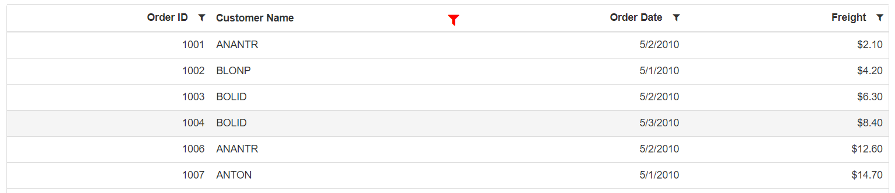

# Excel Like Filter in Blazor DataGrid Component

You can enable Excel like filter by defining [Type](https://help.syncfusion.com/cr/blazor/Syncfusion.Blazor.Grids.GridFilterSettings.html#Syncfusion_Blazor_Grids_GridFilterSettings_Type) as **Excel**. The excel menu contains an option such as Sorting, Clear filter, Sub menu for advanced filtering.

```cshtml
@using Syncfusion.Blazor.Grids

<SfGrid DataSource="@Orders" AllowFiltering="true">
  <GridFilterSettings Type ="Syncfusion.Blazor.Grids.FilterType.Excel"></GridFilterSettings>
   <GridColumns>
     <GridColumn Field=@nameof(Order.OrderID) HeaderText="Order ID" TextAlign="TextAlign.Right" Width="120"></GridColumn>
     <GridColumn Field=@nameof(Order.CustomerID) HeaderText="Customer Name" Width="150"></GridColumn>
     <GridColumn Field=@nameof(Order.OrderDate) HeaderText=" Order Date" Format="d" Type="ColumnType.Date" TextAlign="TextAlign.Right" Width="130"></GridColumn>
     <GridColumn Field=@nameof(Order.Freight) HeaderText="Freight" Format="C2" TextAlign="TextAlign.Right" Width="120"></GridColumn>
   </GridColumns>
</SfGrid>

@code{
    public List<Order> Orders { get; set; }

    protected override void OnInitialized()
    {
        Orders = Enumerable.Range(1, 75).Select(x => new Order()
        {
            OrderID = 1000 + x,
            CustomerID = (new string[] { "ALFKI", "ANANTR", "ANTON", "BLONP", "BOLID" })[new Random().Next(5)],
            Freight = 2.1 * x,
            OrderDate = (new DateTime[] { new DateTime(2010, 5, 1), new DateTime(2010, 5, 2), new DateTime(2010, 5, 3), })[new Random().Next(3)],
        }).ToList();
    }

    public class Order {
        public int? OrderID { get; set; }
        public string CustomerID { get; set; }
        public DateTime? OrderDate { get; set; }
        public double? Freight { get; set; }
    }
}

```

The following screenshot represents Excel filter


The following screenshot represents Custom filter in Excel filter


## Filter item template

This **`FilterItemTemplate`** helps to customize each CheckBox list element or value for display purposes. To access the checkbox list values inside the `FilterItemTemplate`, you can use the implicit named parameter context. You can type cast the context as [FilterItemTemplateContext](https://help.syncfusion.com/cr/blazor/Syncfusion.Blazor.Grids.FilterItemTemplateContext.html) to get list values inside template.

```cshtml
@using Syncfusion.Blazor.Grids

<SfGrid DataSource="@Orders" AllowFiltering="true" AllowPaging="true" Height="375">
    <GridFilterSettings Type="Syncfusion.Blazor.Grids.FilterType.CheckBox"></GridFilterSettings>
    <GridColumns>
        <GridColumn Field=@nameof(Order.OrderID) HeaderText="Order ID" TextAlign="TextAlign.Right" Width="120"></GridColumn>
        <GridColumn Field=@nameof(Order.CustomerID) HeaderText="Customer Name" Width="150">
            <FilterItemTemplate>
                @{
                    var filterContext = (context as FilterItemTemplateContext);
                    var itemTemplateValue = "Textof(" + filterContext.Value + ")";
                }
                @itemTemplateValue
            </FilterItemTemplate>
        </GridColumn>
        <GridColumn Field=@nameof(Order.OrderDate) HeaderText=" Order Date" Format="d" Type="ColumnType.Date" TextAlign="TextAlign.Right" Width="130"></GridColumn>
        <GridColumn Field=@nameof(Order.Freight) HeaderText="Freight" Format="C2" TextAlign="TextAlign.Right" Width="120"></GridColumn>
    </GridColumns>
</SfGrid>

@code{
    public List<Order> Orders { get; set; }

    protected override void OnInitialized()
    {
        Orders = Enumerable.Range(1, 75).Select(x => new Order()
        {
            OrderID = 1000 + x,
            CustomerID = (new string[] { "ALFKI", "ANANTR", "ANTON", "BLONP", "BOLID" })[new Random().Next(5)],
            Freight = 2.1 * x,
            OrderDate = (new DateTime[] { new DateTime(2010, 5, 1), new DateTime(2010, 5, 2), new DateTime(2010, 5, 3), })[new Random().Next(3)],
        }).ToList();
    }

    public class Order
    {
        public int? OrderID { get; set; }
        public string CustomerID { get; set; }
        public DateTime? OrderDate { get; set; }
        public double? Freight { get; set; }
    }
}
```


## Customize filter icon for filtered columns

After filtering the column, the DataGrid will display the in-built filtered icon with predefined styles by default. The filtered icon can also be customized using <b>.e-grid .e-filtered::before</b> class.

```cshtml

@using Syncfusion.Blazor.Grids

<SfGrid DataSource="@Orders" AllowFiltering="true">
    <GridFilterSettings Type="Syncfusion.Blazor.Grids.FilterType.Excel"></GridFilterSettings>
    <GridColumns>
        <GridColumn Field=@nameof(Order.OrderID) HeaderText="Order ID" TextAlign="TextAlign.Right" Width="120"></GridColumn>
        <GridColumn Field=@nameof(Order.CustomerID) HeaderText="Customer Name" Width="150"></GridColumn>
        <GridColumn Field=@nameof(Order.OrderDate) HeaderText=" Order Date" Format="d" Type="ColumnType.Date" TextAlign="TextAlign.Right" Width="130"></GridColumn>
        <GridColumn Field=@nameof(Order.Freight) HeaderText="Freight" Format="C2" TextAlign="TextAlign.Right" Width="120"></GridColumn>
    </GridColumns>
</SfGrid>

@code{
    public List<Order> Orders { get; set; }
    protected override void OnInitialized()
    {
        Orders = Enumerable.Range(1, 75).Select(x => new Order()
        {
            OrderID = 1000 + x,
            CustomerID = (new string[] { "ALFKI", "ANANTR", "ANTON", "BLONP", "BOLID" })[new Random().Next(5)],
            Freight = 2.1 * x,
            OrderDate = (new DateTime[] { new DateTime(2010, 5, 1), new DateTime(2010, 5, 2), new DateTime(2010, 5, 3), })[new Random().Next(3)],
        }).ToList();
    }
    public class Order
    {
        public int? OrderID { get; set; }
        public string CustomerID { get; set; }
        public DateTime? OrderDate { get; set; }
        public double? Freight { get; set; }
    }
}

<style>
    .e-grid .e-filtered::before {
        color: red;               // set the color to filtered icon
        font-size: medium;        // set the font-size to filtered icon
    }
</style>

```



## Customize the height and width of filter popup

You can customize the height and width of each column’s filter dialog using the CSS style in the [OnActionBegin](https://help.syncfusion.com/cr/blazor/Syncfusion.Blazor.Grids.GridEvents-1.html#Syncfusion_Blazor_Grids_GridEvents_1_OnActionBegin) event of the Grid.

Before opening a filter dialog for each column, the `OnActionBegin` event will be triggered with the [RequestType](https://help.syncfusion.com/cr/blazor/Syncfusion.Blazor.Grids.ActionEventArgs-1.html#Syncfusion_Blazor_Grids_ActionEventArgs_1_RequestType) argument as `FilterBeforeOpen`. At that point, based on the boolean value, we have set the height and width of the CustomerID and OrderDate columns using the CSS style in the following sample.

```cshtml
@using Syncfusion.Blazor.Grids

<SfGrid ID= "Grid" DataSource="@Orders" AllowFiltering="true">
    <GridEvents OnActionBegin="OnActionBegin" TValue="Order"></GridEvents>
    <GridFilterSettings Type ="Syncfusion.Blazor.Grids.FilterType.Excel"></GridFilterSettings>
    <GridColumns>
        <GridColumn Field=@nameof(Order.OrderID) HeaderText="Order ID" TextAlign="TextAlign.Right" Width="120"></GridColumn>
        <GridColumn Field=@nameof(Order.CustomerID) HeaderText="Customer Name" Width="150"></GridColumn>
        <GridColumn Field=@nameof(Order.OrderDate) HeaderText=" Order Date" Format="d" Type="ColumnType.Date" TextAlign="TextAlign.Right" Width="130"></GridColumn>
        <GridColumn Field=@nameof(Order.Freight) HeaderText="Freight" Format="C2" TextAlign="TextAlign.Right" Width="120"></GridColumn>
    </GridColumns>
</SfGrid>

@if(IsLarge)
{
    <style>
        #Grid .e-excelfilter.e-popup.e-popup-open {
            height: 400px;
            width: 350px !important;
        }
    </style>
}
@if(IsSmall)
{
    <style>
        #Grid .e-excelfilter.e-popup.e-popup-open {
            height: 450px;
            width: 280px !important;
        }
    </style>   
}

@code{
    public List<Order> Orders { get; set; }
    public bool IsLarge { get; set; } = false;
    public bool IsSmall { get; set; } = false;
    public void OnActionBegin(ActionEventArgs<Order> Args)
    {
        if (Args.RequestType == Syncfusion.Blazor.Grids.Action.FilterBeforeOpen)
        {
            if(Args.ColumnName == "CustomerID")
            {
                IsLarge = true;
                IsSmall = false;
            }
            else if(Args.ColumnName == "OrderDate")
            {
                IsSmall = true;
                IsLarge = false;
            }
            else
            {
                IsLarge = false;
                IsSmall = false;
            }
        }
    }

    protected override void OnInitialized()
    {
        Orders = Enumerable.Range(1, 75).Select(x => new Order()
            {
                OrderID = 1000 + x,
                CustomerID = (new string[] { "ALFKII", "ANANTR", "ANTON", "BLONP", "BOLID" })[new Random().Next(5)],
                Freight = 2.1 * x,
                OrderDate = (new DateTime[] { new DateTime(2010, 5, 1), new DateTime(2010, 5, 2), new DateTime(2010, 5, 3), })[new Random().Next(3)],
            }).ToList();
    }

    public class Order {
        public int? OrderID { get; set; }
        public string CustomerID { get; set; }
        public DateTime? OrderDate { get; set; }
        public double? Freight { get; set; }
    }
}

```


## How to make DataGrid filter dialog entirely visible rendered inside other components

The Syncfusion DataGrid component allows you to render its filter dialog entirely visible inside other components, such as [Dialog](https://blazor.syncfusion.com/documentation/dialog/getting-started), [Accordion](https://blazor.syncfusion.com/documentation/accordion/getting-started), or [Splitter](https://blazor.syncfusion.com/documentation/splitter/getting-started) components. This can be achieved by customizing the CSS of the other component to modify the overflow property of specific elements, ensuring the filter dialog's visibility.

The following example demonstrates how to make the DataGrid filter dialog fully visible within two panes of the `SfSplitter` component. The SfSplitter component lets you split the screen into resizable panes, and by customizing the CSS, we ensure the filter dialog's complete visibility.

```cshtml
@using Syncfusion.Blazor.Buttons
@using Syncfusion.Blazor.Grids
@using Syncfusion.Blazor.Layouts

<SfSplitter ID="Splitter" Orientation="Orientation.Vertical"  Width="100%" Height="400%">
    <SplitterPanes>
        <SplitterPane Size="200px">
            <ContentTemplate>
                <SfGrid ID="Grid1" DataSource="@Orders" AllowFiltering="true" Height="200">
                    <GridFilterSettings Type="Syncfusion.Blazor.Grids.FilterType.Excel"></GridFilterSettings>
                    <GridColumns>
                        <GridColumn Field=@nameof(Order.OrderID) HeaderText="Order ID" TextAlign="TextAlign.Right" Width="120"></GridColumn>
                        <GridColumn Field=@nameof(Order.CustomerID) HeaderText="Customer Name" Width="150"></GridColumn>
                        <GridColumn Field=@nameof(Order.OrderDate) HeaderText=" Order Date" Format="d" Type="ColumnType.Date" TextAlign="TextAlign.Right" Width="130"></GridColumn>
                        <GridColumn Field=@nameof(Order.Freight) HeaderText="Freight" Format="C2" TextAlign="TextAlign.Right" Width="120"></GridColumn>
                    </GridColumns>
                </SfGrid>
            </ContentTemplate>
        </SplitterPane>
        <SplitterPane Size="200px">
            <ContentTemplate>
                <SfGrid ID="Grid2" DataSource="@Orders" AllowFiltering="true" Height="200">
                    <GridFilterSettings Type="Syncfusion.Blazor.Grids.FilterType.Excel"></GridFilterSettings>
                    <GridColumns>
                        <GridColumn Field=@nameof(Order.OrderID) HeaderText="Order ID" TextAlign="TextAlign.Right" Width="120"></GridColumn>
                        <GridColumn Field=@nameof(Order.CustomerID) HeaderText="Customer Name" Width="150"></GridColumn>
                        <GridColumn Field=@nameof(Order.OrderDate) HeaderText=" Order Date" Format="d" Type="ColumnType.Date" TextAlign="TextAlign.Right" Width="130"></GridColumn>
                        <GridColumn Field=@nameof(Order.Freight) HeaderText="Freight" Format="C2" TextAlign="TextAlign.Right" Width="120"></GridColumn>
                    </GridColumns>
                </SfGrid>
            </ContentTemplate>
        </SplitterPane>
    </SplitterPanes>
</SfSplitter>

<style>
    /* Custom CSS to ensure filter dialog visibility */
    #Splitter, .e-pane.e-pane-vertical.e-scrollable.e-resizable {
        overflow: unset;
    }
</style>

@code {
    public List<Order> Orders { get; set; }

    protected override void OnInitialized()
    {
        Orders = Enumerable.Range(1, 75).Select(x => new Order()
            {
                OrderID = 1000 + x,
                CustomerID = (new string[] { "ALFKI", "ANANTR", "ANTON", "BLONP", "BOLID" })[new Random().Next(5)],
                Freight = 2.1 * x,
                OrderDate = (new DateTime[] { new DateTime(2010, 5, 1), new DateTime(2010, 5, 2), new DateTime(2010, 5, 3), })[new Random().Next(3)],
            }).ToList();
    }

    public class Order
    {
        public int? OrderID { get; set; }
        public string CustomerID { get; set; }
        public DateTime? OrderDate { get; set; }
        public double? Freight { get; set; }
    }
}
```



N> [View Sample in GitHub.](https://github.com/SyncfusionExamples/blazor-datagrid-customize-filter-popup-using-css)

N> You can refer to our [Blazor DataGrid](https://www.syncfusion.com/blazor-components/blazor-datagrid) feature tour page for its groundbreaking feature representations. You can also explore our [Blazor DataGrid example](https://blazor.syncfusion.com/demos/datagrid/overview?theme=bootstrap4) to understand how to present and manipulate data.