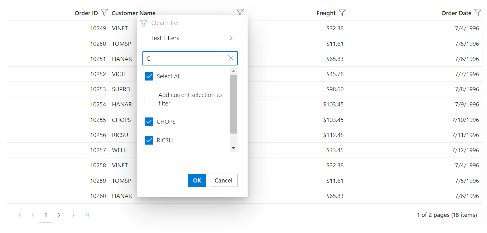

# Excel-like Filter in Blazor DataGrid


The Syncfusion<sup style="font-size:70%">&reg;</sup> Blazor DataGrid includes an Excel-like filter feature that provides an easy-to component offers an Excel-like filter feature, providing a familiar and user-friendly interface for filtering data within the DataGrid. Excel-like filter displays a dialog with a checkbox list, search box, and sorting options, similar to Microsoft Excel's filter. This filtering type simplifies complex filtering operations on specific columns, allowing for quick data location and manipulation. Excel-like filtering is especially useful when dealing with large datasets and columns containing distinct categorical values (such as status, category, country, or department names).

The dialog displays all unique values from that column as a checkbox list. Values can be selected or deselected to include or exclude them from the Grid results, then **OK** button can be clicked to filter the data.

## Enable Excel filtering

To enable Excel-like filtering in a DataGrid, set the [AllowFiltering](https://help.syncfusion.com/cr/blazor/Syncfusion.Blazor.Grids.SfGrid-1.html#Syncfusion_Blazor_Grids_SfGrid_1_AllowFiltering) property to **true**  and configure [GridFilterSettings](https://help.syncfusion.com/cr/blazor/Syncfusion.Blazor.Grids.SfGrid-1.html#Syncfusion_Blazor_Grids_SfGrid_1_FilterSettings) with [FilterType](https://help.syncfusion.com/cr/blazor/Syncfusion.Blazor.Grids.GridFilterSettings.html#Syncfusion_Blazor_Grids_GridFilterSettings_Type) as `Excel`. This property determines the type of filter UI rendered in the DataGrid.




@using Syncfusion.Blazor.Grids

<SfGrid @ref="Grid" TValue="OrderData" AllowFiltering="true" AllowSorting="true" AllowPaging="true" DataSource="@GridData">
    <GridPageSettings PageSize="6"></GridPageSettings>
    <GridFilterSettings Type="Syncfusion.Blazor.Grids.FilterType.Excel"></GridFilterSettings>
    <GridColumns>
        <GridColumn Field=@nameof(OrderData.OrderID) HeaderText="Order ID" IsPrimaryKey="true" TextAlign="TextAlign.Right" Width="90"></GridColumn>
        <GridColumn Field=@nameof(OrderData.CustomerID) HeaderText="Customer Name" Width="120"></GridColumn>
        <GridColumn Field=@nameof(OrderData.Freight) HeaderText="Freight" Format="C2" TextAlign="TextAlign.Right" Width="90"></GridColumn>
        <GridColumn Field=@nameof(OrderData.OrderDate) HeaderText=" Order Date" Format="d" TextAlign="TextAlign.Right" Width="120"> </GridColumn>
      
    </GridColumns>
</SfGrid>

@code {

    public List<OrderData> GridData { get; set; }
    SfGrid<OrderData>? Grid { get; set; }

    protected override void OnInitialized()
    {
        GridData = OrderData.GetAllRecords();
    }
}





public class OrderData
{
    public static List<OrderData> Orders = new List<OrderData>();
    public OrderData() {}

    public OrderData(int? OrderID, string CustomerID, DateTime? OrderDate, double? Freight)
    {
        this.OrderID = OrderID;
        this.CustomerID = CustomerID;
        this.OrderDate = OrderDate;
        this.Freight = Freight;
    }

    public static List<OrderData> GetAllRecords()
    {
        if (Orders.Count() == 0)
        {
            int OrderID = 10248;
                
            for (int i = 1; i < 3; i++)
            {
                Orders.Add(new OrderData(OrderID + 1, "VINET", new DateTime(1996, 07, 04), 32.38));
                Orders.Add(new OrderData(OrderID + 2, "TOMSP", new DateTime(1996, 07, 05), 11.61));
                Orders.Add(new OrderData(OrderID + 3, "HANAR", new DateTime(1996, 07, 06), 65.83));
                Orders.Add(new OrderData(OrderID + 4, "VICTE", new DateTime(1996, 07, 07), 45.78));
                Orders.Add(new OrderData(OrderID + 5, "SUPRD", new DateTime(1996, 07, 08), 98.6));
                Orders.Add(new OrderData(OrderID + 6, "HANAR", new DateTime(1996, 07, 09), 103.45));
                Orders.Add(new OrderData(OrderID + 7, "CHOPS", new DateTime(1996, 07, 10), 103.45));
                Orders.Add(new OrderData(OrderID + 8, "RICSU", new DateTime(1996, 07, 11), 112.48));
                Orders.Add(new OrderData(OrderID + 9, "WELLI", new DateTime(1996, 07, 12), 33.45));
                OrderID += 9; 
            }
        }
        return Orders;
    }

    public int? OrderID { get; set; }
    public string CustomerID { get; set; }
    public DateTime? OrderDate { get; set; }
    public double? Freight { get; set; }
}






> **Key Features:**

>* The Excel-like filter feature supports various filter conditions, including text-based, number-based, date-based, and boolean-based filters.
>* The filter dialog provides additional options, such as sorting filter values, searching for specific values, and clearing applied filters.

## Enable CheckBox filtering

Checkbox filtering is the core mechanism of Excel-like filter. When the filter dialog opens, all unique values from the selected column appear as a checkbox list. Multiple values can be selected by checking their boxes to include them in the filtered results. Values can be unchecked to exclude them from the results.

The checkbox list supports search functionality: typing in the search box filters the checkbox list to show only matching values, making it easier to find specific items in long lists.

 To enable this, configure [GridFilterSettings](https://help.syncfusion.com/cr/blazor/Syncfusion.Blazor.Grids.SfGrid-1.html#Syncfusion_Blazor_Grids_SfGrid_1_FilterSettings) with [FilterType](https://help.syncfusion.com/cr/blazor/Syncfusion.Blazor.Grids.GridFilterSettings.html#Syncfusion_Blazor_Grids_GridFilterSettings_Type) as `CheckBox`.




@using Syncfusion.Blazor.Grids

<SfGrid @ref="Grid" TValue="OrderData" AllowFiltering="true" AllowSorting="true" AllowPaging="true" DataSource="@GridData">
    <GridPageSettings PageSize="6"></GridPageSettings>
    <GridFilterSettings Type="Syncfusion.Blazor.Grids.FilterType.CheckBox"></GridFilterSettings>
    <GridColumns>
        <GridColumn Field=@nameof(OrderData.OrderID) HeaderText="Order ID" IsPrimaryKey="true" TextAlign="TextAlign.Right" Width="90"></GridColumn>
        <GridColumn Field=@nameof(OrderData.CustomerID) HeaderText="Customer Name" Width="120"></GridColumn>
        <GridColumn Field=@nameof(OrderData.Freight) HeaderText="Freight" Format="C2" TextAlign="TextAlign.Right" Width="90"></GridColumn>
        <GridColumn Field=@nameof(OrderData.OrderDate) HeaderText=" Order Date" Format="d" TextAlign="TextAlign.Right" Width="120"> </GridColumn>
      
    </GridColumns>
</SfGrid>

@code {

    public List<OrderData> GridData { get; set; }
    SfGrid<OrderData>? Grid { get; set; }

    protected override void OnInitialized()
    {
        GridData = OrderData.GetAllRecords();
    }
}





public class OrderData
{
    public static List<OrderData> Orders = new List<OrderData>();
    public OrderData() {}

    public OrderData(int? OrderID, string CustomerID, DateTime? OrderDate, double? Freight)
    {
        this.OrderID = OrderID;
        this.CustomerID = CustomerID;
        this.OrderDate = OrderDate;
        this.Freight = Freight;
    }

    public static List<OrderData> GetAllRecords()
    {
        if (Orders.Count() == 0)
        {
            int OrderID = 10248;
                
            for (int i = 1; i < 3; i++)
            {
                Orders.Add(new OrderData(OrderID + 1, "VINET", new DateTime(1996, 07, 04), 32.38));
                Orders.Add(new OrderData(OrderID + 2, "TOMSP", new DateTime(1996, 07, 05), 11.61));
                Orders.Add(new OrderData(OrderID + 3, "HANAR", new DateTime(1996, 07, 06), 65.83));
                Orders.Add(new OrderData(OrderID + 4, "VICTE", new DateTime(1996, 07, 07), 45.78));
                Orders.Add(new OrderData(OrderID + 5, "SUPRD", new DateTime(1996, 07, 08), 98.6));
                Orders.Add(new OrderData(OrderID + 6, "HANAR", new DateTime(1996, 07, 09), 103.45));
                Orders.Add(new OrderData(OrderID + 7, "CHOPS", new DateTime(1996, 07, 10), 103.45));
                Orders.Add(new OrderData(OrderID + 8, "RICSU", new DateTime(1996, 07, 11), 112.48));
                Orders.Add(new OrderData(OrderID + 9, "WELLI", new DateTime(1996, 07, 12), 33.45));
                OrderID += 9; 
            }
        }
        return Orders;
    }

    public int? OrderID { get; set; }
    public string CustomerID { get; set; }
    public DateTime? OrderDate { get; set; }
    public double? Freight { get; set; }
}






## Customize the filter choice count

By default, the filter choice count is set to 1000, which means the filter dialog displays a maximum of 1000 distinct values for each column as a checkbox list. This default value ensures the filter operation remains efficient, even with large datasets. Remaining records (those beyond the first 1000) are accessible through the search box within the filter dialog.

**Why this limit exists**: Loading all distinct values from a column with tens of thousands of unique entries would cause the filter dialog to open slowly or freeze. The 1000-value limit prevents this performance issue while still providing access to all data via search.

The DataGrid allows customization of the number of distinct values displayed in the checkbox list of the Excel/Checkbox filter dialog. The filter choice count can be adjusted by modifying the [FilterChoiceCount](https://help.syncfusion.com/cr/blazor/Syncfusion.Blazor.Grids.FilterDialogOpeningEventArgs.html#Syncfusion_Blazor_Grids_FilterDialogOpeningEventArgs_FilterChoiceCount) property in the [FilterDialogOpening](https://help.syncfusion.com/cr/blazor/Syncfusion.Blazor.Grids.GridEvents-1.html#Syncfusion_Blazor_Grids_GridEvents_1_FilterDialogOpening) event modifies the number of values displayed in the filter dialog. The count can be increased to display more initial options, or decreased to improve dialog opening speed for extremely large datasets.




@using Syncfusion.Blazor.Grids

<SfGrid @ref="Grid" AllowFiltering="true" AllowPaging="true" Height="273px" DataSource="@GridData">
    <GridFilterSettings Type="Syncfusion.Blazor.Grids.FilterType.Excel"></GridFilterSettings>
    <GridEvents FilterDialogOpening="FilterDialogOpeningHandler" TValue="OrderData"></GridEvents>
    <GridColumns>
        <GridColumn Field=@nameof(OrderData.OrderID) HeaderText="Order ID" TextAlign="Syncfusion.Blazor.Grids.TextAlign.Right" Width="90"></GridColumn>
        <GridColumn Field=@nameof(OrderData.CustomerID) HeaderText="Customer ID" Width="100"></GridColumn>
        <GridColumn Field=@nameof(OrderData.ProductName) HeaderText="Product Name" Width="110"></GridColumn>
        <GridColumn Field=@nameof(OrderData.Quantity) HeaderText="Quantity" Width="110"></GridColumn>
    </GridColumns>
</SfGrid>

@code {
    public List<OrderData> GridData { get; set; }

    SfGrid<OrderData>? Grid { get; set; }

    public void FilterDialogOpeningHandler(FilterDialogOpeningEventArgs args)
    {
        args.FilterChoiceCount = 3000;
    }

    protected override void OnInitialized()
    {
        GridData = OrderData.GetAllRecords();
    }
}





public class OrderData
{
    public static List<OrderData> Orders = new List<OrderData>();
    public OrderData() {}

    public OrderData(int? OrderID, string CustomerID, string ProductName, string Quantity)
    {
        this.OrderID = OrderID;
        this.CustomerID = CustomerID;
        this.ProductName = ProductName;
        this.Quantity = Quantity;
    }

    public static List<OrderData> GetAllRecords()
    {
        if (Orders.Count() == 0)
        {
            string[] Product = {"Chai", "Chang", "Aniseed Syrup", "Chef Anton\"s Cajun Seasoning", "Chef Anton\"s Gumbo Mix", "Grandma\"s Boysenberry Spread",
        "Uncle Bob\"s Organic Dried Pears", "Northwoods Cranberry Sauce", "Mishi Kobe Niku", "Ikura", "Queso Cabrales", "Queso Manchego La Pastora", "Konbu",
        "Tofu", "Genen Shouyu", "Pavlova", "Alice Mutton", "Carnarvon Tigers", "Teatime Chocolate Biscuits", "Sir Rodney\"s Marmalade", "Sir Rodney\"s Scones",
        "Gustaf\"s Knäckebröd", "Tunnbröd", "Guaraná Fantástica", "NuNuCa Nuß-Nougat-Creme", "Gumbär Gummibärchen", "Schoggi Schokolade", "Rössle Sauerkraut",
        "Thüringer Rostbratwurst", "Nord-Ost Matjeshering", "Gorgonzola Telino", "Mascarpone Fabioli", "Geitost", "Sasquatch Ale", "Steeleye Stout", "Inlagd Sill",
        "Gravad lax", "Côte de Blaye", "Chartreuse verte", "Boston Crab Meat", "Jack\"s New England Clam Chowder", "Singaporean Hokkien Fried Mee", "Ipoh Coffee",
        "Gula Malacca", "Rogede sild", "Spegesild", "Zaanse koeken", "Chocolade", "Maxilaku", "Valkoinen suklaa", "Manjimup Dried Apples", "Filo Mix", "Perth Pasties",
        "Tourtière", "Pâté chinois", "Gnocchi di nonna Alice", "Ravioli Angelo", "Escargots de Bourgogne", "Raclette Courdavault", "Camembert Pierrot", "Sirop d\"érable",
        "Tarte au sucre", "Vegie-spread", "Wimmers gute Semmelknödel", "Louisiana Fiery Hot Pepper Sauce", "Louisiana Hot Spiced Okra", "Laughing Lumberjack Lager", "Scottish Longbreads",
        "Gudbrandsdalsost", "Outback Lager", "Flotemysost", "Mozzarella di Giovanni", "Röd Kaviar", "Longlife Tofu", "Rhönbräu Klosterbier", "Lakkalikööri", "Original Frankfurter grüne Soße"};


            string[] Quantity = {"10 boxes x 20 bags", "24 - 12 oz bottles", "12 - 550 ml bottles", "48 - 6 oz jars", "36 boxes", "12 - 8 oz jars", "12 - 1 lb pkgs.", "12 - 12 oz jars", "18 - 500 g pkgs.", "12 - 200 ml jars",
            "1 kg pkg.", "10 - 500 g pkgs.", "2 kg box", "40 - 100 g pkgs.", "24 - 250 ml bottles", "32 - 500 g boxes", "20 - 1 kg tins", "16 kg pkg.", "10 boxes x 12 pieces", "30 gift boxes", "24 pkgs. x 4 pieces", "24 - 500 g pkgs.", "12 - 250 g pkgs.",
            "12 - 355 ml cans", "20 - 450 g glasses", "100 - 250 g bags" };

            string[] CustomerID = {"VINET", "TOMSP", "HANAR", "VICTE", "SUPRD", "HANAR", "CHOPS", "RICSU", "WELLI", "HILAA", "ERNSH", "CENTC",
        "OTTIK", "QUEDE", "RATTC", "ERNSH", "FOLKO", "BLONP", "WARTH", "FRANK", "GROSR", "WHITC", "WARTH", "SPLIR", "RATTC", "QUICK", "VINET",
        "MAGAA", "TORTU", "MORGK", "BERGS", "LEHMS", "BERGS", "ROMEY", "ROMEY", "LILAS", "LEHMS", "QUICK", "QUICK", "RICAR", "REGGC", "BSBEV",
        "COMMI", "QUEDE", "TRADH", "TORTU", "RATTC", "VINET", "LILAS", "BLONP", "HUNGO", "RICAR", "MAGAA", "WANDK", "SUPRD", "GODOS", "TORTU",
        "OLDWO", "ROMEY", "LONEP", "ANATR", "HUNGO", "THEBI", "DUMON", "WANDK", "QUICK", "RATTC", "ISLAT", "RATTC", "LONEP", "ISLAT", "TORTU",
        "WARTH", "ISLAT", "PERIC", "KOENE", "SAVEA", "KOENE", "BOLID", "FOLKO", "FURIB", "SPLIR", "LILAS", "BONAP", "MEREP", "WARTH", "VICTE",
        "HUNGO", "PRINI", "FRANK", "OLDWO", "MEREP", "BONAP", "SIMOB", "FRANK", "LEHMS", "WHITC", "QUICK", "RATTC", "FAMIA"};


            int OrderID = 10248;
            int i = 0; int j = 0; int k = 0; int l = 0; int m = 0;
            for (int x = 0; x < 25000; x++)
            {
                i = i >= CustomerID.Length ? 0 : i;
                l = l >= Product.Length ? 0 : l;
                k = k >= Quantity.Length ? 0 : k;
                Orders.Add(new OrderData()
                {
                    OrderID = OrderID + x,
                    CustomerID = CustomerID[i],
                    ProductName = Product[l],
                    Quantity = Quantity[k],

                });
                i++; j++; k++; l++;
            }
        }
        return Orders;
    }

    public int? OrderID { get; set; }
    public string CustomerID { get; set; }
    public string ProductName { get; set; }
    public string Quantity { get; set; }
}






> **Performance Consideration:** The specified filter choice count value determines the display of unique items as a checkbox list in the `Excel/Checkbox` filter dialog. Higher values can result in a delay when rendering checkbox items while opening the filter dialog. Therefore, setting a restricted filter choice count value is advisable to maintain optimal performance.

## Add current selection to filter checkbox

By default, the `Excel/Checkbox` filter replaces previous selections when a new filter is applied to the same column. Applying a filter multiple times on the same column clears the previously filtered values. The **"Add current selection to filter"** checkbox allows retention of previous filter values by combining new selections with existing ones. This checkbox appears in the filter dialog when data is searched using the search bar of the `Excel/Checkbox` filter.

This feature is useful when building cumulative filters across multiple filtering operations without having to re-select previously chosen values each time.

The following image describes the above mentioned behavior:





## Display Custom Text in Filter Options

The DataGrid supports customization of text displayed in filter checkbox lists. Custom, user-friendly labels can replace raw data values.

### Using Custom Filter Item Templates

The [FilterItemTemplate](https://help.syncfusion.com/cr/blazor/Syncfusion.Blazor.Grids.GridColumn.html#Syncfusion_Blazor_Grids_GridColumn_FilterItemTemplate) property enables creation of custom templates for filter items, allowing custom logic and HTML elements for displaying specific content.

To customize the text in the Excel/Checkbox filter, a [FilterItemTemplate](https://help.syncfusion.com/cr/blazor/Syncfusion.Blazor.Grids.GridColumn.html#Syncfusion_Blazor_Grids_GridColumn_FilterItemTemplate) property  can be defined and bound to the desired column. The `FilterItemTemplate` property allows creation of custom templates for filter items. Any logic and HTML elements can be used within this template to display the desired text or content.

The following example demonstrates how to customize text in a **Delivered** column filter. Instead of displaying **true** or **false**, it displays **Delivered** or **Not delivered**:




@using Syncfusion.Blazor.Grids

<SfGrid DataSource="@GridData" @ref="Grid" AllowFiltering="true" AllowPaging="true">
    <GridFilterSettings Type=" Syncfusion.Blazor.Grids.FilterType.Excel"></GridFilterSettings>
    <GridPageSettings PageSize="6"></GridPageSettings>
    <GridColumns>
        <GridColumn Field=@nameof(OrderData.CategoryName) HeaderText="Category Name" Width="120"></GridColumn>
        <GridColumn Field=@nameof(OrderData.Delivered) HeaderText="Delivered" Width="120" DisplayAsCheckBox="true" FilterSettings="@(new FilterSettings{Type = Syncfusion.Blazor.Grids.FilterType.CheckBox })">
            <FilterItemTemplate>
                @{
                    var filterContext = (context as FilterItemTemplateContext);
                    var itemTemplateValue = "DefaultText";

                    if (filterContext.Value.ToString() == "False")
                    {
                        itemTemplateValue = "Not delivered";
                    }
                    else
                    {
                        itemTemplateValue = "Delivered";
                    }
                }
                @itemTemplateValue
            </FilterItemTemplate>

        </GridColumn>
        <GridColumn Field=@nameof(OrderData.ProductID) HeaderText="ProductID" Width="120"></GridColumn>
    </GridColumns>

</SfGrid>

@code {

    public List<OrderData> GridData { get; set; }

    SfGrid<OrderData> Grid;

    protected override void OnInitialized()
    {
        GridData = OrderData.GetAllRecords();
    }
}





public class OrderData
{
    public static List<OrderData> Orders = new List<OrderData>();
    public OrderData() {}
    public OrderData(string CategoryName, bool Delivered, int? ProductID)
    {
        this.CategoryName = CategoryName;
        this.Delivered = Delivered;
        this.ProductID = ProductID;
    }

    public static List<OrderData> GetAllRecords()
    {
        if (Orders.Count() == 0)
        {
            int ProductID = 0;
            for (int i = 1; i < 7; i++)
            {
                Orders.Add(new OrderData("Beverages", true, ProductID + 1));
                Orders.Add(new OrderData("Condiments", false, ProductID + 2));
                Orders.Add(new OrderData("Confections", false, ProductID + 3));
                Orders.Add(new OrderData("DairyProducts", true, ProductID + 4));
                Orders.Add(new OrderData("Grains", true, ProductID + 5));
                Orders.Add(new OrderData("Meat", false, ProductID + 6));
                Orders.Add(new OrderData("Produce", true, ProductID + 7));
                Orders.Add(new OrderData("Seafood", true, ProductID + 8));
                Orders.Add(new OrderData("Confections", false, ProductID + 9));
                ProductID += 9;
            }
        }
        return Orders;
    }

    public string CategoryName { get; set; }
    public bool Delivered { get; set; }
    public int? ProductID { get; set; }
}






## Add Icons and Visual Elements to Filter Options

Filter options can be enhanced with visual elements such as icons positioned alongside filter text. The [FilterItemTemplate](https://help.syncfusion.com/cr/blazor/Syncfusion.Blazor.Grids.GridColumn.html#Syncfusion_Blazor_Grids_GridColumn_FilterItemTemplate) property enables inclusion of custom UI elements including icons, styled text, and other HTML content in filter items.




@using Syncfusion.Blazor.Grids

<SfGrid DataSource="@GridData" @ref="Grid" AllowFiltering="true" AllowPaging="true">
    <GridFilterSettings Type=" Syncfusion.Blazor.Grids.FilterType.Excel"></GridFilterSettings>
    <GridPageSettings PageSize="6"></GridPageSettings>
    <GridColumns>
        <GridColumn Field=@nameof(OrderData.CategoryName) HeaderText="Category Name" Width="150">
            <FilterItemTemplate>
                @{
                    var filterContext = context as FilterItemTemplateContext;

                    if (filterContext.Value.ToString() == "Beverages")
                    {
                        <i class="fa fa-coffee"></i> <ln/> @filterContext.Value.ToString();
                    }
                    else if (filterContext.Value.ToString() == "Condiments")
                    {
                        <i class="fa fa-leaf"></i> <ln/> @filterContext.Value.ToString();
                    }
                    else if (filterContext.Value.ToString() == "Confections")
                    {
                        <i class="fas fa-birthday-cake"></i> <ln/> @filterContext.Value.ToString();
                    }
                    else if (filterContext.Value.ToString() == "DairyProducts")
                    {
                        <i class="fas fa-ice-cream"></i> <ln/> @filterContext.Value.ToString();
                    }
                    else if (filterContext.Value.ToString() == "Grains")
                    {
                        <i class="fas fa-seedling"></i> <ln/> @filterContext.Value.ToString();
                    }
                    else if (filterContext.Value.ToString() == "Meat")
                    {
                        <i class="fas fa-drumstick-bite"></i> <ln/> @filterContext.Value.ToString();
                    }
                    else if (filterContext.Value.ToString() == "Produce")
                    {
                        <i class="fas fa-carrot"></i> <ln/> @filterContext.Value.ToString();
                    }
                    else if (filterContext.Value.ToString() == "Seafood")
                    {
                        <i class="fas fa-fish"></i> <ln/> @filterContext.Value.ToString();
                    }
                }
            </FilterItemTemplate>
        </GridColumn>
        <GridColumn Field=@nameof(OrderData.Discontinued) HeaderText="Discontinued" Width="100" DisplayAsCheckBox="true"></GridColumn>
        <GridColumn Field=@nameof(OrderData.ProductID) HeaderText="ProductID" Width="120"></GridColumn>
    </GridColumns>
</SfGrid>

@code {

    public List<OrderData> GridData { get; set; }

    SfGrid<OrderData> Grid;

    protected override void OnInitialized()
    {
        GridData = OrderData.GetAllRecords();
    }
}





public class OrderData
{
    public static List<OrderData> Orders = new List<OrderData>();
    public OrderData() {}
    public OrderData(string CategoryName, bool Discontinued, int? ProductID)
    {
        this.CategoryName = CategoryName;
        this.Discontinued = Discontinued;
        this.ProductID = ProductID;
    }

    public static List<OrderData> GetAllRecords()
    {
        if (Orders.Count() == 0)
        {
            int ProductID = 0;
            for (int i = 1; i < 7; i++)
            {
                Orders.Add(new OrderData("Beverages", true, ProductID + 1));
                Orders.Add(new OrderData("Condiments", false, ProductID + 2));
                Orders.Add(new OrderData("Confections", false, ProductID + 3));
                Orders.Add(new OrderData("DairyProducts", true, ProductID + 4));
                Orders.Add(new OrderData("Grains", true, ProductID + 5));
                Orders.Add(new OrderData("Meat", false, ProductID + 6));
                Orders.Add(new OrderData("Produce", true, ProductID + 7));
                Orders.Add(new OrderData("Seafood", true, ProductID + 8));
                Orders.Add(new OrderData("Confections", false, ProductID + 9));
                ProductID += 9;
            }
        }
        return Orders;
    }

    public string CategoryName { get; set; }
    public bool Discontinued { get; set; }
    public int? ProductID { get; set; }
}






## Style the Excel Filter Dialog with CSS

The Excel filter dialog appearance can be customized using CSS (Cascading Style Sheets). This enables alignment of the filter dialog with application design and visual requirements.

### Hiding the Context Menu

The Excel filter dialog contains several components, including a **context menu**, **search box**, and **checkbox list**. The context menu can be hidden when not required using CSS.

```cshtml
<style>
    .e-excelfilter .e-contextmenu-container.e-sfcontextmenu.e-grid-filter-menu {
        display: none;
    }
</style>
```




@using Syncfusion.Blazor.Grids

<SfGrid @ref="Grid" AllowFiltering="true" AllowPaging="true" DataSource="@GridData">
    <GridPageSettings PageSize="6"></GridPageSettings>
    <GridFilterSettings Type="Syncfusion.Blazor.Grids.FilterType.Excel"></GridFilterSettings>
    <GridColumns>
        <GridColumn Field=@nameof(OrderData.OrderID) HeaderText="Order ID" IsPrimaryKey="true" TextAlign="TextAlign.Right" Width="90"></GridColumn>
        <GridColumn Field=@nameof(OrderData.CustomerID) HeaderText="Customer Name" Width="120"></GridColumn>
        <GridColumn Field=@nameof(OrderData.Freight) HeaderText="Freight" Format="C2" TextAlign="TextAlign.Right" Width="90"></GridColumn>
        <GridColumn Field=@nameof(OrderData.OrderDate) HeaderText=" Order Date" Format="d" TextAlign="TextAlign.Right" Width="120"> </GridColumn>

    </GridColumns>
</SfGrid>

<style>
    .e-excelfilter .e-contextmenu-container.e-sfcontextmenu.e-grid-filter-menu {
        display: none;
    }
</style>

@code {

    public List<OrderData> GridData { get; set; }
    SfGrid<OrderData>? Grid { get; set; }

    protected override void OnInitialized()
    {
        GridData = OrderData.GetAllRecords();
    }
}





public class OrderData
{
    public static List<OrderData> Orders = new List<OrderData>();
    public OrderData(){}
    public OrderData(int? OrderID, string CustomerID, DateTime? OrderDate, double? Freight)
    {
        this.OrderID = OrderID;
        this.CustomerID = CustomerID;
        this.OrderDate = OrderDate;
        this.Freight = Freight;
    }

    public static List<OrderData> GetAllRecords()
    {
        if (Orders.Count() == 0)
        {
            int OrderID = 10248;
            for (int i = 1; i < 3; i++)
            {
                Orders.Add(new OrderData(OrderID + 1, "VINET", new DateTime(1996, 07, 06), 32.38));
                Orders.Add(new OrderData(OrderID + 2, "TOMSP", new DateTime(1996, 07, 06), 11.61));
                Orders.Add(new OrderData(OrderID + 3, "HANAR", new DateTime(1996, 07, 06), 65.83));
                Orders.Add(new OrderData(OrderID + 4, "VICTE", new DateTime(1996, 07, 06), 45.78));
                Orders.Add(new OrderData(OrderID + 5, "SUPRD", new DateTime(1996, 07, 06), 98.6));
                Orders.Add(new OrderData(OrderID + 6, "HANAR", new DateTime(1996, 07, 06), 103.45));
                Orders.Add(new OrderData(OrderID + 7, "CHOPS", new DateTime(1996, 07, 06), 103.45));
                Orders.Add(new OrderData(OrderID + 8, "RICSU", new DateTime(1996, 07, 06), 112.48));
                Orders.Add(new OrderData(OrderID + 9, "WELLI", new DateTime(1996, 07, 06), 33.45));
                OrderID += 9;
            }
        }
        return Orders;
    }

    public int? OrderID { get; set; }
    public string CustomerID { get; set; }
    public DateTime? OrderDate { get; set; }
    public double? Freight { get; set; }
}






### Changing Filter Dialog Size

The filter dialog height and width can be customized for each column. CSS combined with the [FilterDialogOpening](https://help.syncfusion.com/cr/blazor/Syncfusion.Blazor.Grids.GridEvents-1.html#Syncfusion_Blazor_Grids_GridEvents_1_FilterDialogOpening) event enables application of custom sizes based on which column is being filtered.




@using Syncfusion.Blazor.Grids

<SfGrid ID="Grid" @ref="Grid" AllowFiltering="true" AllowPaging="true" DataSource="@GridData">
    <GridPageSettings PageSize="6"></GridPageSettings>
    <GridFilterSettings Type="Syncfusion.Blazor.Grids.FilterType.Excel"></GridFilterSettings>
    <GridEvents FilterDialogOpening="FilterDialogOpeningHandler" TValue="OrderData"></GridEvents>
    <GridColumns>
        <GridColumn Field=@nameof(OrderData.OrderID) HeaderText="Order ID" IsPrimaryKey="true" TextAlign="TextAlign.Right" Width="90"></GridColumn>
        <GridColumn Field=@nameof(OrderData.CustomerID) HeaderText="Customer Name" Width="120"></GridColumn>
        <GridColumn Field=@nameof(OrderData.Freight) HeaderText="Freight" Format="C2" TextAlign="TextAlign.Right" Width="90"></GridColumn>
        <GridColumn Field=@nameof(OrderData.OrderDate) HeaderText="Order Date" Format="d" TextAlign="TextAlign.Right" Width="120"> </GridColumn>

    </GridColumns>
</SfGrid>

@if (IsLarge)
{
    <style>
        #Grid .e-excelfilter.e-popup.e-popup-open {
            height: 400px;
            width: 350px !important;
        }
    </style>
}
@if (IsSmall)
{
    <style>
        #Grid .e-excelfilter.e-popup.e-popup-open {
            height: 450px;
            width: 280px !important;
        }
    </style>
}

@code {

    public List<OrderData> GridData { get; set; }
    SfGrid<OrderData>? Grid { get; set; }
    public bool IsLarge { get; set; } = false;
    public bool IsSmall { get; set; } = false;

    protected override void OnInitialized()
    {
        GridData = OrderData.GetAllRecords();
    }

    public void FilterDialogOpeningHandler(FilterDialogOpeningEventArgs args)
    {
        if (args.ColumnName == "CustomerID")
        {
            IsLarge = true;
            IsSmall = false;
        }
        else if (args.ColumnName == "OrderDate")
        {
            IsSmall = true;
            IsLarge = false;
        }
        else
        {
            IsLarge = false;
            IsSmall = false;
        }
    }
}





public class OrderData
{
    public static List<OrderData> Orders = new List<OrderData>();
    public OrderData(){}

    public OrderData(int? OrderID, string CustomerID, DateTime? OrderDate, double? Freight)
    {
        this.OrderID = OrderID;
        this.CustomerID = CustomerID;
        this.OrderDate = OrderDate;
        this.Freight = Freight;
    }

    public static List<OrderData> GetAllRecords()
    {
        if (Orders.Count() == 0)
        {
            int OrderID = 10248;
            for (int i = 1; i < 3; i++)
            {
                Orders.Add(new OrderData(OrderID + 1, "VINET", new DateTime(1996, 07, 06), 32.38));
                Orders.Add(new OrderData(OrderID + 2, "TOMSP", new DateTime(1996, 07, 06), 11.61));
                Orders.Add(new OrderData(OrderID + 3, "HANAR", new DateTime(1996, 07, 06), 65.83));
                Orders.Add(new OrderData(OrderID + 4, "VICTE", new DateTime(1996, 07, 06), 45.78));
                Orders.Add(new OrderData(OrderID + 5, "SUPRD", new DateTime(1996, 07, 06), 98.6));
                Orders.Add(new OrderData(OrderID + 6, "HANAR", new DateTime(1996, 07, 06), 103.45));
                Orders.Add(new OrderData(OrderID + 7, "CHOPS", new DateTime(1996, 07, 06), 103.45));
                Orders.Add(new OrderData(OrderID + 8, "RICSU", new DateTime(1996, 07, 06), 112.48));
                Orders.Add(new OrderData(OrderID + 9, "WELLI", new DateTime(1996, 07, 06), 33.45));
                OrderID += 9;
            }
        }
        return Orders;
    }

    public int? OrderID { get; set; }
    public string CustomerID { get; set; }
    public DateTime? OrderDate { get; set; }
    public double? Freight { get; set; }
}






### Styling the filtered column icon

When a filter is applied to a column, the DataGrid displays an icon in that column's header. The **.e-grid .e-filtered::before** CSS class enables modification of the icon appearance.



@using Syncfusion.Blazor.Grids

<SfGrid @ref="Grid" AllowFiltering="true" AllowPaging="true" DataSource="@GridData">
    <GridPageSettings PageSize="6"></GridPageSettings>
    <GridFilterSettings Type="Syncfusion.Blazor.Grids.FilterType.Excel"></GridFilterSettings>
    <GridColumns>
        <GridColumn Field=@nameof(OrderData.OrderID) HeaderText="Order ID" IsPrimaryKey="true" TextAlign="TextAlign.Right" Width="90"></GridColumn>
        <GridColumn Field=@nameof(OrderData.CustomerID) HeaderText="Customer Name" Width="120"></GridColumn>
        <GridColumn Field=@nameof(OrderData.Freight) HeaderText="Freight" Format="C2" TextAlign="TextAlign.Right" Width="90"></GridColumn>
        <GridColumn Field=@nameof(OrderData.OrderDate) HeaderText=" Order Date" Format="d" TextAlign="TextAlign.Right" Width="120"> </GridColumn>
    </GridColumns>
</SfGrid>

<style>
    .e-grid .e-filtered::before {
        color: red;               // set the color to filtered icon.
        font-size: medium;        // set the font-size to filtered icon.
    }
</style>

@code {

    public List<OrderData> GridData { get; set; }
    SfGrid<OrderData>? Grid { get; set; }

    protected override void OnInitialized()
    {
        GridData = OrderData.GetAllRecords();
    }
}





public class OrderData
{
    public static List<OrderData> Orders = new List<OrderData>();
    public OrderData(){}

    public OrderData(int? OrderID, string CustomerID, DateTime? OrderDate, double? Freight)
    {
        this.OrderID = OrderID;
        this.CustomerID = CustomerID;
        this.OrderDate = OrderDate;
        this.Freight = Freight;
    }

    public static List<OrderData> GetAllRecords()
    {
        if (Orders.Count() == 0)
        {
            int OrderID = 10248;
            for (int i = 1; i < 3; i++)
            {
                Orders.Add(new OrderData(OrderID + 1, "VINET", new DateTime(1996, 07, 06), 32.38));
                Orders.Add(new OrderData(OrderID + 2, "TOMSP", new DateTime(1996, 07, 06), 11.61));
                Orders.Add(new OrderData(OrderID + 3, "HANAR", new DateTime(1996, 07, 06), 65.83));
                Orders.Add(new OrderData(OrderID + 4, "VICTE", new DateTime(1996, 07, 06), 45.78));
                Orders.Add(new OrderData(OrderID + 5, "SUPRD", new DateTime(1996, 07, 06), 98.6));
                Orders.Add(new OrderData(OrderID + 6, "HANAR", new DateTime(1996, 07, 06), 103.45));
                Orders.Add(new OrderData(OrderID + 7, "CHOPS", new DateTime(1996, 07, 06), 103.45));
                Orders.Add(new OrderData(OrderID + 8, "RICSU", new DateTime(1996, 07, 06), 112.48));
                Orders.Add(new OrderData(OrderID + 9, "WELLI", new DateTime(1996, 07, 06), 33.45));
                OrderID += 9;
            }
        }
        return Orders;
    }

    public int? OrderID { get; set; }
    public string CustomerID { get; set; }
    public DateTime? OrderDate { get; set; }
    public double? Freight { get; set; }
}






## See Also

Comprehensive information about the Syncfusion Blazor DataGrid and its features is available through the following resources:

* **Feature Overview:** The [Blazor DataGrid](https://www.syncfusion.com/blazor-components/blazor-datagrid) feature tour provides a complete overview of available capabilities.
* **Interactive Examples:** The [Blazor DataGrid examples](https://blazor.syncfusion.com/demos/datagrid/overview?theme=bootstrap5) provide practical demonstrations of data presentation and manipulation.
