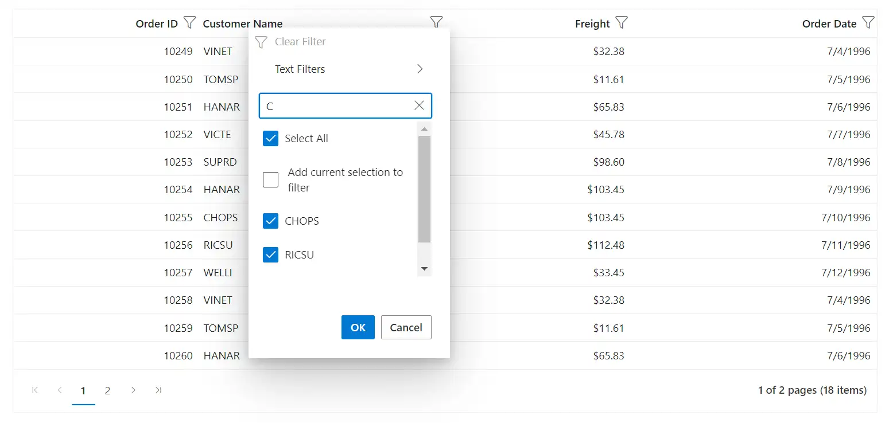

# Excel-like Filter in Blazor Data Grid

The [Blazor Data Grid](https://www.syncfusion.com/blazor-components/blazor-datagrid) includes an Excel-like filter feature that provides an easy-to-use interface for filtering data. The Excel-like filter mirrors the filtering tools found in Microsoft Excel, making the feature intuitive for users already familiar with Microsoft Excel.

Excel-like filtering is particularly valuable for large datasets and complex filtering operations. The filter enables rapid data refinement to locate required information.

## Enable Excel filtering

To enable Excel-like filtering in a Blazor Data Grid, set the [AllowFiltering](https://help.syncfusion.com/cr/blazor/Syncfusion.Blazor.Grids.SfGrid-1.html#Syncfusion_Blazor_Grids_SfGrid_1_AllowFiltering) property to **true** and configure [GridFilterSettings](https://help.syncfusion.com/cr/blazor/Syncfusion.Blazor.Grids.SfGrid-1.html#Syncfusion_Blazor_Grids_SfGrid_1_FilterSettings) with **FilterType.Excel**.




@using Syncfusion.Blazor.Grids

<SfGrid @ref="Grid" TValue="OrderData" AllowFiltering="true" AllowSorting="true" AllowPaging="true" DataSource="@GridData">
    <GridPageSettings PageSize="6"></GridPageSettings>
    <GridFilterSettings Type="Syncfusion.Blazor.Grids.FilterType.Excel"></GridFilterSettings>
    <GridColumns>
        <GridColumn Field=@nameof(OrderData.OrderID) HeaderText="Order ID" IsPrimaryKey="true" TextAlign="TextAlign.Right" Width="90"></GridColumn>
        <GridColumn Field=@nameof(OrderData.CustomerID) HeaderText="Customer Name" Width="120"></GridColumn>
        <GridColumn Field=@nameof(OrderData.Freight) HeaderText="Freight" Format="C2" TextAlign="TextAlign.Right" Width="90"></GridColumn>
        <GridColumn Field=@nameof(OrderData.OrderDate) HeaderText="Order Date" Format="d" TextAlign="TextAlign.Right" Width="120"> </GridColumn>

    </GridColumns>
</SfGrid>

@code {

    public List<OrderData> GridData { get; set; }
    SfGrid<OrderData>? Grid { get; set; }

    protected override void OnInitialized()
    {
        GridData = OrderData.GetAllRecords();
    }
}





public class OrderData
{
    public static List<OrderData> Orders = new List<OrderData>();
    public OrderData() {}

    public OrderData(int? OrderID, string CustomerID, DateTime? OrderDate, double? Freight)
    {
        this.OrderID = OrderID;
        this.CustomerID = CustomerID;
        this.OrderDate = OrderDate;
        this.Freight = Freight;
    }

    public static List<OrderData> GetAllRecords()
    {
        if (Orders.Count == 0)
        {
            int OrderID = 10248;

            for (int i = 1; i < 3; i++)
            {
                Orders.Add(new OrderData(OrderID + 1, "VINET", new DateTime(1996, 07, 04), 32.38));
                Orders.Add(new OrderData(OrderID + 2, "TOMSP", new DateTime(1996, 07, 05), 11.61));
                Orders.Add(new OrderData(OrderID + 3, "HANAR", new DateTime(1996, 07, 06), 65.83));
                Orders.Add(new OrderData(OrderID + 4, "VICTE", new DateTime(1996, 07, 07), 45.78));
                Orders.Add(new OrderData(OrderID + 5, "SUPRD", new DateTime(1996, 07, 08), 98.6));
                Orders.Add(new OrderData(OrderID + 6, "HANAR", new DateTime(1996, 07, 09), 103.45));
                Orders.Add(new OrderData(OrderID + 7, "CHOPS", new DateTime(1996, 07, 10), 103.45));
                Orders.Add(new OrderData(OrderID + 8, "RICSU", new DateTime(1996, 07, 11), 112.48));
                Orders.Add(new OrderData(OrderID + 9, "WELLI", new DateTime(1996, 07, 12), 33.45));
                OrderID += 9; 
            }
        }
        return Orders;
    }

    public int? OrderID { get; set; }
    public string CustomerID { get; set; }
    public DateTime? OrderDate { get; set; }
    public double? Freight { get; set; }
}






> **Key Features:**
> * Supports multiple filter types: text, numbers, dates, and true/false values
> * Provides search functionality to find specific values within the filter dialog
> * Allows clearing of previously applied filters
> * By default, the Data Grid does not include a `Between` operator. However, the Excel filter provides a "Between" option for numeric and date columns, which functions as a range filter by applying two conditions.

## Checkbox filtering

Checkbox filtering offers another straightforward approach to filter data. Using the checkbox filter, specific values can be displayed by selecting checkboxes next to each option in a column. Checkbox filtering works effectively when data contains distinct categories or grouped values.




@using Syncfusion.Blazor.Grids

<SfGrid @ref="Grid" TValue="OrderData" AllowFiltering="true" AllowSorting="true" AllowPaging="true" DataSource="@GridData">
    <GridPageSettings PageSize="6"></GridPageSettings>
    <GridFilterSettings Type="Syncfusion.Blazor.Grids.FilterType.CheckBox"></GridFilterSettings>
    <GridColumns>
        <GridColumn Field=@nameof(OrderData.OrderID) HeaderText="Order ID" IsPrimaryKey="true" TextAlign="TextAlign.Right" Width="90"></GridColumn>
        <GridColumn Field=@nameof(OrderData.CustomerID) HeaderText="Customer Name" Width="120"></GridColumn>
        <GridColumn Field=@nameof(OrderData.Freight) HeaderText="Freight" Format="C2" TextAlign="TextAlign.Right" Width="90"></GridColumn>
        <GridColumn Field=@nameof(OrderData.OrderDate) HeaderText="Order Date" Format="d" TextAlign="TextAlign.Right" Width="120"> </GridColumn>

    </GridColumns>
</SfGrid>

@code {

    public List<OrderData> GridData { get; set; }
    SfGrid<OrderData>? Grid { get; set; }

    protected override void OnInitialized()
    {
        GridData = OrderData.GetAllRecords();
    }
}





public class OrderData
{
    public static List<OrderData> Orders = new List<OrderData>();
    public OrderData() {}

    public OrderData(int? OrderID, string CustomerID, DateTime? OrderDate, double? Freight)
    {
        this.OrderID = OrderID;
        this.CustomerID = CustomerID;
        this.OrderDate = OrderDate;
        this.Freight = Freight;
    }

    public static List<OrderData> GetAllRecords()
    {
        if (Orders.Count == 0)
        {
            int OrderID = 10248;

            for (int i = 1; i < 3; i++)
            {
                Orders.Add(new OrderData(OrderID + 1, "VINET", new DateTime(1996, 07, 04), 32.38));
                Orders.Add(new OrderData(OrderID + 2, "TOMSP", new DateTime(1996, 07, 05), 11.61));
                Orders.Add(new OrderData(OrderID + 3, "HANAR", new DateTime(1996, 07, 06), 65.83));
                Orders.Add(new OrderData(OrderID + 4, "VICTE", new DateTime(1996, 07, 07), 45.78));
                Orders.Add(new OrderData(OrderID + 5, "SUPRD", new DateTime(1996, 07, 08), 98.6));
                Orders.Add(new OrderData(OrderID + 6, "HANAR", new DateTime(1996, 07, 09), 103.45));
                Orders.Add(new OrderData(OrderID + 7, "CHOPS", new DateTime(1996, 07, 10), 103.45));
                Orders.Add(new OrderData(OrderID + 8, "RICSU", new DateTime(1996, 07, 11), 112.48));
                Orders.Add(new OrderData(OrderID + 9, "WELLI", new DateTime(1996, 07, 12), 33.45));
                OrderID += 9; 
            }
        }
        return Orders;
    }

    public int? OrderID { get; set; }
    public string CustomerID { get; set; }
    public DateTime? OrderDate { get; set; }
    public double? Freight { get; set; }
}






## Customize the filter choice count

By default, the filter dialog displays up to **1000** distinct values in the checkbox list for each column. This distinct-value cap ensures the filter dialog loads promptly and performs efficiently, particularly with large datasets. The cap can be modified based on specific requirements.

In addition, the filter dialog scans only the first **1000** records in the dataset to build the list of available choices. If a column contains more than 1000 unique values, the additional values are not included in the initial list. When a value is typed in the search box of the filter dialog, the Data Grid searches across the remaining records and loads the matching values automatically. This record-scan limit and the distinct-value cap together keep the dialog responsive for large datasets.

The [FilterChoiceCount](https://help.syncfusion.com/cr/blazor/Syncfusion.Blazor.Grids.FilterDialogOpeningEventArgs.html#Syncfusion_Blazor_Grids_FilterDialogOpeningEventArgs_FilterChoiceCount) property in the [FilterDialogOpening](https://help.syncfusion.com/cr/blazor/Syncfusion.Blazor.Grids.GridEvents-1.html#Syncfusion_Blazor_Grids_GridEvents_1_FilterDialogOpening) event modifies the number of values displayed in the filter dialog.




@using Syncfusion.Blazor.Grids

<SfGrid @ref="Grid" AllowFiltering="true" AllowPaging="true" Height="273px" DataSource="@GridData">
    <GridFilterSettings Type="Syncfusion.Blazor.Grids.FilterType.Excel"></GridFilterSettings>
    <GridEvents FilterDialogOpening="FilterDialogOpeningHandler" TValue="OrderData"></GridEvents>
    <GridColumns>
        <GridColumn Field=@nameof(OrderData.OrderID) HeaderText="Order ID" TextAlign="Syncfusion.Blazor.Grids.TextAlign.Right" Width="90"></GridColumn>
        <GridColumn Field=@nameof(OrderData.CustomerID) HeaderText="Customer ID" Width="100"></GridColumn>
        <GridColumn Field=@nameof(OrderData.ProductName) HeaderText="Product Name" Width="110"></GridColumn>
        <GridColumn Field=@nameof(OrderData.Quantity) HeaderText="Quantity" Width="110"></GridColumn>
    </GridColumns>
</SfGrid>

@code {
    public List<OrderData> GridData { get; set; }

    SfGrid<OrderData>? Grid { get; set; }

    public void FilterDialogOpeningHandler(FilterDialogOpeningEventArgs args)
    {
        args.FilterChoiceCount = 3000;
    }

    protected override void OnInitialized()
    {
        GridData = OrderData.GetAllRecords();
    }
}





public class OrderData
{
    public static List<OrderData> Orders = new List<OrderData>();
    public OrderData() {}

    public OrderData(int? OrderID, string CustomerID, string ProductName, string Quantity)
    {
        this.OrderID = OrderID;
        this.CustomerID = CustomerID;
        this.ProductName = ProductName;
        this.Quantity = Quantity;
    }

    public static List<OrderData> GetAllRecords()
    {
        if (Orders.Count == 0)
        {
            string[] Product = {"Chai", "Chang", "Aniseed Syrup", "Chef Anton\"s Cajun Seasoning", "Chef Anton\"s Gumbo Mix", "Grandma\"s Boysenberry Spread",
        "Uncle Bob\"s Organic Dried Pears", "Northwoods Cranberry Sauce", "Mishi Kobe Niku", "Ikura", "Queso Cabrales", "Queso Manchego La Pastora", "Konbu",
        "Tofu", "Genen Shouyu", "Pavlova", "Alice Mutton", "Carnarvon Tigers", "Teatime Chocolate Biscuits", "Sir Rodney\"s Marmalade", "Sir Rodney\"s Scones",
        "Gustaf\"s Knäckebröd", "Tunnbröd", "Guaraná Fantástica", "NuNuCa Nuß-Nougat-Creme", "Gumbär Gummibärchen", "Schoggi Schokolade", "Rössle Sauerkraut",
        "Thüringer Rostbratwurst", "Nord-Ost Matjeshering", "Gorgonzola Telino", "Mascarpone Fabioli", "Geitost", "Sasquatch Ale", "Steeleye Stout", "Inlagd Sill",
        "Gravad lax", "Côte de Blaye", "Chartreuse verte", "Boston Crab Meat", "Jack\"s New England Clam Chowder", "Singaporean Hokkien Fried Mee", "Ipoh Coffee",
        "Gula Malacca", "Rogede sild", "Spegesild", "Zaanse koeken", "Chocolade", "Maxilaku", "Valkoinen suklaa", "Manjimup Dried Apples", "Filo Mix", "Perth Pasties",
        "Tourtière", "Pâté chinois", "Gnocchi di nonna Alice", "Ravioli Angelo", "Escargots de Bourgogne", "Raclette Courdavault", "Camembert Pierrot", "Sirop d\"érable",
        "Tarte au sucre", "Vegie-spread", "Wimmers gute Semmelknödel", "Louisiana Fiery Hot Pepper Sauce", "Louisiana Hot Spiced Okra", "Laughing Lumberjack Lager", "Scottish Longbreads",
        "Gudbrandsdalsost", "Outback Lager", "Flotemysost", "Mozzarella di Giovanni", "Röd Kaviar", "Longlife Tofu", "Rhönbräu Klosterbier", "Lakkalikööri", "Original Frankfurter grüne Soße"};


            string[] Quantity = {"10 boxes x 20 bags", "24 - 12 oz bottles", "12 - 550 ml bottles", "48 - 6 oz jars", "36 boxes", "12 - 8 oz jars", "12 - 1 lb pkgs.", "12 - 12 oz jars", "18 - 500 g pkgs.", "12 - 200 ml jars",
            "1 kg pkg.", "10 - 500 g pkgs.", "2 kg box", "40 - 100 g pkgs.", "24 - 250 ml bottles", "32 - 500 g boxes", "20 - 1 kg tins", "16 kg pkg.", "10 boxes x 12 pieces", "30 gift boxes", "24 pkgs. x 4 pieces", "24 - 500 g pkgs.", "12 - 250 g pkgs.",
            "12 - 355 ml cans", "20 - 450 g glasses", "100 - 250 g bags" };

            string[] CustomerID = {"VINET", "TOMSP", "HANAR", "VICTE", "SUPRD", "HANAR", "CHOPS", "RICSU", "WELLI", "HILAA", "ERNSH", "CENTC",
        "OTTIK", "QUEDE", "RATTC", "ERNSH", "FOLKO", "BLONP", "WARTH", "FRANK", "GROSR", "WHITC", "WARTH", "SPLIR", "RATTC", "QUICK", "VINET",
        "MAGAA", "TORTU", "MORGK", "BERGS", "LEHMS", "BERGS", "ROMEY", "ROMEY", "LILAS", "LEHMS", "QUICK", "QUICK", "RICAR", "REGGC", "BSBEV",
        "COMMI", "QUEDE", "TRADH", "TORTU", "RATTC", "VINET", "LILAS", "BLONP", "HUNGO", "RICAR", "MAGAA", "WANDK", "SUPRD", "GODOS", "TORTU",
        "OLDWO", "ROMEY", "LONEP", "ANATR", "HUNGO", "THEBI", "DUMON", "WANDK", "QUICK", "RATTC", "ISLAT", "RATTC", "LONEP", "ISLAT", "TORTU",
        "WARTH", "ISLAT", "PERIC", "KOENE", "SAVEA", "KOENE", "BOLID", "FOLKO", "FURIB", "SPLIR", "LILAS", "BONAP", "MEREP", "WARTH", "VICTE",
        "HUNGO", "PRINI", "FRANK", "OLDWO", "MEREP", "BONAP", "SIMOB", "FRANK", "LEHMS", "WHITC", "QUICK", "RATTC", "FAMIA"};


            int OrderID = 10248;
            int i = 0; int k = 0; int l = 0;
            for (int x = 0; x < 25000; x++)
            {
                i = i >= CustomerID.Length ? 0 : i;
                l = l >= Product.Length ? 0 : l;
                k = k >= Quantity.Length ? 0 : k;
                Orders.Add(new OrderData()
                {
                    OrderID = OrderID + x,
                    CustomerID = CustomerID[i],
                    ProductName = Product[l],
                    Quantity = Quantity[k],

                });
                i++; k++; l++;
            }
        }
        return Orders;
    }

    public int? OrderID { get; set; }
    public string CustomerID { get; set; }
    public string ProductName { get; set; }
    public string Quantity { get; set; }
}






> **Performance Consideration:** Setting a high `FilterChoiceCount` may slow the filter dialog when the dialog opens. Processing and displaying a large number of values requires additional time, potentially resulting in noticeable delays. To maintain smooth filtering, select a value that balances functional requirements with acceptable performance levels.

## Customize checkbox list items using templates

The Data Grid supports customization of text displayed in filter checkbox lists. Custom, user-friendly labels can replace raw data values.

**Customize checkbox list text**

The [FilterItemTemplate](https://help.syncfusion.com/cr/blazor/Syncfusion.Blazor.Grids.GridColumn.html#Syncfusion_Blazor_Grids_GridColumn_FilterItemTemplate) property enables creation of custom templates for filter items, allowing custom logic and HTML elements for displaying specific content in the filter dialog.

The following example demonstrates how to customize text in a **Delivered** column filter. Instead of displaying **true** or **false**, the filter displays **Delivered** or **Not delivered**:




@using Syncfusion.Blazor.Grids

<SfGrid DataSource="@GridData" @ref="Grid" AllowFiltering="true" AllowPaging="true">
    <GridFilterSettings Type="Syncfusion.Blazor.Grids.FilterType.Excel"></GridFilterSettings>
    <GridPageSettings PageSize="6"></GridPageSettings>
    <GridColumns>
        <GridColumn Field=@nameof(OrderData.CategoryName) HeaderText="Category Name" Width="120"></GridColumn>
        <GridColumn Field=@nameof(OrderData.Delivered) HeaderText="Delivered" Width="120" DisplayAsCheckBox="true" FilterSettings="@(new FilterSettings{Type = Syncfusion.Blazor.Grids.FilterType.CheckBox })">
            <FilterItemTemplate>
                @{
                    var filterContext = (context as FilterItemTemplateContext);
                    var itemTemplateValue = "DefaultText";

                    if (filterContext.Value.ToString() == "False")
                    {
                        itemTemplateValue = "Not delivered";
                    }
                    else
                    {
                        itemTemplateValue = "Delivered";
                    }
                }
                @itemTemplateValue
            </FilterItemTemplate>

        </GridColumn>
        <GridColumn Field=@nameof(OrderData.ProductID) HeaderText="ProductID" Width="120"></GridColumn>
    </GridColumns>

</SfGrid>

@code {

    public List<OrderData> GridData { get; set; }

    SfGrid<OrderData> Grid;

    protected override void OnInitialized()
    {
        GridData = OrderData.GetAllRecords();
    }
}





public class OrderData
{
    public static List<OrderData> Orders = new List<OrderData>();
    public OrderData() {}
    public OrderData(string CategoryName, bool Delivered, int? ProductID)
    {
        this.CategoryName = CategoryName;
        this.Delivered = Delivered;
        this.ProductID = ProductID;
    }

    public static List<OrderData> GetAllRecords()
    {
        if (Orders.Count == 0)
        {
            int ProductID = 0;
            for (int i = 1; i < 7; i++)
            {
                Orders.Add(new OrderData("Beverages", true, ProductID + 1));
                Orders.Add(new OrderData("Condiments", false, ProductID + 2));
                Orders.Add(new OrderData("Confections", false, ProductID + 3));
                Orders.Add(new OrderData("DairyProducts", true, ProductID + 4));
                Orders.Add(new OrderData("Grains", true, ProductID + 5));
                Orders.Add(new OrderData("Meat", false, ProductID + 6));
                Orders.Add(new OrderData("Produce", true, ProductID + 7));
                Orders.Add(new OrderData("Seafood", true, ProductID + 8));
                Orders.Add(new OrderData("Confections", false, ProductID + 9));
                ProductID += 9;
            }
        }
        return Orders;
    }

    public string CategoryName { get; set; }
    public bool Delivered { get; set; }
    public int? ProductID { get; set; }
}






## Customize checkbox list items with icons

Filter options can be enhanced with visual elements such as icons positioned alongside filter text. The [FilterItemTemplate](https://help.syncfusion.com/cr/blazor/Syncfusion.Blazor.Grids.GridColumn.html#Syncfusion_Blazor_Grids_GridColumn_FilterItemTemplate) property enables inclusion of custom UI elements including icons, styled text, and other HTML content in filter items.




@using Syncfusion.Blazor.Grids

<SfGrid DataSource="@GridData" @ref="Grid" AllowFiltering="true" AllowPaging="true">
    <GridFilterSettings Type="Syncfusion.Blazor.Grids.FilterType.Excel"></GridFilterSettings>
    <GridPageSettings PageSize="6"></GridPageSettings>
    <GridColumns>
        <GridColumn Field=@nameof(OrderData.CategoryName) HeaderText="Category Name" Width="150">
            <FilterItemTemplate>
                @{
                    var filterContext = context as FilterItemTemplateContext;

                    if (filterContext.Value.ToString() == "Beverages")
                    {
                        <i class="fa fa-coffee"></i> <br/> @filterContext.Value.ToString();
                    }
                    else if (filterContext.Value.ToString() == "Condiments")
                    {
                        <i class="fa fa-leaf"></i> <br/> @filterContext.Value.ToString();
                    }
                    else if (filterContext.Value.ToString() == "Confections")
                    {
                        <i class="fas fa-birthday-cake"></i> <br/> @filterContext.Value.ToString();
                    }
                    else if (filterContext.Value.ToString() == "DairyProducts")
                    {
                        <i class="fas fa-ice-cream"></i> <br/> @filterContext.Value.ToString();
                    }
                    else if (filterContext.Value.ToString() == "Grains")
                    {
                        <i class="fas fa-seedling"></i> <br/> @filterContext.Value.ToString();
                    }
                    else if (filterContext.Value.ToString() == "Meat")
                    {
                        <i class="fas fa-drumstick-bite"></i> <br/> @filterContext.Value.ToString();
                    }
                    else if (filterContext.Value.ToString() == "Produce")
                    {
                        <i class="fas fa-carrot"></i> <br/> @filterContext.Value.ToString();
                    }
                    else if (filterContext.Value.ToString() == "Seafood")
                    {
                        <i class="fas fa-fish"></i> <br/> @filterContext.Value.ToString();
                    }
                    else
                    {
                        @filterContext.Value.ToString();
                    }
                }
            </FilterItemTemplate>
        </GridColumn>
        <GridColumn Field=@nameof(OrderData.Discontinued) HeaderText="Discontinued" Width="100" DisplayAsCheckBox="true"></GridColumn>
        <GridColumn Field=@nameof(OrderData.ProductID) HeaderText="ProductID" Width="120"></GridColumn>
    </GridColumns>
</SfGrid>

@code {

    public List<OrderData> GridData { get; set; }

    SfGrid<OrderData> Grid;

    protected override void OnInitialized()
    {
        GridData = OrderData.GetAllRecords();
    }
}





public class OrderData
{
    public static List<OrderData> Orders = new List<OrderData>();
    public OrderData() {}
    public OrderData(string CategoryName, bool Discontinued, int? ProductID)
    {
        this.CategoryName = CategoryName;
        this.Discontinued = Discontinued;
        this.ProductID = ProductID;
    }

    public static List<OrderData> GetAllRecords()
    {
        if (Orders.Count == 0)
        {
            int ProductID = 0;
            for (int i = 1; i < 7; i++)
            {
                Orders.Add(new OrderData("Beverages", true, ProductID + 1));
                Orders.Add(new OrderData("Condiments", false, ProductID + 2));
                Orders.Add(new OrderData("Confections", false, ProductID + 3));
                Orders.Add(new OrderData("DairyProducts", true, ProductID + 4));
                Orders.Add(new OrderData("Grains", true, ProductID + 5));
                Orders.Add(new OrderData("Meat", false, ProductID + 6));
                Orders.Add(new OrderData("Produce", true, ProductID + 7));
                Orders.Add(new OrderData("Seafood", true, ProductID + 8));
                Orders.Add(new OrderData("Confections", false, ProductID + 9));
                ProductID += 9;
            }
        }
        return Orders;
    }

    public string CategoryName { get; set; }
    public bool Discontinued { get; set; }
    public int? ProductID { get; set; }
}






## Customize the excel filter dialog using CSS

The Excel filter dialog appearance can be customized using CSS (Cascading Style Sheets). This enables alignment of the filter dialog with application design and visual requirements.

**Hiding the context menu**

The Excel filter dialog contains several components, including a **context menu**, **search box**, and **checkbox list**. The context menu can be hidden when not required using CSS.

```cshtml
<style>
    .e-excelfilter .e-contextmenu-container.e-sfcontextmenu.e-grid-filter-menu {
        display: none;
    }
</style>
```




@using Syncfusion.Blazor.Grids

<SfGrid @ref="Grid" AllowFiltering="true" AllowPaging="true" DataSource="@GridData">
    <GridPageSettings PageSize="6"></GridPageSettings>
    <GridFilterSettings Type="Syncfusion.Blazor.Grids.FilterType.Excel"></GridFilterSettings>
    <GridColumns>
        <GridColumn Field=@nameof(OrderData.OrderID) HeaderText="Order ID" IsPrimaryKey="true" TextAlign="TextAlign.Right" Width="90"></GridColumn>
        <GridColumn Field=@nameof(OrderData.CustomerID) HeaderText="Customer Name" Width="120"></GridColumn>
        <GridColumn Field=@nameof(OrderData.Freight) HeaderText="Freight" Format="C2" TextAlign="TextAlign.Right" Width="90"></GridColumn>
        <GridColumn Field=@nameof(OrderData.OrderDate) HeaderText="Order Date" Format="d" TextAlign="TextAlign.Right" Width="120"> </GridColumn>

    </GridColumns>
</SfGrid>

<style>
    .e-excelfilter .e-contextmenu-container.e-sfcontextmenu.e-grid-filter-menu {
        display: none;
    }
</style>

@code {

    public List<OrderData> GridData { get; set; }
    SfGrid<OrderData>? Grid { get; set; }

    protected override void OnInitialized()
    {
        GridData = OrderData.GetAllRecords();
    }
}





public class OrderData
{
    public static List<OrderData> Orders = new List<OrderData>();
    public OrderData(){}
    public OrderData(int? OrderID, string CustomerID, DateTime? OrderDate, double? Freight)
    {
        this.OrderID = OrderID;
        this.CustomerID = CustomerID;
        this.OrderDate = OrderDate;
        this.Freight = Freight;
    }

    public static List<OrderData> GetAllRecords()
    {
        if (Orders.Count == 0)
        {
            int OrderID = 10248;
            for (int i = 1; i < 3; i++)
            {
                Orders.Add(new OrderData(OrderID + 1, "VINET", new DateTime(1996, 07, 06), 32.38));
                Orders.Add(new OrderData(OrderID + 2, "TOMSP", new DateTime(1996, 07, 06), 11.61));
                Orders.Add(new OrderData(OrderID + 3, "HANAR", new DateTime(1996, 07, 06), 65.83));
                Orders.Add(new OrderData(OrderID + 4, "VICTE", new DateTime(1996, 07, 06), 45.78));
                Orders.Add(new OrderData(OrderID + 5, "SUPRD", new DateTime(1996, 07, 06), 98.6));
                Orders.Add(new OrderData(OrderID + 6, "HANAR", new DateTime(1996, 07, 06), 103.45));
                Orders.Add(new OrderData(OrderID + 7, "CHOPS", new DateTime(1996, 07, 06), 103.45));
                Orders.Add(new OrderData(OrderID + 8, "RICSU", new DateTime(1996, 07, 06), 112.48));
                Orders.Add(new OrderData(OrderID + 9, "WELLI", new DateTime(1996, 07, 06), 33.45));
                OrderID += 9;
            }
        }
        return Orders;
    }

    public int? OrderID { get; set; }
    public string CustomerID { get; set; }
    public DateTime? OrderDate { get; set; }
    public double? Freight { get; set; }
}






**Changing filter dialog size**

The filter dialog height and width can be customized for each column. CSS combined with the [FilterDialogOpening](https://help.syncfusion.com/cr/blazor/Syncfusion.Blazor.Grids.GridEvents-1.html#Syncfusion_Blazor_Grids_GridEvents_1_FilterDialogOpening) event enables application of custom sizes based on the target column.

The event handler receives [FilterDialogOpeningEventArgs](https://help.syncfusion.com/cr/blazor/Syncfusion.Blazor.Grids.FilterDialogOpeningEventArgs.html), which exposes the [ColumnName](https://help.syncfusion.com/cr/blazor/Syncfusion.Blazor.Grids.FilterDialogOpeningEventArgs.html#Syncfusion_Blazor_Grids_FilterDialogOpeningEventArgs_ColumnName) property. The `ColumnName` value identifies the column that opens the filter dialog and can be used to apply column-specific styles.




@using Syncfusion.Blazor.Grids

<SfGrid ID="Grid" @ref="Grid" AllowFiltering="true" AllowPaging="true" DataSource="@GridData">
    <GridPageSettings PageSize="6"></GridPageSettings>
    <GridFilterSettings Type="Syncfusion.Blazor.Grids.FilterType.Excel"></GridFilterSettings>
    <GridEvents FilterDialogOpening="FilterDialogOpeningHandler" TValue="OrderData"></GridEvents>
    <GridColumns>
        <GridColumn Field=@nameof(OrderData.OrderID) HeaderText="Order ID" IsPrimaryKey="true" TextAlign="TextAlign.Right" Width="90"></GridColumn>
        <GridColumn Field=@nameof(OrderData.CustomerID) HeaderText="Customer Name" Width="120"></GridColumn>
        <GridColumn Field=@nameof(OrderData.Freight) HeaderText="Freight" Format="C2" TextAlign="TextAlign.Right" Width="90"></GridColumn>
        <GridColumn Field=@nameof(OrderData.OrderDate) HeaderText="Order Date" Format="d" TextAlign="TextAlign.Right" Width="120"> </GridColumn>

    </GridColumns>
</SfGrid>

@if (IsLarge)
{
    <style>
        #Grid .e-excelfilter.e-popup.e-popup-open {
            height: 400px;
            width: 350px !important;
        }
    </style>
}
@if (IsSmall)
{
    <style>
        #Grid .e-excelfilter.e-popup.e-popup-open {
            height: 450px;
            width: 280px !important;
        }
    </style>
}

@code {

    public List<OrderData> GridData { get; set; }
    SfGrid<OrderData>? Grid { get; set; }
    public bool IsLarge { get; set; } = false;
    public bool IsSmall { get; set; } = false;

    protected override void OnInitialized()
    {
        GridData = OrderData.GetAllRecords();
    }

    public void FilterDialogOpeningHandler(FilterDialogOpeningEventArgs args)
    {
        if (args.ColumnName == "CustomerID")
        {
            IsLarge = true;
            IsSmall = false;
        }
        else if (args.ColumnName == "OrderDate")
        {
            IsSmall = true;
            IsLarge = false;
        }
        else
        {
            IsLarge = false;
            IsSmall = false;
        }
    }
}





public class OrderData
{
    public static List<OrderData> Orders = new List<OrderData>();
    public OrderData(){}

    public OrderData(int? OrderID, string CustomerID, DateTime? OrderDate, double? Freight)
    {
        this.OrderID = OrderID;
        this.CustomerID = CustomerID;
        this.OrderDate = OrderDate;
        this.Freight = Freight;
    }

    public static List<OrderData> GetAllRecords()
    {
        if (Orders.Count == 0)
        {
            int OrderID = 10248;
            for (int i = 1; i < 3; i++)
            {
                Orders.Add(new OrderData(OrderID + 1, "VINET", new DateTime(1996, 07, 06), 32.38));
                Orders.Add(new OrderData(OrderID + 2, "TOMSP", new DateTime(1996, 07, 06), 11.61));
                Orders.Add(new OrderData(OrderID + 3, "HANAR", new DateTime(1996, 07, 06), 65.83));
                Orders.Add(new OrderData(OrderID + 4, "VICTE", new DateTime(1996, 07, 06), 45.78));
                Orders.Add(new OrderData(OrderID + 5, "SUPRD", new DateTime(1996, 07, 06), 98.6));
                Orders.Add(new OrderData(OrderID + 6, "HANAR", new DateTime(1996, 07, 06), 103.45));
                Orders.Add(new OrderData(OrderID + 7, "CHOPS", new DateTime(1996, 07, 06), 103.45));
                Orders.Add(new OrderData(OrderID + 8, "RICSU", new DateTime(1996, 07, 06), 112.48));
                Orders.Add(new OrderData(OrderID + 9, "WELLI", new DateTime(1996, 07, 06), 33.45));
                OrderID += 9;
            }
        }
        return Orders;
    }

    public int? OrderID { get; set; }
    public string CustomerID { get; set; }
    public DateTime? OrderDate { get; set; }
    public double? Freight { get; set; }
}






**Styling the filtered column icon**

After applying a filter to a column, the Data Grid displays an icon in that column's header. The **.e-grid .e-filtered::before** CSS class enables modification of the icon appearance.



@using Syncfusion.Blazor.Grids

<SfGrid @ref="Grid" AllowFiltering="true" AllowPaging="true" DataSource="@GridData">
    <GridPageSettings PageSize="6"></GridPageSettings>
    <GridFilterSettings Type="Syncfusion.Blazor.Grids.FilterType.Excel"></GridFilterSettings>
    <GridColumns>
        <GridColumn Field=@nameof(OrderData.OrderID) HeaderText="Order ID" IsPrimaryKey="true" TextAlign="TextAlign.Right" Width="90"></GridColumn>
        <GridColumn Field=@nameof(OrderData.CustomerID) HeaderText="Customer Name" Width="120"></GridColumn>
        <GridColumn Field=@nameof(OrderData.Freight) HeaderText="Freight" Format="C2" TextAlign="TextAlign.Right" Width="90"></GridColumn>
        <GridColumn Field=@nameof(OrderData.OrderDate) HeaderText="Order Date" Format="d" TextAlign="TextAlign.Right" Width="120"> </GridColumn>
    </GridColumns>
</SfGrid>

<style>
    .e-grid .e-filtered::before {
        color: red;               /* set the color to filtered icon */
        font-size: medium;        /* set the font-size to filtered icon */
    }
</style>

@code {

    public List<OrderData> GridData { get; set; }
    SfGrid<OrderData>? Grid { get; set; }

    protected override void OnInitialized()
    {
        GridData = OrderData.GetAllRecords();
    }
}





public class OrderData
{
    public static List<OrderData> Orders = new List<OrderData>();
    public OrderData(){}

    public OrderData(int? OrderID, string CustomerID, DateTime? OrderDate, double? Freight)
    {
        this.OrderID = OrderID;
        this.CustomerID = CustomerID;
        this.OrderDate = OrderDate;
        this.Freight = Freight;
    }

    public static List<OrderData> GetAllRecords()
    {
        if (Orders.Count == 0)
        {
            int OrderID = 10248;
            for (int i = 1; i < 3; i++)
            {
                Orders.Add(new OrderData(OrderID + 1, "VINET", new DateTime(1996, 07, 06), 32.38));
                Orders.Add(new OrderData(OrderID + 2, "TOMSP", new DateTime(1996, 07, 06), 11.61));
                Orders.Add(new OrderData(OrderID + 3, "HANAR", new DateTime(1996, 07, 06), 65.83));
                Orders.Add(new OrderData(OrderID + 4, "VICTE", new DateTime(1996, 07, 06), 45.78));
                Orders.Add(new OrderData(OrderID + 5, "SUPRD", new DateTime(1996, 07, 06), 98.6));
                Orders.Add(new OrderData(OrderID + 6, "HANAR", new DateTime(1996, 07, 06), 103.45));
                Orders.Add(new OrderData(OrderID + 7, "CHOPS", new DateTime(1996, 07, 06), 103.45));
                Orders.Add(new OrderData(OrderID + 8, "RICSU", new DateTime(1996, 07, 06), 112.48));
                Orders.Add(new OrderData(OrderID + 9, "WELLI", new DateTime(1996, 07, 06), 33.45));
                OrderID += 9;
            }
        }
        return Orders;
    }

    public int? OrderID { get; set; }
    public string CustomerID { get; set; }
    public DateTime? OrderDate { get; set; }
    public double? Freight { get; set; }
}






## Combining multiple filter selections

By default, when a filter is applied multiple times to the same column, the new filter replaces the previous selection. Previously applied filters can be retained by using the **Add current selection to filter** option. The checkbox appears in the filter search bar when searching for values in the Checkbox or Excel filter dialog.





## See Also

Comprehensive information about the Blazor Data Grid and its features is available through the following resources:

* **Feature Overview:** The [Blazor Data Grid](https://www.syncfusion.com/blazor-components/blazor-datagrid) feature tour provides a complete overview of available capabilities.
* **Interactive Examples:** The [Blazor Data Grid examples](https://blazor.syncfusion.com/demos/datagrid/overview?theme=fluent2) provide practical demonstrations of data presentation and manipulation.