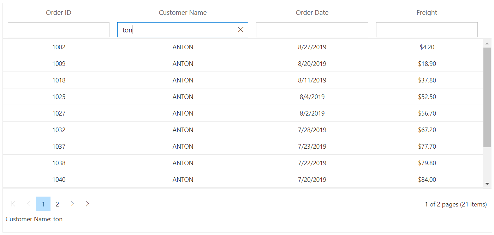

# Filter Bar in Blazor DataGrid Component

By setting the [AllowFiltering](https://help.syncfusion.com/cr/blazor/Syncfusion.Blazor.Grids.SfGrid-1.html#Syncfusion_Blazor_Grids_SfGrid_1_AllowFiltering) to true, the filter bar row will render next to the header, which allows you to filter data. You can filter the records with different expressions depending upon the column type.

## Filter bar expressions

You can enter the following filter expressions (operators) manually in the filter bar.

Expression |Example |Description |Column Type
-----|-----|-----|-----
= |=value |StartsWith |Number
!= |!=value |NotEqual |Number
> |>value |GreaterThan |Number
< |<value |LessThan |Number
>= |>=value |GreaterThanOrEqual |Number
<=|<=value|LessThanOrEqual |Number
* |*value |StartsWith |String
% |%value |EndsWith |String
N/A |N/A | `equal` operator will always be used for date filter. |Date
N/A |N/A |`equal` operator will always be used for Boolean filter. |Boolean

```cshtml
@using Syncfusion.Blazor.Grids

<SfGrid DataSource="@Orders" AllowFiltering="true" AllowPaging="true">
   <GridPageSettings PageSize="5"></GridPageSettings>
   <GridColumns>
     <GridColumn Field=@nameof(Order.OrderID) HeaderText="Order ID" TextAlign="TextAlign.Right" Width="120"></GridColumn>
     <GridColumn Field=@nameof(Order.CustomerID) HeaderText="Customer Name" Width="150"></GridColumn>
     <GridColumn Field=@nameof(Order.OrderDate) HeaderText=" Order Date" Format="d" Type="ColumnType.Date" TextAlign="TextAlign.Right" Width="130"></GridColumn>
     <GridColumn Field=@nameof(Order.Freight) HeaderText="Freight" Format="C2" TextAlign="TextAlign.Right" Width="120"></GridColumn>
   </GridColumns>
</SfGrid>

@code{
    public List<Order> Orders { get; set; }

    protected override void OnInitialized()
    {
        Orders = Enumerable.Range(1, 75).Select(x => new Order()
        {
            OrderID = 1000 + x,
            CustomerID = (new string[] { "ALFKI", "ANANTR", "ANTON", "BLONP", "BOLID" })[new Random().Next(5)],
            Freight = 2.1 * x,
            OrderDate = (new DateTime[] { new DateTime(2010, 5, 1), new DateTime(2010, 5, 2), new DateTime(2010, 5, 3), })[new Random().Next(3)]
            }).ToList();
    }

    public class Order {
        public int? OrderID { get; set; }
        public string CustomerID { get; set; }
        public DateTime? OrderDate { get; set; }
        public double? Freight { get; set; }
    }
}
```

The following screenshot shows filtering using FilterBar


## Filter bar template with custom component

The [FilterTemplate](https://help.syncfusion.com/cr/blazor/Syncfusion.Blazor.Grids.GridColumn.html) property is used to add custom components to a particular column. The following sample shows the dropdown, used as a custom component in the Customer Name column.

To access the filtered values inside the FilterTemplate, you can use the implicit named parameter context. You can type cast the context as PredicateModel to get filter values inside template.

```csharp

@using Syncfusion.Blazor.Data
@using Syncfusion.Blazor.Grids
@using Syncfusion.Blazor.DropDowns
<SfGrid @ref="@Grid" DataSource="@Orders" AllowFiltering="true" AllowPaging="true" Height="315">
    <GridColumns>
        <GridColumn Field=@nameof(Order.OrderID) HeaderText="Order ID" TextAlign="TextAlign.Right" Width="120"></GridColumn>
        <GridColumn Field=@nameof(Order.CustomerID) HeaderText="Customer Name" Width="150">
            <FilterTemplate>
                <SfDropDownList PlaceHolder="Customer Name" ID="CustomerID" Value="@((string)(context as PredicateModel).Value)" DataSource="@Dropdown" TValue="string" TItem="Data">
                    <DropDownListEvents ValueChange="@Change" TItem="Data" TValue="string"></DropDownListEvents>
                    <DropDownListFieldSettings Value="CustomerID" Text="CustomerID"></DropDownListFieldSettings>
                </SfDropDownList>
            </FilterTemplate>
        </GridColumn>
        <GridColumn Field=@nameof(Order.OrderDate) HeaderText=" Order Date" Format="d" Type="ColumnType.Date" TextAlign="TextAlign.Right" Width="130"></GridColumn>
        <GridColumn Field=@nameof(Order.Freight) HeaderText="Freight" Format="C2" TextAlign="TextAlign.Right" Width="120"></GridColumn>
    </GridColumns>
</SfGrid>

@code{
    SfGrid<Order> Grid;
    public List<Order> Orders { get; set; }

    protected override void OnInitialized()
    {
        Orders = Enumerable.Range(1, 75).Select(x => new Order()
        {
            OrderID = 1000 + x,
            CustomerID = (new string[] { "ALFKI", "ANANTR", "ANTON", "BLONP", "BOLID" })[new Random().Next(5)],
            Freight = 2.1 * x,
            OrderDate = (new DateTime[] { new DateTime(2010, 5, 1), new DateTime(2010, 5, 2), new DateTime(2010, 5, 3), })[new Random().Next(3)],
        }).ToList();
    }

    public class Data
    {
        public string CustomerID { get; set; }
    }
    List<Data> Dropdown = new List<Data>
    {
        new Data() { CustomerID= "All" },
        new Data() { CustomerID= "ANTON" },
        new Data() { CustomerID= "ANANTR" },
        new Data() { CustomerID= "ALFKI" },
        new Data() { CustomerID= "BOLID" },
        new Data() { CustomerID= "BLONP" },
    };

    public class Order
    {
        public int? OrderID { get; set; }
        public string CustomerID { get; set; }
        public DateTime? OrderDate { get; set; }
        public double? Freight { get; set; }
    }

    public void Change(@Syncfusion.Blazor.DropDowns.ChangeEventArgs<string, Data> args)
    {
        if (args.Value == "All")
        {
            Grid.ClearFiltering();
        }
        else
        {
            Grid.FilterByColumn("CustomerID", "contains", args.Value);
        }
    }
}
```

The following screenshot shows filtering using custom component


## Change default filter operator

You can change the default filter operator by extending `FilterSettings` property in the column.

In the following sample, we have changed the default operator for CustomerID column as **contains** from **startswith**

```cshtml
@using Syncfusion.Blazor.Grids

<SfGrid @ref="@Grid" ID="Egrid" DataSource="@Orders" AllowFiltering="true" AllowPaging="true" Height="315">
    <GridColumns>
        <GridColumn Field=@nameof(Order.OrderID) HeaderText="Order ID" TextAlign="TextAlign.Center" Width="120"></GridColumn>
        <GridColumn Field=@nameof(Order.CustomerID) HeaderText="Customer Name" TextAlign="TextAlign.Center" Width="150" FilterSettings="@(new FilterSettings{ Operator = Operator.Contains })"></GridColumn>
        <GridColumn Field=@nameof(Order.OrderDate) HeaderText=" Order Date" Format="d" Type="ColumnType.Date" TextAlign="TextAlign.Center" Width="130"></GridColumn>
        <GridColumn Field=@nameof(Order.Freight) HeaderText="Freight" Format="C2" TextAlign="TextAlign.Center" Width="120"></GridColumn>
    </GridColumns>
</SfGrid>

@code{
    SfGrid<Order> Grid;
    public List<Order> Orders { get; set; }

    protected override void OnInitialized()
    {
        Orders = Enumerable.Range(1, 75).Select(x => new Order()
        {
            OrderID = 1000 + x,
            CustomerID = (new string[] { "ALFKI", "ANANTR", "ANTON", "BLONP", "BOLID" })[new Random().Next(5)],
            Freight = 2.1 * x,
            OrderDate = (new DateTime[] { new DateTime(2010, 5, 1), new DateTime(2010, 5, 2), new DateTime(2010, 5, 3), })[new Random().Next(3)],
        }).ToList();
    }

    public class Order
    {
        public int? OrderID { get; set; }
        public string CustomerID { get; set; }
        public DateTime? OrderDate { get; set; }
        public double? Freight { get; set; }
    }
}
```

The following screenshot represents Filter with change in default operator as contains



## Filter modes

By default, filter bar [Mode](https://help.syncfusion.com/cr/blazor/Syncfusion.Blazor.Grids.GridFilterSettings.html#Syncfusion_Blazor_Grids_GridFilterSettings_Mode) will be of OnEnter type. So, you need to press the Enter key after typing a value in the filter bar.

You can also perform filtering operation without pressing Enter key in the filter bar by Setting the filter bar [Mode](https://help.syncfusion.com/cr/blazor/Syncfusion.Blazor.Grids.GridFilterSettings.html#Syncfusion_Blazor_Grids_GridFilterSettings_Mode) property as [Immediate](https://help.syncfusion.com/cr/blazor/Syncfusion.Blazor.Grids.FilterBarMode.html#Syncfusion_Blazor_Grids_FilterBarMode_Immediate).

The [ImmediateModeDelay](https://help.syncfusion.com/cr/blazor/Syncfusion.Blazor.Grids.GridFilterSettings.html#Syncfusion_Blazor_Grids_GridFilterSettings_ImmediateModeDelay) property of [GridFilterSettings](https://help.syncfusion.com/cr/blazor/Syncfusion.Blazor.Grids.SfGrid-1.html#Syncfusion_Blazor_Grids_SfGrid_1_FilterSettings) is used to define the time Grid has to wait for performing filter operation after completion of user typing word.

```cshtml
@using Syncfusion.Blazor.Grids

<SfGrid DataSource="@Orders" AllowFiltering="true" AllowPaging="true">
    <GridFilterSettings Mode="FilterBarMode.Immediate" ImmediateModeDelay="300"></GridFilterSettings>
    <GridColumns>
        <GridColumn Field=@nameof(Order.OrderID) HeaderText="Order ID" TextAlign="TextAlign.Right" Width="120"></GridColumn>
        <GridColumn Field=@nameof(Order.CustomerID) HeaderText="Customer Name" Width="150"></GridColumn>
        <GridColumn Field=@nameof(Order.OrderDate) HeaderText=" Order Date" Format="d" Type="ColumnType.Date" TextAlign="TextAlign.Right" Width="130"></GridColumn>
        <GridColumn Field=@nameof(Order.Freight) HeaderText="Freight" Format="C2" TextAlign="TextAlign.Right" Width="120"></GridColumn>
    </GridColumns>
</SfGrid>

@code{
    public List<Order> Orders { get; set; }

    protected override void OnInitialized()
    {
        Orders = Enumerable.Range(1, 75).Select(x => new Order()
        {
            OrderID = 1000 + x,
            CustomerID = (new string[] { "ALFKI", "ANANTR", "ANTON", "BLONP", "BOLID" })[new Random().Next(5)],
            Freight = 2.1 * x,
            OrderDate = (new DateTime[] { new DateTime(2010, 5, 1), new DateTime(2010, 5, 2), new DateTime(2010, 5, 3), })[new Random().Next(3)],
        }).ToList();
    }

    public class Order
    {
        public int? OrderID { get; set; }
        public string CustomerID { get; set; }
        public DateTime? OrderDate { get; set; }
        public double? Freight { get; set; }
    }
}

```
