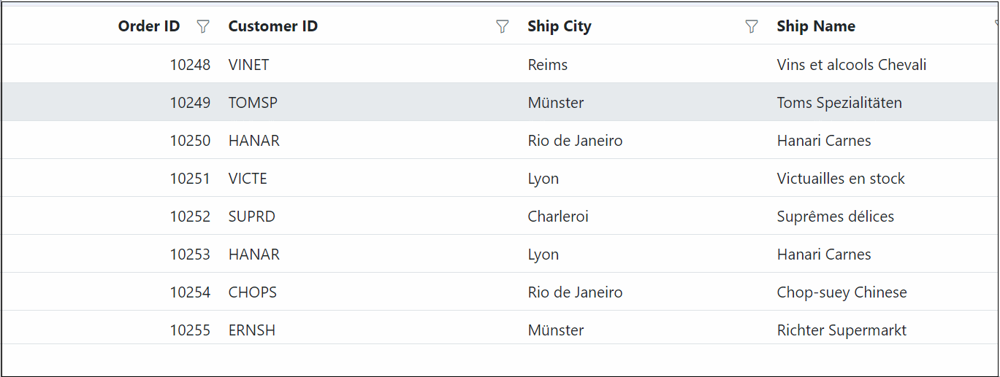

# Filter menu in Blazor DataGrid

The Syncfusion<sup style="font-size:70%">&reg;</sup> Blazor DataGrid filter menu provides an intuitive interface for filtering data on a per-column basis. It utilizes a pop-up menu that contains a range of filter operators, offering precise control over the displayed data.

To enable the filter menu, set the [AllowFiltering](https://help.syncfusion.com/cr/blazor/Syncfusion.Blazor.Grids.SfGrid-1.html#Syncfusion_Blazor_Grids_SfGrid_1_AllowFiltering) property to **true** and the [Type](https://help.syncfusion.com/cr/blazor/Syncfusion.Blazor.Grids.GridFilterSettings.html#Syncfusion_Blazor_Grids_GridFilterSettings_Type) property of the [GridFilterSettings](https://help.syncfusion.com/cr/blazor/Syncfusion.Blazor.Grids.SfGrid-1.html#Syncfusion_Blazor_Grids_SfGrid_1_FilterSettings) to **Menu**. When enabled, a filter icon appears in the column header, allowing for interactive filtering.




@using Syncfusion.Blazor.Grids

<SfGrid DataSource="@GridData" @ref="Grid" AllowFiltering="true" Height="273px">
    <GridFilterSettings Type="Syncfusion.Blazor.Grids.FilterType.Menu"></GridFilterSettings>
    <GridColumns>
        <GridColumn Field=@nameof(OrderData.OrderID) HeaderText="Order ID" TextAlign="Syncfusion.Blazor.Grids.TextAlign.Right" Width="100"></GridColumn>
        <GridColumn Field=@nameof(OrderData.CustomerID) HeaderText="Customer ID" Width="120"></GridColumn>
        <GridColumn Field=@nameof(OrderData.ShipCity) HeaderText="Ship City" Width="100"></GridColumn>
        <GridColumn Field=@nameof(OrderData.ShipName) HeaderText="Ship Name" Width="100"></GridColumn>
    </GridColumns>
</SfGrid>

@code {

    public List<OrderData> GridData { get; set; }

    SfGrid<OrderData> Grid;

    protected override void OnInitialized()
    {
        GridData = OrderData.GetAllRecords();
    }
}





public class OrderData
{
    public static List<OrderData> Orders = new List<OrderData>();
    public OrderData() { }

    public OrderData(int? OrderID,string CustomerID,string ShipCity, string ShipName)
    {
        this.OrderID = OrderID;    
        this.CustomerID = CustomerID;
        this.ShipCity = ShipCity;
        this.ShipName = ShipName;           
    }

    public static List<OrderData> GetAllRecords()
    {
        if (Orders.Count() == 0)
        {
            int OrderID = 10247;
            for (int i = 1; i < 2; i++)
            {
                Orders.Add(new OrderData(OrderID+1, "VINET", "Reims", "Vins et alcools Chevali"));
                Orders.Add(new OrderData(OrderID+2, "TOMSP", "Münster", "Toms Spezialitäten"));
                Orders.Add(new OrderData(OrderID+3, "HANAR", "Rio de Janeiro", "Hanari Carnes"));
                Orders.Add(new OrderData(OrderID+4, "VICTE", "Lyon", "Victuailles en stock"));
                Orders.Add(new OrderData(OrderID+5, "SUPRD", "Charleroi", "Suprêmes délices"));
                Orders.Add(new OrderData(OrderID+6, "HANAR", "Lyon", "Hanari Carnes"));
                Orders.Add(new OrderData(OrderID+7, "CHOPS", "Rio de Janeiro", "Chop-suey Chinese"));
                Orders.Add(new OrderData(OrderID + 8, "ERNSH", "Münster", "Richter Supermarkt"));
                Orders.Add(new OrderData(OrderID+9, "WELLI", "Reims", "Wellington Import"));
                OrderID += 9;
            }
        }
        return Orders;
    }

    public int? OrderID { get; set; }
    public string CustomerID { get; set; }
    public string ShipCity { get; set; }
    public string ShipName { get; set; }
}






> * Setting the [AllowFiltering](https://help.syncfusion.com/cr/blazor/Syncfusion.Blazor.Grids.SfGrid-1.html#Syncfusion_Blazor_Grids_SfGrid_1_AllowFiltering) property of the [GridColumn](https://help.syncfusion.com/cr/blazor/Syncfusion.Blazor.Grids.GridColumn.html) object to **false** prevents the filter menu from rendering for that specific column.

## Custom component in filter menu

The filter menu can be customized by replacing its default input component with a custom one. This is achieved by defining a template within the [FilterTemplate](https://help.syncfusion.com/cr/blazor/Syncfusion.Blazor.Grids.GridColumn.html#Syncfusion_Blazor_Grids_GridColumn_FilterTemplate) property of a [GridColumn](https://help.syncfusion.com/cr/blazor/Syncfusion.Blazor.Grids.GridColumn.html).

The default component rendered in the filter menu is determined by the column's data type:

*   **String**: [AutoComplete](https://blazor.syncfusion.com/documentation/autocomplete/getting-started-with-web-app)
*   **Numeric**: [NumericTextBox](https://blazor.syncfusion.com/documentation/numeric-textbox/getting-started)
*   **Boolean**: [DropDownList](https://blazor.syncfusion.com/documentation/dropdown-list/getting-started)

For example, the following code demonstrates how to replace the default `NumericTextBox` with a `DropDownList` for the numeric **OrderID** column. This customization allows filtering based on a selection from the dropdown list instead of manual input.




@using Syncfusion.Blazor.Grids
@using Syncfusion.Blazor.DropDowns

<SfGrid DataSource="@GridData" @ref="Grid" AllowFiltering="true" Height="273px">
    <GridFilterSettings Type="Syncfusion.Blazor.Grids.FilterType.Menu"></GridFilterSettings>
    <GridColumns>
        <GridColumn Field=@nameof(OrderData.OrderID) HeaderText="Order ID" TextAlign="Syncfusion.Blazor.Grids.TextAlign.Right" Width="100">
             <FilterTemplate>
                <SfDropDownList Placeholder="OrderID" ID="OrderID" @bind-Value="@((context as PredicateModel<int?>).Value)" TItem="OrderData" TValue="int?" DataSource="@GridData">
                    <DropDownListFieldSettings Value="OrderID" Text="OrderID"></DropDownListFieldSettings>
                </SfDropDownList>
            </FilterTemplate>
        </GridColumn>
        <GridColumn Field=@nameof(OrderData.CustomerID) HeaderText="Customer ID" Width="120"></GridColumn>
        <GridColumn Field=@nameof(OrderData.ShipCity) HeaderText="Ship City" Width="100"></GridColumn>
        <GridColumn Field=@nameof(OrderData.ShipName) HeaderText="Ship Name" Width="100"></GridColumn>
    </GridColumns>
</SfGrid>

@code {

    public List<OrderData> GridData { get; set; }

    SfGrid<OrderData> Grid;

    protected override void OnInitialized()
    {
        GridData = OrderData.GetAllRecords();
    }
}





public class OrderData
{
    public static List<OrderData> Orders = new List<OrderData>();
    public OrderData() { }

    public OrderData(int? OrderID,string CustomerID,string ShipCity, string ShipName)
    {
        this.OrderID = OrderID;    
        this.CustomerID = CustomerID;
        this.ShipCity = ShipCity;
        this.ShipName = ShipName;           
    }

    public static List<OrderData> GetAllRecords()
    {
        if (Orders.Count() == 0)
        {
            int OrderID = 10247;
            for (int i = 1; i < 2; i++)
            {
                Orders.Add(new OrderData(OrderID+1, "VINET", "Reims", "Vins et alcools Chevali"));
                Orders.Add(new OrderData(OrderID+2, "TOMSP", "Münster", "Toms Spezialitäten"));
                Orders.Add(new OrderData(OrderID+3, "HANAR", "Rio de Janeiro", "Hanari Carnes"));
                Orders.Add(new OrderData(OrderID+4, "VICTE", "Lyon", "Victuailles en stock"));
                Orders.Add(new OrderData(OrderID+5, "SUPRD", "Charleroi", "Suprêmes délices"));
                Orders.Add(new OrderData(OrderID+6, "HANAR", "Lyon", "Hanari Carnes"));
                Orders.Add(new OrderData(OrderID+7, "CHOPS", "Rio de Janeiro", "Chop-suey Chinese"));
                Orders.Add(new OrderData(OrderID + 8, "ERNSH", "Münster", "Richter Supermarkt"));
                Orders.Add(new OrderData(OrderID+9, "WELLI", "Reims", "Wellington Import"));
                OrderID += 9;
            }
        }
        return Orders;
    }

    public int? OrderID { get; set; }
    public string CustomerID { get; set; }
    public string ShipCity { get; set; }
    public string ShipName { get; set; }
}






**Default filter input for OrderID column**


**Custom dropdown filter for OrderID column**



## Show 24 hours time format in filter dialog

The Syncfusion<sup style="font-size:70%">&reg;</sup> Blazor DataGrid supports displaying time in 24-hour format within the filter dialog for date or datetime columns. For `DateTime` columns, the filter dialog's time picker defaults to a **12-hour (AM/PM)** format. This can be customized to a 24-hour format.

To implement this, define a [FilterTemplate](https://help.syncfusion.com/cr/blazor/Syncfusion.Blazor.Grids.GridColumn.html#Syncfusion_Blazor_Grids_GridColumn_FilterTemplate) for the desired [GridColumn](https://help.syncfusion.com/cr/blazor/Syncfusion.Blazor.Grids.GridColumn.html). Inside the template, use a [DateTimePicker](https://blazor.syncfusion.com/documentation/datetime-picker/getting-started-with-web-app) component and set its `TimeFormat` property to **HH:mm**.




@using Syncfusion.Blazor.Grids
@using Syncfusion.Blazor.Calendars

<SfGrid DataSource="@GridData" @ref="Grid" AllowSorting="true" AllowPaging="true" AllowFiltering="true">
    <GridPageSettings PageCount="5"></GridPageSettings>
    <GridFilterSettings Type="Syncfusion.Blazor.Grids.FilterType.Menu"></GridFilterSettings>
    <GridColumns>
        <GridColumn Field=@nameof(OrderData.OrderID) HeaderText="Order ID" TextAlign="Syncfusion.Blazor.Grids.TextAlign.Right" Width="120"></GridColumn>
        <GridColumn Field=@nameof(OrderData.OrderDate) HeaderText="Order Date" Type =ColumnType.DateTime Format="MM/dd/yyyy HH:mm" Width="180">
            <FilterTemplate>
                <SfDateTimePicker Placeholder="OrderDate" ID="OrderDate" TimeFormat="HH:mm" Format="MM/dd/yyyy HH:mm" @bind-Value="@((context as PredicateModel<DateTime?>).Value)" TValue="DateTime?">
                </SfDateTimePicker>
            </FilterTemplate>
        </GridColumn>
        <GridColumn Field=@nameof(OrderData.ShippedDate) HeaderText="Shipped Date" Type=ColumnType.DateTime Format="MM/dd/yyyy HH:mm" Width="180">
            <FilterTemplate>
                <SfDateTimePicker Placeholder="ShippedDate" ID="ShippedDate" TimeFormat="HH:mm" Format="MM/dd/yyyy HH:mm" @bind-Value="@((context as PredicateModel<DateTime?>).Value)" TValue="DateTime?">
                </SfDateTimePicker>
            </FilterTemplate>
        </GridColumn>
        <GridColumn Field=@nameof(OrderData.ShipCountry) HeaderText="Ship Country" Width="150"></GridColumn>
    </GridColumns>
</SfGrid>

@code {

    public List<OrderData> GridData { get; set; }

    SfGrid<OrderData> Grid;

    protected override void OnInitialized()
    {
        GridData = OrderData.GetAllRecords();
    }
}





public class OrderData
{
    public static List<OrderData> Orders = new List<OrderData>();
    public OrderData(){}
    public OrderData(int? OrderID, DateTime? OrderDate, DateTime? ShippedDate, string ShipCountry)
    {
        this.OrderID = OrderID;
        this.OrderDate = OrderDate;
        this.ShippedDate = ShippedDate;
        this.ShipCountry = ShipCountry;
    }

    public static List<OrderData> GetAllRecords()
    {
        if (Orders.Count() == 0)
        {
            int OrderID = 10247;
            for (int i = 1; i < 3; i++)
            {
                Orders.Add(new OrderData(OrderID + 1, new DateTime(1996, 07, 10, 0, 0, 0), new DateTime(1996, 07, 10, 7, 46, 0), "France"));
                Orders.Add(new OrderData(OrderID + 2, new DateTime(1996, 07, 10, 1, 56, 0), new DateTime(1996, 07, 10, 9, 26, 0), "Germany"));
                Orders.Add(new OrderData(OrderID + 3, new DateTime(1996, 07, 10, 3, 53, 0), new DateTime(1996, 07, 10, 11, 40, 0), "Brazil"));
                Orders.Add(new OrderData(OrderID + 4, new DateTime(1996, 07, 10, 5 , 50, 0), new DateTime(1996, 07, 10,13, 36, 0), "Belgium"));
                Orders.Add(new OrderData(OrderID + 5, new DateTime(1996, 07, 10, 7, 46 ,0), new DateTime(1996, 07, 10, 15, 33, 0), "Switzerland"));
                Orders.Add(new OrderData(OrderID + 6, new DateTime(1996, 07, 10, 9, 43, 0), new DateTime(1996, 07, 10, 17, 30, 0), "Venezuela"));
                Orders.Add(new OrderData(OrderID + 7, new DateTime(1996, 07, 10, 13, 36, 0), new DateTime(1996, 07, 10, 19, 26, 0), "Austria"));
                Orders.Add(new OrderData(OrderID + 8, new DateTime(1996, 07, 10, 15, 33, 0), new DateTime(1996, 07, 10, 21, 23, 0), "Mexico"));
                Orders.Add(new OrderData(OrderID + 9, new DateTime(1996, 07, 10,17, 30, 0), new DateTime(1996, 07, 10, 23, 20, 0), "USA"));
                OrderID += 9;
            }
        }
        return Orders;
    }

    public int? OrderID { get; set; }
    public DateTime? OrderDate { get; set; }
    public DateTime? ShippedDate { get; set; }
    public string ShipCountry { get; set; }
}






## Customizing filter menu operators list

The Syncfusion<sup style="font-size:70%">&reg;</sup> Blazor DataGrid allows customization of the default filter operator list using the [FilterDialogOpening](https://help.syncfusion.com/cr/blazor/Syncfusion.Blazor.Grids.GridEvents-1.html#Syncfusion_Blazor_Grids_GridEvents_1_FilterDialogOpening) event. This customization is supported for the following data types:
- String
- Number
- Date
- Boolean

Provide a custom list by assigning one of the following collections to **args.FilterOperators** based on the column:

* **StringOperator** - Defines a custom list of string operators.
* **NumberOperator** - Defines a custom list of number operators.
* **DateOperator** - Defines a custom list of date operators.
* **BooleanOperator** - Defines a custom list of boolean operators.




@using Syncfusion.Blazor.Grids

<SfGrid DataSource="@GridData" @ref="Grid" AllowFiltering="true" Height="273px">
    <GridFilterSettings Type="Syncfusion.Blazor.Grids.FilterType.Menu"></GridFilterSettings>
    <GridEvents FilterDialogOpening="FilterDialogOpeningHandler" TValue="OrderData"></GridEvents>
    <GridColumns>
        <GridColumn Field=@nameof(OrderData.OrderID) HeaderText="Order ID" TextAlign="Syncfusion.Blazor.Grids.TextAlign.Right" Width="100"></GridColumn>
        <GridColumn Field=@nameof(OrderData.CustomerID) HeaderText="Customer ID" Width="120"></GridColumn>
        <GridColumn Field=@nameof(OrderData.OrderDate) HeaderText="Order Date" Format="d" TextAlign="Syncfusion.Blazor.Grids.TextAlign.Right" Width="100"></GridColumn>
        <GridColumn Field=@nameof(OrderData.Verified) HeaderText="Verified" Width="100" DisplayAsCheckBox="true" Type="Syncfusion.Blazor.Grids.ColumnType.Boolean"></GridColumn>
        <GridColumn Field=@nameof(OrderData.ShipName) HeaderText="Ship Name" Width="100"></GridColumn>
    </GridColumns>
</SfGrid>

@code {

    public List<OrderData> GridData { get; set; }

    SfGrid<OrderData> Grid;

    protected override void OnInitialized()
    {
        GridData = OrderData.GetAllRecords();
    }
    public async Task FilterDialogOpeningHandler(FilterDialogOpeningEventArgs args)
    {

        if (args.ColumnName == "CustomerID" || args.ColumnName == "ShipName")
        {
            args.FilterOperators = StringOperator;
        }
        else if (args.ColumnName == "OrderID")
        {
            args.FilterOperators = NumberOperator;
        }
        else if (args.ColumnName == "OrderDate")
        {
            args.FilterOperators = DateOperator;
        }
        else if (args.ColumnName == "Verified")
        {
            args.FilterOperators = BooleanOperator;
        }
    }


    public class Operators : Syncfusion.Blazor.Grids.IFilterOperator
    {
        public string Value { get; set; }
        public string Text { get; set; }
    }

    List<Syncfusion.Blazor.Grids.IFilterOperator> StringOperator = new List<Syncfusion.Blazor.Grids.IFilterOperator> {
        new Operators()  { Value= "startswith", Text= "Starts With" },
        new Operators() { Value= "endswith", Text= "Ends With" },
        new Operators() { Value= "contains", Text= "Contains" },
        new Operators() { Value= "equal", Text= "Equal" },
        new Operators() { Value= "notequal", Text= "Not Equal" }
    };
    List<Syncfusion.Blazor.Grids.IFilterOperator> NumberOperator = new List<Syncfusion.Blazor.Grids.IFilterOperator> {
        new Operators()  { Value= "equal", Text= "Equal" },
        new Operators() { Value= "notequal", Text= "Not Equal" },
        new Operators() { Value= "greaterthan", Text= "Greater Than" },
        new Operators() { Value= "lessthan", Text= "Less Than" },
    };
    List<Syncfusion.Blazor.Grids.IFilterOperator> DateOperator = new List<Syncfusion.Blazor.Grids.IFilterOperator> {
         new Operators()  { Value= "equal", Text= "Equal" },
        new Operators() { Value= "notequal", Text= "Not Equal" },
        new Operators() { Value= "greaterthan", Text= "After" },
        new Operators() { Value= "lessthan", Text= "Before" },
    };
    List<Syncfusion.Blazor.Grids.IFilterOperator> BooleanOperator = new List<Syncfusion.Blazor.Grids.IFilterOperator> {
        new Operators()  { Value= "equal", Text= "Equal" },
        new Operators() { Value= "notequal", Text= "Not Equal" },
    };
}





public class OrderData
{
    public static List<OrderData> Orders = new List<OrderData>();
    public OrderData(){}

    public OrderData(int? OrderID, string CustomerID, DateTime? OrderDate, bool Verified, string ShipName)
    {
        this.OrderID = OrderID;
        this.CustomerID = CustomerID;
        this.OrderDate = OrderDate;
        this.Verified = Verified;
        this.ShipName = ShipName;
    }

    public static List<OrderData> GetAllRecords()
    {
        if (Orders.Count() == 0)
        {
            int OrderID = 10247;
            for (int i = 1; i < 3; i++)
            {
                Orders.Add(new OrderData(OrderID + 1, "VINET", new DateTime(1996, 07, 06), true, "Vins et alcools Chevali"));
                Orders.Add(new OrderData(OrderID + 2, "TOMSP", new DateTime(1996, 07, 06), false, "Toms Spezialitäten"));
                Orders.Add(new OrderData(OrderID + 3, "HANAR", new DateTime(1996, 07, 06), false, "Hanari Carnes"));
                Orders.Add(new OrderData(OrderID + 4, "VICTE", new DateTime(1996, 07, 06), true, "Victuailles en stock"));
                Orders.Add(new OrderData(OrderID + 5, "SUPRD", new DateTime(1996, 07, 06), true, "Suprêmes délices"));
                Orders.Add(new OrderData(OrderID + 6, "HANAR", new DateTime(1996, 07, 06), false, "Hanari Carnes"));
                Orders.Add(new OrderData(OrderID + 7, "CHOPS", new DateTime(1996, 07, 06), true, "Chop-suey Chinese"));
                Orders.Add(new OrderData(OrderID + 8, "RICSU", new DateTime(1996, 07, 06), true, "Richter Supermarkt"));
                Orders.Add(new OrderData(OrderID + 9, "WELLI", new DateTime(1996, 07, 06), false, "Wellington Import"));
                OrderID += 9;
            }
        }
        return Orders;
    }

    public int? OrderID { get; set; }
    public string CustomerID { get; set; }
    public DateTime? OrderDate { get; set; }
    public bool Verified { get; set; }
    public string ShipName { get; set; }
}






## Customize filter input editor

The Syncfusion<sup style="font-size:70%">&reg;</sup> Blazor DataGrid allows customization of the built-in filter dialog editor components using the [FilterEditorSettings](https://help.syncfusion.com/cr/blazor/Syncfusion.Blazor.Grids.GridColumn.html#Syncfusion_Blazor_Grids_GridColumn_FilterEditorSettings) property on the [GridColumn](https://help.syncfusion.com/cr/blazor/Syncfusion.Blazor.Grids.GridColumn.html).

The following table outlines component configurations customized for specific columns:

| Column         | Filter Component                                                                 | Customization                                         |
| -------------- | ------------------------------------------------------------------------------- | ----------------------------------------------------- |
| **Order ID**   | [NumericTextBox](https://blazor.syncfusion.com/documentation/numeric-textbox/getting-started)   | Show clear button enabled, minimum value set to 10,000 |
| **Customer ID**| [AutoComplete](https://blazor.syncfusion.com/documentation/autocomplete/getting-started)        | Autofill disabled, debounce delay set to 2000 ms       |
| **Ship City**  | [AutoComplete](https://blazor.syncfusion.com/documentation/autocomplete/getting-started)        | Autofill enabled, minimum input length set to 2        |
| **Order Time** | [TimePicker](https://blazor.syncfusion.com/documentation/timepicker/getting-started)            | Step interval set to 10 minutes                        |




@using Syncfusion.Blazor.Grids
@using Syncfusion.Blazor.DropDowns
@using Syncfusion.Blazor.Inputs
@using Syncfusion.Blazor.Calendars

<SfGrid DataSource="@GridData" AllowFiltering="true" AllowPaging="true">
    <GridFilterSettings Type="Syncfusion.Blazor.Grids.FilterType.Menu"></GridFilterSettings>
    <GridPageSettings PageCount="5"></GridPageSettings>
    <GridColumns>
        <GridColumn Field=@nameof(Orders.OrderID) HeaderText="Order ID" TextAlign="TextAlign.Right" Width="120" FilterEditorSettings="OrderIdFilterSettings"></GridColumn>
        <GridColumn Field=@nameof(Orders.CustomerID) HeaderText="Customer ID" Width="150" FilterEditorSettings="CustomerIdFilterSettings"></GridColumn>
        <GridColumn Field=@nameof(Orders.Freight) TextAlign="TextAlign.Right" Width="120" Format="C2"></GridColumn>
        <GridColumn Field=@nameof(Orders.OrderDate) HeaderText="Order Date" Format="dd/MM/yyyy" Type="ColumnType.DateOnly" TextAlign="TextAlign.Right" Width="150"></GridColumn>
        <GridColumn Field=@nameof(Orders.OrderTime) HeaderText="Order Time" Type="ColumnType.TimeOnly" TextAlign="TextAlign.Right" Width="160" FilterEditorSettings="OrderTimeFilterSettings"></GridColumn>
        <GridColumn Field=@nameof(Orders.ShipCity) HeaderText="Ship City" Width="150" FilterEditorSettings="ShipCityFilterSettings"></GridColumn>
    </GridColumns>
</SfGrid>

@code {
    public List<Orders> GridData { get; set; }
    protected override void OnInitialized()
    {
        GridData = Orders.GetAllRecords();
    }
    public IFilterSettings CustomerIdFilterSettings = new AutoCompleteFilterParams
    {
        AutoCompleteParams = new AutoCompleteModel
        {
            DebounceDelay = 2000,
            Autofill = false,
        }
    };
    public IFilterSettings OrderIdFilterSettings = new NumericFilterParams
    {
        NumericTextBoxParams = new NumericTextBoxModel<object>
        {
            ShowClearButton = true,
            Min = 10000,
        }
    };
    public IFilterSettings ShipCityFilterSettings = new AutoCompleteFilterParams
    {
        AutoCompleteParams = new AutoCompleteModel
        {
            MinLength = 2,
            Autofill = true,
        }
    };
    public IFilterSettings OrderTimeFilterSettings = new TimeFilterParams
    {
        TimePickerParams = new TimePickerModel<object>
        {
            Step = 10
        }
    };
}



public class Orders
{
    public Orders() { }

    public Orders(int orderID, string customerID, double freight, DateOnly orderDate, TimeOnly orderTime, string shipCity)
    {
        OrderID = orderID;
        CustomerID = customerID;
        Freight = freight;
        OrderDate = orderDate;
        OrderTime = orderTime;
        ShipCity = shipCity;
    }

    public static List<Orders> GetAllRecords()
    {
        List<Orders> orders = new List<Orders>();
        int code = 10000;
        for (int i = 1; i < 5; i++)
        {
            orders.Add(new Orders(code + 1, "ALFKI", Math.Round((2.3 * i), 2), new DateOnly(1991, 05, 15), new TimeOnly(10, 00, 00), "Berlin"));
            orders.Add(new Orders(code + 2, "ANATR", Math.Round((3.3 * i), 2), new DateOnly(1990, 04, 04), new TimeOnly(11, 30, 00), "Madrid"));
            orders.Add(new Orders(code + 3, "ANTON", Math.Round((4.3 * i), 2), new DateOnly(1957, 11, 30), new TimeOnly(12, 00, 00), "Cholchester"));
            orders.Add(new Orders(code + 4, "BLONP", Math.Round((5.3 * i), 2), new DateOnly(1930, 10, 22), new TimeOnly(15, 30, 00), "Marseille"));
            orders.Add(new Orders(code + 5, "BOLID", Math.Round((6.3 * i), 2), new DateOnly(1953, 02, 18), new TimeOnly(16, 30, 00), "Tsawassen"));
            code += 5;
        }
        return orders;
    }

    public int? OrderID { get; set; }
    public string CustomerID { get; set; }
    public double? Freight { get; set; }
    public DateOnly? OrderDate { get; set; }
    public TimeOnly? OrderTime { get; set; }
    public string ShipCity { get; set; }
}




> This customization is applicable for both menu and excel filter dialogs.

## Customize the default input component of filter menu dialog

Customize the default input components in the filter menu dialog using the [FilterTemplate](https://help.syncfusion.com/cr/blazor/Syncfusion.Blazor.Grids.GridColumn.html#Syncfusion_Blazor_Grids_GridColumn_FilterTemplate) property of the [GridColumn](https://help.syncfusion.com/cr/blazor/Syncfusion.Blazor.Grids.GridColumn.html).

| Column Type | Default component  |Customization Example  | API Reference     |
| ----------- | ------------------------------------------------------------------------------------------------- | ---------------------------------------- | --------------------------------------------------------------------------------------------------------- |
| String      | [AutoComplete](https://blazor.syncfusion.com/documentation/autocomplete/getting-started)    |  Autofill="false" | [AutoComplete API](https://help.syncfusion.com/cr/blazor/Syncfusion.Blazor.DropDowns.SfAutoComplete-2.html) |
| Number      | [NumericTextBox](https://blazor.syncfusion.com/documentation/numeric-textbox/getting-started) | ShowSpinButton="false" | [NumericTextBox API](https://help.syncfusion.com/cr/blazor/Syncfusion.Blazor.Inputs.SfNumericTextBox-1.html)                 |
| Boolean     | [DropDownList](https://blazor.syncfusion.com/documentation/dropdown-list/getting-started)   | SortOrder="SortOrder.Ascending"  | [DropDownList API](https://help.syncfusion.com/cr/blazor/Syncfusion.Blazor.DropDowns.SfDropDownList-2.html)                   |
| Date        | [DatePicker](https://blazor.syncfusion.com/documentation/datepicker/getting-started)         | WeekNumber="true"    | [DatePicker API](https://help.syncfusion.com/cr/blazor/Syncfusion.Blazor.Calendars.SfDatePicker-1.html)                         |
| DateTime    | [DateTimePicker](https://blazor.syncfusion.com/documentation/datetime-picker/getting-started) | ShowClearButton="true"  | [DateTimePicker API](https://help.syncfusion.com/cr/blazor/Syncfusion.Blazor.Calendars.SfDateTimePicker-1.html)                 |


In the following example, the **OrderID** and **Freight** columns are numeric. By default, the filter dialog displays a [NumericTextBox](https://blazor.syncfusion.com/documentation/numeric-textbox/getting-started) with a spin button. Using the `FilterTemplate` property of the `GridColumn`, the spin button can be hidden specifically for the **OrderID** column.




@using Syncfusion.Blazor.Grids
@using Syncfusion.Blazor.Inputs

<SfGrid DataSource="@GridData" @ref="Grid" AllowFiltering="true" AllowPaging="true" >
    <GridFilterSettings Type="Syncfusion.Blazor.Grids.FilterType.Menu"></GridFilterSettings>
    <GridColumns>
        <GridColumn Field=@nameof(OrderData.OrderID) HeaderText="Order ID" TextAlign="Syncfusion.Blazor.Grids.TextAlign.Right" >
            <FilterTemplate>
                <SfNumericTextBox TValue="int?" ShowSpinButton="false" @bind-Value="@((context as PredicateModel<int?>).Value)"></SfNumericTextBox>
            </FilterTemplate>
        </GridColumn>
        <GridColumn Field=@nameof(OrderData.CustomerID) HeaderText="Customer ID" ></GridColumn>
        <GridColumn Field=@nameof(OrderData.ShipName) HeaderText="Ship Name" ></GridColumn>
        <GridColumn Field=@nameof(OrderData.Freight) HeaderText="Freight" Format="C2" TextAlign="Syncfusion.Blazor.Grids.TextAlign.Right"></GridColumn>
    </GridColumns>
</SfGrid>

@code {
    public List<OrderData> GridData { get; set; }
    SfGrid<OrderData>? Grid { get; set; }

    protected override void OnInitialized()
    {
        GridData = OrderData.GetAllRecords();
    }
}





public class OrderData
{
    public static List<OrderData> Orders = new List<OrderData>();
    public OrderData(){}

    public OrderData(int? OrderID, string CustomerID, double? Freight, string ShipName)
    {
        this.OrderID = OrderID;
        this.CustomerID = CustomerID;
        this.Freight = Freight;
        this.ShipName = ShipName;
    }

    public static List<OrderData> GetAllRecords()
    {
        if (Orders.Count() == 0)
        {
            int OrderID = 10247;
            for (int i = 1; i < 3; i++)
            {
                Orders.Add(new OrderData(OrderID + 1, "VINET", 32.38, "Vins et alcools Chevali"));
                Orders.Add(new OrderData(OrderID + 2, "TOMSP", 11.61, "Toms Spezialitäten"));
                Orders.Add(new OrderData(OrderID + 3, "HANAR", 65.83, "Hanari Carnes"));
                Orders.Add(new OrderData(OrderID + 4, "VICTE", 45.78, "Victuailles en stock"));
                Orders.Add(new OrderData(OrderID + 5, "SUPRD", 98.6, "Suprêmes délices"));
                Orders.Add(new OrderData(OrderID + 6, "HANAR", 103.45, "Hanari Carnes"));
                Orders.Add(new OrderData(OrderID + 7, "CHOPS", 103.45, "Chop-suey Chinese"));
                Orders.Add(new OrderData(OrderID + 8, "RICSU", 112.48, "Richter Supermarkt"));
                Orders.Add(new OrderData(OrderID + 9, "WELLI", 33.45, "Wellington Import"));
                OrderID += 9;
            }
        }
         return Orders;
    }

    public int? OrderID { get; set; }
    public string CustomerID { get; set; }
    public string ShipName { get; set; }
    public double? Freight { get; set; }
}






### Prevent autofill option in autocomplete of menu filter

By default, the [AutoComplete](https://blazor.syncfusion.com/documentation/autocomplete/getting-started) component in the filter menu dialog is configured to automatically fill suggestions while typing. In scenarios requiring a more controlled user experience, this autofill behavior can be disabled.

To prevent autofill, set the [Autofill](https://help.syncfusion.com/cr/blazor/Syncfusion.Blazor.DropDowns.SfComboBox-2.html#Syncfusion_Blazor_DropDowns_SfComboBox_2_Autofill) parameter to **false** using the [FilterTemplate](https://help.syncfusion.com/cr/blazor/Syncfusion.Blazor.Grids.GridColumn.html#Syncfusion_Blazor_Grids_GridColumn_FilterTemplate) property of the [GridColumn](https://help.syncfusion.com/cr/blazor/Syncfusion.Blazor.Grids.GridColumn.html). This property enables the use of custom components for specific columns.



@using Syncfusion.Blazor.Grids
@using Syncfusion.Blazor.DropDowns

<SfGrid DataSource="@GridData" @ref="Grid" AllowFiltering="true" AllowPaging="true">
    <GridFilterSettings Type="Syncfusion.Blazor.Grids.FilterType.Menu"></GridFilterSettings>
    <GridColumns>
        <GridColumn Field=@nameof(OrderData.OrderID) HeaderText="Order ID" TextAlign="Syncfusion.Blazor.Grids.TextAlign.Right"></GridColumn>
        <GridColumn Field=@nameof(OrderData.CustomerID) HeaderText="Customer ID">
            <FilterTemplate>
                <SfAutoComplete TValue="string" TItem="string" ID="CustomerID" Autofill="false" @bind-Value="@((context as PredicateModel<string>).Value)" Placeholder="CustomerID" DataSource="@CustomerData">
                </SfAutoComplete>
            </FilterTemplate>
        </GridColumn>
        <GridColumn Field=@nameof(OrderData.ShipName) HeaderText="Ship Name"></GridColumn>
        <GridColumn Field=@nameof(OrderData.Freight) HeaderText="Freight" Format="C2" TextAlign="Syncfusion.Blazor.Grids.TextAlign.Right"></GridColumn>
    </GridColumns>
</SfGrid>

@code {
    public List<OrderData> GridData { get; set; }
    SfGrid<OrderData>? Grid { get; set; }

    List<string> CustomerData = new List<string>() { "VINET", "TOMSP", "HANAR", "VICTE", "SUPRD", "CHOPS", "RICSU", "WELLI" };

    protected override void OnInitialized()
    {
        GridData = OrderData.GetAllRecords();
    }
}



   public class OrderData
    {
        public static List<OrderData> Orders = new List<OrderData>();

        public OrderData()
        {

        }
        public OrderData(int? OrderID, string CustomerID, double? Freight, string ShipName)
        {
            this.OrderID = OrderID;
            this.CustomerID = CustomerID;
            this.Freight = Freight;
            this.ShipName = ShipName;
        }

        public static List<OrderData> GetAllRecords()
        {
            if (Orders.Count() == 0)
            {
                int OrderID = 10247;
                for (int i = 1; i < 3; i++)
                {
                    Orders.Add(new OrderData(OrderID + 1, "VINET", 32.38, "Vins et alcools Chevali"));
                    Orders.Add(new OrderData(OrderID + 2, "TOMSP", 11.61, "Toms Spezialitäten"));
                    Orders.Add(new OrderData(OrderID + 3, "HANAR", 65.83, "Hanari Carnes"));
                    Orders.Add(new OrderData(OrderID + 4, "VICTE", 45.78, "Victuailles en stock"));
                    Orders.Add(new OrderData(OrderID + 5, "SUPRD", 98.6, "Suprêmes délices"));
                    Orders.Add(new OrderData(OrderID + 6, "HANAR", 103.45, "Hanari Carnes"));
                    Orders.Add(new OrderData(OrderID + 7, "CHOPS", 103.45, "Chop-suey Chinese"));
                    Orders.Add(new OrderData(OrderID + 8, "RICSU", 112.48, "Richter Supermarkt"));
                    Orders.Add(new OrderData(OrderID + 9, "WELLI", 33.45, "Wellington Import"));
                    OrderID += 9;
                }
            }
            return Orders;
        }

        public int? OrderID { get; set; }
        public string CustomerID { get; set; }
        public string ShipName { get; set; }
        public double? Freight { get; set; }
    }





### Hide the filter operator dropdownlist in the filter menu dialog

To hide the operator dropdown in the menu filter dialog of the Syncfusion<sup style="font-size:70%">&reg;</sup> Blazor DataGrid, apply the following CSS to override the styling of the **.e-flm_optrdiv** class. This customization simplifies the interface by applying a default filter behavior without displaying the operator selection.

```css
    .e-flm_optrdiv {
        display: none;
    }
```




@using Syncfusion.Blazor.Grids

<SfGrid DataSource="@Orders" AllowFiltering="true" Height="315">
    <GridFilterSettings Type="Syncfusion.Blazor.Grids.FilterType.Menu"></GridFilterSettings>
    <GridColumns>
        <GridColumn Field=@nameof(OrderData.OrderID) HeaderText="Order ID" TextAlign="Syncfusion.Blazor.Grids.TextAlign.Right" Width="90"></GridColumn>
        <GridColumn Field=@nameof(OrderData.CustomerID) HeaderText="Customer ID" Width="150"></GridColumn>
        <GridColumn Field=@nameof(OrderData.Freight) HeaderText="Freight" TextAlign="Syncfusion.Blazor.Grids.TextAlign.Right" Format="C2" Width="130"></GridColumn>
        <GridColumn Field=@nameof(OrderData.OrderDate) HeaderText="Order Date" Format="d" Type="Syncfusion.Blazor.Grids.ColumnType.Date" Width="130"></GridColumn>
    </GridColumns>
</SfGrid>

<style>
    .e-flm_optrdiv {
        display: none;
    }
</style>


@code {
    public List<OrderData> Orders { get; set; }
   
    protected override void OnInitialized()
    {
        Orders = OrderData.GetAllRecords();
    }    
}





public class OrderData
{
    public static List<OrderData> Orders = new List<OrderData>();
    public OrderData()
    {

    }
    public OrderData(int? OrderID, string CustomerID, double Freight,DateTime? OrderDate)
    {
        this.OrderID = OrderID;
        this.CustomerID = CustomerID;   
        this.Freight = Freight;  
        this.OrderDate = OrderDate;           
    }

    public static List<OrderData> GetAllRecords()
    {
        if (Orders.Count() == 0)
        {
            int code = 10;
            for (int i = 1; i < 2; i++)
            {
                Orders.Add(new OrderData(10248, "VINET", 32.38,new DateTime(1996,7,4)));
                Orders.Add(new OrderData(10249, "TOMSP", 11.61, new DateTime(1996, 7, 5)));
                Orders.Add(new OrderData(10250, "HANAR", 65.83, new DateTime(1996, 7, 6)));
                Orders.Add(new OrderData(10251, "VINET", 41.34, new DateTime(1996, 7, 7)));
                Orders.Add(new OrderData(10252, "SUPRD", 51.30, new DateTime(1996, 7, 8)));
                Orders.Add(new OrderData(10253, "HANAR", 58.17, new DateTime(1996, 7, 9)));
                Orders.Add(new OrderData(10254, "CHOPS", 22.98, new DateTime(1996, 7, 10)));
                Orders.Add(new OrderData(10255, "VINET", 148.33, new DateTime(1996, 7, 11)));
                Orders.Add(new OrderData(10256, "HANAR", 13.97, new DateTime(1996, 7, 12)));
                code += 5;
            }
        }
        return Orders;
    }
    public int? OrderID { get; set; }
    public string CustomerID { get; set; }
    public double? Freight { get; set; }
    public DateTime? OrderDate { get; set; }       
}






## Filter by multiple keywords using filter menu

The Syncfusion<sup style="font-size:70%">&reg;</sup> Blazor DataGrid supports filtering based on multiple keywords using the filter menu dialog. This feature allows users to select multiple values for a column, enhancing filtering flexibility.

To enable this functionality, set the [Type](https://help.syncfusion.com/cr/blazor/Syncfusion.Blazor.Grids.GridFilterSettings.html#Syncfusion_Blazor_Grids_GridFilterSettings_Type) property of the [GridFilterSettings](https://help.syncfusion.com/cr/blazor/Syncfusion.Blazor.Grids.SfGrid-1.html#Syncfusion_Blazor_Grids_SfGrid_1_FilterSettings) to **Menu**, and integrate the [MultiSelect](https://blazor.syncfusion.com/documentation/multiselect-dropdown/getting-started-webapp) component as a custom UI element within the filter menu dialog.




@using Syncfusion.Blazor.Grids
@using Syncfusion.Blazor.DropDowns

<SfGrid DataSource="@GridData" @ref="Grid" AllowFiltering="true" AllowPaging="true" Height="273px">
    <GridFilterSettings Type="Syncfusion.Blazor.Grids.FilterType.Menu"></GridFilterSettings>
    <GridEvents Filtering="FilteringHandler" TValue="OrderData"></GridEvents>
    <GridColumns>
        <GridColumn Field=@nameof(OrderData.OrderID) HeaderText="Order ID" TextAlign="Syncfusion.Blazor.Grids.TextAlign.Right" Width="100">
            <FilterTemplate>
                <SfMultiSelect TValue="int[]" Placeholder="OrderID" Value="@OrderIDValues.ToArray()" Mode="VisualMode.Delimiter" TItem="OrderData" DataSource="@GridData">
                    <MultiSelectFieldSettings Value="OrderID" Text="OrderID"></MultiSelectFieldSettings>
                    <MultiSelectEvents ValueChange="OrderIDOnChange" TValue="int[]" TItem="OrderData"></MultiSelectEvents>
                </SfMultiSelect>
            </FilterTemplate>
        </GridColumn>
        <GridColumn Field=@nameof(OrderData.CustomerID) HeaderText="Customer ID" Width="120">
            <FilterTemplate>
                <SfMultiSelect TValue="string[]" Placeholder="CustomerID" Value="@CustomerIDValues.ToArray()" Mode="VisualMode.Delimiter" TItem="string" DataSource="@CustomerIDData">
                    <MultiSelectEvents ValueChange="CustomerIDOnChange" TValue="string[]" TItem="string"></MultiSelectEvents>
                </SfMultiSelect>
            </FilterTemplate>
        </GridColumn>
        <GridColumn Field=@nameof(OrderData.ShipCity) HeaderText="Ship City" Width="100">
            <FilterTemplate>
                <SfMultiSelect TValue="string[]" Placeholder="ShipCity" Value="@ShipCityValues.ToArray()" Mode="VisualMode.Delimiter" TItem="string" DataSource="@ShipCityData">
                    <MultiSelectEvents ValueChange="ShipCityOnChange" TValue="string[]" TItem="string"></MultiSelectEvents>
                </SfMultiSelect>
            </FilterTemplate>
        </GridColumn>
        <GridColumn Field=@nameof(OrderData.ShipName) HeaderText="Ship Name" Width="100">
            <FilterTemplate>
                <SfMultiSelect TValue="string[]" Placeholder="ShipName" Value="@ShipCityValues.ToArray()" Mode="VisualMode.Delimiter" TItem="string" DataSource="@ShipNameData">
                    <MultiSelectEvents ValueChange="ShipNameOnChange" TValue="string[]" TItem="string"></MultiSelectEvents>
                </SfMultiSelect>
            </FilterTemplate>

        </GridColumn>
    </GridColumns>
</SfGrid>

@code {

    public List<OrderData> GridData { get; set; }

    SfGrid<OrderData> Grid;
    List<string> CustomerIDValues = new List<string>();
    List<string> ShipCityValues = new List<string>();
    List<string> ShipNameValues = new List<string>();
    List<int> OrderIDValues = new List<int>();
    bool IsFilterValueChange { get; set; }

    public List<string> CustomerIDData { get; set; }
    public List<string> ShipCityData { get; set; }
    public List<string> ShipNameData { get; set; }

    protected override void OnInitialized()
    {
        GridData = OrderData.GetAllRecords();
        this.CustomerIDData = GridData.Select(x => x.CustomerID).Distinct().ToList();
        this.ShipCityData = GridData.Select(x => x.ShipCity).Distinct().ToList();
        this.ShipNameData = GridData.Select(x => x.ShipName).Distinct().ToList();
    }
    public async Task OrderIDOnChange(MultiSelectChangeEventArgs<int[]> args)
    {
        if (args.Value?.Length > 0)
        {
            OrderIDValues = args.Value.ToList();
            IsFilterValueChange = true;
        }
        else
        {
            OrderIDValues = new List<int>();
            IsFilterValueChange = true;
        }
    } 
    public async Task CustomerIDOnChange(MultiSelectChangeEventArgs<string[]> args)
    {
        if (args.Value?.Length > 0)
        {
            CustomerIDValues = args.Value.ToList();
            IsFilterValueChange = true;
        }
        else
        {
            CustomerIDValues = new List<string>();
            IsFilterValueChange = true;
        }
    }
    public async Task ShipCityOnChange(MultiSelectChangeEventArgs<string[]> args)
    {
        if (args.Value?.Length > 0)
        {
            ShipCityValues = args.Value.ToList();
            IsFilterValueChange = true;
        }
        else
        {
            ShipCityValues = new List<string>();
            IsFilterValueChange = true;
        }
    }
    public async Task ShipNameOnChange(MultiSelectChangeEventArgs<string[]> args)
    {
        if (args.Value?.Length > 0)
        {
            ShipNameValues = args.Value.ToList();
            IsFilterValueChange = true;
        }
        else
        {
            ShipNameValues = new List<string>();
            IsFilterValueChange = true;
        }
    }
    public async Task FilteringHandler(Syncfusion.Blazor.Grids.FilteringEventArgs args)
    {
        if (IsFilterValueChange)
        {
            IsFilterValueChange = false;
            args.Cancel = true;
            if (args.ColumnName == "OrderID")
            {
               
                await Grid.FilterByColumnAsync("OrderID", "equal", OrderIDValues, "or");
            } 
            else if (args.ColumnName == "CustomerID")
            {
                await Grid.FilterByColumnAsync("CustomerID", "equal", CustomerIDValues, "or");
            }
            else if (args.ColumnName == "ShipCity")
            {
                await Grid.FilterByColumnAsync("ShipCity", "equal", ShipCityValues, "or");
            }
           else if (args.ColumnName == "ShipName")
            {
               await Grid.FilterByColumnAsync("ShipName", "equal", ShipNameValues, "or");
            }
            
        }
        if (args.FilterPredicates == null)
        {
            if (args.ColumnName == "OrderID")
            {

                OrderIDValues = new List<int>();
            }
            else if (args.ColumnName == "CustomerID")
            {
                CustomerIDValues = new List<string>();
            } 
            else if (args.ColumnName == "ShipCity")
            {
                ShipCityValues = new List<string>();
            } 
            else if (args.ColumnName == "ShipName")
            {
                ShipNameValues = new List<string>();
            }
        }
    }
}




public class OrderData
{
    public static List<OrderData> Orders = new List<OrderData>();
    public OrderData() { }

    public OrderData(int? OrderID,string CustomerID,string ShipCity, string ShipName)
    {
        this.OrderID = OrderID;    
        this.CustomerID = CustomerID;
        this.ShipCity = ShipCity;
        this.ShipName = ShipName;           
    }

    public static List<OrderData> GetAllRecords()
    {
        if (Orders.Count() == 0)
        {
            int OrderID = 10247;
            for (int i = 1; i < 2; i++)
            {
                Orders.Add(new OrderData(OrderID+1, "VINET", "Reims", "Vins et alcools Chevali"));
                Orders.Add(new OrderData(OrderID+2, "TOMSP", "Münster", "Toms Spezialitäten"));
                Orders.Add(new OrderData(OrderID+3, "HANAR", "Rio de Janeiro", "Hanari Carnes"));
                Orders.Add(new OrderData(OrderID+4, "VICTE", "Lyon", "Victuailles en stock"));
                Orders.Add(new OrderData(OrderID+5, "SUPRD", "Charleroi", "Suprêmes délices"));
                Orders.Add(new OrderData(OrderID+6, "HANAR", "Lyon", "Hanari Carnes"));
                Orders.Add(new OrderData(OrderID+7, "CHOPS", "Rio de Janeiro", "Chop-suey Chinese"));
                Orders.Add(new OrderData(OrderID + 8, "ERNSH", "Münster", "Richter Supermarkt"));
                Orders.Add(new OrderData(OrderID+9, "WELLI", "Reims", "Wellington Import"));
                OrderID += 9;
            }
        }
        return Orders;
    }

    public int? OrderID { get; set; }
    public string CustomerID { get; set; }
    public string ShipCity { get; set; }
    public string ShipName { get; set; }
}






## Hide default filter icons while perform filtering through method

When performing filtering programmatically using methods in the Syncfusion<sup style="font-size:70%">&reg;</sup> Blazor DataGrid, the default filter icons in the column headers can be hidden to simplify the interface.

To hide the filter icon in the Grid, apply the CSS style to the filter menu element as shown below:

```cshtml
<style>
    .e-filtermenudiv.e-icons.e-icon-filter {
        display: none;
    }
</style>
```



@using Syncfusion.Blazor.Grids
@using Syncfusion.Blazor.Buttons
<SfButton OnClick="filterAction">Filter Customer ID Column</SfButton>
<SfButton style="margin-left:5px" OnClick="clearFilter"> Clear Filter</SfButton>
<SfGrid DataSource="@Orders" @ref="Grid" AllowPaging="true" AllowFiltering="true">
    <GridFilterSettings Type="Syncfusion.Blazor.Grids.FilterType.Menu"></GridFilterSettings>
    <GridColumns>
        <GridColumn Field=@nameof(Order.OrderID) HeaderText="Order ID" TextAlign="Syncfusion.Blazor.Grids.TextAlign.Right" Width="120"></GridColumn>
        <GridColumn Field=@nameof(Order.CustomerID) HeaderText="Customer ID" Width="150"></GridColumn>
        <GridColumn Field=@nameof(Order.OrderDate) HeaderText=" Order Date" Format="d" Type="Syncfusion.Blazor.Grids.ColumnType.Date" TextAlign="Syncfusion.Blazor.Grids.TextAlign.Right" Width="130"></GridColumn>
        <GridColumn Field=@nameof(Order.Freight) HeaderText="Freight" Format="C2" TextAlign="Syncfusion.Blazor.Grids.TextAlign.Right" Width="120"></GridColumn>
    </GridColumns>
</SfGrid>

<style type="text/css">
    .e-filtermenudiv.e-icons.e-icon-filter {
        display: none;
    }
</style>
@code {
    public List<Order> Orders { get; set; }  
        SfGrid<Order> Grid; 
    protected override void OnInitialized()
    {
        var customerIds = new string[] { "ALFKI", "ANANTR", "ANTON", "BLONP", "BOLID", "ECHO", "CHARLIE", "DELTA", "FOXTROT", "GOLF", "HOTEL", "INDIA", "JULIET" };
        Orders = Enumerable.Range(1, 12).Select(x => new Order()
            {
                OrderID = 1000 + x,
                CustomerID = customerIds[x % customerIds.Length],
                Freight = 2.1 * x,
                OrderDate = DateTime.Now.AddDays(-x),
            }).ToList();
    }

    public class Order
    {
        public int? OrderID { get; set; }
        public string CustomerID { get; set; }
        public DateTime? OrderDate { get; set; }
        public double? Freight { get; set; }
    }
    public async Task filterAction()
    {
        await Grid.FilterByColumnAsync("CustomerID", "equal", "ECHO");
    }
    public async Task clearFilter()
    {
        await Grid.ClearFilteringAsync();
    } 
}






## Filter menu events

The Syncfusion<sup style="font-size:70%">&reg;</sup> Blazor DataGrid provides the following events to monitor and customize filter menu interactions:

1. [Filtering](https://help.syncfusion.com/cr/blazor/Syncfusion.Blazor.Grids.GridEvents-1.html#Syncfusion_Blazor_Grids_GridEvents_1_Filtering): Triggered before a filtering or clear filtering action is executed. This event allows pre-processing logic.
2. [Filtered](https://help.syncfusion.com/cr/blazor/Syncfusion.Blazor.Grids.GridEvents-1.html#Syncfusion_Blazor_Grids_GridEvents_1_Filtered): Triggered after the filtering action is completed. Useful for post-processing tasks.
3. [FilterDialogOpening](https://help.syncfusion.com/cr/blazor/Syncfusion.Blazor.Grids.GridEvents-1.html#Syncfusion_Blazor_Grids_GridEvents_1_FilterDialogOpening): Occurs before the filter dialog opens, enabling pre-opening customization.
4. [FilterDialogOpened](https://help.syncfusion.com/cr/blazor/Syncfusion.Blazor.Grids.GridEvents-1.html#Syncfusion_Blazor_Grids_GridEvents_1_FilterDialogOpened): Occurs after the filter dialog has opened, allowing post-opening adjustments.




@using Syncfusion.Blazor.Grids

@if(Show == true)
{
    <div style="text-align : center; color: red">
        <span> @BeginMessage</span>
        <br />
        <br />
        <span> @CompleteMessage</span>
    </div>
    <br />
}

<SfGrid DataSource="@GridData" @ref="Grid" AllowFiltering="true" Height="273px">
    <GridFilterSettings Type="Syncfusion.Blazor.Grids.FilterType.Menu"></GridFilterSettings>
    <GridEvents FilterDialogOpening="FilterDialogOpeningHandler" FilterDialogOpened="FilterDialogOpeneHandler" Filtered="FilteredHandler" Filtering="FilteringHandler" TValue="OrderData"></GridEvents>
    <GridColumns>
        <GridColumn Field=@nameof(OrderData.OrderID) HeaderText="Order ID" TextAlign="Syncfusion.Blazor.Grids.TextAlign.Right" Width="90"></GridColumn>
        <GridColumn Field=@nameof(OrderData.CustomerID) HeaderText="Customer ID" Width="120"></GridColumn>
        <GridColumn Field=@nameof(OrderData.Freight) HeaderText="Freight" Width="120"></GridColumn>
        <GridColumn Field=@nameof(OrderData.ShipCity) HeaderText="Ship City" Width="100"></GridColumn>
        <GridColumn Field=@nameof(OrderData.ShipName) HeaderText="Ship Name" Width="100"></GridColumn>
    </GridColumns>
</SfGrid>

@if(flag == true){

    <style>

        .e-grid .e-dialog .e-footer-content {
            background-color: red;
        }

    </style>
}

@code {

    public List<OrderData> GridData { get; set; }

    SfGrid<OrderData> Grid;

    public bool flag = false;
    public bool Show = false;

    protected override void OnInitialized()
    {
        GridData = OrderData.GetAllRecords();
    }

    public string BeginMessage;

    public string CompleteMessage;

    public async Task FilteringHandler(FilteringEventArgs args)

    {
        if (args.ColumnName == "ShipCity")
        {
            args.Cancel = true;
            BeginMessage = "Filtering is not allowed for ShipCity column";
        }
        else
        {
            BeginMessage = "The Filtering event is triggered for the " + args.ColumnName + " column";
        }
    }
    public async Task FilteredHandler(FilteredEventArgs args)
    {
        CompleteMessage = "Filtering action completed for " + args.ColumnName + " column";
    }
    public async Task FilterDialogOpeningHandler(FilterDialogOpeningEventArgs args)
    {
        Show = true;
        if (args.ColumnName == "OrderID" || args.ColumnName == "Freight")
        {
            args.FilterOperators = new List<Syncfusion.Blazor.Grids.IFilterOperator>
            {
             new Operators() { Text = "Equal", Value = "equal" },
             new Operators() { Text = "Not Equal", Value = "notequal" }
            };
            BeginMessage = "Filter operators for number column were customized in the FilterDialogOpening event";
        }
        else
        {
            BeginMessage = "The FilterDialogOpening event is triggered for the "+ args.ColumnName+ " column";
        }
    }
    public async Task FilterDialogOpeneHandler(FilterDialogOpenedEventArgs args)
    {
        flag = true;
        CompleteMessage = "Applied CSS for filter dialog during FilterDialogOpened event";
    }
    public class Operators : Syncfusion.Blazor.Grids.IFilterOperator
    {
        public string Value { get; set; }
        public string Text { get; set; }
    }
}





public class OrderData
{
    public static List<OrderData> Orders = new List<OrderData>();
    public OrderData(){}

    public OrderData(int? OrderID, string CustomerID, double? Freight, string ShipCity, string ShipName)
    {
        this.OrderID = OrderID;
        this.CustomerID = CustomerID;
        this.Freight = Freight;
        this.ShipCity = ShipCity;
        this.ShipName = ShipName;
    }

    public static List<OrderData> GetAllRecords()
    {
        if (Orders.Count() == 0)
        {
            int OrderID = 10247;
            for (int i = 1; i < 2; i++)
            {
                Orders.Add(new OrderData(OrderID + 1, "VINET", 32.38, "Reims", "Vins et alcools Chevali"));
                Orders.Add(new OrderData(OrderID + 2, "TOMSP", 11.61, "Münster", "Toms Spezialitäten"));
                Orders.Add(new OrderData(OrderID + 3, "HANAR", 65.83, "Rio de Janeiro", "Hanari Carnes"));
                Orders.Add(new OrderData(OrderID + 4, "VICTE", 45.78, "Lyon", "Victuailles en stock"));
                Orders.Add(new OrderData(OrderID + 5, "SUPRD", 98.6, "Charleroi", "Suprêmes délices"));
                Orders.Add(new OrderData(OrderID + 6, "HANAR", 103.45, "Lyon", "Hanari Carnes"));
                Orders.Add(new OrderData(OrderID + 7, "CHOPS", 103.45, "Rio de Janeiro", "Chop-suey Chinese"));
                Orders.Add(new OrderData(OrderID + 8, "RICSU", 112.48, "Münster", "Richter Supermarkt"));
                Orders.Add(new OrderData(OrderID + 9, "WELLI", 33.45, "Reims", "Wellington Import"));
                OrderID += 9;
            }
        }
        return Orders;
    }

    public int? OrderID { get; set; }
    public string CustomerID { get; set; }
    public double? Freight { get; set; }
    public string ShipName { get; set; }
    public string ShipCity { get; set; }
}






## Limitations of using different filter types in different columns

Different filter types such as Excel, Menu, and Checkbox can be defined in different columns of the same Syncfusion<sup style="font-size:70%">&reg;</sup> Blazor DataGrid. However, you cannot use these filter types along with filterBar type (default filter type). Because the filterbar type requires UI level changes with other filter types. For all other filter types, icons will be rendered in the column header.

## Filtering using DateRangePicker

By default, for the date column in the filter menu, filtering action is performed based on a single date value selected from the `SfDatePicker`. The Syncfusion<sup style="font-size:70%">&reg;</sup> Blazor DataGrid also can perform the filtering action between the range of date values by rendering the [SfDateRangePicker](https://blazor.syncfusion.com/documentation/daterangepicker/getting-started-with-web-app) in the filter menu. This can be achieved by the filter template feature of the Grid.

In this configuration, the `SfDateRangePicker` is rendered in the filter template of the **OrderDate** column. The [ValueChange](https://blazor.syncfusion.com/documentation/daterangepicker/events#valuechange) event captures the selected start and end dates. The filtering logic is handled in the [Filtering](https://help.syncfusion.com/cr/blazor/Syncfusion.Blazor.Grids.GridEvents-1.html#Syncfusion_Blazor_Grids_GridEvents_1_Filtering) event, where the default filter action is canceled and custom predicates are applied using the selected date range.




@using Syncfusion.Blazor.Calendars
@using Syncfusion.Blazor.Data
@using Syncfusion.Blazor.Grids

<SfGrid @ref="Grid" TValue="OrderData" AllowFiltering="true" AllowPaging="true" DataSource="@GridData">
    <GridEvents Filtering="FilteringHandler" TValue="OrderData"></GridEvents>
    <GridFilterSettings Type="Syncfusion.Blazor.Grids.FilterType.Menu"></GridFilterSettings>
    <GridColumns>
        <GridColumn Field=@nameof(OrderData.OrderID) HeaderText="Order ID" IsPrimaryKey="true"
                    TextAlign="TextAlign.Right" Width="120"></GridColumn>
        <GridColumn Field=@nameof(OrderData.CustomerID) HeaderText="Customer Name" Width="150"></GridColumn>
        <GridColumn Field=@nameof(OrderData.OrderDate) HeaderText=" Order Date" Format="MM/dd/yyyy hh:mm tt"
                    TextAlign="TextAlign.Right" Width="250">
            <FilterTemplate>
                @{
                    <SfDateRangePicker Placeholder="Choose a Range" Width="500" ShowClearButton="true"
                                       @bind-StartDate="StartDate" @bind-EndDate="EndDate" TValue="DateTime">
                        <DateRangePickerEvents TValue="DateTime" ValueChange="ValueChangeHandler">
                        </DateRangePickerEvents>
                    </SfDateRangePicker>
                }
            </FilterTemplate>
        </GridColumn>
        <GridColumn Field=@nameof(OrderData.Freight) HeaderText="Freight" Format="C2"
                    TextAlign="TextAlign.Right" Width="120"></GridColumn>
    </GridColumns>
</SfGrid>

@code {
   
    public DateTime StartDate { get; set; }
    public DateTime EndDate { get; set; }
    public List<OrderData> GridData { get; set; }
    SfGrid<OrderData>? Grid { get; set; }

    protected override void OnInitialized()
    {
        GridData = OrderData.GetAllRecords();
    }

    public async Task FilteringHandler(FilteringEventArgs args)

    {
        if (args.ColumnName == "OrderDate" && args.FilterPredicates != null)
        {
            args.Cancel = true; //cancel default filter action.
            if (Grid.FilterSettings.Columns == null)
            {
                Grid.FilterSettings.Columns = new List<GridFilterColumn>();
            }
            if (Grid.FilterSettings.Columns.Count > 0)
            {
                Grid.FilterSettings.Columns.RemoveAll(c => c.Field == "OrderDate");
            }
            // Get all the Grid columns.
            var columns = await Grid.GetColumns();
            // Fetch the Uid of OrderDate column.
            string fUid = columns[2].Uid;
            Grid.FilterSettings.Columns.Add(new GridFilterColumn
                {
                    Field = "OrderDate",
                    Operator = Syncfusion.Blazor.Operator.GreaterThanOrEqual,
                    Predicate = "and",
                    Value = StartDate,
                    Uid = fUid
                });
            Grid.FilterSettings.Columns.Add(new GridFilterColumn
                {
                    Field = "OrderDate",
                    Operator = Syncfusion.Blazor.Operator.LessThanOrEqual,
                    Predicate = "and",
                    Value = EndDate.AddDays(1).AddSeconds(-1),
                    Uid = fUid
                });
            Grid.Refresh();
        }
        else if (args.ColumnName == "OrderDate" && args.FilterPredicates == null)
        {
            StartDate = new DateTime();
            EndDate =  new DateTime();
        }
    }
    public void ValueChangeHandler(RangePickerEventArgs<DateTime> args)
    {
        StartDate = args.StartDate;
        EndDate = args.EndDate;
    }
}





public class OrderData
{
    public static List<OrderData> Orders = new List<OrderData>();
    public OrderData() { }

    public OrderData(int? OrderID, string CustomerID, DateTime? OrderDate, double? Freight)
    {
        this.OrderID = OrderID;
        this.CustomerID = CustomerID;
        this.OrderDate = OrderDate;
        this.Freight = Freight;
    }

    public static List<OrderData> GetAllRecords()
    {
        if (Orders.Count() == 0)
        {
            int OrderID = 10248;
            int j = 1;
            for (int i = 1; i < 7; i++)
            {
                Orders.Add(new OrderData(OrderID + 1, "VINET", DateTime.Now.AddDays(-j), 32.38));
                Orders.Add(new OrderData(OrderID + 2, "TOMSP", DateTime.Now.AddDays(-j-1), 11.61));
                Orders.Add(new OrderData(OrderID + 3, "HANAR", DateTime.Now.AddDays(-j - 2), 65.83));
                Orders.Add(new OrderData(OrderID + 4, "VICTE", DateTime.Now.AddDays(-j - 3), 45.78));
                Orders.Add(new OrderData(OrderID + 5, "SUPRD", DateTime.Now.AddDays(-j - 4), 98.6));
                Orders.Add(new OrderData(OrderID + 6, "HANAR", DateTime.Now.AddDays(-j - 5), 103.45));
                Orders.Add(new OrderData(OrderID + 7, "CHOPS", DateTime.Now.AddDays(-j - 6), 103.45));
                Orders.Add(new OrderData(OrderID + 8, "RICSU", DateTime.Now.AddDays(-j - 7), 112.48));
                Orders.Add(new OrderData(OrderID + 9, "WELLI", DateTime.Now.AddDays(-j - 8), 33.45));
                OrderID += 9;
                j += 9;
            }
        }
        return Orders;
    }

    public int? OrderID { get; set; }
    public string CustomerID { get; set; }
    public DateTime? OrderDate { get; set; }
    public double? Freight { get; set; }
}






## Troubleshoot filter menu operator issue

When using the filter menu in the Syncfusion<sup style="font-size:70%">&reg;</sup> Blazor DataGrid, the UI may display filter operators for all columns based on the data type of the first record it encounters. If the first record contains null or empty values, the filter menu may not function as expected. To resolve this issue, follow these steps:

**Explicitly define data types:** Specify the data type for each column using the Type property in the column definition. This ensures consistent operator rendering regardless of the initial data.

```cshtml
<SfGrid AllowFiltering="true" DataSource="@GridData">
    <GridColumns>
        <GridColumn Field=@nameof(OrderData.OrderID) HeaderText="Order ID" IsPrimaryKey="true" Type="ColumnType.Number" TextAlign="TextAlign.Right" Width="90"></GridColumn>
        <GridColumn Field=@nameof(OrderData.CustomerID) HeaderText="Customer Name" Type="ColumnType.String" Width="120"></GridColumn>
                @*Define data types for other columns as needed*@
    </GridColumns>
</SfGrid>

```

**Handle null or empty values:** Ensure that null or empty values in the data source are handled appropriately, either within the data itself or by applying preprocessing steps to maintain consistency.

**Verify data type alignment:** Confirm that the data types defined in the column configuration match the actual data types in the data source. Mismatches can lead to unexpected filter behavior.
