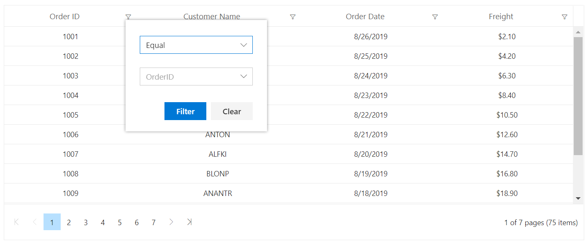

# Filter Menu in Blazor DataGrid Component

You can enable filter menu by setting the [Type](https://help.syncfusion.com/cr/blazor/Syncfusion.Blazor.Grids.GridFilterSettings.html#Syncfusion_Blazor_Grids_GridFilterSettings_Type) of **GridFilterSettings** as **Menu**. The filter menu UI will be rendered based on its column type, which allows you to filter data.

You can filter the records with different operators.

```cshtml
@using Syncfusion.Blazor.Grids

<SfGrid DataSource="@Orders" AllowFiltering="true" AllowPaging="true" Height="315">
  <GridFilterSettings Type ="Syncfusion.Blazor.Grids.FilterType.Menu"></GridFilterSettings>
   <GridColumns>
     <GridColumn Field=@nameof(Order.OrderID) HeaderText="Order ID" TextAlign="TextAlign.Right" Width="120"></GridColumn>
     <GridColumn Field=@nameof(Order.CustomerID) HeaderText="Customer Name" Width="150"></GridColumn>
     <GridColumn Field=@nameof(Order.OrderDate) HeaderText=" Order Date" Format="d" Type="ColumnType.Date" TextAlign="TextAlign.Right" Width="130"></GridColumn>
     <GridColumn Field=@nameof(Order.Freight) HeaderText="Freight" Format="C2" TextAlign="TextAlign.Right" Width="120"></GridColumn>
   </GridColumns>
</SfGrid>

@code{
    public List<Order> Orders { get; set; }

    protected override void OnInitialized()
    {
        Orders = Enumerable.Range(1, 75).Select(x => new Order()
        {
            OrderID = 1000 + x,
            CustomerID = (new string[] { "ALFKI", "ANANTR", "ANTON", "BLONP", "BOLID" })[new Random().Next(5)],
            Freight = 2.1 * x,
            OrderDate = (new DateTime[] { new DateTime(2010, 5, 1), new DateTime(2010, 5, 2), new DateTime(2010, 5, 3), })[new Random().Next(3)],
        }).ToList();
    }

    public class Order {
        public int? OrderID { get; set; }
        public string CustomerID { get; set; }
        public DateTime? OrderDate { get; set; }
        public double? Freight { get; set; }
    }
}

```

The following screenshot represents Menu filter


N> * [AllowFiltering](https://help.syncfusion.com/cr/blazor/Syncfusion.Blazor.Grids.SfGrid-1.html#Syncfusion_Blazor_Grids_SfGrid_1_AllowFiltering) must be set as true to enable filter menu.
<br/> * Setting [AllowFiltering](https://help.syncfusion.com/cr/blazor/Syncfusion.Blazor.Grids.GridColumn.html#Syncfusion_Blazor_Grids_GridColumn_AllowFiltering) property of **GridColumn** as false will prevent

## Custom component in filter menu

You can use **Menu** type filter in the datagrid. To do so, set the [Type](https://help.syncfusion.com/cr/blazor/Syncfusion.Blazor.Grids.GridFilterSettings.html#Syncfusion_Blazor_Grids_GridFilterSettings_Type) as **Menu** in the **GridFilterSettings**.

In the following sample, the [FilterTemplate](https://help.syncfusion.com/cr/blazor/Syncfusion.Blazor.Grids.GridColumn.html) property is used to add custom components to a particular column. To access the filtered values inside the FilterTemplate, you can use the implicit named parameter context. You can type cast the context as `PredicateModel<T>` to get filter values inside template.

```cshtml
@using Syncfusion.Blazor.Grids
@using Syncfusion.Blazor.DropDowns

<SfGrid DataSource="@Orders" AllowFiltering="true" AllowPaging="true" Height="315">
    <GridFilterSettings Type="Syncfusion.Blazor.Grids.FilterType.Menu"></GridFilterSettings>
    <GridColumns>
        <GridColumn Field=@nameof(Order.OrderID) HeaderText="Order ID" TextAlign="TextAlign.Center" Width="120">
            <FilterTemplate>
                <SfDropDownList Placeholder="OrderID" ID="OrderID" @bind-Value="@((context as PredicateModel<int?>).Value)" TItem="Order" TValue="int?" DataSource="@(Orders)">
                    <DropDownListFieldSettings Value="OrderID" Text="OrderID"></DropDownListFieldSettings>
                </SfDropDownList>
            </FilterTemplate>
        </GridColumn>
        <GridColumn Field=@nameof(Order.CustomerID) HeaderText="Customer Name" TextAlign="TextAlign.Center" Width="150"></GridColumn>
        <GridColumn Field=@nameof(Order.OrderDate) HeaderText=" Order Date" Format="d" Type="ColumnType.Date" TextAlign="TextAlign.Center" Width="130"></GridColumn>
        <GridColumn Field=@nameof(Order.Freight) HeaderText="Freight" Format="C2" TextAlign="TextAlign.Center" Width="120"></GridColumn>
    </GridColumns>
</SfGrid>

@code{

    public List<Order> Orders { get; set; }
    protected override void OnInitialized()
    {
        Orders = Enumerable.Range(1, 75).Select(x => new Order()
        {
            OrderID = 1000 + x,
            CustomerID = (new string[] { "ALFKI", "ANANTR", "ANTON", "BLONP", "BOLID" })[new Random().Next(5)],
            Freight = 2.1 * x,
            OrderDate = (new DateTime[] { new DateTime(2010, 5, 1), new DateTime(2010, 5, 2), new DateTime(2010, 5, 3), })[new Random().Next(3)],
        }).ToList();
    }

    public class Order
    {
        public int? OrderID { get; set; }
        public string CustomerID { get; set; }
        public DateTime? OrderDate { get; set; }
        public double? Freight { get; set; }
    }
}

```

The following screenshot shows filter menu using custom component



## Override default filter operators for menu filtering

The default filter operators for a GridColumn can be overridden by using the [OnActionBegin](https://help.syncfusion.com/cr/blazor/Syncfusion.Blazor.Grids.GridEvents-1.html#Syncfusion_Blazor_Grids_GridEvents_1_OnActionBegin) event of the grid. In the below code, we have overridden the filter operators for the `CustomerID` column.

```cshtml
@using Syncfusion.Blazor.Grids

<SfGrid DataSource="@Orders" AllowFiltering="true" AllowPaging="true" Height="315">
    <GridEvents OnActionBegin="ActionBeginHandler" TValue="Order"></GridEvents>
    <GridFilterSettings Type="Syncfusion.Blazor.Grids.FilterType.Menu"></GridFilterSettings>
    <GridColumns>
        <GridColumn Field=@nameof(Order.OrderID) HeaderText="Order ID" TextAlign="TextAlign.Right" Width="120"></GridColumn>
        <GridColumn Field=@nameof(Order.CustomerID) HeaderText="Customer Name" Width="150"></GridColumn>
        <GridColumn Field=@nameof(Order.OrderDate) HeaderText=" Order Date" Format="d" Type="ColumnType.Date" TextAlign="TextAlign.Right" Width="130"></GridColumn>
        <GridColumn Field=@nameof(Order.Freight) HeaderText="Freight" Format="C2" TextAlign="TextAlign.Right" Width="120"></GridColumn>
    </GridColumns>
</SfGrid>

@code{
    public List<Order> Orders { get; set; }

    public void ActionBeginHandler(ActionEventArgs<Order> Args)
    {
        if (Args.RequestType == Syncfusion.Blazor.Grids.Action.FilterBeforeOpen)
        {
            if (Args.ColumnName == "CustomerID")//Specify Field name
            {
                Args.FilterOperators = CustomerIDOperator;
            }
        }
    }

    public class Operators
    {
        public string Value { get; set; }
        public string Text { get; set; }
    }
    List<object> CustomerIDOperator = new List<object> {
        new Operators() { Text= "Equal", Value= "equal" },
        new Operators() { Text= "Contains", Value= "contains" }
    };


    protected override void OnInitialized()
    {
        Orders = Enumerable.Range(1, 75).Select(x => new Order()
        {
            OrderID = 1000 + x,
            CustomerID = (new string[] { "ALFKI", "ANANTR", "ANTON", "BLONP", "BOLID" })[new Random().Next(5)],
            Freight = 2.1 * x,
            OrderDate = (new DateTime[] { new DateTime(2010, 5, 1), new DateTime(2010, 5, 2), new DateTime(2010, 5, 3), })[new Random().Next(3)],
        }).ToList();
    }

    public class Order
    {
        public int? OrderID { get; set; }
        public string CustomerID { get; set; }
        public DateTime? OrderDate { get; set; }
        public double? Freight { get; set; }
    }
}

```

## Enable different filter for a column

You can use different filter types such as **Menu**,**CheckBox** and **Excel** filter in a same DataGrid. To do so, set the [Type](https://help.syncfusion.com/cr/blazor/Syncfusion.Blazor.Grids.GridFilterSettings.html#Syncfusion_Blazor_Grids_GridFilterSettings_Type) as **Menu** in **GridFilterSettings** and **CheckBox** in [Filter](https://help.syncfusion.com/cr/blazor/Syncfusion.Blazor.Grids.GridColumn.html) property of **GridColumn** component.

In the following sample, menu filter is enabled by default and checkbox filter is enabled for the CustomerID column using the [Filter](https://help.syncfusion.com/cr/blazor/Syncfusion.Blazor.Grids.GridColumn.html) property of **GridColumn** component.

```cshtml
@using Syncfusion.Blazor.Grids

<SfGrid DataSource="@Orders" AllowFiltering="true" AllowPaging="true" Height="315">
  <GridFilterSettings Type ="Syncfusion.Blazor.Grids.FilterType.Menu"></GridFilterSettings>
   <GridColumns>
     <GridColumn Field=@nameof(Order.OrderID) HeaderText="Order ID" TextAlign="TextAlign.Right" Width="120"></GridColumn>
     <GridColumn Field=@nameof(Order.CustomerID) HeaderText="Customer Name" FilterSettings="@(new FilterSettings{Type = Syncfusion.Blazor.Grids.FilterType.CheckBox })" Width="150"></GridColumn>
     <GridColumn Field=@nameof(Order.OrderDate) HeaderText=" Order Date" Format="d" Type="ColumnType.Date" TextAlign="TextAlign.Right" Width="130"></GridColumn>
     <GridColumn Field=@nameof(Order.Freight) HeaderText="Freight" Format="C2" TextAlign="TextAlign.Right" Width="120"></GridColumn>
   </GridColumns>
</SfGrid>

@code{
    public List<Order> Orders { get; set; }

    protected override void OnInitialized()
    {
        Orders = Enumerable.Range(1, 75).Select(x => new Order()
        {
            OrderID = 1000 + x,
            CustomerID = (new string[] { "ALFKI", "ANANTR", "ANTON", "BLONP", "BOLID" })[new Random().Next(5)],
            Freight = 2.1 * x,
            OrderDate = (new DateTime[] { new DateTime(2010, 5, 1), new DateTime(2010, 5, 2), new DateTime(2010, 5, 3), })[new Random().Next(3)],
        }).ToList();
    }

    public class Order {
        public int? OrderID { get; set; }
        public string CustomerID { get; set; }
        public DateTime? OrderDate { get; set; }
        public double? Freight { get; set; }
    }
}

```

The following screenshot represents CheckBox filter


### Limitations of using different filter types in different columns

The different filter types such as Excel, Menu, and Checkbox can be defined in different columns of the same Grid. However, you cannot use these filter types along with filterBar type (default filter type). Because the filterbar type requires UI level changes with other filter types. For all other filter types, icons will be rendered in the column header.

## Filtering using DateRangePicker

By default, for the date column in the filter menu, filtering action is performed based on a single date value selected from the `SfDatePicker` component. The Grid also can perform the filtering action between the range of date values by rendering the `SfDateRangePicker` component in the filter menu. This can be achieved by the filter template feature of the Grid.

In the following sample, the `SfDateRangePicker` component is rendered in the filter template. Using the `ValueChange` event of the `SfDateRangePicker`, get the start and end date values needed to perform the filtering action. In the [OnActionBegin](https://help.syncfusion.com/cr/blazor/Syncfusion.Blazor.Grids.GridEvents-1.html#Syncfusion_Blazor_Grids_GridEvents_1_OnActionBegin) event of the Grid, the default filter action is prevented by setting the `args.Cancel` as true. Then, perform the filtering action by setting the custom predicate values.

```cshtml
@using Syncfusion.Blazor.Calendars
@using Syncfusion.Blazor.Data
@using Syncfusion.Blazor.Grids

<SfGrid @ref="Grid" TValue="Order" AllowFiltering="true" AllowPaging="true" DataSource="@Orders">
    <GridEvents OnActionBegin="OnActionBegin" TValue="Order"></GridEvents>
    <GridFilterSettings Type="Syncfusion.Blazor.Grids.FilterType.Menu"></GridFilterSettings>
    <GridColumns>
        <GridColumn Field=@nameof(Order.OrderID) HeaderText="Order ID" IsPrimaryKey="true"
                    TextAlign ="TextAlign.Right" Width="120"></GridColumn>
        <GridColumn Field=@nameof(Order.CustomerID) HeaderText="Customer Name" Width="150"></GridColumn>
        <GridColumn Field=@nameof(Order.OrderDate) HeaderText=" Order Date" Format="MM/dd/yyyy hh:mm tt"
                    TextAlign="TextAlign.Right" Width="250">
            <FilterTemplate>
            @{
                <SfDateRangePicker Placeholder="Choose a Range" Width="500" ShowClearButton="true"
                                   @bind-StartDate="StartDate" @bind-EndDate="EndDate" TValue="DateTime">
                    <DateRangePickerEvents TValue="DateTime" ValueChange="ValueChangeHandler">
                    </DateRangePickerEvents>
                </SfDateRangePicker>
            }
            </FilterTemplate>
        </GridColumn>
        <GridColumn Field=@nameof(Order.Freight) HeaderText="Freight" Format="C2" 
                    TextAlign="TextAlign.Right" Width="120"></GridColumn>
    </GridColumns>
</SfGrid>

@code{
    private SfGrid<Order> Grid;
    public DateTime StartDate { get; set; }
    public DateTime EndDate { get; set; }
    public List<Order> Orders { get; set; }
    public async Task OnActionBegin(ActionEventArgs<Order> args)
    {
        if (args.RequestType == Syncfusion.Blazor.Grids.Action.Filtering && 
            args.CurrentFilteringColumn == "OrderDate")
        {
            args.Cancel = true; //cancel default filter action
            if (Grid.FilterSettings.Columns == null)
            {
                Grid.FilterSettings.Columns = new List<GridFilterColumn>();
            }
            if (Grid.FilterSettings.Columns.Count > 0)
            {
                Grid.FilterSettings.Columns.RemoveAll(c => c.Field == "OrderDate");
            }
            // Get all the Grid columns.
            var columns = await Grid.GetColumns();
            // Fetch the Uid of OrderDate column.
            string fUid = columns[2].Uid;
            Grid.FilterSettings.Columns.Add(new GridFilterColumn
            {
                Field = "OrderDate",
                Operator = Syncfusion.Blazor.Operator.GreaterThanOrEqual,
                Predicate = "and",
                Value = StartDate,
                Uid = fUid
            });
            Grid.FilterSettings.Columns.Add(new GridFilterColumn
            {
                Field = "OrderDate",
                Operator = Syncfusion.Blazor.Operator.LessThanOrEqual,
                Predicate = "and",
                Value = EndDate.AddDays(1).AddSeconds(-1),
                Uid = fUid
            });
            Grid.Refresh();
        }
    }
    public class Order
    {
        public int? OrderID { get; set; }
        public string CustomerID { get; set; }
        public DateTime? OrderDate { get; set; }
        public double? Freight { get; set; }
    }
    protected override void OnInitialized()
    {
        Orders = Enumerable.Range(1, 75).Select(x => new Order()
        {
            OrderID = 1000 + x,
            CustomerID = (new string[] { "ALFKI", "ANANTR", "ANTON", "BLONP", "BOLID" })[new Random().Next(5)],
            Freight = 2.1 * x,
            OrderDate = DateTime.Now.AddDays(-x),
        }).ToList();
    }
    public void ValueChangeHandler(RangePickerEventArgs<DateTime> args)
    {
        StartDate = args.StartDate;
        EndDate = args.EndDate;
    }
}
```

N> [View Sample in GitHub.](https://github.com/SyncfusionExamples/blazor-datagrid-filtering-using-date-range-picker)

## Filter by multiple keywords using filter menu

By default, the filtering action is performed based on the single value selected from the built-in component of the filter menu dialog. Now the DataGrid has the option to perform filtering actions based on multiple values. This can be achieved by using the [FilterTemplate](https://help.syncfusion.com/cr/blazor/Syncfusion.Blazor.Grids.GridColumn.html#Syncfusion_Blazor_Grids_GridColumn_FilterTemplate) feature and [FilterByColumnAsync](https://help.syncfusion.com/cr/blazor/Syncfusion.Blazor.Grids.SfGrid-1.html#Syncfusion_Blazor_Grids_SfGrid_1_FilterByColumnAsync_System_String_System_String_System_Object_System_String_System_Nullable_System_Boolean__System_Nullable_System_Boolean__System_Object_System_Object_) method of the Grid.

In the following sample, the MultiSelect component is rendered in the filter menu of the Customer Name column. Using the `ValueChange` event of `SfMultiSelect`, the selected values from the multiselect dropdown can be retrieved as a list. In the [OnActionBegin](https://help.syncfusion.com/cr/blazor/Syncfusion.Blazor.Grids.GridEvents-1.html#Syncfusion_Blazor_Grids_GridEvents_1_OnActionBegin) event of the Grid, when `RequestType` is `Filtering`, the list(selected values) can be passed to the `FilterByColumnAsync` method to get the filtered records.

```cshtml
@using Syncfusion.Blazor.Grids
@using Syncfusion.Blazor.DropDowns

<SfGrid @ref="@Grid" DataSource="@Orders" AllowFiltering="true" AllowPaging="true" Height="315">
    <GridFilterSettings Type="Syncfusion.Blazor.Grids.FilterType.Menu"></GridFilterSettings>
    <GridEvents OnActionBegin="OnActionBegin" TValue="Order"></GridEvents> 
    <GridColumns>
        <GridColumn Field=@nameof(Order.OrderID) HeaderText="Order ID" TextAlign="TextAlign.Right" Width="120"></GridColumn>
        <GridColumn Field=@nameof(Order.CustomerID) HeaderText="Customer Name" Width="150">
            <FilterTemplate>
                <SfMultiSelect TValue="string[]" Placeholder="Customer" Value="@FilteredValues.ToArray()" ShowSelectAll="true" Mode="VisualMode.CheckBox" TItem="Data" DataSource="@Dropdown">
                    <MultiSelectFieldSettings Value="CustomerID" Text="CustomerID" ></MultiSelectFieldSettings>
                    <MultiSelectEvents ValueChange="OnChange" TValue="string[]" TItem="Data"></MultiSelectEvents>
                </SfMultiSelect>
            </FilterTemplate>
        </GridColumn>
        <GridColumn Field=@nameof(Order.OrderDate) HeaderText=" Order Date" Format="d" Type="ColumnType.Date" TextAlign="TextAlign.Right" Width="130"></GridColumn>
        <GridColumn Field=@nameof(Order.Freight) HeaderText="Freight" Format="C2" TextAlign="TextAlign.Right" Width="120"></GridColumn>
    </GridColumns>
</SfGrid>

@code{
    SfGrid<Order> Grid;
    public List<Order> Orders { get; set; }
    List<string> FilteredValues = new List<string>();
    bool IsFilterValueChange { get; set; }
    protected override void OnInitialized()
    {
        Orders = Enumerable.Range(1, 75).Select(x => new Order()
        {
            OrderID = 1000 + x,
            CustomerID = (new string[] { "ALFKI", "ANANTR", "ANTON", "BLONP", "BOLID" })[new Random().Next(5)],
            Freight = 2.1 * x,
            OrderDate = (new DateTime[] { new DateTime(2010, 5, 1), new DateTime(2010, 5, 2), new DateTime(2010, 5, 3), })[new Random().Next(3)],
        }).ToList();
    }
    public class Data
    {
        public string CustomerID { get; set; }
    }
    List<Data> Dropdown = new List<Data>
    {
        new Data() { CustomerID= "ANTON" },
        new Data() { CustomerID= "ANANTR" },
        new Data() { CustomerID= "ALFKI" },
        new Data() { CustomerID= "BOLID" },
        new Data() { CustomerID= "BLONP" },
    };
    public class Order
    {
        public int? OrderID { get; set; }
        public string CustomerID { get; set; }
        public DateTime? OrderDate { get; set; }
        public double? Freight { get; set; }
    }
    public void OnChange(MultiSelectChangeEventArgs<string[]> args)
    {
        if(args.Value?.Length > 0)
        {
            FilteredValues = args.Value.ToList();
            IsFilterValueChange = true;
        } 
        else
        {
            FilteredValues = new List<string>();
            IsFilterValueChange = true; 
        }
    }
    public void OnActionBegin(ActionEventArgs<Order> Args) 
    { 
        if (Args.RequestType == Syncfusion.Blazor.Grids.Action.Filtering) 
        {
            if (IsFilterValueChange)
            {
                IsFilterValueChange = false;
                Args.Cancel = true;
                Grid.ClearFilteringAsync(); 
                Grid.FilterByColumnAsync("CustomerID", "equal", FilteredValues, "or");
            }
            if (Args.CurrentFilteringColumn == null)
            {
                FilteredValues = new List<string>();
            }
        } 
    } 
}
```

N> [View Sample in GitHub.](https://github.com/SyncfusionExamples/blazor-datagrid-filter-by-multiple-keywords-using-filter-menu)


## To hide the operator dropdown in the Menu filter

To hide the operator dropdown in the menu filter of the Syncfusion Blazor Grid, the following CSS can be used to override the styling of the **.e-flm_optrdiv** class

```css
    .e-flm_optrdiv {
        display: none;
    }

```

Refer to the following example.




@using Syncfusion.Blazor.Grids

<SfGrid DataSource="@GridData" AllowFiltering="true" Height="267px">
    <GridFilterSettings Type="Syncfusion.Blazor.Grids.FilterType.Menu"></GridFilterSettings>
    <GridColumns>
        <GridColumn Field=@nameof(OrderData.OrderID) HeaderText="Order ID" TextAlign="Syncfusion.Blazor.Grids.TextAlign.Right" Width="90"></GridColumn>
        <GridColumn Field=@nameof(OrderData.CustomerID) HeaderText="Customer ID" Width="100"></GridColumn>
        <GridColumn Field=@nameof(OrderData.ShipCity) HeaderText="Ship City" Width="100"></GridColumn>
        <GridColumn Field=@nameof(OrderData.ShipName) HeaderText="Ship Name" Width="120"></GridColumn>
    </GridColumns>
</SfGrid>

<style>
    .e-flm_optrdiv {
        display: none;
    }
</style>

@code {
    public List<OrderData> GridData { get; set; }


    protected override void OnInitialized()
    {
        GridData = OrderData.GetAllRecords();
    }

}


 public class OrderData
    {
        public static List<OrderData> Orders = new List<OrderData>();


        public OrderData()
        {

        }
        public OrderData(int? OrderID, string CustomerID, string ShipCity, string ShipName)
        {
            this.OrderID = OrderID;
            this.CustomerID = CustomerID;
            this.ShipCity = ShipCity;
            this.ShipName = ShipName;

        }

        public static List<OrderData> GetAllRecords()
        {
            if (Orders.Count() == 0)
            {
                int code = 10;
                for (int i = 1; i < 2; i++)
                {
                    Orders.Add(new OrderData(10248, "VINET", "Reims", "Vins et alcools Chevali"));
                    Orders.Add(new OrderData(10249, "TOMSP", "Münster", "Toms Spezialitäten"));
                    Orders.Add(new OrderData(10250, "HANAR", "Rio de Janeiro", "Hanari Carnes"));
                    Orders.Add(new OrderData(10251, "VICTE", "Lyon", "Victuailles en stock"));
                    Orders.Add(new OrderData(10252, "SUPRD", "Charleroi", "Suprêmes délices"));
                    Orders.Add(new OrderData(10253, "HANAR", "Lyon", "Hanari Carnes"));
                    Orders.Add(new OrderData(10254, "CHOPS", "Rio de Janeiro", "Chop-suey Chinese"));
                    Orders.Add(new OrderData(10255, "RICSU", "Münster", "Richter Supermarkt"));
                    Orders.Add(new OrderData(10256, "WELLI", "Reims", "Wellington Import"));
                    code += 5;
                }
            }
            return Orders;
        }

        public int? OrderID { get; set; }
        public string CustomerID { get; set; }
        public string ShipCity { get; set; }
        public string ShipName { get; set; }
    }




