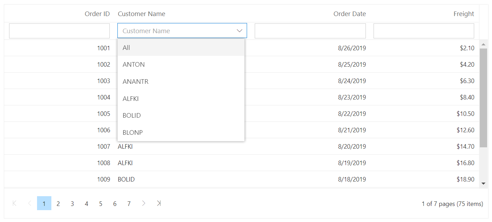
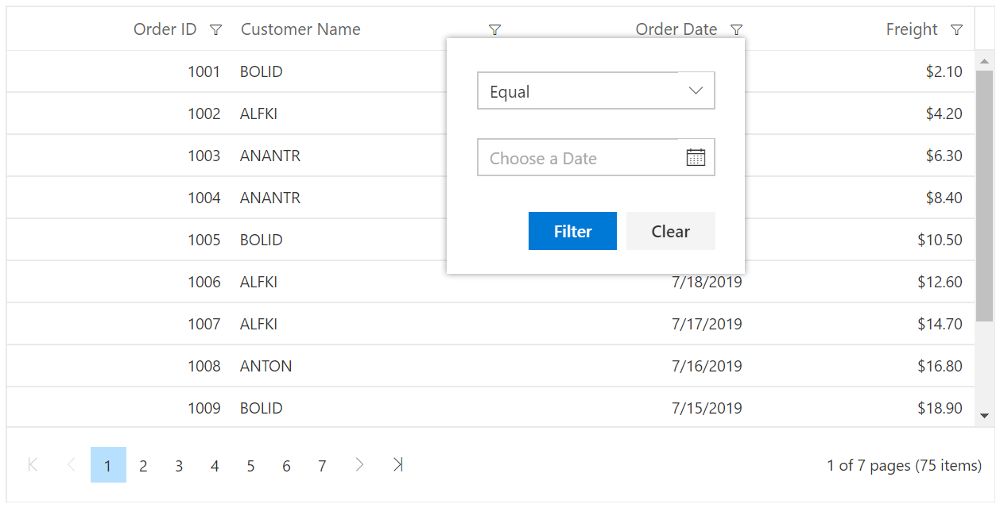
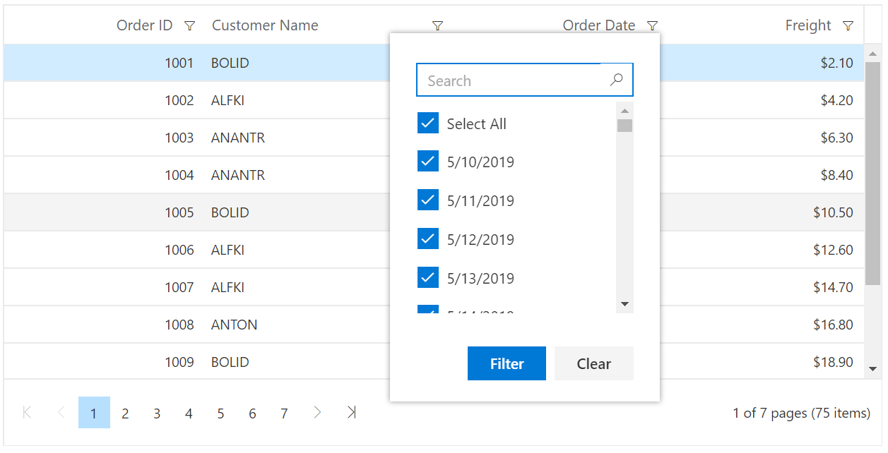
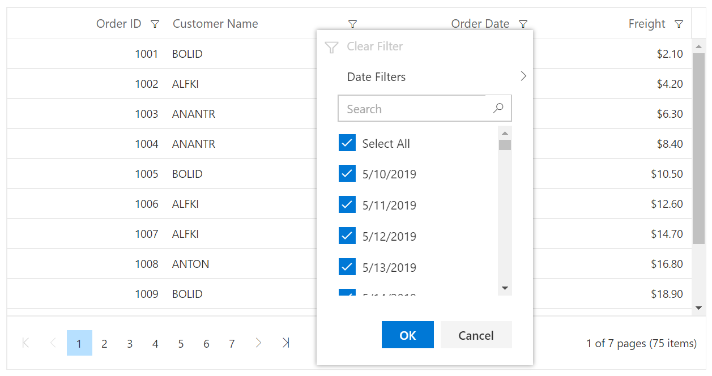

# Filtering in Blazor DataGrid Component

Filtering allows you to view particular records based on filter criteria. To enable filtering in the DataGrid, set the [AllowFiltering](https://help.syncfusion.com/cr/blazor/Syncfusion.Blazor.Grids.SfGrid-1.html#Syncfusion_Blazor_Grids_SfGrid_1_AllowFiltering) to true. Filtering options can be configured through [GridFilterSettings](https://help.syncfusion.com/cr/blazor/Syncfusion.Blazor.Grids.SfGrid-1.html#Syncfusion_Blazor_Grids_SfGrid_1_FilterSettings) component.

```cshtml
@using Syncfusion.Blazor.Grids

<SfGrid DataSource="@Orders" AllowFiltering="true" AllowPaging="true">
    <GridColumns>
        <GridColumn Field=@nameof(Order.OrderID) HeaderText="Order ID" TextAlign="TextAlign.Right" Width="120"></GridColumn>
        <GridColumn Field=@nameof(Order.CustomerID) HeaderText="Customer Name" Width="150"></GridColumn>
        <GridColumn Field=@nameof(Order.OrderDate) HeaderText=" Order Date" Format="d" Type="ColumnType.Date" TextAlign="TextAlign.Right" Width="130"></GridColumn>
        <GridColumn Field=@nameof(Order.Freight) HeaderText="Freight" Format="C2" TextAlign="TextAlign.Right" Width="120"></GridColumn>
    </GridColumns>
</SfGrid>

@code{
    public List<Order> Orders { get; set; }

    protected override void OnInitialized()
    {
        Orders = Enumerable.Range(1, 75).Select(x => new Order()
        {
            OrderID = 1000 + x,
            CustomerID = (new string[] { "ALFKI", "ANANTR", "ANTON", "BLONP", "BOLID" })[new Random().Next(5)],
            Freight = 2.1 * x,
            OrderDate = (new DateTime[] { new DateTime(2010, 5, 1), new DateTime(2010, 5, 2), new DateTime(2010, 5, 3), })[new Random().Next(3)],
        }).ToList();
    }

    public class Order
    {
        public int? OrderID { get; set; }
        public string CustomerID { get; set; }
        public DateTime? OrderDate { get; set; }
        public double? Freight { get; set; }
    }
}
```

The following screenshot shows filtering using FilterBar


> * You can apply and clear filtering by using **FilterByColumn** and **ClearFiltering** methods.
> * To disable filtering for a particular column, set [AllowFiltering](https://help.syncfusion.com/cr/blazor/Syncfusion.Blazor.Grids.GridColumn.html#Syncfusion_Blazor_Grids_GridColumn_AllowFiltering) property of **GridColumn** as false.

## Initial filter

To apply the filter at initial rendering, set the filter **Predicate** object in [Columns](https://help.syncfusion.com/cr/blazor/Syncfusion.Blazor.Grids.GridFilterSettings.html#Syncfusion_Blazor_Grids_GridFilterSettings_Columns) property of **GridFilterSettings** component.

```cshtml
@using Syncfusion.Blazor.Grids

<SfGrid DataSource="@Orders" AllowFiltering="true">
    <GridFilterSettings>
        <GridFilterColumns>
            <GridFilterColumn Field = "CustomerID" MatchCase =false Operator = "Operator.StartsWith" Predicate = "and" Value = "@val" ></GridFilterColumn>
        </GridFilterColumns>
    </GridFilterSettings>
    <GridColumns>
        <GridColumn Field=@nameof(Order.OrderID) HeaderText="Order ID" TextAlign="TextAlign.Right" Width="120"></GridColumn>
        <GridColumn Field=@nameof(Order.CustomerID) HeaderText="Customer Name" Width="150"></GridColumn>
        <GridColumn Field=@nameof(Order.OrderDate) HeaderText=" Order Date" Format="d" Type="ColumnType.Date" TextAlign="TextAlign.Right" Width="130"></GridColumn>
        <GridColumn Field=@nameof(Order.Freight) HeaderText="Freight" Format="C2" TextAlign="TextAlign.Right" Width="120"></GridColumn>
    </GridColumns>
</SfGrid>

@code{
    public List<Order> Orders { get; set; }
    public string val="ANANTR";

    protected override void OnInitialized()
    {
        Orders = Enumerable.Range(1, 75).Select(x => new Order()
        {
            OrderID = 1000 + x,
            CustomerID = (new string[] { "ALFKI", "ANANTR", "ANTON", "BLONP", "BOLID" })[new Random().Next(5)],
            Freight = 2.1 * x,
            OrderDate = (new DateTime[] { new DateTime(2010, 5, 1), new DateTime(2010, 5, 2), new DateTime(2010, 5, 3), })[new Random().Next(3)]
        }).ToList();
    }

    public class Order
    {
        public int? OrderID { get; set; }
        public string CustomerID { get; set; }
        public DateTime? OrderDate { get; set; }
        public double? Freight { get; set; }
    }
}
```

The following screenshot shows Initial filtering using FilterBar


## Filter operators

The filter operator for a column can be defined in the **Operator** in [Columns](https://help.syncfusion.com/cr/blazor/Syncfusion.Blazor.Grids.GridFilterSettings.html#Syncfusion_Blazor_Grids_GridFilterSettings_Columns) property of **GridFilterSettings** component.

The available operators and its supported data types are:

Operator |Description |Supported Types
-----|-----|-----
StartsWith |Checks whether the value begins with the specified value. |String
EndsWith |Checks whether the value ends with the specified value. |String
Contains |Checks whether the value contains the specified value. |String
Equal |Checks whether the value is equal to the specified value. |String &#124; Number &#124; Boolean &#124; Date
NotEqual |Checks for values not equal to the specified value. |String &#124; Number &#124; Boolean &#124; Date
GreaterThan |Checks whether the value is greater than the specified value. |Number &#124; Date
GreaterThanOrEqual |Checks whether a value is greater than or equal to the specified value. |Number &#124; Date
LessThan |Checks whether the value is less than the specified value. |Number &#124; Date
LessThanOrEqual |Checks whether the value is less than or equal to the specified value. |Number &#124; Date

> By default, the **Operator** value is **Equal** in [Columns](https://help.syncfusion.com/cr/blazor/Syncfusion.Blazor.Grids.GridFilterSettings.html#Syncfusion_Blazor_Grids_GridFilterSettings_Columns) property of **GridFilterSettings** component.

## Filter bar

By setting the [AllowFiltering](https://help.syncfusion.com/cr/blazor/Syncfusion.Blazor.Grids.SfGrid-1.html#Syncfusion_Blazor_Grids_SfGrid_1_AllowFiltering) to true, the filter bar row will render next to the header, which allows you to filter data. You can filter the records with different expressions depending upon the column type.

### Filter bar expressions

You can enter the following filter expressions (operators) manually in the filter bar.

Expression |Example |Description |Column Type
-----|-----|-----|-----
= |=value |StartsWith |Number
!= |!=value |NotEqual |Number
> |>value |GreaterThan |Number
< |<value |LessThan |Number
>= |>=value |GreaterThanOrEqual |Number
<=|<=value|LessThanOrEqual |Number
* |*value |StartsWith |String
% |%value |EndsWith |String
N/A |N/A | `equal` operator will always be used for date filter. |Date
N/A |N/A |`equal` operator will always be used for Boolean filter. |Boolean

```cshtml
@using Syncfusion.Blazor.Grids

<SfGrid DataSource="@Orders" AllowFiltering="true" AllowPaging="true">
   <GridPageSettings PageSize="5"></GridPageSettings>
   <GridColumns>
     <GridColumn Field=@nameof(Order.OrderID) HeaderText="Order ID" TextAlign="TextAlign.Right" Width="120"></GridColumn>
     <GridColumn Field=@nameof(Order.CustomerID) HeaderText="Customer Name" Width="150"></GridColumn>
     <GridColumn Field=@nameof(Order.OrderDate) HeaderText=" Order Date" Format="d" Type="ColumnType.Date" TextAlign="TextAlign.Right" Width="130"></GridColumn>
     <GridColumn Field=@nameof(Order.Freight) HeaderText="Freight" Format="C2" TextAlign="TextAlign.Right" Width="120"></GridColumn>
   </GridColumns>
</SfGrid>

@code{
    public List<Order> Orders { get; set; }

    protected override void OnInitialized()
    {
        Orders = Enumerable.Range(1, 75).Select(x => new Order()
        {
            OrderID = 1000 + x,
            CustomerID = (new string[] { "ALFKI", "ANANTR", "ANTON", "BLONP", "BOLID" })[new Random().Next(5)],
            Freight = 2.1 * x,
            OrderDate = (new DateTime[] { new DateTime(2010, 5, 1), new DateTime(2010, 5, 2), new DateTime(2010, 5, 3), })[new Random().Next(3)]
            }).ToList();
    }

    public class Order {
        public int? OrderID { get; set; }
        public string CustomerID { get; set; }
        public DateTime? OrderDate { get; set; }
        public double? Freight { get; set; }
    }
}
```

The following screenshot shows filtering using FilterBar


### Filter bar template with custom component

The [FilterTemplate](https://help.syncfusion.com/cr/blazor/Syncfusion.Blazor.Grids.GridColumn.html) property is used to add custom components to a particular column. The following sample shows the dropdown, used as a custom component in the Customer Name column.

To access the filtered values inside the FilterTemplate, you can use the implicit named parameter context. You can type cast the context as PredicateModel to get filter values inside template.

```csharp

@using Syncfusion.Blazor.Data
@using Syncfusion.Blazor.Grids
@using Syncfusion.Blazor.DropDowns
<SfGrid @ref="@Grid" DataSource="@Orders" AllowFiltering="true" AllowPaging="true" Height="315">
    <GridColumns>
        <GridColumn Field=@nameof(Order.OrderID) HeaderText="Order ID" TextAlign="TextAlign.Right" Width="120"></GridColumn>
        <GridColumn Field=@nameof(Order.CustomerID) HeaderText="Customer Name" Width="150">
            <FilterTemplate>
                <SfDropDownList PlaceHolder="Customer Name" ID="CustomerID" Value="@((string)(context as PredicateModel).Value)" DataSource="@Dropdown" TValue="string" TItem="Data">
                    <DropDownListEvents ValueChange="@Change" TItem="Data" TValue="string"></DropDownListEvents>
                    <DropDownListFieldSettings Value="CustomerID" Text="CustomerID"></DropDownListFieldSettings>
                </SfDropDownList>
            </FilterTemplate>
        </GridColumn>
        <GridColumn Field=@nameof(Order.OrderDate) HeaderText=" Order Date" Format="d" Type="ColumnType.Date" TextAlign="TextAlign.Right" Width="130"></GridColumn>
        <GridColumn Field=@nameof(Order.Freight) HeaderText="Freight" Format="C2" TextAlign="TextAlign.Right" Width="120"></GridColumn>
    </GridColumns>
</SfGrid>

@code{
    SfGrid<Order> Grid;
    public List<Order> Orders { get; set; }

    protected override void OnInitialized()
    {
        Orders = Enumerable.Range(1, 75).Select(x => new Order()
        {
            OrderID = 1000 + x,
            CustomerID = (new string[] { "ALFKI", "ANANTR", "ANTON", "BLONP", "BOLID" })[new Random().Next(5)],
            Freight = 2.1 * x,
            OrderDate = (new DateTime[] { new DateTime(2010, 5, 1), new DateTime(2010, 5, 2), new DateTime(2010, 5, 3), })[new Random().Next(3)],
        }).ToList();
    }

    public class Data
    {
        public string CustomerID { get; set; }
    }
    List<Data> Dropdown = new List<Data>
    {
        new Data() { CustomerID= "All" },
        new Data() { CustomerID= "ANTON" },
        new Data() { CustomerID= "ANANTR" },
        new Data() { CustomerID= "ALFKI" },
        new Data() { CustomerID= "BOLID" },
        new Data() { CustomerID= "BLONP" },
    };

    public class Order
    {
        public int? OrderID { get; set; }
        public string CustomerID { get; set; }
        public DateTime? OrderDate { get; set; }
        public double? Freight { get; set; }
    }

    public void Change(@Syncfusion.Blazor.DropDowns.ChangeEventArgs<string, Data> args)
    {
        if (args.Value == "All")
        {
            Grid.ClearFiltering();
        }
        else
        {
            Grid.FilterByColumn("CustomerID", "contains", args.Value);
        }
    }
}
```

The following screenshot shows filtering using custom component


### Change default filter operator

You can change the default filter operator by extending `FilterSettings` property in the column.

In the following sample, we have changed the default operator for CustomerID column as **contains** from **startswith**

```cshtml
@using Syncfusion.Blazor

<SfGrid @ref="@Grid" ID="Egrid" DataSource="@Orders" AllowFiltering="true" AllowPaging="true" Height="315">
    <GridColumns>
        <GridColumn Field=@nameof(Order.OrderID) HeaderText="Order ID" TextAlign="TextAlign.Center" Width="120"></GridColumn>
        <GridColumn Field=@nameof(Order.CustomerID) HeaderText="Customer Name" TextAlign="TextAlign.Center" Width="150" FilterSettings="@(new FilterSettings{ Operator = Operator.Contains })"></GridColumn>
        <GridColumn Field=@nameof(Order.OrderDate) HeaderText=" Order Date" Format="d" Type="ColumnType.Date" TextAlign="TextAlign.Center" Width="130"></GridColumn>
        <GridColumn Field=@nameof(Order.Freight) HeaderText="Freight" Format="C2" TextAlign="TextAlign.Center" Width="120"></GridColumn>
    </GridColumns>
</SfGrid>

@code{
    SfGrid<Order> Grid;
    public List<Order> Orders { get; set; }

    protected override void OnInitialized()
    {
        Orders = Enumerable.Range(1, 75).Select(x => new Order()
        {
            OrderID = 1000 + x,
            CustomerID = (new string[] { "ALFKI", "ANANTR", "ANTON", "BLONP", "BOLID" })[new Random().Next(5)],
            Freight = 2.1 * x,
            OrderDate = (new DateTime[] { new DateTime(2010, 5, 1), new DateTime(2010, 5, 2), new DateTime(2010, 5, 3), })[new Random().Next(3)],
        }).ToList();
    }

    public class Order
    {
        public int? OrderID { get; set; }
        public string CustomerID { get; set; }
        public DateTime? OrderDate { get; set; }
        public double? Freight { get; set; }
    }
}

```

The following screenshot represents Filter with change in default operator as contains


### Filter Modes

By default filter bar [Mode](https://help.syncfusion.com/cr/blazor/Syncfusion.Blazor.Grids.GridFilterSettings.html#Syncfusion_Blazor_Grids_GridFilterSettings_Mode) will be of OnEnter type. So we need to press the Enter key after typing a value in the filter bar.

You can also perform filtering operation without pressing Enter key in the filter bar by Setting the filter bar [Mode](https://help.syncfusion.com/cr/blazor/Syncfusion.Blazor.Grids.GridFilterSettings.html#Syncfusion_Blazor_Grids_GridFilterSettings_Mode) property as [Immediate](https://help.syncfusion.com/cr/blazor/Syncfusion.Blazor.Grids.FilterBarMode.html#Syncfusion_Blazor_Grids_FilterBarMode_Immediate).

The [ImmediateModeDelay](https://help.syncfusion.com/cr/blazor/Syncfusion.Blazor.Grids.GridFilterSettings.html#Syncfusion_Blazor_Grids_GridFilterSettings_ImmediateModeDelay) property of [GridFilterSettings](https://help.syncfusion.com/cr/blazor/Syncfusion.Blazor.Grids.SfGrid-1.html#Syncfusion_Blazor_Grids_SfGrid_1_FilterSettings) is used to define the time Grid has to wait for performing filter operation after completion of user typing word.

```cshtml
@using Syncfusion.Blazor.Grids

<SfGrid DataSource="@Orders" AllowFiltering="true" AllowPaging="true">
    <GridFilterSettings Mode="FilterBarMode.Immediate" ImmediateModeDelay="300"></GridFilterSettings>
    <GridColumns>
        <GridColumn Field=@nameof(Order.OrderID) HeaderText="Order ID" TextAlign="TextAlign.Right" Width="120"></GridColumn>
        <GridColumn Field=@nameof(Order.CustomerID) HeaderText="Customer Name" Width="150"></GridColumn>
        <GridColumn Field=@nameof(Order.OrderDate) HeaderText=" Order Date" Format="d" Type="ColumnType.Date" TextAlign="TextAlign.Right" Width="130"></GridColumn>
        <GridColumn Field=@nameof(Order.Freight) HeaderText="Freight" Format="C2" TextAlign="TextAlign.Right" Width="120"></GridColumn>
    </GridColumns>
</SfGrid>

@code{
    public List<Order> Orders { get; set; }

    protected override void OnInitialized()
    {
        Orders = Enumerable.Range(1, 75).Select(x => new Order()
        {
            OrderID = 1000 + x,
            CustomerID = (new string[] { "ALFKI", "ANANTR", "ANTON", "BLONP", "BOLID" })[new Random().Next(5)],
            Freight = 2.1 * x,
            OrderDate = (new DateTime[] { new DateTime(2010, 5, 1), new DateTime(2010, 5, 2), new DateTime(2010, 5, 3), })[new Random().Next(3)],
        }).ToList();
    }

    public class Order
    {
        public int? OrderID { get; set; }
        public string CustomerID { get; set; }
        public DateTime? OrderDate { get; set; }
        public double? Freight { get; set; }
    }
}

```

## Filter menu

You can enable filter menu by setting the [Type](https://help.syncfusion.com/cr/blazor/Syncfusion.Blazor.Grids.GridFilterSettings.html#Syncfusion_Blazor_Grids_GridFilterSettings_Type) of **GridFilterSettings** as **Menu**. The filter menu UI will be rendered based on its column type, which allows you to filter data.

You can filter the records with different operators.

```cshtml
@using Syncfusion.Blazor.Grids

<SfGrid DataSource="@Orders" AllowFiltering="true" AllowPaging="true" Height="315">
  <GridFilterSettings Type ="Syncfusion.Blazor.Grids.FilterType.Menu"></GridFilterSettings>
   <GridColumns>
     <GridColumn Field=@nameof(Order.OrderID) HeaderText="Order ID" TextAlign="TextAlign.Right" Width="120"></GridColumn>
     <GridColumn Field=@nameof(Order.CustomerID) HeaderText="Customer Name" Width="150"></GridColumn>
     <GridColumn Field=@nameof(Order.OrderDate) HeaderText=" Order Date" Format="d" Type="ColumnType.Date" TextAlign="TextAlign.Right" Width="130"></GridColumn>
     <GridColumn Field=@nameof(Order.Freight) HeaderText="Freight" Format="C2" TextAlign="TextAlign.Right" Width="120"></GridColumn>
   </GridColumns>
</SfGrid>

@code{
    public List<Order> Orders { get; set; }

    protected override void OnInitialized()
    {
        Orders = Enumerable.Range(1, 75).Select(x => new Order()
        {
            OrderID = 1000 + x,
            CustomerID = (new string[] { "ALFKI", "ANANTR", "ANTON", "BLONP", "BOLID" })[new Random().Next(5)],
            Freight = 2.1 * x,
            OrderDate = (new DateTime[] { new DateTime(2010, 5, 1), new DateTime(2010, 5, 2), new DateTime(2010, 5, 3), })[new Random().Next(3)],
        }).ToList();
    }

    public class Order {
        public int? OrderID { get; set; }
        public string CustomerID { get; set; }
        public DateTime? OrderDate { get; set; }
        public double? Freight { get; set; }
    }
}

```

The following screenshot represents Menu filter


> * [AllowFiltering](https://help.syncfusion.com/cr/blazor/Syncfusion.Blazor.Grids.SfGrid-1.html#Syncfusion_Blazor_Grids_SfGrid_1_AllowFiltering) must be set as true to enable filter menu.
> * Setting [AllowFiltering](https://help.syncfusion.com/cr/blazor/Syncfusion.Blazor.Grids.GridColumn.html#Syncfusion_Blazor_Grids_GridColumn_AllowFiltering) property of **GridColumn** as false will prevent

### Custom component in filter menu

You can use **Menu** type filter in the datagrid. To do so, set the [Type](https://help.syncfusion.com/cr/blazor/Syncfusion.Blazor.Grids.GridFilterSettings.html#Syncfusion_Blazor_Grids_GridFilterSettings_Type) as **Menu** in the **GridFilterSettings**.

In the following sample the [FilterTemplate](https://help.syncfusion.com/cr/blazor/Syncfusion.Blazor.Grids.GridColumn.html) property is used to add custom components to a particular column. To access the filtered values inside the FilterTemplate, you can use the implicit named parameter context. You can type cast the context as `PredicateModel<T>` to get filter values inside template.

```cshtml
@using Syncfusion.Blazor.Grids
@using Syncfusion.Blazor.DropDowns

<SfGrid DataSource="@Orders" AllowFiltering="true" AllowPaging="true" Height="315">
    <GridFilterSettings Type="Syncfusion.Blazor.Grids.FilterType.Menu"></GridFilterSettings>
    <GridColumns>
        <GridColumn Field=@nameof(Order.OrderID) HeaderText="Order ID" TextAlign="TextAlign.Center" Width="120">
            <FilterTemplate>
                <SfDropDownList Placeholder="OrderID" ID="OrderID" @bind-Value="@((context as PredicateModel<int?>).Value)" TItem="Order" TValue="int?" DataSource="@(Orders)">
                    <DropDownListFieldSettings Value="OrderID" Text="OrderID"></DropDownListFieldSettings>
                </SfDropDownList>
            </FilterTemplate>
        </GridColumn>
        <GridColumn Field=@nameof(Order.CustomerID) HeaderText="Customer Name" TextAlign="TextAlign.Center" Width="150"></GridColumn>
        <GridColumn Field=@nameof(Order.OrderDate) HeaderText=" Order Date" Format="d" Type="ColumnType.Date" TextAlign="TextAlign.Center" Width="130"></GridColumn>
        <GridColumn Field=@nameof(Order.Freight) HeaderText="Freight" Format="C2" TextAlign="TextAlign.Center" Width="120"></GridColumn>
    </GridColumns>
</SfGrid>

@code{

    public List<Order> Orders { get; set; }
    protected override void OnInitialized()
    {
        Orders = Enumerable.Range(1, 75).Select(x => new Order()
        {
            OrderID = 1000 + x,
            CustomerID = (new string[] { "ALFKI", "ANANTR", "ANTON", "BLONP", "BOLID" })[new Random().Next(5)],
            Freight = 2.1 * x,
            OrderDate = (new DateTime[] { new DateTime(2010, 5, 1), new DateTime(2010, 5, 2), new DateTime(2010, 5, 3), })[new Random().Next(3)],
        }).ToList();
    }

    public class Order
    {
        public int? OrderID { get; set; }
        public string CustomerID { get; set; }
        public DateTime? OrderDate { get; set; }
        public double? Freight { get; set; }
    }
}

```

The following screenshot shows filter menu using custom component


### Override default filter operators for Menu Filtering

The default filter operators for a GridColumn can be overridden by using the [OnActionBegin](https://help.syncfusion.com/cr/blazor/Syncfusion.Blazor.Grids.GridEvents-1.html#Syncfusion_Blazor_Grids_GridEvents_1_OnActionBegin) event of the grid. In the below code, we have overridden the filter operators for the `CustomerID` column.

```cshtml
@using Syncfusion.Blazor.Grids

<SfGrid DataSource="@Orders" AllowFiltering="true" AllowPaging="true" Height="315">
    <GridEvents OnActionBegin="ActionBeginHandler" TValue="Order"></GridEvents>
    <GridFilterSettings Type="Syncfusion.Blazor.Grids.FilterType.Menu"></GridFilterSettings>
    <GridColumns>
        <GridColumn Field=@nameof(Order.OrderID) HeaderText="Order ID" TextAlign="TextAlign.Right" Width="120"></GridColumn>
        <GridColumn Field=@nameof(Order.CustomerID) HeaderText="Customer Name" Width="150"></GridColumn>
        <GridColumn Field=@nameof(Order.OrderDate) HeaderText=" Order Date" Format="d" Type="ColumnType.Date" TextAlign="TextAlign.Right" Width="130"></GridColumn>
        <GridColumn Field=@nameof(Order.Freight) HeaderText="Freight" Format="C2" TextAlign="TextAlign.Right" Width="120"></GridColumn>
    </GridColumns>
</SfGrid>

@code{
    public List<Order> Orders { get; set; }

    public void ActionBeginHandler(ActionEventArgs<Order> Args)
    {
        if (Args.RequestType == Syncfusion.Blazor.Grids.Action.FilterBeforeOpen)
        {
            if (Args.ColumnName == "CustomerID")//Specify Field name
            {
                Args.FilterOperators = CustomerIDOperator;
            }
        }
    }

    public class Operators
    {
        public string Value { get; set; }
        public string Text { get; set; }
    }
    List<object> CustomerIDOperator = new List<object> {
        new Operators() { Text= "Equal", Value= "equal" },
        new Operators() { Text= "Contains", Value= "contains" }
    };


    protected override void OnInitialized()
    {
        Orders = Enumerable.Range(1, 75).Select(x => new Order()
        {
            OrderID = 1000 + x,
            CustomerID = (new string[] { "ALFKI", "ANANTR", "ANTON", "BLONP", "BOLID" })[new Random().Next(5)],
            Freight = 2.1 * x,
            OrderDate = (new DateTime[] { new DateTime(2010, 5, 1), new DateTime(2010, 5, 2), new DateTime(2010, 5, 3), })[new Random().Next(3)],
        }).ToList();
    }

    public class Order
    {
        public int? OrderID { get; set; }
        public string CustomerID { get; set; }
        public DateTime? OrderDate { get; set; }
        public double? Freight { get; set; }
    }
}

```

### Enable different filter for a column

You can use different filter types such as **Menu**,**CheckBox** and **Excel** filter in a same DataGrid. To do so, set the [Type](https://help.syncfusion.com/cr/blazor/Syncfusion.Blazor.Grids.GridFilterSettings.html#Syncfusion_Blazor_Grids_GridFilterSettings_Type) as **Menu** in **GridFilterSettings** and **CheckBox** in [Filter](https://help.syncfusion.com/cr/blazor/Syncfusion.Blazor.Grids.GridColumn.html) property of **GridColumn** component.

In the following sample menu filter is enabled by default and checkbox filter is enabled for the CustomerID column using the [Filter](https://help.syncfusion.com/cr/blazor/Syncfusion.Blazor.Grids.GridColumn.html) property of **GridColumn** component.

```cshtml
@using Syncfusion.Blazor.Grids

<SfGrid DataSource="@Orders" AllowFiltering="true" AllowPaging="true" Height="315">
  <GridFilterSettings Type ="Syncfusion.Blazor.Grids.FilterType.Menu"></GridFilterSettings>
   <GridColumns>
     <GridColumn Field=@nameof(Order.OrderID) HeaderText="Order ID" TextAlign="TextAlign.Right" Width="120"></GridColumn>
     <GridColumn Field=@nameof(Order.CustomerID) HeaderText="Customer Name" FilterSettings="@(new FilterSettings{Type = Syncfusion.Blazor.Grids.FilterType.CheckBox })" Width="150"></GridColumn>
     <GridColumn Field=@nameof(Order.OrderDate) HeaderText=" Order Date" Format="d" Type="ColumnType.Date" TextAlign="TextAlign.Right" Width="130"></GridColumn>
     <GridColumn Field=@nameof(Order.Freight) HeaderText="Freight" Format="C2" TextAlign="TextAlign.Right" Width="120"></GridColumn>
   </GridColumns>
</SfGrid>

@code{
    public List<Order> Orders { get; set; }

    protected override void OnInitialized()
    {
        Orders = Enumerable.Range(1, 75).Select(x => new Order()
        {
            OrderID = 1000 + x,
            CustomerID = (new string[] { "ALFKI", "ANANTR", "ANTON", "BLONP", "BOLID" })[new Random().Next(5)],
            Freight = 2.1 * x,
            OrderDate = (new DateTime[] { new DateTime(2010, 5, 1), new DateTime(2010, 5, 2), new DateTime(2010, 5, 3), })[new Random().Next(3)],
        }).ToList();
    }

    public class Order {
        public int? OrderID { get; set; }
        public string CustomerID { get; set; }
        public DateTime? OrderDate { get; set; }
        public double? Freight { get; set; }
    }
}

```

The following screenshot represents CheckBox filter


## CheckBox Filter

You can enable the CheckBox filter to show a list of possible distinct filter values for a column. Checkbox list sorted by ascending order to display the data source as readable.

To enable the checkbox list filtering in the DataGrid component by setting the [Type](https://help.syncfusion.com/cr/blazor/Syncfusion.Blazor.Grids.GridFilterSettings.html#Syncfusion_Blazor_Grids_GridFilterSettings_Type) as **CheckBox**.

CheckBox filter contains an option such as searching and Clear filter.

```cshtml
@using Syncfusion.Blazor.Grids

<SfGrid DataSource="@Orders" AllowFiltering="true" AllowPaging="true" Height="375">
    <GridFilterSettings Type="Syncfusion.Blazor.Grids.FilterType.CheckBox"></GridFilterSettings>
    <GridColumns>
        <GridColumn Field=@nameof(Order.OrderID) HeaderText="Order ID" TextAlign="TextAlign.Right" Width="120"></GridColumn>
        <GridColumn Field=@nameof(Order.CustomerID) HeaderText="Customer Name" Width="150"></GridColumn>
        <GridColumn Field=@nameof(Order.OrderDate) HeaderText=" Order Date" Format="d" Type="ColumnType.Date" TextAlign="TextAlign.Right" Width="130"></GridColumn>
        <GridColumn Field=@nameof(Order.Freight) HeaderText="Freight" Format="C2" TextAlign="TextAlign.Right" Width="120"></GridColumn>
    </GridColumns>
</SfGrid>

@code{
    public List<Order> Orders { get; set; }

    protected override void OnInitialized()
    {
        Orders = Enumerable.Range(1, 75).Select(x => new Order()
        {
            OrderID = 1000 + x,
            CustomerID = (new string[] { "ALFKI", "ANANTR", "ANTON", "BLONP", "BOLID" })[new Random().Next(5)],
            Freight = 2.1 * x,
            OrderDate = (new DateTime[] { new DateTime(2010, 5, 1), new DateTime(2010, 5, 2), new DateTime(2010, 5, 3), })[new Random().Next(3)],
        }).ToList();
    }

    public class Order
    {
        public int? OrderID { get; set; }
        public string CustomerID { get; set; }
        public DateTime? OrderDate { get; set; }
        public double? Freight { get; set; }
    }
}

```

The following screenshot represents Checkbox filter


## Excel like filter

You can enable Excel like filter by defining [Type](https://help.syncfusion.com/cr/blazor/Syncfusion.Blazor.Grids.GridFilterSettings.html#Syncfusion_Blazor_Grids_GridFilterSettings_Type) as **Excel**.The excel menu contains an option such as Sorting, Clear filter, Sub menu for advanced filtering.

```cshtml
@using Syncfusion.Blazor.Grids

<SfGrid DataSource="@Orders" AllowFiltering="true">
  <GridFilterSettings Type ="Syncfusion.Blazor.Grids.FilterType.Excel"></GridFilterSettings>
   <GridColumns>
     <GridColumn Field=@nameof(Order.OrderID) HeaderText="Order ID" TextAlign="TextAlign.Right" Width="120"></GridColumn>
     <GridColumn Field=@nameof(Order.CustomerID) HeaderText="Customer Name" Width="150"></GridColumn>
     <GridColumn Field=@nameof(Order.OrderDate) HeaderText=" Order Date" Format="d" Type="ColumnType.Date" TextAlign="TextAlign.Right" Width="130"></GridColumn>
     <GridColumn Field=@nameof(Order.Freight) HeaderText="Freight" Format="C2" TextAlign="TextAlign.Right" Width="120"></GridColumn>
   </GridColumns>
</SfGrid>

@code{
    public List<Order> Orders { get; set; }

    protected override void OnInitialized()
    {
        Orders = Enumerable.Range(1, 75).Select(x => new Order()
        {
            OrderID = 1000 + x,
            CustomerID = (new string[] { "ALFKI", "ANANTR", "ANTON", "BLONP", "BOLID" })[new Random().Next(5)],
            Freight = 2.1 * x,
            OrderDate = (new DateTime[] { new DateTime(2010, 5, 1), new DateTime(2010, 5, 2), new DateTime(2010, 5, 3), })[new Random().Next(3)],
        }).ToList();
    }

    public class Order {
        public int? OrderID { get; set; }
        public string CustomerID { get; set; }
        public DateTime? OrderDate { get; set; }
        public double? Freight { get; set; }
    }
}

```

The following screenshot represents Excel filter


The following screenshot represents Custom filter in Excel filter


### Filter Item template

This **`FilterItemTemplate`** helps to you customize the each CheckBox list element/value for display purpose. To access the checkbox list values inside the `FilterItemTemplate`, you can use the implicit named parameter context. You can type cast the context as [FilterItemTemplateContext](https://help.syncfusion.com/cr/blazor/Syncfusion.Blazor.Grids.FilterItemTemplateContext.html) to get list values inside template.

```cshtml
@using Syncfusion.Blazor.Grids

<SfGrid DataSource="@Orders" AllowFiltering="true" AllowPaging="true" Height="375">
    <GridFilterSettings Type="Syncfusion.Blazor.Grids.FilterType.CheckBox"></GridFilterSettings>
    <GridColumns>
        <GridColumn Field=@nameof(Order.OrderID) HeaderText="Order ID" TextAlign="TextAlign.Right" Width="120"></GridColumn>
        <GridColumn Field=@nameof(Order.CustomerID) HeaderText="Customer Name" Width="150">
            <FilterItemTemplate>
                @{
                    var filterContext = (context as FilterItemTemplateContext);
                    var itemTemplateValue = "Textof(" + filterContext.Value + ")";
                }
                @itemTemplateValue
            </FilterItemTemplate>
        </GridColumn>
        <GridColumn Field=@nameof(Order.OrderDate) HeaderText=" Order Date" Format="d" Type="ColumnType.Date" TextAlign="TextAlign.Right" Width="130"></GridColumn>
        <GridColumn Field=@nameof(Order.Freight) HeaderText="Freight" Format="C2" TextAlign="TextAlign.Right" Width="120"></GridColumn>
    </GridColumns>
</SfGrid>

@code{
    public List<Order> Orders { get; set; }

    protected override void OnInitialized()
    {
        Orders = Enumerable.Range(1, 75).Select(x => new Order()
        {
            OrderID = 1000 + x,
            CustomerID = (new string[] { "ALFKI", "ANANTR", "ANTON", "BLONP", "BOLID" })[new Random().Next(5)],
            Freight = 2.1 * x,
            OrderDate = (new DateTime[] { new DateTime(2010, 5, 1), new DateTime(2010, 5, 2), new DateTime(2010, 5, 3), })[new Random().Next(3)],
        }).ToList();
    }

    public class Order
    {
        public int? OrderID { get; set; }
        public string CustomerID { get; set; }
        public DateTime? OrderDate { get; set; }
        public double? Freight { get; set; }
    }
}
```

The following screenshot represents Filter Item template


> You can refer to our [Blazor DataGrid](https://www.syncfusion.com/blazor-components/blazor-datagrid) feature tour page for its groundbreaking feature representations. You can also explore our [Blazor DataGrid example](https://blazor.syncfusion.com/demos/datagrid/overview?theme=bootstrap4) to understand how to present and manipulate data.

<!-- Diacritics

By default, datagrid ignores diacritic characters while filtering. To include diacritic characters, set the [`GridFilterSettings`](https://help.syncfusion.com/cr/blazor/Syncfusion.Blazor.Grids.SfGrid-1.html#Syncfusion_Blazor_Grids_SfGrid_1_FilterSettings) [`IgnoreAccent`](https://help.syncfusion.com/cr/blazor/Syncfusion.Blazor.Grids.GridFilterSettings.html) property to be true.
In the following sample, type aero in [`CustomerID`] column to filter diacritic characters.

```cshtml
@using Syncfusion.Blazor

<SfGrid @ref="@Grid" DataSource="@Orders" AllowFiltering="true" AllowPaging="true" Height="315">
    <GridFilterSettings IgnoreAccent="true"></GridFilterSettings>
     <GridColumns>
         <GridColumn Field=@nameof(Order.OrderID) HeaderText="Order ID" TextAlign="TextAlign.Center" Width="120"></GridColumn>
         <GridColumn Field=@nameof(Order.CustomerID) HeaderText="Customer Name" TextAlign="TextAlign.Center" Width="150"></GridColumn>
         <GridColumn Field=@nameof(Order.OrderDate) HeaderText=" Order Date" Format="d" Type="date" TextAlign="TextAlign.Center" Width="130"></GridColumn>
         <GridColumn Field=@nameof(Order.Freight) HeaderText="Freight" Format="C2" TextAlign="TextAlign.Center" Width="120"></GridColumn>
     </GridColumns>
</SfGrid>

@code{
    SfGrid<Order> Grid;
    public List<Order> Orders { get; set; }

    protected override void OnInitialized()
    {
        Orders = Enumerable.Range(1, 5).Select(x => new Order()
        {
            OrderID = 1000 + x,
            CustomerID = (new string[] { "Aeróbics", "Aerógrafía en Agua", "Aerografía", "Aeromodelaje", "Ãerografía" })[new Random().Next(5)],
            Freight = 2.1 * x,
                        OrderDate = (new DateTime[] { new DateTime(2010, 5, 1), new DateTime(2010, 5, 2), new DateTime(2010, 5, 3), })[new Random().Next(3)],
        }).ToList();
    }

    public class Order
    {
        public int? OrderID { get; set; }
        public string CustomerID { get; set; }
        public DateTime? OrderDate { get; set; }
        public double? Freight { get; set; }
        public List<PredicateModel> Columns { get; set; }
    }
  }
} -->