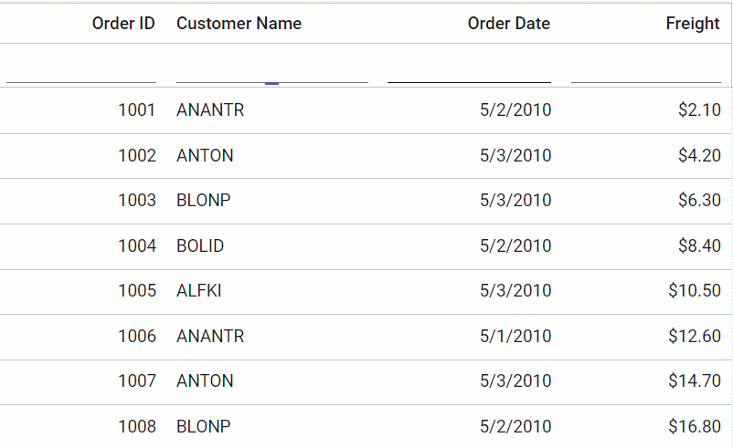
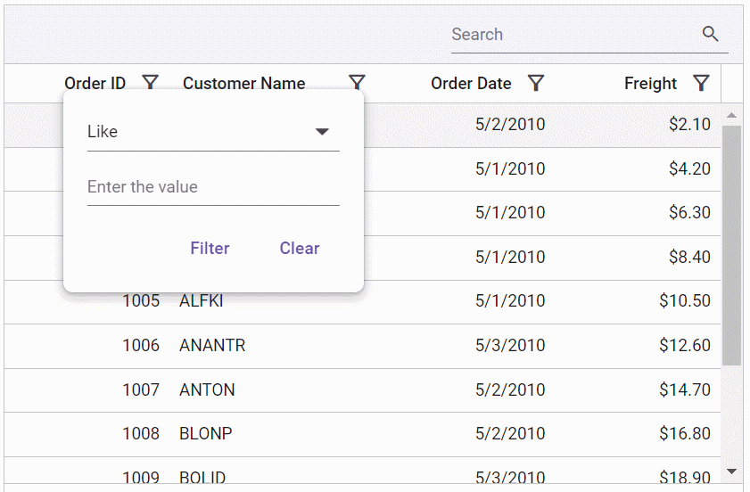

# Filtering in Blazor DataGrid

Filtering is a powerful feature in the Syncfusion<sup style="font-size:70%">&reg;</sup> Blazor DataGrid that enables selective viewing of data based on specific criteria. It allows narrowing down large datasets to focus on relevant information, thereby enhancing data analysis and decision-making.

## Enable filtering

To enable filtering in the DataGrid, set the [AllowFiltering](https://help.syncfusion.com/cr/blazor/Syncfusion.Blazor.Grids.SfGrid-1.html#Syncfusion_Blazor_Grids_SfGrid_1_AllowFiltering) property to **true**. Once enabled, configure filtering behavior and appearance using the [GridFilterSettings](https://help.syncfusion.com/cr/blazor/Syncfusion.Blazor.Grids.SfGrid-1.html#Syncfusion_Blazor_Grids_SfGrid_1_FilterSettings) property.




@using Syncfusion.Blazor.Grids

<SfGrid @ref="Grid" DataSource="@GridData" AllowFiltering="true" AllowSorting="true" AllowPaging="true">
    <GridPageSettings PageSize="6"></GridPageSettings>
    <GridColumns>
        <GridColumn Field=@nameof(OrderData.OrderID) HeaderText="Order ID" TextAlign="Syncfusion.Blazor.Grids.TextAlign.Right" Width="90"></GridColumn>
        <GridColumn Field=@nameof(OrderData.CustomerID) HeaderText="Customer ID" Width="120"></GridColumn>
        <GridColumn Field=@nameof(OrderData.Freight) HeaderText="Freight" Format="C2" TextAlign="Syncfusion.Blazor.Grids.TextAlign.Right" Width="90"></GridColumn>
        <GridColumn Field=@nameof(OrderData.OrderDate) HeaderText=" Order Date" Format="d"  TextAlign="Syncfusion.Blazor.Grids.TextAlign.Right" Width="120"></GridColumn>
    </GridColumns>
</SfGrid>

@code {
    public List<OrderData> GridData { get; set; }
    SfGrid<OrderData>? Grid { get; set; }

    protected override void OnInitialized()
    {
        GridData = OrderData.GetAllRecords();
    }
}




 
public class OrderData
{
    public static List<OrderData> Orders = new List<OrderData>();
    public OrderData(){}
    public OrderData(int? OrderID,string CustomerID, DateTime? OrderDate, double? Freight)
    {
        this.OrderID = OrderID;    
        this.CustomerID = CustomerID;
        this.OrderDate = OrderDate;
        this.Freight = Freight;            
    }

    public static List<OrderData> GetAllRecords()
    {
        if (Orders.Count() == 0)
        {
            int OrderID = 10248;
            for (int i = 1; i < 3; i++)
            {
                Orders.Add(new OrderData(OrderID+1, "VINET", new DateTime(1996, 07, 06), 32.38));
                Orders.Add(new OrderData(OrderID+2, "TOMSP", new DateTime(1996, 07, 06), 11.61));
                Orders.Add(new OrderData(OrderID+3, "HANAR", new DateTime(1996, 07, 06), 65.83));
                Orders.Add(new OrderData(OrderID+4, "VICTE", new DateTime(1996, 07, 06), 45.78));
                Orders.Add(new OrderData(OrderID+5, "SUPRD", new DateTime(1996, 07, 06), 98.6));
                Orders.Add(new OrderData(OrderID+6, "HANAR", new DateTime(1996, 07, 06), 103.45));
                Orders.Add(new OrderData(OrderID+7, "CHOPS", new DateTime(1996, 07, 06), 103.45));
                Orders.Add(new OrderData(OrderID+8, "RICSU", new DateTime(1996, 07, 06), 112.48));
                Orders.Add(new OrderData(OrderID+9, "WELLI", new DateTime(1996, 07, 06), 33.45));
                OrderID += 9;
            }
        }
        return Orders;
    }

    public int? OrderID { get; set; }
    public string CustomerID { get; set; }
    public DateTime? OrderDate { get; set; }
    public double? Freight { get; set; }
}






> * Apply and clear filtering using [FilterByColumnAsync](https://help.syncfusion.com/cr/blazor/Syncfusion.Blazor.Grids.SfGrid-1.html#Syncfusion_Blazor_Grids_SfGrid_1_FilterByColumnAsync_System_String_System_String_System_Object_System_String_System_Nullable_System_Boolean__System_Nullable_System_Boolean__System_Object_System_Object_System_String_) and [ClearFilteringAsync](https://help.syncfusion.com/cr/blazor/Syncfusion.Blazor.Grids.SfGrid-1.html#Syncfusion_Blazor_Grids_SfGrid_1_ClearFilteringAsync) methods.
> * To disable filtering for a specific column, set the [AllowFiltering](https://help.syncfusion.com/cr/blazor/Syncfusion.Blazor.Grids.GridColumn.html#Syncfusion_Blazor_Grids_GridColumn_AllowFiltering) property of [GridColumn](https://help.syncfusion.com/cr/blazor/Syncfusion.Blazor.Grids.GridColumn.html) as **false**.

## Initial filter

Apply filters automatically when the DataGrid loads by specifying filter criteria using a predicate object. A predicate object defines the filter condition with three key properties:

* `field`: The column name to filter.
* `operator`: The comparison type (equal, startswith, greaterthan, etc.).
* `value`: The filter criterion to match.

Configure initial filters in [Columns](https://help.syncfusion.com/cr/blazor/Syncfusion.Blazor.Grids.GridFilterSettings.html#Syncfusion_Blazor_Grids_GridFilterSettings_Columns) property of [GridFilterSettings](https://help.syncfusion.com/cr/blazor/Syncfusion.Blazor.Grids.SfGrid-1.html#Syncfusion_Blazor_Grids_SfGrid_1_FilterSettings).




@using Syncfusion.Blazor.Grids

<SfGrid DataSource="@GridData" AllowFiltering="true" Height="273px">
    <GridFilterSettings>
        <GridFilterColumns>
            <GridFilterColumn Field="ShipCity" MatchCase=false Operator="Syncfusion.Blazor.Operator.StartsWith" Predicate="and" Value="@ShipCityValue"></GridFilterColumn>
           <GridFilterColumn Field="ShipName" MatchCase=false Operator="Syncfusion.Blazor.Operator.StartsWith" Predicate="and" Value="@ShipNameValue"></GridFilterColumn>
        </GridFilterColumns>
    </GridFilterSettings>
    <GridColumns>
        <GridColumn Field=@nameof(OrderData.OrderID) HeaderText="Order ID" TextAlign="Syncfusion.Blazor.Grids.TextAlign.Right" Width="100"></GridColumn>
        <GridColumn Field=@nameof(OrderData.CustomerID) HeaderText="Customer ID" Width="120"></GridColumn>
        <GridColumn Field=@nameof(OrderData.ShipCity) HeaderText="Ship City" Width="100"></GridColumn>
        <GridColumn Field=@nameof(OrderData.ShipName) HeaderText="Ship Name" Width="100"></GridColumn>
    </GridColumns>
</SfGrid>

@code {

    public List<OrderData> GridData { get; set; }

    public string ShipCityValue = "reims";
    public string ShipNameValue = "Vins et alcools Chevalier";

    protected override void OnInitialized()
    {
        GridData = OrderData.GetAllRecords();
    }
}



 
public class OrderData
{
    public static List<OrderData> Orders = new List<OrderData>();
    public OrderData(){}

    public OrderData(int? OrderID,string CustomerID,string ShipCity, string ShipName)
    {
        this.OrderID = OrderID;    
        this.CustomerID = CustomerID;
        this.ShipCity = ShipCity;
        this.ShipName = ShipName;           
    }

    public static List<OrderData> GetAllRecords()
    {
        if (Orders.Count() == 0)
            {  
            int OrderID = 10248;
            for (int i = 1; i < 3; i++)
            {
                Orders.Add(new OrderData(OrderID+1, "VINET", "Reims", "Vins et alcools Chevalier"));
                Orders.Add(new OrderData(OrderID+2, "TOMSP", "Münster", "Toms Spezialitäten"));
                Orders.Add(new OrderData(OrderID+3, "HANAR", "Rio de Janeiro", "Hanari Carnes"));
                Orders.Add(new OrderData(OrderID+4, "VICTE", "Lyon", "Victuailles en stock"));
                Orders.Add(new OrderData(OrderID+5, "SUPRD", "Charleroi", "Suprêmes délices"));
                Orders.Add(new OrderData(OrderID+6, "HANAR", "Lyon", "Hanari Carnes"));
                Orders.Add(new OrderData(OrderID+7, "CHOPS", "Rio de Janeiro", "Chop-suey Chinese"));
                Orders.Add(new OrderData(OrderID+8, "RICSU", "Münster", "Richter Supermarkt"));
                Orders.Add(new OrderData(OrderID+9, "WELLI", "Reims", "Wellington Import")); 
                OrderID += 9;
            }
        }
        return Orders;
    }

    public int? OrderID { get; set; }
    public string CustomerID { get; set; }
    public string ShipCity { get; set; }
    public string ShipName { get; set; }
}





### Initial filter with multiple values for same column

Initial filtering with multiple values allows to preset filter conditions for a specific column using multiple criteria. This displays only records matching any of the specified values when the DataGrid first renders.

Set multiple [Predicate](https://help.syncfusion.com/cr/blazor/Syncfusion.Blazor.Grids.GridFilterColumn.html#Syncfusion_Blazor_Grids_GridFilterColumn_Predicate) objects in [Columns](https://help.syncfusion.com/cr/blazor/Syncfusion.Blazor.Grids.GridFilterSettings.html#Syncfusion_Blazor_Grids_GridFilterSettings_Columns) property of [GridFilterSettings](https://help.syncfusion.com/cr/blazor/Syncfusion.Blazor.Grids.SfGrid-1.html#Syncfusion_Blazor_Grids_SfGrid_1_FilterSettings) for the same field.

The following example filters the **"Customer ID"** column to show only specific customer records.




@using Syncfusion.Blazor.Grids
@using Syncfusion.Blazor.Data;
 
<SfGrid DataSource="@GridData" @ref="Grid" AllowFiltering="true" Height="325px">
<GridFilterSettings Type="Syncfusion.Blazor.Grids.FilterType.Excel"></GridFilterSettings>
<GridEvents DataBound="DataBoundHandler" TValue="OrderData"></GridEvents>
<GridColumns>
<GridColumn Field=@nameof(OrderData.OrderID) HeaderText="Order ID" TextAlign="Syncfusion.Blazor.Grids.TextAlign.Right" Width="100"></GridColumn>
<GridColumn Field=@nameof(OrderData.CustomerID) HeaderText="Customer ID" Width="120"></GridColumn>
<GridColumn Field=@nameof(OrderData.ShipCity) HeaderText="Ship City" Width="100"></GridColumn>
<GridColumn Field=@nameof(OrderData.ShipName) HeaderText="Ship Name" Width="100"></GridColumn>
</GridColumns>
</SfGrid>
 
@code {
 
    public List<OrderData> GridData { get; set; }
    SfGrid<OrderData> Grid;
 
    public int value{ get; set; }
 
    protected override void OnInitialized()
    {
        GridData = OrderData.GetAllRecords();
    }

    public bool Initialrender = true;

    public async Task DataBoundHandler()
    {
        var columns = await Grid.GetColumnsAsync();

        if (columns != null && Initialrender == true)
        {
            Initialrender = false;
            if (Grid.FilterSettings.Columns == null)
            {
                Grid.FilterSettings.Columns = new List<GridFilterColumn>();
            }
            string CustomerfUid = columns[1].Uid;
           
            Grid.FilterSettings.Columns.Add(new GridFilterColumn
                {
                    Field = "CustomerID",
                    Operator = Syncfusion.Blazor.Operator.StartsWith,
                    Predicate = "or",
                    Value = "VINET",
                    Uid = CustomerfUid
                });

            Grid.FilterSettings.Columns.Add(new GridFilterColumn
                {
                    Field = "CustomerID",
                    Operator = Syncfusion.Blazor.Operator.StartsWith,
                    Predicate = "or",
                    Value = "HANAR",
                    Uid = CustomerfUid
                });

           await Grid.Refresh();
        }
    }
}





 public class OrderData
{
    public static List<OrderData> Orders = new List<OrderData>();
    public OrderData(){}

    public OrderData(int? OrderID,string CustomerID,string ShipCity, string ShipName)
    {
        this.OrderID = OrderID;    
        this.CustomerID = CustomerID;
        this.ShipCity = ShipCity;
        this.ShipName = ShipName;           
    }
 
    public static List<OrderData> GetAllRecords()
    {
        if (Orders.Count() == 0)
        {
            int OrderID = 10248;
            for (int i = 1; i < 3; i++)
            {
                Orders.Add(new OrderData(OrderID+1, "VINET", "Reims", "Vins et alcools Chevali"));
                Orders.Add(new OrderData(OrderID+2, "TOMSP", "Münster", "Toms Spezialitäten"));
                Orders.Add(new OrderData(OrderID+3, "HANAR", "Rio de Janeiro", "Hanari Carnes"));
                Orders.Add(new OrderData(OrderID+4, "VICTE", "Lyon", "Victuailles en stock"));
                Orders.Add(new OrderData(OrderID+5, "SUPRD", "Charleroi", "Suprêmes délices"));
                Orders.Add(new OrderData(OrderID+6, "HANAR", "Lyon", "Hanari Carnes"));
                Orders.Add(new OrderData(OrderID+7, "CHOPS", "Rio de Janeiro", "Chop-suey Chinese"));
                Orders.Add(new OrderData(OrderID+8, "RICSU", "Münster", "Richter Supermarkt"));
                Orders.Add(new OrderData(OrderID+9, "WELLI", "Reims", "Wellington Import"));
                OrderID += 9;
            }
        }
        return Orders;
    }
 
    public int? OrderID { get; set; }
    public string CustomerID { get; set; }
    public string ShipCity { get; set; }
    public string ShipName { get; set; }
}






### Initial filter with multiple values for different columns

Initial filter configuration with multiple values across different columns sets predefined filter criteria for each column. This configuration displays filtered records immediately when the DataGrid loads.

To apply an initial filter with multiple values for different columns, define the filter `Predicate` object within the `Columns`(https://help.syncfusion.com/cr/blazor/Syncfusion.Blazor.Grids.GridFilterSettings.html#Syncfusion_Blazor_Grids_GridFilterSettings_Columns) property of `GridFilterSettings`.

The following example filters both **"Order ID"** and **"Customer ID"** columns simultaneously.




@using Syncfusion.Blazor.Grids
@using Syncfusion.Blazor.Data;

<SfGrid DataSource="@GridData" @ref="Grid"  AllowFiltering="true" Height="273px">
    <GridFilterSettings Type="Syncfusion.Blazor.Grids.FilterType.Excel"></GridFilterSettings>
    <GridEvents DataBound="DataBoundHandler" TValue="OrderData"></GridEvents>
    <GridColumns>
        <GridColumn Field=@nameof(OrderData.OrderID) HeaderText="Order ID" TextAlign="Syncfusion.Blazor.Grids.TextAlign.Right" Width="100"></GridColumn>
        <GridColumn Field=@nameof(OrderData.CustomerID) HeaderText="Customer ID" Width="120"></GridColumn>
        <GridColumn Field=@nameof(OrderData.ShipCity) HeaderText="Ship City" Width="100"></GridColumn>
        <GridColumn Field=@nameof(OrderData.ShipName) HeaderText="Ship Name" Width="100"></GridColumn>
    </GridColumns>
</SfGrid>

@code {

    public List<OrderData> GridData { get; set; }
    SfGrid<OrderData> Grid;

    public int value { get; set; }

    protected override void OnInitialized()
    {
        GridData = OrderData.GetAllRecords();
    }

    public bool Initialrender = true;

    public async Task DataBoundHandler()
    {
        var columns = await Grid.GetColumnsAsync();

        if (columns != null && Initialrender == true)
        {
            Initialrender = false;
            if (Grid.FilterSettings.Columns == null)
            {
                Grid.FilterSettings.Columns = new List<GridFilterColumn>();
            }
            string CustomerfUid = columns[1].Uid;
            string OrderfUid = columns[0].Uid;

            Grid.FilterSettings.Columns.Add(new GridFilterColumn
                {
                    Field = "CustomerID",
                    Operator = Syncfusion.Blazor.Operator.StartsWith,
                    Predicate = "or",
                    Value = "VINET",
                    Uid = CustomerfUid
                });

            Grid.FilterSettings.Columns.Add(new GridFilterColumn
                {
                    Field = "CustomerID",
                    Operator = Syncfusion.Blazor.Operator.StartsWith,
                    Predicate = "or",
                    Value = "HANAR",
                    Uid = CustomerfUid
                });

            Grid.FilterSettings.Columns.Add(new GridFilterColumn
                {
                    Field = "OrderID",
                    Operator = Syncfusion.Blazor.Operator.LessThan,
                    Predicate = "and",
                    Value = 10250,
                    Uid = OrderfUid
                });

            Grid.FilterSettings.Columns.Add(new GridFilterColumn
                {
                    Field = "OrderID",
                    Operator = Syncfusion.Blazor.Operator.NotEqual,
                    Predicate = "and",
                    Value = 10262,
                    Uid = OrderfUid
                });

            Grid.Refresh();
        }
    }
}





 public class OrderData
{
    public static List<OrderData> Orders = new List<OrderData>();
    public OrderData(){}
    public OrderData(int? OrderID, string CustomerID, string ShipCity, string ShipName)
    {
        this.OrderID = OrderID;
        this.CustomerID = CustomerID;
        this.ShipCity = ShipCity;
        this.ShipName = ShipName;
    }

    public static List<OrderData> GetAllRecords()
    {
        if (Orders.Count() == 0)
        {
            int OrderID = 10247;
            for (int i = 1; i < 3; i++)
            {
                Orders.Add(new OrderData(OrderID + 1, "VINET", "Reims", "Vins et alcools Chevali"));
                Orders.Add(new OrderData(OrderID + 2, "HANAR", "Münster", "Toms Spezialitäten"));
                Orders.Add(new OrderData(OrderID + 3, "TOMSP", "Rio de Janeiro", "Hanari Carnes"));
                Orders.Add(new OrderData(OrderID + 4, "VICTE", "Lyon", "Victuailles en stock"));
                Orders.Add(new OrderData(OrderID + 5, "SUPRD", "Charleroi", "Suprêmes délices"));
                Orders.Add(new OrderData(OrderID + 6, "HANAR", "Lyon", "Hanari Carnes"));
                Orders.Add(new OrderData(OrderID + 7, "CHOPS", "Rio de Janeiro", "Chop-suey Chinese"));
                Orders.Add(new OrderData(OrderID + 8, "RICSU", "Münster", "Richter Supermarkt"));
                Orders.Add(new OrderData(OrderID + 9, "WELLI", "Reims", "Wellington Import"));
                OrderID += 9;
            }
        }
        return Orders;
    }

    public int? OrderID { get; set; }
    public string CustomerID { get; set; }
    public string ShipCity { get; set; }
    public string ShipName { get; set; }
}






## Filter operators

The DataGrid provides various filter operators to define filter conditions for columns. Define the filter operator using the [Operator](https://help.syncfusion.com/cr/blazor/Syncfusion.Blazor.Grids.GridFilterColumn.html#Syncfusion_Blazor_Grids_GridFilterColumn_Operator) property in the [Columns](https://help.syncfusion.com/cr/blazor/Syncfusion.Blazor.Grids.GridFilterSettings.html#Syncfusion_Blazor_Grids_GridFilterSettings_Columns)  collection of [GridFilterSettings](https://help.syncfusion.com/cr/blazor/Syncfusion.Blazor.Grids.SfGrid-1.html#Syncfusion_Blazor_Grids_SfGrid_1_FilterSettings).

The available operators and their supported data types are:

Operator |Description |Supported Types
-----|-----|-----
StartsWith |Checks whether the value begins with the specified value. |String
DoesNotStartWith |Checks whether the value does not begin with the specified value. |String
EndsWith |Checks whether the value ends with the specified value. |String
DoesNotEndWith |Checks whether the value does not end with the specified value. |String
Contains |Checks whether the value contains the specified value. |String
DoesNotContain |Checks whether the value does not contain the specified value. |String
Equal |Checks whether the value is equal to the specified value. |String &#124; Number &#124; Boolean &#124; Date
NotEqual |Checks for values not equal to the specified value. |String &#124; Number &#124; Boolean &#124; Date
GreaterThan |Checks whether the value is greater than the specified value. |Number &#124; Date
GreaterThanOrEqual |Checks whether a value is greater than or equal to the specified value. |Number &#124; Date
LessThan |Checks whether the value is less than the specified value. |Number &#124; Date
LessThanOrEqual |Checks whether the value is less than or equal to the specified value. |Number &#124; Date
IsNull |Returns the values that are null. |String &#124; Number &#124; Date
IsNotNull |Returns the values that are not null. |String &#124; Number &#124; Date
IsEmpty |Returns the values that are empty. |String
IsNotEmpty |Returns the values that are not empty. |String
Between |Filter the values based on the range between the start and end specified values. |Number &#124; Date

> By default, DataGrid uses different filter operators for different column types. The default filter operator for string columns is **"StartsWith**", for numeric columns is **Equal**, and for boolean columns is **Equal**.

## WildCard and Like operator filter

"Wildcard" and "like" operators filter values based on string patterns and apply to string-type columns. They work slightly differently in pattern matching.

### WildCard filtering

The "Wildcard" filter processes one or more search patterns using the "*" symbol, retrieving values matching the specified patterns. Wildcard characters match any sequence of characters in a search pattern.

**For example:**

Operator |Description
-----|-----
a*b | Matches values that start with “a” and end with “b”.
a* | Matches values that start with “a”.
*b | Matches values that end with “b”.
a | Matches values that contain “a”.
ab* | Matches values that contain “a”, followed by any characters, then “b”, followed by any characters.



### Like filtering

The "Like" filter processes search patterns using the "%" symbol, retrieving values matching the specified patterns. The following DataGrid features support like filtering on string-type columns:

* Filter Menu
* Filter Bar using the [Operator](https://help.syncfusion.com/cr/blazor/Syncfusion.Blazor.Grids.FilterSettings.html#Syncfusion_Blazor_Grids_FilterSettings_Operator) property within the [GridFilterSettings](https://help.syncfusion.com/cr/blazor/Syncfusion.Blazor.Grids.SfGrid-1.html#Syncfusion_Blazor_Grids_SfGrid_1_FilterSettings) configuration
* Custom Filter of Excel filter type

**For example:**

| Operator | Description |
| ----- | ----- |
| %ab% | Matches values that contain “ab”. |
| ab% | Matches values that end with “ab”. |
| %ab | Matches values that start with “ab”. |



## Diacritics filter

The diacritics filter feature handles text data that includes accented characters. Diacritics are accent marks added to letters (examples: é, ñ, ü, ç). By default, the grid ignores these characters during filtering.

This feature is essential for international data where names like "José" and "Jose" should be treated differently (or the same, depending on requirements).

Enable diacritic character consideration by setting [FilterSettings.IgnoreAccent](https://ej2.syncfusion.com/react/documentation/api/grid/filter#filterbycolumn) to `true`.

The following example includes diacritic characters in the filtering process:




@using Syncfusion.Blazor.Grids

<SfGrid @ref="Grid" DataSource="@GridData" AllowFiltering="true" AllowSorting="true" AllowPaging="true">
    <GridPageSettings PageSize="6"></GridPageSettings>
    <GridColumns>
        <GridColumn Field=@nameof(OrderData.OrderID) HeaderText="Order ID" TextAlign="Syncfusion.Blazor.Grids.TextAlign.Right" Width="90"></GridColumn>
        <GridColumn Field=@nameof(OrderData.CustomerID) HeaderText="Customer ID" Width="120"></GridColumn>
        <GridColumn Field=@nameof(OrderData.Freight) HeaderText="Freight" Format="C2" TextAlign="Syncfusion.Blazor.Grids.TextAlign.Right" Width="90"></GridColumn>
        <GridColumn Field=@nameof(OrderData.OrderDate) HeaderText=" Order Date" Format="d"  TextAlign="Syncfusion.Blazor.Grids.TextAlign.Right" Width="120"></GridColumn>
    </GridColumns>
</SfGrid>

@code {
    public List<EmployeeData> GridData { get; set; }
    SfGrid<EmployeeData>? Grid { get; set; }

    protected override void OnInitialized()
    {
        GridData = EmployeeData.GetAllRecords();
    }
}




 
    public List<EmployeeData> GridData { get; set; }
    SfGrid<EmployeeData>? Grid { get; set; }

    protected override void OnInitialized()
    {
        GridData = EmployeeData.GetAllRecords();
    }

   public class EmployeeData
   {
    public static List<EmployeeData> Employees = new List<EmployeeData>();
    public EmployeeData(){}
    public EmployeeData(int EmployeeID, string Name, string id, string CustomerID, string ShipName)
    {
        this.EmployeeID = EmployeeID;
        this.Name = Name;
        this.id = id;
        this.CustomerID = CustomerID;
        this.ShipName = ShipName;
    }

    public static List<EmployeeData> GetAllRecords()
    {
        if (Employees.Count() == 0)
        {
            Employees.Add(new EmployeeData(1, "Aeróbics", "list-01", "VINET", "Vins et alcools Chevalier"));
            Employees.Add(new EmployeeData(2, "Aerógrafía en Agua", "list-02", "TOMSP", "Toms SpezialitAiten"));
            Employees.Add(new EmployeeData(3, "Aerografía", "list-03", "TAMSP", "Suprames dalices"));
            Employees.Add(new EmployeeData(4, "Aeromodelaje", "list-04", "HANAA", "Ottilies Kaseladen"));
            Employees.Add(new EmployeeData(5, "Águilas", "list-05", "VICTE", "Centro comercial Moctezuma"));
            Employees.Add(new EmployeeData(6, "Álbumes de Delta", "list-06", "HANAR", "Que Delacia"));
            Employees.Add(new EmployeeData(7, "Álbumes de Música", "list-07", "SUPRD", "Ernst Handel"));
            Employees.Add(new EmployeeData(8, "Alusivos", "list-08", "CHOPS", "Richter Supermarkt"));
            Employees.Add(new EmployeeData(9, "Ãerografía", "list-09", "RICSU", "Wellington"));
            Employees.Add(new EmployeeData(10, "Análisis de Escritura a Mano", "list-10", "WELLI", "Victuailles"));
        }
        return Employees;
    }

    public int EmployeeID { get; set; }
    public string Name { get; set; }
    public string id { get; set; }
    public string CustomerID { get; set; }
    public string ShipName { get; set; }
}




## Perform ENUM column filtering

The DataGrid allows filtering enum-type data using the [FilterTemplate](https://help.syncfusion.com/cr/blazor/Syncfusion.Blazor.Grids.GridColumn.html#Syncfusion_Blazor_Grids_GridColumn_FilterTemplate) feature. Enumerated values (enum) are predefined fixed options, such as status categories (Active, Inactive, Pending) or priority levels (High, Medium, Low). This is particularly useful for filtering columns with dropdown-based data.

In the following example, the [SfDropDownList](https://blazor.syncfusion.com/documentation/dropdown-list/getting-started-with-web-app) component is rendered within the `FilterTemplate` of the **Type** column. The enumerated list is bound to the column, and filtering is applied dynamically using the  [ValueChange](https://help.syncfusion.com/cr/blazor/Syncfusion.Blazor.DropDowns.DropDownListEvents-2.html#Syncfusion_Blazor_DropDowns_DropDownListEvents_2_ValueChange) event of the `SfDropDownList`. Within this event, the [FilterByColumnAsync](https://help.syncfusion.com/cr/blazor/Syncfusion.Blazor.Grids.SfGrid-1.html#Syncfusion_Blazor_Grids_SfGrid_1_FilterByColumnAsync_System_String_System_String_System_Object_System_String_System_Nullable_System_Boolean__System_Nullable_System_Boolean__System_Object_System_Object_System_String_) method is used to apply filtering to the **Type** column.




@using Syncfusion.Blazor.Grids
@using Syncfusion.Blazor.DropDowns

<SfGrid DataSource="@GridData" @ref="Grid" AllowFiltering="true" Height="273px">
    <GridColumns>
        <GridColumn Field=@nameof(OrderData.OrderID) HeaderText="Order ID" TextAlign="Syncfusion.Blazor.Grids.TextAlign.Right" Width="100"></GridColumn>
        <GridColumn Field=@nameof(OrderData.CustomerID) HeaderText="Customer ID" Width="120"></GridColumn>
        <GridColumn Field=@nameof(OrderData.ShipCity) HeaderText="Ship City" Width="100"></GridColumn>
        <GridColumn Field=@nameof(OrderData.ShipName) HeaderText="Ship Name" Width="100"></GridColumn>
        <GridColumn Field=@nameof(OrderData.Type) HeaderText="Type" Type="Syncfusion.Blazor.Grids.ColumnType.String" Width="130">
            <FilterTemplate>
                <SfDropDownList Placeholder="Type" ID="Type" Value="@((string)(context as PredicateModel).Value)" DataSource="@FilterDropData" TValue="string" TItem="Data">
                    <DropDownListEvents TItem="Data" ValueChange="Change" TValue="string"></DropDownListEvents>
                    <DropDownListFieldSettings Value="Type" Text="Type"></DropDownListFieldSettings>
                </SfDropDownList>
            </FilterTemplate>
        </GridColumn>
    </GridColumns>
</SfGrid>

@code {
    public SfGrid<OrderData> Grid;
    public List<OrderData> GridData { get; set; }
    List<Data> FilterDropData = new List<Data>
    {
        new Data() { Type= "All" },
        new Data() { Type= "Base" },
        new Data() { Type= "Replace" },
        new Data() { Type= "Delta" }
    };

    protected override void OnInitialized()
    {
        GridData = OrderData.GetAllRecords();
    }

    public async Task Change(ChangeEventArgs<string, Data> args)
    {
        if (args.Value == "All")
        {
            await this.Grid.ClearFilteringAsync();
        }
        else
        {
            await this.Grid.FilterByColumnAsync("Type", "contains", args.Value);
        }
    }

    public class Data
    {
        public string Type { get; set; }
    }
}





public class OrderData
{
    public static List<OrderData> Orders = new List<OrderData>();
    public OrderData(){}

    public OrderData(int? OrderID, string CustomerID, string ShipCity, string ShipName, FileType type)
    {
        this.OrderID = OrderID;
        this.CustomerID = CustomerID;
        this.ShipCity = ShipCity;
        this.ShipName = ShipName;
        this.Type = type;
    }

    public static List<OrderData> GetAllRecords()
    {
        if (Orders.Count() == 0)
        {
            int OrderID = 10248;
            for (int i = 1; i < 3; i++)
            {
                Orders.Add(new OrderData(OrderID + 1, "VINET", "Reims", "Vins et alcools Chevalier", FileType.Base));
                Orders.Add(new OrderData(OrderID + 2, "TOMSP", "Münster", "Toms Spezialitäten", FileType.Replace));
                Orders.Add(new OrderData(OrderID + 3, "HANAR", "Rio de Janeiro", "Hanari Carnes", FileType.Delta));
                Orders.Add(new OrderData(OrderID + 4, "VICTE", "Lyon", "Victuailles en stock", FileType.Base));
                Orders.Add(new OrderData(OrderID + 5, "SUPRD", "Charleroi", "Suprêmes délices", FileType.Replace));
                Orders.Add(new OrderData(OrderID + 6, "HANAR", "Lyon", "Hanari Carnes", FileType.Delta));
                Orders.Add(new OrderData(OrderID + 7, "CHOPS", "Rio de Janeiro", "Chop-suey Chinese", FileType.Base));
                Orders.Add(new OrderData(OrderID + 8, "RICSU", "Münster", "Richter Supermarkt", FileType.Replace));
                Orders.Add(new OrderData(OrderID + 9, "WELLI", "Reims", "Wellington Import", FileType.Delta));

                OrderID += 9;
            }
        }
        return Orders;
    }

    public int? OrderID { get; set; }
    public string CustomerID { get; set; }
    public string ShipCity { get; set; }
    public string ShipName { get; set; }
    public FileType Type { get; set; }
}

public enum FileType : short
{
    Base = 1,
    Replace = 2,
    Delta = 3
}





## Filtering with case sensitivity

The DataGrid provides the flexibility to enable or disable case sensitivity during filtering. Control whether filtering operations consider the case of characters using the [EnableCaseSensitivity](https://help.syncfusion.com/cr/blazor/Syncfusion.Blazor.Grids.GridFilterSettings.html#Syncfusion_Blazor_Grids_GridFilterSettings_EnableCaseSensitivity) property within [GridFilterSettings](https://help.syncfusion.com/cr/blazor/Syncfusion.Blazor.Grids.SfGrid-1.html#Syncfusion_Blazor_Grids_SfGrid_1_FilterSettings).




@using Syncfusion.Blazor.Grids
@using Syncfusion.Blazor.Buttons

<label> Enable Case Sensitivity</label>
<SfSwitch @bind-Checked="isChecked" OffLabel="OFF" OnLabel="ON" ValueChange="onToggleCaseSensitive" TChecked="bool?"></SfSwitch>

<SfGrid DataSource="@GridData" AllowFiltering="true" Height="273px">
    <GridFilterSettings EnableCaseSensitivity="@isCaseSensitive">
    </GridFilterSettings>
    <GridColumns>
        <GridColumn Field=@nameof(OrderData.OrderID) HeaderText="Order ID" TextAlign="Syncfusion.Blazor.Grids.TextAlign.Right" Width="90"></GridColumn>
        <GridColumn Field=@nameof(OrderData.CustomerID) HeaderText="Customer ID" Width="100"></GridColumn>
        <GridColumn Field=@nameof(OrderData.ShipCountry) HeaderText="Ship Country" TextAlign="Syncfusion.Blazor.Grids.TextAlign.Right" Width="90"></GridColumn>
        <GridColumn Field=@nameof(OrderData.ShipCity) HeaderText="Ship City" TextAlign="Syncfusion.Blazor.Grids.TextAlign.Right" Width="120"></GridColumn>
        <GridColumn Field=@nameof(OrderData.ShipRegion) HeaderText="Ship Region" TextAlign="Syncfusion.Blazor.Grids.TextAlign.Right" Width="120"></GridColumn>
    </GridColumns>
</SfGrid>

@code {

    public List<OrderData> GridData { get; set; }

    private bool? isChecked = null;
    private bool isCaseSensitive = false;

    protected override void OnInitialized()
    {
        GridData = OrderData.GetAllRecords();
    }
 
    private async Task onToggleCaseSensitive(Syncfusion.Blazor.Buttons.ChangeEventArgs<bool?> args)
    {
        if (args.Checked == true)
        {
            isCaseSensitive = true;
        }
        else
        {
            isCaseSensitive = false;
        }
    }
}





public class OrderData
{
    public static List<OrderData> Orders = new List<OrderData>();
    public OrderData(){}
    public OrderData(int? OrderID, string CustomerID, string ShipCity, string ShipCountry, string ShipRegion)
    {
        this.OrderID = OrderID;
        this.CustomerID = CustomerID;
        this.ShipCity = ShipCity;
        this.ShipCountry = ShipCountry;
        this.ShipRegion = ShipRegion;
    }

    public static List<OrderData> GetAllRecords()
    {
        if (Orders.Count() == 0)
        {
            int OrderID = 10247;
            for (int i = 1; i < 2; i++)
            {
                Orders.Add(new OrderData(OrderID + 1, "VINET", "Reims", "France", "CJ"));
                Orders.Add(new OrderData(OrderID + 2, "TOMSP", "Münster", "Germany", "CJ"));
                Orders.Add(new OrderData(OrderID + 3, "HANAR", "Rio de Janeiro", "Brazil", "RJ"));
                Orders.Add(new OrderData(OrderID + 4, "VICTE", "Lyon", "Belgium", "RJ"));
                Orders.Add(new OrderData(OrderID + 5, "SUPRD", "Charleroi", "Switzerland", "SP"));
                Orders.Add(new OrderData(OrderID + 6, "HANAR", "Lyon", "Venezuela", "NM"));
                Orders.Add(new OrderData(OrderID + 7, "CHOPS", "Rio de Janeiro", "Austria", "CJ"));
                Orders.Add(new OrderData(OrderID + 8, "RICSU", "Münster", "Mexico", "RJ"));
                Orders.Add(new OrderData(OrderID + 9, "WELLI", "Reims", "USA", "SP"));
                OrderID += 9;
            }
        }
        return Orders;
    }

    public int? OrderID { get; set; }
    public string CustomerID { get; set; }
    public string ShipCountry { get; set; }
    public string ShipCity { get; set; }
    public string ShipRegion { get; set; }
}
    





## Enable different filter for a column

The DataGrid offers flexibility to customize filtering behavior for different columns by enabling various filter types such as `Menu`, `Excel`, or `CheckBox`. This allows tailoring the filtering experience to suit specific column needs. For example, use a menu-based filter for a category column, an Excel-like filter for a date column, and a checkbox filter for a status column.

Adjust the [Type](https://help.syncfusion.com/cr/blazor/Syncfusion.Blazor.Grids.FilterSettings.html#Syncfusion_Blazor_Grids_FilterSettings_Type) property within the [GridFilterSettings](https://help.syncfusion.com/cr/blazor/Syncfusion.Blazor.Grids.SfGrid-1.html#Syncfusion_Blazor_Grids_SfGrid_1_FilterSettings) based on requirements.

Here's an example where the menu filter is enabled by default, but filter types can be dynamically modified through a `SfDropDownList`.




@using Syncfusion.Blazor.Grids
@using Syncfusion.Blazor.Buttons
@using Syncfusion.Blazor.DropDowns

<label>Select Column</label>
<SfDropDownList TValue="string" TItem="string" Width="130px" Placeholder="Eg: OrderID" DataSource="@ColumnData">
    <DropDownListEvents TValue="string" TItem="string" ValueChange="onFieldChange"></DropDownListEvents>
 </SfDropDownList>

<label>Select Filter Type</label>
<SfDropDownList TValue="string" TItem="string" Width="130px" Placeholder="Eg: Excel" Enabled="@flag" DataSource="@LocalData">
    <DropDownListEvents TValue="string" TItem="string" ValueChange="onTypeChange"></DropDownListEvents>
</SfDropDownList>

<SfGrid DataSource="@GridData" @ref="Grid" AllowFiltering="true" AllowPaging="true" Height="273px">
    <GridFilterSettings Type="Syncfusion.Blazor.Grids.FilterType.Menu"></GridFilterSettings>
    <GridColumns>
        <GridColumn Field=@nameof(OrderData.OrderID) HeaderText="Order ID" TextAlign="Syncfusion.Blazor.Grids.TextAlign.Right" FilterSettings="OrderIDFilterSettings" Width="100"></GridColumn>
        <GridColumn Field=@nameof(OrderData.CustomerID) HeaderText="Customer ID" FilterSettings="customerIDFilterSettings" Width="120"></GridColumn>
        <GridColumn Field=@nameof(OrderData.Freight) HeaderText="Freight"  FilterSettings="FreightFilterSettings" Width="100"></GridColumn>
        <GridColumn Field=@nameof(OrderData.OrderDate) HeaderText=" Order Date" Format="d" FilterSettings="OrderDateFilterSettings" TextAlign="Syncfusion.Blazor.Grids.TextAlign.Right" Width="100"></GridColumn>
        <GridColumn Field=@nameof(OrderData.Verified) HeaderText="Verified" FilterSettings="VerifiedFilterSettings" Width="130" DisplayAsCheckBox="true" Type="Syncfusion.Blazor.Grids.ColumnType.Boolean"></GridColumn>
    </GridColumns>

</SfGrid>

@code {

    public List<OrderData> GridData { get; set; }

    SfGrid<OrderData> Grid;

    public bool flag = false;

    FilterSettings OrderIDFilterSettings = new FilterSettings { Type = Syncfusion.Blazor.Grids.FilterType.Menu};
    FilterSettings customerIDFilterSettings = new FilterSettings { Type = Syncfusion.Blazor.Grids.FilterType.Menu };
    FilterSettings FreightFilterSettings = new FilterSettings { Type = Syncfusion.Blazor.Grids.FilterType.Menu };
    FilterSettings OrderDateFilterSettings = new FilterSettings { Type = Syncfusion.Blazor.Grids.FilterType.Menu };
    FilterSettings VerifiedFilterSettings = new FilterSettings { Type = Syncfusion.Blazor.Grids.FilterType.Menu };

    protected override void OnInitialized()
    {
        GridData = OrderData.GetAllRecords();
    }

    List<string> LocalData = new List<string>() { "Menu", "CheckBox ", "Excel" };

    List<string> ColumnData = new List<string>() { "OrderID", "CustomerID", "Freight", "OrderDate", "Verified" };

    public string SelectedColumn { get; set; } 
    public string SelectedOperator { get; set; }

    public async Task onFieldChange(ChangeEventArgs<string, string> args)
    {
        SelectedColumn = args.Value;
        flag = true;

    }
    public async Task onTypeChange(ChangeEventArgs<string, string> args)
    {
        SelectedOperator = args.Value;
        onSingleValueFilter();
    }
    public async Task onSingleValueFilter()
    {
       
        Syncfusion.Blazor.Grids.FilterType filterType;
        Enum.TryParse(SelectedOperator, out filterType);

        switch (SelectedColumn)
        {
            case "OrderID":
                OrderIDFilterSettings = new FilterSettings { Type = filterType };
                break;
            case "CustomerID":
                customerIDFilterSettings = new FilterSettings { Type = filterType };
                break;
                
            case "Freight":
                FreightFilterSettings = new FilterSettings { Type = filterType };
                break;

            case "OrderDate":
                OrderDateFilterSettings = new FilterSettings { Type = filterType };
                break;
            case "Verified":
                VerifiedFilterSettings = new FilterSettings { Type = filterType };
                break;
            default:
                
                break;
        }
        await Grid.Refresh();
    }
}





public class OrderData
{
    public static List<OrderData> Orders = new List<OrderData>();
    public OrderData(){}

    public OrderData(int? OrderID, string CustomerID, DateTime? OrderDate, double? Freight, bool Verified)
    {
        this.OrderID = OrderID;
        this.CustomerID = CustomerID;
        this.OrderDate = OrderDate;
        this.Freight = Freight;
        this.Verified = Verified;
    }

    public static List<OrderData> GetAllRecords()
    {
        if (Orders.Count() == 0)
        {
            int OrderID = 10247;
            for (int i = 1; i < 3; i++)
            {
                Orders.Add(new OrderData(OrderID + 1, "VINET", new DateTime(1996, 07, 06), 32.38, true));
                Orders.Add(new OrderData(OrderID + 2, "TOMSP", new DateTime(1996, 07, 06), 11.61, false));
                Orders.Add(new OrderData(OrderID + 3, "HANAR", new DateTime(1996, 07, 06), 65.83, false));
                Orders.Add(new OrderData(OrderID + 4, "VICTE", new DateTime(1996, 07, 06), 45.78, true));
                Orders.Add(new OrderData(OrderID + 5, "SUPRD", new DateTime(1996, 07, 06), 98.6, true));
                Orders.Add(new OrderData(OrderID + 6, "HANAR", new DateTime(1996, 07, 06), 103.45, false));
                Orders.Add(new OrderData(OrderID + 7, "CHOPS", new DateTime(1996, 07, 06), 103.45, true));
                Orders.Add(new OrderData(OrderID + 8, "RICSU", new DateTime(1996, 07, 06), 112.48, true));
                Orders.Add(new OrderData(OrderID + 9, "WELLI", new DateTime(1996, 07, 06), 33.45, false));
                OrderID += 9;
            }
        }
        return Orders;
    }

    public int? OrderID { get; set; }
    public string CustomerID { get; set; }
    public DateTime? OrderDate { get; set; }
    public double? Freight { get; set; }
    public bool Verified { get; set; }
}
    





## Change default filter operator for particular column

The DataGrid provides flexibility to change the default filter operator for a particular column. By default, the filter operator for string columns is `StartsWith`, for numeric columns is `Equal`, and for boolean columns is `Equal`. Customize the filter operator to better match the nature of the data using the [Operator](https://help.syncfusion.com/cr/blazor/Syncfusion.Blazor.Grids.FilterSettings.html#Syncfusion_Blazor_Grids_FilterSettings_Operator) property within the [GridFilterSettings](https://help.syncfusion.com/cr/blazor/Syncfusion.Blazor.Grids.SfGrid-1.html#Syncfusion_Blazor_Grids_SfGrid_1_FilterSettings).




@using Syncfusion.Blazor.Grids
@using Syncfusion.Blazor.DropDowns

<label>Select Column</label>
<SfDropDownList TValue="string" TItem="string" Width="130px" Placeholder="Eg: OrderID" DataSource="@ColumnData">
    <DropDownListEvents TValue="string" TItem="string" ValueChange="onFieldChange"></DropDownListEvents>
</SfDropDownList>

<label>Select Operator</label>
<SfDropDownList TValue="string" TItem="string" Width="130px" Placeholder="Eg: Equal" Enabled="@flag" DataSource="@LocalData">
    <DropDownListEvents TValue="string" TItem="string" ValueChange="onOperatorChange"></DropDownListEvents>
</SfDropDownList>

<SfGrid DataSource="@GridData" @ref="Grid" AllowFiltering="true" Height="273px">
   
    <GridColumns>
        <GridColumn Field=@nameof(OrderData.OrderID) HeaderText="Order ID" TextAlign="Syncfusion.Blazor.Grids.TextAlign.Right" FilterSettings="OrderIDFilterSettings" Width="100"></GridColumn>
        <GridColumn Field=@nameof(OrderData.CustomerID) HeaderText="Customer ID" FilterSettings="customerIDFilterSettings" Width="100"></GridColumn>
        <GridColumn Field=@nameof(OrderData.Freight) HeaderText="Freight"  FilterSettings="FreightFilterSettings" Width="120"></GridColumn>
        <GridColumn Field=@nameof(OrderData.ShipCity) HeaderText="Ship City" FilterSettings="ShipCityFilterSettings" Width="100"></GridColumn>
        <GridColumn Field=@nameof(OrderData.ShipCountry) HeaderText="Ship Country" FilterSettings="ShipCountryFilterSettings" Width="120"></GridColumn>
    </GridColumns>

</SfGrid>

@code {

    public List<OrderData> GridData { get; set; }

    SfGrid<OrderData> Grid;

    public bool flag = false;

    FilterSettings OrderIDFilterSettings = new FilterSettings { Operator = Syncfusion.Blazor.Operator.Equal};
    FilterSettings customerIDFilterSettings = new FilterSettings { Operator = Syncfusion.Blazor.Operator.StartsWith};
    FilterSettings FreightFilterSettings = new FilterSettings { Operator = Syncfusion.Blazor.Operator.Equal };
    FilterSettings ShipCityFilterSettings = new FilterSettings { Operator = Syncfusion.Blazor.Operator.StartsWith };
    FilterSettings ShipCountryFilterSettings = new FilterSettings { Operator = Syncfusion.Blazor.Operator.StartsWith };

    protected override void OnInitialized()
    {
        GridData = OrderData.GetAllRecords();
    }

    List<string> LocalData = new List<string>();

    List<string> ColumnData = new List<string>() { "OrderID", "CustomerID", "Freight", "ShipCity", "ShipCountry" };

    public string SelectedColumn { get; set; } 
    public string SelectedOperator { get; set; }

    public async Task onFieldChange(ChangeEventArgs<string, string> args)
    {
        SelectedColumn = args.Value;
        if (args.Value == "OrderID" || args.Value == "Freight")
        {
            LocalData = new List<string>() { "Equal ", "NotEqual ", "GreaterThan ", "GreaterThanOrEqual", "LessThan ", " LessThanOrEqual" };
        }
        else
        {
            LocalData = new List<string>() { "StartsWith ", "EndsWith ", "Contains ", "Equal ", "NotEqual" };
        }

        flag = true;
    }
    public async Task onOperatorChange(ChangeEventArgs<string, string> args)
    {
        SelectedOperator = args.Value;
        onSingleValueFilter();
    }
    public async Task onSingleValueFilter()
    {
        Syncfusion.Blazor.Operator filterOperator;
        Enum.TryParse(SelectedOperator, out filterOperator);

        switch (SelectedColumn)
        {
            case "OrderID":
                OrderIDFilterSettings = new FilterSettings { Operator = filterOperator };
                break;
            case "CustomerID":
                customerIDFilterSettings = new FilterSettings { Operator = filterOperator };
                break;
                
            case "Freight":
                FreightFilterSettings = new FilterSettings { Operator = filterOperator };
                break;

            case "ShipCity":
                ShipCityFilterSettings = new FilterSettings { Operator = filterOperator };
                break;
            case "ShipCountry":
                ShipCountryFilterSettings = new FilterSettings { Operator = filterOperator };
                break;
            default:
                
                break;
        }

        await Grid.Refresh();
    }
}





public class OrderData
{
    public static List<OrderData> Orders = new List<OrderData>();
    public OrderData(){}
    public OrderData(int? OrderID, string CustomerID, double? Freight, string ShipCity, string ShipCountry)
    {
        this.OrderID = OrderID;
        this.CustomerID = CustomerID;
        this.Freight = Freight;
        this.ShipCity = ShipCity;
        this.ShipCountry = ShipCountry;
    }

    public static List<OrderData> GetAllRecords()
    {
        if (Orders.Count() == 0)
        {
            int OrderID = 10247;
            for (int i = 1; i < 3; i++)
            {
                Orders.Add(new OrderData(OrderID + 1, "VINET", 32.38, "Reims", "France"));
                Orders.Add(new OrderData(OrderID + 2, "TOMSP", 11.61, "Münster", "Germany"));
                Orders.Add(new OrderData(OrderID + 3, "HANAR", 65.83, "Rio de Janeiro", "Brazil"));
                Orders.Add(new OrderData(OrderID + 4, "VICTE", 45.78, "Lyon", "Belgium"));
                Orders.Add(new OrderData(OrderID + 5, "SUPRD", 98.6, "Charleroi", "Switzerland"));
                Orders.Add(new OrderData(OrderID + 6, "HANAR", 103.45, "Lyon", "Venezuela"));
                Orders.Add(new OrderData(OrderID + 7, "CHOPS", 103.45, "Rio de Janeiro", "Austria"));
                Orders.Add(new OrderData(OrderID + 8, "RICSU", 112.48, "Münster", "Mexico"));
                Orders.Add(new OrderData(OrderID + 9, "WELLI", 33.45, "Reims", "USA"));
                OrderID += 9;
            }
        }
        return Orders;
    }

    public int? OrderID { get; set; }
    public string CustomerID { get; set; }
    public double? Freight { get; set; }
    public string ShipCountry { get; set; }
    public string ShipCity { get; set; }
}






## Programmatic filtering

Programmatic filtering allows applying filters to specific columns without relying on user interface interactions. This is achieved using the [FilterByColumnAsync](https://help.syncfusion.com/cr/blazor/Syncfusion.Blazor.Grids.SfGrid-1.html#Syncfusion_Blazor_Grids_SfGrid_1_FilterByColumnAsync_System_String_System_String_System_Object_System_String_System_Nullable_System_Boolean__System_Nullable_System_Boolean__System_Object_System_Object_System_String_) method.

The following example demonstrates programmatic filtering using single and multiple values for the "Order ID" and "Customer ID" columns. The `FilterByColumnAsync` method is called within an external button click function.




@using Syncfusion.Blazor.Grids
@using Syncfusion.Blazor.Buttons

<SfButton OnClick="onSingleValueFilter">Filter with single value</SfButton>
<SfButton style="margin-left:5px" OnClick="onMultipleValueFilter">Filter with multiple values</SfButton>

<SfGrid DataSource="@GridData" @ref="Grid" AllowFiltering="true" Height="273px">
    <GridFilterSettings Type="Syncfusion.Blazor.Grids.FilterType.Excel"></GridFilterSettings>
    <GridColumns>
        <GridColumn Field=@nameof(OrderData.OrderID) HeaderText="Order ID" TextAlign="Syncfusion.Blazor.Grids.TextAlign.Right" Width="100"></GridColumn>
        <GridColumn Field=@nameof(OrderData.CustomerID) HeaderText="Customer ID" Width="120"></GridColumn>
        <GridColumn Field=@nameof(OrderData.ShipCity) HeaderText="Ship City" Width="100"></GridColumn>
        <GridColumn Field=@nameof(OrderData.ShipName) HeaderText="Ship Name" Width="100"></GridColumn>
    </GridColumns>
</SfGrid>

@code {

    public List<OrderData> GridData { get; set; }

    SfGrid<OrderData> Grid;

    protected override void OnInitialized()
    {
        GridData = OrderData.GetAllRecords();
    }

    public async Task onSingleValueFilter()
    {
        await Grid.ClearFilteringAsync();
        await Grid.FilterByColumnAsync("OrderID", "equal", 10248);
    }
    public async Task onMultipleValueFilter()
    {
        await Grid.ClearFilteringAsync();
        await Grid.FilterByColumnAsync("CustomerID", "equal", new List<string> { "VINET", "TOMSP", "ERNSH" });
    }
}





public class OrderData
{
    public static List<OrderData> Orders = new List<OrderData>();
    public OrderData(){}

    public OrderData(int? OrderID,string CustomerID,string ShipCity, string ShipName)
    {
        this.OrderID = OrderID;    
        this.CustomerID = CustomerID;
        this.ShipCity = ShipCity;
        this.ShipName = ShipName;           
    }

    public static List<OrderData> GetAllRecords()
    {
        if (Orders.Count() == 0)
        {  
            int OrderID = 10247;
            for (int i = 1; i < 2; i++)
            {
                Orders.Add(new OrderData(OrderID+1, "VINET", "Reims", "Vins et alcools Chevali"));
                Orders.Add(new OrderData(OrderID+2, "TOMSP", "Münster", "Toms Spezialitäten"));
                Orders.Add(new OrderData(OrderID+3, "HANAR", "Rio de Janeiro", "Hanari Carnes"));
                Orders.Add(new OrderData(OrderID+4, "VICTE", "Lyon", "Victuailles en stock"));
                Orders.Add(new OrderData(OrderID+5, "SUPRD", "Charleroi", "Suprêmes délices"));
                Orders.Add(new OrderData(OrderID+6, "HANAR", "Lyon", "Hanari Carnes"));
                Orders.Add(new OrderData(OrderID+7, "CHOPS", "Rio de Janeiro", "Chop-suey Chinese"));
                Orders.Add(new OrderData(OrderID + 8, "ERNSH", "Münster", "Richter Supermarkt"));
                Orders.Add(new OrderData(OrderID+9, "WELLI", "Reims", "Wellington Import"));
                OrderID += 9;
            }
        }
        return Orders;
    }

    public int? OrderID { get; set; }
    public string CustomerID { get; set; }
    public string ShipCity { get; set; }
    public string ShipName { get; set; }
}






## How to get filtered records

Retrieving filtered records is essential when working with data matching currently applied filters. Achieve this using available methods and properties in the DataGrid.

**Fetch filtered Records with GetFilteredRecordsAsync**

**Local Data**

The [GetFilteredRecordsAsync](https://help.syncfusion.com/cr/blazor/Syncfusion.Blazor.Grids.SfGrid-1.html#Syncfusion_Blazor_Grids_SfGrid_1_GetFilteredRecordsAsync_System_Boolean_) method returns a collection of records that match the currently applied filters.




@using Syncfusion.Blazor.Grids
@using Syncfusion.Blazor.Buttons

<div style="text-align : center; color: red">
    <span>@message</span>
</div>
<br />

<SfButton CssClass="e-success" OnClick="click">Get Filtered Data</SfButton>
<SfButton CssClass="e-danger" OnClick="clear">Clear</SfButton>

<SfGrid DataSource="@GridData" @ref="Grid" AllowFiltering="true" AllowPaging="true" Height="280px">
    <GridPageSettings PageSize="10" PageCount="5" ></GridPageSettings>
    <GridEvents Filtering="FilteringHandler" TValue="OrderData"></GridEvents>
    <GridColumns>
        <GridColumn Field=@nameof(OrderData.OrderID) HeaderText="Order ID" TextAlign="Syncfusion.Blazor.Grids.TextAlign.Right" Width="90"></GridColumn>
        <GridColumn Field=@nameof(OrderData.CustomerID) HeaderText="Customer ID"  Width="120"></GridColumn>
        <GridColumn Field=@nameof(OrderData.Freight) HeaderText="Freight" Format="C2" Width="90"></GridColumn>
        <GridColumn Field=@nameof(OrderData.ShipCity) HeaderText="Ship City"  Width="120"></GridColumn>
    </GridColumns>
</SfGrid>

@if (showRecords == true)
{
    <h3> Filtered Records</h3>

    <SfGrid DataSource="@FilterData" AllowFiltering="true" AllowPaging="true" Height="280px">
        <GridPageSettings PageSize="10" PageCount="5"></GridPageSettings>
        <GridColumns>
            <GridColumn Field=@nameof(OrderData.OrderID) HeaderText="Order ID" TextAlign="Syncfusion.Blazor.Grids.TextAlign.Right" Width="90"></GridColumn>
            <GridColumn Field=@nameof(OrderData.CustomerID) HeaderText="Customer ID" Width="120"></GridColumn>
            <GridColumn Field=@nameof(OrderData.Freight) HeaderText="Freight" Format="C2" Width="90"></GridColumn>
            <GridColumn Field=@nameof(OrderData.ShipCity) HeaderText="Ship City" Width="120"></GridColumn>
        </GridColumns>

    </SfGrid>
}

@code {

    public List<OrderData> GridData { get; set; }

    public List<OrderData> FilterData { get; set; }

    SfGrid<OrderData> Grid;

    public bool flag = false;
    public bool showRecords = false;

    public string message;

    public async Task click()
    {
        if (flag == true)
        {

            var filteredRecords = Grid.GetFilteredRecordsAsync();
            FilterData = (List<OrderData>)filteredRecords.Result;
            showRecords = true;
            message = "";
        }

        else
        {
            showRecords = false;
            message = "No Records is filtered ";
        }

    }

    public async Task clear()
    {
        await Grid.ClearFilteringAsync();
        showRecords = false;
    }

    protected override void OnInitialized()
    {
        GridData = OrderData.GetAllRecords();
    }

    public async Task FilteringHandler(FilteringEventArgs args)

    {
        if (args.FilterPredicates != null)
        {
            flag = true;
        }
        else
        {
            flag = false;
        }
    }
}





public class OrderData
{
    public static List<OrderData> Orders = new List<OrderData>();
    public OrderData(){}

    public OrderData(int? OrderID, string CustomerID, double? Freight, string ShipCity, string ShipCountry)
    {
        this.OrderID = OrderID;
        this.CustomerID = CustomerID;
        this.Freight = Freight;
        this.ShipCity = ShipCity;
        this.ShipCountry = ShipCountry;
    }

    public static List<OrderData> GetAllRecords()
    {
        if (Orders.Count() == 0)
        {
            int OrderID = 10247;
            for (int i = 1; i < 7; i++)
            {
                Orders.Add(new OrderData(OrderID + 1, "VINET", 32.38, "Reims", "France"));
                Orders.Add(new OrderData(OrderID + 2, "TOMSP", 11.61, "Münster", "Germany"));
                Orders.Add(new OrderData(OrderID + 3, "HANAR", 65.83, "Rio de Janeiro", "Brazil"));
                Orders.Add(new OrderData(OrderID + 4, "VICTE", 45.78, "Lyon", "Belgium"));
                Orders.Add(new OrderData(OrderID + 5, "SUPRD", 98.6, "Charleroi", "Switzerland"));
                Orders.Add(new OrderData(OrderID + 6, "HANAR", 103.45, "Lyon", "Venezuela"));
                Orders.Add(new OrderData(OrderID + 7, "CHOPS", 103.45, "Rio de Janeiro", "Austria"));
                Orders.Add(new OrderData(OrderID + 8, "RICSU", 112.48, "Münster", "Mexico"));
                Orders.Add(new OrderData(OrderID + 9, "WELLI", 33.45, "Reims", "USA"));
                OrderID += 9;
            }
        }
        return Orders;
    }

    public int? OrderID { get; set; }
    public string CustomerID { get; set; }
    public double? Freight { get; set; }
    public string ShipCountry { get; set; }
    public string ShipCity { get; set; }
}






**Remote Data**

When using a remote data source, the [GetFilteredRecordsAsync](https://help.syncfusion.com/cr/blazor/Syncfusion.Blazor.Grids.SfGrid-1.html#Syncfusion_Blazor_Grids_SfGrid_1_GetFilteredRecordsAsync_System_Boolean_) method returns the filtered records as objects. These objects must be deserialized to access the filtered data.

```cshtml
@using Syncfusion.Blazor.Data
@using Syncfusion.Blazor.Grids
@using Syncfusion.Blazor
@using Syncfusion.Blazor.Buttons
@using Newtonsoft.Json

<div style="text-align : center; color: red">
    <span>@message</span>
</div>
<br />

<SfButton CssClass="e-success" OnClick="click">Get Filtered Data</SfButton>
<SfButton CssClass="e-danger" OnClick="clear">Clear</SfButton>

<SfGrid @ref="Grid" TValue="EmployeeData" ID="Grid" AllowFiltering="true" AllowPaging="true">
    <GridPageSettings PageSize="10" PageCount="5"></GridPageSettings>
    <GridEvents Filtering="FilteringHandler" TValue="EmployeeData"></GridEvents>
    <SfDataManager Url="https://services.odata.org/V4/Northwind/Northwind.svc/Orders/" Adaptor="Adaptors.ODataV4Adaptor"></SfDataManager>
    <GridColumns>
        <GridColumn Field=@nameof(EmployeeData.OrderID) TextAlign="Syncfusion.Blazor.Grids.TextAlign.Center" HeaderText="Order ID" Width="120"></GridColumn>
        <GridColumn Field=@nameof(EmployeeData.CustomerID) TextAlign="Syncfusion.Blazor.Grids.TextAlign.Center" HeaderText="Customer Name" Width="130"></GridColumn>
        <GridColumn Field=@nameof(EmployeeData.ShipCity) TextAlign="Syncfusion.Blazor.Grids.TextAlign.Center" HeaderText="ShipCity" Width="120"></GridColumn>
        <GridColumn Field=@nameof(EmployeeData.ShipName) HeaderText="Ship Name" Width="100"></GridColumn>
    </GridColumns>
</SfGrid>

@if (showRecords == true)
{
    <h3> Filtered Records</h3>

    <SfGrid DataSource="@FilterData" AllowFiltering="true" AllowPaging="true" Height="280px">
        <GridPageSettings PageSize="10" PageCount="5"></GridPageSettings>
        <GridColumns>
            <GridColumn Field=@nameof(EmployeeData.OrderID) TextAlign="Syncfusion.Blazor.Grids.TextAlign.Center" HeaderText="Order ID" Width="120"></GridColumn>
            <GridColumn Field=@nameof(EmployeeData.CustomerID) TextAlign="Syncfusion.Blazor.Grids.TextAlign.Center" HeaderText="Customer Name" Width="130"></GridColumn>
            <GridColumn Field=@nameof(EmployeeData.ShipCity) TextAlign="Syncfusion.Blazor.Grids.TextAlign.Center" HeaderText="ShipCity" Width="120"></GridColumn>
            <GridColumn Field=@nameof(EmployeeData.ShipName) HeaderText="Ship Name" Width="100"></GridColumn>
        </GridColumns>

    </SfGrid>
}

@code {
    SfGrid<EmployeeData> Grid;

    public List<EmployeeData> FilterData { get; set; }

    public bool flag = false;
    public bool showRecords = false;

    public string message;

    public async Task click()
    {
        if (flag == true)
        {
            var filteredData = await Grid.GetFilteredRecordsAsync();
            List<EmployeeData> filteredList = JsonConvert.DeserializeObject<List<EmployeeData>>(JsonConvert.SerializeObject(filteredData));
            FilterData = filteredList;
            showRecords = true;
            message = "";
        }

        else
        {
            showRecords = false;
            message = "No Records is filtered ";
        }

    }
    public async Task clear()
    {
        await Grid.ClearFilteringAsync();
        showRecords = false;
    }

    public async Task FilteringHandler(FilteringEventArgs args)

    {
        if (args.FilterPredicates != null)
        {
            flag = true;
        }
        else
        {
            flag = false;
        }
    }
   
    public class EmployeeData
    {
        public int OrderID { get; set; }
        public string CustomerID { get; set; }
        public string ShipCity { get; set; }
        public string ShipName { get; set; }
    }
}
```



**Accessing filter details via FilteredEventArgs Properties**

Filtered record details can also be accessed through the [Filtered](https://help.syncfusion.com/cr/blazor/Syncfusion.Blazor.Grids.GridEvents-1.html#Syncfusion_Blazor_Grids_GridEvents_1_Filtered) event handler using the following properties:

* [ColumnName](https://help.syncfusion.com/cr/blazor/Syncfusion.Blazor.Grids.FilteredEventArgs.html#Syncfusion_Blazor_Grids_FilteredEventArgs_ColumnName): Returns the name of the column currently filtered.
* [FilterPredicates](https://help.syncfusion.com/cr/blazor/Syncfusion.Blazor.Grids.FilteredEventArgs.html#Syncfusion_Blazor_Grids_FilteredEventArgs_FilterPredicates): Returns the object containing filter predicate model details.

```cshtml
public async Task FilteredHandler(FilteredEventArgs args)
{
    var columnname = args.ColumnName;
    var FilterPredicates = args.FilterPredicates;
}
```

## Clear filter via programmatically

The DataGrid provides a [ClearFilteringAsync](https://help.syncfusion.com/cr/blazor/Syncfusion.Blazor.Grids.SfGrid-1.html#Syncfusion_Blazor_Grids_SfGrid_1_ClearFilteringAsync) method to clear applied filtering. This method removes filter conditions and resets the DataGrid to its original state.




@using Syncfusion.Blazor.Grids
@using Syncfusion.Blazor.Buttons

<SfButton OnClick="onClick"> Clear Filter</SfButton>

<SfGrid @ref="Grid" DataSource="@GridData" AllowSorting="true"  AllowFiltering="true" AllowPaging="true">
   <GridPageSettings PageSize="6"></GridPageSettings>
    <GridColumns>
        <GridColumn Field=@nameof(OrderData.OrderID) HeaderText="Order ID" TextAlign="Syncfusion.Blazor.Grids.TextAlign.Right" Width="90"></GridColumn>
        <GridColumn Field=@nameof(OrderData.CustomerID) HeaderText="Customer ID" Width="120"></GridColumn>
        <GridColumn Field=@nameof(OrderData.Freight) HeaderText="Freight" Format="C2" TextAlign="Syncfusion.Blazor.Grids.TextAlign.Right" Width="90"></GridColumn>
        <GridColumn Field=@nameof(OrderData.ShipCountry) HeaderText="Ship Name" Width="120"></GridColumn>
    </GridColumns>
</SfGrid>

@code {
    public List<OrderData> GridData { get; set; }
    SfGrid<OrderData>? Grid { get; set; }

    protected override void OnInitialized()
    {
        GridData = OrderData.GetAllRecords();
    }

    private async Task onClick()
    {
        await Grid.ClearFilteringAsync();
    }
}





public class OrderData
{
    public static List<OrderData> Orders = new List<OrderData>();
    public OrderData(){}

    public OrderData(int? OrderID, string CustomerID, double? Freight, string ShipCountry)
    {
        this.OrderID = OrderID;
        this.CustomerID = CustomerID;
        this.Freight = Freight;
        this.ShipCountry = ShipCountry;
    }

    public static List<OrderData> GetAllRecords()
    {
        if (Orders.Count() == 0)
        {
            int OrderID = 10248;
            for (int i = 1; i < 3; i++)
            {
                Orders.Add(new OrderData(OrderID + 1, "VINET", 32.38, "France"));
                Orders.Add(new OrderData(OrderID + 2, "TOMSP", 11.61, "Germany"));
                Orders.Add(new OrderData(OrderID + 3, "HANAR", 65.83, "Brazil"));
                Orders.Add(new OrderData(OrderID + 4, "VICTE", 45.78, "Belgium"));
                Orders.Add(new OrderData(OrderID + 5, "SUPRD", 98.6, "Switzerland"));
                Orders.Add(new OrderData(OrderID + 6, "HANAR", 103.45, "Venezuela"));
                Orders.Add(new OrderData(OrderID + 7, "CHOPS", 103.45, "Austria"));
                Orders.Add(new OrderData(OrderID + 8, "RICSU", 112.48, "Mexico"));
                Orders.Add(new OrderData(OrderID + 9, "WELLI", 33.45, "USA"));
                OrderID += 9;
            }
        }
        return Orders;
    }

    public int? OrderID { get; set; }
    public string CustomerID { get; set; }
    public string ShipCountry { get; set; }
    public double? Freight { get; set; }
}






## Filtering events

Filtering events allow customizing the behavior of the DataGrid when filtering is applied. Prevent filtering for specific columns, show messages, or perform other actions to suit application needs.

Implement filtering events using the available [Filtering](https://help.syncfusion.com/cr/blazor/Syncfusion.Blazor.Grids.GridEvents-1.html#Syncfusion_Blazor_Grids_GridEvents_1_Filtering) and [Filtered](https://help.syncfusion.com/cr/blazor/Syncfusion.Blazor.Grids.GridEvents-1.html#Syncfusion_Blazor_Grids_GridEvents_1_Filtered) events. These events allow intervention in the filtering process and customization as needed.




@using Syncfusion.Blazor.Grids

<div style="text-align : center; color: red">
    <span>@message</span>
  
</div>
<br />

<SfGrid DataSource="@GridData" @ref="Grid" AllowFiltering="true" Height="273px">
    <GridEvents Filtering="FilteringHandler" Filtered="FilteredHandler" TValue="OrderData"></GridEvents>
    <GridColumns>
        <GridColumn Field=@nameof(OrderData.OrderID) HeaderText="Order ID" TextAlign="Syncfusion.Blazor.Grids.TextAlign.Right" Width="100"></GridColumn>
        <GridColumn Field=@nameof(OrderData.CustomerID) HeaderText="Customer ID" Width="120"></GridColumn>
        <GridColumn Field=@nameof(OrderData.ShipCity) HeaderText="Ship City" Width="100"></GridColumn>
        <GridColumn Field=@nameof(OrderData.ShipName) HeaderText="Ship Name" Width="100"></GridColumn>
    </GridColumns>
</SfGrid>

@code {

    public List<OrderData> GridData { get; set; }

    SfGrid<OrderData> Grid;

    public string message;

    protected override void OnInitialized()
    {
        GridData = OrderData.GetAllRecords();
    }

    public async Task FilteringHandler(FilteringEventArgs args)

    {
        if (args.ColumnName == "ShipCity")
        {
            args.Cancel = true;
            message = "The Filtering event has been triggered and the filtering action is cancelled for " +args.ColumnName;
        }
    }

    public async Task FilteredHandler(FilteredEventArgs args)
    {
        if(args.FilterPredicates != null)
        {
            message = "The actionComplete event has been triggered and the filtering action for the" + args.ColumnName + "column has been successfully executed";
        }
        else
        {
            message = " ";
        }
    }
}




 
public class OrderData
{
    public static List<OrderData> Orders = new List<OrderData>();
    public OrderData(){}

    public OrderData(int? OrderID,string CustomerID,string ShipCity, string ShipName)
    {
        this.OrderID = OrderID;    
        this.CustomerID = CustomerID;
        this.ShipCity = ShipCity;
        this.ShipName = ShipName;           
    }

    public static List<OrderData> GetAllRecords()
    {
        if (Orders.Count() == 0)
        {  
            int OrderID = 10248;
            for (int i = 1; i < 2; i++)
            {
                Orders.Add(new OrderData(OrderID+1, "VINET", "Reims", "Vins et alcools Chevali"));
                Orders.Add(new OrderData(OrderID+2, "TOMSP", "Münster", "Toms Spezialitäten"));
                Orders.Add(new OrderData(OrderID+3, "HANAR", "Rio de Janeiro", "Hanari Carnes"));
                Orders.Add(new OrderData(OrderID+4, "VICTE", "Lyon", "Victuailles en stock"));
                Orders.Add(new OrderData(OrderID+5, "SUPRD", "Charleroi", "Suprêmes délices"));
                Orders.Add(new OrderData(OrderID+6, "HANAR", "Lyon", "Hanari Carnes"));
                Orders.Add(new OrderData(OrderID+7, "CHOPS", "Rio de Janeiro", "Chop-suey Chinese"));
                Orders.Add(new OrderData(OrderID+8, "RICSU", "Münster", "Richter Supermarkt"));
                Orders.Add(new OrderData(OrderID+9, "WELLI", "Reims", "Wellington Import"));
                OrderID += 9;
            }
        }
        return Orders;
    }

    public int? OrderID { get; set; }
    public string CustomerID { get; set; }
    public string ShipCity { get; set; }
    public string ShipName { get; set; }
}




