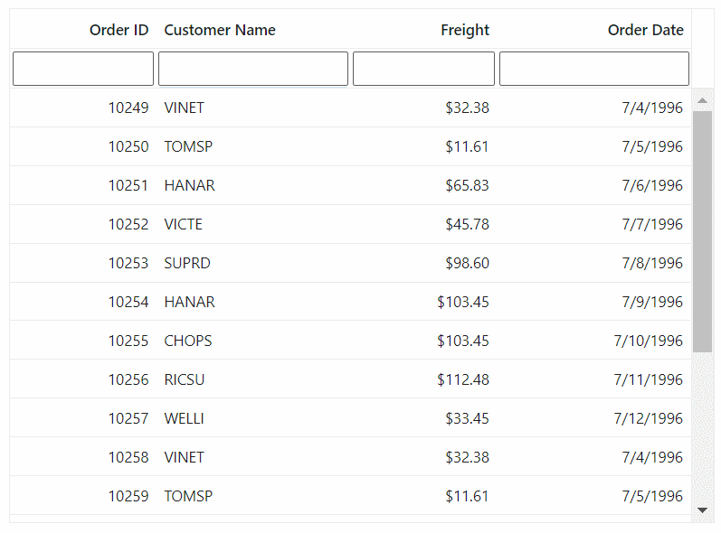

# Filtering in Blazor DataGrid

Filtering in the Syncfusion<sup style="font-size:70%">&reg;</sup> Blazor DataGrid allows selective viewing of data based on criteria, narrowing datasets to focus on needed information for better data analysis and decision-making.

To enable filtering in the Grid, set the [AllowFiltering](https://help.syncfusion.com/cr/blazor/Syncfusion.Blazor.Grids.SfGrid-1.html#Syncfusion_Blazor_Grids_SfGrid_1_AllowFiltering) property of the Grid to true. This configures various filtering options through the [GridFilterSettings](https://help.syncfusion.com/cr/blazor/Syncfusion.Blazor.Grids.SfGrid-1.html#Syncfusion_Blazor_Grids_SfGrid_1_FilterSettings) property.

Here is an example that demonstrates the default filtering feature of the Grid:




@using Syncfusion.Blazor.Grids

<SfGrid @ref="Grid" DataSource="@GridData" AllowFiltering="true" AllowSorting="true" AllowPaging="true">
    <GridPageSettings PageSize="6"></GridPageSettings>
    <GridColumns>
        <GridColumn Field=@nameof(OrderData.OrderID) HeaderText="Order ID" TextAlign="Syncfusion.Blazor.Grids.TextAlign.Right" Width="90"></GridColumn>
        <GridColumn Field=@nameof(OrderData.CustomerID) HeaderText="Customer ID" Width="120"></GridColumn>
        <GridColumn Field=@nameof(OrderData.Freight) HeaderText="Freight" Format="C2" TextAlign="Syncfusion.Blazor.Grids.TextAlign.Right" Width="90"></GridColumn>
        <GridColumn Field=@nameof(OrderData.OrderDate) HeaderText=" Order Date" Format="d"  TextAlign="Syncfusion.Blazor.Grids.TextAlign.Right" Width="120"></GridColumn>
    </GridColumns>
</SfGrid>

@code {
    public List<OrderData> GridData { get; set; }
    SfGrid<OrderData>? Grid { get; set; }

    protected override void OnInitialized()
    {
        GridData = OrderData.GetAllRecords();
    }
}




 
public class OrderData
{
    public static List<OrderData> Orders = new List<OrderData>();
    public OrderData(){}
    public OrderData(int? OrderID,string CustomerID, DateTime? OrderDate, double? Freight)
    {
        this.OrderID = OrderID;    
        this.CustomerID = CustomerID;
        this.OrderDate = OrderDate;
        this.Freight = Freight;            
    }

    public static List<OrderData> GetAllRecords()
    {
        if (Orders.Count() == 0)
        {
            int OrderID = 10248;
            for (int i = 1; i < 3; i++)
            {
                Orders.Add(new OrderData(OrderID+1, "VINET", new DateTime(1996, 07, 06), 32.38));
                Orders.Add(new OrderData(OrderID+2, "TOMSP", new DateTime(1996, 07, 06), 11.61));
                Orders.Add(new OrderData(OrderID+3, "HANAR", new DateTime(1996, 07, 06), 65.83));
                Orders.Add(new OrderData(OrderID+4, "VICTE", new DateTime(1996, 07, 06), 45.78));
                Orders.Add(new OrderData(OrderID+5, "SUPRD", new DateTime(1996, 07, 06), 98.6));
                Orders.Add(new OrderData(OrderID+6, "HANAR", new DateTime(1996, 07, 06), 103.45));
                Orders.Add(new OrderData(OrderID+7, "CHOPS", new DateTime(1996, 07, 06), 103.45));
                Orders.Add(new OrderData(OrderID+8, "RICSU", new DateTime(1996, 07, 06), 112.48));
                Orders.Add(new OrderData(OrderID+9, "WELLI", new DateTime(1996, 07, 06), 33.45));
                OrderID += 9;
            }
        }
        return Orders;
    }

    public int? OrderID { get; set; }
    public string CustomerID { get; set; }
    public DateTime? OrderDate { get; set; }
    public double? Freight { get; set; }
}






> * Apply and clear filtering using **FilterByColumnAsync** and **ClearFilteringAsync** methods.
> * To disable filtering for a particular column, set [AllowFiltering](https://help.syncfusion.com/cr/blazor/Syncfusion.Blazor.Grids.GridColumn.html#Syncfusion_Blazor_Grids_GridColumn_AllowFiltering) property of **GridColumn** as **false**.

## Initial filter

Apply an initial filter by specifying filter criteria using the [Predicate](https://help.syncfusion.com/cr/blazor/Syncfusion.Blazor.Grids.GridFilterColumn.html#Syncfusion_Blazor_Grids_GridFilterColumn_Predicate) object in [Columns](https://help.syncfusion.com/cr/blazor/Syncfusion.Blazor.Grids.GridFilterSettings.html#Syncfusion_Blazor_Grids_GridFilterSettings_Columns) property of [GridFilterSettings](https://help.syncfusion.com/cr/blazor/Syncfusion.Blazor.Grids.SfGrid-1.html#Syncfusion_Blazor_Grids_SfGrid_1_FilterSettings). The `Predicate` object represents the filtering condition and contains properties such as field, operator, and value.

Here is an example of how to configure the initial filter using the `Predicate` object:




@using Syncfusion.Blazor.Grids

<SfGrid DataSource="@GridData" AllowFiltering="true" Height="273px">
    <GridFilterSettings>
        <GridFilterColumns>
            <GridFilterColumn Field="ShipCity" MatchCase=false Operator="Syncfusion.Blazor.Operator.StartsWith" Predicate="and" Value="@ShipCityValue"></GridFilterColumn>
           <GridFilterColumn Field="ShipName" MatchCase=false Operator="Syncfusion.Blazor.Operator.StartsWith" Predicate="and" Value="@ShipNameValue"></GridFilterColumn>
        </GridFilterColumns>
    </GridFilterSettings>
    <GridColumns>
        <GridColumn Field=@nameof(OrderData.OrderID) HeaderText="Order ID" TextAlign="Syncfusion.Blazor.Grids.TextAlign.Right" Width="100"></GridColumn>
        <GridColumn Field=@nameof(OrderData.CustomerID) HeaderText="Customer ID" Width="120"></GridColumn>
        <GridColumn Field=@nameof(OrderData.ShipCity) HeaderText="Ship City" Width="100"></GridColumn>
        <GridColumn Field=@nameof(OrderData.ShipName) HeaderText="Ship Name" Width="100"></GridColumn>
    </GridColumns>
</SfGrid>

@code {

    public List<OrderData> GridData { get; set; }

    public string ShipCityValue = "reims";
    public string ShipNameValue = "Vins et alcools Chevalier";

    protected override void OnInitialized()
    {
        GridData = OrderData.GetAllRecords();
    }
}



 
public class OrderData
{
    public static List<OrderData> Orders = new List<OrderData>();
    public OrderData(){}

    public OrderData(int? OrderID,string CustomerID,string ShipCity, string ShipName)
    {
        this.OrderID = OrderID;    
        this.CustomerID = CustomerID;
        this.ShipCity = ShipCity;
        this.ShipName = ShipName;           
    }

    public static List<OrderData> GetAllRecords()
    {
        if (Orders.Count() == 0)
            {  
            int OrderID = 10248;
            for (int i = 1; i < 3; i++)
            {
                Orders.Add(new OrderData(OrderID+1, "VINET", "Reims", "Vins et alcools Chevalier"));
                Orders.Add(new OrderData(OrderID+2, "TOMSP", "Münster", "Toms Spezialitäten"));
                Orders.Add(new OrderData(OrderID+3, "HANAR", "Rio de Janeiro", "Hanari Carnes"));
                Orders.Add(new OrderData(OrderID+4, "VICTE", "Lyon", "Victuailles en stock"));
                Orders.Add(new OrderData(OrderID+5, "SUPRD", "Charleroi", "Suprêmes délices"));
                Orders.Add(new OrderData(OrderID+6, "HANAR", "Lyon", "Hanari Carnes"));
                Orders.Add(new OrderData(OrderID+7, "CHOPS", "Rio de Janeiro", "Chop-suey Chinese"));
                Orders.Add(new OrderData(OrderID+8, "RICSU", "Münster", "Richter Supermarkt"));
                Orders.Add(new OrderData(OrderID+9, "WELLI", "Reims", "Wellington Import")); 
                OrderID += 9;
            }
        }
        return Orders;
    }

    public int? OrderID { get; set; }
    public string CustomerID { get; set; }
    public string ShipCity { get; set; }
    public string ShipName { get; set; }
}





### Initial filter with multiple values for same column

Set an initial filter with multiple values for a single column by using the [Predicate](https://help.syncfusion.com/cr/blazor/Syncfusion.Blazor.Grids.GridFilterColumn.html#Syncfusion_Blazor_Grids_GridFilterColumn_Predicate) object in [Columns](https://help.syncfusion.com/cr/blazor/Syncfusion.Blazor.Grids.GridFilterSettings.html#Syncfusion_Blazor_Grids_GridFilterSettings_Columns) property of [GridFilterSettings](https://help.syncfusion.com/cr/blazor/Syncfusion.Blazor.Grids.SfGrid-1.html#Syncfusion_Blazor_Grids_SfGrid_1_FilterSettings). This applies multiple conditions at Grid load.

The following example demonstrates how to perform an initial filter with multiple values for the **CustomerID** column using `Columns` property of `GridFilterSettings` and `Predicate`.




@using Syncfusion.Blazor.Grids
@using Syncfusion.Blazor.Data;
 
<SfGrid DataSource="@GridData" @ref="Grid" AllowFiltering="true" Height="325px">
<GridFilterSettings Type="Syncfusion.Blazor.Grids.FilterType.Excel"></GridFilterSettings>
<GridEvents DataBound="DataBoundHandler" TValue="OrderData"></GridEvents>
<GridColumns>
<GridColumn Field=@nameof(OrderData.OrderID) HeaderText="Order ID" TextAlign="Syncfusion.Blazor.Grids.TextAlign.Right" Width="100"></GridColumn>
<GridColumn Field=@nameof(OrderData.CustomerID) HeaderText="Customer ID" Width="120"></GridColumn>
<GridColumn Field=@nameof(OrderData.ShipCity) HeaderText="Ship City" Width="100"></GridColumn>
<GridColumn Field=@nameof(OrderData.ShipName) HeaderText="Ship Name" Width="100"></GridColumn>
</GridColumns>
</SfGrid>
 
@code {
 
    public List<OrderData> GridData { get; set; }
    SfGrid<OrderData> Grid;
 
    public int value{ get; set; }
 
    protected override void OnInitialized()
    {
        GridData = OrderData.GetAllRecords();
    }

    public bool Initialrender = true;

    public async Task DataBoundHandler()
    {
        var columns = await Grid.GetColumns();

        if (columns != null && Initialrender == true)
        {
            Initialrender = false;
            if (Grid.FilterSettings.Columns == null)
            {
                Grid.FilterSettings.Columns = new List<GridFilterColumn>();
            }
            string CustomerfUid = columns[1].Uid;
           
            Grid.FilterSettings.Columns.Add(new GridFilterColumn
                {
                    Field = "CustomerID",
                    Operator = Syncfusion.Blazor.Operator.StartsWith,
                    Predicate = "or",
                    Value = "VINET",
                    Uid = CustomerfUid
                });

            Grid.FilterSettings.Columns.Add(new GridFilterColumn
                {
                    Field = "CustomerID",
                    Operator = Syncfusion.Blazor.Operator.StartsWith,
                    Predicate = "or",
                    Value = "HANAR",
                    Uid = CustomerfUid
                });

           await Grid.Refresh();
        }
    }
}





 public class OrderData
{
    public static List<OrderData> Orders = new List<OrderData>();
    public OrderData(){}

    public OrderData(int? OrderID,string CustomerID,string ShipCity, string ShipName)
    {
        this.OrderID = OrderID;    
        this.CustomerID = CustomerID;
        this.ShipCity = ShipCity;
        this.ShipName = ShipName;           
    }
 
    public static List<OrderData> GetAllRecords()
    {
        if (Orders.Count() == 0)
        {
            int OrderID = 10248;
            for (int i = 1; i < 3; i++)
            {
                Orders.Add(new OrderData(OrderID+1, "VINET", "Reims", "Vins et alcools Chevali"));
                Orders.Add(new OrderData(OrderID+2, "TOMSP", "Münster", "Toms Spezialitäten"));
                Orders.Add(new OrderData(OrderID+3, "HANAR", "Rio de Janeiro", "Hanari Carnes"));
                Orders.Add(new OrderData(OrderID+4, "VICTE", "Lyon", "Victuailles en stock"));
                Orders.Add(new OrderData(OrderID+5, "SUPRD", "Charleroi", "Suprêmes délices"));
                Orders.Add(new OrderData(OrderID+6, "HANAR", "Lyon", "Hanari Carnes"));
                Orders.Add(new OrderData(OrderID+7, "CHOPS", "Rio de Janeiro", "Chop-suey Chinese"));
                Orders.Add(new OrderData(OrderID+8, "RICSU", "Münster", "Richter Supermarkt"));
                Orders.Add(new OrderData(OrderID+9, "WELLI", "Reims", "Wellington Import"));
                OrderID += 9;
            }
        }
        return Orders;
    }
 
    public int? OrderID { get; set; }
    public string CustomerID { get; set; }
    public string ShipCity { get; set; }
    public string ShipName { get; set; }
}






### Initial filter with multiple values for different columns

Apply an initial filter with multiple values across different columns by using the [Predicate](https://help.syncfusion.com/cr/blazor/Syncfusion.Blazor.Grids.GridFilterColumn.html#Syncfusion_Blazor_Grids_GridFilterColumn_Predicate) object in [Columns](https://help.syncfusion.com/cr/blazor/Syncfusion.Blazor.Grids.GridFilterSettings.html#Syncfusion_Blazor_Grids_GridFilterSettings_Columns) property of [GridFilterSettings](https://help.syncfusion.com/cr/blazor/Syncfusion.Blazor.Grids.SfGrid-1.html#Syncfusion_Blazor_Grids_SfGrid_1_FilterSettings). This presets conditions for multiple columns at Grid load.

The following example demonstrates how to perform an initial filter with multiple values for different **Order ID** and **Customer ID** columns using `Columns` property of `GridFilterSettings` and `Predicate`:




@using Syncfusion.Blazor.Grids
@using Syncfusion.Blazor.Data;

<SfGrid DataSource="@GridData" @ref="Grid"  AllowFiltering="true" Height="273px">
    <GridFilterSettings Type="Syncfusion.Blazor.Grids.FilterType.Excel"></GridFilterSettings>
    <GridEvents DataBound="DataBoundHandler" TValue="OrderData"></GridEvents>
    <GridColumns>
        <GridColumn Field=@nameof(OrderData.OrderID) HeaderText="Order ID" TextAlign="Syncfusion.Blazor.Grids.TextAlign.Right" Width="100"></GridColumn>
        <GridColumn Field=@nameof(OrderData.CustomerID) HeaderText="Customer ID" Width="120"></GridColumn>
        <GridColumn Field=@nameof(OrderData.ShipCity) HeaderText="Ship City" Width="100"></GridColumn>
        <GridColumn Field=@nameof(OrderData.ShipName) HeaderText="Ship Name" Width="100"></GridColumn>
    </GridColumns>
</SfGrid>

@code {

    public List<OrderData> GridData { get; set; }
    SfGrid<OrderData> Grid;

    public int value { get; set; }

    protected override void OnInitialized()
    {
        GridData = OrderData.GetAllRecords();
    }

    public bool Initialrender = true;

    public async Task DataBoundHandler()
    {
        var columns = await Grid.GetColumns();

        if (columns != null && Initialrender == true)
        {
            Initialrender = false;
            if (Grid.FilterSettings.Columns == null)
            {
                Grid.FilterSettings.Columns = new List<GridFilterColumn>();
            }
            string CustomerfUid = columns[1].Uid;
            string OrderfUid = columns[0].Uid;

            Grid.FilterSettings.Columns.Add(new GridFilterColumn
                {
                    Field = "CustomerID",
                    Operator = Syncfusion.Blazor.Operator.StartsWith,
                    Predicate = "or",
                    Value = "VINET",
                    Uid = CustomerfUid
                });

            Grid.FilterSettings.Columns.Add(new GridFilterColumn
                {
                    Field = "CustomerID",
                    Operator = Syncfusion.Blazor.Operator.StartsWith,
                    Predicate = "or",
                    Value = "HANAR",
                    Uid = CustomerfUid
                });

            Grid.FilterSettings.Columns.Add(new GridFilterColumn
                {
                    Field = "OrderID",
                    Operator = Syncfusion.Blazor.Operator.LessThan,
                    Predicate = "and",
                    Value = 10250,
                    Uid = OrderfUid
                });

            Grid.FilterSettings.Columns.Add(new GridFilterColumn
                {
                    Field = "OrderID",
                    Operator = Syncfusion.Blazor.Operator.NotEqual,
                    Predicate = "and",
                    Value = 10262,
                    Uid = OrderfUid
                });

            Grid.Refresh();
        }
    }
}





 public class OrderData
{
    public static List<OrderData> Orders = new List<OrderData>();
    public OrderData(){}
    public OrderData(int? OrderID, string CustomerID, string ShipCity, string ShipName)
    {
        this.OrderID = OrderID;
        this.CustomerID = CustomerID;
        this.ShipCity = ShipCity;
        this.ShipName = ShipName;
    }

    public static List<OrderData> GetAllRecords()
    {
        if (Orders.Count() == 0)
        {
            int OrderID = 10247;
            for (int i = 1; i < 3; i++)
            {
                Orders.Add(new OrderData(OrderID + 1, "VINET", "Reims", "Vins et alcools Chevali"));
                Orders.Add(new OrderData(OrderID + 2, "HANAR", "Münster", "Toms Spezialitäten"));
                Orders.Add(new OrderData(OrderID + 3, "TOMSP", "Rio de Janeiro", "Hanari Carnes"));
                Orders.Add(new OrderData(OrderID + 4, "VICTE", "Lyon", "Victuailles en stock"));
                Orders.Add(new OrderData(OrderID + 5, "SUPRD", "Charleroi", "Suprêmes délices"));
                Orders.Add(new OrderData(OrderID + 6, "HANAR", "Lyon", "Hanari Carnes"));
                Orders.Add(new OrderData(OrderID + 7, "CHOPS", "Rio de Janeiro", "Chop-suey Chinese"));
                Orders.Add(new OrderData(OrderID + 8, "RICSU", "Münster", "Richter Supermarkt"));
                Orders.Add(new OrderData(OrderID + 9, "WELLI", "Reims", "Wellington Import"));
                OrderID += 9;
            }
        }
        return Orders;
    }

    public int? OrderID { get; set; }
    public string CustomerID { get; set; }
    public string ShipCity { get; set; }
    public string ShipName { get; set; }
}






## Filter operators

The Syncfusion<sup style="font-size:70%">&reg;</sup> Blazor DataGrid provides various filter operators to define filter conditions for columns. Define the filter operator using the [Operator](https://help.syncfusion.com/cr/blazor/Syncfusion.Blazor.Grids.GridFilterColumn.html#Syncfusion_Blazor_Grids_GridFilterColumn_Operator) in [Columns](https://help.syncfusion.com/cr/blazor/Syncfusion.Blazor.Grids.GridFilterSettings.html#Syncfusion_Blazor_Grids_GridFilterSettings_Columns) property of `GridFilterSettings`.

The available operators and their supported data types are,

Operator |Description |Supported Types
-----|-----|-----
StartsWith |Checks whether the value begins with the specified value. |String
DoesNotStartWith |Checks whether the value does not begin with the specified value. |String
EndsWith |Checks whether the value ends with the specified value. |String
DoesNotEndWith |Checks whether the value does not end with the specified value. |String
Contains |Checks whether the value contains the specified value. |String
DoesNotContain |Checks whether the value does not contain the specified value. |String
Equal |Checks whether the value is equal to the specified value. |String &#124; Number &#124; Boolean &#124; Date
NotEqual |Checks for values not equal to the specified value. |String &#124; Number &#124; Boolean &#124; Date
GreaterThan |Checks whether the value is greater than the specified value. |Number &#124; Date
GreaterThanOrEqual |Checks whether a value is greater than or equal to the specified value. |Number &#124; Date
LessThan |Checks whether the value is less than the specified value. |Number &#124; Date
LessThanOrEqual |Checks whether the value is less than or equal to the specified value. |Number &#124; Date
IsNull |Returns the values that are null. |String &#124; Number &#124; Date
IsNotNull |Returns the values that are not null. |String &#124; Number &#124; Date
IsEmpty |Returns the values that are empty. |String
IsNotEmpty |Returns the values that are not empty. |String
Between |Filter the values based on the range between the start and end specified values. |Number &#124; Date

> By default, the **Operator** value is **Equal** in [Columns](https://help.syncfusion.com/cr/blazor/Syncfusion.Blazor.Grids.GridFilterSettings.html#Syncfusion_Blazor_Grids_GridFilterSettings_Columns) property of `GridFilterSettings`.

## WildCard and Like operator filter

**WildCard** and **Like** filter operators filter value based on given string patterns, applied to string-type columns, with differences in pattern usage.

### WildCard filtering

**WildCard** filtering uses the **“*”** symbol to process one or more search patterns, retrieving matching values across types in the Grid.

* **WildCard** supports all search options.

Operator |Description
-----|-----
a*b | Everything that starts with “a” and ends with “b”.
a* | Everything that starts with “a”.
*b | Everything that ends with “b”.
a | Everything that has an “a” in it.
ab* | Everything that has an “a” in it, followed by “b”, followed by anything.



### Like filtering

Like filtering uses the **“%”** symbol to process single search patterns, retrieving matching values on string-type columns for Grid features supporting it.

* Like filtering supports Filter Menu, Filter Bar with [Operator](https://help.syncfusion.com/cr/blazor/Syncfusion.Blazor.Grids.FilterSettings.html#Syncfusion_Blazor_Grids_FilterSettings_Operator), and custom Excel filter.

**Examples:**
| Operator | Description |
| ----- | ----- |
| %ab% | Returns values containing “ab”. |
| ab% | Returns values ending with “ab”. |
| %ab | Returns values starting with “ab”. |


## Filtering with case sensitivity

The Syncfusion<sup style="font-size:70%">&reg;</sup> Blazor DataGrid supports case sensitivity in filtering using the [EnableCaseSensitivity](https://help.syncfusion.com/cr/blazor/Syncfusion.Blazor.Grids.GridFilterSettings.html#Syncfusion_Blazor_Grids_GridFilterSettings_EnableCaseSensitivity) property of [GridFilterSettings](https://help.syncfusion.com/cr/blazor/Syncfusion.Blazor.Grids.SfGrid-1.html#Syncfusion_Blazor_Grids_SfGrid_1_FilterSettings).

The following example demonstrates enabling or disabling case sensitivity in filtering:




@using Syncfusion.Blazor.Grids
@using Syncfusion.Blazor.Buttons

<label> Enable Case Sensitivity</label>
<SfSwitch @bind-Checked="isChecked" OffLabel="OFF" OnLabel="ON" ValueChange="onToggleCaseSensitive" TChecked="bool?"></SfSwitch>

<SfGrid DataSource="@GridData" AllowFiltering="true" Height="273px">
    <GridFilterSettings EnableCaseSensitivity="@isCaseSensitive">
    </GridFilterSettings>
    <GridColumns>
        <GridColumn Field=@nameof(OrderData.OrderID) HeaderText="Order ID" TextAlign="Syncfusion.Blazor.Grids.TextAlign.Right" Width="90"></GridColumn>
        <GridColumn Field=@nameof(OrderData.CustomerID) HeaderText="Customer ID" Width="100"></GridColumn>
        <GridColumn Field=@nameof(OrderData.ShipCountry) HeaderText="Ship Country" TextAlign="Syncfusion.Blazor.Grids.TextAlign.Right" Width="90"></GridColumn>
        <GridColumn Field=@nameof(OrderData.ShipCity) HeaderText="Ship City" TextAlign="Syncfusion.Blazor.Grids.TextAlign.Right" Width="120"></GridColumn>
        <GridColumn Field=@nameof(OrderData.ShipRegion) HeaderText="Ship Region" TextAlign="Syncfusion.Blazor.Grids.TextAlign.Right" Width="120"></GridColumn>
    </GridColumns>
</SfGrid>

@code {

    public List<OrderData> GridData { get; set; }

    private bool? isChecked = null;
    private bool isCaseSensitive = false;

    protected override void OnInitialized()
    {
        GridData = OrderData.GetAllRecords();
    }
 
    private async Task onToggleCaseSensitive(Syncfusion.Blazor.Buttons.ChangeEventArgs<bool?> args)
    {
        if (args.Checked == true)
        {
            isCaseSensitive = true;
        }
        else
        {
            isCaseSensitive = false;
        }
    }
}





public class OrderData
{
    public static List<OrderData> Orders = new List<OrderData>();
    public OrderData(){}
    public OrderData(int? OrderID, string CustomerID, string ShipCity, string ShipCountry, string ShipRegion)
    {
        this.OrderID = OrderID;
        this.CustomerID = CustomerID;
        this.ShipCity = ShipCity;
        this.ShipCountry = ShipCountry;
        this.ShipRegion = ShipRegion;
    }

    public static List<OrderData> GetAllRecords()
    {
        if (Orders.Count() == 0)
        {
            int OrderID = 10247;
            for (int i = 1; i < 2; i++)
            {
                Orders.Add(new OrderData(OrderID + 1, "VINET", "Reims", "France", "CJ"));
                Orders.Add(new OrderData(OrderID + 2, "TOMSP", "Münster", "Germany", "CJ"));
                Orders.Add(new OrderData(OrderID + 3, "HANAR", "Rio de Janeiro", "Brazil", "RJ"));
                Orders.Add(new OrderData(OrderID + 4, "VICTE", "Lyon", "Belgium", "RJ"));
                Orders.Add(new OrderData(OrderID + 5, "SUPRD", "Charleroi", "Switzerland", "SP"));
                Orders.Add(new OrderData(OrderID + 6, "HANAR", "Lyon", "Venezuela", "NM"));
                Orders.Add(new OrderData(OrderID + 7, "CHOPS", "Rio de Janeiro", "Austria", "CJ"));
                Orders.Add(new OrderData(OrderID + 8, "RICSU", "Münster", "Mexico", "RJ"));
                Orders.Add(new OrderData(OrderID + 9, "WELLI", "Reims", "USA", "SP"));
                OrderID += 9;
            }
        }
        return Orders;
    }

    public int? OrderID { get; set; }
    public string CustomerID { get; set; }
    public string ShipCountry { get; set; }
    public string ShipCity { get; set; }
    public string ShipRegion { get; set; }
}
    





## Enable different filter for a column

Enable various filter types such as **Menu**, **Excel**, or **Checkbox** for different columns by adjusting the [Type](https://help.syncfusion.com/cr/blazor/Syncfusion.Blazor.Grids.FilterSettings.html#Syncfusion_Blazor_Grids_FilterSettings_Type) property within the [GridFilterSettings](https://help.syncfusion.com/cr/blazor/Syncfusion.Blazor.Grids.SfGrid-1.html#Syncfusion_Blazor_Grids_SfGrid_1_FilterSettings) configuration.

The following example demonstrates enabling different filter types dynamically through a dropdown:




@using Syncfusion.Blazor.Grids
@using Syncfusion.Blazor.Buttons
@using Syncfusion.Blazor.DropDowns

<label>Select Column</label>
<SfDropDownList TValue="string" TItem="string" Width="130px" Placeholder="Eg: OrderID" DataSource="@ColumnData">
    <DropDownListEvents TValue="string" TItem="string" ValueChange="onFieldChange"></DropDownListEvents>
 </SfDropDownList>

<label>Select Filter Type</label>
<SfDropDownList TValue="string" TItem="string" Width="130px" Placeholder="Eg: Excel" Enabled="@flag" DataSource="@LocalData">
    <DropDownListEvents TValue="string" TItem="string" ValueChange="onTypeChange"></DropDownListEvents>
</SfDropDownList>

<SfGrid DataSource="@GridData" @ref="Grid" AllowFiltering="true" AllowPaging="true" Height="273px">
    <GridFilterSettings Type="Syncfusion.Blazor.Grids.FilterType.Menu"></GridFilterSettings>
    <GridColumns>
        <GridColumn Field=@nameof(OrderData.OrderID) HeaderText="Order ID" TextAlign="Syncfusion.Blazor.Grids.TextAlign.Right" FilterSettings="OrderIDFilterSettings" Width="100"></GridColumn>
        <GridColumn Field=@nameof(OrderData.CustomerID) HeaderText="Customer ID" FilterSettings="customerIDFilterSettings" Width="120"></GridColumn>
        <GridColumn Field=@nameof(OrderData.Freight) HeaderText="Freight"  FilterSettings="FreightFilterSettings" Width="100"></GridColumn>
        <GridColumn Field=@nameof(OrderData.OrderDate) HeaderText=" Order Date" Format="d" FilterSettings="OrderDateFilterSettings" TextAlign="Syncfusion.Blazor.Grids.TextAlign.Right" Width="100"></GridColumn>
        <GridColumn Field=@nameof(OrderData.Verified) HeaderText="Verified" FilterSettings="VerifiedFilterSettings" Width="130" DisplayAsCheckBox="true" Type="Syncfusion.Blazor.Grids.ColumnType.Boolean"></GridColumn>
    </GridColumns>

</SfGrid>

@code {

    public List<OrderData> GridData { get; set; }

    SfGrid<OrderData> Grid;

    public bool flag = false;

    FilterSettings OrderIDFilterSettings = new FilterSettings { Type = Syncfusion.Blazor.Grids.FilterType.Menu};
    FilterSettings customerIDFilterSettings = new FilterSettings { Type = Syncfusion.Blazor.Grids.FilterType.Menu };
    FilterSettings FreightFilterSettings = new FilterSettings { Type = Syncfusion.Blazor.Grids.FilterType.Menu };
    FilterSettings OrderDateFilterSettings = new FilterSettings { Type = Syncfusion.Blazor.Grids.FilterType.Menu };
    FilterSettings VerifiedFilterSettings = new FilterSettings { Type = Syncfusion.Blazor.Grids.FilterType.Menu };

    protected override void OnInitialized()
    {
        GridData = OrderData.GetAllRecords();
    }

    List<string> LocalData = new List<string>() { "Menu", "CheckBox ", "Excel" };

    List<string> ColumnData = new List<string>() { "OrderID", "CustomerID", "Freight", "OrderDate", "Verified" };

    public string SelectedColumn { get; set; } 
    public string SelectedOperator { get; set; }

    public async Task onFieldChange(ChangeEventArgs<string, string> args)
    {
        SelectedColumn = args.Value;
        flag = true;

    }
    public async Task onTypeChange(ChangeEventArgs<string, string> args)
    {
        SelectedOperator = args.Value;
        onSingleValueFilter();
    }
    public async Task onSingleValueFilter()
    {
       
        Syncfusion.Blazor.Grids.FilterType filterType;
        Enum.TryParse(SelectedOperator, out filterType);

        switch (SelectedColumn)
        {
            case "OrderID":
                OrderIDFilterSettings = new FilterSettings { Type = filterType };
                break;
            case "CustomerID":
                customerIDFilterSettings = new FilterSettings { Type = filterType };
                break;
                
            case "Freight":
                FreightFilterSettings = new FilterSettings { Type = filterType };
                break;

            case "OrderDate":
                OrderDateFilterSettings = new FilterSettings { Type = filterType };
                break;
            case "Verified":
                VerifiedFilterSettings = new FilterSettings { Type = filterType };
                break;
            default:
                
                break;
        }
        await Grid.Refresh();
    }
}





public class OrderData
{
    public static List<OrderData> Orders = new List<OrderData>();
    public OrderData(){}

    public OrderData(int? OrderID, string CustomerID, DateTime? OrderDate, double? Freight, bool Verified)
    {
        this.OrderID = OrderID;
        this.CustomerID = CustomerID;
        this.OrderDate = OrderDate;
        this.Freight = Freight;
        this.Verified = Verified;
    }

    public static List<OrderData> GetAllRecords()
    {
        if (Orders.Count() == 0)
        {
            int OrderID = 10247;
            for (int i = 1; i < 3; i++)
            {
                Orders.Add(new OrderData(OrderID + 1, "VINET", new DateTime(1996, 07, 06), 32.38, true));
                Orders.Add(new OrderData(OrderID + 2, "TOMSP", new DateTime(1996, 07, 06), 11.61, false));
                Orders.Add(new OrderData(OrderID + 3, "HANAR", new DateTime(1996, 07, 06), 65.83, false));
                Orders.Add(new OrderData(OrderID + 4, "VICTE", new DateTime(1996, 07, 06), 45.78, true));
                Orders.Add(new OrderData(OrderID + 5, "SUPRD", new DateTime(1996, 07, 06), 98.6, true));
                Orders.Add(new OrderData(OrderID + 6, "HANAR", new DateTime(1996, 07, 06), 103.45, false));
                Orders.Add(new OrderData(OrderID + 7, "CHOPS", new DateTime(1996, 07, 06), 103.45, true));
                Orders.Add(new OrderData(OrderID + 8, "RICSU", new DateTime(1996, 07, 06), 112.48, true));
                Orders.Add(new OrderData(OrderID + 9, "WELLI", new DateTime(1996, 07, 06), 33.45, false));
                OrderID += 9;
            }
        }
        return Orders;
    }

    public int? OrderID { get; set; }
    public string CustomerID { get; set; }
    public DateTime? OrderDate { get; set; }
    public double? Freight { get; set; }
    public bool Verified { get; set; }
}
    





## Change default filter operator for particular column

Change the default filter operator for a column using the [Operator](https://help.syncfusion.com/cr/blazor/Syncfusion.Blazor.Grids.FilterSettings.html#Syncfusion_Blazor_Grids_FilterSettings_Operator) property within the [GridFilterSettings](https://help.syncfusion.com/cr/blazor/Syncfusion.Blazor.Grids.SfGrid-1.html#Syncfusion_Blazor_Grids_SfGrid_1_FilterSettings) configuration.

The following example demonstrates changing the default operator dynamically:




@using Syncfusion.Blazor.Grids
@using Syncfusion.Blazor.DropDowns

<label>Select Column</label>
<SfDropDownList TValue="string" TItem="string" Width="130px" Placeholder="Eg: OrderID" DataSource="@ColumnData">
    <DropDownListEvents TValue="string" TItem="string" ValueChange="onFieldChange"></DropDownListEvents>
</SfDropDownList>

<label>Select Operator</label>
<SfDropDownList TValue="string" TItem="string" Width="130px" Placeholder="Eg: Equal" Enabled="@flag" DataSource="@LocalData">
    <DropDownListEvents TValue="string" TItem="string" ValueChange="onOperatorChange"></DropDownListEvents>
</SfDropDownList>

<SfGrid DataSource="@GridData" @ref="Grid" AllowFiltering="true" Height="273px">
   
    <GridColumns>
        <GridColumn Field=@nameof(OrderData.OrderID) HeaderText="Order ID" TextAlign="Syncfusion.Blazor.Grids.TextAlign.Right" FilterSettings="OrderIDFilterSettings" Width="100"></GridColumn>
        <GridColumn Field=@nameof(OrderData.CustomerID) HeaderText="Customer ID" FilterSettings="customerIDFilterSettings" Width="100"></GridColumn>
        <GridColumn Field=@nameof(OrderData.Freight) HeaderText="Freight"  FilterSettings="FreightFilterSettings" Width="120"></GridColumn>
        <GridColumn Field=@nameof(OrderData.ShipCity) HeaderText="Ship City" FilterSettings="ShipCityFilterSettings" Width="100"></GridColumn>
        <GridColumn Field=@nameof(OrderData.ShipCountry) HeaderText="Ship Country" FilterSettings="ShipCountryFilterSettings" Width="120"></GridColumn>
    </GridColumns>

</SfGrid>

@code {

    public List<OrderData> GridData { get; set; }

    SfGrid<OrderData> Grid;

    public bool flag = false;

    FilterSettings OrderIDFilterSettings = new FilterSettings { Operator = Syncfusion.Blazor.Operator.Equal};
    FilterSettings customerIDFilterSettings = new FilterSettings { Operator = Syncfusion.Blazor.Operator.StartsWith};
    FilterSettings FreightFilterSettings = new FilterSettings { Operator = Syncfusion.Blazor.Operator.Equal };
    FilterSettings ShipCityFilterSettings = new FilterSettings { Operator = Syncfusion.Blazor.Operator.StartsWith };
    FilterSettings ShipCountryFilterSettings = new FilterSettings { Operator = Syncfusion.Blazor.Operator.StartsWith };

    protected override void OnInitialized()
    {
        GridData = OrderData.GetAllRecords();
    }

    List<string> LocalData = new List<string>();

    List<string> ColumnData = new List<string>() { "OrderID", "CustomerID", "Freight", "ShipCity", "ShipCountry" };

    public string SelectedColumn { get; set; } 
    public string SelectedOperator { get; set; }

    public async Task onFieldChange(ChangeEventArgs<string, string> args)
    {
        SelectedColumn = args.Value;
        if (args.Value == "OrderID" || args.Value == "Freight")
        {
            LocalData = new List<string>() { "Equal ", "NotEqual ", "GreaterThan ", "GreaterThanOrEqual", "LessThan ", " LessThanOrEqual" };
        }
        else
        {
            LocalData = new List<string>() { "StartsWith ", "EndsWith ", "Contains ", "Equal ", "NotEqual" };
        }

        flag = true;
    }
    public async Task onOperatorChange(ChangeEventArgs<string, string> args)
    {
        SelectedOperator = args.Value;
        onSingleValueFilter();
    }
    public async Task onSingleValueFilter()
    {
        Syncfusion.Blazor.Operator filterOperator;
        Enum.TryParse(SelectedOperator, out filterOperator);

        switch (SelectedColumn)
        {
            case "OrderID":
                OrderIDFilterSettings = new FilterSettings { Operator = filterOperator };
                break;
            case "CustomerID":
                customerIDFilterSettings = new FilterSettings { Operator = filterOperator };
                break;
                
            case "Freight":
                FreightFilterSettings = new FilterSettings { Operator = filterOperator };
                break;

            case "ShipCity":
                ShipCityFilterSettings = new FilterSettings { Operator = filterOperator };
                break;
            case "ShipCountry":
                ShipCountryFilterSettings = new FilterSettings { Operator = filterOperator };
                break;
            default:
                
                break;
        }

        await Grid.Refresh();
    }
}





public class OrderData
{
    public static List<OrderData> Orders = new List<OrderData>();
    public OrderData(){}
    public OrderData(int? OrderID, string CustomerID, double? Freight, string ShipCity, string ShipCountry)
    {
        this.OrderID = OrderID;
        this.CustomerID = CustomerID;
        this.Freight = Freight;
        this.ShipCity = ShipCity;
        this.ShipCountry = ShipCountry;
    }

    public static List<OrderData> GetAllRecords()
    {
        if (Orders.Count() == 0)
        {
            int OrderID = 10247;
            for (int i = 1; i < 3; i++)
            {
                Orders.Add(new OrderData(OrderID + 1, "VINET", 32.38, "Reims", "France"));
                Orders.Add(new OrderData(OrderID + 2, "TOMSP", 11.61, "Münster", "Germany"));
                Orders.Add(new OrderData(OrderID + 3, "HANAR", 65.83, "Rio de Janeiro", "Brazil"));
                Orders.Add(new OrderData(OrderID + 4, "VICTE", 45.78, "Lyon", "Belgium"));
                Orders.Add(new OrderData(OrderID + 5, "SUPRD", 98.6, "Charleroi", "Switzerland"));
                Orders.Add(new OrderData(OrderID + 6, "HANAR", 103.45, "Lyon", "Venezuela"));
                Orders.Add(new OrderData(OrderID + 7, "CHOPS", 103.45, "Rio de Janeiro", "Austria"));
                Orders.Add(new OrderData(OrderID + 8, "RICSU", 112.48, "Münster", "Mexico"));
                Orders.Add(new OrderData(OrderID + 9, "WELLI", 33.45, "Reims", "USA"));
                OrderID += 9;
            }
        }
        return Orders;
    }

    public int? OrderID { get; set; }
    public string CustomerID { get; set; }
    public double? Freight { get; set; }
    public string ShipCountry { get; set; }
    public string ShipCity { get; set; }
}






## Filter Blazor DataGrid programmatically with single and multiple values using method

Filter the Grid programmatically with single or multiple values using the [FilterByColumnAsync](https://help.syncfusion.com/cr/blazor/Syncfusion.Blazor.Grids.SfGrid-1.html#Syncfusion_Blazor_Grids_SfGrid_1_FilterByColumnAsync_System_String_System_String_System_Object_System_String_System_Nullable_System_Boolean__System_Nullable_System_Boolean__System_Object_System_Object_) method of the Grid.

The following example demonstrates how to filter the Grid programmatically using single and multiple values for the **OrderID** and **CustomerID** columns, called within button click functions:




@using Syncfusion.Blazor.Grids
@using Syncfusion.Blazor.Buttons

<SfButton OnClick="onSingleValueFilter">Filter with single value</SfButton>
<SfButton style="margin-left:5px" OnClick="onMultipleValueFilter">Filter with multiple values</SfButton>

<SfGrid DataSource="@GridData" @ref="Grid" AllowFiltering="true" Height="273px">
    <GridFilterSettings Type="Syncfusion.Blazor.Grids.FilterType.Excel"></GridFilterSettings>
    <GridColumns>
        <GridColumn Field=@nameof(OrderData.OrderID) HeaderText="Order ID" TextAlign="Syncfusion.Blazor.Grids.TextAlign.Right" Width="100"></GridColumn>
        <GridColumn Field=@nameof(OrderData.CustomerID) HeaderText="Customer ID" Width="120"></GridColumn>
        <GridColumn Field=@nameof(OrderData.ShipCity) HeaderText="Ship City" Width="100"></GridColumn>
        <GridColumn Field=@nameof(OrderData.ShipName) HeaderText="Ship Name" Width="100"></GridColumn>
    </GridColumns>
</SfGrid>

@code {

    public List<OrderData> GridData { get; set; }

    SfGrid<OrderData> Grid;

    protected override void OnInitialized()
    {
        GridData = OrderData.GetAllRecords();
    }

    public async Task onSingleValueFilter()
    {
        await Grid.ClearFilteringAsync();
        await Grid.FilterByColumnAsync("OrderID", "equal", 10248);
    }
    public async Task onMultipleValueFilter()
    {
        await Grid.ClearFilteringAsync();
        await Grid.FilterByColumnAsync("CustomerID", "equal", new List<string> { "VINET", "TOMSP", "ERNSH" });
    }
}





public class OrderData
{
    public static List<OrderData> Orders = new List<OrderData>();
    public OrderData(){}

    public OrderData(int? OrderID,string CustomerID,string ShipCity, string ShipName)
    {
        this.OrderID = OrderID;    
        this.CustomerID = CustomerID;
        this.ShipCity = ShipCity;
        this.ShipName = ShipName;           
    }

    public static List<OrderData> GetAllRecords()
    {
        if (Orders.Count() == 0)
        {  
            int OrderID = 10247;
            for (int i = 1; i < 2; i++)
            {
                Orders.Add(new OrderData(OrderID+1, "VINET", "Reims", "Vins et alcools Chevali"));
                Orders.Add(new OrderData(OrderID+2, "TOMSP", "Münster", "Toms Spezialitäten"));
                Orders.Add(new OrderData(OrderID+3, "HANAR", "Rio de Janeiro", "Hanari Carnes"));
                Orders.Add(new OrderData(OrderID+4, "VICTE", "Lyon", "Victuailles en stock"));
                Orders.Add(new OrderData(OrderID+5, "SUPRD", "Charleroi", "Suprêmes délices"));
                Orders.Add(new OrderData(OrderID+6, "HANAR", "Lyon", "Hanari Carnes"));
                Orders.Add(new OrderData(OrderID+7, "CHOPS", "Rio de Janeiro", "Chop-suey Chinese"));
                Orders.Add(new OrderData(OrderID + 8, "ERNSH", "Münster", "Richter Supermarkt"));
                Orders.Add(new OrderData(OrderID+9, "WELLI", "Reims", "Wellington Import"));
                OrderID += 9;
            }
        }
        return Orders;
    }

    public int? OrderID { get; set; }
    public string CustomerID { get; set; }
    public string ShipCity { get; set; }
    public string ShipName { get; set; }
}






## How to get filtered records

Obtaining filtered records in the Syncfusion<sup style="font-size:70%">&reg;</sup> Blazor DataGrid is useful for working with data matching current filters.

### Using the GetFilteredRecordsAsync() method

The [GetFilteredRecordsAsync](https://help.syncfusion.com/cr/blazor/Syncfusion.Blazor.Grids.SfGrid-1.html#Syncfusion_Blazor_Grids_SfGrid_1_GetFilteredRecordsAsync) method retrieves an array of records matching applied filters.

This method retrieves an array of records matching applied filters.

The following example demonstrates getting the filtering data using the `GetFilteredRecordsAsync` method:




@using Syncfusion.Blazor.Grids
@using Syncfusion.Blazor.Buttons

<div style="text-align : center; color: red">
    <span>@message</span>
</div>
<br />

<SfButton CssClass="e-success" OnClick="click">Get Filtered Data</SfButton>
<SfButton CssClass="e-danger" OnClick="clear">Clear</SfButton>

<SfGrid DataSource="@GridData" @ref="Grid" AllowFiltering="true" AllowPaging="true" Height="280px">
    <GridPageSettings PageSize="10" PageCount="5" ></GridPageSettings>
    <GridEvents Filtering="FilteringHandler" TValue="OrderData"></GridEvents>
    <GridColumns>
        <GridColumn Field=@nameof(OrderData.OrderID) HeaderText="Order ID" TextAlign="Syncfusion.Blazor.Grids.TextAlign.Right" Width="90"></GridColumn>
        <GridColumn Field=@nameof(OrderData.CustomerID) HeaderText="Customer ID"  Width="120"></GridColumn>
        <GridColumn Field=@nameof(OrderData.Freight) HeaderText="Freight" Format="C2" Width="90"></GridColumn>
        <GridColumn Field=@nameof(OrderData.ShipCity) HeaderText="Ship City"  Width="120"></GridColumn>
    </GridColumns>
</SfGrid>

@if (showRecords == true)
{
    <h3> Filtered Records</h3>

    <SfGrid DataSource="@FilterData" AllowFiltering="true" AllowPaging="true" Height="280px">
        <GridPageSettings PageSize="10" PageCount="5"></GridPageSettings>
        <GridColumns>
            <GridColumn Field=@nameof(OrderData.OrderID) HeaderText="Order ID" TextAlign="Syncfusion.Blazor.Grids.TextAlign.Right" Width="90"></GridColumn>
            <GridColumn Field=@nameof(OrderData.CustomerID) HeaderText="Customer ID" Width="120"></GridColumn>
            <GridColumn Field=@nameof(OrderData.Freight) HeaderText="Freight" Format="C2" Width="90"></GridColumn>
            <GridColumn Field=@nameof(OrderData.ShipCity) HeaderText="Ship City" Width="120"></GridColumn>
        </GridColumns>

    </SfGrid>
}

@code {

    public List<OrderData> GridData { get; set; }

    public List<OrderData> FilterData { get; set; }

    SfGrid<OrderData> Grid;

    public bool flag = false;
    public bool showRecords = false;

    public string message;

    public async Task click()
    {
        if (flag == true)
        {

            var filteredRecords = Grid.GetFilteredRecordsAsync();
            FilterData = (List<OrderData>)filteredRecords.Result;
            showRecords = true;
            message = "";
        }

        else
        {
            showRecords = false;
            message = "No Records is filtered ";
        }

    }

    public async Task clear()
    {
        await Grid.ClearFilteringAsync();
        showRecords = false;
    }

    protected override void OnInitialized()
    {
        GridData = OrderData.GetAllRecords();
    }

    public async Task FilteringHandler(FilteringEventArgs args)

    {
        if (args.FilterPredicates != null)
        {
            flag = true;
        }
        else
        {
            flag = false;
        }
    }
}





public class OrderData
{
    public static List<OrderData> Orders = new List<OrderData>();
    public OrderData(){}

    public OrderData(int? OrderID, string CustomerID, double? Freight, string ShipCity, string ShipCountry)
    {
        this.OrderID = OrderID;
        this.CustomerID = CustomerID;
        this.Freight = Freight;
        this.ShipCity = ShipCity;
        this.ShipCountry = ShipCountry;
    }

    public static List<OrderData> GetAllRecords()
    {
        if (Orders.Count() == 0)
        {
            int OrderID = 10247;
            for (int i = 1; i < 7; i++)
            {
                Orders.Add(new OrderData(OrderID + 1, "VINET", 32.38, "Reims", "France"));
                Orders.Add(new OrderData(OrderID + 2, "TOMSP", 11.61, "Münster", "Germany"));
                Orders.Add(new OrderData(OrderID + 3, "HANAR", 65.83, "Rio de Janeiro", "Brazil"));
                Orders.Add(new OrderData(OrderID + 4, "VICTE", 45.78, "Lyon", "Belgium"));
                Orders.Add(new OrderData(OrderID + 5, "SUPRD", 98.6, "Charleroi", "Switzerland"));
                Orders.Add(new OrderData(OrderID + 6, "HANAR", 103.45, "Lyon", "Venezuela"));
                Orders.Add(new OrderData(OrderID + 7, "CHOPS", 103.45, "Rio de Janeiro", "Austria"));
                Orders.Add(new OrderData(OrderID + 8, "RICSU", 112.48, "Münster", "Mexico"));
                Orders.Add(new OrderData(OrderID + 9, "WELLI", 33.45, "Reims", "USA"));
                OrderID += 9;
            }
        }
        return Orders;
    }

    public int? OrderID { get; set; }
    public string CustomerID { get; set; }
    public double? Freight { get; set; }
    public string ShipCountry { get; set; }
    public string ShipCity { get; set; }
}






### Using the GetFilteredRecordsAsync() method for remote data

For remote data sources, the [GetFilteredRecordsAsync](https://help.syncfusion.com/cr/blazor/Syncfusion.Blazor.Grids.SfGrid-1.html#Syncfusion_Blazor_Grids_SfGrid_1_GetFilteredRecordsAsync) method returns records as objects. Deserialize the object to retrieve filtered records.

```cshtml
@using Syncfusion.Blazor.Data
@using Syncfusion.Blazor.Grids
@using Syncfusion.Blazor
@using Syncfusion.Blazor.Buttons
@using Newtonsoft.Json

<div style="text-align : center; color: red">
    <span>@message</span>
</div>
<br />

<SfButton CssClass="e-success" OnClick="click">Get Filtered Data</SfButton>
<SfButton CssClass="e-danger" OnClick="clear">Clear</SfButton>

<SfGrid @ref="Grid" TValue="EmployeeData" ID="Grid" AllowFiltering="true" AllowPaging="true">
    <GridPageSettings PageSize="10" PageCount="5"></GridPageSettings>
    <GridEvents Filtering="FilteringHandler" TValue="EmployeeData"></GridEvents>
    <SfDataManager Url="https://services.odata.org/V4/Northwind/Northwind.svc/Orders/" Adaptor="Adaptors.ODataV4Adaptor"></SfDataManager>
    <GridColumns>
        <GridColumn Field=@nameof(EmployeeData.OrderID) TextAlign="Syncfusion.Blazor.Grids.TextAlign.Center" HeaderText="Order ID" Width="120"></GridColumn>
        <GridColumn Field=@nameof(EmployeeData.CustomerID) TextAlign="Syncfusion.Blazor.Grids.TextAlign.Center" HeaderText="Customer Name" Width="130"></GridColumn>
        <GridColumn Field=@nameof(EmployeeData.ShipCity) TextAlign="Syncfusion.Blazor.Grids.TextAlign.Center" HeaderText="ShipCity" Width="120"></GridColumn>
        <GridColumn Field=@nameof(EmployeeData.ShipName) HeaderText="Ship Name" Width="100"></GridColumn>
    </GridColumns>
</SfGrid>

@if (showRecords == true)
{
    <h3> Filtered Records</h3>

    <SfGrid DataSource="@FilterData" AllowFiltering="true" AllowPaging="true" Height="280px">
        <GridPageSettings PageSize="10" PageCount="5"></GridPageSettings>
        <GridColumns>
            <GridColumn Field=@nameof(EmployeeData.OrderID) TextAlign="Syncfusion.Blazor.Grids.TextAlign.Center" HeaderText="Order ID" Width="120"></GridColumn>
            <GridColumn Field=@nameof(EmployeeData.CustomerID) TextAlign="Syncfusion.Blazor.Grids.TextAlign.Center" HeaderText="Customer Name" Width="130"></GridColumn>
            <GridColumn Field=@nameof(EmployeeData.ShipCity) TextAlign="Syncfusion.Blazor.Grids.TextAlign.Center" HeaderText="ShipCity" Width="120"></GridColumn>
            <GridColumn Field=@nameof(EmployeeData.ShipName) HeaderText="Ship Name" Width="100"></GridColumn>
        </GridColumns>

    </SfGrid>
}

@code {
    SfGrid<EmployeeData> Grid;

    public List<EmployeeData> FilterData { get; set; }

    public bool flag = false;
    public bool showRecords = false;

    public string message;

    public async Task click()
    {
        if (flag == true)
        {
            var filteredData = await Grid.GetFilteredRecordsAsync();
            List<EmployeeData> filteredList = JsonConvert.DeserializeObject<List<EmployeeData>>(JsonConvert.SerializeObject(filteredData));
            FilterData = filteredList;
            showRecords = true;
            message = "";
        }

        else
        {
            showRecords = false;
            message = "No Records is filtered ";
        }

    }
    public async Task clear()
    {
        await Grid.ClearFilteringAsync();
        showRecords = false;
    }

    public async Task FilteringHandler(FilteringEventArgs args)

    {
        if (args.FilterPredicates != null)
        {
            flag = true;
        }
        else
        {
            flag = false;
        }
    }
   
    public class EmployeeData
    {
        public int OrderID { get; set; }
        public string CustomerID { get; set; }
        public string ShipCity { get; set; }
        public string ShipName { get; set; }
    }
}
```



### Using the properties in the  FilteredEventArgs object

Alternatively, use properties in the FilteredEventArgs object to obtain filter details. Use the [Filtered](https://help.syncfusion.com/cr/blazor/Syncfusion.Blazor.Grids.GridEvents-1.html#Syncfusion_Blazor_Grids_GridEvents_1_Filtered) event handler as follows:

```cshtml
public async Task FilteredHandler(FilteredEventArgs args)
{
    var columnname = args.ColumnName;
    var FilterPredicates = args.FilterPredicates;
}
```

## Clear filtering using methods

Use the [ClearFilteringAsync](https://help.syncfusion.com/cr/blazor/Syncfusion.Blazor.Grids.SfGrid-1.html#Syncfusion_Blazor_Grids_SfGrid_1_ClearFilteringAsync) method to clear applied filters and reset the Grid to its original state.

The following example demonstrates clearing filtering using the `ClearFilteringAsync` method:




@using Syncfusion.Blazor.Grids
@using Syncfusion.Blazor.Buttons

<SfButton OnClick="onClick"> Clear Filter</SfButton>

<SfGrid @ref="Grid" DataSource="@GridData" AllowSorting="true"  AllowFiltering="true" AllowPaging="true">
   <GridPageSettings PageSize="6"></GridPageSettings>
    <GridColumns>
        <GridColumn Field=@nameof(OrderData.OrderID) HeaderText="Order ID" TextAlign="Syncfusion.Blazor.Grids.TextAlign.Right" Width="90"></GridColumn>
        <GridColumn Field=@nameof(OrderData.CustomerID) HeaderText="Customer ID" Width="120"></GridColumn>
        <GridColumn Field=@nameof(OrderData.Freight) HeaderText="Freight" Format="C2" TextAlign="Syncfusion.Blazor.Grids.TextAlign.Right" Width="90"></GridColumn>
        <GridColumn Field=@nameof(OrderData.ShipCountry) HeaderText="Ship Name" Width="120"></GridColumn>
    </GridColumns>
</SfGrid>

@code {
    public List<OrderData> GridData { get; set; }
    SfGrid<OrderData>? Grid { get; set; }

    protected override void OnInitialized()
    {
        GridData = OrderData.GetAllRecords();
    }

    private async Task onClick()
    {
        await Grid.ClearFilteringAsync();
    }
}





public class OrderData
{
    public static List<OrderData> Orders = new List<OrderData>();
    public OrderData(){}

    public OrderData(int? OrderID, string CustomerID, double? Freight, string ShipCountry)
    {
        this.OrderID = OrderID;
        this.CustomerID = CustomerID;
        this.Freight = Freight;
        this.ShipCountry = ShipCountry;
    }

    public static List<OrderData> GetAllRecords()
    {
        if (Orders.Count() == 0)
        {
            int OrderID = 10248;
            for (int i = 1; i < 3; i++)
            {
                Orders.Add(new OrderData(OrderID + 1, "VINET", 32.38, "France"));
                Orders.Add(new OrderData(OrderID + 2, "TOMSP", 11.61, "Germany"));
                Orders.Add(new OrderData(OrderID + 3, "HANAR", 65.83, "Brazil"));
                Orders.Add(new OrderData(OrderID + 4, "VICTE", 45.78, "Belgium"));
                Orders.Add(new OrderData(OrderID + 5, "SUPRD", 98.6, "Switzerland"));
                Orders.Add(new OrderData(OrderID + 6, "HANAR", 103.45, "Venezuela"));
                Orders.Add(new OrderData(OrderID + 7, "CHOPS", 103.45, "Austria"));
                Orders.Add(new OrderData(OrderID + 8, "RICSU", 112.48, "Mexico"));
                Orders.Add(new OrderData(OrderID + 9, "WELLI", 33.45, "USA"));
                OrderID += 9;
            }
        }
        return Orders;
    }

    public int? OrderID { get; set; }
    public string CustomerID { get; set; }
    public string ShipCountry { get; set; }
    public double? Freight { get; set; }
}






## Filtering events

Filtering events allow customization of DataGrid behavior during filtering. Use available events such as [Filtering](https://help.syncfusion.com/cr/blazor/Syncfusion.Blazor.Grids.GridEvents-1.html#Syncfusion_Blazor_Grids_GridEvents_1_Filtering) and [Filtered](https://help.syncfusion.com/cr/blazor/Syncfusion.Blazor.Grids.GridEvents-1.html#Syncfusion_Blazor_Grids_GridEvents_1_Filtered) to intervene in the filtering process.

In the example, filtering is prevented for the ShipCity column during the `Filtering` event:




@using Syncfusion.Blazor.Grids

<div style="text-align : center; color: red">
    <span>@message</span>
  
</div>
<br />

<SfGrid DataSource="@GridData" @ref="Grid" AllowFiltering="true" Height="273px">
    <GridEvents Filtering="FilteringHandler" Filtered="FilteredHandler" TValue="OrderData"></GridEvents>
    <GridColumns>
        <GridColumn Field=@nameof(OrderData.OrderID) HeaderText="Order ID" TextAlign="Syncfusion.Blazor.Grids.TextAlign.Right" Width="100"></GridColumn>
        <GridColumn Field=@nameof(OrderData.CustomerID) HeaderText="Customer ID" Width="120"></GridColumn>
        <GridColumn Field=@nameof(OrderData.ShipCity) HeaderText="Ship City" Width="100"></GridColumn>
        <GridColumn Field=@nameof(OrderData.ShipName) HeaderText="Ship Name" Width="100"></GridColumn>
    </GridColumns>
</SfGrid>

@code {

    public List<OrderData> GridData { get; set; }

    SfGrid<OrderData> Grid;

    public string message;

    protected override void OnInitialized()
    {
        GridData = OrderData.GetAllRecords();
    }

    public async Task FilteringHandler(FilteringEventArgs args)

    {
        if (args.ColumnName == "ShipCity")
        {
            args.Cancel = true;
            message = "The Filtering event has been triggered and the filtering action is cancelled for " +args.ColumnName;
        }
    }

    public async Task FilteredHandler(FilteredEventArgs args)
    {
        if(args.FilterPredicates != null)
        {
            message = "The actionComplete event has been triggered and the filtering action for the" + args.ColumnName + "column has been successfully executed";
        }
        else
        {
            message = " ";
        }
    }
}




 
public class OrderData
{
    public static List<OrderData> Orders = new List<OrderData>();
    public OrderData(){}

    public OrderData(int? OrderID,string CustomerID,string ShipCity, string ShipName)
    {
        this.OrderID = OrderID;    
        this.CustomerID = CustomerID;
        this.ShipCity = ShipCity;
        this.ShipName = ShipName;           
    }

    public static List<OrderData> GetAllRecords()
    {
        if (Orders.Count() == 0)
        {  
            int OrderID = 10248;
            for (int i = 1; i < 2; i++)
            {
                Orders.Add(new OrderData(OrderID+1, "VINET", "Reims", "Vins et alcools Chevali"));
                Orders.Add(new OrderData(OrderID+2, "TOMSP", "Münster", "Toms Spezialitäten"));
                Orders.Add(new OrderData(OrderID+3, "HANAR", "Rio de Janeiro", "Hanari Carnes"));
                Orders.Add(new OrderData(OrderID+4, "VICTE", "Lyon", "Victuailles en stock"));
                Orders.Add(new OrderData(OrderID+5, "SUPRD", "Charleroi", "Suprêmes délices"));
                Orders.Add(new OrderData(OrderID+6, "HANAR", "Lyon", "Hanari Carnes"));
                Orders.Add(new OrderData(OrderID+7, "CHOPS", "Rio de Janeiro", "Chop-suey Chinese"));
                Orders.Add(new OrderData(OrderID+8, "RICSU", "Münster", "Richter Supermarkt"));
                Orders.Add(new OrderData(OrderID+9, "WELLI", "Reims", "Wellington Import"));
                OrderID += 9;
            }
        }
        return Orders;
    }

    public int? OrderID { get; set; }
    public string CustomerID { get; set; }
    public string ShipCity { get; set; }
    public string ShipName { get; set; }
}






## Filter enum column

Filter enum-type column data using the Filter Template feature of the Grid.

In the example, the `SfDropDownList` renders in the [FilterTemplate](https://help.syncfusion.com/cr/blazor/Syncfusion.Blazor.Grids.GridColumn.html#Syncfusion_Blazor_Grids_GridColumn_FilterTemplate) for the Type column. Enum lists bind to the Type column. In the [ValueChange](https://help.syncfusion.com/cr/blazor/Syncfusion.Blazor.DropDowns.DropDownListEvents-2.html#Syncfusion_Blazor_DropDowns_DropDownListEvents_2_ValueChange) event of the `SfDropDownList`, filter the Type column dynamically using the [FilterByColumnAsync](https://help.syncfusion.com/cr/blazor/Syncfusion.Blazor.Grids.SfGrid-1.html#Syncfusion_Blazor_Grids_SfGrid_1_FilterByColumnAsync_System_String_System_String_System_Object_System_String_System_Nullable_System_Boolean__System_Nullable_System_Boolean__System_Object_System_Object_) method.




@using Syncfusion.Blazor.Grids
@using Syncfusion.Blazor.DropDowns

<SfGrid DataSource="@GridData" @ref="Grid" AllowFiltering="true" Height="273px">
    <GridColumns>
        <GridColumn Field=@nameof(OrderData.OrderID) HeaderText="Order ID" TextAlign="Syncfusion.Blazor.Grids.TextAlign.Right" Width="100"></GridColumn>
        <GridColumn Field=@nameof(OrderData.CustomerID) HeaderText="Customer ID" Width="120"></GridColumn>
        <GridColumn Field=@nameof(OrderData.ShipCity) HeaderText="Ship City" Width="100"></GridColumn>
        <GridColumn Field=@nameof(OrderData.ShipName) HeaderText="Ship Name" Width="100"></GridColumn>
        <GridColumn Field=@nameof(OrderData.Type) HeaderText="Type" Type="Syncfusion.Blazor.Grids.ColumnType.String" Width="130">
            <FilterTemplate>
                <SfDropDownList Placeholder="Type" ID="Type" Value="@((string)(context as PredicateModel).Value)" DataSource="@FilterDropData" TValue="string" TItem="Data">
                    <DropDownListEvents TItem="Data" ValueChange="Change" TValue="string"></DropDownListEvents>
                    <DropDownListFieldSettings Value="Type" Text="Type"></DropDownListFieldSettings>
                </SfDropDownList>
            </FilterTemplate>
        </GridColumn>
    </GridColumns>
</SfGrid>

@code {
    public SfGrid<OrderData> Grid;
    public List<OrderData> GridData { get; set; }
    List<Data> FilterDropData = new List<Data>
    {
        new Data() { Type= "All" },
        new Data() { Type= "Base" },
        new Data() { Type= "Replace" },
        new Data() { Type= "Delta" }
    };

    protected override void OnInitialized()
    {
        GridData = OrderData.GetAllRecords();
    }

    public async Task Change(ChangeEventArgs<string, Data> args)
    {
        if (args.Value == "All")
        {
            await this.Grid.ClearFilteringAsync();
        }
        else
        {
            await this.Grid.FilterByColumnAsync("Type", "contains", args.Value);
        }
    }

    public class Data
    {
        public string Type { get; set; }
    }
}





public class OrderData
{
    public static List<OrderData> Orders = new List<OrderData>();
    public OrderData(){}

    public OrderData(int? OrderID, string CustomerID, string ShipCity, string ShipName, FileType type)
    {
        this.OrderID = OrderID;
        this.CustomerID = CustomerID;
        this.ShipCity = ShipCity;
        this.ShipName = ShipName;
        this.Type = type;
    }

    public static List<OrderData> GetAllRecords()
    {
        if (Orders.Count() == 0)
        {
            int OrderID = 10248;
            for (int i = 1; i < 3; i++)
            {
                Orders.Add(new OrderData(OrderID + 1, "VINET", "Reims", "Vins et alcools Chevalier", FileType.Base));
                Orders.Add(new OrderData(OrderID + 2, "TOMSP", "Münster", "Toms Spezialitäten", FileType.Replace));
                Orders.Add(new OrderData(OrderID + 3, "HANAR", "Rio de Janeiro", "Hanari Carnes", FileType.Delta));
                Orders.Add(new OrderData(OrderID + 4, "VICTE", "Lyon", "Victuailles en stock", FileType.Base));
                Orders.Add(new OrderData(OrderID + 5, "SUPRD", "Charleroi", "Suprêmes délices", FileType.Replace));
                Orders.Add(new OrderData(OrderID + 6, "HANAR", "Lyon", "Hanari Carnes", FileType.Delta));
                Orders.Add(new OrderData(OrderID + 7, "CHOPS", "Rio de Janeiro", "Chop-suey Chinese", FileType.Base));
                Orders.Add(new OrderData(OrderID + 8, "RICSU", "Münster", "Richter Supermarkt", FileType.Replace));
                Orders.Add(new OrderData(OrderID + 9, "WELLI", "Reims", "Wellington Import", FileType.Delta));

                OrderID += 9;
            }
        }
        return Orders;
    }

    public int? OrderID { get; set; }
    public string CustomerID { get; set; }
    public string ShipCity { get; set; }
    public string ShipName { get; set; }
    public FileType Type { get; set; }
}

public enum FileType : short
{
    Base = 1,
    Replace = 2,
    Delta = 3
}





## See also

* [How to Perform Multiple Value Filtering for Same Column in Grid](https://support.syncfusion.com/kb/article/10996/how-to-perform-multiple-value-filtering-for-same-column-in-grid?isInternalRefresh=False)