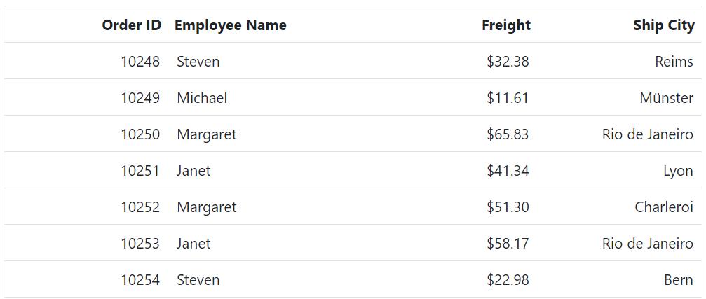
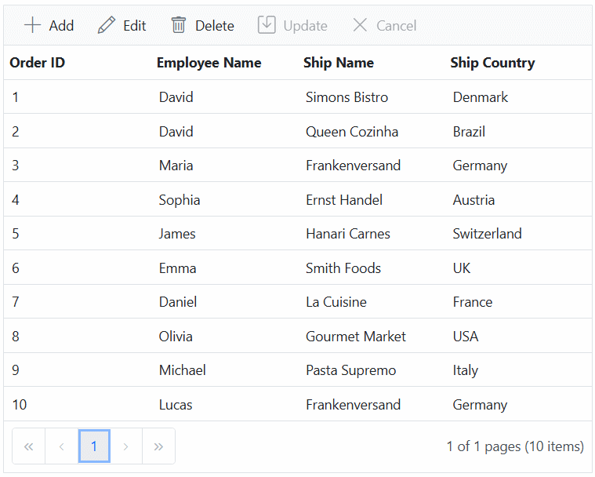

# Foreign key column in Blazor DataGrid

The Syncfusion&reg; Blazor DataGrid supports displaying related data from a **foreign key data source** in a column. This feature is useful when a column represents a foreign key relationship with another data source.

A foreign key column can be configured using the following properties of the [GridForeignColumn](https://help.syncfusion.com/cr/blazor/Syncfusion.Blazor.Grids.GridForeignColumn-1.html) directive:

* [ForeignDataSource](https://help.syncfusion.com/cr/blazor/Syncfusion.Blazor.Grids.GridForeignColumn-1.html#Syncfusion_Blazor_Grids_GridForeignColumn_1_ForeignDataSource) – Specifies the data source that contains the related data.
* [ForeignKeyField](https://help.syncfusion.com/cr/blazor/Syncfusion.Blazor.Grids.GridColumn.html#Syncfusion_Blazor_Grids_GridColumn_ForeignKeyField) – Maps the column in the Grid to the field in the foreign data source that represents the foreign key.
* [ForeignKeyValue](https://help.syncfusion.com/cr/blazor/Syncfusion.Blazor.Grids.GridColumn.html#Syncfusion_Blazor_Grids_GridColumn_ForeignKeyValue) – Specifies the field from the foreign data source that should be displayed in the Grid.

## Binding local data

The Syncfusion&reg; Blazor DataGrid supports binding local data to a foreign key column. This allows related data from a local data source to be displayed within the Grid.



@using Syncfusion.Blazor.Grids

<SfGrid DataSource="@Orders" Height="315">
    <GridColumns>
        <GridColumn Field=@nameof(OrderDetails.OrderID) HeaderText="Order ID" TextAlign="TextAlign.Right" Width="120"></GridColumn>
        <GridForeignColumn Field=@nameof(OrderDetails.EmployeeID) HeaderText="Employee Name" ForeignKeyValue="FirstName" ForeignDataSource="@Employees" Width="150"></GridForeignColumn>
        <GridColumn Field=@nameof(OrderDetails.Freight) HeaderText="Freight" Format="C2" TextAlign="TextAlign.Right" Width="120"></GridColumn>
        <GridColumn Field=@nameof(OrderDetails.ShipCity) HeaderText="Ship City" TextAlign="TextAlign.Right" Width="120"></GridColumn>
    </GridColumns>
</SfGrid>
@code {
    public List<OrderDetails> Orders { get; set; }
    public List<EmployeeDetails> Employees { get; set; }
    protected override void OnInitialized()
    {
        Orders = OrderDetails.GetAllRecords();
        Employees = EmployeeDetails.GetAllRecords();
    }
}


public class OrderDetails
{        
    public static List<OrderDetails> order = new List<OrderDetails>();    
    public OrderDetails(int OrderID, string Shipcity, int EmployeeId, double Freight)
    {
        this.OrderID = OrderID;
        this.ShipCity = Shipcity;
        this.EmployeeID = EmployeeId;
        this.Freight = Freight; 
    }
    public static List<OrderDetails> GetAllRecords()
    {
        if (order.Count == 0)
        {
            order.Add(new OrderDetails(10248, "Reims", 5, 32.38));
            order.Add(new OrderDetails(10249, "Münster", 6, 11.61));
            order.Add(new OrderDetails(10250, "Rio de Janeiro", 4, 65.83));
            order.Add(new OrderDetails(10251, "Lyon", 3, 41.34));
            order.Add(new OrderDetails(10252, "Charleroi", 4, 51.3));
            order.Add(new OrderDetails(10253, "Rio de Janeiro", 3, 58.17));
            order.Add(new OrderDetails(10254, "Bern", 5, 22.98));
            order.Add(new OrderDetails(10255, "Genève", 9, 48.33));
            order.Add(new OrderDetails(10256, "Resende", 3, 13.97));
            order.Add(new OrderDetails(10257, "San Cristóbal", 4, 81.91));
            order.Add(new OrderDetails(10258, "Graz", 1, 40.51));
            order.Add(new OrderDetails(10259, "México D.F.", 4, 3.25));
            order.Add(new OrderDetails(10260, "Köln", 4, 55.09));
            order.Add(new OrderDetails(10261, "Rio de Janeiro", 4, 3.05));
            order.Add(new OrderDetails(10262, "Albuquerque", 8, 48.29));
        }
        return order;
    }
    public int OrderID { get; set; }
    public string ShipCity { get; set; }
    public int EmployeeID { get; set; }
    public double Freight { get; set; } 
}
public class EmployeeDetails
{
    public static List<EmployeeDetails> employee = new List<EmployeeDetails>();
    public EmployeeDetails(int employeeID, string firstName)
    {
        this.EmployeeID = employeeID;
        this.FirstName = firstName;
    }
    public static List<EmployeeDetails> GetAllRecords()
    {
        if (employee.Count == 0)
        {
            employee.Add(new EmployeeDetails(1, "Nancy"));
            employee.Add(new EmployeeDetails(2, "Andrew"));
            employee.Add(new EmployeeDetails(3, "Janet"));
            employee.Add(new EmployeeDetails(4, "Margaret"));
            employee.Add(new EmployeeDetails(5, "Steven"));
            employee.Add(new EmployeeDetails(6, "Michael"));
            employee.Add(new EmployeeDetails(7, "Robert"));
            employee.Add(new EmployeeDetails(8, "Laura"));
            employee.Add(new EmployeeDetails(9, "Anne"));
        }
        return employee;
    }
    public int EmployeeID { get; set; }
    public string FirstName { get; set; }
}





## Binding remote data

The Syncfusion&reg; Blazor DataGrid supports binding remote data to a foreign key column using [SfDataManager](https://help.syncfusion.com/cr/blazor/Syncfusion.Blazor.Data.SfDataManager.html). This approach is useful when retrieving data from services such as **OData**, **Web API**, or other remote endpoints.



@using Syncfusion.Blazor.Grids

<SfGrid DataSource="@Orders" Height="315">
    <GridColumns>
        <GridColumn Field=@nameof(OrderDetails.OrderID) HeaderText="Order ID" TextAlign="TextAlign.Right" Width="120"></GridColumn>
         <GridForeignColumn TValue="EmployeeData" Field=@nameof(OrderDetails.EmployeeID) HeaderText="Employee Name" ForeignKeyValue="FirstName" Width="150">
            <Syncfusion.Blazor.Data.SfDataManager Url="https://services.odata.org/V4/Northwind/Northwind.svc/Employees" CrossDomain="true" Adaptor=" Syncfusion.Blazor.Adaptors.ODataV4Adaptor">
            </Syncfusion.Blazor.Data.SfDataManager>
        </GridForeignColumn>
        <GridColumn Field=@nameof(OrderDetails.Freight) HeaderText="Freight" Format="C2" TextAlign="TextAlign.Right" Width="120"></GridColumn>
        <GridColumn Field=@nameof(OrderDetails.ShipCity) HeaderText="Ship City" TextAlign="TextAlign.Right" Width="120"></GridColumn>
    </GridColumns>
</SfGrid>
@code {
    public List<OrderDetails> Orders { get; set; }  
    protected override void OnInitialized()
    {
        Orders = OrderDetails.GetAllRecords();      
    }
}


public class EmployeeData
    {
        public static List<EmployeeData> Employees = new List<EmployeeData>();
        public EmployeeData()
        {
        }        
        public int EmployeeID { get; set; }
        public string FirstName { get; set; }
    }
public class OrderDetails
{    
    public static List<OrderDetails> order = new List<OrderDetails>();
    public OrderDetails(int OrderID, string Shipcity, int EmployeeId, double Freight)
    {
        this.OrderID = OrderID;
        this.ShipCity = Shipcity;
        this.EmployeeID = EmployeeId;
        this.Freight = Freight; 
    }
    public static List<OrderDetails> GetAllRecords()
    {
        if (order.Count == 0)
        {
            order.Add(new OrderDetails(10248, "Reims", 5, 32.38));
            order.Add(new OrderDetails(10249, "Münster", 6, 11.61));
            order.Add(new OrderDetails(10250, "Rio de Janeiro", 4, 65.83));
            order.Add(new OrderDetails(10251, "Lyon", 3, 41.34));
            order.Add(new OrderDetails(10252, "Charleroi", 4, 51.3));
            order.Add(new OrderDetails(10253, "Rio de Janeiro", 3, 58.17));
            order.Add(new OrderDetails(10254, "Bern", 5, 22.98));
            order.Add(new OrderDetails(10255, "Genève", 9, 48.33));
            order.Add(new OrderDetails(10256, "Resende", 3, 13.97));
            order.Add(new OrderDetails(10257, "San Cristóbal", 4, 81.91));
            order.Add(new OrderDetails(10258, "Graz", 1, 40.51));
            order.Add(new OrderDetails(10259, "México D.F.", 4, 3.25));
            order.Add(new OrderDetails(10260, "Köln", 4, 55.09));
            order.Add(new OrderDetails(10261, "Rio de Janeiro", 4, 3.05));
            order.Add(new OrderDetails(10262, "Albuquerque", 8, 48.29));
        }
        return order;
    }
    public int OrderID { get; set; }
    public string ShipCity { get; set; }
    public int EmployeeID { get; set; }
    public double Freight { get; set; } 
}



<!-- cors issue   -->

> * For remote data, **sorting** and **grouping** operations are performed based on the [ForeignKeyField](https://help.syncfusion.com/cr/blazor/Syncfusion.Blazor.Grids.GridColumn.html#Syncfusion_Blazor_Grids_GridColumn_ForeignKeyField) property rather than the [ForeignKeyValue](https://help.syncfusion.com/cr/blazor/Syncfusion.Blazor.Grids.GridColumn.html#Syncfusion_Blazor_Grids_GridColumn_ForeignKeyValue) property.

> * If `ForeignKeyField` is not defined, the column uses the [Field](https://help.syncfusion.com/cr/blazor/Syncfusion.Blazor.Grids.GridColumn.html#Syncfusion_Blazor_Grids_GridColumn_Field) property of the [GridColumn](https://help.syncfusion.com/cr/blazor/Syncfusion.Blazor.Grids.GridColumn.html) directive.

## Use edit template in foreign key column

The Syncfusion&reg; Blazor DataGrid supports customizing the editor for a foreign key column using the [EditTemplate](https://help.syncfusion.com/cr/blazor/Syncfusion.Blazor.Grids.GridColumn.html#Syncfusion_Blazor_Grids_GridColumn_EditTemplate) feature. By default, a [dropdown](https://blazor.syncfusion.com/documentation/dropdown-list/getting-started-with-web-app) is rendered for editing foreign key columns. Other components, such as [ComboBox](https://blazor.syncfusion.com/documentation/combobox/getting-started-with-web-app), can be used by defining an edit template.



@using Syncfusion.Blazor.Grids
@using Syncfusion.Blazor.DropDowns

<SfGrid DataSource="@Orders" Height="315" Toolbar="@(new List<string>() { "Add", "Edit", "Delete", "Cancel", "Update" })">
    <GridEditSettings AllowAdding="true" AllowDeleting="true" AllowEditing="true"></GridEditSettings>
    <GridColumns>
        <GridColumn Field=@nameof(OrderData.OrderID) HeaderText="Order ID" IsPrimaryKey="true" TextAlign="TextAlign.Right" Width="120"></GridColumn>
        <GridForeignColumn Field=@nameof(OrderData.EmployeeID) HeaderText="Employee Name" ForeignKeyValue="FirstName" ForeignDataSource="@Employees" Width="150">
            <EditTemplate>
                <SfComboBox TValue="int?" TItem="EmployeeData" @bind-Value="@((context as OrderData).EmployeeID)" DataSource="Employees">
                    <ComboBoxFieldSettings Value="EmployeeID" Text="FirstName"></ComboBoxFieldSettings>
                </SfComboBox>
            </EditTemplate>
        </GridForeignColumn>
        <GridColumn Field=@nameof(OrderData.Freight) HeaderText="Freight" Format="C2" TextAlign="TextAlign.Right" Width="120"></GridColumn>
        <GridColumn Field=@nameof(OrderData.ShipCity) HeaderText="Ship City" Width="120"></GridColumn>
    </GridColumns>
</SfGrid>
@code {
    public List<OrderData> Orders { get; set; }
    public List<EmployeeData> Employees { get; set; }
    protected override void OnInitialized()
    {
        Orders = OrderData.GetAllRecords();
        Employees = EmployeeData.GetAllRecords();
    }
}


    public class EmployeeData
    {
        public static List<EmployeeData> Employees = new List<EmployeeData>();
        public EmployeeData() 
        { 

        }
        public EmployeeData(int? employeeID, string firstName)
        {
            EmployeeID = employeeID;
            FirstName = firstName;
        }
        public static List<EmployeeData> GetAllRecords()
        {
            if (Employees.Count() == 0)
            {
                int code = 10;
                for (int i = 1; i < 2; i++)
                {
                    Employees.Add(new EmployeeData( 1, "Nancy"));
                    Employees.Add(new EmployeeData( 2, "Andrew"));
                    Employees.Add(new EmployeeData( 3, "Janet"));
                    Employees.Add(new EmployeeData( 4, "Nancy"));
                    Employees.Add(new EmployeeData( 5, "Margaret"));
                    Employees.Add(new EmployeeData( 6, "Steven"));
                    Employees.Add(new EmployeeData( 7, "Janet"));
                    Employees.Add(new EmployeeData( 8, "Andrew"));
                    Employees.Add(new EmployeeData(9, "Nancy"));
                    code += 5;
                }
            }
            return Employees;
        }
        public int? EmployeeID { get; set; }
        public string FirstName { get; set; }
    }
    public class OrderData
    {
        public static List<OrderData> Orders = new List<OrderData>();        
       
        public OrderData()
        {

        }
        public OrderData(int? OrderID, int? EmployeeID, string ShipCity, double? Freight)
        {
           this.OrderID = OrderID;
           this.EmployeeID = EmployeeID;
           this.ShipCity = ShipCity;
           this.Freight = Freight;            
        }
        public static List<OrderData> GetAllRecords()
        {
            if (Orders.Count() == 0)
            {
                int code = 10;
                for (int i = 1; i < 2; i++)
                {
                    Orders.Add(new OrderData(10248,1, "Reims", 32.18));
                    Orders.Add(new OrderData(10249,2, "Münster",33.33));
                    Orders.Add(new OrderData(10250,3, "Rio de Janeiro",12.35));
                    Orders.Add(new OrderData(10251,4, "Reims", 22.65));
                    Orders.Add(new OrderData(10252,5, "Lyon", 63.43));
                    Orders.Add(new OrderData(10253,6, "Charleroi",56.98));
                    Orders.Add(new OrderData(10254,7, "Rio de Janeiro", 45.65));
                    Orders.Add(new OrderData(10255,8, "Münster", 11.13));
                    Orders.Add(new OrderData(10256,9, "Reims", 87.59));
                    code += 5;
                }
            }
            return Orders;
        }
        public int? OrderID { get; set; }
        public int? EmployeeID { get; set; }
        public string ShipCity { get; set; }
        public double? Freight { get; set; }
    }





## Customize filter UI in foreign key column

The Syncfusion&reg; Blazor DataGrid allows customizing the filtering interface for foreign key columns using the [FilterTemplate](https://help.syncfusion.com/cr/blazor/Syncfusion.Blazor.Grids.GridColumn.html#Syncfusion_Blazor_Grids_GridColumn_FilterTemplate) property. By default, a dropdown is rendered for filtering foreign key columns. The `FilterTemplate` property enables creating a custom UI for filtering.

> For all filter types other than `FilterBar`, filtering parameters are passed as **PredicateModel<T>**, where **T** represents the type of the [ForeignKeyValue](https://help.syncfusion.com/cr/blazor/Syncfusion.Blazor.Grids.GridColumn.html#Syncfusion_Blazor_Grids_GridColumn_ForeignKeyValue) property when using a foreign key column.

In this configuration, a [DropDownList](https://blazor.syncfusion.com/documentation/dropdown-list/getting-started-with-web-app) is rendered as the filter UI for the **EmployeeID** foreign key column. The [DataSource](https://help.syncfusion.com/cr/blazor/Syncfusion.Blazor.DropDowns.SfDropDownBase-1.html#Syncfusion_Blazor_DropDowns_SfDropDownBase_1_DataSource) property of `SfDropDownList` is set to the **employees** collection, and the `Fields` property maps **FirstName** as the **display text** and **EmployeeID** as the **value**. The `Value` property is bound to the current filter value of the column.



@using Syncfusion.Blazor.Grids
@using Syncfusion.Blazor.DropDowns

<SfGrid DataSource="@Orders" Height="315" AllowFiltering="true">
    <GridFilterSettings Type="Syncfusion.Blazor.Grids.FilterType.Menu"></GridFilterSettings>
    <GridColumns>
        <GridColumn Field=@nameof(OrderDetails.OrderID) HeaderText="Order ID" IsPrimaryKey="true" TextAlign="TextAlign.Right" Width="120"></GridColumn>
        <GridForeignColumn Field=@nameof(OrderDetails.EmployeeID) HeaderText="Employee Name" ForeignKeyValue="FirstName" ForeignDataSource="@Employees" Width="150">
            <FilterTemplate>
                <SfDropDownList Placeholder="FirstName" ID="FirstName" @bind-Value="@((context as PredicateModel<string>).Value)" TItem="EmployeeDetails" TValue="string" DataSource="@Employees">
                    <DropDownListFieldSettings Value="FirstName" Text="FirstName"></DropDownListFieldSettings>
                </SfDropDownList>
            </FilterTemplate>
        </GridForeignColumn>
        <GridColumn Field=@nameof(OrderDetails.Freight) HeaderText="Freight" Format="C2" TextAlign="TextAlign.Right" Width="120"></GridColumn>
        <GridColumn Field=@nameof(OrderDetails.ShipCity) HeaderText="Ship City" Width="120"></GridColumn>
    </GridColumns>
</SfGrid>
@code {
    public List<OrderDetails> Orders { get; set; }
    public List<EmployeeDetails> Employees { get; set; }
    protected override void OnInitialized()
    {
        Orders = OrderDetails.GetAllRecords();
        Employees = EmployeeDetails.GetAllRecords();
    }   
}


public class OrderDetails
{
    public static List<OrderDetails> order = new List<OrderDetails>();    
    public OrderDetails(int OrderID, string Shipcity, int EmployeeId, double Freight)
    {
        this.OrderID = OrderID;
        this.ShipCity = Shipcity;
        this.EmployeeID = EmployeeId;
        this.Freight = Freight; 
    }
    public static List<OrderDetails> GetAllRecords()
    {
        if (order.Count == 0)
        {
            order.Add(new OrderDetails(10248, "Reims", 5, 32.38));
            order.Add(new OrderDetails(10249, "Münster", 6, 11.61));
            order.Add(new OrderDetails(10250, "Rio de Janeiro", 4, 65.83));
            order.Add(new OrderDetails(10251, "Lyon", 3, 41.34));
            order.Add(new OrderDetails(10252, "Charleroi", 4, 51.3));
            order.Add(new OrderDetails(10253, "Rio de Janeiro", 3, 58.17));
            order.Add(new OrderDetails(10254, "Bern", 5, 22.98));
            order.Add(new OrderDetails(10255, "Genève", 9, 48.33));
            order.Add(new OrderDetails(10256, "Resende", 3, 13.97));
            order.Add(new OrderDetails(10257, "San Cristóbal", 4, 81.91));
            order.Add(new OrderDetails(10258, "Graz", 1, 40.51));
            order.Add(new OrderDetails(10259, "México D.F.", 4, 3.25));
            order.Add(new OrderDetails(10260, "Köln", 4, 55.09));
            order.Add(new OrderDetails(10261, "Rio de Janeiro", 4, 3.05));
            order.Add(new OrderDetails(10262, "Albuquerque", 8, 48.29));
        }
        return order;
    }
    public int OrderID { get; set; }
    public string ShipCity { get; set; }
    public int EmployeeID { get; set; }
    public double Freight { get; set; } 
}
public class EmployeeDetails
{
    public static List<EmployeeDetails> employee = new List<EmployeeDetails>();
    public EmployeeDetails(int employeeID, string firstName)
    {
        this.EmployeeID = employeeID;
        this.FirstName = firstName;
    }
    public static List<EmployeeDetails> GetAllRecords()
    {
        if (employee.Count == 0)
        {
            employee.Add(new EmployeeDetails(1, "Nancy"));
            employee.Add(new EmployeeDetails(2, "Andrew"));
            employee.Add(new EmployeeDetails(3, "Janet"));
            employee.Add(new EmployeeDetails(4, "Margaret"));
            employee.Add(new EmployeeDetails(5, "Steven"));
            employee.Add(new EmployeeDetails(6, "Michael"));
            employee.Add(new EmployeeDetails(7, "Robert"));
            employee.Add(new EmployeeDetails(8, "Laura"));
            employee.Add(new EmployeeDetails(9, "Anne"));
        }
        return employee;
    }
    public int EmployeeID { get; set; }
    public string FirstName { get; set; }
}





> [View Sample in GitHub.](https://github.com/SyncfusionExamples/blazor-datagrid-customize-filter-ui-in-foreignkey-column)

## Use filter bar template in foreign key column

The Syncfusion&reg; Blazor DataGrid allows customizing the filter bar for foreign key columns using the [FilterTemplate](https://help.syncfusion.com/cr/blazor/Syncfusion.Blazor.Grids.GridColumn.html#Syncfusion_Blazor_Grids_GridColumn_FilterTemplate) property. This feature enables rendering a custom component or HTML template in the filter bar instead of the default UI.



@using Syncfusion.Blazor.Grids
@using Syncfusion.Blazor.DropDowns

<SfGrid @ref="Grid" DataSource="@Orders" Height="315" AllowFiltering="true">
    <GridColumns>
        <GridColumn Field=@nameof(OrderDetails.OrderID) HeaderText="Order ID" TextAlign="TextAlign.Right" Width="120"></GridColumn>
        <GridForeignColumn Field=@nameof(OrderDetails.EmployeeID) HeaderText="Employee Name" ForeignKeyValue="FirstName" ForeignDataSource="@Employees" Width="150">
            <FilterTemplate>
                <SfDropDownList ID="EmployeeID" PlaceHolder="Employee Name" Value="@((string)(context as PredicateModel).Value)" DataSource="@DropDownData" TValue="string" TItem="DropDownOrder">
                    <DropDownListEvents ValueChange="@Change" TItem="DropDownOrder" TValue="string"></DropDownListEvents>
                    <DropDownListFieldSettings Value="FirstName" Text="FirstName"></DropDownListFieldSettings>
                </SfDropDownList>
            </FilterTemplate>
        </GridForeignColumn>
        <GridColumn Field=@nameof(OrderDetails.Freight) HeaderText="Freight" Format="C2" TextAlign="TextAlign.Right" Width="120"></GridColumn>
        <GridColumn Field=@nameof(OrderDetails.ShipCity) HeaderText="Ship City" Width="130"></GridColumn>
    </GridColumns>
</SfGrid>

@code {
    private SfGrid<OrderDetails> Grid;
    public List<OrderDetails> Orders { get; set; }
    public List<EmployeeDetails> Employees { get; set; }
    protected override void OnInitialized()
    {
        Orders = OrderDetails.GetAllRecords();
        Employees = EmployeeDetails.GetAllRecords();
    }
    public async Task Change(@Syncfusion.Blazor.DropDowns.ChangeEventArgs<string, DropDownOrder> args)
    {   
        if (args.Value == "All" || args.Value == null)
        {
            await Grid.ClearFilteringAsync();
        }
        else
        {
            await Grid.FilterByColumnAsync("EmployeeID", "contains", args.Value);
        }
    }
    public class DropDownOrder
    {
        public string FirstName { get; set; }
    }
    List<DropDownOrder> DropDownData = new List<DropDownOrder>
    {
        new DropDownOrder() { FirstName = "All" },
        new DropDownOrder() { FirstName = "Nancy" },
        new DropDownOrder() { FirstName = "Janet" },
        new DropDownOrder() { FirstName = "Margaret" },
        new DropDownOrder() { FirstName = "Steven" },
        new DropDownOrder() { FirstName = "Michael" },
        new DropDownOrder() { FirstName = "Laura" },
        new DropDownOrder() { FirstName = "Anne" },
    };
}


public class OrderDetails
{
    public static List<OrderDetails> order = new List<OrderDetails>();    
    public OrderDetails(int OrderID, string Shipcity, int EmployeeId, double Freight)
    {
        this.OrderID = OrderID;
        this.ShipCity = Shipcity;
        this.EmployeeID = EmployeeId;
        this.Freight = Freight; 
    }
    public static List<OrderDetails> GetAllRecords()
    {
        if (order.Count == 0)
        {
            order.Add(new OrderDetails(10248, "Reims", 5, 32.38));
            order.Add(new OrderDetails(10249, "Münster", 6, 11.61));
            order.Add(new OrderDetails(10250, "Rio de Janeiro", 4, 65.83));
            order.Add(new OrderDetails(10251, "Lyon", 3, 41.34));
            order.Add(new OrderDetails(10252, "Charleroi", 4, 51.3));
            order.Add(new OrderDetails(10253, "Rio de Janeiro", 3, 58.17));
            order.Add(new OrderDetails(10254, "Bern", 5, 22.98));
            order.Add(new OrderDetails(10255, "Genève", 9, 48.33));
            order.Add(new OrderDetails(10256, "Resende", 3, 13.97));
            order.Add(new OrderDetails(10257, "San Cristóbal", 4, 81.91));
            order.Add(new OrderDetails(10258, "Graz", 1, 40.51));
            order.Add(new OrderDetails(10259, "México D.F.", 4, 3.25));
            order.Add(new OrderDetails(10260, "Köln", 4, 55.09));
            order.Add(new OrderDetails(10261, "Rio de Janeiro", 4, 3.05));
            order.Add(new OrderDetails(10262, "Albuquerque", 8, 48.29));
        }
        return order;
    }
    public int OrderID { get; set; }
    public string ShipCity { get; set; }
    public int EmployeeID { get; set; }
    public double Freight { get; set; } 
}
public class EmployeeDetails
{
    public static List<EmployeeDetails> employee = new List<EmployeeDetails>();
    public EmployeeDetails(int employeeID, string firstName)
    {
        this.EmployeeID = employeeID;
        this.FirstName = firstName;
    }
    public static List<EmployeeDetails> GetAllRecords()
    {
        if (employee.Count == 0)
        {
            employee.Add(new EmployeeDetails(1, "Nancy"));
            employee.Add(new EmployeeDetails(2, "Andrew"));
            employee.Add(new EmployeeDetails(3, "Janet"));
            employee.Add(new EmployeeDetails(4, "Margaret"));
            employee.Add(new EmployeeDetails(5, "Steven"));
            employee.Add(new EmployeeDetails(6, "Michael"));
            employee.Add(new EmployeeDetails(7, "Robert"));
            employee.Add(new EmployeeDetails(8, "Laura"));
            employee.Add(new EmployeeDetails(9, "Anne"));
        }
        return employee;
    }
    public int EmployeeID { get; set; }
    public string FirstName { get; set; }
}





## Perform aggregation in foreign key column

By default, the Syncfusion&reg; Blazor DataGrid does not support aggregation in foreign key columns. However, this can be achieved by using a custom aggregate function.

To perform aggregation in a foreign key column:

1. Define a foreign key column in the Grid.
2. Implement a custom aggregate function to calculate the required value.
3. Assign the function to the `CustomAggregate` property of the aggregate column.



@using Syncfusion.Blazor.Grids

<SfGrid DataSource="@OrderData" Height="315" >
    <GridAggregates>
        <GridAggregate>
            <GridAggregateColumns>
                <GridAggregateColumn Field="EmployeeID" Type="AggregateType.Custom">
                    <FooterTemplate Context="data">
                        Count of Margaret: @CustomAggregateFn()
                    </FooterTemplate>
                </GridAggregateColumn>
            </GridAggregateColumns>
        </GridAggregate>
    </GridAggregates>
    <GridColumns>
        <GridColumn Field=@nameof(OrderDetails.OrderID) HeaderText="Order ID" IsPrimaryKey="true" TextAlign="TextAlign.Right" Width="100"></GridColumn>
        <GridForeignColumn Field=@nameof(OrderDetails.EmployeeID) HeaderText="Employee Name" ForeignKeyValue="FirstName" ForeignDataSource="@EmployeeData" Width="120"></GridForeignColumn>
        <GridColumn Field=@nameof(OrderDetails.Freight) HeaderText="Freight" TextAlign="TextAlign.Right" Width="100"></GridColumn>
        <GridColumn Field=@nameof(OrderDetails.ShipCity) HeaderText="Ship City" TextAlign="TextAlign.Right" Width="130"></GridColumn>
    </GridColumns>
</SfGrid>
@code {
    public List<OrderDetails> OrderData { get; set; }
    public List<EmployeeDetails> EmployeeData { get; set; }
    protected override void OnInitialized()
    {
        OrderData = OrderDetails.GetAllRecords();
        EmployeeData = EmployeeDetails.GetAllRecords();
    }   
    private int CustomAggregateFn()
    {
        var Count=  OrderData.Count(order => EmployeeData
            .FirstOrDefault(data => data.EmployeeID == order.EmployeeID)?.FirstName == "Margaret");
        return Count;
    }    
}


public class OrderDetails
{
    public static List<OrderDetails> order = new List<OrderDetails>();    
    public OrderDetails(int OrderID, string Shipcity, int EmployeeId, double Freight)
    {
        this.OrderID = OrderID;
        this.ShipCity = Shipcity;
        this.EmployeeID = EmployeeId;
        this.Freight = Freight; 
    }
    public static List<OrderDetails> GetAllRecords()
    {
        if (order.Count == 0)
        {
            order.Add(new OrderDetails(10248, "Reims", 5, 32.38));
            order.Add(new OrderDetails(10249, "Münster", 6, 11.61));
            order.Add(new OrderDetails(10250, "Rio de Janeiro", 4, 65.83));
            order.Add(new OrderDetails(10251, "Lyon", 3, 41.34));
            order.Add(new OrderDetails(10252, "Charleroi", 4, 51.3));
            order.Add(new OrderDetails(10253, "Rio de Janeiro", 3, 58.17));
            order.Add(new OrderDetails(10254, "Bern", 5, 22.98));
            order.Add(new OrderDetails(10255, "Genève", 9, 48.33));
            order.Add(new OrderDetails(10256, "Resende", 3, 13.97));
            order.Add(new OrderDetails(10257, "San Cristóbal", 4, 81.91));
            order.Add(new OrderDetails(10258, "Graz", 1, 40.51));
            order.Add(new OrderDetails(10259, "México D.F.", 4, 3.25));
            order.Add(new OrderDetails(10260, "Köln", 4, 55.09));
            order.Add(new OrderDetails(10261, "Rio de Janeiro", 4, 3.05));
            order.Add(new OrderDetails(10262, "Albuquerque", 8, 48.29));
        }
        return order;
    }
    public int OrderID { get; set; }
    public string ShipCity { get; set; }
    public int EmployeeID { get; set; }
    public double Freight { get; set; } 
}
public class EmployeeDetails
{
    public static List<EmployeeDetails> employee = new List<EmployeeDetails>();
    public EmployeeDetails(int employeeID, string firstName)
    {
        this.EmployeeID = employeeID;
        this.FirstName = firstName;
    }
    public static List<EmployeeDetails> GetAllRecords()
    {
        if (employee.Count == 0)
        {
            employee.Add(new EmployeeDetails(1, "Nancy"));
            employee.Add(new EmployeeDetails(2, "Andrew"));
            employee.Add(new EmployeeDetails(3, "Janet"));
            employee.Add(new EmployeeDetails(4, "Margaret"));
            employee.Add(new EmployeeDetails(5, "Steven"));
            employee.Add(new EmployeeDetails(6, "Michael"));
            employee.Add(new EmployeeDetails(7, "Robert"));
            employee.Add(new EmployeeDetails(8, "Laura"));
            employee.Add(new EmployeeDetails(9, "Anne"));
        }
        return employee;
    }
    public int EmployeeID { get; set; }
    public string FirstName { get; set; }
}





## Prevent filter query generation for foreign key column

By default, the DataGrid generates a filter query for foreign key columns based on the foreign key value. To override this behavior and apply a custom filter query, use the [Filtering](https://help.syncfusion.com/cr/blazor/Syncfusion.Blazor.Grids.GridEvents-1.html#Syncfusion_Blazor_Grids_GridEvents_1_Filtering) event and set the [PreventFilterQuery](https://help.syncfusion.com/cr/blazor/Syncfusion.Blazor.Grids.FilteringEventArgs.html#Syncfusion_Blazor_Grids_FilteringEventArgs_PreventFilterQuery) property to **true**. Then, define a custom query using the `Query` class.




@using Syncfusion.Blazor
@using Syncfusion.Blazor.Data
@using Syncfusion.Blazor.Grids

<SfGrid ID="Grid" @ref="Grid" Query="@currentQuery" TValue="OrderDto" Toolbar="@ToolbarItems" Height="100%" AllowPaging="true" AllowSorting="true" AllowFiltering="true">
    <GridPageSettings PageSize="10" PageSizes="true" />
    <SfDataManager Url="https://services.odata.org/V4/Northwind/Northwind.svc/Orders" Adaptor="Adaptors.ODataV4Adaptor" />
    <GridEvents TValue="OrderDto" Filtering="FilteringHandler" />
    <GridEditSettings AllowAdding="false" AllowEditing="false" AllowDeleting="false" Mode="@EditMode.Normal" />

    <GridColumns>
        <GridColumn Field="@nameof(OrderDto.OrderID)" HeaderText="Order ID" IsPrimaryKey="true" Width="130" TextAlign="TextAlign.Center" />
        <GridColumn Field="@nameof(OrderDto.CustomerID)" HeaderText="Customer ID" Width="140" />
        <GridForeignColumn TValue="EmployeeDto" Field="@nameof(OrderDto.EmployeeID)" HeaderText="Employee" AllowFiltering="true" ForeignKeyField="@nameof(EmployeeDto.EmployeeID)" ForeignKeyValue="@nameof(EmployeeDto.FirstName)" Width="160">
            <SfDataManager Url="https://services.odata.org/V4/Northwind/Northwind.svc/Employees" Adaptor="Adaptors.ODataV4Adaptor" />
        </GridForeignColumn>
        <GridColumn Field="@nameof(OrderDto.OrderDate)" HeaderText="Order Date" Type="ColumnType.Date" Format="d" Width="160" />
        <GridColumn Field="@nameof(OrderDto.ShipCountry)" HeaderText="Ship Country" Width="160" />
    </GridColumns>
</SfGrid>

@code {
    private SfGrid<OrderDto> Grid { get; set; }
    private Query currentQuery = new Query();
    public List<string> ToolbarItems = new() { "Search" };

    private void FilteringHandler(Syncfusion.Blazor.Grids.FilteringEventArgs args)
    {
        if (!string.Equals(args.ColumnName, nameof(OrderDto.EmployeeID), StringComparison.OrdinalIgnoreCase))
        {
            return;
        }

        args.PreventFilterQuery = true;

        if (args.FilterPredicates is null || args.FilterPredicates.Count == 0)
        {
            currentQuery = new Query();
            return;
        }

        currentQuery = new Query();
        foreach (var p in args.FilterPredicates)
        {
            const string navigationField = "Employee/FirstName";
            var op = p.Operator.ToString()?.ToLowerInvariant();
            if (string.IsNullOrWhiteSpace(op)) continue;

            var value = p.Value ?? p.ActualValue;
            var caseInsensitive = p.MatchCase == false;
            var ignoreAccent = p.IgnoreAccent;

            currentQuery = currentQuery.Where(navigationField, op, value, caseInsensitive, ignoreAccent);
        }
    }

    public class OrderDto
    {
        public int OrderID { get; set; }
        public string CustomerID { get; set; }
        public int EmployeeID { get; set; }
        public DateTime? OrderDate { get; set; }
        public string ShipCountry { get; set; }
    }

    public class EmployeeDto
    {
        public int EmployeeID { get; set; }
        public string FirstName { get; set; }
        public string LastName { get; set; }
        public string Title { get; set; }
        public string City { get; set; }
        public string Country { get; set; }
    }
}




## Render foreign key value in column template

The Syncfusion&reg; Blazor DataGrid supports rendering foreign key values within a [column template](https://blazor.syncfusion.com/documentation/datagrid/column-template), enabling display of descriptive values from a related data source instead of the underlying foreign key. This approach is useful when a foreign key refers to an ID and a corresponding name or label needs to be shown.

To configure this feature, define a column using the [Template](https://help.syncfusion.com/cr/blazor/Syncfusion.Blazor.Grids.GridColumn.html#Syncfusion_Blazor_Grids_GridColumn_Template) property and bind the required value from the foreign key mapping.



@using Syncfusion.Blazor.Grids
@inject IJSRuntime JS

<SfGrid DataSource="@Orders" Height="315">
    <GridColumns>
        <GridColumn Field="OrderID" HeaderText="Order ID" IsPrimaryKey="true" Width="120" TextAlign="Syncfusion.Blazor.Grids.TextAlign.Right" />
        <GridForeignColumn Field="EmployeeID" HeaderText="Employee Name" ForeignDataSource="@Employees" ForeignKeyField="EmployeeID" ForeignKeyValue="FirstName" Width="150">
            <Template Context="data">
                @{
                    var order = (OrderData)data;
                    var emp = Employees.FirstOrDefault(e => e.EmployeeID == order.EmployeeID);
                }
                <a href="#" @onclick="() => LogToConsole(order?.OrderID)">@emp?.FirstName</a>
            </Template>
        </GridForeignColumn>
        <GridColumn Field="Freight" HeaderText="Freight" Format="C2" Width="120" TextAlign="Syncfusion.Blazor.Grids.TextAlign.Right" />
        <GridColumn Field="ShipCity" HeaderText="Ship City" Width="120" TextAlign="Syncfusion.Blazor.Grids.TextAlign.Right" />
    </GridColumns>
</SfGrid>
@code {
    public List<OrderData> Orders { get; set; }
    public List<EmployeeData> Employees { get; set; }
    protected override void OnInitialized()
    {
        Employees = EmployeeData.GetAllRecords();
        Orders = OrderData.GetAllRecords();
    }
    private async Task LogToConsole(int? orderId)
    {
        await JS.InvokeVoidAsync("console.log", $"OrderID clicked: {orderId}");
    }
    public class EmployeeData
    {
        public int? EmployeeID { get; set; }
        public string FirstName { get; set; }
        public EmployeeData(int? employeeID, string firstName)
        {
            EmployeeID = employeeID;
            FirstName = firstName;
        }
        public static List<EmployeeData> GetAllRecords()
        {
            return new List<EmployeeData>
            {
                new EmployeeData(1, "Nancy"),
                new EmployeeData(2, "Andrew"),
                new EmployeeData(3, "Janet"),
                new EmployeeData(4, "Margaret"),
                new EmployeeData(5, "Steven")
            };
        }
    }
    public class OrderData
    {
        public int? OrderID { get; set; }
        public int? EmployeeID { get; set; }
        public string ShipCity { get; set; }
        public double? Freight { get; set; }
        public OrderData(int? orderId, int? employeeId, string shipCity, double? freight)
        {
            OrderID = orderId;
            EmployeeID = employeeId;
            ShipCity = shipCity;
            Freight = freight;
        }
        public static List<OrderData> GetAllRecords()
        {
            return new List<OrderData>
            {
                new OrderData(10248, 1, "Reims", 32.18),
                new OrderData(10249, 2, "Münster", 33.33),
                new OrderData(10250, 3, "Rio de Janeiro", 12.35),
                new OrderData(10251, 4, "Lyon", 63.43),
                new OrderData(10252, 5, "Charleroi", 56.98),
            };
        }
    }
}






## Enable multiple foreign key columns

The Syncfusion&reg; Blazor DataGrid supports configuring multiple foreign key columns with editing options. This feature allows displaying related data from different foreign data sources in the Grid.



@using Syncfusion.Blazor.Grids

<SfGrid DataSource="@Orders" Height="315" Toolbar="@(new List<string>() { "Add", "Delete", "Update", "Cancel" })">
    <GridEditSettings AllowAdding="true" AllowEditing="true" AllowDeleting="true"></GridEditSettings>
    <GridColumns>
        <GridColumn Field=@nameof(OrderDetails.OrderID) HeaderText="Order ID" IsPrimaryKey="true" TextAlign="Syncfusion.Blazor.Grids.TextAlign.Right" Width="120"></GridColumn>
        <GridForeignColumn Field=@nameof(OrderDetails.CustomerID) HeaderText="Customer Name" ForeignKeyValue="CustomerName" ForeignDataSource="@Employees" Width="150"></GridForeignColumn>
        <GridColumn Field=@nameof(OrderDetails.Freight) HeaderText="Freight" Format="C2" TextAlign="Syncfusion.Blazor.Grids.TextAlign.Right" Width="120"></GridColumn>
        <GridForeignColumn Field=@nameof(OrderDetails.EmployeeID) HeaderText=" Ship City" ForeignKeyValue="City" ForeignDataSource="@Countries" Width="150"></GridForeignColumn>
        <GridColumn Field=@nameof(OrderDetails.ShipCountry) HeaderText="Ship Country" Width="120"></GridColumn>
    </GridColumns>
</SfGrid>
@code {
    public List<OrderDetails> Orders { get; set; }
    public List<CountryDetails> Countries { get; set; }
    public List<EmployeeDetails> Employees { get; set; }
    protected override void OnInitialized()
    {
        Orders = OrderDetails.GetAllRecords();
        Employees = EmployeeDetails.GetAllRecords();
        Countries = CountryDetails.GetAllRecords();
    }
}


public class OrderDetails
{
    public static List<OrderDetails> order = new List<OrderDetails>();
    public OrderDetails(int OrderID, string CustomerId, int EmployeeId, string Shipcountry, double Freight)
    {
        this.OrderID = OrderID;
        this.CustomerID = CustomerId;
        this.EmployeeID = EmployeeId;
        this.ShipCountry = Shipcountry;
        this.Freight = Freight; 
    }
    public static List<OrderDetails> GetAllRecords()
    {
        if (order.Count == 0)
        {
            order.Add(new OrderDetails(10248, "VINET", 3, "France",  32.38));
            order.Add(new OrderDetails(10249, "TOMSP", 5, "Germany",  11.61));
            order.Add(new OrderDetails(10250, "HANAR", 1, "Brazil",  65.83));
            order.Add(new OrderDetails(10251, "VICTE", 6, "France", 41.34));
            order.Add(new OrderDetails(10252, "SUPRD", 2, "Belgium", 51.3));
            order.Add(new OrderDetails(10253, "HANAR", 4, "Brazil",  58.17));
            order.Add(new OrderDetails(10254, "CHOPS", 9, "Switzerland",  22.98));
            order.Add(new OrderDetails(10255, "RICSU", 7, "Switzerland",  148.33));
            order.Add(new OrderDetails(10256, "WELLI", 8, "Brazil",  13.97));
            order.Add(new OrderDetails(10257, "HILAA", 5, "Venezuela",  81.91));
            order.Add(new OrderDetails(10258, "ERNSH", 1, "Austria",  140.51));
            order.Add(new OrderDetails(10259, "CENTC", 6, "Mexico", 3.25));
            order.Add(new OrderDetails(10260, "OTTIK", 2, "Germany", 55.09));
            order.Add(new OrderDetails(10261, "QUEDE", 7, "Brazil", 3.05));
            order.Add(new OrderDetails(10262, "RATTC", 4, "USA", 48.29));
        }
        return order;
    }
    public int OrderID { get; set; }
    public string CustomerID { get; set; }
    public int EmployeeID { get; set; }
    public string ShipCountry { get; set; }
    public double Freight { get; set; } 
}
public class CountryDetails
{
    public static List<CountryDetails> country = new List<CountryDetails>();
    public CountryDetails(int employeeID, string city)
    {
        this.EmployeeID = employeeID;
        this.City = city;
    }
    public static List<CountryDetails> GetAllRecords()
    {
        if (country.Count == 0)
        {
            country.Add(new CountryDetails(1, "Seattle"));
            country.Add(new CountryDetails(2, "Tacoma"));
            country.Add(new CountryDetails(3, "Kirkland"));
            country.Add(new CountryDetails(4, "Redmond"));
            country.Add(new CountryDetails(5, "London"));
            country.Add(new CountryDetails(6, "London"));
            country.Add(new CountryDetails(7, "London"));
            country.Add(new CountryDetails(8, "Seattle"));
            country.Add(new CountryDetails(9, "London"));
        }
        return country;
    }
    public int EmployeeID { get; set; }
    public string City { get; set; }
}
public class EmployeeDetails
{
    public static List<EmployeeDetails> employee = new List<EmployeeDetails>();
    public EmployeeDetails(string customerId, string customerName)
    {
        this.CustomerID = customerId;
        this.CustomerName = customerName;
    }
    public static List<EmployeeDetails> GetAllRecords()
    {
        if (employee.Count == 0)
        {
            employee.Add(new EmployeeDetails("VINET", "Paul Henriot"));
            employee.Add(new EmployeeDetails("TOMSP", "Karin Josephs"));
            employee.Add(new EmployeeDetails("HANAR", "Mario Pontes"));
            employee.Add(new EmployeeDetails("VICTE", "Mary Saveley"));
            employee.Add(new EmployeeDetails("SUPRD", "Pascale Cartrain"));
            employee.Add(new EmployeeDetails("HANAR", "Mario Pontes"));
            employee.Add(new EmployeeDetails("CHOPS", "Yang Wang"));
            employee.Add(new EmployeeDetails("RICSU", "Michael Holz"));
            employee.Add(new EmployeeDetails("WELLI", "Paula Parente"));
            employee.Add(new EmployeeDetails("HILAA", "Carlos Hernández"));
            employee.Add(new EmployeeDetails("ERNSH", "Roland Mendel"));
            employee.Add(new EmployeeDetails("CENTC", "Francisco Chang"));
            employee.Add(new EmployeeDetails("OTTIK", "Henriette Pfalzheim"));
            employee.Add(new EmployeeDetails("QUEDE", "Bernardo Batista"));
            employee.Add(new EmployeeDetails("RATTC", "Paula Wilson"));
        }
        return employee;
    }
    public string CustomerID { get; set; }
    public string CustomerName { get; set; }
} 





## Edit template in foreign key column using remote data

The Syncfusion&reg; Blazor DataGrid supports customizing the edit template for foreign key columns when using remote data. By default, a [DropDownList](https://blazor.syncfusion.com/documentation/dropdown-list/getting-started-with-web-app) is rendered for editing. Other components, such as [AutoComplete](https://blazor.syncfusion.com/documentation/autocomplete/getting-started-with-web-app), can be used by defining an [EditTemplate](https://help.syncfusion.com/cr/blazor/Syncfusion.Blazor.Grids.GridColumn.html#Syncfusion_Blazor_Grids_GridColumn_EditTemplate).

**Key steps**

1. Configure [SfDataManager](https://help.syncfusion.com/cr/blazor/Syncfusion.Blazor.Data.SfDataManager.html) in the Grid for remote **CRUD** operations using [UrlAdaptor](https://help.syncfusion.com/cr/blazor/Syncfusion.Blazor.Adaptors.html#Syncfusion_Blazor_Adaptors_UrlAdaptor).
2. Render `SfDataManager` inside the foreign key column for remote foreign data.
3. Use `EditTemplate` to render a custom component like [SfAutoComplete](https://help.syncfusion.com/cr/blazor/Syncfusion.Blazor.DropDowns.SfAutoComplete-2.html), bind the foreign key field using [@bind-Value](https://help.syncfusion.com/cr/blazor/Syncfusion.Blazor.DropDowns.SfDropDownList-2.html#Syncfusion_Blazor_DropDowns_SfDropDownList_2_Value), and configure [AutoCompleteFieldSettings](https://help.syncfusion.com/cr/blazor/Syncfusion.Blazor.DropDowns.AutoCompleteFieldSettings.html) with [Text](https://help.syncfusion.com/cr/blazor/Syncfusion.Blazor.DropDowns.AutoCompleteFieldSettings.html#Syncfusion_Blazor_DropDowns_AutoCompleteFieldSettings_Text) and [Value](https://help.syncfusion.com/cr/blazor/Syncfusion.Blazor.DropDowns.AutoCompleteFieldSettings.html#Syncfusion_Blazor_DropDowns_AutoCompleteFieldSettings_Value).

> For detailed configuration of remote data operations, refer to the [UrlAdaptor documentation](https://blazor.syncfusion.com/documentation/datagrid/connecting-to-adaptors/url-adaptor).




@using Syncfusion.Blazor.Data
@using EditTemplate.Models
@using Syncfusion.Blazor.DropDowns

<SfGrid TValue="OrdersDetails" AllowPaging="true" Toolbar="@new List<string>() { "Add", "Edit", "Delete", "Update", "Cancel" }">

    <SfDataManager Url="https://localhost:xxxx/api/grid"
                   InsertUrl="https://localhost:xxxx/api/grid/Insert"
                   UpdateUrl="https://localhost:xxxx/api/grid/Update"
                   RemoveUrl="https://localhost:xxxx/api/grid/Remove"
                   Adaptor="Adaptors.UrlAdaptor">
    </SfDataManager>

    <GridEditSettings AllowEditing="true" AllowAdding="true" AllowDeleting="true"></GridEditSettings>

    <GridColumns>
        <GridColumn Field="@nameof(OrdersDetails.OrderID)" HeaderText="Order ID" IsPrimaryKey="true" Width="150"></GridColumn>
        <GridForeignColumn TValue="EmployeeData" Field="@nameof(OrdersDetails.EmployeeID)" HeaderText="Employee Name" ForeignKeyValue="FirstName" Width="150">
            <ChildContent>
                <SfDataManager Url="https://localhost:xxxx/api/employees" Adaptor="Adaptors.UrlAdaptor"></SfDataManager>
            </ChildContent>
            <EditTemplate>
                @{
                    var data = context as OrdersDetails;
                }
                <SfAutoComplete TValue="int?" TItem="EmployeeData" @bind-Value="data.EmployeeID">
                    <SfDataManager Url="https://localhost:xxxx/api/employees" Adaptor="Adaptors.UrlAdaptor"></SfDataManager>
                    <AutoCompleteFieldSettings Text="FirstName" Value="EmployeeID"></AutoCompleteFieldSettings>
                </SfAutoComplete>
            </EditTemplate>
        </GridForeignColumn>

        <GridColumn Field="@nameof(OrdersDetails.ShipName)" HeaderText="Ship Name" Width="150"></GridColumn>
        <GridColumn Field="@nameof(OrdersDetails.ShipCountry)" HeaderText="Ship Country" Width="150"></GridColumn>
    </GridColumns>
</SfGrid>

@code {
    public class OrdersDetails
    {
        public int? OrderID { get; set; }
        public int? EmployeeID { get; set; }
        public string? ShipCountry { get; set; }
        public string? ShipName { get; set; }
    }

    public class EmployeeData
    {
        public int EmployeeID { get; set; }
        public string FirstName { get; set; }
    }
}




