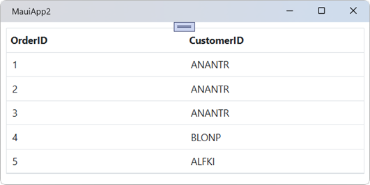

# Getting Started with Blazor DataGrid

The [Syncfusion<sup style="font-size:70%">&reg;</sup> Blazor DataGrid](https://www.syncfusion.com/blazor-components/blazor-datagrid) component provides a comprehensive solution for displaying and managing tabular data in **Blazor MAUI** applications. It supports essential features such as **data binding**, **sorting**, **filtering**, **paging**, and **grouping**, enabling efficient handling of large data collections. The component is designed for high performance and seamless integration with **.NET MAUI**, offering a consistent experience across platforms.

This guide provides detailed instructions for integrating the DataGrid into a **Blazor MAUI App** using [Visual Studio](https://visualstudio.microsoft.com/vs/) or [Visual Studio Code](https://code.visualstudio.com/). It includes setup steps, configuration details, and usage examples to assist in building robust applications.

> Ready to streamline your Syncfusion<sup style="font-size:70%">&reg;</sup> Blazor development?
Discover the full potential of Syncfusion<sup style="font-size:70%">&reg;</sup> Blazor components with Syncfusion<sup style="font-size:70%">&reg;</sup> AI Coding Assistants. Effortlessly integrate, configure, and enhance your projects with intelligent, context-aware code suggestions, streamlined setups, and real-time insights—all seamlessly integrated into your preferred AI-powered IDEs like VS Code, Cursor, Syncfusion<sup style="font-size:70%">&reg;</sup> CodeStudio and more. [Explore Syncfusion<sup style="font-size:70%">&reg;</sup> AI Coding Assistants](https://blazor.syncfusion.com/documentation/ai-coding-assistant/overview)





## Prerequisites

To use .NET MAUI project templates, install the **Mobile development with .NET** workload in Visual Studio.
For detailed instructions, refer to the [.NET MAUI installation](https://learn.microsoft.com/en-us/dotnet/maui/get-started/installation?view=net-maui-9.0&tabs=visual-studio) guide or the [Syncfusion<sup style="font-size:70%">&reg;</sup> Blazor Extension](https://blazor.syncfusion.com/documentation/visual-studio-integration/template-studio).

## Create a new Blazor MAUI App in Visual Studio

A Blazor MAUI application can be created using the **.NET MAUI Blazor App** template in Visual Studio with the built-in [Microsoft templates](https://learn.microsoft.com/en-us/aspnet/core/blazor/tooling?view=aspnetcore-10.0&pivots=vsc).

1. Open **Visual Studio** with the Mobile development with .NET workload installed.
2. Select **Create a new project**.
3. Choose **.NET MAUI Blazor App** from the list of templates and click **Next**.
4. Specify the **project name**, **location**, and **solution settings**, then click **Next**.
5. Select the latest available **.NET target framework**.
6. Click **Create** to generate the project.

> For detailed instructions, refer to the official [.NET MAUI getting started](https://blazor.syncfusion.com/documentation/getting-started/maui-blazor-app) guide.

## Install Syncfusion<sup style="font-size:70%">&reg;</sup> Blazor DataGrid and Themes in Visual Studio

To integrate the DataGrid component into a Blazor MAUI application, install the following NuGet packages:

1. Open **NuGet Package Manager** in Visual Studio:

    *Tools → NuGet Package Manager → Manage NuGet Packages for Solution*.

2. Search and install the following packages:

    - [Syncfusion.Blazor.Grid](https://www.nuget.org/packages/Syncfusion.Blazor.Grid/)
    - [Syncfusion.Blazor.Themes](https://www.nuget.org/packages/Syncfusion.Blazor.Themes/)

3. Alternatively, use the **Package Manager Console**:




Install-Package Syncfusion.Blazor.Grid -Version {{ site.releaseversion }}
Install-Package Syncfusion.Blazor.Themes -Version {{ site.releaseversion }}




N> Syncfusion<sup style="font-size:70%">&reg;</sup> Blazor components are available on [nuget.org](https://www.nuget.org/packages?q=syncfusion.blazor). For a complete list of packages, refer to [NuGet packages](https://blazor.syncfusion.com/documentation/nuget-packages).





## Prerequisites

To use .NET MAUI project templates, install the **Mobile development with .NET** workload in Visual Studio.
For detailed instructions, refer to the [.NET MAUI installation](https://learn.microsoft.com/en-us/dotnet/maui/get-started/installation?view=net-maui-9.0&tabs=visual-studio-code) guide or the [Syncfusion<sup style="font-size:70%">&reg;</sup> Blazor Extension](https://blazor.syncfusion.com/documentation/visual-studio-code-integration/create-project).

## Create a new Blazor MAUI App in Visual Studio Code

A Blazor MAUI application can be created using the **.NET CLI** commands in **Visual Studio Code**.

1. Install the latest **.NET SDK** that supports .NET MAUI.
2. Open **Visual Studio Code**.
3. Press **Ctrl + `** to open the integrated terminal.
4. Run the following command to create a new Blazor MAUI App:




dotnet new maui-blazor -o MauiBlazorApp
cd MauiBlazorApp




> For detailed instructions, refer to the [.NET MAUI getting started](https://blazor.syncfusion.com/documentation/getting-started/maui-blazor-app) guide.

## Install Blazor DataGrid and Themes NuGet in the App

To integrate the Blazor DataGrid component, install the required Syncfusion<sup style="font-size:70%">&reg;</sup> NuGet packages using the **integrated terminal**:

1. Press **Ctrl + `** to open the integrated terminal in Visual Studio Code.
2. Navigate to the directory containing the **.csproj** file.
3. Run the following commands to install the packages:

    * [Syncfusion.Blazor.Grid](https://www.nuget.org/packages/Syncfusion.Blazor.Grid)
    * [Syncfusion.Blazor.Themes](https://www.nuget.org/packages/Syncfusion.Blazor.Themes/)





Install-Package Syncfusion.Blazor.Grid -Version {{site.releaseversion}}
Install-Package Syncfusion.Blazor.Themes -Version {{site.releaseversion}}





N> Syncfusion<sup style="font-size:70%">&reg;</sup> Blazor components are available on [nuget.org](https://www.nuget.org/packages?q=syncfusion.blazor). For a complete list of packages, refer to [NuGet packages](https://blazor.syncfusion.com/documentation/nuget-packages).





## Add Import Namespaces

Open the **~/_Imports.razor** file and include the required namespaces for Syncfusion<sup style="font-size:70%">&reg;</sup> Blazor components:




@using Syncfusion.Blazor 
@using Syncfusion.Blazor.Grids




## Register Syncfusion<sup style="font-size:70%">&reg;</sup> Blazor Service

The Syncfusion<sup style="font-size:70%">&reg;</sup> Blazor service must be registered in the **~/MauiProgram.cs** file to enable component rendering.




using Microsoft.Extensions.Logging;
using Syncfusion.Blazor;
namespace MauiBlazorApp;
    public static class MauiProgram
    {
        public static MauiApp CreateMauiApp()
        {
            var builder = MauiApp.CreateBuilder();
            builder
            .UseMauiApp()
            .ConfigureFonts(fonts =>
            {
                fonts.AddFont("OpenSans-Regular.ttf", "OpenSansRegular");
            });
            builder.Services.AddMauiBlazorWebView();
            builder.Services.AddSyncfusionBlazor();

#if DEBUG
            builder.Services.AddBlazorWebViewDeveloperTools();
            builder.Logging.AddDebug();
#endif
            return builder.Build();
        }

    }




## Add stylesheet and script resources

Syncfusion<sup style="font-size:70%">&reg;</sup> Blazor themes and scripts are available through [Static Web Assets](https://blazor.syncfusion.com/documentation/appearance/themes#static-web-assets). Add the required references in the **~/wwwroot/index.html** file of the MAUI Blazor project.

```html
<head>
    <link href="_content/Syncfusion.Blazor.Themes/bootstrap5.css" rel="stylesheet" />
    <script src="_content/Syncfusion.Blazor.Core/scripts/syncfusion-blazor.min.js" type="text/javascript"></script>
</head>
```

N>
* Refer to [Blazor Themes](https://blazor.syncfusion.com/documentation/appearance/themes) for various methods to reference themes in a Blazor application:

    >* [Static Web Assets](https://blazor.syncfusion.com/documentation/appearance/themes#static-web-assets)
    >* [CDN](https://blazor.syncfusion.com/documentation/appearance/themes#cdn-reference)
    >* [Custom Resource Generator (CRG)](https://blazor.syncfusion.com/documentation/common/custom-resource-generator)

>* For script reference options, see [Adding Script References](https://blazor.syncfusion.com/documentation/common/adding-script-references).

## Add Blazor DataGrid component

Add the Syncfusion<sup style="font-size:70%">&reg;</sup> Blazor DataGrid component in the **~/Pages/Home.razor** file.




<SfGrid></SfGrid>




* The component will render as an empty grid until data is bound.

### How to Run the Sample on Windows

Run the application in Windows Machine mode to launch the Blazor MAUI app on Windows.



### How to Run the Sample on Android

To run the Blazor MAUI app on an Android emulator:

1. Install and configure the Android emulator using the [Android Device Manager guide](https://learn.microsoft.com/en-us/dotnet/maui/android/emulator/device-manager#android-device-manager-on-windows).
2. Launch the emulator and start the application.

N> For troubleshooting emulator issues, refer to [Troubleshooting Android Emulator](https://learn.microsoft.com/en-us/dotnet/maui/android/emulator/troubleshooting).


## Defining row data

The DataGrid requires a data source to display records. A collection implementing **IEnumerable<T>** can be assigned to the [DataSource](https://help.syncfusion.com/cr/blazor/Syncfusion.Blazor.Grids.SfGrid-1.html#Syncfusion_Blazor_Grids_SfGrid_1_DataSource) property. Alternatively, data can be provided through a [DataManager](https://blazor.syncfusion.com/documentation/data/getting-started-with-web-app) instance for **remote binding**.

Data binding is typically performed in the [OnInitialized](https://learn.microsoft.com/en-us/dotnet/api/microsoft.aspnetcore.components.componentbase.oninitialized?view=aspnetcore-10.0) lifecycle method of the component.





<SfGrid DataSource="@Orders">
</SfGrid>

@code {
    public List<Order> Orders { get; set; }

    protected override void OnInitialized()
    {
        Orders = Enumerable.Range(1, 75).Select(x => new Order()
        {
            OrderID = 1000 + x,
            CustomerID = (new[] { "ALFKI", "ANANTR", "ANTON", "BLONP", "BOLID" })[new Random().Next(5)],
            Freight = 2.1 * x,
            OrderDate = DateTime.Now.AddDays(-x)
        }).ToList();
    }

    public class Order
    {
        public int? OrderID { get; set; }
        public string CustomerID { get; set; }
        public DateTime? OrderDate { get; set; }
        public double? Freight { get; set; }
    }
}




* Press <kbd>Ctrl</kbd>+<kbd>F5</kbd> (Windows) or <kbd>⌘</kbd>+<kbd>F5</kbd> (macOS) to run the application. The DataGrid will render and display the collection.



## Defining columns

The DataGrid automatically generates columns when no explicit column definitions are provided. For greater control over column behavior and appearance, use the [GridColumns](https://help.syncfusion.com/cr/blazor/Syncfusion.Blazor.Grids.GridColumns.html) component along with individual [GridColumn](https://help.syncfusion.com/cr/blazor/Syncfusion.Blazor.Grids.GridColumn.html) elements to define columns explicitly.

**Common Column Properties**

* [Field](https://help.syncfusion.com/cr/blazor/Syncfusion.Blazor.Grids.GridColumn.html#Syncfusion_Blazor_Grids_GridColumn_Field): Maps the column to a property in the bound collection.
* [HeaderText](https://help.syncfusion.com/cr/blazor/Syncfusion.Blazor.Grids.GridColumn.html#Syncfusion_Blazor_Grids_GridColumn_HeaderText): Specifies the column header title.
* [TextAlign](https://help.syncfusion.com/cr/blazor/Syncfusion.Blazor.Grids.GridColumn.html#Syncfusion_Blazor_Grids_GridColumn_TextAlign): Aligns text within the column. Default alignment is Left; set to Right for numeric values.
* [Format](https://help.syncfusion.com/cr/blazor/Syncfusion.Blazor.Grids.GridColumn.html#Syncfusion_Blazor_Grids_GridColumn_Format): Applies standard or custom formatting for numeric and date values.
* [Type](https://help.syncfusion.com/cr/blazor/Syncfusion.Blazor.Grids.GridColumn.html#Syncfusion_Blazor_Grids_GridColumn_Type): Defines the column type, such as ColumnType.Date for date fields.
* [Width](https://help.syncfusion.com/cr/blazor/Syncfusion.Blazor.Grids.GridColumn.html#Syncfusion_Blazor_Grids_GridColumn_Width): Sets the column width in pixels or percentage to control layout consistency.





<SfGrid DataSource="@Orders">
    <GridColumns>
        <GridColumn Field=@nameof(Order.OrderID) HeaderText="Order ID" TextAlign="TextAlign.Right" Width="120"></GridColumn>
        <GridColumn Field=@nameof(Order.CustomerID) HeaderText="Customer Name" Width="150"></GridColumn>
        <GridColumn Field=@nameof(Order.OrderDate) HeaderText="Order Date" Format="d" Type="ColumnType.Date" TextAlign="TextAlign.Right" Width="130"></GridColumn>
        <GridColumn Field=@nameof(Order.Freight) HeaderText="Freight" Format="C2" TextAlign="TextAlign.Right" Width="120"></GridColumn>
    </GridColumns>
</SfGrid>




## Enable paging

[Paging](https://blazor.syncfusion.com/documentation/datagrid/paging) allows the DataGrid to display records in a paged view, improving performance and readability for large datasets. Enable paging by setting the [AllowPaging](https://help.syncfusion.com/cr/blazor/Syncfusion.Blazor.Grids.SfGrid-1.html#Syncfusion_Blazor_Grids_SfGrid_1_AllowPaging) property to **true**. Paging behavior can be customized using the [GridPageSettings](https://help.syncfusion.com/cr/blazor/Syncfusion.Blazor.Grids.GridPageSettings.html) component.




<SfGrid DataSource="@Orders" AllowPaging="true">
    <GridPageSettings PageSize="5"></GridPageSettings>
    <GridColumns>
        <GridColumn Field=@nameof(Order.OrderID) HeaderText="Order ID" TextAlign="TextAlign.Right" Width="120"></GridColumn>
        <GridColumn Field=@nameof(Order.CustomerID) HeaderText="Customer Name" Width="150"></GridColumn>
        <GridColumn Field=@nameof(Order.OrderDate) HeaderText="Order Date" Format="d" Type="ColumnType.Date" TextAlign="TextAlign.Right" Width="130"></GridColumn>
        <GridColumn Field=@nameof(Order.Freight) HeaderText="Freight" Format="C2" TextAlign="TextAlign.Right" Width="120"></GridColumn>
    </GridColumns>
</SfGrid>




## Enable sorting

[Sorting](https://blazor.syncfusion.com/documentation/datagrid/sorting) allows the DataGrid to arrange records based on column values. Enable this feature by setting the [AllowSorting](https://help.syncfusion.com/cr/blazor/Syncfusion.Blazor.Grids.SfGrid-1.html#Syncfusion_Blazor_Grids_SfGrid_1_AllowSorting) property to **true**. Sorting behavior can be customized using the [GridSortSettings](https://help.syncfusion.com/cr/blazor/Syncfusion.Blazor.Grids.GridSortSettings.html) component.




<SfGrid DataSource="@Orders" AllowPaging="true" AllowSorting="true">
 <GridPageSettings PageSize="5"></GridPageSettings>
   <GridColumns>
     <GridColumn Field=@nameof(Order.OrderID) HeaderText="Order ID" TextAlign="TextAlign.Right" Width="120"></GridColumn>
     <GridColumn Field=@nameof(Order.CustomerID) HeaderText="Customer Name" Width="150"></GridColumn>
     <GridColumn Field=@nameof(Order.OrderDate) HeaderText=" Order Date" Format="d" Type="ColumnType.Date" TextAlign="TextAlign.Right" Width="130"></GridColumn>
     <GridColumn Field=@nameof(Order.Freight) HeaderText="Freight" Format="C2" TextAlign="TextAlign.Right" Width="120"></GridColumn>
   </GridColumns>
</SfGrid>




## Enable filtering

[Filtering](https://blazor.syncfusion.com/documentation/datagrid/filtering) allows the DataGrid to display a subset of records based on specified criteria. Enable filtering by setting the [AllowFiltering](https://help.syncfusion.com/cr/blazor/Syncfusion.Blazor.Grids.SfGrid-1.html#Syncfusion_Blazor_Grids_SfGrid_1_AllowFiltering) property to **true**. Filtering behavior can be customized using the [GridFilterSettings](https://help.syncfusion.com/cr/blazor/Syncfusion.Blazor.Grids.GridFilterSettings.html) component.




<SfGrid DataSource="@Orders" AllowPaging="true" AllowSorting="true" AllowFiltering="true">
 <GridPageSettings PageSize="5"></GridPageSettings>
   <GridColumns>
     <GridColumn Field=@nameof(Order.OrderID) HeaderText="Order ID" TextAlign="TextAlign.Right" Width="120"></GridColumn>
     <GridColumn Field=@nameof(Order.CustomerID) HeaderText="Customer Name" Width="150"></GridColumn>
     <GridColumn Field=@nameof(Order.OrderDate) HeaderText=" Order Date" Format="d" Type="ColumnType.Date" TextAlign="TextAlign.Right" Width="130"></GridColumn>
     <GridColumn Field=@nameof(Order.Freight) HeaderText="Freight" Format="C2" TextAlign="TextAlign.Right" Width="120"></GridColumn>
   </GridColumns>
</SfGrid>




## Enable grouping

[Grouping](https://blazor.syncfusion.com/documentation/datagrid/grouping) organizes records into logical groups based on column values. Enable grouping by setting the [AllowGrouping](https://help.syncfusion.com/cr/blazor/Syncfusion.Blazor.Grids.SfGrid-1.html#Syncfusion_Blazor_Grids_SfGrid_1_AllowGrouping) property to **true**. Grouping behavior can be customized using the [GridGroupSettings](https://help.syncfusion.com/cr/blazor/Syncfusion.Blazor.Grids.GridGroupSettings.html) component.




<SfGrid DataSource="@Orders" AllowPaging="true" AllowSorting="true" AllowFiltering="true" AllowGrouping="true">
    <GridPageSettings PageSize="5"></GridPageSettings>
    <GridColumns>
        <GridColumn Field=@nameof(Order.OrderID) HeaderText="Order ID" TextAlign="TextAlign.Right" Width="120"></GridColumn>
        <GridColumn Field=@nameof(Order.CustomerID) HeaderText="Customer Name" Width="150"></GridColumn>
        <GridColumn Field=@nameof(Order.OrderDate) HeaderText="Order Date" Format="d" Type="ColumnType.Date" TextAlign="TextAlign.Right" Width="130"></GridColumn>
        <GridColumn Field=@nameof(Order.Freight) HeaderText="Freight" Format="C2" TextAlign="TextAlign.Right" Width="120"></GridColumn>
    </GridColumns>
</SfGrid>






## Handling exceptions

Exceptions that occur during DataGrid operations can be captured without interrupting the application flow. Use the [OnActionFailure](https://help.syncfusion.com/cr/blazor/Syncfusion.Blazor.Grids.GridEvents-1.html#Syncfusion_Blazor_Grids_GridEvents_1_OnActionFailure) event to retrieve error details and handle them gracefully.

**Key Points**:

* **TValue**: Specifies the row data type for the grid (for example, Order). This ensures strong typing for templates and event arguments.
* **GridEvents**: When using [GridEvents](https://help.syncfusion.com/cr/blazor/Syncfusion.Blazor.Grids.GridEvents-1.html#), set the same `TValue` on both [SfGrid](https://help.syncfusion.com/cr/blazor/Syncfusion.Blazor.Grids.SfGrid-1.html#) and `GridEvents` for proper event argument binding.

N> Binding the `OnActionFailure` event during development helps identify issues early. Exception details can be logged or displayed for troubleshooting.




@using Syncfusion.Blazor.Data

<span class="error">@ErrorDetails</span>

<SfGrid TValue="Order" AllowPaging="true">
    <GridEvents TValue="Order" OnActionFailure="@ActionFailure"></GridEvents>
    <GridPageSettings PageSize="10"></GridPageSettings>
    <SfDataManager Url="https://some.com/invalidUrl" Adaptor="Adaptors.WebApiAdaptor"></SfDataManager>
    <GridColumns>
        <GridColumn Field=@nameof(Order.OrderID) HeaderText="Order ID" IsPrimaryKey="true" TextAlign="TextAlign.Right" Width="120"></GridColumn>
        <GridColumn Field=@nameof(Order.CustomerID) HeaderText="Customer Name" Width="150"></GridColumn>
        <GridColumn Field=@nameof(Order.OrderDate) HeaderText="Order Date" Format="d" Type="ColumnType.Date" TextAlign="TextAlign.Right" Width="130"></GridColumn>
        <GridColumn Field=@nameof(Order.Freight) HeaderText="Freight" Format="C2" TextAlign="TextAlign.Right" Width="120"></GridColumn>
    </GridColumns>
</SfGrid>

<style>
    .error {
        color: red;
    }
</style>

@code {
    public string ErrorDetails = "";

    public class Order {
        public int? OrderID { get; set; }
        public string CustomerID { get; set; }
        public DateTime? OrderDate { get; set; }
        public double? Freight { get; set; }
    }

    public void ActionFailure(FailureEventArgs args) {
        ErrorDetails = "Server exception: 404 Not Found";
        StateHasChanged();
    }
}




## See Also

* [Getting started with Syncfusion<sup style="font-size:70%">&reg;</sup> Blazor DataGrid in Server Side App using .NET Core CLI](https://blazor.syncfusion.com/documentation/getting-started/blazor-server-side-dotnet-cli)

* [Getting Started with Syncfusion<sup style="font-size:70%">&reg;</sup> Blazor DataGrid for Client-Side in .NET Core CLI](https://blazor.syncfusion.com/documentation/getting-started/blazor-webassembly-dotnet-cli)

* [Getting Started with Syncfusion<sup style="font-size:70%">&reg;</sup> Blazor DataGrid in WebAssembly using Visual Studio](./how-to/blazor-webassembly-datagrid-using-visual-studio)