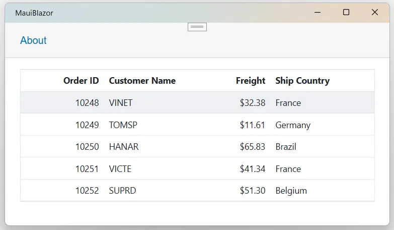

# Getting Started with Blazor DataGrid

This section explains you through the step-by-step process of integrating the [[Blazor DataGrid](https://www.syncfusion.com/blazor-components/blazor-datagrid)](https://www.syncfusion.com/blazor-components/blazor-datagrid) component in your Blazor MAUI App using both [Visual Studio](https://visualstudio.microsoft.com/vs/) and [Visual Studio Code](https://code.visualstudio.com/).

> **Ready to streamline your Syncfusion<sup style="font-size:70%">&reg;</sup> Blazor development?** <br/>Discover the full potential of Syncfusion<sup style="font-size:70%">&reg;</sup> Blazor components with Syncfusion<sup style="font-size:70%">&reg;</sup> AI Coding Assistants. Effortlessly integrate, configure, and enhance your projects with intelligent, context-aware code suggestions, streamlined setups, and real-time insights—all seamlessly integrated into your preferred AI-powered IDEs like VS Code, Cursor, Syncfusion<sup style="font-size:70%">&reg;</sup> CodeStudio and more. [Explore Syncfusion<sup style="font-size:70%">&reg;</sup> AI Coding Assistants](https://blazor.syncfusion.com/documentation/ai-coding-assistant/overview)





## Prerequisites

To use the MAUI project templates, install the Mobile development with the .NET extension for Visual Studio. For more details, refer to [here](https://learn.microsoft.com/en-us/dotnet/MAUI/get-started/installation?tabs=vswin) or the [Syncfusion® Blazor Extension](https://blazor.syncfusion.com/documentation/visual-studio-integration/template-studio).

## Create a new Blazor MAUI App in Visual Studio

Create a Blazor MAUI App using Visual Studio via [Microsoft Templates](https://learn.microsoft.com/en-us/dotnet/maui/get-started/first-app?pivots=devices-windows&view=net-maui-9.0&tabs=vswin). For detailed instructions, refer to the [Blazor MAUI App Getting Started](https://blazor.syncfusion.com/documentation/getting-started/maui-blazor-app) documentation.





## Prerequisites

To use the MAUI project templates, install the Mobile development with the .NET extension for Visual Studio Code. For more details, refer to [here](https://learn.microsoft.com/en-us/dotnet/maui/get-started/installation?view=net-maui-9.0&tabs=visual-studio-code) or the [Syncfusion® Blazor Extension](https://blazor.syncfusion.com/documentation/visual-studio-code-integration/create-project).

## Create a new Blazor MAUI App in Visual Studio Code

Create a Blazor MAUI App using Visual Studio Code via [Microsoft Templates](https://learn.microsoft.com/en-us/dotnet/maui/get-started/first-app?pivots=devices-windows&view=net-maui-9.0&tabs=visual-studio-code) or the [Syncfusion® Blazor Extension](https://blazor.syncfusion.com/documentation/visual-studio-code-integration/create-project). For detailed instructions, refer to the [Blazor MAUI App Getting Started](https://blazor.syncfusion.com/documentation/getting-started/maui-blazor-app) documentation.

Alternatively, create a MAUI application by using the following command in the integrated terminal (<kbd>Ctrl</kbd>+<kbd>`</kbd>).




dotnet new maui-blazor -o MauiBlazorApp
cd MauiBlazorApp








## Install Syncfusion<sup style="font-size:70%">&reg;</sup> Blazor packages

Install [Syncfusion.Blazor.Grid](https://www.nuget.org/packages/Syncfusion.Blazor.Grid) and [Syncfusion.Blazor.Themes](https://www.nuget.org/packages/Syncfusion.Blazor.Themes/) NuGet packages in your project using the NuGet Package Manager in Visual Studio (*Tools → NuGet Package Manager → Manage NuGet Packages for Solution*), or the integrated terminal in Visual Studio Code (`dotnet add package`).

Alternatively, run the following commands in the Package Manager Console to achieve the same.




Install-Package Syncfusion.Blazor.Grid -Version {{ site.releaseversion }}
Install-Package Syncfusion.Blazor.Themes -Version {{ site.releaseversion }}




N> All Syncfusion Blazor packages are available on [nuget.org](https://www.nuget.org/packages?q=syncfusion.blazor). See the [NuGet packages](https://blazor.syncfusion.com/documentation/nuget-packages) topic for details.

## Add import namespaces

After the packages are installed, open the **~/_Imports.razor** file and import the `Syncfusion.Blazor` and `Syncfusion.Blazor.Grids` namespaces.




@using Syncfusion.Blazor 
@using Syncfusion.Blazor.Grids




## Register Syncfusion<sup style="font-size:70%">&reg;</sup> Blazor service

Register the Syncfusion<sup style="font-size:70%">&reg;</sup> Blazor service in the **~/MauiProgram.cs** file.




....
using Syncfusion.Blazor;

....

public static class MauiProgram
{
    public static MauiApp CreateMauiApp()
    {
        ....
        builder.Services.AddSyncfusionBlazor();
        ....
    }
}




## Add stylesheet and script resources

The theme stylesheet and script can be accessed from NuGet through [Static Web Assets](https://blazor.syncfusion.com/documentation/appearance/themes#static-web-assets). Include the stylesheet and script references in the **~/index.html** file.

```html

<link href="_content/Syncfusion.Blazor.Themes/fluent2.css" rel="stylesheet" />
<script src="_content/Syncfusion.Blazor.Core/scripts/syncfusion-blazor.min.js" type="text/javascript"></script>

```

N> Check out the [Blazor Themes](https://blazor.syncfusion.com/documentation/appearance/themes) topic to discover various methods ([Static Web Assets](https://blazor.syncfusion.com/documentation/appearance/themes#static-web-assets), [CDN](https://blazor.syncfusion.com/documentation/appearance/themes#cdn-reference), and [CRG](https://blazor.syncfusion.com/documentation/common/custom-resource-generator)) for referencing themes in your Blazor application. Also, check out the [Adding Script Reference](https://blazor.syncfusion.com/documentation/common/adding-script-references) topic to learn different approaches for adding script references in your Blazor application. Refer to the [Style and Appearance](https://blazor.syncfusion.com/documentation/datagrid/style-and-appearance) topic for customizing the DataGrid appearance and styling options.

## Add Blazor DataGrid component

Add the Blazor DataGrid component in the **~/Pages/Home.razor** file.




@using Syncfusion.Blazor.Grids

<SfGrid DataSource="@OrderData">
    <GridColumns>
        <GridColumn Field=@nameof(OrderDetails.OrderID) HeaderText="Order ID" TextAlign="TextAlign.Right" Width="120"></GridColumn>
        <GridColumn Field=@nameof(OrderDetails.CustomerID) HeaderText="Customer Name" Width="120"></GridColumn>
        <GridColumn Field=@nameof(OrderDetails.Freight) HeaderText="Freight" Format="C2" TextAlign="TextAlign.Right" EditType="EditType.NumericEdit" Width="120"></GridColumn>
        <GridColumn Field=@nameof(OrderDetails.ShipCountry) HeaderText="Ship Country" EditType="EditType.DropDownEdit" Width="150"></GridColumn>
    </GridColumns>
</SfGrid>

@code {
    public List<OrderDetails> OrderData { get; set; }
    protected override void OnInitialized()
    {
        OrderData = OrderDetails.GetAllRecords();
    }
}


public class OrderDetails
{
    public static List<OrderDetails> Order = new List<OrderDetails>();
    public OrderDetails(int OrderID, string CustomerId, double Freight, string ShipCountry)
    {
        this.OrderID = OrderID;
        this.CustomerID = CustomerId;
        this.Freight = Freight;
        this.ShipCountry = ShipCountry;    
    }
    public static List<OrderDetails> GetAllRecords()
    {
        if (Order.Count == 0)
        {
            Order.Add(new OrderDetails(10248, "VINET", 32.38, "France"));
            Order.Add(new OrderDetails(10249, "TOMSP", 11.61, "Germany"));
            Order.Add(new OrderDetails(10250, "HANAR", 65.83, "Brazil"));
            Order.Add(new OrderDetails(10251, "VICTE", 41.34, "France"));
            Order.Add(new OrderDetails(10252, "SUPRD", 51.3, "Belgium"));
        }
        return Order;
    }
    public int OrderID { get; set; }
    public string CustomerID { get; set; }
    public double Freight { get; set; }
    public string ShipCountry { get; set; }
}




### How to run the sample on windows

Run the sample in Windows Machine mode, and it will run Blazor MAUI in Windows.



### How to run the sample on android

To run the Blazor DataGrid in a Blazor Android MAUI application using the Android emulator, follow these steps:

Refer [here](https://learn.microsoft.com/en-us/dotnet/maui/android/emulator/device-manager#android-device-manager-on-windows) to install and launch Android emulator.

N> If encounter any errors while using the Android Emulator, refer to the following link for troubleshooting guidance[Troubleshooting Android Emulator](https://learn.microsoft.com/en-us/dotnet/maui/android/emulator/troubleshooting).

